# 序章：LLM全景图与学习路径

> 本章将带你俯瞰大语言模型的完整技术版图，建立对LLM发展脉络的全局认知。理解"我们从哪里来，要到哪里去"，是深入学习任何技术的第一步。

---

## 目录

- [1. 语言模型发展简史](#1-语言模型发展简史)
- [2. LLM技术架构演进](#2-llm技术架构演进)
- [3. 主流模型族谱](#3-主流模型族谱)
- [4. Google的技术贡献](#4-google的技术贡献)
- [5. DeepSeek技术路线](#5-deepseek技术路线)
- [6. Anthropic技术路线](#6-anthropic技术路线)
- [7. 三条技术线对比](#7-三条技术线对比)
- [8. 本教程学习路径](#8-本教程学习路径)
- [9. 前置知识检查清单](#9-前置知识检查清单)

---

## 1. 语言模型发展简史

语言模型的核心任务是：**给定上文，预测下一个词**。这个看似简单的任务，却蕴含着深刻的数学原理和工程智慧。

### 1.1 三代语言模型的演进

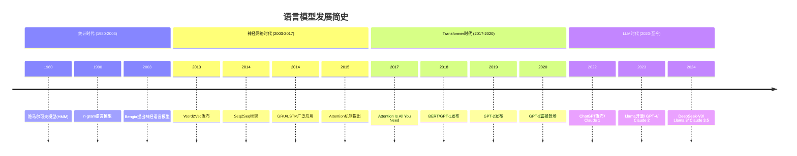

### 1.2 数学形式的演变

#### 第一代：统计语言模型 (n-gram)

给定词序列 $w_1, w_2, \ldots, w_n$，统计语言模型假设：

$$P(w_1, w_2, \ldots, w_n) = \prod_{i=1}^{n} P(w_i | w_1, \ldots, w_{i-1})$$

通过马尔可夫假设简化：

$$P(w_i | w_1, \ldots, w_{i-1}) \approx P(w_i | w_{i-k}, \ldots, w_{i-1})$$

**局限性**：
- 稀疏性问题：n-gram组合爆炸，大量概率为0
- 泛化能力差：无法捕捉语义相似性
- 长距离依赖：受限于n的大小

#### 第二代：神经语言模型

Bengio在2003年提出的神经概率语言模型开创性地引入**词嵌入**：

$$P(w_t | w_{t-n+1}, \ldots, w_{t-1}) = \frac{e^{f(w_t, w_{t-n+1}, \ldots, w_{t-1})}}{\sum_{w' \in V} e^{f(w', w_{t-n+1}, \ldots, w_{t-1})}}$$

其中 $f$ 是神经网络函数，将词序列映射为概率分布。

**关键创新**：
- 词的分布式表示（Word Embedding）
- 语义相似性通过向量空间距离度量
- 缓解稀疏性问题

#### 第三代：Transformer语言模型

Transformer通过**自注意力机制**实现了任意位置之间的信息交互：

$$\text{Attention}(Q, K, V) = \text{softmax}\left(\frac{QK^T}{\sqrt{d_k}}\right) V$$

其中：
- $Q = W_Q X$：Query矩阵
- $K = W_K X$：Key矩阵
- $V = W_V X$：Value矩阵
- $d_k$：Key的维度

**革命性优势**：
- 并行计算：打破RNN的序列依赖
- 长距离依赖：注意力机制直接建模
- 可扩展性：为大规模预训练奠定基础

### 1.3 为什么Transformer成功了？

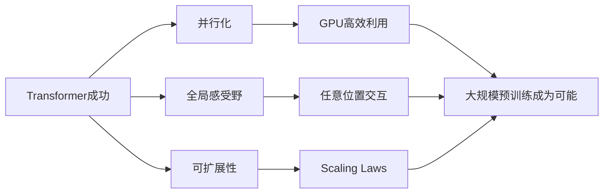

**核心原因分析**：

1. **计算效率**：RNN需要顺序计算，时间复杂度 $O(n)$；Transformer可并行，时间复杂度 $O(1)$（忽略矩阵运算的并行度）

2. **梯度流动**：RNN存在梯度消失/爆炸问题；Transformer残差连接保证梯度直达

3. **建模能力**：RNN的隐藏状态是信息瓶颈；Transformer的注意力可同时关注所有位置

4. **Scaling Laws**：Transformer的规模效应显著，更大的模型+更多数据=更强能力

---

## 2. LLM技术架构演进

### 2.1 架构分类图谱

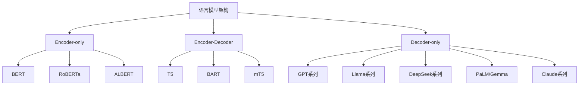

### 2.2 三种架构对比

| 特性 | Encoder-only | Encoder-Decoder | Decoder-only |
|------|--------------|-----------------|--------------|
| **代表模型** | BERT | T5 | GPT, Llama |
| **注意力类型** | 双向 | Encoder双向 + Decoder单向 | 单向（因果） |
| **预训练目标** | MLM | Span Corruption | Next Token Prediction |
| **擅长任务** | 理解、分类 | 翻译、生成 | 生成、对话 |
| **参数效率** | 高 | 中 | 低 |
| **生成能力** | 无 | 强 | 最强 |

### 2.3 为什么Decoder-only成为主流？

**理论原因**：

1. **因果注意力简化计算**：无需Encoder-Decoder交叉注意力

2. **自回归生成自然**：训练和推理目标一致

3. **Few-shot/Zero-shot能力**：GPT-3证明大规模Decoder-only模型具有涌现能力

4. **工程实现简洁**：单一架构，便于优化和扩展

**数学视角**：

设输入序列为 $X = (x_1, x_2, \ldots, x_n)$，Decoder-only的自回归目标为：

$$\mathcal{L} = -\sum_{t=1}^{n} \log P(x_t | x_{< t}; \theta)$$

这个目标函数与推理时的生成过程完全一致，避免了训练-推理不一致问题。

---

## 3. 主流模型族谱

### 3.1 开源模型族谱

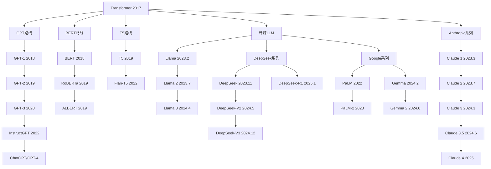

### 3.2 关键模型技术特征

| 模型 | 参数量 | 架构特点 | 训练数据 | 关键创新 |
|------|--------|----------|----------|----------|
| **GPT-3** | 175B | Decoder-only | 300B tokens | Few-shot Learning |
| **PaLM** | 540B | Decoder-only | 780B tokens | Pathways系统、CoT |
| **Llama** | 7-65B | Decoder-only | 1T tokens | 开源、高效训练 |
| **Llama 2** | 7-70B | Decoder-only | 2T tokens | RLHF、商业可用 |
| **Llama 3** | 8-405B | Decoder-only | 15T tokens | 大规模数据 |
| **DeepSeek-V2** | 236B(MoE) | MoE+MLA | 8.1T tokens | 细粒度MoE、MLA |
| **DeepSeek-V3** | 671B(MoE) | MoE+MLA | 14.8T tokens | DeepSeekMoE、DualPipe |
| **DeepSeek-R1** | 671B(MoE) | MoE+MLA | - | 强化学习推理 |
| **Gemma 2** | 2-27B | Decoder-only | 13T tokens | 知识蒸馏 |
| **Claude 3** | 未公开 | Decoder-only | 未公开 | Constitutional AI、RLAIF |
| **Claude 3.5** | 未公开 | Decoder-only | 未公开 | 安全对齐、长上下文 |

---

## 4. Google的技术贡献

Google在LLM发展史上扮演了极其重要的角色，本教程将重点学习其技术路线。

### 4.1 Google里程碑贡献

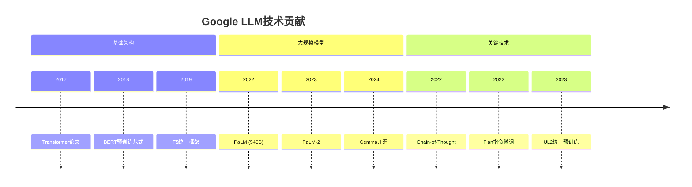

### 4.2 Transformer：一切的开端

**论文**：*Attention Is All You Need* (Vaswani et al., 2017)

**核心贡献**：

1. **自注意力机制**：

$$\text{SelfAttention}(X) = \text{softmax}\left(\frac{XX^T}{\sqrt{d}}\right)X$$

2. **多头注意力**：

$$\text{MultiHead}(Q,K,V) = \text{Concat}(\text{head}_1, \ldots, \text{head}_h)W^O$$

其中 $\text{head}_i = \text{Attention}(QW_i^Q, KW_i^K, VW_i^V)$

3. **位置编码**：

$$PE_{(pos, 2i)} = \sin\left(\frac{pos}{10000^{2i/d}}\right)$$

$$PE_{(pos, 2i+1)} = \cos\left(\frac{pos}{10000^{2i/d}}\right)$$

### 4.3 BERT：预训练-微调范式的开创

**论文**：*BERT: Pre-training of Deep Bidirectional Transformers* (Devlin et al., 2018)

**预训练任务**：

1. **Masked Language Model (MLM)**：

随机掩盖15%的token，预测被掩盖的词：

$$\mathcal{L}_{MLM} = -\sum_{i \in M} \log P(m_i | \tilde{x})$$

其中 $M$ 是被掩盖位置的集合。

2. **Next Sentence Prediction (NSP)**：

判断两个句子是否连续：

$$\mathcal{L}_{NSP} = -\log P(\text{IsNext} | s_A, s_B)$$

### 4.4 T5：Text-to-Text统一框架

**论文**：*Exploring the Limits of Transfer Learning* (Raffel et al., 2019)

**核心理念**：将所有NLP任务统一为文本生成任务。

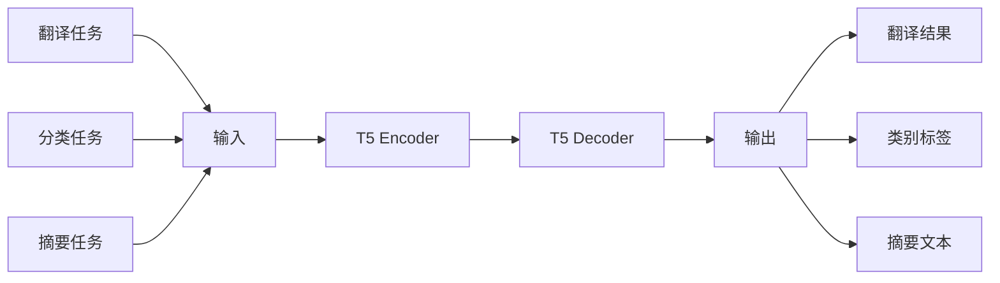

**Span Corruption预训练**：

输入：`The <X> sat on the <Y>.`
目标：`<X> cat <Y> mat`

### 4.5 PaLM：规模的力量

**论文**：*PaLM: Scaling Language Modeling with Pathways* (Chowdhery et al., 2022)

**关键创新**：

1. **Pathways系统**：实现6144块TPU的高效并行训练

2. **训练规模**：540B参数，780B tokens

3. **Chain-of-Thought**：发现LLM的推理能力

**PaLM的注意力优化**：

```python
# Multi-Query Attention (MQA)
# 所有注意力头共享同一组KV
# 减少KV Cache大小，加速推理
class MultiQueryAttention(nn.Module):
    def __init__(self, d_model, n_heads):
        self.n_heads = n_heads
        self.W_q = nn.Linear(d_model, d_model)
        self.W_k = nn.Linear(d_model, d_model // n_heads)  # 单头维度
        self.W_v = nn.Linear(d_model, d_model // n_heads)  # 单头维度
```

### 4.6 Gemma：Google的开源贡献

**特点**：

- 基于Gemini技术
- 提供多种规模（2B, 7B, 27B）
- 高效架构设计

**Gemma 2架构创新**：

1. **Sliding Window Attention**：局部注意力降低计算复杂度

2. **Logit Soft-capping**：稳定训练

$$\text{logits} = \tau \cdot \tanh\left(\frac{z}{\tau}\right)$$

---

## 5. DeepSeek技术路线

DeepSeek是近年来最值得关注的开源LLM之一，其技术创新对行业产生了深远影响。

### 5.1 DeepSeek模型演进

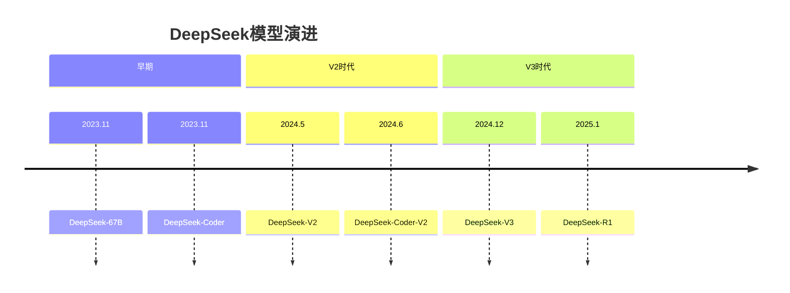

### 5.2 DeepSeek核心技术创新

#### 5.2.1 DeepSeekMoE：细粒度专家分割

传统MoE将专家分割为有限数量的大专家，DeepSeek提出**细粒度专家分割**：

**传统MoE**：

$$\text{output} = \sum_{i \in \text{TopK}} g_i \cdot E_i(x)$$

其中专家数量少（如8个），每个专家参数量大。

**DeepSeekMoE**：

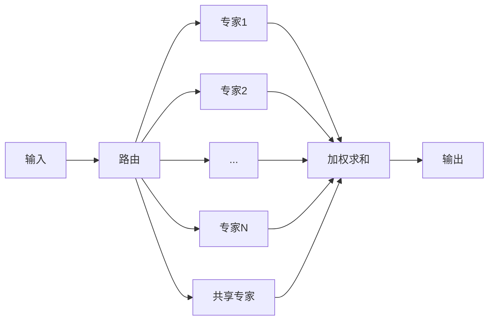

**创新点**：

1. **更多细粒度专家**：如256个小专家替代8个大专家

2. **共享专家机制**：部分专家被所有token使用，学习通用知识

3. **更灵活的路由**：每个token激活更多专家，信息流动更充分

**数学形式**：

$$\text{output} = \sum_{i=1}^{K_s} g_i^{(s)} \cdot E_i^{(s)}(x) + \sum_{i \in \text{TopK}_r} g_i^{(r)} \cdot E_i^{(r)}(x)$$

其中 $K_s$ 是共享专家数量，$\text{TopK}_r$ 是路由专家。

#### 5.2.2 MLA：多头潜在注意力

**问题**：传统注意力在推理时需要大量KV Cache。

**解决方案**：将KV压缩到低维潜在空间。

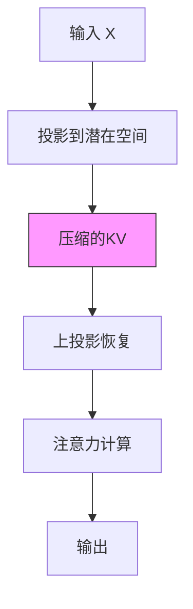

**数学形式**：

$$c_{KV} = W_{DKV} h_t$$ （压缩到潜在空间）

$$k_t = W_{UK} c_{KV}$$ （上投影得到Key）

$$v_t = W_{UV} c_{KV}$$ （上投影得到Value）

**优势**：

- KV Cache减少约93%（DeepSeek-V2）
- 推理效率大幅提升
- 保持模型性能

#### 5.2.3 DualPipe：高效流水线并行

**问题**：传统流水线并行存在"气泡"，GPU利用率低。

**解决方案**：双向流水线调度。

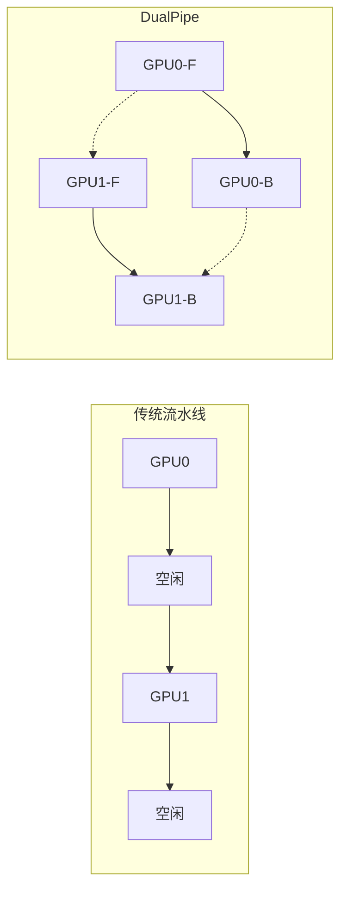

### 5.3 DeepSeek-R1：推理能力的突破

**DeepSeek-R1**展示了通过强化学习提升推理能力的新范式：

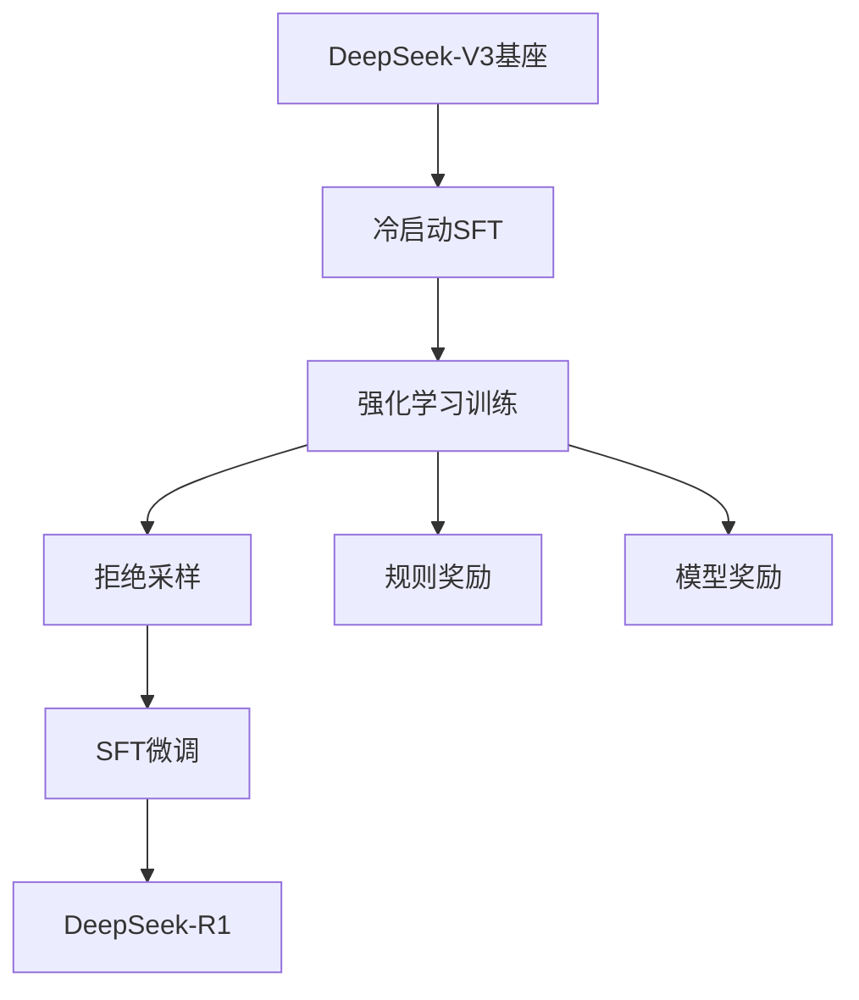

**关键发现**：

1. **CoT自然涌现**：模型在强化学习过程中自然发展出思维链能力

2. **无需人类标注**：通过规则奖励即可引导推理能力

3. **知识蒸馏**：可将推理能力迁移到小模型

---

## 6. Anthropic技术路线

Anthropic是LLM安全对齐领域的先驱，由前OpenAI研究副总裁Dario Amodei和Daniela Amodei于2021年创立。其核心理念是**安全优先的AI开发**（Safety-first AI development），在推动模型能力提升的同时，始终将安全性作为首要考量。

### 6.1 创立背景与核心理念

**创立动机**：
- 对AI安全问题的深切关注
- 认为需要一家**以安全研究为核心使命**的AI公司
- "Race to the Top" 理念：通过展示安全与能力可以兼得，引导行业良性竞争

**与其他公司的差异化**：

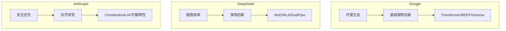

### 6.2 Claude模型演进

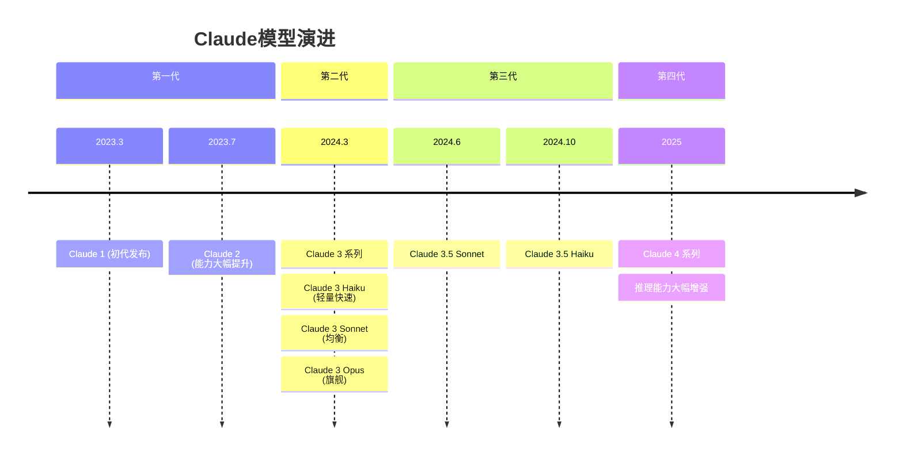

**多规格策略**：

| 模型 | 定位 | 特点 |
|------|------|------|
| Haiku | 轻量级 | 低延迟、低成本，适合高吞吐场景 |
| Sonnet | 均衡型 | 能力与成本的最佳平衡 |
| Opus | 旗舰级 | 最强能力，适合复杂推理任务 |

### 6.3 核心技术贡献

#### 6.3.1 Constitutional AI（宪法AI）

**核心思想**：用一组人类定义的**原则（Constitution）**替代大量人类标注，实现AI的自我对齐。

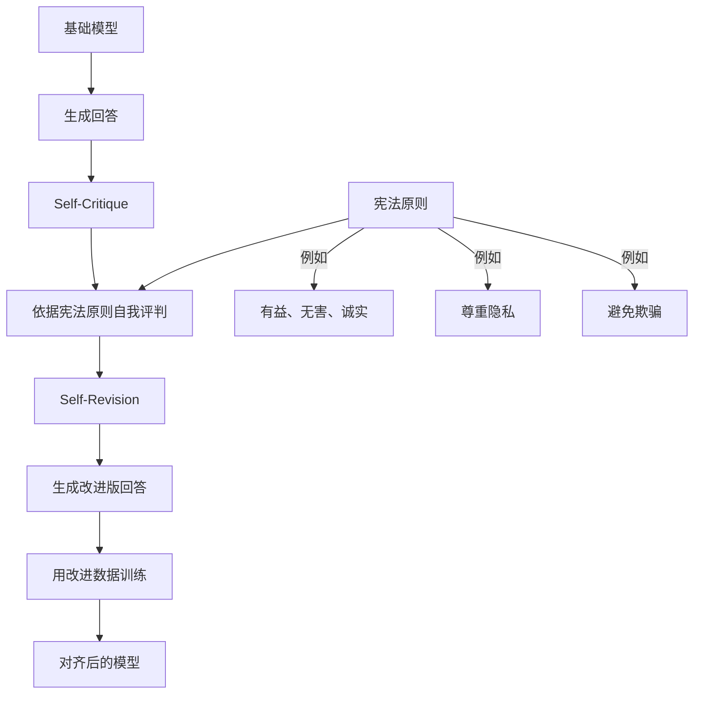

**关键论文**：Bai et al. (2022) - *Constitutional AI: Harmlessness from AI Feedback*

**创新点**：
1. **减少人工标注**：用AI反馈（RLAIF）替代部分人类反馈（RLHF）
2. **可控性**：通过修改宪法原则调整模型行为
3. **透明性**：模型的行为准则是显式的、可审查的

#### 6.3.2 RLAIF（AI反馈强化学习）

RLAIF是Constitutional AI的核心技术，用AI自身的判断替代人类偏好标注：

**传统RLHF**：
$$r_\text{human}(x, y) \leftarrow \text{人类标注者判断}$$

**RLAIF**：
$$r_\text{AI}(x, y) \leftarrow \text{AI根据宪法原则判断}$$

**优势**：
- 标注成本大幅降低
- 标注一致性更高
- 可快速迭代宪法原则

#### 6.3.3 可解释性研究（Mechanistic Interpretability）

Anthropic在**模型可解释性**领域的研究是其最具影响力的学术贡献之一。

**核心研究方向**：

1. **Transformer电路理论**（Transformer Circuits Thread）
   - 将Transformer理解为由可解释的"电路"组成的计算图
   - 论文：*A Mathematical Framework for Transformer Circuits* (Elhage et al., 2021)

2. **Induction Heads**（归纳头）
   - 发现注意力头的特定功能模式
   - 与In-Context Learning能力的关系
   - 论文：*In-context Learning and Induction Heads* (Olsson et al., 2022)

3. **Superposition**（叠加）假设
   - 模型在有限维度中编码超过维度数量的特征
   - 论文：*Toy Models of Superposition* (Elhage et al., 2022)

4. **稀疏自编码器（SAE）解读模型**
   - 用SAE提取模型内部的可解释特征
   - 论文：*Towards Monosemanticity* (Bricken et al., 2023)
   - 论文：*Scaling Monosemanticity* (Templeton et al., 2024)

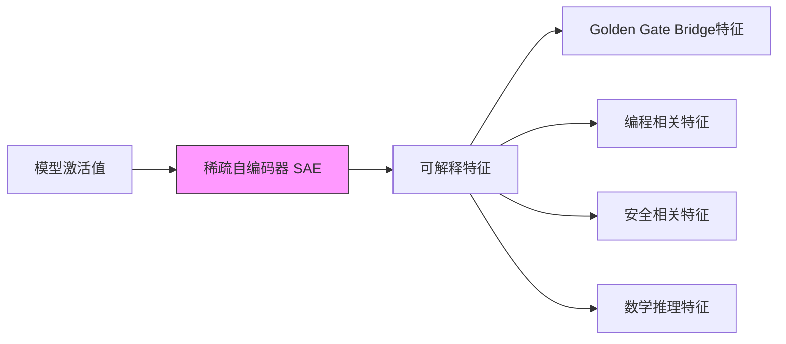

#### 6.3.4 HH-RLHF数据集

Anthropic开源了**Helpful and Harmless (HH-RLHF)** 数据集，为对齐研究提供了重要的公共资源：

- **规模**：约170K对话偏好对
- **维度**：有益性（Helpful）与无害性（Harmless）
- **格式**：每条数据包含一对回答（chosen vs rejected）
- **应用**：广泛用于RLHF和DPO研究

#### 6.3.5 Scaling Laws贡献

Anthropic在Scaling Laws领域有重要的实证研究：

- 验证了模型规模与能力之间的幂律关系
- 提出了**Responsible Scaling Policy**：基于模型能力等级制定安全措施
- 为"多大的模型需要多少安全措施"提供了理论框架

### 6.4 Anthropic的技术特色

**闭源但学术开放**：
- Claude模型不开源，但大量发表高质量研究论文
- 可解释性研究成果对整个领域影响深远
- HH-RLHF等关键数据集开源

**安全对齐的系统化方法**：
- Constitutional AI → RLAIF → 可解释性 → 安全评估 形成完整闭环
- 不仅追求"让模型更有用"，更追求"理解模型为什么这样做"

> **注意**：由于Claude模型不开源，部分技术细节基于Anthropic的公开论文和博客。对于推测性内容，本教程会明确标注。

---

## 7. 三条技术线对比

### 7.1 技术路线对比

| 维度 | Google | DeepSeek | Anthropic |
|------|--------|----------|-----------|
| **核心定位** | 基础架构创新者 | 极致效率追求者 | 安全对齐先驱 |
| **代表模型** | Gemini / Gemma | DeepSeek-V3 / R1 | Claude 系列 |
| **架构创新** | Transformer, MQA→GQA | MoE, MLA, DualPipe | 未公开（研究重点在对齐） |
| **训练方法** | 大规模TPU集群 | FP8混合精度, 高效并行 | Constitutional AI, RLAIF |
| **对齐方法** | RLHF + 指令微调 | GRPO, 规则奖励 | Constitutional AI, RLAIF |
| **开源策略** | 部分开源(Gemma) | 完全开源 | 闭源(研究论文开放) |
| **推理能力** | Gemini思考模式 | R1推理模型 | Claude扩展思考 |

### 7.2 各公司的核心贡献总结

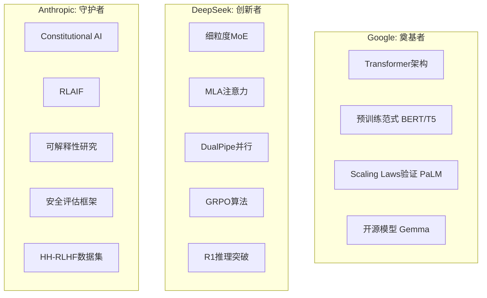

### 7.3 本教程中三条技术线的呈现

| 模块 | Google | DeepSeek | Anthropic |
|------|--------|----------|-----------|
| 分词 | SentencePiece / Gemma 256k词表 | 中英文平衡分词 | 分词器特性分析 |
| 嵌入 | 正弦位置编码 / T5 Relative PE | RoPE工程实践 / YaRN | Superposition假设 |
| Transformer | 原始架构 / PaLM优化 | MoE中的Block变体 | 电路理论 / Induction Heads |
| 注意力 | MQA → GQA | MLA | 注意力可解释性 |
| 预训练 | PaLM/Gemini训练策略 | FP8训练 / 多阶段训练 | Scaling Laws实证 |
| SFT | FLAN / Gemma-IT | DeepSeek SFT策略 | Red Teaming数据 |
| RLHF | 多维奖励建模 | GRPO | Constitutional AI / RLAIF / HH-RLHF |
| DPO | 偏好优化实践 | GRPO完整技术 | RLAIF + DPO组合 |
| 推理 | Gemini推理 / AlphaProof | R1推理模型 | Claude推理与安全 |

---

## 8. 本教程学习路径

### 6.1 整体路线图

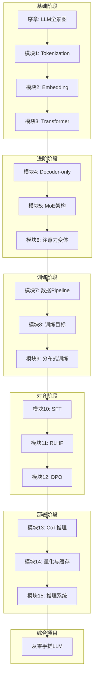

### 6.2 各模块学习目标

| 阶段 | 模块 | 学习目标 | 产出 |
|------|------|----------|------|
| **基础** | Tokenization | 理解分词原理，实现BPE | 自定义tokenizer |
| **基础** | Embedding | 掌握位置编码，实现RoPE | Embedding层 |
| **基础** | Transformer | 深入理解注意力机制 | 完整Transformer |
| **进阶** | Decoder-only | 掌握主流LLM架构 | GPT/Llama实现 |
| **进阶** | MoE | 理解混合专家架构 | MoE层实现 |
| **进阶** | 注意力变体 | 实现GQA/MLA | 高效注意力 |
| **训练** | 数据Pipeline | 构建数据处理流程 | 数据清洗脚本 |
| **训练** | 训练目标 | 理解LM目标函数 | 训练循环 |
| **训练** | 分布式训练 | 掌握并行策略 | 分布式训练脚本 |
| **对齐** | SFT | 实现监督微调 | SFT模型 |
| **对齐** | RLHF | 理解PPO算法 | 奖励模型+PPO |
| **对齐** | DPO | 实现偏好优化 | DPO训练 |
| **部署** | CoT | 实现思维链推理 | 推理pipeline |
| **部署** | 量化 | 实现模型量化 | 量化模型 |
| **部署** | 推理系统 | 部署vLLM服务 | 推理服务 |

### 6.3 综合项目概览

**目标**：从零训练一个约300M-1B参数的对话模型

**技术栈**：

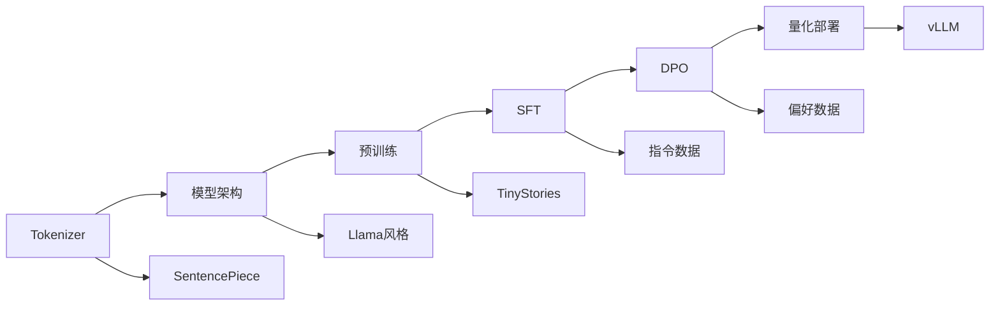

**预期产出**：

1. 完整的预训练模型
2. SFT微调后的对话模型
3. DPO对齐后的最终模型
4. 量化部署的推理服务
5. 详细的技术报告

---

## 9. 前置知识检查清单

在开始学习之前，请确保你已经掌握以下知识：

### 7.1 数学基础

- [ ] **线性代数**
  - 矩阵运算（乘法、转置、逆）
  - 特征值与特征向量
  - 向量空间与基
  - 张量运算

- [ ] **微积分**
  - 导数与偏导数
  - 链式法则
  - 梯度下降
  - 积分（用于概率分布）

- [ ] **概率与统计**
  - 条件概率与贝叶斯定理
  - 常见分布（高斯、泊松、多项式）
  - 期望与方差
  - 最大似然估计
  - KL散度与交叉熵

### 7.2 深度学习基础

- [ ] **神经网络**
  - 前向传播与反向传播
  - 激活函数
  - 损失函数（交叉熵、MSE）
  - 优化器

- [ ] **正则化技术**
  - Dropout
  - Batch Normalization
  - Layer Normalization
  - Weight Decay

- [ ] **训练技巧**
  - 学习率调度
  - 梯度裁剪
  - Early Stopping

### 7.3 PyTorch基础

- [ ] **核心操作**
  - Tensor创建与操作
  - 自动微分
  - nn.Module
  - DataLoader

- [ ] **模型训练**
  - 训练循环编写
  - 模型保存与加载
  - GPU加速

### 7.4 自测题

**线性代数**：

设 $A \in \mathbb{R}^{n \times n}$，$x \in \mathbb{R}^n$，请解释 $Ax$ 的几何意义。

<details>
<summary>点击查看答案</summary>
$Ax$ 表示对向量 $x$ 进行线性变换，变换矩阵 $A$ 将 $x$ 映射到新的空间。如果 $x$ 是 $A$ 的特征向量，则 $Ax = \lambda x$，即方向不变，仅伸缩 $\lambda$ 倍。
</details>

**概率论**：

设 $P(x)$ 是离散概率分布，证明交叉熵 $H(P, Q) = -\sum_x P(x) \log Q(x) \geq H(P)$。

<details>
<summary>点击查看答案</summary>
由KL散度非负性：$D_{KL}(P \| Q) = \sum_x P(x) \log \frac{P(x)}{Q(x)} \geq 0$

展开得：$\sum_x P(x) \log P(x) - \sum_x P(x) \log Q(x) \geq 0$

即：$-\sum_x P(x) \log Q(x) \geq -\sum_x P(x) \log P(x) = H(P)$
</details>

**深度学习**：

写出Softmax函数及其梯度的数学表达式。

<details>
<summary>点击查看答案</summary>

Softmax函数：
$$\text{softmax}(z_i) = \frac{e^{z_i}}{\sum_{j=1}^{K} e^{z_j}}$$

梯度（对于输入 $z_k$）：
$$\frac{\partial \text{softmax}(z_i)}{\partial z_k} = \text{softmax}(z_i)(\delta_{ik} - \text{softmax}(z_k))$$

其中 $\delta_{ik}$ 是Kronecker delta。
</details>

---

## 10. 本章小结

本章建立了LLM的宏观认知框架：

1. **历史脉络**：从n-gram到Transformer，理解技术演进的内在逻辑
2. **架构选择**：Decoder-only成为主流的原因和优势
3. **模型族谱**：主流开源模型的技术特征和创新点
4. **Google贡献**：Transformer、BERT、T5、PaLM奠定技术基础
5. **DeepSeek创新**：MoE、MLA、DualPipe代表的最前沿实践
6. **Anthropic守护**：Constitutional AI、可解释性研究引领安全对齐
7. **三线并行**：Google（基础）、DeepSeek（效率）、Anthropic（安全）三条技术线贯穿全教程

**下一章预告**：[模块1: Tokenization](../01_tokenization/README.md) - 我们将深入分词算法的数学原理，并从零实现一个BPE分词器。

---

## 参考资料

### 论文

1. Vaswani et al. (2017). *Attention Is All You Need*.
2. Devlin et al. (2018). *BERT: Pre-training of Deep Bidirectional Transformers*.
3. Raffel et al. (2019). *Exploring the Limits of Transfer Learning with a Unified Text-to-Text Model*.
4. Chowdhery et al. (2022). *PaLM: Scaling Language Modeling with Pathways*.
5. Touvron et al. (2023). *LLaMA: Open and Efficient Foundation Language Models*.
6. DeepSeek-AI (2024). *DeepSeek-V2: A Strong, Economical, and Efficient Mixture-of-Experts Language Model*.
7. DeepSeek-AI (2024). *DeepSeek-V3 Technical Report*.
8. DeepSeek-AI (2025). *DeepSeek-R1: Incentivizing Reasoning Capability in LLMs via Reinforcement Learning*.
9. Bai et al. (2022). *Constitutional AI: Harmlessness from AI Feedback*. Anthropic.
10. Bai et al. (2022). *Training a Helpful and Harmless Assistant with RLHF*. Anthropic.
11. Elhage et al. (2021). *A Mathematical Framework for Transformer Circuits*. Anthropic.
12. Olsson et al. (2022). *In-context Learning and Induction Heads*. Anthropic.
13. Elhage et al. (2022). *Toy Models of Superposition*. Anthropic.
14. Bricken et al. (2023). *Towards Monosemanticity: Decomposing Language Models With Dictionary Learning*. Anthropic.
15. Templeton et al. (2024). *Scaling Monosemanticity*. Anthropic.

### 博客与教程

1. [The Illustrated Transformer](https://jalammar.github.io/illustrated-transformer/)
2. [The Annotated Transformer](https://nlp.seas.harvard.edu/annotated-transformer/)
3. [Andrej Karpathy: Let's build GPT](https://www.youtube.com/watch?v=kCc8FmEb1nY)
4. [Lilian Weng: Transformer Family](https://lilianweng.github.io/posts/2020-04-07-the-transformer-family/)
