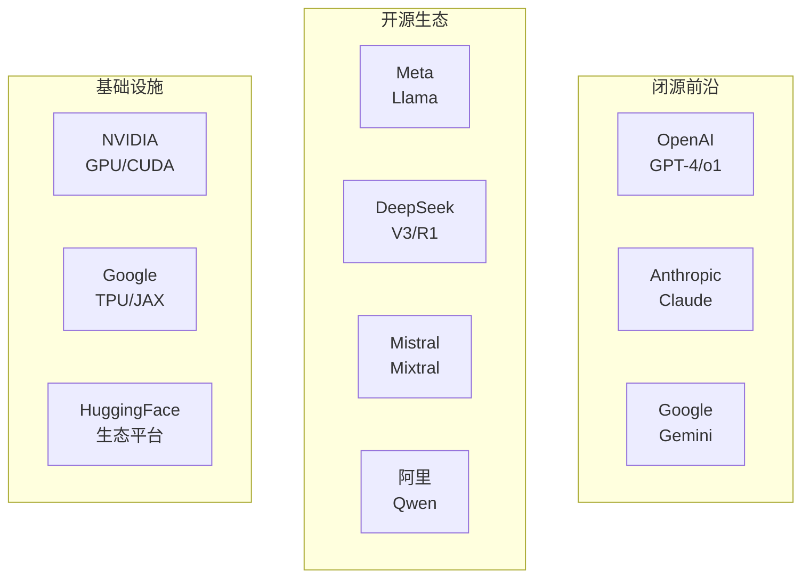
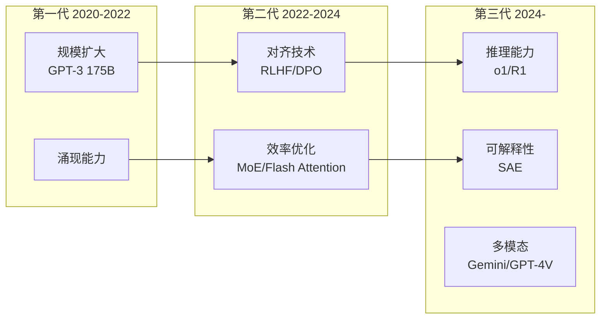
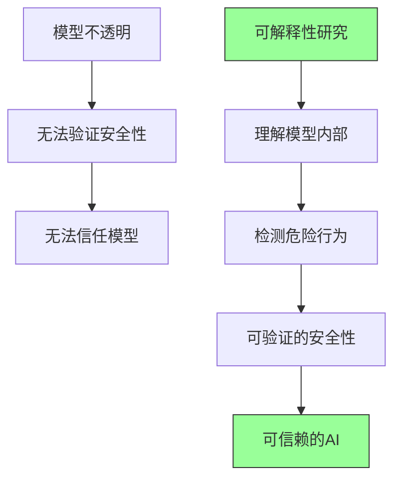
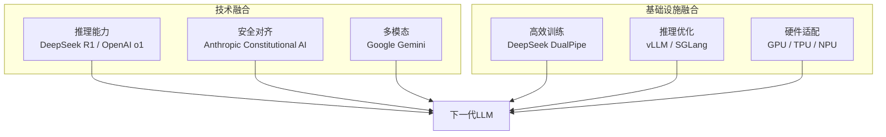

# 序章进阶：LLM产业格局与前沿趋势

> 本文是 [序章](./README.md) 的进阶补充，深入分析LLM产业格局、三大技术路线的战略差异，以及未来发展趋势。

---

## 目录

- [1. LLM产业格局深度分析](#1-llm产业格局深度分析)
- [2. Scaling Laws的实证与争议](#2-scaling-laws的实证与争议)
- [3. Anthropic安全研究哲学](#3-anthropic安全研究哲学)
- [4. 开源与闭源之争](#4-开源与闭源之争)
- [5. 三大技术路线的未来走向](#5-三大技术路线的未来走向)

---

## 1. LLM产业格局深度分析

### 1.1 主要玩家定位

LLM领域形成了多极化的竞争格局，每家公司占据不同的生态位：

### 1.2 各公司差异化策略

| 公司 | 核心策略 | 竞争壁垒 | 商业模式 |
|------|----------|----------|----------|
| OpenAI | 产品先发优势 | 品牌认知、用户生态 | API服务、订阅 |
| Google | 全栈垂直整合 | TPU、数据、搜索集成 | 云服务、搜索增强 |
| Anthropic | 安全差异化 | 对齐技术、企业信任 | API服务、企业合作 |
| Meta | 开源生态构建 | Llama社区、推理优化 | 间接商业价值 |
| DeepSeek | 效率极致化 | 架构创新、成本优势 | 开源+API服务 |

### 1.3 技术代际特征

---

## 2. Scaling Laws的实证与争议

### 2.1 经典Scaling Laws

**Kaplan et al. (2020)** 发现模型损失与三个因素呈幂律关系：

$$L(N) = \left(\frac{N_c}{N}\right)^{\alpha_N}, \quad \alpha_N \approx 0.076$$

$$L(D) = \left(\frac{D_c}{D}\right)^{\alpha_D}, \quad \alpha_D \approx 0.095$$

$$L(C) = \left(\frac{C_c}{C}\right)^{\alpha_C}, \quad \alpha_C \approx 0.050$$

其中 $N$ 是参数量，$D$ 是数据量，$C$ 是计算量。

### 2.2 Chinchilla修正

**Hoffmann et al. (2022)** 发现原始Scaling Laws高估了模型大小的重要性：

**最优分配**：给定计算预算 $C$，最优的参数量 $N^*$ 和数据量 $D^*$ 满足：

$$N^* \propto C^{0.50}, \quad D^* \propto C^{0.50}$$

即参数量和数据量应**等比例增长**。

**实践影响**：
- GPT-3 (175B参数, 300B tokens) → 按Chinchilla法则应使用 ~3.5T tokens
- Llama (7-65B参数, 1-1.4T tokens) → 大幅过训练，但推理更高效
- DeepSeek-V3 (671B参数, 14.8T tokens) → 极致过训练策略

### 2.3 过训练（Over-Training）的兴起

现代实践中，**过训练**（使用远超Chinchilla最优的数据量）成为主流：

| 模型 | 参数量 | 训练tokens | Chinchilla最优tokens | 过训练倍数 |
|------|--------|-----------|---------------------|-----------|
| Llama 1 | 7B | 1T | ~140B | ~7x |
| Llama 2 | 7B | 2T | ~140B | ~14x |
| Llama 3 | 8B | 15T | ~160B | ~94x |

**原因分析**：
1. **推理成本优化**：更小的模型推理更快、更便宜
2. **部署约束**：边缘设备对模型大小有严格限制
3. **数据充裕**：互联网文本数据远比训练计算更便宜

### 2.4 Anthropic的Scaling Laws贡献

Anthropic在Scaling Laws领域有重要的实证研究：

1. **验证可预测性**：在多个任务上验证了幂律关系的稳健性
2. **安全含义**：利用Scaling Laws预测何时模型可能具备危险能力
3. **Responsible Scaling Policy**：基于模型能力等级（ASL）制定安全措施
   - ASL-1: 无明显风险
   - ASL-2: 当前大型模型的风险水平
   - ASL-3: 显著提升的风险，需要更强安全措施
   - ASL-4+: 需要前所未有的安全协议

---

## 3. Anthropic安全研究哲学

### 3.1 核心理念："Race to the Top"

Anthropic提出了**"Race to the Top"**概念：

> 与其寄希望于所有公司同时放慢脚步（几乎不可能），不如**证明安全与能力可以兼得**，从而激励其他公司也采用安全实践。

这一理念体现在：
- 投入大量资源在对齐研究上，而非仅追求性能
- 公开发表安全研究成果，推动行业标准
- 提出可操作的安全框架（如Responsible Scaling Policy）

### 3.2 对齐税（Alignment Tax）

**对齐税**是Anthropic提出的核心概念：

$$\text{Alignment Tax} = \frac{\text{对齐模型的训练成本}}{\text{未对齐模型的训练成本}} - 1$$

Anthropic的目标是**最小化对齐税**：

- Constitutional AI通过减少人工标注降低成本
- RLAIF进一步用AI反馈替代人类反馈
- 理想状态：对齐税趋近于零，安全性成为"免费"的附加属性

### 3.3 可解释性的战略意义

Anthropic将可解释性视为**安全的基石**：

**研究路径**：
1. **理论框架**：Transformer电路理论（理解模型如何计算）
2. **工具开发**：稀疏自编码器（SAE）提取可解释特征
3. **应用验证**：在实际模型中发现并理解特定行为

### 3.4 Constitutional AI的哲学基础

Constitutional AI的设计反映了一种**基于原则的伦理框架**：

- 不依赖"人类标注者认为什么是好的"（可能有偏见）
- 而是依赖"明确的原则认为什么是好的"（可审查、可修改）
- 这类似于法律体系：具体案例由宪法原则指导，而非逐案人工判断

---

## 4. 开源与闭源之争

### 4.1 当前格局

| 阵营 | 代表 | 论据 |
|------|------|------|
| **闭源** | OpenAI, Anthropic | 安全考量、商业壁垒、防止滥用 |
| **开源** | Meta, DeepSeek, Mistral | 推动创新、民主化AI、安全审计 |
| **半开源** | Google (Gemma) | 开源小模型、闭源旗舰 |

### 4.2 两种路线的权衡

**开源优势**：
- 社区审计提升安全性
- 加速学术研究
- 降低使用门槛
- 推动工程优化（如vLLM、llama.cpp）

**闭源优势**：
- 防止恶意使用
- 保护商业投资
- 统一安全控制
- 更快迭代（无需考虑社区兼容）

### 4.3 DeepSeek开源的影响

DeepSeek-V3和R1的完全开源（MIT许可证）对行业产生了深远影响：

1. **效率透明**：公开了FP8训练、MLA等高效技术的实现
2. **成本民主化**：证明了以较低成本训练顶级模型的可行性
3. **推理范式传播**：R1的推理训练方法被广泛复现

---

## 5. 三大技术路线的未来走向

### 5.1 Google：全栈整合 + 多模态

**趋势**：
- TPU → Trillium：持续优化硬件基础设施
- Gemini多模态：文本+图像+音频+视频统一模型
- 搜索集成：AI与搜索引擎深度融合
- 端侧部署：Gemma/Gemini Nano在手机端运行

### 5.2 DeepSeek：效率边界 + 推理深化

**趋势**：
- 架构创新持续：MoE和MLA的进一步优化
- 推理能力深化：R1范式的迭代改进
- 训练效率极致化：更低成本训练更强模型
- 开源生态扩展：工具链和社区建设

### 5.3 Anthropic：安全对齐 + 可解释性

**趋势**：
- 可解释性工程化：从研究工具到生产工具
- 对齐技术成熟化：Constitutional AI的迭代改进
- 安全评估标准化：推动行业安全基准
- 能力与安全共同提升：证明"Race to the Top"的可行性

### 5.4 行业融合趋势

---

## 参考资料

### 论文
1. Kaplan et al. (2020). *Scaling Laws for Neural Language Models*.
2. Hoffmann et al. (2022). *Training Compute-Optimal Large Language Models*. (Chinchilla)
3. Bai et al. (2022). *Constitutional AI: Harmlessness from AI Feedback*. Anthropic.
4. Bai et al. (2022). *Training a Helpful and Harmless Assistant with RLHF*. Anthropic.
5. Elhage et al. (2021). *A Mathematical Framework for Transformer Circuits*. Anthropic.
6. Bricken et al. (2023). *Towards Monosemanticity*. Anthropic.
7. Templeton et al. (2024). *Scaling Monosemanticity*. Anthropic.

### 博客
1. [Anthropic Research](https://www.anthropic.com/research)
2. [Transformer Circuits Thread](https://transformer-circuits.pub/)
3. [Anthropic: Core Views on AI Safety](https://www.anthropic.com/core-views-on-ai-safety)
4. [Responsible Scaling Policy](https://www.anthropic.com/responsible-scaling-policy)
