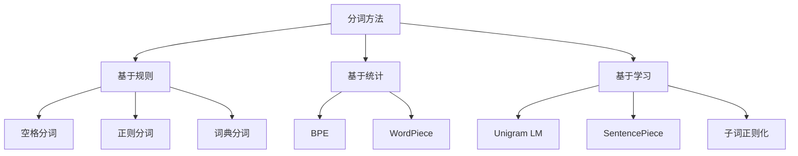
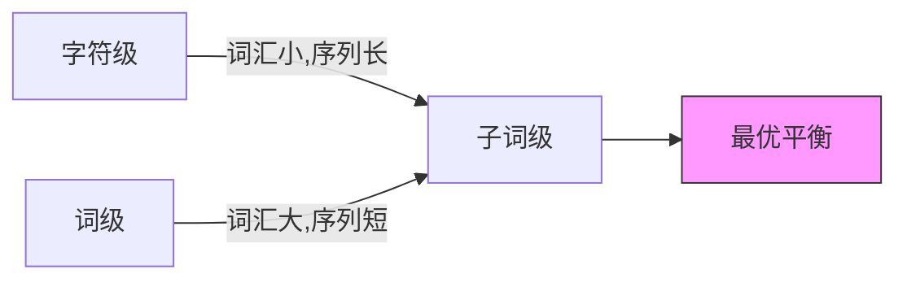
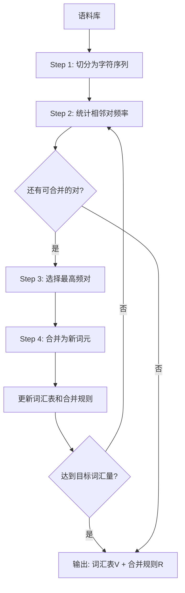
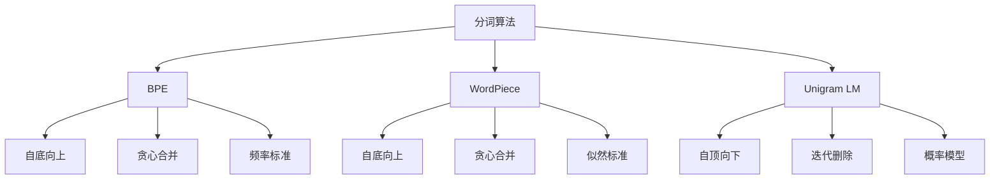
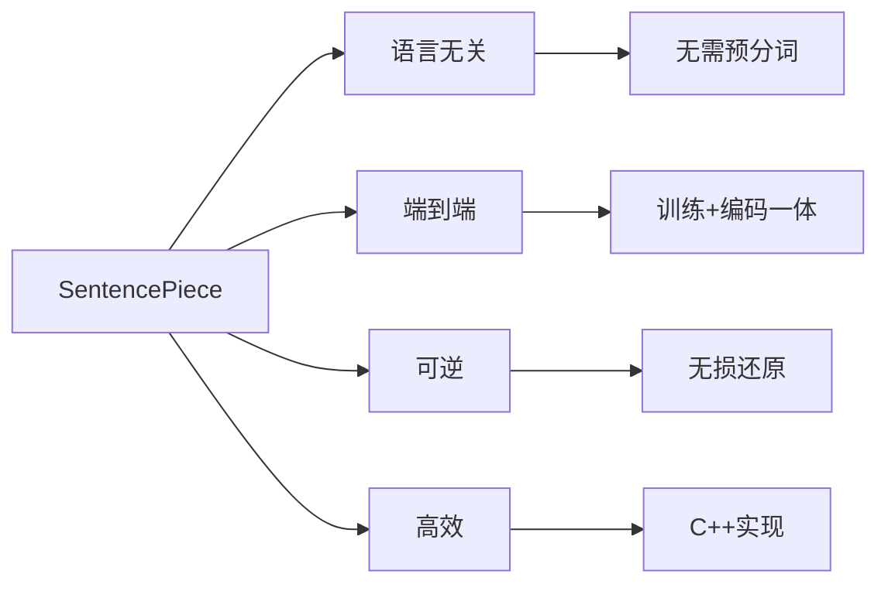
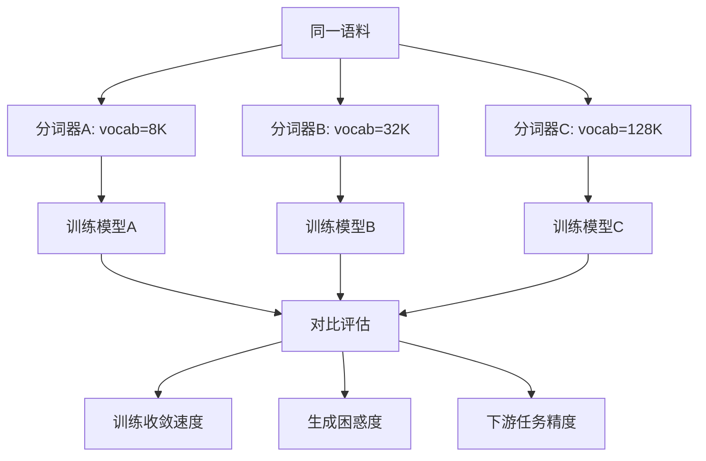

# 模块1：Tokenization——从文本到词元

> 分词是LLM的第一道门：将连续的文本流切分为离散的词元序列。这看似简单的操作，却深刻影响着模型的词汇量、序列长度、泛化能力和推理效率。本章将深入分词算法的数学原理，并从零实现工业级分词器。

---

## 目录

- [1. 分词问题的数学形式化](#1-分词问题的数学形式化)
- [2. 字符级与词级分词](#2-字符级与词级分词)
- [3. Byte Pair Encoding (BPE)](#3-byte-pair-encoding-bpe)
- [4. WordPiece算法](#4-wordpiece算法)
- [5. Unigram Language Model](#5-unigram-language-model)
- [6. SentencePiece：Google的工业实践](#6-sentencepiecegoogle的工业实践)
- [7. 现代LLM的分词策略](#7-现代llm的分词策略)
- [8. 从零实现BPE分词器](#8-从零实现bpe分词器)
- [9. 项目实践](#9-项目实践)

---

## 1. 分词问题的数学形式化

### 1.1 问题定义

给定文本序列 $T = (t_1, t_2, \ldots, t_n)$，分词问题可以形式化为：

$$\text{Tokenize}: T \rightarrow (w_1, w_2, \ldots, w_m)$$

其中 $w_i \in V$，$V$ 是词汇表。

**核心目标**：

1. **最小化序列长度**：减少计算复杂度 $O(m^2)$ 或 $O(m)$（取决于注意力实现）
2. **最大化语义完整性**：每个词元承载有意义的语义信息
3. **处理未登录词（OOV）**：任何输入都能被分词
4. **高效编码**：压缩文本，降低序列长度

### 1.2 分词方法的分类



### 1.3 信息论视角

从信息论角度，分词是一个**编码过程**：

$$H(T) = -\sum_{w \in V} P(w) \log P(w)$$

理想的分词应该：

1. **最小化平均编码长度**：
$$\bar{L} = \sum_{w \in V} P(w) \cdot \text{len}(w)$$

2. **保持熵不变**：
$$H(T_{\text{tokenized}}) \approx H(T_{\text{original}})$$

3. **最大化互信息**：
$$I(W; T) = H(T) - H(T|W)$$

其中 $W$ 是词元序列，$T$ 是原始文本。

---

## 2. 字符级与词级分词

### 2.1 字符级分词

**方法**：将每个字符作为一个词元。

**优点**：
- 词汇表极小（英文约256个字符）
- 无OOV问题

**缺点**：
- 序列极长，计算开销大
- 语义粒度太细

**数学分析**：

设字符集大小为 $|\Sigma| = 256$，文本长度为 $n$：

- 词汇表大小：$|V| = 256$
- 序列长度：$m = n$
- 注意力复杂度：$O(n^2)$

### 2.2 词级分词

**方法**：按空格和标点切分为完整词汇。

**优点**：
- 语义完整
- 序列短

**缺点**：
- 词汇表巨大（可能数百万）
- OOV问题严重
- 无法处理形态丰富的语言

**数学分析**：

设词汇表大小为 $|V|$，平均词长为 $\bar{l}$：

- 词汇表大小：$|V| \approx O(10^6)$
- 序列长度：$m \approx n / \bar{l}$
- Embedding参数：$|V| \times d$

### 2.3 子词分词：最佳折中

**核心思想**：介于字符和词之间，根据频率自动学习最优粒度。



**子词分词的优势**：

1. **词表大小可控**：通常 $|V| \in [10^4, 10^5]$
2. **无OOV问题**：未知词可分解为子词
3. **序列长度适中**：比字符级短 $2-5$ 倍
4. **语义保留**：常见词作为整体，罕见词分解

---

## 3. Byte Pair Encoding (BPE)

### 3.1 算法原理

BPE最初是一种数据压缩算法，2016年被Sennrich等人引入NLP领域用于子词分词。

**核心思想**：迭代合并最高频的相邻词元对。

### 3.2 算法详解

**输入**：语料库 $\mathcal{C} = \{s_1, s_2, \ldots, s_N\}$

**输出**：词汇表 $V$ 和合并规则 $R$

**算法流程**：



**算法流程**：

```
算法：BPE训练
输入：语料库 C, 目标词汇量 V_size
输出：词汇表 V, 合并规则 R

1. 初始化：
   V ← 所有唯一字符
   将语料库中每个词切分为字符序列
   
2. while |V| < V_size do:
   a. 统计所有相邻词元对的频率
   b. 选择频率最高的对 (x, y)
   c. 将 x, y 合并为新词元 z = xy
   d. V ← V ∪ {z}
   e. R ← R ∪ {(x, y) → z}
   f. 更新语料库中的所有 x y 为 z
   
3. return V, R
```

### 3.3 数学推导

**目标函数**：最小化编码长度

$$\mathcal{L}(V) = -\sum_{w \in V} c(w) \log_2 |V|$$

其中 $c(w)$ 是词元 $w$ 的出现次数。

**合并规则的选择**：贪心选择频率最高的对

$$(x^*, y^*) = \arg\max_{(x,y)} c(x, y)$$

其中 $c(x, y)$ 是相邻对 $(x, y)$ 的共现次数。

**为什么贪心有效？**

设合并 $(x, y) \rightarrow z$ 后的词汇表为 $V'$，编码长度变化为：

$$\Delta L = L(V') - L(V) = c(x,y) \cdot \log_2 \frac{|V'|}{|V|} - c(x,y) \cdot \log_2 \frac{|V'|}{|V|}$$

简化后，每次合并减少的编码长度：

$$\Delta L = -c(x, y) \cdot \log_2 \left(1 + \frac{1}{|V|}\right)$$

因此，选择 $c(x, y)$ 最大的对可以最大化编码压缩。

### 3.4 详细示例

**语料库**：`"low low low low lower newest widest"`

**Step 0：初始化为字符序列**

```
词汇表：{l, o, w, e, r, n, s, t, i, d}

文本表示：
low → ['l', 'o', 'w']
lower → ['l', 'o', 'w', 'e', 'r']
newest → ['n', 'e', 'w', 'e', 's', 't']
widest → ['w', 'i', 'd', 'e', 's', 't']
```

**Step 1：统计相邻对频率**

```
(l, o) → 5 次
(o, w) → 5 次
(w, e) → 2 次
(e, s) → 2 次
(s, t) → 2 次
...
```

**Step 2：合并最高频对 → **

```
新词元：'lo'
词汇表：{l, o, w, e, r, n, s, t, i, d, 'lo'}

更新文本：
low → ['lo', 'w']
lower → ['lo', 'w', 'e', 'r']
...
```

**Step 3：继续合并**

```
合并 → 'low'
合并 → 'new'
合并 → 'est'
合并 → 'newest'
...
```

**最终词汇表**：`{low, lo, w, e, r, n, s, t, i, d, est, newest, ...}`

### 3.5 BPE编码过程

训练完成后，对新文本进行分词：

```python
def tokenize(text, merges):
    """使用BPE规则对文本进行分词"""
    # 1. 切分为字符
    tokens = list(text)
    
    # 2. 按优先级应用合并规则
    for (a, b), merged in merges:
        i = 0
        while i < len(tokens) - 1:
            if tokens[i] == a and tokens[i+1] == b:
                tokens = tokens[:i] + [merged] + tokens[i+2:]
            else:
                i += 1
    
    return tokens
```

### 3.6 Byte-level BPE

GPT-2引入了**Byte-level BPE**，将文本先编码为字节序列，再进行BPE。

**优势**：

1. **真正的无OOV**：任何Unicode字符都能表示
2. **词汇表大小可控**：基础词汇表只有256个字节
3. **跨语言通用**：不依赖特定语言的字符集

**数学形式**：

设字节序列为 $B = (b_1, b_2, \ldots, b_n)$，BPE在字节级别操作：

$$\text{ByteBPE}: B \rightarrow (t_1, t_2, \ldots, t_m)$$


**GPT-2词汇表构建**：

```python
# 基础词汇表：256个字节
base_vocab = bytes(range(256))

# 添加特殊字符的可读表示
# 例如：空格字节 0x20 表示为 'Ġ'
# 这样分词结果更易读
def bytes_to_unicode():
    bs = list(range(ord("!"), ord("~")+1)) + \
         list(range(ord("¡"), ord("¬")+1)) + \
         list(range(ord("®"), ord("ÿ")+1))
    cs = bs[:]
    n = 0
    for b in range(2**8):
        if b not in bs:
            bs.append(b)
            cs.append(2**8 + n)
            n += 1
    cs = [chr(n) for n in cs]
    return dict(zip(bs, cs))
```

---

## 4. WordPiece算法

### 4.1 算法原理

WordPiece是BERT使用的分词算法，与BPE的贪心合并不同，WordPiece使用**似然最大化**作为合并标准。

**核心区别**：

- BPE：选择频率最高的对
- WordPiece：选择能最大增加训练数据似然的对

### 4.2 数学推导

**目标函数**：最大化训练数据的对数似然

$$\mathcal{L} = \sum_{i=1}^{N} \log P(s_i)$$

假设词由子词组成：

$$P(s) = \prod_{j=1}^{|s|} P(w_j)$$

**合并标准**：

对于候选合并 $(x, y) \rightarrow z$，计算似然增益：

$$\Delta \mathcal{L} = \sum_{s \in \mathcal{C}} c_s(z) \log \frac{P'(z)}{P(x)P(y)}$$

其中 $P'(z)$ 是合并后 $z$ 的概率。

**实际使用的评分函数**：

$$\text{score}(x, y) = \frac{P(xy)}{P(x) \cdot P(y)}$$

选择评分最高的对进行合并。

### 4.3 算法流程

```
算法：WordPiece训练
输入：语料库 C, 目标词汇量 V_size
输出：词汇表 V

1. 初始化 V 为所有字符
2. while |V| < V_size:
   a. 对词表中的所有相邻对，计算 score(x, y)
   b. 选择 score 最大的对 (x*, y*)
   c. 合并为新词元 z = xy
   d. 更新 V 和语料库
3. return V
```

### 4.4 WordPiece的特殊标记

WordPiece使用 `##` 前缀标记非词首子词：

```
原词：unhappiness
分词：['un', '##happi', '##ness']

原词：playing
分词：['play', '##ing']
```

这种标记确保：
1. 词首子词与词中子词区分开
2. 可以准确重建原始文本

### 4.5 与BPE对比

| 特性 | BPE | WordPiece |
|------|-----|-----------|
| **合并标准** | 频率最大化 | 似然最大化 |
| **特殊标记** | 无 | ##前缀 |
| **OOV处理** | 分解为子词 | 分解为子词 |
| **典型应用** | GPT系列、Llama | BERT系列 |
| **词汇表大小** | 通常更大 | 通常更小 |

---

## 5. Unigram Language Model

### 5.1 算法原理

Unigram LM是SentencePiece默认使用的算法之一，采用**自顶向下**的方法：

1. 初始化一个**大词汇表**
2. 基于Unigram LM计算每个词元的概率
3. **迭代删除**对似然贡献最小的词元

### 5.2 数学推导

**Unigram语言模型**：

假设词元独立生成：

$$P(s) = \prod_{j=1}^{|s|} P(w_j)$$

其中 $P(w_j)$ 是词元 $w_j$ 的概率，通过MLE估计：

$$P(w) = \frac{c(w)}{\sum_{w' \in V} c(w')}$$

**句子可能有多种分词方式**，需要考虑所有可能：

$$P(s) = \sum_{\mathbf{w} \in S(s)} P(\mathbf{w})$$

其中 $S(s)$ 是句子 $s$ 所有可能的分词结果。

使用**Viterbi算法**找到最优分词：

$$\mathbf{w}^* = \arg\max_{\mathbf{w} \in S(s)} P(\mathbf{w})$$

### 5.3 词元删除标准

计算删除词元 $w$ 后的似然损失：

$$\Delta \mathcal{L}(w) = \mathcal{L}(V) - \mathcal{L}(V \setminus \{w\})$$

删除损失最小的词元，直到达到目标词汇量。

### 5.4 算法流程

```
算法：Unigram LM训练
输入：语料库 C, 初始词汇量 V_init, 目标词汇量 V_target
输出：词汇表 V

1. 初始化：
   V ← 使用BPE或字符n-gram生成大词汇表（如V_init = 2^16）
   
2. while |V| > V_target:
   a. 使用EM算法估计 P(w) for all w in V
   b. 对每个词元 w，计算删除后的似然损失 ΔL(w)
   c. 删除损失最小的 10% 词元
   d. 保留单个字符（防止OOV）
   
3. return V
```

### 5.5 分词过程

Unigram LM的分词是一个**解码问题**：

```python
def tokenize_unigram(text, vocab, probs):
    """使用Viterbi算法进行Unigram LM分词"""
    n = len(text)
    # dp[i] = (负对数概率, 最佳分词)
    dp = [(float('inf'), [])] * (n + 1)
    dp[0] = (0, [])
    
    for i in range(n):
        if dp[i][0] == float('inf'):
            continue
        # 尝试所有可能的词元
        for j in range(i + 1, n + 1):
            sub = text[i:j]
            if sub in vocab:
                cost = -log(probs[sub])
                if dp[i][0] + cost < dp[j][0]:
                    dp[j] = (dp[i][0] + cost, dp[i][1] + [sub])
    
    return dp[n][1]
```

### 5.6 与BPE、WordPiece对比



| 特性 | BPE | WordPiece | Unigram LM |
|------|-----|-----------|------------|
| **方向** | 自底向上 | 自底向上 | 自顶向下 |
| **操作** | 合并 | 合并 | 删除 |
| **标准** | 频率 | 似然比 | 似然损失 |
| **概率输出** | 否 | 否 | 是 |
| **多分词结果** | 否 | 否 | 是 |
| **代表模型** | GPT、Llama | BERT | T5、ALBERT |

---

## 6. SentencePiece：Google的工业实践

### 6.1 设计理念

SentencePiece是Google开源的分词工具，解决了传统分词的两个问题：

1. **语言依赖**：需要预分词（如空格切分），不适用于中文、日文等
2. **预处理不可逆**：分词前后的文本转换丢失信息

**核心创新**：将文本视为**Unicode字符序列**，直接在字符级别操作。

### 6.2 关键特性



### 6.3 空格处理

SentencePiece将**空格视为特殊字符** `_`（或 `Ġ`）：

```
原始文本：Hello World
编码结果：['_Hello', '_World']

解码时将 _ 还原为空格
```

**数学表示**：

$$\text{encode}: s \rightarrow [t_1, t_2, \ldots, t_m]$$
$$\text{decode}: [t_1, t_2, \ldots, t_m] \rightarrow s$$

满足：$\text{decode}(\text{encode}(s)) = s$

### 6.4 使用示例

```python
import sentencepiece as spm

# 训练
spm.SentencePieceTrainer.train(
    input='corpus.txt',
    model_prefix='mymodel',
    vocab_size=32000,
    model_type='bpe',  # 或 'unigram'
    character_coverage=0.9995,
    byte_fallback=True  # 支持任意Unicode
)

# 加载和使用
sp = spm.SentencePieceProcessor()
sp.load('mymodel.model')

# 编码
tokens = sp.encode('Hello World', out_type=str)
ids = sp.encode('Hello World', out_type=int)

# 解码
text = sp.decode(ids)
```

### 6.5 T5的SentencePiece策略

T5使用SentencePiece + Unigram LM，特点：

1. **词汇量**：32000
2. **模型类型**：Unigram
3. **字符覆盖率**：99.95%
4. **特殊处理**：保留数字、标点的完整性

**特殊Token**：

```python
PAD_ID = 0      # <pad>
EOS_ID = 1      # </eos>
UNK_ID = 2      # <unk>
```

---

## 7. 现代LLM的分词策略

### 7.1 分词器对比

| 模型 | 分词算法 | 词汇量 | 特殊设计 |
|------|----------|--------|----------|
| **GPT-2** | Byte BPE | 50,257 | Byte-level |
| **GPT-3/4** | Byte BPE | ~100k | 同GPT-2 |
| **BERT** | WordPiece | 30,000 | ##前缀 |
| **T5** | SentencePiece (Unigram) | 32,000 | 语言无关 |
| **Llama** | SentencePiece (BPE) | 32,000 | Byte fallback |
| **Llama 2** | SentencePiece (BPE) | 32,000 | 同Llama |
| **Llama 3** | Tiktoken | 128,000 | 更大词汇量 |
| **DeepSeek** | SentencePiece (BPE) | ~100,000 | 中英优化 |
| **Gemma** | SentencePiece | 256,000 | 大词汇量 |
| **Claude** | 类Tiktoken | ~100,000 | 多语言优化、长上下文 |

### 7.2 三条技术线的分词策略


### 7.3 DeepSeek的分词设计

DeepSeek针对中英双语场景优化了分词器：

**设计选择**：

1. **词汇量**：约100,000
2. **基础算法**：BPE
3. **字符集**：Unicode + Byte fallback
4. **优化方向**：
   - 提高中文压缩率
   - 保持英文效率
   - 支持代码分词

**效果对比**：

```
文本：这是一个中文句子，用于测试分词效果。

Llama 2: ['这', '是', '一个', '中文', '句子', '，', '用于', '测试', '分词', '效果', '。'] (11 tokens)
DeepSeek: ['这是一个中文句子', '，', '用于测试分词效果', '。'] (4 tokens)
```

### 7.4 Llama 3的Tiktoken

Llama 3采用了OpenAI的Tiktoken分词器：

**特点**：

1. **大词汇量**：128,000
2. **更高压缩率**：序列更短
3. **与GPT-4兼容**：共享分词器

**压缩率对比**：

```python
# 平均token/word比率
Llama 2: ~0.7 tokens/word (英文)
Llama 3: ~0.5 tokens/word (英文)
```

### 7.5 Anthropic Claude的分词策略

Claude使用基于Byte-level BPE的分词器（类似Tiktoken），具有以下特点：

**可观测特征**（基于API行为分析）：

1. **词汇量**：约100,000
2. **多语言支持**：对中文、日文等CJK语言有良好的压缩率
3. **代码优化**：常见编程语言关键词和语法结构被优先编码
4. **长上下文适配**：分词效率直接影响200K上下文窗口的实用性

**Token计费与分词的商业关系**：

分词粒度直接影响API使用成本。更高的压缩率意味着：
- 同样的文本消耗更少的Token
- 更长的有效上下文窗口
- 更低的推理成本

$$\text{有效上下文} = \frac{\text{上下文窗口(tokens)}}{\text{压缩率(tokens/char)}}$$

> **注意**：Claude的分词器具体实现未公开。以上分析基于API的可观测行为，部分内容为合理推测，已标注。

### 7.6 词汇量选择

词汇量的权衡：

$$\text{Trade-off}: |V| \uparrow \Rightarrow \begin{cases} \text{序列长度} \downarrow \\ \text{Embedding参数} \uparrow \\ \text{OOV率} \downarrow \end{cases}$$

**经验法则**：

- 小模型（<1B）：32K - 50K
- 中模型（1B-10B）：50K - 100K
- 大模型（>10B）：100K - 256K

---

## 8. 从零实现BPE分词器

### 8.1 完整实现

```python
"""
BPE分词器完整实现
包含训练、编码、解码功能
"""

import re
from collections import defaultdict
from typing import Dict, List, Tuple, Set
import json


class BPETokenizer:
    """从零实现的BPE分词器"""
    
    def __init__(self):
        self.vocab: Set[str] = set()  # 词汇表
        self.merges: List[Tuple[str, str]] = []  # 合并规则（有序）
        self.token_to_id: Dict[str, int] = {}  # 词元到ID的映射
        self.id_to_token: Dict[int, str] = {}  # ID到词元的映射
        
    def _get_stats(self, word_freqs: Dict[Tuple[str, ...], int]) -> Dict[Tuple[str, str], int]:
        """
        统计相邻词元对的频率
        
        Args:
            word_freqs: {(词元序列): 频率}
            
        Returns:
            {(词元1, 词元2): 频率}
        """
        pairs = defaultdict(int)
        for word, freq in word_freqs.items():
            for i in range(len(word) - 1):
                pairs[(word[i], word[i + 1])] += freq
        return pairs
    
    def _merge_pair(self, 
                    word_freqs: Dict[Tuple[str, ...], int], 
                    pair: Tuple[str, str]) -> Dict[Tuple[str, ...], int]:
        """
        合并指定的词元对
        
        Args:
            word_freqs: {(词元序列): 频率}
            pair: 要合并的词元对
            
        Returns:
            更新后的词频字典
        """
        new_word_freqs = {}
        bigram = pair
        replacement = pair[0] + pair[1]
        
        for word, freq in word_freqs.items():
            new_word = []
            i = 0
            while i < len(word):
                if i < len(word) - 1 and word[i] == bigram[0] and word[i + 1] == bigram[1]:
                    new_word.append(replacement)
                    i += 2
                else:
                    new_word.append(word[i])
                    i += 1
            new_word_freqs[tuple(new_word)] = freq
        
        return new_word_freqs
    
    def train(self, corpus: List[str], vocab_size: int, show_progress: bool = True):
        """
        在语料库上训练BPE分词器
        
        Args:
            corpus: 文本列表
            vocab_size: 目标词汇量
            show_progress: 是否显示训练进度
        """
        # Step 1: 预处理 - 按词分割并统计词频
        word_freqs = defaultdict(int)
        for text in corpus:
            # 简单的词分割（实际应用中可用更复杂的规则）
            words = re.findall(r"\w+|[^\w\s]", text.lower())
            for word in words:
                # 将每个词转换为字符序列，并添加结束符
                word_chars = tuple(list(word) + ['</w>'])
                word_freqs[word_chars] += 1
        
        # Step 2: 初始化词汇表（所有唯一字符）
        self.vocab = set()
        for word in word_freqs:
            for char in word:
                self.vocab.add(char)
        
        if show_progress:
            print(f"初始词汇表大小: {len(self.vocab)}")
        
        # Step 3: 迭代合并
        num_merges = vocab_size - len(self.vocab)
        
        for i in range(num_merges):
            # 统计相邻对频率
            pairs = self._get_stats(word_freqs)
            
            if not pairs:
                if show_progress:
                    print(f"第{i}轮：无更多可合并的对，提前停止")
                break
            
            # 选择频率最高的对
            best_pair = max(pairs, key=pairs.get)
            
            # 合并
            word_freqs = self._merge_pair(word_freqs, best_pair)
            
            # 更新词汇表和合并规则
            new_token = best_pair[0] + best_pair[1]
            self.vocab.add(new_token)
            self.merges.append(best_pair)
            
            if show_progress and (i + 1) % 100 == 0:
                print(f"合并进度: {i + 1}/{num_merges}, 词汇表大小: {len(self.vocab)}")
        
        # Step 4: 构建词元到ID的映射
        self._build_token_mappings()
        
        if show_progress:
            print(f"训练完成！最终词汇表大小: {len(self.vocab)}")
    
    def _build_token_mappings(self):
        """构建词元和ID的双向映射"""
        # 按长度排序（长的在前），确保贪婪匹配时优先匹配更长的词元
        sorted_vocab = sorted(self.vocab, key=lambda x: (-len(x), x))
        
        self.token_to_id = {token: i for i, token in enumerate(sorted_vocab)}
        self.id_to_token = {i: token for i, token in enumerate(sorted_vocab)}
    
    def tokenize(self, text: str) -> List[str]:
        """
        对文本进行分词
        
        Args:
            text: 输入文本
            
        Returns:
            词元列表
        """
        # 预处理
        words = re.findall(r"\w+|[^\w\s]", text.lower())
        
        tokens = []
        for word in words:
            # 转换为字符序列
            word_tokens = list(word) + ['</w>']
            
            # 应用合并规则
            for merge_pair in self.merges:
                i = 0
                while i < len(word_tokens) - 1:
                    if word_tokens[i] == merge_pair[0] and word_tokens[i + 1] == merge_pair[1]:
                        word_tokens = word_tokens[:i] + [merge_pair[0] + merge_pair[1]] + word_tokens[i + 2:]
                    else:
                        i += 1
            
            tokens.extend(word_tokens)
        
        return tokens
    
    def encode(self, text: str) -> List[int]:
        """
        将文本编码为ID序列
        
        Args:
            text: 输入文本
            
        Returns:
            ID列表
        """
        tokens = self.tokenize(text)
        return [self.token_to_id.get(token, self.token_to_id.get('<unk>', 0)) for token in tokens]
    
    def decode(self, ids: List[int]) -> str:
        """
        将ID序列解码为文本
        
        Args:
            ids: ID列表
            
        Returns:
            解码后的文本
        """
        tokens = [self.id_to_token.get(id, '<unk>') for id in ids]
        text = ''.join(tokens)
        # 移除词结束标记
        text = text.replace('</w>', ' ')
        return text.strip()
    
    def save(self, path: str):
        """保存分词器"""
        data = {
            'vocab': list(self.vocab),
            'merges': self.merges,
            'token_to_id': self.token_to_id,
            'id_to_token': {int(k): v for k, v in self.id_to_token.items()}
        }
        with open(path, 'w', encoding='utf-8') as f:
            json.dump(data, f, ensure_ascii=False, indent=2)
    
    def load(self, path: str):
        """加载分词器"""
        with open(path, 'r', encoding='utf-8') as f:
            data = json.load(f)
        self.vocab = set(data['vocab'])
        self.merges = [tuple(m) for m in data['merges']]
        self.token_to_id = data['token_to_id']
        self.id_to_token = {int(k): v for k, v in data['id_to_token'].items()}


# 使用示例
if __name__ == "__main__":
    # 训练语料
    corpus = [
        "the quick brown fox jumps over the lazy dog",
        "the lazy dog sleeps all day",
        "the quick brown fox is very fast",
        "a lazy dog and a quick fox",
    ]
    
    # 创建并训练分词器
    tokenizer = BPETokenizer()
    tokenizer.train(corpus, vocab_size=100)
    
    # 测试
    test_text = "the quick fox jumps over the lazy dog"
    tokens = tokenizer.tokenize(test_text)
    ids = tokenizer.encode(test_text)
    decoded = tokenizer.decode(ids)
    
    print(f"原文: {test_text}")
    print(f"词元: {tokens}")
    print(f"ID: {ids}")
    print(f"解码: {decoded}")
```

### 8.2 Byte-level BPE实现

```python
"""
Byte-level BPE实现（GPT-2风格）
"""


def bytes_to_unicode():
    """
    返回字节到Unicode字符的映射
    使得分词结果更可读
    """
    # 可打印ASCII字符直接保留
    bs = list(range(ord("!"), ord("~") + 1))
    bs += list(range(ord("¡"), ord("¬") + 1))
    bs += list(range(ord("®"), ord("ÿ") + 1))
    
    cs = bs[:]
    n = 0
    
    # 其他字节映射到更高的Unicode码点
    for b in range(256):
        if b not in bs:
            bs.append(b)
            cs.append(256 + n)
            n += 1
    
    cs = [chr(n) for n in cs]
    return dict(zip(bs, cs))


class ByteBPETokenizer(BPETokenizer):
    """Byte-level BPE分词器"""
    
    def __init__(self):
        super().__init__()
        self.byte_encoder = bytes_to_unicode()
        self.byte_decoder = {v: k for k, v in self.byte_encoder.items()}
        # 空格的特殊处理
        self.pat = re.compile(r"""'s|'t|'re|'ve|'m|'ll|'d| ?\p{L}+| ?\p{N}+| ?[^\s\p{L}\p{N}]+|\s+(?!\S)|\s+""")
    
    def _bytes_to_unicode_str(self, text: str) -> str:
        """将文本转换为字节再映射到Unicode字符串"""
        return ''.join(self.byte_encoder[b] for b in text.encode('utf-8'))
    
    def _unicode_str_to_bytes(self, unicode_str: str) -> str:
        """将Unicode字符串转换回原始文本"""
        return bytes([self.byte_decoder[c] for c in unicode_str]).decode('utf-8', errors='replace')
    
    def tokenize(self, text: str) -> List[str]:
        """Byte-level分词"""
        bpe_tokens = []
        # 使用正则分割
        for token in re.findall(self.pat, text):
            # 转换为字节级别Unicode
            byte_token = self._bytes_to_unicode_str(token)
            # 应用BPE合并
            token_tokens = super().tokenize(byte_token)
            bpe_tokens.extend(token_tokens)
        return bpe_tokens
```

---

## 9. 项目实践

> 以下项目按难度递增排列。项目采用**开放式设计**，只提供思路和关键引导，鼓励读者独立实现。

### 项目1：BPE分词器训练与可视化（★☆☆ 入门）

**目标**：使用本章代码训练BPE分词器，并可视化合并过程。

**任务**：
1. 在给定语料上训练BPE分词器，记录每轮合并的词元对和频率
2. 绘制词汇表大小随合并轮数的增长曲线
3. 绘制Top-10最高频合并对的频率柱状图
4. 对比不同`vocab_size`（100, 500, 1000, 5000）下的分词结果

**思路提示**：
- 修改 `train()` 方法，在每轮合并时记录 `(轮次, 合并对, 频率, 新词元)`
- 使用 `matplotlib` 绘制图表
- 观察：随着合并进行，词元粒度如何从字符级向词级演变

**关键代码片段**：
```python
# 记录合并历史
merge_history = []
for i in range(num_merges):
    best_pair = max(pairs, key=pairs.get)
    merge_history.append({
        'step': i,
        'pair': best_pair,
        'freq': pairs[best_pair],
        'new_token': best_pair[0] + best_pair[1],
        'vocab_size': len(self.vocab)
    })
```

**预期产出**：合并过程的可视化图表 + 不同词汇量的对比分析报告。

---

### 项目2：多算法分词对比实验（★★☆ 进阶）

**目标**：对比BPE、WordPiece、Unigram LM三种算法在同一语料上的表现差异。

**任务**：
1. 在同一语料上分别训练三种分词器（词汇量相同）
2. 对比以下指标：
   - 压缩率（chars/token）
   - 词汇表利用率
   - OOV处理能力
   - 分词一致性（同一词在不同上下文中的分词结果是否一致）
3. 分析各算法的优缺点

**实验框架**：
```python
def compare_tokenizers(corpus, test_texts, vocab_size=8000):
    """对比实验框架"""
    results = {}

    # 1. 训练BPE
    bpe = BPETokenizer()
    bpe.train(corpus, vocab_size)
    results['BPE'] = evaluate(bpe, test_texts)

    # 2. 训练WordPiece（需自行实现或使用HuggingFace）
    # wp = WordPieceTokenizer()
    # ...

    # 3. 训练Unigram（使用SentencePiece）
    # sp = train_sentencepiece(corpus, vocab_size, model_type='unigram')
    # ...

    # 4. 对比
    compare_results(results)
```

**评估指标**：
| 指标 | 计算方式 | 含义 |
|------|----------|------|
| 压缩率 | `len(text) / len(tokens)` | 每个token平均覆盖的字符数 |
| 词汇利用率 | `used_tokens / vocab_size` | 测试集中实际使用的词汇比例 |
| 分词粒度方差 | `var(token_lengths)` | 分词粒度的均匀程度 |

**预期产出**：三种算法的定量对比表格 + 定性分析报告。

---

### 项目3：中文分词器从零训练（★★★ 挑战）

**目标**：针对中文文本训练一个高质量的子词分词器，深入理解中文分词的特殊挑战。

**任务**：
1. 收集中文语料（维基百科 / 新闻 / 小说，至少10MB）
2. 分析中文BPE的特殊性：
   - 中文无天然词边界（无空格）
   - UTF-8编码下每个汉字占3字节
   - Byte-level BPE与字符级BPE在中文上的差异
3. 训练中文分词器，调优 `character_coverage` 和 `vocab_size`
4. 对比与jieba/pkuseg等传统中文分词工具的差异

**思路引导**：
- 中文的一个关键问题：BPE在字符级别操作时，初始词汇表已经包含数千个汉字
- Byte-level BPE会将汉字先拆为3个UTF-8字节，再合并——这对中文效率更低
- 考虑使用 `character_coverage=0.9995` 确保覆盖绝大多数汉字
- 词汇量建议范围：32K-64K

**关键问题**：
1. 对于 "人工智能"，分词器学到的是 "人工" + "智能" 还是 "人" + "工" + "智" + "能"？
2. 词汇量对中文分词效果的影响是否与英文一致？
3. 如何量化评估中文分词的"语义完整性"？

**预期产出**：训练好的中文分词器 + 中文分词特性分析报告。

---

### 项目4：分词器对下游任务影响分析（★★★ 挑战）

**目标**：通过实验验证分词策略对模型性能的影响，理解"分词是LLM第一道门"的深层含义。

**任务**：
1. 使用不同分词器（不同算法 / 不同词汇量）对同一数据集进行分词
2. 在分词后的数据上训练简单的语言模型（如2层Transformer）
3. 对比不同分词策略下的：
   - 训练loss收敛速度
   - 下游任务准确率（如文本分类）
   - 生成质量（困惑度）

**实验设计思路**：



**控制变量**：
- 模型架构完全相同（仅Embedding层大小随词汇量变化）
- 训练数据完全相同（仅分词方式不同）
- 训练超参数相同

**预期产出**：定量实验结果 + "分词对模型性能影响"的深度分析报告。

---

## 本章小结

### 核心知识点

1. **分词问题的本质**：在词汇量和序列长度之间寻找最优平衡
2. **三大算法**：BPE（贪心合并）、WordPiece（似然最大化）、Unigram LM（自顶向下）
3. **工业实践**：SentencePiece提供语言无关、端到端的分词方案
4. **现代LLM选择**：GPT用Byte BPE，BERT用WordPiece，T5/Llama用SentencePiece

### 数学要点

- **BPE目标**：$\max c(x,y)$ 选择频率最高的对
- **WordPiece目标**：$\max \frac{P(xy)}{P(x)P(y)}$ 选择似然比最高的对
- **Unigram LM目标**：$\min \Delta \mathcal{L}(w)$ 删除似然损失最小的词元

### 实践要点

1. Byte-level BPE解决OOV问题
2. 词汇量选择需要权衡模型大小和序列长度
3. 多语言场景需要特殊设计（如DeepSeek的中英优化）

---

## 参考资料

### 论文

1. Sennrich et al. (2016). *Neural Machine Translation of Rare Words with Subword Units*.
2. Wu et al. (2016). *Google's Neural Machine Translation System*.
3. Kudo (2018). *Subword Regularization: Improving Neural Network Translation Models with Multiple Subword Candidates*.
4. Kudo & Richardson (2018). *SentencePiece: A simple and language independent subword tokenizer*.

### 开源项目

1. [SentencePiece](https://github.com/google/sentencepiece)
2. [Tokenizers (HuggingFace)](https://github.com/huggingface/tokenizers)
3. [Tiktoken (OpenAI)](https://github.com/openai/tiktoken)

### 博客

1. [The Tokenizer's Guide to the Galaxy](https://huggingface.co/learn/nlp-course/chapter6/1)
2. [BPE Algorithm Visualization](https://arxiv.org/abs/2007.02352)

---

**下一章预告**：[模块2: Embedding与位置编码](../02_embedding/README.md) - 我们将深入词嵌入和位置编码的数学原理，重点讲解RoPE旋转位置编码的实现。
