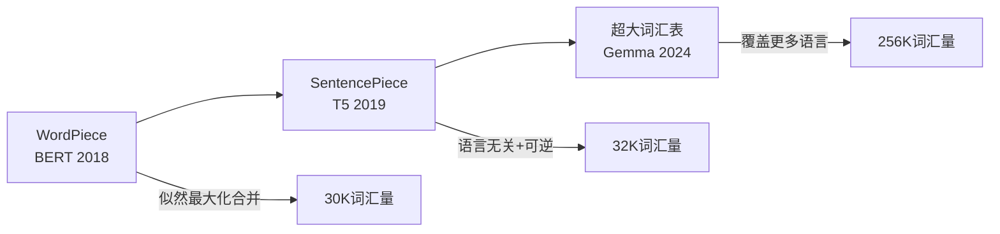
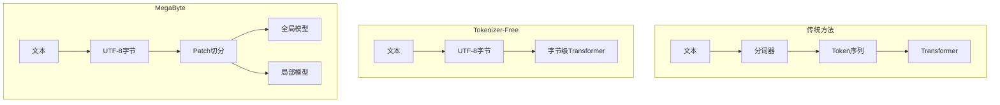

# 模块1进阶：分词的前沿工业实践

> 本文是 [模块1: Tokenization](./README.md) 的进阶补充，深入分析 Google、DeepSeek、Anthropic 三条技术线在分词领域的工业实践，以及前沿研究方向。

---

## 目录

- [1. Google的分词演进](#1-google的分词演进)
- [2. DeepSeek的分词策略](#2-deepseek的分词策略)
- [3. Anthropic的分词实践](#3-anthropic的分词实践)
- [4. 前沿研究方向](#4-前沿研究方向)

---

## 1. Google的分词演进

### 1.1 从 WordPiece 到 SentencePiece

Google在分词领域的技术演进经历了三个重要阶段：



### 1.2 BERT WordPiece (30K)

BERT的WordPiece分词器特点：
- **词汇量**：30,000（较小）
- **预处理**：基于空格的预分词 + BasicTokenizer
- **标记方式**：`##` 前缀标记续词子词
- **训练语料**：英文 Wikipedia + BookCorpus

**局限性**：
- 依赖空格预分词，不适用于中文等无空格语言
- 分词过程不可逆（空格信息丢失）
- 30K词汇量对多语言支持不足

### 1.3 T5 SentencePiece (32K)

T5采用SentencePiece框架 + Unigram LM算法：

**设计决策**：
1. **语言无关**：将空格编码为 `▁` 符号，无需预分词
2. **可逆性**：`decode(encode(text)) == text`
3. **Unigram LM**：支持多种分词结果，理论上更灵活
4. **Byte fallback**：处理未知Unicode字符

**Span Corruption的影响**：

T5的预训练目标（Span Corruption）对分词有特殊要求：
- 需要在token级别进行span掩码
- 分词粒度影响掩码的语义完整性
- 过细的分词导致span语义碎片化

### 1.4 Gemma 256K：超大词汇表策略

Gemma选择了256,000的超大词汇表，这在当时是一个非常大胆的选择。

**为何选择超大词汇表？**

**数学分析**：

设词汇表大小为 $|V|$，Embedding维度为 $d$，序列长度为 $L$：

| 开销项 | 小词汇表 (32K) | 大词汇表 (256K) |
|--------|---------------|----------------|
| Embedding参数 | $32K \times d$ | $256K \times d$ |
| 序列长度 | $L$ | $L' \approx 0.6L$ |
| 注意力计算 | $O(L^2 d)$ | $O(L'^2 d)$ |
| 序列压缩比 | 基准 | ~40%更短 |

**权衡计算**（以d=2048为例）：

$$\text{Embedding增加} = (256K - 32K) \times 2048 \approx 459M \text{ 参数}$$

$$\text{注意力节省} \propto (1 - 0.6^2) = 64\% \text{ 计算量}$$

对于长序列场景，注意力计算的节省远超Embedding参数的增加。

**结论**：超大词汇表在以下场景更有优势：
1. 长上下文场景（更短的序列 → 更快的推理）
2. 多语言场景（每种语言都有充足的词汇覆盖）
3. 大模型（Embedding参数占比小）

---

## 2. DeepSeek的分词策略

### 2.1 中英文平衡设计

DeepSeek面临的核心挑战：如何在一个分词器中同时高效处理中文和英文。

**中文分词的特殊性**：

| 特性 | 英文 | 中文 |
|------|------|------|
| 词边界 | 空格分隔 | 无显式边界 |
| 基础字符 | 26个字母 | ~7000常用汉字 |
| UTF-8编码 | 1字节/字符 | 3字节/字符 |
| 语义密度 | 较低（冠词等虚词） | 较高（每字携带语义） |

**DeepSeek的解决方案**：

1. **约100K词汇量**：比Llama 2的32K更大，为中文留出充足空间
2. **BPE + Byte fallback**：兼顾效率与覆盖率
3. **中英文混合训练语料**：确保两种语言的分词都被充分优化

**效果对比**：

```
英文: "The transformer architecture is revolutionary."
  Llama 2 (32K):  ['The', ' transform', 'er', ' architecture', ' is', ' revolution', 'ary', '.']  (8 tokens)
  DeepSeek (100K): ['The', ' transformer', ' architecture', ' is', ' revolutionary', '.']  (6 tokens)

中文: "大语言模型正在改变世界"
  Llama 2 (32K):  ['大', '语', '言', '模', '型', '正在', '改变', '世界']  (8 tokens)
  DeepSeek (100K): ['大语言模型', '正在', '改变世界']  (3 tokens)
```

### 2.2 代码分词优化

DeepSeek-Coder系列对代码数据有专门的分词优化：

- **缩进敏感**：空格和制表符的精确编码
- **语法结构**：常见关键词（`def`, `class`, `import`）和运算符被整体编码
- **多语言代码**：Python、Java、C++等主流语言的语法适配

### 2.3 分词器与MoE的协同

在DeepSeek-V2/V3的MoE架构中，分词器的设计需要考虑：
- Token的语义完整性影响专家路由的效果
- 过于碎片化的分词可能导致专家利用率不均
- 中英文混合输入的路由平衡

---

## 3. Anthropic的分词实践

### 3.1 Claude分词器特性分析

> **注意**：Anthropic未公开Claude分词器的具体实现。以下分析基于API行为的观察和公开信息，推测性内容已标注。

**可观测行为**：

1. **Token计数API**：Claude API提供的token计数功能可间接分析分词行为
2. **多语言效率**：
   - 英文压缩率与GPT-4相当（~4 chars/token）
   - 中文压缩率优于早期模型
   - 日韩语等CJK语言支持良好

3. **特殊文本处理**：
   - 代码：良好的缩进和语法结构保持
   - 数学公式：LaTeX语法的合理分词
   - URL/路径：长URL的紧凑编码

### 3.2 Token与安全的关系

Anthropic在安全研究中发现，分词方式可能影响模型的安全行为：

**Token边界效应**：
- 安全相关的关键词如果被分词为多个token，模型可能更难识别
- 例如：将"harmful"分为"harm"+"ful"可能影响安全过滤器的效果
- 这是分词设计中需要考虑的安全因素

**对齐的影响**：
- 分词粒度影响模型学习到的安全模式
- 更粗的分词可能有利于学习词级别的安全规则
- 但过粗的分词降低灵活性

### 3.3 长上下文与分词效率

Claude支持200K tokens的上下文窗口，分词效率直接影响可用上下文长度：

$$\text{有效上下文(字符数)} = \text{窗口大小(tokens)} \times \text{压缩率(chars/token)}$$

| 压缩率 | 200K tokens可容纳 |
|--------|------------------|
| 3 chars/token | ~600K字符 (~300页) |
| 4 chars/token | ~800K字符 (~400页) |
| 5 chars/token | ~1M字符 (~500页) |

因此，更高的压缩率 = 更长的有效上下文 = 更强的实用性。

---

## 4. 前沿研究方向

### 4.1 Tokenizer-Free模型

传统分词的根本问题：分词是**非可微的离散操作**，无法端到端优化。

**ByT5 (Google, 2022)**：
- 直接在UTF-8字节级别操作
- 无需分词器
- 序列更长，但模型更简单
- 性能在部分任务上与token-level模型相当

**MegaByte (Meta, 2023)**：
- 多尺度架构：全局模型处理patch，局部模型处理字节
- 突破了字节级模型的效率瓶颈
- 对超长序列特别有效



### 4.2 动态词汇表

**问题**：固定词汇表无法适应数据分布的变化。

**研究方向**：
1. **自适应分词**：根据输入文本动态调整分词粒度
2. **任务感知分词**：不同下游任务使用不同的分词策略
3. **在线学习**：分词器随模型训练同步更新

### 4.3 多模态Tokenization

随着多模态大模型的发展，tokenization不再局限于文本：

| 模态 | Token化方法 | 代表工作 |
|------|------------|----------|
| 图像 | ViT Patch → Token | ViT, CLIP |
| 音频 | 频谱帧 → Token | Whisper, AudioLM |
| 视频 | 时空Patch → Token | VideoGPT |
| 代码 | AST Node → Token | CodeT5 |

**统一Token化**：
- Google Gemini：文本、图像、音频共享Token空间
- 挑战：不同模态的信息密度差异巨大
- 趋势：学习一个统一的多模态Tokenizer

### 4.4 分词与压缩理论

分词本质上是一种数据压缩。最新研究从压缩理论角度分析分词：

**算术编码视角**：
- 最优分词等价于最优压缩
- BPE近似于LZ77压缩算法
- Unigram LM近似于算术编码

**语言模型作为压缩器**：
- 语言模型的交叉熵与压缩率直接相关
- 更好的分词 → 更低的交叉熵 → 更好的语言模型

$$H(X) \leq \frac{\text{压缩后长度}}{\text{原始长度}} \cdot \log_2 |V|$$

---

## 参考资料

### 论文
1. Xue et al. (2022). *ByT5: Towards a Token-Free Future with Pre-training for Byte Sequences*. Google.
2. Yu et al. (2023). *MegaByte: Predicting Million-Byte Sequences with Multiscale Transformers*. Meta.
3. Kudo (2018). *Subword Regularization: Improving Neural Network Translation Models with Multiple Subword Candidates*.
4. Team Gemma (2024). *Gemma: Open Models Based on Gemini Research and Technology*. Google.
5. DeepSeek-AI (2024). *DeepSeek-V2 Technical Report*.

### 博客
1. [Google AI Blog: SentencePiece](https://ai.googleblog.com/2018/11/open-sourcing-sentencepiece.html)
2. [HuggingFace: Tokenizer Summary](https://huggingface.co/docs/transformers/tokenizer_summary)
