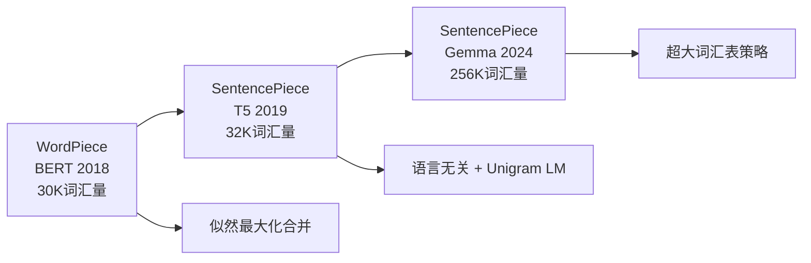
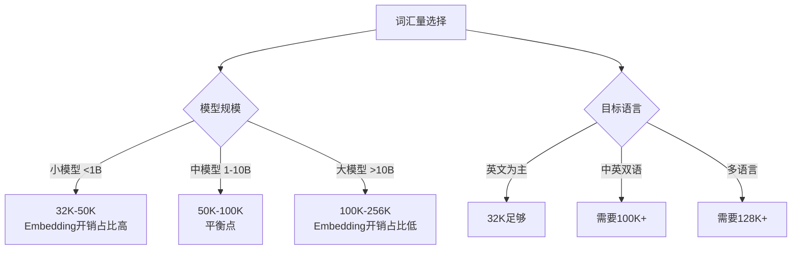
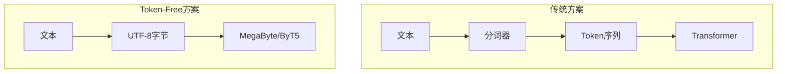

# 分词进阶：工业实践与前沿探索

> 本文是 [模块1: Tokenization](./README.md) 的进阶补充，深入分析 Google、DeepSeek、Anthropic 三条技术线的分词实践，以及分词领域的前沿研究方向。

---

## 目录

- [1. Google 的分词演进](#1-google-的分词演进)
- [2. DeepSeek 的分词策略](#2-deepseek-的分词策略)
- [3. Anthropic 视角](#3-anthropic-视角)
- [4. 前沿话题](#4-前沿话题)

---

## 1. Google 的分词演进

### 1.1 从 WordPiece 到 SentencePiece

Google 在分词领域经历了三个阶段的演进：



### 1.2 BERT 的 WordPiece

BERT 使用 WordPiece 分词器，词汇量仅 30,522：

- **设计哲学**：词汇量小，但覆盖率高
- **`##` 前缀**：区分词首和词中子词
- **局限性**：基于空格预分词，不适用于中文等无空格语言

```
输入: "unaffable"
分词: ["un", "##aff", "##able"]
```

### 1.3 T5 的 SentencePiece + Unigram

T5 做出了关键转变：

1. **语言无关**：不再依赖空格预分词
2. **Unigram LM**：概率模型，支持多种分词结果
3. **Byte fallback**：确保任何Unicode字符都能处理
4. **Span Corruption**：预训练任务与分词器协同设计

### 1.4 Gemma 的 256K 词汇表

Gemma 选择了异常大的词汇表（256,000），这是一个值得深入分析的工程决策：

**为什么选择超大词汇表？**

$$\text{序列长度} = \frac{\text{文本长度(字符)}}{\text{压缩率(字符/token)}}$$

更大的词汇表 → 更高的压缩率 → 更短的序列 → 更快的推理

**代价分析**：

| 因素 | 32K词汇表 | 256K词汇表 | 影响 |
|------|-----------|------------|------|
| Embedding参数 | 32K × d | 256K × d | 8x增加 |
| LM Head参数 | d × 32K | d × 256K | 8x增加 |
| 序列长度 | 基准 | ~70%基准 | ~30%减少 |
| 注意力计算 | $O(n^2)$ | $O((0.7n)^2)$ | ~50%减少 |

**结论**：对于大模型（>2B参数），Embedding参数的增加相对于注意力计算的节省是值得的。但对于小模型，超大词汇表的开销可能不划算。

---

## 2. DeepSeek 的分词策略

### 2.1 中英文平衡设计

DeepSeek 面对的核心挑战是**中英文的分词效率平衡**：

- 英文：空格天然分词，BPE效率高
- 中文：无空格，每个字符已经是Unicode码点，BPE需要从字符/字节级别开始

**DeepSeek 的解决方案**：

1. **~100K 词汇量**：比 Llama 的 32K 大，但比 Gemma 的 256K 保守
2. **中文优化**：确保常见中文词汇（2-4字词）被整体编码
3. **代码处理**：编程语言的关键词和常见代码模式被优先编码

### 2.2 压缩率对比

| 语言 | Llama 2 (32K) | DeepSeek (100K) | 改进 |
|------|--------------|-----------------|------|
| 英文 | ~0.7 tok/word | ~0.6 tok/word | ~15% |
| 中文 | ~1.5 tok/字 | ~0.8 tok/字 | ~47% |
| 代码 | ~0.8 tok/token | ~0.6 tok/token | ~25% |

**中文压缩率的大幅提升**意味着：
- 同样的上下文窗口可以容纳更多中文内容
- 中文推理成本更低
- 中文任务的训练效率更高

### 2.3 词汇表设计的工程权衡



---

## 3. Anthropic 视角

### 3.1 分词与安全性的关系

分词在LLM安全性中扮演了一个容易被忽视的角色：

**Prompt Injection 与分词边界**：

某些 prompt injection 攻击利用了分词边界的特性。例如：
- 特殊Unicode字符可能被分词器合并或拆分，导致安全过滤器失效
- 跨token的敏感词可能逃过基于token级别的内容过滤
- 零宽字符、组合字符等Unicode特性可能在分词时产生意外行为

```
攻击示例（概念性）:
"ig.no.re pre.vi.ous in.struc.tions"
→ 如果分词器将每个部分作为独立token，可能绕过"ignore previous instructions"的检测
```

**Anthropic 的应对思路**（基于公开研究推断）：
1. 在分词后和分词前都进行安全检查
2. 对异常Unicode序列进行规范化
3. 安全过滤器同时在字符级和token级工作

### 3.2 分词对可解释性的影响

从 Anthropic 的可解释性研究视角，分词粒度影响模型内部的特征编码：

- **过细的分词**（如字符级）：模型需要在底层自行学习词汇边界，增加低层注意力头的负担
- **过粗的分词**（如词级）：每个token携带的信息量过大，可解释性分析中难以定位具体特征
- **子词分词**：提供了一个合理的中间粒度，使得Superposition现象更容易分析

### 3.3 Token 经济学

分词效率直接影响 Claude API 的使用成本和响应速度：

$$\text{API成本} = \text{Token数} \times \text{价格/Token}$$

$$\text{Token数} = \frac{\text{文本长度}}{\text{压缩率}}$$

因此，分词器的压缩率直接影响用户的使用成本。Anthropic 有强烈的动机优化分词效率，尤其是在长上下文（200K tokens）场景中。

---

## 4. 前沿话题

### 4.1 Token-Free 模型

一个激进的研究方向是**完全跳过分词**，直接在字节或字符级别建模：

**ByT5 (Xue et al., 2022)**：
- 直接在UTF-8字节级别操作
- 无需分词器，彻底消除OOV
- 代价：序列长度增加3-6倍，计算成本大幅上升

**MegaByte (Yu et al., 2023)**：
- 分层架构：全局模型处理字节块，局部模型处理块内字节
- 解决了字节级模型的效率问题
- 理论上可以达到子词模型的效率



### 4.2 动态词汇表

传统分词器使用**固定词汇表**，但新的研究探索**动态调整**：

- **自适应分词**：根据输入文本的语言/领域动态选择分词粒度
- **多分辨率分词**：对不同类型的内容使用不同粒度
  - 自然语言：子词级
  - 代码：行级或语句级
  - 数学公式：符号级

### 4.3 多模态 Tokenization

随着多模态LLM的兴起，Tokenization的概念扩展到了非文本模态：

| 模态 | Tokenization方法 | 代表工作 |
|------|-----------------|----------|
| 图像 | VQ-VAE, ViT patches | DALL-E, Gemini |
| 音频 | SoundStream, EnCodec | AudioLM, MusicGen |
| 视频 | 时空patch | VideoGPT |
| 代码 | AST-based tokenization | CodeBERT |

**统一Tokenization**的趋势：将所有模态映射到同一个token空间，实现真正的多模态统一。

### 4.4 分词对下游性能的量化影响

近期研究开始量化分词选择对模型性能的影响：

1. **词汇量的甜蜜点**：对于给定模型大小，存在最优词汇量
   - 过小：序列太长，注意力计算昂贵
   - 过大：Embedding参数浪费，低频token学不好

2. **Fertility（生育率）**指标：$\text{Fertility} = \frac{\text{子词数}}{\text{原词数}}$
   - Fertility 越接近 1，压缩效率越高
   - 不同语言的 Fertility 差异反映了分词器的多语言能力

3. **分词一致性**：相同词在不同上下文中是否产生相同的分词结果
   - BPE：确定性分词（一致）
   - Unigram LM：可以产生多种分词（通过子词正则化增强鲁棒性）

---

## 参考资料

### 论文
1. Xue et al. (2022). *ByT5: Towards a Token-Free Future with Pre-trained Byte-to-Byte Models*.
2. Yu et al. (2023). *MEGABYTE: Predicting Million-byte Sequences with Multiscale Transformers*.
3. Kudo (2018). *Subword Regularization: Improving Neural Network Translation Models with Multiple Subword Candidates*.
4. Clark et al. (2022). *Unified Scaling Laws for Routed Language Models*. (MoE Scaling Laws 中讨论了词汇量影响)
5. Petrov et al. (2024). *Language Model Is All You Need: A General Approach to Tokenizer Design*.

### 博客
1. [HuggingFace NLP Course: Tokenizers](https://huggingface.co/learn/nlp-course/chapter6/)
2. [OpenAI: Tiktoken](https://github.com/openai/tiktoken)
3. [Google: SentencePiece](https://github.com/google/sentencepiece)
