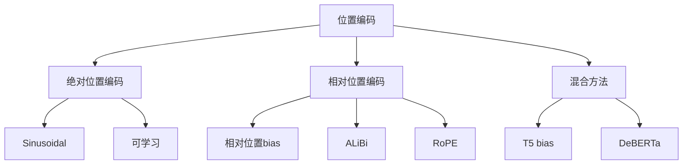
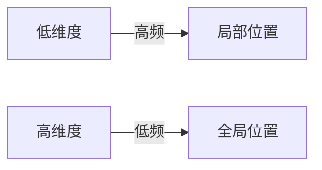
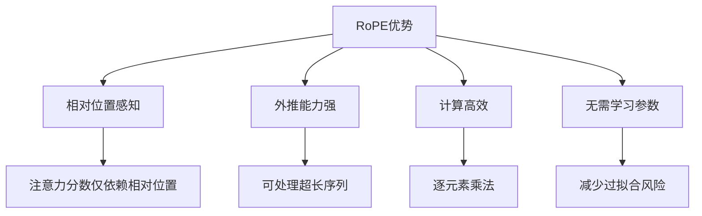
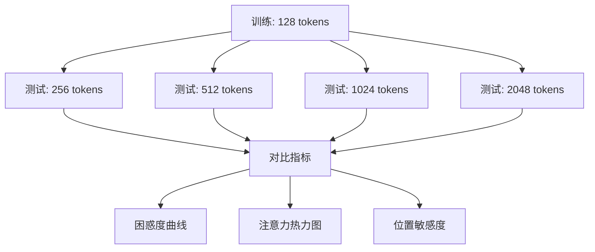

# 模块2：Embedding与位置编码

> 嵌入是连接离散符号与连续计算的桥梁。词嵌入将离散的词元映射到连续向量空间，位置编码则赋予模型感知序列顺序的能力。本章将深入嵌入的数学原理，重点讲解旋转位置编码的推导与实现。

---

## 目录

- [1. 词嵌入：从离散到连续](#1-词嵌入从离散到连续)
- [2. 位置编码的必要性](#2-位置编码的必要性)
- [3. Sinusoidal位置编码](#3-sinusoidal位置编码)
- [4. RoPE：旋转位置编码](#4-rope旋转位置编码)
- [5. ALiBi：线性偏置注意力](#5-alibi线性偏置注意力)
- [6. 其他位置编码方法](#6-其他位置编码方法)
- [7. 现代LLM的选择](#7-现代llm的选择)
- [8. 代码实现](#8-代码实现)
- [9. 项目实践](#9-项目实践)

---

## 1. 词嵌入：从离散到连续

### 1.1 One-Hot编码的局限

给定词汇表 $V = \{w_1, w_2, \ldots, w_{|V|}\}$，最简单的词表示是One-Hot编码：

$$\mathbf{e}_i = [0, 0, \ldots, 1, \ldots, 0]^T \in \mathbb{R}^{|V|}$$

其中第 $i$ 个位置为1，其余为0。

**局限性**：

1. **维度爆炸**：$|V|$ 可达数万甚至数十万
2. **语义鸿沟**：任意两词的内积为零，无法表达相似性

$$\mathbf{e}_i^T \mathbf{e}_j = \delta_{ij} = \begin{cases} 1, & i = j \\ 0, & i \neq j \end{cases}$$

3. **计算低效**：稀疏向量运算开销大

### 1.2 分布式假设

**核心思想**："You shall know a word by the company it keeps." (Firth, 1957)

词的语义由其上下文决定，语义相似的词出现在相似的上下文中。

### 1.3 Word2Vec回顾

#### Skip-Gram模型

**目标**：给定中心词，预测上下文词。

$$\max_{\theta} \sum_{t=1}^{T} \sum_{-c \leq j \leq c, j \neq 0} \log P(w_{t+j} | w_t; \theta)$$

**条件概率**（Softmax形式）：

$$P(w_o | w_c) = \frac{\exp(\mathbf{u}_o^T \mathbf{v}_c)}{\sum_{w \in V} \exp(\mathbf{u}_w^T \mathbf{v}_c)}$$

其中：
- $\mathbf{v}_c$：中心词嵌入
- $\mathbf{u}_o$：上下文词嵌入

**计算优化**：

Softmax分母需要对所有词求和，计算量 $O(|V|)$。常用优化：

1. **Negative Sampling**：

$$\log \sigma(\mathbf{u}_o^T \mathbf{v}_c) + \sum_{k=1}^{K} \mathbb{E}_{w_k \sim P_n(w)} \log \sigma(-\mathbf{u}_{w_k}^T \mathbf{v}_c)$$

2. **Hierarchical Softmax**：使用哈夫曼树，复杂度降至 $O(\log |V|)$

#### CBOW模型

**目标**：给定上下文词，预测中心词。

$$P(w_c | w_{c-m}, \ldots, w_{c-1}, w_{c+1}, \ldots, w_{c+m})$$

上下文词嵌入取平均：

$$\bar{\mathbf{v}} = \frac{1}{2m} \sum_{-m \leq j \leq m, j \neq 0} \mathbf{v}_{c+j}$$

### 1.4 GloVe：全局向量

**核心思想**：结合全局共现统计和局部上下文窗口。

**共现矩阵**：$X_{ij}$ 表示词 $i$ 和词 $j$ 在窗口内共现的次数。

**目标函数**：

$$J = \sum_{i,j=1}^{|V|} f(X_{ij}) (\mathbf{w}_i^T \tilde{\mathbf{w}}_j + b_i + \tilde{b}_j - \log X_{ij})^2$$

其中权重函数：

$$f(x) = \begin{cases} (x/x_{max})^\alpha, & x < x_{max} \\ 1, & x \geq x_{max} \end{cases}$$

### 1.5 现代词嵌入

在Transformer中，词嵌入是一个可学习的查找表：

$$\mathbf{E} \in \mathbb{R}^{|V| \times d}$$

给定词元ID $i$，嵌入向量为：

$$\mathbf{e} = \mathbf{E}[i, :] \in \mathbb{R}^d$$

**PyTorch实现**：

```python
import torch.nn as nn

vocab_size = 32000
d_model = 512

embedding = nn.Embedding(vocab_size, d_model)

# 输入: [batch_size, seq_len] 的词元ID
# 输出: [batch_size, seq_len, d_model] 的嵌入向量
```

---

## 2. 位置编码的必要性

### 2.1 问题：Transformer的位置不变性

Transformer的核心是**自注意力机制**：

$$\text{Attention}(Q, K, V) = \text{softmax}\left(\frac{QK^T}{\sqrt{d_k}}\right)V$$

关键问题：这个计算对位置是**置换不变的**！

**数学证明**：

设位置置换矩阵 $P$，则：

$$\text{Attention}(PQ, PK, PV) = P \cdot \text{Attention}(Q, K, V)$$

这意味着：如果输入序列被打乱顺序，输出的每个位置只是对应打乱，但内容不变。

**例子**：

```
输入1: "猫吃鱼" → 输出1: [..., ...]
输入2: "鱼吃猫" → 输出2: [打乱后的...]
```

没有位置编码，模型无法区分这两个序列的语义差异！

### 2.2 位置编码的目标

位置编码需要满足以下性质：

1. **唯一性**：每个位置有唯一的编码
2. **有界性**：编码值有界，防止数值不稳定
3. **外推性**：能处理训练时未见过的位置
4. **相对位置感知**：编码应能表达相对位置关系

### 2.3 位置编码的分类



---

## 3. Sinusoidal位置编码

### 3.1 原始Transformer方案

论文 *Attention Is All You Need* (Vaswani et al., 2017) 提出了正弦位置编码：

$$PE_{(pos, 2i)} = \sin\left(\frac{pos}{10000^{2i/d}}\right)$$

$$PE_{(pos, 2i+1)} = \cos\left(\frac{pos}{10000^{2i/d}}\right)$$

其中：
- $pos$：位置索引
- $i$：维度索引
- $d$：嵌入维度

### 3.2 为什么这样设计？

#### 性质1：唯一性

每个位置对应唯一的向量，不同位置的编码向量不同。

#### 性质2：有界性

$$|PE_{(pos, i)}| \leq 1$$

正弦和余弦函数值域为 $[-1, 1]$。

#### 性质3：相对位置关系

**关键定理**：位置 $pos + k$ 的编码可以表示为位置 $pos$ 编码的线性变换。

**证明**：

利用三角恒等式：

$$\sin(a + b) = \sin a \cos b + \cos a \sin b$$
$$\cos(a + b) = \cos a \cos b - \sin a \sin b$$

设 $\theta_i = \frac{1}{10000^{2i/d}}$，则：

$$PE_{(pos+k, 2i)} = \sin((pos+k)\theta_i) = \sin(pos\theta_i)\cos(k\theta_i) + \cos(pos\theta_i)\sin(k\theta_i)$$

写成矩阵形式：

$$\begin{bmatrix} PE_{(pos+k, 2i)} \\ PE_{(pos+k, 2i+1)} \end{bmatrix} = \begin{bmatrix} \cos(k\theta_i) & \sin(k\theta_i) \\ -\sin(k\theta_i) & \cos(k\theta_i) \end{bmatrix} \begin{bmatrix} PE_{(pos, 2i)} \\ PE_{(pos, 2i+1)} \end{bmatrix}$$

这是一个**旋转矩阵**！

#### 性质4：多尺度表示

不同维度有不同的频率：

$$\omega_i = \frac{1}{10000^{2i/d}} \in [1, \frac{1}{10000}]$$

- 低维度（$i$小）：高频，捕捉局部位置信息
- 高维度（$i$大）：低频，捕捉全局位置信息



### 3.3 PyTorch实现

```python
import torch
import math

def sinusoidal_positional_encoding(max_len: int, d_model: int) -> torch.Tensor:
    """
    生成Sinusoidal位置编码
    
    Args:
        max_len: 最大序列长度
        d_model: 嵌入维度
        
    Returns:
        位置编码矩阵 [max_len, d_model]
    """
    # 创建位置索引
    position = torch.arange(max_len).unsqueeze(1).float()  # [max_len, 1]
    
    # 计算分母中的指数项
    # 10000^(2i/d) = exp(2i * log(10000) / d)
    div_term = torch.exp(
        torch.arange(0, d_model, 2).float() * 
        (-math.log(10000.0) / d_model)
    )  # [d_model/2]
    
    # 初始化编码矩阵
    pe = torch.zeros(max_len, d_model)
    
    # 偶数维度用sin
    pe[:, 0::2] = torch.sin(position * div_term)
    # 奇数维度用cos
    pe[:, 1::2] = torch.cos(position * div_term)
    
    return pe


# 可视化
import matplotlib.pyplot as plt

pe = sinusoidal_positional_encoding(100, 512)
plt.figure(figsize=(12, 4))
plt.imshow(pe.T, aspect='auto', cmap='RdBu')
plt.colorbar()
plt.xlabel('Position')
plt.ylabel('Dimension')
plt.title('Sinusoidal Positional Encoding')
plt.show()
```

### 3.4 局限性

1. **外推能力有限**：训练时未见过的位置，编码可能不合适
2. **固定编码**：无法根据数据自适应调整
3. **绝对位置**：只编码绝对位置，相对位置关系隐含

---

## 4. RoPE：旋转位置编码

RoPE（Rotary Position Embedding）是目前最主流的位置编码方案，被Llama、Gemma、DeepSeek等模型采用。

### 4.1 核心思想

RoPE将位置信息编码为**旋转变换**，通过旋转矩阵将绝对位置信息注入注意力计算。

**关键洞察**：将查询和键向量表示为复数，位置编码相当于旋转操作。

### 4.2 数学推导

#### 二维情形

对于二维向量 $\mathbf{x} = (x_1, x_2)^T$，位置 $m$ 的RoPE编码为：

$$\mathbf{R}_m \mathbf{x} = \begin{bmatrix} \cos m\theta & -\sin m\theta \\ \sin m\theta & \cos m\theta \end{bmatrix} \begin{bmatrix} x_1 \\ x_2 \end{bmatrix}$$

这是将向量 $\mathbf{x}$ 旋转角度 $m\theta$。

#### 高维情形

对于 $d$ 维向量（$d$ 为偶数），将其分成 $d/2$ 组二维向量：

$$\mathbf{x} = [x_1, x_2, x_3, x_4, \ldots, x_{d-1}, x_d]^T$$

每组使用不同的旋转角度 $\theta_i$：

$$\theta_i = 10000^{-2(i-1)/d}, \quad i = 1, 2, \ldots, d/2$$

RoPE变换：

$$\mathbf{R}_{m,\theta} \mathbf{x} = \begin{bmatrix} x_1 \\ x_2 \\ x_3 \\ x_4 \\ \vdots \\ x_{d-1} \\ x_d \end{bmatrix} \odot \begin{bmatrix} \cos m\theta_1 \\ \cos m\theta_1 \\ \cos m\theta_2 \\ \cos m\theta_2 \\ \vdots \\ \cos m\theta_{d/2} \\ \cos m\theta_{d/2} \end{bmatrix} + \begin{bmatrix} -x_2 \\ x_1 \\ -x_4 \\ x_3 \\ \vdots \\ -x_d \\ x_{d-1} \end{bmatrix} \odot \begin{bmatrix} \sin m\theta_1 \\ \sin m\theta_1 \\ \sin m\theta_2 \\ \sin m\theta_2 \\ \vdots \\ \sin m\theta_{d/2} \\ \sin m\theta_{d/2} \end{bmatrix}$$

#### 注意力中的RoPE

在自注意力中，对Query和Key应用RoPE：

$$\tilde{\mathbf{q}}_m = \mathbf{R}_m \mathbf{W}_q \mathbf{x}_m$$
$$\tilde{\mathbf{k}}_n = \mathbf{R}_n \mathbf{W}_k \mathbf{x}_n$$

注意力分数：

$$\text{score}(\mathbf{q}_m, \mathbf{k}_n) = \tilde{\mathbf{q}}_m^T \tilde{\mathbf{k}}_n$$

### 4.3 RoPE的相对位置性质

**核心定理**：RoPE编码使得注意力分数只依赖于相对位置 $m-n$。

**证明**：

设 $\mathbf{q} = \mathbf{W}_q \mathbf{x}_m$，$\mathbf{k} = \mathbf{W}_k \mathbf{x}_n$。

在二维情形下：

$$\mathbf{R}_m \mathbf{q} = \begin{bmatrix} q_1 \cos m\theta - q_2 \sin m\theta \\ q_1 \sin m\theta + q_2 \cos m\theta \end{bmatrix}$$

$$\mathbf{R}_n \mathbf{k} = \begin{bmatrix} k_1 \cos n\theta - k_2 \sin n\theta \\ k_1 \sin n\theta + k_2 \cos n\theta \end{bmatrix}$$

内积：

$$(\mathbf{R}_m \mathbf{q})^T (\mathbf{R}_n \mathbf{k}) = q_1 k_1 \cos(m-n)\theta + q_2 k_2 \cos(m-n)\theta + q_1 k_2 \sin(m-n)\theta - q_2 k_1 \sin(m-n)\theta$$

简化为：

$$(\mathbf{R}_m \mathbf{q})^T (\mathbf{R}_n \mathbf{k}) = \mathbf{q}^T \mathbf{R}_{m-n} \mathbf{k}$$

**关键结论**：注意力分数只依赖于相对位置差 $(m-n)$！

### 4.4 RoPE的优势



1. **相对位置感知**：自动编码相对位置信息
2. **外推能力**：可以处理比训练时更长的序列
3. **计算高效**：只需逐元素乘法
4. **无额外参数**：不增加模型参数

### 4.5 PyTorch实现

```python
import torch
import torch.nn as nn
import math


class RotaryPositionalEmbedding(nn.Module):
    """
    RoPE实现
    
    参考：RoFormer: Enhanced Transformer with Rotary Position Embedding
    """
    
    def __init__(self, dim: int, max_seq_len: int = 2048, base: int = 10000):
        """
        Args:
            dim: 嵌入维度（必须为偶数）
            max_seq_len: 最大序列长度
            base: 频率基数（默认10000）
        """
        super().__init__()
        self.dim = dim
        self.max_seq_len = max_seq_len
        self.base = base
        
        # 计算频率
        inv_freq = 1.0 / (base ** (torch.arange(0, dim, 2).float() / dim))
        self.register_buffer('inv_freq', inv_freq)
        
        # 预计算cos和sin缓存
        self._build_cache(max_seq_len)
    
    def _build_cache(self, seq_len: int):
        """
        预计算位置编码缓存
        
        缓存cos和sin值，避免重复计算
        """
        # 位置索引 [seq_len]
        t = torch.arange(seq_len, device=self.inv_freq.device)
        
        # 外积: [seq_len] x [dim/2] -> [seq_len, dim/2]
        freqs = torch.outer(t.float(), self.inv_freq)
        
        # 复制一份，得到 [seq_len, dim]
        # 这样emb[i] = [cos(θ_1), cos(θ_1), cos(θ_2), cos(θ_2), ...]
        emb = torch.cat([freqs, freqs], dim=-1)
        
        self.register_buffer('cos_cached', emb.cos())
        self.register_buffer('sin_cached', emb.sin())
    
    def forward(self, x: torch.Tensor, seq_dim: int = -2) -> torch.Tensor:
        """
        应用RoPE
        
        Args:
            x: 输入张量 [..., seq_len, dim]
            seq_dim: 序列维度的索引
            
        Returns:
            应用RoPE后的张量
        """
        seq_len = x.shape[seq_dim]
        
        # 如果序列长度超过缓存，重新计算
        if seq_len > self.max_seq_len:
            self._build_cache(seq_len)
            self.max_seq_len = seq_len
        
        # 获取cos和sin
        cos = self.cos_cached[:seq_len]
        sin = self.sin_cached[:seq_len]
        
        # 应用旋转
        return self._apply_rotary_emb(x, cos, sin)
    
    def _apply_rotary_emb(self, x: torch.Tensor, cos: torch.Tensor, sin: torch.Tensor) -> torch.Tensor:
        """
        应用旋转变换
        
        RoPE的核心操作：
        x_rotated = x * cos + rotate_half(x) * sin
        """
        # x: [..., seq_len, dim]
        # cos, sin: [seq_len, dim]
        
        # 将x分成两半
        x1 = x[..., :x.shape[-1]//2]
        x2 = x[..., x.shape[-1]//2:]
        
        # 旋转操作：将两半交换并取负
        # rotate_half([x1, x2]) = [-x2, x1]
        rotated = torch.cat([-x2, x1], dim=-1)
        
        # 应用旋转
        # 注意广播：cos和sin需要扩展到与x相同的形状
        return x * cos + rotated * sin


def rotate_half(x: torch.Tensor) -> torch.Tensor:
    """
    将输入分成两半并旋转
    
    rotate_half([x1, x2]) = [-x2, x1]
    
    这对应于二维旋转中的操作
    """
    x1 = x[..., : x.shape[-1] // 2]
    x2 = x[..., x.shape[-1] // 2 :]
    return torch.cat((-x2, x1), dim=-1)


def apply_rotary_pos_emb(q: torch.Tensor, k: torch.Tensor, cos: torch.Tensor, sin: torch.Tensor) -> tuple:
    """
    对Query和Key应用RoPE
    
    Args:
        q: Query张量 [batch, heads, seq_len, head_dim]
        k: Key张量 [batch, heads, seq_len, head_dim]
        cos: cos缓存 [seq_len, head_dim]
        sin: sin缓存 [seq_len, head_dim]
        
    Returns:
        (q_embed, k_embed): 应用RoPE后的Query和Key
    """
    # 确保cos和sin的形状正确
    # cos, sin: [seq_len, head_dim] -> [1, 1, seq_len, head_dim]
    cos = cos.unsqueeze(0).unsqueeze(0)
    sin = sin.unsqueeze(0).unsqueeze(0)
    
    q_embed = (q * cos) + (rotate_half(q) * sin)
    k_embed = (k * cos) + (rotate_half(k) * sin)
    
    return q_embed, k_embed
```

### 4.6 RoPE在注意力中的使用

```python
class RoPEMultiHeadAttention(nn.Module):
    """
    带RoPE的多头注意力
    """
    
    def __init__(self, d_model: int, n_heads: int, max_seq_len: int = 2048):
        super().__init__()
        self.d_model = d_model
        self.n_heads = n_heads
        self.head_dim = d_model // n_heads
        
        assert d_model % n_heads == 0, "d_model must be divisible by n_heads"
        
        # Q, K, V投影
        self.wq = nn.Linear(d_model, d_model, bias=False)
        self.wk = nn.Linear(d_model, d_model, bias=False)
        self.wv = nn.Linear(d_model, d_model, bias=False)
        self.wo = nn.Linear(d_model, d_model, bias=False)
        
        # RoPE
        self.rope = RotaryPositionalEmbedding(self.head_dim, max_seq_len)
    
    def forward(self, x: torch.Tensor, mask: torch.Tensor = None) -> torch.Tensor:
        """
        Args:
            x: [batch, seq_len, d_model]
            mask: [batch, seq_len, seq_len] 或 None
            
        Returns:
            [batch, seq_len, d_model]
        """
        batch_size, seq_len, _ = x.shape
        
        # 计算Q, K, V
        q = self.wq(x)  # [batch, seq_len, d_model]
        k = self.wk(x)
        v = self.wv(x)
        
        # 重塑为多头形式
        q = q.view(batch_size, seq_len, self.n_heads, self.head_dim).transpose(1, 2)
        k = k.view(batch_size, seq_len, self.n_heads, self.head_dim).transpose(1, 2)
        v = v.view(batch_size, seq_len, self.n_heads, self.head_dim).transpose(1, 2)
        # 现在形状: [batch, n_heads, seq_len, head_dim]
        
        # 应用RoPE
        cos = self.rope.cos_cached[:seq_len]
        sin = self.rope.sin_cached[:seq_len]
        q, k = apply_rotary_pos_emb(q, k, cos, sin)
        
        # 计算注意力分数
        scores = torch.matmul(q, k.transpose(-2, -1)) / math.sqrt(self.head_dim)
        
        # 应用mask（如果有）
        if mask is not None:
            scores = scores.masked_fill(mask == 0, float('-inf'))
        
        # Softmax
        attn = torch.softmax(scores, dim=-1)
        
        # 加权求和
        out = torch.matmul(attn, v)  # [batch, n_heads, seq_len, head_dim]
        
        # 重塑回来
        out = out.transpose(1, 2).contiguous().view(batch_size, seq_len, self.d_model)
        
        # 输出投影
        out = self.wo(out)
        
        return out
```

---

## 5. ALiBi：线性偏置注意力

### 5.1 核心思想

ALiBi（Attention with Linear Biases）不使用位置编码，而是在注意力分数上添加**线性偏置**。

$$\text{score}(i, j) = \frac{\mathbf{q}_i^T \mathbf{k}_j}{\sqrt{d}} - m \cdot |i - j|$$

其中 $m$ 是每个注意力头的斜率参数。

### 5.2 数学原理

**偏置矩阵**：

对于序列长度 $L$，偏置矩阵 $B \in \mathbb{R}^{L \times L}$：

$$B_{ij} = -m \cdot |i - j|$$

**斜率 $m$ 的选择**：

ALiBi为每个注意力头使用不同的斜率：

$$m_h = \frac{1}{2^{h \cdot \frac{8}{n_{heads}}}}$$

其中 $h$ 是注意力头索引（从1开始）。

例如，8个头的斜率为：$\frac{1}{2}, \frac{1}{2^2}, \frac{1}{2^3}, \frac{1}{2^4}, \frac{1}{2^5}, \frac{1}{2^6}, \frac{1}{2^7}, \frac{1}{2^8}$。

### 5.3 ALiBi的优势

1. **外推能力强**：可以处理远超训练长度的序列
2. **无额外参数**：不需要学习位置编码
3. **简单高效**：只需在注意力分数上加减

### 5.4 实现

```python
def get_alibi_bias(n_heads: int, seq_len: int, device: str = 'cuda') -> torch.Tensor:
    """
    生成ALiBi偏置矩阵
    
    Args:
        n_heads: 注意力头数量
        seq_len: 序列长度
        device: 设备
        
    Returns:
        [n_heads, seq_len, seq_len] 的偏置矩阵
    """
    # 计算每个头的斜率
    # m_h = 1 / 2^(h * 8 / n_heads)
    slopes = 1.0 / (2.0 ** (torch.arange(1, n_heads + 1) * 8 / n_heads))
    slopes = slopes.to(device)
    
    # 计算相对距离矩阵
    # distance[i, j] = |i - j|
    rows = torch.arange(seq_len, device=device).unsqueeze(1)
    cols = torch.arange(seq_len, device=device).unsqueeze(0)
    distance = (rows - cols).abs().float()
    
    # 扩展维度并计算偏置
    # [n_heads, seq_len, seq_len]
    bias = -slopes.unsqueeze(1).unsqueeze(2) * distance.unsqueeze(0)
    
    return bias


class ALiBiMultiHeadAttention(nn.Module):
    """
    带ALiBi的多头注意力
    """
    
    def __init__(self, d_model: int, n_heads: int, max_seq_len: int = 2048):
        super().__init__()
        self.d_model = d_model
        self.n_heads = n_heads
        self.head_dim = d_model // n_heads
        
        self.wq = nn.Linear(d_model, d_model, bias=False)
        self.wk = nn.Linear(d_model, d_model, bias=False)
        self.wv = nn.Linear(d_model, d_model, bias=False)
        self.wo = nn.Linear(d_model, d_model, bias=False)
        
        # 预计算ALiBi偏置
        alibi_bias = get_alibi_bias(n_heads, max_seq_len)
        self.register_buffer('alibi_bias', alibi_bias)
    
    def forward(self, x: torch.Tensor, mask: torch.Tensor = None) -> torch.Tensor:
        batch_size, seq_len, _ = x.shape
        
        q = self.wq(x).view(batch_size, seq_len, self.n_heads, self.head_dim).transpose(1, 2)
        k = self.wk(x).view(batch_size, seq_len, self.n_heads, self.head_dim).transpose(1, 2)
        v = self.wv(x).view(batch_size, seq_len, self.n_heads, self.head_dim).transpose(1, 2)
        
        # 注意力分数
        scores = torch.matmul(q, k.transpose(-2, -1)) / math.sqrt(self.head_dim)
        
        # 添加ALiBi偏置
        scores = scores + self.alibi_bias[:, :seq_len, :seq_len]
        
        if mask is not None:
            scores = scores.masked_fill(mask == 0, float('-inf'))
        
        attn = torch.softmax(scores, dim=-1)
        out = torch.matmul(attn, v)
        
        out = out.transpose(1, 2).contiguous().view(batch_size, seq_len, self.d_model)
        return self.wo(out)
```

---

## 6. 其他位置编码方法

### 6.1 可学习位置编码

最简单的方法：让位置编码成为可学习参数。

```python
class LearnablePositionalEmbedding(nn.Module):
    def __init__(self, max_seq_len: int, d_model: int):
        super().__init__()
        self.pos_embedding = nn.Embedding(max_seq_len, d_model)
    
    def forward(self, x: torch.Tensor) -> torch.Tensor:
        seq_len = x.shape[1]
        positions = torch.arange(seq_len, device=x.device)
        return x + self.pos_embedding(positions)
```

**优点**：简单、灵活
**缺点**：外推能力差，无法处理超过训练长度的序列

### 6.2 相对位置编码

直接在注意力中添加相对位置偏置：

$$e_{ij} = \frac{\mathbf{q}_i^T \mathbf{k}_j}{\sqrt{d}} + b_{i-j}$$

其中 $b_{i-j}$ 是可学习的相对位置偏置。

**代表模型**：T5、DeBERTa

### 6.3 YaRN：Yet another RoPE extensioN

YaRN是对RoPE的改进，用于增强外推能力：

$$\theta_i' = \theta_i \cdot s^{2(i-1)/d}$$

其中 $s$ 是缩放因子。

---

## 7. 现代LLM的选择

| 模型 | 位置编码 | 特点 |
|------|----------|------|
| **Transformer** | Sinusoidal | 固定编码，绝对位置 |
| **BERT** | 可学习 | 简单有效，外推差 |
| **GPT系列** | 可学习 | 同BERT |
| **Llama** | RoPE | 相对位置，外推强 |
| **Llama 2** | RoPE | 同Llama |
| **Llama 3** | RoPE | 同Llama |
| **DeepSeek** | RoPE | 同Llama |
| **DeepSeek-V2** | RoPE + MLA | MLA压缩KV |
| **Gemma** | RoPE | 同Llama |
| **PaLM** | RoPE | 同Llama |
| **MPT** | ALiBi | 线性偏置，超长外推 |
| **BLOOM** | ALiBi | 同MPT |
| **Claude** | 未公开（推测RoPE） | 200K长上下文支持 |

### 7.1 为什么RoPE成为主流？

1. **相对位置感知**：自动编码相对位置，符合语言特性
2. **外推能力**：通过插值可以处理更长序列
3. **计算高效**：只需逐元素乘法
4. **无额外参数**：不增加模型大小
5. **广泛验证**：被大量模型验证有效

### 7.2 DeepSeek的MLA如何处理位置编码？

MLA（Multi-Head Latent Attention）将KV压缩到低维潜在空间：

$$c_{KV} = W_{DKV} h_t$$

在计算注意力时，需要先上投影恢复KV，然后应用RoPE。

关键技巧：将RoPE放在上投影之后，避免位置编码被压缩。

### 7.3 Anthropic的嵌入研究

Anthropic在嵌入空间的**可解释性**研究方面做出了重要贡献，深刻影响了我们对词嵌入的理解。

#### Superposition假设

**核心发现**（Elhage et al., 2022 - *Toy Models of Superposition*）：

神经网络在有限维度的嵌入空间中，可以编码**远超维度数量**的特征。

**数学描述**：

设嵌入维度为 $d$，特征数量为 $n$，当 $n > d$ 时：
- 特征并非按正交基排列
- 而是以**近似正交**的方式叠加（Superposition）
- 稀疏特征（出现频率低的特征）更容易被叠加

$$\text{表示容量} \gg d \quad (\text{当特征稀疏时})$$

**几何直觉**：


**对教程的意义**：

这一发现解释了为什么：
1. 词嵌入能在低维空间中捕捉丰富的语义信息
2. 嵌入维度不必等于特征数量
3. 理解嵌入空间的几何结构对理解模型行为至关重要

> **详细内容**请参阅 [advanced.md](./advanced.md) 中 Anthropic 可解释性研究部分。

---

## 8. 代码实现

### 8.1 完整的Embedding层

```python
import torch
import torch.nn as nn
import math


class TransformerEmbedding(nn.Module):
    """
    完整的Transformer Embedding层
    
    组成：
    1. Token Embedding
    2. Position Embedding (可选)
    3. Dropout
    """
    
    def __init__(
        self,
        vocab_size: int,
        d_model: int,
        max_seq_len: int = 2048,
        dropout: float = 0.1,
        pos_embedding_type: str = 'rope'  # 'rope', 'sinusoidal', 'learnable', 'none'
    ):
        super().__init__()
        
        # Token Embedding
        self.token_embedding = nn.Embedding(vocab_size, d_model)
        
        # 位置编码
        self.pos_embedding_type = pos_embedding_type
        
        if pos_embedding_type == 'learnable':
            self.pos_embedding = nn.Embedding(max_seq_len, d_model)
        elif pos_embedding_type == 'sinusoidal':
            self.register_buffer(
                'pos_embedding',
                self._create_sinusoidal_encoding(max_seq_len, d_model)
            )
        elif pos_embedding_type == 'rope':
            # RoPE在注意力层内部应用，这里不初始化
            self.pos_embedding = None
        else:  # 'none'
            self.pos_embedding = None
        
        self.dropout = nn.Dropout(dropout)
        
        # 初始化
        nn.init.normal_(self.token_embedding.weight, mean=0, std=d_model ** -0.5)
    
    def _create_sinusoidal_encoding(self, max_len: int, d_model: int) -> torch.Tensor:
        """创建Sinusoidal位置编码"""
        pe = torch.zeros(max_len, d_model)
        position = torch.arange(max_len, dtype=torch.float).unsqueeze(1)
        div_term = torch.exp(
            torch.arange(0, d_model, 2).float() * (-math.log(10000.0) / d_model)
        )
        pe[:, 0::2] = torch.sin(position * div_term)
        pe[:, 1::2] = torch.cos(position * div_term)
        return pe
    
    def forward(self, x: torch.Tensor) -> torch.Tensor:
        """
        Args:
            x: [batch, seq_len] 的词元ID
            
        Returns:
            [batch, seq_len, d_model] 的嵌入向量
        """
        seq_len = x.shape[1]
        
        # Token Embedding
        x = self.token_embedding(x)
        
        # 添加位置编码（如果不是RoPE）
        if self.pos_embedding_type in ['learnable', 'sinusoidal']:
            positions = torch.arange(seq_len, device=x.device)
            x = x + self.pos_embedding(positions)
        
        return self.dropout(x)
```

---

## 9. 项目实践

> 以下项目按难度递增排列。项目采用**开放式设计**，只提供思路和关键引导。

### 项目1：Word2Vec 从零实现（★☆☆ 入门）

**目标**：实现 Skip-Gram + Negative Sampling，理解词嵌入训练过程。

**任务**：
1. 实现 Skip-Gram 模型（中心词 → 上下文词）
2. 实现 Negative Sampling 优化
3. 在小语料上训练，观察嵌入空间的语义性质
4. 可视化：用 t-SNE/PCA 展示词向量聚类

**关键代码片段**：
```python
class SkipGram(nn.Module):
    def __init__(self, vocab_size, embed_dim):
        super().__init__()
        self.center_embed = nn.Embedding(vocab_size, embed_dim)
        self.context_embed = nn.Embedding(vocab_size, embed_dim)

    def forward(self, center, context, neg_samples):
        # 正样本得分: sigmoid(u_o^T v_c)
        center_v = self.center_embed(center)      # [batch, dim]
        context_u = self.context_embed(context)    # [batch, dim]
        pos_score = torch.sigmoid((center_v * context_u).sum(dim=-1))

        # 负样本得分
        neg_u = self.context_embed(neg_samples)    # [batch, K, dim]
        neg_score = torch.sigmoid(-(center_v.unsqueeze(1) * neg_u).sum(dim=-1))

        loss = -torch.log(pos_score + 1e-8).mean() - torch.log(neg_score + 1e-8).mean()
        return loss
```

**预期产出**：训练好的词嵌入 + t-SNE 可视化图 + 类比推理测试（king - man + woman ≈ queen）。

---

### 项目2：词嵌入可视化与类比推理（★★☆ 进阶）

**目标**：深入探索嵌入空间的几何性质，理解为什么词嵌入能捕捉语义。

**任务**：
1. 加载预训练词向量（GloVe 或 Word2Vec）
2. 实现类比推理：$\vec{king} - \vec{man} + \vec{woman} \approx \vec{queen}$
3. 探索嵌入空间的线性结构：
   - 性别方向：man-woman, king-queen, he-she
   - 时态方向：walk-walked, run-ran
   - 国家-首都方向
4. 分析：线性结构在多大程度上成立？局限性在哪？

**评估方法**：
- 类比精度：Top-1 / Top-5 / Top-10 准确率
- 余弦相似度分布：同类词 vs 异类词
- 聚类质量：轮廓系数（Silhouette Score）

**预期产出**：嵌入空间几何分析报告 + 多维度可视化图表。

---

### 项目3：RoPE vs ALiBi 长度外推实验（★★★ 挑战）

**目标**：通过实验对比 RoPE 和 ALiBi 的长度外推能力。

**任务**：
1. 实现一个小型 Transformer 模型，支持切换 RoPE / ALiBi
2. 在固定长度（如128 tokens）上训练
3. 在更长序列（256, 512, 1024, 2048）上测试：
   - 困惑度变化
   - 注意力模式可视化
   - 位置敏感度分析
4. 测试 RoPE 插值方法（Position Interpolation, NTK-aware）

**实验设计**：



**控制变量**：
- 模型架构相同（仅位置编码不同）
- 训练数据和超参数相同
- 评估数据相同

**预期产出**：外推能力定量对比报告 + 注意力模式可视化。

---

### 项目4：自定义位置编码方案设计（★★★ 挑战）

**目标**：设计一种新的位置编码方案，尝试结合 RoPE 和 ALiBi 的优势。

**任务**：
1. 分析 RoPE 和 ALiBi 的核心优势和局限：
   - RoPE：精确的相对位置感知，但外推需要插值
   - ALiBi：完美外推，但线性偏置可能过于简单
2. 设计一种混合方案（例如：低维用 RoPE + 高维用 ALiBi）
3. 实现并在简单任务上验证
4. 分析：你的方案在哪些场景更好？代价是什么？

**思路引导**：
- 考虑不同维度使用不同的位置编码策略
- 考虑频率依赖的衰减机制
- 参考 YaRN 的多尺度思想

**预期产出**：新方案的数学形式 + 实现 + 对比实验 + 分析报告。

---

## 本章小结

### 核心知识点

1. **词嵌入**：将离散词元映射到连续向量空间
2. **位置编码必要性**：Transformer对位置置换不变，需要显式编码位置信息
3. **RoPE**：通过旋转变换编码相对位置，是当前主流方案
4. **ALiBi**：线性偏置注意力，外推能力极强

### 数学要点

- **Sinusoidal**：$PE_{(pos, 2i)} = \sin(pos/10000^{2i/d})$
- **RoPE**：$\mathbf{R}_m \mathbf{x}$ 是旋转变换，满足 $(\mathbf{R}_m \mathbf{q})^T (\mathbf{R}_n \mathbf{k}) = \mathbf{q}^T \mathbf{R}_{m-n} \mathbf{k}$
- **ALiBi**：$score = \mathbf{q}^T \mathbf{k} / \sqrt{d} - m|i-j|$

### 实践要点

1. RoPE在注意力层内部应用，不改变Embedding层
2. 预计算cos/sin缓存可提高效率
3. RoPE的外推可以通过插值实现

---

## 参考资料

### 论文

1. Vaswani et al. (2017). *Attention Is All You Need*.
2. Su et al. (2021). *RoFormer: Enhanced Transformer with Rotary Position Embedding*.
3. Press et al. (2022). *Train Short, Test Long: Attention with Linear Biases*.
4. Sun et al. (2022). *A Length-Extrapolatable Transformer*.
5. Elhage et al. (2022). *Toy Models of Superposition*. Anthropic.
6. Mikolov et al. (2013). *Efficient Estimation of Word Representations in Vector Space*.
7. Pennington et al. (2014). *GloVe: Global Vectors for Word Representation*.

### 博客

1. [Rotary Positional Embeddings](https://blog.eleuther.ai/rotary-embeddings/)
2. [ALiBi Explained](https://paperswithcode.com/method/alibi)

---

**下一章预告**：[模块3: Transformer核心架构](../03_transformer/README.md) - 我们将深入Self-Attention的数学推导，实现完整的Transformer Block。
