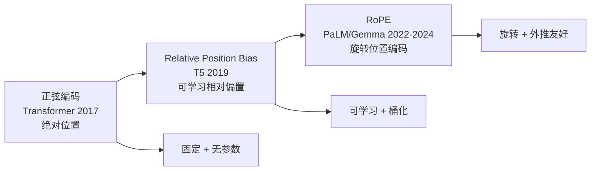
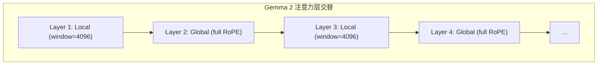
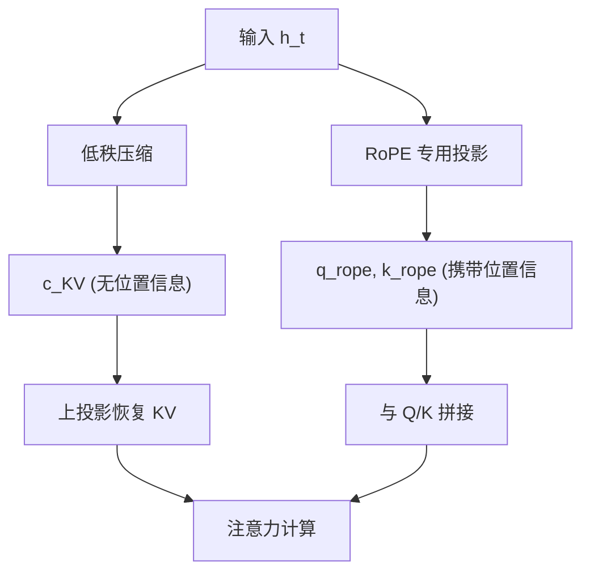
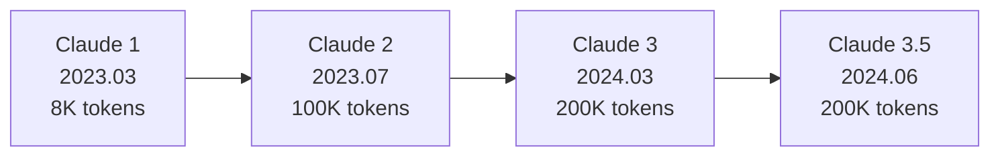
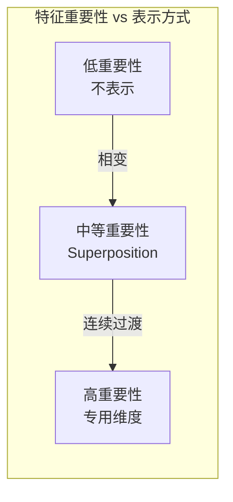
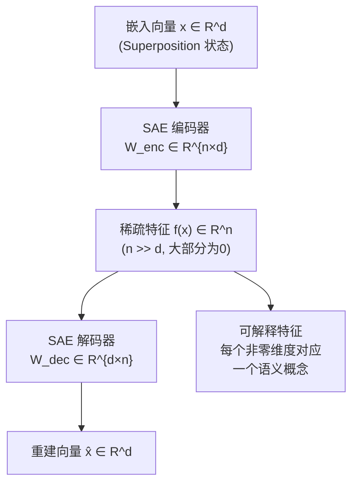
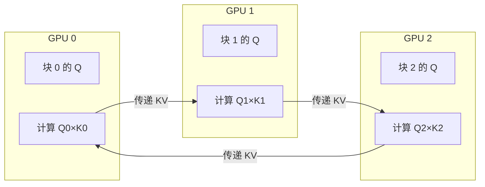
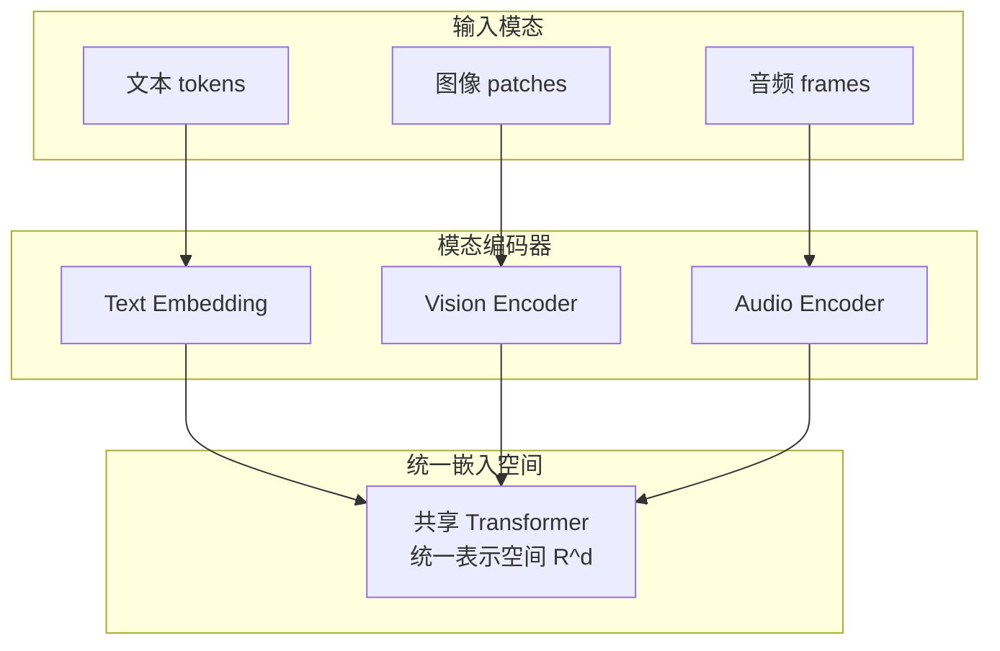

# Embedding进阶：位置编码演进与嵌入空间研究

> 本文是 [模块2: Embedding与位置编码](./README.md) 的进阶补充，深入分析 Google、DeepSeek、Anthropic 三条技术线的位置编码实践，以及嵌入空间的前沿研究方向。

---

## 目录

- [1. Google 的位置编码演进](#1-google-的位置编码演进)
- [2. DeepSeek 的位置编码实践](#2-deepseek-的位置编码实践)
- [3. Anthropic 视角](#3-anthropic-视角)
- [4. 前沿话题](#4-前沿话题)

---

## 1. Google 的位置编码演进

### 1.1 三代位置编码方案

Google 在位置编码上经历了清晰的演进路径：

### 1.2 原始 Transformer 的正弦编码

原始 Transformer（Vaswani et al., 2017）使用正弦位置编码的设计考量：

**选择正弦函数的原因**：
1. **唯一性**：每个位置有唯一编码
2. **有界性**：值域 $[-1, 1]$，数值稳定
3. **线性可表示性**：$PE_{pos+k}$ 可以表示为 $PE_{pos}$ 的线性变换
4. **无需学习**：减少过拟合风险

**论文中的实验结论**：可学习位置编码与正弦编码效果相当，但正弦编码理论上支持外推。实际上，原始 Transformer 在外推方面表现并不理想。

### 1.3 T5 的 Relative Position Bias

T5 做出了一个重要创新：**桶化相对位置偏置**（Bucketed Relative Position Bias）。

**核心思想**：将相对位置 $m - n$ 映射到有限个"桶"中，每个桶对应一个可学习的偏置值。

**桶化函数**：

$$b(m - n) = \begin{cases}
m - n, & |m-n| \leq k_{near} \\
k_{near} + \lfloor \log_{base} \frac{|m-n|}{k_{near}} \rfloor, & |m-n| > k_{near}
\end{cases}$$

**设计动机**：
- 近距离：精确区分每个相对位置（$|m-n| \leq 8$ 时，每个距离一个桶）
- 远距离：对数桶化，粗粒度区分（远距离差异不大）
- 总桶数有限（如32个），参数开销小

**优势与局限**：
- 优势：参数少、相对位置感知、不同头可学习不同模式
- 局限：桶数固定，超出最大桶的距离无法精细区分

### 1.4 PaLM / Gemma 转向 RoPE

Google 在 PaLM（2022）和 Gemma（2024）中采用了 RoPE，这是一个重要的转向：

**PaLM 的 RoPE 配置**：
- 模型维度 $d = 18432$，头维度 $d_h = 256$
- 使用标准 base $= 10000$
- 上下文窗口 2048 tokens

**Gemma 的改进**：
- Gemma 1: RoPE base $= 10000$，上下文 8192 tokens
- Gemma 2: 部分层使用 Local Attention + Sliding Window，配合 RoPE
  - 交替使用全局注意力和局部滑动窗口
  - 局部窗口大小为 4096
  - 全局层仍使用完整 RoPE

**Gemma 2 的混合注意力策略**：

**为什么从 T5 bias 转向 RoPE？**

| 对比维度 | T5 Relative Bias | RoPE |
|---------|-----------------|------|
| 参数量 | 每层每头需要一组偏置参数 | 零额外参数 |
| 外推能力 | 较弱（桶数固定） | 较强（可配合插值） |
| 计算效率 | 需查表 + 加法 | 仅需逐元素乘法 |
| KV Cache兼容 | 良好 | 良好 |
| 理论基础 | 启发式设计 | 旋转群的数学性质 |

---

## 2. DeepSeek 的位置编码实践

### 2.1 DeepSeek-V2 的 MLA 与位置编码协同

DeepSeek-V2 引入了 MLA（Multi-head Latent Attention），其核心创新是将 KV 压缩到低维潜在空间。这对位置编码提出了特殊挑战。

**MLA 的 KV 压缩**：

$$c_{KV} = W_{DKV} h_t \in \mathbb{R}^{d_c}, \quad d_c \ll n_h \cdot d_h$$

其中 $d_c$ 是压缩维度（如 512），远小于原始 KV 维度 $n_h \cdot d_h$（如 $32 \times 128 = 4096$）。

**位置编码的难题**：

如果在压缩前应用 RoPE，位置信息会被压缩丢失：

$$c_{KV} = W_{DKV} (\text{RoPE}(h_t)) \quad \text{← 位置信息被压缩}$$

**DeepSeek 的解决方案 — 解耦 RoPE**：

**数学形式**：

$$q_t = [W_{UQ} c_Q^{(t)} ; \text{RoPE}(W_{QR} h_t)]$$

$$k_t = [W_{UK} c_{KV}^{(t)} ; \text{RoPE}(W_{KR} h_t)]$$

其中 $[\cdot ; \cdot]$ 表示拼接。注意力分数变为：

$$a_{mn} = \frac{1}{\sqrt{d}} \left[ (W_{UQ} c_Q^{(m)})^T (W_{UK} c_{KV}^{(n)}) + (\text{RoPE}_m W_{QR} h_m)^T (\text{RoPE}_n W_{KR} h_n) \right]$$

**关键设计理念**：
1. **内容部分**（第一项）：来自压缩表示，不含位置信息，可被缓存
2. **位置部分**（第二项）：通过独立的低维投影携带位置信息，使用 RoPE

### 2.2 DeepSeek 的长上下文策略

DeepSeek 在长上下文扩展方面采用了渐进式方法：

| 版本 | 上下文长度 | 位置编码策略 |
|------|-----------|-------------|
| DeepSeek-V1 | 4K | 标准 RoPE |
| DeepSeek-V2 | 128K | 解耦 RoPE + YaRN |
| DeepSeek-V3 | 128K | 解耦 RoPE + 改进 YaRN |

**YaRN 在 DeepSeek 中的应用**：

YaRN（Yet another RoPE extensioN）通过分频段处理 RoPE 的外推：

$$\theta_i' = \begin{cases}
\theta_i, & \lambda(\theta_i) > \beta \\
\frac{\theta_i}{s}, & \lambda(\theta_i) < \alpha \\
\text{插值}(\theta_i, s), & \text{otherwise}
\end{cases}$$

其中：
- $\lambda(\theta_i) = \frac{2\pi}{\theta_i}$ 是波长
- $\alpha, \beta$ 是频率边界
- $s$ 是缩放因子

**直觉解释**：
- 高频维度（波长短）：直接外推，这些维度编码局部位置，外推影响小
- 低频维度（波长长）：线性插值缩放，这些维度编码全局位置，需要平滑处理
- 中间频率：在两种策略间平滑过渡

### 2.3 MLA 的 KV Cache 效率

MLA 的位置编码设计直接影响推理效率：

| 方案 | KV Cache大小 (每层每token) | 说明 |
|------|--------------------------|------|
| 标准 MHA | $2 \times n_h \times d_h$ | 完整 K, V |
| GQA (Llama 3) | $2 \times n_{kv} \times d_h$ | 共享 K, V |
| MQA | $2 \times d_h$ | 单头 K, V |
| MLA (DeepSeek) | $d_c + d_r$ | 压缩表示 + RoPE 部分 |

以 DeepSeek-V2 为例：
- $n_h = 128$, $d_h = 128$, $d_c = 512$, $d_r = 64$
- 标准 MHA: $2 \times 128 \times 128 = 32768$
- MLA: $512 + 64 = 576$（**约 57 倍压缩**）

---

## 3. Anthropic 视角

### 3.1 Claude 的上下文窗口演进

Claude 在上下文窗口方面经历了快速扩展：

**从 8K 到 200K 的技术挑战**：

$$\text{注意力计算量} = O(n^2 \cdot d), \quad n: \text{序列长度}$$

200K 相对于 8K 的计算量增长：$(200/8)^2 = 625\text{倍}$

**可能的技术手段**（基于公开信息推测）：
1. 位置编码需支持 200K 长度的外推
2. 注意力计算需要高效实现（如 Flash Attention 变体）
3. KV Cache 管理需要特殊优化
4. 可能使用滑动窗口 + 全局注意力的混合策略

> **注**：Claude 的具体位置编码方案未公开。从其 200K 上下文窗口的性能来看，Anthropic 很可能在位置编码的长度外推方面有独特的工程创新。

### 3.2 嵌入空间与可解释性：Superposition 深度分析

Anthropic 在嵌入空间研究方面的核心贡献是**Superposition 假设**，这是理解神经网络内部表示的关键突破。

#### Toy Models of Superposition (Elhage et al., 2022)

**实验设置**：

研究使用了极简模型来理解 Superposition：

$$y = \text{ReLU}(W^T W x + b)$$

其中 $x \in \mathbb{R}^n$ 是输入特征，$W \in \mathbb{R}^{m \times n}$ 是权重矩阵，$m < n$（嵌入维度小于特征数）。

**核心发现**：

1. **特征密度与稀疏性的关系**：

$$\text{Superposition程度} \propto \frac{\text{特征稀疏度}}{1 - \text{特征稀疏度}}$$

特征越稀疏（出现频率越低），模型越倾向于使用 Superposition。

2. **相变现象**：

当特征重要性超过某个阈值时，模型从"不表示该特征"突然跳变到"以Superposition方式表示"。这是一个**一阶相变**。

3. **几何结构**：

在 Superposition 中，特征向量倾向于形成特定的几何结构：
- 2D 中 3 个特征 → 正三角形的顶点（$120°$ 夹角）
- 2D 中 4 个特征 → 正方形的顶点（$90°$ 夹角）
- 高维中 → 各种正多胞体（polytope）的顶点

**数学解释**：

最大化 $n$ 个单位向量在 $m$ 维空间中的最小夹角等价于**Tammes 问题**（球面上的最优分布问题），这是一个经典的组合几何问题。

#### 对词嵌入理解的影响

Superposition 假设解释了词嵌入中的多个现象：

| 现象 | Superposition 解释 |
|------|-------------------|
| 512维能编码10万+词汇的语义 | 稀疏语义特征在嵌入空间中叠加 |
| 类比关系（king - man + woman ≈ queen）| 语义方向在叠加空间中近似线性 |
| 某些方向无法清晰解释 | Superposition 导致的特征干扰 |
| 低频词的表示质量差 | 低频特征的 Superposition 恢复不精确 |

### 3.3 稀疏自编码器（SAE）与嵌入分析

Anthropic 开发了稀疏自编码器（Sparse Autoencoder, SAE）来"解开"Superposition：

**SAE 的数学形式**：

$$f(x) = \text{ReLU}(W_{enc} x + b_{enc})$$

$$\hat{x} = W_{dec} f(x) + b_{dec}$$

其中 $f(x) \in \mathbb{R}^{n_{features}}$，$n_{features} \gg d_{model}$。

**目标函数**：

$$\mathcal{L} = \|x - \hat{x}\|_2^2 + \lambda \|f(x)\|_1$$

- 重建损失：保持信息
- L1 稀疏约束：迫使大多数特征不激活

**与嵌入的关系**：

**研究成果示例**：

在 Claude 模型的中间层应用 SAE，Anthropic 发现了可解释的特征，例如：
- "旧金山" 特征：在提到旧金山相关内容时激活
- "代码错误" 特征：在检测代码缺陷时激活
- "礼貌拒绝" 特征：在模型需要拒绝请求时激活

这些发现证明了嵌入空间确实以 Superposition 的方式编码了可解释的概念。

### 3.4 嵌入维度选择的理论指导

Anthropic 的研究为嵌入维度选择提供了理论指导：

**Johnson-Lindenstrauss 引理的类比**：

在随机投影中，$n$ 个点可以在 $O(\log n / \epsilon^2)$ 维空间中保持距离关系。

**Superposition 的类似结论**：

当特征稀疏度为 $S$（每个样本中活跃特征的比例），$n$ 个特征可以在 $m$ 维空间中叠加表示，条件为：

$$m \geq c \cdot S \cdot n$$

其中 $c$ 是与干扰容忍度相关的常数。

**实践意义**：
- 如果语义特征足够稀疏（每个 token 只需少量特征），较低的嵌入维度就足够
- 这解释了为什么 768 维（BERT）或 4096 维（Llama 2）就能表示极其丰富的语义

---

## 4. 前沿话题

### 4.1 上下文窗口的理论极限

**当前的实践上限**：

| 模型 | 上下文长度 | 位置编码 |
|------|-----------|---------|
| GPT-4 Turbo | 128K | 未公开 |
| Claude 3.5 | 200K | 未公开 |
| Gemini 1.5 | 1M+ | 未公开 |
| Yi-6B-200K | 200K | RoPE + NTK |
| Yarn-Llama-2-128K | 128K | YaRN |

**理论瓶颈**：

1. **注意力复杂度**：$O(n^2)$ 的计算和内存

$$\text{内存} = O(n^2 \cdot n_{heads}) \quad \text{（注意力矩阵）}$$

2. **位置编码的精度衰减**：

对于 RoPE，随着距离增大，注意力权重衰减：

$$|\text{score}(m, n)| \propto \text{decay}(|m - n|)$$

当 $|m - n|$ 极大时（如 > 100K），位置编码的区分能力下降。

3. **信息瓶颈**：

模型实际使用的有效信息量可能远小于上下文窗口大小。研究表明，即使提供 200K tokens，模型在中间位置的信息利用率显著低于首尾位置（"Lost in the Middle" 效应）。

### 4.2 无限上下文的探索方向

#### Infini-Attention (Google, 2024)

Infini-Attention 将压缩记忆与标准注意力结合：

$$A_{out} = \sigma(A_{dot}) V + (1 - \sigma) A_{mem}$$

其中：
- $A_{dot}$：标准点积注意力（局部）
- $A_{mem}$：压缩记忆注意力（全局）
- $\sigma$：学习的门控参数

**关键思想**：用有限的压缩记忆表示无限长的历史，避免 $O(n^2)$ 的计算。

#### Ring Attention (UC Berkeley, 2023)

Ring Attention 解决的是**分布式长序列计算**问题：

**核心思想**：
1. 将长序列分割到多个 GPU
2. KV 块在 GPU 之间环形传递
3. 每个 GPU 只需要持有自己的 Q 块和当前的 KV 块
4. 总内存：$O(n / p)$，其中 $p$ 是 GPU 数量

#### Streaming LLM (MIT, 2023)

Streaming LLM 发现了"Attention Sink"现象：

- 第一个 token 总是获得大量注意力权重，即使它语义无关
- 保留前几个 token（Attention Sink）+ 最近的 token 窗口 = 无限长度推理

$$\text{保留的 token} = \{\text{前 } k \text{ 个 sink tokens}\} \cup \{\text{最近 } L \text{ 个 tokens}\}$$

### 4.3 嵌入空间的几何结构研究

#### 流形假设

词嵌入空间并非均匀分布，而是集中在低维流形上：

$$\text{嵌入向量} \in \mathcal{M} \subset \mathbb{R}^d, \quad \dim(\mathcal{M}) \ll d$$

**实证支持**：
- 对词嵌入进行 PCA，前几个主成分解释了大部分方差
- 词嵌入的有效维度（用参与比衡量）远小于名义维度
- 不同语义类别的词占据嵌入空间的不同区域

#### 各向异性问题

研究发现，预训练语言模型的嵌入空间存在**各向异性**（anisotropy）问题：

$$\text{各向异性} = \frac{\sigma_{max}^2}{\sum_i \sigma_i^2}$$

其中 $\sigma_i$ 是嵌入矩阵的奇异值。

**影响**：
- 嵌入向量集中在一个窄锥中
- 余弦相似度普遍偏高，区分能力下降
- 解决方案：后处理白化（whitening）或对比学习

#### 嵌入空间的拓扑结构

最新研究开始用**拓扑数据分析**（TDA）方法分析嵌入空间：

- **持续同调**（Persistent Homology）：检测嵌入空间中的"洞"
- **Betti 数**：衡量嵌入空间的拓扑复杂度
- 发现：语义相关的词形成连通的拓扑结构，语义不相关的词被"洞"分隔

### 4.4 多模态嵌入统一

随着多模态模型的发展，将不同模态映射到统一的嵌入空间成为重要趋势：

**CLIP 范式**：

$$\text{similarity}(\text{image}, \text{text}) = \frac{f_{image}(x)^T f_{text}(y)}{\|f_{image}(x)\| \|f_{text}(y)\|}$$

通过对比学习，将图像和文本映射到同一个嵌入空间。

**Gemini 的统一 Embedding**：

Google 的 Gemini 模型将多种模态（文本、图像、音频、视频）映射到同一嵌入空间，使得跨模态推理成为可能：

**挑战**：
1. 不同模态的信息密度差异极大（一个图像 patch ≠ 一个文本 token）
2. 位置编码需要适配不同模态的空间结构
3. 嵌入维度需要同时满足所有模态的表示需求

---

## 参考资料

### 论文
1. Vaswani et al. (2017). *Attention Is All You Need*.
2. Su et al. (2021). *RoFormer: Enhanced Transformer with Rotary Position Embedding*.
3. Press et al. (2022). *Train Short, Test Long: Attention with Linear Biases Enables Input Length Generalization*.
4. Raffel et al. (2020). *Exploring the Limits of Transfer Learning with a Unified Text-to-Text Transformer*. (T5)
5. Elhage et al. (2022). *Toy Models of Superposition*. Anthropic.
6. Bricken et al. (2023). *Towards Monosemanticity: Decomposing Language Models With Dictionary Learning*. Anthropic.
7. Templeton et al. (2024). *Scaling Monosemanticity: Extracting Interpretable Features from Claude 3 Sonnet*. Anthropic.
8. Munkhdalai et al. (2024). *Leave No Context Behind: Efficient Infinite Context Transformers with Infini-attention*. Google.
9. Liu et al. (2023). *Ring Attention with Blockwise Transformers for Near-Infinite Context*.
10. Xiao et al. (2023). *Efficient Streaming Language Models with Attention Sinks*.
11. Peng et al. (2023). *YaRN: Efficient Context Window Extension of Large Language Models*.
12. DeepSeek-AI (2024). *DeepSeek-V2: A Strong, Economical, and Efficient Mixture-of-Experts Language Model*.

### 博客
1. [Rotary Positional Embeddings - EleutherAI](https://blog.eleuther.ai/rotary-embeddings/)
2. [Transformer Circuits Thread - Anthropic](https://transformer-circuits.pub/)
3. [Understanding Superposition - Anthropic](https://transformer-circuits.pub/2022/toy_model/index.html)
