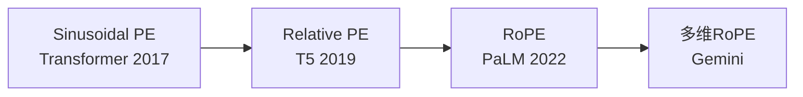
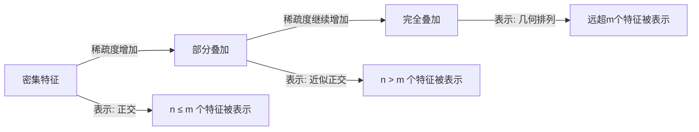
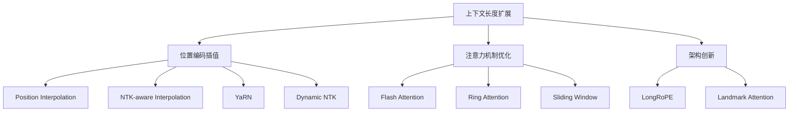

# 模块2进阶：嵌入与位置编码的前沿工业实践

> 本文是 [模块2: Embedding与位置编码](./README.md) 的进阶补充，深入分析三条技术线在嵌入领域的工业实践和前沿研究。

---

## 目录

- [1. Google的位置编码演进](#1-google的位置编码演进)
- [2. DeepSeek的RoPE工程实践](#2-deepseek的rope工程实践)
- [3. Anthropic的嵌入研究](#3-anthropic的嵌入研究)
- [4. 前沿研究方向](#4-前沿研究方向)

---

## 1. Google的位置编码演进

### 1.1 从Sinusoidal到RoPE

Google在位置编码领域的技术演进：

### 1.2 T5的Relative Attention Bias

T5使用了可学习的相对位置偏置：

$$\text{score}(i, j) = \frac{\mathbf{q}_i^T \mathbf{k}_j}{\sqrt{d}} + b_{|i-j|}$$

**特点**：
- 偏置 $b$ 是可学习参数
- 共享跨层（所有层使用相同的偏置）
- 位置差分桶化（Bucketed），减少参数量

**桶化策略**：

对于相对距离 $\delta = |i - j|$：
- $\delta \leq 8$：每个距离一个桶
- $\delta > 8$：对数分桶

$$\text{bucket}(\delta) = \begin{cases} \delta, & \delta \leq 8 \\ 8 + \lfloor \log_2(\delta/8) \cdot k \rfloor, & \delta > 8 \end{cases}$$

### 1.3 PaLM/Gemma的RoPE配置

PaLM和Gemma采用标准RoPE，关键配置：

| 参数 | PaLM | Gemma 2 |
|------|------|---------|
| base | 10000 | 10000 |
| 上下文长度 | 2048 | 8192 |
| 维度应用 | 全部head_dim | 全部head_dim |

### 1.4 Gemma 2的Sliding Window Attention

Gemma 2交替使用全局注意力和滑动窗口注意力：

- **偶数层**：全局注意力（标准RoPE）
- **奇数层**：滑动窗口注意力（局部RoPE）

这种设计减少了计算量，同时保持了长距离依赖建模能力。

---

## 2. DeepSeek的RoPE工程实践

### 2.1 DeepSeek-V2中的RoPE + MLA

DeepSeek-V2面临一个核心矛盾：

- **MLA目标**：压缩KV到低维空间，减少KV Cache
- **RoPE要求**：需要在原始维度上应用旋转

**解决方案**：将RoPE应用的维度与压缩维度分离。

$$\text{Key} = \text{concat}[\underbrace{W_{UK} c_{KV}}_{\text{压缩部分(无RoPE)}}, \underbrace{W_{KR} x}_{\text{RoPE部分}}]$$

**数学形式**：

KV被分为两部分：
1. **非位置部分**：通过低秩压缩，存储在KV Cache中
2. **位置部分**：小维度RoPE编码，独立存储

$$d_{KV} = d_{\text{compress}} + d_{\text{rope}}$$

**内存优化**：

| 方法 | KV Cache大小（per token） |
|------|--------------------------|
| 标准MHA | $2 \times n_h \times d_h$ |
| GQA (8组) | $2 \times 8 \times d_h$ |
| MLA | $d_c + d_r$ (远小于GQA) |

### 2.2 YaRN在DeepSeek中的应用

DeepSeek使用YaRN进行上下文长度扩展：

**YaRN核心思想**：对不同频率的RoPE维度使用不同的缩放策略。

$$\theta_i' = \begin{cases} \theta_i, & \lambda_i < \alpha \text{ (高频不变)} \\ \theta_i / s, & \lambda_i > \beta \text{ (低频线性插值)} \\ (1-\gamma)\frac{\theta_i}{s} + \gamma\theta_i, & \text{otherwise (渐变)} \end{cases}$$

其中 $\lambda_i = 2\pi / \theta_i$ 是波长。

---

## 3. Anthropic的嵌入研究

### 3.1 Superposition深入解读

论文 *Toy Models of Superposition* (Elhage et al., 2022) 是理解嵌入空间的里程碑工作。

#### 核心实验设置

构建一个简化模型：

$$\hat{x} = W^T W x$$

其中 $W \in \mathbb{R}^{m \times n}$，$m < n$（特征维度小于特征数量）。

**发现**：
1. 当特征稀疏时，模型学会在 $m$ 维空间中表示 $n > m$ 个特征
2. 特征按几何结构排列（如正多面体顶点）
3. 特征重要性和稀疏度共同决定是否被表示

#### 相变现象

随着特征稀疏度变化，表示方式发生**相变**：

**数学描述**：

特征 $i$ 的干扰（Interference）：

$$I_i = \sum_{j \neq i} (\hat{W}_i^T \hat{W}_j)^2$$

当 $I_i$ 小于阈值时，特征可以被准确恢复。

### 3.2 对词嵌入的启示

Superposition理论解释了嵌入的几个现象：

1. **为什么低维嵌入也有效？**
   - 语言特征天然稀疏（大多数特征在大多数上下文中不活跃）
   - Superposition允许在低维空间中编码大量特征

2. **为什么增加维度有递减收益？**
   - 低维时，增加维度减少特征间干扰，效果显著
   - 高维时，大多数特征已被充分表示，收益递减

3. **类比推理为什么有效？**
   - 线性关系（如 gender direction）可能是superposition的表现
   - 这些方向在嵌入空间中近似正交排列

### 3.3 稀疏自编码器（SAE）提取嵌入特征

Anthropic使用SAE（Sparse Autoencoder）从嵌入中提取可解释特征：

**方法**：

$$h = \text{ReLU}(W_e (x - b_d) + b_e)$$
$$\hat{x} = W_d h + b_d$$

其中：
- $W_e \in \mathbb{R}^{n_{\text{features}} \times d}$：编码器（$n_{\text{features}} \gg d$）
- $W_d \in \mathbb{R}^{d \times n_{\text{features}}}$：解码器
- $h$：稀疏的特征激活

**损失函数**：

$$L = \|x - \hat{x}\|_2^2 + \lambda \|h\|_1$$

L1正则化确保稀疏性。

**关键发现**（*Towards Monosemanticity*, Bricken et al., 2023）：
- SAE可以从Transformer的中间层提取出语义清晰的特征
- 每个特征对应一个明确的概念（如"Golden Gate Bridge"、"DNA序列"）
- 这些特征可以被选择性激活或抑制

> 这一研究方向为理解LLM内部工作原理提供了强有力的工具，也是Anthropic安全研究的核心基础之一。

---

## 4. 前沿研究方向

### 4.1 上下文长度扩展技术全景

#### Position Interpolation (PI)

最简单的长度扩展方法：将位置索引缩放到训练范围内。

$$\text{PI}: \theta_i' = \theta_i, \quad \text{pos}' = \frac{\text{pos}}{s}$$

将 $[0, L_{new})$ 映射到 $[0, L_{train})$。

**问题**：低频分量的分辨率降低。

#### NTK-aware Interpolation

核心思想：不同频率的分量使用不同的插值策略。

$$\theta_i' = \theta_i \cdot s^{-2i/d}$$

高频分量（位置分辨率重要）少缩放，低频分量多缩放。

### 4.2 百万级上下文窗口

**Ring Attention**（Google, 2023）：
- 将长序列分布到多个设备
- 设备间通过环形通信传递KV
- 理论上可支持无限长上下文

**Infini-Attention**（Google, 2024）：
- 压缩记忆 + 标准注意力的混合
- 固定内存支持无限长输入

### 4.3 位置编码在多模态中的推广

| 模态 | 位置编码方式 |
|------|------------|
| 文本 | 1D RoPE |
| 图像 | 2D Position Embedding (ViT) |
| 视频 | 3D Position Embedding |
| 音频 | 1D + 频率维度 |

**多模态统一位置编码**的挑战：
- 不同模态的"距离"含义不同
- 跨模态位置关系如何定义？

---

## 参考资料

### 论文
1. Su et al. (2021). *RoFormer: Enhanced Transformer with Rotary Position Embedding*.
2. Press et al. (2022). *Train Short, Test Long: Attention with Linear Biases*.
3. Elhage et al. (2022). *Toy Models of Superposition*. Anthropic.
4. Bricken et al. (2023). *Towards Monosemanticity*. Anthropic.
5. Chen et al. (2023). *Extending Context Window of Large Language Models via Position Interpolation*.
6. Liu et al. (2023). *Scaling Laws of RoPE-based Extrapolation*. (NTK-aware)
7. Peng et al. (2023). *YaRN: Efficient Context Window Extension of Large Language Models*.
8. Liu et al. (2023). *Ring Attention with Blockwise Transformers for Near-Infinite Context*.
9. DeepSeek-AI (2024). *DeepSeek-V2 Technical Report*.

### 博客
1. [Anthropic: Toy Models of Superposition](https://transformer-circuits.pub/2022/toy_model/index.html)
2. [Anthropic: Towards Monosemanticity](https://transformer-circuits.pub/2023/monosemantic-features/index.html)
3. [Eleuther AI: Rotary Embeddings](https://blog.eleuther.ai/rotary-embeddings/)
