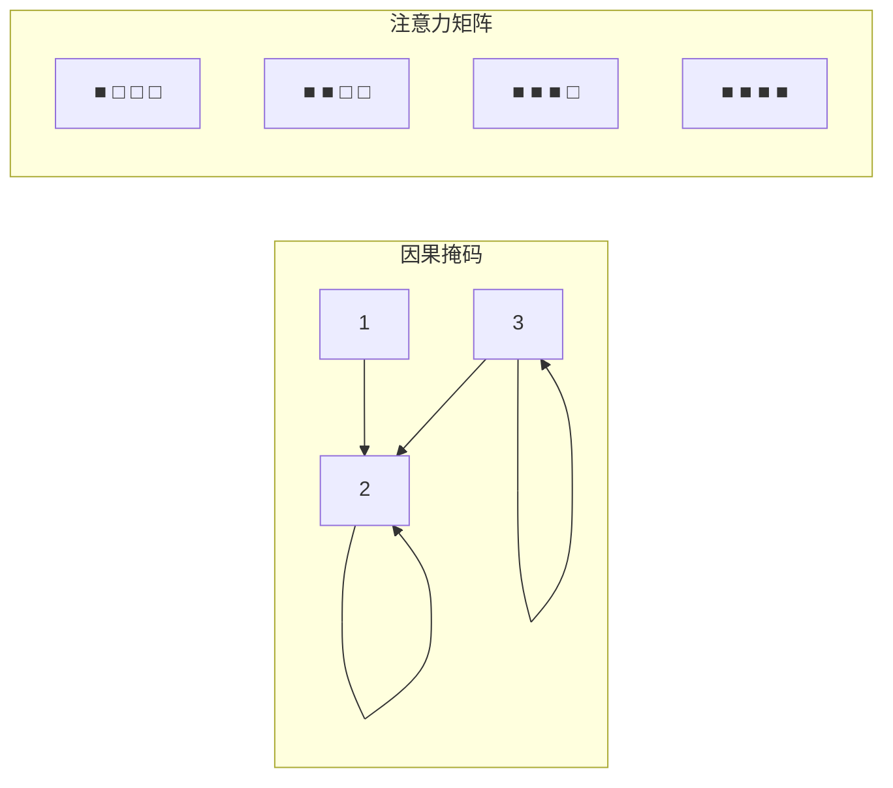
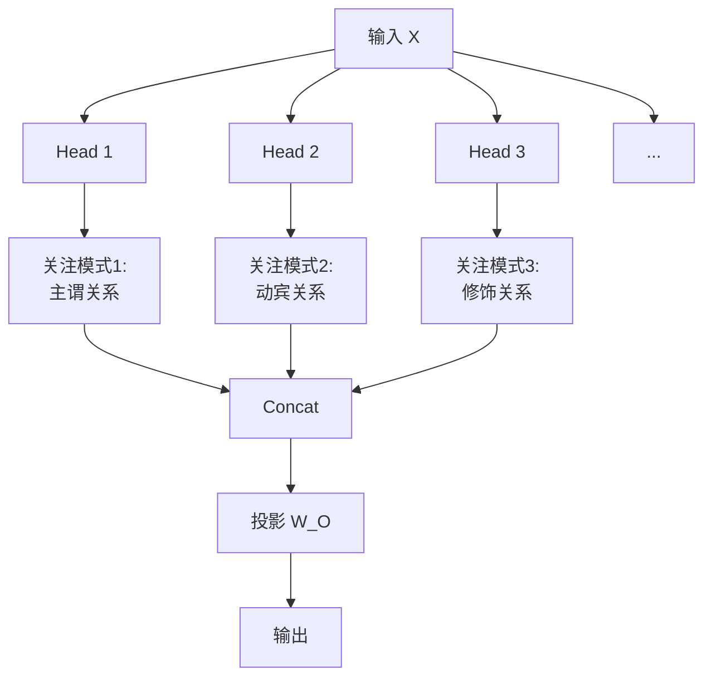
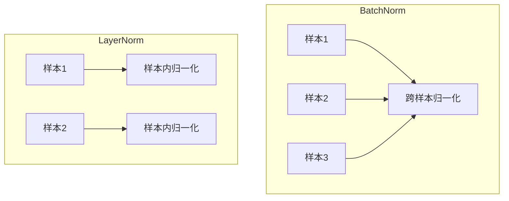
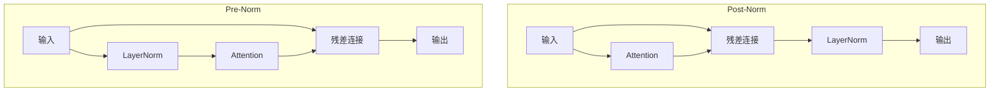
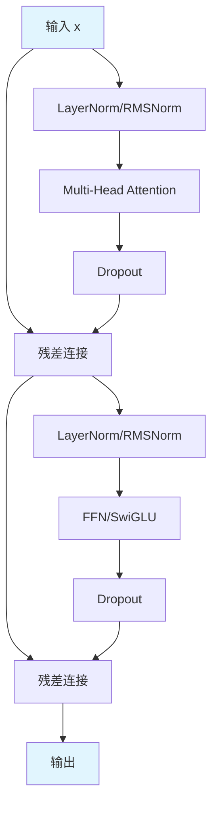
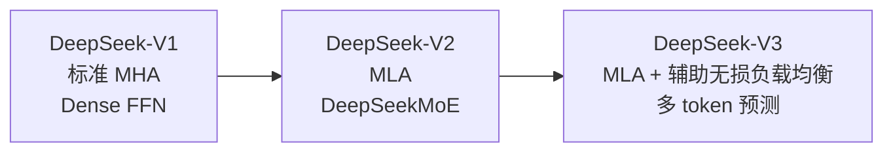
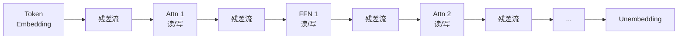
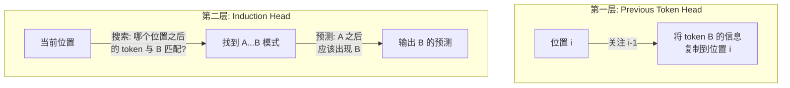
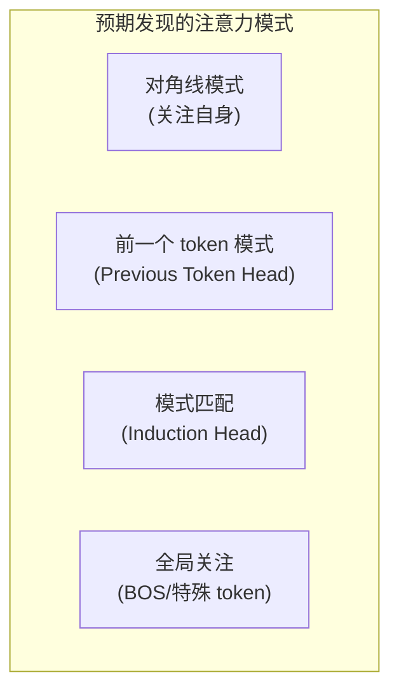
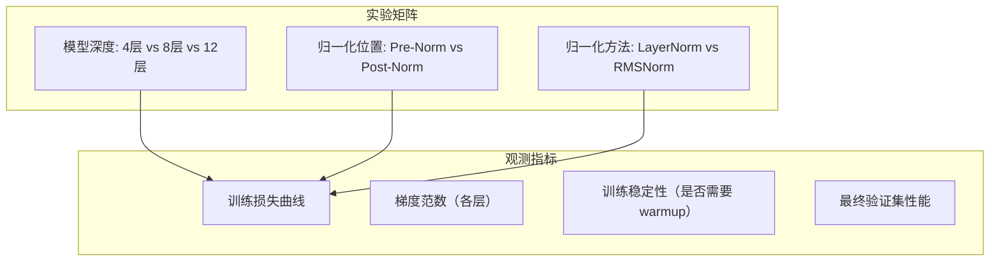

# 模块3：Transformer核心架构

> Transformer是现代LLM的基石。本章将深入Self-Attention的数学原理，逐层构建完整的Transformer Block，并实现工业级的代码。

---

## 目录

- [1. Self-Attention：核心机制](#1-self-attention核心机制)
- [2. Multi-Head Attention](#2-multi-head-attention)
- [3. Layer Normalization](#3-layer-normalization)
- [4. Feed-Forward Network](#4-feed-forward-network)
- [5. 完整的Transformer Block](#5-完整的transformer-block)
- [6. Google的Transformer实践](#6-google的transformer实践)
- [7. DeepSeek的Transformer创新](#7-deepseek的transformer创新)
- [8. Anthropic的Transformer研究](#8-anthropic的transformer研究)
- [9. 从零实现Transformer](#9-从零实现transformer)
- [10. 项目实践](#10-项目实践)

---

## 1. Self-Attention：核心机制

### 1.1 动机：序列建模的瓶颈

**RNN的问题**：

1. **顺序计算**：无法并行，训练慢
2. **长距离依赖**：信息需要逐步传递，梯度消失/爆炸

**Self-Attention的解决方案**：

每个位置可以直接关注所有位置，复杂度 $O(n^2)$ 但可并行。

### 1.2 数学推导

#### 输入表示

给定输入序列 $X = [x_1, x_2, \ldots, x_n] \in \mathbb{R}^{n \times d}$。

通过线性变换得到Query、Key、Value：

$$Q = XW_Q, \quad K = XW_K, \quad V = XW_V$$

其中 $W_Q, W_K, W_V \in \mathbb{R}^{d \times d_k}$。

#### 注意力分数

Query和Key的点积衡量相关性：

$$\text{score}(q_i, k_j) = q_i^T k_j$$

缩放因子 $\frac{1}{\sqrt{d_k}}$ 防止点积过大：

$$e_{ij} = \frac{q_i^T k_j}{\sqrt{d_k}}$$

#### 为什么要缩放？

**定理**：假设 $q$ 和 $k$ 的元素独立同分布，均值为0，方差为1，则：

$$\text{Var}(q^T k) = d_k$$

**证明**：

设 $q, k \in \mathbb{R}^{d_k}$，元素 $q_i, k_i \sim \mathcal{N}(0, 1)$ 且独立。

$$\mathbb{E}[q^T k] = \mathbb{E}[\sum_{i=1}^{d_k} q_i k_i] = \sum_{i=1}^{d_k} \mathbb{E}[q_i]\mathbb{E}[k_i] = 0$$

$$\text{Var}(q^T k) = \mathbb{E}[(q^T k)^2] - (\mathbb{E}[q^T k])^2 = \mathbb{E}[(\sum_{i=1}^{d_k} q_i k_i)^2]$$

由于 $q_i k_i$ 之间独立：

$$= \sum_{i=1}^{d_k} \mathbb{E}[q_i^2 k_i^2] = \sum_{i=1}^{d_k} \mathbb{E}[q_i^2]\mathbb{E}[k_i^2] = d_k$$

**缩放的作用**：

$$\text{Var}\left(\frac{q^T k}{\sqrt{d_k}}\right) = \frac{1}{d_k} \cdot d_k = 1$$

这样点积的方差保持为1，避免Softmax梯度消失。

#### Softmax归一化

$$\alpha_{ij} = \text{softmax}(e_{ij}) = \frac{\exp(e_{ij})}{\sum_{l=1}^{n} \exp(e_{il})}$$

性质：$\sum_{j=1}^{n} \alpha_{ij} = 1$，$\alpha_{ij} \geq 0$。

#### 加权求和

$$o_i = \sum_{j=1}^{n} \alpha_{ij} v_j$$

#### 矩阵形式

整体计算：

$$\text{Attention}(Q, K, V) = \text{softmax}\left(\frac{QK^T}{\sqrt{d_k}}\right)V$$

形状变换：

- $Q, K, V: [n, d_k]$
- $QK^T: [n, n]$（注意力矩阵）
- 输出: $[n, d_k]$

### 1.3 计算复杂度分析

| 操作 | 时间复杂度 | 空间复杂度 |
|------|------------|------------|
| $QK^T$ | $O(n^2 d_k)$ | $O(n^2)$ |
| Softmax | $O(n^2)$ | $O(n^2)$ |
| $AV$ | $O(n^2 d_k)$ | $O(n d_k)$ |
| **总计** | $O(n^2 d_k)$ | $O(n^2)$ |

**瓶颈**：$O(n^2)$ 的空间复杂度（存储注意力矩阵）。

### 1.4 因果注意力

对于Decoder-only模型，需要防止"看到未来"：

$$\alpha_{ij} = 0, \quad \forall j > i$$

实现方式：在Softmax前将未来位置的分数设为 $-\infty$：

$$e_{ij} = \begin{cases} \frac{q_i^T k_j}{\sqrt{d_k}}, & j \leq i \\ -\infty, & j > i \end{cases}$$



---

## 2. Multi-Head Attention

### 2.1 动机

单头注意力学习一种"关系模式"，但语言中存在多种关系（主谓、动宾、修饰等）。

**多头注意力**：让模型同时关注不同位置的不同表示子空间。

### 2.2 数学形式

将 $d_{model}$ 维的Query、Key、Value投影到 $h$ 个子空间，每个子空间维度为 $d_k = d_{model} / h$：

$$\text{head}_i = \text{Attention}(QW_Q^i, KW_K^i, VW_V^i)$$

其中 $W_Q^i, W_K^i, W_V^i \in \mathbb{R}^{d_{model} \times d_k}$。

将所有头的输出拼接并投影：

$$\text{MultiHead}(Q, K, V) = \text{Concat}(\text{head}_1, \ldots, \text{head}_h)W_O$$

其中 $W_O \in \mathbb{R}^{hd_k \times d_{model}}$。

### 2.3 为什么有效？



每个头学习不同的"关注模式"，拼接后综合多种关系信息。

### 2.4 参数量分析

假设 $d_{model} = 512$，$h = 8$，$d_k = 64$：

| 参数 | 形状 | 参数量 |
|------|------|--------|
| $W_Q$ | $512 \times 512$ | 262,144 |
| $W_K$ | $512 \times 512$ | 262,144 |
| $W_V$ | $512 \times 512$ | 262,144 |
| $W_O$ | $512 \times 512$ | 262,144 |
| **总计** | | 1,048,576 |

**注意**：虽然有多头，但总参数量与单头相同（假设总维度不变）。

### 2.5 实现

```python
import torch
import torch.nn as nn
import math


class MultiHeadAttention(nn.Module):
    """
    多头注意力实现
    """
    
    def __init__(self, d_model: int, n_heads: int, dropout: float = 0.1):
        """
        Args:
            d_model: 模型维度
            n_heads: 注意力头数量
            dropout: Dropout概率
        """
        super().__init__()
        
        assert d_model % n_heads == 0, "d_model必须能被n_heads整除"
        
        self.d_model = d_model
        self.n_heads = n_heads
        self.head_dim = d_model // n_heads
        self.scale = self.head_dim ** -0.5
        
        # Q, K, V投影
        self.wq = nn.Linear(d_model, d_model, bias=False)
        self.wk = nn.Linear(d_model, d_model, bias=False)
        self.wv = nn.Linear(d_model, d_model, bias=False)
        
        # 输出投影
        self.wo = nn.Linear(d_model, d_model, bias=False)
        
        self.dropout = nn.Dropout(dropout)
    
    def forward(
        self,
        query: torch.Tensor,
        key: torch.Tensor,
        value: torch.Tensor,
        mask: torch.Tensor = None,
        is_causal: bool = False
    ) -> torch.Tensor:
        """
        Args:
            query: [batch, seq_len_q, d_model]
            key: [batch, seq_len_k, d_model]
            value: [batch, seq_len_k, d_model]
            mask: [batch, seq_len_q, seq_len_k] 或 None
            is_causal: 是否使用因果掩码
            
        Returns:
            [batch, seq_len_q, d_model]
        """
        batch_size = query.shape[0]
        seq_len_q = query.shape[1]
        seq_len_k = key.shape[1]
        
        # 线性投影
        q = self.wq(query)  # [batch, seq_len_q, d_model]
        k = self.wk(key)    # [batch, seq_len_k, d_model]
        v = self.wv(value)  # [batch, seq_len_k, d_model]
        
        # 重塑为多头形式
        # [batch, seq_len, d_model] -> [batch, n_heads, seq_len, head_dim]
        q = q.view(batch_size, seq_len_q, self.n_heads, self.head_dim).transpose(1, 2)
        k = k.view(batch_size, seq_len_k, self.n_heads, self.head_dim).transpose(1, 2)
        v = v.view(batch_size, seq_len_k, self.n_heads, self.head_dim).transpose(1, 2)
        
        # 计算注意力分数
        # [batch, n_heads, seq_len_q, head_dim] @ [batch, n_heads, head_dim, seq_len_k]
        # = [batch, n_heads, seq_len_q, seq_len_k]
        scores = torch.matmul(q, k.transpose(-2, -1)) * self.scale
        
        # 应用掩码
        if is_causal:
            # 因果掩码：下三角矩阵
            causal_mask = torch.triu(
                torch.ones(seq_len_q, seq_len_k, device=query.device),
                diagonal=1
            ).bool()
            scores = scores.masked_fill(causal_mask, float('-inf'))
        
        if mask is not None:
            # mask: [batch, 1, 1, seq_len_k] 或 [batch, seq_len_q, seq_len_k]
            scores = scores.masked_fill(mask == 0, float('-inf'))
        
        # Softmax
        attn = torch.softmax(scores, dim=-1)
        attn = self.dropout(attn)
        
        # 加权求和
        # [batch, n_heads, seq_len_q, seq_len_k] @ [batch, n_heads, seq_len_k, head_dim]
        # = [batch, n_heads, seq_len_q, head_dim]
        out = torch.matmul(attn, v)
        
        # 重塑回来
        # [batch, n_heads, seq_len_q, head_dim] -> [batch, seq_len_q, d_model]
        out = out.transpose(1, 2).contiguous().view(batch_size, seq_len_q, self.d_model)
        
        # 输出投影
        out = self.wo(out)
        
        return out
```

---

## 3. Layer Normalization

### 3.1 Batch Normalization的问题

Batch Normalization在NLP中效果不佳，原因：

1. **序列长度变化**：不同样本的序列长度不同，难以batch统计
2. **小批量问题**：NLP任务batch size通常较小，统计不稳定
3. **训练/推理不一致**：推理时使用训练时的统计量

### 3.2 Layer Normalization

对每个样本独立归一化，沿特征维度计算统计量：

$$\mu_i = \frac{1}{d} \sum_{j=1}^{d} x_{ij}$$

$$\sigma_i^2 = \frac{1}{d} \sum_{j=1}^{d} (x_{ij} - \mu_i)^2$$

$$\hat{x}_{ij} = \frac{x_{ij} - \mu_i}{\sqrt{\sigma_i^2 + \epsilon}}$$

$$y_{ij} = \gamma_j \hat{x}_{ij} + \beta_j$$

其中 $\gamma, \beta$ 是可学习参数。



### 3.3 RMSNorm

RMSNorm（Root Mean Square Normalization）是LayerNorm的简化版本，被Llama等模型采用。

**核心思想**：去掉均值中心化，只做缩放。

$$\text{RMS}(x) = \sqrt{\frac{1}{d} \sum_{j=1}^{d} x_j^2}$$

$$\hat{x}_j = \frac{x_j}{\text{RMS}(x) + \epsilon}$$

$$y_j = \gamma_j \hat{x}_j$$

**优势**：
1. 计算更快（省去均值计算）
2. 效果相当甚至更好
3. 被Llama、Gemma、DeepSeek采用

### 3.4 实现

```python
class LayerNorm(nn.Module):
    """
    Layer Normalization
    """
    
    def __init__(self, d_model: int, eps: float = 1e-6):
        super().__init__()
        self.gamma = nn.Parameter(torch.ones(d_model))
        self.beta = nn.Parameter(torch.zeros(d_model))
        self.eps = eps
    
    def forward(self, x: torch.Tensor) -> torch.Tensor:
        """
        Args:
            x: [..., d_model]
            
        Returns:
            归一化后的张量
        """
        mean = x.mean(dim=-1, keepdim=True)
        var = x.var(dim=-1, keepdim=True, unbiased=False)
        
        x_norm = (x - mean) / torch.sqrt(var + self.eps)
        
        return self.gamma * x_norm + self.beta


class RMSNorm(nn.Module):
    """
    Root Mean Square Layer Normalization
    
    被Llama、Gemma、DeepSeek等模型采用
    """
    
    def __init__(self, d_model: int, eps: float = 1e-6):
        super().__init__()
        self.gamma = nn.Parameter(torch.ones(d_model))
        self.eps = eps
    
    def forward(self, x: torch.Tensor) -> torch.Tensor:
        """
        Args:
            x: [..., d_model]
            
        Returns:
            归一化后的张量
        """
        rms = torch.sqrt(torch.mean(x ** 2, dim=-1, keepdim=True) + self.eps)
        x_norm = x / rms
        
        return self.gamma * x_norm
```

### 3.5 Pre-Norm vs Post-Norm

**Post-Norm**（原始Transformer）：

$$x_{l+1} = \text{LN}(x_l + \text{Attention}(x_l))$$

**Pre-Norm**（现代LLM主流）：

$$x_{l+1} = x_l + \text{Attention}(\text{LN}(x_l))$$



**Pre-Norm的优势**：

1. **梯度流动更稳定**：梯度可以直接流向浅层
2. **训练更稳定**：不需要warmup
3. **被Llama、Gemma、DeepSeek采用**

---

## 4. Feed-Forward Network

### 4.1 标准FFN

原始Transformer使用两层MLP：

$$\text{FFN}(x) = \text{GELU}(xW_1 + b_1)W_2 + b_2$$

其中 $W_1 \in \mathbb{R}^{d \times 4d}$，$W_2 \in \mathbb{R}^{4d \times d}$。

**中间层维度通常为4倍**。

### 4.2 激活函数

#### ReLU

$$\text{ReLU}(x) = \max(0, x)$$

简单高效，但存在"死神经元"问题。

#### GELU

$$\text{GELU}(x) = x \cdot \Phi(x)$$

其中 $\Phi(x)$ 是标准正态分布的CDF。

近似计算：

$$\text{GELU}(x) \approx 0.5x \left(1 + \tanh\left(\sqrt{\frac{2}{\pi}}(x + 0.044715x^3)\right)\right)$$

被BERT、GPT采用。

#### SwiGLU

SwiGLU是Llama采用的激活函数，结合了Swish和GLU：

$$\text{SwiGLU}(x, W, V, W_2) = \text{Swish}(xW) \odot (xV)W_2$$

其中 $\text{Swish}(x) = x \cdot \sigma(x)$。

**优势**：
1. 平滑性：处处可导
2. 非单调性：更好的表达能力
3. 门控机制：选择性传递信息

### 4.3 实现

```python
class FeedForward(nn.Module):
    """
    标准FFN（使用GELU）
    """
    
    def __init__(self, d_model: int, d_ff: int = None, dropout: float = 0.1):
        super().__init__()
        d_ff = d_ff or 4 * d_model
        
        self.w1 = nn.Linear(d_model, d_ff)
        self.w2 = nn.Linear(d_ff, d_model)
        self.dropout = nn.Dropout(dropout)
        self.gelu = nn.GELU()
    
    def forward(self, x: torch.Tensor) -> torch.Tensor:
        return self.dropout(self.w2(self.gelu(self.w1(x))))


class SwiGLU(nn.Module):
    """
    SwiGLU激活函数的FFN
    
    被Llama、Gemma、DeepSeek采用
    
    结构：
    output = (Swish(xW_gate) * xW_up) W_down
    """
    
    def __init__(self, d_model: int, d_ff: int = None, dropout: float = 0.1):
        super().__init__()
        # 通常d_ff = 2/3 * 4 * d_model = 8/3 * d_model
        d_ff = d_ff or int(8 * d_model / 3)
        
        self.w_gate = nn.Linear(d_model, d_ff, bias=False)
        self.w_up = nn.Linear(d_model, d_ff, bias=False)
        self.w_down = nn.Linear(d_ff, d_model, bias=False)
        self.dropout = nn.Dropout(dropout)
    
    def forward(self, x: torch.Tensor) -> torch.Tensor:
        """
        SwiGLU(x) = (Swish(xW_gate) * xW_up) W_down
        
        Swish(x) = x * sigmoid(x)
        """
        gate = torch.sigmoid(self.w_gate(x)) * self.w_gate(x)  # Swish
        up = self.w_up(x)
        
        return self.dropout(self.w_down(gate * up))
```

---

## 5. 完整的Transformer Block

### 5.1 架构图



### 5.2 数学形式

**Pre-Norm Transformer Block**：

$$h = x + \text{Dropout}(\text{Attention}(\text{LN}(x)))$$

$$y = h + \text{Dropout}(\text{FFN}(\text{LN}(h)))$$

### 5.3 实现

```python
class TransformerBlock(nn.Module):
    """
    完整的Transformer Block（Pre-Norm风格）
    
    特点：
    1. Pre-Norm（LayerNorm在注意力之前）
    2. RMSNorm（比LayerNorm更高效）
    3. RoPE位置编码
    4. SwiGLU激活函数
    """
    
    def __init__(
        self,
        d_model: int,
        n_heads: int,
        d_ff: int = None,
        dropout: float = 0.1,
        max_seq_len: int = 2048
    ):
        super().__init__()
        
        # 注意力层
        self.attention = MultiHeadAttention(d_model, n_heads, dropout)
        self.attention_norm = RMSNorm(d_model)
        
        # FFN层
        self.ffn = SwiGLU(d_model, d_ff, dropout)
        self.ffn_norm = RMSNorm(d_model)
        
        # Dropout
        self.dropout = nn.Dropout(dropout)
    
    def forward(
        self,
        x: torch.Tensor,
        mask: torch.Tensor = None,
        is_causal: bool = False
    ) -> torch.Tensor:
        """
        Args:
            x: [batch, seq_len, d_model]
            mask: 注意力掩码
            is_causal: 是否使用因果掩码
            
        Returns:
            [batch, seq_len, d_model]
        """
        # Pre-Norm + Attention + 残差
        residual = x
        x = self.attention_norm(x)
        x = self.attention(x, x, x, mask, is_causal)
        x = self.dropout(x)
        x = residual + x
        
        # Pre-Norm + FFN + 残差
        residual = x
        x = self.ffn_norm(x)
        x = self.ffn(x)
        x = self.dropout(x)
        x = residual + x
        
        return x
```

---

## 6. Google的Transformer实践

### 6.1 原版Transformer（2017）

**架构**：Encoder-Decoder

**特点**：
- Post-Norm
- Sinusoidal位置编码
- GELU激活
- FFN维度 = 4 × d_model

### 6.2 T5（2019）

**架构**：Encoder-Decoder

**改进**：
- Pre-Norm
- 相对位置编码
- 简化FFN（无bias）

### 6.3 PaLM（2022）

**架构**：Decoder-only

**改进**：
- Pre-Norm
- RoPE位置编码
- SwiGLU激活
- Multi-Query Attention (MQA)
- 并行FFN和Attention

**并行结构**：

$$y = x + \text{Attention}(\text{LN}(x)) + \text{FFN}(\text{LN}(x))$$

Attention和FFN并行计算，而非串行。

### 6.4 Gemma（2024）

**架构**：Decoder-only

**改进**：
- Pre-Norm + RMSNorm
- RoPE位置编码
- GeGLU激活
- 滑动窗口注意力
- Logit软截断

---

## 7. DeepSeek的Transformer创新

DeepSeek 在 Transformer 架构上做出了多项重要创新，尤其是在注意力机制和专家混合方面。

### 7.1 Multi-head Latent Attention (MLA)

DeepSeek-V2 提出的 MLA 是对标准 MHA 的重大改进，通过**低秩压缩 KV** 大幅降低推理成本。

**核心思想**：将 KV 压缩到低维潜在空间，推理时只需缓存压缩表示。

$$c_{KV} = W_{DKV} h_t \in \mathbb{R}^{d_c}, \quad d_c \ll n_h \cdot d_h$$

**KV Cache 压缩效果**：

| 方案 | KV Cache 大小（每层每 token） | 典型值 |
|------|-------------------------------|--------|
| 标准 MHA | $2 \times n_h \times d_h$ | 32,768 |
| GQA (Llama 3) | $2 \times n_{kv} \times d_h$ | 2,048 |
| MLA (DeepSeek) | $d_c + d_r$ | 576 |

**约 57 倍压缩**，使得 DeepSeek-V2 可以用更少的显存服务更长的上下文。

> 详见 [进阶文档](./advanced.md) 中对 MLA 数学原理的深入分析。

### 7.2 DeepSeek 的架构演进



| 特性 | DeepSeek-V1 | DeepSeek-V2 | DeepSeek-V3 |
|------|-------------|-------------|-------------|
| 注意力 | MHA | MLA | MLA |
| FFN | Dense | MoE (细粒度专家) | MoE (改进) |
| 位置编码 | RoPE | 解耦 RoPE | 解耦 RoPE |
| 激活函数 | SwiGLU | SwiGLU | SwiGLU |
| 归一化 | RMSNorm | RMSNorm | RMSNorm |

---

## 8. Anthropic的Transformer研究

Anthropic 在 Transformer 内部机制的研究上处于前沿，其 **Transformer Circuits** 研究线为理解 Transformer 的工作原理提供了重要理论框架。

### 8.1 残差流视角 (Residual Stream)

Anthropic 提出了理解 Transformer 的一个关键框架：**残差流**。

**核心观点**：将残差连接视为信息的"主通道"（residual stream），每个注意力层和 FFN 层是从这个流中"读取"信息并"写入"信息的模块。



**数学表达**：

$$x_{final} = x_0 + \sum_{l=1}^{L} \text{Attn}_l(x) + \sum_{l=1}^{L} \text{FFN}_l(x)$$

每一层的输出是对残差流的**增量更新**，而非替换。

### 8.2 Induction Heads（归纳头）

**Induction Heads** 是 Anthropic 发现的一种关键注意力模式，是 Transformer 进行上下文学习（in-context learning）的核心机制。

**工作原理**：

Induction Head 由**两个注意力头的组合**实现：



**具体示例**：

序列中出现 "...Harry Potter...Harry"，Induction Head 的推理过程：

1. 第一层：Previous Token Head 将 "Harry" 之后的 "Potter" 信息传递
2. 第二层：当再次看到 "Harry" 时，Induction Head 查找之前 "Harry" 后面跟的是什么
3. 输出：预测下一个词是 "Potter"

**数学机制**：

Induction Head 通过 QK 电路实现模式匹配：

$$A_{ij} \propto \exp\left(\frac{(x_i W_Q)(x_j W_K)^T}{\sqrt{d_k}}\right)$$

其中 $W_Q$ 和 $W_K$ 学习到的模式使得：当位置 $j$ 之后的 token 与当前位置之前的 token 匹配时，注意力分数最高。

### 8.3 Transformer Circuits 关键发现

Anthropic 的 Transformer Circuits 研究揭示了多个重要现象：

**1. 注意力头的可解释角色**

| 角色 | 功能 | 示例 |
|------|------|------|
| Previous Token Head | 关注前一个 token | 为 Induction Head 提供信息 |
| Induction Head | 模式完成 | "A B ... A" → 预测 B |
| Duplicate Token Head | 检测重复 | 标记序列中重复出现的 token |
| Inhibition Head | 抑制重复 | 降低已出现 token 的概率 |

**2. Superposition 在注意力中的体现**

注意力头并非只学习单一功能——它们以 Superposition 的方式同时编码多种功能。这意味着：
- 单个注意力头可能同时服务于多种语法/语义任务
- 头的功能在不同输入上可能发生变化
- 简单地按功能标记头可能过于简化

**3. 相变与涌现**

Anthropic 的研究表明，Induction Head 的出现与模型训练中的**相变**（phase change）有关：
- 在训练早期，模型主要依赖 n-gram 统计
- 在某个临界点，Induction Head 突然形成
- 此后模型的 in-context learning 能力急剧提升
- 这一相变与训练损失的突然下降相对应

> 更多关于 Transformer Circuits 和 Mechanistic Interpretability 的内容详见 [进阶文档](./advanced.md)。

### 8.4 三条技术线的 Transformer 架构对比

| 维度 | Google | DeepSeek | Anthropic (Claude) |
|------|--------|----------|-------------------|
| 注意力 | MHA → MQA → GQA | MHA → MLA | 未公开 |
| 归一化 | LayerNorm → RMSNorm | RMSNorm | 未公开 |
| 激活函数 | GELU → GeGLU/SwiGLU | SwiGLU | 未公开 |
| 位置编码 | Sinusoidal → RPB → RoPE | 解耦 RoPE | 未公开 |
| FFN | Dense → MoE | Dense → 细粒度 MoE | 未公开 |
| 研究重点 | 架构效率、多模态 | 推理效率、成本优化 | 可解释性、安全对齐 |

---

## 9. 从零实现Transformer

### 9.1 完整代码

```python
"""
完整的Transformer实现
包含：Embedding、Transformer Block、输出层
"""

import torch
import torch.nn as nn
import math
from typing import Optional


class Transformer(nn.Module):
    """
    完整的Transformer模型（Decoder-only）
    
    特点：
    - Pre-Norm
    - RMSNorm
    - RoPE位置编码
    - SwiGLU激活
    - 因果注意力
    """
    
    def __init__(
        self,
        vocab_size: int,
        d_model: int = 512,
        n_heads: int = 8,
        n_layers: int = 6,
        d_ff: int = None,
        max_seq_len: int = 2048,
        dropout: float = 0.1,
        tie_weights: bool = True
    ):
        super().__init__()
        
        self.vocab_size = vocab_size
        self.d_model = d_model
        self.n_layers = n_layers
        
        # Token Embedding
        self.token_embedding = nn.Embedding(vocab_size, d_model)
        
        # Dropout
        self.dropout = nn.Dropout(dropout)
        
        # Transformer Blocks
        self.layers = nn.ModuleList([
            TransformerBlock(d_model, n_heads, d_ff, dropout, max_seq_len)
            for _ in range(n_layers)
        ])
        
        # 最终的LayerNorm
        self.final_norm = RMSNorm(d_model)
        
        # 输出层（语言模型头）
        self.lm_head = nn.Linear(d_model, vocab_size, bias=False)
        
        # 权重绑定：Embedding和输出层共享权重
        if tie_weights:
            self.lm_head.weight = self.token_embedding.weight
        
        # 初始化
        self._init_weights()
    
    def _init_weights(self):
        """
        初始化权重
        
        使用Xavier初始化线性层，Embedding使用正态分布
        """
        for module in self.modules():
            if isinstance(module, nn.Linear):
                nn.init.xavier_uniform_(module.weight)
                if module.bias is not None:
                    nn.init.zeros_(module.bias)
            elif isinstance(module, nn.Embedding):
                nn.init.normal_(module.weight, mean=0, std=self.d_model ** -0.5)
    
    def forward(
        self,
        input_ids: torch.Tensor,
        mask: Optional[torch.Tensor] = None
    ) -> torch.Tensor:
        """
        Args:
            input_ids: [batch, seq_len] 词元ID
            mask: [batch, seq_len] 注意力掩码（可选）
            
        Returns:
            logits: [batch, seq_len, vocab_size]
        """
        batch_size, seq_len = input_ids.shape
        
        # Token Embedding
        x = self.token_embedding(input_ids)  # [batch, seq_len, d_model]
        x = self.dropout(x)
        
        # 通过所有Transformer Block
        for layer in self.layers:
            x = layer(x, mask=mask, is_causal=True)
        
        # 最终归一化
        x = self.final_norm(x)
        
        # 输出logits
        logits = self.lm_head(x)  # [batch, seq_len, vocab_size]
        
        return logits
    
    def generate(
        self,
        input_ids: torch.Tensor,
        max_new_tokens: int,
        temperature: float = 1.0,
        top_k: int = None,
        top_p: float = None
    ) -> torch.Tensor:
        """
        文本生成（自回归）
        
        Args:
            input_ids: [batch, seq_len] 输入词元ID
            max_new_tokens: 最大生成token数
            temperature: 温度参数
            top_k: Top-K采样
            top_p: Nucleus采样
            
        Returns:
            生成的词元ID序列
        """
        for _ in range(max_new_tokens):
            # 截断到最大长度
            idx_cond = input_ids[:, -self.max_seq_len:]
            
            # 前向传播
            logits = self.forward(idx_cond)
            
            # 只取最后一个位置的logits
            logits = logits[:, -1, :] / temperature
            
            # Top-K采样
            if top_k is not None:
                v, _ = torch.topk(logits, min(top_k, logits.size(-1)))
                logits[logits < v[:, [-1]]] = float('-inf')
            
            # Top-P (Nucleus) 采样
            if top_p is not None:
                sorted_logits, sorted_indices = torch.sort(logits, descending=True)
                cumulative_probs = torch.cumsum(
                    torch.softmax(sorted_logits, dim=-1), dim=-1
                )
                sorted_indices_to_remove = cumulative_probs > top_p
                sorted_indices_to_remove[..., 1:] = sorted_indices_to_remove[..., :-1].clone()
                sorted_indices_to_remove[..., 0] = 0
                indices_to_remove = sorted_indices_to_remove.scatter(
                    1, sorted_indices, sorted_indices_to_remove
                )
                logits[indices_to_remove] = float('-inf')
            
            # 采样
            probs = torch.softmax(logits, dim=-1)
            next_token = torch.multinomial(probs, num_samples=1)
            
            # 拼接
            input_ids = torch.cat([input_ids, next_token], dim=1)
        
        return input_ids
    
    def count_parameters(self) -> int:
        """统计模型参数量"""
        return sum(p.numel() for p in self.parameters())
    
    def estimate_memory(self, batch_size: int = 1, seq_len: int = 512) -> dict:
        """
        估计显存使用
        
        Returns:
            参数显存、激活显存、总显存（GB）
        """
        # 参数显存（FP32）
        param_memory = self.count_parameters() * 4 / 1e9
        
        # 激活显存（粗略估计）
        # 每层大约需要 2 * batch_size * seq_len * d_model * 2 (FP16)
        activation_memory = (
            2 * batch_size * seq_len * self.d_model * self.n_layers * 2 / 1e9
        )
        
        return {
            'parameters_GB': param_memory,
            'activations_GB': activation_memory,
            'total_GB': param_memory + activation_memory
        }


# 使用示例
if __name__ == "__main__":
    # 创建模型
    model = Transformer(
        vocab_size=32000,
        d_model=512,
        n_heads=8,
        n_layers=6,
        max_seq_len=2048
    )
    
    print(f"参数量: {model.count_parameters():,}")
    print(f"显存估计: {model.estimate_memory()}")
    
    # 测试前向传播
    batch_size = 2
    seq_len = 128
    input_ids = torch.randint(0, 32000, (batch_size, seq_len))
    
    logits = model(input_ids)
    print(f"输入形状: {input_ids.shape}")
    print(f"输出形状: {logits.shape}")
```

---

## 10. 练习项目

### 项目1：Mini-GPT 从零训练（★☆☆ 入门）

**目标**：实现完整的小型 GPT 模型，在 Shakespeare 文本上训练并生成新文本。

**任务**：
1. 使用 `code/transformer/` 中的模块组装完整模型
2. 加载 Shakespeare 数据集（约 1MB 纯文本）
3. 实现字符级或子词级分词
4. 训练语言模型（目标：验证集 loss < 1.5）
5. 实现自回归生成，调节 temperature/top-k/top-p 参数

**参考代码框架**：

```python
# 训练循环骨架
for epoch in range(epochs):
    for batch in dataloader:
        input_ids = batch[:, :-1]
        targets = batch[:, 1:]

        logits = model(input_ids)
        loss = F.cross_entropy(
            logits.view(-1, vocab_size),
            targets.view(-1)
        )

        optimizer.zero_grad()
        loss.backward()
        torch.nn.utils.clip_grad_norm_(model.parameters(), 1.0)
        optimizer.step()
```

**关键学习点**：
- 理解自回归语言模型的训练目标（next token prediction）
- 因果掩码的作用
- 学习率调度和梯度裁剪的必要性

---

### 项目2：注意力可视化与模式分析（★★☆ 进阶）

**目标**：可视化注意力矩阵，分析不同注意力头学到的模式。

**任务**：
1. 修改 `MultiHeadAttention` 使其返回注意力权重矩阵
2. 在训练好的模型上输入测试文本，提取所有层所有头的注意力矩阵
3. 可视化注意力热图（使用 matplotlib）
4. 识别并标注不同类型的注意力模式



**分析方向**：
- 浅层 vs 深层注意力模式有何差异？
- 能否找到 Induction Head（Anthropic 发现的关键模式）？
- 不同头的注意力熵分布如何？（高熵 = 分散注意力，低熵 = 集中关注）

---

### 项目3：Pre-Norm vs Post-Norm 对比实验（★★★ 挑战）

**目标**：通过控制变量实验，验证 Pre-Norm 和 Post-Norm 在训练稳定性和性能上的差异。

**实验设计**：



**核心实验**：
1. 实现 Post-Norm 版本的 `TransformerBlock`
2. 固定所有超参数，只改变归一化策略
3. 记录训练过程中每层的梯度范数
4. 分析：Post-Norm 在深层模型中是否出现梯度消失/爆炸？
5. 验证：Pre-Norm 是否真的不需要 learning rate warmup？

**预期发现**：
- Post-Norm 在 12 层模型上可能训练不稳定
- Pre-Norm 的梯度范数在各层间更均匀
- RMSNorm 比 LayerNorm 速度更快，性能相当

---

### 项目4：SwiGLU vs GELU 激活函数对比（★★★ 挑战）

**目标**：在相同参数预算下，对比 SwiGLU 和标准 GELU FFN 的效果差异。

**实验设计**：
1. 控制总参数量相同（SwiGLU 的 d_ff 调整为 8d/3）
2. 在相同数据上训练两种模型
3. 对比训练速度、收敛速度、最终性能

**进阶任务**：
- 实现 GeGLU（GELU + GLU 门控）并加入对比
- 分析门控机制的稀疏激活特性（统计门控值的分布）
- 可视化 FFN 层的激活模式

**关键代码**：

```python
# 实现 GeGLU
class GeGLU(nn.Module):
    def forward(self, x):
        gate = F.gelu(self.w_gate(x))  # GELU 门控
        up = self.w_up(x)
        return self.w_down(gate * up)
```

**预期发现**：
- SwiGLU 在相同参数量下优于标准 GELU FFN
- 门控值呈现稀疏分布（大部分接近 0）
- GLU 系列的收敛速度通常更快

---

## 本章小结

### 核心知识点

1. **Self-Attention**：通过Q-K-V计算注意力权重，$O(n^2)$复杂度但可并行
2. **Multi-Head Attention**：多头学习不同的关注模式
3. **Layer Norm**：Pre-Norm比Post-Norm更稳定
4. **RMSNorm**：LayerNorm的简化版，被现代LLM采用
5. **SwiGLU**：门控激活函数，效果优于GELU
6. **Induction Heads**：Anthropic发现的上下文学习核心机制
7. **MLA**：DeepSeek的低秩KV压缩，约57倍推理效率提升

### 数学要点

- Self-Attention：$\text{softmax}(QK^T/\sqrt{d_k})V$
- 缩放因子：$\text{Var}(q^Tk) = d_k$，需要除以$\sqrt{d_k}$
- RMSNorm：$\hat{x} = x / \sqrt{\frac{1}{d}\sum x_i^2}$

### 实践要点

1. Pre-Norm + RMSNorm是现代LLM标准配置
2. RoPE在注意力层内部应用
3. 权重绑定可减少参数量
4. 初始化很重要：Xavier或正态分布
5. 完整代码见 `code/transformer/` 目录（attention.py, normalization.py, feedforward.py, block.py, model.py）

---

## 参考资料

### 论文

1. Vaswani et al. (2017). *Attention Is All You Need*.
2. Ba et al. (2016). *Layer Normalization*.
3. Zhang & Sennrich (2019). *Root Mean Square Layer Normalization*.
4. Shazeer (2020). *GLU Variants Improve Transformer*.
5. Elhage et al. (2021). *A Mathematical Framework for Transformer Circuits*. Anthropic.
6. Olsson et al. (2022). *In-context Learning and Induction Heads*. Anthropic.
7. DeepSeek-AI (2024). *DeepSeek-V2: A Strong, Economical, and Efficient Mixture-of-Experts Language Model*.

### 博客

1. [The Illustrated Transformer](https://jalammar.github.io/illustrated-transformer/)
2. [The Annotated Transformer](https://nlp.seas.harvard.edu/annotated-transformer/)
3. [Transformer Circuits Thread](https://transformer-circuits.pub/) - Anthropic

---

**下一章预告**：[模块4: Decoder-only架构族](../04_decoder_only/README.md) - 深入GPT、Llama架构设计，理解现代LLM的演进。
