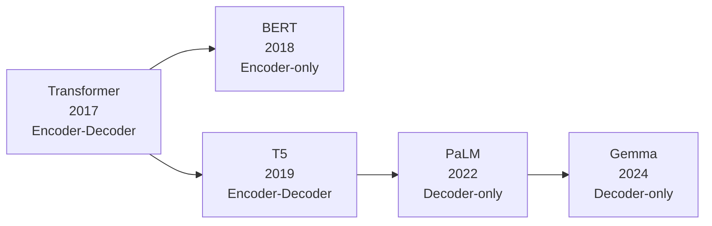
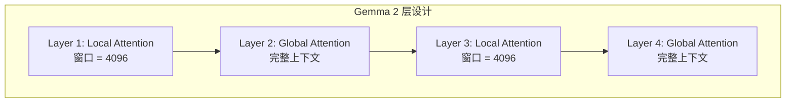
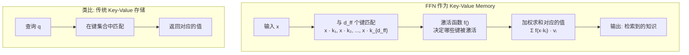
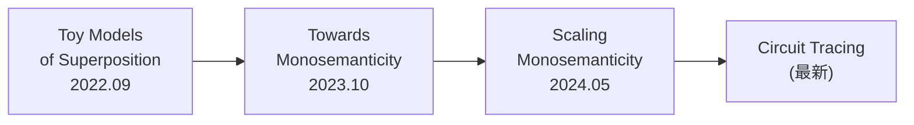

# Transformer进阶：架构演进与可解释性前沿

> 本文是 [模块3: Transformer核心架构](./README.md) 的进阶补充，深入分析 Google、DeepSeek、Anthropic 三条技术线在 Transformer 架构上的创新实践，以及机制可解释性的前沿研究。

---

## 目录

- [1. Google 的 Transformer 架构演进](#1-google-的-transformer-架构演进)
- [2. DeepSeek 的架构创新](#2-deepseek-的架构创新)
- [3. Anthropic 的 Transformer 可解释性研究](#3-anthropic-的-transformer-可解释性研究)
- [4. 前沿话题](#4-前沿话题)

---

## 1. Google 的 Transformer 架构演进

### 1.1 从 Encoder-Decoder 到 Decoder-only

Google 在 Transformer 架构上经历了清晰的演进：



**架构范式转变的原因**：

| 架构 | 优势 | 劣势 | 代表模型 |
|------|------|------|----------|
| Encoder-Decoder | 适合序列到序列任务 | 编码器参数未参与生成 | T5, BART |
| Encoder-only | 强大的表示学习 | 不擅长生成任务 | BERT |
| Decoder-only | 统一的生成框架、扩展性好 | 双向理解较弱 | GPT, PaLM, Gemma |

最终行业共识：**Decoder-only 在足够规模下可以统一理解和生成任务**。

### 1.2 PaLM 的关键创新

PaLM（2022）引入了多项架构改进：

**1. 并行 Attention + FFN**

传统（串行）：
$$y = x + \text{FFN}(\text{LN}(x + \text{Attn}(\text{LN}(x))))$$

PaLM（并行）：
$$y = x + \text{Attn}(\text{LN}(x)) + \text{FFN}(\text{LN}(x))$$

**优势**：Attention 和 FFN 可以并行计算，提高硬件利用率约 15%。

**代价**：理论上损失少量表达能力（FFN 无法利用 Attention 的输出），但在大规模下影响很小。

**2. Multi-Query Attention (MQA)**

$$\text{MQA}: \quad Q \in \mathbb{R}^{n_h \times d_h}, \quad K, V \in \mathbb{R}^{1 \times d_h}$$

所有头共享同一组 K 和 V，大幅降低 KV Cache 大小。

### 1.3 Gemma 的混合注意力

Gemma 2 引入了**局部-全局交替注意力**：



**设计动机**：
- 大部分信息交互发生在局部范围内
- 全局注意力层负责长距离信息传递
- 交替使用可以在保持性能的同时降低计算量

**Logit 软截断**：

Gemma 使用 tanh 软截断防止 logits 过大：

$$\text{logits} = \text{soft\_cap} \cdot \tanh\left(\frac{\text{logits}}{\text{soft\_cap}}\right)$$

这避免了极端的 logit 值导致的数值不稳定。

---

## 2. DeepSeek 的架构创新

### 2.1 MLA 的数学原理

MLA（Multi-head Latent Attention）的核心是**低秩 KV 压缩**。

**标准 MHA**：

$$q_h = W_{Q,h} x, \quad k_h = W_{K,h} x, \quad v_h = W_{V,h} x$$

每个头独立计算 Q/K/V，KV Cache 大小为 $2 \times n_h \times d_h$。

**MLA 的压缩**：

$$c_{KV} = W_{DKV} x \in \mathbb{R}^{d_c}$$

$$k_h = W_{UK,h} \cdot c_{KV}, \quad v_h = W_{UV,h} \cdot c_{KV}$$

其中 $d_c \ll n_h \cdot d_h$，只需缓存 $c_{KV}$ 而非完整的 K 和 V。

**位置编码的处理**：

如果直接在压缩前应用 RoPE，位置信息会在压缩过程中丢失。DeepSeek 的解决方案是**解耦 RoPE**：

$$q_t = [\underbrace{W_{UQ} c_Q^{(t)}}_{\text{内容部分}} \; ; \; \underbrace{\text{RoPE}(W_{QR} x_t)}_{\text{位置部分}}]$$

$$k_t = [\underbrace{W_{UK} c_{KV}^{(t)}}_{\text{内容部分}} \; ; \; \underbrace{\text{RoPE}(W_{KR} x_t)}_{\text{位置部分}}]$$

注意力分数分解为：

$$a_{mn} = \underbrace{(W_{UQ} c_Q^{(m)})^T (W_{UK} c_{KV}^{(n)})}_{\text{内容相关性}} + \underbrace{(\text{RoPE}_m W_{QR} x_m)^T (\text{RoPE}_n W_{KR} x_n)}_{\text{位置相关性}}$$

### 2.2 DeepSeekMoE 的细粒度专家

DeepSeek 的 MoE 层与传统 MoE 的关键区别：

**传统 MoE（如 Switch Transformer）**：
- 8-16 个大专家
- Top-1 或 Top-2 路由

**DeepSeekMoE**：
- 大量细粒度专家（如 64 个）
- 包含 $N_s$ 个**共享专家**（始终激活）
- Top-K 路由（K=6 或更多）

**数学形式**：

$$\text{MoE}(x) = \sum_{i=1}^{N_s} \text{FFN}_{shared,i}(x) + \sum_{j \in \text{TopK}(g(x))} g_j(x) \cdot \text{FFN}_{j}(x)$$

其中 $g(x)$ 是路由函数，$g_j(x)$ 是专家 $j$ 的路由权重。

**共享专家的设计动机**：
- 某些通用知识（如语法规则）被所有输入需要
- 如果分配到路由专家中，会导致多个专家冗余学习相同知识
- 共享专家集中学习通用知识，路由专家专注于领域特定知识

### 2.3 DeepSeek-V3 的多 Token 预测

DeepSeek-V3 引入了**多 Token 预测**（Multi-Token Prediction, MTP）作为辅助训练目标：

$$\mathcal{L} = \mathcal{L}_{main} + \lambda \sum_{k=1}^{K} \mathcal{L}_{+k}$$

其中 $\mathcal{L}_{+k}$ 是预测第 $k$ 个后续 token 的损失。

**优势**：
1. 提供更丰富的训练信号
2. 迫使模型进行更前瞻性的规划
3. 可用于推理时的 Speculative Decoding 加速

---

## 3. Anthropic 的 Transformer 可解释性研究

### 3.1 Transformer Circuits 理论框架

Anthropic 的 Transformer Circuits 研究构建了理解 Transformer 的数学框架。

**核心抽象——线性代数视角**：

Transformer 的每个组件可以用线性映射来理解：

1. **Embedding**: $W_E \in \mathbb{R}^{d_{model} \times d_{vocab}}$，将 token 映射到残差流
2. **Attention Head**: $W_{QKV} = W_V W_O \in \mathbb{R}^{d_{model} \times d_{model}}$，一个低秩矩阵
3. **FFN**: 两层线性变换 + 非线性激活
4. **Unembedding**: $W_U \in \mathbb{R}^{d_{vocab} \times d_{model}}$，将残差流映射回 token 空间

**QK 电路和 OV 电路**：

每个注意力头可以分解为两个独立的电路：

- **QK 电路**（决定"从哪里读取"）：$W_Q^T W_K$
  - 确定哪些 token 对之间的注意力权重最高
  - 例如 Induction Head 的 QK 电路学习"寻找之前出现过的模式"

- **OV 电路**（决定"读取什么"）：$W_O W_V$
  - 确定当注意力聚焦到某个位置时，传递什么信息
  - 例如复制头的 OV 电路学习"将 token 信息复制到输出"

**数学关系**：

单个注意力头对 logits 的贡献可以分解为：

$$\Delta \text{logits} = W_U \cdot (W_O W_V) \cdot x_{\text{attended}} = W_U W_{OV} x_{\text{attended}}$$

### 3.2 Induction Heads 的深度分析

**两阶段组合机制**：

Induction Head 的实现需要两个注意力头的协作：

**阶段 1：Previous Token Head（第 $l_1$ 层）**

- QK 电路：学习关注前一个位置
- OV 电路：将当前 token 的身份信息写入下一个位置的残差流

形式化：位置 $j$ 的残差流中被写入了 token $j-1$ 的信息。

**阶段 2：Induction Head（第 $l_2$ 层，$l_2 > l_1$）**

- QK 电路：利用阶段 1 写入的信息，搜索"哪个位置的前一个 token 与当前 token 匹配"
- OV 电路：复制匹配位置的 token 到输出

**复合效应**：

$$\text{Induction Head}_{l_2} \circ \text{Previous Token Head}_{l_1}$$

这种**跨层组合**是 Transformer 表达能力的关键来源。

### 3.3 训练动态中的相变

Anthropic 观察到 Induction Head 的形成与训练中的**急剧转变**密切相关：

**训练 Loss 曲线的特征**：

```
Loss
  |
  |\.
  | \.
  |  \.
  |   \.____   ← 平台期
  |         \
  |          \___   ← 相变：Induction Head 形成
  |              \___________
  |
  +----------------------------> Steps
```

**关键观察**：
1. **相变前**：模型主要学习 unigram 和 bigram 统计
2. **相变时**：Induction Head 突然形成，in-context learning 能力涌现
3. **相变后**：模型可以利用上下文进行模式补全

**与模型规模的关系**：
- 较大的模型更早出现相变
- 相变的幅度（loss 下降量）随模型规模增大而增大
- 这可能是"涌现能力"（Emergent Abilities）的底层机制之一

### 3.4 注意力头的功能分类

通过系统研究，Anthropic 识别出多种功能性注意力头：

| 头类型 | QK 电路模式 | OV 电路模式 | 功能 |
|--------|-------------|-------------|------|
| Previous Token | 关注位置 $i-1$ | 复制 token 信息 | 为 Induction Head 提供输入 |
| Induction | 搜索匹配模式 | 复制后续 token | in-context learning |
| Duplicate Token | 搜索相同 token | 标记重复 | 避免重复生成 |
| Backup Induction | 类似 Induction | 不同的匹配策略 | 冗余保障 |
| Negative | 反向注意力 | 抑制某些 token | 避免不当输出 |

### 3.5 Superposition 在 Transformer 中的体现

在 Transformer 的中间层中，Superposition 现象普遍存在：

**特征叠加**：
- 残差流的维度 $d_{model}$ 远小于模型需要表示的语义特征数量
- 模型通过将多个特征方向叠加在同一空间中来解决这个矛盾
- 稀疏激活的特征更容易以 Superposition 形式存在

**对可解释性的影响**：
- 直接观察单个神经元往往无法理解其含义（polysemantic neurons）
- 需要使用 SAE（稀疏自编码器）等工具来"解纠缠"
- Anthropic 的 SAE 研究发现了数千个可解释的特征方向

> 关于 Superposition 和 SAE 的详细分析，参见 [模块2进阶文档](../02_embedding/advanced.md)。

---

## 4. 前沿话题

### 4.1 高效注意力机制

标准注意力的 $O(n^2)$ 复杂度限制了长序列处理。多种高效注意力方案被提出：

| 方法 | 复杂度 | 核心思想 | 代表工作 |
|------|--------|----------|----------|
| Flash Attention | $O(n^2)$ 时间, $O(n)$ 内存 | IO-aware 分块计算 | Dao et al., 2022 |
| 滑动窗口 | $O(n \cdot w)$ | 局部注意力 | Mistral, Gemma 2 |
| 线性注意力 | $O(n \cdot d)$ | 用核函数近似 softmax | Katharopoulos et al., 2020 |
| Sparse Attention | $O(n \cdot \sqrt{n})$ | 稀疏注意力模式 | Bigbird, Longformer |

**Flash Attention 的核心思想**：

Flash Attention 并不改变注意力的数学结果，而是优化了**内存访问模式**：

1. 将 Q, K, V 分成小块（tiles）
2. 在 SRAM（快速缓存）中完成注意力计算
3. 避免将完整的 $n \times n$ 注意力矩阵写入 HBM（慢速内存）
4. 使用在线 softmax 技巧实现精确计算

$$\text{内存}: O(n^2) \rightarrow O(n)$$
$$\text{速度}: 2-4 \times \text{加速}$$

### 4.2 注意力变体的统一视角

从数学角度，MHA、GQA、MQA、MLA 可以统一在同一框架下：

$$\text{Attn}(Q_h, K_{g(h)}, V_{g(h)}) = \text{softmax}\left(\frac{Q_h K_{g(h)}^T}{\sqrt{d_k}}\right) V_{g(h)}$$

其中 $g(h)$ 是将 Query 头映射到 Key/Value 组的函数：

| 方法 | $g(h)$ | KV 组数 | KV Cache |
|------|--------|---------|----------|
| MHA | $g(h) = h$ | $n_h$ | $2 n_h d_h$ |
| GQA | $g(h) = \lfloor h / G \rfloor$ | $n_h / G$ | $2 (n_h / G) d_h$ |
| MQA | $g(h) = 0$ | 1 | $2 d_h$ |
| MLA | 低秩压缩 | - | $d_c + d_r$ |

### 4.3 状态空间模型 (SSM) 与 Mamba

SSM 是 Transformer 的潜在替代架构：

**核心思想**：用状态空间方程替代注意力：

$$h'(t) = Ah(t) + Bx(t)$$
$$y(t) = Ch(t) + Dx(t)$$

**Mamba 的关键创新**：
- **选择性机制**（Selective SSM）：参数 $B$, $C$ 依赖于输入，实现动态过滤
- **硬件感知算法**：类似 Flash Attention 的 IO 优化
- **线性复杂度**：$O(n)$ 的序列处理

**与 Transformer 的对比**：

| 维度 | Transformer | Mamba |
|------|-------------|-------|
| 序列复杂度 | $O(n^2)$ | $O(n)$ |
| 并行训练 | 高度并行 | 可并行（扫描算法） |
| 长序列推理 | KV Cache 线性增长 | 固定状态大小 |
| 表达能力 | 强（理论上图灵完备） | 待深入研究 |
| 实际效果 | 大规模验证充分 | 中小规模表现好 |

**混合架构趋势**：Jamba（AI21）等模型尝试结合 Transformer 层和 Mamba 层，取两者之长。

### 4.4 Transformer 的理论理解

**表达能力**：
- Transformer 是**图灵完备**的（Pérez et al., 2021），理论上可以模拟任何计算
- 但实际受限于有限深度、有限精度、有限上下文

**近似理论**：
- 单层注意力可以近似任何**排列不变函数**（对于集合输入）
- 多层 Transformer 可以近似**序列到序列的函数**
- 深度 vs 宽度的 trade-off 仍是开放问题

**优化景观**：
- Pre-Norm 使得损失景观更平滑（Lipschitz 常数更小）
- 残差连接提供了"信息高速公路"，使深层网络可训练
- Layer Norm/RMSNorm 对梯度方向进行了隐式正则化

### 4.5 Transformer 作为通用近似器：理论深度分析

#### 图灵完备性

Pérez et al. (2021) 证明了一个关键理论结果：**具有无限精度的 Transformer 是图灵完备的**。

**定理**（非正式表述）：对于任何图灵机 $M$，存在一个 Transformer 模型 $T$，使得 $T$ 可以模拟 $M$ 的任何计算。

**证明关键步骤**：

1. **编码**：将图灵机的带（tape）内容编码为序列中 token 的嵌入向量
2. **状态转移**：用注意力头实现模式匹配（找到当前读写头位置），用 FFN 实现状态转移函数
3. **读写**：通过残差连接更新对应位置的表示

**实际意义与局限**：

| 理论 | 实际 |
|------|------|
| 无限精度 | 有限浮点精度（FP16/BF16） |
| 无限深度/宽度 | 有限层数和维度 |
| 任意长输入 | 有限上下文窗口 |
| 无限计算步骤 | 固定的前向传播步数 |

尽管实际 Transformer 无法真正实现图灵完备，但这一理论结果说明了 Transformer 架构的**表达能力没有根本性限制**——性能瓶颈主要来自有限的规模和训练数据。

#### 通用近似定理

Yun et al. (2020) 证明了 Transformer 的**通用近似能力**：

**定理**：对于任何连续的序列到序列函数 $f: \mathbb{R}^{n \times d} \to \mathbb{R}^{n \times d}$ 和任意精度 $\epsilon > 0$，存在一个 Transformer 网络 $T$ 使得：

$$\sup_{X \in \mathcal{K}} \|T(X) - f(X)\| < \epsilon$$

其中 $\mathcal{K}$ 是紧集。

**关键条件**：
- 需要足够的深度（层数）或宽度（FFN 隐藏维度）
- Self-Attention 提供了**全局交互**能力，这是全连接网络不具备的

**与 MLP 通用近似的区别**：

MLP 的通用近似定理只适用于固定长度的输入/输出。Transformer 的近似能力覆盖了**可变长度序列**的函数空间，这是其架构优势的数学基础。

#### 深度 vs 宽度的权衡

**经验观察**：在固定参数量下，增加深度通常比增加宽度更有效。

**理论解释**（Merrill & Sabharwal, 2023）：
- 深度 $L$ 层 Transformer 可以表达 $L$ 步组合推理
- 宽度增加（增大 $d_{model}$）主要提升每步的表达精度
- 某些任务（如多步推理）**需要深度**，无法仅通过增加宽度来解决

**实证**：

| 配置 | 参数量 | 任务 A | 任务 B（多步推理） |
|------|:------:|:------:|:----------------:|
| 浅而宽（6层, d=2048） | ~125M | 好 | 差 |
| 深而窄（24层, d=512） | ~125M | 好 | **好** |

这解释了为什么现代 LLM 普遍采用较深的架构（32-80 层），而非极宽的浅层架构。

### 4.6 FFN 作为 Key-Value Memory

Geva et al. (2021) 提出了一个重要的理论视角：**Transformer 的 FFN 层本质上是一个 Key-Value 记忆网络**。

#### 核心观点

标准 FFN 的计算为：

$$\text{FFN}(x) = f(xW_1) W_2$$

将其分解：

$$\text{FFN}(x) = \sum_{i=1}^{d_{ff}} f(x \cdot k_i) \cdot v_i$$

其中：
- $k_i = W_1[:, i]$：FFN 第一层的第 $i$ 列，类似于"键"（key）
- $v_i = W_2[i, :]$：FFN 第二层的第 $i$ 行，类似于"值"（value）
- $f(x \cdot k_i)$：输入 $x$ 与键 $k_i$ 的匹配程度，通过激活函数决定是否"检索"

#### 记忆网络类比



#### 实验证据

Geva et al. (2021) 通过实验验证了这一视角：

**1. 键的可解释性**

FFN 第一层的每个神经元（键向量 $k_i$）对应一个可解释的**输入模式**：

| 键 $k_i$ 被激活的输入 | 对应的模式 |
|---------------------|----------|
| "The capital of France is" | 地理知识 |
| "she said 'I am", "he told me that" | 引语模式 |
| "2 + 3 =", "12 times 5 =" | 数学运算 |

**2. 值的可解释性**

对应的值向量 $v_i$ 在词汇空间中表示该键"记住"的信息：

$$\text{Top tokens}(W_U \cdot v_i) = \text{该键存储的知识}$$

例如，地理键对应的值向量在词汇空间中最接近 "Paris", "French" 等词。

**3. 稀疏激活**

在实际推理中，FFN 的大部分神经元是不激活的（$f(x \cdot k_i) \approx 0$），只有少量与当前输入匹配的"键"被激活。这解释了为什么：

- MoE 架构有效：只需激活部分专家（即部分"记忆"）
- 模型剪枝可行：大量不活跃的键可以被安全移除
- 知识编辑可能：修改特定键值对可以编辑模型的知识

#### 与 Attention 的统一视角

有趣的是，Attention 和 FFN 都可以被理解为"检索"操作：

| 维度 | Self-Attention | FFN |
|------|:-------------:|:---:|
| 检索来源 | 上下文中的其他 token | 模型参数中存储的知识 |
| 键 | 上下文 token 的 $K$ 投影 | $W_1$ 的列向量 |
| 值 | 上下文 token 的 $V$ 投影 | $W_2$ 的行向量 |
| 查询 | 当前 token 的 $Q$ 投影 | 当前 token 的表示 $x$ |
| 匹配方式 | Softmax 归一化 | 激活函数（ReLU/SwiGLU） |

**统一视角**：Transformer 的一层 = **从上下文检索信息（Attention）** + **从参数化记忆中检索知识（FFN）**。

这一视角对理解 LLM 的知识存储、知识编辑、以及幻觉（hallucination）现象都提供了理论基础。

### 4.7 Sparse Autoencoders (SAE) 的最新进展

Anthropic 在稀疏自编码器方面的研究持续推进，从早期的概念验证发展到了大规模的实际应用。

#### 从 Toy Models 到 Claude 3 Sonnet

**研究时间线**：



**阶段 1：Toy Models of Superposition (2022)**

使用极简模型证明了 Superposition 现象的存在，详见 Module 2 advanced.md。

**阶段 2：Towards Monosemanticity (2023)**

在一个小型单层 Transformer（512 维）上训练 SAE：
- SAE 扩展维度：4096（8倍扩展）
- 发现了大量可解释的单语义特征（monosemantic features）
- 验证了 SAE 可以将多语义神经元"拆解"为单语义特征

**阶段 3：Scaling Monosemanticity (2024)**

在 Claude 3 Sonnet 的中间层上训练大规模 SAE：
- SAE 扩展维度：高达数百万
- 在生产级模型上发现了丰富的可解释特征

**关键发现**：

| 特征类别 | 示例 | 含义 |
|---------|------|------|
| 实体特征 | "Golden Gate Bridge" 特征 | 在提到金门大桥时高度激活 |
| 概念特征 | "代码错误" 特征 | 在检测代码缺陷时激活 |
| 行为特征 | "礼貌拒绝" 特征 | 在模型需要拒绝请求时激活 |
| 安全特征 | "有害内容检测" 特征 | 在输入包含危险内容时激活 |
| 多语言特征 | "中文语法" 特征 | 在处理中文时激活 |

**实验验证——特征操控**：

Anthropic 通过人为激活或抑制特定 SAE 特征，验证了特征的因果作用：

- **激活 "Golden Gate Bridge" 特征**：模型在回答各种问题时都会提及金门大桥
- **抑制 "礼貌拒绝" 特征**：模型变得更不倾向于拒绝请求（安全性下降）
- **激活 "代码" 特征**：模型倾向于用代码来回答非代码问题

这些实验证明 SAE 提取的特征不仅是统计相关性，而且具有**因果控制模型行为**的能力。

#### SAE 的技术挑战与改进方向

**1. 扩展性问题**

SAE 的字典大小需要远大于模型维度才能充分分解 Superposition：

$$n_{features} \gg d_{model}$$

对于 $d_{model} = 4096$ 的模型，可能需要数百万维的 SAE。这带来：
- 训练成本高（需要大量 activation 数据）
- 推理成本高（每个 token 都需要通过 SAE 编码）

**2. 死特征问题**

大规模 SAE 中，大量特征可能永远不被激活（"死特征"）。改进方案：
- 重新初始化不活跃特征
- 使用 Top-K 激活替代 ReLU + L1（Gao et al., 2024）
- 分组训练策略

**3. 特征的层次结构**

Anthropic 发现特征之间存在层次关系：
- 低层特征：词法、语法模式
- 中层特征：语义概念、实体
- 高层特征：抽象推理、行为策略

理解这种层次结构对于构建完整的模型可解释性图谱至关重要。

---

## 参考资料

### 论文
1. Vaswani et al. (2017). *Attention Is All You Need*.
2. Chowdhery et al. (2022). *PaLM: Scaling Language Modeling with Pathways*. Google.
3. Team Gemma (2024). *Gemma: Open Models Based on Gemini Research and Technology*. Google.
4. DeepSeek-AI (2024). *DeepSeek-V2: A Strong, Economical, and Efficient Mixture-of-Experts Language Model*.
5. DeepSeek-AI (2024). *DeepSeek-V3 Technical Report*.
6. Elhage et al. (2021). *A Mathematical Framework for Transformer Circuits*. Anthropic.
7. Olsson et al. (2022). *In-context Learning and Induction Heads*. Anthropic.
8. Elhage et al. (2022). *Toy Models of Superposition*. Anthropic.
9. Dao et al. (2022). *FlashAttention: Fast and Memory-Efficient Exact Attention with IO-Awareness*.
10. Gu & Dao (2023). *Mamba: Linear-Time Sequence Modeling with Selective State Spaces*.
11. Shazeer (2019). *Fast Transformer Decoding: One Write-Head is All You Need*. (MQA)
12. Ainslie et al. (2023). *GQA: Training Generalized Multi-Query Transformer Models from Multi-Head Checkpoints*.
13. Pérez et al. (2021). *Attention is Turing Complete*. JMLR.
14. Yun et al. (2020). *Are Transformers Universal Approximators of Sequence-to-Sequence Functions?* ICLR.
15. Geva et al. (2021). *Transformer Feed-Forward Layers Are Key-Value Memories*. EMNLP.
16. Bricken et al. (2023). *Towards Monosemanticity: Decomposing Language Models With Dictionary Learning*. Anthropic.
17. Templeton et al. (2024). *Scaling Monosemanticity: Extracting Interpretable Features from Claude 3 Sonnet*. Anthropic.
18. Wang et al. (2022). *DeepNet: Scaling Transformers to 1,000 Layers*. Microsoft.
19. Merrill & Sabharwal (2023). *The Expressive Power of Transformers with Chain of Thought*.

### 博客
1. [Transformer Circuits Thread](https://transformer-circuits.pub/) - Anthropic
2. [In-context Learning and Induction Heads](https://transformer-circuits.pub/2022/in-context-learning-and-induction-heads/index.html) - Anthropic
3. [A Mathematical Framework for Transformer Circuits](https://transformer-circuits.pub/2021/framework/index.html) - Anthropic
4. [Scaling Monosemanticity](https://transformer-circuits.pub/2024/scaling-monosemanticity/) - Anthropic
5. [Transformer Feed-Forward Layers Are Key-Value Memories](https://arxiv.org/abs/2012.14913) - Geva et al.
