# 模块4：Decoder-Only 架构 — GPT / Llama / Gemma

> 现代大语言模型几乎全部采用 Decoder-Only 架构。本章将从自回归语言模型的数学原理出发，逐步解析 GPT、Llama、Gemma 三大系列的架构设计，并从零实现一个可配置的 mini-GPT 模型。

### 本模块在学习路径中的位置

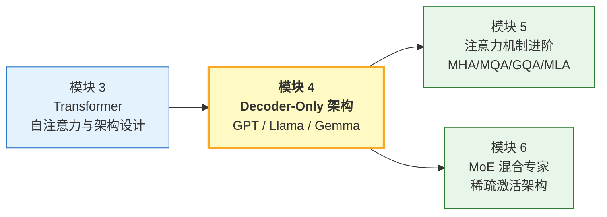

**前置知识**：
- Transformer 的完整理解（模块 3）：自注意力、多头注意力、FFN、LayerNorm/RMSNorm、残差连接
- 交叉熵损失与 Softmax（模块 3）
- RoPE 旋转位置编码的基本原理（模块 2）

**本模块的核心问题**：为什么 Decoder-Only 架构最终成为 LLM 的主流选择？从 2018 年 GPT-1 到 2024 年的 Llama 3 和 Gemma 2，Decoder-Only 架构经历了哪些关键演进？这些演进背后的技术逻辑和工程权衡是什么？

---

## 目录

- [1. 自回归语言模型](#1-自回归语言模型)
- [2. GPT 系列架构](#2-gpt-系列架构)
- [3. Llama 系列架构](#3-llama-系列架构)
- [4. Gemma 系列架构（Google）](#4-gemma-系列架构google)
- [5. 模型配置与超参数](#5-模型配置与超参数)
- [6. 完整实现：可配置 mini-GPT](#6-完整实现可配置-mini-gpt)
- [7. 文本生成策略](#7-文本生成策略)
- [8. 三条技术线的架构实践](#8-三条技术线的架构实践)
- [9. 从 GPT-1 到 Llama 3：架构演进详解](#9-从-gpt-1-到-llama-3架构演进详解)
- [10. 为什么 Decoder-Only 胜出？深层分析](#10-为什么-decoder-only-胜出深层分析)
- [11. 项目实践](#11-项目实践)
- [12. 本章小结](#12-本章小结)
- [13. 章节衔接：下一步去哪里？](#13-章节衔接下一步去哪里)

---

## 1. 自回归语言模型

### 1.1 核心思想：预测下一个词

语言模型的本质目标是对自然语言的概率分布进行建模。给定一段文本 $x_1, x_2, \ldots, x_T$，我们希望计算其联合概率 $P(x_1, x_2, \ldots, x_T)$。

利用概率的**链式法则**，联合概率可以分解为条件概率的乘积：

$$P(x_1, x_2, \ldots, x_T) = \prod_{t=1}^{T} P(x_t \mid x_1, x_2, \ldots, x_{t-1}) = \prod_{t=1}^{T} P(x_t \mid x_{<t})$$

这就是**自回归分解**：每个 token 的概率只依赖于它之前的所有 token。

**类比**：就像写作时，每个字的选择都取决于前面已经写下的内容。模型不能"偷看"后面的字——这正是因果掩码（causal mask）的物理含义。

### 1.2 训练目标：交叉熵损失

给定训练语料 $\mathcal{D} = \{x^{(1)}, x^{(2)}, \ldots\}$，模型参数 $\theta$ 的训练目标是最大化对数似然：

$$\max_\theta \sum_{x \in \mathcal{D}} \sum_{t=1}^{T} \log P_\theta(x_t \mid x_{<t})$$

等价地，最小化交叉熵损失：

$$\mathcal{L}(\theta) = -\frac{1}{T} \sum_{t=1}^{T} \log P_\theta(x_t \mid x_{<t})$$

其中 $P_\theta(x_t \mid x_{<t})$ 由模型输出的 logits 经过 Softmax 得到：

$$P_\theta(x_t = w \mid x_{<t}) = \frac{\exp(z_w)}{\sum_{w'=1}^{V} \exp(z_{w'})}$$

$z_w$ 是词汇表中第 $w$ 个 token 对应的 logit 值，$V$ 是词汇表大小。

### 1.3 Teacher Forcing

训练时采用 **Teacher Forcing** 策略：每个时间步的输入使用**真实**的上一个 token，而非模型自己的预测。

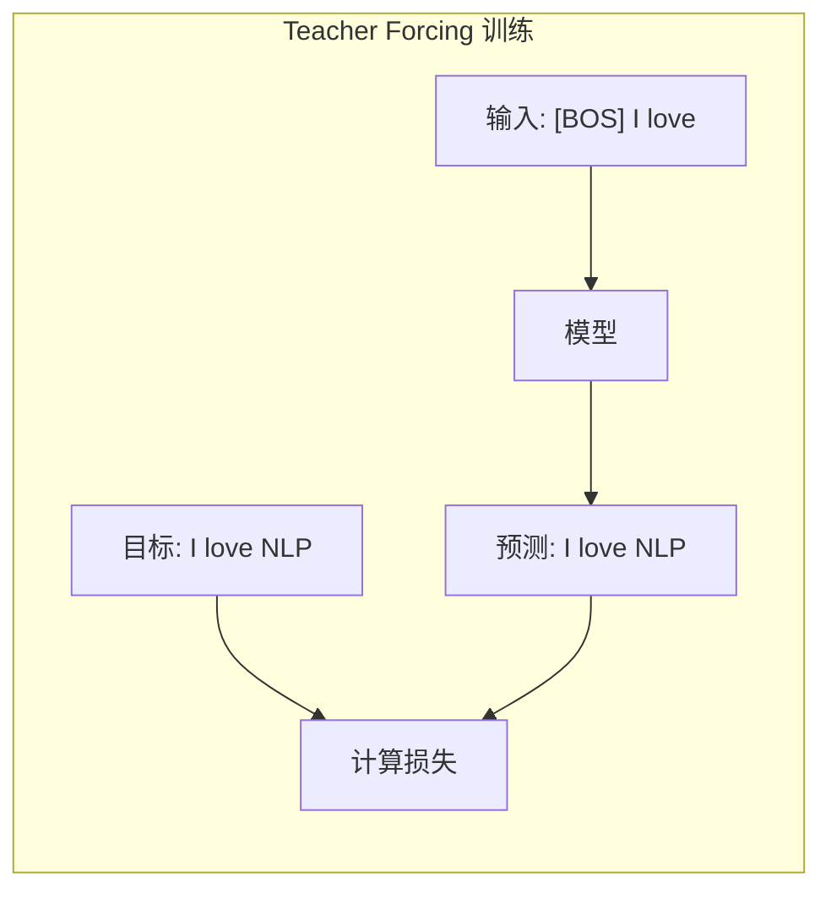

**优点**：训练稳定、收敛快（每步都有正确的上下文信号）。

**缺点**：训练和推理的输入分布不一致（exposure bias）。训练时每步都看到真实 token，推理时看到的是模型自己生成的 token。

### 1.4 自回归生成

推理时，模型逐步生成 token：

```
输入:  [BOS]
Step 1: [BOS] → 预测 "The"
Step 2: [BOS] The → 预测 "cat"
Step 3: [BOS] The cat → 预测 "sat"
...
```

每一步都将之前生成的所有 token 作为输入，预测下一个 token。生成过程在遇到 `[EOS]` 或达到最大长度时停止。

---

## 2. GPT 系列架构

### 2.1 GPT-1：预训练 + 微调的开创（2018）

GPT-1 首次证明了"**大规模无监督预训练 + 有监督微调**"的范式的有效性。

**架构要点**：
- 12 层 Transformer Decoder
- 768 维隐藏层，12 个注意力头
- 学习的位置编码（Learned Positional Embedding）
- GELU 激活函数
- 参数量：117M

**训练**：在 BooksCorpus（约 7000 本书）上进行语言模型预训练，然后在下游任务上微调。

### 2.2 GPT-2：Zero-shot 能力的涌现（2019）

GPT-2 的核心发现：**足够大的语言模型可以在不微调的情况下完成多种任务**。

**与 GPT-1 的架构差异**：
- Pre-Norm（LayerNorm 放在注意力/FFN 之前）
- 最终输出前增加一个额外的 LayerNorm
- 残差层权重初始化缩放 $1/\sqrt{N}$（$N$ 为层数）
- 词汇表从 BPE 40K 扩展到 Byte-level BPE 50K

| 版本 | 层数 | $d_{model}$ | 头数 | 参数量 |
|------|------|-------------|------|--------|
| GPT-2 Small | 12 | 768 | 12 | 124M |
| GPT-2 Medium | 24 | 1024 | 16 | 355M |
| GPT-2 Large | 36 | 1280 | 20 | 774M |
| GPT-2 XL | 48 | 1600 | 25 | 1.5B |

### 2.3 GPT-3：Few-shot Learning 与 In-Context Learning（2020）

GPT-3 的规模跃升（175B 参数）带来了**涌现能力**：模型能通过 prompt 中的几个示例"学会"新任务，无需更新参数。

**In-Context Learning 的数学框架**：

给定 prompt = 示例序列 $(x_1, y_1), (x_2, y_2), \ldots, (x_k, y_k)$ 和查询 $x_{query}$：

$$P(y_{query} \mid x_1, y_1, \ldots, x_k, y_k, x_{query})$$

模型在**不更新参数**的情况下，仅通过条件概率实现"学习"。

**GPT-3 架构细节**：
- 96 层，12288 维隐藏层，96 个注意力头
- 交替使用稠密注意力和稀疏注意力（每隔一层）
- 上下文窗口：2048 tokens
- 词汇表：50,257（Byte-level BPE）

### 2.4 GPT 系列架构总结

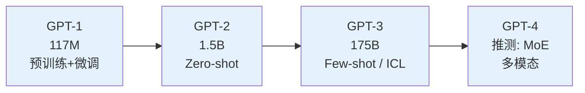

---

## 3. Llama 系列架构

### 3.1 设计哲学：更小更好

Meta 的 Llama 系列证明了一个关键洞察：**在更多数据上训练更小的模型**，可以在推理时获得更好的效率-性能权衡。

这与 Chinchilla Scaling Laws 的精神一致：Llama-1 7B 在 1T tokens 上训练，远超 Chinchilla 最优比例（约 140B tokens 对应 7B 参数），属于典型的"过度训练"策略。

### 3.2 Llama 的关键架构选择

与 GPT-2/3 相比，Llama 做出了多项现代化改进：

| 组件 | GPT-2/3 | Llama |
|------|---------|-------|
| 归一化 | LayerNorm | **RMSNorm**（更快） |
| 激活函数 | GELU | **SwiGLU**（更好） |
| 位置编码 | 学习的绝对PE | **RoPE**（更好的外推） |
| 注意力 | MHA | **GQA**（Llama 2 起） |
| 偏置项 | 有 bias | **无 bias**（简化） |

### 3.3 Llama 架构详解

**完整的 Llama Block**：

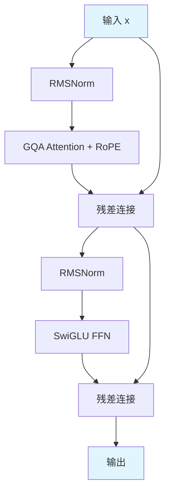

**数学形式**：

$$h = x + \text{GQA}(\text{RoPE}(\text{RMSNorm}(x)))$$

$$y = h + \text{SwiGLU}(\text{RMSNorm}(h))$$

其中 SwiGLU：

$$\text{SwiGLU}(x) = (\text{Swish}(xW_{gate}) \odot xW_{up}) W_{down}$$

$$\text{Swish}(x) = x \cdot \sigma(x) = x \cdot \frac{1}{1 + e^{-x}}$$

### 3.4 Llama 系列版本对比

| 特性 | Llama 1 | Llama 2 | Llama 3 |
|------|---------|---------|---------|
| 参数规模 | 7B/13B/33B/65B | 7B/13B/70B | 8B/70B/405B |
| 训练数据 | 1T tokens | 2T tokens | 15T+ tokens |
| 上下文长度 | 2048 | 4096 | 8192 (128K 扩展) |
| 注意力 | MHA | **GQA** | **GQA** |
| 词汇表 | 32K | 32K | **128K** |
| RoPE 基底 | 10000 | 10000 | **500000** |
| GQA KV头数 (70B) | - | 8 | 8 |

**Llama 3 的关键改进**：
1. **词汇表扩大到 128K**：更好的多语言和代码支持
2. **RoPE 基底频率从 10000 增大到 500000**：支持更长的上下文
3. **大规模过度训练**：8B 模型使用 15T tokens（约为 Chinchilla 最优的 19 倍）

---

## 4. Gemma 系列架构（Google）

### 4.1 设计哲学

Gemma 是 Google 基于 Gemini 技术推出的开源系列，设计目标是在开源模型中实现最佳的效率-性能平衡。

### 4.2 Gemma 1 架构

Gemma 1 的架构基本遵循 Llama 风格，但有几个独特选择：

| 组件 | 选择 | 说明 |
|------|------|------|
| 归一化 | RMSNorm | 标准选择 |
| 激活函数 | GeGLU | GELU 版本的 GLU |
| 位置编码 | RoPE | 标准选择 |
| 注意力 | MHA (2B) / MQA (7B) | 根据规模选择 |
| 词汇表 | 256K | 远大于 Llama |
| 嵌入缩放 | $\sqrt{d_{model}}$ | 嵌入乘以缩放因子 |

**嵌入缩放**是 Gemma 的独特设计：

$$x = \text{Embed}(\text{token}) \times \sqrt{d_{model}}$$

这个做法源自原始 Transformer 论文，但 GPT 和 Llama 已经去掉了。Gemma 保留它是因为在大词汇表下有助于训练稳定性。

### 4.3 Gemma 2 的创新

Gemma 2 引入了更多创新设计：

**1. 滑动窗口 + 全局注意力交替**

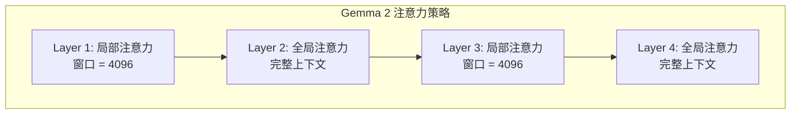

局部注意力层只关注最近 $w$ 个 token，复杂度 $O(nw)$；全局注意力层关注全部上下文，复杂度 $O(n^2)$。交替使用平衡了效率和能力。

**2. Logit 软截断**

为防止 logits 过大导致数值不稳定：

$$\text{logits} = c \cdot \tanh\left(\frac{\text{logits}}{c}\right)$$

其中 $c$ 是截断阈值（如 30.0），确保 logits 值域被限制在 $[-c, c]$。

**3. 知识蒸馏训练**

Gemma 2 的较小模型使用更大模型作为教师进行蒸馏训练，这使得 2B 和 9B 模型在同尺寸中表现出色。

### 4.4 Gemma 版本对比

| 特性 | Gemma 1 2B | Gemma 1 7B | Gemma 2 2B | Gemma 2 9B | Gemma 2 27B |
|------|-----------|-----------|-----------|-----------|------------|
| 层数 | 18 | 28 | 26 | 42 | 46 |
| $d_{model}$ | 2048 | 3072 | 2304 | 3584 | 4608 |
| 头数 | 8 | 16 | 8 | 16 | 32 |
| KV头数 | 1 | 16 | 4 | 8 | 16 |
| $d_{ff}$ | 16384 | 24576 | 9216 | 14336 | 36864 |
| 词汇表 | 256K | 256K | 256K | 256K | 256K |

---

## 5. 模型配置与超参数

### 5.1 核心超参数关系

Decoder-only 模型的核心配置参数包括：

| 参数 | 符号 | 典型关系 |
|------|------|----------|
| 层数 | $L$ | 独立选择 |
| 隐藏维度 | $d_{model}$ | 独立选择 |
| 注意力头数 | $n_h$ | $d_{model} / d_h$，$d_h$ 通常为 64 或 128 |
| FFN 隐藏维度 | $d_{ff}$ | $\frac{8}{3} d_{model}$（SwiGLU）或 $4 d_{model}$（标准 FFN） |
| 词汇表大小 | $V$ | 32K ~ 256K |
| 最大序列长度 | $S$ | 2048 ~ 128K |

### 5.2 参数量估算

对于标准 Decoder-only Transformer，参数量可以近似为：

$$P \approx 12 L d_{model}^2$$

**推导过程**：

每个 Transformer Block 包含：
- 注意力层 QKV 投影：$3 \times d_{model}^2$
- 注意力输出投影：$d_{model}^2$
- SwiGLU FFN（gate + up + down）：$3 \times d_{model} \times d_{ff} \approx 3 \times d_{model} \times \frac{8}{3} d_{model} = 8 d_{model}^2$

每层总计：$4d_{model}^2 + 8d_{model}^2 = 12d_{model}^2$

加上 Embedding 层（$V \times d_{model}$）和 Final Norm（$d_{model}$），在 $V$ 不太大时，主体参数在 Transformer Blocks 中。

$$P_{total} = L \times 12 d_{model}^2 + V \times d_{model} + d_{model}$$

**验证**：Llama 2 7B（$L=32$，$d=4096$）

$$P \approx 32 \times 12 \times 4096^2 = 6.44B$$

加上词汇表 $32000 \times 4096 = 131M$，总计约 6.6B，与公布的 6.7B 基本吻合。

### 5.3 FLOPs 估算

前向传播的 FLOPs（每个 token）近似为：

$$C_{forward} \approx 2P$$

考虑反向传播（约为前向的 2 倍），每个训练 token 的总 FLOPs：

$$C_{token} \approx 6P$$

训练总 FLOPs：

$$C_{total} \approx 6PD$$

其中 $D$ 是训练 token 总数。

**示例**：Llama 2 7B 在 2T tokens 上训练

$$C \approx 6 \times 6.7 \times 10^9 \times 2 \times 10^{12} = 8.04 \times 10^{22} \text{ FLOPs}$$

### 5.4 经典模型配置参考

| 模型 | $L$ | $d_{model}$ | $n_h$ | $d_h$ | $d_{ff}$ | 参数量 |
|------|-----|-------------|-------|-------|----------|--------|
| GPT-2 Small | 12 | 768 | 12 | 64 | 3072 | 124M |
| GPT-2 XL | 48 | 1600 | 25 | 64 | 6400 | 1.5B |
| Llama 2 7B | 32 | 4096 | 32 | 128 | 11008 | 6.7B |
| Llama 2 70B | 80 | 8192 | 64 | 128 | 28672 | 68.9B |
| Llama 3 8B | 32 | 4096 | 32 | 128 | 14336 | 8.0B |
| Gemma 2 2B | 26 | 2304 | 8 | 256 | 9216 | 2.6B |
| Gemma 2 9B | 42 | 3584 | 16 | 256 | 14336 | 9.2B |

---

## 6. 完整实现：可配置 mini-GPT

### 6.1 配置类

使用 `dataclass` 设计灵活的配置系统，可以模拟不同架构风格：

```python
from dataclasses import dataclass
from typing import Optional

@dataclass
class ModelConfig:
    """
    Decoder-only 模型配置

    支持 GPT / Llama / Gemma 风格切换
    """
    # --- 基本结构 ---
    vocab_size: int = 32000           # 词汇表大小
    max_seq_len: int = 2048           # 最大序列长度
    d_model: int = 512                # 隐藏维度
    n_layers: int = 6                 # Transformer 层数
    n_heads: int = 8                  # Query 注意力头数
    n_kv_heads: Optional[int] = None  # KV 头数 (None = MHA, < n_heads = GQA)

    # --- FFN ---
    d_ff: Optional[int] = None        # FFN 隐藏维度 (None = 自动计算)
    ffn_type: str = "swiglu"          # "standard" | "swiglu" | "geglu"

    # --- 归一化 ---
    norm_type: str = "rmsnorm"        # "layernorm" | "rmsnorm"
    norm_eps: float = 1e-6            # 归一化 epsilon

    # --- 位置编码 ---
    rope_base: float = 10000.0        # RoPE 基底频率
    use_rope: bool = True             # 是否使用 RoPE

    # --- 训练相关 ---
    dropout: float = 0.0              # Dropout (预训练通常为 0)
    tie_weights: bool = True          # Embedding 与 LM Head 权重共享
    bias: bool = False                # 线性层是否使用偏置

    # --- 嵌入缩放 (Gemma 风格) ---
    scale_embeddings: bool = False    # 是否对嵌入乘以 sqrt(d_model)

    def __post_init__(self):
        """自动计算默认值"""
        if self.n_kv_heads is None:
            self.n_kv_heads = self.n_heads  # 默认 MHA
        if self.d_ff is None:
            if self.ffn_type == "standard":
                self.d_ff = 4 * self.d_model
            else:
                # SwiGLU / GeGLU: 保持参数量等价
                self.d_ff = int(8 * self.d_model / 3)
                # 确保能被某个数整除 (工程实践)
                self.d_ff = ((self.d_ff + 255) // 256) * 256


# --- 预置配置 ---

def gpt2_small_config() -> ModelConfig:
    """GPT-2 Small 配置"""
    return ModelConfig(
        vocab_size=50257, max_seq_len=1024, d_model=768,
        n_layers=12, n_heads=12, d_ff=3072,
        ffn_type="standard", norm_type="layernorm",
        use_rope=False, dropout=0.1, bias=True,
    )

def llama2_7b_config() -> ModelConfig:
    """Llama 2 7B 配置"""
    return ModelConfig(
        vocab_size=32000, max_seq_len=4096, d_model=4096,
        n_layers=32, n_heads=32, n_kv_heads=32, d_ff=11008,
        ffn_type="swiglu", norm_type="rmsnorm", rope_base=10000.0,
    )

def gemma2_2b_config() -> ModelConfig:
    """Gemma 2 2B 配置"""
    return ModelConfig(
        vocab_size=256000, max_seq_len=8192, d_model=2304,
        n_layers=26, n_heads=8, n_kv_heads=4, d_ff=9216,
        ffn_type="geglu", norm_type="rmsnorm",
        scale_embeddings=True,
    )
```

### 6.2 模型实现

核心模型基于模块 3 的组件构建，增加了 GQA 支持和多种配置选项：

```python
import torch
import torch.nn as nn
import torch.nn.functional as F
import math
from typing import Optional, Tuple


class RMSNorm(nn.Module):
    """RMSNorm: 去除均值中心化的高效归一化"""

    def __init__(self, dim: int, eps: float = 1e-6):
        super().__init__()
        self.eps = eps
        self.weight = nn.Parameter(torch.ones(dim))

    def forward(self, x: torch.Tensor) -> torch.Tensor:
        rms = torch.sqrt(torch.mean(x ** 2, dim=-1, keepdim=True) + self.eps)
        return x / rms * self.weight


class RotaryPositionEncoding(nn.Module):
    """RoPE: 旋转位置编码"""

    def __init__(self, dim: int, max_seq_len: int = 2048, base: float = 10000.0):
        super().__init__()
        # 频率向量: theta_i = base^(-2i/d)
        freqs = 1.0 / (base ** (torch.arange(0, dim, 2).float() / dim))
        t = torch.arange(max_seq_len).float()
        # 外积得到角度矩阵
        angles = torch.outer(t, freqs)
        # 预计算 cos 和 sin
        self.register_buffer("cos_cached", angles.cos())
        self.register_buffer("sin_cached", angles.sin())

    def forward(self, x: torch.Tensor, offset: int = 0) -> torch.Tensor:
        """
        对输入应用旋转位置编码

        Args:
            x: [batch, n_heads, seq_len, head_dim]
            offset: 位置偏移量 (用于 KV Cache)
        """
        seq_len = x.shape[2]
        cos = self.cos_cached[offset:offset + seq_len].unsqueeze(0).unsqueeze(0)
        sin = self.sin_cached[offset:offset + seq_len].unsqueeze(0).unsqueeze(0)

        # 将 x 拆成相邻的两两一组
        x1, x2 = x[..., ::2], x[..., 1::2]
        # 旋转: [x1, x2] * [cos, -sin; sin, cos]
        rotated = torch.stack([
            x1 * cos - x2 * sin,
            x1 * sin + x2 * cos
        ], dim=-1).flatten(-2)
        return rotated


class GroupedQueryAttention(nn.Module):
    """
    GQA: 统一 MHA / GQA / MQA 的注意力实现

    - n_kv_heads == n_heads: 标准 MHA
    - n_kv_heads == 1: MQA
    - 1 < n_kv_heads < n_heads: GQA
    """

    def __init__(self, config: 'ModelConfig'):
        super().__init__()
        self.n_heads = config.n_heads
        self.n_kv_heads = config.n_kv_heads
        self.head_dim = config.d_model // config.n_heads
        self.n_rep = self.n_heads // self.n_kv_heads  # 每个 KV 头对应的 Q 头数

        # 投影层
        self.wq = nn.Linear(config.d_model, config.n_heads * self.head_dim, bias=config.bias)
        self.wk = nn.Linear(config.d_model, config.n_kv_heads * self.head_dim, bias=config.bias)
        self.wv = nn.Linear(config.d_model, config.n_kv_heads * self.head_dim, bias=config.bias)
        self.wo = nn.Linear(config.n_heads * self.head_dim, config.d_model, bias=config.bias)

        self.dropout = nn.Dropout(config.dropout)

        # RoPE
        if config.use_rope:
            self.rope = RotaryPositionEncoding(
                self.head_dim, config.max_seq_len, config.rope_base
            )
        else:
            self.rope = None

    def forward(
        self, x: torch.Tensor, mask: Optional[torch.Tensor] = None
    ) -> torch.Tensor:
        """
        Args:
            x: [batch, seq_len, d_model]
            mask: 因果掩码

        Returns:
            [batch, seq_len, d_model]
        """
        B, S, _ = x.shape

        # 投影
        q = self.wq(x).view(B, S, self.n_heads, self.head_dim).transpose(1, 2)
        k = self.wk(x).view(B, S, self.n_kv_heads, self.head_dim).transpose(1, 2)
        v = self.wv(x).view(B, S, self.n_kv_heads, self.head_dim).transpose(1, 2)

        # 应用 RoPE
        if self.rope is not None:
            q = self.rope(q)
            k = self.rope(k)

        # GQA: 复制 KV 头以匹配 Q 头数
        if self.n_rep > 1:
            k = k.repeat_interleave(self.n_rep, dim=1)
            v = v.repeat_interleave(self.n_rep, dim=1)

        # 注意力计算
        scale = self.head_dim ** -0.5
        scores = torch.matmul(q, k.transpose(-2, -1)) * scale

        # 因果掩码
        if mask is not None:
            scores = scores.masked_fill(mask == 0, float("-inf"))
        else:
            # 自动生成因果掩码
            causal = torch.triu(
                torch.ones(S, S, device=x.device, dtype=torch.bool), diagonal=1
            )
            scores = scores.masked_fill(causal, float("-inf"))

        attn = F.softmax(scores, dim=-1)
        attn = self.dropout(attn)

        out = torch.matmul(attn, v)
        out = out.transpose(1, 2).contiguous().view(B, S, -1)
        return self.wo(out)


class SwiGLU(nn.Module):
    """SwiGLU FFN: Swish(xW_gate) * xW_up 再经过 W_down"""

    def __init__(self, d_model: int, d_ff: int, bias: bool = False, dropout: float = 0.0):
        super().__init__()
        self.w_gate = nn.Linear(d_model, d_ff, bias=bias)
        self.w_up = nn.Linear(d_model, d_ff, bias=bias)
        self.w_down = nn.Linear(d_ff, d_model, bias=bias)
        self.dropout = nn.Dropout(dropout)

    def forward(self, x: torch.Tensor) -> torch.Tensor:
        return self.dropout(self.w_down(F.silu(self.w_gate(x)) * self.w_up(x)))


class DecoderBlock(nn.Module):
    """单个 Decoder Block (Pre-Norm)"""

    def __init__(self, config: 'ModelConfig'):
        super().__init__()
        self.attn_norm = RMSNorm(config.d_model, config.norm_eps)
        self.attn = GroupedQueryAttention(config)
        self.ffn_norm = RMSNorm(config.d_model, config.norm_eps)
        self.ffn = SwiGLU(config.d_model, config.d_ff, config.bias, config.dropout)

    def forward(self, x: torch.Tensor, mask: Optional[torch.Tensor] = None) -> torch.Tensor:
        # Pre-Norm + Attention + 残差
        x = x + self.attn(self.attn_norm(x), mask)
        # Pre-Norm + FFN + 残差
        x = x + self.ffn(self.ffn_norm(x))
        return x


class DecoderOnlyModel(nn.Module):
    """
    完整的 Decoder-Only 模型

    支持 GPT / Llama / Gemma 风格配置
    """

    def __init__(self, config: 'ModelConfig'):
        super().__init__()
        self.config = config

        # Token Embedding
        self.token_embedding = nn.Embedding(config.vocab_size, config.d_model)

        # 学习的位置编码 (GPT-2 风格，不使用 RoPE 时)
        if not config.use_rope:
            self.position_embedding = nn.Embedding(config.max_seq_len, config.d_model)
        else:
            self.position_embedding = None

        self.dropout = nn.Dropout(config.dropout)

        # Transformer Blocks
        self.layers = nn.ModuleList([
            DecoderBlock(config) for _ in range(config.n_layers)
        ])

        # 最终归一化
        self.final_norm = RMSNorm(config.d_model, config.norm_eps)

        # LM Head
        self.lm_head = nn.Linear(config.d_model, config.vocab_size, bias=False)

        # 权重共享
        if config.tie_weights:
            self.lm_head.weight = self.token_embedding.weight

        # 初始化
        self._init_weights()

    def _init_weights(self):
        """初始化权重"""
        for module in self.modules():
            if isinstance(module, nn.Linear):
                nn.init.normal_(module.weight, mean=0.0, std=0.02)
                if module.bias is not None:
                    nn.init.zeros_(module.bias)
            elif isinstance(module, nn.Embedding):
                nn.init.normal_(module.weight, mean=0.0, std=0.02)

        # 残差分支缩放 (GPT-2 风格)
        for name, param in self.named_parameters():
            if name.endswith("wo.weight") or name.endswith("w_down.weight"):
                nn.init.normal_(param, mean=0.0, std=0.02 / math.sqrt(2 * self.config.n_layers))

    def forward(
        self, input_ids: torch.Tensor, mask: Optional[torch.Tensor] = None
    ) -> torch.Tensor:
        """
        前向传播

        Args:
            input_ids: [batch, seq_len]
            mask: 注意力掩码 (可选)

        Returns:
            logits: [batch, seq_len, vocab_size]
        """
        B, S = input_ids.shape

        # Token Embedding
        x = self.token_embedding(input_ids)

        # 嵌入缩放 (Gemma 风格)
        if self.config.scale_embeddings:
            x = x * math.sqrt(self.config.d_model)

        # 位置编码 (非 RoPE 时使用学习的位置编码)
        if self.position_embedding is not None:
            positions = torch.arange(S, device=input_ids.device).unsqueeze(0)
            x = x + self.position_embedding(positions)

        x = self.dropout(x)

        # Transformer Blocks
        for layer in self.layers:
            x = layer(x, mask)

        # Final Norm
        x = self.final_norm(x)

        # LM Head
        logits = self.lm_head(x)
        return logits

    def count_parameters(self) -> int:
        """统计可训练参数量"""
        return sum(p.numel() for p in self.parameters() if p.requires_grad)

    def estimate_flops_per_token(self) -> int:
        """估算每个 token 的前向 FLOPs"""
        d = self.config.d_model
        L = self.config.n_layers
        V = self.config.vocab_size
        d_ff = self.config.d_ff

        # 注意力: 4*d^2 (QKV投影 + 输出投影)
        attn_flops = 4 * d * d
        # FFN: SwiGLU 有 3 个矩阵
        ffn_flops = 3 * d * d_ff
        # LM Head
        head_flops = d * V

        # 前向总 FLOPs (每 token)
        return 2 * L * (attn_flops + ffn_flops) + 2 * head_flops
```

---

## 7. 文本生成策略

### 7.1 概述

自回归生成是 Decoder-only 模型最核心的推理模式。不同的解码策略通过控制"如何从概率分布中选取下一个 token"来影响生成文本的质量和多样性。

### 7.2 Greedy Decoding

每一步选择概率最大的 token：

$$x_t = \arg\max_{w} P(w \mid x_{<t})$$

**优点**：确定性，速度快。

**缺点**：容易生成重复、无聊的文本；可能错过全局最优序列。

### 7.3 Temperature 采样

引入温度参数 $\tau$ 调节分布的"尖锐程度"：

$$P_\tau(w \mid x_{<t}) = \frac{\exp(z_w / \tau)}{\sum_{w'} \exp(z_{w'} / \tau)}$$

- $\tau \to 0$：趋近 Greedy（分布越尖锐）
- $\tau = 1$：原始分布
- $\tau > 1$：分布更平坦，增加多样性

### 7.4 Top-K 采样

只从概率最高的 $K$ 个 token 中采样：

$$\mathcal{V}_K = \text{TopK}(P(\cdot \mid x_{<t}), K)$$

$$P'(w) = \begin{cases} \frac{P(w)}{\sum_{w' \in \mathcal{V}_K} P(w')} & w \in \mathcal{V}_K \\ 0 & \text{otherwise} \end{cases}$$

**问题**：固定的 $K$ 不能适应概率分布的变化。当分布集中时，$K=50$ 可能引入噪声；当分布分散时，$K=50$ 可能仍然不够。

### 7.5 Top-P (Nucleus) 采样

动态选择概率累积和超过 $p$ 的最小集合：

$$\mathcal{V}_p = \min \left\{ S \subseteq \mathcal{V} : \sum_{w \in S} P(w \mid x_{<t}) \geq p \right\}$$

即按概率从大到小排序，取概率累积和刚好达到 $p$ 的前缀集合。

**优势**：自适应地调整候选 token 数量。$p = 0.9$ 在大部分场景下表现良好。

### 7.6 各策略对比

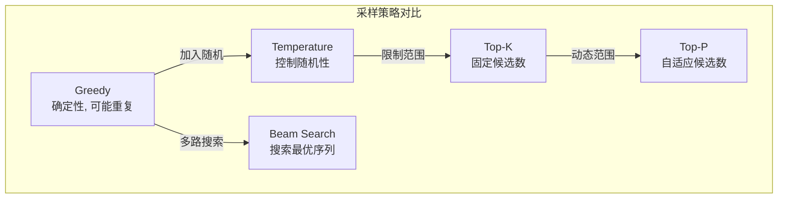

| 策略 | 多样性 | 质量 | 速度 | 适用场景 |
|------|--------|------|------|----------|
| Greedy | 低 | 中 | 快 | 翻译、摘要 |
| Temperature + Top-P | 可调 | 高 | 快 | 通用对话 |
| Top-K | 中 | 中 | 快 | 创意写作 |
| Beam Search | 低 | 高 | 慢 | 机器翻译 |

### 7.7 实现示例

```python
def generate(
    model: DecoderOnlyModel,
    input_ids: torch.Tensor,
    max_new_tokens: int = 100,
    temperature: float = 1.0,
    top_k: int = None,
    top_p: float = None,
) -> torch.Tensor:
    """
    自回归文本生成

    Args:
        model: 语言模型
        input_ids: [batch, seq_len] 输入 token IDs
        max_new_tokens: 最大生成 token 数
        temperature: 温度参数
        top_k: Top-K 采样参数
        top_p: Top-P 采样参数

    Returns:
        [batch, seq_len + max_new_tokens]
    """
    model.eval()
    with torch.no_grad():
        for _ in range(max_new_tokens):
            # 截断到最大长度
            idx = input_ids[:, -model.config.max_seq_len:]

            # 前向传播获取 logits
            logits = model(idx)[:, -1, :]  # 只取最后一个位置

            # Temperature 缩放
            if temperature != 1.0:
                logits = logits / temperature

            # Top-K 过滤
            if top_k is not None:
                v, _ = torch.topk(logits, min(top_k, logits.size(-1)))
                logits[logits < v[:, [-1]]] = float("-inf")

            # Top-P 过滤
            if top_p is not None:
                sorted_logits, sorted_idx = torch.sort(logits, descending=True)
                cumulative_probs = torch.cumsum(F.softmax(sorted_logits, dim=-1), dim=-1)
                # 移除累积概率超过 top_p 的 token
                remove_mask = cumulative_probs > top_p
                remove_mask[..., 1:] = remove_mask[..., :-1].clone()
                remove_mask[..., 0] = False
                indices_to_remove = remove_mask.scatter(1, sorted_idx, remove_mask)
                logits[indices_to_remove] = float("-inf")

            # 采样
            probs = F.softmax(logits, dim=-1)
            next_token = torch.multinomial(probs, num_samples=1)
            input_ids = torch.cat([input_ids, next_token], dim=1)

    return input_ids
```

---

## 8. 三条技术线的架构实践

### 8.1 Google 路线

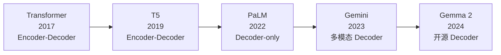

**关键转折**：Google 从 Encoder-Decoder（T5）转向 Decoder-only（PaLM），说明 Decoder-only 在大规模下的统一性优势已成为行业共识。

**PaLM 的独特设计**：
- 并行 Attention + FFN：$y = x + \text{Attn}(\text{LN}(x)) + \text{FFN}(\text{LN}(x))$，约 15% 加速
- Multi-Query Attention (MQA)：所有 Query 头共享一组 KV

### 8.2 DeepSeek 路线

DeepSeek 的架构演进以**极致效率**为核心：

| 版本 | 注意力 | FFN | 训练特色 |
|------|--------|-----|----------|
| V1 | 标准 MHA | Dense | 基础架构验证 |
| V2 | **MLA**（低秩 KV 压缩） | **DeepSeekMoE**（细粒度专家） | 推理成本大幅降低 |
| V3 | MLA | MoE + 辅助损失 free | **FP8 训练**, 多 token 预测 |

DeepSeek-V2 的 MLA（详见模块 5）将 KV Cache 压缩了约 57 倍，使其能以远低于同规模模型的成本提供服务。

### 8.3 Anthropic 路线

Anthropic 的 Claude 系列架构细节未公开。但从公开信息和研究方向可以推断：

**公开事实**：
- Claude 1/2/3 均为 Decoder-only 架构
- 上下文窗口从 8K 演进到 200K
- Anthropic 的研究重心在**安全**和**可解释性**，而非架构创新

**基于公开研究的合理推测**（标记为推测）：
- [推测] Claude 可能采用了 GQA 或类似的推理效率优化
- [推测] 基于 Anthropic 对 Transformer Circuits 的深入研究，可能对注意力层有针对性的调整
- [推测] 安全约束可能在架构层面通过额外的输出审查机制实现

**Anthropic 的独特贡献——架构理解**：

Anthropic 虽然不以架构创新著称，但其 **Transformer Circuits** 研究为理解这些架构提供了深刻见解：
- 残差流视角：理解信息如何在层间传递
- Induction Heads：解释 Decoder-only 模型如何实现 in-context learning
- Superposition：解释为什么大模型能"记住"远超其参数维度的特征

---

## 9. 从 GPT-1 到 Llama 3：架构演进详解

上面各节分别介绍了 GPT、Llama、Gemma 三大系列的核心设计。本节将它们放在同一个时间轴上，梳理 Decoder-Only 架构从 2018 年至今的**关键演进脉络**。

### 9.1 GPT 系列：从 117M 到 175B 的范式转变

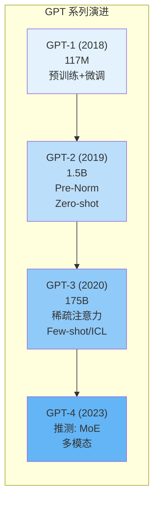

每一代 GPT 的关键变化：

| 变化维度 | GPT-1 → GPT-2 | GPT-2 → GPT-3 | GPT-3 → GPT-4 |
|---------|---------------|---------------|---------------|
| **参数规模** | 117M → 1.5B（~13x） | 1.5B → 175B（~117x） | 175B → 推测 >1T（MoE） |
| **训练数据** | BooksCorpus (5GB) → WebText (40GB) | WebText → 融合数据 (570GB) | 融合 → 更大规模多模态数据 |
| **关键架构改动** | Post-Norm → Pre-Norm；BPE → Byte-level BPE | 稀疏注意力（交替层） | 推测引入 MoE；多模态编码器 |
| **核心涌现能力** | 迁移学习 | Zero-shot 任务完成 | 强 ICL、复杂推理、多模态理解 |
| **训练范式** | 预训练+微调 | 纯预训练 Zero-shot | Few-shot ICL + RLHF |

### 9.2 Llama 系列：Meta 的开源架构改进路径

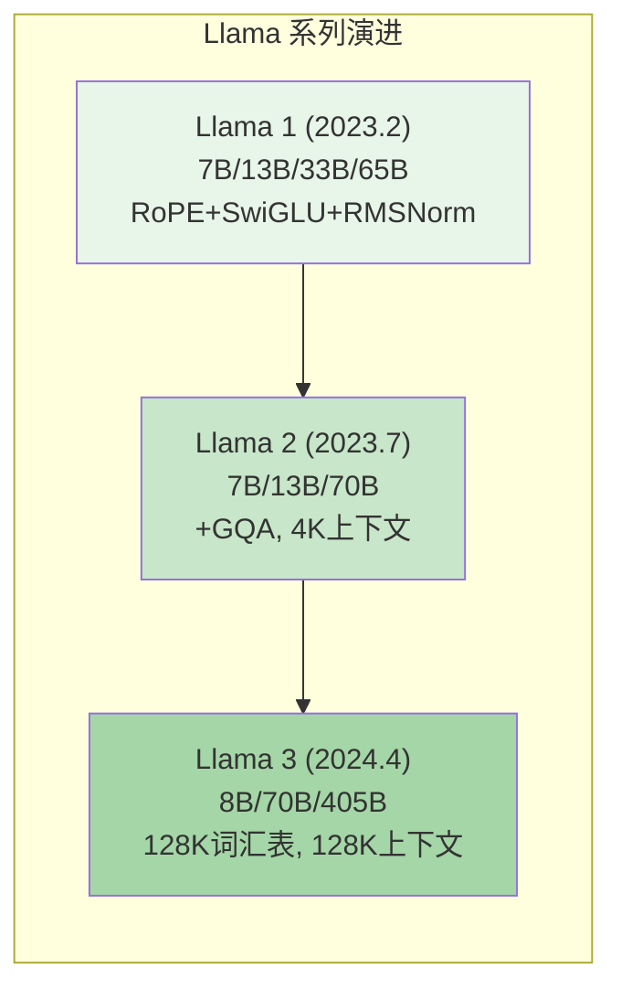

**Llama 1 的关键决策**：
- **RoPE 替代学习的绝对 PE**：相对位置编码具备更好的长度外推能力，且不增加可学习参数
- **SwiGLU 替代 GELU**：门控激活函数在同参数量下提供更好的性能（Shazeer 2020 的实验验证）
- **RMSNorm 替代 LayerNorm**：去除均值中心化操作，计算效率提升约 10-15%，且大规模下性能无损
- **去除 bias**：减少参数量的同时简化实现，大模型下对性能无明显影响
- **"过度训练"策略**：7B 模型使用 1T tokens 训练，远超 Chinchilla 最优比例

**Llama 2 的改进**：
- **引入 GQA**：70B 模型使用 8 个 KV 头（对比 64 个 Q 头），KV Cache 减少 8 倍
- **更长上下文**：从 2048 扩展到 4096，RoPE 基底频率不变（10000）
- **更多训练数据**：从 1T 增加到 2T tokens
- **安全微调**：引入 RLHF + Red Teaming 的后训练流程（发布了 Chat 版本）

**Llama 3 的关键改进**：
- **128K 词汇表**：从 32K 大幅扩展，显著改善多语言和代码 token 化效率。更大的词汇表意味着同一段文本被编码为更少的 token，减少了推理步数
- **128K 上下文窗口**：RoPE 基底频率从 10000 增大到 500000，支持极长序列。配合渐进式长度扩展训练
- **15T+ tokens 训练**：极端过度训练策略，8B 模型使用了约 19 倍 Chinchilla 最优数据量
- **GQA 配置微调**：保持 8 个 KV 头的配置，证明了这一比例在多种规模下的有效性

### 9.3 Google Gemma 系列

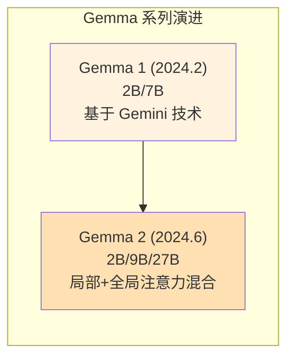

- **Gemma 1**：基于 Gemini 技术的首个开源模型，架构上与 Llama 相似（RoPE + RMSNorm + GeGLU），独特之处在于 256K 大词汇表和嵌入缩放（$\sqrt{d_{model}}$）
- **Gemma 2**：引入了**局部注意力 + 全局注意力交替**的创新设计。偶数层使用滑动窗口注意力（$O(nw)$ 复杂度），奇数层使用完整注意力（$O(n^2)$ 复杂度），在效率和长距离建模能力之间取得平衡。此外还引入了 Logit 软截断和知识蒸馏训练
- **与 Llama 的关键差异**：Gemma 选择了更大的词汇表（256K vs 128K）、不同的 GLU 变体（GeGLU vs SwiGLU）、以及独特的注意力模式交替策略

### 9.4 DeepSeek 系列

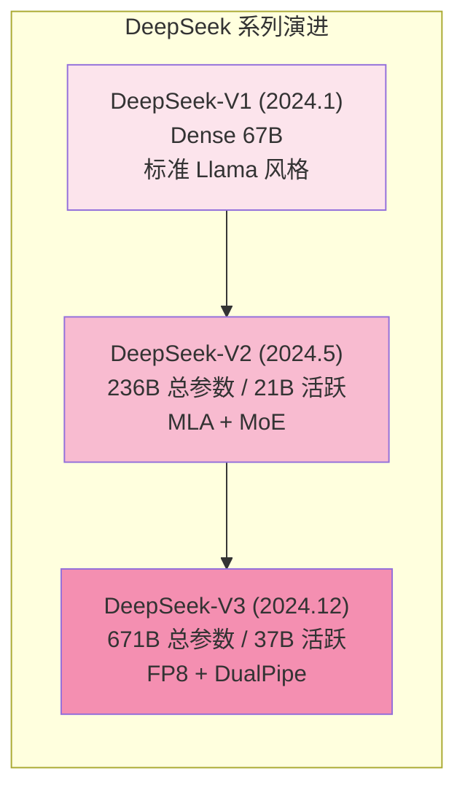

- **DeepSeek-V1**：标准 Dense Decoder-Only 架构，验证了高质量中英混合数据的重要性
- **DeepSeek-V2**：两大架构创新——**MLA（Multi-head Latent Attention）** 将 KV Cache 压缩约 28 倍；**细粒度 MoE** 配合共享专家实现稀疏激活
- **DeepSeek-V3**：在 V2 基础上进一步创新——**FP8 混合精度训练**节省显存和提升速度；**DualPipe 流水线**实现计算与通信的高度重叠；**辅助损失 free** 的路由策略；**多 token 预测**头（为 Speculative Decoding 铺路）

### 9.5 横向对比：各模型关键参数选择

| 设计维度 | GPT-3 (2020) | Llama 1 (2023) | Llama 3 (2024) | Gemma 2 (2024) | DeepSeek-V3 (2024) |
|---------|-------------|----------------|----------------|---------------|-------------------|
| **归一化** | LayerNorm | RMSNorm | RMSNorm | RMSNorm | RMSNorm |
| **激活函数** | GELU | SwiGLU | SwiGLU | GeGLU | SwiGLU |
| **位置编码** | 学习的绝对 PE | RoPE (base=10K) | RoPE (base=500K) | RoPE | RoPE |
| **注意力** | MHA (稀疏交替) | MHA | GQA | GQA + 滑动窗口 | MLA |
| **FFN 类型** | Dense | Dense | Dense | Dense | MoE (256专家) |
| **词汇表** | 50K | 32K | 128K | 256K | 128K |
| **最大上下文** | 2048 | 2048 | 128K | 8K | 128K |
| **训练数据** | 300B tokens | 1T tokens | 15T+ tokens | 2T tokens | 14.8T tokens |

**关键趋势**：
1. **归一化和激活函数已趋同**：RMSNorm + GLU 变体（SwiGLU/GeGLU）成为标准配置
2. **位置编码统一到 RoPE**：基底频率根据目标上下文长度调整
3. **注意力机制持续创新**：从 MHA → GQA → MLA，核心驱动力是推理效率
4. **词汇表大小快速增长**：32K → 128K → 256K，多语言和代码支持的需求
5. **训练数据量指数增长**：1T → 15T，"过度训练"成为主流策略

---

## 10. 为什么 Decoder-Only 胜出？深层分析

在 Encoder-Only（BERT）、Encoder-Decoder（T5）、Decoder-Only（GPT）三种架构中，Decoder-Only 最终成为 LLM 的主流选择。这一结果并非偶然，背后有多个层面的深层原因。

### 10.1 信息论视角：因果语言建模的统一性

**因果语言模型（Causal LM）** 通过链式分解 $P(x_{1:T}) = \prod_{t=1}^{T} P(x_t | x_{<t})$ 建模联合概率分布。这一分解具有数学上的优雅性：

- **无需特殊标记或掩码策略**：不像 MLM 需要 `[MASK]` token，也不像 Encoder-Decoder 需要分离输入和输出
- **统一的训练信号**：每个 token 都参与损失计算，训练效率高（对比 MLM 只在 15% 的被遮蔽位置计算损失）
- **天然兼容生成任务**：训练目标（预测下一个词）与推理目标（生成下一个词）完全一致，没有 exposure bias 以外的训练-推理不匹配

### 10.2 工程视角：自回归特性与 KV Cache 的天然契合

Decoder-Only 的自回归生成天然适合 **KV Cache** 优化：

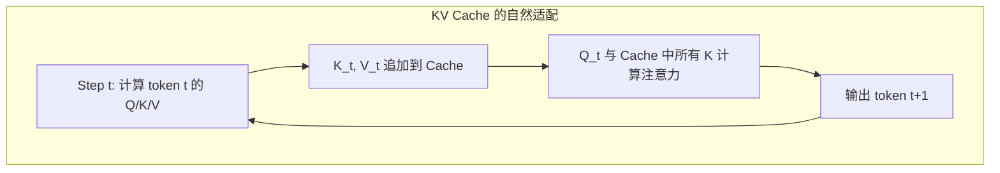

- **因果掩码保证了缓存的有效性**：位置 $t$ 的输出只依赖 $x_{<t}$，因此之前计算的 K/V 永远不需要更新
- **Encoder-Decoder 的额外开销**：需要同时维护 Encoder 的表示和 Decoder 的 KV Cache，显存占用更高
- **推理效率**：每个新 token 只需计算一层 Q，而非完整的 QKV，增量计算成本极低

### 10.3 Scaling 视角：简单架构更容易规模化

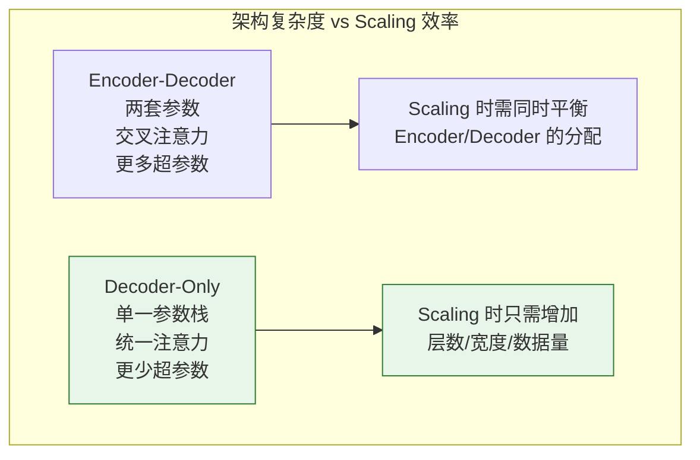

- **更少的超参数选择**：不需要决定 Encoder 和 Decoder 的层数分配、交叉注意力的放置策略等
- **Scaling Laws 更易预测**：单一架构的缩放行为更加平滑和可预测
- **工程实现更简单**：分布式训练中，统一的 Decoder Block 更容易进行流水线和张量并行划分

### 10.4 反例讨论：Encoder-Decoder 仍有价值的场景

需要指出的是，Decoder-Only 的"胜出"并不意味着其他架构毫无价值：

- **Google T5/UL2**：在**固定输入、固定输出格式**的任务（如翻译、摘要）上，Encoder-Decoder 仍然具备优势。Encoder 的双向注意力能更充分地理解输入，对于理解型任务效率更高
- **小模型场景**：当参数预算有限（< 1B）时，Encoder-Decoder 的两阶段处理可能比单一 Decoder 更有效，因为 Encoder 可以对输入进行高效压缩
- **Google 的渐进转变**：从 T5（纯 Encoder-Decoder）→ PaLM（Decoder-Only）→ Gemini（Decoder-Only + 多模态），说明即使是 Encoder-Decoder 的"发源地"也在逐渐转向 Decoder-Only

**结论**：Decoder-Only 的胜出源于其在**统一性、工程简洁性和可扩展性**三个维度上的综合优势。随着模型规模增大，这些优势被不断放大，最终形成了当前的行业共识。

---

## 11. 项目实践

### 项目 1：搭建一个可配置的 mini-GPT（入门 ⭐）

**目标**：理解 Decoder-only 架构的完整组装过程。

**任务**：
1. 使用 `code/decoder_only/config.py` 中的 `ModelConfig` 创建一个小模型（6 层, 384 维, 6 头）
2. 输入随机 token IDs，验证前向传播的输入输出形状
3. 统计参数量并与公式 $12Ld^2$ 对照
4. 尝试切换不同配置（GPT-2 风格 vs Llama 风格），观察参数量变化

**完整参考代码**：

```python
import torch
from config import ModelConfig
from model import DecoderOnlyModel

# 创建配置
config = ModelConfig(
    vocab_size=1000, max_seq_len=256,
    d_model=384, n_layers=6, n_heads=6,
    ffn_type="swiglu", norm_type="rmsnorm",
)

# 创建模型
model = DecoderOnlyModel(config)
print(f"参数量: {model.count_parameters():,}")
print(f"理论估算: {12 * config.n_layers * config.d_model**2:,}")

# 前向传播测试
input_ids = torch.randint(0, config.vocab_size, (2, 64))
logits = model(input_ids)
print(f"输入: {input_ids.shape}")   # [2, 64]
print(f"输出: {logits.shape}")      # [2, 64, 1000]

# 验证因果性: 修改后面的 token 不影响前面的输出
input_ids_2 = input_ids.clone()
input_ids_2[:, 32:] = 0  # 修改后半部分
logits_2 = model(input_ids_2)
# 前32个位置的输出应该相同
print(f"因果性验证 (应接近0): {(logits[:, :32] - logits_2[:, :32]).abs().max():.6f}")
```

---

### 项目 2：对比 Greedy / Top-K / Top-P 生成效果（进阶 ⭐⭐）

**目标**：理解不同采样策略对生成文本的影响。

**任务**：
1. 在一个训练好的小模型上（或加载 GPT-2 预训练权重），使用不同策略生成文本
2. 对比生成质量：重复率、多样性、连贯性
3. 分析 Temperature 对概率分布形状的影响

**关键代码片段**：

```python
# 量化重复率
def repetition_rate(tokens: list, n: int = 3) -> float:
    """计算 n-gram 重复率"""
    ngrams = [tuple(tokens[i:i+n]) for i in range(len(tokens) - n + 1)]
    return 1.0 - len(set(ngrams)) / max(len(ngrams), 1)

# 量化多样性 (distinct-n)
def distinct_n(tokens: list, n: int = 2) -> float:
    """计算 distinct-n 指标"""
    ngrams = [tuple(tokens[i:i+n]) for i in range(len(tokens) - n + 1)]
    return len(set(ngrams)) / max(len(ngrams), 1)
```

**实验设计建议**：
- 固定相同的 prompt，分别用 Greedy、Top-K(50)、Top-P(0.9)、Temperature(0.7) + Top-P(0.9) 生成
- 每种策略生成 10 次，统计重复率和 distinct-2
- 可视化不同 Temperature 下的概率分布变化

---

### 项目 3：复现 GPT-2 Small (124M) 的架构（挑战 ⭐⭐⭐）

**目标**：理解工业级模型的完整配置，并验证能否加载公开权重。

**思路**：
1. 根据 GPT-2 Small 的公开配置，用本章的 `ModelConfig` 精确构建模型
2. 对照 HuggingFace `gpt2` 模型的参数名和形状，编写权重映射函数
3. 加载预训练权重后，验证模型能正常生成文本
4. 对比自己实现和 HuggingFace 实现的输出差异

**关键参数表**：

| 参数 | GPT-2 Small |
|------|-------------|
| 层数 | 12 |
| $d_{model}$ | 768 |
| 头数 | 12 |
| $d_{ff}$ | 3072 |
| 词汇表 | 50257 |
| 最大长度 | 1024 |
| 归一化 | LayerNorm |
| 位置编码 | 学习的绝对 PE |
| 激活函数 | GELU |

**伪代码 - 权重加载**：

```
1. 下载 HuggingFace gpt2 权重
2. 建立参数名映射:
   - "transformer.wte.weight" → "token_embedding.weight"
   - "transformer.wpe.weight" → "position_embedding.weight"
   - "transformer.h.{i}.attn.c_attn.weight" → 拆分为 wq, wk, wv
   - "transformer.h.{i}.attn.c_proj.weight" → "layers.{i}.attn.wo.weight"
   - "transformer.h.{i}.mlp.c_fc.weight" → "layers.{i}.ffn.w1.weight"
   - "transformer.h.{i}.mlp.c_proj.weight" → "layers.{i}.ffn.w2.weight"
3. 注意: GPT-2 使用 Conv1D (转置的线性层), 需要转置权重
4. 加载并验证输出
```

---

### 项目 4：分析 Llama 与 GPT 的参数效率差异（进阶 ⭐⭐）

**目标**：理解现代架构改进如何提升参数效率。

**分析框架**：

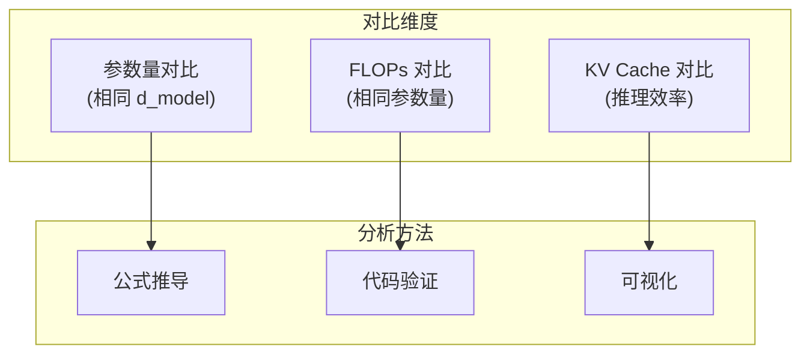

**任务**：
1. 推导 GPT-2 风格（标准 FFN + MHA）和 Llama 风格（SwiGLU + GQA）的参数量公式
2. 在相同参数预算下，两种风格的 $d_{model}$ 和 $d_{ff}$ 分别是多少？
3. 计算推理时 KV Cache 的显存占用差异
4. 编写 FLOPs 计算器，对比两种架构的计算效率

**关键 FLOPs 计算公式**：

$$\text{FLOPs}_{attn} = 2 \times S \times (4 d_{model}^2 + 2 S \times d_{model})$$

$$\text{FLOPs}_{ffn}^{standard} = 2 \times S \times 2 d_{model} \times d_{ff}$$

$$\text{FLOPs}_{ffn}^{swiglu} = 2 \times S \times 3 d_{model} \times d_{ff}$$

$$\text{KV\_Cache}_{MHA} = 2 \times L \times S \times n_h \times d_h \times \text{dtype\_size}$$

$$\text{KV\_Cache}_{GQA} = 2 \times L \times S \times n_{kv} \times d_h \times \text{dtype\_size}$$

---

### 项目 5：GPT-2 vs Llama 架构对比实验（进阶 ⭐⭐）

**目标**：在相同参数量下实现 GPT-2 风格和 Llama 风格的模型，对比训练稳定性和最终性能，量化各组件改进的贡献。

**实验设计**：

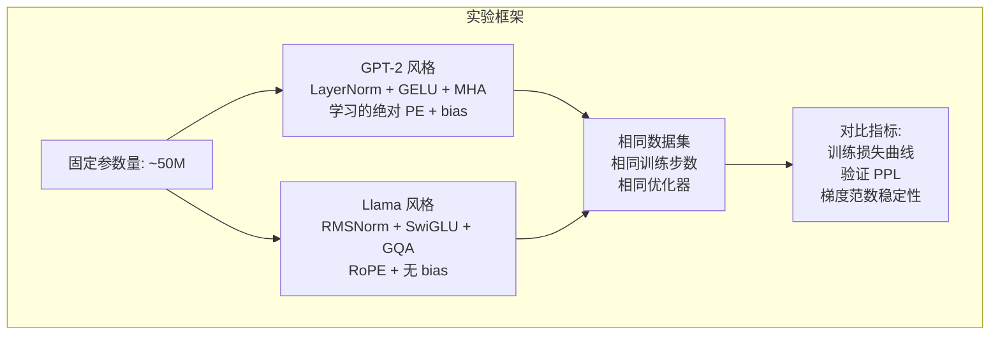

**关键提示**：
- 使用本章的 `ModelConfig` 分别创建两种风格的配置
- GPT-2 风格：`ffn_type="standard", norm_type="layernorm", use_rope=False, bias=True`
- Llama 风格：`ffn_type="swiglu", norm_type="rmsnorm", use_rope=True, bias=False`
- 注意调整 $d_{ff}$ 使两种配置的总参数量尽可能接近（SwiGLU 有 3 个矩阵，标准 FFN 有 2 个）
- 建议使用一个小规模文本数据集（如 WikiText-2）训练 5000-10000 步

**思考问题**：
1. 两种架构在训练过程中的损失下降速度有何差异？
2. 梯度范数的稳定性（方差）哪种更好？
3. 如果逐个替换组件（如只把 LayerNorm 换成 RMSNorm），哪个改进对性能提升贡献最大？
4. 固定参数量时，SwiGLU 的 $d_{ff}$ 比标准 FFN 小多少？这对模型的表达能力有何影响？

**进阶拓展**：设计消融实验，每次只替换一个组件，量化各组件的独立贡献。

---

## 12. 本章小结

### 核心知识点

1. **自回归分解**：$P(x_1, \ldots, x_T) = \prod_{t=1}^{T} P(x_t \mid x_{<t})$，是 Decoder-only 模型的数学基础
2. **GPT 系列**：从预训练+微调（GPT-1）到 In-Context Learning（GPT-3）的范式演进
3. **Llama 改进**：RMSNorm + SwiGLU + RoPE + GQA 成为现代 Decoder-only 的标准配置
4. **Gemma 特色**：局部/全局交替注意力、Logit 软截断、大词汇表（256K）
5. **DeepSeek 创新**：MLA + MoE 的组合实现了极致的推理效率
6. **参数量公式**：$P \approx 12Ld^2$，FLOPs $\approx 6PD$
7. **生成策略**：Greedy / Top-K / Top-P / Temperature 各有适用场景
8. **Decoder-Only 胜出的原因**：统一性（信息论）、KV Cache 契合（工程）、简单可扩展（Scaling）

### 数学要点

- 链式法则分解：$P(x_{1:T}) = \prod P(x_t | x_{<t})$
- 交叉熵损失：$\mathcal{L} = -\frac{1}{T} \sum_t \log P(x_t | x_{<t})$
- Temperature：$P_\tau(w) \propto \exp(z_w / \tau)$
- 参数估算：$P \approx 12Ld^2 + Vd$

### 实践要点

1. 使用 `dataclass` 设计灵活的配置类，方便实验不同架构
2. GQA 统一了 MHA / MQA / GQA 三种注意力模式
3. 残差分支的初始化缩放（$1/\sqrt{2N}$）对深层模型很重要
4. Top-P 采样通常是最佳的通用生成策略
5. 完整代码见 `code/decoder_only/` 目录

---

## 参考资料

### 论文

1. Radford et al. (2018). *Improving Language Understanding by Generative Pre-Training*. (GPT-1)
2. Radford et al. (2019). *Language Models are Unsupervised Multitask Learners*. (GPT-2)
3. Brown et al. (2020). *Language Models are Few-Shot Learners*. (GPT-3)
4. Touvron et al. (2023). *LLaMA: Open and Efficient Foundation Language Models*.
5. Touvron et al. (2023). *Llama 2: Open Foundation and Fine-Tuned Chat Models*.
6. Grattafiori et al. (2024). *The Llama 3 Herd of Models*.
7. Team Gemma (2024). *Gemma: Open Models Based on Gemini Research and Technology*.
8. Team Gemma (2024). *Gemma 2: Improving Open Language Models at a Practical Size*.
9. Shazeer (2020). *GLU Variants Improve Transformer*.
10. Su et al. (2021). *RoFormer: Enhanced Transformer with Rotary Position Embedding*. (RoPE)
11. Ainslie et al. (2023). *GQA: Training Generalized Multi-Query Transformer Models from Multi-Head Checkpoints*.
12. DeepSeek-AI (2024). *DeepSeek-V2: A Strong, Economical, and Efficient MoE Language Model*.
13. DeepSeek-AI (2024). *DeepSeek-V3 Technical Report*.
14. Wang et al. (2022). *What Language Model Architecture and Pretraining Objective Work Best for Zero-Shot Generalization?*

### 博客与资源

1. [nanoGPT](https://github.com/karpathy/nanoGPT) - Karpathy 的最小 GPT 实现
2. [The Illustrated GPT-2](https://jalammar.github.io/illustrated-gpt2/) - 可视化 GPT-2 架构
3. [Llama 模型结构详解](https://github.com/meta-llama/llama) - Meta 官方实现

---

## 13. 章节衔接：下一步去哪里？

本模块建立了对 Decoder-Only 架构的全面理解。接下来有两条自然的延伸路径：

### 通往模块 5：注意力机制进阶

本模块中，我们已经看到注意力机制从 **MHA → GQA → MLA** 的演进。但这背后有一个核心工程瓶颈尚未深入：

**标准 MHA 在大模型中的效率问题**：
- KV Cache 显存占用随 $n_h \times d_h \times S$ 线性增长。以 Llama 2 70B 为例（$n_h=64$, $d_h=128$, $L=80$），一个 4K 序列的 KV Cache 占用约 **5GB**（FP16），128K 序列则需要 **160GB**
- 这直接限制了批大小和上下文长度，推理吞吐量成为瓶颈
- GQA 通过减少 KV 头数部分缓解了问题，但 DeepSeek 的 MLA 走了一条更激进的低秩压缩路线

**模块 5 将详细解答**：MHA / MQA / GQA / MLA 的完整数学推导、KV Cache 的精确显存分析、以及各方案的效率-质量权衡。

### 通往模块 6：MoE 混合专家

本模块讨论的所有模型都是 **Dense** 架构——每个 token 都要经过所有参数的计算。这导致了一个根本性问题：

**参数量与计算量的绑定**：
- Dense 模型的 FLOPs $\approx 2P$（每个 token），参数量增大必然导致计算量增大
- DeepSeek-V3 的解决方案：671B 总参数，但每个 token 只激活 37B（5.5%），通过 MoE 实现参数和计算的解耦
- 这使得模型可以拥有更大的"知识容量"（更多参数），同时保持可控的推理成本

**模块 6 将详细解答**：MoE 的路由机制、负载均衡问题、DeepSeekMoE 的细粒度专家设计、以及 MoE 的 Scaling Laws。

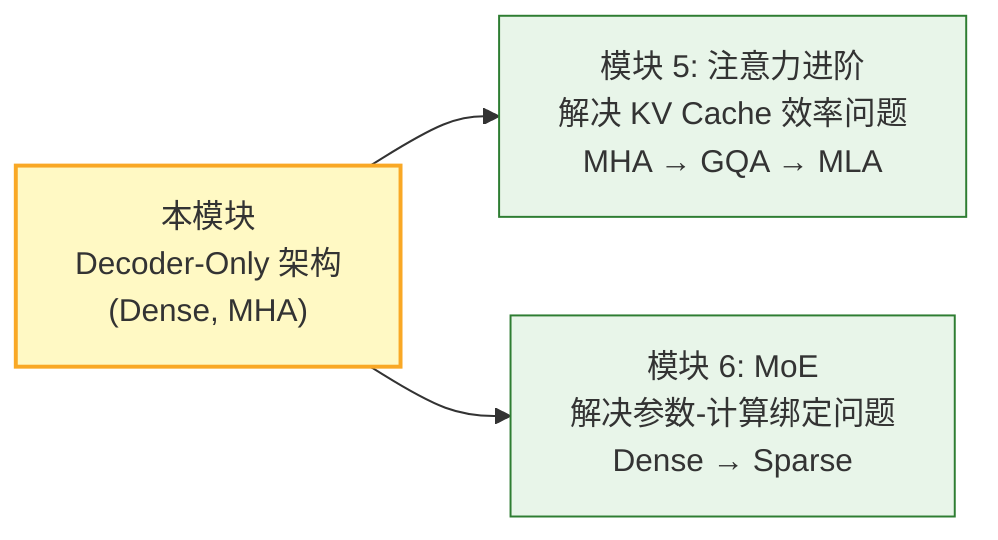
