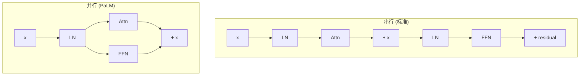
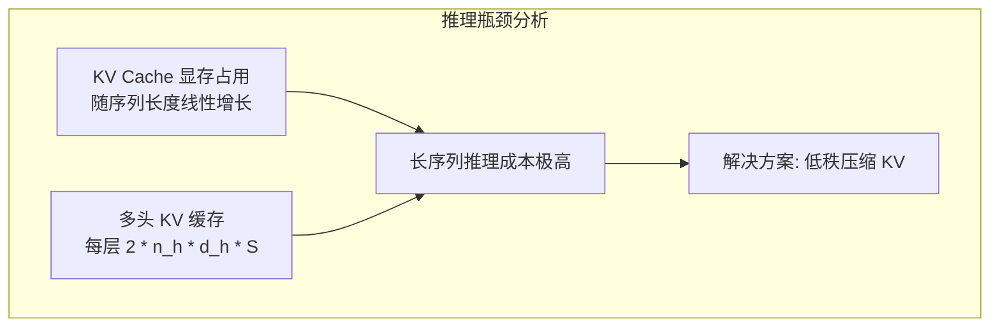
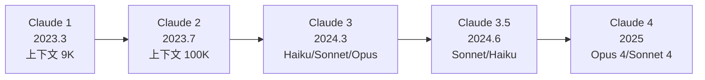
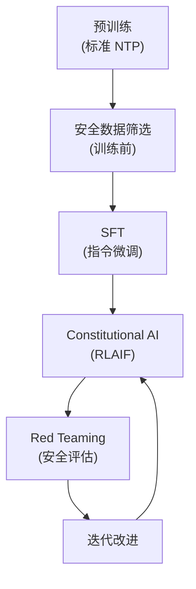
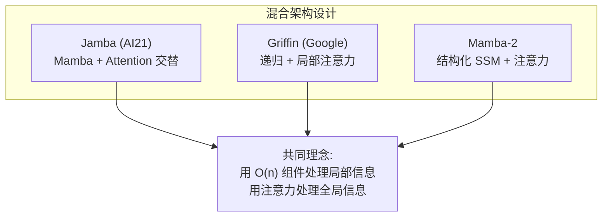

# Decoder-Only 架构进阶：工业实践与前沿探索

> 本文是 [模块4: Decoder-Only 架构](./README.md) 的进阶补充，深入分析 Google、DeepSeek、Anthropic 三条技术线在 Decoder-Only 架构上的工业实践，以及架构设计的前沿研究方向。

---

## 目录

- [1. Google：从 PaLM 到 Gemma 的架构演进](#1-google从-palm-到-gemma-的架构演进)
- [2. DeepSeek：以效率为核心的架构选择](#2-deepseek以效率为核心的架构选择)
- [3. Anthropic：安全约束下的架构设计](#3-anthropic安全约束下的架构设计)
- [4. 前沿话题](#4-前沿话题)

---

## 1. Google：从 PaLM 到 Gemma 的架构演进

### 1.1 PaLM：540B 参数与 Pathways 系统

PaLM（2022）是 Google 在 Decoder-only 路线上的标志性作品，展示了极大规模训练的可能性。

**架构创新**：

| 特性 | PaLM 选择 | 传统选择 | 原因 |
|------|-----------|----------|------|
| Attention + FFN | 并行 | 串行 | TPU 利用率提升 ~15% |
| 注意力类型 | MQA | MHA | 推理速度大幅提升 |
| 激活函数 | SwiGLU | GELU | 更好的下游性能 |
| 归一化 | RMSNorm (Pre-Norm) | LayerNorm | 训练更稳定 |
| 偏置项 | 无 bias | 有 bias | 减少参数量，简化实现 |

**并行 Attention + FFN 的深入分析**：

标准的串行结构：

$$y = x + \text{FFN}(\text{LN}(x + \text{Attn}(\text{LN}(x))))$$

PaLM 的并行结构：

$$y = x + \text{Attn}(\text{LN}(x)) + \text{FFN}(\text{LN}(x))$$

**并行结构的权衡**：
- 优势：Attention 和 FFN 可以在硬件上同时执行，减少通信延迟
- 代价：FFN 无法利用当前步 Attention 的输出。但实验表明，在大规模下（8B+）这个损失可忽略
- 工程实现：只需一次 LN 计算，输出分别送入 Attn 和 FFN

**Pathways 系统**：

PaLM 使用 Google 的 Pathways 系统在 6144 个 TPU v4 芯片上训练：
- 自动化的模型并行和数据并行调度
- 跨 Pod 的高效通信
- 支持异构计算资源的灵活编排

### 1.2 Gemini：多模态统一架构

Gemini（2023）将 Decoder-only 架构扩展到多模态领域：

- **原生多模态**：图像、音频、视频 token 与文本 token 在同一 Transformer 中处理
- **多种规模**：Ultra / Pro / Nano 覆盖不同部署场景
- 架构细节未完全公开，但推测基于 PaLM 的架构基础做了大量改进

### 1.3 Gemma 的开源设计权衡

Gemma 作为 Google 的开源系列，面临独特的设计约束：

**开源 vs 闭源的架构差异**：

| 维度 | 闭源（Gemini） | 开源（Gemma） |
|------|---------------|--------------|
| 模型规模 | 极大（推测 > 100B） | 中小（2B ~ 27B） |
| 训练资源 | 不受限 | 需考虑社区复现成本 |
| 推理部署 | 自有基础设施 | 用户多样化硬件 |
| 注意力选择 | 可能使用更复杂方案 | GQA（平衡效率和质量） |

**Gemma 2 的关键设计决策**：

1. **GQA + 滑动窗口交替**：在中小规模下兼顾推理效率和长文本能力
2. **知识蒸馏**：用更大的教师模型训练，弥补小模型的容量限制
3. **大词汇表（256K）**：牺牲 Embedding 参数量换取更好的多语言和代码支持
4. **Logit 软截断**：$\text{logits} = c \cdot \tanh(\text{logits}/c)$，增强训练和推理的数值稳定性

**Gemma 2 的训练细节（公开信息）**：
- 2B 和 9B 模型使用知识蒸馏训练
- 27B 模型使用标准预训练
- 训练数据约 2T tokens（英语为主的多语言语料）
- 使用 TPU 进行训练

---

## 2. DeepSeek：以效率为核心的架构选择

### 2.1 DeepSeek-V1：基础架构验证

DeepSeek-V1 采用了相对标准的 Llama 风格架构：

- 标准 MHA
- RMSNorm + SwiGLU + RoPE
- Dense FFN

这一版本的主要贡献在于**数据工程**和**训练方法**，而非架构创新。它验证了一个关键假设：高质量的中英混合数据 + 精心的训练策略可以让开源模型达到闭源模型的水平。

### 2.2 从标准 MHA 到 MLA 的演进动机

DeepSeek-V2 引入 MLA 的核心动机是**推理成本**：

**MLA 的压缩原理**（详细数学见模块 5）：

标准 MHA 的 KV Cache 每层每 token 需要存储 $2 \times n_h \times d_h$ 个元素。对于一个 64 头、128 维的模型，这意味着每层每 token 需要 $2 \times 64 \times 128 = 16384$ 个元素。

MLA 通过低秩压缩将 KV 投影到 $d_c$ 维空间（如 $d_c = 512$），只需缓存压缩后的表示加上 RoPE 相关的少量额外信息（$d_r = 64$）。

| 方案 | KV Cache (每层每token) | 压缩比 |
|------|----------------------|--------|
| 标准 MHA | 16384 | 1x |
| GQA (8 KV头) | 2048 | 8x |
| MLA (dc=512, dr=64) | 576 | **28x** |

### 2.3 超参数搜索的工程方法论

DeepSeek 在确定大模型配置前，采用了系统化的**小模型 proxy 实验**：

**具体流程**：
1. 在 70M ~ 400M 规模上，系统搜索 $d_{model}$、$n_{layers}$、$n_h$、$d_{ff}$ 的最优组合
2. 固定总 FLOPs 预算，找到使验证 loss 最低的配置
3. 拟合 Scaling Laws 曲线，外推到目标规模
4. 在目标规模上用少量训练步验证预测的准确性

这种方法论大幅降低了大模型配置搜索的成本。

### 2.4 DeepSeek 的"少参数、多训练"策略

DeepSeek-V3 的一个显著特点是在 MoE 架构下实现了极致的效率：

- 总参数量 671B，但每个 token 只激活 37B
- 训练使用 14.8T tokens
- 训练成本仅 $5.576M（使用 H800 集群）

这种设计体现了 DeepSeek 的核心哲学：**不追求最大的模型，而是追求在给定计算预算下最优的性能**。

---

## 3. Anthropic：安全约束下的架构设计

### 3.1 Claude 的架构演进

Claude 的具体架构参数从未公开，但从 Anthropic 的论文、博客和产品特性可以推断以下信息：

**时间线**：

**确定的技术特征**：
- 所有版本均为 Decoder-only 架构
- Claude 2 实现了 100K 上下文窗口，Claude 3 进一步扩展到 200K
- Claude 3 系列提供三种规模（Haiku < Sonnet < Opus），适配不同场景
- 支持多模态输入（图像理解），说明架构具备视觉处理能力

### 3.2 安全性如何影响架构设计

Anthropic 的核心理念是"安全优先"，这可能在多个层面影响架构选择：

**训练流程中的安全设计**：

**公开信息——Constitutional AI 的架构影响**：

Constitutional AI（CAI）不是一个架构改进，而是一个训练方法论。但它对模型的输出行为有深远影响：
1. 模型学会自我审查：在生成前"检查"输出是否符合宪法原则
2. 这种行为可能通过特定的注意力模式实现（参考 Transformer Circuits 的研究）
3. [推测] Anthropic 可能在模型中引入了额外的安全相关的监控机制

### 3.3 从可解释性研究看架构选择

Anthropic 的 Transformer Circuits 研究为架构设计提供了独特的视角：

**Induction Heads 对架构深度的启示**：
- Induction Heads 至少需要 2 层才能形成（Previous Token Head + Induction Head）
- 更深的模型可以形成更复杂的组合电路
- 这从可解释性角度解释了为什么深层模型比宽浅模型更强

**Superposition 对模型宽度的启示**：
- 更宽的模型（更大的 $d_{model}$）可以容纳更多特征方向
- 但 Superposition 允许模型在有限维度中"挤入"更多特征
- 这意味着模型的有效特征数远大于 $d_{model}$

**对工业实践的影响**：
- [推测] Anthropic 可能基于 Circuits 研究对注意力头的数量和配置做了针对性优化
- [推测] 可解释性研究可能指导了训练数据的选择和质量控制
- 公开事实：Anthropic 在 Claude 3 中发现并修复了"金门大桥"等异常特征激活，这需要对模型内部机制有深入理解

---

## 4. 前沿话题

### 4.1 深窄 vs 宽浅网络的 Scaling 行为

一个关键的架构设计问题：在相同参数预算下，应该选择更深的网络（更多层）还是更宽的网络（更大的 $d_{model}$）？

**实验观察**：
- 在中小规模（< 1B），加深比加宽更有效
- 在大规模（> 10B），两者差距缩小
- 极深网络（> 100 层）面临训练稳定性挑战

**理论解释**：
- 深度增加组合复杂性（电路深度增加可表达的函数类）
- 宽度增加特征容量（更多方向可用于特征编码）
- Scaling Laws 研究表明，最优的 depth / width 比率与总参数量有关

**工业实践中的选择**：

| 模型 | 参数量 | 层数 | $d_{model}$ | 深度/宽度比 |
|------|--------|------|-------------|------------|
| GPT-3 | 175B | 96 | 12288 | 0.0078 |
| Llama 2 70B | 69B | 80 | 8192 | 0.0098 |
| Llama 3 70B | 70B | 80 | 8192 | 0.0098 |
| DeepSeek-V2 | 21B 活跃 | 60 | 5120 | 0.0117 |

可以观察到，层数 / $d_{model}$ 的比值大致在 0.008 ~ 0.012 之间。

### 4.2 架构搜索自动化

手工设计架构的局限性催生了自动化架构搜索的研究：

**Neural Architecture Search (NAS) 在 LLM 中的应用**：
- Google 的 Evolved Transformer：使用进化算法搜索 Transformer 变体
- 搜索空间：归一化位置、注意力类型、FFN 类型、连接模式
- 约束：FLOPs 预算、推理延迟、参数量

**当前挑战**：
- 搜索成本极高（需要在大规模下验证）
- 现有 Scaling Laws 不一定适用于非标准架构
- 训练稳定性难以在小规模 proxy 实验中预测

### 4.3 Sub-quadratic 模型的工业化进展

尽管 Transformer 仍是主流，但 $O(n^2)$ 复杂度的限制催生了替代架构的研究：

**Mamba (State Space Model)**：
- $O(n)$ 的序列处理复杂度
- 选择性状态空间机制：参数依赖于输入
- 在中小规模模型上表现出色
- 挑战：大规模验证尚不充分

**RWKV (Receptance Weighted Key Value)**：
- 将注意力改写为 RNN 风格的递推
- 训练时可并行，推理时为 $O(1)$ 空间
- 已在开源社区得到广泛验证

**Griffin (Google)**：
- 混合使用局部注意力和递归层
- 在长序列任务上优于纯 Transformer
- 参数效率更高

**混合架构趋势**：

**当前共识**：
- 纯 SSM 模型在"回忆"任务（如 needle-in-a-haystack）上弱于 Transformer
- 混合架构可能是最优解
- 但工业界的基础设施和 CUDA kernel 优化都围绕 Transformer 构建，切换成本很高

### 4.4 模型架构与推理效率的协同设计

现代架构设计越来越多地考虑推理效率：

**推理感知的架构选择**：

| 设计决策 | 对训练的影响 | 对推理的影响 | 实际选择 |
|---------|-------------|-------------|---------|
| MHA → GQA | 质量略降 | KV Cache 大幅减少 | Llama 2+, Gemma 2 |
| MHA → MLA | 需要额外训练 | KV Cache 极大压缩 | DeepSeek-V2+ |
| Dense → MoE | 训练更复杂 | 激活参数少，推理快 | DeepSeek-V2+, Mixtral |
| 深 → 浅+宽 | 可能降低质量 | 更少的序列化操作 | 部分边缘部署场景 |

**Speculative Decoding 对架构的影响**：
- 需要一个小的"草稿模型"和大的"验证模型"
- 两个模型的架构兼容性影响验证效率
- DeepSeek-V3 的多 token 预测头本质上是为 Speculative Decoding 铺路

---

## 参考资料

### 论文

1. Chowdhery et al. (2022). *PaLM: Scaling Language Modeling with Pathways*. Google.
2. Anil et al. (2023). *Gemini: A Family of Highly Capable Multimodal Models*. Google.
3. Team Gemma (2024). *Gemma 2: Improving Open Language Models at a Practical Size*. Google.
4. DeepSeek-AI (2024). *DeepSeek-V2: A Strong, Economical, and Efficient MoE Language Model*.
5. DeepSeek-AI (2024). *DeepSeek-V3 Technical Report*.
6. Bai et al. (2022). *Constitutional AI: Harmlessness from AI Feedback*. Anthropic.
7. Elhage et al. (2021). *A Mathematical Framework for Transformer Circuits*. Anthropic.
8. Olsson et al. (2022). *In-context Learning and Induction Heads*. Anthropic.
9. Gu & Dao (2023). *Mamba: Linear-Time Sequence Modeling with Selective State Spaces*.
10. Peng et al. (2023). *RWKV: Reinventing RNNs for the Transformer Era*.
11. De et al. (2024). *Griffin: Mixing Gated Linear Recurrences with Local Attention for Efficient Language Models*. Google.
12. Lieber et al. (2024). *Jamba: A Hybrid Transformer-Mamba Language Model*. AI21 Labs.

### 博客

1. [Google AI Blog: PaLM](https://ai.googleblog.com/2022/04/pathways-language-model-palm-scaling-to.html)
2. [Transformer Circuits Thread](https://transformer-circuits.pub/) - Anthropic
3. [DeepSeek-V2 技术解读](https://arxiv.org/abs/2405.04434)
