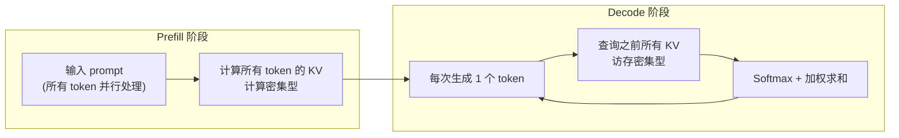
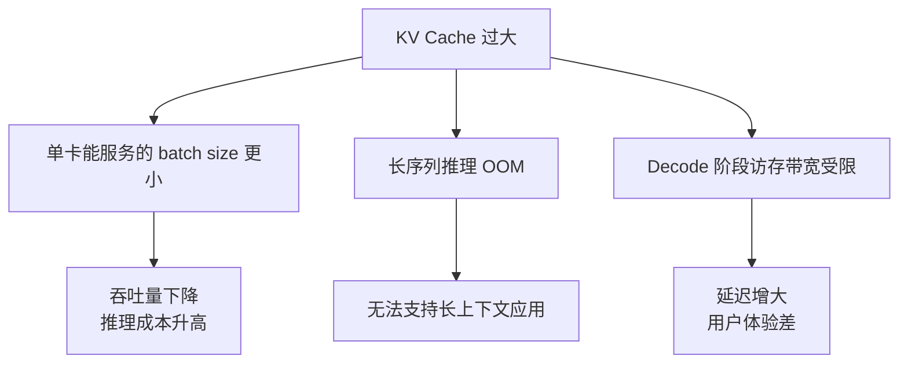
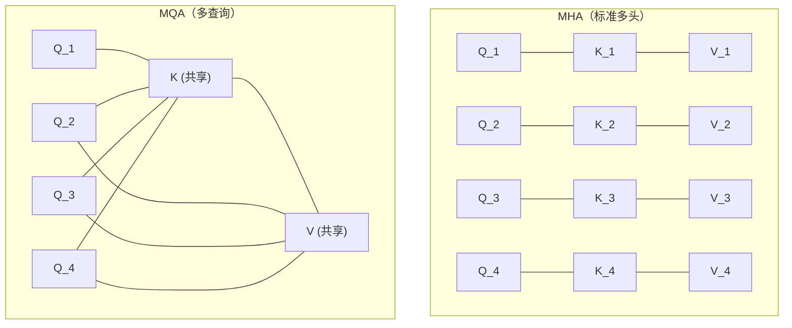
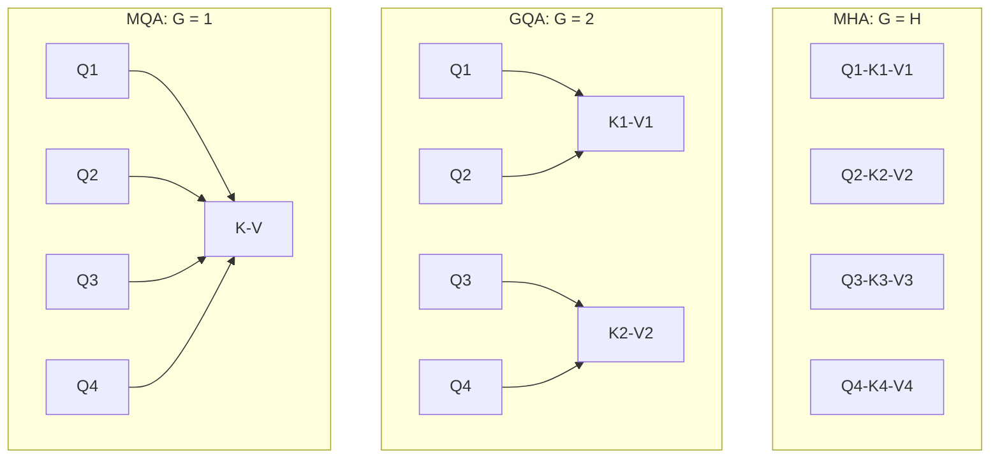
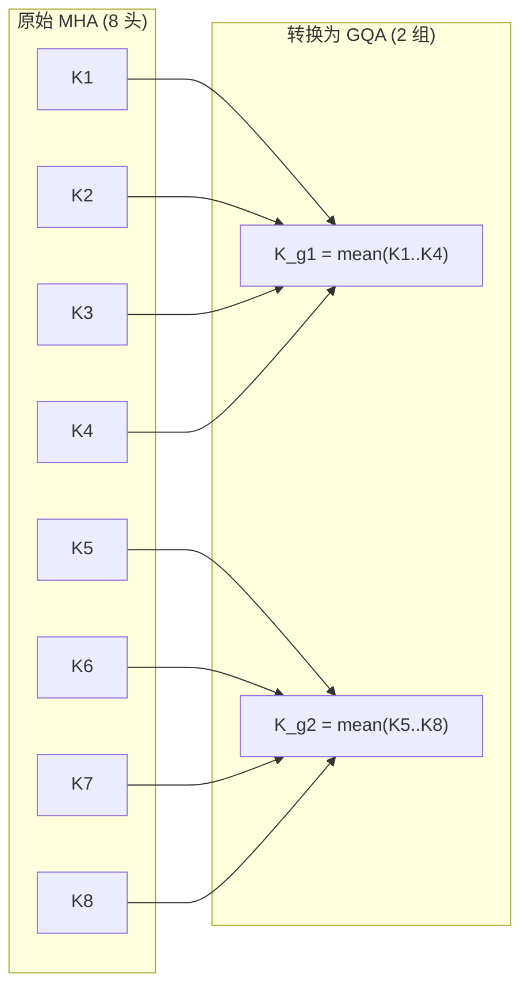
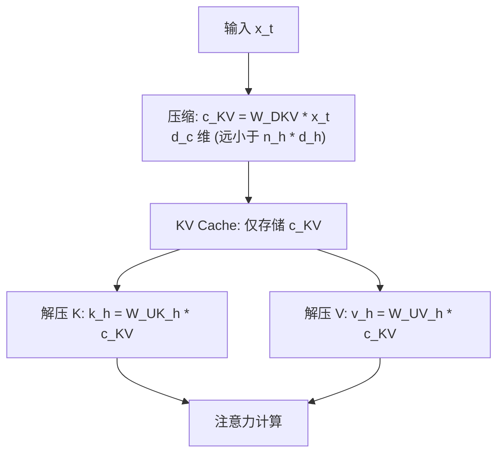
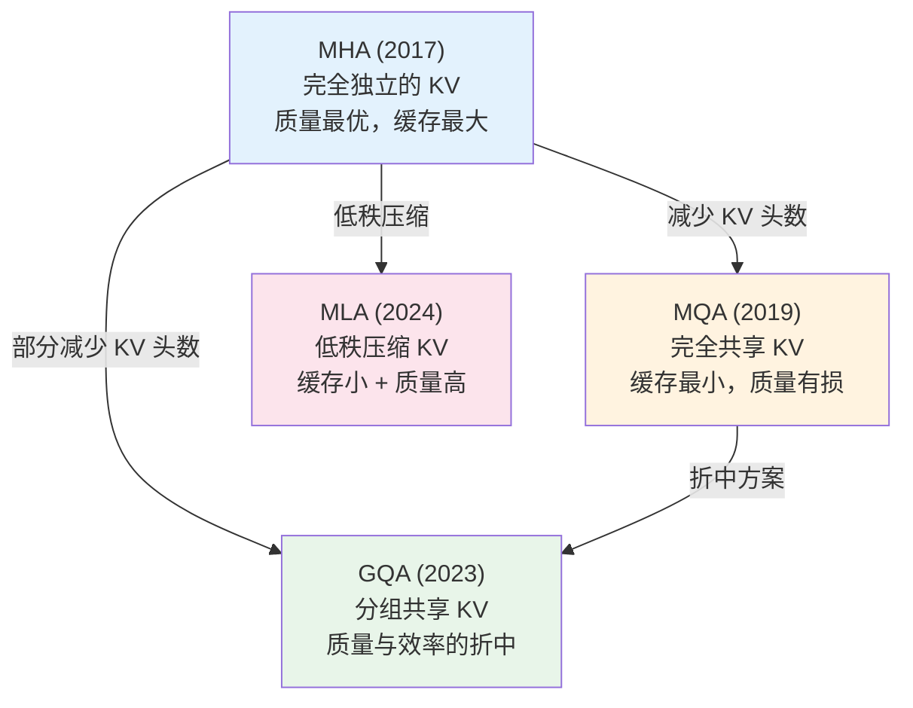

# 模块5：注意力机制进阶 -- MHA/MQA/GQA/MLA

> 注意力机制是 Transformer 的核心引擎。本章深入分析注意力机制的工业级变体，从标准 Multi-Head Attention 到 DeepSeek 的 Multi-head Latent Attention，探索如何在模型质量与推理效率之间取得最优平衡。

**前置知识**：本章假设你已掌握模块3的 Self-Attention 和 Multi-Head Attention 基础。如需回顾，请参考 [模块3: Transformer核心架构](../03_transformer/README.md)。

---

## 目录

- [1. 推理瓶颈：KV Cache 的显存挑战](#1-推理瓶颈kv-cache-的显存挑战)
- [2. 标准多头注意力（MHA）回顾](#2-标准多头注意力mha回顾)
- [3. Multi-Query Attention（MQA）](#3-multi-query-attentionmqa)
- [4. Grouped-Query Attention（GQA）](#4-grouped-query-attentiongqa)
- [5. Multi-head Latent Attention（MLA）](#5-multi-head-latent-attentionmla)
- [6. 统一视角：四种注意力的对比与演进](#6-统一视角四种注意力的对比与演进)
- [7. Sequence Packing：高效训练数据策略](#7-sequence-packing高效训练数据策略)
- [8. 三条技术线的注意力实践](#8-三条技术线的注意力实践)
- [9. 项目实践](#9-项目实践)

---

## 1. 推理瓶颈：KV Cache 的显存挑战

### 1.1 自回归推理的两个阶段

在 Decoder-only 模型的推理过程中，存在两个截然不同的阶段：



- **Prefill 阶段**：一次性处理完整的输入 prompt，计算所有 token 的 Q/K/V。此阶段是**计算密集型**的，GPU 的计算单元是瓶颈。
- **Decode 阶段**：逐个生成新 token。每生成一个 token，需要用当前 token 的 Query 与之前**所有** token 的 Key/Value 做注意力计算。此阶段是**访存密集型**的，KV Cache 的读取带宽是瓶颈。

### 1.2 KV Cache 的显存占用

为了避免在 Decode 阶段重复计算之前 token 的 K 和 V，我们将它们缓存起来，这就是 **KV Cache**。

对于标准 MHA，KV Cache 的显存占用为：

$$M_{KV} = 2 \times n_{layers} \times n_{heads} \times d_{head} \times S \times b_{dtype}$$

其中：
- $2$: Key 和 Value 各一份
- $n_{layers}$: Transformer 层数
- $n_{heads}$: 注意力头数
- $d_{head}$: 每个头的维度
- $S$: 序列长度
- $b_{dtype}$: 数据类型字节数（FP16 为 2）

**实际案例**：以 Llama 2-70B 为例：

| 参数 | 值 |
|------|-----|
| $n_{layers}$ | 80 |
| $n_{heads}$ | 64 |
| $d_{head}$ | 128 |
| $S$（序列长度） | 4096 |
| $b_{dtype}$（FP16） | 2 |

$$M_{KV} = 2 \times 80 \times 64 \times 128 \times 4096 \times 2 = \textbf{10.7 GB}$$

仅 KV Cache 就占用超过 10 GB 显存！当 batch size 增大或序列更长时，KV Cache 将迅速耗尽 GPU 显存。

**核心矛盾**：KV Cache 大小与序列长度线性增长，与 batch size 线性增长。在长上下文（128K+ token）场景下，KV Cache 成为推理系统的首要瓶颈。

### 1.3 为什么要优化 KV Cache？



因此，MQA、GQA、MLA 等技术的核心目标都是**压缩 KV Cache**，在尽量不损失模型质量的前提下降低推理成本。

---

## 2. 标准多头注意力（MHA）回顾

### 2.1 数学形式

模块3已经详细推导了 MHA（详见 [模块3 - Multi-Head Attention](../03_transformer/README.md#2-multi-head-attention)）。这里简要回顾其关键公式和参数特征。

对于输入 $X \in \mathbb{R}^{S \times d}$，MHA 的计算为：

$$Q = XW_Q, \quad K = XW_K, \quad V = XW_V$$

将 Q/K/V 按头拆分后，每个头独立计算注意力：

$$\text{head}_h = \text{softmax}\left(\frac{Q_h K_h^T}{\sqrt{d_{head}}}\right) V_h$$

拼接并投影：

$$\text{MHA}(X) = \text{Concat}(\text{head}_1, \ldots, \text{head}_H) W_O$$

### 2.2 参数量与 KV Cache

| 指标 | MHA |
|------|-----|
| Q 投影参数 | $d \times d$ |
| K 投影参数 | $d \times d$ |
| V 投影参数 | $d \times d$ |
| O 投影参数 | $d \times d$ |
| 总参数量 | $4d^2$ |
| 每层每 token KV Cache | $2 \times n_h \times d_h$ |

其中 $d = n_h \times d_h$（模型维度 = 头数 x 每头维度）。

**关键观察**：MHA 中，每个头都有独立的 K 和 V 投影，因此 KV Cache 大小与头数成正比。这正是后续优化的切入点。

---

## 3. Multi-Query Attention（MQA）

### 3.1 核心思想

MQA 由 Shazeer (2019) 提出，其核心思想极为简洁：

> **所有 Query 头共享同一组 Key 和 Value。**



### 3.2 数学形式

MQA 的投影矩阵变化：

$$Q_h = X W_Q^{(h)} \in \mathbb{R}^{S \times d_h}, \quad h = 1, \ldots, H$$

$$K = X W_K \in \mathbb{R}^{S \times d_h}, \quad V = X W_V \in \mathbb{R}^{S \times d_h}$$

注意 $W_K$ 和 $W_V$ 不再带有头索引 $h$，它们是所有头共享的。

每个头的注意力计算为：

$$\text{head}_h = \text{softmax}\left(\frac{Q_h K^T}{\sqrt{d_h}}\right) V$$

### 3.3 参数量与 KV Cache 对比

| 指标 | MHA | MQA |
|------|-----|-----|
| Q 投影参数 | $d \times d$ | $d \times d$ |
| K 投影参数 | $d \times d$ | $d \times d_h$ |
| V 投影参数 | $d \times d$ | $d \times d_h$ |
| O 投影参数 | $d \times d$ | $d \times d$ |
| 总参数量 | $4d^2$ | $2d^2 + 2d \cdot d_h$ |
| 每层每 token KV Cache | $2 n_h d_h$ | $2 d_h$ |
| KV Cache 压缩比 | 1x | $n_h$ x |

以 $n_h = 64$、$d_h = 128$ 为例，MQA 将 KV Cache 压缩为 MHA 的 **1/64**。

### 3.4 质量-效率权衡

MQA 的优势显而易见：推理速度大幅提升、KV Cache 大幅缩小。但代价是什么？

**质量影响**：

Shazeer (2019) 的实验表明，MQA 在翻译任务上几乎不损失质量（BLEU 分数下降 < 0.5%），但在某些需要精细注意力区分的任务上可能有损失。

**直觉理解**：

为什么共享 KV 不会严重影响模型质量？

1. **Query 仍然独立**：不同头的 Q 仍然学习不同的查询模式
2. **注意力权重仍然不同**：即使 K/V 相同，不同 Q 与同一个 K 的点积不同，因此注意力分布仍然不同
3. **信息瓶颈**：Key 主要决定"看哪里"，Value 决定"看什么"。共享 K 和 V 的限制在于所有头必须从同一个"视角"提取信息

**代表模型**：PaLM (Google, 2022)、StarCoder

---

## 4. Grouped-Query Attention（GQA）

### 4.1 MHA 与 MQA 的折中

GQA 由 Ainslie et al. (2023) 提出，是 MHA 和 MQA 的折中方案。

> **将 Query 头分成 $G$ 组，每组共享一组 KV。**

当 $G = H$（组数 = 头数）时退化为 MHA；当 $G = 1$ 时退化为 MQA。



### 4.2 数学形式

GQA 的分组策略为：将 $H$ 个 Query 头分为 $G$ 组，每组 $H/G$ 个 Query 头共享一组 KV。

设 $g(h) = \lfloor h \cdot G / H \rfloor$ 为第 $h$ 个 Query 头所属的组编号，则：

$$Q_h = X W_Q^{(h)}, \quad h = 1, \ldots, H$$

$$K_{g} = X W_K^{(g)}, \quad V_{g} = X W_V^{(g)}, \quad g = 0, \ldots, G-1$$

第 $h$ 个头的注意力：

$$\text{head}_h = \text{softmax}\left(\frac{Q_h K_{g(h)}^T}{\sqrt{d_h}}\right) V_{g(h)}$$

### 4.3 参数量与 KV Cache

| 指标 | MHA ($G=H$) | GQA ($G$ 组) | MQA ($G=1$) |
|------|-------------|--------------|-------------|
| K 投影参数 | $d \times d$ | $d \times G d_h$ | $d \times d_h$ |
| V 投影参数 | $d \times d$ | $d \times G d_h$ | $d \times d_h$ |
| 每层每 token KV Cache | $2 H d_h$ | $2 G d_h$ | $2 d_h$ |
| KV Cache 压缩比 | 1x | $H/G$ x | $H$ x |

### 4.4 从 MHA Checkpoint 转换为 GQA

GQA 论文提出了一个重要的工程方法：**可以从已训练好的 MHA 模型转换为 GQA 模型，然后进行少量的继续训练（uptraining）**。

转换策略有两种：

**策略一：均值池化（Mean Pooling）**

将同一组内的 KV 权重取平均：

$$W_K^{(g)} = \frac{1}{|G_g|} \sum_{h \in G_g} W_K^{(h)}$$

$$W_V^{(g)} = \frac{1}{|G_g|} \sum_{h \in G_g} W_V^{(h)}$$

**策略二：选择中心头**

选择组内距离中心最近的头的权重作为组的代表。



**uptraining 的效果**：论文发现，从 MHA 转换为 GQA-8（8组）后进行约 5% 原始训练量的继续训练，可以恢复几乎全部的模型质量。

### 4.5 代表模型

| 模型 | 头数 $H$ | KV 组数 $G$ | 每组 Q 头数 |
|------|---------|------------|------------|
| Llama 2 70B | 64 | 8 | 8 |
| Llama 3 8B | 32 | 8 | 4 |
| Llama 3 70B | 64 | 8 | 8 |
| Gemma 2 | 16 | 1 或 4 | 可变 |
| Mistral 7B | 32 | 8 | 4 |

---

## 5. Multi-head Latent Attention（MLA）

### 5.1 设计动机

MQA 和 GQA 通过减少 KV 头数来压缩 KV Cache，但有一个根本局限：它们强制多个 Query 头共享完全相同的 K/V，这直接限制了不同头的注意力模式多样性。

DeepSeek-V2 提出了一种完全不同的思路：

> **不减少头数，而是将 KV 压缩到一个低维潜在空间（latent space）。推理时只缓存这个低维表示。**

这就是 **Multi-head Latent Attention (MLA)**。

### 5.2 核心思想

MLA 的核心是一个低秩压缩-解压缩框架：



**关键洞察**：在标准 MHA 中，不同头的 K 和 V 之间往往存在大量冗余信息（高度相关）。MLA 利用低秩压缩捕获 KV 的主要信息，然后通过解压缩矩阵恢复每个头的独立 K/V。

### 5.3 数学推导

#### 步骤一：KV 联合压缩

将输入 $x_t \in \mathbb{R}^d$ 压缩为低维潜在表示：

$$c_{KV}^{(t)} = W_{DKV} \, x_t \in \mathbb{R}^{d_c}$$

其中 $W_{DKV} \in \mathbb{R}^{d_c \times d}$，$d_c \ll n_h \times d_h$。

这个 $c_{KV}^{(t)}$ 是唯一需要缓存的内容。

#### 步骤二：KV 解压缩

从压缩表示中恢复每个头的 K 和 V：

$$k_h^{(t)} = W_{UK}^{(h)} \, c_{KV}^{(t)} \in \mathbb{R}^{d_h}$$

$$v_h^{(t)} = W_{UV}^{(h)} \, c_{KV}^{(t)} \in \mathbb{R}^{d_h}$$

其中 $W_{UK}^{(h)} \in \mathbb{R}^{d_h \times d_c}$，$W_{UV}^{(h)} \in \mathbb{R}^{d_h \times d_c}$。

#### 步骤三：Query 的类似压缩（可选）

MLA 对 Query 也做了类似的压缩（降低训练时的激活值显存）：

$$c_Q^{(t)} = W_{DQ} \, x_t \in \mathbb{R}^{d_c'}$$

$$q_h^{(t)} = W_{UQ}^{(h)} \, c_Q^{(t)} \in \mathbb{R}^{d_h}$$

#### 步骤四：注意力计算

$$\text{head}_h = \text{softmax}\left(\frac{q_h (k_h)^T}{\sqrt{d_h}}\right) v_h$$

### 5.4 与 RoPE 的兼容性问题

这里存在一个微妙但关键的问题：**RoPE 需要直接作用在 Q 和 K 上**，但 MLA 在推理时只缓存压缩后的 $c_{KV}$，解压缩时才恢复 K。如果 RoPE 作用在解压缩后的 K 上，那推理时需要先解压缩再加 RoPE，这部分计算无法被吸收。

DeepSeek 的解决方案是**解耦 RoPE（Decoupled RoPE）**：

将 Query 和 Key 各拆分为两部分：

$$q_h^{(t)} = \left[\underbrace{W_{UQ}^{(h)} c_Q^{(t)}}_{\text{内容部分} \in \mathbb{R}^{d_h}} \; ; \; \underbrace{\text{RoPE}(W_{QR} \, x_t)}_{\text{位置部分} \in \mathbb{R}^{d_r}}\right]$$

$$k_h^{(t)} = \left[\underbrace{W_{UK}^{(h)} c_{KV}^{(t)}}_{\text{内容部分} \in \mathbb{R}^{d_h}} \; ; \; \underbrace{\text{RoPE}(W_{KR} \, x_t)}_{\text{位置部分} \in \mathbb{R}^{d_r}}\right]$$

注意力分数分解为两项之和：

$$\text{score}(m, n) = \underbrace{(W_{UQ}^{(h)} c_Q^{(m)})^T (W_{UK}^{(h)} c_{KV}^{(n)})}_{\text{内容-内容 相关性}} + \underbrace{(\text{RoPE}_m \, W_{QR} x_m)^T (\text{RoPE}_n \, W_{KR} x_n)}_{\text{位置-位置 相关性}}$$

推理时，KV Cache 需要存储的是：

$$\text{KV Cache} = [c_{KV}^{(t)} \in \mathbb{R}^{d_c}, \; \text{RoPE}(W_{KR} x_t) \in \mathbb{R}^{d_r}]$$

总缓存大小为 $d_c + d_r$，仍然远小于标准 MHA 的 $2 n_h d_h$。

### 5.5 与 LoRA 思想的联系

MLA 的低秩压缩与 LoRA（Low-Rank Adaptation）有着深刻的思想联系：

| 对比维度 | LoRA | MLA |
|----------|------|-----|
| 场景 | 微调时减少参数 | 推理时压缩 KV Cache |
| 核心思想 | $\Delta W = BA$（低秩更新） | $K = W_{UK} \cdot W_{DKV} x$（低秩投影） |
| 低秩假设 | 权重更新矩阵是低秩的 | KV 表示跨头是低秩的 |
| 压缩对象 | 可学习参数 | 推理时的激活值缓存 |

两者都利用了同一个基本事实：**高维表示中存在大量冗余，可以用低秩近似高效表达**。

### 5.6 KV Cache 对比

| 方案 | 每层每 token 缓存大小 | 典型值（DeepSeek-V2） |
|------|----------------------|----------------------|
| MHA | $2 \times n_h \times d_h$ | $2 \times 128 \times 128 = 32{,}768$ |
| GQA (Llama 3) | $2 \times G \times d_h$ | $2 \times 8 \times 128 = 2{,}048$ |
| MQA | $2 \times d_h$ | $2 \times 128 = 256$ |
| MLA | $d_c + d_r$ | $512 + 64 = 576$ |

MLA 的缓存大小介于 MQA 和 GQA 之间，但由于每个头仍有独立的解压缩矩阵，模型表达能力远优于 MQA。

### 5.7 训练时的矩阵吸收技巧

在实际训练中，MLA 有一个重要的优化：解压缩矩阵可以与投影矩阵合并，避免显式地恢复完整的 K/V。

以内容部分的注意力分数为例：

$$(W_{UQ}^{(h)} c_Q)^T (W_{UK}^{(h)} c_{KV}) = c_Q^T \underbrace{(W_{UQ}^{(h)})^T W_{UK}^{(h)}}_{W_{QK}^{(h)}} c_{KV}$$

可以预计算 $W_{QK}^{(h)} = (W_{UQ}^{(h)})^T W_{UK}^{(h)} \in \mathbb{R}^{d_c' \times d_c}$，直接在压缩空间中计算注意力分数。

这意味着训练时根本不需要显式恢复到 $d_h$ 维的 K 和 V，进一步节省计算和内存。

---

## 6. 统一视角：四种注意力的对比与演进

### 6.1 统一数学框架

四种注意力机制可以统一在一个框架下：

$$\text{head}_h = \text{softmax}\left(\frac{Q_h K_{f(h)}^T}{\sqrt{d_k}}\right) V_{f(h)}$$

其中映射函数 $f(h)$ 定义了 Query 头到 KV 的对应关系：

| 方法 | $f(h)$ | KV 数量 |
|------|--------|---------|
| MHA | $f(h) = h$ | $H$ 组 |
| GQA | $f(h) = \lfloor h \cdot G / H \rfloor$ | $G$ 组 |
| MQA | $f(h) = 0$ | 1 组 |
| MLA | $f(h) = \text{decompress}(c_{KV}, h)$ | 共享压缩 + 按头解压 |

### 6.2 完整对比表

| 维度 | MHA | MQA | GQA | MLA |
|------|-----|-----|-----|-----|
| KV Cache (每层每 token) | $2 n_h d_h$ | $2 d_h$ | $2 G d_h$ | $d_c + d_r$ |
| 参数量 | $4d^2$ | $\approx 2d^2$ | 介于两者之间 | $\approx 4d^2$ (含压缩矩阵) |
| 模型质量 | 基准 | 略有下降 | 接近 MHA | 接近/等于 MHA |
| 推理速度 | 基准 | 最快 | 快 | 快 |
| 头的独立性 | 完全独立 | KV 完全共享 | 组内共享 | 压缩共享，解压独立 |
| 代表模型 | GPT-3 | PaLM | Llama 2/3 | DeepSeek-V2/V3 |

### 6.3 技术演进逻辑



**演进的核心逻辑**：
1. **MHA -> MQA**：简单粗暴地共享 KV，效率极高但质量有损
2. **MQA -> GQA**：认识到完全共享太激进，用分组做折中
3. **MHA -> MLA**：换一个维度思考，不减少头数而是压缩表示，兼顾质量和效率

### 6.4 如何选择？

| 场景 | 推荐方案 | 原因 |
|------|----------|------|
| 小模型（< 3B） | MHA 或 GQA | KV Cache 本身不大，质量更重要 |
| 中型模型（3B-30B） | GQA | 平衡质量与推理效率 |
| 大模型（> 30B）| GQA 或 MLA | 推理成本为主要考量 |
| 极长上下文（128K+） | MLA | KV Cache 压缩效果最显著 |
| 已有 MHA 模型 | GQA (uptraining) | 可从 MHA checkpoint 转换 |

---

## 7. Sequence Packing：高效训练数据策略

### 7.1 Padding 的浪费

在标准训练中，同一个 batch 的所有序列需要 padding 到相同长度：

```
序列1: [token token token token token PAD PAD PAD]  长度5, padding 3
序列2: [token token PAD PAD PAD PAD PAD PAD]         长度2, padding 6
序列3: [token token token token token token token PAD]长度7, padding 1
```

这里有 10/24 = 41.7% 的计算浪费在了 PAD token 上。在实际训练中，这个比例可能更高（尤其当序列长度分布不均匀时）。

### 7.2 Sequence Packing 的思想

将多个短序列拼接（pack）到一个固定长度的序列中，消除 padding：

```
Pack 1: [seq1_t1 seq1_t2 ... seq1_t5 | seq2_t1 seq2_t2 | PAD]  浪费仅 1
Pack 2: [seq3_t1 seq3_t2 ... seq3_t7 | PAD]                      浪费仅 1
```

### 7.3 注意力掩码处理：Block-Diagonal Masking

Packing 引入一个关键问题：**不同序列之间不应该互相注意**。

需要使用 Block-Diagonal（分块对角线）掩码：

$$M_{ij} = \begin{cases} 1 & \text{if token } i \text{ 和 token } j \text{ 属于同一序列} \\ 0 & \text{otherwise} \end{cases}$$

结合因果掩码，最终的掩码为：

$$\text{Mask}_{ij} = M_{ij} \cdot \mathbf{1}[j \leq i]$$

可视化示例（3 个序列 packed 到一起）：

```
         t1 t2 t3 | t4 t5 | t6 t7 t8
    t1 [  1  0  0 |  0  0 |  0  0  0 ]
    t2 [  1  1  0 |  0  0 |  0  0  0 ]
    t3 [  1  1  1 |  0  0 |  0  0  0 ]
    ---+----------+-------+----------
    t4 [  0  0  0 |  1  0 |  0  0  0 ]
    t5 [  0  0  0 |  1  1 |  0  0  0 ]
    ---+----------+-------+----------
    t6 [  0  0  0 |  0  0 |  1  0  0 ]
    t7 [  0  0  0 |  0  0 |  1  1  0 ]
    t8 [  0  0  0 |  0  0 |  1  1  1 ]
```

### 7.4 Bin Packing 算法

将不同长度的序列分配到固定大小的"bin"中，是经典的 bin packing 问题（NP-hard）。常用近似算法：

**First-Fit Decreasing (FFD)**：
1. 按序列长度从长到短排序
2. 对每个序列，找到第一个能放下的 bin
3. 如果没有，开启新 bin

### 7.5 对训练收敛的影响

Sequence Packing 不仅节省计算，还可能影响训练动态：

- **每步看到更多独立序列**：有效增大了 batch 中的独立样本数
- **梯度估计更准确**：减少了 padding token 对梯度的"稀释"
- **训练速度提升**：通常可提升 1.2x - 2x 的训练吞吐量

**注意事项**：需要确保 position id 和 loss mask 正确处理，不同序列的 position id 应独立从 0 开始。

---

## 8. 三条技术线的注意力实践

### 8.1 Google

Google 在注意力机制上的演进清晰地反映了工程权衡的迭代：

| 阶段 | 模型 | 注意力机制 | 动机 |
|------|------|-----------|------|
| 2017 | 原始 Transformer | MHA | 开创性工作 |
| 2022 | PaLM (540B) | MQA | 极大规模推理效率 |
| 2023-2024 | Gemma 2 | GQA | MQA 质量损失的折中 |

Google 还研发了 **FlashAttention**（Tri Dao 在 Stanford 的工作，被 Google 广泛采用），这是一个不改变注意力数学但极大优化内存访问的技术（详见 [进阶文档](./advanced.md)）。

### 8.2 DeepSeek

DeepSeek 在注意力机制上走出了独特的技术路线：

| 阶段 | 模型 | 注意力机制 | 创新点 |
|------|------|-----------|--------|
| 2023 | DeepSeek-V1 | MHA | 基础架构 |
| 2024 | DeepSeek-V2 | MLA | 低秩压缩 KV Cache |
| 2024 | DeepSeek-V3 | MLA（改进） | 与 MoE 协同优化 |

MLA 是 DeepSeek 最具标志性的架构创新，使得 DeepSeek-V2 的推理成本仅为同等规模 MHA 模型的一小部分。

### 8.3 Anthropic

Anthropic 在注意力机制方面的公开信息主要集中在**理解和分析**层面，而非架构创新：

- **Induction Heads 研究** (Olsson et al., 2022)：发现了注意力头中实现上下文学习的关键机制（详见模块3的 Anthropic 部分）
- **注意力模式的功能分类**：系统识别了 Previous Token Head、Duplicate Token Head 等功能性注意力头
- **Circuits 分析**：将注意力头分解为 QK 电路（决定"看哪里"）和 OV 电路（决定"看什么"）

**注意**：Claude 模型的具体架构细节未公开，因此无法确认其使用的注意力变体。

---

## 9. 项目实践

### 项目1：实现并对比 MHA/MQA/GQA（难度：进阶）

**目标**：从零实现三种注意力机制，并通过基准测试量化它们在参数量、KV Cache 大小和推理速度上的差异。

**提示与关键代码片段**：

1. **统一接口设计**：三种实现应共享同一个基类

```python
class BaseAttention(nn.Module):
    """注意力机制基类"""
    def forward(self, x, mask=None, kv_cache=None):
        raise NotImplementedError

    def kv_cache_size(self, seq_len: int, batch_size: int) -> int:
        """返回 KV Cache 的元素数量"""
        raise NotImplementedError
```

2. **GQA 的关键实现**：将 Q 头分组后 expand/repeat 以匹配 KV

```python
# 关键：将 KV 扩展以匹配 Q 头的数量
# k: [batch, n_kv_heads, seq, d_head]
# 需要变为: [batch, n_heads, seq, d_head]
n_rep = n_heads // n_kv_heads
k = k[:, :, None, :, :].expand(batch, n_kv_heads, n_rep, seq, d_head)
k = k.reshape(batch, n_heads, seq, d_head)
```

3. **基准测试框架**：比较三者的前向传播时间和内存占用

```python
# 伪代码：基准测试流程
for attn_type in ['mha', 'mqa', 'gqa']:
    model = create_attention(attn_type, d_model=1024, n_heads=16)
    # 测量前向传播时间
    # 测量 KV Cache 大小
    # 测量 GPU 显存峰值
```

**评估指标**：
- 参数量比较
- 前向传播延迟（ms）
- KV Cache 显存占用（MB）
- 注意力输出的余弦相似度（验证输出合理性）

---

### 项目2：实现 MLA 的低秩压缩（难度：挑战）

**目标**：实现 DeepSeek 的 MLA 机制，包括 KV 压缩、解压缩和解耦 RoPE。

**数学推导提示**：

1. 压缩维度 $d_c$ 的选择：通常为 $n_h \times d_h$ 的 10%-20%
2. 解耦 RoPE 的位置维度 $d_r$：通常为 64-128
3. 矩阵吸收：$c_Q^T W_{QK}^{(h)} c_{KV}$ 可以避免显式恢复 K

**核心代码片段**：

```python
class MultiLatentAttention(nn.Module):
    def __init__(self, d_model, n_heads, d_compress, d_rope):
        # 压缩投影
        self.w_dkv = nn.Linear(d_model, d_compress, bias=False)  # KV 压缩
        self.w_dq = nn.Linear(d_model, d_compress, bias=False)   # Q 压缩

        # 解压缩投影 (每个头独立)
        self.w_uk = nn.Linear(d_compress, n_heads * d_head, bias=False)
        self.w_uv = nn.Linear(d_compress, n_heads * d_head, bias=False)
        self.w_uq = nn.Linear(d_compress, n_heads * d_head, bias=False)

        # 解耦 RoPE 投影
        self.w_qr = nn.Linear(d_model, d_rope, bias=False)
        self.w_kr = nn.Linear(d_model, d_rope, bias=False)
```

**验证方法**：
- 对比 MLA 与标准 MHA 在相同初始化下的输出差异
- 验证 KV Cache 大小是否符合理论预测
- 检查解耦 RoPE 后注意力分数是否正确分解为内容+位置两部分

---

### 项目3：基准测试 KV Cache 的显存与速度（难度：进阶）

**目标**：构建一个 KV Cache 基准测试框架，量化不同注意力机制在不同序列长度和 batch size 下的表现。

**测试矩阵设计**：

```
序列长度: [512, 1024, 2048, 4096, 8192, 16384]
Batch size: [1, 4, 8, 16]
注意力类型: [MHA, MQA, GQA-4, GQA-8, MLA]
模型配置: d_model=2048, n_heads=32, n_layers=32
```

**关键代码提示**：

```python
def measure_kv_cache_memory(attn_type, config, seq_len, batch_size):
    """测量 KV Cache 的实际显存占用"""
    # 1. 创建模型
    # 2. 分配 KV Cache
    # 3. 执行 prefill
    # 4. 测量 torch.cuda.memory_allocated()
    # 5. 逐 token decode，测量延迟
    pass
```

**可视化要求**：
- 绘制 KV Cache 大小随序列长度变化的曲线（5 条线，一种注意力一条）
- 绘制 Decode 延迟随 batch size 变化的曲线
- 绘制理论值 vs 实测值的对比

---

### 项目4：将 MHA 模型转换为 GQA（难度：挑战）

**目标**：实现 GQA 论文中的 MHA-to-GQA 转换流程，并通过 uptraining 恢复模型质量。

**转换流程**（伪代码）：

```
1. 加载预训练的 MHA 模型
2. 对每一层的 K 和 V 投影矩阵:
   a. 将 H 个头分为 G 组
   b. 对每组内的权重取均值 (mean pooling)
   c. 用均值权重替换原始权重
3. 修改模型的注意力前向传播逻辑
4. 进行少量继续训练 (uptraining)
5. 评估转换后模型的质量
```

**评估方法**：
- 转换前后的 perplexity 对比
- 不同 uptraining 步数下的质量恢复曲线
- 不同分组数 $G$ 的质量-效率 trade-off

**参考论文**：Ainslie et al. (2023). *GQA: Training Generalized Multi-Query Transformer Models from Multi-Head Checkpoints.*

---

## 本章小结

### 核心知识点

1. **KV Cache 是推理瓶颈**：大小与序列长度和头数线性增长，限制 batch size 和上下文长度
2. **MQA**：所有 Q 头共享一组 KV，KV Cache 压缩 $n_h$ 倍，但质量有损
3. **GQA**：分组共享 KV，是 MHA 和 MQA 的折中，被 Llama 2/3 等广泛采用
4. **MLA**：低秩压缩 KV 到潜在空间，兼顾缓存压缩和模型质量，是 DeepSeek 的核心创新
5. **Sequence Packing**：消除 padding 浪费，需要 Block-Diagonal 掩码

### 数学要点

- MHA KV Cache: $2 \times n_h \times d_h$ 每层每 token
- GQA KV Cache: $2 \times G \times d_h$ 每层每 token
- MLA KV Cache: $d_c + d_r$ 每层每 token
- MLA 解耦 RoPE: score = 内容相关性 + 位置相关性

### 实践要点

1. GQA 是当前工业界最广泛采用的注意力变体
2. MLA 提供了更好的质量-效率平衡，但实现复杂度更高
3. 从 MHA 到 GQA 的转换可以通过 uptraining 完成
4. Sequence Packing 可显著提升训练吞吐量

---

## 参考资料

### 论文

1. Shazeer (2019). *Fast Transformer Decoding: One Write-Head is All You Need.* (MQA)
2. Ainslie et al. (2023). *GQA: Training Generalized Multi-Query Transformer Models from Multi-Head Checkpoints.*
3. DeepSeek-AI (2024). *DeepSeek-V2: A Strong, Economical, and Efficient Mixture-of-Experts Language Model.* (MLA)
4. DeepSeek-AI (2024). *DeepSeek-V3 Technical Report.*
5. Dao et al. (2022). *FlashAttention: Fast and Memory-Efficient Exact Attention with IO-Awareness.*
6. Olsson et al. (2022). *In-context Learning and Induction Heads.* Anthropic.
7. Korthikanti et al. (2022). *Reducing Activation Recomputation in Large Transformer Models.* (Sequence Packing)

### 博客

1. [Transformer Circuits Thread](https://transformer-circuits.pub/) - Anthropic
2. [The GQA Paper Explained](https://arxiv.org/abs/2305.13245) - 原论文

---

**下一章预告**：[模块6: MoE -- 混合专家模型](../06_moe/README.md) - 理解稀疏激活的专家路由机制，以及 DeepSeek 的细粒度 MoE 创新。
