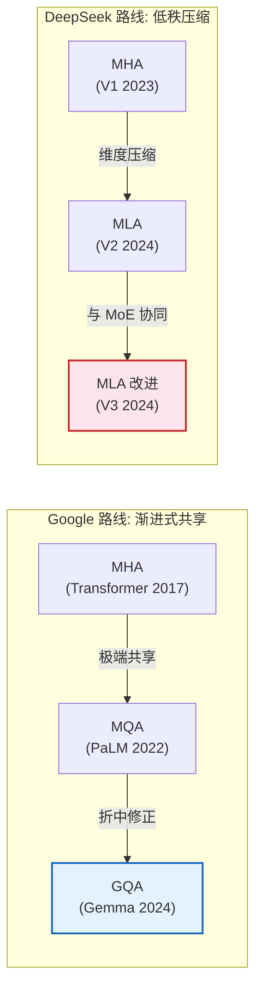
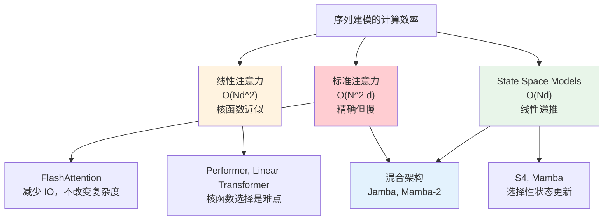

# 注意力机制进阶：工业实践与前沿研究

> 本文是 [模块5: 注意力机制进阶](./README.md) 的进阶补充，深入分析 Google、DeepSeek、Anthropic 三条技术线在注意力机制上的工业实践，以及注意力机制的前沿研究方向。

---

## 目录

- [1. Google 的注意力机制演进](#1-google-的注意力机制演进)
- [2. DeepSeek MLA 深度分析](#2-deepseek-mla-深度分析)
- [3. Anthropic 的注意力可解释性研究](#3-anthropic-的注意力可解释性研究)
- [4. FlashAttention：IO 感知的精确注意力](#4-flashattentionio-感知的精确注意力)
- [5. 前沿话题](#5-前沿话题)
- [6. Google 与 DeepSeek 的注意力创新对比](#6-google-与-deepseek-的注意力创新对比)
- [7. 注意力机制前沿研究补充](#7-注意力机制前沿研究补充)

---

## 1. Google 的注意力机制演进

### 1.1 MHA -> MQA -> GQA 的工程权衡

Google 在注意力机制上的演进路线清晰地展示了从理论最优到工程最优的权衡过程。

**阶段一：MHA（原始 Transformer, 2017）**

原始 Transformer 使用标准 MHA，每个头拥有完全独立的 Q/K/V 投影。在当时的模型规模下（约 65M 参数），KV Cache 不是瓶颈。

**阶段二：MQA（PaLM, 2022）**

当模型扩展到 540B 参数时，KV Cache 成为了推理的主要瓶颈。PaLM 采用了 MQA，将推理成本大幅降低。

PaLM 的关键决策：
- 540B 模型使用 MQA，所有 118 个 Q 头共享 1 组 KV
- KV Cache 减少为原来的 1/118
- 配合并行 Attention + FFN 结构进一步提升效率

然而，MQA 在某些精细任务上的质量损失引起了关注。Google 内部的实验表明，在代码生成和数学推理等需要精确注意力区分的任务上，MQA 的退化更为明显。

**阶段三：GQA（Gemma 2, 2024）**

GQA 最初由 Google Research 提出，随后被广泛采用。Gemma 2 在不同模型规模上灵活使用不同的分组策略：

| Gemma 2 变体 | 参数量 | Q 头数 | KV 组数 | 策略 |
|-------------|--------|--------|---------|------|
| 2B | 2B | 8 | 1 | 等效 MQA |
| 9B | 9B | 16 | 4 | GQA-4 |
| 27B | 27B | 32 | 4 | GQA-4 |

**关键洞察**：小模型由于头数本身不多，MQA/GQA 的质量损失可以容忍；大模型则倾向于使用更多的 KV 组以保持质量。

### 1.2 Gemma 2 的混合注意力策略

Gemma 2 不仅使用 GQA，还引入了**局部-全局交替注意力**（Alternating Local-Global Attention），如模块3进阶文档中所述。

这种设计与 GQA 的协同效应：
- 局部注意力层：窗口内的注意力计算，天然减少 KV Cache 的有效长度
- 全局注意力层：仍需完整 KV Cache，GQA 在此处的压缩效果最为显著
- 交替使用：在保持长距离依赖的同时，大幅降低整体的 KV Cache 开销

### 1.3 Google 对注意力效率的其他贡献

**Multi-Query Attention 的原始论文**：Shazeer (2019) 是 Google Brain 的研究员，MQA 论文虽然简短（仅 3 页），却对后续工业实践产生了深远影响。

**GQA 论文的方法论贡献**：Ainslie et al. (2023) 除了提出 GQA 本身，更重要的贡献是**从 MHA checkpoint 转换为 GQA 的方法论**，这让已经投入大量计算训练 MHA 模型的团队无需从零重新训练。

---

## 2. DeepSeek MLA 深度分析

### 2.1 MLA 的完整数学推导

以下给出比 README.md 更完整的 MLA 数学推导。

#### 2.1.1 从标准 MHA 出发

标准 MHA 中，第 $h$ 个头的 K 和 V 为：

$$k_h^{(t)} = W_K^{(h)} x_t \in \mathbb{R}^{d_h}, \quad v_h^{(t)} = W_V^{(h)} x_t \in \mathbb{R}^{d_h}$$

将所有头的 K/V 拼接：

$$\text{KV}^{(t)} = \begin{bmatrix} k_1^{(t)} \\ \vdots \\ k_H^{(t)} \\ v_1^{(t)} \\ \vdots \\ v_H^{(t)} \end{bmatrix} = \begin{bmatrix} W_K^{(1)} \\ \vdots \\ W_K^{(H)} \\ W_V^{(1)} \\ \vdots \\ W_V^{(H)} \end{bmatrix} x_t = W_{KV} x_t \in \mathbb{R}^{2 H d_h}$$

其中 $W_{KV} \in \mathbb{R}^{2Hd_h \times d}$。

#### 2.1.2 低秩假设

MLA 的核心假设是：$W_{KV}$ 是近似低秩的。即存在分解：

$$W_{KV} \approx W_U \cdot W_D$$

其中 $W_D \in \mathbb{R}^{d_c \times d}$（下投影/压缩），$W_U \in \mathbb{R}^{2Hd_h \times d_c}$（上投影/解压缩），$d_c \ll 2Hd_h$。

这意味着：

$$\text{KV}^{(t)} = W_U \cdot \underbrace{W_D \, x_t}_{c_{KV}^{(t)} \in \mathbb{R}^{d_c}}$$

推理时只需缓存 $c_{KV}^{(t)}$ 而非完整的 $\text{KV}^{(t)}$。

#### 2.1.3 理论支撑：Johnson-Lindenstrauss 引理

MLA 的有效性可以从 Johnson-Lindenstrauss (JL) 引理获得理论支撑：

**JL 引理**：对于 $n$ 个点在 $\mathbb{R}^D$ 中，存在线性映射 $f: \mathbb{R}^D \rightarrow \mathbb{R}^{d_c}$（$d_c = O(\log n / \epsilon^2)$），使得对任意两点 $u, v$：

$$(1-\epsilon)\|u-v\|^2 \leq \|f(u) - f(v)\|^2 \leq (1+\epsilon)\|u-v\|^2$$

这意味着：只要压缩维度 $d_c$ 足够大（对数级别），低维投影就能近似保持点之间的距离关系。对于注意力机制，这保证了注意力分数在压缩空间中的近似准确性。

#### 2.1.4 MLA 中的注意力分数展开

以内容部分为例，第 $h$ 个头对于位置 $m$（query）和位置 $n$（key）的注意力分数：

$$s_{m,n}^{(h)} = (q_h^{(m)})^T k_h^{(n)}$$

$$= (W_{UQ}^{(h)} c_Q^{(m)})^T (W_{UK}^{(h)} c_{KV}^{(n)})$$

$$= (c_Q^{(m)})^T \underbrace{(W_{UQ}^{(h)})^T W_{UK}^{(h)}}_{W_{QK}^{(h)} \in \mathbb{R}^{d_c' \times d_c}} c_{KV}^{(n)}$$

**矩阵吸收**：$W_{QK}^{(h)}$ 可以预计算并缓存，这样注意力分数直接在压缩空间中计算，无需显式恢复 K。

类似地，对 Value 的加权求和：

$$o_h^{(m)} = \sum_n \alpha_{m,n} \, v_h^{(n)} = \sum_n \alpha_{m,n} \, W_{UV}^{(h)} c_{KV}^{(n)} = W_{UV}^{(h)} \sum_n \alpha_{m,n} \, c_{KV}^{(n)}$$

先在压缩空间中做加权求和，再解压缩。

### 2.2 与 LoRA 的深层联系

MLA 和 LoRA 的联系不仅是表面的低秩分解相似，而是共享了一个更深层的原理：

**信息瓶颈理论视角**：

LoRA 假设微调时的权重更新 $\Delta W$ 是低秩的，即微调信息可以被压缩到一个低维空间。MLA 假设 KV 表示跨头的联合分布是低秩的，即不同头的 KV 之间存在大量可压缩的冗余。

**共同的数学形式**：

$$\text{LoRA}: \quad W' x = W x + B A x$$

$$\text{MLA}: \quad K = W_{UK} W_{DKV} x$$

两者都使用了 $W_{\text{up}} \cdot W_{\text{down}} \cdot x$ 的结构，其中瓶颈维度远小于输入和输出维度。

**关键区别**：
- LoRA 是在原始权重上的**增量**（$W + BA$），训练时固定 $W$
- MLA 是**替代**原始的 KV 投影，训练时所有参数都更新
- LoRA 的低秩维度通常很小（4-64），MLA 的压缩维度更大（512+）

### 2.3 DeepSeek-V2 的具体配置

DeepSeek-V2 (236B 参数) 的 MLA 具体配置：

| 参数 | 值 | 说明 |
|------|-----|------|
| $d_{model}$ | 5120 | 模型维度 |
| $n_h$ | 128 | 注意力头数 |
| $d_h$ | 128 | 每头维度 |
| $d_c$ | 512 | KV 压缩维度 |
| $d_c'$ | 1536 | Q 压缩维度 |
| $d_r$ | 64 | RoPE 维度 |
| $n_{layers}$ | 60 | 层数 |

**KV Cache 压缩效果**：

- 标准 MHA: $2 \times 128 \times 128 = 32{,}768$ 元素/层/token
- MLA: $512 + 64 = 576$ 元素/层/token
- **压缩比**: $\approx 57\times$

### 2.4 DeepSeek-V3 的 MLA 改进

DeepSeek-V3 在 MLA 基础上进一步优化：

1. **与 MoE 的协同**：MLA 的低秩结构与 MoE 的稀疏激活协同工作，使得模型在 671B 总参数下仅激活 37B 参数
2. **FP8 训练兼容**：MLA 的压缩-解压缩结构需要特别处理 FP8 精度的数值稳定性
3. **Multi-Token Prediction 辅助目标**：MLA 与 MTP 的结合提供了更丰富的训练信号

---

## 3. Anthropic 的注意力可解释性研究

### 3.1 注意力头的功能电路分析

Anthropic 的 Transformer Circuits 研究为理解注意力头提供了最系统的框架。

**QK 电路与 OV 电路的分离**

每个注意力头可以分解为两个独立的"电路"：

| 电路 | 矩阵 | 功能 | 类比 |
|------|------|------|------|
| QK 电路 | $W_Q^T W_K$ | 决定注意力分布（"看哪里"） | 搜索引擎的查询匹配 |
| OV 电路 | $W_O W_V$ | 决定信息传递（"看什么"） | 搜索结果的内容提取 |

这种分解是理解注意力头功能的基础。

**实际发现的功能类型**

Anthropic 在一系列论文（Elhage et al. 2021, Olsson et al. 2022）中系统地识别了多种功能性注意力头：

1. **Previous Token Head**：QK 电路学习 "关注位置 $i-1$"
2. **Induction Head**：QK 电路学习 "搜索与前一个 token 匹配的位置"，OV 电路学习 "复制下一个 token"
3. **Duplicate Token Head**：QK 电路学习 "搜索相同的 token"
4. **Inhibition Head**：负方向的 OV 电路，抑制某些 token 的概率

### 3.2 Induction Head 与 In-Context Learning 的关系

Anthropic 最重要的发现之一是 **Induction Head 是 Transformer 进行上下文学习的核心机制**。

**因果证据**：

1. Induction Head 的形成与训练中 in-context learning 能力的涌现精确对应
2. 消融（ablation）Induction Head 会导致 in-context learning 能力急剧下降
3. 较大的模型中 Induction Head 更早形成、功能更强

**与注意力变体的潜在关系**：

一个有趣但尚未被充分研究的问题是：**不同的注意力变体（MHA vs GQA vs MLA）如何影响 Induction Head 的形成和功能？**

- **MHA**：每个头完全独立，Induction Head 的形成最为自由
- **GQA**：组内共享 KV 可能限制 Induction Head 的精细匹配能力
- **MLA**：低秩压缩是否会保留足够的信息支持 Induction Head？

这些问题目前仍是开放的研究方向。

### 3.3 注意力模式与模型行为

Anthropic 的研究还揭示了注意力模式与高层模型行为之间的联系：

**注意力头的组合**

单个注意力头的功能通常很简单，但头之间的**组合**可以实现复杂的行为。例如：

```
[Previous Token Head (L1)] + [Induction Head (L3)]
= In-Context Learning 能力

[Duplicate Token Head (L2)] + [Inhibition Head (L5)]
= 避免重复生成的能力
```

**注意力模式的可视化分析方法**

Anthropic 使用以下方法分析注意力模式：

1. **注意力权重热图**：直接可视化 $\alpha_{ij}$ 矩阵
2. **注意力头的信息论分析**：计算注意力分布的熵 $H = -\sum_j \alpha_{ij} \log \alpha_{ij}$
3. **激活值干预（Activation Patching）**：修改特定头的输出，观察对最终预测的影响
4. **特征归因（Feature Attribution）**：使用梯度方法追溯输出对各头的依赖

### 3.4 对不同注意力变体可解释性的影响

**推测性分析**（标注：以下分析基于公开信息的合理推断，非 Anthropic 官方结论）：

不同的注意力变体可能对可解释性研究产生不同影响：

| 方面 | MHA | GQA | MLA |
|------|-----|-----|-----|
| 头的功能独立性 | 高 | 中 | 高（解压后独立） |
| QK 电路分析难度 | 低 | 中 | 高（需考虑压缩） |
| 注意力模式多样性 | 高 | 组内限制 | 高 |
| 可解释性工具兼容 | 好 | 好 | 需要适配 |

MLA 的压缩-解压缩结构为可解释性分析引入了新的复杂性：分析不能仅在原始空间或压缩空间中进行，而需要考虑两个空间之间的映射关系。

---

## 4. FlashAttention：IO 感知的精确注意力

### 4.1 内存层次与 IO 瓶颈

理解 FlashAttention 需要先理解 GPU 的内存层次：

```
SRAM (片上缓存)
  容量: ~20 MB (A100)
  带宽: ~19 TB/s
  延迟: ~1 ns

HBM (高带宽内存)
  容量: ~80 GB (A100)
  带宽: ~2 TB/s
  延迟: ~100 ns
```

**关键观察**：SRAM 的带宽是 HBM 的约 10 倍，但容量只有 HBM 的约 1/4000。

标准注意力的问题：

$$\underbrace{S = QK^T}_{n \times n \text{ 矩阵}} \rightarrow \underbrace{P = \text{softmax}(S)}_{写回 HBM} \rightarrow \underbrace{O = PV}_{读回 HBM}}$$

中间矩阵 $S$ 和 $P$ 都是 $n \times n$ 大小，必须写入 HBM（SRAM 放不下），导致大量的 HBM 读写。

### 4.2 FlashAttention 的核心思想

FlashAttention 通过**分块计算（Tiling）**避免存储完整的 $n \times n$ 注意力矩阵。

**算法框架**：

1. 将 Q, K, V 分成大小为 $B_r \times d$ 和 $B_c \times d$ 的小块
2. 在 SRAM 中计算局部注意力
3. 使用**在线 Softmax** 技巧逐块累积结果
4. 最终结果精确等于标准注意力（不是近似）

### 4.3 在线 Softmax

FlashAttention 的关键数学技巧是**在线 Softmax**，允许分块计算 Softmax 而不需要预先知道全局的最大值。

对于分块 $j = 1, 2, \ldots$，维护运行统计量：

$$m^{(j)} = \max(m^{(j-1)}, \max(S_{:,j}))$$

$$\ell^{(j)} = e^{m^{(j-1)} - m^{(j)}} \ell^{(j-1)} + \text{rowsum}(e^{S_{:,j} - m^{(j)}})$$

$$O^{(j)} = \text{diag}(e^{m^{(j-1)} - m^{(j)}}) O^{(j-1)} + e^{S_{:,j} - m^{(j)}} V_j$$

最终归一化：$O = \text{diag}(\ell^{(J)})^{-1} O^{(J)}$

这保证了数值稳定性（减去最大值防止溢出）和精确性（最终结果与标准 Softmax 完全一致）。

### 4.4 IO 复杂度分析

| 方法 | HBM 访问量 | 说明 |
|------|-----------|------|
| 标准 Attention | $\Theta(Nd + N^2)$ | 读写完整注意力矩阵 |
| FlashAttention | $\Theta(N^2 d^2 / M)$ | $M$ = SRAM 大小 |

当 $M = \Theta(Nd)$ 时（SRAM 足够放下一行 Q 和一列 K），FlashAttention 的 HBM 访问量为 $\Theta(N^2 d / M)$，显著低于标准方法。

实际加速效果：
- 训练：1.5x - 3x 加速
- 长序列（4K+）：更大的加速比
- 内存：从 $O(N^2)$ 降到 $O(N)$

### 4.5 FlashAttention 2 和 3

**FlashAttention-2** (2023) 的改进：
- 更好的工作分配：减少 GPU warp 之间的同步
- 优化的 SRAM 访问模式
- 对 GQA/MQA 的原生支持
- 速度提升约 2x（相比 FlashAttention-1）

**FlashAttention-3** (2024) 的改进：
- 针对 Hopper 架构（H100）的优化
- 利用 TMA（Tensor Memory Accelerator）和 warp-specialization
- FP8 注意力支持
- 在 H100 上接近理论峰值性能

---

## 5. 前沿话题

### 5.1 Ring Attention：超长序列的分布式注意力

**动机**：当序列长度超过单卡能处理的范围时，如何分布式地计算注意力？

**核心思想**：将序列分段分配到不同设备上，通过环形通信传递 KV 块。

```
设备 0: Q_0, K_0, V_0
设备 1: Q_1, K_1, V_1
设备 2: Q_2, K_2, V_2

轮次 1: 设备 i 用 Q_i 计算与 K_i, V_i 的注意力
轮次 2: K, V 沿环传递一步；设备 i 用 Q_i 计算与 K_{i-1}, V_{i-1} 的注意力
轮次 3: 继续传递...
```

**关键优势**：
- 计算和通信可以重叠（计算当前块时传递下一块）
- 内存占用与设备数成反比
- 理论上可以支持任意长度的序列

**工程挑战**：
- 因果掩码的处理需要特殊优化（某些块可以跳过）
- 通信带宽可能成为瓶颈
- 需要与 FlashAttention 配合使用

### 5.2 Differential Attention

**动机**：标准注意力中，注意力权重非负（经过 Softmax），这意味着每个位置总会"关注"所有位置（即使不相关的位置也有非零权重）。

**核心思想**（Ye et al., 2024）：使用两组注意力分数的**差值**作为最终注意力：

$$\text{DiffAttn}(X) = (\text{softmax}(Q_1 K_1^T / \sqrt{d}) - \lambda \cdot \text{softmax}(Q_2 K_2^T / \sqrt{d})) V$$

其中 $\lambda$ 是可学习的标量。

**直觉**：
- 第一个 Softmax 捕获"应该关注什么"
- 第二个 Softmax 捕获"背景噪声"
- 差值实现了对噪声的消除，注意力权重可以为负数

**优势**：
- 减少注意力噪声（不相关位置的权重趋近于零甚至负数）
- 在长序列和信息检索任务上表现更好
- 实现简单，计算开销适中（约增加 2x KV 头参数）

### 5.3 注意力的信息论分析

从信息论角度分析注意力机制，可以获得更深入的理解。

**注意力分布的熵**：

$$H(\alpha_i) = -\sum_j \alpha_{ij} \log \alpha_{ij}$$

- 低熵：注意力集中在少数位置 -> 精确检索
- 高熵：注意力均匀分布 -> 全局聚合

**不同层的注意力熵模式**：
- 浅层通常熵较低（关注局部模式）
- 深层通常熵较高或呈现双峰分布（既有精确检索也有全局聚合）

**信息瓶颈视角**：

KV Cache 的压缩可以用信息瓶颈原理理解：

$$\min I(c_{KV}; X) \quad \text{s.t.} \quad I(c_{KV}; Y) \geq I_0$$

即：找到一个压缩表示 $c_{KV}$，在保持与输出 $Y$ 的足够互信息的前提下，最小化与输入 $X$ 的互信息。MLA 的训练过程隐式地优化了这一目标。

### 5.4 线性注意力与注意力的未来

**线性注意力的核心思想**：

标准注意力的瓶颈是 Softmax，它要求先计算完整的 $N \times N$ 矩阵。线性注意力通过核函数近似移除 Softmax：

$$\text{Attn}(Q, K, V) = \frac{\phi(Q) (\phi(K)^T V)}{\phi(Q) (\phi(K)^T \mathbf{1})}$$

其中 $\phi$ 是特征映射函数。关键在于计算顺序的改变：先计算 $\phi(K)^T V$（$d \times d$ 矩阵），再乘以 $\phi(Q)$，避免了 $N \times N$ 矩阵。

**复杂度**：$O(Nd^2)$，对于 $d \ll N$ 的情况（长序列），这比标准注意力的 $O(N^2 d)$ 更高效。

**局限性**：
- 核函数近似引入误差，影响模型质量
- 在短-中等长度序列上不比 FlashAttention 快
- 目前尚未在大规模 LLM 中取得与标准注意力同等的质量

**发展趋势**：

注意力机制的未来可能朝以下方向发展：
1. **混合架构**：结合标准注意力和线性注意力（如 Mamba + Transformer）
2. **硬件-算法协同设计**：FlashAttention 3 展示了硬件感知算法的威力
3. **动态注意力**：根据输入自适应调整注意力策略
4. **更强的 KV 压缩**：MLA 的思路可能被进一步推广

### 5.5 稀疏注意力的最新进展

**Native Sparse Attention (NSA)**（DeepSeek，2025）：

DeepSeek 近期提出了一种硬件友好的稀疏注意力方案，结合了多种稀疏模式：

1. **Token-level 稀疏**：基于重要性评分选择关键 token
2. **Block-level 稀疏**：按块聚合注意力，减少计算量
3. **层级结构**：不同层使用不同的稀疏策略

这一方向与 MLA 的 KV 压缩思路互补：MLA 压缩每个 token 的 KV 表示大小，稀疏注意力则减少参与计算的 token 数量。

---

## 6. Google 与 DeepSeek 的注意力创新对比

### 6.1 两条截然不同的技术路线

Google 和 DeepSeek 在注意力机制优化上走了两条截然不同的路线，反映了不同的工程哲学：



| 对比维度 | Google (GQA) | DeepSeek (MLA) |
|----------|-------------|----------------|
| **核心思想** | 在头维度共享 KV | 在表示维度压缩 KV |
| **压缩位置** | 减少 KV 头数 | 降低 KV 表示维度 |
| **信息损失来源** | 组内头的多样性被抹平 | 低秩近似的重建误差 |
| **头的独立性** | 组内共享，组间独立 | 全部独立（解压后） |
| **可调节性** | 组数 $G$（离散选择） | 压缩维度 $d_c$（连续调节） |
| **与已有模型兼容** | 可从 MHA 转换 (uptraining) | 需从头训练 |
| **实现复杂度** | 简单（修改头映射） | 中等（压缩/解压缩投影） |
| **工业采用度** | 极广（Llama, Gemma, Mistral...） | DeepSeek 独有 |

### 6.2 Google 的多查询注意力演进细节

**PaLM (2022) 的 MQA 决策**：
- PaLM 540B 使用 MQA，所有 118 个 Q 头共享 1 组 KV
- 选择 MQA 的核心原因：540B 参数模型的推理成本极高，KV Cache 压缩的收益巨大
- 代价：在部分需要精细注意力区分的任务（如代码生成、数学推理）上观察到质量退化

**Gemma 2 (2024) 的差异化策略**：
- 2B 模型：使用 MQA（等效 $G=1$），因为小模型头数少，MQA 的质量损失可接受
- 9B/27B 模型：使用 GQA-4，在质量和效率之间取得平衡
- **关键洞察**：Google 根据模型规模动态选择注意力策略，而非一刀切

### 6.3 DeepSeek MLA 在 V3 中的进一步优化

DeepSeek-V3 相比 V2 在 MLA 上做了以下改进：

1. **与 MoE 的协同优化**：MLA 的低秩结构减少了注意力层的通信量，使得 Expert Parallelism 中的 All-to-All 通信成为主要瓶颈，进而针对性优化
2. **FP8 精度适配**：MLA 的压缩-解压缩投影链（$x \to c_{KV} \to K/V$）对数值精度敏感，V3 设计了针对性的缩放策略以保持 FP8 训练的稳定性
3. **Multi-Token Prediction 兼容**：V3 的 MTP 辅助目标需要同时预测多个未来 token，MLA 的压缩表示 $c_{KV}$ 需要同时服务于多个预测头

### 6.4 未来方向：自适应注意力模式

一个值得关注的研究方向是**不同层使用不同的注意力变体**：

- 浅层（靠近输入）：可能不需要太多独立注意力头，使用 GQA 或 MQA 即可
- 深层（靠近输出）：可能需要更精细的注意力区分，使用 MHA 或 MLA
- 这种混合策略已经在 Gemma 2 的局部/全局注意力交替中初现端倪

另一个方向是**动态压缩率**：根据输入内容的复杂度，自适应地调整 MLA 的压缩维度 $d_c$。简单内容（重复文本、模板化文本）使用更小的 $d_c$，复杂内容（推理链、代码）使用更大的 $d_c$。

---

## 7. 注意力机制前沿研究补充

### 7.1 Differential Attention (Diff Attention)

**Differential Attention** (Ye et al., 2024, Microsoft) 提出了一种消除注意力噪声的新方法。

**核心问题**：标准 Softmax 注意力的一个固有缺陷是注意力权重非负——即使某个位置与当前 query 完全不相关，它仍然会获得一个非零的注意力权重。在长序列中，这些"背景噪声"累积后会稀释有效信号。

**解决方案**：使用两组注意力分数的差值：

$$\text{DiffAttn}(X) = \left(\text{softmax}\left(\frac{Q_1 K_1^T}{\sqrt{d}}\right) - \lambda \cdot \text{softmax}\left(\frac{Q_2 K_2^T}{\sqrt{d}}\right)\right) V$$

其中 $\lambda$ 是可学习的标量参数，$Q_1, K_1$ 和 $Q_2, K_2$ 是两组独立的投影。

**数学直觉**：
- 第一个 Softmax 捕获"应该关注什么"（信号 + 噪声）
- 第二个 Softmax 捕获"背景注意力模式"（主要是噪声）
- 差值实现了噪声消除，使得最终注意力权重可以非常接近零（甚至为负）

**实验结果**：
- 在信息检索（Needle-in-a-Haystack）任务上，Diff Attention 的表现显著优于标准注意力
- 在长序列（32K+ token）上效果尤为明显，因为此时背景噪声更严重
- 额外计算开销：约增加 2x KV 头参数（需要两组 K），但可以通过将每组头维度减半来保持总参数量不变

**与 MLA/GQA 的关系**：Diff Attention 与 KV 压缩是正交的优化方向——前者解决注意力权重的噪声问题，后者解决 KV Cache 的大小问题，理论上可以组合使用。

### 7.2 Linear Attention 与 State Space Models (SSM)

**从注意力到线性递推**：

标准注意力的核心操作是 $\text{softmax}(QK^T)V$，复杂度为 $O(N^2 d)$。线性注意力和 SSM 都试图将这个操作变为 $O(N)$ 或 $O(Nd)$，但采用了不同的技术路径：



**Mamba 架构 (Gu & Dao, 2023)**：

Mamba 是当前最有影响力的非 Transformer 序列模型，其核心创新是**选择性 SSM**——让状态更新规则依赖于输入：

$$h_t = \bar{A}_t h_{t-1} + \bar{B}_t x_t$$
$$y_t = C_t h_t$$

其中 $\bar{A}_t, \bar{B}_t, C_t$ 都是输入依赖的（通过可学习的投影从 $x_t$ 计算）。

**Mamba vs Transformer 的优劣**：

| 维度 | Transformer (注意力) | Mamba (SSM) |
|------|---------------------|-------------|
| 训练复杂度 | $O(N^2 d)$ | $O(Nd)$ |
| 推理复杂度（每步） | $O(Nd)$（有 KV Cache） | $O(d^2)$（状态固定大小） |
| 长距离依赖 | 精确（直接访问所有位置） | 近似（通过状态传递） |
| 精确检索能力 | 强（Induction Head） | 弱（"Lost in the State"） |
| 推理时内存 | $O(N)$（KV Cache 线性增长） | $O(1)$（状态固定大小） |
| 并行训练 | 高效（矩阵乘法） | 高效（扫描算法） |

**当前局限**：Mamba 在需要精确信息检索的任务（如从长文档中找到特定事实）上仍不如 Transformer，这被称为"Recall 差距"。

### 7.3 混合架构：Jamba

**Jamba** (AI21, 2024) 是工业界第一个大规模部署的 Transformer-Mamba 混合架构：

**架构设计**：
- 交替堆叠 Transformer 层和 Mamba 层（比例约 1:7，即每 8 层中 1 层 Transformer + 7 层 Mamba）
- Transformer 层使用 GQA，负责精确检索
- Mamba 层负责高效的序列处理
- 结合 MoE 实现稀疏激活

**设计逻辑**：
- 大部分序列处理不需要精确的全局注意力，Mamba 足够
- 少量 Transformer 层提供"精确检索锚点"，防止信息丢失
- 这种混合策略使得 KV Cache 只需要为 Transformer 层维护，大幅减少推理内存

**性能表现**：
- 在标准 LLM benchmark 上接近同规模纯 Transformer 模型
- 长上下文（256K token）能力优于纯 Transformer（得益于 Mamba 层的高效长距离建模）
- 推理速度：在长序列上快约 5x（因为大部分层不需要 KV Cache）

**展望**：混合架构可能代表了注意力机制演进的一个重要方向——不再执着于单一的序列建模机制，而是根据任务需求组合不同的计算原语。

---

## 参考资料

### 论文

1. Shazeer (2019). *Fast Transformer Decoding: One Write-Head is All You Need.* Google. (MQA)
2. Ainslie et al. (2023). *GQA: Training Generalized Multi-Query Transformer Models from Multi-Head Checkpoints.* Google.
3. DeepSeek-AI (2024). *DeepSeek-V2: A Strong, Economical, and Efficient Mixture-of-Experts Language Model.*
4. DeepSeek-AI (2024). *DeepSeek-V3 Technical Report.*
5. Dao et al. (2022). *FlashAttention: Fast and Memory-Efficient Exact Attention with IO-Awareness.*
6. Dao (2023). *FlashAttention-2: Faster Attention with Better Parallelism and Work Partitioning.*
7. Shah et al. (2024). *FlashAttention-3: Fast and Accurate Attention with Asynchrony and Low-precision.*
8. Elhage et al. (2021). *A Mathematical Framework for Transformer Circuits.* Anthropic.
9. Olsson et al. (2022). *In-context Learning and Induction Heads.* Anthropic.
10. Liu et al. (2023). *Ring Attention with Blockwise Transformers for Near-Infinite Context.*
11. Ye et al. (2024). *Differential Transformer.*
12. Johnson & Lindenstrauss (1984). *Extensions of Lipschitz Mappings into a Hilbert Space.*
13. Chowdhery et al. (2022). *PaLM: Scaling Language Modeling with Pathways.* Google.
14. Katharopoulos et al. (2020). *Transformers are RNNs: Fast Autoregressive Transformers with Linear Attention.*
15. Gu & Dao (2023). *Mamba: Linear-Time Sequence Modeling with Selective State Spaces.*
16. Lieber et al. (2024). *Jamba: A Hybrid Transformer-Mamba Language Model.* AI21 Labs.
17. DeepSeek-AI (2025). *Native Sparse Attention: Hardware-Aligned and Natively Trainable Sparse Attention.*

### 博客

1. [Transformer Circuits Thread](https://transformer-circuits.pub/) - Anthropic
2. [FlashAttention GitHub](https://github.com/Dao-AILab/flash-attention) - Tri Dao
3. [DeepSeek-V2 技术解读](https://arxiv.org/abs/2405.04434) - DeepSeek-AI
