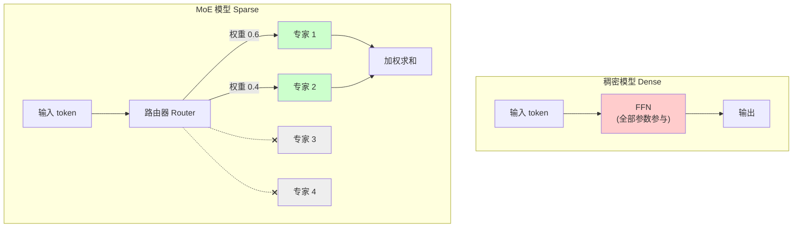
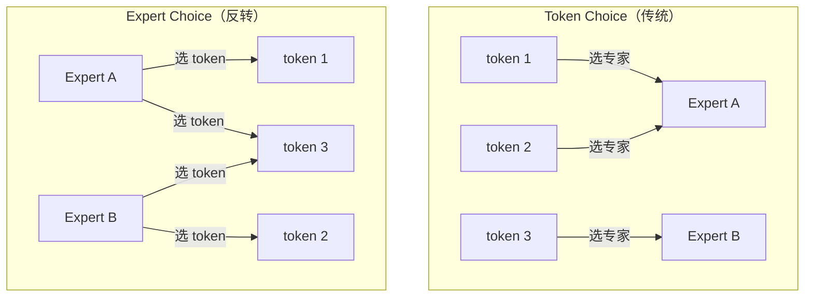
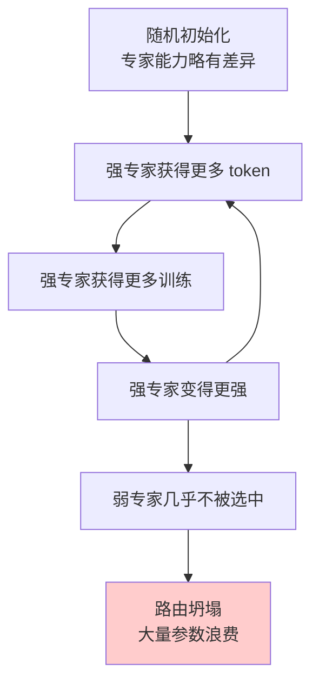
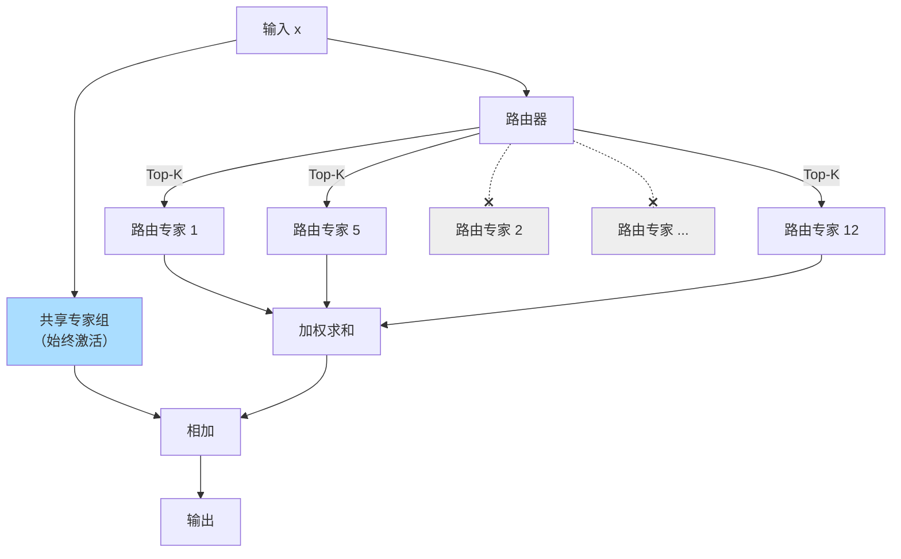
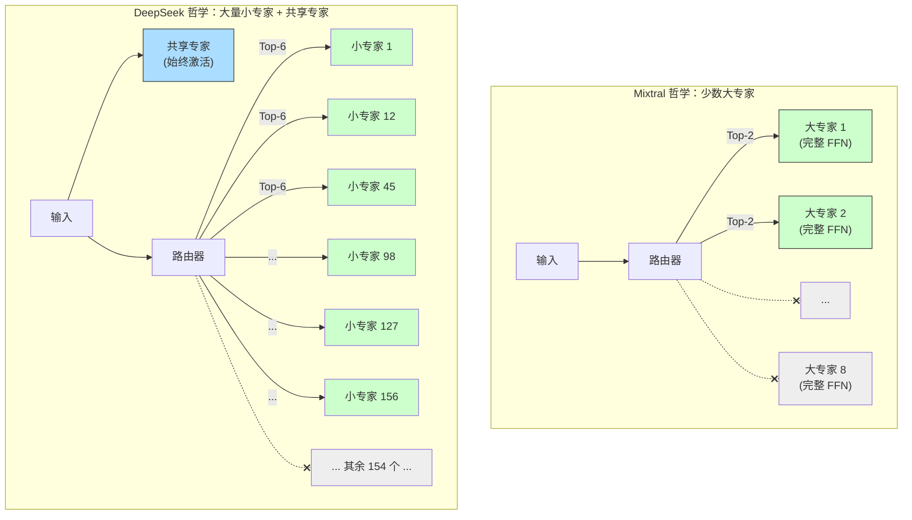
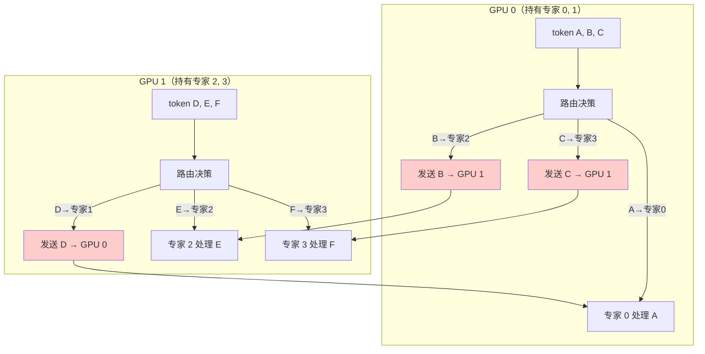
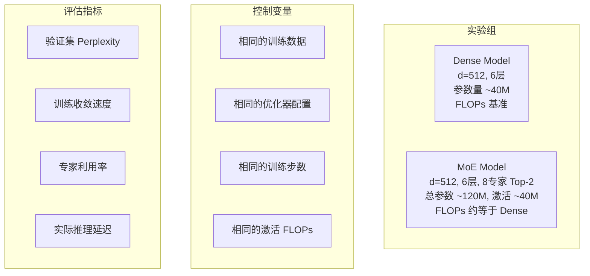
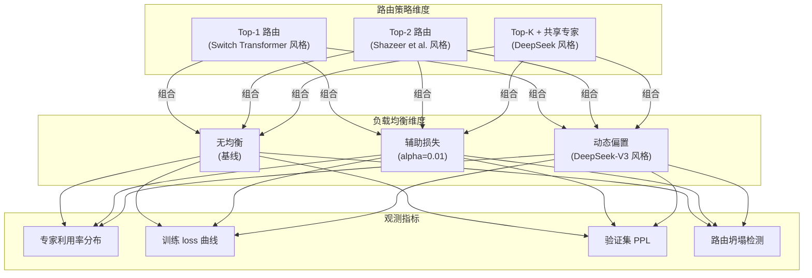

# 模块6：MoE -- 混合专家模型

> 混合专家模型（Mixture of Experts, MoE）是突破稠密模型计算瓶颈的关键架构创新。本章将深入 MoE 的路由机制、负载均衡、DeepSeekMoE 架构，并从数学角度分析 MoE 的参数效率优势。

---

## 章节定位


**核心动机**：在模块 3/4 中，我们了解到 Transformer 的 FFN 层占据了模型参数量的约 2/3。随着模型规模增大，FFN 的计算量线性增长，这意味着**参数量和计算量被紧密耦合**。MoE 的核心创新在于**解耦模型参数量和每次推理的计算量**——通过稀疏激活，让模型拥有远超实际使用量的参数，在不增加推理成本的情况下提升模型容量。

**前置知识**：
- **FFN 层的设计**（模块 3/4）：标准 FFN 的结构 $\text{FFN}(x) = W_2 \cdot \sigma(W_1 x)$，SwiGLU 变体，以及 FFN 在 Transformer Block 中的角色
- **注意力机制变体**（模块 5）：MLA 与 MoE 的协同优化是 DeepSeek-V2/V3 的核心设计
- **基础数学**：Softmax 函数、Top-K 选择、加权求和

---

## 目录

- [1. MoE 的核心思想](#1-moe-的核心思想)
- [2. 路由机制](#2-路由机制)
- [3. 辅助损失与负载均衡](#3-辅助损失与负载均衡)
- [4. DeepSeekMoE 架构](#4-deepseekMoE-架构)
- [5. 训练挑战](#5-训练挑战)
- [6. 参数与计算效率分析](#6-参数与计算效率分析)
- [7. Google 的 MoE 实践](#7-google-的-moe-实践)
- [8. DeepSeek 的 MoE 创新](#8-deepseek-的-moe-创新)
  - [8.3 DeepSeek-V2 的 MoE 设计详解](#83-deepseek-v2-的-moe-设计详解)
  - [8.4 DeepSeek-V3 的进一步优化](#84-deepseek-v3-的进一步优化)
  - [8.5 Mixtral vs DeepSeek MoE 的设计哲学对比](#85-mixtral-vs-deepseek-moe-的设计哲学对比)
  - [8.6 MoE 训练的工程挑战与解决方案](#86-moe-训练的工程挑战与解决方案)
- [9. Anthropic 视角：MoE 的可解释性与安全性](#9-anthropic-视角moe-的可解释性与安全性)
- [10. 项目实践](#10-项目实践)

---

## 1. MoE 的核心思想

### 1.1 动机：突破稠密模型的计算瓶颈

在稠密模型（Dense Model）中，**每个输入 token 都激活模型的全部参数**。这意味着模型参数量与每次前向传播的计算量（FLOPs）成正比。当我们需要更强大的模型时，参数量的增长直接带来等比例的推理成本上升。

**MoE 的核心洞察**：不是每个 token 都需要所有参数来处理。不同的 token 可能只需要模型中**特定的子集**参与计算。

这就是**稀疏激活**（Sparse Activation）的思想：



### 1.2 条件计算的数学框架

MoE 的数学本质是**条件计算**（Conditional Computation）。给定输入 $x$，MoE 层的输出为：

$$\text{MoE}(x) = \sum_{i=1}^{N} g_i(x) \cdot E_i(x)$$

其中：
- $N$ 是专家总数
- $E_i(x)$ 是第 $i$ 个专家的输出（通常是一个 FFN）
- $g_i(x)$ 是路由函数为第 $i$ 个专家分配的权重

**稀疏性约束**：在实际计算中，$g_i(x)$ 对大多数专家为 0，只有 Top-K 个专家被激活：

$$g_i(x) = \begin{cases} \text{softmax}(W_g x)_i & \text{if } i \in \text{TopK}(W_g x) \\ 0 & \text{otherwise} \end{cases}$$

这意味着虽然模型有 $N$ 个专家的参数，但每次前向传播只使用其中 $K$ 个。

### 1.3 MoE 的历史脉络

MoE 的思想并非全新，其发展经历了三个阶段：


**阶段 1：经典 MoE（1991）**

Jacobs 等人提出了最早的 MoE 框架，每个专家是一个小型神经网络，门控网络（Gating Network）决定如何组合专家输出。当时的 MoE 是全激活的——所有专家都参与计算，只是权重不同。

**阶段 2：稀疏 MoE（2017）**

Shazeer 等人将 MoE 引入 Transformer 架构，提出了 **Sparsely-Gated MoE**。关键创新是 **Top-K 路由**——每个 token 只激活 K 个专家，实现了真正的条件计算。这篇论文标题"Outrageously Large Neural Networks"预示了 MoE 将模型规模推向新高度的潜力。

**阶段 3：现代 MoE（2022-至今）**

Switch Transformer 将路由简化为 Top-1，Google 的 GShard 解决了分布式 MoE 的工程问题，DeepSeekMoE 提出了细粒度专家和共享专家的创新设计。

---

## 2. 路由机制

路由机制是 MoE 架构的核心——它决定了"哪个 token 由哪个专家处理"。

### 2.1 Top-K 路由

**Top-K 路由**是最广泛使用的路由策略。

**Step 1：计算路由 logits**

给定输入 $x \in \mathbb{R}^d$，路由器是一个线性层：

$$h(x) = W_g x \in \mathbb{R}^N$$

其中 $W_g \in \mathbb{R}^{N \times d}$ 是路由器的权重矩阵，$N$ 是专家数量。

**Step 2：选择 Top-K 专家**

选出 logit 值最大的 $K$ 个专家，将其余专家的 logit 设为 $-\infty$：

$$\text{TopK}(h(x), K) = \{i : h_i(x) \text{ 在前 K 大的值中}\}$$

**Step 3：归一化权重**

对选中的 $K$ 个专家的 logit 进行 softmax 归一化，得到路由权重：

$$g_i(x) = \frac{\exp(h_i(x))}{\sum_{j \in \text{TopK}} \exp(h_j(x))}, \quad i \in \text{TopK}$$

**Step 4：加权求和**

$$\text{MoE}(x) = \sum_{i \in \text{TopK}} g_i(x) \cdot E_i(x)$$


**Top-1 vs Top-2 的权衡**：

| 方面 | Top-1 | Top-2 |
|------|-------|-------|
| 计算效率 | 更高（只激活 1 个专家） | 较低（激活 2 个专家） |
| 模型质量 | 稍低 | 更好（多专家组合） |
| 负载均衡 | 更难（单专家倾向性更强） | 较易（两个专家分摊负载） |
| 代表模型 | Switch Transformer | Shazeer et al. 2017 |

### 2.2 Expert Choice 路由

**Expert Choice**（Google, 2022）提出了一种反转的路由视角：不是 token 选择专家，而是**专家选择 token**。

**传统 Token Choice**：每个 token 选择 Top-K 个专家
- 问题：某些"热门"专家可能被大量 token 选中，导致负载不均

**Expert Choice**：每个专家从所有 token 中选择 Top-K 个来处理
- 每个专家处理固定数量的 token
- 天然实现负载均衡
- 不需要辅助损失

数学形式：

$$S = \text{softmax}(X W_g^T) \in \mathbb{R}^{T \times N}$$

其中 $T$ 是 token 数量。Expert Choice 对 $S$ 的**列**取 Top-K（每个专家选择分数最高的 K 个 token），而传统路由对**行**取 Top-K。



**Expert Choice 的优势**：
1. **完美负载均衡**：每个专家处理相同数量的 token
2. **无需辅助损失**：不再需要额外的损失项来强制均衡
3. **灵活的 token 处理**：某些 token 可能被多个专家选中（获得更多计算资源），某些可能不被选中

**Expert Choice 的劣势**：
1. **自回归不兼容**：需要看到全序列才能做 Expert Choice，不适合 token-by-token 的自回归生成
2. **token dropping**：某些 token 可能完全不被任何专家选中

### 2.3 路由器实现

```python
import torch
import torch.nn as nn
import torch.nn.functional as F


class TopKRouter(nn.Module):
    """
    Top-K 路由器

    为每个 token 选择 K 个专家，返回路由权重和专家索引。

    Args:
        d_model: 模型维度
        num_experts: 专家数量
        top_k: 每个 token 激活的专家数
    """

    def __init__(self, d_model: int, num_experts: int, top_k: int = 2):
        super().__init__()
        self.num_experts = num_experts
        self.top_k = top_k
        # 路由器线性层
        self.gate = nn.Linear(d_model, num_experts, bias=False)

    def forward(self, x: torch.Tensor):
        """
        Args:
            x: [batch, seq_len, d_model]

        Returns:
            weights: [batch, seq_len, top_k] 归一化路由权重
            indices: [batch, seq_len, top_k] 选中的专家索引
        """
        # 计算路由 logits: [batch, seq_len, num_experts]
        logits = self.gate(x)

        # 选择 Top-K 个专家
        top_k_logits, top_k_indices = torch.topk(logits, self.top_k, dim=-1)

        # Softmax 归一化（只在选中的 K 个专家上）
        weights = F.softmax(top_k_logits, dim=-1)

        return weights, top_k_indices, logits
```

---

## 3. 辅助损失与负载均衡

### 3.1 负载不均衡问题：赢者通吃

在没有任何约束的情况下，MoE 训练往往会陷入**路由坍塌**（Router Collapse）：

**现象**：大部分 token 被路由到少数几个专家，其余专家几乎不被使用。

**原因分析**：

假设训练初期，专家 $E_1$ 由于随机初始化，对某些 token 的处理效果稍好。此时：
1. 路由器给 $E_1$ 更高的权重
2. $E_1$ 获得更多的训练数据（被更多 token 选中）
3. $E_1$ 变得更强，进一步吸引更多 token
4. 其他专家因为训练不足而越来越弱

这是一个**正反馈循环**，最终导致只有极少数专家被使用，MoE 退化为一个小型稠密模型。



### 3.2 辅助损失推导

为了解决负载不均衡问题，Shazeer et al.（2017）提出了**辅助损失**（Auxiliary Loss），也称为**负载均衡损失**（Load Balancing Loss）。

**目标**：鼓励每个专家被大致等量的 token 选择。

**定义**：

给定一个 batch 中的 $T$ 个 token，定义两个量：

**专家被选择的频率**（实际负载）：

$$f_i = \frac{1}{T} \sum_{t=1}^{T} \mathbb{1}[i \in \text{TopK}(x_t)]$$

$f_i$ 表示第 $i$ 个专家在当前 batch 中被选为 Top-K 的 token 比例。

**专家的平均路由概率**（路由倾向）：

$$P_i = \frac{1}{T} \sum_{t=1}^{T} p_i(x_t)$$

其中 $p_i(x_t) = \text{softmax}(W_g x_t)_i$ 是 softmax 归一化后第 $i$ 个专家的概率。

**辅助损失定义**：

$$L_{\text{aux}} = \alpha \cdot N \cdot \sum_{i=1}^{N} f_i \cdot P_i$$

其中 $\alpha$ 是辅助损失系数（通常取 0.01），$N$ 是专家总数。

### 3.3 辅助损失的数学直觉

**为什么是 $f_i \cdot P_i$ 而不是其他形式？**

考虑理想的均匀分布情况：当所有专家被等概率选择时，$f_i = K/N$，$P_i = 1/N$，此时：

$$L_{\text{aux}} = \alpha \cdot N \cdot \sum_{i=1}^{N} \frac{K}{N} \cdot \frac{1}{N} = \alpha \cdot K / N$$

这是一个常数下界。

**不均衡时的行为**：

假设有 2 个专家（$N=2$, $K=1$），如果 90% 的 token 选择专家 1：
- $f_1 = 0.9, f_2 = 0.1$
- $P_1 \approx 0.9, P_2 \approx 0.1$
- $L_{\text{aux}} \propto 0.9 \times 0.9 + 0.1 \times 0.1 = 0.82$

如果均匀分布：
- $f_1 = f_2 = 0.5$
- $P_1 = P_2 = 0.5$
- $L_{\text{aux}} \propto 0.5 \times 0.5 + 0.5 \times 0.5 = 0.50$

损失在均匀分布时最小，验证了 $f_i \cdot P_i$ 的设计合理性。

**严格证明**：通过 Cauchy-Schwarz 不等式，可以证明：

$$\sum_{i=1}^{N} f_i \cdot P_i \geq \frac{(\sum_{i=1}^{N} \sqrt{f_i P_i})^2}{N}$$

当且仅当 $f_i \propto P_i$ 且 $f_i$ 均匀时取等号。

### 3.4 梯度的可微性

注意到 $f_i$ 中包含指示函数 $\mathbb{1}[\cdot]$，这不可微。而 $P_i$ 是 softmax 的输出，可微。

辅助损失的梯度主要通过 $P_i$ 项传递。当某个专家 $i$ 的 $f_i$ 偏高时，$L_{\text{aux}}$ 通过降低 $P_i$（即路由概率）来抑制更多 token 被路由到该专家。

### 3.5 Router z-loss

PaLM 引入了额外的 **Router z-loss**，防止路由 logits 的绝对值过大：

$$L_z = \frac{1}{T} \sum_{t=1}^{T} \left(\log \sum_{i=1}^{N} \exp(h_i(x_t))\right)^2$$

其中 $h_i(x_t)$ 是路由 logits。这个损失惩罚 log-partition-function 的平方，从而防止 logits 的数值不稳定。

```python
class AuxiliaryLoss(nn.Module):
    """
    MoE 辅助损失：负载均衡 + Router z-loss

    L_aux = alpha * N * sum(f_i * P_i)
    L_z = beta * mean(log(sum(exp(logits)))^2)
    """

    def __init__(self, num_experts: int, alpha: float = 0.01, beta: float = 0.001):
        super().__init__()
        self.num_experts = num_experts
        self.alpha = alpha    # 负载均衡系数
        self.beta = beta      # z-loss 系数

    def forward(self, logits: torch.Tensor, top_k_indices: torch.Tensor):
        """
        Args:
            logits: [batch, seq_len, num_experts] 路由 logits
            top_k_indices: [batch, seq_len, top_k] 选中的专家索引

        Returns:
            loss: 辅助损失标量
        """
        # 展平 batch 和 seq_len 维度
        flat_logits = logits.view(-1, self.num_experts)     # [T, N]
        flat_indices = top_k_indices.view(-1, top_k_indices.shape[-1])  # [T, K]
        T = flat_logits.shape[0]

        # 计算 f_i: 每个专家被选中的频率
        one_hot = F.one_hot(flat_indices, self.num_experts).float()  # [T, K, N]
        f = one_hot.sum(dim=1).mean(dim=0)  # [N]

        # 计算 P_i: 平均路由概率
        P = F.softmax(flat_logits, dim=-1).mean(dim=0)  # [N]

        # 负载均衡损失
        load_balance_loss = self.alpha * self.num_experts * (f * P).sum()

        # Router z-loss
        log_z = torch.logsumexp(flat_logits, dim=-1)  # [T]
        z_loss = self.beta * (log_z ** 2).mean()

        return load_balance_loss + z_loss
```

---

## 4. DeepSeekMoE 架构

DeepSeekMoE（DeepSeek-AI, 2024）提出了两个关键创新：**细粒度专家**（Fine-grained Experts）和**共享专家**（Shared Experts）。

### 4.1 细粒度专家

**传统 MoE 的问题**：

在 Switch Transformer 中，通常有 8-16 个较大的专家（每个专家是一个完整的 FFN）。这导致：
- 每个专家的容量很大，知识混杂
- 路由的粒度较粗，不同类型的知识难以精确分离

**DeepSeekMoE 的解决方案**：

将每个大专家拆分为多个小专家。例如，将 8 个标准 FFN 拆分为 64 个小 FFN（每个 FFN 的隐藏维度为原来的 1/8），同时将 Top-K 相应增加（如从 Top-2 增加到 Top-6）。

**参数量不变**：

$$\underbrace{N_{\text{original}} \times d_{\text{ff}}}_{\text{原始}} = \underbrace{N_{\text{fine}} \times d_{\text{ff,fine}}}_{\text{细粒度}}$$

例如：$8 \times 4d = 64 \times (4d/8) = 64 \times d/2$

**激活参数量不变**：

$$\underbrace{K_{\text{original}} \times d_{\text{ff}}}_{\text{原始激活}} = \underbrace{K_{\text{fine}} \times d_{\text{ff,fine}}}_{\text{细粒度激活}}$$

例如：$2 \times 4d = 6 \times (4d / (6/2 \times 8/6)) \approx 6 \times d/2 \times (4/3)$（根据具体配比调整）

**直觉理解**：

想象一个公司需要处理各种任务。传统 MoE 是雇用 8 个"全能型"员工，每次派 2 人处理任务。DeepSeekMoE 是雇用 64 个"专才"，每次根据任务类型精确派出 6 个最合适的专才。虽然投入的总人力相当，但专才组合更灵活、更精确。

### 4.2 共享专家

**问题**：有些知识是所有 token 都需要的通用知识（如语法规则、常见搭配），如果这些知识由路由专家来处理，多个专家可能会冗余地学习相同的内容。

**解决方案**：引入 $N_s$ 个**共享专家**（Shared Experts），它们**不参与路由**，始终被激活。

$$\text{DeepSeekMoE}(x) = \underbrace{\sum_{i=1}^{N_s} E_{shared,i}(x)}_{\text{共享专家（始终激活）}} + \underbrace{\sum_{j \in \text{TopK}(g(x))} g_j(x) \cdot E_{routed,j}(x)}_{\text{路由专家（稀疏激活）}}$$



### 4.3 DeepSeekMoE 的完整前向传播

结合细粒度专家和共享专家，DeepSeekMoE 的完整前向传播为：

**Step 1：共享专家计算**

$$h_{\text{shared}} = \sum_{i=1}^{N_s} \text{FFN}_{s,i}(x)$$

**Step 2：路由计算**

$$g(x) = \text{softmax}(\text{TopK}(W_g x, K_r))$$

**Step 3：路由专家计算**

$$h_{\text{routed}} = \sum_{j \in \text{TopK}} g_j(x) \cdot \text{FFN}_{r,j}(x)$$

**Step 4：组合输出**

$$\text{MoE}(x) = h_{\text{shared}} + h_{\text{routed}}$$

### 4.4 DeepSeek-V2/V3 的具体配置

| 配置项 | DeepSeek-V2 | DeepSeek-V3 |
|--------|-------------|-------------|
| 路由专家数 $N_r$ | 160 | 256 |
| 共享专家数 $N_s$ | 2 | 1 |
| 每 token 激活路由专家数 $K_r$ | 6 | 8 |
| 总参数量 | 236B | 671B |
| 激活参数量 | 21B | 37B |
| 激活比例 | ~8.9% | ~5.5% |

**极低的激活比例**意味着 DeepSeek-V3 拥有 671B 参数但每次推理只使用 37B，计算成本远低于同等参数量的稠密模型。

### 4.5 实现

```python
class DeepSeekMoELayer(nn.Module):
    """
    DeepSeekMoE 层：细粒度路由专家 + 共享专家

    特点：
    1. 大量细粒度路由专家（如 64 个小 FFN）
    2. 少量共享专家（如 2 个，始终激活）
    3. Top-K 路由选择路由专家
    """

    def __init__(
        self,
        d_model: int,
        num_routed_experts: int = 64,
        num_shared_experts: int = 2,
        top_k: int = 6,
        expert_hidden_dim: int = None,
    ):
        super().__init__()
        self.num_routed = num_routed_experts
        self.num_shared = num_shared_experts
        self.top_k = top_k

        # 细粒度路由专家的隐藏维度
        expert_hidden = expert_hidden_dim or (4 * d_model // num_routed_experts * 2)

        # 路由器
        self.router = TopKRouter(d_model, num_routed_experts, top_k)

        # 路由专家
        self.routed_experts = nn.ModuleList([
            nn.Sequential(
                nn.Linear(d_model, expert_hidden, bias=False),
                nn.SiLU(),
                nn.Linear(expert_hidden, d_model, bias=False),
            )
            for _ in range(num_routed_experts)
        ])

        # 共享专家
        shared_hidden = 4 * d_model // num_shared_experts
        self.shared_experts = nn.ModuleList([
            nn.Sequential(
                nn.Linear(d_model, shared_hidden, bias=False),
                nn.SiLU(),
                nn.Linear(shared_hidden, d_model, bias=False),
            )
            for _ in range(num_shared_experts)
        ])

    def forward(self, x: torch.Tensor):
        """
        Args:
            x: [batch, seq_len, d_model]

        Returns:
            output: [batch, seq_len, d_model]
            aux_data: (logits, indices) 用于计算辅助损失
        """
        batch, seq_len, d_model = x.shape

        # 共享专家输出（始终激活）
        shared_out = sum(expert(x) for expert in self.shared_experts)

        # 路由决策
        weights, indices, logits = self.router(x)

        # 路由专家输出
        flat_x = x.view(-1, d_model)  # [T, d_model]
        flat_weights = weights.view(-1, self.top_k)  # [T, K]
        flat_indices = indices.view(-1, self.top_k)  # [T, K]
        T = flat_x.shape[0]

        routed_out = torch.zeros_like(flat_x)  # [T, d_model]

        for k in range(self.top_k):
            expert_idx = flat_indices[:, k]  # [T]
            w = flat_weights[:, k].unsqueeze(-1)  # [T, 1]

            for i in range(self.num_routed):
                mask = (expert_idx == i)
                if mask.any():
                    expert_input = flat_x[mask]
                    expert_output = self.routed_experts[i](expert_input)
                    routed_out[mask] += w[mask] * expert_output

        routed_out = routed_out.view(batch, seq_len, d_model)

        return shared_out + routed_out, (logits, indices)
```

---

## 5. 训练挑战

### 5.1 路由坍塌

路由坍塌（Router Collapse）是 MoE 训练中最常见的问题，在第 3.1 节已经分析了其成因。解决方案包括：

1. **辅助损失**（第 3.2 节）：通过额外的损失项惩罚负载不均
2. **噪声注入**：在路由 logits 中加入噪声
3. **专家容量限制**（Capacity Factor）：硬性限制每个专家处理的 token 数量

**噪声注入**（Shazeer et al., 2017）：

$$h(x) = W_g x + \epsilon, \quad \epsilon \sim \mathcal{N}(0, \sigma^2)$$

在训练时向路由 logits 注入高斯噪声，增加随机性，防止路由器过早收敛到不均匀的分配方案。

### 5.2 专家利用率不均

即使使用了辅助损失，不同专家的利用率仍可能不均。衡量专家利用率的关键指标：

**专家利用率**（Expert Utilization）：

$$U_i = \frac{\text{第 } i \text{ 个专家实际处理的 token 数}}{\text{理想均匀负载下应处理的 token 数}} = \frac{f_i}{K/N}$$

理想情况下 $U_i \approx 1$ 对所有专家成立。

**负载均衡系数**（Coefficient of Variation）：

$$\text{CV} = \frac{\sigma(U)}{\mu(U)}$$

$\text{CV} = 0$ 表示完美均衡，值越大越不均衡。

### 5.3 训练不稳定性

MoE 模型的训练通常比稠密模型更不稳定，原因包括：

1. **路由的离散性**：Top-K 选择引入了不连续性
2. **专家梯度的稀疏性**：每次只有被选中的专家接收梯度
3. **路由器与专家的耦合**：路由器的更新影响专家的训练数据分布

**缓解策略**：
- 使用较小的学习率
- 较长的 warmup 阶段
- Router z-loss 稳定 logits 的数值范围
- BF16 混合精度而非 FP16（更大的数值范围）

### 5.4 Token Dropping

当某个专家被过多 token 选中时，超出容量的 token 会被丢弃（Token Dropping）。

**容量因子**（Capacity Factor, CF）：

$$\text{Buffer Size}_i = \text{CF} \times \frac{T \times K}{N}$$

其中 $T$ 是 batch 中的 token 总数。CF 通常设为 1.0-1.5。

- CF = 1.0：完美均匀分布下刚好够用
- CF > 1.0：留出缓冲，减少 token dropping
- CF 过大：浪费计算和内存

被丢弃的 token 通常通过**残差连接**直接传递到下一层，不经过 MoE 处理。

---

## 6. 参数与计算效率分析

### 6.1 总参数量 vs 激活参数量

MoE 模型的一个核心优势是**总参数量远大于每次推理的激活参数量**。

**稠密模型（单个 FFN 层）的参数量**：

$$P_{\text{dense}} = 2 \times d \times d_{\text{ff}} = 2 \times d \times 4d = 8d^2$$

（其中 $d_{\text{ff}} = 4d$ 是标准配置，factor 2 来自上投影和下投影两个矩阵）

**MoE 层的总参数量**：

$$P_{\text{MoE}} = N \times P_{\text{expert}} + P_{\text{router}}$$

$$= N \times 2 \times d \times d_{\text{ff,expert}} + N \times d$$

**MoE 层的激活参数量**：

$$P_{\text{active}} = K \times P_{\text{expert}} + P_{\text{shared}} + P_{\text{router}}$$

**参数效率比**：

$$\text{效率比} = \frac{P_{\text{total}}}{P_{\text{active}}} = \frac{N}{K}$$

以 DeepSeek-V3 为例：$N = 256, K = 8$，效率比为 32。即模型拥有 32 倍于实际使用的参数量。

### 6.2 FLOPs 对比

**稠密模型 FFN 的 FLOPs**（每 token）：

$$\text{FLOPs}_{\text{dense}} = 2 \times 2 \times d \times d_{\text{ff}} = 4 \times d \times 4d = 16d^2$$

（factor 2 来自乘法和加法，另一个 factor 2 来自两个线性层）

**MoE 层的 FLOPs**（每 token，Top-K 激活）：

$$\text{FLOPs}_{\text{MoE}} = K \times 2 \times 2 \times d \times d_{\text{ff,expert}} + \text{FLOPs}_{\text{router}}$$

若保持激活参数量相同（$K \times d_{\text{ff,expert}} = d_{\text{ff,dense}}$）：

$$\text{FLOPs}_{\text{MoE}} \approx \text{FLOPs}_{\text{dense}} + \underbrace{N \times d}_{\text{路由开销}}$$

路由器的 FLOPs 通常远小于专家的 FLOPs，因此 **MoE 模型在相同激活参数量下，FLOPs 与稠密模型接近，但总参数量大得多**。

### 6.3 MoE 的 Scaling Laws

实验表明，MoE 模型遵循不同于稠密模型的 Scaling Laws：

$$L(C, N_{\text{total}}, N_{\text{active}}) = f(C, N_{\text{active}}) + g(N_{\text{total}})$$

其中：
- $C$ 是总计算量
- $N_{\text{active}}$ 是激活参数量，主要决定每 token 的计算量
- $N_{\text{total}}$ 是总参数量，提供额外的模型容量
- $g(N_{\text{total}})$ 随着总参数量增加而降低，但边际收益递减

**关键结论**：在固定计算预算下，MoE 通过增加总参数量（而非激活参数量）来获得额外的性能提升。这意味着 MoE 可以在不增加推理成本的情况下提升模型质量。

| 模型类型 | 总参数 | 激活参数 | 推理 FLOPs | 质量 |
|----------|--------|----------|-----------|------|
| Dense 7B | 7B | 7B | 基准 | 基准 |
| MoE 47B (Top-2/8) | 47B | ~12B | ~1.7x | 好于 Dense 7B |
| Dense 13B | 13B | 13B | 1.86x | 约等于 MoE 47B |

MoE 47B 在推理成本仅为 Dense 13B 的约 91% 的情况下，达到了相当的质量。

---

## 7. Google 的 MoE 实践

### 7.1 Switch Transformer

Switch Transformer（Fedus et al., 2022）是 Google 在 MoE 领域的重要工作，核心创新是将路由简化为 **Top-1**：

**设计哲学**：简化路由 → 降低通信开销 → 更容易扩展。

$$\text{Switch}(x) = g_j(x) \cdot E_j(x), \quad j = \arg\max_i (W_g x)_i$$

与 Top-2 相比，Top-1 的优势：
- 计算量减半（只激活 1 个专家）
- All-to-All 通信量减半
- 实现更简单

Switch Transformer 成功将模型扩展到**万亿参数**级别。

### 7.2 GShard

GShard（Lepikhin et al., 2021）解决了 MoE 在分布式训练中的工程问题：
- **专家并行**（Expert Parallelism）：将不同专家放在不同设备上
- **All-to-All 通信**：token 在设备间传递到对应的专家
- **容量因子**机制：限制每个专家处理的 token 数量

### 7.3 Gemini 中的 MoE

虽然 Google 尚未完全公开 Gemini 的架构细节，但根据公开信息推测，Gemini 的某些版本可能采用了 MoE 架构，以在保持推理效率的同时实现更大的模型容量。

---

## 8. DeepSeek 的 MoE 创新

### 8.1 辅助损失 free 策略

DeepSeek-V3 提出了一种不使用辅助损失的负载均衡方法：

**核心思想**：为每个专家维护一个可学习的**偏置项**（bias），在路由决策时加入偏置。根据专家的负载情况动态调整偏置：

- 负载过高的专家：降低偏置 → 减少被选中的概率
- 负载过低的专家：提高偏置 → 增加被选中的概率

$$h_i'(x) = h_i(x) + b_i$$

其中 $b_i$ 根据专家负载动态更新（非梯度更新，而是基于统计量的直接调整）。

**优势**：
- 不需要额外的辅助损失（避免了辅助损失对主任务损失的干扰）
- 更直接地控制负载均衡
- 在 DeepSeek-V3 的实验中，消除辅助损失后模型质量有所提升

### 8.2 MoE 与 MLA 的协同

DeepSeek-V2/V3 的独特之处在于同时使用了 **MLA**（Multi-head Latent Attention）和 **MoE**：

$$\text{Block}(x) = x + \text{MLA}(\text{RMSNorm}(x)) + \text{MoE}(\text{RMSNorm}(\cdot))$$

MLA 压缩了注意力的 KV Cache，MoE 在 FFN 层实现稀疏激活。两者的组合使得 DeepSeek-V3 在推理效率上达到了极致。

### 8.3 DeepSeek-V2 的 MoE 设计详解

DeepSeek-V2 是将 DeepSeekMoE 思想应用于大规模模型的首次成功实践，其 MoE 设计包含多个精心选择的工程决策。

**共享专家 + 路由专家的双轨架构**：

DeepSeek-V2 设置了 **2 个共享专家 + 160 个路由专家**，每次激活 6 个路由专家。共享专家不参与路由，始终被激活，负责处理所有 token 都需要的通用知识（如语法规则、常见模式）。路由专家通过 Top-K 机制稀疏激活，每个小专家专注于更细粒度的知识领域。

**细粒度专家拆分的具体方式**：

传统 MoE（如 Mixtral）使用 8 个大专家，每个专家是完整的 FFN（隐藏维度如 14336）。DeepSeek-V2 将这些大专家拆分为大量小专家：

$$\underbrace{8 \text{ 个大专家}}_{\text{每个隐藏维度 } d_{ff}} \xrightarrow{\text{拆分}} \underbrace{160 \text{ 个小专家}}_{\text{每个隐藏维度 } d_{ff}/20}$$

同时将 Top-K 从 2 增加到 6，使得每次激活的总计算量近似不变，但路由的组合灵活性大幅提升：

$$\binom{8}{2} = 28 \text{ 种组合} \quad \rightarrow \quad \binom{160}{6} \approx 2.1 \times 10^{10} \text{ 种组合}$$

这意味着 DeepSeek-V2 可以为不同的 token 提供**天文数字级别的专家组合选择**，极大地提升了模型的表达能力。

**设备级负载均衡 loss**：

DeepSeek-V2 并未在全局层面强制所有 160 个专家均匀分配 token，而是在**每个 GPU 设备**上独立计算负载均衡。其原因是：全局均衡可能导致跨设备通信量增大，而设备级均衡确保每个 GPU 的计算负载接近，最小化设备间的等待时间。

$$L_{\text{device-balance}} = \alpha \cdot \sum_{d=1}^{D} \sum_{i \in \text{experts}(d)} f_i^{(d)} \cdot P_i^{(d)}$$

其中 $D$ 是设备数，$f_i^{(d)}$ 和 $P_i^{(d)}$ 分别是设备 $d$ 上专家 $i$ 的选择频率和平均路由概率。

### 8.4 DeepSeek-V3 的进一步优化

DeepSeek-V3 在 V2 的基础上进行了多项关键改进。

**无辅助 loss 的负载均衡（Auxiliary-loss-free Load Balancing）**：

传统辅助损失 $L_{\text{aux}} = \alpha \cdot N \cdot \sum f_i P_i$ 虽然有效，但存在一个根本性矛盾：**辅助损失的梯度会干扰主任务的优化方向**。辅助损失系数 $\alpha$ 太大会损害模型质量，太小则负载均衡不足。

DeepSeek-V3 提出了一种巧妙的替代方案——**动态偏置项调整**：

$$\text{routing\_score}_i(x) = h_i(x) + b_i$$

其中 $b_i$ 不通过梯度更新，而是根据运行时统计量直接调整：

```
算法：动态偏置负载均衡
--------------------
初始化: b_i = 0, 对所有专家 i

每隔 T 步:
    统计当前周期内每个专家的实际负载 load_i
    计算目标负载 target = total_tokens * K / N
    对每个专家 i:
        if load_i > target * (1 + gamma):   # gamma 为容忍度
            b_i -= delta                     # 降低偏置，减少被选中概率
        elif load_i < target * (1 - gamma):
            b_i += delta                     # 提高偏置，增加被选中概率
```

这种方法的核心优势：
1. **零额外梯度干扰**：偏置调整完全独立于反向传播，不影响主任务损失的优化
2. **无需调参**：不需要像辅助损失系数 $\alpha$ 那样精心调节
3. **实验验证**：DeepSeek-V3 的实验表明，移除辅助损失后模型质量（下游任务评分）有可测量的提升

### 8.5 Mixtral vs DeepSeek MoE 的设计哲学对比

Mixtral（Mistral AI, 2024）和 DeepSeekMoE 代表了两种截然不同的 MoE 设计哲学。



| 设计维度 | Mixtral (8x7B) | DeepSeek-V2 | DeepSeek-V3 |
|----------|----------------|-------------|-------------|
| 路由专家数 | 8 | 160 | 256 |
| 共享专家数 | 0 | 2 | 1 |
| 每次激活路由专家数 | 2 | 6 | 8 |
| 单个路由专家大小 | 大（完整 FFN） | 小（约 1/20 标准 FFN） | 小 |
| 路由组合数 $\binom{N}{K}$ | 28 | $\sim 2.1 \times 10^{10}$ | $\sim 4.2 \times 10^{13}$ |
| 负载均衡方法 | 辅助损失 | 设备级辅助损失 | 无辅助损失（动态偏置） |
| 总参数量 | 46.7B | 236B | 671B |
| 激活参数量 | ~12.9B | 21B | 37B |

**各自的优劣分析**：

**Mixtral 的优势**：
- 实现简单，路由器只需区分 8 个专家
- 每个专家容量大，知识表达能力强
- 工程部署相对容易（少量大专家更易于并行）

**Mixtral 的劣势**：
- 路由粒度粗，28 种组合的表达灵活性有限
- 没有共享专家，通用知识可能在多个专家间冗余
- 负载均衡更困难（只有 8 个选择，倾斜更严重）

**DeepSeek MoE 的优势**：
- 极高的路由灵活性，可为每个 token 提供近乎独特的专家组合
- 共享专家解耦了通用知识和专业知识，提升专家专业化程度
- 更低的激活比例（DeepSeek-V3 仅 5.5%），参数效率极高

**DeepSeek MoE 的劣势**：
- 实现复杂度高，大量小专家增加了内存管理和通信的难度
- 路由器需要在更大的搜索空间中做出决策
- All-to-All 通信量可能更大（更多专家分布在更多设备上）

---

## 8.6 MoE 训练的工程挑战与解决方案

MoE 模型的训练不仅涉及算法设计，还面临一系列严峻的工程挑战。理解这些挑战对于真正掌握 MoE 至关重要。

### All-to-All 通信

在稠密模型的数据并行训练中，主要的通信操作是 **AllReduce**（同步梯度）。而 MoE 模型引入了额外的通信模式—— **All-to-All**：每个 GPU 上的 token 需要被发送到持有对应专家的 GPU。



**通信量分析**：

对于 AllReduce（稠密模型），每个 GPU 需要发送和接收约 $2P$ 的数据量（$P$ 为模型参数量），但这可以通过 Ring AllReduce 高效实现。

对于 All-to-All（MoE 模型），每个 GPU 上的每个 token 需要被发送到目标专家所在的设备。假设有 $D$ 个设备，每个设备上有 $T/D$ 个 token，每个 token 的表示维度为 $d$，则每个设备需要发送：

$$\text{All-to-All 通信量} \approx \frac{T}{D} \cdot d \cdot \frac{D-1}{D} \cdot \text{sizeof(dtype)}$$

在最坏情况下（所有 token 都路由到其他设备），这几乎等于全部 token 数据量。

**解决方案：通信-计算重叠**

DeepSeek-V3 的 DualPipe 策略将 All-to-All 通信与专家计算重叠：

```
时间线：
GPU 0: [发送 token 给 GPU 1] [计算本地专家] [接收 GPU 1 结果]
GPU 1: [接收 GPU 0 token]    [计算本地专家] [发送结果给 GPU 0]
                              ↑ 重叠区域 ↑
```

通过在当前层专家计算的同时，提前发送下一层的路由信息，可以将通信延迟几乎完全隐藏在计算之中。

### 专家并行（Expert Parallelism）

专家并行是 MoE 分布式训练的核心策略，它将不同的专家放置在不同的 GPU 上。

**与其他并行策略的组合**：

在实践中，MoE 模型通常采用**三维并行**：数据并行（DP） + 专家并行（EP） + 流水线并行（PP）。

| 并行策略 | 切分对象 | 通信模式 | 适用组件 |
|----------|---------|---------|---------|
| 数据并行（DP） | Batch | AllReduce（梯度同步） | 所有层 |
| 专家并行（EP） | 专家 | All-to-All（token 分发） | MoE 层 |
| 流水线并行（PP） | 层 | 点对点（激活传递） | 跨层 |
| 张量并行（TP） | 单层权重 | AllReduce | 共享专家/Attention |

DeepSeek-V3 的典型配置：在 EP 维度上将 256 个路由专家分布到多个节点，同时在 DP 维度上复制整个模型以增大有效 batch size。

### Token Dropping vs No-Dropping

**早期 MoE 的 Token Dropping**：

GShard 和 Switch Transformer 在专家过载时会**丢弃多余的 token**——超过容量因子（Capacity Factor, CF）的 token 通过残差连接直接传递，不经过 MoE 处理。

$$\text{capacity}_i = \text{CF} \times \frac{T \times K}{N}$$

Token dropping 的问题：
1. **信息损失**：被丢弃的 token 失去了 FFN 处理，影响模型质量
2. **不确定性**：哪些 token 被丢弃取决于 batch 内的路由分布，增加了训练的随机性
3. **评估不一致**：训练时丢弃 token，推理时不丢弃，可能导致 train/eval 不一致

**现代方法：No-Dropping**

DeepSeek-V2/V3 采用不丢弃策略，通过更好的负载均衡（辅助损失或动态偏置）确保专家不会严重过载。即使某些专家接收的 token 略多于平均值，也全部处理。

这一选择的工程代价是：需要为每个专家预留更大的缓冲区（buffer），增加了显存占用。但从模型质量角度看，No-Dropping 是更优的选择。

### 训练不稳定性

MoE 模型的训练比稠密模型更容易出现不稳定现象（loss spike、训练发散），原因包括：

1. **路由-专家的耦合反馈**：路由器的微小变化可能导致大量 token 突然改变路由目标，使得专家的训练数据分布剧烈波动
2. **路由 logits 的数值不稳定**：当某些专家的 logit 值过大时，softmax 可能产生接近 0 或 1 的极端概率

**Router z-loss 的作用**：

PaLM 提出的 Router z-loss 是缓解训练不稳定性的关键工具：

$$L_z = \frac{1}{T} \sum_{t=1}^{T} \left(\log \sum_{i=1}^{N} \exp(h_i(x_t))\right)^2$$

这个损失项惩罚的是 log-partition-function 的平方。当路由 logits 的绝对值过大时，$\log \sum \exp(h_i)$ 也会很大，z-loss 通过梯度将 logits 拉回合理范围。z-loss 的系数 $\beta$ 通常设为 0.001，远小于辅助损失系数 $\alpha$。

**其他稳定性措施**：
- 使用 **BF16** 而非 FP16（更大的数值范围，避免 logits 溢出）
- 较长的 **warmup 阶段**（让路由器有充足时间学习合理的分配方案）
- 较小的 **学习率**（特别是对路由器参数）

---

## 9. Anthropic 视角：MoE 的可解释性与安全性

### 9.1 专家是否学到了有意义的分工？

一个自然的问题是：MoE 中的不同专家是否学到了语义上有意义的分工（如一个专家处理数学、另一个处理语言）？

**已知发现**：
- 研究表明，MoE 专家的分工通常不是按照人类可理解的语义类别划分的
- 专家可能按照更底层的统计模式分工（如 token 频率、位置模式等）
- 不同层的专家分工模式不同：浅层更多按 token 类型，深层可能按更抽象的模式

### 9.2 稀疏模型的安全挑战

MoE 架构给安全对齐带来了独特的挑战：

**1. 路由的不可预测性**

不同的输入可能激活不同的专家子集，使得模型的行为更难以全面审计。在稠密模型中，所有输入都经过相同的参数；而在 MoE 中，某些有害行为可能"隐藏"在特定的专家组合中。

**2. 对齐的一致性**

如果对齐训练（如 RLHF）主要影响了部分专家，而某些专家因为激活频率低而未被充分对齐，可能导致安全漏洞。

**3. 可解释性的挑战**

MoE 的稀疏性使得 Superposition 分析更加复杂。每个专家可能有自己的 Superposition 模式，增加了机制可解释性研究的难度。

> 注意：以上关于 Anthropic 对 MoE 安全性的分析基于公开的研究方向和合理推断，Anthropic 尚未发布专门针对 MoE 可解释性的研究论文。

---

## 10. 项目实践

### 项目 1：实现 Top-2 路由的 MoE 层（进阶）

**目标**：实现一个完整的 Top-2 MoE 层，包含路由器、专家和加权组合，并可视化路由分布。

**提供内容**：完整代码框架和可视化模板。

```python
"""
项目 1：Top-2 MoE 层实现

要求：
1. 实现 TopKRouter
2. 实现 MoELayer（含多个 FFN 专家）
3. 可视化路由分布
"""
import torch
import torch.nn as nn
import torch.nn.functional as F


class SimpleMoELayer(nn.Module):
    """简单的 Top-2 MoE 层"""

    def __init__(self, d_model: int, num_experts: int = 8, d_ff: int = None):
        super().__init__()
        d_ff = d_ff or 4 * d_model
        self.num_experts = num_experts

        # 路由器
        self.gate = nn.Linear(d_model, num_experts, bias=False)

        # 专家网络（每个是一个标准 FFN）
        self.experts = nn.ModuleList([
            nn.Sequential(
                nn.Linear(d_model, d_ff, bias=False),
                nn.SiLU(),
                nn.Linear(d_ff, d_model, bias=False),
            )
            for _ in range(num_experts)
        ])

    def forward(self, x: torch.Tensor):
        batch, seq_len, d = x.shape
        flat_x = x.view(-1, d)  # [T, d]

        # 路由 logits
        logits = self.gate(flat_x)  # [T, num_experts]

        # Top-2 选择
        top2_logits, top2_indices = logits.topk(2, dim=-1)
        top2_weights = F.softmax(top2_logits, dim=-1)  # [T, 2]

        # 初始化输出
        output = torch.zeros_like(flat_x)

        # 遍历 Top-2 位置
        for k in range(2):
            for i in range(self.num_experts):
                mask = (top2_indices[:, k] == i)
                if mask.any():
                    expert_out = self.experts[i](flat_x[mask])
                    output[mask] += top2_weights[mask, k:k+1] * expert_out

        return output.view(batch, seq_len, d), logits.view(batch, seq_len, -1)


def visualize_routing(logits: torch.Tensor, title: str = "路由分布"):
    """
    可视化路由分布

    提示：使用 matplotlib 绘制以下图表：
    1. 每个专家被选中的频率直方图
    2. 路由权重的热图（token x expert）
    3. 专家负载的变异系数（CV）
    """
    # 学生实现：使用 matplotlib 完成可视化
    # 关键代码片段：
    import matplotlib.pyplot as plt
    probs = F.softmax(logits.view(-1, logits.shape[-1]), dim=-1)
    expert_load = probs.mean(dim=0).detach().cpu().numpy()

    plt.figure(figsize=(10, 4))
    plt.bar(range(len(expert_load)), expert_load)
    plt.xlabel("专家编号")
    plt.ylabel("平均路由概率")
    plt.title(title)
    plt.savefig("routing_distribution.png", dpi=150, bbox_inches="tight")
    plt.close()


if __name__ == "__main__":
    d_model = 256
    seq_len = 64
    batch_size = 4

    layer = SimpleMoELayer(d_model=d_model, num_experts=8)
    x = torch.randn(batch_size, seq_len, d_model)

    output, logits = layer(x)
    print(f"输入形状: {x.shape}")
    print(f"输出形状: {output.shape}")

    visualize_routing(logits, "Top-2 MoE 路由分布")
    print("路由分布图已保存")
```

---

### 项目 2：实现负载均衡辅助损失（进阶）

**目标**：实现完整的辅助损失函数，包括负载均衡损失和 Router z-loss，并分析辅助损失系数对训练的影响。

**数学推导提示**：

$$L_{\text{aux}} = \alpha \cdot N \cdot \sum_{i=1}^{N} f_i \cdot P_i$$

其中 $f_i$ 是专家被选择的频率，$P_i$ 是平均路由概率。

**关键代码片段**：

```python
def compute_load_balance_loss(
    logits: torch.Tensor,       # [batch, seq, num_experts]
    top_k_indices: torch.Tensor, # [batch, seq, top_k]
    num_experts: int,
    alpha: float = 0.01
) -> torch.Tensor:
    """
    计算负载均衡辅助损失

    学生需要完成的部分：
    1. 计算 f_i（各专家的选择频率）
    2. 计算 P_i（各专家的平均路由概率）
    3. 组合为 L_aux = alpha * N * sum(f_i * P_i)
    """
    flat_logits = logits.view(-1, num_experts)
    flat_indices = top_k_indices.view(-1, top_k_indices.shape[-1])

    # TODO: 计算 f_i
    # 提示：使用 one_hot 编码 + 均值

    # TODO: 计算 P_i
    # 提示：对 logits 做 softmax 后取均值

    # TODO: 计算最终损失
    pass
```

**实验要求**：
1. 实现辅助损失并验证其值在均匀分布时最小
2. 训练一个小型 MoE 模型，对比有/无辅助损失的专家利用率
3. 分析不同 $\alpha$ 值（0.001, 0.01, 0.1）对模型质量和负载均衡的影响

---

### 项目 3：实现 DeepSeekMoE 的细粒度 + 共享专家（挑战）

**目标**：实现 DeepSeekMoE 架构，包含细粒度路由专家和共享专家。

**架构设计伪代码**：

```
DeepSeekMoELayer:
    输入: x [batch, seq_len, d_model]

    # 1. 共享专家（始终激活）
    shared_output = sum(shared_expert_i(x) for i in range(N_shared))

    # 2. 路由计算
    logits = router(x)                    # [batch, seq_len, N_routed]
    weights, indices = TopK(logits, K)    # 各 [batch, seq_len, K]
    weights = softmax(weights)

    # 3. 细粒度路由专家（稀疏激活）
    routed_output = zeros_like(x)
    for k in range(K):
        for expert_id in range(N_routed):
            mask = (indices[:, :, k] == expert_id)
            routed_output[mask] += weights[mask, k] * expert[expert_id](x[mask])

    # 4. 组合
    output = shared_output + routed_output
    return output
```

**论文关键公式**：

$$\text{DeepSeekMoE}(x) = \sum_{i=1}^{N_s} \text{FFN}_{s,i}(x) + \sum_{j \in \text{TopK}_r} g_j(x) \cdot \text{FFN}_{r,j}(x)$$

**实验建议**：
- 对比标准 MoE（8 专家 Top-2）与 DeepSeekMoE（64 细粒度专家 + 2 共享专家，Top-6）
- 控制总参数量和激活参数量相同
- 分析训练收敛速度和最终模型质量的差异

---

### 项目 4：Dense vs MoE 在相同 FLOPs 下的性能对比（挑战）

**目标**：设计并执行对比实验，量化 MoE 相对于稠密模型的效率优势。

**实验设计思路**：



**FLOPs 计算伪代码**：

```python
def compute_flops_per_token(model_config):
    """
    估算每个 token 的前向传播 FLOPs

    Dense FFN: 2 * 2 * d * d_ff
    MoE FFN:   K * 2 * 2 * d * d_ff_expert + router_cost
    Attention:  4 * d^2 * seq_len  (近似)
    """
    # 学生实现
    pass
```

**预期发现**：
- 在相同 FLOPs 下，MoE 模型的 perplexity 应低于 Dense 模型
- MoE 模型的训练可能不如 Dense 稳定（需要辅助损失）
- MoE 的实际推理延迟可能高于 FLOPs 计算的预期（受通信和负载不均影响）

---

### 项目 5：MoE 路由策略对比实验（进阶）

**目标**：在小型 MoE 模型上系统对比不同路由策略和负载均衡方法的效果，理解设计选择对模型质量和训练稳定性的影响。

**实验设计**：



**模型配置建议**（小型可训练规模）：

```python
# 模型配置伪代码
config = {
    "d_model": 256,
    "n_layers": 4,           # MoE 层在偶数层
    "n_heads": 4,
    "num_experts": 16,       # 路由专家数
    "num_shared_experts": 0,  # 无共享专家（基线）/ 2（DeepSeek 风格）
    "top_k": 1,              # 变量：1, 2, 4
    "vocab_size": 8000,
    "max_seq_len": 256,
}
# 训练数据：WikiText-2 或类似小型语料
# 训练步数：5000-10000 步
# 观察间隔：每 100 步记录专家利用率
```

**关键分析要求**：

1. **专家利用率热图**：绘制 (训练步数 x 专家编号) 的热图，观察不同策略下专家利用率的时间演化
2. **路由坍塌检测**：计算每 100 步的专家利用率变异系数（CV），检测是否出现"赢者通吃"现象
3. **负载均衡方法对比**：在相同路由策略下，对比三种均衡方法对最终 PPL 和专家利用率的影响
4. **关键思考题**：
   - 为什么负载均衡如此重要？如果 90% 的 token 都路由到同一个专家，模型的有效参数量是多少？
   - 辅助损失系数 $\alpha$ 太大或太小分别会导致什么问题？
   - 动态偏置方法相比辅助损失，在什么情况下更有优势？

---

## 本章小结

### 核心知识点

1. **MoE 核心思想**：稀疏激活——每个 token 只使用部分专家，实现参数量与计算量的解耦
2. **路由机制**：Top-K Router 是主流方案，Expert Choice 是一种天然均衡的替代
3. **负载均衡**：辅助损失 $L_{\text{aux}} = \alpha N \sum f_i P_i$ 防止路由坍塌；DeepSeek-V3 的动态偏置方法消除了辅助损失对模型质量的干扰
4. **DeepSeekMoE**：细粒度专家（160/256 个小专家）提高路由精度，共享专家处理通用知识
5. **参数效率**：MoE 的总参数量远大于激活参数量，在相同 FLOPs 下获得更好的性能（DeepSeek-V3：671B 总参数，仅 37B 激活）
6. **设计哲学对比**：Mixtral 的"少数大专家"vs DeepSeek 的"大量小专家 + 共享专家"，各有优劣
7. **工程挑战**：All-to-All 通信、专家并行、Token Dropping、训练不稳定性是 MoE 训练的四大工程难题

### 数学要点

- 路由公式：$g_i(x) = \text{softmax}(\text{TopK}(W_g x))_i$
- 辅助损失：$L_{\text{aux}} = \alpha \cdot N \cdot \sum_{i=1}^{N} f_i \cdot P_i$
- Router z-loss：$L_z = \frac{1}{T} \sum_{t=1}^{T} \left(\log \sum_{i=1}^{N} \exp(h_i(x_t))\right)^2$
- 效率比：$P_{\text{total}} / P_{\text{active}} = N / K$
- DeepSeekMoE：$\text{MoE}(x) = \sum_s E_s(x) + \sum_{j \in \text{TopK}} g_j \cdot E_j(x)$
- 路由组合灵活性：$\binom{N}{K}$（DeepSeek-V3：$\binom{256}{8} \approx 4.2 \times 10^{13}$）
- 动态偏置路由：$\text{routing\_score}_i(x) = h_i(x) + b_i$，$b_i$ 根据运行时负载统计调整

### 与其他模块的联系

- **模块 3（Transformer）**：MoE 替换了标准 Transformer Block 中的 FFN 层
- **模块 4（Decoder-Only）**：理解 FFN 在整体架构中的参数占比，是理解 MoE 动机的前提
- **模块 5（注意力变体）**：DeepSeek 同时使用 MLA 和 MoE，两者协同优化推理效率
- **模块 8C（训练工程）**：MoE 训练的特殊工程挑战（负载均衡、专家并行、训练稳定性）
- **模块 9（分布式训练）**：专家并行（Expert Parallelism）是 MoE 分布式训练的关键策略，All-to-All 通信是核心瓶颈
- **模块 10（SFT）**：MoE 模型的微调面临独特挑战（LoRA 应用于哪些专家？见 advanced.md）

---

## 参考资料

### 论文

1. Jacobs et al. (1991). *Adaptive Mixtures of Local Experts*.
2. Shazeer et al. (2017). *Outrageously Large Neural Networks: The Sparsely-Gated Mixture-of-Experts Layer*.
3. Fedus et al. (2022). *Switch Transformers: Scaling to Trillion Parameter Models with Simple and Efficient Sparsity*.
4. Lepikhin et al. (2021). *GShard: Scaling Giant Models with Conditional Computation and Automatic Sharding*.
5. Zhou et al. (2022). *Mixture-of-Experts with Expert Choice Routing*.
6. Zoph et al. (2022). *ST-MoE: Designing Stable and Transferable Sparse Expert Models*.
7. Jiang et al. (2024). *Mixtral of Experts*. Mistral AI.
8. DeepSeek-AI (2024). *DeepSeekMoE: Towards Ultimate Expert Specialization in Mixture-of-Experts Language Models*.
9. DeepSeek-AI (2024). *DeepSeek-V2: A Strong, Economical, and Efficient Mixture-of-Experts Language Model*.
10. DeepSeek-AI (2024). *DeepSeek-V3 Technical Report*.

### 博客

1. [Switch Transformer 官方博客](https://arxiv.org/abs/2101.03961)
2. [Mixture of Experts Explained](https://huggingface.co/blog/moe) - Hugging Face
3. [DeepSeek-V2 技术解读](https://arxiv.org/abs/2405.04434)

---

## 从架构到数据：通往模块 7 的桥梁

到目前为止，我们在模块 3-6 中完成了 LLM 架构设计的核心内容：从标准 Transformer Block（模块 3）到 Decoder-Only 架构（模块 4），从注意力机制变体（模块 5）到 MoE 稀疏激活（模块 6）。这些模块回答了一个核心问题：**模型应该如何设计？**

但一个再精巧的架构，没有高质量的训练数据也无法发挥其潜力。事实上，Chinchilla Scaling Laws 告诉我们，数据量和模型参数量应当同步增长。DeepSeek-V3 拥有 671B 参数，但其训练使用了 14.8T tokens 的海量数据——这些数据从何而来？如何确保质量？如何混合不同来源的数据？

**模块 7（数据工程）** 将深入 LLM 训练数据管线的每一个环节：从 Common Crawl 等原始数据源的获取，到去重（MinHash + LSH）、质量过滤（基于规则和模型）、数据混合策略，最终构建一条高效的端到端数据处理管线。这是将架构设计转化为实际训练能力的关键一步。

---

**下一章预告**：[模块7: 数据工程 -- 预训练数据管线](../07_data_engineering/README.md) -- 深入 LLM 训练数据的收集、清洗、去重和混合策略。
