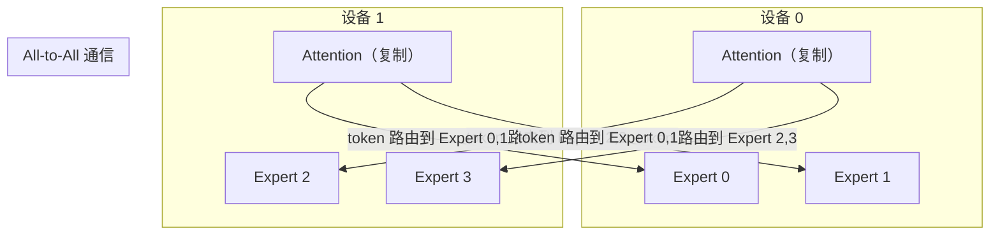
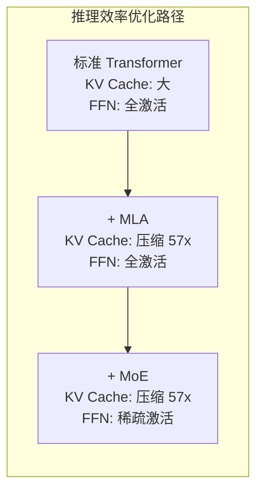

# MoE 进阶：工业实践与前沿研究

> 本文是 [模块6: MoE -- 混合专家模型](./README.md) 的进阶补充，深入分析 Google、DeepSeek、Anthropic 三条技术线在 MoE 架构上的工业实践，以及 MoE 领域的前沿研究方向。

---

## 目录

- [1. Google 的 MoE 研究](#1-google-的-moe-研究)
  - [1.4 ST-MoE：稳定训练的设计选择](#14-st-moe稳定训练的设计选择)
  - [1.5 Google 在 MoE 方向上的持续投入](#15-google-在-moe-方向上的持续投入)
- [2. DeepSeek MoE 深度分析](#2-deepseek-moe-深度分析)
- [3. Anthropic 视角](#3-anthropic-视角)
- [4. 前沿话题](#4-前沿话题)
  - [4.6 MoE + LoRA：参数高效微调的新挑战](#46-moe--lora参数高效微调的新挑战)
  - [4.7 MoE 的推理优化：减少专家加载延迟](#47-moe-的推理优化减少专家加载延迟)

---

## 1. Google 的 MoE 研究

### 1.1 Switch Transformer：Top-1 路由的工程突破

Switch Transformer（Fedus et al., 2022）是 Google 将 MoE 推向万亿参数级别的里程碑工作。

**核心设计决策**：

将路由从 Top-2 简化为 **Top-1**，看似是一个退步（只用 1 个专家而非 2 个），但在工程上带来了巨大优势：

1. **通信量减半**：分布式训练中的 All-to-All 通信只需要发送到 1 个目标设备
2. **计算量减半**：每个 token 只需要 1 次专家前向传播
3. **实现简单**：无需处理两个专家输出的加权组合

**容量因子**（Capacity Factor）机制：

Switch Transformer 引入了容量因子来处理负载不均的问题：

$$\text{expert\_capacity} = \left\lceil \frac{T}{N} \cdot \text{CF} \right\rceil$$

其中 $T$ 是 batch 中的 token 总数，$N$ 是专家数量，$\text{CF}$ 是容量因子。

当某个专家接收的 token 数超过 capacity 时，多余的 token 通过残差连接直接传递。Google 推荐的 CF 值为 1.0-1.25。

**训练稳定性改进**：

Switch Transformer 发现 MoE 训练在 FP16 下不稳定，但在 BF16 下表现良好。原因是 FP16 的数值范围较小（最大约 65504），路由 logits 容易溢出。BF16 虽然精度较低但数值范围与 FP32 相同（最大约 $3.4 \times 10^{38}$），避免了溢出问题。

**Scaling 结果**：

| 模型 | 参数量 | 等效 Dense 参数 | 预训练加速 |
|------|--------|----------------|-----------|
| Switch-Base | 7.4B | 223M | 7x |
| Switch-Large | 26.3B | 783M | 7x |
| Switch-XXL | 395B | 11B | 4x |
| Switch-C | 1.6T | 1.6T | - |

Switch-Base 的 7.4B 参数在预训练速度上比等效的 Dense 模型快 7 倍，说明 MoE 的参数效率优势在预训练阶段尤为显著。

### 1.2 GShard：分布式 MoE 的工程方案

GShard（Lepikhin et al., 2021）解决了 MoE 在数千 TPU 上的分布式训练问题。

**专家并行**（Expert Parallelism）：



**关键挑战**：All-to-All 通信的延迟。每个 token 需要被发送到持有对应专家的设备，处理完后再发送回来。这导致通信量与专家数量和设备数量成正比。

GShard 的**编译器解决方案**：利用 XLA 编译器自动化分片策略，将专家分配到不同 TPU 上，并自动插入必要的通信操作。

### 1.3 Expert Choice Routing

Expert Choice（Zhou et al., 2022）是 Google 提出的另一种路由范式，在核心教程中已经介绍了其基本思想。这里补充其工程细节。

**完整算法流程**：

```
输入: token 矩阵 X [T, d], 路由矩阵 W_g [d, N]
参数: 每个专家的容量 C = T * K / N

1. 计算路由分数 S = softmax(X @ W_g^T)  # [T, N]
2. 对 S 的每一列取 Top-C（每个专家选 C 个 token）
3. 获得 token 索引矩阵 I [N, C] 和权重矩阵 G [N, C]
4. 对每个专家 i:
     selected_tokens = X[I[i]]     # [C, d]
     expert_out = Expert_i(selected_tokens)
     output[I[i]] += G[i] * expert_out
5. 返回 output
```

**Expert Choice 与 Token Choice 的理论分析**：

Expert Choice 保证了每个专家处理恰好 $C$ 个 token，但某些 token 可能被 0 个或多个专家处理。定义 token $t$ 被选择的次数为 $m_t$：

- $m_t = 0$：token 被丢弃（通过残差连接传递）
- $m_t = 1$：正常处理
- $m_t > 1$：被多个专家处理（获得额外计算资源）

实验表明，高困惑度（高 perplexity）的 token 倾向于被更多专家选中（$m_t > 1$），而低困惑度的 token 可能被跳过（$m_t = 0$）。这意味着 Expert Choice 自动实现了**自适应计算**——更困难的 token 获得更多计算资源。

### 1.4 ST-MoE：稳定训练的设计选择

ST-MoE（Zoph et al., 2022, Google）是对 Switch Transformer 的改进，重点解决了 MoE 训练的稳定性问题，并系统性地研究了 MoE 模型的设计空间。

**关键设计选择**：

1. **Router z-loss**：ST-MoE 首次系统性地验证了 Router z-loss 对训练稳定性的重要性。实验表明，加入 z-loss 后，训练过程中的 loss spike 频率显著降低。

2. **编码器-解码器架构中的 MoE 配置**：ST-MoE 发现在 Encoder-Decoder 架构中，只在编码器中使用 MoE（而解码器使用 Dense FFN）可以获得更好的效果与效率平衡。这是因为编码器可以并行处理所有 token，更适合 MoE 的 All-to-All 通信模式。

3. **Top-2 路由的回归**：尽管 Switch Transformer 推广了 Top-1 路由，ST-MoE 的实验表明 Top-2 路由在下游任务上通常优于 Top-1，尤其是在微调场景中。

4. **专家数量的影响**：ST-MoE 系统地测试了 32、64、128、256 个专家的配置，发现增加专家数量的收益在 128 个左右开始显著递减。

**ST-MoE 的实验发现总结**：

| 设计选择 | 推荐配置 | 理由 |
|----------|---------|------|
| 路由策略 | Top-2 | 比 Top-1 在微调后更优 |
| 辅助损失系数 | 0.01 | 较小的值足以维持均衡 |
| Router z-loss | 开启 | 显著改善训练稳定性 |
| 专家数量 | 64-128 | 更多专家的边际收益递减 |
| BF16 训练 | 必须 | FP16 下 MoE 训练不稳定 |

### 1.5 Google 在 MoE 方向上的持续投入

Google 是 MoE 在 Transformer 中应用的先驱，其研究脉络清晰：


**Google MoE 研究的核心特征**：
- **工程导向**：从 GShard 的分布式工程到 Switch Transformer 的简化，始终追求大规模可落地
- **系统性实验**：ST-MoE 对设计空间的全面探索为后续工作提供了重要参考
- **持续创新**：从 hard routing 到 soft routing，不断突破 MoE 的理论边界
- **对 Gemini 的推测**：虽然 Google 未公开 Gemini 的完整架构，但考虑到 Google 在 MoE 上的深厚积累，Gemini 很可能采用了 MoE 架构的某种变体来实现大规模参数量与合理推理成本的平衡

---

## 2. DeepSeek MoE 深度分析

### 2.1 DeepSeekMoE 的设计哲学

DeepSeekMoE（2024）的核心理念是**追求极致的专家专业化**（Ultimate Expert Specialization）。

**三个关键观察**：

1. **知识冗余**：传统 MoE 中，不同专家可能学到大量重复的通用知识
2. **路由粒度过粗**：8-16 个大专家的路由选择过于粗糙，无法精确匹配 token 需求
3. **通用知识与专业知识的混合**：每个专家都需要处理一部分通用任务，降低了专业化程度

**DeepSeekMoE 的解决方案**：

$$\text{标准 MoE: } N=8, K=2 \xrightarrow{\text{细粒度拆分}} \text{DeepSeekMoE: } N_r=64, K_r=6, N_s=2$$

通过将大专家拆分为小专家，每个小专家可以更专注于特定的知识领域。同时引入共享专家来处理通用知识，解放路由专家使其更加专业化。

### 2.2 DeepSeek-V2 的 MoE 细节

DeepSeek-V2 是 DeepSeekMoE 思想在大规模模型中的首次实践。

**架构参数**：

| 参数 | 值 |
|------|-----|
| 总层数 | 60 |
| MoE 层数 | 每隔一层（共 30 层 MoE + 30 层 Dense Attention） |
| 路由专家数 $N_r$ | 160 |
| 共享专家数 $N_s$ | 2 |
| 激活路由专家数 $K_r$ | 6 |
| 每个路由专家的 FFN 隐藏维度 | 1,536 |
| 每个共享专家的 FFN 隐藏维度 | 与标准 FFN 相同 |
| 总参数量 | 236B |
| 激活参数量 | 21B |

**MoE 层与 Dense 层的交替**：

DeepSeek-V2 并非所有层都使用 MoE。注意力层始终是 Dense 的（使用 MLA），而 FFN 层在每隔一层使用 MoE。这种交替设计的原因：

1. 注意力层的稀疏化效果不如 FFN
2. 减少 All-to-All 通信的频率
3. Dense 注意力层提供稳定的全局信息传递

### 2.3 DeepSeek-V3 的 MoE 升级

DeepSeek-V3 在 V2 的基础上进行了多项改进。

**辅助损失 free 策略的完整描述**：

DeepSeek-V3 移除了传统的辅助负载均衡损失，代之以一种基于**偏置调整**的动态均衡机制：

$$\text{routing\_score}_i(x) = \text{softmax}(W_g x + b)_i$$

其中偏置 $b \in \mathbb{R}^N$ 根据以下规则更新：

```
每 T 步执行一次偏置更新:
    对每个专家 i:
        if load_i > target_load * (1 + tolerance):
            b_i -= delta  # 降低偏置，减少该专家的负载
        elif load_i < target_load * (1 - tolerance):
            b_i += delta  # 增加偏置，提升该专家的负载
```

这种方法的优势：
- **无需调参**：不需要精心调节辅助损失系数 $\alpha$
- **不影响主任务梯度**：辅助损失会通过梯度影响整个模型，而偏置调整是独立的
- **更直接有效**：直接操作路由分数，效果立竿见影

**DeepSeek-V3 的 MoE 配置**：

| 参数 | DeepSeek-V2 | DeepSeek-V3 |
|------|-------------|-------------|
| 路由专家数 | 160 | 256 |
| 共享专家数 | 2 | 1 |
| 激活路由专家数 | 6 | 8 |
| 负载均衡方法 | 辅助损失 | 偏置调整（辅助损失 free） |
| 总参数量 | 236B | 671B |
| 激活参数量 | 21B | 37B |
| 训练精度 | BF16 | FP8 |

### 2.4 专家并行的工程实现

DeepSeek 在 MoE 的分布式训练中采用了**专家并行 + 数据并行 + 流水线并行**的 3D 并行策略。

**All-to-All 通信优化**：

MoE 的核心通信瓶颈是 All-to-All。DeepSeek 的优化策略：

1. **通信-计算重叠**：在当前层的专家计算进行时，预先发送下一层的 token 路由信息
2. **分组 All-to-All**：将大的 All-to-All 操作拆分为多个小的组内 All-to-All
3. **DualPipe**（DeepSeek-V3）：进一步将计算和通信的流水线重叠，接近零气泡

**FP8 训练与 MoE 的结合**：

DeepSeek-V3 首次在大规模 MoE 模型上成功应用了 FP8 混合精度训练。关键挑战包括：
- 路由 logits 的数值稳定性（FP8 精度有限）
- 不同专家之间的 scaling factor 对齐
- 辅助损失 free 策略与 FP8 的兼容性

---

## 3. Anthropic 视角

### 3.1 MoE 模型的可解释性挑战

Anthropic 的可解释性研究（Mechanistic Interpretability）主要聚焦于稠密 Transformer，但其研究框架对理解 MoE 模型同样具有启发性。

**残差流视角下的 MoE**：

在 Anthropic 的残差流（Residual Stream）框架中，每一层对残差流进行读写操作。对于 MoE 层：

$$x_{l+1} = x_l + \sum_{j \in \text{TopK}} g_j(x_l) \cdot E_j(\text{Norm}(x_l))$$

与稠密 FFN 不同，MoE 层的写入取决于路由决策，这意味着：
- 同一个 token 在不同上下文中可能被不同的专家处理
- 残差流中累积的信息来自不同专家的组合
- 分析时需要考虑路由模式作为额外变量

**对 SAE（Sparse Autoencoder）研究的影响**：

Anthropic 的 SAE 研究旨在从稠密模型的残差流中提取可解释的稀疏特征。如果将 SAE 应用于 MoE 模型：

- MoE 本身就具有稀疏性（专家选择），与 SAE 的稀疏性存在交互
- 可能需要为不同的专家分别训练 SAE
- 专家的路由模式本身就是一种可解释的特征

> 注意：截至目前，Anthropic 尚未发布专门针对 MoE 模型的可解释性研究。以上分析是基于 Anthropic 已有研究框架的推断。

### 3.2 MoE 模型的安全性考量

从 Anthropic 的安全优先理念出发，MoE 架构带来了以下安全性问题：

**1. 对齐的不完整性**

在 RLHF/DPO 等对齐训练中，如果某些专家因为在对齐数据上的激活频率较低而未被充分训练，可能导致：
- 特定输入模式下触发未对齐的专家
- 对齐效果在不同输入上不一致

**2. 后门攻击面**

MoE 的路由机制为潜在的后门攻击提供了新的表面：
- 攻击者可能利用路由模式将特定输入引导到未充分审计的专家
- 路由器本身可能被操纵

**3. 审计的复杂性**

对于稠密模型，所有输入通过相同的参数路径，审计相对可行。对于 MoE：
- 需要审计所有可能的专家组合
- 组合数量为 $\binom{N}{K}$，随专家数量指数增长
- 完全审计在实际中可能不可行

### 3.3 MoE 与 Constitutional AI 的交叉

Anthropic 的 Constitutional AI（CAI）框架通过宪法原则来引导模型行为。在 MoE 模型中：

- CAI 的原则需要被所有专家一致遵守
- 共享专家可能是实现"安全底线"的天然载体（始终激活，始终执行安全检查）
- 路由专家的专业化可能导致不同领域的安全水平不一致

> 以上分析基于公开的研究方向和合理推断。Anthropic 对 MoE 安全性的具体研究（如果有的话）尚未公开。

---

## 4. 前沿话题

### 4.1 Soft MoE：可微路由

传统 MoE 的 Top-K 路由是离散的、不可微的操作，这给梯度传播带来了困难。**Soft MoE**（Puigcerver et al., 2024, Google）提出了一种完全可微的路由机制。

**核心思想**：不再为每个 token 选择特定的专家，而是将所有 token 的信息通过 softmax 权重混合后再输入专家。

**Soft MoE 的数学形式**：

定义路由权重矩阵：

$$D = \text{softmax}(X \Phi) \in \mathbb{R}^{T \times N \cdot C}$$

其中 $\Phi \in \mathbb{R}^{d \times NC}$ 是可学习参数，$C$ 是每个专家的 slot 数量。

每个专家的输入是所有 token 的加权组合：

$$\tilde{x}_{i,c} = \sum_{t=1}^{T} D_{t, i \cdot C + c} \cdot x_t$$

专家处理后的输出：

$$\tilde{y}_{i,c} = E_i(\tilde{x}_{i,c})$$

最终通过逆向的加权组合回到 token 空间：

$$y_t = \sum_{i,c} D_{t, i \cdot C + c} \cdot \tilde{y}_{i,c}$$

**Soft MoE 的优势**：
1. **完全可微**：没有 Top-K 的离散选择，梯度可以完整传播
2. **无需辅助损失**：负载均衡通过 softmax 自然实现
3. **无 token dropping**：所有 token 都参与计算

**Soft MoE 的劣势**：
1. **计算量更大**：每个专家的输入是所有 token 的加权组合，而非单个 token
2. **不适合自回归**：需要看到全序列才能计算权重
3. **主要用于视觉模型**：目前在 ViT 上验证，LLM 上的应用尚在探索

### 4.2 MoE + MLA 的协同设计

DeepSeek-V2/V3 展示了 MoE 与 MLA 协同工作的巨大潜力。这种组合的核心优势在于：

**KV Cache 压缩（MLA）+ 稀疏 FFN（MoE） = 极致推理效率**



**联合设计的挑战**：

1. **通信模式冲突**：MLA 倾向于减少 KV 的通信，MoE 需要 All-to-All 的 token 通信
2. **内存带宽竞争**：MLA 节省的内存被 MoE 的专家参数部分占用
3. **训练稳定性**：两种创新同时引入增加了训练的复杂性

### 4.3 专家蒸馏：MoE 到 Dense 的知识转移

训练好的 MoE 模型可以通过**知识蒸馏**将知识迁移到更小的 Dense 模型中。

**动机**：
- MoE 模型虽然推理 FLOPs 较低，但内存占用大（需要加载所有专家参数）
- 在边缘设备上部署 MoE 模型困难
- Dense 模型的推理延迟更可预测

**蒸馏方法**：

$$L_{\text{distill}} = \alpha \cdot L_{\text{KD}}(\text{softmax}(z_s / \tau), \text{softmax}(z_t / \tau)) + (1-\alpha) \cdot L_{\text{CE}}(z_s, y)$$

其中 $z_s$ 是学生（Dense）模型的 logits，$z_t$ 是教师（MoE）模型的 logits，$\tau$ 是温度参数。

**实践发现**：
- MoE → Dense 蒸馏的效率较高，蒸馏后的 Dense 模型通常优于直接训练的同等规模 Dense 模型
- DeepSeek-R1 的小模型版本就是通过从大模型蒸馏获得的
- 蒸馏可以选择性地从不同专家提取知识

### 4.4 MoE 推理的负载均衡

MoE 在推理阶段面临与训练不同的负载均衡问题。

**训练 vs 推理的区别**：

| 维度 | 训练 | 推理 |
|------|------|------|
| Batch 大小 | 大（数千 token） | 小（单请求或小 batch） |
| 负载预测 | 统计上可预测 | 变化大 |
| Token dropping | 可接受（略微影响质量） | 不可接受（产生错误输出） |
| 延迟要求 | 不敏感 | 非常敏感 |

**推理负载均衡策略**：

1. **动态 batch 调度**：将多个请求的 token 打包，增大 batch 以平摊负载不均
2. **专家缓存**：将常用专家保留在 GPU 缓存中，冷门专家可以放在 CPU/SSD
3. **预测路由**：基于输入特征预测大致的路由分布，提前调度通信

### 4.5 MoE 的其他前沿方向

**1. 多粒度 MoE**

不同层使用不同粒度的 MoE：浅层使用少量大专家（处理通用模式），深层使用大量小专家（处理细粒度知识）。

**2. 动态专家数量**

每个 token 激活的专家数量 $K$ 不再固定，而是根据 token 的"困难程度"动态决定。简单的 token（如标点符号）可能只需要 1 个专家，而复杂的 token（如专业术语）可能需要更多专家。

**3. 专家生命周期管理**

在持续预训练过程中，某些专家可能变得过时。研究如何"退役"旧专家并"引入"新专家，实现模型的持续更新。

**4. MoE 与 Speculative Decoding**

MoE 的路由特性为 Speculative Decoding 提供了新思路：可以使用路由到少量专家的"轻量"推理作为 draft，再由完整 MoE 验证。

### 4.6 MoE + LoRA：参数高效微调的新挑战

在 MoE 模型上进行参数高效微调（PEFT）面临独特的挑战，这是当前活跃的研究方向。

**核心问题**：

LoRA（Low-Rank Adaptation）通过在权重矩阵旁添加低秩分解 $\Delta W = BA$ 来实现微调。在 MoE 模型中，有多种策略选择：

1. **只微调路由器**：仅在路由器的线性层 $W_g$ 上应用 LoRA
   - 优点：参数最少，训练最快
   - 缺点：无法调整专家的内部知识表示

2. **只微调共享专家**：在共享专家的 FFN 上应用 LoRA
   - 优点：共享专家处理通用知识，对微调影响最大
   - 缺点：忽略了路由专家的适应能力

3. **微调所有专家**：在每个路由专家上都应用 LoRA
   - 优点：最大的适应灵活性
   - 缺点：参数量爆炸（$N$ 个专家 $\times$ 每个 LoRA 的参数量）

4. **混合策略**：共享专家 + 路由器 + 高频路由专家
   - 根据专家的激活频率，优先微调被频繁使用的路由专家
   - 低频专家保持冻结，减少过拟合风险

**MoLoRA（MoE + LoRA 的专用设计）**：

一种前沿方法是将 LoRA 本身设计为 MoE 结构——不同的 LoRA 适配器充当"微调专家"，由路由器决定每个 token 使用哪个 LoRA 适配器：

$$\Delta W(x) = \sum_{i \in \text{TopK}} g_i(x) \cdot B_i A_i$$

这种方法允许模型在微调时为不同类型的输入使用不同的适配策略，本质上是在适配层面引入条件计算。

### 4.7 MoE 的推理优化：减少专家加载延迟

MoE 模型的推理面临一个独特的挑战：**专家参数的加载延迟**。虽然每次推理只激活少数专家，但所有专家的参数都需要存储在可访问的存储中。

**问题分析**：

以 DeepSeek-V3（671B 参数）为例：
- 全部参数在 FP16 下需要约 1.3 TB 显存
- 即使使用 INT4 量化，仍需约 335 GB
- 单张 GPU（80GB）远远不够，需要多卡或 offloading

**解决方案一：专家缓存（Expert Caching）**

基于时间局部性的观察——相邻 token 往往路由到相似的专家——可以将最近使用的专家保留在 GPU 显存中，不常用的专家放在 CPU 内存或 SSD 上。

```
专家缓存策略（LRU 风格）：
1. 维护一个 GPU 上的专家缓存，容量为 C 个专家
2. 当需要的专家在缓存中 → 直接计算（Cache Hit）
3. 当需要的专家不在缓存中 → 从 CPU/SSD 加载（Cache Miss）
4. 淘汰最久未使用的专家，腾出空间

关键指标：Cache Hit Rate
- 实测在长文本生成中，hit rate 可达 85-95%
- 原因：语义连续的文本倾向于激活相似的专家集合
```

**解决方案二：预测式专家预加载**

在生成第 $t$ 个 token 时，利用路由器预测第 $t+1$ 个 token 可能需要的专家，并提前开始加载。

$$\hat{E}_{t+1} = \text{TopK}(\text{softmax}(W_g \cdot h_t)) \quad \text{（基于当前隐状态预测下一步路由）}$$

这种方法可以将专家加载的延迟隐藏在当前 token 的计算中。

**解决方案三：专家剪枝与合并**

对于推理场景，可以对 MoE 模型进行后处理优化：
- **低频专家剪枝**：移除几乎从不被激活的专家，减少存储需求
- **相似专家合并**：将参数相近的专家合并为一个，降低模型规模
- **蒸馏为 Dense 模型**：在特定任务上，将 MoE 蒸馏为更小的 Dense 模型（详见 4.3 节）

这些方法在精度与效率之间做出不同程度的取舍，适用于不同的部署场景（边缘设备 vs 服务器集群）。

---

## 参考资料

### 论文

1. Fedus et al. (2022). *Switch Transformers: Scaling to Trillion Parameter Models with Simple and Efficient Sparsity*. Google.
2. Lepikhin et al. (2021). *GShard: Scaling Giant Models with Conditional Computation and Automatic Sharding*. Google.
3. Zhou et al. (2022). *Mixture-of-Experts with Expert Choice Routing*. Google.
4. Puigcerver et al. (2024). *From Sparse to Soft Mixtures of Experts*. Google.
5. Zoph et al. (2022). *ST-MoE: Designing Stable and Transferable Sparse Expert Models*. Google.
6. DeepSeek-AI (2024). *DeepSeekMoE: Towards Ultimate Expert Specialization in Mixture-of-Experts Language Models*.
7. DeepSeek-AI (2024). *DeepSeek-V2: A Strong, Economical, and Efficient Mixture-of-Experts Language Model*.
8. DeepSeek-AI (2024). *DeepSeek-V3 Technical Report*.
9. Elhage et al. (2022). *Toy Models of Superposition*. Anthropic.
10. Templeton et al. (2024). *Scaling Monosemanticity*. Anthropic.
11. Bai et al. (2022). *Constitutional AI: Harmlessness from AI Feedback*. Anthropic.
12. Jiang et al. (2024). *Mixtral of Experts*. Mistral AI.

### 博客

1. [Mixture of Experts Explained](https://huggingface.co/blog/moe) - Hugging Face
2. [Transformer Circuits Thread](https://transformer-circuits.pub/) - Anthropic
3. [DeepSeek-V3 技术报告解读](https://arxiv.org/abs/2412.19437)
