# 模块7：数据工程 -- 预训练数据管线

> 数据是大语言模型的燃料。模型架构的改进带来常数级提升，而数据质量的提升直接决定模型能力的上限。本章将深入数据工程的全流程：从海量 Web 数据的收集与清洗，到 MinHash + LSH 去重算法的数学推导，再到数据混合策略与端到端管线的工业实现。

### 模块定位

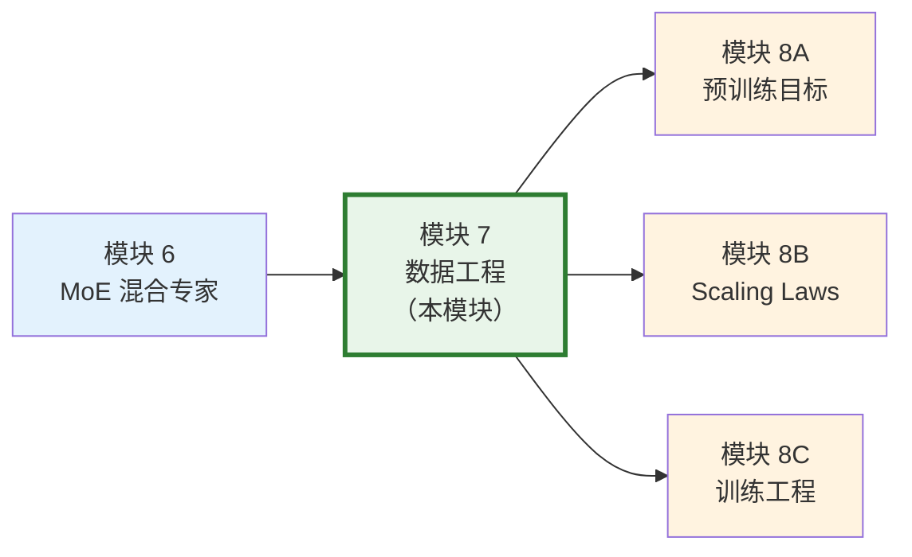

**数据是 LLM 的"燃料"**：在模块 4-6 中，我们学习了 Decoder-Only 架构、注意力机制变体和 MoE 等模型架构设计。架构决定了模型的"引擎效率"，而数据决定了模型的"能力上限"。即使拥有最先进的架构，低质量的训练数据仍会产出低质量的模型。

**前置知识**：
- **Tokenization（模块 1）**：数据管线的最后一步是分词，将清洗后的文本转化为 token 序列
- **Embedding（模块 2）**：理解词汇表大小如何影响数据的表示效率
- **基本 Python 编程**：数据处理涉及大量 I/O、正则表达式和哈希算法

**本模块与后续模块的关系**：数据准备好之后，模块 8A 将讨论如何设计训练目标（Next Token Prediction 等），模块 8B 讨论数据量与模型规模的最优配比（Scaling Laws），模块 8C 则进入训练工程实战。

---

## 目录

- [1. 数据是 LLM 的燃料](#1-数据是-llm-的燃料)
- [2. 数据收集](#2-数据收集)
- [3. 数据清洗](#3-数据清洗)
- [4. 数据混合策略](#4-数据混合策略)
- [5. 数据处理管线](#5-数据处理管线)
- [6. 工业级数据 Pipeline 实践](#6-工业级数据-pipeline-实践)
- [7. Google 的数据工程实践](#7-google-的数据工程实践)
- [8. DeepSeek 的数据策略](#8-deepseek-的数据策略)
- [9. Anthropic 的数据理念](#9-anthropic-的数据理念)
- [10. 大规模去重技术详解](#10-大规模去重技术详解)
- [11. 项目实践](#11-项目实践)
- [12. 本章小结](#12-本章小结)
- [13. 过渡：从数据到训练](#13-过渡从数据到训练)

---

## 1. 数据是 LLM 的燃料

### 1.1 数据质量 vs 数据数量

大语言模型的训练本质是从数据中提取统计规律。一个常见的误区是"数据越多越好"，但实际上**数据质量对模型能力的影响往往大于数据数量**。

**直觉理解**：假设你要学习英语写作。读 100 篇精心编辑的《纽约时报》文章，效果很可能好过读 10000 条随机的网络评论。模型也是一样：高质量的数据让模型学到更精确、更一致的语言模式。

这一观察在多项研究中得到验证：

| 研究 | 核心发现 |
|------|---------|
| Chinchilla (Hoffmann et al., 2022) | 模型参数量和训练数据量应等比例增长 |
| Phi-1 (Gunasekar et al., 2023) | 用 7B tokens 高质量"教科书"数据训练的 1.3B 模型，超越用 300B tokens 训练的模型 |
| DCLM (Li et al., 2024) | 系统性的数据清洗可以将模型性能提升 6.6% |
| FineWeb (Penedo et al., 2024) | 精心处理的 15T tokens Web 数据，为开源模型提供高质量训练集 |

### 1.2 Chinchilla Scaling Laws 对数据量的启示

Chinchilla Scaling Laws（也称计算最优缩放定律）给出了一个关键结论：给定固定的计算预算 $C$（以 FLOPs 计），存在最优的模型参数量 $N^*$ 和训练数据量 $D^*$：

$$C \approx 6ND$$

$$N^* \propto C^{0.5}, \quad D^* \propto C^{0.5}$$

这意味着**模型参数和训练数据应等比例增长**。在 Chinchilla 之前，GPT-3（175B 参数）只用了 300B tokens 训练，远低于最优比例建议的约 3.7T tokens。

**工业实践的偏离**：实际中，许多团队选择"过度训练"策略（训练数据远超 Chinchilla 最优），因为：

1. **推理成本**：更小的模型推理更便宜，即使训练成本更高
2. **数据复用**：可以在高质量数据上多次训练
3. **Llama 的验证**：Llama-1 7B 在 1T tokens 上训练（约 7 倍过度训练），性能优异

### 1.3 现代 LLM 训练数据规模概览

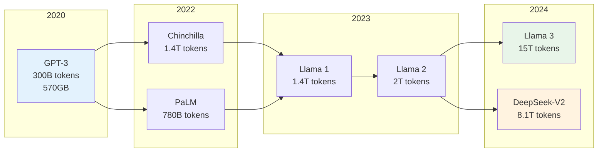

**数据规模的爆炸式增长**：从 GPT-3 的 300B tokens 到 Llama 3 的 15T tokens，4 年间增长了 50 倍。这对数据工程提出了巨大挑战：如何在互联网规模的数据中高效地筛选出高质量的训练数据？

---

## 2. 数据收集

### 2.1 Common Crawl 与 Web 数据

**Common Crawl** 是目前最大的公开 Web 爬取数据集，定期爬取互联网上的公开网页。

| 属性 | 数值 |
|------|------|
| 数据量 | 约 250B 网页（累计） |
| 单次爬取 | 约 3-4B 网页 |
| 原始大小 | 每次约 60-80TB（压缩后） |
| 更新频率 | 每月一次 |
| 格式 | WARC (Web ARChive) |

**为什么选择 Common Crawl？**

1. **覆盖广**：涵盖数十亿网页，多语言、多领域
2. **免费公开**：降低数据获取门槛
3. **历史积累**：从 2008 年开始，提供丰富的时间维度数据

**Common Crawl 的问题**：

原始 Common Crawl 数据质量参差不齐，包含大量：
- 广告、导航栏等模板文本（boilerplate）
- 重复内容（同一网页被多次爬取）
- 低质量内容（垃圾邮件、自动生成页面）
- 有害内容（色情、暴力、仇恨言论）
- 个人隐私信息（邮箱、电话、地址）

因此，**数据清洗**是将 Common Crawl 转化为可用训练数据的核心步骤。

### 2.2 高质量数据源

除了 Web 数据，高质量的专业数据源对模型能力提升至关重要：

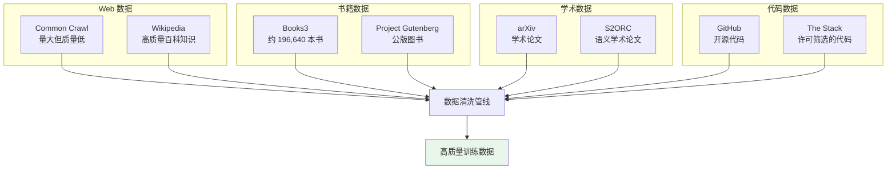

各数据源的特点：

| 数据源 | 规模 | 质量 | 主要贡献 |
|--------|------|------|---------|
| Common Crawl | 极大 | 低→中 | 通用知识、多语言覆盖 |
| Wikipedia | 中 | 高 | 事实知识、结构化写作 |
| 书籍 | 大 | 高 | 连贯性、深度推理、叙事能力 |
| arXiv | 中 | 高 | 学术推理、数学能力 |
| GitHub | 大 | 中→高 | 编程能力、逻辑推理 |
| StackOverflow | 中 | 高 | 问答能力、技术知识 |

### 2.3 数据许可与法律考量

数据收集不仅是技术问题，还涉及法律和伦理：

1. **版权问题**：书籍、论文等受版权保护，使用需获得许可或依赖合理使用原则
2. **个人隐私**：训练数据中可能包含个人信息（PII），需要去除
3. **robots.txt**：网站通过 robots.txt 声明爬取限制，但法律约束力因地区而异
4. **数据来源标注**：部分许可要求标注数据来源（如 CC-BY）

**The Stack v2**（BigCode 项目）是一个很好的范例：只使用宽松许可（permissive license）的代码，并提供 opt-out 机制让开发者排除自己的代码。

---

## 3. 数据清洗

数据清洗是数据工程中最核心、最耗时的环节。一条完整的清洗管线通常包括：去重、质量过滤、文本提取与清洗。

### 3.1 去重

#### 3.1.1 为什么要去重？

训练数据中的重复内容会带来多个问题：

1. **训练效率下降**：模型在重复数据上浪费计算资源
2. **记忆而非泛化**：过多重复导致模型死记硬背而非学习模式
3. **隐私风险**：重复出现的个人信息更容易被模型记忆和泄露
4. **评估污染**：训练集和测试集的重叠导致评估不准确

**经验数据**：在 C4 数据集中，Lee et al. (2022) 发现约 3.04% 的文档是精确重复的，约 14% 的文档存在近似重复。去重后模型的 perplexity 显著下降。

#### 3.1.2 精确去重（Exact Deduplication）

精确去重通过哈希值匹配找到完全相同的文档。

**算法**：

1. 对每个文档计算哈希值（如 SHA-256、MD5）
2. 将哈希值插入哈希表
3. 如果哈希值已存在，则该文档为重复文档

```python
import hashlib

def exact_dedup(documents: list[str]) -> list[str]:
    """精确去重：基于 SHA-256 哈希"""
    seen_hashes = set()
    unique_docs = []

    for doc in documents:
        # 计算文档的 SHA-256 哈希
        doc_hash = hashlib.sha256(doc.encode('utf-8')).hexdigest()

        if doc_hash not in seen_hashes:
            seen_hashes.add(doc_hash)
            unique_docs.append(doc)

    return unique_docs
```

**局限性**：精确去重只能发现完全相同的文档，无法处理以下情况：
- 多一个空格或换行符
- 不同格式的同一内容（HTML vs 纯文本）
- 段落级别的抄袭或转载

#### 3.1.3 近似去重：MinHash + LSH

为了检测**内容相似但不完全相同**的文档，我们需要近似去重算法。MinHash（最小哈希）配合 LSH（局部敏感哈希）是目前最主流的方案。

**整体思路**：

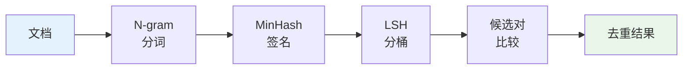

**第一步：Jaccard 相似度**

两个集合 $A, B$ 的 Jaccard 相似度（Jaccard Similarity）定义为：

$$J(A, B) = \frac{|A \cap B|}{|A \cup B|}$$

**性质**：
- $J(A, B) \in [0, 1]$
- $J(A, A) = 1$
- $J(A, \emptyset) = 0$（当 $A \neq \emptyset$）

在文本去重中，集合 $A, B$ 通常是文档的 **n-gram 集合**。例如对于文档 "the cat sat on the mat"，其 3-gram（shingle）集合为：

$$A = \{\text{"the cat sat"}, \text{"cat sat on"}, \text{"sat on the"}, \text{"on the mat"}\}$$

如果两个文档的 Jaccard 相似度超过阈值（如 0.8），我们认为它们是近似重复的。

**问题**：直接计算 Jaccard 相似度需要 $O(|A| + |B|)$ 时间，对于数十亿文档两两比较，计算量 $O(n^2)$ 完全不可行。

**第二步：MinHash -- Jaccard 相似度的高效估计**

MinHash 的核心思想是：**用一组哈希函数将集合压缩为固定长度的签名（signature），通过比较签名来估计 Jaccard 相似度**。

**定义**：给定一个哈希函数 $h: U \to \mathbb{N}$（$U$ 是全集），集合 $A$ 的 MinHash 值为：

$$\text{MinHash}_h(A) = \min_{a \in A} h(a)$$

即集合中所有元素经过哈希后的最小值。

**MinHash 估计定理（关键定理）**：

$$\Pr[\text{MinHash}_h(A) = \text{MinHash}_h(B)] = J(A, B)$$

**即两个集合的 MinHash 值相等的概率恰好等于它们的 Jaccard 相似度。**

**证明**：

设全集 $U$ 上有一个理想的随机哈希函数 $h$（将每个元素映射到不同的随机值）。

定义 $C = A \cup B$，则 $|C| = |A \cup B|$。

$\text{MinHash}_h(A) = \text{MinHash}_h(B)$ 当且仅当 $C$ 中哈希值最小的元素**同时属于** $A$ 和 $B$，即属于 $A \cap B$。

由于 $h$ 是随机排列，$C$ 中哈希值最小的元素等概率地是 $C$ 中的任何一个元素。因此：

$$\Pr[\text{MinHash}_h(A) = \text{MinHash}_h(B)] = \frac{|A \cap B|}{|A \cup B|} = J(A, B) \quad \blacksquare$$

**MinHash 签名**：

使用 $k$ 个独立的哈希函数 $h_1, h_2, \ldots, h_k$，构建签名向量：

$$\text{Sig}(A) = [\text{MinHash}_{h_1}(A), \text{MinHash}_{h_2}(A), \ldots, \text{MinHash}_{h_k}(A)]$$

Jaccard 相似度的估计量为：

$$\hat{J}(A, B) = \frac{1}{k} \sum_{i=1}^{k} \mathbb{1}[\text{MinHash}_{h_i}(A) = \text{MinHash}_{h_i}(B)]$$

**Jaccard 相似度的无偏估计证明**：

**定理**：$\hat{J}(A, B)$ 是 $J(A, B)$ 的无偏估计量。

**证明**：

设 $X_i = \mathbb{1}[\text{MinHash}_{h_i}(A) = \text{MinHash}_{h_i}(B)]$，则 $X_i$ 是伯努利随机变量（Bernoulli Random Variable）。

由 MinHash 估计定理：

$$\mathbb{E}[X_i] = \Pr[\text{MinHash}_{h_i}(A) = \text{MinHash}_{h_i}(B)] = J(A, B)$$

因此：

$$\mathbb{E}[\hat{J}] = \mathbb{E}\left[\frac{1}{k}\sum_{i=1}^{k} X_i\right] = \frac{1}{k}\sum_{i=1}^{k} \mathbb{E}[X_i] = J(A, B) \quad \blacksquare$$

**方差分析**：

由于 $X_i$ 之间独立且同分布，$X_i \sim \text{Bernoulli}(J)$：

$$\text{Var}(\hat{J}) = \frac{1}{k^2}\sum_{i=1}^{k} \text{Var}(X_i) = \frac{J(1 - J)}{k}$$

当 $k = 128$ 时，标准差为 $\sqrt{J(1-J)/128}$。对于 $J = 0.8$，标准差约 $0.035$，即估计误差约 3.5%。

**第三步：LSH（局部敏感哈希）-- 高效候选对检索**

即使有了 MinHash 签名，仍然需要两两比较所有文档对，复杂度 $O(n^2)$。LSH 通过巧妙的分桶策略，将可能相似的文档映射到同一个桶中，大幅减少比较次数。

**分带策略（Banding Technique）**：

将长度为 $k$ 的签名分为 $b$ 个带（band），每个带包含 $r = k/b$ 行。

$$\underbrace{[h_1, \ldots, h_r]}_{\text{band 1}}, \underbrace{[h_{r+1}, \ldots, h_{2r}]}_{\text{band 2}}, \ldots, \underbrace{[h_{(b-1)r+1}, \ldots, h_k]}_{\text{band } b}$$

**规则**：如果两个文档在**至少一个**带中完全匹配，则它们成为**候选对**。

**LSH 的概率分析**：

设两个文档的真实 Jaccard 相似度为 $s$。

- 在一个带（$r$ 行）中完全匹配的概率：$s^r$
- 在一个带中不匹配的概率：$1 - s^r$
- 在所有 $b$ 个带中都不匹配的概率：$(1 - s^r)^b$
- 成为候选对的概率（至少一个带匹配）：

$$P(\text{candidate} \mid s) = 1 - (1 - s^r)^b$$

这个函数形成一条 **S 型曲线**，阈值大约在 $t \approx (1/b)^{1/r}$ 处。

**参数选择示例**：

| 参数 | $b=20, r=5$ | $b=10, r=10$ | $b=5, r=20$ |
|------|-------------|--------------|--------------|
| $k$ | 100 | 100 | 100 |
| 阈值 $t$ | $\approx 0.55$ | $\approx 0.79$ | $\approx 0.93$ |
| $P(s=0.5)$ | 0.47 | 0.01 | 0.00 |
| $P(s=0.8)$ | 1.00 | 0.68 | 0.04 |
| $P(s=0.9)$ | 1.00 | 0.99 | 0.64 |

选择 $b=20, r=5$ 适合较宽松的去重（低阈值），而 $b=5, r=20$ 适合严格的去重（只去除几乎相同的文档）。

**完整的 MinHash + LSH 去重流程**：

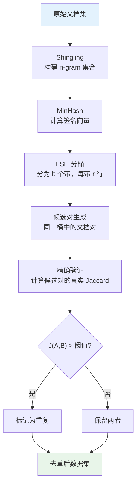

**时间复杂度分析**：

| 步骤 | 复杂度 |
|------|--------|
| Shingling | $O(nL)$，$L$ 为文档平均长度 |
| MinHash | $O(nkL)$，$k$ 为哈希函数数 |
| LSH 分桶 | $O(nkb)$ |
| 候选对验证 | $O(n_c)$，$n_c$ 为候选对数 |
| **总计** | $O(nkL + n_c)$，远优于 $O(n^2L)$ |

### 3.2 质量过滤

去重之后，我们需要过滤掉低质量的文档。质量过滤通常分为三类：规则过滤、模型过滤、有害内容过滤。

#### 3.2.1 启发式规则过滤

基于统计特征的简单高效规则，通常作为第一道过滤：

```python
def rule_based_filter(text: str) -> bool:
    """
    基于规则的质量过滤
    返回 True 表示保留，False 表示过滤
    """
    # 1. 长度过滤：太短或太长都不好
    if len(text) < 100 or len(text) > 100000:
        return False

    # 2. 语言检测：只保留目标语言
    # 使用 fasttext 或 langdetect

    # 3. 特殊字符比例：过高说明是乱码或代码残留
    special_ratio = sum(1 for c in text if not c.isalnum() and not c.isspace()) / len(text)
    if special_ratio > 0.3:
        return False

    # 4. 重复行/段落比例：广告或模板页面的特征
    lines = text.split('\n')
    unique_lines = set(lines)
    if len(unique_lines) / max(len(lines), 1) < 0.5:
        return False

    # 5. 停用词比例：自然语言应有合理的停用词密度
    # 停用词过少可能是代码、列表等非自然文本

    return True
```

常用的规则维度：

| 规则 | 阈值（典型） | 过滤目标 |
|------|-------------|---------|
| 最短长度 | 50-200 字符 | 短广告、导航链接 |
| 最长长度 | 50K-100K 字符 | 数据库 dump、日志 |
| 平均行长 | 10-500 字符 | 代码残留、列表 |
| 特殊字符比例 | < 20-30% | 乱码、格式残留 |
| 数字比例 | < 50% | 数据表格、编号列表 |
| 重复 n-gram 比例 | < 20-30% | 广告重复、SEO |
| 停用词密度 | > 5-10% | 非自然语言文本 |

#### 3.2.2 基于模型的质量评分

**Perplexity 过滤**是最常用的模型过滤方法。其核心思想是：**用一个在高质量数据上训练的语言模型，评估文档的"流畅度"**。

Perplexity（困惑度）的定义：

$$\text{PPL}(x_1, \ldots, x_T) = \exp\left(-\frac{1}{T}\sum_{t=1}^{T}\log P(x_t \mid x_{<t})\right)$$

直觉上，perplexity 衡量模型对文本的"惊讶程度"：
- **低 perplexity**：文本符合语言模型的预期，通常是流畅的自然语言
- **高 perplexity**：文本让模型困惑，可能是乱码、外语混杂、或低质量文本
- **极低 perplexity**：文本过于简单或重复，如 "the the the..."

因此，通常保留 perplexity 在合理范围内的文档，过高和过低的都过滤掉。

**CCNet 的方法** (Wenzek et al., 2020)：
1. 在 Wikipedia 上训练一个 KenLM 5-gram 语言模型
2. 用该模型计算 Common Crawl 每个文档的 perplexity
3. 按 perplexity 将文档分为高/中/低质量三档
4. 研究表明，低 perplexity（高质量档）的数据训练出的模型性能最好

#### 3.2.3 有害内容过滤

预训练数据中必须过滤有害内容，包括但不限于：

1. **色情/暴力内容**：使用分类器检测
2. **仇恨言论**：基于关键词列表 + 分类器
3. **个人隐私信息（PII）**：邮箱、电话、身份证号、银行卡号等
4. **恶意软件代码**：可能被模型记忆并生成

PII 移除的常见方法：

```python
import re

def remove_pii(text: str) -> str:
    """移除个人隐私信息"""
    # 邮箱
    text = re.sub(r'\b[\w.+-]+@[\w-]+\.[\w.-]+\b', '[EMAIL]', text)

    # 电话号码（中国大陆手机号）
    text = re.sub(r'\b1[3-9]\d{9}\b', '[PHONE]', text)

    # IP 地址
    text = re.sub(r'\b\d{1,3}\.\d{1,3}\.\d{1,3}\.\d{1,3}\b', '[IP]', text)

    # 身份证号
    text = re.sub(r'\b\d{17}[\dXx]\b', '[ID_CARD]', text)

    return text
```

### 3.3 文本提取与清洗

#### 3.3.1 HTML 到纯文本

Web 数据通常以 HTML 格式存储，需要提取正文内容并去除标签、脚本、样式等：

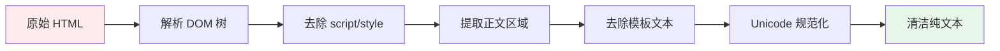

常用工具：
- **trafilatura**：专为正文提取设计，效果好
- **BeautifulSoup + readability**：灵活可定制
- **jusText**：基于段落分类的提取算法

#### 3.3.2 PDF / 图片中的文本提取

- **PDF**：使用 `pdfminer`、`PyMuPDF` 提取文本层；无文本层的 PDF 需要 OCR
- **OCR**：使用 `Tesseract` 或商用 API 对图片进行文字识别
- **挑战**：数学公式、表格、图表的提取仍是难题

#### 3.3.3 Unicode 规范化

文本清洗中容易忽略但重要的步骤：

```python
import unicodedata

def normalize_text(text: str) -> str:
    """Unicode 规范化与基本清洗"""
    # NFKC 规范化：统一全角/半角、兼容字符
    text = unicodedata.normalize('NFKC', text)

    # 去除零宽字符
    text = re.sub(r'[\u200b\u200c\u200d\ufeff]', '', text)

    # 规范化空白字符
    text = re.sub(r'[ \t]+', ' ', text)  # 连续空格合并
    text = re.sub(r'\n{3,}', '\n\n', text)  # 过多空行合并

    return text.strip()
```

---

## 4. 数据混合策略

### 4.1 不同数据源的配比策略

现代 LLM 通常混合多种数据源训练。配比策略直接影响模型的能力分布。

**典型的数据混合方案**：

| 数据源 | Llama 1 | PaLM | GPT-3 |
|--------|---------|------|-------|
| Web 数据 | 67% | 27% | 60% |
| 书籍 | 4.5% | 13% | 16% |
| Wikipedia | 4.5% | 4% | 3% |
| 代码 | 4.5% | 5% | - |
| 论文 | 2.5% | - | - |
| 对话 | - | 50% | - |
| 其他 | 17% | 1% | 21% |

**关键观察**：

1. **Web 数据是主体**：但经过严格清洗，通常占 50-70%
2. **代码数据的重要性**：Llama、PaLM 都包含代码数据，这有助于提升推理能力（不只是编程能力）
3. **高质量数据过采样**：Wikipedia 虽然只占总量的几个百分点，但通常被 2-5 倍过采样

### 4.2 领域权重的设置原则

如何确定各数据源的权重？主要有以下方法：

**方法一：比例匹配法（Proportional Matching）**

按各数据源的自然比例混合。简单但可能不是最优的，因为 Web 数据占绝对主导。

**方法二：人工经验法**

基于对模型能力的期望手动调整：
- 想要更强的数学能力？增加 arXiv 和数学教材的比例
- 想要更好的代码能力？增加 GitHub 代码的比例
- 想要更好的多语言能力？增加非英语数据的比例

**方法三：基于实验的优化**

通过小规模实验搜索最优配比：

1. 在小模型（如 1B 参数）上测试不同配比
2. 在一组 benchmark 上评估各配比的效果
3. 将最优配比应用到大模型训练中

**DoReMi** (Xie et al., 2023) 提出了自动化的数据混合优化：

$$\min_{\alpha} \max_{j} \mathbb{E}_{x \sim D_j}\left[\frac{P_\alpha(x)}{P_{\text{ref}}(x)}\right]$$

核心思想是训练一个小型代理模型来找到最优的领域权重 $\alpha$，使得模型在所有领域上表现均衡。

### 4.3 动态数据混合 vs 静态配比

**静态配比**：训练全程使用固定的数据源权重。简单但不灵活。

**动态混合**：在训练过程中调整各数据源的权重。

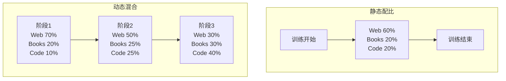

### 4.4 课程学习（Curriculum Learning）

课程学习的核心思想是：**模仿人类学习的顺序，先学简单的、再学难的**。

在数据工程中，课程学习的实现方式：

1. **按难度排序**：使用 perplexity 或其他指标衡量数据难度，训练早期使用低难度数据
2. **按质量排序**：训练早期使用最高质量的数据，后期逐渐加入更多数据
3. **按领域排序**：先在通用数据上训练，后期加入专业领域数据

**Llama 3 的做法**：在训练最后阶段（annealing phase），大幅提高高质量数据的比例，同时降低学习率。这种策略使模型在训练末期进一步提升质量。

---

## 5. 数据处理管线

### 5.1 端到端流程

一条完整的预训练数据处理管线通常包含以下阶段：

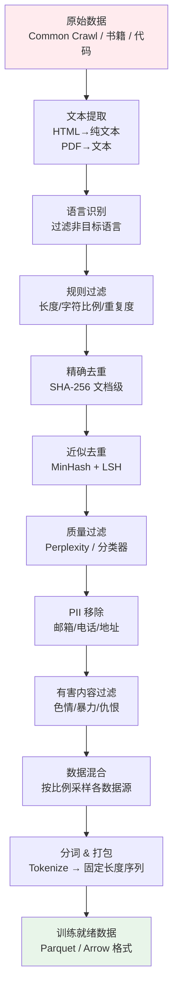

### 5.2 分布式数据处理框架

在工业级数据处理中，单机处理无法应对 TB 级别的数据。常用的分布式框架：

| 框架 | 适用场景 | 特点 |
|------|---------|------|
| Apache Spark | 通用大规模数据处理 | 成熟稳定，生态丰富 |
| Ray Data | ML 工作流 | Python 原生，与 Ray 生态集成 |
| Dask | 科学计算 | 类 Pandas API，易上手 |
| datatrove | 专用于 LLM 数据 | HuggingFace 开源，轻量 |

**datatrove**（HuggingFace）是一个专为 LLM 数据处理设计的框架，提供了模块化的管线组件：

```python
# datatrove 管线示例（概念代码）
from datatrove.pipeline import Pipeline
from datatrove.pipeline.readers import WARCReader
from datatrove.pipeline.filters import LengthFilter, LanguageFilter
from datatrove.pipeline.dedup import MinHashDedup

pipeline = Pipeline([
    WARCReader("s3://commoncrawl/..."),  # 读取 WARC 文件
    LengthFilter(min_length=100),         # 长度过滤
    LanguageFilter(language="en"),         # 语言过滤
    MinHashDedup(n_grams=5, num_hashes=128),  # MinHash 去重
])
```

### 5.3 数据格式

| 格式 | 特点 | 适用场景 |
|------|------|---------|
| JSON Lines | 每行一个 JSON 对象 | 流式处理、中间结果 |
| Parquet | 列式存储、高压缩率 | 大规模存储、分析查询 |
| Arrow | 内存列式格式、零拷贝 | 进程间传递、快速读取 |
| TFRecord | TensorFlow 原生 | Google 生态 |
| MDS (Mosaic) | 流式训练优化 | MosaicML 训练框架 |

**最佳实践**：

1. 中间处理结果用 **JSON Lines**：可读性好，方便调试
2. 最终存储用 **Parquet**：压缩率高，读取快
3. 训练时用 **Arrow / memory-mapped**：零拷贝，高性能

---

## 6. 工业级数据 Pipeline 实践

本节汇总 Google、DeepSeek 及开源社区在大规模数据管线上的实际经验，帮助读者从"教科书式清洗"过渡到"工业级管线"。

### 6.1 Google C4 / PaLM 数据管线

**C4 数据集的完整构建流程**：

C4（Colossal Clean Crawled Corpus）是 Google 为 T5 模型构建的标杆数据集。它从 Common Crawl 出发，经过以下五步清洗管线：

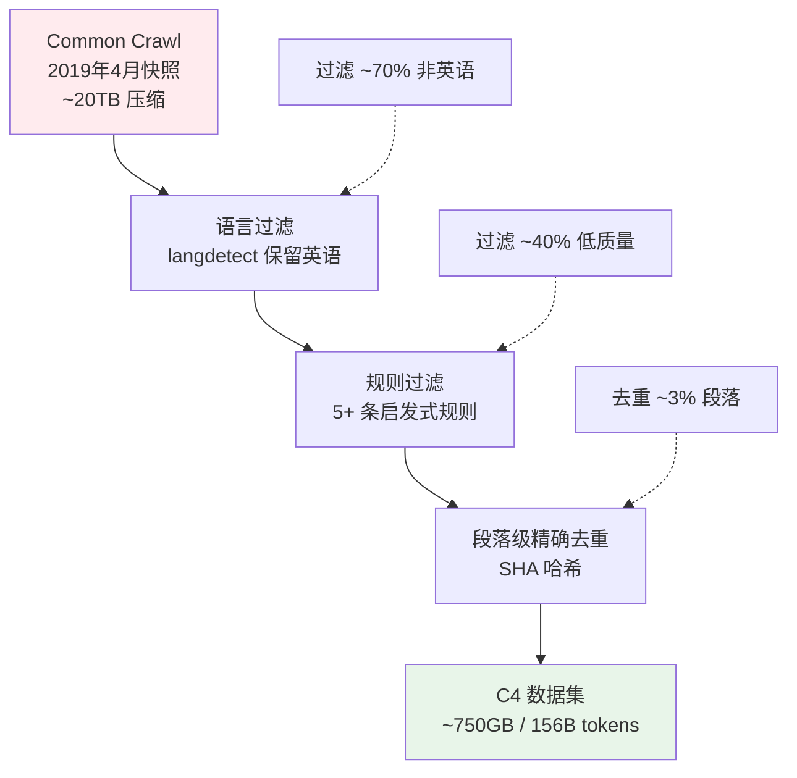

**PaLM 的数据混合比例**：

PaLM（540B 参数）的数据混合策略是业界披露最详细的方案之一。其独特之处在于**对话数据占据了 50%**：

| 数据源 | 比例 | tokens 量 | 主要贡献 |
|--------|------|-----------|---------|
| 社交媒体对话 | 50% | 390B | 对话能力、最新知识 |
| 网页过滤文档 | 27% | 211B | 通用知识、事实覆盖 |
| 书籍 | 13% | 101B | 长文理解、叙事连贯性 |
| GitHub 代码 | 5% | 39B | 编程能力、逻辑推理 |
| Wikipedia | 4% | 31B | 事实知识、结构化写作 |
| 新闻 | 1% | 8B | 时事知识 |

**Google 的多语言数据处理策略**：

PaLM 覆盖 122 种语言，但对不同资源水平的语言采用差异化策略：

- **高资源语言**（英语、中文、法语等）：严格质量过滤 + 多层去重
- **中等资源语言**（韩语、泰语等）：中等过滤，优先保证数据量
- **低资源语言**（部分非洲/南亚语言）：几乎不做过滤，优先覆盖

### 6.2 DeepSeek 的数据实践

**DeepSeek-V2/V3 技术报告中披露的数据细节**：

DeepSeek 采用"英文为主 + 中文为辅 + 代码加重"的数据策略：

| 模型 | 总训练量 | 中文 | 英文 | 代码 | 其他 |
|------|---------|------|------|------|------|
| DeepSeek-LLM 7B | 2T tokens | ~12% | ~56% | ~20% | ~12% |
| DeepSeek-V2 | 8.1T tokens | ~15% | ~50% | ~25% | ~10% |
| DeepSeek-V3 | 14.8T tokens | 未公开 | 未公开 | 未公开 | 未公开 |

**代码数据的特殊处理**：

DeepSeek 对代码数据的处理远比普通文本复杂：

1. **文件级 vs 仓库级组织**：保留仓库结构信息，让模型学习文件间的依赖关系
2. **质量过滤信号**：仓库 Star 数、文件大小、注释比例、是否可被 AST 解析
3. **代码去重**：使用 AST 级别的去重（先规范化变量名和格式，再做哈希去重），比纯文本 MinHash 更精确
4. **覆盖面**：DeepSeek-Coder-V2 覆盖 338 种编程语言

**数学数据的增强**：

DeepSeek 在数学能力上的突破与数据工程密切相关：

- 从 arXiv 论文中提取数学推导（需要 LaTeX 解析和公式结构化）
- 从数学教科书中提取习题和证明
- 使用模型生成合成数学推理数据（详见 advanced.md 中的合成数据章节）
- V3 的数学数据比 V2 增加了约 3 倍

### 6.3 开源数据集：RedPajama / SlimPajama / FineWeb

开源社区在大规模数据集构建上做出了重要贡献：

**RedPajama**（Together AI, 2023）：

首个完整复现 Llama 1 训练数据配比的开源数据集，总量 1.2T tokens。它证明了即使不依赖私有数据，也能获得可比的模型性能。

**SlimPajama**（Cerebras, 2023）：

在 RedPajama 的基础上进行更彻底的去重和清洗，**将数据量从 1.2T 缩减到 627B tokens（减少了 49%），但训练出的模型性能反而更好**。这是"质量 > 数量"的有力证据。

**FineWeb**（HuggingFace, 2024）：

FineWeb 是目前最大的高质量开源 Web 数据集（15T tokens），其核心创新在于**基于教育价值的质量过滤**：

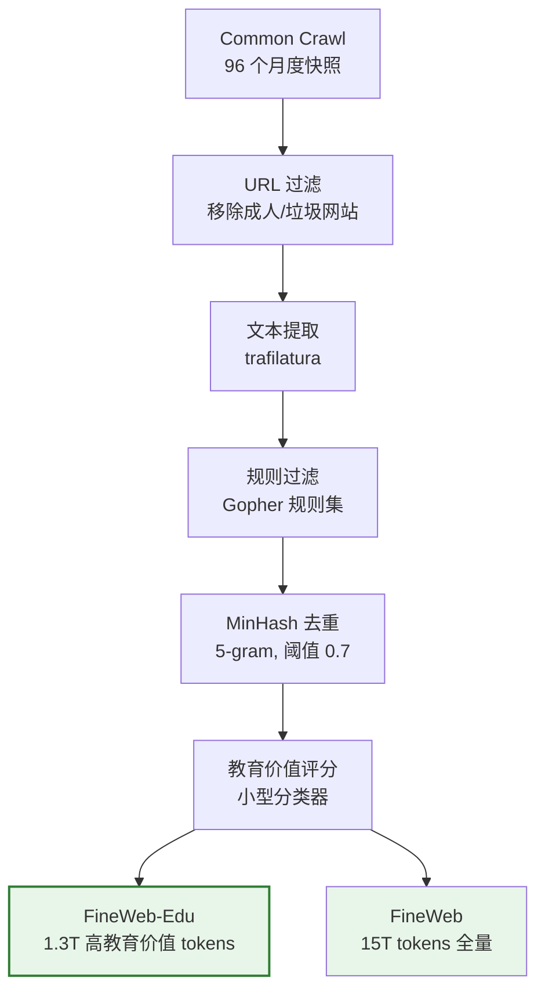

FineWeb-Edu 的关键洞察：用 Llama-3-70B 标注约 500K 文档的"教育价值"（1-5 分），然后训练一个小型分类器（基于 Llama-3-8B），对全量数据进行评分。只保留教育价值 >= 3 分的文档，得到 FineWeb-Edu 子集。实验证明，**在这 1.3T 高教育价值 tokens 上训练的模型性能优于在全量 15T tokens 上训练的模型**。

### 6.4 数据配比的影响与自动优化

**不同数据源对不同能力的贡献**：

| 数据源 | 提升的能力 | 可能削弱的能力 |
|--------|-----------|--------------|
| 代码数据 | 逻辑推理、数学能力、代码生成 | 创意写作（如果比例过高） |
| 书籍数据 | 长文理解、叙事能力、深度推理 | 短问答效率 |
| 对话数据 | 对话能力、指令遵循 | 严谨学术表达 |
| Wikipedia | 事实知识、结构化写作 | （通常无负面影响） |
| 学术论文 | 学术推理、专业知识 | 口语化表达 |

**DoReMi 方法：自动学习最优数据配比**：

DoReMi（Xie et al., 2023）提出了一种数据混合优化方法，核心思想是：

1. 训练一个小型**代理模型**（proxy model）
2. 通过 minimax 优化找到最优域权重 $\alpha$：

$$\min_{\alpha} \max_{j} \mathbb{E}_{x \sim D_j}\left[\frac{P_\alpha(x)}{P_{\text{ref}}(x)}\right]$$

3. 将学到的权重 $\alpha$ 应用到大模型训练中

实验表明，DoReMi 自动发现的配比在下游任务上优于人工调优的配比，且不需要任何下游任务信息。

---

## 7. Google 的数据工程实践

### 7.1 C4 数据集

C4（Colossal Clean Crawled Corpus）是 Google 为 T5 模型构建的数据集，成为了数据清洗的标杆。

**清洗流程**：

1. 从 Common Crawl 2019 年 4 月的快照开始（约 20TB）
2. **语言过滤**：使用 langdetect 保留英语文档
3. **规则过滤**：
   - 移除包含 "bad words" 的页面
   - 移除 < 3 个句子的页面
   - 移除不以标点结尾的行
   - 移除包含 JavaScript 的行
4. **精确去重**：段落级去重，而非文档级
5. 最终得到约 **750GB** 纯文本（约 156B tokens）

**C4 的影响**：

C4 开创了"公开数据集 + 标准清洗流程"的范式，后续的 RefinedWeb、FineWeb 等都在 C4 的基础上进行改进。

### 7.2 PaLM 的数据混合

PaLM（540B 参数）使用了精心设计的数据混合：

| 数据源 | 比例 | tokens 数 |
|--------|------|----------|
| 社交媒体对话 | 50% | 390B |
| 网页过滤文档 | 27% | 211B |
| 书籍 | 13% | 101B |
| GitHub 代码 | 5% | 39B |
| Wikipedia | 4% | 31B |
| 新闻 | 1% | 8B |

**关键决策**：对话数据占据了 50%，这使得 PaLM 在对话和问答任务上表现优异。

### 7.3 Gemma 的数据处理

Gemma 在数据处理上的主要创新：

1. **更严格的质量过滤**：使用多层级的质量分类器
2. **安全过滤**：专门的安全分类器过滤有害内容
3. **数据去污染**：确保训练数据与评估 benchmark 不重叠
4. **多语言处理**：对非英语数据有专门的清洗流程

---

## 8. DeepSeek 的数据策略

### 8.1 中英文数据配比

DeepSeek 作为中国团队，面临中英文数据平衡的独特挑战：

- **DeepSeek-V2**：中文和英文数据的比例约为 12% : 56%，其余为代码和多语言数据
- **策略**：英文数据优先保证质量（主要来自清洗后的 Web 数据），中文数据注重覆盖度

### 8.2 代码数据的处理

DeepSeek 高度重视代码数据，其 DeepSeek-Coder 系列模型专门在大量代码上训练：

1. **多语言代码**：覆盖 87 种编程语言
2. **代码质量过滤**：基于仓库 star 数、文件大小、注释比例等
3. **代码结构保留**：去重时使用 AST（抽象语法树）级别的去重，而非简单文本去重

### 8.3 数据质量迭代

DeepSeek 采用迭代式的数据质量提升策略：

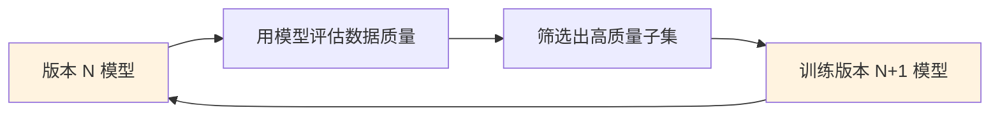

这种"数据飞轮"机制使得每一代模型都能受益于更好的数据。

---

## 9. Anthropic 的数据理念

> 注意：Anthropic 对训练数据的具体细节披露较少。以下内容基于已公开的论文和技术报告，推测性内容会明确标注。

### 9.1 HH-RLHF 数据集

Anthropic 公开的最重要数据贡献是 **HH-RLHF**（Helpful and Harmless RLHF）数据集，虽然主要用于对齐阶段而非预训练，但其设计理念深刻影响了数据工程实践。

**设计理念**：
- **Helpful**：模型应该尽可能帮助用户
- **Harmless**：模型不应产生有害输出
- 这两个目标之间存在张力，需要精心平衡

### 9.2 安全数据筛选

Anthropic 在安全领域的核心方法论是 **Constitutional AI (CAI)**，其中数据筛选是关键环节：

1. **红队测试（Red Teaming）**：主动生成可能引发有害输出的 prompt
2. **宪法原则**：用一组明确的原则指导数据的筛选和评估
3. **自我改进**：让模型自己评估和修正输出，形成高质量的训练数据

### 9.3 合成数据在安全训练中的应用

[推测性内容] Anthropic 在安全对齐中大量使用合成数据：

- 使用模型自身生成有害场景的正面和负面示例
- 通过 Constitutional AI 流程对合成数据进行过滤和标注
- 这种方法比人工标注更可扩展，且能覆盖更多的有害场景

---

## 10. 大规模去重技术详解

第 3.1 节介绍了 MinHash + LSH 的基本原理。本节进一步讨论工业界在万亿 token 级别数据上进行去重的更多技术细节和工程挑战。

### 10.1 精确去重 vs 近似去重的适用场景

| 方法 | 适用场景 | 优势 | 局限 |
|------|---------|------|------|
| 精确去重（SHA 哈希） | 完全相同的文档/段落 | 速度快、无误判 | 无法处理微小差异 |
| 近似去重（MinHash + LSH） | 高度相似但不完全相同的文档 | 捕获"转载改写"类重复 | 有假阳性/假阴性 |
| Suffix Array 去重 | 精确子串级重复检测 | 发现跨文档的重复段落 | 内存消耗大、实现复杂 |
| SimHash | 大规模近似文档检测 | 可以用 Hamming 距离快速比较 | 精度不如 MinHash |

**实际工业管线通常组合使用**：先用精确去重移除完全相同的文档（成本最低），再用近似去重处理高度相似的文档。

### 10.2 MinHash + LSH 参数选择的深入分析

回顾 LSH 的候选对概率公式：

$$P(\text{candidate} \mid s) = 1 - (1 - s^r)^b$$

其中 $s$ 为真实 Jaccard 相似度，$r$ 为每个带的行数，$b$ 为带数，签名长度 $k = b \times r$。

**阈值近似公式**：S 型曲线的拐点（阈值）大约在：

$$t \approx \left(\frac{1}{b}\right)^{1/r}$$

**参数选择的工程权衡**：

| 需求 | 参数调整方向 | 影响 |
|------|------------|------|
| 更高召回率（不漏掉重复） | 增大 $b$（更多带），减小 $r$ | 阈值降低，假阳性增加 |
| 更高精确率（不误杀） | 减小 $b$，增大 $r$ | 阈值升高，假阴性增加 |
| 更低计算开销 | 减小签名长度 $k$ | 估计精度下降 |
| 更低存储开销 | 用更小的哈希值（uint16 代替 uint32） | 哈希碰撞概率上升 |

**典型工业参数**：

- **FineWeb**：5-gram shingles, 128 个哈希函数, $b=14, r\approx9$, 阈值 $\approx 0.7$
- **SlimPajama**：5-gram, 128 hashes, $b=9, r\approx14$, 阈值 $\approx 0.8$
- **CCNet (Meta)**：5-gram, 128 hashes, 阈值 0.8

### 10.3 Suffix Array 去重

Google 在训练 Chinchilla 时使用了**基于 Suffix Array 的精确子串去重**（Lee et al., 2022），这是一种比 MinHash 更激进的去重方式。

**核心思想**：

Suffix Array 是一个字符串的所有后缀按字典序排列的索引数组。通过构建整个语料库（拼接所有文档）的 Suffix Array，可以快速找到**任意长度的重复子串**。

**工作流程**：

1. **拼接语料**：将所有文档拼接为一个长字符串，文档之间插入特殊分隔符
2. **构建 Suffix Array**：对拼接后的字符串构建后缀数组（$O(n)$ 时间，$n$ 为总字符数）
3. **计算 LCP Array**：最长公共前缀数组（Longest Common Prefix），用于发现重复子串
4. **标记重复**：如果某个子串在多个文档中出现且长度超过阈值（如 100 字符），标记为重复
5. **移除重复段落**：移除包含过多重复子串的文档

**Suffix Array vs MinHash 对比**：

| 维度 | MinHash + LSH | Suffix Array |
|------|---------------|-------------|
| 检测粒度 | 文档级（整体相似度） | 子串级（段落/句子级） |
| 能发现的重复类型 | 高度相似的文档 | 任意位置的精确重复子串 |
| 时间复杂度 | $O(nkL)$ | $O(n)$ 构建 + $O(n)$ 搜索 |
| 空间复杂度 | $O(nk)$（签名存储） | $O(n)$（但常数大，约 12-20 字节/字符） |
| 适用规模 | 数十亿文档 | 数百 GB 文本（受内存限制） |

### 10.4 规模化挑战

在万亿 token（TB 级原始文本）的规模下，去重面临严峻的工程挑战：

**内存瓶颈**：
- MinHash 签名存储：10 亿文档 $\times$ 128 哈希 $\times$ 4 字节 = **512 GB** 仅存储签名
- Suffix Array：1TB 文本 $\times$ 12 字节/字符 $\approx$ **12 TB** 索引

**分布式去重策略**：

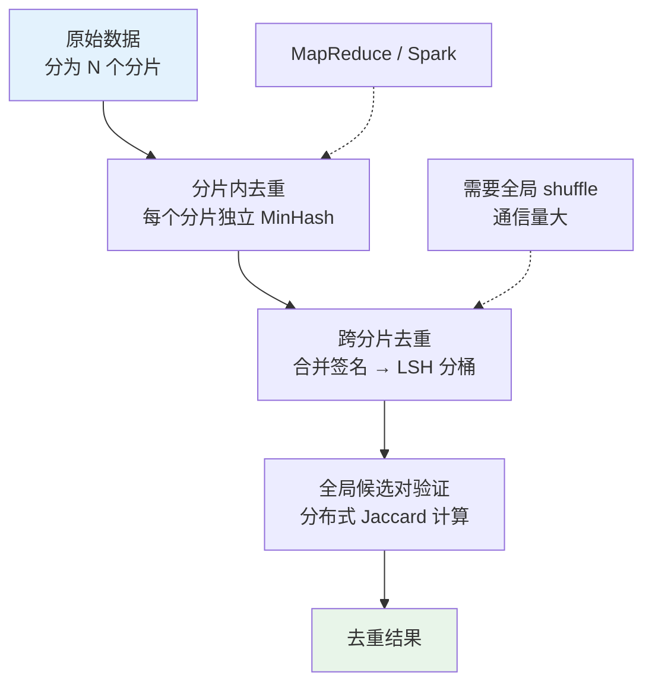

**实际做法**：
- **分批次去重**：先在每个 Common Crawl 快照内去重，再跨快照去重
- **分片并行**：将数据按 URL 域名或哈希值分片，相同分片内独立处理
- **渐进式去重**：新数据与已有数据库比对，增量更新
- **近似加速**：降低签名长度（如从 128 降到 64），牺牲少量精度换取 2 倍速度提升

---

## 11. 项目实践

### 项目 1：实现 MinHash 近似去重（⭐⭐ 进阶）

**目标**：从零实现完整的 MinHash + LSH 近似去重算法。

**算法推导回顾**：

1. 将文档转化为 n-gram 集合
2. 使用 $k$ 个哈希函数计算 MinHash 签名
3. 将签名分为 $b$ 个带，每带 $r$ 行
4. 在同一桶中的文档成为候选对
5. 对候选对计算精确 Jaccard 相似度
6. 相似度超过阈值的文档标记为重复

**完整参考实现**：

```python
import hashlib
import struct
from collections import defaultdict
from typing import List, Set, Tuple

# 最大哈希值（32 位无符号整数）
MAX_HASH = (1 << 32) - 1
MERSENNE_PRIME = (1 << 61) - 1


def get_shingles(text: str, n: int = 5) -> Set[str]:
    """将文本转换为 n-gram 集合"""
    words = text.lower().split()
    if len(words) < n:
        return {text.lower()}
    return {' '.join(words[i:i+n]) for i in range(len(words) - n + 1)}


def generate_hash_functions(num_hashes: int, seed: int = 42):
    """生成哈希函数的参数 (a, b)"""
    import random
    rng = random.Random(seed)
    params = []
    for _ in range(num_hashes):
        a = rng.randint(1, MERSENNE_PRIME - 1)
        b = rng.randint(0, MERSENNE_PRIME - 1)
        params.append((a, b))
    return params


def minhash_signature(shingles: Set[str], hash_params: list) -> List[int]:
    """计算 MinHash 签名"""
    signature = [MAX_HASH] * len(hash_params)

    for shingle in shingles:
        # 将 shingle 哈希为整数
        h = int(hashlib.md5(shingle.encode('utf-8')).hexdigest()[:8], 16)

        for i, (a, b) in enumerate(hash_params):
            # 通用哈希函数: h_i(x) = (a * x + b) % p
            val = (a * h + b) % MERSENNE_PRIME
            if val < signature[i]:
                signature[i] = val

    return signature


def lsh_buckets(
    signatures: dict,
    num_bands: int,
    rows_per_band: int
) -> List[Tuple[int, int]]:
    """LSH 分桶，返回候选对"""
    buckets = defaultdict(set)
    doc_ids = list(signatures.keys())

    for doc_id in doc_ids:
        sig = signatures[doc_id]
        for band_idx in range(num_bands):
            start = band_idx * rows_per_band
            end = start + rows_per_band
            band = tuple(sig[start:end])

            # 用 (band_idx, band_hash) 作为桶的 key
            bucket_key = (band_idx, hash(band))
            buckets[bucket_key].add(doc_id)

    # 从桶中提取候选对
    candidates = set()
    for bucket_docs in buckets.values():
        doc_list = list(bucket_docs)
        for i in range(len(doc_list)):
            for j in range(i + 1, len(doc_list)):
                candidates.add((doc_list[i], doc_list[j]))

    return list(candidates)


def jaccard_similarity(set_a: Set, set_b: Set) -> float:
    """计算精确的 Jaccard 相似度"""
    if not set_a and not set_b:
        return 1.0
    intersection = len(set_a & set_b)
    union = len(set_a | set_b)
    return intersection / union if union > 0 else 0.0


def minhash_dedup(
    documents: dict,
    num_hashes: int = 128,
    num_bands: int = 16,
    threshold: float = 0.8,
    n_gram: int = 5
) -> List[int]:
    """
    完整的 MinHash + LSH 去重流程

    Args:
        documents: {doc_id: text} 字典
        num_hashes: 哈希函数数量
        num_bands: LSH 带数
        threshold: Jaccard 相似度阈值
        n_gram: n-gram 的 n 值

    Returns:
        需要保留的文档 ID 列表
    """
    rows_per_band = num_hashes // num_bands
    hash_params = generate_hash_functions(num_hashes)

    # 步骤 1: 计算每个文档的 shingles 和 MinHash 签名
    shingles = {}
    signatures = {}
    for doc_id, text in documents.items():
        shingles[doc_id] = get_shingles(text, n_gram)
        signatures[doc_id] = minhash_signature(shingles[doc_id], hash_params)

    # 步骤 2: LSH 分桶，找到候选对
    candidates = lsh_buckets(signatures, num_bands, rows_per_band)

    # 步骤 3: 对候选对计算精确 Jaccard，标记重复
    duplicates = set()
    for doc_a, doc_b in candidates:
        if doc_a in duplicates or doc_b in duplicates:
            continue
        sim = jaccard_similarity(shingles[doc_a], shingles[doc_b])
        if sim >= threshold:
            # 保留较长的文档，移除较短的
            if len(documents[doc_a]) >= len(documents[doc_b]):
                duplicates.add(doc_b)
            else:
                duplicates.add(doc_a)

    # 返回保留的文档
    return [doc_id for doc_id in documents if doc_id not in duplicates]
```

**学习要点**：
- MinHash 签名的长度（哈希函数数量 $k$）控制估计精度
- LSH 的 $b$ 和 $r$ 参数控制检测阈值和召回率
- 实际系统中需要考虑内存优化（如使用 uint16 或 uint32 存储签名）

---

### 项目 2：构建一个小型数据清洗管线（⭐⭐ 进阶）

**目标**：构建一条完整的数据清洗管线，将原始文本处理为可用于训练的高质量数据。

**管线框架**：

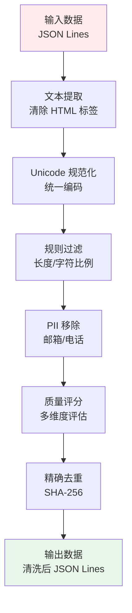

**各阶段的实现思路**：

1. **文本提取**：使用正则表达式或 `BeautifulSoup` 去除 HTML 标签
2. **Unicode 规范化**：NFKC 规范化 + 零宽字符移除
3. **规则过滤**：实现 5-8 条规则（长度、字符比例、重复行等）
4. **PII 移除**：正则表达式匹配邮箱、电话等
5. **质量评分**：综合多个指标给出 0-1 的质量分数
6. **精确去重**：SHA-256 哈希去重

**关键代码片段 -- 管线编排**：

```python
class DataPipeline:
    """数据清洗管线"""

    def __init__(self, stages: list):
        self.stages = stages

    def process(self, documents: list) -> list:
        """逐阶段处理文档"""
        for stage in self.stages:
            documents = [stage(doc) for doc in documents if doc is not None]
            documents = [doc for doc in documents if doc is not None]
            print(f"  阶段 '{stage.__class__.__name__}': "
                  f"剩余 {len(documents)} 条文档")
        return documents

# 使用
pipeline = DataPipeline([
    HTMLExtractor(),
    UnicodeNormalizer(),
    RuleFilter(min_length=100, max_special_ratio=0.3),
    PIIRemover(),
    QualityScorer(min_score=0.5),
    ExactDeduplicator(),
])

clean_data = pipeline.process(raw_data)
```

**评估方法**：
- 记录每个阶段过滤掉的文档数和比例
- 人工抽样检查过滤和保留的文档是否合理
- 对比清洗前后数据的统计特征（平均长度、语言分布等）

---

### 项目 3：分析数据混合比例对模型质量的影响（⭐⭐⭐ 挑战）

**目标**：通过实验验证不同数据混合比例如何影响语言模型的性能。

**实验设计**：

1. **数据源准备**：
   - Web 文本（如 OpenWebText 子集）
   - 百科知识（如 Wikipedia 子集）
   - 代码（如 CodeParrot 子集）
   - 书籍文本（如 BookCorpus 子集）

2. **配比方案**：
   - 方案 A：Web 80%, 其他各 ~7%
   - 方案 B：均匀混合，各 25%
   - 方案 C：Web 50%, Code 30%, Wiki 10%, Books 10%

3. **评估维度**：
   - 通用语言理解（如 MMLU 子集或 HellaSwag 子集）
   - 代码生成（如 HumanEval 简化版）
   - 事实知识（如 TriviaQA 子集）
   - 训练 loss 曲线对比

**实验伪代码**：

```
对于每种配比方案 mix_ratio:
    1. 按 mix_ratio 采样训练数据集（如 1B tokens）
    2. 训练一个小型 GPT 模型（如 125M 参数）
       - 固定所有超参数，只改变数据
    3. 在多个 benchmark 上评估
    4. 记录训练 loss 曲线

分析:
    - 绘制各配比方案在不同任务上的雷达图
    - 分析代码数据比例与推理能力的关系
    - 讨论"领域过拟合"现象
```

**参考论文**：
- Xie et al. (2023). *DoReMi: Optimizing Data Mixtures by Reweighting*.
- Longpre et al. (2023). *The Flan Collection: Designing Data for Instruction Tuning*.

---

### 项目 4：实现基于 perplexity 的质量过滤（⭐⭐ 进阶）

**目标**：使用预训练语言模型计算文档的 perplexity，实现模型驱动的质量过滤。

**思路**：

1. 加载一个轻量级预训练模型（如 GPT-2 small 或 KenLM）
2. 对每个文档计算 perplexity
3. 设置合理的 perplexity 区间，过滤过高和过低的文档
4. 分析不同质量档次的文档特征

**关键代码 -- 使用 GPT-2 计算 perplexity**：

```python
import torch
from transformers import GPT2LMHeadModel, GPT2Tokenizer
import math

def compute_perplexity(text: str, model, tokenizer, max_length: int = 512) -> float:
    """计算文本的 perplexity"""
    encodings = tokenizer(text, return_tensors='pt',
                          truncation=True, max_length=max_length)
    input_ids = encodings.input_ids

    with torch.no_grad():
        outputs = model(input_ids, labels=input_ids)
        neg_log_likelihood = outputs.loss

    return math.exp(neg_log_likelihood.item())

# 使用
model = GPT2LMHeadModel.from_pretrained('gpt2')
tokenizer = GPT2Tokenizer.from_pretrained('gpt2')

# 质量分档
ppl = compute_perplexity(document, model, tokenizer)
if ppl < 30:
    quality = "极高（可能是过于简单/重复的文本）"
elif ppl < 200:
    quality = "高"
elif ppl < 500:
    quality = "中"
else:
    quality = "低（可能是乱码或非自然文本）"
```

**参考论文**：
- Wenzek et al. (2020). *CCNet: Extracting High Quality Monolingual Datasets from Web Crawl Data*.
- Brown et al. (2020). *Language Models are Few-Shot Learners*. (GPT-3 数据筛选部分)

---

### 项目 5：数据质量评估 Pipeline（⭐⭐ 进阶）

**目标**：构建一个自动化的数据质量评估工具，对网页文本数据进行多维度打分，输出综合质量评估报告。

**背景**：在工业级数据管线中，"数据质量"不是一个单一维度的概念。一个文档可能语言流畅（低 perplexity）但内容重复（高 n-gram 重复率），也可能信息密度高但包含有害内容。本项目要求设计一个多维度评估框架。

**评估维度**：

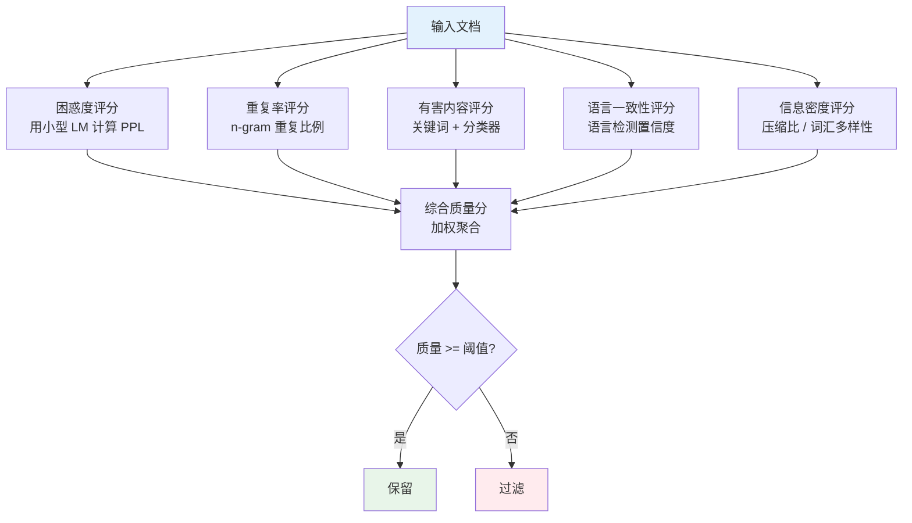

**关键提示**：

1. **困惑度计算**：使用 GPT-2 Small 或 KenLM（5-gram 语言模型）计算每个文档的 perplexity。参考第 3.2.2 节的实现
2. **n-gram 重复率**：计算文档内 10-gram 的重复比例，高重复率通常意味着广告或模板页面
3. **信息密度**：可以用 gzip 压缩比来近似。`信息密度 = len(gzip(text)) / len(text)`，高压缩比（低信息密度）通常是低质量文本
4. **综合评分**：设计加权公式，不同维度可以有不同权重
5. **可视化**：绘制各维度的分布直方图，帮助选择过滤阈值

**思考题**：
- 如何定义"高质量"数据？对于一个通用语言模型和一个代码模型，"高质量"的定义相同吗？
- 如果你的评估工具把一篇高度专业的物理学论文判为"低质量"（因为 perplexity 极高），你会怎么处理？
- 各评估维度之间是否存在相关性？如何处理维度间的冗余？

**参考**：
- FineWeb 的教育价值评分方法
- DCLM 的数据质量评估框架

---

## 12. 本章小结

### 核心知识点

1. **数据质量 > 数据数量**：Phi-1 用 7B tokens 高质量数据超越了 300B tokens 训练的模型
2. **Chinchilla Scaling Laws**：模型参数和训练数据应等比例增长，$C \approx 6ND$
3. **MinHash + LSH**：近似去重的核心算法，通过签名压缩和分桶策略将 $O(n^2)$ 降为近线性
4. **Jaccard 无偏估计**：$\hat{J} = \frac{1}{k}\sum \mathbb{1}[\text{MinHash}_{h_i}(A) = \text{MinHash}_{h_i}(B)]$ 是 $J(A,B)$ 的无偏估计
5. **质量过滤三层次**：规则过滤（快速粗筛）→ 模型过滤（perplexity）→ 有害内容过滤（安全）
6. **数据混合**：不同数据源的配比直接影响模型能力分布

### 数学要点

- Jaccard 相似度：$J(A, B) = |A \cap B| / |A \cup B|$
- MinHash 估计定理：$\Pr[\text{MinHash}_h(A) = \text{MinHash}_h(B)] = J(A, B)$
- 无偏性证明：$\mathbb{E}[\hat{J}] = J(A, B)$，$\text{Var}(\hat{J}) = J(1-J)/k$
- LSH 候选概率：$P(\text{candidate} \mid s) = 1 - (1 - s^r)^b$
- Perplexity：$\text{PPL} = \exp\left(-\frac{1}{T}\sum_t \log P(x_t \mid x_{<t})\right)$

### 实践要点

1. 数据清洗是迭代过程：从粗到细，逐步提升质量
2. 规则过滤应放在最前面：计算代价最低，过滤掉最明显的噪声
3. MinHash 签名长度（$k$）和 LSH 参数（$b, r$）需要根据数据特点调整
4. Perplexity 过滤需要注意阈值选择：过高和过低的 perplexity 都应被过滤
5. 数据混合比例对模型能力有显著影响：代码数据能提升推理能力
6. 完整代码见 `code/data_engineering/` 目录

---

## 13. 过渡：从数据到训练

至此，我们已经走完了数据工程的全流程：从 Common Crawl 的海量原始数据出发，经过文本提取、规则过滤、MinHash + LSH 近似去重、质量评分、PII 脱敏和有害内容过滤，最终得到高质量的训练数据集。

**但数据准备只是预训练的起点**。接下来的三个模块将回答以下核心问题：

- **模块 8A（预训练目标）**：我们有了数据，但应该设计怎样的训练目标？Next Token Prediction 为什么足以产生智能？除了 NTP，还有 MLM、FIM 等目标各有什么优劣？
- **模块 8B（Scaling Laws）**：给定一笔固定的计算预算，应该训练多大的模型、用多少数据？Chinchilla 定律告诉我们，本章讨论的数据量与模型参数量之间有最优的配比关系。
- **模块 8C（训练工程）**：万事俱备，如何启动训练？优化器选择、学习率调度、断点续训、Loss Spike 处理等工程细节，决定了训练能否成功跑完。

**数据质量是 LLM 能力的上限，而训练工程决定了能否逼近这个上限。**

---

## 参考资料

### 论文

1. Hoffmann et al. (2022). *Training Compute-Optimal Large Language Models*. (Chinchilla)
2. Lee et al. (2022). *Deduplicating Training Data Makes Language Models Better*.
3. Wenzek et al. (2020). *CCNet: Extracting High Quality Monolingual Datasets from Web Crawl Data*.
4. Raffel et al. (2020). *Exploring the Limits of Transfer Learning with a Unified Text-to-Text Transformer*. (C4/T5)
5. Gunasekar et al. (2023). *Textbooks Are All You Need*. (Phi-1)
6. Xie et al. (2023). *DoReMi: Optimizing Data Mixtures by Reweighting*.
7. Penedo et al. (2024). *The FineWeb Datasets: Decanting the Web for the Finest Text Data at Scale*.
8. Li et al. (2024). *DataComp for Language Models*. (DCLM)
9. Broder (1997). *On the Resemblance and Containment of Documents*. (MinHash 原始论文)
10. Bai et al. (2022). *Training a Helpful and Harmless Assistant*. (Anthropic HH-RLHF)
11. Chowdhery et al. (2023). *PaLM: Scaling Language Modeling with Pathways*.
12. Together AI (2023). *RedPajama: An Open Dataset for Training Large Language Models*.
13. Soboleva et al. (2023). *SlimPajama: A 627B Token Cleaned and Deduplicated Version of RedPajama*.
14. DeepSeek-AI (2024). *DeepSeek-V2: A Strong, Economical, and Efficient MoE Language Model*.
15. DeepSeek-AI (2024). *DeepSeek-V3 Technical Report*.

### 博客与资源

1. [Common Crawl](https://commoncrawl.org/) - 公开 Web 爬取数据
2. [datatrove](https://github.com/huggingface/datatrove) - HuggingFace 的 LLM 数据处理框架
3. [The Pile](https://pile.eleuther.ai/) - EleutherAI 的开源训练数据集
4. [FineWeb](https://huggingface.co/datasets/HuggingFaceFW/fineweb) - HuggingFace 的高质量 Web 数据集
5. [RedPajama-Data](https://github.com/togethercomputer/RedPajama-Data) - Together AI 的开源数据管线
6. [SlimPajama](https://huggingface.co/datasets/cerebras/SlimPajama-627B) - Cerebras 的去重版数据集

---

**下一章预告**：[模块8a: 预训练目标](../08a_pretraining_objectives/README.md) - 深入分析语言模型的预训练目标设计，从 CLM 到 MLM，从单 token 预测到多 token 预测。
