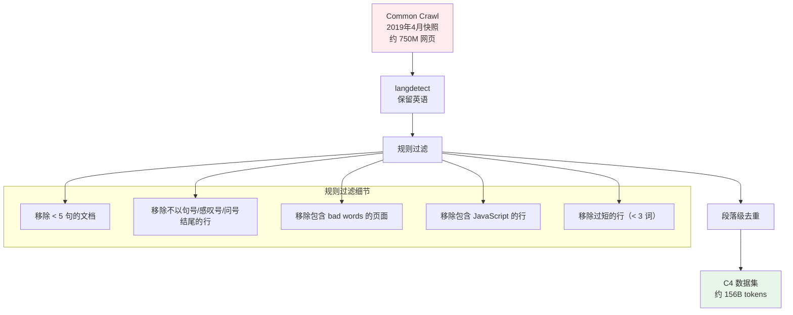
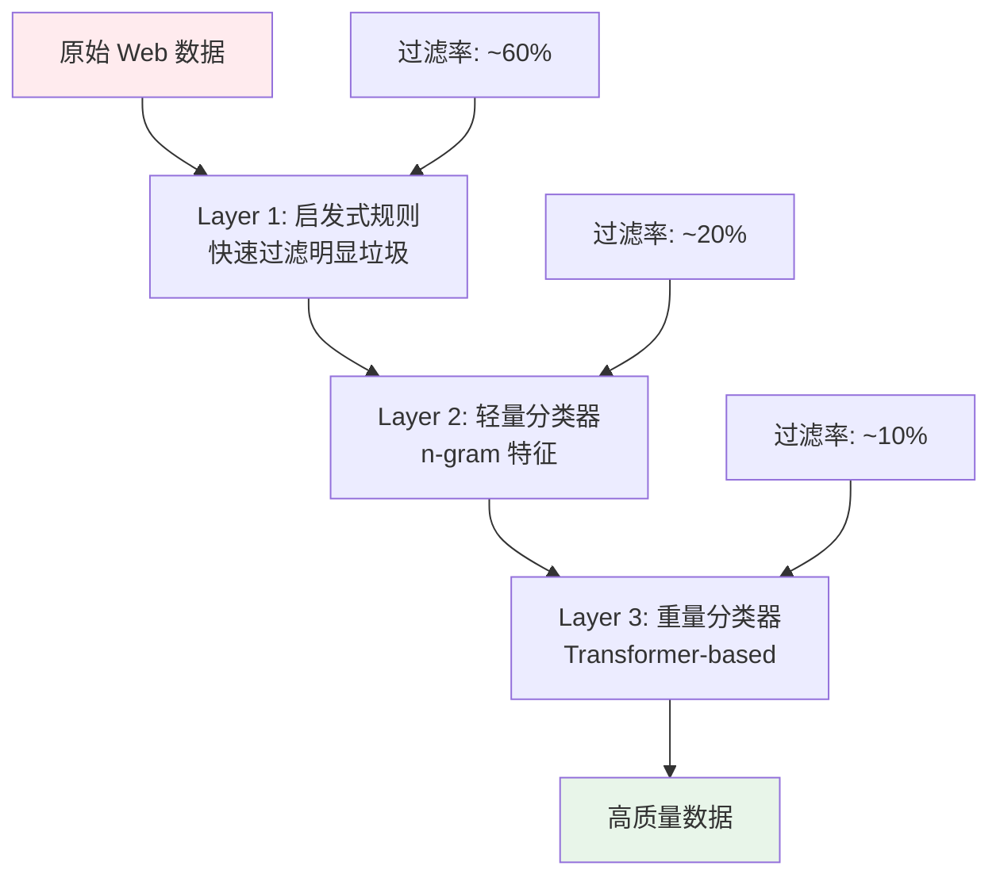
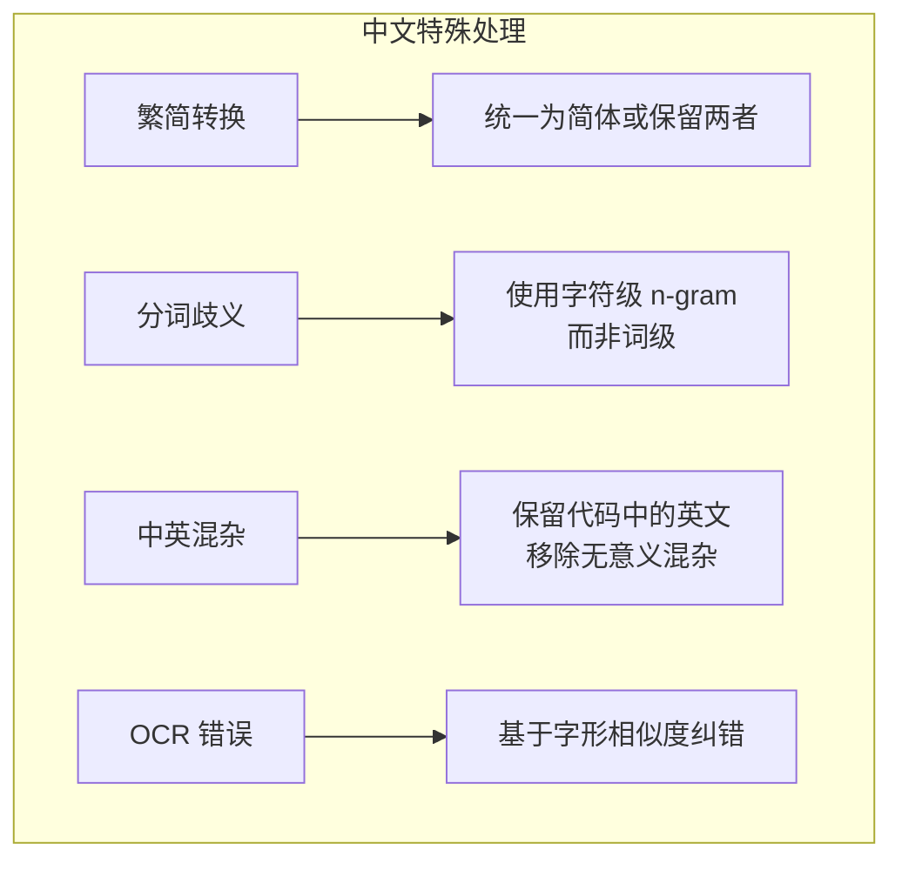
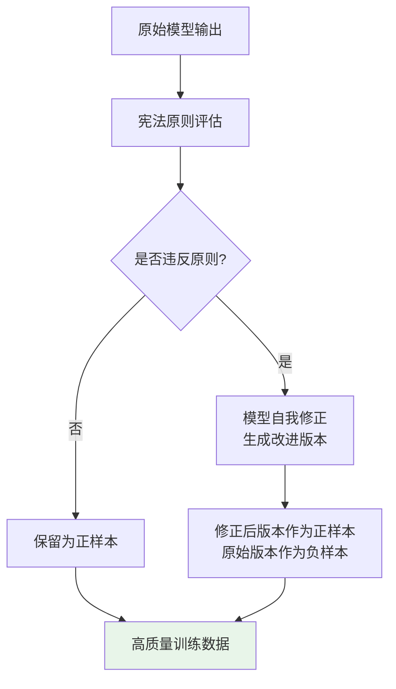
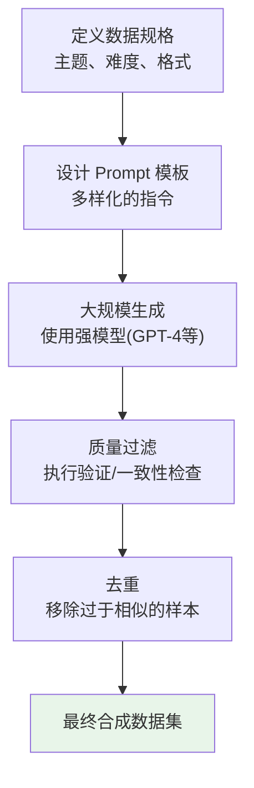
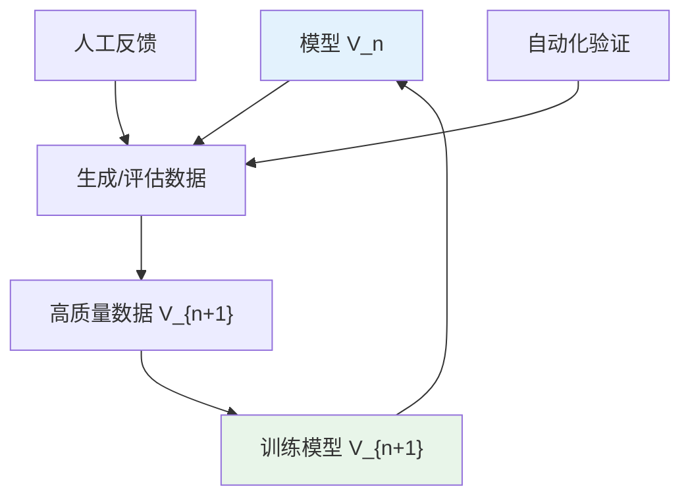

# 数据工程进阶：工业实践与前沿研究

> 本文是 [模块7: 数据工程 -- 预训练数据管线](./README.md) 的进阶补充，深入分析 Google、DeepSeek、Anthropic 三条技术线在数据工程上的工业实践，以及数据领域的前沿研究方向。

---

## 目录

- [1. Google 的数据工程](#1-google-的数据工程)
- [2. DeepSeek 的数据策略](#2-deepseek-的数据策略)
- [3. Anthropic 视角](#3-anthropic-视角)
- [4. 前沿话题](#4-前沿话题)
- [5. 合成数据与数据增强](#5-合成数据与数据增强)
- [6. 数据治理与合规](#6-数据治理与合规)

---

## 1. Google 的数据工程

### 1.1 C4 数据集的构建方法论

C4（Colossal Clean Crawled Corpus）由 Google 为 T5 模型构建（Raffel et al., 2020），是第一个系统性的大规模清洗数据集，成为后续数据工程的标杆。

**完整清洗流程**：



**C4 的规则过滤代码逻辑（简化版）**：

```python
def c4_heuristic_filter(text: str, bad_words: set) -> bool:
    """
    C4 启发式过滤规则
    返回 True 表示保留
    """
    lines = text.split('\n')
    filtered_lines = []

    for line in lines:
        line = line.strip()
        # 规则 1: 跳过过短的行
        if len(line.split()) < 3:
            continue
        # 规则 2: 行必须以标点结尾
        if not line[-1] in '.!?':
            continue
        # 规则 3: 不含 JavaScript
        if 'javascript' in line.lower():
            continue
        filtered_lines.append(line)

    # 规则 4: 文档至少 5 个有效句子
    if len(filtered_lines) < 5:
        return False

    # 规则 5: 不含 bad words
    text_lower = ' '.join(filtered_lines).lower()
    for word in bad_words:
        if word in text_lower:
            return False

    return True
```

**C4 的局限性**：

后续研究（Dodge et al., 2021）发现 C4 存在以下问题：

1. **英语中心**：只保留英语文档，限制了多语言应用
2. **过度过滤**：一些有效的 bad word 过滤规则移除了大量关于少数群体的合法讨论
3. **段落级去重不足**：文档级仍有大量重复
4. **时效性**：使用单一时间快照，缺乏时间多样性

### 1.2 PaLM 的数据混合策略

PaLM（Chowdhery et al., 2023）在数据混合上做出了几个关键决策：

**对话数据占据 50%**：

这是 PaLM 最独特的数据决策。Google 认为社交媒体上的对话数据（虽然质量参差不齐）为模型提供了：

1. **对话能力**：自然的问答和讨论模式
2. **多样性**：覆盖日常话题、专业讨论、幽默等多种语体
3. **最新知识**：社交媒体内容更新频繁

**代码数据的深度清洗**：

PaLM 的 GitHub 代码数据经过以下处理：

| 步骤 | 方法 |
|------|------|
| 许可证过滤 | 只使用开源许可的仓库 |
| 质量过滤 | 过滤自动生成的代码、配置文件 |
| 去重 | 文件级精确去重 + 仓库级近似去重 |
| 编程语言均衡 | 下采样过多的 JavaScript/HTML |

**多语言数据处理**：

PaLM 覆盖了 122 种语言，但对各语言的处理策略不同：

- **高资源语言**（英语、中文等）：使用严格的质量过滤
- **中等资源语言**（韩语、泰语等）：使用较宽松的过滤，保证数据量
- **低资源语言**（部分非洲语言等）：几乎不做过滤，优先保证覆盖

### 1.3 Gemma 的数据处理细节

Gemma（Team Gemma, 2024）在数据处理上强调了几个方面：

**多层级质量过滤器**：



**数据去污染（Decontamination）**：

Gemma 特别注重确保训练数据与评估 benchmark 不重叠：

1. 收集所有主流评估数据集（MMLU, GSM8K, HumanEval 等）
2. 对训练数据进行 n-gram 匹配检测
3. 移除与评估集高度重叠的文档
4. 使用 10-gram 匹配，阈值为 70% 重叠即移除

这一步骤对于评估结果的可信度至关重要，但在许多开源模型中常被忽略。

---

## 2. DeepSeek 的数据策略

### 2.1 中英文数据配比的挑战

DeepSeek 面临的核心挑战是：**如何在中英文之间找到最优平衡**。

**配比演变**：

| 模型 | 中文比例 | 英文比例 | 代码比例 | 其他 |
|------|---------|---------|---------|------|
| DeepSeek-LLM 7B | ~12% | ~56% | ~20% | ~12% |
| DeepSeek-V2 | ~15% | ~50% | ~25% | ~10% |
| DeepSeek-V3 | 未公开 | 未公开 | 未公开 | 未公开 |

**关键决策的考量**：

1. **英文数据质量更高**：英文 Web 数据经过更多清洗工具和方法的验证
2. **中文数据量相对不足**：高质量中文数据远少于英文
3. **跨语言迁移**：英文数据训练的能力可以部分迁移到中文
4. **代码数据的推理效应**：代码数据不仅提升编程能力，还提升逻辑推理能力

**中文数据的特殊处理**：

中文文本处理面临独特挑战：



### 2.2 代码数据的处理方法

DeepSeek-Coder 系列在代码数据处理上做出了多项创新：

**编程语言覆盖**：

DeepSeek-Coder-V2 覆盖 338 种编程语言，远超大多数竞品。但不同语言的数据量和质量差异极大：

| 语言类别 | 代表语言 | 处理策略 |
|---------|---------|---------|
| 高资源 | Python, Java, JavaScript | 严格质量过滤 + 去重 |
| 中等资源 | Go, Rust, Swift | 中等过滤 + 适度上采样 |
| 低资源 | Haskell, Erlang, Julia | 轻量过滤 + 显著上采样 |

**代码质量信号**：

DeepSeek 使用多维度信号评估代码质量：

1. **仓库级信号**：Star 数、Fork 数、活跃度
2. **文件级信号**：文件大小（过大可能是自动生成的）、注释比例
3. **内容级信号**：是否包含有效的函数/类定义、测试代码比例
4. **AST 可解析性**：能否被正确解析为抽象语法树

**代码去重的特殊方法**：

普通的 MinHash 文本去重对代码效果不佳，因为代码的结构性更强。DeepSeek 使用 AST 级别的去重：

```python
# 概念示例：AST 级别的代码去重
def ast_normalize(code: str, language: str) -> str:
    """
    将代码规范化为 AST 表示，去除:
    - 变量名差异
    - 空白格式差异
    - 注释差异
    """
    # 1. 解析为 AST
    # 2. 将变量名替换为标准化名称 (var1, var2, ...)
    # 3. 序列化为标准字符串
    # 4. 在标准化后的字符串上进行哈希去重
    pass
```

### 2.3 数据质量评估的迭代优化

DeepSeek 的数据工程采用**模型驱动的迭代优化**策略：

**第一代：规则驱动**

使用手工设计的规则进行初步过滤，获得基本可用的训练数据。

**第二代：模型辅助**

用第一代数据训练的模型反过来评估数据质量：


**第三代：合成增强**

用高质量模型生成合成训练数据，补充自然数据的不足：

1. 使用 DeepSeek-V2 生成数学推理数据
2. 使用 DeepSeek-Coder 生成代码+注释配对数据
3. 生成的数据经过严格验证后加入训练集

这种"数据飞轮"机制使得每一代模型和数据互相提升。

---

## 3. Anthropic 视角

> 说明：Anthropic 对预训练数据的披露极少。本节内容主要基于 Anthropic 已发表的论文和公开信息，推测性内容会明确标注。

### 3.1 HH-RLHF 数据集的设计理念

HH-RLHF（Helpful and Harmless RLHF）数据集（Bai et al., 2022）是 Anthropic 公开的最重要数据贡献。虽然它主要用于 RLHF 对齐阶段，但其设计理念对整个数据工程领域有重要启发。

**核心设计原则**：

| 原则 | 含义 | 数据工程启示 |
|------|------|-------------|
| Helpful | 模型应最大化帮助用户 | 训练数据应覆盖多样化的用户需求 |
| Harmless | 模型不应产生有害输出 | 训练数据需过滤有害内容 |
| Honest | 模型应诚实表达不确定性 | 训练数据不应包含虚假信息 |

**数据收集过程**：

1. 人类标注员与模型进行对话
2. 标注员评估每个回复的 helpful 和 harmless 程度
3. 对于同一个 prompt，收集"chosen"和"rejected"两种回复
4. 形成偏好数据对，用于训练奖励模型

**数据规模**：

- 约 169K 对话轮次（训练集）
- 涵盖多种对话场景：信息查询、任务辅助、闲聊、敏感话题等

### 3.2 安全数据筛选的方法论

Anthropic 的 Constitutional AI（CAI）框架（Bai et al., 2022b）提出了一种独特的数据安全方法：

**宪法原则（Constitutional Principles）**：

Anthropic 定义了一组明确的原则来指导模型的行为：

1. 不帮助人类从事危险活动
2. 不生成歧视性内容
3. 不泄露个人隐私
4. 诚实承认不确定性
5. ...（更多原则）

**原则驱动的数据筛选**：



**这一方法的创新之处**在于：它不依赖大量人工标注来判断什么是"安全"的，而是让模型基于明确的原则进行自我评估和改进。这使得安全数据的生产具有可扩展性。

### 3.3 合成数据在安全训练中的应用

[推测性内容] 基于 Anthropic 的公开论文推断，合成数据在 Anthropic 的训练管线中扮演重要角色：

**合成数据的三种用途**：

1. **安全对齐数据**：使用 CAI 流程生成的自我评估/修正数据
2. **红队测试数据**：模型自动生成可能引发有害输出的攻击 prompt
3. **能力增强数据**：[推测] 用高能力模型生成推理链、代码解释等数据

**合成数据的质量控制**：

[推测] Anthropic 可能使用以下策略确保合成数据质量：

- **多模型交叉验证**：用多个模型互相评估合成数据
- **人工抽样审核**：对关键类别的合成数据进行人工检查
- **下游任务评估**：通过模型性能验证合成数据的有效性

### 3.4 Anthropic 对预训练数据的可能策略

[高度推测性内容 -- 以下基于行业实践和 Anthropic 的公开立场推断]

1. **负责任的数据使用**：Anthropic 强调 AI 安全，可能在数据收集中有更严格的伦理标准
2. **多层安全过滤**：可能使用比行业平均更严格的有害内容过滤
3. **数据多样性**：为了减少偏见，可能特别注重数据的人口统计学和文化多样性
4. **透明度承诺**：Anthropic 的 Responsible Scaling Policy 可能要求对训练数据有更高的可审计性

---

## 4. 前沿话题

### 4.1 合成数据的规模化生产

**Textbooks Are All You Need**（Gunasekar et al., 2023）是合成数据领域的里程碑工作。

**核心发现**：

用 GPT-3.5 生成的"教科书级"编程数据（约 1B tokens），训练出的 1.3B 参数模型 Phi-1，在 HumanEval 上达到 50.6%，超越了用 300B tokens 自然数据训练的更大模型。

**合成数据的生产流程**：



**合成数据的优势**：

1. **可控性**：可以精确控制数据的难度、主题、格式
2. **可扩展性**：不受自然数据量的限制
3. **质量可控**：可以通过自动化验证确保质量
4. **安全性**：不包含个人隐私等敏感信息

**合成数据的风险**：

1. **模型坍塌（Model Collapse）**：用模型 A 生成数据训练模型 B，B 的多样性会下降
2. **分布偏移**：合成数据的分布与自然数据不同，可能导致 OOD 问题
3. **错误放大**：如果生成模型有系统性错误，这些错误会被传播
4. **多样性损失**：生成模型倾向于产生"安全"的、模式化的输出

**缓解策略**：

- 使用多个不同的生成模型
- 在合成数据中混合自然数据
- 通过执行/验证确保代码/数学数据的正确性
- 监控合成数据训练模型的分布变化

### 4.2 数据质量的量化评估方法

如何客观衡量一个数据集的"质量"？这是一个活跃的研究方向。

**维度一：内在质量指标**

| 指标 | 定义 | 衡量什么 |
|------|------|---------|
| Perplexity 分布 | 用参考模型计算的 PPL | 文本流畅度和自然度 |
| 词汇多样性 | Type-Token Ratio (TTR) | 文本的词汇丰富程度 |
| 重复率 | n-gram 重复比例 | 文本的冗余程度 |
| 信息密度 | 压缩比（gzip 等） | 每字节的信息量 |

**维度二：外在质量指标**

| 指标 | 方法 | 衡量什么 |
|------|------|---------|
| 下游任务性能 | 用数据训练模型后的 benchmark 分数 | 数据对模型能力的贡献 |
| 数据影响函数 | 移除/添加数据后的性能变化 | 单条数据的边际贡献 |
| 课程学习曲线 | 不同排序下的学习效率 | 数据的"教学价值" |

**DSIR（Data Selection with Importance Resampling）** (Xie et al., 2023b)：

DSIR 提出了一种自动化的数据选择方法：

1. 定义目标分布（如高质量数据的 n-gram 分布）
2. 计算每条数据相对于目标分布的重要性权重
3. 按重要性权重重新采样

$$w(x) = \frac{p_{\text{target}}(x)}{p_{\text{source}}(x)}$$

其中 $p_{\text{target}}$ 和 $p_{\text{source}}$ 分别是目标和源分布的估计。

### 4.3 数据飞轮：模型生成 -> 数据筛选 -> 再训练

数据飞轮是现代 LLM 开发中最重要的概念之一：**模型和数据互相改进，形成正反馈循环**。



**飞轮的三个关键环节**：

1. **数据生成**：使用当前模型生成训练数据（合成数据）
2. **数据筛选**：使用当前模型评估和筛选数据（无论自然数据还是合成数据）
3. **模型训练**：在筛选后的数据上训练下一代模型

**实际案例**：

- **DeepSeek**：使用 V1 模型评估数据质量 -> 筛选高质量数据 -> 训练 V2 模型
- **Meta（Llama）**：Llama 2 生成的 SFT 数据用于训练 Llama 3
- **Microsoft（Phi）**：GPT-3.5/4 生成教科书数据 -> 训练 Phi-1/2/3

**飞轮的理论限制**：

Shumailov et al. (2023) 提出了"模型坍塌"（Model Collapse）理论：

$$\text{如果} \quad D_{n+1} = f(M_n), \quad M_{n+1} = \text{Train}(D_{n+1})$$

则随着迭代次数增加，模型的输出分布会逐渐收窄（尾部分布消失），最终退化为生成高频模式。

**解决方案**：
- 每一代都混合一定比例的原始自然数据
- 限制合成数据的占比（如不超过 50%）
- 监控分布多样性指标，及时预警

### 4.4 数据污染检测

**数据污染**（Data Contamination）是指评估数据（benchmark）出现在训练数据中，导致评估结果虚高。

**为什么这是个严重问题？**

如果模型在训练中"见过"评估题目的答案，它的高分并不代表真正的泛化能力。这会误导研究方向和实际应用。

**检测方法**：

**方法一：n-gram 重叠检测**

最直接的方法，检查训练集和评估集之间的 n-gram 重叠：

```python
def detect_contamination(
    train_text: str,
    eval_text: str,
    n: int = 10
) -> float:
    """
    n-gram 重叠检测
    返回评估文本中被训练数据覆盖的 n-gram 比例
    """
    # 提取训练集的 n-gram 集合
    train_words = train_text.split()
    train_ngrams = set()
    for i in range(len(train_words) - n + 1):
        train_ngrams.add(tuple(train_words[i:i+n]))

    # 检测评估集中的 n-gram 是否出现在训练集中
    eval_words = eval_text.split()
    total = 0
    contaminated = 0
    for i in range(len(eval_words) - n + 1):
        ngram = tuple(eval_words[i:i+n])
        total += 1
        if ngram in train_ngrams:
            contaminated += 1

    return contaminated / total if total > 0 else 0.0
```

**方法二：GPT-4 辅助检测**

GPT-4 的技术报告中使用了一种创新的方法：

1. 给模型提供评估样本的前 $k$ 个 token
2. 让模型补全后续内容
3. 如果模型的补全与真实样本高度匹配，说明可能存在污染

**方法三：成员推断攻击（Membership Inference Attack）**

通过模型对特定样本的 loss 分布来判断该样本是否在训练集中：

- 训练数据的 loss 通常低于非训练数据
- 通过 loss 阈值或统计检验来判断"成员身份"

**行业现状与建议**：

| 模型 | 去污染方法 | 覆盖的评估集 |
|------|----------|-------------|
| GPT-4 | n-gram + 补全检测 | 所有公开 benchmark |
| Llama 3 | 10-gram 重叠 | MMLU, GSM8K 等 |
| Gemma | n-gram 匹配 | 主流 benchmark |
| DeepSeek-V2 | 未详细说明 | 核心 benchmark |

**建议**：

1. **训练前去污染**：在构建训练集时主动移除与评估集重叠的内容
2. **训练后检测**：训练完成后检测残留的污染
3. **使用新评估集**：定期创建新的评估集，避免旧评估集被纳入训练
4. **报告透明性**：在论文中明确说明去污染方法和结果

---

## 5. 合成数据与数据增强

### 5.1 LLM 生成合成数据的方法

随着 LLM 能力的提升，使用模型生成合成训练数据成为了一种重要的数据增强手段。目前主流的合成数据生成方法包括：

**Self-Instruct**（Wang et al., 2023）：

让 LLM 自己生成 instruction-following 数据：


核心思想是用少量人工种子指令（seed instructions）引导模型自动生成更多的指令-回答对。Stanford Alpaca 就是用 Self-Instruct + GPT-3.5 生成了 52K 条指令数据。

**Evol-Instruct**（Xu et al., 2023 -- WizardLM）：

对已有指令进行"进化"，逐步增加复杂度：

1. **深度进化**：给简单问题增加约束条件、多步推理、专业领域知识
2. **广度进化**：改变问题类型（如把分类问题改为生成问题）
3. **淘汰**：移除无法回答或重复的指令

Evol-Instruct 的关键洞察是：**指令的复杂度分布对模型能力有显著影响**。仅用简单指令训练的模型无法处理复杂任务，而 Evol-Instruct 自动生成了难度梯度丰富的指令集。

### 5.2 合成数据在预训练 vs 微调中的不同作用

| 应用阶段 | 合成数据的作用 | 典型案例 | 风险 |
|---------|-------------|---------|------|
| 预训练 | 补充特定领域数据不足（数学、代码） | Phi-1（教科书级代码数据） | 分布偏移、多样性损失 |
| SFT 微调 | 生成指令-回答对 | Alpaca、WizardLM | 模型偏差被放大 |
| RLHF/DPO | 生成偏好对（chosen/rejected） | Constitutional AI | 奖励模型过拟合 |
| 推理增强 | 生成推理链和验证数据 | DeepSeek-R1（自我进化） | 错误推理被强化 |

### 5.3 模型坍缩（Model Collapse）风险

当合成数据循环使用时，存在**模型坍缩**的严重风险（Shumailov et al., 2023）。

**直觉理解**：如果你复印一份文件，然后复印那个复印件，再复印复印件的复印件......每次复印都会损失一些细节。经过多次迭代，最终只剩下最粗糙的特征。

**数学描述**：

设模型 $M_n$ 在数据 $D_n$ 上训练，$D_{n+1}$ 由 $M_n$ 生成：

$$D_{n+1} = \text{Sample}(M_n), \quad M_{n+1} = \text{Train}(D_{n+1})$$

随着 $n \to \infty$，模型的输出分布逐渐退化：
- **尾部消失**：低频但重要的模式在每次迭代中丢失
- **模式坍塌**：模型趋向于只生成高频的"安全"输出
- **多样性下降**：最终分布可能退化为少数几个模式的混合

**缓解策略**：
- 每一代都混合一定比例的**原始自然数据**（至少 30-50%）
- 限制合成数据的迭代轮数（通常不超过 2-3 轮）
- 使用**多个不同的生成模型**，避免单一偏差
- 监控分布多样性指标（如 Type-Token Ratio, n-gram 多样性）

### 5.4 Google 和 DeepSeek 在合成数据上的实践

**Google 的合成数据使用**：

Google 在合成数据上相对保守，但在特定领域有重要应用：
- **Minerva**（2022）：使用 PaLM 生成数学推理数据，提升数学能力
- **Code generation**：使用模型生成代码-注释对，提升代码理解能力
- **Gemini** [推测]：可能使用了大量合成多模态数据

**DeepSeek 的合成数据策略**：

DeepSeek 在合成数据上更加激进：
- **数学数据**：使用 DeepSeek-V2 生成数学推理步骤，经验证后加入训练集
- **代码数据**：使用 DeepSeek-Coder 生成代码+文档配对数据
- **推理数据**：DeepSeek-R1 的训练大量依赖自我生成的推理链数据
- **数据飞轮**：V1 → V2 → V3 的每一代都在前一代模型生成的数据基础上改进

---

## 6. 数据治理与合规

### 6.1 训练数据的版权问题

LLM 训练数据的版权问题是一个尚未完全解决的法律难题：

**核心争议**：

1. **合理使用（Fair Use）**：在美国法律下，用于研究和技术创新的数据使用可能属于合理使用，但边界模糊
2. **版权侵犯指控**：多家出版商和作者已对 OpenAI、Meta 等公司提起诉讼，指控未经授权使用其作品
3. **生成与记忆**：如果模型能够逐字输出训练数据中的版权内容，这更可能构成侵权

**各方应对策略**：

| 机构 | 策略 |
|------|------|
| OpenAI | 主张合理使用 + 与部分出版商签订授权协议 |
| Meta/Llama | 使用公开可获取的数据 + 提供 opt-out 机制 |
| Google | 与出版商合作 + 使用自有数据（YouTube, Search 等） |
| BigCode/The Stack | 只使用宽松许可证代码 + 提供开发者 opt-out |
| Anthropic | [推测] 强调负责任的数据使用，具体策略未公开 |

### 6.2 个人信息脱敏处理

训练数据中的个人可识别信息（PII）必须被检测和移除：

**常见 PII 类型及处理方法**：

| PII 类型 | 检测方法 | 替换方式 |
|---------|---------|---------|
| 邮箱地址 | 正则表达式 | `[EMAIL]` |
| 电话号码 | 正则 + 国际号码库 | `[PHONE]` |
| 身份证号 | 正则 + 校验位验证 | `[ID]` |
| 银行卡号 | 正则 + Luhn 校验 | `[CARD]` |
| 物理地址 | NER 命名实体识别 | `[ADDRESS]` |
| 人名 | NER + 人名词典 | `[NAME]` |
| IP 地址 | 正则表达式 | `[IP]` |

**挑战**：
- 正则表达式无法覆盖所有格式变体
- NER 模型在低质量文本上准确率下降
- 某些 PII 与有意义的内容难以分离（如新闻中的公众人物名字）

### 6.3 数据 Provenance 追踪

**数据溯源（Data Provenance）** 是指记录每条训练数据的来源、处理历史和许可信息。

为什么这很重要？

1. **法律合规**：如果收到版权投诉，需要快速定位并移除特定来源的数据
2. **质量追踪**：如果某一批数据导致了模型性能下降，需要追溯来源
3. **可审计性**：Anthropic 等公司的负责任 AI 政策要求数据可审计
4. **Opt-out 机制**：允许数据提供者（如网站所有者、作者）退出训练集

**实践建议**：
- 为每条数据保留元信息：URL、采集时间、处理步骤、许可类型
- 使用数据版本控制系统（如 DVC, HuggingFace Datasets）
- 建立数据移除流程，支持在已有数据集中删除特定来源

### 6.4 开源数据集的许可证问题

| 数据集 | 许可证 | 关键限制 |
|--------|-------|---------|
| Common Crawl | 公开爬取 | 原网页版权归原作者所有 |
| Wikipedia | CC-BY-SA 3.0 | 需要署名 + 相同方式共享 |
| The Stack v2 | 原始代码许可证 | 只包含宽松许可的代码 |
| RedPajama | Apache 2.0 | 商用无限制 |
| FineWeb | ODC-By 1.0 | 需要署名 |
| Books3 | 未授权 | 严格来说是盗版，已被法律挑战 |

**最佳实践**：
- 优先使用许可证明确的数据集
- 对于 Common Crawl，遵循 robots.txt 并提供 opt-out 机制
- 在论文/模型卡中明确列出所有训练数据的来源和许可
- 避免使用法律风险高的数据源（如 Books3）

---

## 总结

数据工程是 LLM 开发中最被低估但最重要的环节之一。三条技术线在数据策略上各有侧重：

| 维度 | Google | DeepSeek | Anthropic |
|------|--------|----------|-----------|
| 核心方法论 | 系统性清洗 + 多层过滤 | 迭代优化 + 数据飞轮 | 安全导向 + 宪法原则 |
| 标志性数据集 | C4, PaLM mix | DeepSeek 多语言混合 | HH-RLHF |
| 独特贡献 | 数据去污染标准 | 中英文平衡策略 | CAI 安全过滤 |
| 合成数据使用 | 有限 | 大量（数据飞轮） | 中等（安全对齐） |
| 开放程度 | 中等 | 中等 | 较低 |

前沿趋势表明：**合成数据的质量控制**、**自动化数据筛选**、**数据污染防护**和**数据治理合规**将是未来数据工程的核心课题。

---

## 参考资料

1. Raffel et al. (2020). *Exploring the Limits of Transfer Learning with a Unified Text-to-Text Transformer*. (C4/T5)
2. Chowdhery et al. (2023). *PaLM: Scaling Language Modeling with Pathways*.
3. Team Gemma (2024). *Gemma: Open Models Based on Gemini Research and Technology*.
4. DeepSeek-AI (2024). *DeepSeek-V2: A Strong, Economical, and Efficient Mixture-of-Experts Language Model*.
5. Bai et al. (2022). *Training a Helpful and Harmless Assistant with RLHF*. (HH-RLHF)
6. Bai et al. (2022b). *Constitutional AI: Harmlessness from AI Feedback*. (CAI)
7. Gunasekar et al. (2023). *Textbooks Are All You Need*. (Phi-1)
8. Shumailov et al. (2023). *The Curse of Recursion: Training on Generated Data Makes Models Forget*.
9. Xie et al. (2023). *DoReMi: Optimizing Data Mixtures by Reweighting*.
10. Xie et al. (2023b). *Data Selection with Importance Resampling*. (DSIR)
11. Dodge et al. (2021). *Documenting Large Webtext Corpora: A Case Study on the Colossal Clean Crawled Corpus*.
12. Wang et al. (2023). *Self-Instruct: Aligning Language Models with Self-Generated Instructions*.
13. Xu et al. (2023). *WizardLM: Empowering Large Language Models to Follow Complex Instructions*. (Evol-Instruct)
14. Together AI (2023). *RedPajama: An Open Dataset for Training Large Language Models*.
15. Soboleva et al. (2023). *SlimPajama: A 627B Token Cleaned and Deduplicated Version of RedPajama*.
16. Penedo et al. (2024). *The FineWeb Datasets: Decanting the Web for the Finest Text Data at Scale*.
