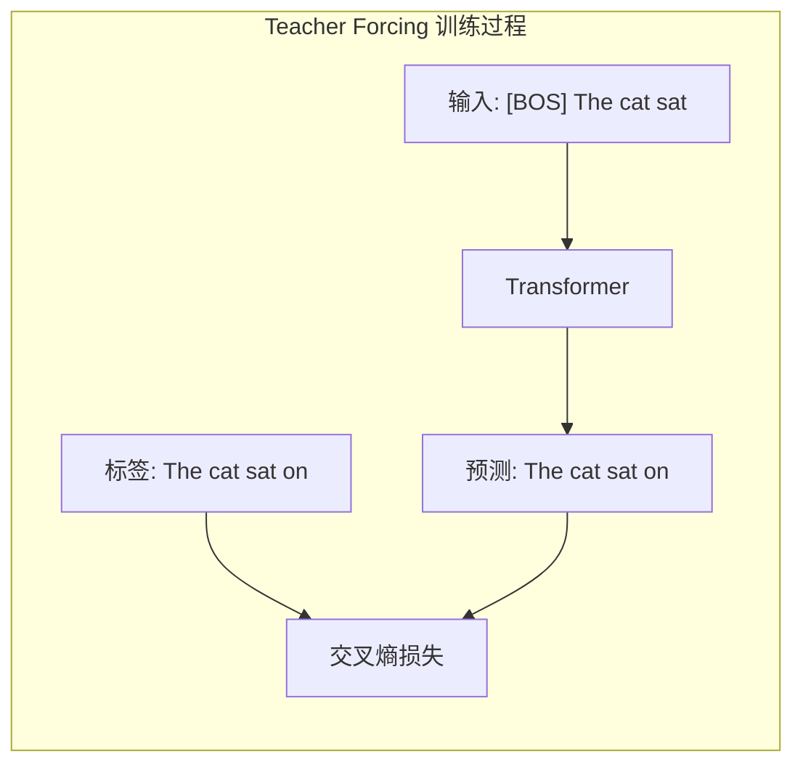
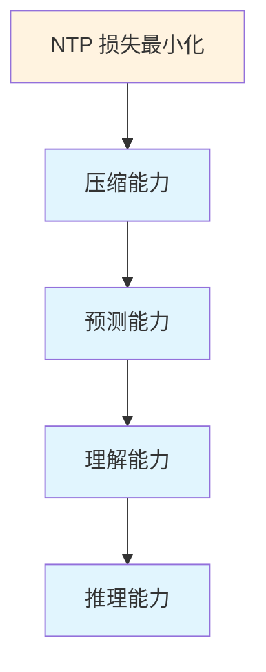
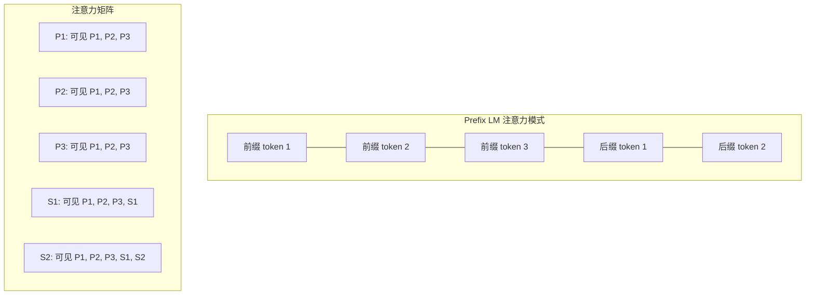
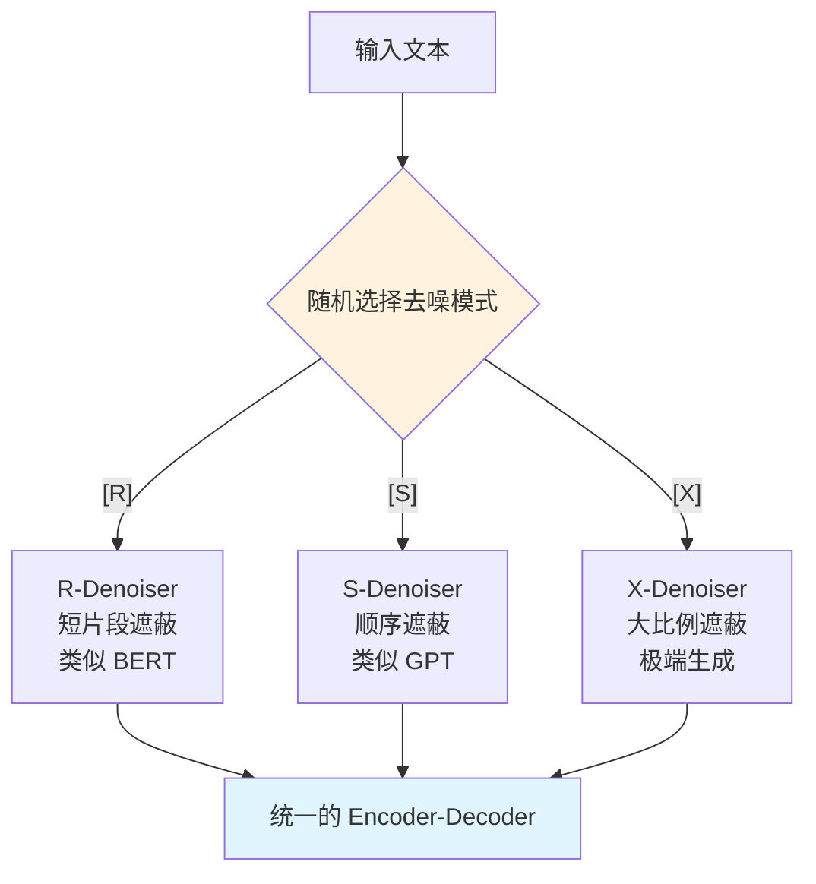
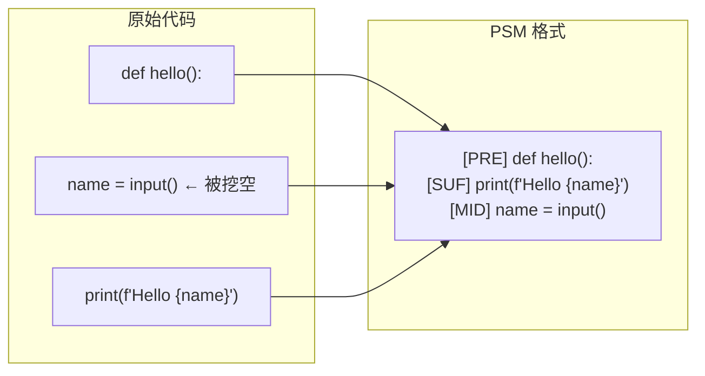
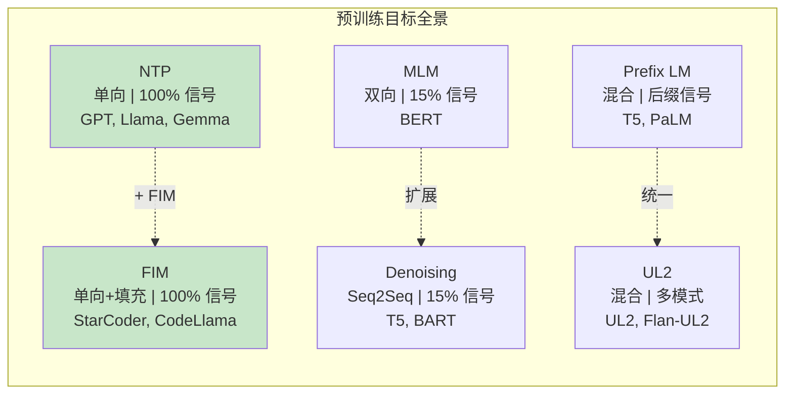
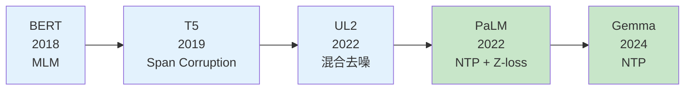
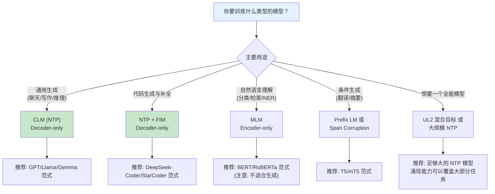

# 模块 8A：预训练（上）— 目标函数与理论基础

> 预训练目标函数是大语言模型的"灵魂"。本章将深入剖析 Next Token Prediction 的数学本质，回答"为什么预测下一个词就能产生智能"这一核心问题，并系统对比 MLM、Prefix LM、UL2、FIM 等多种预训练目标，最终讨论损失函数设计中的工程细节。

---

## 章节定位

本模块是预训练三部曲（8A/8B/8C）的第一部分，聚焦**目标函数的设计与理论基础**。在完成模块 7（分词器与词表）对输入表示的讨论后，我们进入 LLM 训练的核心——"模型应该学什么"。


**学完本模块后，你将能够回答**：
- 为什么"预测下一个 token"就能让模型学会推理、翻译、编程？
- NTP、MLM、FIM 等目标各自适合什么场景？如何选择？
- Label Smoothing 和 Z-loss 为什么能提升训练稳定性？
- PPL 和 BPB 各有什么优缺点？

---

## 目录

- [1. 语言模型的训练目标：Next Token Prediction](#1-语言模型的训练目标next-token-prediction)
- [2. 为什么 NTP 足以产生智能？](#2-为什么-ntp-足以产生智能)
- [3. 其他预训练目标](#3-其他预训练目标)
- [4. Perplexity 的理论与实践](#4-perplexity-的理论与实践)
- [5. 损失函数设计细节](#5-损失函数设计细节)
- [6. 三条技术线的预训练目标选择](#6-三条技术线的预训练目标选择)
- [7. 预训练目标的实际选择指南](#7-预训练目标的实际选择指南)
- [8. 项目实践](#8-项目实践)
- [9. 本章小结](#9-本章小结)

---

## 1. 语言模型的训练目标：Next Token Prediction

### 1.1 核心思想

自回归语言模型的训练目标极其简洁：**给定前面的 token，预测下一个 token**。这就是 Next Token Prediction（NTP）。

**类比**：想象你在做完形填空——但不是随机挖空，而是始终预测"下一个要写的字"。经过海量文本的训练，模型不仅学会了语法和常识，甚至学会了推理、翻译和编程。

形式化地，给定文本序列 $x_1, x_2, \ldots, x_T$，我们利用概率链式法则将联合概率分解为：

$$P(x_1, x_2, \ldots, x_T) = \prod_{t=1}^{T} P(x_t \mid x_{<t})$$

模型参数 $\theta$ 的训练目标是最大化训练数据上的对数似然：

$$\max_\theta \sum_{x \in \mathcal{D}} \sum_{t=1}^{T} \log P_\theta(x_t \mid x_{<t})$$

### 1.2 交叉熵损失

等价地，我们最小化交叉熵损失：

$$\mathcal{L}_{NTP}(\theta) = -\frac{1}{T} \sum_{t=1}^{T} \log P_\theta(x_t \mid x_{<t})$$

其中模型输出的条件概率由 logits 经 Softmax 得到：

$$P_\theta(x_t = w \mid x_{<t}) = \frac{\exp(z_w)}{\sum_{w'=1}^{V} \exp(z_{w'})}$$

$z_w$ 是词汇表中第 $w$ 个 token 对应的 logit 值，$V$ 是词汇表大小。

**为什么是交叉熵？** 交叉熵 $H(p, q) = -\sum_x p(x) \log q(x)$ 衡量的是用分布 $q$（模型）去编码来自分布 $p$（真实数据）的样本时，平均需要的比特数。最小化交叉熵等价于最小化模型分布 $q$ 与真实数据分布 $p$ 之间的 KL 散度：

$$H(p, q) = H(p) + D_{KL}(p \| q)$$

由于 $H(p)$（真实数据的熵）是常数，最小化 $H(p, q)$ 等价于最小化 $D_{KL}(p \| q)$，即让模型分布尽可能接近真实分布。

### 1.3 Teacher Forcing

训练时使用 **Teacher Forcing** 策略：每个时间步的输入使用**真实**的前一个 token，而非模型自己的预测。



**优点**：
- 训练稳定、收敛快——每步都有正确的上下文作为输入
- 支持高效并行：整个序列一次前向传播即可得到所有位置的预测

**缺点**：
- **Exposure Bias（暴露偏差）**：训练时模型看到的是真实 token，推理时看到的是自己的预测。如果模型在某一步预测错误，后续步骤的输入分布就偏离了训练分布。

### 1.4 Softmax 瓶颈

当词汇表很大时（如 128K），Softmax 计算面临挑战：

$$P(x_t = w \mid x_{<t}) = \frac{\exp(z_w)}{\sum_{w'=1}^{V} \exp(z_{w'})}$$

分母需要对所有 $V$ 个 token 求和。这带来两个问题：

**计算瓶颈**：最后的线性层 $W \in \mathbb{R}^{d \times V}$ 需要 $O(dV)$ 的计算量。当 $V = 128K$、$d = 4096$ 时，仅这一层就有 5 亿参数。

**表达力瓶颈**（Yang et al., 2018）：Softmax 输出的 log 概率矩阵的秩受限于 $d$，即：

$$\text{rank}(\log P) \leq d + 1$$

当真实分布的上下文条件概率矩阵秩大于 $d$ 时，模型无法完美拟合。

**工业界的应对策略**：
| 方法 | 原理 | 典型应用 |
|------|------|----------|
| 权重共享（Weight Tying） | 输入嵌入与输出投影共享权重 | GPT-2, Gemma |
| 自适应 Softmax | 将词汇分为高频/低频簇 | 早期语言模型 |
| 增大隐藏维度 $d$ | 提高表达力上限 | 现代 LLM |

---

## 2. 为什么 NTP 足以产生智能？

这是大语言模型最深刻的问题之一：为什么仅仅训练模型"预测下一个 token"，就能涌现出推理、规划、翻译等高级能力？

### 2.1 信息论视角：预测下一个词 = 压缩数据

Shannon（1948）早就指出：**最优预测 = 最优压缩**。

考虑一段文本 $x_1, \ldots, x_T$。如果我们有一个完美的预测模型 $P$，就可以用算术编码（Arithmetic Coding）将这段文本压缩到：

$$\text{编码长度} = -\sum_{t=1}^{T} \log_2 P(x_t \mid x_{<t}) \text{ bits}$$

这恰好就是交叉熵损失（以 2 为底时）！所以：

> **最小化 NTP 损失 = 最大化对数据的压缩能力**

**类比**：想象你在用压缩软件压缩一本书。如果压缩软件"理解"了书的内容——知道情节发展、角色关系、语法规律——它就能更好地预测接下来的内容，从而用更少的比特来表示。一个能把世界上所有文本压缩得最好的程序，必然"理解"了文本中蕴含的所有知识。

### 2.2 压缩即智能（Compression = Intelligence）

这一思想有深厚的理论根基：

#### Solomonoff 归纳推理

Solomonoff（1964）提出了一种理想化的预测框架：对于任何数据序列，最优预测策略是对所有能生成该序列的程序进行加权平均，权重与程序长度成反比：

$$P(x_{n+1} \mid x_1, \ldots, x_n) = \frac{\sum_{p : U(p) = x_1 \ldots x_n x_{n+1}} 2^{-|p|}}{\sum_{p : U(p) = x_1 \ldots x_n \ldots} 2^{-|p|}}$$

其中 $U$ 是通用图灵机，$|p|$ 是程序长度。

**直觉**：更短的程序（更好的压缩）获得更高的权重。这与奥卡姆剃刀原则完全一致——优先选择最简单的解释。

#### Kolmogorov 复杂性与最短描述长度（MDL）

数据 $x$ 的 Kolmogorov 复杂性定义为能输出 $x$ 的最短程序长度：

$$K(x) = \min_{p : U(p) = x} |p|$$

最短描述长度原则（MDL）将模型选择转化为压缩问题：

$$\text{最优模型} = \arg\min_M \left[ L(M) + L(x \mid M) \right]$$

其中 $L(M)$ 是模型描述长度，$L(x \mid M)$ 是数据在模型下的编码长度。这与正则化的思想完全一致。

#### Hutter Prize 的启示

[Hutter Prize](http://prize.hutter1.net/) 悬赏压缩维基百科，其核心信念是：

> "能更好地压缩人类知识的程序 = 更强的人工智能"

实际上，大语言模型正是优秀的文本压缩器。Delétang et al.（2024）的实验表明，Chinchilla 70B 能将数据压缩到一般压缩算法（如 gzip）的 1/4 以下。



### 2.3 Shannon 熵与语言的可预测性

Shannon（1951）通过实验估计英语的熵约为每字符 **1.0-1.5 bits**（理论下限约 0.6-1.3 bits/char）。这意味着：

- 英语有大量的冗余（26 个字母的均匀分布需要 $\log_2 26 \approx 4.7$ bits/char）
- 一个好的语言模型需要从上下文中捕获这些统计规律

现代 LLM 在各种评测上已经接近甚至低于 Shannon 估计的人类熵水平。这表明模型已经学到了与人类相当水平的语言"理解"。

**数学推导**：假设语言的真实分布为 $p$，模型分布为 $q$，则：

$$H(p) \leq H(p, q) = H(p) + D_{KL}(p \| q)$$

当且仅当 $q = p$ 时等号成立。因此，模型的交叉熵越低（越接近真实熵），模型越接近"完美理解"。

### 2.4 从"统计鹦鹉"到"涌现理解"

关于 NTP 是否真正产生"理解"，学术界有激烈的争论：

**"统计鹦鹉"论（Bender et al., 2021）**：
- LLM 只是在统计意义上模拟语言模式
- 没有真正理解语义和世界知识
- 可能放大训练数据中的偏见

**"涌现理解"论（Wei et al., 2022; Bubeck et al., 2023）**：
- 随着模型规模增大，出现了训练目标未直接优化的能力
- 模型展现出 few-shot 推理、代码生成、数学推理等能力
- 这些能力很难仅用"记忆+插值"解释

**一个折中的理解**：NTP 本身不直接等价于"理解"，但在足够大的数据和模型规模下，为了更好地预测下一个 token，模型**不得不**在内部构建对世界的某种模型（world model）。这种内部表示可能构成了某种形式的"理解"。

---

## 3. 其他预训练目标

虽然 NTP 在 Decoder-only 模型中一统天下，但历史上出现过多种预训练目标，它们各有优劣。理解这些目标的设计思想，有助于我们更深刻地理解为什么 NTP 最终胜出。

### 3.1 MLM（Masked Language Modeling）— BERT 系列

#### 核心思想

随机遮蔽输入中的部分 token，让模型根据**双向上下文**来预测被遮蔽的 token。

#### 遮蔽策略（80/10/10 规则）

BERT 随机选择 15% 的 token 进行处理：
- **80%** 替换为 `[MASK]` 特殊标记
- **10%** 替换为随机 token
- **10%** 保持不变


**为什么不全部替换为 [MASK]？**
- 如果全部用 `[MASK]` 替换，微调时模型从未见过 `[MASK]`，导致预训练与微调的输入分布不一致
- 10% 替换为随机 token：迫使模型学会区分真实 token 和干扰 token
- 10% 保持不变：让模型学到直接"复制"正确 token 也是一种合理策略

#### 数学形式

设 $M$ 是被遮蔽的位置集合，$x_{\backslash M}$ 表示除遮蔽位置外的完整上下文：

$$\mathcal{L}_{MLM} = -\sum_{i \in M} \log P(x_i \mid x_{\backslash M})$$

与 NTP 的关键区别：
- NTP 条件依赖 $x_{<t}$（仅左侧上下文）
- MLM 条件依赖 $x_{\backslash M}$（双向上下文，除被遮蔽位置外的所有 token）

#### 优劣分析

| 方面 | MLM | NTP |
|------|-----|-----|
| 上下文方向 | 双向 | 单向（左到右） |
| 每 token 学习效率 | 仅 15% 的 token 产生梯度 | 每个 token 都产生梯度 |
| 自然语言理解 | 强（双向编码） | 稍弱（单向编码） |
| 自然语言生成 | 不擅长 | 天然支持 |
| 训练信号密度 | 低（15%） | 高（100%） |

### 3.2 Prefix LM — T5/PaLM 系列

#### 核心思想

将输入分为两部分：**前缀（prefix）** 使用双向注意力，**后缀（suffix）** 使用因果注意力。



#### 数学框架

设前缀长度为 $L_p$，总长度为 $T$：

$$\mathcal{L}_{PrefixLM} = -\sum_{t=L_p+1}^{T} \log P(x_t \mid x_1, \ldots, x_{L_p}, x_{L_p+1}, \ldots, x_{t-1})$$

注意损失只在后缀部分计算。前缀部分享受双向注意力（更好的编码），但不贡献训练信号。

**与 NTP 的统一**：当 $L_p = 0$ 时，Prefix LM 退化为标准 NTP。

### 3.3 UL2（Unifying Language Learning Paradigms）

UL2（Tay et al., 2023）试图统一不同的预训练范式，其核心创新是 **混合去噪器（Mixture-of-Denoisers）**。

#### 三种去噪器

| 去噪器 | 简写 | 遮蔽比例 | 片段长度 | 对应任务 |
|--------|------|----------|----------|----------|
| Regular Denoiser | R | 15% | 短（3-5 tokens） | 类似 BERT MLM |
| Sequential Denoiser | S | 可变 | 顺序遮蔽 | 类似 GPT NTP |
| Extreme Denoiser | X | 50%+ | 长片段 | 长文本生成 |



#### Mode Switching Token

UL2 在输入前缀加入特殊标记（如 `[R]`、`[S]`、`[X]`），让模型知道当前使用哪种去噪模式。这让单一模型能够同时学习理解和生成能力。

### 3.4 Fill-in-the-Middle（FIM）

FIM 是代码模型的关键预训练目标。核心思想：将代码中间的一段"挖空"，让模型根据前缀和后缀来填充。

#### 两种格式

**PSM（Prefix-Suffix-Middle）格式**：

```
<PRE> prefix_code <SUF> suffix_code <MID> middle_code
```

**SPM（Suffix-Prefix-Middle）格式**：

```
<SUF> suffix_code <PRE> prefix_code <MID> middle_code
```



#### 数学形式

给定原始序列 $x = (x_{\text{pre}}, x_{\text{mid}}, x_{\text{suf}})$，FIM 将其变换为新序列（以 PSM 为例）：

$$x' = (\text{[PRE]}, x_{\text{pre}}, \text{[SUF]}, x_{\text{suf}}, \text{[MID]}, x_{\text{mid}})$$

然后在 $x_{\text{mid}}$ 部分应用标准 NTP 损失：

$$\mathcal{L}_{FIM} = -\sum_{t \in \text{mid}} \log P(x_t \mid x'_{<t})$$

#### 与 NTP 的兼容性

关键发现（Bavarian et al., 2022）：FIM 可以在**不影响 NTP 性能**的前提下获得填充能力。典型做法是以 50%-90% 的概率对训练样本应用 FIM 变换（FIM rate），剩余样本保持标准 NTP。

### 3.5 去噪目标（Denoising Objectives）

T5 使用的 **Span Corruption** 是一种经典的去噪目标。

#### 噪声类型

| 噪声类型 | 描述 | 示例 |
|----------|------|------|
| Span 删除 | 随机删除连续 token 片段 | "The cat [X] mat" |
| Token 替换 | 替换为特殊标记 | "The [X] sat on the mat" |
| Token 插入 | 在随机位置插入噪声 | "The noise cat sat..." |
| 排列 | 打乱 token 顺序 | 各种排列方式 |

T5 的 Span Corruption 参数：
- 遮蔽比例：15%
- 平均片段长度：3 tokens
- 用 sentinel token（`<extra_id_0>`、`<extra_id_1>` 等）替换每个片段

### 3.6 各预训练目标的统一对比



| 目标 | 上下文方向 | 训练信号密度 | 适用任务 | 与 NTP 兼容 | 工程复杂度 |
|------|------------|-------------|----------|-------------|-----------|
| NTP | 单向（左→右） | 100% | 生成、通用 | -- | 低 |
| MLM | 双向 | ~15% | 理解、分类 | 不兼容 | 中 |
| Prefix LM | 混合 | ~50% | 理解+生成 | 部分兼容 | 中 |
| UL2 | 混合 | 可变 | 通用 | 部分兼容 | 高 |
| FIM | 单向 | 100% | 代码补全 | 完全兼容 | 低 |
| Span Corruption | Seq2Seq | ~15% | 理解+生成 | 不兼容 | 中 |

---

## 4. Perplexity 的理论与实践

### 4.1 Perplexity 的信息论含义

Perplexity（困惑度，PPL）是衡量语言模型质量最常用的指标：

$$\text{PPL} = \exp\left(-\frac{1}{T} \sum_{t=1}^{T} \log P(x_t \mid x_{<t})\right) = \exp(\mathcal{L}_{NTP})$$

**信息论含义**：PPL 等于模型在每个位置上"平均选择数"。

**推导**：如果模型的交叉熵损失为 $H$（以自然对数计），则换算到以 2 为底的信息量：

$$H_2 = \frac{H}{\ln 2}$$

PPL 可以理解为：

$$\text{PPL} = e^H = 2^{H_2}$$

**直觉**：
- PPL = 10 意味着模型在每个位置上"平均在 10 个候选词之间犹豫"
- PPL = 1 意味着模型完美预测，没有任何不确定性
- PPL = $V$（词汇表大小）意味着模型完全无知，相当于均匀随机猜测

### 4.2 PPL 的局限性

PPL 有一个重要的局限：**不同分词器下的 PPL 不可直接比较**。

**举例**：假设同一段文本：
- 分词器 A 将其分为 100 个 token
- 分词器 B 将其分为 150 个 token（更细粒度的分词）

即使两个模型对这段文本的"理解"程度相同，分词器 B 的 PPL 会更低（因为每个 token 更短、更可预测）。

**数学解释**：设文本的真实信息量为 $I$ bits。

对分词器 A：$\text{PPL}_A = 2^{I / 100}$

对分词器 B：$\text{PPL}_B = 2^{I / 150}$

显然 $\text{PPL}_B < \text{PPL}_A$，但这不意味着模型 B 更好。

### 4.3 Bits-per-Byte（BPB）：更公平的度量

为了实现跨分词器的公平比较，我们使用 **Bits-per-Byte（BPB）**：

$$\text{BPB} = \frac{\text{总交叉熵损失} \times T}{\text{总字节数} \times \ln 2} = \frac{\mathcal{L}_{NTP} \times T}{\text{total\_bytes} \times \ln 2}$$

**直觉**：BPB 衡量的是"平均每个原始字节需要多少比特来编码"。由于字节数与分词器无关，BPB 提供了公平的比较基准。

**典型值**（英语文本）：
- gzip 压缩：约 2.5-3.0 BPB
- 中等大小 LLM（7B）：约 0.7-0.9 BPB
- 大规模 LLM（70B+）：约 0.5-0.7 BPB
- 英语理论下限（Shannon 熵）：约 0.8-1.3 bits/char（字符级，非字节级）

### 4.4 Perplexity 与下游任务性能的关系

实证研究表明，PPL 与下游任务性能之间存在**近似线性关系**（在对数-对数尺度上）：

$$\text{Downstream Score} \approx a \cdot \log(\text{PPL}) + b$$

但需注意：
1. 这是经验规律，不是严格理论
2. 在某些任务上关系可能不单调（如 PPL 极低时出现的涌现行为）
3. PPL 是在训练分布上评估的——对分布外的任务，PPL 可能不是好的预测器

---

## 5. 损失函数设计细节

在标准交叉熵损失的基础上，工业界引入了多种辅助技巧来提升训练稳定性和模型质量。

### 5.1 Label Smoothing

#### 动机

标准交叉熵损失鼓励模型对正确答案输出极高的置信度（$P \to 1$），对错误答案输出极低的置信度（$P \to 0$）。但这会导致：

1. **过拟合**：模型过于"自信"
2. **校准性差**：输出概率不能准确反映真实不确定性
3. **Logit 增长不受控**：为了逼近 $P \to 1$，logit 需要趋向无穷大

#### 数学形式

设平滑系数为 $\alpha$（通常 $\alpha = 0.1$），Label Smoothing 将 one-hot 标签 $y$ 替换为软标签 $y'$：

$$y'_w = \begin{cases} 1 - \alpha, & \text{if } w = w^* \text{（正确答案）} \\ \frac{\alpha}{V - 1}, & \text{otherwise} \end{cases}$$

等价地，损失函数变为：

$$\mathcal{L}_{LS} = (1 - \alpha) \cdot \mathcal{L}_{CE} + \alpha \cdot \mathcal{L}_{uniform}$$

其中 $\mathcal{L}_{uniform} = -\frac{1}{V}\sum_{w=1}^{V} \log P(w)$ 是与均匀分布的交叉熵。

**直觉**：Label Smoothing 告诉模型"你大概率是这个 token，但也给其他 token 留一点概率空间"。这就像老师告诉学生"99% 的情况下答案是 A，但 B 和 C 也不是完全没有可能"。

#### 效果

- **正则化**：防止 logit 过大，类似隐式的 L2 正则
- **校准性**：输出概率更接近真实的不确定性
- **泛化**：在翻译、摘要等任务中通常带来 0.5-1.0 BLEU 的提升

### 5.2 Z-loss（PaLM 使用）

#### 动机

在大规模训练中，logits 可能逐渐"漂移"到非常大的值。这会导致：
1. Softmax 的数值不稳定
2. 混合精度训练时更容易溢出
3. 梯度计算不准确

#### 数学形式

Z-loss 对 log-partition function（对数配分函数）施加惩罚：

$$\mathcal{L}_z = c \cdot \left(\log \sum_{w=1}^{V} \exp(z_w)\right)^2$$

其中 $c$ 是一个很小的系数（PaLM 使用 $c = 10^{-4}$）。

**推导其作用机制**：

$$\log Z = \log \sum_{w} \exp(z_w)$$

对任意 logit $z_i$ 求 $\mathcal{L}_z$ 的梯度：

$$\frac{\partial \mathcal{L}_z}{\partial z_i} = 2c \cdot \log Z \cdot \frac{\exp(z_i)}{\sum_w \exp(z_w)} = 2c \cdot \log Z \cdot P(i)$$

当 $\log Z$ 增大时，梯度增大，产生将 logits 拉回的力。这形成了一个**自稳定机制**：logits 越大 → $\log Z$ 越大 → 惩罚梯度越大 → logits 被拉回。

#### 工程意义

PaLM 训练中发现，没有 Z-loss 时偶发的 loss spike（损失突增）会导致训练不稳定，甚至需要回滚 checkpoint。加入 Z-loss 后，训练过程明显更加平稳。


### 5.3 Auxiliary Losses 在预训练中的角色

对于使用 MoE（Mixture of Experts）架构的模型，预训练损失需要额外的辅助项：

#### MoE 负载均衡损失

$$\mathcal{L}_{aux} = \alpha \cdot N \cdot \sum_{i=1}^{N} f_i \cdot P_i$$

其中 $f_i$ 是专家 $i$ 被选中的频率，$P_i$ 是平均路由概率，$N$ 是专家数。

> 详细推导见[模块 5：MoE 混合专家架构](../05_moe/README.md)。

#### Router Z-loss

$$\mathcal{L}_{router\_z} = \beta \cdot \frac{1}{B \cdot T} \sum_{b,t} \left(\log \sum_{i=1}^{N} \exp(z_{b,t,i})\right)^2$$

此处的 Z-loss 应用在路由器的 logits 上，与 5.2 节的 Z-loss 原理相同，但作用对象不同。

#### 总损失函数

$$\mathcal{L}_{total} = \mathcal{L}_{NTP} + \mathcal{L}_{aux} + \mathcal{L}_{router\_z} + \mathcal{L}_{z}$$

DeepSeek-V3 的创新是使用了**无辅助损失的负载均衡策略**（通过偏置项调节），从而避免了辅助损失对主损失的干扰。详见 [advanced.md](./advanced.md)。

---

## 6. 三条技术线的预训练目标选择

### 6.1 Google：从多样探索到回归 NTP

Google 在预训练目标上经历了最丰富的探索：



**为什么最终回归 NTP？**

1. **工程简洁性**：NTP 不需要额外的遮蔽策略、sentinel token 或模式切换，训练 pipeline 最简单
2. **Scaling 表现**：在充分大的规模下，NTP 的 scaling 行为最好。Decoder-only + NTP 的组合在相同计算预算下性能最优
3. **训练信号密度**：NTP 的每个 token 都提供梯度信号，训练效率最高
4. **生成能力**：NTP 天然支持自回归生成，不需要额外适配

**PaLM 的特殊选择**：标准 NTP + Z-loss + 无 Label Smoothing。PaLM 论文明确指出不使用 Label Smoothing，因为在足够大的数据上正则化效果可以忽略。

### 6.2 DeepSeek：NTP 为主 + FIM 增强代码能力

DeepSeek 的预训练目标策略简洁而实用：

**基础模型（DeepSeek-V2/V3）**：
- 主目标：标准 NTP
- 辅助损失：MoE 负载均衡（V3 使用无辅助损失版本）

**代码模型（DeepSeek-Coder）**：
- 主目标：NTP + FIM
- FIM rate：约 50%
- 使用 PSM 格式
- 在通用语料和代码语料上联合训练

**DeepSeek-V3 的预训练目标配置**：
- 纯 NTP，无 Label Smoothing
- 无辅助损失负载均衡（通过偏置项实现）
- 训练数据：14.8T tokens

### 6.3 Anthropic：预训练目标与安全性的关系

> **注意**：Anthropic 关于预训练目标的公开信息有限，以下部分标注了哪些是公开信息、哪些是合理推测。

**已知事实**：
- Claude 系列使用 Decoder-only 架构，因此采用 NTP 作为主要预训练目标
- Anthropic 强调在预训练阶段就需要考虑安全性（"预训练安全"理念）
- Anthropic 发表过关于 RLHF 和 Constitutional AI 的详细论文，但关于预训练阶段的技术细节公开较少

**合理推测**：
- Anthropic 可能在预训练数据的筛选上投入大量精力——通过控制训练数据的内容来间接影响模型行为，而非依赖目标函数的修改
- 预训练与后训练（RLHF/CAI）的安全投入比例可能偏向后训练——Anthropic 的核心安全技术（Constitutional AI、RLHF）都在后训练阶段

**Anthropic 关于预训练安全的公开讨论**：

Anthropic 的安全研究路线（Anthropic, 2023 Core Views on AI Safety）中提到：
1. 预训练数据质量直接影响模型的"价值观基座"
2. 后训练（RLHF/CAI）可以在一定程度上纠正预训练中的问题，但成本更高
3. 理想情况下，安全性应在预训练和后训练两个阶段都得到保障

---

## 7. 预训练目标的实际选择指南

理解了各种预训练目标的理论后，工程实践中最重要的问题是：**面对具体需求时，应该选择哪种目标？** 本节给出一个实用的决策框架。

### 7.1 决策树：选择你的预训练目标



### 7.2 各目标的适用场景对比

| 预训练目标 | 适用场景 | 不适用场景 | 代表模型 | 工程复杂度 |
|-----------|---------|-----------|---------|-----------|
| **CLM (NTP)** | 通用生成、聊天、推理、代码生成 | 纯理解任务（但大规模下可以覆盖） | GPT-4, Llama 3, Gemma | 最低 |
| **MLM** | 文本分类、NER、信息检索、句子嵌入 | 文本生成、开放式对话 | BERT, RoBERTa | 低 |
| **Prefix LM** | 条件生成（翻译、摘要、QA） | 纯生成任务 | T5, PaLM (部分) | 中 |
| **NTP + FIM** | 代码补全、代码编辑、代码生成 | 与标准 NTP 相同场景 + 代码特化 | StarCoder, DeepSeek-Coder | 低 |
| **UL2 混合** | 追求理解 + 生成的平衡 | 大规模下简单 NTP 效果更好 | UL2, Flan-UL2 | 高 |
| **Span Corruption** | Seq2Seq 任务、文档摘要 | 开放式生成 | T5, mT5 | 中 |

### 7.3 Google UL2 的统一方法：一个模型覆盖所有目标

UL2 的核心哲学是：**与其在多种目标之间做选择，不如让一个模型同时学习所有目标**。

UL2 通过 Mode Switching Token（`[R]`, `[S]`, `[X]`）让单一模型在三种去噪模式之间切换。这个设计的优势是：

1. **推理时灵活切换**：需要理解能力时用 `[R]` 模式，需要生成时用 `[S]` 模式
2. **避免选择困难**：不需要在 MLM 和 NTP 之间做取舍
3. **一次训练，多种用途**：减少了维护多个模型的成本

**但 UL2 的教训更值得记住**：在足够大的规模下（>100B 参数），简单的 NTP 反而表现更好。这是因为：
- 目标函数的复杂性引入了额外的超参数（各模式的权重比例、切换策略等）
- 大规模 NTP 模型通过涌现能力自然覆盖了理解和生成
- 工程简洁性在大规模训练中价值极高

### 7.4 实用建议总结

**2024-2025 年的最佳实践**：

1. **如果你在训练通用大模型**：直接用 NTP，不要犹豫。所有头部实验室（Google、DeepSeek、Meta、Anthropic）都已经收敛到这个选择
2. **如果你在训练代码模型**：NTP + FIM（50% FIM rate），这是经过 DeepSeek-Coder 和 StarCoder 验证的最佳组合
3. **如果你在训练理解类小模型**（如搜索排序、文本分类）：MLM（BERT 范式）仍然是最佳选择，小模型 + MLM 在理解任务上性价比最高
4. **如果你的计算预算有限**：选择 NTP，它的训练信号密度最高（100%），每个 token 都在贡献梯度
5. **避免的选择**：不要在大规模训练中使用 UL2 混合目标——复杂度高，收益在大规模下可忽略

---

## 8. 项目实践

### 项目 1：实现 NTP + Label Smoothing + Z-loss 训练循环 (⭐ 入门)

**目标**：理解预训练损失函数的完整实现。

**提供内容**：完整代码 + 详细注释

```python
"""
项目 1: NTP + Label Smoothing + Z-loss 训练循环

目标: 在一个小语料上实现完整的预训练训练循环,
     对比不同损失配置的训练曲线差异。
"""

import torch
import torch.nn as nn
import torch.nn.functional as F
from torch.utils.data import DataLoader, Dataset

# ====== 1. 损失函数实现 ======

class NTPLossWithExtras(nn.Module):
    """
    增强版 NTP 损失, 集成 Label Smoothing 和 Z-loss

    Args:
        vocab_size: 词汇表大小
        label_smoothing: 平滑系数 (0.0 = 标准交叉熵)
        z_loss_coeff: Z-loss 系数 (0.0 = 不使用)
        ignore_index: 忽略的标签索引 (如 padding)
    """

    def __init__(
        self,
        vocab_size: int,
        label_smoothing: float = 0.0,
        z_loss_coeff: float = 0.0,
        ignore_index: int = -100,
    ):
        super().__init__()
        self.vocab_size = vocab_size
        self.label_smoothing = label_smoothing
        self.z_loss_coeff = z_loss_coeff
        self.ignore_index = ignore_index

    def forward(self, logits: torch.Tensor, targets: torch.Tensor):
        """
        Args:
            logits: [batch, seq_len, vocab_size]
            targets: [batch, seq_len]

        Returns:
            total_loss, (ce_loss, z_loss)
        """
        batch_size, seq_len, vocab_size = logits.shape

        # 展平
        logits_flat = logits.view(-1, vocab_size)    # [B*T, V]
        targets_flat = targets.view(-1)               # [B*T]

        # 1. 交叉熵损失 (带 Label Smoothing)
        ce_loss = F.cross_entropy(
            logits_flat, targets_flat,
            label_smoothing=self.label_smoothing,
            ignore_index=self.ignore_index,
        )

        # 2. Z-loss
        if self.z_loss_coeff > 0:
            # log(sum(exp(z)))^2
            log_z = torch.logsumexp(logits_flat, dim=-1)  # [B*T]
            # 排除 padding 位置
            mask = (targets_flat != self.ignore_index)
            z_loss = (log_z[mask] ** 2).mean()
            z_loss = self.z_loss_coeff * z_loss
        else:
            z_loss = torch.tensor(0.0, device=logits.device)

        total_loss = ce_loss + z_loss
        return total_loss, (ce_loss.item(), z_loss.item())


# ====== 2. 简单数据集 ======

class TextDataset(Dataset):
    """简单的文本数据集: 将文本编码为 token id 序列"""

    def __init__(self, text: str, seq_len: int = 64):
        # 字符级分词 (简化版)
        self.chars = sorted(set(text))
        self.char_to_id = {c: i for i, c in enumerate(self.chars)}
        self.id_to_char = {i: c for c, i in self.char_to_id.items()}
        self.vocab_size = len(self.chars)

        # 编码
        self.data = [self.char_to_id[c] for c in text]
        self.seq_len = seq_len

    def __len__(self):
        return max(0, len(self.data) - self.seq_len - 1)

    def __getitem__(self, idx):
        x = torch.tensor(self.data[idx : idx + self.seq_len], dtype=torch.long)
        y = torch.tensor(self.data[idx + 1 : idx + self.seq_len + 1], dtype=torch.long)
        return x, y


# ====== 3. 简单模型 ======

class MiniLM(nn.Module):
    """最小化语言模型, 用于演示训练循环"""

    def __init__(self, vocab_size: int, d_model: int = 128, n_layers: int = 2):
        super().__init__()
        self.embed = nn.Embedding(vocab_size, d_model)
        self.layers = nn.TransformerEncoder(
            nn.TransformerEncoderLayer(
                d_model=d_model, nhead=4,
                dim_feedforward=d_model * 4,
                dropout=0.1, batch_first=True,
            ),
            num_layers=n_layers,
        )
        self.head = nn.Linear(d_model, vocab_size)

    def forward(self, x):
        # 因果掩码
        seq_len = x.shape[1]
        mask = torch.triu(
            torch.ones(seq_len, seq_len, device=x.device), diagonal=1
        ).bool()

        h = self.embed(x)
        h = self.layers(h, mask=mask, is_causal=True)
        return self.head(h)


# ====== 4. 训练循环 ======

def train(
    text: str = "The quick brown fox jumps over the lazy dog. " * 100,
    epochs: int = 10,
    lr: float = 3e-4,
    label_smoothing: float = 0.1,
    z_loss_coeff: float = 1e-4,
):
    """
    完整训练循环

    Args:
        text: 训练文本
        epochs: 训练轮数
        lr: 学习率
        label_smoothing: Label Smoothing 系数
        z_loss_coeff: Z-loss 系数
    """
    dataset = TextDataset(text, seq_len=64)
    loader = DataLoader(dataset, batch_size=8, shuffle=True)

    model = MiniLM(dataset.vocab_size)
    optimizer = torch.optim.AdamW(model.parameters(), lr=lr)
    criterion = NTPLossWithExtras(
        dataset.vocab_size,
        label_smoothing=label_smoothing,
        z_loss_coeff=z_loss_coeff,
    )

    print(f"词汇表大小: {dataset.vocab_size}")
    print(f"数据量: {len(dataset)} 个样本")
    print(f"Label Smoothing: {label_smoothing}")
    print(f"Z-loss coeff: {z_loss_coeff}")
    print("-" * 50)

    for epoch in range(epochs):
        total_loss = 0
        total_ce = 0
        total_z = 0
        count = 0

        for x, y in loader:
            logits = model(x)
            loss, (ce, z) = criterion(logits, y)

            optimizer.zero_grad()
            loss.backward()
            optimizer.step()

            total_loss += loss.item()
            total_ce += ce
            total_z += z
            count += 1

        avg_loss = total_loss / count
        avg_ce = total_ce / count
        avg_z = total_z / count
        ppl = torch.exp(torch.tensor(avg_ce)).item()

        print(
            f"Epoch {epoch+1:3d} | "
            f"Loss: {avg_loss:.4f} | "
            f"CE: {avg_ce:.4f} | "
            f"Z-loss: {avg_z:.6f} | "
            f"PPL: {ppl:.2f}"
        )


if __name__ == "__main__":
    print("=== 配置 1: 标准交叉熵 ===")
    train(label_smoothing=0.0, z_loss_coeff=0.0, epochs=5)

    print("\n=== 配置 2: Label Smoothing ===")
    train(label_smoothing=0.1, z_loss_coeff=0.0, epochs=5)

    print("\n=== 配置 3: Label Smoothing + Z-loss ===")
    train(label_smoothing=0.1, z_loss_coeff=1e-4, epochs=5)
```

**运行后观察**：
1. Label Smoothing 是否降低了训练 loss？（提示：通常会略高，但泛化更好）
2. Z-loss 对训练稳定性的影响
3. PPL 随训练的变化趋势

---

### 项目 2：对比 NTP/MLM/Prefix LM 在小语料上的表现 (⭐⭐ 进阶)

**目标**：通过实验直观理解不同预训练目标的特性。

**提供内容**：实验设计 + 关键代码 + 评估方法

**实验设计**：

1. 准备一个小型文本语料（如 TinyShakespeare，约 1MB）
2. 分别用 NTP、MLM、Prefix LM 三种目标训练相同架构的小模型
3. 在以下维度评估：
   - 训练速度（达到相同 loss 需要的 step 数）
   - 生成质量（采样文本的流畅性）
   - 下游任务（简单的情感分类或文本分类）

**关键代码片段**：

```python
# MLM 损失实现的核心逻辑
def mlm_loss(logits, targets, mask_positions):
    """
    只在被遮蔽的位置计算损失

    Args:
        logits: [batch, seq_len, vocab_size]
        targets: [batch, seq_len] 原始 token id
        mask_positions: [batch, seq_len] bool, True 表示被遮蔽
    """
    # 只选择被遮蔽位置的 logits 和 targets
    masked_logits = logits[mask_positions]      # [num_masked, vocab_size]
    masked_targets = targets[mask_positions]     # [num_masked]
    return F.cross_entropy(masked_logits, masked_targets)

# Prefix LM 损失: 只在后缀部分计算
def prefix_lm_loss(logits, targets, prefix_len):
    """
    只在后缀部分（prefix_len 之后）计算 NTP 损失

    Args:
        logits: [batch, seq_len, vocab_size]
        targets: [batch, seq_len]
        prefix_len: 前缀长度
    """
    suffix_logits = logits[:, prefix_len:, :]
    suffix_targets = targets[:, prefix_len:]
    return F.cross_entropy(
        suffix_logits.reshape(-1, suffix_logits.size(-1)),
        suffix_targets.reshape(-1),
    )
```

**评估建议**：
- 绘制三种目标的训练 loss 曲线
- 用 NTP 模型采样生成文本，观察连贯性
- 用 MLM 模型做完形填空，观察填充准确率
- 思考：为什么 NTP 在生成任务上天然优势？

---

### 项目 3：实现 Fill-in-the-Middle 并验证代码补全能力 (⭐⭐ 进阶)

**目标**：理解 FIM 在代码模型中的作用。

**提供内容**：数据格式说明 + 核心代码片段

**数据格式说明**：

```
原始代码:
    def add(a, b):
        result = a + b
        return result

FIM 变换 (PSM 格式):
    <PRE> def add(a, b):
    <SUF>     return result
    <MID>     result = a + b
    <EOT>
```

**核心代码片段**：

```python
import random

# 特殊 token
PRE_TOKEN = "<PRE>"
SUF_TOKEN = "<SUF>"
MID_TOKEN = "<MID>"
EOT_TOKEN = "<EOT>"

def apply_fim_transform(tokens: list, fim_rate: float = 0.5):
    """
    对 token 序列应用 FIM 变换

    Args:
        tokens: 原始 token 列表
        fim_rate: FIM 变换的概率

    Returns:
        变换后的 token 列表, 以及指示哪些位置计算损失的掩码
    """
    if random.random() > fim_rate:
        # 不变换, 使用标准 NTP
        return tokens, [True] * len(tokens)

    # 随机选择分割点
    n = len(tokens)
    split_start = random.randint(0, n)
    split_end = random.randint(split_start, n)

    prefix = tokens[:split_start]
    middle = tokens[split_start:split_end]
    suffix = tokens[split_end:]

    # PSM 格式: [PRE] prefix [SUF] suffix [MID] middle [EOT]
    transformed = (
        [PRE_TOKEN] + prefix
        + [SUF_TOKEN] + suffix
        + [MID_TOKEN] + middle
        + [EOT_TOKEN]
    )

    # 损失掩码: 只在 middle 部分计算损失
    loss_mask = (
        [False] * (1 + len(prefix))      # [PRE] + prefix
        + [False] * (1 + len(suffix))     # [SUF] + suffix
        + [False]                          # [MID]
        + [True] * len(middle)             # middle (计算损失)
        + [True]                           # [EOT] (也计算损失)
    )

    return transformed, loss_mask
```

**验证步骤**：
1. 准备一个小型代码语料（如 Python 代码片段集合）
2. 用 FIM 变换增强数据，训练小模型
3. 测试：给定函数签名（前缀）和返回语句（后缀），让模型补全中间的实现
4. 对比有 FIM 和无 FIM 训练的模型在代码补全上的差异

---

### 项目 4：分析 PPL 与 BPB 在不同分词器下的差异 (⭐⭐⭐ 挑战)

**目标**：理解评估指标的深层含义。

**提供内容**：分析框架 + 数学推导提示

**分析框架**：

1. 选择 2-3 种不同的分词器（如 BPE 32K、BPE 128K、字符级）
2. 对同一段文本，分别用不同分词器编码
3. 用同一个模型（或类似模型）计算每种分词下的 PPL 和 BPB
4. 分析：
   - 为什么分词粒度更细的 PPL 更低？
   - BPB 是否真的能消除分词器的影响？
   - 在什么情况下 BPB 也不是完美的度量？

**数学推导提示**：

设文本共 $B$ 个字节。分词器 A 将其分为 $T_A$ 个 token，分词器 B 分为 $T_B$ 个 token（$T_B > T_A$）。

假设模型在两种分词下的总信息量相同（$I$ bits），则：

$$\text{PPL}_A = 2^{I / T_A}, \quad \text{PPL}_B = 2^{I / T_B}$$

$$\text{BPB}_A = \frac{I}{B}, \quad \text{BPB}_B = \frac{I}{B}$$

**思考题**：
- 为什么总信息量 $I$ 在不同分词下可能也不同？（提示：模型能力与分词粒度的交互作用）
- BPB 的一个隐含假设是什么？（提示：它假设信息量与字节数呈线性关系）

**伪代码**：

```
# 步骤 1: 准备测试文本
text = load_test_text("wikitext-103-test.txt")

# 步骤 2: 用不同分词器编码
for tokenizer in [bpe_32k, bpe_128k, char_level]:
    tokens = tokenizer.encode(text)
    num_tokens = len(tokens)
    num_bytes = len(text.encode('utf-8'))

    # 步骤 3: 计算 NTP loss
    ntp_loss = compute_ntp_loss(model, tokens)

    # 步骤 4: 计算 PPL 和 BPB
    ppl = exp(ntp_loss)
    bpb = ntp_loss * num_tokens / (num_bytes * ln(2))

    report(tokenizer.name, num_tokens, ppl, bpb)
```

---

## 9. 本章小结

本章深入探讨了预训练目标函数的理论基础和工程实践：

| 主题 | 核心结论 |
|------|----------|
| NTP 损失 | 最简洁、最高效的预训练目标，每个 token 都提供梯度信号 |
| 压缩即智能 | NTP 本质上是在学习压缩数据，最优压缩器需要"理解"数据 |
| 多种预训练目标 | MLM、Prefix LM、UL2、FIM 各有适用场景，但 NTP 在规模化下胜出 |
| FIM | 代码模型的关键目标，与 NTP 完全兼容 |
| PPL vs BPB | BPB 比 PPL 更公平（跨分词器可比），但仍有局限 |
| Label Smoothing | 正则化 + 校准性改善，但大规模下效果有限 |
| Z-loss | 防止 logit 漂移，提升训练稳定性 |
| 技术线选择 | Google 从 MLM 回归 NTP；DeepSeek NTP+FIM；Anthropic 关注预训练安全 |

**下一步**：在 [模块 8B：Scaling Laws](../08b_scaling_laws/README.md) 中，我们将讨论训练规模与性能的关系——如何决定"花多少计算预算、训练多大的模型、在多少数据上训练"。

**从目标函数到资源分配的过渡**：本章回答了"模型应该学什么"（NTP 为王），接下来的关键问题是"需要多少资源才能学好"。Scaling Laws 将告诉我们：模型参数量、训练数据量和计算量之间存在精确的幂律关系，掌握这些规律可以在训练之前就预测模型性能，避免数百万美元的资源浪费。

**进阶阅读**：本章的工业实践细节和前沿研究话题见 [advanced.md](./advanced.md)。
