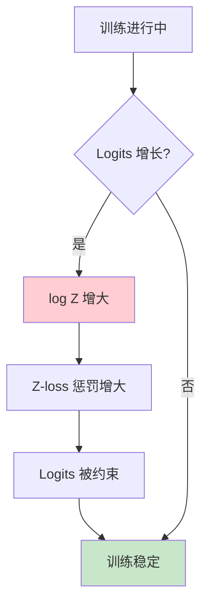
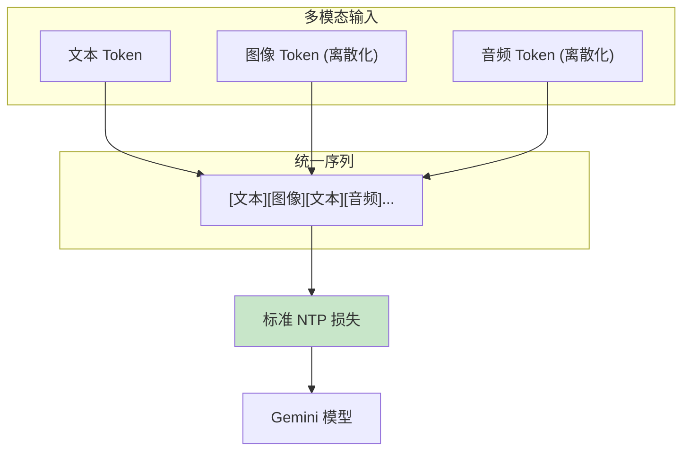
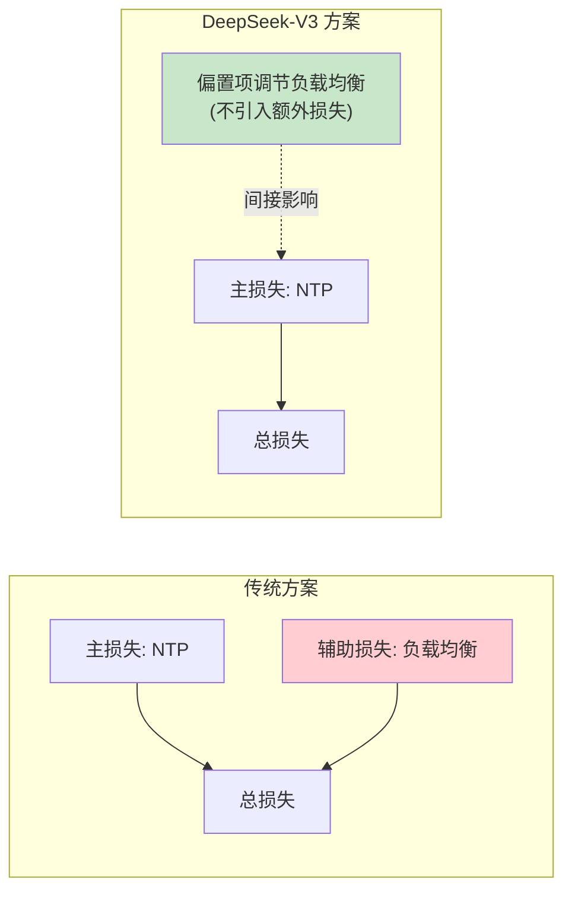
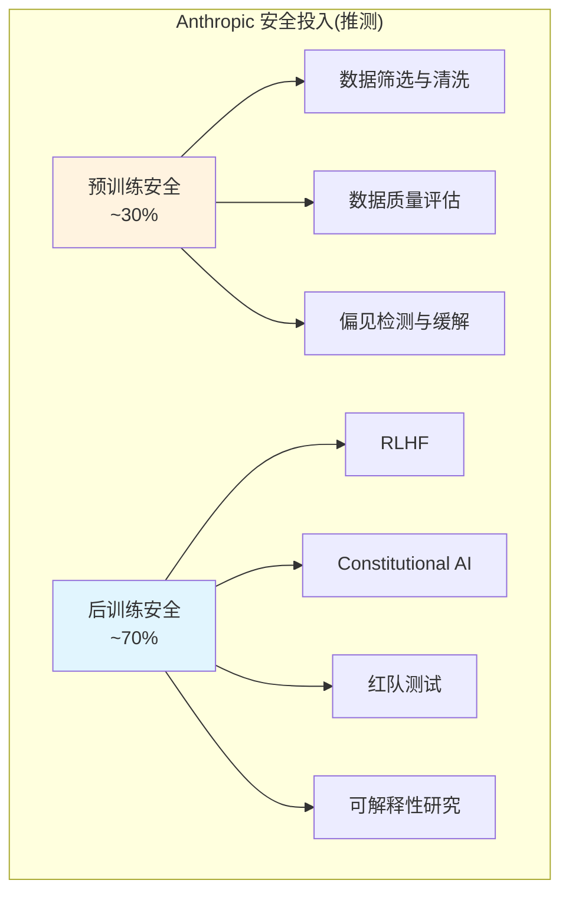
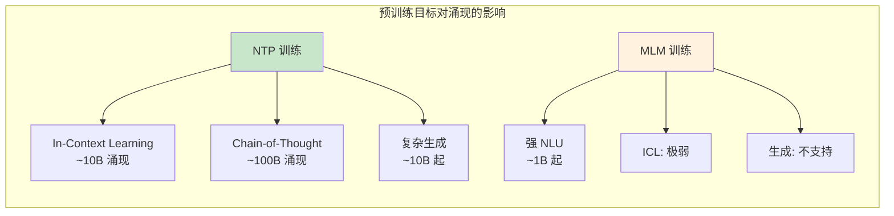

# 预训练目标进阶：工业实践与前沿研究

> 本文是 [模块 8A：预训练目标函数与理论基础](./README.md) 的进阶补充，深入分析 Google、DeepSeek、Anthropic 三条技术线在预训练目标上的工业实践，以及当前的前沿研究话题。

---

## 目录

- [1. Google 的预训练目标研究](#1-google-的预训练目标研究)
- [2. DeepSeek 的预训练目标策略](#2-deepseek-的预训练目标策略)
- [3. Anthropic 视角](#3-anthropic-视角)
- [4. 前沿话题](#4-前沿话题)

---

## 1. Google 的预训练目标研究

### 1.1 从 BERT 到 UL2 的探索历程

Google 在预训练目标上做出了业界最多的探索，其历程清晰地展现了"从多样化到简约化"的趋势。

#### BERT（2018）：MLM 的辉煌与局限

**核心创新**：首次证明双向预训练能显著提升 NLU 任务性能。

**训练目标**：
1. **MLM（Masked Language Modeling）**：遮蔽 15% 的 token，预测被遮蔽的 token
2. **NSP（Next Sentence Prediction）**：判断两个句子是否相邻

**NSP 的争议**：后续研究（RoBERTa, ALBERT）发现 NSP 对大部分下游任务无益甚至有害。原因是 NSP 过于简单——随机配对的句子通常来自不同主题，模型只需检测主题一致性就能解决 NSP，而不需要学习句间推理关系。

**BERT 的局限性**：
- MLM 仅利用 15% 的 token 作为训练信号，效率较低
- 遮蔽策略引入了预训练与微调之间的 mismatch
- 不适合生成任务（双向注意力与自回归生成矛盾）

#### T5（2019）：Text-to-Text 统一框架

T5 的核心哲学是**将所有 NLP 任务统一为"文本到文本"**的格式：

```
输入: "translate English to German: That is good"
输出: "Das ist gut"

输入: "summarize: [长文本]"
输出: "[摘要]"
```

**Span Corruption 目标**：
- 随机选择 token 片段（平均长度 3 tokens）
- 用 sentinel token 替换
- 训练模型重建原始片段

```
输入: "Thank you <X> me to your party <Y> week"
输出: "<X> for inviting <Y> last <Z>"
```

**T5 论文的系统对比**：Raffel et al.（2020）对比了多种预训练目标在大规模上的表现：

| 目标 | GLUE 平均 | SQuAD F1 | 训练效率 |
|------|-----------|----------|----------|
| BERT-style MLM | 83.2 | 80.1 | 基准 |
| Replace Corrupted Spans | 83.7 | 81.2 | 类似 |
| Prefix LM | 82.5 | 79.8 | 类似 |
| 自回归 LM（NTP） | 81.1 | 77.0 | 更快 |

在当时的规模（11B）和评测标准下，Span Corruption 看起来优于 NTP。但后来 PaLM（540B）证明了在足够大的规模下，NTP 反而更好。

#### UL2（2022）：统一所有预训练范式

UL2 试图回答一个根本问题：**能否设计一个预训练目标，让单一模型同时擅长理解和生成？**

**混合去噪器的配置**：

| 去噪器 | 遮蔽比例 | 片段长度 | 片段数 | 权重 |
|--------|---------|---------|--------|------|
| R-Denoiser | 15% | 3-5 tokens | 多个 | 1/3 |
| S-Denoiser | 25% | 顺序片段 | 1个 | 1/3 |
| X-Denoiser | 50% | 长片段 | 少量 | 1/3 |

**实践效果**：
- UL2 在 "SuperGLUE + 生成任务" 的综合评测中超过了纯 MLM 和纯 NTP
- 但增加了训练复杂度（需要维护三种去噪模式和 Mode Switching Token）
- 在更大规模上（如 540B），简单的 NTP 反而更好

**教训**：目标函数的复杂性在小规模上可能有益（因为提供了更丰富的学习信号），但在足够大的规模上，**简洁的目标 + 更多数据 + 更大模型** 通常胜出。

### 1.2 PaLM 的 Z-loss 实践经验

PaLM（540B）是 Google 在纯 NTP 方向上的标志性工作。

#### Z-loss 的工程动机

PaLM 训练过程中遇到了一个严重问题：**loss spike（损失突增）**。

```
正常训练: loss ≈ 2.5
突然:      loss → 15.0+（某些 batch）
几百步后:  loss 缓慢恢复到 2.6
```

这些 spike 的原因分析：
1. Logits 在训练过程中逐渐增长
2. 当某些 token 的 logit 变得非常大时，Softmax 会在混合精度（bfloat16）下丢失精度
3. 梯度计算出现异常，导致参数剧烈更新

#### Z-loss 的配置

PaLM 使用的 Z-loss 配置：
- 系数 $c = 10^{-4}$
- 应用在最终输出 logits 上
- 与主 NTP 损失相加



#### PaLM 的其他训练选择

| 配置项 | PaLM 的选择 | 原因 |
|--------|-------------|------|
| Label Smoothing | 不使用 | 数据量足够大，正则化效果可忽略 |
| Dropout | 不使用 | 同上 |
| Z-loss | $c = 10^{-4}$ | 防止 loss spike |
| 学习率 Schedule | Cosine decay | 标准选择 |
| 权重共享 | 不共享输入/输出嵌入 | 增大模型容量 |

### 1.3 Gemini 的多模态预训练目标

Gemini（Google, 2024）将预训练目标扩展到了多模态领域。

> **注意**：Gemini 的具体预训练目标细节并未完全公开，以下基于 Gemini 技术报告和公开演讲的信息。

**已知信息**：

1. **图文交织训练**：Gemini 在交织的图像、文本、音频、视频数据上进行预训练
2. **统一的自回归目标**：将多模态内容统一编码为 token 序列，然后用 NTP 目标训练
3. **图像编码**：使用离散化的视觉 token（类似 VQVAE/VQGAN 的 token 化方法），使得图像可以像文本一样参与 NTP

**推测的训练框架**：



**多模态 NTP 的挑战**：
- 不同模态的信息密度不同（一个图像 token 可能包含比文本 token 更多的信息）
- 可能需要对不同模态的损失进行加权
- 视觉 token 化方法的质量直接影响模型对图像的"理解"

---

## 2. DeepSeek 的预训练目标策略

### 2.1 FIM 在 DeepSeek-Coder 中的应用

DeepSeek-Coder（2024）是 DeepSeek 的代码专用模型系列，FIM 是其训练的关键组成部分。

#### FIM 配置

| 参数 | DeepSeek-Coder 配置 |
|------|-------------------|
| FIM 格式 | PSM（Prefix-Suffix-Middle） |
| FIM rate | 50% |
| 分割策略 | 随机分割点，确保分割在语法边界附近 |
| 特殊 token | `<fim_prefix>`, `<fim_suffix>`, `<fim_middle>` |

#### 为什么选择 PSM 而非 SPM？

研究表明两者在性能上差异不大，但 PSM 有一个实践优势：

- PSM 中前缀在最前面，与标准 NTP 的"从左到右"习惯一致
- 推理时更自然——用户通常先看到前缀，再看到后缀

#### FIM 与 NTP 的兼容性验证

DeepSeek-Coder 的实验表明：

| 配置 | HumanEval Pass@1 | NTP 损失 |
|------|-------------------|----------|
| 纯 NTP | 45.2% | 0.62 |
| NTP + FIM (50%) | 46.8% | 0.63 |
| NTP + FIM (90%) | 44.1% | 0.65 |

50% FIM rate 是最优平衡点：代码补全能力显著提升，且不影响标准生成能力。

### 2.2 代码预训练与通用预训练的目标设计差异

DeepSeek 的通用模型和代码模型在预训练目标上有明显区别：

| 特性 | 通用模型 (DeepSeek-V2/V3) | 代码模型 (DeepSeek-Coder) |
|------|--------------------------|--------------------------|
| 主目标 | NTP | NTP + FIM |
| FIM | 不使用 | 50% rate |
| 数据混合 | 通用文本为主 | 代码 87% + 通用 13% |
| 特殊 token | 无额外 | FIM 专用 token |
| 序列长度 | 4K-128K | 16K（代码通常较长） |

**代码预训练的特殊考虑**：
1. 代码比自然语言更结构化，模型更容易利用结构信息
2. 代码中的"中间填充"（如补全函数体）是高频使用场景
3. 代码的 token 化需要特别处理缩进、空格等

### 2.3 DeepSeek-V3 的预训练目标配置

DeepSeek-V3（2024）使用了以下预训练配置：

**损失函数**：
- 纯 NTP 损失，无 Label Smoothing
- **无辅助损失（Auxiliary-loss-free）负载均衡**：这是 V3 的关键创新

**无辅助损失负载均衡的原理**：

传统 MoE 使用 $\mathcal{L}_{aux} = \alpha \cdot N \cdot \sum_i f_i \cdot P_i$ 来鼓励负载均衡。但这个损失与主 NTP 损失之间存在博弈：

- 辅助损失鼓励均匀路由
- 主损失鼓励将 token 路由到最擅长的专家
- 两者的冲突可能影响训练效果

DeepSeek-V3 的解决方案：

$$g_i = g_i + b_i$$

给每个专家的路由分数加一个可学习的偏置项 $b_i$。当某个专家负载过高时，降低其偏置；负载过低时，增加偏置。这个调节过程不引入额外的损失函数。



**实践效果**：
- 消除了辅助损失系数 $\alpha$ 的调参困难
- 模型在相同计算预算下性能更好
- 负载均衡效果与传统方法相当

---

## 3. Anthropic 视角

> **透明度声明**：Anthropic 关于预训练阶段具体技术选择的公开信息较为有限。本节基于 Anthropic 发表的论文和公开文档，对可推断的内容进行讨论，并明确标注推测部分。

### 3.1 预训练阶段的安全性考量

Anthropic 的安全理念区别于大部分 AI 实验室的一个关键点：**安全性不应仅在后训练阶段（RLHF/CAI）处理，预训练阶段同样重要**。

**已知立场**（来源：Anthropic Core Views on AI Safety, 2023）：

1. **数据质量 = 安全基座**：预训练数据中包含的偏见、有害内容会成为模型的"默认行为"。后训练可以抑制但不能完全消除这些倾向。

2. **"毒蘑菇不能靠调料掩盖"**：如果预训练数据包含大量有害内容，RLHF 只是在表面上抑制了这些行为，模型内部仍然"知道"这些内容，在特定 prompt 下可能被激发。

3. **预训练数据筛选是第一道防线**：Anthropic 可能在预训练数据的清洗和筛选上投入了比同行更多的精力。

### 3.2 目标函数设计如何影响模型的"价值观"

**已知研究**（来源：Anthropic 关于模型行为的多篇论文）：

预训练目标函数本身（NTP）是"价值中立"的——它只优化预测准确率，不编码任何价值偏好。但通过以下机制，目标函数间接影响模型的行为：

1. **数据加权**：对不同类型的数据赋予不同的权重，等价于修改目标函数
   - 增加高质量数据的权重 → 模型更倾向于产生高质量输出
   - 降低有害数据的权重 → 减少模型的有害知识

2. **课程学习**：训练数据的呈现顺序影响模型的学习路径
   - 先学习安全内容，再学习更广泛的内容
   - 类似于人类教育中"先学价值观，再学知识"

3. **预训练 + 后训练的协同设计**：
   - 预训练提供"知识基座"和"行为倾向"
   - 后训练（RLHF/CAI）精细调控行为

**推测**：Anthropic 可能使用了某种形式的**数据混合策略**来在预训练阶段就引导模型的行为倾向，但具体方法未公开。

### 3.3 Anthropic 对预训练 vs 后训练的安全投入分配

**已知信息**：

1. Anthropic 的核心安全技术——Constitutional AI（CAI）和 RLHF——都在后训练阶段
2. 但 Anthropic 也在积极研究预训练阶段的安全措施

**推断的投入分配**：



> **注意**：上述比例是基于 Anthropic 公开论文和产品特征的推测，不代表实际情况。

**关键洞察**：

预训练安全和后训练安全是互补而非替代的关系：
- 预训练安全降低了后训练的"工作量"——如果预训练模型已经有良好的行为倾向，RLHF 需要纠正的内容更少
- 后训练安全提供了精细控制——可以针对具体场景调整模型行为
- 两者协同才能实现可靠的安全保障

---

## 4. 前沿话题

### 4.1 多模态预训练目标（图文交织训练）

随着多模态大模型（如 GPT-4V、Gemini、Claude 3 等）的兴起，预训练目标也在向多模态扩展。

#### 核心挑战

1. **模态对齐**：如何让文本 token 和视觉 token 处于同一语义空间？
2. **损失加权**：不同模态的信息密度不同，如何合理分配损失权重？
3. **Token 化方法**：图像/音频/视频如何有效转换为离散 token？

#### 主流方案

| 方案 | 代表工作 | 视觉处理 | 目标函数 |
|------|----------|----------|----------|
| 统一 NTP | Gemini, Chameleon | 离散 token 化 | 标准 NTP |
| 对比 + 生成 | CLIP + GPT | 连续嵌入 | 对比损失 + NTP |
| 交叉注意力 | Flamingo | 冻结视觉编码器 | 文本部分 NTP |

**趋势**：统一 NTP 方案正在成为主流——将所有模态 token 化后，用单一的 NTP 目标训练。这延续了"简洁性在规模化下胜出"的经验。

### 4.2 预训练目标的自动搜索

**核心问题**：能否自动发现比 NTP 更好的预训练目标？

**AutoML for Pretraining Objectives**：
- 将预训练目标参数化（如遮蔽比例、片段长度、损失权重等）
- 在代理任务上搜索最优配置
- 将找到的配置迁移到大规模训练

**挑战**：
1. 搜索代价巨大——每个候选目标都需要训练一个模型来评估
2. 小规模上最优的目标在大规模上可能不最优（UL2 的教训）
3. 搜索空间的定义本身就是一个问题

**目前的进展**：
- MetaICL（Min et al., 2022）探索了通过 meta-learning 优化 in-context learning 目标
- AutoPET（自动预训练目标搜索）尚处于研究阶段
- 实践中，手工设计 + 经验法则仍是主流

### 4.3 Token 级别的自适应损失加权

**动机**：不是所有 token 的预测价值相等。

- 标点符号和功能词（the, is, a）很容易预测，提供的学习信号有限
- 实质性内容词（quantum, photosynthesis）和推理关键词（therefore, because）包含更多信息
- 代码中的关键字（if, for, return）比空格和缩进更有价值

**形式化**：给每个 token 一个权重 $w_t$：

$$\mathcal{L}_{adaptive} = -\frac{1}{\sum_t w_t} \sum_{t=1}^{T} w_t \cdot \log P(x_t \mid x_{<t})$$

**权重设计策略**：

| 策略 | 原理 | 优缺点 |
|------|------|--------|
| 损失加权 | $w_t \propto -\log P(x_t \mid x_{<t})$ | 关注难以预测的 token，但可能放大噪声 |
| 频率加权 | $w_t \propto 1 / \text{freq}(x_t)$ | 关注稀有 token，简单有效 |
| 学习的权重 | $w_t = f_\phi(x_t, \text{context})$ | 最灵活，但增加训练复杂度 |
| 课程加权 | 训练初期均匀，后期增大难词权重 | 渐进式学习，实现简单 |

**RHO-1（Microsoft, 2024）的做法**：

RHO-1 提出了 **Selective Language Modeling**——使用一个参考模型来筛选"值得学习"的 token：

1. 用小的参考模型计算每个 token 的损失
2. 只在损失超过阈值的 token 上训练大模型
3. 相当于过滤掉"已经学会的"容易 token

实验表明，在相同计算预算下，RHO-1 能比标准 NTP 提升 15-30% 的下游任务性能。

### 4.4 预训练目标与模型涌现能力的关系

**核心问题**：不同的预训练目标是否会影响模型涌现能力的出现？

**涌现能力**（Emergent Abilities, Wei et al., 2022）指的是在小规模模型中不存在、但在模型规模超过某个阈值后突然出现的能力（如 few-shot 推理、思维链推理等）。

**目标函数与涌现的关系**：

1. **NTP 与 ICL（In-Context Learning）**：
   - NTP 训练的模型在足够规模下自然涌现出 ICL 能力
   - 理论分析（Xie et al., 2022）表明，NTP 隐式地执行了一种贝叶斯推理
   - MLM 训练的模型（如 BERT）在相同规模下不展现 ICL 能力

2. **训练数据多样性的作用**：
   - 涌现能力可能更多地与**数据多样性**相关，而非目标函数本身
   - 在更多样化的数据上用 NTP 训练的模型更容易涌现
   - 目标函数的选择（NTP vs MLM）决定了模型能否**利用**涌现的能力

3. **规模阈值与目标函数**：
   - 不同目标函数下，涌现能力可能出现在不同的规模阈值
   - NTP 训练的 Decoder-only 模型在 ~10B 参数时开始出现强 ICL 能力
   - MLM 训练的 Encoder-only 模型即使到 300B（如果存在的话）也不太可能出现生成式 ICL



**开放问题**：
- 是否存在比 NTP 更容易诱导涌现的目标函数？
- 涌现能力是预训练目标的结果，还是数据规模和多样性的结果？
- 如何设计预训练目标来定向增强特定的涌现能力（如数学推理）？

### 4.5 Fill-in-the-Middle (FIM) 目标的深入分析

FIM 是代码预训练中最重要的辅助目标之一，本节从工业实践角度深入剖析其设计细节和工程考量。

#### FIM 的本质：为 NTP 模型增加"回看"能力

标准 NTP 模型只能从左到右生成文本，这在代码编辑场景中有严重局限：用户经常需要在已有代码的**中间**插入新代码，此时模型需要同时理解前面的上下文（前缀）和后面的上下文（后缀）。

FIM 通过一个简洁的数据变换解决了这个问题：将原始序列重排为 `[PRE] prefix [SUF] suffix [MID] middle`，使得模型在生成 `middle` 部分时，注意力机制已经"看过"了 suffix。**这不改变模型架构，只改变数据格式**——这是 FIM 设计上最优雅的地方。

#### DeepSeek-Coder 的 FIM 实践细节

DeepSeek-Coder 在 FIM 实现上有几个值得注意的工程选择：

**分割点选择策略**：
- 不是完全随机选择分割点，而是倾向于在**语法边界**附近分割
- 函数定义、类定义、代码块的边界是优先分割位置
- 这样训练出的模型在实际代码补全场景中表现更好

**FIM rate 的影响**：

| FIM Rate | 代码补全能力 (FIM Bench) | 标准生成能力 (HumanEval) | 推荐场景 |
|----------|----------------------|------------------------|---------|
| 0% (纯 NTP) | 差 | 最佳 | 纯代码生成，不需要补全 |
| 25% | 中 | 接近最佳 | 以生成为主，补全为辅 |
| **50%** | **好** | **接近最佳** | **最佳平衡点（推荐）** |
| 75% | 很好 | 略有下降 | 以补全为主 |
| 90% | 最好 | 明显下降 | 纯补全场景 |

50% 是经过反复实验验证的最优平衡点：代码补全能力显著提升，同时标准生成能力几乎不受影响。

#### FIM 与标准 CLM 的互补性

一个关键的实验发现（Bavarian et al., 2022）是：**FIM 可以"免费"获得**。

"免费"的含义是：在相同的训练 FLOPs 预算下，50% FIM + 50% NTP 的模型在标准 NTP 基准上的表现与 100% NTP 的模型几乎相同。这意味着模型获得了代码补全能力，但没有牺牲任何生成能力。

**为什么 FIM 是"免费"的？** 一个可能的解释是：
- FIM 变换后的序列仍然是一个合法的 token 序列，模型仍在做 NTP
- FIM 强制模型学习更丰富的上下文依赖关系（不仅是从左到右）
- 这种更丰富的上下文理解反过来也有助于标准的从左到右生成

#### FIM 在非代码场景的潜力

虽然 FIM 主要用于代码模型，但其核心思想（让模型学习利用双向上下文进行生成）在其他场景也有潜力：

- **文档编辑**：在已有段落之间插入新内容
- **对话修复**：在对话历史的中间插入缺失的回合
- **结构化数据填充**：填充表格或表单中的空白字段

目前这些非代码场景的 FIM 应用尚处于探索阶段，但随着 LLM 在更多编辑类任务中的应用，FIM 的重要性可能进一步提升。

---

## 总结

| 技术线 | 核心策略 | 关键创新 | 趋势 |
|--------|---------|---------|------|
| Google | 从多样化到简约化 | UL2 混合去噪 → PaLM Z-loss | 回归 NTP + 多模态扩展 |
| DeepSeek | 实用主义 | FIM 代码增强 + 无辅助损失 MoE | NTP 为主 + 任务特化扩展 |
| Anthropic | 安全优先 | 数据筛选 + 预训练安全理念 | 预训练-后训练协同安全 |

**共同趋势**：
1. NTP 作为基础预训练目标的地位已经稳固
2. 辅助目标（FIM、Z-loss 等）作为"插件"增强特定能力
3. 多模态预训练目标是下一个重要方向
4. 预训练数据质量的重要性日益被认识到
