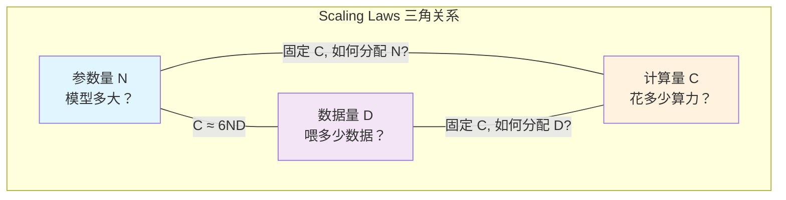
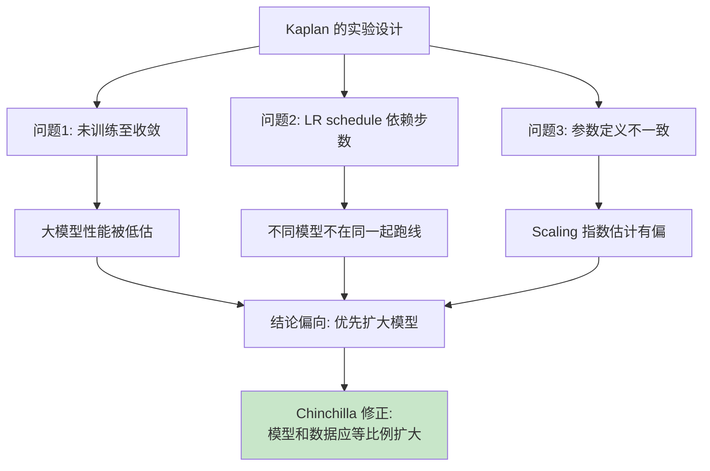
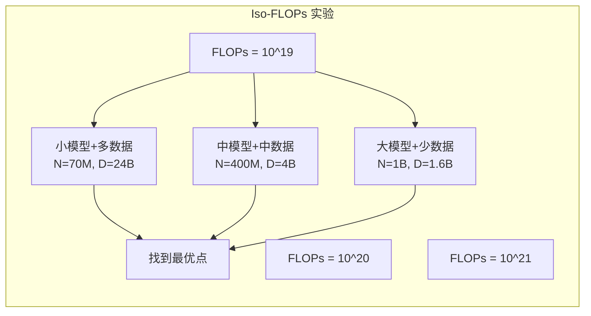
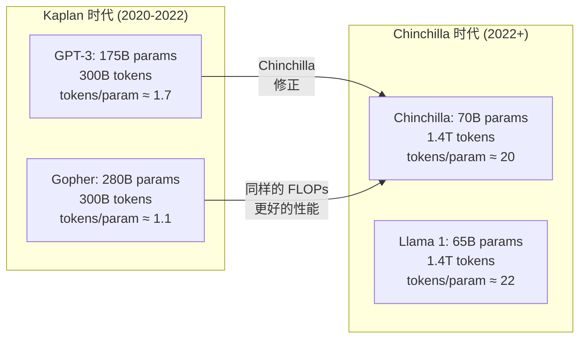
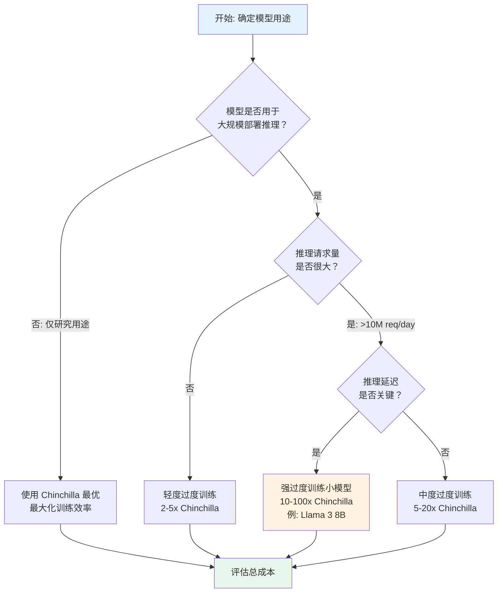
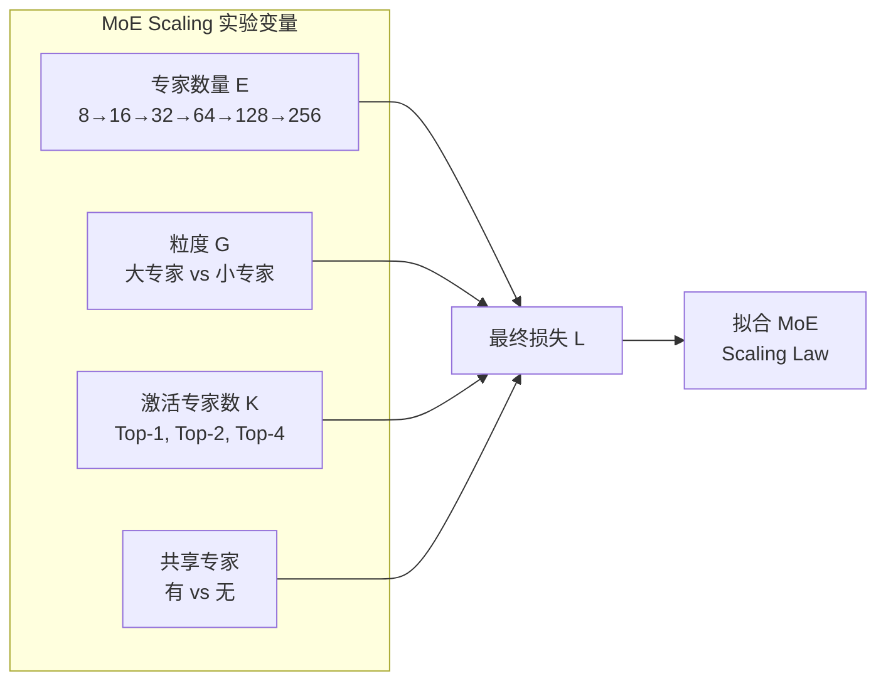
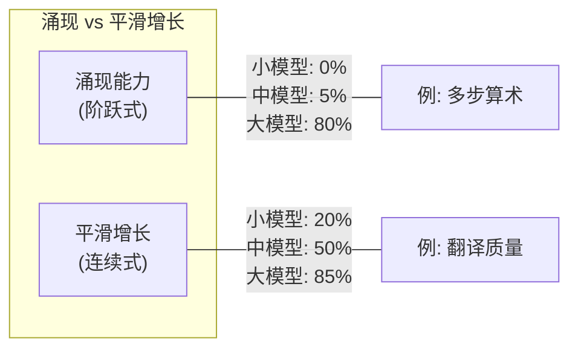
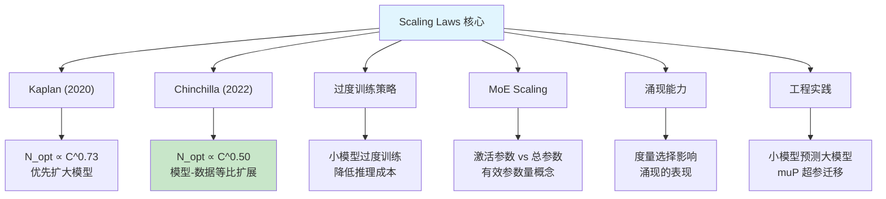

# 模块 8B：预训练（中）— Scaling Laws 与计算最优

> Scaling Laws 是 LLM 研究中最重要的经验发现之一：模型性能遵循可预测的幂律关系。掌握 Scaling Laws，意味着你可以在花费数百万美元训练大模型之前，用小模型实验预测最终性能，做出计算最优的资源分配决策。本章将从数学推导出发，深入剖析 Kaplan (2020) 和 Chinchilla (2022) 两个里程碑工作，并延伸到过度训练、MoE 缩放、涌现能力等前沿话题。

---

## 目录

- [1. Scaling Laws 基础：幂律关系](#1-scaling-laws-基础幂律关系)
- [2. Kaplan et al. (2020): OpenAI Scaling Laws](#2-kaplan-et-al-2020-openai-scaling-laws)
- [3. Chinchilla (2022): 修正 Scaling Laws](#3-chinchilla-2022-修正-scaling-laws)
- [4. 过度训练（Over-training）策略](#4-过度训练over-training策略)
- [5. MoE 模型的 Scaling Laws](#5-moe-模型的-scaling-laws)
- [6. 涌现能力与相变](#6-涌现能力与相变)
- [7. 计算最优配置的工程实践](#7-计算最优配置的工程实践)
- [8. 三条技术线对比](#8-三条技术线对比)
- [9. 项目实践](#9-项目实践)
- [10. 本章小结](#10-本章小结)

---

## 1. Scaling Laws 基础：幂律关系

### 1.1 经验发现：LLM 性能遵循可预测的幂律

2020 年前后，研究者逐渐发现一个令人惊讶的规律：**大语言模型的测试损失（loss）与模型规模、数据量、计算量之间存在高度规律的幂律关系**。这意味着，在一定范围内，你可以用数学公式精确预测一个更大模型的性能。

幂律（power law）的一般形式为：

$$L = a \cdot x^{-b} + L_\infty$$

其中 $L$ 是损失，$x$ 是某个规模变量（参数量、数据量或计算量），$a, b$ 是正常数，$L_\infty$ 是不可约损失（irreducible loss），代表即使无限扩展也无法消除的噪声。

在双对数坐标系（log-log plot）下，幂律呈现为一条直线：

$$\log(L - L_\infty) = \log a - b \cdot \log x$$

### 1.2 幂律在物理学中的普遍性

幂律并非 LLM 独有。在物理学中，幂律无处不在：

| 领域 | 幂律关系 | 类比意义 |
|------|---------|---------|
| 临界现象 | 磁化强度 $M \propto (T_c - T)^\beta$ | 相变附近的普适行为 |
| 网络科学 | 度分布 $P(k) \propto k^{-\gamma}$ | 无标度网络 |
| 自然语言 | Zipf 定律 $f(r) \propto r^{-1}$ | 词频与排名的关系 |
| 地震学 | Gutenberg-Richter 定律 | 能量与频率的关系 |

**类比直觉**：就像物理学中的临界现象一样，LLM 的 Scaling Laws 可能暗示着深度学习存在某种底层的统计规律性——不同的架构和数据集在"足够大"的规模下趋于相同的缩放行为。

### 1.3 三个核心变量

Scaling Laws 围绕三个核心变量展开：

| 变量 | 符号 | 含义 | 单位 |
|------|------|------|------|
| **参数量** | $N$ | 模型的可训练参数数量（不含 embedding） | 个 |
| **数据量** | $D$ | 训练 token 数量 | tokens |
| **计算量** | $C$ | 训练所需的总浮点运算数 | FLOPs |

这三者之间通过一个近似关系连接：

$$C \approx 6ND$$

其中系数 6 来源于：每个 token 的前向传播约需 $2N$ FLOPs（每个参数对应一次乘加），反向传播约需 $4N$ FLOPs（梯度计算是前向的 2 倍），合计 $6N$ FLOPs/token。



### 1.4 核心问题

Scaling Laws 要回答的核心问题是：

> **给定固定的计算预算 $C$，如何分配参数量 $N$ 和数据量 $D$，使得最终的损失 $L$ 最小？**

这个问题的答案直接决定了工业界每一次大模型训练的资源分配策略。下面我们将看到两个里程碑式的回答：Kaplan (2020) 和 Chinchilla (2022)。

---

## 2. Kaplan et al. (2020): OpenAI Scaling Laws

### 2.1 三个独立的 Scaling Laws

Kaplan 等人 [1] 通过在不同规模上训练数百个模型，发现测试损失分别与 $N$、$D$、$C$ 各自满足幂律关系：

**损失与参数量 $N$ 的关系**（数据充足时）：

$$L(N) = \left(\frac{N_c}{N}\right)^{\alpha_N}, \quad \alpha_N \approx 0.076$$

其中 $N_c \approx 8.8 \times 10^{13}$ 是一个常数。

**损失与数据量 $D$ 的关系**（模型足够大时）：

$$L(D) = \left(\frac{D_c}{D}\right)^{\alpha_D}, \quad \alpha_D \approx 0.095$$

其中 $D_c \approx 5.4 \times 10^{13}$。

**损失与计算量 $C$ 的关系**（最优分配时）：

$$L(C) = \left(\frac{C_c}{C}\right)^{\alpha_C}, \quad \alpha_C \approx 0.050$$

### 2.2 联合 Scaling Law

更一般地，当参数量和数据量同时有限时，Kaplan 提出了一个联合公式：

$$L(N, D) = \left[\left(\frac{N_c}{N}\right)^{\alpha_N / \beta} + \left(\frac{D_c}{D}\right)^{\alpha_D / \beta}\right]^{\beta}$$

其中 $\beta$ 控制两种瓶颈（参数不足 vs 数据不足）如何组合。当 $N$ 非常大时，损失由数据决定；当 $D$ 非常大时，损失由参数决定。

一种常见的简化形式（可加模型）：

$$L(N, D) = \frac{A}{N^{\alpha}} + \frac{B}{D^{\beta}} + L_\infty$$

其中 $A, B, \alpha, \beta, L_\infty$ 是通过实验拟合的常数。

### 2.3 最优分配：Lagrange 乘子法推导

**问题设定**：给定计算预算 $C$，如何选择 $N$ 和 $D$ 使损失最小？

使用简化的损失模型：

$$\min_{N, D} \quad L(N, D) = \frac{A}{N^{\alpha}} + \frac{B}{D^{\beta}}$$

$$\text{subject to} \quad C = 6ND$$

**Step 1: 构造 Lagrangian**

$$\mathcal{L}(N, D, \lambda) = \frac{A}{N^{\alpha}} + \frac{B}{D^{\beta}} + \lambda(6ND - C)$$

**Step 2: 对 $N$ 求偏导并令其为零**

$$\frac{\partial \mathcal{L}}{\partial N} = -\frac{\alpha A}{N^{\alpha + 1}} + 6\lambda D = 0$$

$$\Rightarrow \lambda = \frac{\alpha A}{6DN^{\alpha + 1}} \tag{1}$$

**Step 3: 对 $D$ 求偏导并令其为零**

$$\frac{\partial \mathcal{L}}{\partial D} = -\frac{\beta B}{D^{\beta + 1}} + 6\lambda N = 0$$

$$\Rightarrow \lambda = \frac{\beta B}{6ND^{\beta + 1}} \tag{2}$$

**Step 4: 联立 (1) 和 (2)，消去 $\lambda$**

$$\frac{\alpha A}{6DN^{\alpha + 1}} = \frac{\beta B}{6ND^{\beta + 1}}$$

$$\frac{\alpha A}{DN^{\alpha+1}} = \frac{\beta B}{ND^{\beta+1}}$$

$$\alpha A \cdot N \cdot D^{\beta+1} = \beta B \cdot D \cdot N^{\alpha+1}$$

$$\alpha A \cdot D^{\beta} = \beta B \cdot N^{\alpha}$$

$$\frac{D^{\beta}}{N^{\alpha}} = \frac{\beta B}{\alpha A} \tag{3}$$

**Step 5: 将约束 $C = 6ND$ 代入**

由 $D = C / (6N)$ 代入 (3)：

$$\frac{(C/(6N))^{\beta}}{N^{\alpha}} = \frac{\beta B}{\alpha A}$$

$$\frac{C^{\beta}}{6^{\beta} \cdot N^{\alpha + \beta}} = \frac{\beta B}{\alpha A}$$

$$N^{\alpha + \beta} = \frac{\alpha A \cdot C^{\beta}}{6^{\beta} \cdot \beta B}$$

$$N_{\text{opt}} = \left(\frac{\alpha A}{6^{\beta} \beta B}\right)^{\frac{1}{\alpha+\beta}} \cdot C^{\frac{\beta}{\alpha+\beta}}$$

**Step 6: 同理求 $D_{\text{opt}}$**

$$D_{\text{opt}} = \frac{C}{6N_{\text{opt}}} \propto C^{1 - \frac{\beta}{\alpha+\beta}} = C^{\frac{\alpha}{\alpha+\beta}}$$

**Kaplan 的实验结果**：

$$N_{\text{opt}} \propto C^{0.73}, \quad D_{\text{opt}} \propto C^{0.27}$$

这意味着 $\beta / (\alpha + \beta) \approx 0.73$。

### 2.4 Kaplan 的结论与影响

**核心结论："优先扩大模型，数据其次"**

| 计算量增加 | 最优参数量增加 | 最优数据量增加 |
|-----------|-------------|-------------|
| $10\times$ | $\sim 5.4\times$ | $\sim 1.9\times$ |
| $100\times$ | $\sim 29\times$ | $\sim 3.5\times$ |
| $1000\times$ | $\sim 156\times$ | $\sim 6.4\times$ |

这意味着：如果你的计算预算增加了 10 倍，应该把大部分增加的预算用于扩大模型，数据量只需少量增加。

**对工业实践的影响**：GPT-3（175B 参数）正是在这一指导下设计的——使用了极大的模型，但训练数据（300B tokens）相对于模型规模而言并不算多。

### 2.5 Kaplan 的潜在问题

后来的研究发现 Kaplan 的实验存在几个关键缺陷：

1. **未训练至收敛**：大模型的训练步数不足，导致大模型的性能被低估，使得结论偏向"需要更大的模型"
2. **学习率调度依赖训练步数**：使用了基于 step 的 cosine schedule，不同训练长度的模型有不同的学习率衰减行为，引入了混淆变量
3. **参数量定义不一致**：Kaplan 在某些情况下排除了 embedding 参数，在其他情况下又包含了它

这些问题直接导致了 2022 年 Chinchilla 的重大修正。

---

## 3. Chinchilla (2022): 修正 Scaling Laws

### 3.1 Kaplan 的偏差分析

Hoffmann et al. [2]（Chinchilla 论文）系统性地指出了 Kaplan 结论的偏差来源：



**关键洞察**：如果每个模型都被训练到收敛（即在其最优学习率下训练足够多的步数），那么 **数据量的重要性远大于 Kaplan 的估计**。

### 3.2 Chinchilla 三种估计方法

Chinchilla 论文用三种独立的方法来估计最优的 $N$-$D$ 分配，增强了结论的可靠性。

#### 方法 1：固定模型规模，变数据量

对每个固定的模型规模 $N$，在不同数据量 $D$ 下训练至收敛，得到每个 $N$ 对应的最优 $D_{\text{opt}}(N)$。

实验设计：
- 选择一系列模型规模：70M, 150M, 400M, 1B, 10B
- 对每个模型，分别用 5B, 10B, 20B, 50B, 100B, ... tokens 训练
- 记录每个 $(N, D)$ 组合的最终损失

然后拟合：

$$D_{\text{opt}}(N) = c \cdot N^{a}$$

Chinchilla 发现 $a \approx 1$，即 **最优数据量与参数量成正比**。

#### 方法 2：固定 FLOPs 预算，变 $N$/$D$ 分配

对每个固定的 FLOPs 预算 $C$，尝试不同的 $(N, D)$ 组合（满足 $C \approx 6ND$），找到使损失最小的分配。

实验设计：
- 选择 9 个 FLOPs 预算（从 $6 \times 10^{18}$ 到 $3 \times 10^{21}$）
- 对每个预算，训练约 500 个模型（参数量从 70M 到 16B）
- 每条 "等计算量曲线"（iso-FLOPs curve）上找到损失最低点

这种方法的核心思想是：**固定总成本，寻找最佳的大小-数据权衡**。



#### 方法 3：参数化损失函数拟合

直接拟合参数化的损失函数，然后通过优化求解最优分配。

假设损失函数形式为：

$$\hat{L}(N, D) = \frac{A}{N^{\alpha}} + \frac{B}{D^{\beta}} + E$$

其中 $E$ 是不可约损失（数据的固有熵）。

使用所有实验数据通过最小二乘法拟合参数 $A, B, \alpha, \beta, E$。

Chinchilla 的拟合结果：

| 参数 | 值 |
|------|-----|
| $A$ | 406.4 |
| $B$ | 410.7 |
| $\alpha$ | 0.34 |
| $\beta$ | 0.28 |
| $E$ | 1.69 |

然后对这个拟合好的损失函数做约束优化：

$$\min_{N,D} \hat{L}(N,D) \quad \text{s.t.} \quad C = 6ND$$

用与 Kaplan 相同的 Lagrange 乘子法（见第 2.3 节），得到：

$$N_{\text{opt}} \propto C^{\frac{\beta}{\alpha + \beta}} \approx C^{0.46}$$

$$D_{\text{opt}} \propto C^{\frac{\alpha}{\alpha + \beta}} \approx C^{0.54}$$

### 3.3 Chinchilla 最优：核心结论

三种方法给出了高度一致的结果：

$$\boxed{N_{\text{opt}} \propto C^{0.50}, \quad D_{\text{opt}} \propto C^{0.50}}$$

**通俗解释**：当计算预算增加 $k$ 倍时，**模型参数和训练数据应该各增加 $\sqrt{k}$ 倍**。

| 计算量增加 | Kaplan: 最优 N | Kaplan: 最优 D | Chinchilla: 最优 N | Chinchilla: 最优 D |
|-----------|-------------|-------------|----------------|----------------|
| $10\times$ | $5.4\times$ | $1.9\times$ | $3.2\times$ | $3.2\times$ |
| $100\times$ | $29\times$ | $3.5\times$ | $10\times$ | $10\times$ |
| $1000\times$ | $156\times$ | $6.4\times$ | $31.6\times$ | $31.6\times$ |

**最优 token/parameter 比值**：

Chinchilla 发现最优的训练数据量约为模型参数的 **20 倍**：

$$D_{\text{opt}} \approx 20N$$

例如：
- 1B 参数模型 → 最优训练 20B tokens
- 10B 参数模型 → 最优训练 200B tokens
- 70B 参数模型 → 最优训练 1.4T tokens

### 3.4 对工业实践的深远影响

Chinchilla 的发现彻底改变了工业界的模型训练策略：



**关键验证**：Chinchilla（70B）用与 Gopher（280B）相同的计算量训练，但性能全面超越 Gopher——证明 Gopher 的参数量过大、数据量不足。

---

## 4. 过度训练（Over-training）策略

### 4.1 为什么要过度训练？

尽管 Chinchilla 给出了**训练效率最优**的配置，但工业实践中很多团队选择有意偏离 Chinchilla 最优，对较小的模型使用远超最优比例的数据进行训练。这种策略称为**过度训练（over-training）**。

**核心动机：推理成本经济学**

训练大模型是一次性成本，但推理是持续性成本。对于部署在生产环境中的模型，推理成本往往远超训练成本。

$$\text{总成本} = \underbrace{C_{\text{train}}}_{\text{一次性}} + \underbrace{C_{\text{inference}} \times T_{\text{service}}}_{\text{持续性}}$$

**一个具体的例子**：

| 方案 | 参数量 | 训练 tokens | 训练成本 | 单次推理成本 | 性能 |
|------|--------|------------|---------|-------------|------|
| A: Chinchilla 最优 | 70B | 1.4T | $2M | $0.002/req | 基准 |
| B: 过度训练小模型 | 8B | 15T | $2M | $0.0003/req | 接近 A |

方案 B 花费相似的训练成本，得到了推理成本仅为方案 A 的 1/7 的模型，性能却接近。当推理请求量巨大时，方案 B 的总成本远低于方案 A。

### 4.2 Llama 3 的实践

Llama 3 是过度训练策略的典型案例：

| 模型 | 参数量 | 训练 tokens | Chinchilla 最优 tokens | 过度训练倍数 |
|------|--------|------------|---------------------|------------|
| Llama 3 8B | 8B | 15T | ~160B | **~94x** |
| Llama 3 70B | 70B | 15T | ~1.4T | **~11x** |
| Llama 3 405B | 405B | 15T | ~8.1T | **~1.9x** |

可以看到：**模型越小，过度训练的倍数越大**。8B 模型被训练了 Chinchilla 最优数据量的近 100 倍。

### 4.3 过度训练的理论支撑

损失在 Chinchilla 最优之后仍在持续下降，只是下降效率降低了。

使用 Chinchilla 的损失模型，定义过度训练因子 $r = D / D_{\text{opt}}$：

$$L(N, rD_{\text{opt}}) = \frac{A}{N^{\alpha}} + \frac{B}{(rD_{\text{opt}})^{\beta}} + E$$

由于 $D_{\text{opt}} \approx 20N$：

$$L(N, r) = \frac{A}{N^{\alpha}} + \frac{B}{(20rN)^{\beta}} + E$$

当 $r > 1$（过度训练）时，第二项继续减小，但减小的速率随 $r$ 增大而减缓（因为 $\beta < 1$）。

**边际收益递减规律**：过度训练 $2\times$ 带来的收益远大于从 $10\times$ 到 $20\times$ 的收益。

### 4.4 何时选择过度训练？决策框架



**决策要点总结**：

| 场景 | 推荐策略 | 理由 |
|------|---------|------|
| 研究实验 | Chinchilla 最优 | 最大化训练效率 |
| 边缘设备部署 | 强过度训练小模型 | 推理成本和延迟是首要约束 |
| API 服务（大流量） | 中度过度训练 | 平衡训练投资和推理成本 |
| 能力旗舰模型 | 接近 Chinchilla 最优 | 追求最高性能 |

---

## 5. MoE 模型的 Scaling Laws

### 5.1 总参数量 vs 激活参数量

Mixture-of-Experts（MoE）模型引入了新的复杂性：模型的**总参数量**远大于每个 token 实际使用的**激活参数量**。

$$N_{\text{total}} \gg N_{\text{active}}$$

例如，DeepSeek-V3 拥有 671B 总参数，但每个 token 只激活 37B 参数。这引发了一个关键问题：**MoE 模型的 Scaling Laws 应该以总参数还是激活参数为基准？**

### 5.2 稀疏模型与稠密模型的 Scaling 差异

研究表明，MoE 模型在相同激活参数下通常优于同等规模的稠密模型，但这个优势的大小依赖于专家数量和粒度。

**经验发现**：

$$L_{\text{MoE}}(N_{\text{active}}, E) \approx L_{\text{dense}}(N_{\text{effective}})$$

其中 $N_{\text{effective}}$ 是 MoE 的"有效参数量"，满足：

$$N_{\text{effective}} = N_{\text{active}} \cdot f(E, G)$$

$f(E, G)$ 是关于专家数量 $E$ 和粒度 $G$ 的增益因子，通常 $f > 1$。

直觉上，即使每次只激活部分专家，不同的 token 可以路由到不同的专家，从而利用更大的总参数空间。

### 5.3 DeepSeek 的 MoE Scaling Laws 实验

DeepSeek 团队在其技术报告中展示了系统性的 MoE Scaling Laws 实验方法：

**实验设计**：

1. **规模梯度**：在 2B, 4B, 8B, 16B 总参数的 MoE 模型上进行实验
2. **控制变量**：保持激活参数比例、训练 tokens 数等其他因素不变
3. **变量扫描**：系统改变专家数量（8, 16, 32, 64, 128, 256）和粒度

**关键发现**：

| 因素 | 对 Scaling 的影响 |
|------|-----------------|
| 专家数量 $E$ | 增加 $E$ 在初始阶段显著降低损失，但边际收益递减 |
| 粒度（每个专家的参数量） | 更细粒度的专家（更多数量、更小规模）通常更优 |
| 激活比例 | Top-K 中 K 的选择影响效率-性能权衡 |
| 共享专家 | 共享专家可以提供基础能力，让路由专家专注于差异化知识 |



### 5.4 MoE 的"有效参数量"概念

为了将 MoE 与稠密模型进行公平比较，需要定义 MoE 的"有效参数量"。一种常用的方法是：

> 如果一个 MoE 模型和一个稠密模型在相同数据上训练到相同损失，那么该稠密模型的参数量就是 MoE 的"有效参数量"。

实验表明，典型的 MoE 模型的有效参数量约为激活参数的 **2-3 倍**（取决于专家数量和路由策略）。这意味着一个激活 37B 参数的 MoE 模型，其性能大致相当于一个 74B-111B 参数的稠密模型。

---

## 6. 涌现能力与相变

### 6.1 涌现能力的定义

Wei et al. [3] 提出了**涌现能力（emergent abilities）**的概念：

> 涌现能力是指在小模型中不存在但在大模型中突然出现的能力。

更形式化地说，如果某项能力在模型规模低于某个阈值时几乎为零，在超过阈值后急剧上升，则称该能力为涌现的。



### 6.2 经典案例

以下能力被广泛认为具有涌现特征：

| 能力 | 涌现规模（约） | 描述 |
|------|-------------|------|
| 多步算术推理 | ~100B params | 小模型几乎无法完成 3 位数乘法 |
| 思维链推理（CoT） | ~60B params | 小模型无法从 "Let's think step by step" 获益 |
| 指令跟随 | ~10B params | 小模型无法理解零样本指令 |
| 多语言翻译 | ~10B params | 突然在低资源语言上表现良好 |
| 代码生成 | ~30B params | 能够生成功能正确的代码片段 |

### 6.3 争论：真正的相变还是度量假象？

2023 年，Schaeffer, Miranda & Koyejo [4] 提出了一个重要的质疑：

**核心论点：涌现可能是度量选择造成的假象**

当使用**非线性度量**（如精确匹配准确率 exact match accuracy）时，能力看起来是突然涌现的；但如果使用**连续度量**（如 token 级别的对数概率），同样的能力实际上是平滑增长的。

**数学解释**：

假设模型在某任务上的每个 token 正确概率 $p$ 随规模平滑增长：

$$p(N) = 1 - c \cdot N^{-\gamma}$$

对于一个需要连续 $k$ 个 token 都正确的任务（如多步推理），精确匹配准确率为：

$$\text{Acc}(N) = p(N)^k = \left(1 - c \cdot N^{-\gamma}\right)^k$$

当 $k$ 很大时，即使 $p$ 只差一点点，$p^k$ 就会从接近 0 跳变到接近 1。

**举例**：设 $k = 10$（10 步推理），$p = 0.9$ 时 $\text{Acc} = 0.35$，$p = 0.99$ 时 $\text{Acc} = 0.90$。仅仅 10% 的 per-token 准确率提升就导致了整体准确率从 35% 到 90% 的"涌现式"跳变。

### 6.4 当前共识与未解问题

| 观点 | 支持证据 | 反对证据 |
|------|---------|---------|
| **涌现是真实的相变** | 某些能力确实有明确的阈值 | 连续度量下可能是平滑的 |
| **涌现是度量假象** | 更换度量后"涌现"消失 | 某些能力换度量后仍有阈值 |
| **部分涌现是真实的** | 某些任务结构确实需要阈值能力 | 很难严格区分 |

**当前共识**：
1. **大部分**所谓的涌现可以用非线性度量来解释
2. 但**某些**能力（特别是需要组合性推理的任务）可能确实存在真正的相变
3. 预训练损失的 Scaling Laws 是**平滑的**，涌现主要出现在下游任务评估中

### 6.5 下游任务的 Scaling Laws

预训练损失与下游 benchmark 性能之间的关系并非简单的线性映射：

$$\text{Benchmark}(L) \neq a \cdot L + b$$

实际上，不同 benchmark 与预训练损失之间的关系各不相同：

- **简单任务**（如文本分类）：损失较高时就开始改善
- **困难任务**（如数学推理）：需要损失降到较低水平才开始改善
- **极难任务**（如 AGI-level 推理）：即使损失很低，改善也很缓慢

这意味着：**你不能仅凭预训练损失的 Scaling Laws 来预测所有下游能力的出现时间**。

---

## 7. 计算最优配置的工程实践

### 7.1 小模型实验 → 大模型预测

这是工业界最实用的 Scaling Laws 应用：用小模型实验来预测大模型的性能，避免昂贵的试错。

#### DeepSeek 方法论

DeepSeek 在其技术报告中详细描述了这一方法论：

**Step 1: 设计模型规模梯度**

$$N \in \{70\text{M}, 160\text{M}, 400\text{M}, 1\text{B}, 3\text{B}\}$$

每个规模训练多个变体（不同超参数），总计约 20-30 个小模型。

**Step 2: 收集 $(N, D, L)$ 数据点**

对每个模型训练至收敛，记录最终损失：

$$\mathcal{D}_{\text{exp}} = \{(N_i, D_i, L_i)\}_{i=1}^{M}$$

**Step 3: 拟合 Scaling Law**

使用最小二乘法拟合：

$$\hat{L}(N, D) = \frac{A}{N^{\alpha}} + \frac{B}{D^{\beta}} + E$$

目标函数：

$$\min_{A, B, \alpha, \beta, E} \sum_{i=1}^{M} \left(L_i - \hat{L}(N_i, D_i)\right)^2$$

由于参数出现在指数位置，这是一个非线性最小二乘问题，通常使用 Levenberg-Marquardt 算法或 L-BFGS 求解。

**Step 4: 预测大模型性能**

用拟合好的 $\hat{L}$ 来预测目标规模（如 67B）的模型性能：

$$\hat{L}_{\text{67B}} = \hat{L}(67 \times 10^9, D_{\text{target}})$$

**Step 5: 评估预测的可靠性**

通过 Bootstrap 或 Leave-one-out 交叉验证来估计预测的置信区间。


### 7.2 muP（Maximal Update Parameterization）

#### 核心问题

标准的模型参数化（Standard Parameterization, SP）存在一个严重问题：**在小模型上调好的超参数（如学习率）无法直接迁移到大模型**。

这意味着每次训练更大的模型时，都需要重新搜索超参数——这是极其昂贵的。

#### muP 的核心思想

Yang et al. [5] 提出的 muP 通过精心设计参数的初始化和学习率缩放，使得：

> 不同宽度的模型具有相似的训练动力学，从而使超参数可以从小模型直接迁移到大模型。

#### 数学基础：参数更新的规模不变性

在标准参数化下，假设模型宽度为 $d$，考虑一个线性层 $y = Wx$：

| 属性 | 标准参数化 (SP) | muP |
|------|---------------|-----|
| 初始化 | $W_{ij} \sim \mathcal{N}(0, 1/d)$ | $W_{ij} \sim \mathcal{N}(0, 1/d)$ |
| 学习率 | $\eta$ (所有层相同) | 输入层: $\eta$; 隐藏层: $\eta/d$; 输出层: $\eta/d$ |
| 前向传播 $\|y\|$ | $O(1)$ | $O(1)$ |
| 参数更新 $\|\Delta W\|$ | $O(\eta)$ | $O(\eta / d)$ |
| **更新/权重比** | $O(\eta \sqrt{d})$ → 随宽度爆炸 | $O(\eta / \sqrt{d})$ → 可控 |

**关键区别**：在 SP 下，参数更新的**相对幅度**随模型宽度增长，导致大模型和小模型的训练动力学不同；在 muP 下，这个比值是稳定的。

#### muP 与 SP 的实践对比

| 特性 | SP | muP |
|------|-----|-----|
| 最优学习率 | 随宽度变化 | 宽度无关（可迁移） |
| 超参数搜索成本 | 每个规模重新搜索 | 在小模型上搜索一次 |
| 训练稳定性 | 大模型需要特殊调参 | 更稳定 |
| 工业采用 | 大部分模型 | 逐步增加（Cerebras, etc.） |

### 7.3 训练成本估算

#### $C \approx 6PD$ 的推导

对于一个 Transformer 模型，前向传播中，每个线性层 $y = Wx$ 的计算量为 $2 \cdot d_{\text{in}} \cdot d_{\text{out}}$ FLOPs（矩阵乘法）。

对于整个模型（$l$ 层 Transformer，隐藏维度 $d$，词汇表 $V$）：

| 组件 | 前向 FLOPs/token | 数量 |
|------|----------------|------|
| QKV 投影 | $6d^2$ | 每层 |
| 注意力计算 | $2nd$ (n=序列长度) | 每层 |
| 输出投影 | $2d^2$ | 每层 |
| FFN (SwiGLU) | $\frac{16}{3}d^2 \times 2$ | 每层 |
| 词嵌入 + LM head | $2Vd$ | 全局 |

简化后（忽略注意力计算和嵌入层，因为 $n \ll d$ 且 $V \ll ld$）：

$$\text{FLOPs}_{\text{forward}} \approx 2P \text{ per token}$$

其中 $P$ 是总参数量（主要来自线性层）。

反向传播约为前向的 2 倍（需要计算关于权重和输入的梯度）：

$$\text{FLOPs}_{\text{backward}} \approx 4P \text{ per token}$$

总计：

$$C = (\text{FLOPs}_{\text{forward}} + \text{FLOPs}_{\text{backward}}) \times D = 6PD$$

**适用条件**：
- 序列长度远小于隐藏维度
- 激活重计算（activation checkpointing）时系数约为 8 而非 6
- MoE 模型需要用 $P_{\text{active}}$ 替代 $P$

#### FLOPs → GPU-hours → 美元

$$\text{GPU-hours} = \frac{C}{\text{GPU FLOPs/s} \times 3600 \times \text{MFU}}$$

$$\text{成本（美元）} = \text{GPU-hours} \times \text{单价}$$

其中 MFU（Model FLOPs Utilization）是实际计算效率，典型值：

| 硬件 | 峰值 FLOPs (BF16) | 典型 MFU | 有效 FLOPs |
|------|-----------------|---------|-----------|
| A100 80GB | 312 TFLOPS | 40-50% | 125-156 TFLOPS |
| H100 80GB | 990 TFLOPS | 35-45% | 347-446 TFLOPS |
| H200 141GB | 990 TFLOPS | 40-50% | 396-495 TFLOPS |

**示例：训练 Llama 3 70B 的成本估算**

$$C = 6 \times 70 \times 10^9 \times 15 \times 10^{12} = 6.3 \times 10^{24} \text{ FLOPs}$$

$$\text{H100-hours} = \frac{6.3 \times 10^{24}}{990 \times 10^{12} \times 3600 \times 0.40} = 4.42 \times 10^6 \text{ GPU-hours}$$

约 440 万 H100 GPU-hours。按每 GPU-hour $2 计算，约 880 万美元。

---

## 8. 三条技术线对比

### 8.1 Google

| 阶段 | 工作 | 策略 | 结果 |
|------|------|------|------|
| 2020 | (Kaplan 为 OpenAI，但 Google 参与了后续验证) | — | — |
| 2022 | Chinchilla | 修正 Scaling Laws | 模型-数据等比扩展 |
| 2022 | PaLM 540B | 大规模验证 Scaling | 证实 Scaling Laws 在超大规模下仍成立 |
| 2023 | Gemini | 未公开具体 Scaling 策略 | 推测采用 Chinchilla + 过度训练 |
| 2024 | Gemma 2 | 知识蒸馏 + 过度训练 | 小模型表现超预期 |

### 8.2 DeepSeek

| 阶段 | 工作 | 策略 | 结果 |
|------|------|------|------|
| 2024 | DeepSeek-V2 | 小模型 proxy 验证 | 用 2B 模型预测 236B 模型性能 |
| 2024 | DeepSeek-V3 | MoE Scaling Laws | 系统性实验验证 MoE 缩放行为 |
| 2024+ | DeepSeek-R1 | 推理时间 Scaling | 结合训练时间和推理时间 Scaling |

DeepSeek 的突出贡献在于：
1. **开源了 Scaling Laws 实验数据**，使社区可以验证和复用
2. **系统性地验证了 MoE 的 Scaling Laws**，填补了稀疏模型缩放研究的空白
3. **展示了小团队如何利用 Scaling Laws 高效配置资源**

### 8.3 Anthropic

Anthropic 在 Scaling Laws 研究方面有独特贡献：

| 工作 | 核心贡献 |
|------|---------|
| "Scaling Laws for Neural Language Models" 的共同作者 | 多位 Anthropic 创始成员参与了 Kaplan (2020) 的研究 |
| "Predictability" 方法论 | 强调 Scaling 的可预测性在安全规划中的价值 |
| 安全 Scaling | 研究有害行为是否也遵循 Scaling Laws |

> **注意**：Anthropic 关于 Scaling Laws 的具体内部实践细节公开信息有限。以下内容基于公开论文和博客推断，推测部分已标注。

**Anthropic 的独特视角：Scaling 与安全的交汇**

1. **可预测性论证**：如果模型能力是可预测的（遵循 Scaling Laws），那么我们可以提前规划安全措施——这是 Anthropic 支持 Scaling Laws 研究的核心动机之一
2. **危险能力的 Scaling** [推测]：研究特定危险能力（如生化武器知识）是否也遵循幂律，以便设定安全阈值
3. **安全投入的 Scaling**：安全对齐技术的效果是否也随模型规模缩放？

---

## 9. 项目实践

### 项目 1：在小模型上拟合自己的 Scaling Laws 曲线 (⭐⭐)

**目标**：训练一系列不同规模的语言模型，拟合 Scaling Laws，理解缩放法则的经验性。

**实验设计**：

1. 选择一个小型数据集（如 TinyStories 或 WikiText-103）
2. 训练 5-8 个不同规模的模型（参数量从 1M 到 100M）
3. 记录每个模型的最终验证损失
4. 在双对数坐标系下拟合幂律关系

**关键代码（拟合部分）**：

```python
import numpy as np
from scipy.optimize import curve_fit

def power_law(x, a, alpha, l_inf):
    """幂律模型: L(x) = a * x^(-alpha) + L_inf"""
    return a * np.power(x, -alpha) + l_inf

# 实验数据: (参数量, 最终损失)
params = np.array([1e6, 5e6, 10e6, 20e6, 50e6, 100e6])
losses = np.array([4.2, 3.5, 3.1, 2.8, 2.5, 2.3])

# 拟合
popt, pcov = curve_fit(
    power_law, params, losses,
    p0=[10.0, 0.1, 1.5],      # 初始猜测
    bounds=([0, 0, 0], [np.inf, 1, 10]),  # 参数约束
    maxfev=10000
)

print(f"拟合结果: a={popt[0]:.4f}, alpha={popt[1]:.4f}, L_inf={popt[2]:.4f}")
```

**可视化模板**：

```python
import matplotlib.pyplot as plt

fig, ax = plt.subplots(1, 1, figsize=(8, 5))
ax.scatter(params, losses, color='blue', label='实验数据', zorder=5)

# 拟合曲线
x_fit = np.logspace(np.log10(params.min()), np.log10(params.max() * 10), 100)
y_fit = power_law(x_fit, *popt)
ax.plot(x_fit, y_fit, 'r--', label=f'拟合: L = {popt[0]:.2f} * N^(-{popt[1]:.3f}) + {popt[2]:.2f}')

ax.set_xscale('log')
ax.set_yscale('log')
ax.set_xlabel('参数量 N')
ax.set_ylabel('验证损失 L')
ax.set_title('Scaling Laws 拟合')
ax.legend()
plt.tight_layout()
plt.savefig('scaling_laws_fit.png', dpi=150)
```

**提示**：
- 确保所有模型都训练到收敛（这是 Chinchilla 的关键教训）
- 学习率对每个规模应独立调优（或使用 muP）
- 尝试拟合带和不带 $L_\infty$ 的版本，比较效果

---

### 项目 2：实现 Chinchilla 最优计算器 (⭐⭐)

**目标**：实现一个工具，给定计算预算，自动计算 Chinchilla 最优的参数量和数据量。

**数学推导回顾**：

从损失模型 $\hat{L}(N, D) = A/N^\alpha + B/D^\beta + E$，通过 Lagrange 乘子法（见第 2.3 节），最优分配为：

$$N_{\text{opt}} = G \cdot C^{a}, \quad D_{\text{opt}} = G^{-1} \cdot C^{b} / 6$$

其中 $a = \beta / (\alpha + \beta)$，$b = \alpha / (\alpha + \beta)$，$G$ 是由 $A, B, \alpha, \beta$ 决定的常数。

**框架代码**：

```python
import numpy as np

class ChinchillaCalculator:
    """Chinchilla 最优配置计算器"""

    def __init__(self, A=406.4, B=410.7, alpha=0.34, beta=0.28, E=1.69):
        self.A = A
        self.B = B
        self.alpha = alpha
        self.beta = beta
        self.E = E

    def optimal_allocation(self, C: float) -> dict:
        """给定计算预算 C (FLOPs)，计算最优 N 和 D"""
        a = self.beta / (self.alpha + self.beta)
        b = self.alpha / (self.alpha + self.beta)

        # 计算比例常数 G（来自 Lagrange 乘子法的解析解）
        G = (self.alpha * self.A / (self.beta * self.B)) ** (1 / (self.alpha + self.beta))

        N_opt = G * (C / 6) ** a
        D_opt = (C / 6) ** b / G

        return {
            'N_opt': N_opt,
            'D_opt': D_opt,
            'predicted_loss': self.loss(N_opt, D_opt),
            'tokens_per_param': D_opt / N_opt,
        }

    def loss(self, N: float, D: float) -> float:
        """计算预测损失"""
        return self.A / N**self.alpha + self.B / D**self.beta + self.E
```

**提示**：
- 验证你的计算器：$C = 6 \times 70\text{B} \times 1.4\text{T}$ 应该给出接近 70B 参数
- 扩展功能：添加过度训练计算（给定目标模型大小和过度训练因子）
- 考虑不同的 Scaling Law 参数版本（Kaplan vs Chinchilla）

---

### 项目 3：从 Scaling Laws 预测大模型性能 (⭐⭐⭐)

**目标**：用小模型实验数据拟合 Scaling Law，预测更大模型的性能，并分析预测的可靠性。

**方法论**：

1. 收集一组小模型的 $(N, D, L)$ 数据（可以使用公开的 benchmark 数据）
2. 拟合参数化的 Scaling Law
3. 用拟合结果外推到更大的模型规模
4. 通过留一法交叉验证（Leave-One-Out）评估预测的可靠性
5. 计算预测的置信区间

**数学推导提示**：

外推的关键风险在于：小模型数据拟合的幂律可能在大规模处偏离。可以通过 Bootstrap 来估计不确定性：

1. 从原始数据中有放回地采样 $B$ 次
2. 每次拟合一组参数 $(A_b, B_b, \alpha_b, \beta_b, E_b)$
3. 用这 $B$ 组参数预测大模型性能
4. 预测值的分布给出置信区间

**伪代码**：

```
输入: 小模型数据 {(N_i, D_i, L_i)}, 目标规模 N_target, D_target, Bootstrap 次数 B

对 b = 1 到 B:
    从数据中有放回采样 n 个点
    拟合 Scaling Law 参数 (A_b, B_b, alpha_b, beta_b, E_b)
    L_pred_b = predict(N_target, D_target, 参数_b)

L_pred_mean = mean(L_pred_1, ..., L_pred_B)
L_pred_std = std(L_pred_1, ..., L_pred_B)
95% CI = [L_pred_mean - 1.96*L_pred_std, L_pred_mean + 1.96*L_pred_std]

输出: L_pred_mean, 95% CI
```

**思考题**：
- 什么情况下外推预测会严重失败？
- 如何选择"小模型"的规模范围来最大化外推的可靠性？
- 如果拟合残差呈系统性偏差（而非随机），意味着什么？

---

### 项目 4：分析涌现能力 — 连续度量 vs 离散度量 (⭐⭐⭐)

**目标**：重现 Schaeffer et al. (2023) 的核心结论——展示度量选择如何影响"涌现"的表现。

**论文关键结论**：

1. 精确匹配准确率（EM Accuracy）下呈现涌现的能力，在 token-level 对数概率下是平滑增长的
2. "涌现"的阈值可以通过调整度量的非线性程度来人工移动
3. 这不意味着涌现是"假的"，而是我们需要更谨慎地定义和测量涌现

**实验设计思路**：

1. **模拟数据**：生成一个模型能力随规模平滑增长的模拟数据集
   - 设定 per-token 准确率 $p(N)$ 为平滑函数
   - 设定任务需要 $k$ 个 token 全部正确

2. **计算不同度量**：
   - 精确匹配准确率：$\text{EM}(N) = p(N)^k$
   - Token-level 准确率：$p(N)$
   - Brier Score：连续概率度量
   - 对数概率：$\log p(N)$

3. **可视化**：在同一图中展示不同度量下的"Scaling 曲线"

4. **分析**：说明为什么离散度量会制造出"涌现"的假象

**伪代码**：

```
# 模拟 per-token 准确率随规模的平滑增长
N_range = logspace(7, 11, 50)  # 10M 到 100B
p(N) = 1 - 0.5 * (N / 1e11)^(-0.1)  # 平滑增长

# 对于 k=1, 5, 10, 20 步任务
for k in [1, 5, 10, 20]:
    EM(N) = p(N)^k
    plot(N, EM, label=f'k={k} 步推理')

# 展示: k 越大, "涌现"越明显
# 但底层的 p(N) 始终是平滑的
```

**思考题**：
- 如何区分"度量造成的假涌现"和"真正的能力相变"？
- 如果设计一个新的度量来检测涌现，它应该满足什么性质？
- 涌现的实际意义是什么——即使它可以被连续度量"解释"，对应用者而言是否仍然重要？

---

## 10. 本章小结

### 核心知识点



### 关键公式速查

| 公式 | 含义 |
|------|------|
| $C \approx 6ND$ | 计算量 = 6 x 参数量 x 数据量 |
| $L(N,D) = A/N^\alpha + B/D^\beta + E$ | Chinchilla 损失模型 |
| $N_{\text{opt}} \propto C^{0.5}, D_{\text{opt}} \propto C^{0.5}$ | Chinchilla 最优分配 |
| $D_{\text{opt}} \approx 20N$ | 最优 token/参数比 |
| $\text{GPU-hours} = C / (\text{FLOPS} \times 3600 \times \text{MFU})$ | 训练时间估算 |

### 延伸阅读

- [1] Kaplan et al. (2020). "Scaling Laws for Neural Language Models." arXiv:2001.08361
- [2] Hoffmann et al. (2022). "Training Compute-Optimal Large Language Models." arXiv:2203.15556 (Chinchilla)
- [3] Wei et al. (2022). "Emergent Abilities of Large Language Models." arXiv:2206.07682
- [4] Schaeffer et al. (2023). "Are Emergent Abilities of Large Language Models a Mirage?" arXiv:2304.15004
- [5] Yang et al. (2022). "Tensor Programs V: Tuning Large Neural Networks via Zero-Shot Hyperparameter Transfer." arXiv:2203.03466 (muP)
- [6] DeepSeek-AI (2024). "DeepSeek-V2: A Strong, Economical, and Efficient Mixture-of-Experts Language Model."
