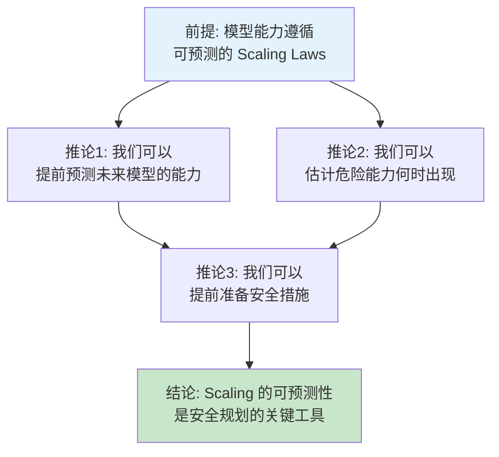
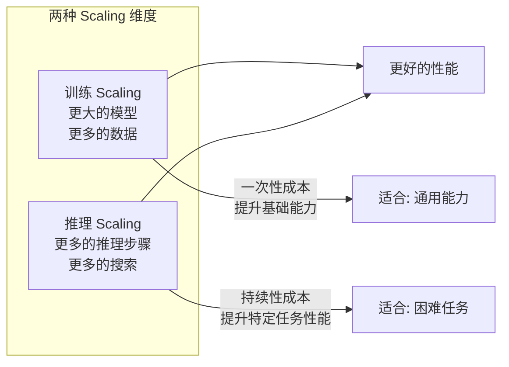

# Scaling Laws 进阶：工业实践与前沿研究

> 本文是 [模块 8B: Scaling Laws 与计算最优](./README.md) 的进阶补充，深入分析 Google、DeepSeek、Anthropic 三条技术线在 Scaling Laws 上的研究与实践，以及该领域的前沿话题。

---

## 目录

- [1. Google 的 Scaling 研究](#1-google-的-scaling-研究)
- [2. DeepSeek 的 Scaling Laws 实践](#2-deepseek-的-scaling-laws-实践)
- [3. Anthropic 的 Scaling 贡献](#3-anthropic-的-scaling-贡献)
- [4. 前沿话题](#4-前沿话题)

---

## 1. Google 的 Scaling 研究

### 1.1 从 Kaplan 到 Chinchilla：自我修正的历程

Google/DeepMind 在 Scaling Laws 研究中扮演了独特角色——**既是原始结论的推动者之一，也是修正者**。

**时间线**：

| 时间 | 工作 | 核心观点 |
|------|------|---------|
| 2020 | Kaplan et al. (OpenAI，多位后来加入 Anthropic 的作者) | 优先扩大模型 |
| 2022.03 | PaLM (Google) | 按 Kaplan 指导设计，540B 参数 |
| 2022.03 | Chinchilla (DeepMind) | 修正：模型-数据等比扩展 |
| 2022.12 | "Scaling Data-Constrained LMs" (DeepMind) | 数据受限场景的 Scaling Laws |

**关键洞察**：Chinchilla 论文的第一作者 Hoffmann 来自 DeepMind，而 Kaplan 论文的多位作者后来成为了 Anthropic 的创始团队成员。这意味着 Scaling Laws 的"自我修正"实际上跨越了多个组织。

Google/DeepMind 的修正并不是简单地否定 Kaplan，而是指出了实验方法论上的缺陷。这种科学自我修正的态度值得注意。

### 1.2 PaLM 的 Scaling 分析

PaLM（540B 参数）是在 Chinchilla 发表前训练的，基本遵循了 Kaplan 的指导。

**PaLM 的 Scaling 实验设计**：
- 训练了 8B、62B、540B 三个规模的模型
- 在相同数据上训练（780B tokens）
- 系统记录了训练过程中的损失变化

**PaLM 的 Scaling 分析结论**：

1. **Log-linear Scaling**：预训练损失在双对数坐标下确实呈线性关系
2. **下游任务 Scaling**：不同任务的 Scaling 行为差异很大
   - 知识密集型任务（如问答）：随规模平滑改善
   - 推理密集型任务（如数学）：存在类似"涌现"的加速改善
3. **多语言 Scaling**：不同语言的 Scaling 速率不同，低资源语言改善更快

**反思**：PaLM 540B 实际上是"过大"的——按 Chinchilla 最优，780B tokens 对应约 39B 参数的最优模型。PaLM 的参数量是 Chinchilla 最优的约 14 倍。

### 1.3 Gemini 的 Scaling 策略

> **注意**：Google 未公开 Gemini 的详细 Scaling Laws 分析。以下基于公开信息和技术报告中的线索推断。

**可以推断的策略**：

1. **Chinchilla-aware 但非 Chinchilla-optimal**：Gemini 的训练数据量远超 Chinchilla 最优（采用了过度训练策略）
2. **多模态 Scaling**：Gemini 是多模态模型，Scaling Laws 需要同时考虑文本、图像、视频等多种数据
3. **知识蒸馏辅助**：Gemma 2 的成功表明 Google 可能在 Gemini 训练中也使用了蒸馏

**Gemma 2 的 Scaling 启示**：

Gemma 2（2B、9B、27B）的设计策略值得关注：

| 模型 | 参数量 | 训练 tokens | tokens/param | 策略 |
|------|--------|------------|-------------|------|
| Gemma 2 2B | 2B | ~2T | ~1000 | 极度过度训练 + 蒸馏 |
| Gemma 2 9B | 9B | ~8T | ~889 | 重度过度训练 + 蒸馏 |
| Gemma 2 27B | 27B | ~13T | ~481 | 中度过度训练 |

Google 通过极度过度训练 + 知识蒸馏，使小模型的性能远超 Scaling Laws 的预测——这是对 Chinchilla 最优的创造性偏离。

### 1.4 数据受限场景的 Scaling Laws

DeepMind 的 Muennighoff et al. (2023) 研究了一个重要的实际问题：**当高质量数据不够用时怎么办？**

**核心发现**：
1. **数据重复的收益递减**：重复使用相同数据的 Scaling 效果远弱于使用新数据
2. **4 epochs 法则**：训练数据重复超过 4 个 epoch 后，性能增益急剧下降
3. **数据混合**：高质量数据 + 低质量数据的混合训练有特定的最优比例

这些发现对当前 LLM 训练至关重要——因为互联网上的高质量文本数据可能正在接近枯竭。

---

## 2. DeepSeek 的 Scaling Laws 实践

### 2.1 DeepSeek-V2/V3 的小模型 proxy 实验

DeepSeek 是将 Scaling Laws 用于工程实践的典范。他们在技术报告中详细描述了如何用小模型实验来指导大模型训练。

**实验方法**：


**DeepSeek 的关键创新**：

1. **超参数协同 Scaling**：不仅拟合 $(N, D) \to L$ 的关系，还拟合最优学习率、batch size 等超参数与模型规模的关系
2. **MoE 适配**：将 Scaling Laws 从稠密模型扩展到 MoE 架构，用激活参数替代总参数
3. **多目标预测**：同时预测预训练损失和下游 benchmark 性能

**实验细节**：

| 小模型规模 | 训练 tokens | 对应大模型预测 | 预测误差 |
|-----------|------------|-------------|---------|
| 2B | 200B | DeepSeek-V2 236B | <5% |
| 4B | 400B | — | — |
| 8B | 800B | — | — |
| 16B | 1.6T | DeepSeek-V3 671B | <3% |

### 2.2 MoE Scaling Laws 的实验细节

DeepSeek 在 MoE Scaling Laws 方面做了业界最系统的实验。

**实验设计**：

变量扫描：

| 变量 | 扫描范围 | 目的 |
|------|---------|------|
| 总参数量 | 2B → 32B | 验证幂律关系 |
| 激活参数比例 | 5% → 30% | 找到最优稀疏度 |
| 专家数量 | 8 → 256 | 专家数量的边际效益 |
| 专家粒度 | 粗 → 细 | 粒度对性能的影响 |
| Top-K | 1 → 4 | 激活专家数的影响 |
| 共享专家 | 有/无 | 共享专家的增益 |

**关键发现**：

1. **细粒度专家更优**：在固定激活参数的前提下，更多但更小的专家通常带来更好的性能
   - 直觉：更细的粒度允许更精确的路由
2. **共享专家有稳定增益**：共享专家提供基础能力，路由专家专注于差异化
3. **MoE 的有效参数量**：DeepSeek 发现 MoE 的有效参数量约为 $N_{\text{active}} \times 2.5$
4. **稀疏度的最优点**：约 10-15% 的激活比例在效率和性能之间取得最优平衡

### 2.3 开源 Scaling Laws 数据的价值

DeepSeek 的一个重要贡献是**公开了部分 Scaling Laws 实验数据**。

**对社区的意义**：

1. **验证**：其他研究者可以独立验证 Chinchilla 的结论
2. **扩展**：在 DeepSeek 数据的基础上探索新的 Scaling Laws 形式
3. **教育**：让学生和新入行的研究者有真实数据可以练习
4. **民主化**：降低了 Scaling Laws 研究的门槛（原本需要大量计算资源）

**数据格式示例**：

```
模型规模(B) | 训练tokens(B) | 最终loss | 最优LR | batch_size
2.0        | 100           | 2.85    | 3e-4  | 2048
2.0        | 200           | 2.72    | 3e-4  | 2048
4.0        | 200           | 2.61    | 2e-4  | 4096
4.0        | 400           | 2.48    | 2e-4  | 4096
...
```

---

## 3. Anthropic 的 Scaling 贡献

### 3.1 Anthropic 的 Scaling Laws 研究贡献

Anthropic 与 Scaling Laws 有深厚的历史渊源。多位 Anthropic 创始成员（包括 Dario Amodei、Tom Brown 等）是 Kaplan et al. (2020) "Scaling Laws for Neural Language Models" 的作者，这篇论文是在他们还在 OpenAI 期间完成的。

**Anthropic 团队的早期贡献**：

| 人物 | 在 Kaplan (2020) 中的角色 | 后来在 Anthropic 的角色 |
|------|------------------------|---------------------|
| Jared Kaplan | 第一作者 | 联合创始人、首席科学家 |
| Sam McCandlish | 作者 | 联合创始人 |
| Tom Brown | 作者 | 联合创始人 |
| Dario Amodei | 作者 | CEO |

这意味着 Anthropic 从成立之初就深度理解 Scaling Laws，并将其作为公司战略的核心基础之一。

### 3.2 "Scaling is Predictable" 的方法论意义

Anthropic 独特的视角在于：**将 Scaling 的可预测性作为安全规划的基础工具**。

**核心论证**：



**方法论意义**：

1. **从"事后应对"到"事前规划"**：如果能力是可预测的，就不需要等到模型训练出来才发现问题
2. **量化风险评估**：可以用 Scaling Laws 来估计"多大的模型可能产生什么风险"
3. **安全投入的规划依据**：知道未来模型的能力水平，可以提前投入相应的安全研究

### 3.3 Scaling 预测在安全规划中的应用

> **注意**：以下内容部分基于 Anthropic 公开的博客文章和政策文件推断。具体内部实践细节未公开，标记为 [推测] 的部分为合理推断。

**Anthropic 的 Responsible Scaling Policy (RSP)**：

Anthropic 的 RSP 是业界首个系统性地将 Scaling Laws 纳入安全框架的政策。核心思想是：

1. **定义能力阈值**（AI Safety Levels, ASL）：不同级别的危险能力需要不同级别的安全措施
2. **用 Scaling Laws 预测何时达到阈值** [推测]：基于当前的 Scaling 趋势，估计下一代模型可能达到的能力水平
3. **提前准备安全评估**：在模型训练完成前就设计好安全评估方案

**Scaling Laws 在安全研究中的具体应用**：

| 应用方向 | 方法 | 状态 |
|---------|------|------|
| 预测危险能力出现 | 在小模型上测试特定危险能力的 Scaling 趋势 | 公开讨论 |
| 评估对齐技术的 Scaling | 对齐效果是否随模型规模保持？ | 活跃研究 |
| 规划安全投入 | 根据 Scaling 预测分配安全研究资源 | [推测] 在执行 |

**一个重要的开放问题**：

对齐技术的效果是否也遵循 Scaling Laws？如果更大的模型更难对齐（即安全对齐的"Scaling tax"随规模增长），那么追求更大模型可能存在根本性风险。Anthropic 的一些研究（如 Constitutional AI）正在探索这个问题。

### 3.4 Anthropic 与 Scaling 相关的已发表工作

虽然 Anthropic 在成立后没有发表专门的 Scaling Laws 论文，但以下工作与 Scaling 密切相关：

1. **"A General Language Assistant as a Laboratory for Alignment"** (2021): 研究了不同对齐方法在不同规模下的表现
2. **Claude 系列模型的技术报告**: 虽然没有公开详细的 Scaling 分析，但模型性能的代际进步暗示了系统性的 Scaling 策略
3. **Mechanistic Interpretability 研究**: 理解模型内部机制如何随规模变化，是对 Scaling Laws 的更深层解释

---

## 4. 前沿话题

### 4.1 超越幂律：是否存在 Scaling Laws 的极限？

**核心问题**：幂律不可能永远持续。当模型足够大、数据足够多时，Scaling Laws 是否会"失效"？

**可能的极限来源**：

1. **数据质量上限**：互联网文本的固有噪声设定了不可约损失的下限
2. **架构限制**：Transformer 架构可能无法无限受益于规模扩展
3. **知识饱和**：人类知识总量是有限的，模型最终会"学完"所有知识
4. **训练不稳定性**：超大模型的训练越来越容易遇到损失尖峰和发散

**理论推测**：

一些研究者提出了修正的 Scaling 模型，加入饱和效应：

$$L(N) = \frac{A}{N^\alpha} + E + \frac{F}{N^{-\gamma}}$$

最后一项表示超大规模时的性能饱和甚至退化（如训练不稳定导致）。但目前还没有足够的实验证据来确认这种修正。

**工程界的"实用主义"态度**：

尽管理论上存在极限，但当前最大的模型似乎仍在幂律的有效范围内。因此工程师们倾向于"继续扩展，直到观察到偏离"。

### 4.2 Inference-time Compute Scaling

**新范式：推理时的计算 Scaling**

传统 Scaling Laws 关注的是**训练时的计算**。但 2024 年以来，推理时的计算 Scaling 成为新的研究热点。

**核心发现**：

通过在推理时投入更多计算（如多次采样、验证、搜索），可以显著提升模型性能，而且这种提升也遵循可预测的 Scaling Laws。

$$\text{Performance} \propto C_{\text{inference}}^{\delta}$$

其中 $C_{\text{inference}}$ 是推理时的计算量（如生成的 token 总数、搜索次数等），$\delta > 0$ 是推理 Scaling 指数。

**代表工作**：

| 工作 | 方法 | 推理计算增加方式 |
|------|------|---------------|
| OpenAI o1/o3 | 思维链搜索 | 生成更长的推理链 |
| DeepSeek-R1 | 强化学习引导的推理 | 多步推理 + 验证 |
| Google Gemini 2.0 | 测试时搜索 | Tree-of-thought 搜索 |

**与训练 Scaling 的关系**：



> 这一话题将在模块 13（CoT 与推理增强）中深入展开。

### 4.3 Scaling Laws 的理论解释：统计力学视角

**为什么 Scaling Laws 是幂律？**

这个问题至今没有完全令人满意的答案，但统计力学提供了一个有前景的理论框架。

**核心类比**：

| 统计力学概念 | LLM Scaling 对应 |
|------------|----------------|
| 系统自由度 | 模型参数 $N$ |
| 温度 | 学习率、训练噪声 |
| 能量 | 损失函数 |
| 相变 | 涌现能力 |
| 配分函数 | 模型对数据的似然 |

**理论尝试**：

1. **随机矩阵理论**：模型权重矩阵的特征值分布可以预测 Scaling 行为
2. **统计学习理论**：bias-variance tradeoff 的推广可以解释幂律指数
3. **信息论**：数据的内在信息结构（如自然语言的分形统计特性）决定了 Scaling 指数
4. **神经正切核（NTK）理论**：在无限宽度极限下的 Scaling 分析

**Sharma & Kaplan (2022)** 提出了一个基于数据流形维度的理论：

$$\alpha \approx \frac{d}{2d + d_{\text{data}}}$$

其中 $d_{\text{data}}$ 是数据的内在维度。这个公式虽然不精确，但揭示了 Scaling 指数可能与数据的内在复杂度有关。

### 4.4 数据质量的 Scaling Laws

**核心问题**：高质量数据是否有不同的 Scaling 曲线？

**经验发现**：

是的。多项研究表明，数据质量显著影响 Scaling Laws 的参数：

$$L_{\text{high-quality}}(D) = \frac{A'}{D^{\beta'}}, \quad \beta' > \beta_{\text{low-quality}}$$

即高质量数据的 Scaling 指数更大，意味着每增加一单位高质量数据带来的收益更大。

**实际影响**：

| 数据质量策略 | 对 Scaling 的影响 | 典型实践 |
|------------|-----------------|---------|
| 原始网页数据 | 基线 Scaling | Common Crawl 原始数据 |
| 质量过滤 | 指数 $\beta$ 增大 | FineWeb, RefinedWeb |
| 合成数据 | 效果因质量而异 | Phi 系列的教科书级数据 |
| 代码数据 | 对推理能力有独特 Scaling | StarCoder, Code Llama |

**Microsoft Phi 系列的启示**：

Phi 系列模型（1.3B, 2.7B）通过使用极高质量的"教科书级"合成数据，在远小于 Scaling Laws 预测的模型规模下就达到了出色的性能。这表明 **数据质量可以有效"左移" Scaling 曲线**。

### 4.5 Chinchilla 之后的 Scaling 研究综述

2022 年 Chinchilla 之后，Scaling Laws 研究进入了新阶段：

**2023 年的重要进展**：

1. **Llama 系列验证过度训练策略**：Llama 1/2/3 系统性地验证了过度训练的可行性和效果
2. **数据混合 Scaling**：不同数据类型（文本、代码、数学）的最优混合比例随规模变化
3. **微调 Scaling Laws**：SFT 和 RLHF 阶段也有自己的 Scaling Laws

**2024 年的趋势**：

1. **Inference Scaling**：推理时间计算的 Scaling 成为新焦点
2. **MoE Scaling 的系统化**：DeepSeek 等团队给出了 MoE 的详细 Scaling 分析
3. **多模态 Scaling**：图文混合训练的 Scaling Laws 开始被研究
4. **Scaling Laws 的"民主化"**：更多开源数据和工具使小团队也能利用 Scaling Laws

**2025 年及之后的展望** [推测]：

1. 推理 Scaling 可能成为主导范式
2. 数据效率（而非数据规模）成为核心挑战
3. Scaling Laws 的理论基础将进一步完善
4. 专门领域（如科学、医学）的 Scaling Laws 将被独立研究

### 4.6 Scaling Law 的数学推导：为什么是幂律？

Scaling Laws 呈现为幂律（power law）这一事实本身就值得深入追问：**为什么是幂律而不是指数衰减、对数衰减或其他函数形式？**

#### Kaplan 幂律关系的推导思路

Kaplan et al. (2020) 的幂律发现主要是经验性的，但后续的理论工作提供了一些解释。

**基于偏差-方差分解的推导**：

考虑一个模型在数据上的期望损失可以分解为：

$$L = \underbrace{L_\infty}_{\text{不可约误差}} + \underbrace{L_{\text{bias}}(N)}_{\text{模型偏差}} + \underbrace{L_{\text{var}}(D)}_{\text{估计方差}}$$

- **不可约误差** $L_\infty$：数据本身的固有噪声，即使完美模型也无法消除
- **模型偏差** $L_{\text{bias}}(N)$：有限参数量导致的表达力不足
- **估计方差** $L_{\text{var}}(D)$：有限数据导致的参数估计不确定性

在统计学习理论中，对于光滑函数类，bias 项通常以幂律衰减：

$$L_{\text{bias}}(N) \propto N^{-\alpha}$$

其中 $\alpha$ 与数据流形的内在维度 $d_{\text{data}}$ 有关。类似地，variance 项：

$$L_{\text{var}}(D) \propto D^{-\beta}$$

将两者相加，就得到了 Chinchilla 损失模型的形式：

$$L(N, D) = \frac{A}{N^{\alpha}} + \frac{B}{D^{\beta}} + L_\infty$$

**为什么不是指数衰减？** 指数衰减（$L \propto e^{-cN}$）意味着每增加固定数量的参数，loss 减半——这在物理上不太合理，因为"容易学"的模式总是先被学到，后续的参数主要用于捕捉越来越精细的模式，边际收益递减。幂律恰好描述了这种"越来越难"的递减规律。

#### 与统计学习理论的联系

经典统计学习理论中的"学习曲线"（learning curve）描述了测试误差如何随样本量 $n$ 下降。对于光滑函数类和核方法：

$$\text{Excess Risk} \propto n^{-\frac{2s}{2s + d}}$$

其中 $s$ 是函数的光滑度，$d$ 是输入维度。这个结果与 Scaling Laws 的形式一致——都是幂律，且指数由数据的内在复杂度决定。

**Sharma & Kaplan (2022)** 将这一联系具体化，提出：

$$\alpha \approx \frac{d_{\text{model}}}{2d_{\text{model}} + d_{\text{data}}}$$

其中 $d_{\text{model}}$ 是模型的有效维度，$d_{\text{data}}$ 是数据流形的内在维度。这个公式的直觉是：数据越复杂（$d_{\text{data}}$ 越大），Scaling 越慢（$\alpha$ 越小），需要更多参数才能获得相同的改善。

#### 未完成的理论挑战

尽管上述分析提供了部分解释，Scaling Laws 的完整理论推导仍然是一个开放问题：

1. **幂律指数的精确预测**：目前还不能从数据和架构的第一性原理推导出 $\alpha \approx 0.34$, $\beta \approx 0.28$ 这些具体值
2. **可加性假设的合理性**：$L = A/N^\alpha + B/D^\beta + E$ 假设模型不足和数据不足的贡献是可加的，但实际上两者可能存在交互作用
3. **架构依赖性**：不同架构（Transformer vs RNN vs State Space Model）是否有不同的 Scaling 指数？初步实验表明差异很小，但原因不明

---

## 延伸阅读

### Google/DeepMind

- Hoffmann et al. (2022). "Training Compute-Optimal Large Language Models." (Chinchilla)
- Chowdhery et al. (2022). "PaLM: Scaling Language Modeling with Pathways."
- Muennighoff et al. (2023). "Scaling Data-Constrained Language Models."
- Gemma Team (2024). "Gemma 2: Improving Open Language Models at a Practical Size."

### DeepSeek

- DeepSeek-AI (2024). "DeepSeek-V2: A Strong, Economical, and Efficient MoE Language Model."
- DeepSeek-AI (2024). "DeepSeek-V3 Technical Report."

### Anthropic

- Kaplan et al. (2020). "Scaling Laws for Neural Language Models."
- Anthropic (2023). "Anthropic's Responsible Scaling Policy."
- Bai et al. (2022). "Training a Helpful and Harmless Assistant with RLHF."

### 前沿研究

- Sharma & Kaplan (2022). "Scaling Laws from the Data Manifold Dimension."
- Yang et al. (2022). "Tensor Programs V: Tuning Large Neural Networks via Zero-Shot Hyperparameter Transfer." (muP)
- Schaeffer et al. (2023). "Are Emergent Abilities of Large Language Models a Mirage?"
- Snell et al. (2024). "Scaling LLM Test-Time Compute Optimally can be More Effective than Scaling Model Parameters."
