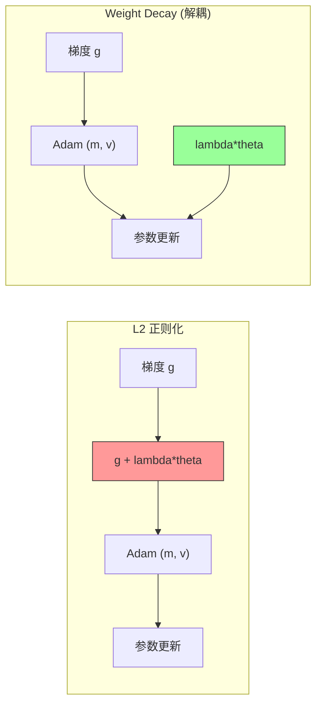
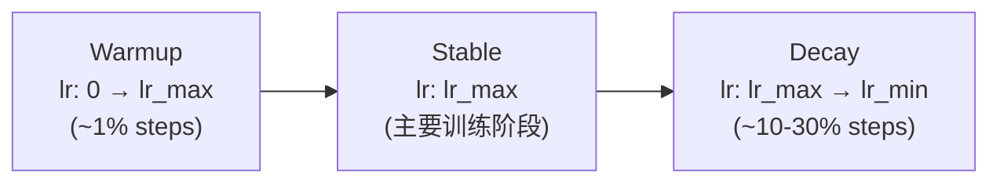
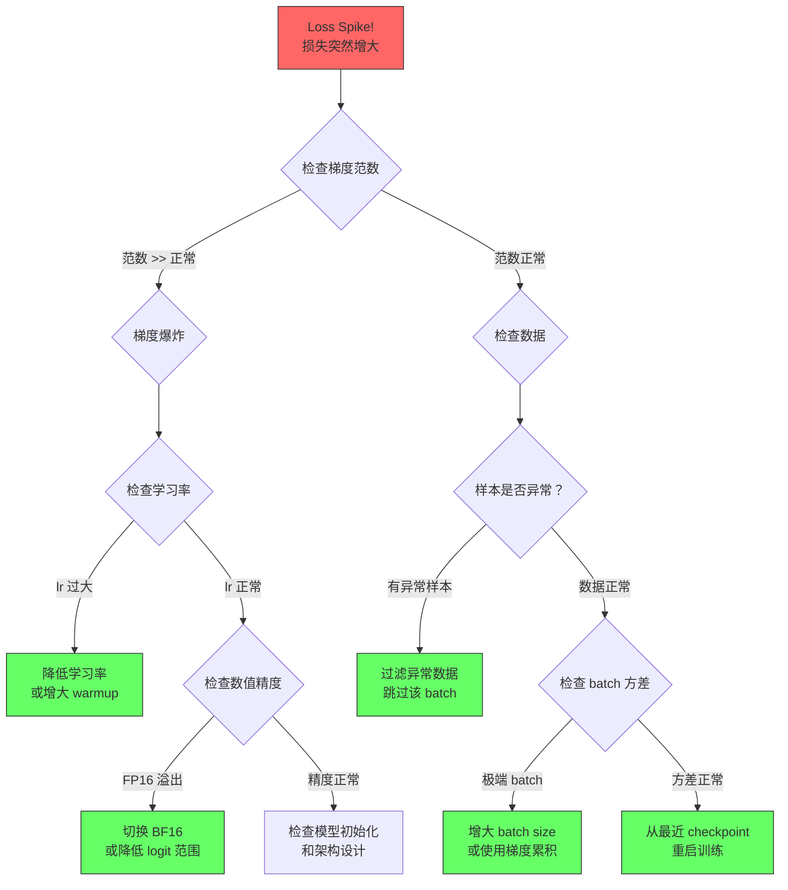
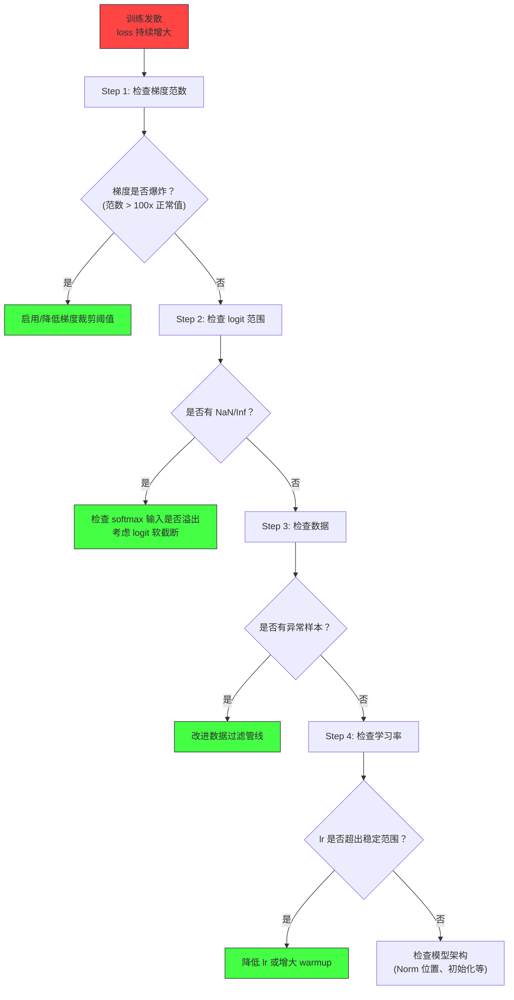
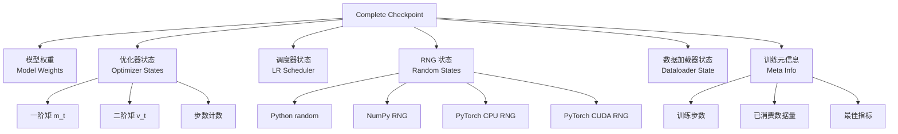
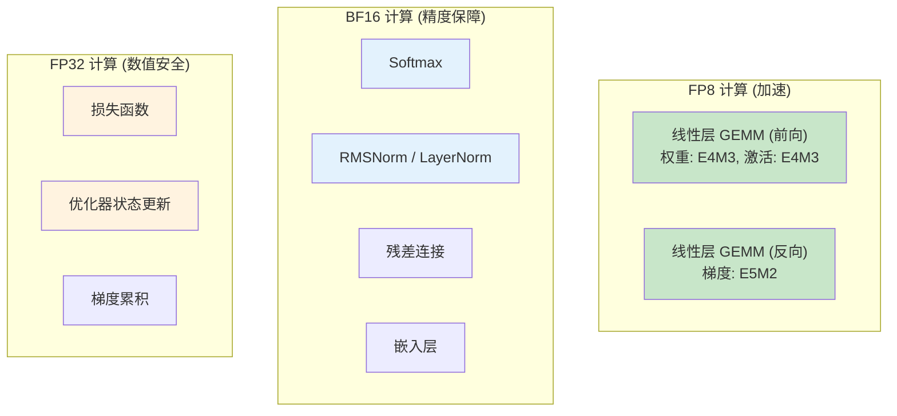

# 模块 8C：预训练（下）— 训练工程与实战

> 大规模 LLM 预训练不仅是算法问题，更是工程问题。本章系统讲解预训练中的核心工程组件：优化器、学习率调度、权重初始化、梯度管理、训练稳定性、断点续训和训练监控，并深入分析 Google PaLM、DeepSeek-V3 和 Anthropic 的训练工程实践。

---

## 章节定位

本模块是预训练三部曲的最后一部分。在模块 8A 确定了"学什么"（目标函数），模块 8B 确定了"用多少资源"（Scaling Laws）之后，本模块回答最后一个关键问题：**如何将理论上的最优配置高效、稳定地转化为实际的训练过程？**


**学完本模块后，你将能够回答**：
- AdamW 中的 Weight Decay 和 L2 正则化为什么不等价？
- Cosine Decay 和 WSD 调度各有什么优缺点？什么时候用哪个？
- 遇到 Loss Spike 应该怎么诊断和处理？
- 一个完整的 checkpoint 需要保存哪些状态？
- FP8 训练是如何实现的？为什么需要混合精度策略？

---

## 目录

- [1. 优化器深入：AdamW](#1-优化器深入adamw)
- [2. 学习率调度策略](#2-学习率调度策略)
- [3. 权重初始化](#3-权重初始化)
- [4. 梯度管理](#4-梯度管理)
- [5. Batch Size 策略](#5-batch-size-策略)
- [6. 训练稳定性专题](#6-训练稳定性专题)
- [7. 断点续训与容错](#7-断点续训与容错)
- [8. 训练监控与评估](#8-训练监控与评估)
- [9. 多阶段预训练](#9-多阶段预训练)
- [10. MoE 预训练的特殊工程挑战](#10-moe-预训练的特殊工程挑战)
- [11. 三条技术线的训练工程实践](#11-三条技术线的训练工程实践)
- [12. FP8 训练详解](#12-fp8-训练详解)
- [13. muP：超参数迁移的理想方案](#13-mup超参数迁移的理想方案)
- [14. 项目实践](#14-项目实践)

---

## 1. 优化器深入：AdamW

### 1.1 Adam 回顾

Adam（Adaptive Moment Estimation）是当前 LLM 训练的标准优化器，结合了**动量**（一阶矩）和**自适应学习率**（二阶矩）两大机制。

**一阶矩估计（动量）**：

$$m_t = \beta_1 m_{t-1} + (1 - \beta_1) g_t$$

$m_t$ 是梯度的指数移动平均，起到"平滑梯度方向"的作用，减少噪声影响，加速收敛。

**二阶矩估计（自适应学习率）**：

$$v_t = \beta_2 v_{t-1} + (1 - \beta_2) g_t^2$$

$v_t$ 是梯度平方的指数移动平均，用于自适应调整每个参数的学习率：梯度大的参数用更小的步长，梯度小的参数用更大的步长。

**偏差修正**：

由于 $m_0 = 0$，$v_0 = 0$，初始阶段的矩估计偏小。偏差修正消除这一初始化偏差：

$$\hat{m}_t = \frac{m_t}{1 - \beta_1^t}, \quad \hat{v}_t = \frac{v_t}{1 - \beta_2^t}$$

**更新规则**：

$$\theta_t = \theta_{t-1} - \eta \frac{\hat{m}_t}{\sqrt{\hat{v}_t} + \epsilon}$$

### 1.2 AdamW：Weight Decay vs L2 正则化的本质区别

AdamW 的核心贡献在于证明了：**在 Adam 优化器下，Weight Decay 和 L2 正则化不等价**。

**L2 正则化**：将惩罚项加入损失函数

$$\mathcal{L}_{L2} = \mathcal{L} + \frac{\lambda}{2} \|\theta\|^2$$

梯度变为：

$$g_t^{L2} = \nabla \mathcal{L}(\theta_t) + \lambda \theta_t$$

这个修改后的梯度被送入 Adam 的 $m_t$ 和 $v_t$ 计算。**问题在于**：正则化梯度 $\lambda \theta_t$ 也被自适应学习率缩放了，导致正则化效果与学习率耦合。

**Weight Decay（解耦）**：直接缩减权重，不经过梯度

$$\theta_t = (1 - \eta \lambda) \theta_{t-1} - \eta \frac{\hat{m}_t}{\sqrt{\hat{v}_t} + \epsilon}$$



**等价性证明**：

在标准 SGD 下，L2 正则化和 Weight Decay 是等价的：

SGD + L2：

$$\theta_t = \theta_{t-1} - \eta (g_t + \lambda \theta_{t-1}) = (1 - \eta\lambda)\theta_{t-1} - \eta g_t$$

SGD + WD：

$$\theta_t = (1 - \eta\lambda)\theta_{t-1} - \eta g_t$$

两者完全相同。但在 Adam 下：

Adam + L2：

$$\theta_t = \theta_{t-1} - \eta \frac{\hat{m}_t^{L2}}{\sqrt{\hat{v}_t^{L2}} + \epsilon}$$

其中 $m_t^{L2}$ 和 $v_t^{L2}$ 基于 $g_t + \lambda\theta_t$ 计算，正则化项被自适应学习率缩放。

Adam + WD：

$$\theta_t = (1 - \eta\lambda)\theta_{t-1} - \eta \frac{\hat{m}_t}{\sqrt{\hat{v}_t} + \epsilon}$$

$m_t$ 和 $v_t$ 基于纯梯度 $g_t$ 计算，Weight Decay 独立于 Adam 的自适应机制。**二者不等价**。

### 1.3 优化器状态的显存分析

Adam/AdamW 的最大代价是显存占用——优化器状态需要存储两份与模型参数等大的张量。

| 组成部分 | 精度 | 每参数字节数 | 7B 模型占用 |
|----------|------|-------------|------------|
| 模型权重 | FP32 | 4 | 28 GB |
| 梯度 | FP32 | 4 | 28 GB |
| 一阶矩 $m_t$ | FP32 | 4 | 28 GB |
| 二阶矩 $v_t$ | FP32 | 4 | 28 GB |
| **合计** | | **16** | **112 GB** |

> 混合精度训练下，模型权重和梯度可用 FP16/BF16（2 字节），但优化器状态通常保持 FP32，总计约 $2P + 2P + 4P + 4P = 12P$ 字节。

### 1.4 超参数选择原则

| 超参数 | 典型值 | 说明 |
|--------|--------|------|
| $\beta_1$ | 0.9 | 通用默认，控制动量的衰减速度 |
| $\beta_2$ | 0.95 (GPT-3/LLaMA) vs 0.999 (原始 Adam) | 更小的值使优化器对近期方差更敏感，在大规模训练中更稳定 |
| $\epsilon$ | 1e-8 (默认) vs 1e-6 (某些场景) | 更大的 epsilon 可以在梯度二阶矩很小时提高数值稳定性 |
| Weight Decay | 0.1 | 通常对 bias 和 LayerNorm 参数不施加 |

**为什么 LLM 训练倾向用更小的 $\beta_2$？**

$\beta_2 = 0.999$ 意味着二阶矩 $v_t$ 的"记忆"跨越约 1000 步。在大规模预训练中，数据分布在不同阶段差异很大（前期学语法，后期学语义），过长的记忆窗口导致自适应学习率调整迟缓。$\beta_2 = 0.95$ 将记忆缩短到约 20 步，使优化器更灵敏。

### 1.5 其他优化器简介

| 优化器 | 核心思想 | 显存 | 适用场景 |
|--------|----------|------|----------|
| **Adafactor** | 分解 $v_t$ 为行向量和列向量的外积，不存完整矩阵 | 低 | T5 训练，显存受限 |
| **LION** | 只取梯度方向的 sign，不存 $v_t$ | 很低 | 实验性，某些场景优于 Adam |
| **8-bit Adam** | 将 $m_t$, $v_t$ 量化为 INT8 存储 | ~25% Adam | 微调场景 |

```python
# 8-bit Adam 的核心思想
# 标准 Adam: m_t, v_t 各占 P * 4 字节 = 8P 字节
# 8-bit Adam: m_t, v_t 各占 P * 1 字节 + 缩放因子 = ~2P 字节
# 量化/反量化在更新时动态执行

# 使用 bitsandbytes 库:
# import bitsandbytes as bnb
# optimizer = bnb.optim.Adam8bit(model.parameters(), lr=3e-4)
```

> 完整实现见 `code/training_engineering/optimizer.py`。

---

## 2. 学习率调度策略

学习率调度是预训练中最敏感的超参数之一。过大会导致训练不稳定，过小则收敛太慢。

### 2.1 Warmup + Cosine Decay

这是最经典的调度策略，被 GPT-3、LLaMA 等模型采用。

**Warmup 的理论依据**：

训练初期，模型参数是随机初始化的，此时梯度方向不可靠。如果直接使用大学习率更新，参数容易跑到 loss landscape 的"坏区域"，后续难以恢复。Warmup 让模型先以小学习率"摸索"方向，逐步过渡到完整学习率。

**Cosine 衰减公式**：

$$\eta_t = \eta_{min} + \frac{1}{2}(\eta_{max} - \eta_{min})\left(1 + \cos\left(\frac{\pi t}{T}\right)\right)$$

其中 $t$ 是当前步数（不含 warmup），$T$ 是衰减总步数。

**特点**：
- $t = 0$：$\cos(0) = 1 \Rightarrow \eta = \eta_{max}$
- $t = T$：$\cos(\pi) = -1 \Rightarrow \eta = \eta_{min}$
- 中间阶段平滑过渡，前期下降慢，后期加速

**Warmup 步数的经验选择**：通常为总步数的 0.1% ~ 1%。

### 2.2 WSD（Warmup-Stable-Decay）调度

WSD 是 MiniCPM 和 DeepSeek-V3 采用的策略，分三个阶段：



**核心优势**：

| 对比维度 | Cosine Decay | WSD |
|----------|-------------|-----|
| 是否需要预定总步数 | 是（必须提前确定 $T$） | 否（Stable 阶段可无限延续） |
| 训练时间灵活性 | 低（改 $T$ 要重新训练） | 高（随时可切入 Decay） |
| 学习率利用效率 | 大部分时间 lr 在下降 | 大部分时间保持高 lr |
| 最终性能 | 接近 | 接近 |

WSD 的实际使用方式：训练到某个指标满意时，触发 Decay 阶段。

### 2.3 退火阶段（Cooldown / Annealing）

训练末期的"退火"是近年来的重要实践，同时调整**学习率**和**数据质量**。

**Llama 3 的数据退火实践**：
- 在最后约 5% 的训练步中，将学习率从标准值线性衰减到 0
- 同时切换到更高质量的数据（如精选的教科书、高质量代码、学术论文）
- 实验证明退火可显著提升多个下游任务的表现

### 2.4 学习率与 Batch Size 的关系

当增大 batch size 时，学习率需要协同调整。

**线性缩放法则**：

$$\eta' = \eta \cdot \frac{B'}{B}$$

batch size 增大 $k$ 倍，学习率也增大 $k$ 倍。直觉：更大的 batch 提供更准确的梯度估计，可以走更大的步。

**平方根缩放**：

$$\eta' = \eta \cdot \sqrt{\frac{B'}{B}}$$

某些实验发现平方根缩放更稳定，尤其在 batch size 增大倍数很大时。

> 完整实现见 `code/training_engineering/lr_scheduler.py`。

---

## 3. 权重初始化

良好的初始化让训练从一个"合理的起点"开始，避免梯度消失/爆炸。

### 3.1 标准初始化方法

**Xavier/Glorot 初始化**：

目标：保持每层输出的方差与输入一致。

$$W \sim U\left[-\sqrt{\frac{6}{n_{in} + n_{out}}}, \sqrt{\frac{6}{n_{in} + n_{out}}}\right]$$

**推导**：对于线性层 $y = Wx$，假设 $x$ 的各元素独立同分布，$W$ 的各元素独立同分布：

$$\text{Var}(y_i) = n_{in} \cdot \text{Var}(W_{ij}) \cdot \text{Var}(x_j)$$

要求 $\text{Var}(y) = \text{Var}(x)$，则 $\text{Var}(W) = 1 / n_{in}$。

同时考虑反向传播（要求梯度方差不变），取折中：$\text{Var}(W) = 2 / (n_{in} + n_{out})$。

**He/Kaiming 初始化**：

适配 ReLU 激活函数。ReLU 将一半的值置零，方差减半，因此需要补偿：

$$W \sim \mathcal{N}\left(0, \sqrt{\frac{2}{n_{in}}}\right)$$

**截断正态分布初始化**：

实践中常用截断正态分布（截断到 2 个标准差以内），避免极端值。

### 3.2 残差分支的缩放

在深层 Transformer 中，残差连接会导致信号方差随层数增长。

$$x_{l+1} = x_l + f_l(x_l)$$

假设 $\text{Var}(f_l) = \sigma^2$（每层残差分支的贡献），$N$ 层后：

$$\text{Var}(x_N) = \text{Var}(x_0) + N \cdot \sigma^2$$

方差线性增长，深层网络中会导致数值不稳定。

**GPT-2 风格的缩放**：在每层的残差分支的输出投影层，初始化权重时乘以 $1 / \sqrt{2N}$：

$$W_{out} \sim \mathcal{N}\left(0, \frac{0.02}{\sqrt{2N}}\right)$$

其中 $N$ 是 Transformer 层数，因子 2 是因为每层有两个残差连接（Attention + FFN）。

缩放后：

$$\text{Var}(x_N) = \text{Var}(x_0) + N \cdot \frac{\sigma^2}{2N} = \text{Var}(x_0) + \frac{\sigma^2}{2}$$

方差不再随深度增长。

### 3.3 muP 初始化

muP（Maximal Update Parameterization）的目标是使**不同宽度的模型有相似的训练动力学**，从而可以在小模型上调参，直接迁移到大模型。

**核心思想**：

标准参数化下，模型宽度从 $d$ 增大到 $d'$ 时，最优学习率会变化。muP 通过调整初始化方差和学习率，使得宽度变化不影响训练行为。

**规则概要**：

| 组件 | 标准参数化 | muP |
|------|-----------|-----|
| 嵌入层初始化 | $\sigma = 1/\sqrt{d}$ | $\sigma = 1$ |
| 隐藏层初始化 | $\sigma = 1/\sqrt{d}$ | $\sigma = 1/\sqrt{d}$ |
| 输出层初始化 | $\sigma = 1/\sqrt{d}$ | $\sigma = 1/d$ |
| 隐藏层学习率 | $\eta$ | $\eta / d$ |

**实际意义**：在 128 维的小模型上做超参数搜索（几小时），找到的最优 $\eta$、$\beta$、weight decay 等参数，可以直接用于 4096 维的大模型（几周训练），省去大量调参成本。

---

## 4. 梯度管理

### 4.1 梯度裁剪（Gradient Clipping）

梯度裁剪是防止训练不稳定的第一道防线。

**L2 范数裁剪**：

$$g' = g \cdot \min\left(1, \frac{c}{\|g\|_2}\right)$$

其中 $c$ 是裁剪阈值（通常为 1.0）。只有当梯度范数超过 $c$ 时才缩放，不改变方向。

```python
# PyTorch 实现
torch.nn.utils.clip_grad_norm_(model.parameters(), max_norm=1.0)
```

**裁剪阈值的选择**：
- 1.0 是最常用的值，适用于大多数 LLM 训练
- 可以通过监控梯度范数的分布来调整
- 如果频繁触发裁剪（> 10% 的步），说明学习率可能过大

### 4.2 梯度累积

当 GPU 显存不足以容纳期望的 batch size 时，用梯度累积来模拟大 batch。

**等价性证明**：

标准大 batch 更新：

$$g = \frac{1}{B} \sum_{i=1}^{B} \nabla \mathcal{L}(x_i)$$

梯度累积 $K$ 步（每步 $B/K$ 个样本）：

$$g_{accum} = \frac{1}{K} \sum_{k=1}^{K} \left[\frac{1}{B/K} \sum_{i \in \text{batch}_k} \nabla \mathcal{L}(x_i)\right] = \frac{1}{B} \sum_{i=1}^{B} \nabla \mathcal{L}(x_i) = g$$

**数学上完全等价**。前提条件：损失需要正确归一化。

**实现要点**：

```python
# 梯度累积的正确实现
optimizer.zero_grad()
for k in range(grad_accum_steps):
    micro_batch = get_micro_batch(k)
    loss = model(micro_batch) / grad_accum_steps  # 关键: 归一化
    loss.backward()  # 梯度自动累积
# 累积完成后才更新
optimizer.step()
```

**注意**：`loss.backward()` 会将梯度**累加**到 `.grad` 中（除非手动清零），这正是梯度累积利用的特性。归一化除以 `grad_accum_steps` 确保了等价性。

### 4.3 梯度范数监控

梯度范数是训练健康度的核心指标。

| 现象 | 可能原因 | 处理方法 |
|------|----------|---------|
| 范数突然增大 | 异常数据、学习率过大 | 检查数据、降低 lr |
| 范数趋近于零 | 梯度消失、学习率过小 | 检查架构、增大 lr |
| 各层范数差异大 | 缺少残差连接/归一化 | 使用 Pre-Norm、残差缩放 |
| 范数持续增大 | 学习率太大、WD 不足 | 降低 lr、增大 WD |

> 完整实现见 `code/training_engineering/utils.py` 中的 `compute_grad_norm()`。

---

## 5. Batch Size 策略

### 5.1 固定 vs 动态 Batch Size

传统做法是使用固定 batch size，但实践中**逐步增大 batch size**（Batch Size Warmup）有时更有效。

- 训练早期用小 batch size：梯度噪声大，相当于隐式正则化，有助于探索
- 训练后期用大 batch size：梯度更准确，加速收敛

### 5.2 临界批大小（Critical Batch Size）

临界批大小定义了**增大 batch size 从"高效"变为"低效"的转折点**。

**直觉理解**：

每个样本的梯度既有"信号"（正确的更新方向）也有"噪声"（样本间的随机差异）。增大 batch size，噪声被平均掉，但计算量增加。

- $B < B_{crit}$：增大 batch size 几乎不浪费计算（噪声被有效平均）
- $B > B_{crit}$：增大 batch size 回报递减（噪声已足够小，继续平均无意义）

**形式化推导**：

梯度噪声标度（gradient noise scale）：

$$B_{noise} = \frac{\text{tr}(\Sigma)}{|G|^2}$$

其中 $\text{tr}(\Sigma)$ 是梯度协方差矩阵的迹，$|G|$ 是梯度的模。

临界批大小：

$$B_{crit} \approx \frac{B_{noise}}{L}$$

$L$ 是当前损失值。随着训练推进、损失降低，$B_{crit}$ 增大，这正好与"逐步增大 batch size"的策略一致。

### 5.3 DeepSeek-V3 的 Batch Size 调度实践

DeepSeek-V3 在训练过程中动态调整 batch size：

- 前期：从 3072 逐步增大到 15360
- 学习率和 batch size 同步变化
- 配合 WSD 学习率调度

这种策略在训练初期节省计算量，后期充分利用硬件并行度。

---

## 6. 训练稳定性专题

训练不稳定是大规模 LLM 训练中最棘手的工程问题。

### 6.1 Loss Spike 的根因分析

Loss spike 是训练过程中损失值突然急剧增大的现象。以下是系统化的根因分析决策树：



### 6.2 PaLM 的 Loss Spike 处理经验

Google 的 PaLM（540B 参数）在训练中遭遇了 200-500 次 loss spike。他们的处理策略：

1. **从 spike 前 100 步的 checkpoint 重启**：直接丢弃 spike 期间的训练进度
2. **跳过导致 spike 的数据批次**：确认是某些数据触发后，将其排除
3. **不调整超参数**：大部分 spike 是数据驱动的偶发事件，改超参数可能适得其反

**工程代价**：每次重启需要重新加载 checkpoint、恢复所有状态、重新预热数据管道。200+ 次的累计浪费占总训练时间的 5-10%。

### 6.3 训练发散的诊断流程

当训练出现持续的 loss 增大（而非短暂 spike）时，需要系统化诊断：



### 6.4 数值精度与训练稳定性

| 格式 | 位数 | 范围 | 精度 | 稳定性 | 速度 |
|------|------|------|------|--------|------|
| FP32 | 32 | $\pm 3.4 \times 10^{38}$ | 高 | 最好 | 基准 |
| FP16 | 16 | $\pm 65504$ | 中 | 需要 loss scaling | 2x |
| BF16 | 16 | $\pm 3.4 \times 10^{38}$ | 较低 | 好（范围大） | 2x |
| FP8 (E4M3) | 8 | $\pm 448$ | 低 | 需要额外工程 | 4x |

**BF16 vs FP16**：

BF16 保留了 FP32 的指数位数（8位），动态范围与 FP32 相同，不易溢出。而 FP16 的指数只有 5 位，最大值仅 65504，在 LLM 训练中经常溢出。

**FP8 训练**（DeepSeek-V3）：

FP8 将计算速度提升到 FP16 的 2 倍，但需要额外的工程措施来保证精度，包括动态缩放（dynamic scaling）、选择性精度保持（部分关键计算保持高精度）等。详见模块 9。

### 6.5 梯度爆炸与消失

深度网络的梯度传播问题在 Transformer 中通过以下机制缓解：

**Pre-Norm 的稳定性优势**（回顾模块 3）：

Post-Norm：$y = \text{Norm}(x + f(x))$
Pre-Norm：$y = x + f(\text{Norm}(x))$

Pre-Norm 中，残差连接从输入直接到输出，梯度可以无障碍地反向传播（梯度"高速公路"）。这是现代 LLM 普遍采用 Pre-Norm 的原因。

**残差连接对梯度流的保护作用**：

$$\frac{\partial x_L}{\partial x_l} = \prod_{k=l}^{L-1} \left(I + \frac{\partial f_k}{\partial x_k}\right)$$

残差连接引入了恒等项 $I$，即使 $\partial f_k / \partial x_k$ 接近零，梯度也不会消失。

> 完整实现见 `code/training_engineering/stability_diagnosis.py`。

---

## 7. 断点续训（Checkpointing）与容错

### 7.1 为什么需要 Checkpoint

大规模训练的经济学：

| 模型规模 | 训练时间 | GPU 成本（估算） | 无 checkpoint 的风险 |
|----------|---------|-----------------|-------------------|
| 7B | ~2 周 | ~$10K | 半途崩溃 = 重来 |
| 70B | ~2 月 | ~$500K | 半途崩溃 = 灾难 |
| 540B (PaLM) | ~2 月 | ~$10M+ | 必须有完善的容错 |

硬件故障是常态：GPU 故障率约 0.1%/天/卡，训练使用数千张卡时，平均几小时就会出现一次故障。

### 7.2 State Dict 的完整解剖

一个完整的训练 checkpoint 需要包含以下所有状态：



**容量估算**：对于 7B 模型，单个 checkpoint 大小约：
- 模型权重：28 GB（FP32）或 14 GB（FP16）
- 优化器状态：56 GB（AdamW, FP32）
- 其他：< 1 GB
- **合计**：约 84 GB（FP32）或 70 GB（混合精度）

### 7.3 实现策略

**频率控制**：

- 按步数保存：每 1000 步保存一次（最常用）
- 按时间保存：每 30 分钟保存一次（适合故障频繁的场景）
- 按指标保存：验证 loss 创新低时保存

**轮换机制（Rotation）**：保留最近 N 个 checkpoint，自动删除旧的。

```python
# 典型配置
max_checkpoints = 5    # 保留最近 5 个
save_interval = 1000   # 每 1000 步保存
# 总存储: 5 * 84 GB ≈ 420 GB（7B 模型）
```

**原子写入**：防止写入过程中崩溃导致文件损坏。

```python
# 步骤: 写入临时文件 -> 重命名
# 重命名是原子操作（在同一文件系统上）
torch.save(state, "checkpoint_tmp.pt")
os.replace("checkpoint_tmp.pt", "checkpoint.pt")
```

**异步保存**：在后台线程保存 checkpoint，不阻塞训练循环。但需注意保存期间模型参数不能被修改。

### 7.4 断点重连（Fault Recovery）

**精确恢复**的目标：从 checkpoint 恢复后，后续训练的行为**完全等同于**从未中断过。

需要恢复的状态：
1. 模型权重 -- 核心
2. 优化器状态（m, v） -- 不恢复会导致 Adam 从冷启动重新估计
3. 学习率调度器 -- 不恢复会重走 warmup
4. RNG 状态 -- 不恢复会导致 Dropout/数据增强不一致
5. 数据位置 -- **不恢复会导致重复消费数据**

**数据重放的处理**：

恢复后最重要的是**不重复已消费的数据**。方案：
- 保存数据加载器的 index/offset
- 使用确定性的 shuffling（给定种子 + epoch 号生成相同的 shuffle 顺序）
- 恢复后快进到正确位置

> 完整实现见 `code/training_engineering/checkpointing.py`。

---

## 8. 训练监控与评估

### 8.1 损失曲线解读

**正常训练曲线的特征**：

```
Loss
 |
 |\
 | \
 |  \___
 |      \___
 |          \____
 |               \________
 |__________________________ Steps
```

- 初期快速下降（学习低层语言统计特性）
- 中期稳步下降（学习语法和语义）
- 后期缓慢下降（学习复杂的推理和世界知识）

**异常模式**：

| 模式 | 特征 | 可能原因 |
|------|------|---------|
| 持续震荡 | loss 上下波动，不收敛 | 学习率太大、batch size 太小 |
| 突然增大 | loss spike | 见 6.1 节决策树 |
| 平台期 | loss 停止下降 | 学习率衰减过早、数据不足 |
| 单调不降 | loss 从不下降 | 严重的 bug（梯度消失/初始化错误） |

### 8.2 梯度与权重监控

**梯度范数**：各层分布、时间变化

```python
# 推荐监控的梯度指标
for name, param in model.named_parameters():
    if param.grad is not None:
        wandb.log({
            f"grad_norm/{name}": param.grad.norm().item(),
        })
```

**权重范数**：是否持续增长？

权重范数持续增大可能意味着 weight decay 不足。

**参数更新比率**：

$$\text{update\_ratio} = \frac{\|\Delta W\|}{\|W\|}$$

健康范围约 $10^{-4}$ 到 $10^{-3}$。过大（> 0.01）说明更新过于激进，过小（< $10^{-6}$）说明学习停滞。

### 8.3 训练中的评估

**验证集 PPL 的周期性计算**：

- 每 500-1000 步计算一次验证集 perplexity
- PPL 持续下降说明模型在泛化
- PPL 上升说明过拟合（在预训练中不常见，但在微调中可能出现）

**下游任务 few-shot 评估**：

在训练过程中定期用 few-shot 评估衡量模型能力（如 HellaSwag、ARC 等），但频率不宜过高（评估本身消耗算力）。

### 8.4 工具实践：WandB / TensorBoard

**WandB（推荐）**的优势：
- 云端存储和团队共享
- 实验对比和 hyperparameter sweep
- 告警和通知

**TensorBoard** 的优势：
- 无需联网
- 与 PyTorch 原生集成

```python
# WandB 基本用法
import wandb
wandb.init(project="my-llm", config=config)

for step in range(total_steps):
    loss = train_step()
    wandb.log({"loss": loss, "lr": scheduler.get_lr()}, step=step)

wandb.finish()
```

> 完整实现见 `code/training_engineering/monitoring.py`。

---

## 9. 多阶段预训练

现代 LLM 的训练通常不是"一气呵成"的单阶段过程，而是多个阶段的组合。

### 9.1 标准预训练 → 继续预训练（Continual Pre-training）

**动机**：将通用 LLM 适配到特定领域（医疗、法律、金融等）。

**灾难性遗忘的风险**：

只用领域数据训练会让模型"忘记"通用知识。缓解策略：
- **数据混合**：领域数据 + 通用数据，典型比例 7:3 到 9:1
- **更低的学习率**：通常为预训练学习率的 1/10 到 1/5
- **较短的训练时间**：几十亿 token 即可，远少于预训练

### 9.2 长上下文扩展预训练

从 4K 扩展到 128K 甚至更长的上下文窗口。

**关键技术**：
- **RoPE 基底频率调整（ABF）**：从 $\theta = 10000$ 增大到 $\theta = 500000$ 甚至更高（回顾模块 2）
- **长文本数据**：需要大量高质量的长文档（书籍、论文、代码库）
- **训练配置变化**：更小的 batch size（长序列占显存大）、更多的梯度累积

### 9.3 数据退火（Data Annealing / Cooldown）

训练末期的数据质量提升策略。

**Llama 3 / MiniCPM 的退火实践**：

| 维度 | 正常预训练 | 退火阶段 |
|------|-----------|---------|
| 数据质量 | 混合（含网页数据） | 仅高质量数据 |
| 学习率 | 正常调度 | 线性衰减到 0 |
| 数据量 | 数万亿 token | 数百亿 token |
| 持续步数 | 占总步数 95%+ | 占总步数 ~5% |

退火数据的选择标准：
- 教科书级别的准确性
- 高质量代码（有测试的开源项目）
- 学术论文（经过 peer review）
- 精选百科全书内容

### 9.4 代码能力的分阶段注入

**何时加入代码数据？**

| 策略 | 优点 | 缺点 |
|------|------|------|
| 预训练初期就混入 | 代码和语言能力协同发展 | 可能干扰早期语言学习 |
| 预训练后期加入 | 语言基础先稳固 | 可能需要更多步数 |
| 作为独立的继续预训练阶段 | 灵活控制比例 | 多一个训练阶段的工程复杂度 |

实践中，多数大模型选择**从预训练初期就混入代码数据**（比例约 10-30%），因为代码的逻辑结构有助于提升模型的推理能力。

---

## 10. MoE 预训练的特殊工程挑战

（与模块 5 MoE 架构衔接）

### 10.1 路由器训练不稳定性

MoE 的路由器（Router）在训练早期面临"鸡生蛋"问题：
- 专家还未特化 → 路由器难以做出好的选择
- 路由器选择随机 → 专家得不到稳定的训练信号

**解决方案**：
- 训练初期使用较大的辅助损失系数，强制负载均衡
- 随训练推进逐步降低辅助损失权重
- DeepSeek-V3 的辅助损失 free 策略：不使用辅助损失，而是用 bias 调整实现动态均衡

### 10.2 负载均衡的动态调整

辅助损失的系数 $\alpha$ 是关键超参数：

- $\alpha$ 太大：专家被强制均匀使用，失去特化能力
- $\alpha$ 太小：路由器可能坍塌到只使用少数专家（路由塌陷）

**DeepSeek-V3 的创新**：无辅助损失的负载均衡，通过可学习的 bias 项动态调整路由概率。

### 10.3 MoE 模型的显存特殊性

| 维度 | Dense 模型 | MoE 模型 |
|------|-----------|---------|
| 总参数量 | $P$ | $P_{shared} + N_{experts} \times P_{expert}$（远大于 $P$） |
| 活跃参数量 | $P$ | $P_{shared} + k \times P_{expert}$（与 Dense 接近） |
| 优化器状态 | $2P \times 4$ bytes | $2 \times P_{total} \times 4$ bytes（非常大！） |
| 需要 Expert Parallelism | 否 | 是（单卡放不下所有专家） |

优化器状态按**总参数量**存储，这使得 MoE 模型的显存开销远超同等 FLOPs 的 Dense 模型。Expert Parallelism 成为必需（详见模块 9）。

---

## 11. 三条技术线的训练工程实践

### 11.1 Google：PaLM 训练经验

PaLM（540B 参数）在 6144 个 TPU v4 上训练，是当时最大规模的训练之一。

**关键工程经验**：

| 维度 | PaLM 实践 |
|------|----------|
| 优化器 | Adafactor（节省显存，不存完整二阶矩） |
| 学习率 | Warmup + Reciprocal Square Root Decay |
| Loss Spike 处理 | 从 spike 前 100 步重启 + 跳过异常数据 |
| 精度 | BF16 + FP32 混合精度 |
| 并行策略 | 数据并行 + 模型并行（TPU pod） |

**Gemma 的训练配置**（公开细节）：

| 配置 | Gemma 2B | Gemma 7B |
|------|----------|----------|
| 训练 token 数 | 2T | 6T |
| 学习率 | 1e-3 | 1e-3 |
| 调度器 | Cosine decay | Cosine decay |
| Batch size | 4096 | 4096 |
| Weight decay | 0.1 | 0.1 |

### 11.2 DeepSeek：FP8 混合精度训练

DeepSeek-V3 的 FP8 训练是工程上的重大突破。

**核心挑战**：
- FP8 (E4M3) 的最大值仅 448，动态范围极小
- 必须配合动态缩放（dynamic scaling）使用
- 部分计算（如 softmax、归一化）必须保持高精度

**DeepSeek-V3 的 FP8 策略**：
- 前向传播：GEMM 用 FP8，激活函数和归一化用 BF16
- 反向传播：梯度计算用 FP8 GEMM + BF16 累积
- 优化器状态：保持 FP32

**DualPipe 计算-通信重叠**（指向模块 9 详解）：
- 在通信等待时间插入计算
- 显著提升硬件利用率

### 11.3 Anthropic：大规模训练的安全考量

> 注意：以下部分基于 Anthropic 的公开信息和推测。Anthropic 关于训练工程的公开细节有限，推测性内容已明确标注。

**公开信息**：
- Anthropic 在训练 Claude 系列模型时，将安全性嵌入训练过程的每个阶段
- 训练过程中有异常检测机制，监控模型是否出现不期望的行为

**[推测] 训练安全监控**：
- Anthropic 可能在预训练阶段就部署了安全相关的监控指标
- 训练过程中的 loss spike 可能被从安全角度分析（是否与特定类型的数据相关）
- 可能有自动化的训练停止机制（当检测到安全指标异常时）

**[推测] 训练可重复性**：
- 对于安全关键的 AI 系统，训练的可重复性至关重要
- Anthropic 可能在确定性训练方面有额外投入
- 确保相同的数据、相同的超参数产生相同的模型行为

---

## 12. FP8 训练详解

FP8（8-bit Floating Point）训练是 2024 年最重要的训练工程突破之一。DeepSeek-V3 是首个在如此大规模（671B 参数）上成功使用 FP8 训练的模型，使训练速度接近 BF16 的 2 倍，同时保持模型质量。

### 12.1 FP8 的两种格式

FP8 有两种标准格式，针对不同的使用场景设计：

| 格式 | 指数位 | 尾数位 | 符号位 | 数值范围 | 精度 | 主要用途 |
|------|--------|--------|--------|---------|------|---------|
| **E4M3** | 4 | 3 | 1 | [-448, 448] | 较高（~3.6 位有效精度） | 前向传播的权重和激活 |
| **E5M2** | 5 | 2 | 1 | [-57344, 57344] | 较低（~2.6 位有效精度） | 反向传播的梯度 |

**为什么需要两种格式？**

- **前向传播**中，权重和激活的数值范围相对紧凑，但需要较高的精度来区分相近的值 --> 用 E4M3（范围小、精度高）
- **反向传播**中，梯度的数值范围可能很大（不同层之间差异显著），但对精度的要求相对宽松 --> 用 E5M2（范围大、精度低）

### 12.2 混合精度策略：哪些用 FP8，哪些不用

并非所有计算都适合 FP8。DeepSeek-V3 的策略是"GEMM 用 FP8，其他保持高精度"：



**为什么 Softmax 不能用 FP8？** Softmax 涉及指数运算 $e^{z_i}$，当 $z_i$ 较大时，$e^{z_i}$ 会迅速超出 FP8 的表示范围。即使使用 numerically stable 版本（先减去 max），中间结果仍需要较高精度。

### 12.3 Per-tensor vs Per-channel 量化

FP8 训练的核心挑战是**缩放（scaling）**：如何将浮点值映射到 FP8 的有限范围内。

**Per-tensor scaling**（基线方法）：
- 整个张量共享一个缩放因子 $s = \max(|T|) / \text{FP8\_MAX}$
- 简单但精度损失大——如果张量中有个别极端值，其他正常值的有效精度会很低

**Per-channel scaling**（DeepSeek-V3 采用）：
- 权重矩阵的每行（或每列）独立缩放
- 激活的每个 token 独立缩放（per-token scaling）
- 显著提升有效精度，代价是需要存储更多缩放因子

**数学形式**：

对于权重矩阵 $W \in \mathbb{R}^{m \times n}$：

Per-tensor: $W_{\text{fp8}} = \text{round}(W / s)$，其中 $s = \max(|W|) / 448$

Per-channel: $W_{\text{fp8}}[i,:] = \text{round}(W[i,:] / s_i)$，其中 $s_i = \max(|W[i,:]|) / 448$

Per-channel 的额外存储开销仅为 $m$ 个 FP32 缩放因子（$4m$ 字节），相比权重本身（$mn$ 字节）可以忽略。

### 12.4 动态 Loss Scaling

FP8 的有限范围使得 loss scaling（损失缩放）成为必需：

1. 将损失乘以一个大的缩放因子 $S$（如 $2^{16}$）
2. 反向传播时梯度也被放大 $S$ 倍，避免小梯度被 FP8 截断为零
3. 优化器更新前将梯度除以 $S$ 恢复原始幅度

**动态调整策略**：
- 如果某一步出现 NaN/Inf（梯度溢出），将 $S$ 减半
- 如果连续 $K$ 步没有溢出，将 $S$ 加倍
- 典型的初始值：$S = 2^{16}$

### 12.5 FP8 训练的收益与代价

**收益**：

| 维度 | BF16 基线 | FP8 训练 | 提升 |
|------|----------|---------|------|
| GEMM 速度 | 1x | ~2x | H100 Tensor Core 原生支持 FP8 |
| 激活显存 | 1x | ~0.5x | 激活以 FP8 存储 |
| 通信带宽 | 1x | ~0.5x | 梯度以 FP8 传输 |

**代价**：
- 需要 H100/H200 级别的 GPU（旧 GPU 不支持 FP8 Tensor Core）
- 工程复杂度显著增加（缩放策略、精度混合、异常处理）
- 部分计算仍需高精度，整体加速不到理论 2 倍

**DeepSeek-V3 的实际收益**：在 2048 个 H800 GPU 上，FP8 训练使总训练成本约为 BF16 的 60%，同时模型质量与 BF16 训练的版本几乎相同。

---

## 13. muP：超参数迁移的理想方案

### 13.1 问题：超参数不可迁移

训练大模型时，最痛苦的问题之一是：**在小模型上调好的学习率，直接用到大模型上会失效**。

具体来说，假设你在一个 125M 参数的模型上通过网格搜索找到了最优学习率 $\eta^* = 6 \times 10^{-4}$。当你把模型扩大到 7B 参数时，这个学习率几乎肯定不是最优的——通常需要降低到 $3 \times 10^{-4}$ 甚至更低。

**根本原因**：在标准参数化（Standard Parameterization, SP）下，模型宽度 $d$ 变化时，参数更新的相对幅度也会变化。具体地，SP 下：

$$\frac{\|\Delta W\|}{\|W\|} \propto \eta \cdot \sqrt{d}$$

这意味着模型越宽，相同学习率下的参数更新越激进，容易导致训练不稳定。

### 13.2 muP 的核心思想

muP（Maximal Update Parameterization, Yang et al., 2022）通过精心设计**初始化方差**和**各层学习率的缩放**，使得：

> 不论模型宽度如何变化，参数更新的相对幅度保持恒定。

**对比 SP 和 muP**：

| 属性 | 标准参数化 (SP) | muP |
|------|---------------|-----|
| 隐藏层初始化 $\sigma$ | $1/\sqrt{d}$ | $1/\sqrt{d}$ |
| 输出层初始化 $\sigma$ | $1/\sqrt{d}$ | $1/d$ |
| 隐藏层学习率 | $\eta$ (全局统一) | $\eta \cdot (d_{\text{base}} / d)$ |
| 输出层学习率 | $\eta$ | $\eta \cdot (d_{\text{base}} / d)$ |
| 嵌入层学习率 | $\eta$ | $\eta$ (不缩放) |
| 更新/权重比 | $O(\eta \sqrt{d})$ -- 随宽度增长 | $O(\eta)$ -- 宽度无关 |

其中 $d_{\text{base}}$ 是"基础模型"的宽度（在该宽度上做超参数搜索）。

### 13.3 muP 的实践工作流


**具体步骤**：

1. **定义基础模型**：选择一个小宽度 $d_{\text{base}}$（如 128 或 256）
2. **超参数搜索**：在基础模型上做网格搜索，找到最优学习率 $\eta^*$、weight decay $\lambda^*$ 等
3. **缩放到目标模型**：
   - 隐藏层和输出层学习率乘以 $d_{\text{base}} / d_{\text{target}}$
   - 输出层初始化方差乘以 $d_{\text{base}} / d_{\text{target}}$
4. **训练大模型**：直接使用缩放后的超参数

### 13.4 DeepSeek 使用 muP 的实践

DeepSeek 在其技术报告中提到使用了 muP 相关的超参数迁移策略。具体来说：

- 在 2B 规模的 proxy 模型上搜索学习率和 weight decay
- 将找到的超参数按 muP 缩放规则迁移到 67B/236B/671B 模型
- 实际验证表明迁移后的超参数**接近最优**（在大模型上只需微调即可）

**节省的成本**：如果在 671B 模型上做哪怕 5 次学习率搜索，成本可能超过数百万美元。通过 muP 迁移，这一成本降低了 100 倍以上。

### 13.5 muP 的局限性

1. **仅迁移宽度，不迁移深度**：muP 主要处理模型宽度 $d$ 变化时的缩放，对层数变化的理论保证较弱
2. **架构特定**：muP 的缩放规则需要针对具体架构推导（标准 Transformer 有现成规则，但新架构需要重新分析）
3. **非超参数因素**：数据分布、batch size 等不在 muP 的迁移范围内
4. **工程实现复杂**：需要修改框架中的参数初始化和优化器逻辑，不是简单的"改个学习率"

---

## 14. 项目实践

### 项目 1：在小语料上训练一个 mini-LM（完整训练循环）（★★ 进阶）

**目标**：使用本章的所有组件，在一个小语料上完成完整的预训练循环。

**任务**：
1. 使用模块 4 的 mini-GPT 架构（~10M 参数）
2. 在 TinyStories 数据集或 Shakespeare 文本上训练
3. 整合 AdamW 优化器、Cosine 学习率调度、梯度裁剪
4. 实现完整的 checkpoint 保存和恢复
5. 使用 TrainingMonitor 记录训练曲线
6. 模拟断点恢复：训练到一半停止，恢复后继续，验证 loss 曲线连续

**关键提示**：

```python
# 训练配置参考
config = TrainingConfig(
    max_steps=5000,
    batch_size=32,
    seq_len=256,
    lr=3e-4,
    warmup_steps=100,
    scheduler_type="cosine",
    grad_clip=1.0,
    weight_decay=0.1,
    save_interval=500,
)

# 模型配置参考
model_config = {
    "vocab_size": 32000,
    "d_model": 256,
    "n_heads": 4,
    "n_layers": 4,
    "max_seq_len": 256,
}
```

**验收标准**：
- 训练 loss 持续下降
- 断点恢复后 loss 曲线无跳变
- 能生成（虽然质量一般的）连贯文本

---

### 项目 2：对比不同学习率调度的训练效果（★★ 进阶）

**目标**：实验对比 Cosine Decay 和 WSD 调度策略。

**任务**：
1. 使用相同的模型和数据
2. 分别使用 Cosine Decay 和 WSD 调度训练
3. 在相同的 step 数下对比：
   - 训练 loss 曲线
   - 验证 loss 曲线
   - 生成文本质量
4. 测试 WSD 的灵活性：在不同时间点触发 Decay 阶段

**实验框架代码**：

```python
from code.training_engineering.lr_scheduler import (
    CosineAnnealingScheduler, WSDScheduler
)

# 实验 1: Cosine Decay
scheduler_cosine = CosineAnnealingScheduler(
    optimizer, warmup_steps=100, total_steps=5000,
    lr_max=3e-4, lr_min=3e-5,
)

# 实验 2: WSD
scheduler_wsd = WSDScheduler(
    optimizer, warmup_steps=100, stable_steps=3500,
    decay_steps=1400, lr_max=3e-4, lr_min=3e-5,
)

# 画出两种调度的 lr 曲线对比
# 分别训练并记录 loss 曲线
# 在同一张图上对比
```

**扩展思考**：WSD 的 stable_steps 和 decay_steps 的比例如何影响最终性能？

---

### 项目 3：实现完整的 Checkpoint 保存/恢复并验证可重复性（★★ 进阶）

**目标**：验证 checkpoint 恢复的完整性和可重复性。

**任务**：
1. 训练 1000 步，保存 checkpoint
2. **实验 A**：继续训练 1000 步，记录 loss 序列 $[l_{1001}, \ldots, l_{2000}]$
3. **实验 B**：从 checkpoint 恢复，训练 1000 步，记录 loss 序列 $[l'_{1001}, \ldots, l'_{2000}]$
4. 验证 $l_i = l'_i$（完全一致）

**核心代码参考**：

```python
from code.training_engineering.checkpointing import CheckpointManager
from code.training_engineering.utils import get_rng_states, set_rng_states

# 保存（包含 RNG 状态）
manager = CheckpointManager(save_dir="ckpt", max_keep=3)
manager.save(
    step=1000, model=model, optimizer=optimizer,
    scheduler=scheduler, rng_states=get_rng_states(),
)

# 恢复
meta = manager.load(model, optimizer, scheduler)
# RNG 状态也会被恢复

# 验证: 对比两次 run 的 loss 序列
```

**注意事项**：
- 确保数据加载顺序在恢复后一致（使用确定性 shuffle）
- 检查 CUDA RNG 状态是否正确恢复
- 如果使用 Dropout，恢复后的 Dropout 行为应与原始一致

---

### 项目 4：模拟并诊断训练不稳定性（★★★ 挑战）

**目标**：主动制造训练不稳定场景，使用诊断工具定位问题。

**思路**：

1. 注入不同类型的异常：
   - 在特定 step 放大梯度 1000 倍（模拟梯度爆炸）
   - 在特定 step 注入 NaN 数据（模拟数据损坏）
   - 在训练中途突然增大学习率（模拟超参数错误）
   - 使用一个"有毒"的 mini-batch（极大/极小的值）

2. 使用 StabilityDiagnoser 进行系统化诊断

3. 实现自动恢复策略：
   - 检测到 spike → 自动回退到上一个 checkpoint
   - 检测到 NaN → 跳过当前 batch

**伪代码**：

```
for step in training:
    if step == inject_step:
        inject_anomaly(type="grad_explosion")

    loss = train_step()

    reports = diagnoser.full_diagnosis(loss)
    for report in reports:
        if report.level == CRITICAL:
            log(f"Step {step}: {report.message}")
            # 自动恢复策略
            if report.category == "NaN_LOSS":
                restore_from_checkpoint(step - 100)
            elif report.category == "LOSS_SPIKE":
                skip_batch_and_continue()
```

**诊断框架参考**：

```python
from code.training_engineering.stability_diagnosis import (
    StabilityDiagnoser, inject_anomaly, format_diagnosis_report
)

# 参考 stability_diagnosis.py 中的 inject_anomaly() 函数
# 支持: "grad_explosion", "nan_grad", "large_weight", "nan_weight"
```

**挑战任务**：
- 实现一个完整的自动恢复训练循环
- 能处理 90% 以上的注入异常而不需人工干预
- 记录每次异常的类型、检测时间和恢复策略

---

## 本章小结

本章涵盖了 LLM 预训练中最核心的工程组件：

| 主题 | 关键要点 |
|------|---------|
| 优化器 | AdamW 解耦 Weight Decay；显存 = 16P 字节（FP32） |
| 学习率 | Cosine Decay 最经典；WSD 更灵活；退火提升最终性能 |
| 初始化 | 残差缩放 $1/\sqrt{2N}$；muP 实现小模型调参迁移 |
| 梯度管理 | 裁剪阈值 1.0；累积等价于大 batch；范数是健康指标 |
| 稳定性 | Loss spike 多来自数据；PaLM 策略：重启 + 跳过 |
| FP8 训练 | E4M3 前向 + E5M2 反向；Per-channel 量化；需要 H100+ |
| muP | 小模型调参迁移到大模型；节省数百万美元调参成本 |
| Checkpoint | 完整状态：模型 + 优化器 + 调度器 + RNG + 数据位置 |
| 监控 | loss 曲线 + 梯度范数 + 更新比率；WandB 推荐 |
| 多阶段 | 继续预训练、长上下文扩展、数据退火 |

**与其他模块的关系**：
- 模块 3（Transformer）：Pre-Norm、残差连接的稳定性基础
- 模块 5（MoE）：MoE 模型的特殊训练挑战
- 模块 8A（训练目标）：预训练的目标函数
- 模块 8B（Scaling Laws）：训练资源的最优分配
- 模块 9（分布式训练）：多 GPU/多节点的工程实现

### 过渡到模块 9：分布式训练

至此，预训练三部曲全部完成。我们讨论了：
- **8A**：模型应该学什么（NTP 为主，FIM 增强代码能力）
- **8B**：需要多少资源（Chinchilla 最优，过训练策略）
- **8C**：如何高效稳定地训练（优化器、调度、FP8、muP、稳定性保障）

但还有一个关键问题尚未解决：**当模型大到一张 GPU 放不下时怎么办？** [模块 9：分布式训练](../09_distributed_training/README.md) 将系统讲解数据并行、模型并行（张量并行 + 流水线并行）、ZeRO 优化、Expert Parallelism 等核心技术，让你理解如何在数千张 GPU 上协调训练一个万亿参数的模型。
