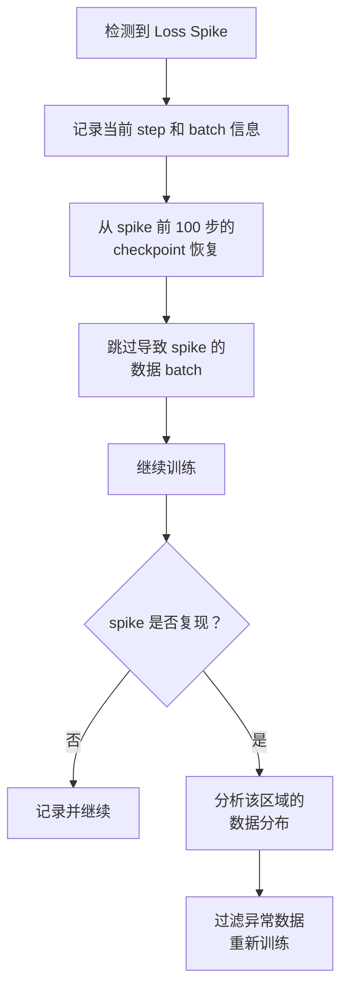

# 训练工程进阶：Google / DeepSeek / Anthropic 的工业实践与前沿话题

> 本文是 [模块 8C: 预训练（下）— 训练工程与实战](./README.md) 的进阶补充，深入分析三条技术线的训练工程实践和前沿研究方向。

---

## 目录

- [1. Google 的大规模训练工程](#1-google-的大规模训练工程)
- [2. DeepSeek 的训练工程创新](#2-deepseek-的训练工程创新)
- [3. Anthropic 视角](#3-anthropic-视角)
- [4. 前沿话题](#4-前沿话题)

---

## 1. Google 的大规模训练工程

### 1.1 PaLM 训练的全流程复盘

PaLM（Pathways Language Model, 540B 参数）是 Google 在 2022 年发布的大规模语言模型，训练过程本身就是一项工程壮举。

**训练基础设施**：
- 6144 个 TPU v4 芯片，组成两个 TPU v4 Pod
- 训练周期约 2 个月
- 数据集：780B token，来自多语言网页、书籍、代码等

**优化器选择**：

PaLM 使用 Adafactor 而非 AdamW。Adafactor 的核心优化是将二阶矩 $v_t$ 分解为行因子和列因子的外积，而非存储完整的矩阵。对于参数矩阵 $W \in \mathbb{R}^{m \times n}$：

- AdamW：$v_t \in \mathbb{R}^{m \times n}$，存储 $m \times n$ 个值
- Adafactor：$r_t \in \mathbb{R}^{m}$, $c_t \in \mathbb{R}^{n}$，仅存储 $m + n$ 个值

当 $m = n = 4096$（典型的 FFN 层），显存节省比例约 $1 - \frac{m+n}{mn} = 1 - \frac{2}{4096} \approx 99.95\%$。

**Loss Spike 的系统化处理**：

PaLM 训练中记录了约 200 次 loss spike。Google 的处理流程：

**关键发现**：
- 大部分 spike 是数据驱动的（某些异常样本）
- 超参数调整通常不能解决 spike 问题
- 重启 + 跳过数据是最有效的策略
- 重启导致的计算浪费约占总训练时间的 5-10%

### 1.2 Gemma 的训练配置与经验

Gemma 系列模型（2024 年发布）的训练配置相对透明，提供了宝贵的参考。

**Gemma 2B 的详细配置**：

| 参数 | 值 | 备注 |
|------|-----|------|
| 模型维度 | 2048 | |
| 头数 | 8 | GQA, n_kv_heads=1 |
| 层数 | 18 | |
| FFN 维度 | 16384 | |
| 词汇表 | 256K | SentencePiece |
| 训练数据 | 2T tokens | 英文为主，含代码 |
| 学习率 | 1e-3 | 峰值 |
| 调度器 | Cosine decay | 衰减到 lr_max 的 1% |
| Warmup | 500 steps | |
| Batch size | 4096 sequences | |
| 序列长度 | 8192 | |
| 优化器 | AdamW | beta1=0.9, beta2=0.95 |
| Weight decay | 0.1 | |
| 梯度裁剪 | 1.0 | Global L2 norm |
| 精度 | BF16 | |

**值得注意的点**：
- Gemma 使用了**非常大的词汇表**（256K），远超 LLaMA 的 32K
- 学习率 1e-3 在 2B 规模下相对较大，但配合 warmup 和 cosine decay 仍然稳定
- 使用 GQA（n_kv_heads=1，即 MQA），极大降低 KV cache 开销

### 1.3 TPU 训练的特殊工程考量

TPU 训练与 GPU 训练的关键差异：

| 维度 | GPU (NVIDIA) | TPU (Google) |
|------|-------------|-------------|
| 编程模型 | CUDA, 灵活 | XLA 编译, 静态图 |
| 精度支持 | FP32/FP16/BF16/FP8 | BF16/FP32 |
| 通信拓扑 | NVLink + InfiniBand | ICI (片间互联) |
| 内存层次 | HBM + L2 + L1 | HBM + VMEM |
| 编程难度 | 生态成熟，工具多 | 需要 JAX/Flax 专业知识 |

TPU 训练的独特优势：
- **ICI 互联带宽极高**：TPU v4 的 ICI 带宽约 4.8 Tbps，远超 InfiniBand
- **all-reduce 效率高**：在 TPU Pod 内部，跨芯片通信几乎无额外开销
- **BF16 原生支持**：TPU 的 BF16 matmul 性能优于 GPU 的 FP16

TPU 训练的挑战：
- **静态图编译**：XLA 编译需要固定的张量形状，动态形状不友好
- **内存管理**：TPU 的内存碎片问题需要仔细管理
- **调试困难**：相比 CUDA，TPU 的错误信息和调试工具较少

---

## 2. DeepSeek 的训练工程创新

### 2.1 FP8 训练的完整技术细节

DeepSeek-V3 在 FP8 混合精度训练上取得了工程突破，使训练速度接近 FP16 的 2 倍，同时保持模型质量。

**FP8 的两种格式**：

| 格式 | 指数位 | 尾数位 | 范围 | 精度 | 用途 |
|------|--------|--------|------|------|------|
| E4M3 | 4 | 3 | [-448, 448] | 较高 | 前向传播的权重和激活 |
| E5M2 | 5 | 2 | [-57344, 57344] | 较低 | 反向传播的梯度 |

**动态缩放（Dynamic Scaling）策略**：

FP8 的核心挑战是将值映射到极其有限的表示范围内。DeepSeek-V3 使用**细粒度量化**策略：

- **Per-tensor scaling**（基线）：每个张量一个缩放因子
- **Per-channel scaling**（DeepSeek）：权重矩阵的每行/列独立缩放
- **Per-token scaling**：激活的每个 token 独立缩放

细粒度量化显著提升了 FP8 的有效精度，使其接近 BF16 的训练效果。

**哪些计算用 FP8，哪些不用**：

| 计算 | 精度 | 原因 |
|------|------|------|
| Linear GEMM（前向） | FP8 (E4M3) | 计算密集，FP8 加速显著 |
| Linear GEMM（反向） | FP8 (E5M2) | 梯度范围更大，用 E5M2 |
| Softmax | BF16 | 指数运算对精度敏感 |
| LayerNorm / RMSNorm | BF16 | 统计量计算需要精度 |
| 损失函数 | FP32 | 数值稳定性要求 |
| 优化器状态更新 | FP32 | 小的更新在低精度下会被截断 |

**训练稳定性保障**：
- 梯度缩放因子使用延迟更新（delayed scaling）：根据前一步的统计信息计算当前步的缩放因子
- 对于数值不稳定的层（如嵌入层、最后的 LM head），保持 BF16

### 2.2 MoE 训练的稳定性保障机制

DeepSeek-V3 是 671B 总参数的 MoE 模型（活跃参数约 37B），其训练稳定性面临独特挑战。

**辅助损失 Free 的负载均衡**：

传统 MoE 使用辅助损失（auxiliary loss）强制负载均衡：

$$\mathcal{L}_{aux} = \alpha \cdot N \sum_{i=1}^{N} f_i \cdot P_i$$

其中 $f_i$ 是专家 $i$ 被选中的频率，$P_i$ 是路由概率。这个辅助损失会干扰主训练目标。

DeepSeek-V3 的创新：用**可学习的 bias** 替代辅助损失：

- 每个专家有一个 bias 项 $b_i$
- 路由分数：$s_i = \text{router}(x) + b_i$
- $b_i$ 通过简单的在线统计调整：被选中过多的专家 $b_i$ 减小，反之增大
- 不需要额外的损失项，对主目标无干扰

**MoE 训练的监控重点**：
- 各专家的负载分布（是否均匀）
- 路由器的 entropy（是否坍塌到少数专家）
- 不同 token 类型被路由到的专家分布

### 2.3 多阶段训练的数据策略

DeepSeek-V3 的训练分为多个阶段：

**阶段 1: 主体预训练**
- 14.8T tokens
- 主要是网页文本 + 代码 + 数学
- Batch size 从 3072 增大到 15360
- WSD 学习率调度

**阶段 2: 长上下文扩展**
- 上下文从 4K 扩展到 128K
- RoPE 基底频率从 10000 调整到 160000
- 使用长文档数据（书籍、长代码文件、论文）
- 训练量约 1000 步，batch size 降至 480

**阶段 3: 后训练（SFT + RL）**
- SFT 阶段使用精选的指令数据
- 蒸馏 DeepSeek-R1 的推理能力
- GRPO 强化学习

---

## 3. Anthropic 视角

> **声明**：Anthropic 关于训练工程的公开信息非常有限。以下内容基于 Anthropic 发表的论文、博客文章和公开讲话。标注为 [推测] 的内容基于合理推断，不代表 Anthropic 的实际做法。

### 3.1 训练过程中的安全监控

Anthropic 的核心理念是"安全是训练的一部分"，不是训练后的附加物。

**公开信息**：

Anthropic 在其论文（如 Constitutional AI, RLHF 相关论文）中提到，他们在训练过程中会监控模型的安全相关行为。具体来说：

- **有害输出监控**：训练过程中定期评估模型在安全测试集上的表现
- **能力评估**：评估模型是否获得了可能被滥用的能力（如生成危险信息的能力）
- **训练数据审计**：对训练数据进行系统化的安全审查

**[推测] 安全监控的技术实现**：

安全监控可能包含以下组件：
- 预定义的安全 prompt 测试集，在训练过程中定期运行
- 模型输出的自动化安全分类器
- 训练 loss 在不同数据类别上的分别追踪（如安全相关 vs 一般内容）
- 特定"危险能力"的检测指标

### 3.2 训练异常与模型行为的关联

**公开信息**：

Anthropic 的可解释性研究（Mechanistic Interpretability）为理解训练动态提供了新视角：

- 模型在训练中会经历"相变"（phase transition），如 Induction Head 的突然形成
- 不同训练阶段，模型内部的特征（feature）组成会发生质变
- Loss spike 可能对应着模型内部表示的重组

**[推测] 异常与行为的关联分析**：

Anthropic 可能利用可解释性工具来分析训练异常：
- 当 loss spike 发生时，检查哪些内部特征被激活
- 分析 loss spike 是否与特定类型的文本相关
- 使用 SAE（Sparse Autoencoder）分析训练过程中特征的演化

### 3.3 大规模训练的可重复性挑战

**公开信息**：

对于安全关键的 AI 系统，训练的可重复性是一个重要的工程目标。如果相同的训练设置不能产生相似的模型行为，那么安全评估就失去了基础。

**影响可重复性的因素**：

| 因素 | 影响程度 | 是否可控 |
|------|---------|---------|
| 浮点运算的不确定性 | 中 | 部分可控（确定性模式） |
| 并行训练的 reduce 顺序 | 高 | 可控（固定 reduce 顺序） |
| Dropout 的随机性 | 高 | 可控（固定 RNG 种子） |
| 数据加载顺序 | 高 | 可控（确定性 shuffle） |
| CUDA kernel 选择 | 低 | 可控（cudnn deterministic） |

**[推测] Anthropic 的可重复性策略**：
- 可能使用确定性训练模式（牺牲少量性能换取可重复性）
- 在关键训练节点保存完整的 RNG 状态
- 训练配置的版本控制和审计
- 多次独立训练的行为一致性验证

---

## 4. 前沿话题

### 4.1 弹性训练（Elastic Training）

**问题**：大规模训练中，节点动态加入和退出是常态（硬件故障、抢占式实例等）。传统训练必须在固定的 GPU 数量上运行。

**弹性训练的目标**：
- 节点故障时自动降级（减少 GPU 数，batch size 自动调整）
- 新节点加入时自动升级（增加 GPU 数，提升吞吐）
- 全程无需人工干预

**关键技术**：
- 动态 batch size 调整
- 动态数据并行度
- 分布式 checkpoint（可以在不同 GPU 数量下加载）

**代表工作**：
- PyTorch Elastic (TorchElastic)
- Varuna (Microsoft)

### 4.2 在线学习与持续预训练

**问题**：模型训练完成后，新数据不断产生（新闻、新论文、新代码）。如何让模型持续学习？

**挑战**：
- 灾难性遗忘
- 新数据的质量参差不齐
- 计算成本控制

**前沿方向**：
- 基于 replay buffer 的持续学习
- 选择性参数更新（只更新部分层）
- 知识蒸馏辅助

### 4.3 训练过程的可重复性研究

**问题**：相同的训练代码和数据，在不同硬件或不同时间运行，结果是否一致？

**研究发现**：
- FP32 下，单 GPU 训练可以做到完全确定性
- 多 GPU 训练中，all-reduce 的浮点运算顺序是主要的不确定性来源
- BF16/FP16 的低精度累加引入额外的随机性
- 不同 CUDA 版本的 kernel 实现可能产生不同结果

**应对策略**：
- 使用确定性的 NCCL all-reduce 实现
- 固定 CUDA kernel 选择（`torch.backends.cudnn.deterministic = True`）
- 在结果层面而非 bit 层面验证一致性

### 4.4 绿色 AI：训练的碳排放与能效优化

**问题**：大规模 AI 训练的能源消耗和碳排放日益引起关注。

**数据参考**：

| 模型 | 训练能耗（估算） | 碳排放（估算） |
|------|-----------------|---------------|
| GPT-3 (175B) | ~1,287 MWh | ~552 tCO2e |
| PaLM (540B) | ~3,400 MWh | ~需要看数据中心位置 |
| LLaMA-2 (70B) | ~1,000 GPU 月 | 取决于电力来源 |

**优化方向**：
1. **硬件效率**：更高效的芯片（TPU v5, H100）
2. **算法效率**：更好的优化器、学习率调度、数据选择
3. **基础设施**：选择低碳电力的数据中心
4. **模型压缩**：量化、蒸馏、剪枝减少部署成本
5. **数据效率**：用更少的数据达到同等性能（Scaling Laws 指导）

**实践建议**：
- 在小规模实验上验证超参数，减少无效的大规模训练
- 使用 muP 从小模型调参迁移到大模型
- 训练过程中监控 tokens/watt 指标
- 优先使用可再生能源供电的云服务

---

## 推荐阅读

1. Chowdhery et al. (2022). **PaLM: Scaling Language Modeling with Pathways.** arXiv:2204.02311 - PaLM 训练的完整技术报告
2. DeepSeek-AI (2024). **DeepSeek-V3 Technical Report.** - FP8 训练和 MoE 工程细节
3. Loshchilov & Hutter (2019). **Decoupled Weight Decay Regularization.** ICLR 2019 - AdamW 原始论文
4. Yang et al. (2022). **Tensor Programs V: Tuning Large Neural Networks via Zero-Shot Hyperparameter Transfer.** - muP 理论
5. Dettmers et al. (2022). **8-bit Optimizers via Block-wise Quantization.** ICLR 2022 - 8-bit Adam
6. Hu et al. (2024). **MiniCPM Technical Report.** - WSD 调度策略
7. Team et al. (2024). **Gemma: Open Models Based on Gemini Research.** - Gemma 训练配置
8. Touvron et al. (2023). **LLaMA: Open and Efficient Foundation Language Models.** - LLaMA 训练经验
9. Bai et al. (2022). **Constitutional AI: Harmlessness from AI Feedback.** Anthropic - 安全训练方法论
