# 模块9：分布式训练 -- 并行策略与工程优化

> 当模型规模突破单卡显存极限，分布式训练成为唯一的选择。本章从显存瓶颈的数学分析出发，系统讲解数据并行、模型并行、流水线并行的原理与实现，最终融合为 3D 并行策略，并覆盖混合精度训练和单卡优化技巧。

---

## 章节定位

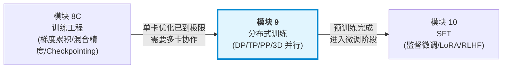

**为什么需要本章？** 模块 8C 介绍的梯度累积、混合精度等技术可以在单卡上缓解显存压力，但当模型参数量超过数十亿（如 Llama 2 7B 需要约 108 GB 显存进行全参数训练），**单张 GPU 的显存物理上不可能容纳整个训练状态**。此时，将训练负载分散到多张 GPU 上——即分布式训练——成为唯一的出路。

**前置知识**：
- **梯度累积**（模块 8C）：理解"将大 batch 拆分为多个 micro-batch 分步计算"的思想，这也是流水线并行的基础
- **混合精度训练**（模块 8C）：理解 FP16/BF16/FP32 的显存差异和数值行为，这直接影响分布式训练中的显存分析公式
- **反向传播与梯度计算**（模块 3）：理解梯度的计算流程，才能理解 All-Reduce、梯度分片等核心操作

---

## 目录

- [1. 为什么需要分布式训练](#1-为什么需要分布式训练)
- [2. 数据并行](#2-数据并行)
- [3. ZeRO 优化器](#3-zero-优化器)
- [4. 模型并行 -- 张量并行](#4-模型并行----张量并行)
- [5. 模型并行 -- 流水线并行](#5-模型并行----流水线并行)
- [6. 3D 并行](#6-3d-并行)
- [7. 混合精度训练](#7-混合精度训练)
- [8. 单卡替代方案](#8-单卡替代方案)
- [9. 三条技术线的分布式实践](#9-三条技术线的分布式实践)
- [10. 项目实践](#10-项目实践)
- [11. 本章小结](#11-本章小结)

---

## 1. 为什么需要分布式训练

### 1.1 单卡显存的数学分析

训练一个参数量为 $P$ 的模型，显存占用可以精确分解为三大部分：

**1) 模型参数**

以混合精度训练为例，模型参数需要同时存储 FP16（前向/反向）和 FP32（主权重）副本：

$$M_{\text{params}} = 2P + 4P = 6P \text{ bytes}$$

其中 FP16 参数占 $2P$，FP32 主权重（master weights）占 $4P$。

**2) 优化器状态**

Adam 优化器需要为每个参数存储一阶矩 $m$ 和二阶矩 $v$（均为 FP32）：

$$M_{\text{optimizer}} = 4P + 4P = 8P \text{ bytes}$$

**3) 梯度**

混合精度下梯度以 FP16 存储：

$$M_{\text{gradients}} = 2P \text{ bytes}$$

**4) 激活值**

激活值的显存取决于 batch size $B$、序列长度 $S$、隐藏维度 $d$、层数 $L$：

$$M_{\text{activations}} \approx 2 \cdot B \cdot S \cdot d \cdot L \cdot \alpha$$

其中 $\alpha$ 是一个与注意力头数和 FFN 扩展比相关的常数（典型值约为 10--34，取决于是否存储注意力矩阵）。

**总显存公式**：

$$M_{\text{total}} = \underbrace{(2+4)P}_{\text{参数}} + \underbrace{8P}_{\text{优化器}} + \underbrace{2P}_{\text{梯度}} + \underbrace{M_{\text{act}}}_{\text{激活值}} = 16P + M_{\text{act}}$$

**具体示例**：以 Llama 2 7B（$P = 6.7 \times 10^9$）为例：

| 组成部分 | 计算 | 显存占用 |
|---------|------|---------|
| FP16 参数 | $2 \times 6.7\text{B}$ | 12.5 GB |
| FP32 主权重 | $4 \times 6.7\text{B}$ | 25.0 GB |
| Adam 状态 | $8 \times 6.7\text{B}$ | 50.0 GB |
| FP16 梯度 | $2 \times 6.7\text{B}$ | 12.5 GB |
| 激活值 (B=1, S=4096) | 约 | 8--16 GB |
| **总计** | | **108--116 GB** |

即使是 7B 模型的全参数训练，单张 A100 80GB 也无法容纳。而 70B 模型则需要约 **1.1 TB** 显存——这就是分布式训练存在的根本原因。

### 1.2 训练时间估算

训练总 FLOPs 为：

$$C = 6PD$$

其中 $D$ 是训练 token 总数。训练时间为：

$$T = \frac{6PD}{n \times \text{GPU\_FLOPS} \times \text{MFU}}$$

- $n$：GPU 数量
- $\text{GPU\_FLOPS}$：单卡理论算力（如 A100 BF16 = 312 TFLOPS）
- $\text{MFU}$（Model FLOPs Utilization）：硬件利用率（典型值 30%--55%）

**示例**：Llama 2 70B 在 2T tokens 上训练

$$C = 6 \times 70 \times 10^9 \times 2 \times 10^{12} = 8.4 \times 10^{23} \text{ FLOPs}$$

使用 2048 张 A100（MFU=40%）：

$$T = \frac{8.4 \times 10^{23}}{2048 \times 312 \times 10^{12} \times 0.4} \approx 3.28 \times 10^6 \text{ 秒} \approx 38 \text{ 天}$$

### 1.3 分布式训练的分类

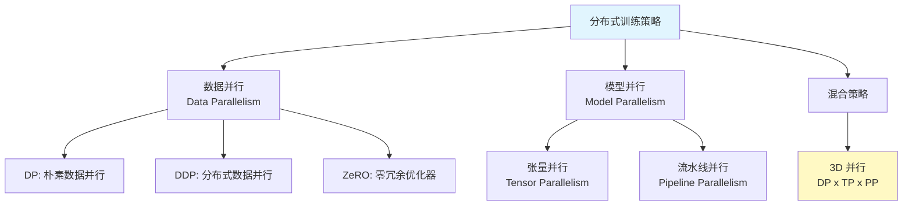

---

## 2. 数据并行

### 2.1 基本数据并行（DP）

最简单的并行策略：每张 GPU 持有模型的完整副本，将数据划分到不同 GPU 上分别计算梯度，然后汇聚梯度更新模型。

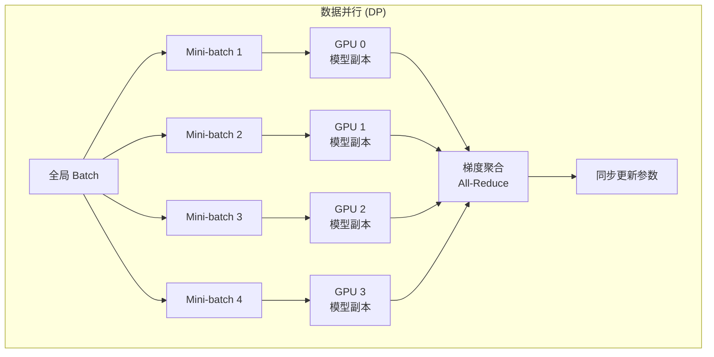

**PyTorch DP (`torch.nn.DataParallel`) 的问题**：

1. **单进程多线程**：受 GIL 限制，无法真正并行
2. **参数服务器瓶颈**：GPU 0 负责收集所有梯度并广播，通信严重不均衡
3. **显存不均衡**：GPU 0 需要额外显存存储汇聚的梯度

### 2.2 分布式数据并行（DDP）

`torch.nn.parallel.DistributedDataParallel` 使用**多进程**架构，每个 GPU 对应一个独立进程，通过集合通信原语（Collective Communication）同步梯度。

**核心改进**：使用 **All-Reduce** 代替参数服务器。

#### All-Reduce 原理

All-Reduce 的目标：让所有节点都获得所有梯度的**求和/平均**结果。

$$\text{All-Reduce}(\{g_0, g_1, \ldots, g_{n-1}\}) \to \left\{\frac{1}{n}\sum_{i=0}^{n-1} g_i\right\} \text{（每个节点）}$$

**朴素实现**的通信量为 $O(nP)$，其中 $n$ 是 GPU 数量。

#### Ring All-Reduce

Ring All-Reduce 是一种带宽最优的 All-Reduce 算法，分为两个阶段：

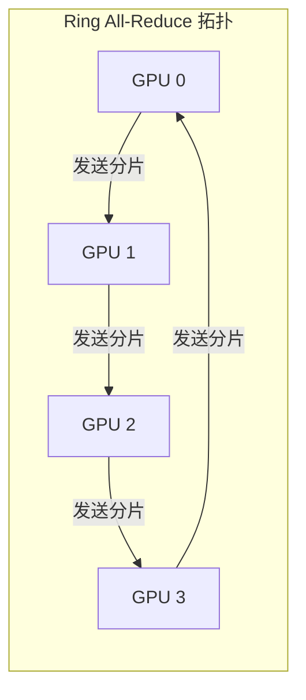

**阶段 1：Reduce-Scatter**

将每个 GPU 的梯度切分为 $n$ 个分片，经过 $n-1$ 步环形传递，每步累加收到的分片，最终每个 GPU 持有一个分片的完整归约结果。

**阶段 2：All-Gather**

将归约后的分片再经过 $n-1$ 步环形传递，使每个 GPU 拥有完整的归约结果。

**通信量分析**：

每个 GPU 在每个阶段发送 $\frac{P}{n} \times (n-1)$ 数据量，总通信量为：

$$\text{通信量（每 GPU）} = 2 \times \frac{n-1}{n} \times P \times \text{dtype\_size}$$

当 $n$ 较大时，每 GPU 的通信量趋近于 $2P \times \text{dtype\_size}$，与 GPU 数量 $n$ 无关。这是 Ring All-Reduce 的核心优势。

**与朴素方法对比**：

| 方法 | 每 GPU 通信量 | 总通信量 | 带宽利用 |
|------|-------------|---------|---------|
| 参数服务器 | $P$ (发) 或 $nP$ (收) | $2nP$ | 不均衡 |
| Ring All-Reduce | $\frac{2(n-1)}{n}P \approx 2P$ | $\frac{2n(n-1)}{n}P$ | 最优 |

#### Ring All-Reduce 详细步骤示例

以 4 个 GPU、梯度分为 4 个分片为例，展示 Reduce-Scatter 阶段：

```
初始状态:
  GPU 0: [A0, B0, C0, D0]
  GPU 1: [A1, B1, C1, D1]
  GPU 2: [A2, B2, C2, D2]
  GPU 3: [A3, B3, C3, D3]

Step 1: 每个 GPU 发送一个分片给下一个 GPU 并累加
  GPU 0: [A0,      B0,      C0,      D0+D3  ]
  GPU 1: [A1+A0,   B1,      C1,      D1     ]
  GPU 2: [A2,      B2+B1,   C2,      D2     ]
  GPU 3: [A3,      B3,      C3+C2,   D3     ]

Step 2: 继续环形传递
  GPU 0: [A0,      B0,      C0+C3+C2, D0+D3    ]
  GPU 1: [A1+A0,   B1,      C1,       D1+D0+D3 ]
  GPU 2: [A2+A1+A0,B2+B1,   C2,       D2       ]
  GPU 3: [A3,      B3+B2+B1,C3+C2,    D3       ]

Step 3: 最终每个 GPU 持有一个完整归约分片
  GPU 0: [A0,           B0+B3+B2+B1, C0+C3+C2, D0+D3    ]
  GPU 1: [A1+A0,        B1,          C1+C0+C3+C2, D1+D0+D3]
  GPU 2: [A2+A1+A0+A3,  B2+B1,       C2,       D2+D1+D0+D3]
  GPU 3: [A3+A2+A1+A0,  B3+B2+B1,    C3+C2+C1+C0, D3     ]
               ^完整                       ^完整

最终 (Reduce-Scatter 结束):
  GPU 0 持有 B 的完整归约: sum(B)
  GPU 1 持有 C 的完整归约: sum(C)
  GPU 2 持有 D 的完整归约: sum(D)
  GPU 3 持有 A 的完整归约: sum(A)
```

之后 All-Gather 阶段将各个归约分片广播给所有 GPU，最终每个 GPU 都持有完整的 $[\sum A, \sum B, \sum C, \sum D]$。

### 2.3 DDP 的关键实现细节

**1) 梯度分桶（Gradient Bucketing）**

DDP 不会等到所有梯度计算完毕才通信，而是将参数分成多个"桶"（bucket），每个桶计算完毕后立即启动 All-Reduce，实现**计算与通信的重叠**。

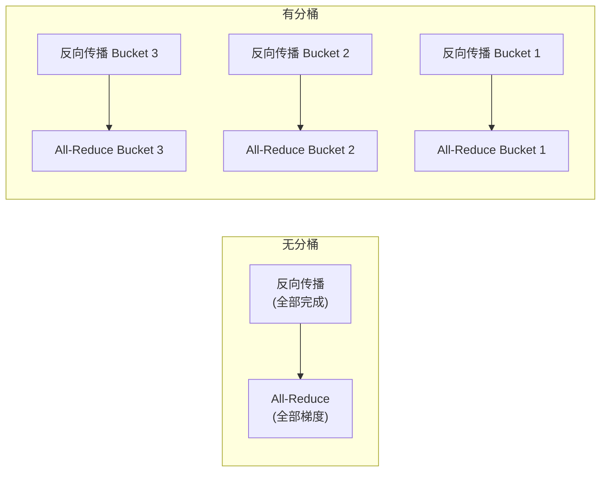

**2) 进程组与通信后端**

| 后端 | 适用场景 | 特点 |
|------|---------|------|
| NCCL | GPU 间通信 | 高带宽，低延迟 |
| Gloo | CPU 间通信或 CPU-GPU | 跨平台兼容 |
| MPI | HPC 集群 | 功能丰富 |

---

## 3. ZeRO 优化器

### 3.1 冗余分析

在标准 DDP 中，每个 GPU 都存储模型参数、优化器状态和梯度的**完整副本**——这是巨大的冗余。

以 $n$ 个 GPU 训练参数量为 $P$ 的模型为例，每个 GPU 的显存占用为：

$$M_{\text{DDP}} = \underbrace{2P}_{\text{FP16 参数}} + \underbrace{2P}_{\text{FP16 梯度}} + \underbrace{(4P + 8P)}_{\text{FP32 主权重 + Adam 状态}} = 16P$$

$n$ 张 GPU 的总显存为 $16nP$，冗余度为 $n$ 倍。

### 3.2 ZeRO 的三个阶段

ZeRO（Zero Redundancy Optimizer）的核心思想：将这些冗余数据分片（partition）到不同 GPU 上。

#### ZeRO-1：优化器状态分片

每个 GPU 只存储 $\frac{1}{n}$ 的优化器状态（FP32 主权重 + Adam $m$, $v$）。

$$M_{\text{ZeRO-1}} = 2P + 2P + \frac{12P}{n} = 4P + \frac{12P}{n}$$

当 $n = 64$ 时：$M \approx 4P + 0.19P = 4.19P$（对比 DDP 的 $16P$，节省约 **74%**）。

**通信开销**：与 DDP 相同（仅在优化器步骤后需要 All-Gather 更新后的参数）。

#### ZeRO-2：+ 梯度分片

每个 GPU 只存储与自己负责的参数分片对应的梯度。

$$M_{\text{ZeRO-2}} = 2P + \frac{2P}{n} + \frac{12P}{n} = 2P + \frac{14P}{n}$$

当 $n = 64$ 时：$M \approx 2P + 0.22P = 2.22P$（节省约 **86%**）。

**通信开销**：梯度使用 Reduce-Scatter（而非 All-Reduce），通信量约减半。

#### ZeRO-3：+ 参数分片

每个 GPU 只存储 $\frac{1}{n}$ 的模型参数。前向和反向传播时按需从其他 GPU 获取所需参数。

$$M_{\text{ZeRO-3}} = \frac{2P}{n} + \frac{2P}{n} + \frac{12P}{n} = \frac{16P}{n}$$

当 $n = 64$ 时：$M \approx 0.25P$（节省约 **98%**）。

**通信开销**：前向和反向传播各需要一次 All-Gather 获取完整参数，通信量增加约 $1.5\times$。

### 3.3 ZeRO 显存节省汇总

$$\boxed{M_{\text{ZeRO-stage}} = \begin{cases} 4P + \frac{12P}{n} & \text{ZeRO-1: 分片优化器状态} \\ 2P + \frac{14P}{n} & \text{ZeRO-2: + 分片梯度} \\ \frac{16P}{n} & \text{ZeRO-3: + 分片参数} \end{cases}}$$

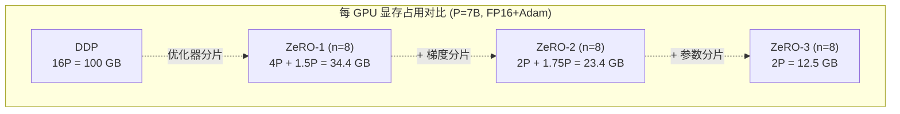

### 3.4 ZeRO 的通信量与性能权衡

| 阶段 | 通信量 (vs DDP) | 额外延迟 | 适用场景 |
|------|---------------|---------|---------|
| ZeRO-1 | 1x | 几乎无 | 通用推荐 |
| ZeRO-2 | 1x | 轻微 | 中大型模型 |
| ZeRO-3 | 1.5x | 显著 | 超大模型 (>100B) |

**实践建议**：
- ZeRO-1 和 ZeRO-2 几乎不影响训练速度，应优先考虑
- ZeRO-3 的通信开销较大，通常与激活检查点和 CPU Offloading 配合使用

---

## 4. 模型并行 -- 张量并行

### 4.1 核心思想

张量并行（Tensor Parallelism, TP）将模型的单个层（如线性层）的权重矩阵**按维度切分**到多个 GPU 上，每个 GPU 计算部分结果后通过通信合并。

### 4.2 列并行（Column Parallelism）

将权重矩阵 $W \in \mathbb{R}^{d \times k}$ 按列切分到 $n$ 个 GPU：

$$W = [W_1 \mid W_2 \mid \ldots \mid W_n], \quad W_i \in \mathbb{R}^{d \times k/n}$$

每个 GPU 独立计算：

$$Y_i = XW_i \in \mathbb{R}^{B \times k/n}$$

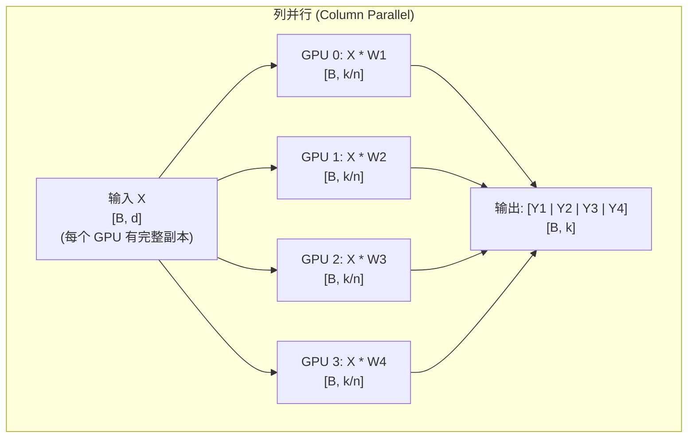

**优点**：非线性激活函数（如 GeLU）可以在各 GPU 上独立应用，无需通信。

**通信**：输出需要 All-Gather 合并，或者直接传递给行并行层。

### 4.3 行并行（Row Parallelism）

将权重矩阵 $W \in \mathbb{R}^{k \times d}$ 按行切分：

$$W = \begin{bmatrix} W_1 \\ W_2 \\ \vdots \\ W_n \end{bmatrix}, \quad W_i \in \mathbb{R}^{k/n \times d}$$

输入也需要按列切分：$X = [X_1 \mid X_2 \mid \ldots \mid X_n]$，每个 GPU 计算：

$$Y_i = X_i W_i \in \mathbb{R}^{B \times d}$$

最终通过 All-Reduce 求和得到完整结果：

$$Y = \sum_{i=1}^{n} Y_i$$

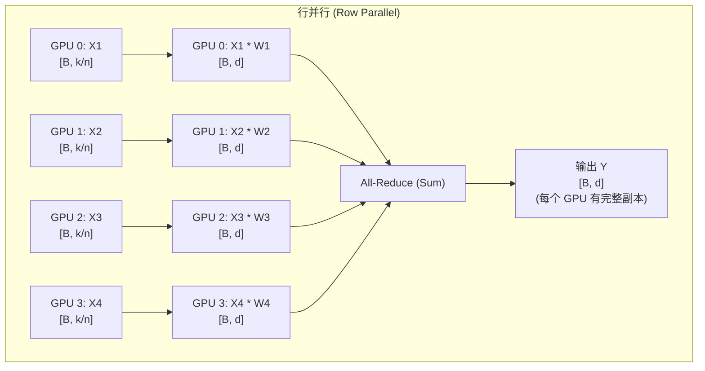

### 4.4 Transformer 层的张量并行

Megatron-LM 提出的经典方案：将 Transformer 的注意力层和 FFN 层组合使用列并行和行并行，使得一个完整的 Transformer Block 仅需要**2 次 All-Reduce**。

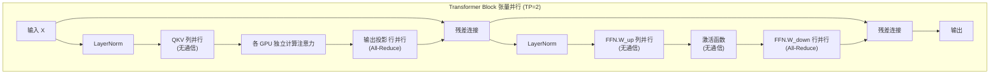

**设计精髓**：

1. **注意力层**：QKV 投影使用列并行（按注意力头切分），输出投影使用行并行
2. **FFN 层**：第一个线性层使用列并行，第二个线性层使用行并行
3. 列并行和行并行的组合使得中间激活无需通信，只在行并行的输出处进行 All-Reduce

### 4.5 通信量分析

每个 Transformer Block 的 TP 通信量：

- 前向传播：2 次 All-Reduce，每次传输 $B \times S \times d$ 数据
- 反向传播：2 次 All-Reduce，同等数据量

$$\text{通信量（每 Block）} = 4 \times 2 \times \frac{n-1}{n} \times B \times S \times d \times \text{dtype\_size}$$

其中因子 4 来自前向 2 次 + 反向 2 次。

**关键约束**：张量并行的通信发生在**每一层的前向和反向传播中**，因此要求极高的通信带宽。实践中 TP 通常限制在同一节点内的 NVLink 连接的 GPU 之间（NVLink 带宽 600--900 GB/s，远高于节点间的 InfiniBand 200--400 GB/s）。

---

## 5. 模型并行 -- 流水线并行

### 5.1 核心思想

流水线并行（Pipeline Parallelism, PP）将模型的不同**层**分配到不同 GPU 上，数据像流水线一样依次通过各个阶段。

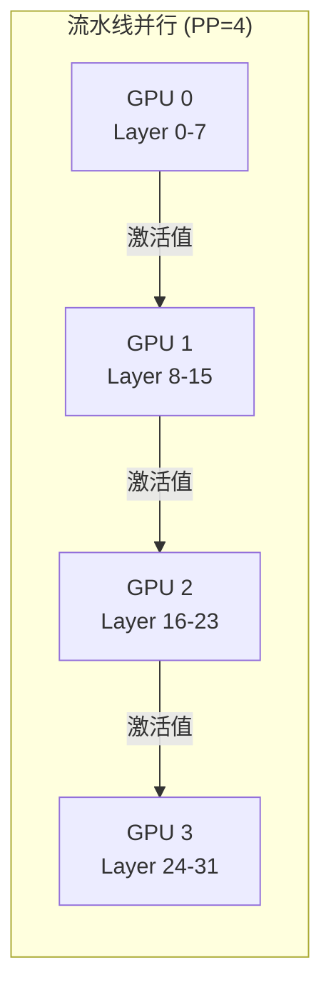

### 5.2 朴素流水线的问题：气泡

如果将一个 batch 整体送入流水线，大部分 GPU 在大部分时间都处于空闲状态。

```
时间 →  1  2  3  4  5  6  7  8
GPU 0: [F] [.] [.] [.] [B] [.] [.] [.]
GPU 1: [.] [F] [.] [.] [.] [B] [.] [.]
GPU 2: [.] [.] [F] [.] [.] [.] [B] [.]
GPU 3: [.] [.] [.] [F] [.] [.] [.] [B]

F = 前向传播, B = 反向传播, . = 空闲（气泡）
```

气泡率（bubble ratio）反映了 GPU 的空闲时间占比。

### 5.3 GPipe：Micro-batch 流水线

GPipe 的解决方案：将一个 batch 拆分为 $m$ 个 micro-batch，依次送入流水线。

**气泡率公式**：

设流水线有 $p$ 个阶段（GPU），$m$ 个 micro-batch。假设每个 micro-batch 的前向时间为 $t_f$，反向时间为 $t_b$，总执行时间为：

$$T_{\text{total}} = (m + p - 1)(t_f + t_b)$$

理想情况（无气泡）的执行时间为：

$$T_{\text{ideal}} = m(t_f + t_b)$$

因此气泡率为：

$$\boxed{\text{bubble\_ratio} = \frac{T_{\text{total}} - T_{\text{ideal}}}{T_{\text{total}}} = \frac{p - 1}{m + p - 1}}$$

**分析**：
- 当 $m \gg p$ 时，气泡率趋近 0
- 当 $m = p$ 时，气泡率为 $\frac{p-1}{2p-1} \approx 50\%$
- 实践中通常取 $m \geq 4p$ 以保持气泡率 < 20%

**GPipe 调度示意**（$p=4$, $m=4$）：

```
时间步   1   2   3   4   5   6   7   8   9  10  11  12  13  14
GPU 0: [F1][F2][F3][F4][..][..][..][B4][B3][B2][B1][..][..][..]
GPU 1: [..][F1][F2][F3][F4][..][..][..][B4][B3][B2][B1][..][..]
GPU 2: [..][..][F1][F2][F3][F4][..][..][..][B4][B3][B2][B1][..]
GPU 3: [..][..][..][F1][F2][F3][F4][..][..][..][B4][B3][B2][B1]

气泡率 = (4-1) / (4+4-1) = 3/7 ≈ 42.9%
```

### 5.4 1F1B 调度

**1F1B**（One Forward One Backward）调度通过交替执行前向和反向传播来减少 GPU 的峰值显存占用。

**核心思想**：
- 预热阶段：各 GPU 依次填充流水线（执行前向传播）
- 稳态阶段：每完成一个 micro-batch 的前向传播后，立即执行一个 micro-batch 的反向传播
- 冷却阶段：处理剩余的反向传播

```
时间步   1   2   3   4   5   6   7   8   9  10  11  12  13  14
GPU 0: [F1][F2][F3][F4][B1][B2][B3][B4][..][..][..][..][..][..]
GPU 1: [..][F1][F2][F3][B1][F4][B2][B3][B4][..][..][..][..][..]
GPU 2: [..][..][F1][F2][B1][F3][B2][F4][B3][B4][..][..][..][..]
GPU 3: [..][..][..][F1][B1][F2][B2][F3][B3][F4][B4][..][..][..]

注: 1F1B 的气泡率与 GPipe 相同，但峰值显存更低
```

**1F1B vs GPipe 显存对比**：

| 方案 | 峰值激活显存 (GPU 0) | 说明 |
|------|-------|------|
| GPipe | $m$ 个 micro-batch 的激活 | 所有前向完成后才能反向 |
| 1F1B | $p$ 个 micro-batch 的激活 | 尽早释放已完成反向的激活 |

当 $m \gg p$ 时，1F1B 的显存优势非常显著。

### 5.5 DeepSeek-V3 的 DualPipe 流水线并行

传统流水线并行方法（GPipe、1F1B）虽然通过 micro-batch 拆分减少了气泡，但存在一个核心限制：**计算和通信是串行进行的**。在 MoE（混合专家）模型中，这个问题尤为突出——每个 Transformer Block 都需要执行昂贵的 All-to-All 通信来进行专家路由，这部分时间 GPU 完全处于等待状态。

**DualPipe 的核心思想**：将每个 micro-batch 在每个流水线阶段的计算拆分为两个可独立调度的"半步"，并让不同 micro-batch 的计算与通信在时间上重叠。

#### 设计动机与传统方法对比

| 方法 | 气泡时间 | 计算-通信重叠 | 显存开销 | 核心局限 |
|------|---------|-------------|---------|---------|
| GPipe | $(p-1)/(m+p-1)$ | 无 | 高（需缓存 $m$ 个 micro-batch 的激活） | 气泡率高，显存消耗大 |
| 1F1B | $(p-1)/(m+p-1)$ | 无 | 低（仅需缓存 $p$ 个 micro-batch 的激活） | 气泡率未改善，通信仍然串行 |
| Interleaved 1F1B | $(p-1)/(m+p-1)/v$ | 部分 | 中（需 $v$ 倍虚拟阶段的激活） | 需要更多通信次数 |
| **DualPipe** | $\approx (p-1)/2(m+p-1)$ | **完全** | 中 | 需要 MoE 等可拆分的计算结构 |

#### DualPipe 的调度机制

DualPipe 将每个流水线阶段内的 Transformer Block 计算拆分为：
- **COMP 部分**：注意力计算、MoE 专家计算等核心矩阵运算（占用 GPU SM）
- **COMM 部分**：All-to-All 专家路由通信、跨节点数据传输（占用网络带宽和 NVLink）

关键洞察：这两部分使用的硬件资源不同（计算核心 vs 通信硬件），因此可以完全并行执行。

```
DualPipe 时间线示意 (PP=4, 简化展示前向阶段):

时间 →    1       2       3       4       5       6       7
       ┌───────┬───────┬───────┬───────┬───────┬───────┬───────┐
GPU 0: │COMP_F1│COMM_F1│COMP_F2│COMM_F2│COMP_F3│COMM_F3│COMP_F4│
       │       │+      │       │+      │       │+      │       │
       │       │COMP_F2│       │COMP_F3│       │COMP_F4│       │
       │       │(预取)  │       │(预取)  │       │(预取)  │       │
       └───────┴───────┴───────┴───────┴───────┴───────┴───────┘
       ┌───────┬───────┬───────┬───────┬───────┬───────┬───────┐
GPU 1: │       │COMP_F1│COMM_F1│COMP_F2│COMM_F2│COMP_F3│COMM_F3│
       │       │       │+      │       │+      │       │+      │
       │       │       │COMP_F2│       │COMP_F3│       │COMP_F4│
       └───────┴───────┴───────┴───────┴───────┴───────┴───────┘

注: "+" 表示同一时间段内，通信与下一个 micro-batch 的计算重叠执行
    COMP_Fk = micro-batch k 的计算部分
    COMM_Fk = micro-batch k 的通信部分
```

更精确地说，DualPipe 采用**双向流水线**设计：从流水线两端同时注入 micro-batch，使得同一 GPU 上同时存在来自两个方向的 micro-batch，进一步提高了重叠的机会。

#### 气泡率分析

标准 1F1B 的气泡率为：

$$\text{bubble}_{1F1B} = \frac{p-1}{m+p-1}$$

DualPipe 通过以下机制将气泡率大幅降低：
1. **计算-通信重叠**：通信时间被计算"隐藏"，有效消除了通信等待产生的气泡
2. **双向注入**：两端同时注入 micro-batch，减少了流水线启动和排空阶段的空闲时间

有效气泡率近似为：

$$\text{bubble}_{\text{DualPipe}} \approx \frac{p-1}{2(m+p-1)}$$

#### DeepSeek-V3 的实际效果

DeepSeek-V3 在 2048 张 H800 GPU 上使用 DualPipe 进行训练：
- 流水线阶段数 $p = 16$
- 每个训练步使用大量 micro-batch（$m \gg p$）
- **实测气泡率低于 1%**，接近理论最优
- 模型总参数量 671B（MoE），每 token 激活 37B 参数
- 整体 MFU（Model FLOPs Utilization）在剔除通信开销后约为 **52.5%**——考虑到这是 MoE + 流水线并行，这一效率非常可观

> 详细的 DualPipe 工程细节和 FP8 训练策略见 [进阶文档](./advanced.md)。

### 5.6 流水线并行的通信特点

与张量并行不同，流水线并行的通信发生在**相邻阶段**之间，传输的是中间激活值 $[B, S, d]$。

**通信量**（每个 micro-batch）：

$$\text{通信量} = B \times S \times d \times \text{dtype\_size}$$

通信量**与层数无关**，且通信是点对点的（Send/Recv），不需要集合通信。因此 PP 可以使用节点间较低带宽的连接（如 InfiniBand）。

---

## 6. 3D 并行

### 6.1 DP x TP x PP 的组合

实际大规模训练通常同时使用三种并行策略，称为 **3D 并行**。

$$\text{总 GPU 数} = n_{DP} \times n_{TP} \times n_{PP}$$

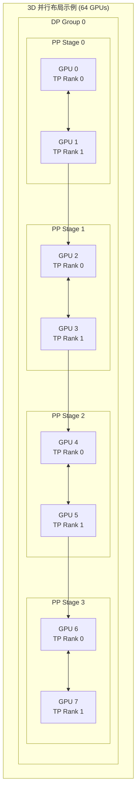

### 6.2 设备映射的最优配置原则

**原则 1：TP 优先使用节点内 NVLink**

张量并行通信量大、频率高，必须使用最高带宽的互连。

$$\text{TP 组} \subseteq \text{同一节点的 GPU}$$

**原则 2：PP 使用节点间连接**

流水线并行的通信是点对点的，且通信量与 TP 相比较小。

$$\text{PP 阶段之间} \to \text{可跨节点（InfiniBand）}$$

**原则 3：DP 跨所有剩余 GPU**

数据并行的通信（梯度 All-Reduce）发生在每个训练步结束时，可以与计算重叠。

### 6.3 通信拓扑与硬件亲和性

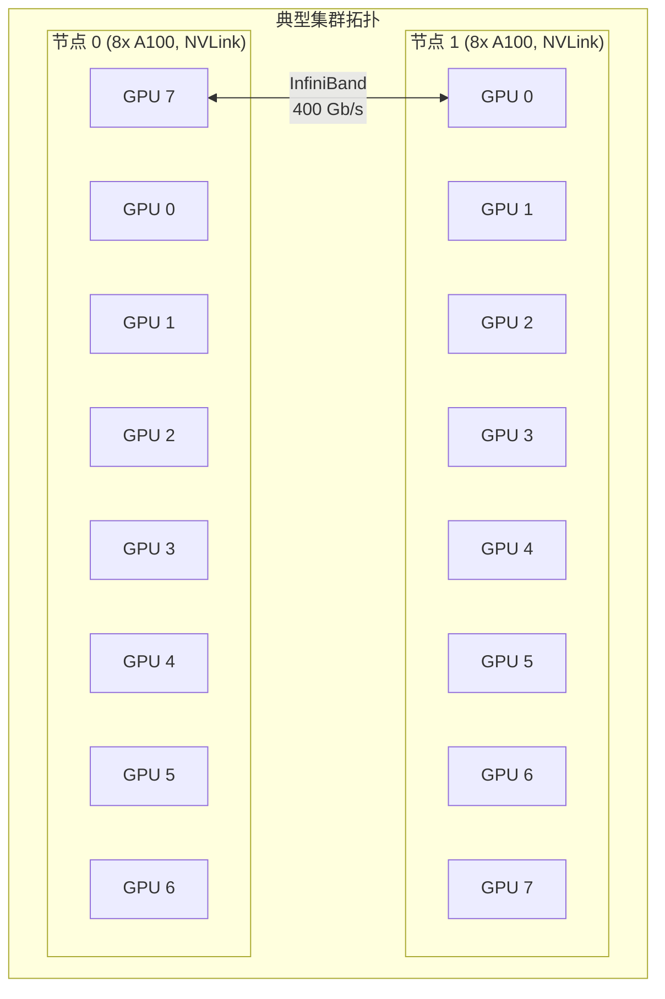

**典型配置示例**：

| 模型规模 | 总 GPU | TP | PP | DP | 节点数 |
|---------|--------|----|----|-----|-------|
| 7B | 8 | 1 | 1 | 8 | 1 |
| 70B | 64 | 8 | 2 | 4 | 8 |
| 175B | 512 | 8 | 8 | 8 | 64 |
| 540B (PaLM) | 6144 | 4 | 12 | 128 | 768 |

### 6.4 工业界的并行策略组合

上表给出了典型配置，但每个数字背后都有深刻的工程权衡。以下以 Google PaLM 和 DeepSeek-V3 为例，详细分析工业界如何选择并行策略组合。

#### Google PaLM (540B) 的并行策略

PaLM 540B 在 6144 个 TPU v4 芯片上训练，采用了以下配置：

- **张量并行 TP = 4**：将每个 Transformer Block 的权重按 4 路切分。PaLM 的注意力头数为 48，刚好能被 4 整除。选择 TP=4 而非 TP=8 的原因是 TPU v4 的 ICI 拓扑在 4 芯片范围内通信效率最高
- **流水线并行 PP = 12**：540B 模型有 118 层 Transformer，分为 12 个流水线阶段，每个阶段约 10 层。这使得每个阶段的计算量大致均衡
- **数据并行 DP = 128**：$6144 / (4 \times 12) = 128$ 路数据并行。使用 JAX 的 GSPMD 模型自动管理梯度同步

**选择 TP=4 的关键考量**：

$$\text{TP 通信量（每 Block 前向）} = 2 \times B \times S \times d \times \text{dtype\_size}$$

对于 PaLM 540B（$d = 18432$），每次 All-Reduce 的数据量约为 $B \times S \times 18432 \times 2$ 字节。TPU v4 ICI 带宽在 4 芯片拓扑下可达约 3.2 TB/s，足以使通信时间远小于计算时间。若增大 TP 到 8，跨 ICI 桥接的带宽下降会显著影响效率。

#### DeepSeek-V3 的并行策略

DeepSeek-V3 是一个 MoE 模型（671B 总参数，37B 激活参数），在 2048 张 H800 GPU 上训练，并行策略与 Dense 模型有本质区别：

- **Expert Parallelism (EP) = 64**：256 个路由专家分布在 64 个 GPU 组上，每组 4 个专家。这是 MoE 模型独有的并行维度
- **Pipeline Parallelism (PP) = 16**：使用 DualPipe 调度，配合 MoE 的 All-to-All 通信进行计算-通信重叠
- **Data Parallelism (DP) = 2**：$2048 / (64 \times 16) = 2$ 路数据并行。MoE 模型由于 EP 已经占用了大量 GPU，DP 维度通常较小

**MoE 模型的 Expert Parallelism 如何与其他并行策略结合**：

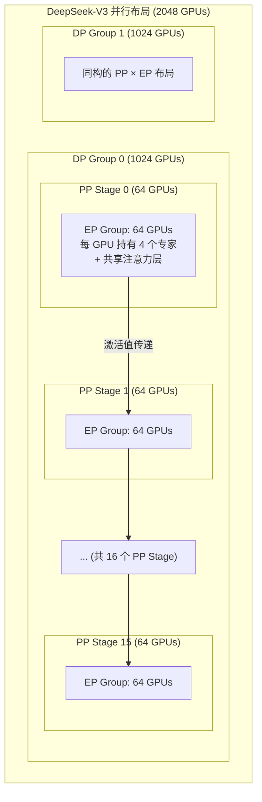

Expert Parallelism 的通信模式是 **All-to-All**：每个 token 需要被发送到其被路由到的专家所在的 GPU 上。这与张量并行的 All-Reduce 和流水线并行的点对点通信都不同。

#### 并行策略选择指南

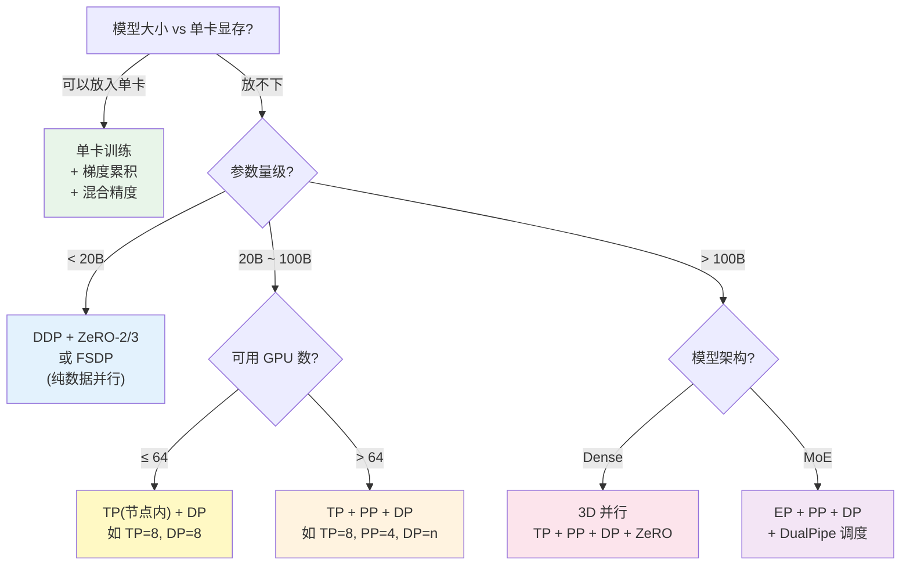

**不同规模的推荐配置速查表**：

| 场景 | 模型参数 | GPU 数 | 推荐策略 | 理由 |
|------|---------|--------|---------|------|
| 学术微调 | 7B | 1-2 | 梯度累积 + LoRA | 单卡足够，无需分布式 |
| 中等规模预训练 | 7B | 8-32 | DDP + ZeRO-2 | 模型能放入单卡，数据并行即可 |
| 大模型微调 | 70B | 8-16 | FSDP (ZeRO-3) | 模型放不下单卡，需参数分片 |
| 大模型预训练 | 70B | 64-256 | TP=8 + PP=2 + DP=n | 节点内 TP，跨节点 PP+DP |
| 超大 Dense | 175B+ | 512+ | TP=8 + PP=8+ + DP=n + ZeRO-1 | 全部并行策略协同 |
| 超大 MoE | 600B+ | 2000+ | EP=64+ + PP=16 + DP=n | Expert Parallelism 替代 TP |

---

## 7. 混合精度训练

### 7.1 数值格式演进

| 格式 | 位宽 | 指数 | 尾数 | 范围 | 精度 |
|------|------|------|------|------|------|
| FP32 | 32 | 8 | 23 | $\pm 3.4 \times 10^{38}$ | 高 |
| FP16 | 16 | 5 | 10 | $\pm 6.5 \times 10^{4}$ | 中 |
| BF16 | 16 | 8 | 7 | $\pm 3.4 \times 10^{38}$ | 低 |
| FP8 (E4M3) | 8 | 4 | 3 | $\pm 448$ | 极低 |
| FP8 (E5M2) | 8 | 5 | 2 | $\pm 57344$ | 极低 |

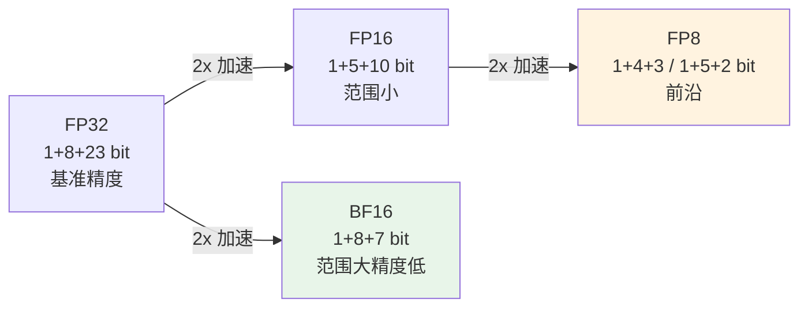

### 7.2 混合精度训练流程

**核心思想**：前向和反向传播使用低精度（FP16/BF16），参数更新使用高精度（FP32）。

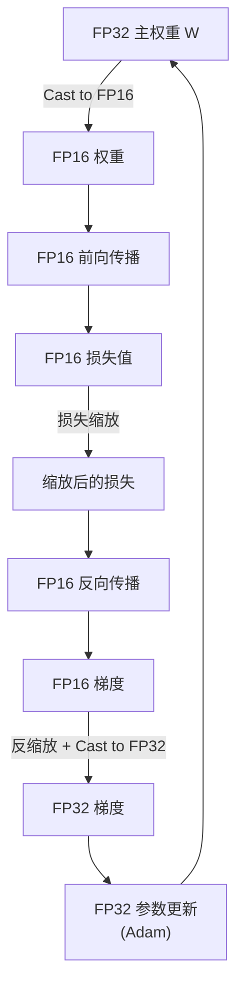

**为什么需要 FP32 主权重？**

学习率通常很小（如 $10^{-4}$），参数更新量 $\eta \cdot g$ 可能小于 FP16 的最小表示精度：

$$\text{FP16 最小精度} = 2^{-14} \approx 6 \times 10^{-5}$$

如果参数值为 1.0，更新量 $10^{-4} \times 0.01 = 10^{-6}$ 将被舍入为 0。FP32 可以精确表示这种微小更新。

### 7.3 损失缩放（Loss Scaling）

FP16 的表示范围有限，反向传播中的小梯度可能下溢为 0。

**静态损失缩放**：

$$\hat{L} = L \times s, \quad \hat{g} = g \times s$$

更新前反缩放：$g_{\text{true}} = \hat{g} / s$

**动态损失缩放**：

```python
# 动态损失缩放的伪代码
scale = initial_scale  # 如 2^16

for step in training:
    scaled_loss = loss * scale
    scaled_loss.backward()

    # 检查梯度是否包含 inf/nan
    if has_inf_or_nan(gradients):
        scale = scale / 2  # 缩小缩放因子
        skip_update()       # 跳过本步参数更新
    else:
        unscale_gradients(gradients, scale)
        optimizer.step()

        # 每 N 步尝试增大缩放因子
        if step % growth_interval == 0:
            scale = scale * 2
```

### 7.4 BF16 vs FP16

| 特性 | FP16 | BF16 |
|------|------|------|
| 表示范围 | $\pm 6.5 \times 10^4$ | $\pm 3.4 \times 10^{38}$ |
| 精度 | 较高（10 bit 尾数） | 较低（7 bit 尾数） |
| 是否需要损失缩放 | **需要** | **通常不需要** |
| 硬件支持 | Volta+（V100） | Ampere+（A100） |
| 推荐度 | 旧硬件 | **现代训练首选** |

BF16 的范围与 FP32 相同（8 bit 指数），因此几乎不会出现上溢/下溢问题，可以去掉损失缩放这一复杂步骤。这是 BF16 成为现代 LLM 训练首选格式的主要原因。

---

## 8. 单卡替代方案

对于资源有限的场景（如单卡微调），以下技术可以在不使用多卡的情况下降低显存占用。

### 8.1 梯度累积

**核心思想**：将大 batch 拆分为多个小 micro-batch 依次计算，累积梯度后再执行一次参数更新。

$$g_{\text{accumulated}} = \frac{1}{K} \sum_{k=1}^{K} g_k$$

其中 $K$ 是累积步数。效果上等价于使用了 $K \times B$ 的 batch size。

```python
# 梯度累积伪代码
accumulation_steps = 4
optimizer.zero_grad()

for i, batch in enumerate(dataloader):
    loss = model(batch) / accumulation_steps  # 除以累积步数以保持梯度量级
    loss.backward()  # 梯度自动累加到 .grad

    if (i + 1) % accumulation_steps == 0:
        optimizer.step()
        optimizer.zero_grad()
```

**数学等价性**：

设 $B$ 为 micro-batch size，$K$ 为累积步数。梯度累积的梯度为：

$$g = \frac{1}{K} \sum_{k=1}^{K} \nabla_\theta \mathcal{L}(x_k; \theta)$$

这与使用 batch size = $KB$ 的梯度期望值完全相同：

$$\mathbb{E}[g] = \nabla_\theta \mathcal{L}(\theta)$$

### 8.2 梯度检查点（Activation Checkpointing）

**核心思想**：以**计算换显存**。不保存中间层的激活值，只在需要时重新计算。

**标准反向传播**：保存每一层的激活值，反向传播时直接使用。

$$M_{\text{activations}} = O(L \times B \times S \times d)$$

**梯度检查点**：只保存部分层（"检查点层"）的激活值。反向传播到某一层时，从最近的检查点重新执行前向传播以恢复所需的激活值。

**数学分析**：

设 $L$ 层网络使用 $\sqrt{L}$ 个均匀分布的检查点：

- 标准：需要保存 $L$ 层激活 $\to$ 显存 $O(L)$
- 检查点：只保存 $\sqrt{L}$ 个检查点的激活 + 当前段内 $\sqrt{L}$ 层的激活 $\to$ 显存 $O(\sqrt{L})$
- 计算开销：增加约一次前向传播 $\to$ 时间增加约 33%

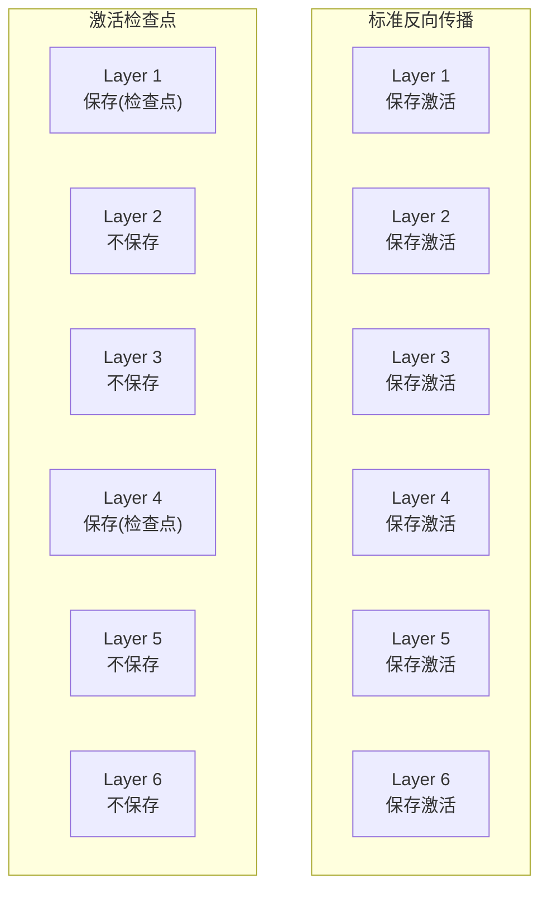

### 8.3 CPU Offloading

将部分数据（如优化器状态、不常用的参数）卸载到 CPU 内存中，需要时再传回 GPU。

**适用数据**：
- 优化器状态（最大部分，$12P$）
- 梯度（$2P$）
- 部分模型参数（ZeRO-Offload）

**性能瓶颈**：PCIe 带宽（约 32 GB/s）远低于 GPU HBM 带宽（约 2 TB/s），需要精心设计数据传输调度以隐藏延迟。

### 8.4 三种技术的组合

| 技术 | 显存节省 | 时间开销 | 适用场景 |
|------|---------|---------|---------|
| 梯度累积 | 无直接节省 | 无 | 模拟大 batch |
| 激活检查点 | $O(L) \to O(\sqrt{L})$ | +33% | 训练/微调 |
| CPU Offloading | 显著 | +50%--200% | 超大模型单卡 |

实践中这三种技术经常组合使用。例如，DeepSpeed ZeRO-Offload 将 ZeRO-2 + CPU Offloading + 激活检查点结合，可以在单张 V100 32GB 上微调 10B 参数的模型。

---

## 9. 三条技术线的分布式实践

### 9.1 Google

**Pathways 与 TPU Pod**

Google 的分布式训练方案围绕 TPU（Tensor Processing Unit）生态构建，与 NVIDIA GPU 生态形成差异化路线。

- **TPU Pod**：数千个 TPU 核心通过高速互连（ICI, Inter-Chip Interconnect）组成一个巨型计算集群，带宽远超节点间 InfiniBand
- **GSPMD**：GShard + SPMD 编程模型，用户只需标注张量的分片方式（sharding spec），编译器自动生成分布式代码
- **JAX + XLA**：静态图编译使得编译器可以全局优化通信调度和内存分配

**PaLM 540B 训练配置**：
- 6144 个 TPU v4 芯片
- TP=4, PP=12, DP=128
- 使用 JAX + GSPMD 编程模型
- 训练数据：780B tokens

### 9.2 DeepSeek

**DualPipe 与 FP8 训练**

DeepSeek-V3 在分布式训练工程方面做出了多项关键创新。

- **DualPipe**：一种改进的流水线并行调度算法，将计算和通信进行精细粒度的重叠，接近零气泡率
- **FP8 训练**：DeepSeek-V3 是首批成功采用 FP8 精度进行大规模预训练的模型之一，通过细粒度的量化和反量化策略保持训练精度
- **跨节点通信优化**：利用 MoE 架构的稀疏性降低 All-to-All 通信量

> 详细的 DualPipe 调度时间线和 FP8 工程细节见 [进阶文档](./advanced.md)。

### 9.3 Anthropic

**大规模安全训练**

Anthropic 虽然未公开具体的分布式训练架构细节，但其公开研究和招聘信息揭示了以下方向：

**公开事实**：
- Claude 3 系列模型在大规模 GPU/TPU 集群上训练
- Anthropic 曾使用 Google Cloud TPU 和 AWS GPU 进行训练
- 强调训练过程的可重复性和安全监控

**基于公开研究的合理推测**（标记为推测）：
- [推测] Anthropic 可能使用了 JAX/XLA 作为主要训练框架（基于团队背景和 Google Cloud TPU 使用历史）
- [推测] 训练过程中可能集成了实时的安全性检测和自动暂停机制
- [推测] 可能采用了类似 FSDP/ZeRO 的内存优化方案结合 TP/PP

---

## 10. 项目实践

### 项目 1：使用梯度累积模拟大 batch 训练（入门）

**目标**：理解梯度累积的原理，验证其与大 batch 训练的数学等价性。

**任务**：
1. 创建一个简单的分类模型和合成数据集
2. 实现梯度累积训练循环
3. 对比以下两种方式的训练损失曲线：
   - 直接使用 batch size = 128 训练
   - 使用 batch size = 32, 累积 4 步训练
4. 验证两种方式产生的梯度是否一致

**完整参考代码**：

```python
import torch
import torch.nn as nn
from torch.utils.data import DataLoader, TensorDataset

# 创建合成数据
torch.manual_seed(42)
X = torch.randn(1024, 64)
y = (X[:, 0] + X[:, 1] > 0).long()
dataset = TensorDataset(X, y)

# 简单模型
model = nn.Sequential(
    nn.Linear(64, 128),
    nn.ReLU(),
    nn.Linear(128, 2)
)

# --- 方式 1: 直接大 batch ---
loader_large = DataLoader(dataset, batch_size=128, shuffle=False)
model_large = nn.Sequential(nn.Linear(64, 128), nn.ReLU(), nn.Linear(128, 2))
model_large.load_state_dict(model.state_dict())  # 相同初始化
optimizer_large = torch.optim.Adam(model_large.parameters(), lr=1e-3)

losses_large = []
for epoch in range(5):
    for X_batch, y_batch in loader_large:
        loss = nn.functional.cross_entropy(model_large(X_batch), y_batch)
        optimizer_large.zero_grad()
        loss.backward()
        optimizer_large.step()
        losses_large.append(loss.item())

# --- 方式 2: 梯度累积 ---
accumulation_steps = 4
loader_small = DataLoader(dataset, batch_size=32, shuffle=False)
model_accum = nn.Sequential(nn.Linear(64, 128), nn.ReLU(), nn.Linear(128, 2))
model_accum.load_state_dict(model.state_dict())
optimizer_accum = torch.optim.Adam(model_accum.parameters(), lr=1e-3)

losses_accum = []
optimizer_accum.zero_grad()
for epoch in range(5):
    for i, (X_batch, y_batch) in enumerate(loader_small):
        loss = nn.functional.cross_entropy(model_accum(X_batch), y_batch)
        loss = loss / accumulation_steps
        loss.backward()

        if (i + 1) % accumulation_steps == 0:
            optimizer_accum.step()
            optimizer_accum.zero_grad()
        losses_accum.append(loss.item() * accumulation_steps)

print(f"大 batch 最终损失: {losses_large[-1]:.4f}")
print(f"梯度累积最终损失: {losses_accum[-1]:.4f}")
print(f"损失差异: {abs(losses_large[-1] - losses_accum[-1]):.6f}")
```

**关键学习点**：
- 梯度累积时损失需要除以累积步数
- 两种方式在确定性条件下（相同数据顺序、相同初始化）应产生相同结果
- 梯度累积不节省显存（每步仍需存储当前 micro-batch 的激活值），但可以使用更小的 micro-batch

---

### 项目 2：使用 PyTorch DDP 进行多卡训练（进阶）

**目标**：掌握 DDP 的基本使用方法和启动方式。

**任务**：
1. 将单卡训练代码改造为 DDP 版本
2. 理解进程组、rank、world_size 的概念
3. 正确使用 `DistributedSampler` 划分数据
4. 使用 `torchrun` 启动多进程训练

**代码框架**：

```python
import torch
import torch.distributed as dist
from torch.nn.parallel import DistributedDataParallel as DDP
from torch.utils.data import DataLoader, DistributedSampler

def setup(rank, world_size):
    """初始化分布式环境"""
    dist.init_process_group("nccl", rank=rank, world_size=world_size)
    torch.cuda.set_device(rank)

def cleanup():
    dist.destroy_process_group()

def train(rank, world_size):
    setup(rank, world_size)

    # 创建模型并包裹为 DDP
    model = YourModel().to(rank)
    ddp_model = DDP(model, device_ids=[rank])

    # 使用 DistributedSampler 确保每个 GPU 看到不同数据
    sampler = DistributedSampler(dataset, num_replicas=world_size, rank=rank)
    loader = DataLoader(dataset, batch_size=32, sampler=sampler)

    optimizer = torch.optim.Adam(ddp_model.parameters(), lr=1e-3)

    for epoch in range(num_epochs):
        sampler.set_epoch(epoch)  # 每个 epoch 重新打乱
        for batch in loader:
            loss = ddp_model(batch)
            optimizer.zero_grad()
            loss.backward()     # DDP 自动 All-Reduce 梯度
            optimizer.step()

    cleanup()
```

**启动命令**：

```bash
# 单机多卡
torchrun --nproc_per_node=4 train_ddp.py

# 多机多卡
torchrun --nnodes=2 --nproc_per_node=4 --master_addr=xxx --master_port=29500 train_ddp.py
```

**实验建议**：
- 对比单卡和多卡的训练速度，计算加速比
- 检查不同 GPU 上的梯度是否一致（在 All-Reduce 后）
- 尝试不同的 bucket size，观察对通信效率的影响

---

### 项目 3：计算并可视化 ZeRO 各阶段的显存节省（进阶）

**目标**：深入理解 ZeRO 的显存优化原理，通过公式推导和可视化加深理解。

**任务**：
1. 实现 ZeRO 各阶段的显存计算公式
2. 绘制不同 GPU 数量下 ZeRO-1/2/3 的显存占用对比图
3. 分析通信量与显存的权衡
4. 针对具体模型（如 Llama 2 7B/70B）计算实际数值

**计算公式**（提供）：

$$M_{\text{ZeRO-1}}(n) = 4P + \frac{12P}{n}$$

$$M_{\text{ZeRO-2}}(n) = 2P + \frac{14P}{n}$$

$$M_{\text{ZeRO-3}}(n) = \frac{16P}{n}$$

**可视化代码**（提供）：

```python
import matplotlib.pyplot as plt
import numpy as np

def compute_memory_gb(P_billion, n_gpus, stage):
    """计算 ZeRO 各阶段的显存占用 (GB)"""
    P = P_billion * 1e9
    if stage == 'DDP':
        mem = 16 * P
    elif stage == 'ZeRO-1':
        mem = 4 * P + 12 * P / n_gpus
    elif stage == 'ZeRO-2':
        mem = 2 * P + 14 * P / n_gpus
    elif stage == 'ZeRO-3':
        mem = 16 * P / n_gpus
    return mem / 1e9  # 转换为 GB

# 绘制对比图
P = 7  # 7B 参数
gpus = [1, 2, 4, 8, 16, 32, 64]
stages = ['DDP', 'ZeRO-1', 'ZeRO-2', 'ZeRO-3']

fig, ax = plt.subplots(figsize=(10, 6))
for stage in stages:
    mems = [compute_memory_gb(P, n, stage) for n in gpus]
    ax.plot(gpus, mems, marker='o', label=stage)

ax.axhline(y=80, color='r', linestyle='--', label='A100 80GB')
ax.set_xlabel('GPU 数量')
ax.set_ylabel('每 GPU 显存占用 (GB)')
ax.set_title(f'ZeRO 各阶段显存对比 (模型: {P}B 参数)')
ax.legend()
ax.set_xscale('log', base=2)
ax.set_yscale('log')
plt.grid(True, alpha=0.3)
plt.tight_layout()
plt.savefig('zero_memory_comparison.png', dpi=150)
plt.show()
```

**扩展任务**：
- 加入激活值显存的估算
- 分析在给定显存限制下，不同 ZeRO 阶段支持的最大模型规模
- 对比 ZeRO-3 和张量并行在通信量上的差异

---

### 项目 4：实现简化版张量并行（挑战）

**目标**：理解张量并行的通信模式和实现方法。

**思路**：
1. 实现列并行和行并行的线性层
2. 使用 `torch.distributed` 的集合通信原语模拟多 GPU 环境
3. 将多头注意力按头数切分，验证计算结果与非并行版本一致
4. 分析通信开销占比

**通信模式图**：

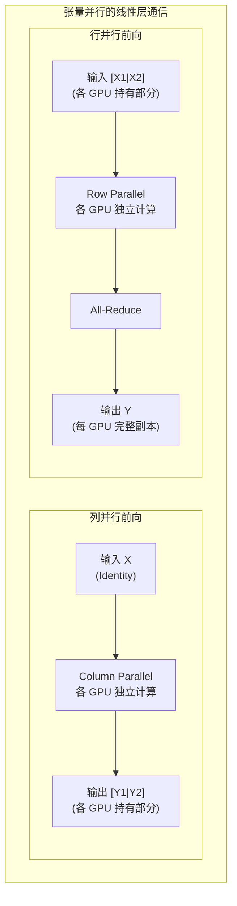

**关键代码片段**：

```python
class ColumnParallelLinear(nn.Module):
    """列并行线性层"""

    def __init__(self, in_features, out_features, world_size, rank):
        super().__init__()
        assert out_features % world_size == 0
        self.local_out = out_features // world_size
        self.weight = nn.Parameter(torch.randn(self.local_out, in_features))
        self.rank = rank

    def forward(self, x):
        # 每个 GPU 计算部分输出
        return torch.nn.functional.linear(x, self.weight)


class RowParallelLinear(nn.Module):
    """行并行线性层"""

    def __init__(self, in_features, out_features, world_size, rank):
        super().__init__()
        assert in_features % world_size == 0
        self.local_in = in_features // world_size
        self.weight = nn.Parameter(torch.randn(out_features, self.local_in))
        self.rank = rank

    def forward(self, x):
        # 每个 GPU 计算部分输出，然后 All-Reduce
        local_out = torch.nn.functional.linear(x, self.weight)
        # dist.all_reduce(local_out)  # 实际分布式环境
        return local_out
```

**伪代码 -- 完整的张量并行 Transformer Block**：

```
1. 输入 X 广播到所有 TP 组的 GPU
2. QKV 投影：列并行，按注意力头切分
   - GPU i 计算 Q_i, K_i, V_i (local_heads = n_heads / TP)
3. 注意力计算：各 GPU 独立计算（无通信）
4. 输出投影：行并行
   - 各 GPU 计算局部结果
   - All-Reduce 求和
5. 残差连接 + LayerNorm（无通信）
6. FFN W_up/W_gate：列并行（无通信）
7. FFN W_down：行并行
   - All-Reduce 求和
8. 残差连接 + LayerNorm（无通信）
9. 输出
```

---

### 项目 5：DDP vs FSDP 性能对比实验（入门）

**目标**：在 2-4 张 GPU 上对比 PyTorch DDP 和 FSDP 的显存占用与训练速度，直观理解 ZeRO 分片的实际效果。

**任务**：
1. 使用同一个模型（如 GPT-2 Medium 355M 或自定义 Transformer），分别用 DDP 和 FSDP 包装
2. 测量每种方式下的 GPU 显存峰值（`torch.cuda.max_memory_allocated()`）
3. 测量训练速度（tokens/sec 或 samples/sec）
4. 尝试增大模型规模，找到 DDP 显存溢出但 FSDP 仍可运行的临界点

**FSDP 配置模板**：

```python
import torch
import torch.distributed as dist
from torch.distributed.fsdp import FullyShardedDataParallel as FSDP
from torch.distributed.fsdp import ShardingStrategy, MixedPrecision

def setup_fsdp(model, rank):
    """配置 FSDP 包装"""
    # 混合精度策略
    mp_policy = MixedPrecision(
        param_dtype=torch.bfloat16,      # 参数以 BF16 存储
        reduce_dtype=torch.bfloat16,      # 梯度归约使用 BF16
        buffer_dtype=torch.bfloat16,      # Buffer 使用 BF16
    )

    # FSDP 包装 -- ShardingStrategy 对应 ZeRO 的不同阶段
    # FULL_SHARD: 等价于 ZeRO-3（参数+梯度+优化器全部分片）
    # SHARD_GRAD_OP: 等价于 ZeRO-2（仅梯度+优化器分片）
    # NO_SHARD: 等价于 DDP（无分片）
    fsdp_model = FSDP(
        model,
        sharding_strategy=ShardingStrategy.FULL_SHARD,
        mixed_precision=mp_policy,
        device_id=rank,
    )
    return fsdp_model

def benchmark(model_fn, dataloader, rank, world_size, mode="ddp"):
    """通用 benchmark 函数"""
    dist.init_process_group("nccl", rank=rank, world_size=world_size)
    torch.cuda.set_device(rank)
    torch.cuda.reset_peak_memory_stats(rank)

    model = model_fn().to(rank)

    if mode == "ddp":
        from torch.nn.parallel import DistributedDataParallel as DDP
        model = DDP(model, device_ids=[rank])
    elif mode == "fsdp":
        model = setup_fsdp(model, rank)

    optimizer = torch.optim.AdamW(model.parameters(), lr=1e-4)

    # 预热
    for batch in dataloader:
        loss = model(batch.to(rank)).loss
        loss.backward()
        optimizer.step()
        optimizer.zero_grad()
        break

    # 测量
    torch.cuda.synchronize()
    import time
    start = time.time()
    total_tokens = 0

    for batch in dataloader:
        loss = model(batch.to(rank)).loss
        loss.backward()
        optimizer.step()
        optimizer.zero_grad()
        total_tokens += batch.numel()

    torch.cuda.synchronize()
    elapsed = time.time() - start

    peak_mem = torch.cuda.max_memory_allocated(rank) / 1e9  # GB
    throughput = total_tokens / elapsed  # tokens/sec

    if rank == 0:
        print(f"[{mode.upper()}] 峰值显存: {peak_mem:.2f} GB")
        print(f"[{mode.upper()}] 吞吐量: {throughput:.0f} tokens/sec")
        print(f"[{mode.upper()}] 总耗时: {elapsed:.2f} sec")

    dist.destroy_process_group()
```

**思考题**：
- 在什么模型规模下，DDP 的显存不够但 FSDP 仍然可以运行？这个临界点与 GPU 数量有什么关系？
- FSDP 的 `FULL_SHARD`（ZeRO-3）相比 `SHARD_GRAD_OP`（ZeRO-2），显存节省了多少？训练速度下降了多少？
- 如果你只有 2 张 GPU，微调一个 7B 模型，应该选择 DDP 还是 FSDP？为什么？

---

## 11. 本章小结

### 核心知识点

1. **显存分析**：训练显存 $M \approx 16P + M_{\text{act}}$，7B 模型需要约 100+ GB
2. **数据并行**：Ring All-Reduce 的带宽最优性，每 GPU 通信量与 GPU 数无关
3. **ZeRO**：三阶段渐进分片，$16P \to 4P + 12P/n \to 2P + 14P/n \to 16P/n$
4. **张量并行**：列并行 + 行并行组合，每个 Transformer Block 仅需 2 次 All-Reduce
5. **流水线并行**：气泡率 $\frac{p-1}{m+p-1}$，1F1B 调度降低显存峰值
6. **3D 并行**：TP 在节点内，PP 跨节点，DP 跨所有 GPU
7. **混合精度**：BF16 是现代训练首选，FP8 是下一代方向
8. **单卡技巧**：梯度累积 + 激活检查点 + CPU Offloading 的组合

### 数学要点

- 训练时间：$T = \frac{6PD}{n \times \text{FLOPS} \times \text{MFU}}$
- Ring All-Reduce 通信量：$\frac{2(n-1)}{n}P \approx 2P$
- ZeRO 显存公式：三阶段渐进优化
- GPipe 气泡率：$\frac{p-1}{m+p-1}$
- 梯度检查点：$O(L) \to O(\sqrt{L})$ 显存，$+33\%$ 计算

### 实践要点

1. 单卡训练优先使用梯度累积 + 混合精度
2. 多卡训练优先使用 DDP + ZeRO-1/2
3. 超大模型需要 3D 并行（TP + PP + DP + ZeRO）
4. TP 组应限制在节点内 NVLink 连接的 GPU
5. 完整代码见 `code/distributed/` 目录

---

## 参考资料

### 论文

1. Rajbhandari et al. (2020). *ZeRO: Memory Optimizations Toward Training Trillion Parameter Models*. (ZeRO)
2. Shoeybi et al. (2019). *Megatron-LM: Training Multi-Billion Parameter Language Models Using Model Parallelism*. (Tensor Parallelism)
3. Huang et al. (2019). *GPipe: Efficient Training of Giant Neural Networks using Pipeline Parallelism*. (GPipe)
4. Narayanan et al. (2021). *Efficient Large-Scale Language Model Training on GPU Clusters Using Megatron-LM*. (3D Parallelism)
5. Micikevicius et al. (2018). *Mixed Precision Training*. (Mixed Precision)
6. Chen et al. (2016). *Training Deep Nets with Sublinear Memory Cost*. (Activation Checkpointing)
7. DeepSeek-AI (2024). *DeepSeek-V3 Technical Report*. (DualPipe, FP8)
8. Chowdhery et al. (2022). *PaLM: Scaling Language Modeling with Pathways*. (PaLM)

### 博客与资源

1. [DeepSpeed Documentation](https://www.deepspeed.ai/) - 微软 ZeRO 实现
2. [Megatron-LM](https://github.com/NVIDIA/Megatron-LM) - NVIDIA 张量并行参考实现
3. [PyTorch DDP Tutorial](https://pytorch.org/tutorials/intermediate/ddp_tutorial.html)
4. [The Illustrated GPipe](https://ai.googleblog.com/2019/03/introducing-gpipe-open-source-library.html)

---

## 从分布式训练到监督微调

至此，我们已经掌握了将大规模模型训练分布到成百上千张 GPU 上的完整技术栈：数据并行、ZeRO 优化器、张量并行、流水线并行，以及它们的 3D 组合。工业界正是依靠这些技术，在万亿 token 的数据上完成了 LLM 的**预训练**。

然而，预训练只是 LLM 开发流程的第一步。预训练后的模型虽然拥有强大的语言理解和生成能力，但它只学会了"预测下一个 token"——它不知道如何遵循用户的指令，也不知道什么样的回答是有帮助的、安全的。

下一章（模块 10: SFT）将介绍如何通过**监督微调（Supervised Fine-Tuning）** 让模型学会"听话"：给定一条指令，模型应该如何生成合适的回复。我们还将学习 **LoRA** 等参数高效微调方法——它们使得分布式训练的门槛大大降低，在单卡上即可微调数十亿参数的模型。

**下一章预告**：[模块10: SFT -- 监督微调与参数高效微调](../10_sft/README.md) - 在预训练模型基础上，通过监督微调使其具备指令遵循能力。
