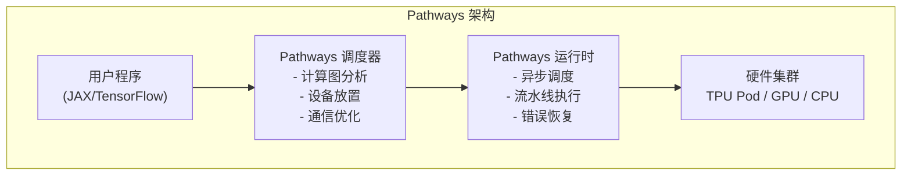
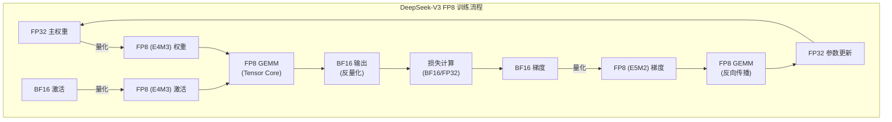
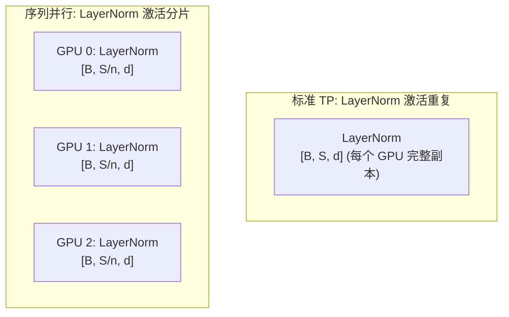
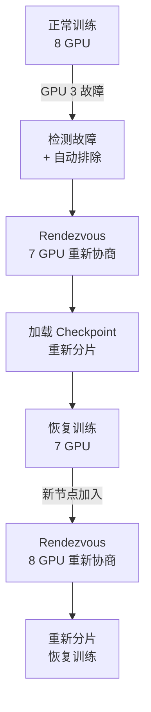

# 模块9 进阶：分布式训练的工业实践与前沿

> 本文深入探讨 Google、DeepSeek、Anthropic 在大规模分布式训练中的工程实践，以及该领域的前沿研究方向。

---

## 目录

- [1. Google 的分布式训练](#1-google-的分布式训练)
- [2. DeepSeek 的工程创新](#2-deepseek-的工程创新)
- [3. Anthropic 视角](#3-anthropic-视角)
- [4. 前沿话题](#4-前沿话题)
  - [4.1 异构计算集群的训练调度](#41-异构计算集群的训练调度)
  - [4.2 弹性训练](#42-弹性训练)
  - [4.3 通信压缩与量化梯度](#43-通信压缩与量化梯度)
  - [4.4 序列并行与上下文并行](#44-序列并行与上下文并行)
  - [4.5 异构训练](#45-异构训练)
  - [4.6 大规模训练的故障恢复](#46-大规模训练的故障恢复)
- [5. 参考文献](#5-参考文献)

---

## 1. Google 的分布式训练

### 1.1 Pathways 系统架构

Pathways 是 Google 为下一代 AI 工作负载设计的分布式计算系统，其核心设计目标是：

1. **异构计算支持**：同一训练任务可以跨 TPU Pod、GPU 集群甚至 CPU 运行
2. **动态资源分配**：根据模型不同部分的计算需求动态调整资源
3. **稀疏激活支持**：原生支持 MoE 等稀疏模型，只激活模型的部分参数

**架构层次**：



**关键创新**：
- **集中式调度**：由中央调度器决定计算图的分片和设备映射，避免用户手动管理
- **异步 Gang 调度**：一组相关的计算操作被作为"gang"原子调度，但不同 gang 之间可以异步执行
- **跨 Pod 执行**：支持在多个 TPU Pod 之间分布计算，突破单个 Pod 的规模限制

### 1.2 TPU Pod 的高效利用

TPU Pod 是 Google 的大规模 AI 加速器集群：

| TPU 版本 | 芯片数 (Pod) | 互连带宽 | Peak BF16 FLOPS (Pod) |
|----------|-------------|---------|----------------------|
| TPU v3 | 2048 | ICI: 656 GB/s | 420 PFLOPS |
| TPU v4 | 4096 | ICI: 3.2 TB/s | 1.1 EFLOPS |
| TPU v5p | 8960 | ICI: 4.8 TB/s | 4.6 EFLOPS |

**ICI (Inter-Chip Interconnect)** 是 TPU 的专有高速互连，其关键优势：
- 带宽远高于 InfiniBand（ICI 数 TB/s vs IB 数百 GB/s）
- 拓扑为 3D Torus，任意两个芯片之间的路径短
- 硬件级集合通信支持，延迟极低

### 1.3 GSPMD 编程模型

GSPMD（General and Scalable Parallelization for ML Computation Graphs）是 Google 的核心分布式编程抽象。

**核心理念**：用户只需标注每个张量的分片方式（sharding annotation），编译器自动推导所有中间张量的分片方式并插入必要的通信操作。

```python
# JAX + GSPMD 示例（伪代码）
import jax
from jax.sharding import PartitionSpec as P, Mesh

# 定义设备网格：4x2 的 GPU/TPU 网格
devices = jax.devices()
mesh = Mesh(devices.reshape(4, 2), ('data', 'model'))

# 标注张量分片方式
# 权重按 model 维度分片（列并行）
weight_spec = P(None, 'model')

# 输入按 data 维度分片（数据并行）
input_spec = P('data', None)

# 编译器自动推导：
# 1. 输出的分片方式
# 2. 需要插入的通信操作
# 3. 内存布局优化
```

**GSPMD vs 手动并行的对比**：

| 维度 | 手动并行 (Megatron-LM) | GSPMD (JAX) |
|------|----------------------|-------------|
| 编程方式 | 显式编写通信代码 | 标注分片方式，编译器生成 |
| 灵活性 | 高（完全控制） | 中（受编译器能力限制） |
| 开发效率 | 低（需要专家） | 高（自动化） |
| 优化质量 | 依赖人工经验 | 编译器全局优化 |
| 调试难度 | 中 | 高（编译器黑盒） |

### 1.4 PyTorch vs JAX：分布式视角

**PyTorch（Eager Mode）**：
- 动态图执行，逐操作调度
- 分布式依赖显式的通信原语（All-Reduce, Send/Recv）
- 代表框架：Megatron-LM, DeepSpeed, FSDP
- 优势：调试方便，生态丰富
- 劣势：难以进行全局通信优化

**JAX（XLA Compiled）**：
- 静态图编译，整体优化
- 分布式通过 sharding annotation + 编译器自动生成
- 代表框架：T5X, PaLM, Gemini
- 优势：编译器可以融合操作、优化通信、自动流水线化
- 劣势：编译时间长，调试困难

**为什么 Google（和可能 Anthropic）偏爱 JAX？**

1. **数学表达的纯粹性**：JAX 的函数式编程模型更接近数学定义，便于研究人员表达复杂模型
2. **编译器优化空间大**：XLA 可以看到整个计算图，进行跨操作优化
3. **TPU 原生支持**：JAX + XLA 是 TPU 的原生编程接口，可以充分发挥 TPU 硬件特性
4. **SPMD 范式**：JAX 的 `pjit` 和 sharding annotation 使得同一代码可以无修改地运行在不同规模的集群上

---

## 2. DeepSeek 的工程创新

### 2.1 DualPipe 流水线调度

DualPipe 是 DeepSeek-V3 提出的一种创新流水线调度算法，其核心目标是在保持低显存占用的同时最大化计算-通信重叠。

**设计动机**：

DeepSeek-V3 使用 MoE 架构，其中 All-to-All 通信（专家路由）是性能瓶颈。DualPipe 的关键洞察是：**可以将 Transformer Block 的计算拆分为注意力部分和 MoE 部分，分别与不同类型的通信重叠**。

**DualPipe 调度原理**：

将每个 micro-batch 的前向传播拆分为两个阶段：
- **阶段 A**：注意力计算 + All-to-All 通信（MoE dispatch）
- **阶段 B**：MoE 计算 + All-Reduce 通信（DP 梯度同步）

通过在相邻的流水线阶段之间"双向"调度，使得一个阶段的计算可以与另一个阶段的通信重叠。

```
DualPipe 调度示意 (简化, PP=4, m=8):

时间 →  1    2    3    4    5    6    7    8    9    10   11   12
GPU 0: [F1a][F1b][F2a][F2b][F3a][F3b][F4a+B1a][F4b+B1b][B2a][B2b][B3a+B4a][B3b+B4b]
GPU 1: [   ][F1a][F1b][F2a][F2b][F3a+B1a][F3b+B1b][F4a+B2a][F4b+B2b][B3a][B3b+B4a][B4b]
GPU 2: [   ][   ][F1a][F1b][F2a+B1a][F2b+B1b][F3a+B2a][F3b+B2b][F4a+B3a][F4b+B3b][B4a][B4b]
GPU 3: [   ][   ][   ][F1a+B1a][F1b+B1b][F2a+B2a][F2b+B2b][F3a+B3a][F3b+B3b][F4a+B4a][F4b+B4b][  ]

注: Fka = micro-batch k 的前向阶段 a, Bka = micro-batch k 的反向阶段 a
    "+" 表示计算与通信重叠
```

**气泡率分析**：

标准 1F1B 的气泡率：$\frac{p-1}{m+p-1}$

DualPipe 通过计算-通信重叠，有效气泡率接近：

$$\text{bubble}_{\text{DualPipe}} \approx \frac{p-1}{2(m+p-1)} \approx \frac{1}{2} \times \text{bubble}_{1\text{F}1\text{B}}$$

在 DeepSeek-V3 的实际训练中（$p=16$, $m=4096$），气泡率低于 **1%**。

### 2.2 FP8 训练的工程细节

DeepSeek-V3 是最早成功在大规模预训练中使用 FP8 精度的模型之一。

**FP8 的两种格式**：

| 格式 | 指数 | 尾数 | 范围 | 精度 | 用途 |
|------|------|------|------|------|------|
| E4M3 | 4 | 3 | $\pm 448$ | 较高 | 前向传播（权重、激活） |
| E5M2 | 5 | 2 | $\pm 57344$ | 较低 | 反向传播（梯度） |

**DeepSeek-V3 的 FP8 策略**：

1. **细粒度量化**：不是对整个张量使用同一个缩放因子，而是按 tile（如 128x128）或 channel 维度独立量化
2. **延迟缩放（Delayed Scaling）**：使用上一步的张量统计信息来决定当前步的缩放因子，避免额外的全局归约操作
3. **选择性 FP8**：注意力计算中的 Softmax 仍使用 FP32，Layer Norm 使用 BF16



**训练精度影响**：

DeepSeek 报告，FP8 训练与 BF16 训练相比：
- 预训练损失差异小于 0.1%
- 下游任务性能差异在统计噪声范围内
- 训练速度提升约 40%（得益于 FP8 Tensor Core 的更高吞吐）

### 2.3 跨节点通信优化

DeepSeek-V3 在 MoE 架构的 All-to-All 通信上做了深度优化：

1. **通信量压缩**：MoE 的 dispatch 和 combine 操作传输的激活值使用 FP8 量化，通信量减半
2. **拓扑感知路由**：在专家路由时考虑专家所在的物理位置，优先选择同节点内的专家，减少跨节点通信
3. **分阶段通信**：将 All-to-All 通信拆分为节点内（NVLink）和节点间（InfiniBand）两个阶段，分别优化

---

## 3. Anthropic 视角

### 3.1 大规模训练的安全挑战

Anthropic 的独特视角在于将**安全性**嵌入到训练流程的每个环节中。虽然具体技术细节未公开，但从公开研究和讨论中可以归纳出以下关键议题：

**训练过程中的安全监控**：
- 持续监测模型在安全基准上的表现，确保训练不会引入有害行为
- 在训练的不同检查点进行安全评估，而非仅在训练结束后
- 关注"涌现"能力是否包含潜在危险能力

**公开事实**：
- Anthropic 在论文中多次强调训练可重复性的重要性——分布式训练中的数值不确定性可能影响安全评估的一致性
- Anthropic 的 RSP（Responsible Scaling Policy）要求在模型能力达到特定阈值时暂停训练并进行深度评估

### 3.2 训练过程中的异常检测

大规模分布式训练中常见的异常包括：

| 异常类型 | 表现 | 可能原因 |
|---------|------|---------|
| 损失尖峰 (Loss Spike) | 训练损失突然飙升 | 数据质量问题、学习率过高 |
| 梯度爆炸 | 梯度范数异常大 | 模型不稳定、数值溢出 |
| 硬件故障 | 特定 GPU 输出异常 | GPU 内存错误、通信超时 |
| 训练发散 | 损失持续上升 | 超参数设置不当 |

**工业界的通用做法**：
- 实时监控训练损失、梯度范数、参数范数的变化趋势
- 设置自动检查点保存策略（如每 N 步保存一次）
- 当检测到异常时自动回滚到上一个健康检查点
- 使用冗余计算（如在不同 GPU 上重复计算同一 batch）来检测硬件错误

**[推测] Anthropic 可能的增强措施**：
- [推测] 在训练循环中集成安全评估指标，与损失一起监控
- [推测] 自动化的训练暂停机制：当模型在安全基准上的表现超过预设阈值时触发

### 3.3 分布式训练中的可重复性

分布式训练的数值确定性是一个重要的工程挑战：

**不确定性来源**：
1. **浮点运算的非结合性**：$(a + b) + c \neq a + (b + c)$ 在浮点数下通常不成立
2. **All-Reduce 的归约顺序**：不同的通信实现可能以不同顺序累加梯度
3. **GPU 内核的非确定性**：某些 CUDA 内核（如 atomicAdd）本质上是非确定性的
4. **数据加载顺序**：多进程数据加载可能导致不同运行看到不同的数据顺序

**为什么 Anthropic 关心这个问题？**

对于安全研究，可重复性至关重要：
- 如果训练不可重复，安全评估的结论可能在不同训练运行间不一致
- 调试危险行为需要精确重现训练过程中的特定状态
- 科学严谨性要求实验结果可以被独立验证

**工业实践**：
- 设置所有随机种子（Python、NumPy、PyTorch、CUDA）
- 使用确定性的 CUDA 内核（`torch.use_deterministic_algorithms(True)`）
- 固定 All-Reduce 的归约顺序
- 记录完整的训练元数据（数据顺序、超参数、硬件配置）

---

## 4. 前沿话题

### 4.1 异构计算集群的训练调度

现实中的训练集群往往包含不同类型的硬件：

- 不同代的 GPU（A100 vs H100）
- 不同的互连拓扑（NVLink vs PCIe）
- 不同的内存配置（40GB vs 80GB）

**挑战**：
- 快慢设备之间的同步等待（straggler 问题）
- 不同设备的显存限制不同，无法使用统一的 micro-batch size
- 通信带宽不一致导致的负载不均衡

**研究方向**：
- **异步训练**：允许不同设备以不同速度更新参数，但需要处理 staleness 问题
- **自适应分片**：根据设备能力动态调整每个设备负责的模型分片大小
- **混合并行策略**：在不同设备组之间使用不同的并行策略

### 4.2 弹性训练（Elastic Training）

弹性训练允许训练过程中动态地增加或减少 GPU 数量，无需重启训练。

**应用场景**：
- 云环境中使用 Spot Instance（可能随时被回收）
- 硬件故障后自动缩减集群规模继续训练
- 在不同优先级的任务之间动态调配 GPU 资源

**技术挑战**：
- 数据并行度变化时，学习率和 batch size 需要相应调整
- 模型分片需要在线重新分配（repartition）
- 检查点格式需要与 GPU 数量无关

**相关工作**：
- PyTorch Elastic (torchelastic/torchrun)：支持节点的动态加入/退出
- Bamboo：基于冗余计算的容错训练
- OSLO：支持弹性缩放的分布式训练框架

### 4.3 通信压缩与量化梯度

减少分布式训练中的通信开销是一个活跃的研究方向。

**梯度压缩方法**：

| 方法 | 压缩率 | 精度影响 | 原理 |
|------|--------|---------|------|
| 梯度量化 | 2--8x | 小 | 将 FP32 梯度量化为低精度 |
| Top-K 稀疏化 | 10--1000x | 中 | 只传输最大的 K% 梯度 |
| Random-K | 10--1000x | 中 | 随机选择 K% 梯度 |
| 幂律压缩 | 4--16x | 小 | 利用梯度的幂律分布特性 |

**量化梯度的数学保证**：

对于无偏量化算子 $Q$（满足 $\mathbb{E}[Q(g)] = g$），可以证明量化 SGD 的收敛速度为：

$$\mathbb{E}\left[\|\nabla f(\bar{x})\|^2\right] \leq O\left(\frac{1}{\sqrt{T}} + \frac{\sigma^2}{T}\right)$$

其中 $\sigma^2$ 是量化引入的方差。与标准 SGD 相比，收敛率不变，只是常数因子增大。

**实践中的挑战**：
- 压缩和解压缩的计算开销可能抵消通信节省
- 高压缩率可能导致训练不稳定
- 与 All-Reduce 等集合通信原语的集成需要定制化实现

### 4.4 序列并行与上下文并行

随着上下文窗口长度的增加（128K--1M tokens），注意力计算的显存和计算成本成为新的瓶颈。

**序列并行（Sequence Parallelism）**：

Megatron-LM 提出的序列并行与张量并行配合使用。在标准张量并行中，LayerNorm 和 Dropout 等操作在所有 TP rank 上都持有完整的激活值副本——这是不必要的冗余。序列并行将这些"非张量并行区域"的激活值沿序列维度切分：

- **切分对象**：LayerNorm、Dropout、残差连接等操作的激活值
- **通信模式**：在进入张量并行区域时执行 All-Gather（沿序列维度收集），在退出张量并行区域时执行 Reduce-Scatter（沿序列维度散播并归约）
- **显存节省**：$1/n_{TP}$（$n_{TP}$ 是张量并行度），对于 TP=8 可减少约 87.5% 的非并行区域激活显存



**Ring Attention**：

Ring Attention（Liu et al., 2023）解决了更根本的问题：当序列长度极长（如 1M tokens）时，即使使用 FlashAttention，单个 GPU 也无法容纳全部的 KV 缓存。

核心算法：
1. 将长序列等分为 $n$ 个块（chunk），分配到 $n$ 个 GPU
2. 每个 GPU 持有自己 chunk 的 Q、K、V
3. 以环形拓扑传递 K、V 块，同时每个 GPU 计算当前持有的 KV 块与本地 Q 的注意力
4. 经过 $n$ 轮传递后，每个 GPU 都与所有 KV 块完成了注意力计算

$$\text{Ring Attention 显存} = O\left(\frac{S}{n} \cdot d\right) \quad \text{vs 标准注意力} = O(S \cdot d)$$

关键优势是计算与通信完全重叠：在接收下一个 KV 块的同时，GPU 正在与当前 KV 块计算注意力。

**Context Parallelism（上下文并行）**：

Meta 在 Llama 3 训练中使用了 Context Parallelism (CP)，这是一种比 Ring Attention 更工程化的长序列分布式方案：

- **与 Ring Attention 的区别**：CP 不仅处理注意力层，还将序列维度的切分贯穿整个 Transformer Block（包括 FFN）
- **通信优化**：Llama 3 使用了基于 All-Gather 的方式而非纯环形传递，这在某些网络拓扑下效率更高
- **与其他并行的组合**：CP 与 TP 正交（TP 切分特征维度，CP 切分序列维度），可以同时使用。Llama 3 405B 的训练使用了 TP=8 + CP=某值 + PP + DP 的多维并行组合
- **因果注意力优化**：对于自回归模型，因果掩码使得序列前半段的 token 不需要与后半段的 KV 交互，CP 可以利用这一点跳过不必要的通信

**上下文并行 vs 张量并行 vs 序列并行**：

| 维度 | 张量并行 (TP) | 序列并行 (SP) | 上下文并行 (CP) |
|------|-------------|-------------|---------------|
| 切分维度 | 特征/头维度 | 序列维度（仅非 TP 区域） | 序列维度（全 Block） |
| 通信模式 | All-Reduce | All-Gather / Reduce-Scatter | All-Gather 或 Ring |
| 解决的问题 | 模型太大 | TP 区域外的激活冗余 | 序列太长 |
| 与 TP 关系 | - | TP 的补充 | 正交，可同时使用 |
| 硬件要求 | NVLink（高带宽） | 同 TP | 可跨节点 |

### 4.5 异构训练

现实中的训练集群并非总是由完全相同的 GPU 组成。异构训练（Heterogeneous Training）是处理混合硬件集群的新兴研究方向。

**典型场景**：
- 集群扩容时新购入的 H100 与已有的 A100 混合使用
- 使用云服务商的 Spot Instance 时，分配到不同型号的 GPU
- 训练中部分节点发生故障，替换为不同型号的备用机器

**核心挑战与解决方案**：

1. **计算速度不对称**：
   - 问题：快速 GPU（如 H100）需要等待慢速 GPU（如 A100），造成资源浪费
   - 方案：**自适应 micro-batch 分配**——给快速 GPU 分配更多 micro-batch，使每步的处理时间趋于一致
   - 数学：设 GPU $i$ 的算力为 $F_i$，分配的 micro-batch 数为 $m_i = \lceil m \cdot F_i / \sum_j F_j \rceil$

2. **显存容量不对称**：
   - 问题：40GB 和 80GB 的 GPU 无法使用相同的 batch size
   - 方案：**非均匀分片**——使用 ZeRO-3 时根据各 GPU 的显存容量分配不同大小的参数分片

3. **互连带宽不对称**：
   - 问题：NVLink 连接的 GPU 与 PCIe 连接的 GPU 混合使用
   - 方案：**拓扑感知的并行策略分配**——将通信密集型的并行维度（TP）限制在高带宽连接的 GPU 组内

**相关工作**：
- **AMP (Adaptive Model Parallelism)**：根据设备能力自动选择并行策略
- **Whale**：字节跳动的异构训练框架，支持混合 GPU 类型
- **Varuna**：微软的弹性异构训练系统

### 4.6 大规模训练的故障恢复

#### 大规模训练的故障率

大规模训练集群的硬件故障是**必然事件**，而非"如果"的问题：

| 集群规模 | 每天预期故障次数 | 故障类型分布 |
|---------|---------------|------------|
| 100 GPU | ~0.1 | GPU 内存错误为主 |
| 1000 GPU | ~1-3 | GPU 故障、网络中断、节点宕机 |
| 10000+ GPU | ~10-30 | 上述所有 + 电力/冷却/存储故障 |

Meta 在 Llama 3 405B 的训练报告中提到：在 16384 张 H100 GPU 上的 54 天训练期间，经历了 **419 次意外中断**——平均每 3 小时就有一次。其中：
- **GPU 硬件故障**（如 HBM 内存错误）：占比最高
- **网络故障**（InfiniBand 链路失效）：第二大来源
- **软件/集群管理错误**：第三大来源
- **其他**（电力波动、散热异常等）

#### 自动 Checkpoint 与恢复策略

**基础策略：定期 Checkpoint**

最基本的容错方式是定期将训练状态保存到持久存储：

```python
# 简化的 checkpoint 保存逻辑
def save_checkpoint(model, optimizer, step, path):
    """保存完整训练状态"""
    state = {
        'model_state_dict': model.state_dict(),
        'optimizer_state_dict': optimizer.state_dict(),
        'step': step,
        'rng_state': torch.cuda.get_rng_state(),  # 保存随机数状态以确保可重复性
    }
    torch.save(state, f"{path}/checkpoint_{step}.pt")

# 每 N 步保存一次
CHECKPOINT_INTERVAL = 1000
for step in range(total_steps):
    train_step()
    if step % CHECKPOINT_INTERVAL == 0:
        save_checkpoint(model, optimizer, step, checkpoint_dir)
```

**挑战**：对于大模型，checkpoint 的保存本身就很耗时。例如，Llama 2 70B 模型的完整训练状态（参数 + 优化器 + 梯度）约 1.1 TB，写入磁盘需要数分钟。

**进阶策略：异步 Checkpoint**

将 checkpoint 保存操作放到后台线程中执行，不阻塞训练：

1. 在内存中创建训练状态的快照（通过 Copy-on-Write 或显式复制）
2. 后台线程将快照写入持久存储
3. 训练继续进行，不等待写入完成

**Google 的实践**：
- TPU Pod 训练使用 Orbax 框架进行分布式 checkpoint
- 支持异步保存和增量 checkpoint（只保存自上次 checkpoint 以来变化的部分）
- Checkpoint 保存到 Google Cloud Storage，利用其高带宽和冗余存储

**DeepSeek 的实践**：
- DeepSeek-V3 训练中使用了高频 checkpoint（每 100 步）配合高速 NVMe SSD 存储
- 故障恢复时间控制在 10 分钟以内（包括检测故障、重新分配任务、加载 checkpoint）
- 使用 RDMA 直接从 GPU 显存写入远程存储，减少 CPU 参与

#### 弹性训练（Elastic Training）

弹性训练允许在 GPU 数量发生变化时继续训练，无需手动干预。

**PyTorch Elastic (torchrun)** 的核心机制：

1. **Rendezvous**：当节点加入或退出时，所有存活节点重新协商 world_size 和 rank 分配
2. **State Repartitioning**：ZeRO 分片或 FSDP 的参数分片需要根据新的 world_size 重新划分
3. **学习率调整**：GPU 数量变化时，有效 batch size 变化，可能需要相应调整学习率



**数学影响**：当 GPU 数量从 $n$ 变为 $n'$ 时：

- 数据并行的有效 batch size 变为 $B' = B \times n'/n$
- 学习率可能需要线性缩放：$\eta' = \eta \times n'/n$（线性缩放规则）
- ZeRO 分片需要重新划分：每 GPU 从 $P/n$ 变为 $P/n'$

**当前局限**：
- 张量并行和流水线并行的弹性调整非常困难（需要重新划分模型结构）
- 实际中弹性训练主要应用于数据并行维度
- Checkpoint 格式需要与 GPU 数量解耦（使用"逻辑分片"而非"物理分片"）

---

## 5. 参考文献

1. Barham et al. (2022). *Pathways: Asynchronous Distributed Dataflow for ML*. MLSys.
2. Xu et al. (2021). *GSPMD: General and Scalable Parallelization for ML Computation Graphs*. arXiv.
3. Bradbury et al. (2018). *JAX: Composable Transformations of Python+NumPy Programs*.
4. DeepSeek-AI (2024). *DeepSeek-V3 Technical Report*. arXiv.
5. Micikevicius et al. (2022). *FP8 Formats for Deep Learning*. arXiv.
6. Rajbhandari et al. (2020). *ZeRO: Memory Optimizations Toward Training Trillion Parameter Models*. SC.
7. Narayanan et al. (2021). *Efficient Large-Scale Language Model Training on GPU Clusters*. SC.
8. Li et al. (2023). *Sequence Parallelism: Long Sequence Training from System Perspective*. ACL.
9. Liu et al. (2023). *Ring Attention with Blockwise Transformers for Near-Infinite Context*. arXiv.
10. Alistarh et al. (2017). *QSGD: Communication-Efficient SGD via Gradient Quantization and Encoding*. NeurIPS.
11. Korthikanti et al. (2023). *Reducing Activation Recomputation in Large Transformer Models*. MLSys. (Megatron-LM 序列并行)
12. Dubey et al. (2024). *The Llama 3 Herd of Models*. arXiv. (Context Parallelism, 故障恢复统计)
13. Thorpe et al. (2023). *Bamboo: Making Preemptible Instances Resilient for Affordable Training of Large Language Models*. arXiv.
14. Zhao et al. (2023). *PyTorch FSDP: Experiences on Scaling Fully Sharded Data Parallel*. VLDB.

---

**返回主文档**：[README.md](./README.md)
