# 模块10：SFT — 监督微调与参数高效微调

> 预训练赋予模型语言能力，但要让模型"听话"——遵循指令、以对话形式回答问题——需要监督微调（Supervised Fine-Tuning, SFT）。本章将系统讲解从全参数微调到 LoRA/QLoRA 等参数高效方法的完整技术栈，包含严格的数学推导和工程实现。

---

## 目录

- [1. 预训练到微调的范式转变](#1-预训练到微调的范式转变)
- [2. 指令微调数据](#2-指令微调数据)
- [3. 全参数微调](#3-全参数微调)
- [4. LoRA（Low-Rank Adaptation）](#4-loralow-rank-adaptation)
- [5. QLoRA](#5-qlora)
- [6. 其他 PEFT 方法](#6-其他-peft-方法)
- [7. Google 的微调实践](#7-google-的微调实践)
- [8. DeepSeek 的微调策略](#8-deepseek-的微调策略)
- [9. Anthropic 的微调理念](#9-anthropic-的微调理念)
- [10. SFT 的工业实践](#10-sft-的工业实践)
- [11. 项目实践](#11-项目实践)
- [12. 章节衔接：从 SFT 到 RLHF](#12-章节衔接从-sft-到-rlhf)

---

## 本章在学习路径中的位置


**前置知识**：

本模块假设你已经掌握以下内容：

| 前置模块 | 需要的知识 | 本章如何衔接 |
|---------|-----------|------------|
| 模块 3: Transformer | 自注意力、多头注意力、FFN 的结构 | SFT 的目标层（Q/K/V/O 投影）理解 |
| 模块 4: Decoder-Only | 自回归生成、因果掩码 | SFT 损失函数的自回归形式 |
| 模块 8A: 预训练目标 | 交叉熵损失、Next Token Prediction | Prompt Masking 的损失设计 |
| 模块 8C: 训练工程 | AdamW、学习率调度、混合精度 | SFT 的超参数配置 |
| 模块 9: 分布式训练 | 数据并行、梯度累积 | 大模型微调的显存管理 |

**从预训练到 SFT 的范式转变**：

预训练阶段赋予模型强大的语言理解和生成能力——模型学会了"如何说话"。但预训练模型只是一个文本续写器，它不知道什么时候该停下来、什么时候该拒绝回答、什么时候该给出结构化的回答。**SFT 是将"能力"转化为"行为"的关键一步**。从工程管线的角度看，SFT 是预训练之后、RLHF/DPO 对齐之前的中间阶段——它解决了"模型能不能听懂指令"的问题，而后续的对齐阶段则解决"模型回答好不好"的问题。

---

## 1. 预训练到微调的范式转变

### 1.1 预训练模型的能力与不足

经过大规模预训练后，模型具备了强大的语言理解和生成能力。但预训练的目标是**下一个 token 预测**，模型学到的是"如何续写文本"，而非"如何回答问题"。

**预训练模型的典型行为**：

| 用户输入 | 期望输出 | 预训练模型实际输出 |
|---------|---------|------------------|
| "什么是光合作用？" | 清晰的解释 | "什么是呼吸作用？什么是蒸腾作用？..." |
| "写一首关于春天的诗" | 一首诗 | "写一首关于夏天的诗，写一首..." |
| "把这段话翻译成英文" | 英文翻译 | 继续生成更多中文文本 |

**核心问题**：预训练模型将用户的指令视为"文本片段"进行续写，而不是将其理解为"需要执行的任务"。

### 1.2 指令遵循（Instruction Following）

SFT 的核心目标是让模型从"文本续写者"转变为"指令执行者"：

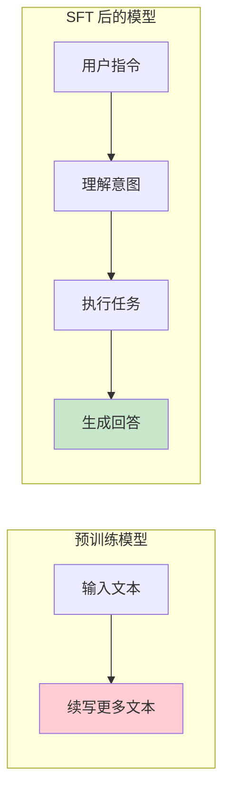

### 1.3 SFT 的数学形式

给定指令-回答对 $(x, y)$，其中 $x$ 是指令（prompt），$y = (y_1, y_2, \ldots, y_T)$ 是期望的回答。

**标准交叉熵损失**（自回归形式）：

$$L_{SFT} = -\sum_{t=1}^{T} \log P_\theta(y_t \mid x, y_{<t})$$

其中 $\theta$ 是模型参数，$y_{<t} = (y_1, \ldots, y_{t-1})$。

### 1.4 Prompt Masking：只在回答部分计算损失

在实际训练中，我们**只对回答部分计算损失**，指令部分不参与损失计算。这就是 Prompt Masking。

**直觉理解**：我们希望模型学习"如何回答"，而不是"如何复述指令"。

设完整序列为 $s = [x_1, \ldots, x_m, y_1, \ldots, y_T]$，其中前 $m$ 个 token 是指令，后 $T$ 个 token 是回答。

$$L_{SFT} = -\sum_{t=1}^{T} \log P_\theta(y_t \mid x_1, \ldots, x_m, y_1, \ldots, y_{t-1})$$

用掩码（mask）表示：

$$L_{SFT} = -\sum_{i=1}^{m+T} \mathbb{1}[i > m] \cdot \log P_\theta(s_i \mid s_{<i})$$

其中 $\mathbb{1}[i > m]$ 是指示函数，只有当位置 $i$ 属于回答部分时才为 1。

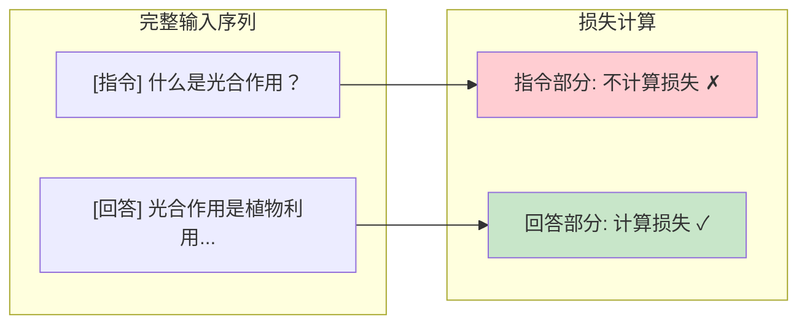

**实现要点**：

```python
# 构建 labels，将指令部分的 label 设为 -100（PyTorch 忽略索引）
labels = input_ids.clone()
labels[:, :prompt_length] = -100  # 指令部分不计算损失

# 计算损失时，-100 位置会被自动忽略
loss = F.cross_entropy(logits.view(-1, vocab_size), labels.view(-1), ignore_index=-100)
```

---

## 2. 指令微调数据

### 2.1 指令数据的格式

标准的指令微调数据由三元组 `(instruction, input, output)` 组成：

| 字段 | 说明 | 示例 |
|------|------|------|
| `instruction` | 任务描述/指令 | "将以下文本翻译成英文" |
| `input` | 可选的附加输入 | "今天天气很好" |
| `output` | 期望的回答 | "The weather is nice today" |

**JSON 格式示例**：

```json
{
    "instruction": "根据给定的关键词写一个故事开头",
    "input": "关键词：月亮、猫、图书馆",
    "output": "月光穿过图书馆高大的落地窗，在满是灰尘的书架间投下银色的光柱。一只黑猫蹲在最高的书架上，翡翠色的眼睛正注视着窗外那轮满月..."
}
```

### 2.2 高质量指令数据的特征

高质量的指令数据应当满足以下条件：

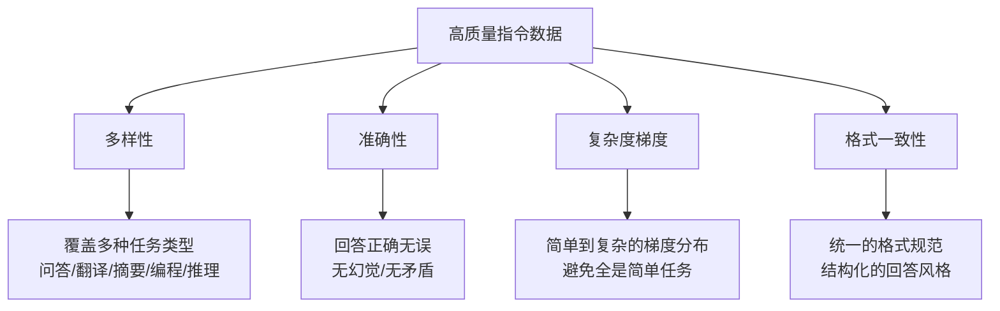

**经验法则**（来自 LIMA 论文的核心发现）：

> 数据质量远比数据数量重要。LIMA 用仅 1000 条高质量指令数据就训练出了与 GPT-4 相当的对话模型。

| 策略 | 数据量 | 效果 |
|------|-------|------|
| 大量低质量数据 | 100K+ | 学到格式，但回答质量差 |
| 少量高质量数据 | 1K-10K | 回答质量高，但覆盖面有限 |
| 适量高质量 + 多样性 | 10K-100K | 平衡质量和覆盖面 |

### 2.3 Self-Instruct 与 Evol-Instruct

#### Self-Instruct

Self-Instruct 是一种利用 LLM 自身来生成指令数据的方法。

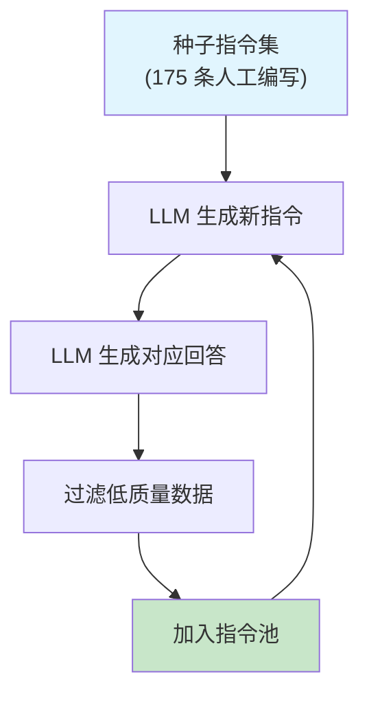

**算法流程**：

1. 从种子集中随机采样若干指令作为 few-shot 示例
2. 让 LLM 生成新指令
3. 过滤与已有指令过于相似的（ROUGE-L > 0.7）
4. 让 LLM 为新指令生成回答
5. 过滤低质量回答
6. 重复步骤 1-5

#### Evol-Instruct

Evol-Instruct（WizardLM 提出）通过**进化策略**来提升指令的复杂度和多样性：

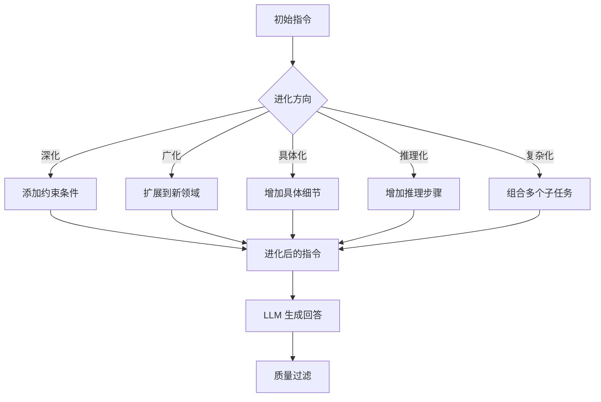

**进化示例**：

| 进化方向 | 原始指令 | 进化后指令 |
|---------|---------|-----------|
| 深化 | "排序一个列表" | "实现一个排序算法，要求时间复杂度 O(n log n)，空间复杂度 O(1)" |
| 广化 | "用 Python 排序列表" | "用 Rust 实现一个通用排序器，支持自定义比较函数" |
| 推理化 | "计算 2+3" | "证明为什么加法满足交换律" |

### 2.4 对话格式模板

对话数据需要特定的格式模板，让模型区分不同角色的文本。

#### ChatML 格式

ChatML 是 OpenAI 提出的标准对话格式：

```
<|im_start|>system
你是一个有帮助的AI助手。<|im_end|>
<|im_start|>user
什么是光合作用？<|im_end|>
<|im_start|>assistant
光合作用是植物利用阳光、水和二氧化碳生成有机物和氧气的过程。<|im_end|>
```

#### Llama 格式

Llama 2/3 使用的对话模板：

```
<s>[INST] <<SYS>>
你是一个有帮助的AI助手。
<</SYS>>

什么是光合作用？ [/INST] 光合作用是植物利用阳光、水和二氧化碳生成有机物和氧气的过程。 </s>
```

#### 对话模板的对比

| 格式 | 特殊 Token | 多轮支持 | 使用模型 |
|------|-----------|---------|---------|
| ChatML | `<\|im_start\|>`, `<\|im_end\|>` | 天然支持 | Qwen, Yi |
| Llama 格式 | `[INST]`, `[/INST]`, `<<SYS>>` | 拼接多轮 | Llama 2/3 |
| Alpaca 格式 | `### Instruction:`, `### Response:` | 有限 | Alpaca |
| Vicuna 格式 | `USER:`, `ASSISTANT:` | 支持 | Vicuna |

**重要**：训练和推理必须使用相同的模板。模板不匹配会导致模型性能显著下降。

---

## 3. 全参数微调

### 3.1 全量 SFT 的流程

全参数微调（Full Fine-Tuning）是最直接的方法：用指令数据继续训练预训练模型的**全部参数**。

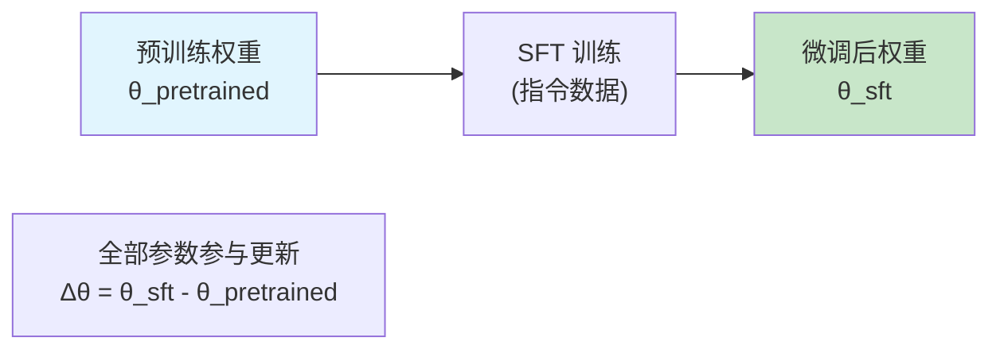

**全参数微调的超参数建议**：

| 超参数 | 典型值 | 说明 |
|--------|-------|------|
| 学习率 | 1e-5 ~ 5e-5 | 远小于预训练学习率 |
| Epoch 数 | 2-5 | 过多会过拟合 |
| Batch Size | 64-128 | 配合梯度累积 |
| Warmup | 前 3-10% 步 | 逐步提升学习率 |
| 权重衰减 | 0.01-0.1 | 正则化 |
| 最大序列长度 | 2048-4096 | 取决于数据和显存 |

### 3.2 灾难性遗忘的数学分析

全参数微调的一个核心问题是**灾难性遗忘（Catastrophic Forgetting）**：模型在学习新任务时会"忘记"预训练阶段学到的知识。

#### 数学解释

设预训练模型在大规模语料上学到了参数 $\theta^*$，使得预训练损失 $L_{pre}(\theta^*)$ 很小。

微调时，我们在指令数据上优化：

$$\theta_{sft} = \theta^* - \eta \sum_{t} \nabla_\theta L_{SFT}(\theta)$$

问题在于：**微调的梯度方向可能与保持预训练知识的方向冲突**。

用二阶泰勒展开分析微调后的预训练损失：

$$L_{pre}(\theta_{sft}) \approx L_{pre}(\theta^*) + \nabla L_{pre}(\theta^*)^T \Delta\theta + \frac{1}{2} \Delta\theta^T H_{pre} \Delta\theta$$

其中 $\Delta\theta = \theta_{sft} - \theta^*$，$H_{pre}$ 是预训练损失的 Hessian 矩阵。

由于 $\theta^*$ 是预训练的最优解，$\nabla L_{pre}(\theta^*) \approx 0$，因此：

$$L_{pre}(\theta_{sft}) \approx L_{pre}(\theta^*) + \frac{1}{2} \Delta\theta^T H_{pre} \Delta\theta$$

**关键结论**：预训练损失的增加量正比于 $\|\Delta\theta\|^2$（受 $H_{pre}$ 的特征值缩放）。参数变化越大，遗忘越严重。这也是 LoRA 等参数高效方法的理论依据之一——限制 $\Delta\theta$ 的规模可以减轻遗忘。

#### 缓解策略

| 策略 | 原理 | 效果 |
|------|------|------|
| 低学习率 | 限制 $\|\Delta\theta\|$ | 有效但训练慢 |
| 数据混合 | 在微调数据中混入预训练数据 | 直接保持预训练分布 |
| L2 正则化 | $L_{total} = L_{SFT} + \lambda\|\theta - \theta^*\|^2$ | 限制参数偏移 |
| LoRA | 只更新低秩增量 $\Delta W = BA$ | 本质上限制了参数变化的秩 |
| EWC | 对重要参数施加更强的正则化 | 理论优美但计算昂贵 |

### 3.3 数据量与微调效果的关系

微调效果与数据量的关系并非简单的"越多越好"：

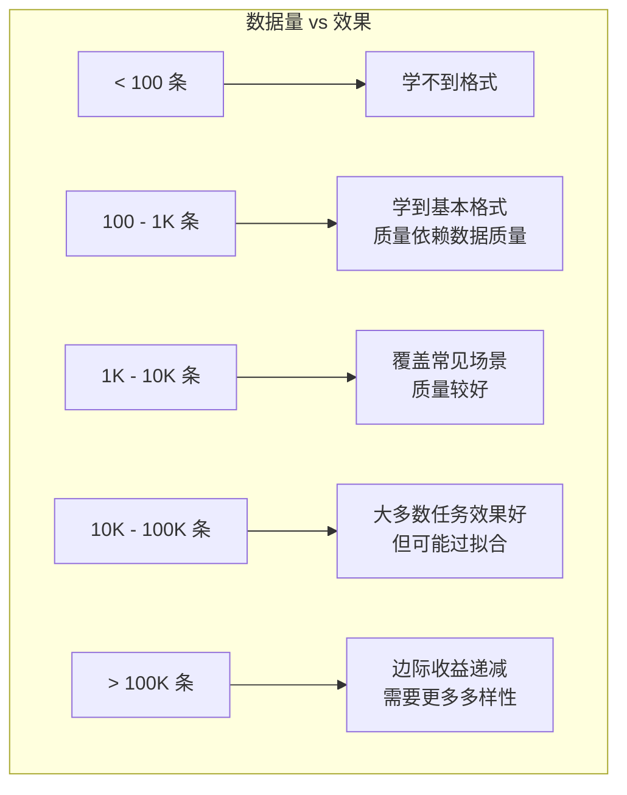

**LIMA 的启示**（Zhou et al., 2023）：

> "在预训练模型中，几乎所有知识都在预训练阶段学会了。对齐（alignment）不是在教模型新知识，而是在教模型以正确的方式输出已有知识。"

这意味着 SFT 本质上是一种**格式化训练**（format training），少量高质量数据就足以让模型学会"如何回答"。

---

## 4. LoRA（Low-Rank Adaptation）

LoRA（Low-Rank Adaptation，Hu et al., 2022）是最流行的参数高效微调方法。其核心思想是：微调过程中权重的变化量 $\Delta W$ 具有低秩特性，因此可以用两个小矩阵的乘积来近似。

### 4.1 低秩假设的理论支撑

#### 假说：内在维度（Intrinsic Dimensionality）

Aghajanyan et al. (2021) 的研究发现：预训练模型的微调过程具有**低内在维度（low intrinsic dimensionality）**。

**直观理解**：虽然模型有数十亿参数，但微调时实际需要调整的"方向"远少于参数总数。就像一个人学习新技能时，并不需要重塑所有的神经连接——只需要微调少数关键的连接模式。

**形式化定义**：设原始参数空间为 $\mathbb{R}^D$（$D$ 是总参数数），如果存在一个低维子空间 $\mathbb{R}^d$（$d \ll D$），使得在该子空间中优化就能达到接近全参数微调的效果，那么微调的内在维度就是 $d$。

$$\theta_{sft} = \theta^* + P \cdot z, \quad z \in \mathbb{R}^d$$

其中 $P \in \mathbb{R}^{D \times d}$ 是投影矩阵，$z$ 是低维参数。

**实验证据**：对于 RoBERTa-Large（355M 参数），其微调的内在维度约为数百到数千——远小于 3.55 亿的参数总数。

### 4.2 LoRA 的核心公式

对于预训练权重矩阵 $W_0 \in \mathbb{R}^{d_{out} \times d_{in}}$，LoRA 将权重更新分解为：

$$W = W_0 + \Delta W = W_0 + BA$$

其中：
- $B \in \mathbb{R}^{d_{out} \times r}$（"上投影"矩阵）
- $A \in \mathbb{R}^{r \times d_{in}}$（"下投影"矩阵）
- $r \ll \min(d_{out}, d_{in})$ 是 LoRA 秩（rank）

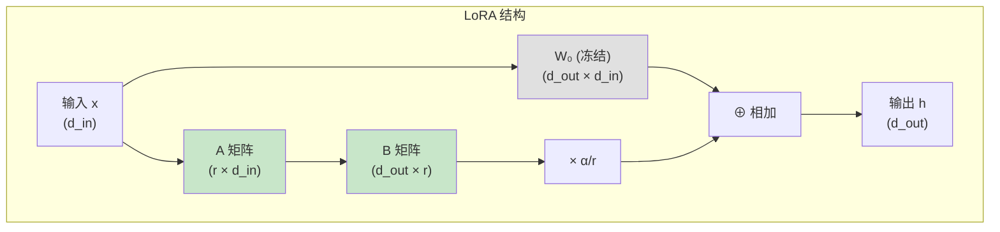

**前向传播**：

$$h = W_0 x + \frac{\alpha}{r} BAx$$

其中 $\alpha$ 是缩放因子（通常设为 $r$ 或 $2r$），$\alpha/r$ 控制 LoRA 更新的"强度"。

### 4.3 参数节省分析

**原始参数量**：

对于一个 $d_{out} \times d_{in}$ 的权重矩阵，全参数微调需要更新 $d_{out} \times d_{in}$ 个参数。

**LoRA 参数量**：

$$\text{LoRA 参数} = d_{out} \times r + r \times d_{in} = r(d_{out} + d_{in})$$

**参数比例**：

$$\text{比例} = \frac{r(d_{out} + d_{in})}{d_{out} \times d_{in}}$$

当 $d_{out} = d_{in} = d$ 时：

$$\text{比例} = \frac{2dr}{d^2} = \frac{2r}{d}$$

**数值示例**：

| 模型 | $d$ | $r$ | 全参数量 | LoRA 参数量 | 比例 |
|------|-----|-----|---------|------------|------|
| Llama-7B | 4096 | 8 | 16.8M | 65.5K | 0.39% |
| Llama-7B | 4096 | 16 | 16.8M | 131K | 0.78% |
| Llama-7B | 4096 | 64 | 16.8M | 524K | 3.12% |
| Llama-70B | 8192 | 16 | 67.1M | 262K | 0.39% |

> 上表统计的是**单个权重矩阵**的参数量。对于整个模型，通常对 Q、K、V、O 四个投影矩阵都加 LoRA，但也只占总参数量的极小比例。

### 4.4 初始化策略

LoRA 的初始化需要保证**训练开始时 $\Delta W = BA = 0$**，使模型从预训练权重精确出发：

- $A$：使用 Kaiming 均匀初始化（或正态初始化） $A \sim \mathcal{N}(0, \sigma^2)$
- $B$：初始化为全零矩阵 $B = 0$

**为什么这样初始化？**

$$\Delta W = BA = 0 \cdot A = 0$$

这保证了训练开始时模型的行为与原始预训练模型完全一致，避免了由随机初始化引入的扰动。

**梯度分析**：虽然 $B = 0$，但梯度不为零。设损失为 $L$：

$$\frac{\partial L}{\partial B} = \frac{\partial L}{\partial h} \cdot \frac{\alpha}{r} \cdot (Ax)^T$$

$$\frac{\partial L}{\partial A} = \frac{\alpha}{r} \cdot B^T \cdot \frac{\partial L}{\partial h} \cdot x^T$$

注意第二个式子中有 $B^T$，初始时 $B = 0$，所以 $\frac{\partial L}{\partial A} = 0$。这意味着：

- **第一步只有 $B$ 被更新**，$A$ 保持不变
- 第二步开始，$B \neq 0$，$A$ 和 $B$ 同时更新

这是一个"渐进式启动"过程，有利于训练稳定性。

### 4.5 缩放因子 $\alpha$ 的作用

LoRA 引入了一个缩放超参数 $\alpha$（`lora_alpha`），实际的更新为：

$$\Delta W = \frac{\alpha}{r} \cdot BA$$

**设计动机**：

当改变 rank $r$ 时，如果不加缩放，LoRA 更新的"总量"会随 $r$ 变化。$\alpha/r$ 这个缩放因子使得在调整 $r$ 时不需要同步调整学习率。

**常用设置**：

| 设置 | $\alpha$ | 有效缩放 $\alpha/r$ | 说明 |
|------|---------|-------------------|------|
| $\alpha = r$ | 等于 rank | 1.0 | 最常用，无额外缩放 |
| $\alpha = 2r$ | 两倍 rank | 2.0 | 增强 LoRA 更新强度 |
| $\alpha = 16$（固定） | 16 | $16/r$ | 固定 alpha，调 rank |

**经验建议**：对于大多数任务，设 $\alpha = r$ 或 $\alpha = 2r$ 即可。

### 4.6 超参数选择

#### Rank（秩）

Rank $r$ 控制 LoRA 的表达能力：

| 任务复杂度 | 推荐 rank | 理由 |
|-----------|----------|------|
| 简单（风格迁移、格式化） | 4-8 | 变化量小，低秩足够 |
| 中等（指令微调、对话） | 16-32 | 需要适度的表达能力 |
| 复杂（领域适配、多任务） | 64-128 | 需要更高秩来捕捉复杂模式 |

#### Target Modules（目标模块）

应该对哪些层加 LoRA？

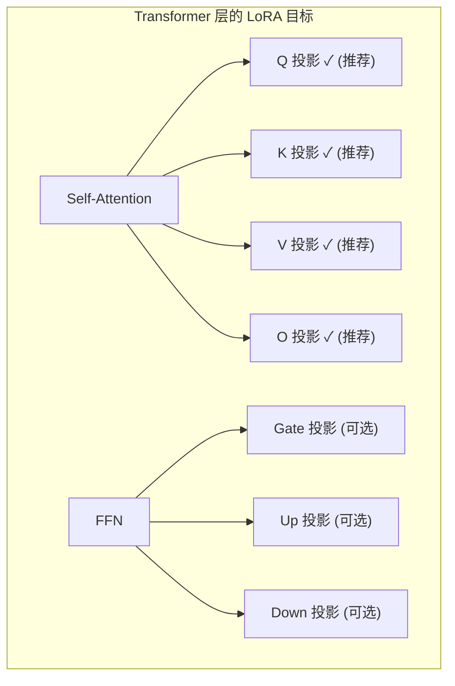

**常用策略对比**：

| 策略 | 目标模块 | 参数增量 | 效果 |
|------|---------|---------|------|
| 最小 | Q, V | ~0.2% | 基本够用 |
| 推荐 | Q, K, V, O | ~0.4% | 性价比最高 |
| 完整 | 注意力 + FFN 全部 | ~1-3% | 接近全量微调 |

### 4.7 LoRA 的合并与推理

LoRA 的一个重要优势是**推理时无额外延迟**。训练完成后，可以将 LoRA 权重合并回原始权重：

$$W_{merged} = W_0 + \frac{\alpha}{r} BA$$

合并后，模型结构与原始模型完全相同，**不增加任何推理成本**。

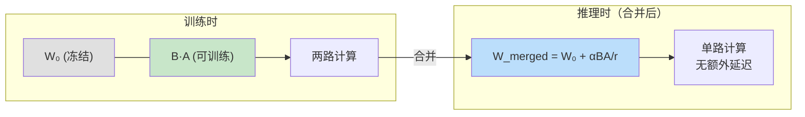

**多 LoRA 切换**：

不合并时，可以为同一个基座模型加载不同的 LoRA adapter，实现快速的任务切换：

```python
# 伪代码：多 LoRA 切换
base_model = load_pretrained("llama-7b")

# 加载不同任务的 LoRA
lora_chat = load_lora("chat_lora.bin")
lora_code = load_lora("code_lora.bin")

# 切换任务只需替换 LoRA 权重，无需重新加载基座模型
output_chat = base_model(input, lora=lora_chat)
output_code = base_model(input, lora=lora_code)
```

---

## 5. QLoRA

QLoRA（Dettmers et al., 2023）在 LoRA 的基础上引入了**量化技术**，使得在消费级 GPU（如 24GB 的 4090）上微调 65B 参数模型成为可能。

### 5.1 核心思想

QLoRA = **量化的基座模型** + **全精度的 LoRA 适配器**

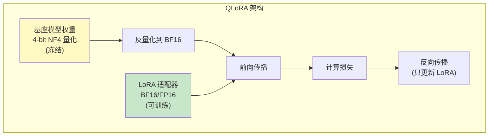

### 5.2 4-bit NormalFloat（NF4）量化

NF4 是 QLoRA 提出的一种新型数据类型，专门为正态分布的权重设计。

#### 核心思想

预训练模型的权重通常近似服从正态分布 $\mathcal{N}(0, \sigma^2)$。NF4 的分位点（quantile）等间距地划分了正态分布的概率密度：

$$q_i = \Phi^{-1}\left(\frac{i}{2^k}\right), \quad i = 0, 1, \ldots, 2^k - 1$$

其中 $\Phi^{-1}$ 是标准正态分布的逆累积分布函数（inverse CDF），$k = 4$（4-bit）。

**具体步骤**：

1. **确定分位点**：将 $[0, 1]$ 等分为 $2^4 = 16$ 段，计算对应的分位点值
2. **归一化**：将权重除以其绝对值最大值，映射到 $[-1, 1]$
3. **量化**：每个权重映射到最近的 NF4 分位点
4. **存储**：每个权重只需 4 bit

**为什么 NF4 优于均匀量化？**

均匀量化在整个值域等间距划分，但权重集中在零附近——大量量化级别被浪费在概率密度低的区域。NF4 在概率密度高的区域（零附近）分配更多的量化级别：

| 方法 | 零附近精度 | 尾部精度 | 信息论最优性 |
|------|-----------|---------|-------------|
| 均匀 INT4 | 低 | 高（但浪费） | 非最优 |
| NF4 | 高 | 适中 | 对正态分布信息论最优 |

### 5.3 双量化（Double Quantization）

量化需要存储量化常数（每组权重的缩放因子）。对于 4-bit 量化，每 64 个权重需要一个 FP32 的缩放因子，这额外占用 $32/64 = 0.5$ bit/parameter。

双量化对这些缩放因子本身再进行一次量化：

$$\text{缩放因子 (FP32)} \xrightarrow{\text{量化}} \text{缩放因子 (FP8)} + \text{二级缩放因子 (FP32)}$$

**显存节省分析**：

| 组件 | 单量化 | 双量化 |
|------|-------|-------|
| 权重 | 4 bit/param | 4 bit/param |
| 一级缩放因子 | 32/64 = 0.5 bit/param | 8/64 = 0.125 bit/param |
| 二级缩放因子 | — | 32/256 = 0.125 bit/param |
| **总计** | **4.5 bit/param** | **4.25 bit/param** |

节省 $0.25$ bit/param，对于 65B 模型约节省 2GB 显存。

### 5.4 分页优化器（Paged Optimizer）

在长序列训练中，优化器状态可能突然增大导致 GPU 内存溢出。QLoRA 使用 NVIDIA 的统一内存管理，实现优化器状态在 GPU 和 CPU 内存之间的自动分页：

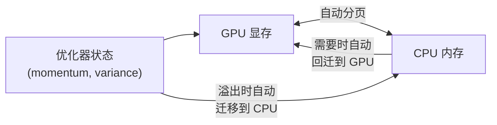

**工作原理**：

1. 优化器状态默认存储在 GPU 上
2. 当 GPU 显存不足时，自动将不活跃的优化器状态迁移到 CPU
3. 需要更新时，自动回迁到 GPU
4. 对用户透明，无需手动管理

### 5.5 QLoRA 的实际显存分析

以 Llama-65B（650 亿参数）为例：

| 组件 | FP16 全量 | QLoRA (NF4 + rank 16) |
|------|-----------|----------------------|
| 模型权重 | 130 GB | ~33 GB (4.25 bit/param) |
| LoRA 参数 | — | ~0.4 GB (BF16) |
| 优化器状态 | ~260 GB (Adam) | ~0.8 GB (仅 LoRA) |
| 梯度 | ~130 GB | ~0.4 GB (仅 LoRA) |
| 激活值 | ~20 GB | ~20 GB |
| **总计** | **~540 GB** | **~55 GB** |

**QLoRA 使得在单张 A100-80GB 上微调 65B 模型成为可能。**

---

## 6. 其他 PEFT 方法

PEFT（Parameter-Efficient Fine-Tuning）是一个方法大家族，LoRA 是其中最受欢迎的一员。本节介绍其他几种重要方法。

### 6.1 Prefix Tuning

**核心思想**：在每层 Transformer 的输入前添加可训练的"虚拟前缀"（prefix），冻结原始参数。

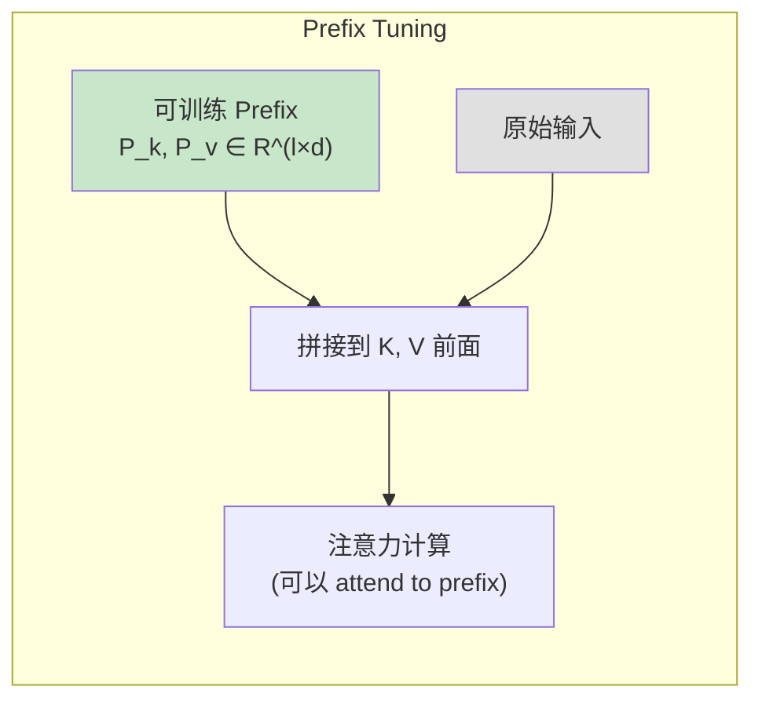

**数学形式**：

设前缀长度为 $l$，前缀参数为 $P_K, P_V \in \mathbb{R}^{l \times d}$。在注意力计算中：

$$K' = [P_K; K], \quad V' = [P_V; V]$$

$$\text{Attention}(Q, K', V') = \text{softmax}\left(\frac{QK'^T}{\sqrt{d_k}}\right)V'$$

**参数量**：每层 $2ld$，总共 $2lLd$（$L$ 是层数）。

**特点**：

- 可训练参数集中在前缀位置
- 会占用一部分序列长度（有效长度减少 $l$）
- 不改变模型结构，但推理时有微小额外开销

### 6.2 Prompt Tuning

**核心思想**：只在输入层（Embedding 层）前添加可训练的连续 prompt，更加轻量。

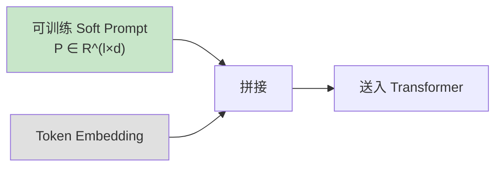

**与 Prefix Tuning 的区别**：

- Prefix Tuning 在**每层**都有可训练参数
- Prompt Tuning 只在**输入层**有可训练参数

**参数量**：仅 $l \times d$（与层数无关），极其轻量。

**效果随模型规模的变化**（Lester et al., 2021 的关键发现）：

| 模型规模 | Prompt Tuning vs 全参数微调 |
|---------|---------------------------|
| T5-Small (60M) | 差距大 |
| T5-Base (220M) | 差距中等 |
| T5-Large (770M) | 差距较小 |
| T5-XXL (11B) | 几乎相同 |

**结论**：模型越大，Prompt Tuning 越接近全参数微调的效果。

### 6.3 Adapter

**核心思想**：在 Transformer 每层中插入小型的"适配器模块"（Adapter），只训练适配器参数。

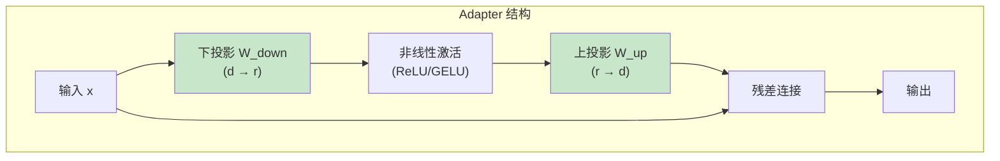

**数学形式**：

$$\text{Adapter}(x) = x + f(x W_{down}) W_{up}$$

其中 $W_{down} \in \mathbb{R}^{d \times r}$，$W_{up} \in \mathbb{R}^{r \times d}$，$f$ 是非线性激活函数。

**参数量**：每个 Adapter 约 $2dr$，与 LoRA 类似。

**Adapter vs LoRA**：

| 维度 | Adapter | LoRA |
|------|---------|------|
| 修改位置 | 插入新模块 | 并行于原始权重 |
| 推理开销 | 有（需要额外前向传播） | 无（可合并权重） |
| 实现复杂度 | 需修改模型结构 | 只需添加并行分支 |
| 多任务切换 | 加载不同 Adapter | 加载不同 LoRA |

### 6.4 各方法对比总结

| 方法 | 可训练参数量 | 推理额外开销 | 效果（相对全量微调） | 实现难度 |
|------|------------|-------------|--------------------|---------|
| 全参数微调 | 100% | 无 | 基准线 | 低 |
| LoRA | 0.1%-3% | 无（可合并） | 接近 | 低 |
| QLoRA | 0.1%-3% | 无（可合并） | 接近 | 中 |
| Prefix Tuning | 0.1%-1% | 微小 | 略低 | 中 |
| Prompt Tuning | <0.01% | 微小 | 随规模提升 | 低 |
| Adapter | 0.5%-3% | 有 | 接近 | 中 |

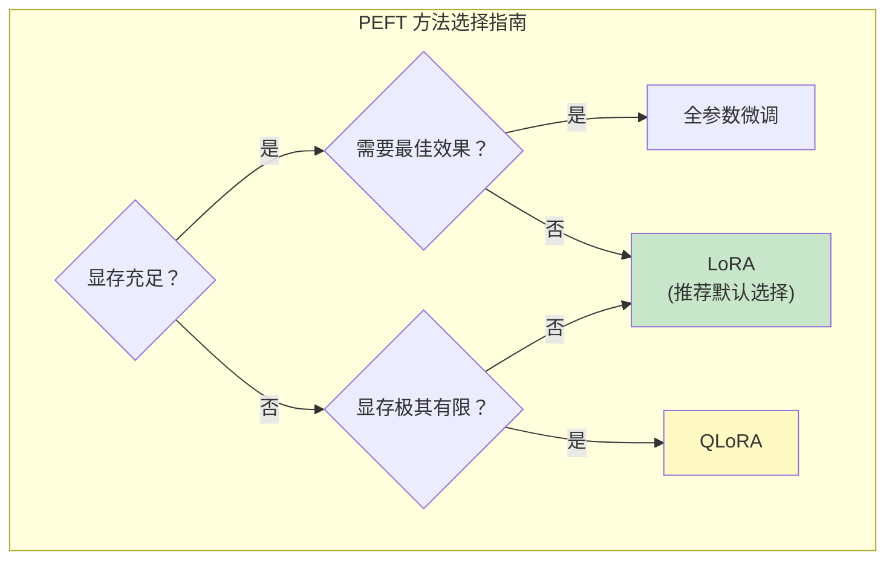

---

## 7. Google 的微调实践

### 7.1 FLAN 系列的指令微调

Google 的 FLAN（Finetuned Language Net）系列是指令微调领域的里程碑工作。

#### FLAN（2022）

**核心发现**：在大量 NLP 任务上进行指令微调，可以显著提升模型的零样本（zero-shot）能力。

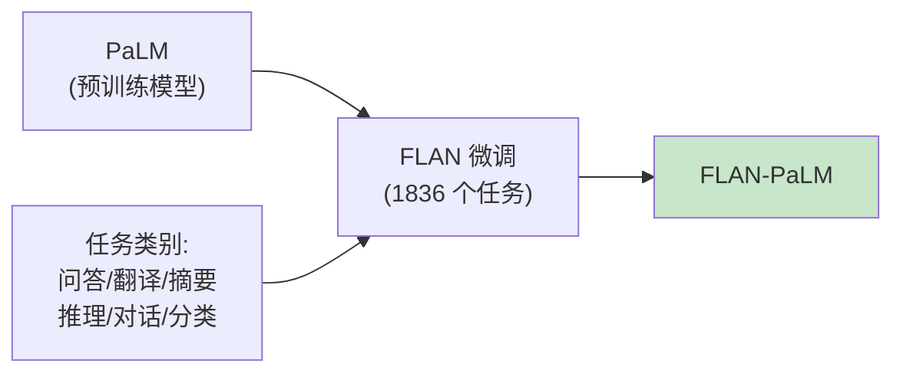

**FLAN 的关键设计决策**：

| 设计 | 选择 | 理由 |
|------|------|------|
| 任务数量 | 1836 个 | 任务多样性是关键 |
| 指令模板 | 每任务 10+ 模板 | 防止过拟合特定措辞 |
| 混合比例 | 按任务类型均衡 | 避免某类任务主导 |
| Chain-of-Thought | 9 个 CoT 数据集 | 提升推理能力 |

#### FLAN-T5 / FLAN-PaLM

FLAN 技术分别应用于 T5 和 PaLM，均取得显著提升：

| 模型 | 任务数 | MMLU (5-shot) 提升 | BBH (CoT) 提升 |
|------|--------|-------------------|----------------|
| PaLM → Flan-PaLM | 1836 | +9.4% | +8.6% |
| T5 → Flan-T5 | 1836 | +10.1% | — |

### 7.2 Gemma 的微调最佳实践

Google 针对 Gemma 开源模型提供了详细的微调指南：

**推荐超参数**：

| 参数 | Gemma-2B | Gemma-7B |
|------|----------|----------|
| 学习率 | 1e-5 | 5e-6 |
| LoRA rank | 8 | 16 |
| LoRA alpha | 16 | 32 |
| 目标模块 | Q, V | Q, K, V, O |
| Batch Size | 16 | 8 |
| 最大长度 | 2048 | 2048 |

### 7.3 T5/PaLM 的 Prompt Tuning

Google 在 Prompt Tuning 方面的贡献（Lester et al., 2021）：

**核心发现**：随着模型规模增大，Prompt Tuning（仅训练几百个参数）可以逼近全参数微调的效果。这为"一个模型，多个任务"的部署模式提供了可能——只需为每个任务存储一组小型 prompt 参数。

---

## 8. DeepSeek 的微调策略

### 8.1 DeepSeek-V3 的 SFT 阶段

DeepSeek-V3 的 SFT 阶段有以下特点（基于其技术报告）：

**数据规模与构成**：

- 约 150 万条高质量指令数据
- 涵盖数学、编程、写作、推理、对话等多种任务
- 特别注重推理类数据的占比

**训练策略**：

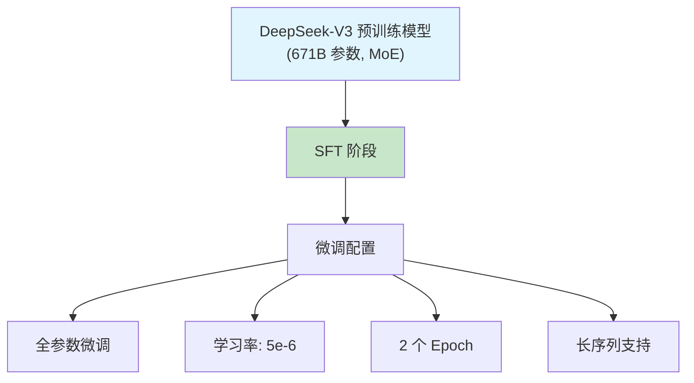

### 8.2 MoE 模型的微调特殊性

DeepSeek-V3 是 MoE（Mixture of Experts）架构，微调时面临特殊挑战：

**挑战 1：负载不均衡加剧**

微调数据分布通常比预训练数据窄，可能导致部分专家过度激活而其他专家闲置。

**挑战 2：专家坍缩（Expert Collapse）**

少量专家学到所有微调知识，其余专家退化——这在微调数据量少时尤其严重。

**DeepSeek 的解决方案**：

| 策略 | 说明 |
|------|------|
| 辅助负载均衡损失 | 保持专家激活的均衡性 |
| 共享专家不冻结 | 让共享专家参与微调，承载通用知识 |
| 适度的数据多样性 | 混入部分预训练格式的数据 |

### 8.3 多任务微调的数据配比

DeepSeek 在多任务微调中采用了精心设计的数据配比：

| 任务类别 | 大致比例 | 说明 |
|---------|---------|------|
| 数学推理 | ~25% | DeepSeek 的强项 |
| 代码生成 | ~25% | 需要精确的逻辑能力 |
| 通用对话 | ~20% | 保持对话流畅性 |
| 知识问答 | ~15% | 测试知识检索能力 |
| 创意写作 | ~10% | 保持生成多样性 |
| 安全对齐 | ~5% | 拒绝有害请求 |

> 注意：具体比例未完全公开，上表基于技术报告的描述和社区推断。

---

## 9. Anthropic 的微调理念

### 9.1 HHH 目标框架

Anthropic 在 SFT 中遵循 **HHH（Helpful, Harmless, Honest）** 三重目标：

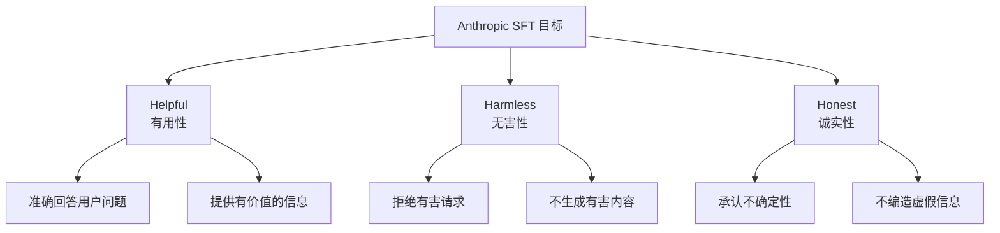

**三个目标之间的张力**：

| 冲突场景 | Helpful | Harmless | 解决方式 |
|---------|---------|----------|---------|
| 用户问如何制造危险物品 | 应该回答（有用） | 不应回答（有害） | Harmless 优先 |
| 用户问争议话题 | 应给出观点 | 可能有偏见 | 给出多方观点 |
| 模型不确定答案 | 应给出回答 | 应诚实说明 | Honest 优先 |

### 9.2 Claude 的 SFT 数据构建 [推测]

根据 Anthropic 的公开论文和博客，Claude 的 SFT 数据构建可能包含以下环节：

**数据来源** [推测]：

- 人工标注团队编写的高质量对话
- 经过人工审核和改写的合成数据
- 专门针对安全场景设计的对话

**质量控制** [推测]：

- 多轮人工审核流程
- 一致性检查（同一类问题的回答风格一致）
- 安全性审核（Red Team 评估）

### 9.3 Constitutional AI 与 SFT 的结合

Anthropic 提出的 Constitutional AI（CAI）方法将安全目标融入 SFT 过程：

```mermaid
graph TB
    A["初始 SFT 模型"] --> B["生成回答"]
    B --> C["自我批评<br/>(基于 Constitution)"]
    C --> D["修改回答"]
    D --> E["用修改后的数据<br/>重新 SFT"]

    F["Constitution<br/>(一组原则)"] --> C

    style F fill:#fff9c4
```

**Constitutional AI 的原则示例**：

1. "选择最无害且最有帮助的回答"
2. "如果回答可能造成伤害，选择更谨慎的表述"
3. "诚实承认不确定性，而不是编造信息"

> 注意：Claude 的具体 SFT 实现细节未公开。上述流程基于 Anthropic 公开论文（Bai et al., 2022）的描述，实际工程实现可能有所不同。

---

## 10. SFT 的工业实践

本节从跨公司的视角，深入探讨 SFT 在工业界的关键实践模式。相比前面各公司独立的技术描述，这里聚焦于共性问题和工程经验。

### 10.1 Google FLAN 系列的指令微调策略精要

FLAN（Finetuned Language Net）系列是指令微调领域最具影响力的工作之一。其核心贡献不仅在于模型本身，更在于揭示了**任务多样性和数据混合配比**对微调效果的决定性作用。

**FLAN-T5 / FLAN-PaLM 的关键数据策略**：

| 维度 | 具体做法 | 量化效果 |
|------|---------|---------|
| 任务数量 | 1836 个 NLP 任务 | 任务数从 62 扩展到 1836，零样本性能持续提升 |
| 模板多样性 | 每个任务设计 10+ 指令模板 | 防止过拟合于特定措辞 |
| CoT 数据混合 | 混入 9 个 Chain-of-Thought 数据集 | BIG-Bench Hard 提升 +8.6% |
| 数据混合策略 | 按任务类别加权 + 最大样本数限制（capping） | 防止大数据集主导训练 |

**FLAN 的数据混合公式**（Proportional Mixing with Capping）：

对于任务 $i$，其采样概率为：

$$p_i = \min\left(\frac{n_i^\alpha}{\sum_j n_j^\alpha}, \frac{K}{N}\right)$$

其中 $n_i$ 是任务 $i$ 的样本数，$\alpha$ 是温度参数（通常 $\alpha < 1$），$K$ 是每个任务的最大样本数限制，$N$ 是总样本数。

**关键启示**：

- **任务多样性比单一任务的数据量更重要**——从 62 个任务扩展到 1836 个任务带来了比增加任何单一任务的数据量更大的收益
- **CoT 数据的少量混入就能大幅提升推理能力**——仅 9 个 CoT 数据集就带来了显著提升，且不损害其他任务的性能
- **模板多样性是防止过拟合的关键**——同一任务的不同指令表述让模型学到的是"任务语义"而非"特定措辞"

### 10.2 DeepSeek 的微调实践细节

DeepSeek-V2/V3 的技术报告披露了一些关于 SFT 阶段的关键细节，特别是在数据质量和 MoE 架构适配方面。

**DeepSeek-V3 的 SFT 数据工程**：

```mermaid
graph TB
    A["数据来源"] --> B["人工编写的高质量对话<br/>(核心)"]
    A --> C["模型辅助生成 + 人工审核<br/>(扩展)"]
    A --> D["开源数据清洗筛选<br/>(补充)"]

    B --> E["质量门控"]
    C --> E
    D --> E

    E --> F["多维度质量评分"]
    F --> F1["正确性: 事实准确、逻辑自洽"]
    F --> F2["完整性: 回答充分、不遗漏关键信息"]
    F --> F3["安全性: 不含有害内容"]
    F --> F4["格式规范: 结构清晰、Markdown规范"]

    E --> G["最终 SFT 数据集<br/>(约 150 万条)"]
```

**数据质量 vs 数量的权衡决策**：

DeepSeek 的实践表明，对于 671B 参数的 MoE 模型，150 万条高质量数据就足够了。这比许多人直觉中"大模型需要更多数据"的预期要少：

| 模型规模 | SFT 数据量 | 训练 Epoch | 关键约束 |
|---------|-----------|-----------|---------|
| DeepSeek-V2 (236B 总参数) | ~100 万条 | 2 | 数据质量优先于数量 |
| DeepSeek-V3 (671B 总参数) | ~150 万条 | 2 | 推理类数据占比显著提升 |

> 对比：Llama 2 70B 的 SFT 数据约 27,540 条（Meta 公开），但 Llama 2 的 SFT 数据是极高质量的人工标注。**数据质量的"天花板"决定了所需的数据量——质量越高，所需数据越少。**

### 10.3 数据质量评估体系

如何系统化地评估 SFT 数据的质量？工业界逐渐形成了多维度的评估框架。

**质量评估的四个核心维度**：

```mermaid
graph TB
    A["SFT 数据质量评估"] --> B["多样性<br/>(Diversity)"]
    A --> C["一致性<br/>(Consistency)"]
    A --> D["难度分布<br/>(Difficulty)"]
    A --> E["准确性<br/>(Accuracy)"]

    B --> B1["任务类型覆盖度"]
    B --> B2["指令表述多样性"]
    B --> B3["回答风格多样性"]

    C --> C1["同类问题回答风格统一"]
    C --> C2["拒绝策略一致"]
    C --> C3["格式规范一致"]

    D --> D1["简单/中等/困难的比例"]
    D --> D2["推理步骤长度分布"]
    D --> D3["专业领域覆盖度"]

    E --> E1["事实准确性"]
    E --> E2["逻辑自洽性"]
    E --> E3["数学/代码正确性"]
```

**自动化质量评估指标**：

| 指标 | 计算方法 | 阈值建议 |
|------|---------|---------|
| 指令-回答相关性 | Embedding 余弦相似度 | > 0.6 |
| 回答信息密度 | 非停用词比例 × 长度 | 避免空洞回答 |
| 重复度 | 数据集内 MinHash 近似去重 | 去重率 < 5% |
| 困惑度异常 | 用基座模型计算 PPL | 排除 PPL 极高/极低的样本 |
| 安全性 | 有害内容分类器评分 | 有害概率 < 0.01 |

**人工评估流程**（工业界最佳实践）：

1. **分层抽样**：按任务类别和难度分层，从每层抽取固定数量的样本
2. **多人交叉标注**：每条数据至少 2 人独立评分，计算标注者一致性（Cohen's Kappa > 0.7）
3. **标注维度**：正确性(1-5)、完整性(1-5)、格式(1-5)、安全性(是/否)
4. **迭代优化**：基于评估结果调整数据生成策略，形成数据质量飞轮

### 10.4 对话模板标准化深度对比

对话模板看似简单，但选择不当会导致模型性能显著下降。本节深入对比工业界主流对话模板。

**主流模板的结构化对比**：

```
================ ChatML (OpenAI/Qwen/Yi) ================
<|im_start|>system
{system_message}<|im_end|>
<|im_start|>user
{user_message}<|im_end|>
<|im_start|>assistant
{assistant_message}<|im_end|>

================ Llama 2 Chat ================
<s>[INST] <<SYS>>
{system_message}
<</SYS>>

{user_message} [/INST] {assistant_message} </s>

================ Alpaca ================
Below is an instruction that describes a task. Write a response.

### Instruction:
{instruction}

### Input:
{input}

### Response:
{response}

================ Llama 3 / Llama 3.1 ================
<|begin_of_text|><|start_header_id|>system<|end_header_id|>

{system_message}<|eot_id|><|start_header_id|>user<|end_header_id|>

{user_message}<|eot_id|><|start_header_id|>assistant<|end_header_id|>

{assistant_message}<|eot_id|>
```

**各模板的关键差异**：

| 维度 | ChatML | Llama 2 Chat | Alpaca | Llama 3 |
|------|--------|-------------|--------|---------|
| 角色标记方式 | 特殊 token 包裹 | 标签嵌套 | Markdown 标题 | Header token |
| 多轮对话支持 | 天然支持 | 需要拼接 `</s><s>` | 不原生支持 | 天然支持 |
| System Prompt | 原生支持 | `<<SYS>>` 块 | 无 | Header 标记 |
| 特殊 token 数量 | 2 | 4 | 0 | 4 |
| 分词器兼容性 | 需要注册特殊 token | 模型自带 | 无特殊要求 | 需要注册特殊 token |

**模板不匹配的影响**：

一个常见的错误是训练时使用 ChatML 模板，推理时却使用 Alpaca 模板。实验表明：

- 模板完全匹配时：基线性能（100%）
- 模板轻微不匹配（如 System Prompt 有/无）：性能下降 5-15%
- 模板严重不匹配（如 ChatML vs Alpaca）：性能下降 30-50%，模型行为异常

**选择建议**：

- **新项目**：推荐 ChatML 或 Llama 3 格式，结构清晰且广泛支持
- **继续微调已有模型**：必须使用该模型预训练/SFT 阶段的原始模板
- **工具调用场景**：ChatML 格式对 function calling 的支持最好

---

## 11. 项目实践

### 项目1：从零实现 LoRA 并验证数学等价性（⭐⭐ 进阶）

**目标**：从零实现 LoRA 模块，通过实验验证其数学等价性（合并后与分离计算结果相同）。

**任务**：

1. 实现 `LoRALinear` 类，支持可配置的 rank 和 alpha
2. 对一个简单模型应用 LoRA
3. 验证：合并前后的前向传播结果完全一致
4. 统计参数量并与理论分析对比

**完整代码参考**：

```python
import torch
import torch.nn as nn
import math


class LoRALinear(nn.Module):
    """
    LoRA 线性层：在冻结的原始权重旁添加低秩适配器

    h = W_0 x + (alpha/r) * B A x

    Args:
        original_linear: 原始的 nn.Linear 层（将被冻结）
        rank: LoRA 秩
        alpha: 缩放因子
    """

    def __init__(self, original_linear: nn.Linear, rank: int = 8, alpha: float = 16.0):
        super().__init__()
        self.original = original_linear
        self.rank = rank
        self.alpha = alpha
        self.scaling = alpha / rank

        d_out, d_in = original_linear.weight.shape

        # 冻结原始权重
        self.original.weight.requires_grad_(False)
        if self.original.bias is not None:
            self.original.bias.requires_grad_(False)

        # LoRA 参数
        # A: 下投影, B: 上投影
        self.lora_A = nn.Parameter(torch.empty(rank, d_in))
        self.lora_B = nn.Parameter(torch.zeros(d_out, rank))

        # Kaiming 初始化 A
        nn.init.kaiming_uniform_(self.lora_A, a=math.sqrt(5))

    def forward(self, x: torch.Tensor) -> torch.Tensor:
        # 原始路径 + LoRA 路径
        original_output = self.original(x)
        lora_output = (x @ self.lora_A.T @ self.lora_B.T) * self.scaling
        return original_output + lora_output

    def merge(self) -> nn.Linear:
        """将 LoRA 权重合并回原始权重，返回合并后的 Linear 层"""
        merged = nn.Linear(
            self.original.in_features,
            self.original.out_features,
            bias=self.original.bias is not None
        )
        merged.weight.data = self.original.weight.data + self.scaling * (self.lora_B @ self.lora_A)
        if self.original.bias is not None:
            merged.bias.data = self.original.bias.data.clone()
        return merged


def verify_equivalence():
    """验证 LoRA 合并前后的数学等价性"""
    torch.manual_seed(42)

    # 创建原始层
    linear = nn.Linear(512, 256)

    # 添加 LoRA
    lora_linear = LoRALinear(linear, rank=8, alpha=16.0)

    # 模拟一些训练（随机修改 LoRA 参数）
    with torch.no_grad():
        lora_linear.lora_A.normal_(0, 0.01)
        lora_linear.lora_B.normal_(0, 0.01)

    # 测试输入
    x = torch.randn(4, 512)

    # LoRA 分离计算
    output_lora = lora_linear(x)

    # 合并后计算
    merged_linear = lora_linear.merge()
    output_merged = merged_linear(x)

    # 验证等价性
    max_diff = (output_lora - output_merged).abs().max().item()
    print(f"最大误差: {max_diff:.2e}")
    print(f"等价性验证: {'通过' if max_diff < 1e-5 else '失败'}")

    # 参数量对比
    original_params = 512 * 256
    lora_params = 8 * 512 + 8 * 256
    print(f"\n原始参数量: {original_params:,}")
    print(f"LoRA 参数量: {lora_params:,}")
    print(f"参数比例: {lora_params / original_params * 100:.2f}%")


if __name__ == "__main__":
    verify_equivalence()
```

**关键学习点**：

- LoRA 的数学等价性：分离计算与合并后计算结果应完全一致
- 初始化策略的重要性：$B = 0$ 保证初始输出不变
- 参数节省的直观感受

---

### 项目2：使用 QLoRA 微调 Llama/Gemma（⭐⭐ 进阶）

**目标**：在单张消费级 GPU 上使用 QLoRA 微调一个开源 LLM（Llama 或 Gemma）进行中文对话。

**任务**：

1. 使用 `bitsandbytes` 加载 4-bit 量化模型
2. 配置 LoRA 适配器
3. 准备指令微调数据
4. 训练并评估

**训练脚本框架**：

```python
from transformers import AutoModelForCausalLM, AutoTokenizer, BitsAndBytesConfig
from peft import LoraConfig, get_peft_model, prepare_model_for_kbit_training
import torch

# === 步骤 1: 配置 4-bit 量化 ===
bnb_config = BitsAndBytesConfig(
    load_in_4bit=True,
    bnb_4bit_quant_type="nf4",           # NF4 量化
    bnb_4bit_compute_dtype=torch.bfloat16, # 计算精度
    bnb_4bit_use_double_quant=True,        # 双量化
)

# === 步骤 2: 加载模型 ===
model_name = "meta-llama/Llama-2-7b-hf"  # 或 "google/gemma-2b"
model = AutoModelForCausalLM.from_pretrained(
    model_name,
    quantization_config=bnb_config,
    device_map="auto",
)
model = prepare_model_for_kbit_training(model)

# === 步骤 3: 配置 LoRA ===
lora_config = LoraConfig(
    r=16,                   # LoRA 秩
    lora_alpha=32,          # 缩放因子
    target_modules=["q_proj", "k_proj", "v_proj", "o_proj"],
    lora_dropout=0.05,
    bias="none",
    task_type="CAUSAL_LM",
)
model = get_peft_model(model, lora_config)
model.print_trainable_parameters()
# 输出示例: trainable params: 13,107,200 || all params: 6,738,415,616 || trainable%: 0.1945
```

**超参数建议**：

| 参数 | 推荐值 | 说明 |
|------|-------|------|
| LoRA rank | 16 | 对话任务的经验值 |
| LoRA alpha | 32 | 通常设为 2 * rank |
| 学习率 | 2e-4 | QLoRA 可用稍高学习率 |
| Batch Size | 4 (+ grad accum 8) | 等效 batch size 32 |
| Epochs | 3 | 避免过拟合 |
| 最大序列长度 | 2048 | 视显存调整 |

**评估思路**：

- 人工评估：抽样检查回答质量
- 自动指标：困惑度（Perplexity）下降
- 对比测试：微调前后对相同问题的回答

---

### 项目3：构建指令微调数据集并评估质量（⭐⭐ 进阶）

**目标**：实践完整的指令数据工程流程——从数据收集到质量评估。

**任务**：

1. 使用 Self-Instruct 方法生成指令数据
2. 实现数据清洗和去重
3. 设计数据质量评估指标
4. 分析数据分布

**数据格式说明**：

```json
{
    "conversations": [
        {"role": "system", "content": "你是一个有帮助的AI助手。"},
        {"role": "user", "content": "解释什么是梯度下降"},
        {"role": "assistant", "content": "梯度下降是一种优化算法..."}
    ],
    "metadata": {
        "source": "self-instruct",
        "category": "knowledge_qa",
        "difficulty": "medium",
        "quality_score": 0.85
    }
}
```

**质量评估思路**：

```mermaid
graph TB
    A["原始数据"] --> B["格式验证"]
    B --> C["去重<br/>(MinHash/SimHash)"]
    C --> D["长度过滤<br/>(太短/太长)"]
    D --> E["质量评分"]

    E --> E1["流畅度<br/>(困惑度)"]
    E --> E2["相关性<br/>(指令-回答匹配度)"]
    E --> E3["信息量<br/>(非空洞回答)"]
    E --> E4["安全性<br/>(有害内容检测)"]

    E1 --> F["综合评分"]
    E2 --> F
    E3 --> F
    E4 --> F

    F --> G["筛选高质量数据"]
```

**关键代码片段**：

```python
def compute_quality_score(instruction: str, response: str) -> dict:
    """
    计算指令-回答对的质量分数

    Returns:
        包含各维度分数的字典
    """
    scores = {}

    # 1. 长度合理性
    resp_len = len(response)
    if resp_len < 20:
        scores["length"] = 0.2  # 太短
    elif resp_len > 5000:
        scores["length"] = 0.5  # 可能冗余
    else:
        scores["length"] = 0.9

    # 2. 指令-回答相关性（简单启发式）
    instruction_keywords = set(instruction.split())
    response_keywords = set(response.split())
    overlap = len(instruction_keywords & response_keywords)
    scores["relevance"] = min(overlap / max(len(instruction_keywords), 1), 1.0)

    # 3. 回答多样性（非重复性）
    sentences = response.split("。")
    unique_ratio = len(set(sentences)) / max(len(sentences), 1)
    scores["diversity"] = unique_ratio

    # 综合分数
    scores["overall"] = (scores["length"] + scores["relevance"] + scores["diversity"]) / 3
    return scores
```

---

### 项目4：对比 LoRA 不同 rank 和 target modules 的效果（⭐⭐⭐ 挑战）

**目标**：通过系统的消融实验，理解 LoRA 超参数（rank、target modules）对微调效果的影响。

**实验设计**：

```mermaid
graph TB
    subgraph "实验矩阵"
        A["Rank: 4 / 8 / 16 / 32 / 64"]
        B["Target Modules:<br/>QV / QKVO / QKVO+FFN"]
        C["Alpha: r / 2r"]
    end

    subgraph "评估指标"
        D["训练损失收敛速度"]
        E["验证集困惑度"]
        F["可训练参数量"]
        G["显存占用"]
        H["下游任务准确率"]
    end

    A --> D
    A --> E
    B --> D
    B --> E
    C --> D
```

**实验方案（伪代码）**：

```
实验框架:
1. 基座模型: 选择一个开源模型 (如 Gemma-2B)
2. 评估数据集: 准备统一的评估集

实验组:
  对于 rank in [4, 8, 16, 32, 64]:
    对于 target in ["qv", "qkvo", "qkvo_ffn"]:
      a. 配置 LoRA (rank, target_modules)
      b. 在相同数据上训练相同步数
      c. 记录:
         - 训练损失曲线
         - 验证集困惑度
         - 可训练参数数量
         - 峰值显存使用
         - 下游任务表现

分析:
  1. 绘制 rank vs 困惑度 曲线 (不同 target 分组)
  2. 绘制 可训练参数量 vs 效果 的 Pareto 前沿
  3. 分析 "最优性价比" 配置
  4. 检验是否存在 rank 过大导致过拟合的情况
```

**预期发现**：

- rank 存在收益递减点（通常在 16-32 之后）
- 对所有注意力投影加 LoRA (QKVO) 优于只对 QV 加
- 加 FFN 的提升可能因任务而异
- rank 过大（如 128）可能在小数据集上过拟合

**Mermaid 结果可视化示意**：

```mermaid
graph LR
    subgraph "预期 Pareto 前沿"
        A["(rank=4, QV)<br/>参数少, 效果有限"]
        B["(rank=16, QKVO)<br/>最佳性价比"]
        C["(rank=64, QKVO+FFN)<br/>接近全量微调"]
    end

    A -->|"增加 rank"| B
    B -->|"增加覆盖"| C

    style B fill:#c8e6c9
```

---

### 项目5：多模板 SFT 实验对比（⭐⭐ 进阶）

**目标**：在同一数据集上使用不同对话模板（ChatML vs Alpaca vs 自定义）进行 SFT，系统对比模板选择对模型行为的影响。

**背景动机**：

对话模板是 SFT 中一个经常被忽视但影响巨大的因素。不同模板定义了模型如何区分用户输入和期望输出的边界，直接影响模型的指令遵循能力。本项目通过控制变量实验，量化模板选择的影响。

**实验设计**：

```mermaid
graph TB
    A["统一的 SFT 数据集<br/>(如 Alpaca-GPT4 5K条)"] --> B["模板转换器"]

    B --> C["ChatML 格式"]
    B --> D["Alpaca 格式"]
    B --> E["自定义简约格式"]

    C --> F["训练模型 A"]
    D --> G["训练模型 B"]
    E --> H["训练模型 C"]

    F --> I["统一评估集"]
    G --> I
    H --> I

    I --> J["对比分析"]
```

**关键步骤提示**：

1. **实现模板转换器**：编写通用的模板转换函数，输入标准格式 `(instruction, input, output)`，输出不同模板的格式化文本。注意处理 special token 的正确添加和 tokenizer 的兼容性。

2. **训练三次**：使用相同的基座模型（如 Qwen-1.8B 或 Gemma-2B），相同的超参数（学习率、epoch、batch size），只变化对话模板。确保随机种子一致。

3. **评估维度**：
   - **指令遵循率**：模型是否正确停止在回答末尾（不继续生成无关内容）
   - **格式准确率**：回答是否符合预期格式
   - **内容质量**：使用 LLM-as-Judge 或人工评估回答质量
   - **鲁棒性测试**：使用与训练模板不同的 prompt 格式进行推理，观察性能下降程度

**关键代码片段**：

```python
def convert_to_chatml(instruction: str, input_text: str, output: str) -> str:
    """将标准格式转为 ChatML 模板"""
    prompt = f"<|im_start|>system\n你是一个有帮助的AI助手。<|im_end|>\n"
    if input_text:
        prompt += f"<|im_start|>user\n{instruction}\n{input_text}<|im_end|>\n"
    else:
        prompt += f"<|im_start|>user\n{instruction}<|im_end|>\n"
    prompt += f"<|im_start|>assistant\n{output}<|im_end|>"
    return prompt

def convert_to_alpaca(instruction: str, input_text: str, output: str) -> str:
    """将标准格式转为 Alpaca 模板"""
    prompt = "Below is an instruction that describes a task. Write a response.\n\n"
    prompt += f"### Instruction:\n{instruction}\n\n"
    if input_text:
        prompt += f"### Input:\n{input_text}\n\n"
    prompt += f"### Response:\n{output}"
    return prompt
```

**思考问题**：

1. 模板选择对模型行为有多大影响？是否存在"最优"模板？
2. 使用 special token 的模板（ChatML）是否比纯文本标记的模板（Alpaca）更鲁棒？
3. 如果推理时使用了错误的模板，模型的行为会如何退化？退化是渐进的还是突变的？
4. 模板的"信息量"（用于标记角色边界的 token 数量）与模型性能之间有什么关系？

---

## 本章小结

### 核心知识点

1. **SFT 的目标**：让预训练模型从"文本续写者"变为"指令执行者"
2. **Prompt Masking**：只在回答部分计算损失，避免学习复述指令
3. **灾难性遗忘**：全参数微调时预训练知识的损失，正比于 $\|\Delta\theta\|^2$
4. **LoRA**：$W = W_0 + \frac{\alpha}{r}BA$，以 $<1\%$ 的参数达到接近全量微调的效果
5. **QLoRA**：NF4 量化 + LoRA，使得在消费级 GPU 上微调大模型成为可能
6. **PEFT 家族**：LoRA、Prefix Tuning、Prompt Tuning、Adapter 各有适用场景

### 数学要点

- SFT 损失：$L_{SFT} = -\sum_t \mathbb{1}[t > m] \cdot \log P_\theta(s_t \mid s_{<t})$
- LoRA 参数量：$r(d_{out} + d_{in})$，当 $d_{out} = d_{in} = d$ 时为 $\frac{2r}{d}$ 比例
- LoRA 初始化：$A \sim \mathcal{N}(0, \sigma^2)$，$B = 0$，保证 $\Delta W = 0$
- NF4 分位点：$q_i = \Phi^{-1}(i / 2^k)$，对正态分布信息论最优

### 实践要点

- 数据质量远比数量重要（LIMA 的启示）
- LoRA 的默认推荐：rank=16，alpha=32，目标为 QKVO
- 训练和推理必须使用相同的对话模板
- QLoRA 让 24GB 显存微调 7B 模型成为可能

### 与后续章节的联系

| 章节 | 联系 |
|------|------|
| 模块 11: RLHF | SFT 是 RLHF 三阶段流程的第一阶段 |
| 模块 12: DPO | DPO 通常建立在 SFT 模型的基础上 |
| 模块 14: 量化 | QLoRA 的量化技术在推理时同样适用 |

---

## 12. 章节衔接：从 SFT 到 RLHF

本章我们系统学习了监督微调的完整技术栈——从 SFT 的数学形式化（Prompt Masking、交叉熵损失），到参数高效方法（LoRA、QLoRA），再到工业界的实践经验（FLAN 的数据混合、DeepSeek 的 MoE 微调、对话模板标准化）。**SFT 的核心成就是让预训练模型从"文本续写器"变成了"指令执行器"**——模型学会了在对话场景中理解用户意图并给出结构化的回答。

但 SFT 有一个根本性的局限：它只能教会模型"模仿"人类标注的回答，而无法让模型学会"选择更好的回答"。具体来说：

- **SFT 教会了模型"该怎么回答"**：遵循指令、使用正确的格式、在适当的时候停下来
- **SFT 没有教会模型"什么是更好的回答"**：在两个都"正确"的回答之间，SFT 无法让模型偏好更有帮助、更安全、更诚实的那个

这正是下一章（模块 11: RLHF）要解决的问题。RLHF 的三阶段流程中，SFT 是第一阶段，随后的奖励模型训练和 PPO 强化学习将教会模型"优化人类偏好"——从"能回答"进化到"回答得好"。这种从 SFT 到 RLHF 的过渡，也是当前所有主流大模型（GPT-4、Claude、Gemini、DeepSeek-V3）共同遵循的后训练范式。
