# SFT 进阶：工业界微调实践与前沿方法

> 本文是 [模块10: SFT — 监督微调与参数高效微调](./README.md) 的进阶补充，深入分析 Google、DeepSeek、Anthropic 三条技术线在微调领域的工业实践，以及 LoRA 变体和前沿研究话题。

---

## 目录

- [1. Google 的微调实践](#1-google-的微调实践)
- [2. DeepSeek 的微调策略](#2-deepseek-的微调策略)
- [3. Anthropic 的微调理念](#3-anthropic-的微调理念)
- [4. 工业级 SFT Pipeline 与数据飞轮](#4-工业级-sft-pipeline-与数据飞轮)
- [5. 前沿话题](#5-前沿话题)

---

## 1. Google 的微调实践

### 1.1 FLAN 系列指令微调的技术细节

FLAN（Finetuned Language Net）系列代表了 Google 在指令微调领域的系统性探索。从 FLAN 到 FLAN-T5/PaLM 再到 FLAN v2，每一代都在任务数量、模板设计和训练策略上进行了改进。

#### FLAN v1（Wei et al., 2022）

**核心贡献**：证明了在多任务上进行指令微调可以提升模型的零样本泛化能力。

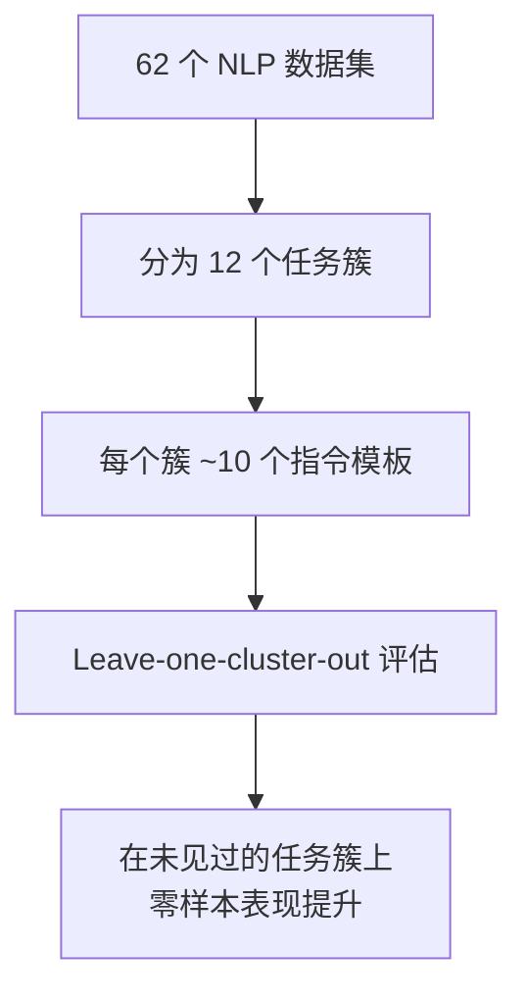

**关键设计**：

- **任务簇的划分**：将相似任务归为一簇（如情感分析、NLI），训练时排除某个簇以测试泛化能力
- **指令模板的多样性**：每个任务设计 10 种不同的指令表述，防止模型过拟合于特定措辞
- **输入反转（Input Inversion）**：30% 的训练样本将任务反转（如从"输入→分类"变为"分类→生成输入"），增加多样性

**模板示例**（以情感分析为例）：

```
模板 1: "以下评论是正面的还是负面的？{text}"
模板 2: "判断以下文本的情感倾向：{text}"
模板 3: "{text}\n这条评论表达了什么情感？"
模板 4: "阅读以下评论并判断作者的态度。\n{text}"
```

#### FLAN-T5 / FLAN-PaLM（Chung et al., 2022）

在 FLAN v1 的基础上进行了大规模扩展：

| 维度 | FLAN v1 | FLAN v2 |
|------|---------|---------|
| 任务数量 | 62 | 1836 |
| 指令模板 | ~620 | ~18000+ |
| 包含 CoT | 否 | 是（9 个 CoT 数据集） |
| 混合策略 | 均匀 | 按任务类别加权 |

**三大改进**：

1. **任务数量大幅扩展**：从 62 到 1836 个任务，覆盖更广泛的 NLP 能力
2. **加入 Chain-of-Thought 数据**：在训练数据中混入带推理过程的样本，让模型学会"展示推理步骤"
3. **优化的数据混合策略**：使用了"任务比例限制"（proportional mixing with capping），防止大数据集主导训练

**CoT 数据的融入**：

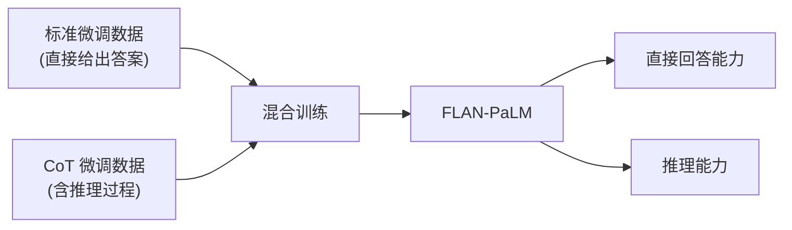

FLAN-PaLM 的实验表明：即使只混入少量 CoT 数据（约 9 个数据集），也能显著提升模型在 BIG-Bench Hard 等推理基准上的表现，且不损害标准任务的性能。

### 1.2 Gemma 微调最佳实践

Google 在 Gemma 模型的发布中，提供了详细的微调指南，涵盖全参数微调和 LoRA 两种路线。

#### 全参数微调建议

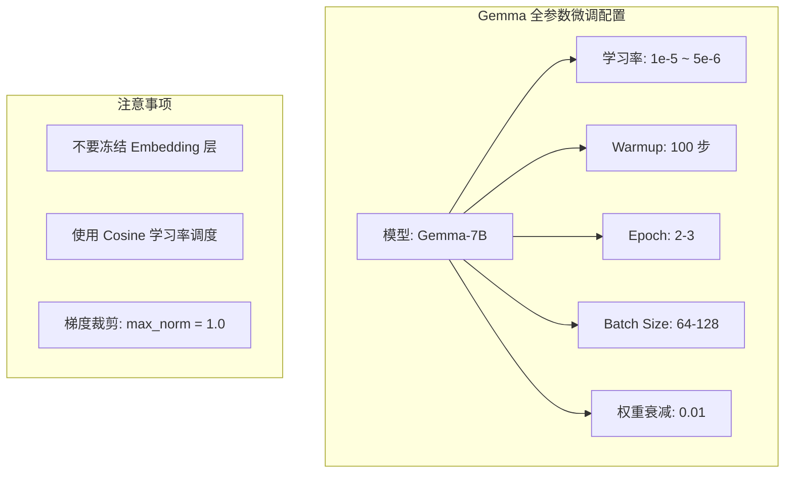

#### LoRA 微调建议

Google 针对 Gemma 的 LoRA 微调提出了以下最佳实践：

| 参数 | Gemma-2B | Gemma-7B | Gemma-2-9B |
|------|----------|----------|------------|
| LoRA rank | 8 | 16 | 16-32 |
| LoRA alpha | 16 | 32 | 32-64 |
| 目标模块 | Q, V | Q, K, V, O | Q, K, V, O |
| Dropout | 0.05 | 0.05 | 0.05 |
| 学习率 | 2e-4 | 1e-4 | 1e-4 |
| Batch Size | 16 | 8 | 8 |

**Gemma 特有的注意事项**：

1. **GeGLU 激活函数**：Gemma 使用 GeGLU 而非 SwiGLU，对 FFN 层加 LoRA 时需注意 gate 和 up 投影都要覆盖
2. **Logit 软截断**：Gemma 2 的 logit soft-capping 在微调时可能需要调整
3. **滑动窗口注意力**：Gemma 2 交替使用局部和全局注意力，LoRA 应加在所有注意力层上

### 1.3 T5/PaLM 的 Prompt Tuning 经验

Google 在 Prompt Tuning 方面有丰富的研究和实践经验。

#### Prompt Tuning 的关键发现（Lester et al., 2021）

**实验结论**：

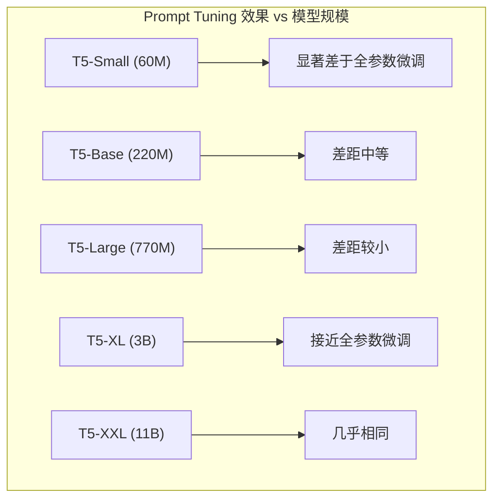

**核心观察**：

| 现象 | 解释 |
|------|------|
| 模型越大，Prompt Tuning 越有效 | 大模型预训练知识更丰富，只需少量引导 |
| 前缀长度 20-100 效果相近 | 超过一定长度后边际收益递减 |
| 初始化方式影响较大 | 用真实词 embedding 初始化优于随机初始化 |

#### Power of Scale for Parameter-Efficient Prompt Tuning（He et al., 2022）

Google 后续研究进一步发现：

- **Prompt 参数的初始化**非常关键。使用"类标签词"（class label words）的 embedding 作为初始化效果最好
- 在多任务场景下，每个任务只需存储几 KB 的 prompt 参数，一个基座模型就能服务成百上千个任务

---

## 2. DeepSeek 的微调策略

### 2.1 DeepSeek-V3 的 SFT 阶段详解

DeepSeek-V3 是一个 671B 参数的 MoE 模型（激活参数约 37B），其 SFT 阶段体现了在超大规模 MoE 模型上进行微调的工程实践。

#### 训练数据构成

根据 DeepSeek-V3 技术报告，SFT 数据涵盖多个维度：

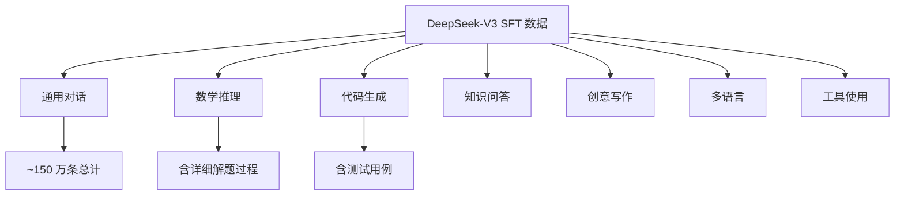

**数据质量保障**：

- **人工审核**：关键类别的数据经过人工审核
- **模型辅助过滤**：使用内部模型评估数据质量
- **多轮对话**：包含大量多轮对话数据，而非仅单轮问答
- **推理数据强化**：数学和代码领域的数据包含详细的推理过程

#### 训练配置

| 参数 | 设置 | 说明 |
|------|------|------|
| 微调方式 | 全参数 SFT | MoE 模型的全部参数都参与微调 |
| 学习率 | 5e-6 | 相对保守的学习率 |
| 训练 Epoch | 2 | 避免过拟合 |
| 序列长度 | 32K | 支持长上下文 |
| 负载均衡损失 | 保持 | 继续使用辅助损失维持专家平衡 |

### 2.2 MoE 模型的微调特殊性

MoE（Mixture of Experts）模型的微调面临独特挑战，DeepSeek 在这方面积累了重要经验。

#### 专家利用率不均

**问题描述**：

在预训练时，路由器学会了将不同类型的 token 分配给不同的专家。微调数据通常比预训练数据分布更窄，导致：

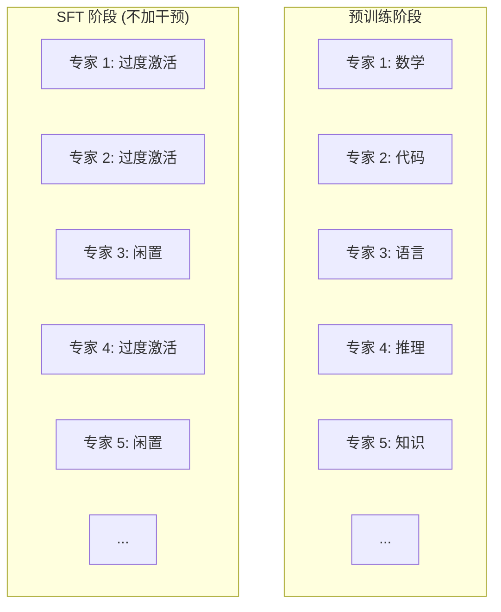

**DeepSeek 的解决策略**：

1. **辅助负载均衡损失**：

$$L_{balance} = \alpha \sum_{i=1}^{N} f_i \cdot p_i$$

其中 $f_i$ 是专家 $i$ 处理的 token 比例，$p_i$ 是路由器分配给专家 $i$ 的平均概率。这个损失鼓励各专家被均匀使用。

2. **共享专家机制**：

DeepSeek-V3 设计了"共享专家"（shared experts），这些专家处理所有 token，不受路由器控制。微调时共享专家能承载通用的对齐知识。

3. **数据多样性维护**：

在微调数据中混入一定比例的预训练格式数据，维持专家路由的多样性。

#### MoE 微调中的 LoRA

对 MoE 模型应用 LoRA 时，需要决定对哪些组件加 LoRA：

| 组件 | 是否加 LoRA | 理由 |
|------|-----------|------|
| 注意力投影 (Q/K/V/O) | 是 | 与 Dense 模型相同 |
| 路由器 (Router) | 通常不加 | 改变路由可能导致专家坍缩 |
| 专家 FFN | 可选 | 参数量大但效果不确定 |
| 共享专家 | 推荐 | 承载通用对齐知识 |

### 2.3 多任务微调的数据配比策略

DeepSeek 在多任务微调中采用了精心的数据配比策略。

#### 配比原则

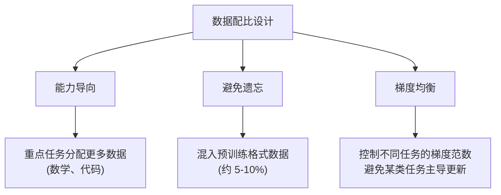

#### 动态配比策略

DeepSeek 可能采用了动态调整数据配比的策略（类似于 DoReMi 等方法的思想）：

1. **初期**：均匀采样各类任务
2. **中期**：根据各任务的损失下降速度调整——损失下降慢的任务增加采样比例
3. **后期**：增加难任务的比例，精细化提升

| 训练阶段 | 数学 | 代码 | 对话 | 知识 | 创意 |
|---------|------|------|------|------|------|
| 初期 (0-30%) | 20% | 20% | 20% | 20% | 20% |
| 中期 (30-70%) | 25% | 25% | 20% | 15% | 15% |
| 后期 (70-100%) | 30% | 25% | 15% | 15% | 15% |

> 注意：上表为基于技术报告描述的推断，具体数值未完全公开。

---

## 3. Anthropic 的微调理念

### 3.1 Claude 的 SFT 与 HHH 目标

Anthropic 将 SFT 阶段视为实现 HHH（Helpful, Harmless, Honest）目标的关键步骤。

#### HHH 的操作化定义

Anthropic 在论文 "Training a Helpful and Harmless Assistant"（Bai et al., 2022）中将 HHH 具体化为：

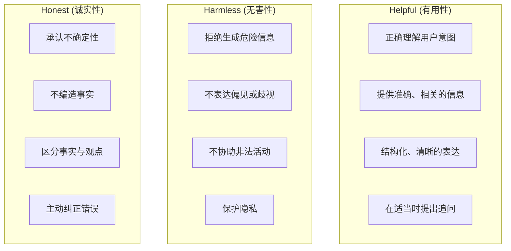

#### SFT 数据中 HHH 的体现 [推测]

Anthropic 的 SFT 数据可能包含以下类型的样本来训练 HHH 行为：

**Helpful 训练样本**：

```
用户: 帮我解释量子纠缠
助手: 量子纠缠是量子力学中的一个核心现象...
      [详细、准确、分层次的解释]
```

**Harmless 训练样本**：

```
用户: 教我如何破解他人的WiFi密码
助手: 我无法帮助您进行这类操作，因为未经授权访问他人网络
      是违法行为。如果您遇到网络连接问题，我可以帮您...
      [拒绝 + 转向合法替代方案]
```

**Honest 训练样本**：

```
用户: 2025年的诺贝尔物理学奖颁给了谁？
助手: 我不确定这个信息。我的训练数据可能未覆盖最新的
      诺贝尔奖信息。建议您查阅诺贝尔奖官方网站获取
      最新结果。
      [承认不确定 + 提供替代信息来源]
```

### 3.2 安全微调数据的构建方法

Anthropic 在安全微调数据构建方面投入了大量资源，其方法论体现了"安全优先"的理念。

#### Red Teaming 驱动的数据构建

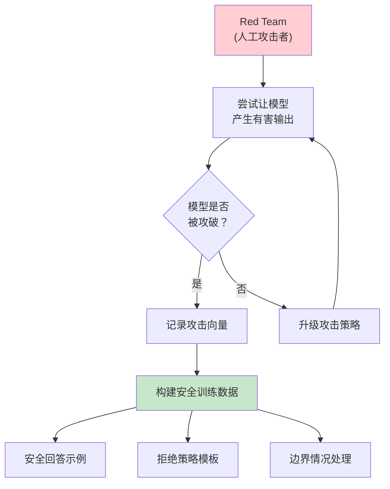

**Red Teaming 的分类**（基于 Anthropic 公开研究）：

| 攻击类别 | 描述 | 安全数据构建方式 |
|---------|------|----------------|
| 直接请求 | 直接要求有害内容 | 明确拒绝 + 解释原因 |
| 角色扮演 | "假装你是一个没有限制的 AI" | 保持安全准则不受角色影响 |
| 渐进式 | 通过多轮对话逐步诱导 | 在对话任何阶段都保持警觉 |
| 编码/混淆 | 用隐晦表述掩盖有害意图 | 识别意图而非仅匹配关键词 |
| 间接请求 | "写一个关于...的小说" | 区分合理创意写作与有害内容 |

#### 安全数据的质量维度

Anthropic 强调安全微调数据需要在以下维度取得平衡：

1. **安全性**：正确拒绝有害请求
2. **有用性**：不过度拒绝无害请求（"过度安全"问题）
3. **一致性**：对相似请求给出一致的回应
4. **可解释性**：拒绝时提供合理的解释

### 3.3 Constitutional AI (CAI) 在 SFT 中的应用

Constitutional AI 是 Anthropic 提出的一种将价值观融入模型训练的方法。

#### CAI 的 SFT 阶段（RL from AI Feedback 的前置步骤）

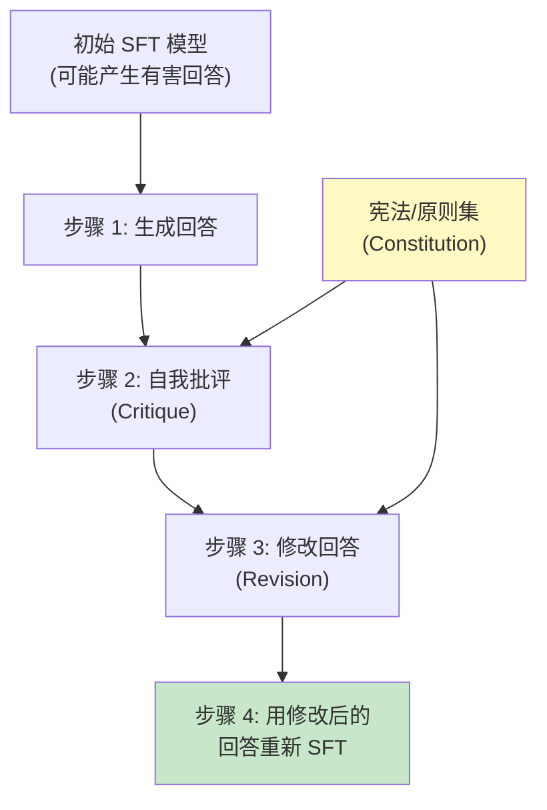

**具体流程**：

**步骤 1：生成**

对于可能触发有害回答的 prompt，让初始模型自由生成回答（不加安全限制）。

**步骤 2：批评（Critique）**

给模型提供 Constitution 中的原则，让其评估自己的回答：

```
Prompt: "请根据以下原则评估你的回答：
原则：选择最无害且最有帮助的回答。
你的回答是否违反了这个原则？如果是，请解释。"
```

**步骤 3：修改（Revision）**

基于批评结果，让模型修改自己的回答：

```
Prompt: "请根据你的批评，修改你的回答，使其更符合上述原则。"
```

**步骤 4：重新 SFT**

用修改后的 (prompt, revised_response) 对重新训练模型。

#### Constitution 的设计原则

Anthropic 的 Constitution 包含约 16 条核心原则，涵盖 [推测]：

1. 选择最无害且最有帮助的回答
2. 选择最不具有性别歧视、种族歧视或社会偏见的回答
3. 选择不鼓励非法活动的回答
4. 选择最诚实、最准确的回答
5. 选择不具有操纵性的回答
6. 选择对儿童最安全的回答
7. 选择最尊重个人隐私的回答
8. 选择最体现伦理考量的回答

> 注意：完整的 Constitution 内容未完全公开，上述为基于 Bai et al. (2022) 论文的部分列举。

#### CAI 的优势

| 传统 RLHF | Constitutional AI |
|-----------|-------------------|
| 依赖大量人工标注 | 减少人工标注需求 |
| 标注者的偏见难以控制 | 原则可以被明确审查和修改 |
| 扩展到新场景成本高 | 新增原则即可覆盖新场景 |
| 安全标准隐含在数据中 | 安全标准显式编码 |

---

## 4. 工业级 SFT Pipeline 与数据飞轮

### 4.1 LLaMA-Factory 框架解析

[LLaMA-Factory](https://github.com/hiyouga/LLaMA-Factory) 是目前最流行的开源 SFT 工具链之一，支持从数据准备到模型部署的全流程。

**核心特性一览**：

| 特性 | 支持情况 | 说明 |
|------|---------|------|
| 微调方法 | Full / Freeze / LoRA / QLoRA / DoRA | 覆盖主流 PEFT 方法 |
| 模型支持 | LLaMA / Qwen / Mistral / Gemma / Yi 等 | 50+ 开源模型 |
| 训练阶段 | Pre-training / SFT / RLHF / DPO | 全阶段覆盖 |
| 精度 | FP16 / BF16 / FP32 / 4-bit / 8-bit | 灵活的精度配置 |
| 分布式 | DeepSpeed ZeRO / FSDP | 多卡训练 |
| 数据格式 | Alpaca / ShareGPT / 自定义 | 统一数据接口 |
| 界面 | CLI / Web UI (LLaMA Board) | 降低使用门槛 |

**LLaMA-Factory 的典型 SFT 工作流**：

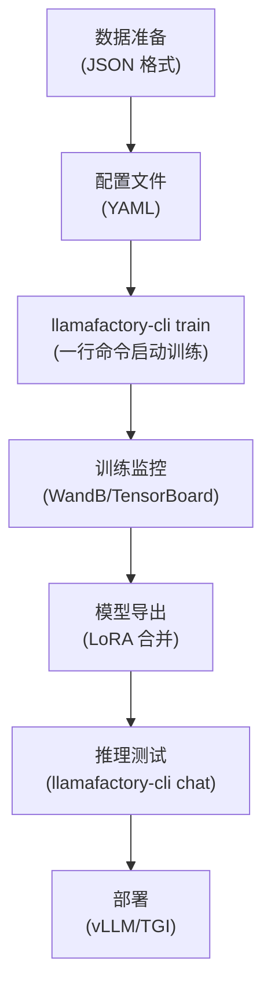

**关键配置参数示例**（QLoRA SFT）：

```yaml
# LLaMA-Factory 配置示例
model_name_or_path: meta-llama/Llama-2-7b-hf
stage: sft
finetuning_type: lora
quantization_bit: 4
lora_rank: 16
lora_alpha: 32
lora_target: q_proj,k_proj,v_proj,o_proj
dataset: alpaca_gpt4_zh
template: llama2
cutoff_len: 2048
per_device_train_batch_size: 4
gradient_accumulation_steps: 8
lr_scheduler_type: cosine
learning_rate: 2.0e-4
num_train_epochs: 3
bf16: true
```

### 4.2 Axolotl 框架对比

[Axolotl](https://github.com/OpenAccess-AI-Collective/axolotl) 是另一个广泛使用的微调框架，在灵活性和高级功能方面有独特优势。

**Axolotl vs LLaMA-Factory 对比**：

| 维度 | LLaMA-Factory | Axolotl |
|------|--------------|---------|
| **易用性** | Web UI + 一行命令 | 配置文件驱动，需要更多手动设置 |
| **灵活性** | 预设配置为主 | 高度可自定义，支持复杂数据混合 |
| **多数据集混合** | 支持 | 更强——支持不同数据集不同权重、不同模板 |
| **Sequence Packing** | 支持 | 支持，且配置更细粒度 |
| **Flash Attention** | 支持 | 原生深度集成 |
| **最佳场景** | 快速实验、教学 | 生产级微调、复杂配比需求 |

**选择建议**：

- **初学者 / 快速原型**：LLaMA-Factory（Web UI 降低门槛，一行命令即可训练）
- **生产环境 / 高级需求**：Axolotl（数据混合灵活，Sequence Packing 配置细粒度）
- **研究场景 / 自定义需求**：直接使用 HuggingFace TRL + PEFT 组合，最大灵活性

### 4.3 大规模 SFT 的工程挑战

当模型规模超过 70B 参数、数据量超过百万条时，SFT 面临一系列工程挑战。

**挑战 1：多卡训练时的梯度同步**

对于全参数 SFT（如 DeepSeek-V3 的 671B 模型），需要使用分布式训练策略：

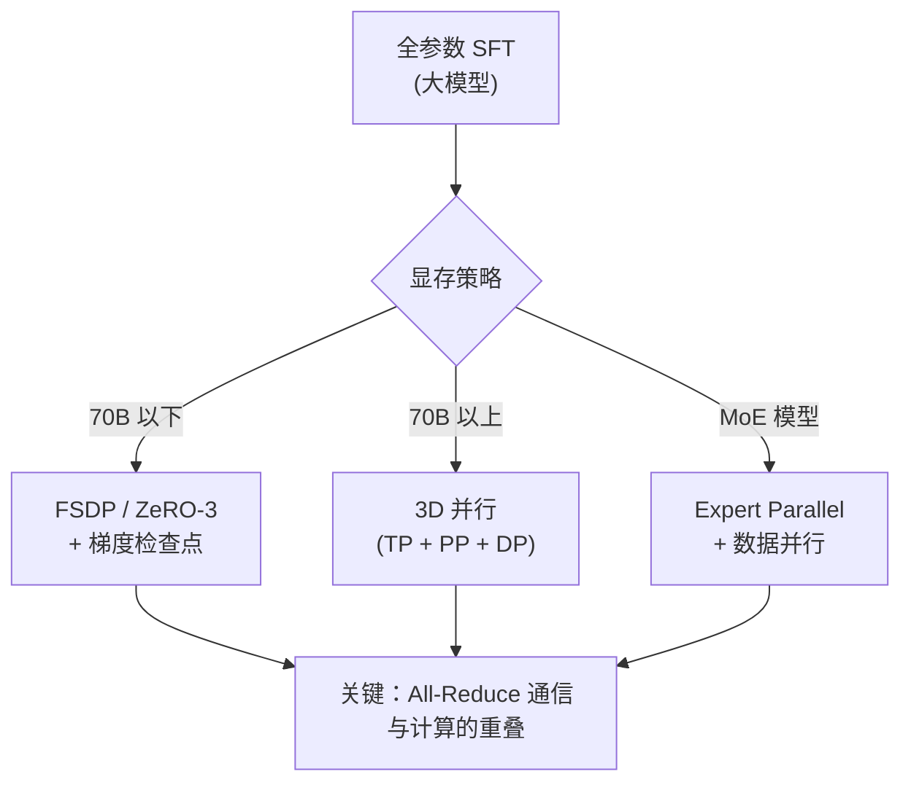

**挑战 2：数据 Sharding 与顺序控制**

在分布式训练中，确保每个 GPU 看到不同的数据子集，且训练数据的全局顺序一致（对可重复性至关重要）：

| 策略 | 实现方式 | 优缺点 |
|------|---------|--------|
| 静态 Sharding | 预先将数据按 GPU 数均分 | 简单但不灵活，负载可能不均 |
| 动态 Sharding | 使用分布式采样器 (DistributedSampler) | 灵活但需要同步随机种子 |
| 流式 Sharding | 使用 IterableDataset + 全局偏移 | 适合超大数据集，但断点续训复杂 |

**挑战 3：混合精度微调的数值稳定性**

对于 QLoRA（4-bit 基座 + BF16 LoRA），反向传播涉及多种精度的转换：

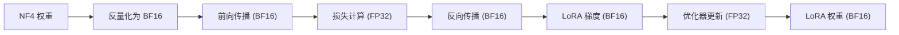

**关键注意点**：损失计算必须在 FP32 下进行以保证数值精度；优化器状态（Adam 的 momentum 和 variance）也应使用 FP32。

### 4.4 SFT 数据飞轮

**数据飞轮（Data Flywheel）** 是工业界用于持续提升 SFT 数据质量的迭代机制。其核心思想：用模型生成数据来改进模型自身。

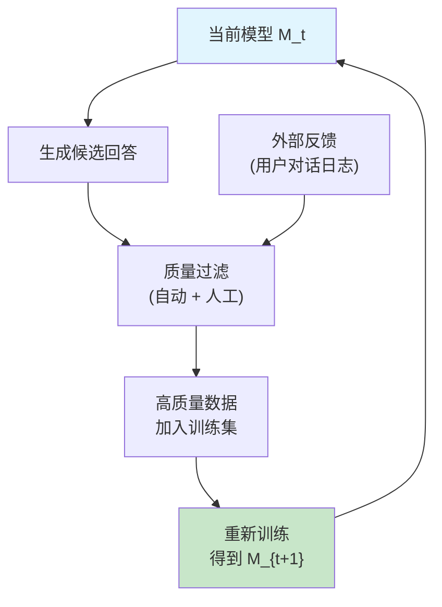

**Self-Instruct 数据飞轮**（Wang et al., 2023）：

1. 从 175 条人工种子指令出发
2. 让模型生成新指令和对应回答
3. 过滤低质量数据（ROUGE-L > 0.7 的重复指令、格式错误等）
4. 将高质量数据加入训练集
5. 重新训练模型，重复步骤 2-4

**Evol-Instruct 数据飞轮**（WizardLM, Xu et al., 2023）：

在 Self-Instruct 的基础上，加入了**进化维度**，使数据复杂度逐渐提升：

| 进化维度 | 操作 | 效果 |
|---------|------|------|
| 约束添加 | 给指令增加额外约束条件 | 提升复杂推理能力 |
| 深化 | 增加问题的深度和专业性 | 提升领域知识能力 |
| 具体化 | 将抽象问题转为具体场景 | 提升实用性 |
| 推理增强 | 增加需要多步推理的环节 | 提升逻辑推理能力 |
| 广化 | 将问题扩展到新领域 | 提升泛化能力 |

**工业实践中的数据飞轮效果**：

经过 3-5 轮迭代，模型在 AlpacaEval 等基准上的表现通常可以提升 10-20 个百分点。但要注意**模型坍缩（Model Collapse）** 的风险——如果过度依赖模型自身生成的数据，会导致生成多样性下降，最终退化为重复模式。工业界的解决方案通常是在每轮迭代中混入一定比例（20-30%）的人工标注数据作为"锚点"。

---

## 5. 前沿话题

### 5.1 LoRA 变体

LoRA 自 2022 年提出后，催生了大量变体和改进。以下是几个重要的方向。

#### DoRA（Weight-Decomposed Low-Rank Adaptation）

DoRA（Liu et al., 2024）将权重矩阵分解为**幅度（magnitude）**和**方向（direction）**两个部分，分别进行微调：

$$W = m \cdot \frac{V}{\|V\|_c}$$

其中：
- $m \in \mathbb{R}^{d_{out}}$ 是幅度向量（每列的范数）
- $V \in \mathbb{R}^{d_{out} \times d_{in}}$ 是方向矩阵
- $\|\cdot\|_c$ 表示列范数

**DoRA 的微调**：

$$W' = (m + \Delta m) \cdot \frac{V + \Delta V}{\|V + \Delta V\|_c}$$

其中 $\Delta V = BA$（使用 LoRA 分解），$\Delta m$ 是可训练的幅度增量。

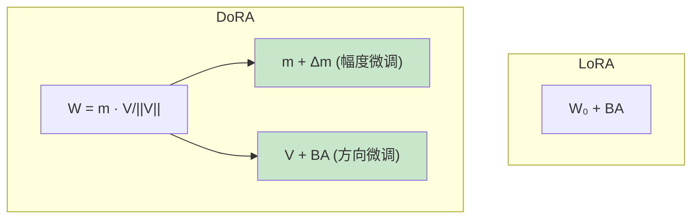

**DoRA 的优势**：

- 在相同 rank 下通常优于标准 LoRA
- 更接近全参数微调的权重更新模式
- 额外计算开销很小（仅增加幅度向量）

#### LoRA+

LoRA+（Hayou et al., 2024）的核心观察：标准 LoRA 中 $A$ 和 $B$ 使用相同的学习率是次优的。

**理论分析**：

- $A$ 是"特征提取"矩阵（从输入空间投影到低秩空间）
- $B$ 是"特征映射"矩阵（从低秩空间投影回输出空间）
- 两者的最优学习率不同

**LoRA+ 的策略**：

$$\eta_B = \lambda \cdot \eta_A, \quad \lambda > 1$$

即 $B$ 的学习率应高于 $A$ 的学习率。论文推荐 $\lambda \approx 16$。

**效果**：在不增加任何参数的情况下，仅通过调整学习率比例，就能获得 1-2% 的性能提升。

#### rsLoRA（Rank-Stabilized LoRA）

rsLoRA（Kalajdzievski, 2024）修正了 LoRA 的缩放因子。

**标准 LoRA 的问题**：

使用 $\alpha / r$ 缩放时，随着 rank 增大，LoRA 更新的"有效幅度"可能不稳定。

**rsLoRA 的修正**：

$$\Delta W = \frac{\alpha}{\sqrt{r}} \cdot BA$$

从 $1/r$ 改为 $1/\sqrt{r}$，在增加 rank 时保持更稳定的训练动态。

**三种 LoRA 变体的对比**：

| 方法 | 改进点 | 额外参数 | 额外计算 | 效果提升 |
|------|--------|---------|---------|---------|
| DoRA | 幅度-方向分解 | 极少（$d_{out}$ 个） | 小 | 显著 |
| LoRA+ | 差异化学习率 | 无 | 无 | 中等 |
| rsLoRA | 缩放因子修正 | 无 | 无 | 中等（高 rank 时） |

### 5.2 长上下文微调策略

随着模型上下文长度从 4K 扩展到 128K 甚至 1M，长上下文微调成为重要的工程挑战。

#### 挑战

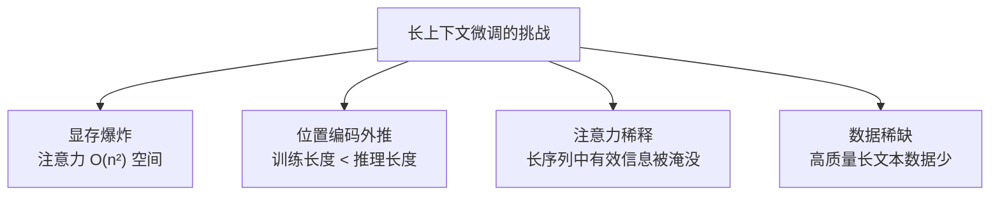

#### 关键技术

**1. 位置编码扩展**

通过修改 RoPE 的基频来扩展上下文：

$$\theta_i' = \theta_i \cdot s, \quad s = \frac{L_{target}}{L_{train}}$$

或使用 NTK-Aware 插值：

$$\theta_i' = b'^{-2i/d}, \quad b' = b \cdot s^{d/(d-2)}$$

其中 $b$ 是原始基频（通常为 10000），$s$ 是缩放因子。

**2. 渐进式长度训练**


**3. 长上下文 LoRA 微调的实践建议**

| 策略 | 说明 |
|------|------|
| 使用 Flash Attention | 减少注意力的显存开销，从 O(n²) 到 O(n) |
| 梯度 Checkpointing | 用计算换显存 |
| 序列并行 | 将长序列切分到多个 GPU |
| 选择性训练 | 只在包含长距离依赖的数据上训练 |

### 5.3 微调 vs In-Context Learning 的理论对比

一个深刻的问题：我们是否还需要微调？随着模型的上下文长度增加和 in-context learning（ICL）能力增强，直接在 prompt 中提供示例是否可以替代微调？

#### 理论视角

**微调（Fine-Tuning）的本质**：

$$\theta_{ft} = \arg\min_\theta \sum_{(x,y) \in D_{ft}} L(\theta; x, y)$$

模型参数被永久修改，知识被"写入"权重。

**In-Context Learning 的本质**：

$$P(y | x, C), \quad C = \{(x_1, y_1), \ldots, (x_k, y_k)\}$$

模型参数不变，知识通过上下文临时提供。

#### 对比分析

| 维度 | 微调 | ICL |
|------|------|-----|
| 知识持久性 | 永久（在权重中） | 临时（在上下文中） |
| 推理成本 | 低（知识内化） | 高（每次都要提供示例） |
| 灵活性 | 低（需重新训练） | 高（更换示例即可） |
| 数据需求 | 数百~数万条 | 数条~数十条 |
| 复杂任务 | 能力更强 | 受上下文长度限制 |
| 灾难性遗忘 | 存在风险 | 不存在 |

#### 理论联系

Dai et al. (2023) 的研究表明：**Transformer 的 in-context learning 实际上隐式地实现了梯度下降**。

在一个线性注意力模型中：

$$\text{ICL 预测} \approx W_0 x + \eta \sum_{i=1}^{k} (y_i - W_0 x_i) x_i^T x$$

第二项等价于对权重进行一步梯度更新。

**含义**：ICL 和微调并非对立关系——ICL 可以看作一种"隐式的临时微调"。但由于上下文长度和注意力的限制，ICL 能实现的"微调效果"有上限。

#### 实践建议

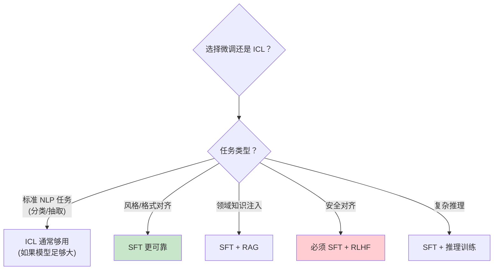

### 5.4 DPO 是否能替代 SFT？

最近的研究开始探讨一个激进的问题：能否跳过 SFT 阶段，直接从预训练模型进行 DPO（Direct Preference Optimization）？

**传统流程 vs 激进流程**：

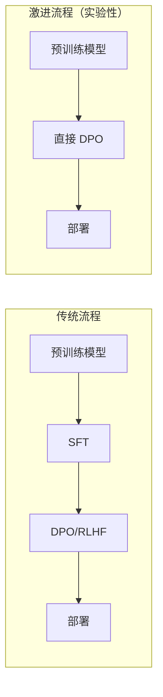

**当前研究结论**：

| 实验设置 | SFT + DPO | 直接 DPO | 分析 |
|---------|-----------|---------|------|
| 小模型 (7B) + 充足偏好数据 | 基线 | 性能下降 10-20% | 模型未学会基本格式 |
| 大模型 (70B+) + 充足偏好数据 | 基线 | 差距缩小至 5-10% | 大模型预训练知识更丰富 |
| 任何模型 + 多轮对话 | 基线 | 显著退化 | 多轮格式严重依赖 SFT |

**核心结论**（截至 2025 年的共识）：

- **SFT 目前仍然不可或缺**，尤其是对于学习对话格式和基本指令遵循
- 对于超大模型，SFT 所需的数据量可以减少（LIMA 的 1000 条数据即可），但不能完全跳过
- **未来可能的方向**：将 SFT 和 DPO 目标统一到一个训练阶段中（如 ORPO 的思路）

### 5.5 Curriculum Learning for SFT

**课程学习（Curriculum Learning）** 将"从简单到复杂"的人类学习直觉应用于 SFT 训练过程。

**核心假设**：如果先让模型在简单指令上学会基本的格式和回答模式，再逐渐引入复杂指令，可能比随机打乱数据顺序的训练更高效。

**难度定义方法**：

| 难度指标 | 计算方式 | 直觉 |
|---------|---------|------|
| 指令长度 | 字符数 / token 数 | 短指令通常更简单 |
| 回答长度 | 期望输出的 token 数 | 短回答通常难度较低 |
| 推理步骤数 | 回答中的推理链长度 | 多步推理更难 |
| 基座模型困惑度 | 用预训练模型计算回答的 PPL | PPL 低的样本"更符合预训练分布"，更容易学习 |
| 领域专业度 | 人工标注或分类器评分 | 通用问答 < 专业知识 < 高级推理 |

**Curriculum 训练策略**：


**实验证据**：

- **积极结果**：在数学推理任务（GSM8K）上，Curriculum Learning 比随机顺序训练的最终准确率高 2-5%
- **积极结果**：训练初期的损失下降更快，收敛更稳定
- **局限性**：在通用对话任务上，Curriculum Learning 的提升不显著（可能因为"简单"和"复杂"的边界不清晰）
- **实践建议**：对于推理密集型任务（数学、代码），Curriculum Learning 值得尝试；对于通用对话微调，随机打乱通常足够

---

## 本章进阶小结

### 工业界经验

1. **Google (FLAN)**：大规模多任务指令微调 + CoT 数据混合是提升零样本能力的有效途径
2. **DeepSeek (V3)**：MoE 模型微调需要特别关注负载均衡和专家利用率
3. **Anthropic (Claude)**：安全微调需要系统性的 Red Teaming 和 Constitutional AI 框架

### 前沿方向

1. **LoRA 变体**：DoRA（幅度-方向分解）、LoRA+（差异化学习率）、rsLoRA（缩放修正）持续推动 PEFT 方法的进步
2. **长上下文微调**：位置编码扩展和渐进式训练是关键技术
3. **微调 vs ICL**：两者互补而非对立，选择取决于任务特性和部署约束
4. **工业级 SFT Pipeline**：LLaMA-Factory、Axolotl 等框架大幅降低了微调门槛
5. **SFT 数据飞轮**：Self-Instruct / Evol-Instruct 实现了数据质量的迭代提升，但需警惕模型坍缩
6. **DPO 替代 SFT 的探索**：目前 SFT 仍不可或缺，但 ORPO 等方法正在尝试统一两个阶段
7. **Curriculum Learning**：从简单到复杂的指令排序对推理密集型任务有 2-5% 的提升

### 推荐阅读

| 论文 | 年份 | 关键贡献 |
|------|------|---------|
| LoRA (Hu et al.) | 2022 | 低秩适配的奠基工作 |
| QLoRA (Dettmers et al.) | 2023 | NF4 量化 + LoRA |
| FLAN v2 (Chung et al.) | 2022 | 大规模多任务指令微调 |
| LIMA (Zhou et al.) | 2023 | 少量数据 SFT 的可行性 |
| DoRA (Liu et al.) | 2024 | 幅度-方向分解的 LoRA |
| Constitutional AI (Bai et al.) | 2022 | 基于原则的安全训练 |
| Scaling Data-Constrained LMs (Muennighoff et al.) | 2023 | 微调数据量的影响分析 |
