# 模块11：RLHF — 基于人类反馈的强化学习

> RLHF 是将预训练语言模型从"能说会道"变为"善解人意"的关键技术。本章将从策略梯度的基础出发，完整推导 Bradley-Terry 偏好模型、PPO 裁剪目标函数和 GAE 优势估计，并深入分析 RLHF 的工程挑战。

---

## 章节定位：RLHF 在 LLM 训练体系中的位置

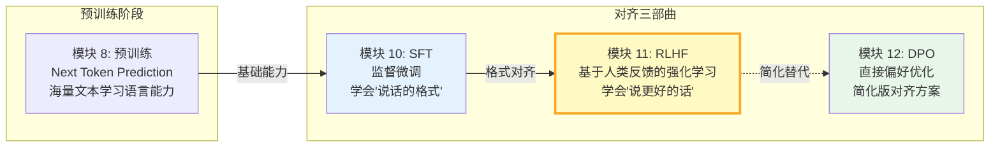

RLHF 处于 **"预训练 → SFT → 对齐"** 三阶段训练范式的最后一环。经过预训练后，模型具备了基础的语言能力；经过 SFT 后，模型学会了遵循指令的格式；而 RLHF 的目标，则是让模型的输出真正**符合人类的偏好和价值观**。

**RLHF 的历史意义**：2022 年，OpenAI 发表的 **InstructGPT** 论文（Ouyang et al.）首次在工业级 LLM 上系统性地应用了 RLHF，将 GPT-3 从一个"能力强但难以控制"的基座模型，变成了一个"有帮助、安全、诚实"的对话助手。这篇论文开创了 **SFT → 奖励模型 → PPO 优化** 的标准三阶段流水线，直接奠定了 ChatGPT 的技术基础。而 RLHF 的理论基础则更早——2017 年 Christiano 等人（多位后来的 Anthropic 创始成员）在 NeurIPS 发表的奠基论文首次提出了从人类偏好中学习奖励函数的完整框架。

> **本模块的学习路径**：先理解"为什么需要 RLHF"（第 1 节），再掌握奖励模型的训练（第 2 节），然后深入 PPO 的数学（第 3-4 节），了解工程挑战和工业实践（第 5-10 节），最后通过项目实践巩固理解。

---

## 目录

- [1. 为什么需要 RLHF](#1-为什么需要-rlhf)
- [2. 奖励模型（Reward Model）](#2-奖励模型reward-model)
- [3. PPO（Proximal Policy Optimization）](#3-ppoproximal-policy-optimization)
- [4. GAE（Generalized Advantage Estimation）](#4-gaegeneralized-advantage-estimation)
- [5. RLHF 的工程挑战](#5-rlhf-的工程挑战)
- [6. Google 的 RLHF 实践](#6-google-的-rlhf-实践)
- [7. DeepSeek 的 RLHF 实践](#7-deepseek-的-rlhf-实践)
- [8. GRPO：Group Relative Policy Optimization](#8-grpogroup-relative-policy-optimization)
- [9. Anthropic 的 RLHF 贡献](#9-anthropic-的-rlhf-贡献)
- [10. RLHF 的工业实践](#10-rlhf-的工业实践)
- [11. 项目实践](#11-项目实践)
- [12. 章节衔接：从 RLHF 到 DPO](#12-章节衔接从-rlhf-到-dpo)

---

## 1. 为什么需要 RLHF

### 1.1 SFT 的局限性：模仿学习的天花板

经过预训练和监督微调（SFT）后，语言模型已经可以生成流畅的文本。但 SFT 存在根本性的局限：

**SFT 的本质是模仿学习**：

$$L_{\text{SFT}} = -\sum_{t=1}^{T} \log p_\theta(y_t | y_{<t}, x)$$

SFT 通过最大似然估计让模型模仿标注数据中的 token 序列。这带来几个问题：

| 局限 | 说明 | 例子 |
|------|------|------|
| 天花板效应 | 模型最多与标注者一样好 | 标注者的知识和表达能力有限 |
| 缺乏偏好建模 | 只学习"做什么"，不学习"什么更好" | 两个都正确的回答，SFT 无法区分优劣 |
| 暴露偏差 | 训练用标注文本，推理用自己生成 | 一步错步步错的雪崩效应 |
| token 级损失错位 | 每个 token 等权重 | 关键词和废话权重相同 |

### 1.2 人类偏好与交叉熵损失的错位

考虑以下场景：用户问"什么是量子力学？"

- **回答 A**（优秀）："量子力学是研究微观粒子行为的物理学分支..."（准确、详细、易懂）
- **回答 B**（一般）："量子力学很复杂。"（正确但无用）

SFT 的交叉熵损失无法区分 A 和 B 的质量差异——如果 B 出现在训练数据中，模型同样会学习模仿它。

**人类偏好是序列级别的判断**，而交叉熵是 token 级别的损失。这种粒度错位是 RLHF 要解决的核心问题。

### 1.3 RLHF 的三阶段框架

RLHF 通过将人类偏好转化为优化信号，实现了超越模仿学习的对齐目标。

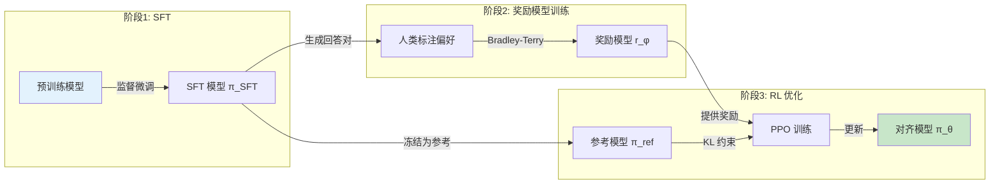

**三个阶段的关系**：

1. **阶段 1 — 监督微调（SFT）**：让模型学会"说话"（遵循指令格式）
2. **阶段 2 — 奖励模型训练**：将人类偏好编码为标量信号
3. **阶段 3 — RL 优化**：用奖励信号引导模型"说更好的话"

---

## 2. 奖励模型（Reward Model）

### 2.1 Bradley-Terry 偏好模型

奖励模型的任务是：给定 prompt $x$ 和 response $y$，输出一个标量分数 $r_\phi(x, y)$，使得**更好的 response 获得更高的分数**。

**偏好数据的形式**：人类标注者比较两个 response $y_w$（chosen）和 $y_l$（rejected），判断 $y_w \succ y_l$（$y_w$ 优于 $y_l$）。

**Bradley-Terry 模型**假设偏好概率仅取决于两者奖励分数的差：

$$P(y_w \succ y_l | x) = \sigma(r_\phi(x, y_w) - r_\phi(x, y_l))$$

其中 $\sigma(z) = \frac{1}{1 + e^{-z}}$ 是 sigmoid 函数。

**直觉**：当 $r_\phi(x, y_w) \gg r_\phi(x, y_l)$ 时，$\sigma \to 1$，模型有信心认为 $y_w$ 更好；当两者奖励相近时，$\sigma \approx 0.5$，模型不确定。

### 2.2 损失函数推导

给定偏好数据集 $\mathcal{D} = \{(x^{(i)}, y_w^{(i)}, y_l^{(i)})\}_{i=1}^{N}$，最大化对数似然：

$$\max_\phi \sum_{i=1}^{N} \log P(y_w^{(i)} \succ y_l^{(i)} | x^{(i)})$$

代入 Bradley-Terry 模型：

$$\max_\phi \sum_{i=1}^{N} \log \sigma(r_\phi(x^{(i)}, y_w^{(i)}) - r_\phi(x^{(i)}, y_l^{(i)}))$$

转化为最小化损失：

$$\boxed{L_{\text{RM}} = -\frac{1}{N}\sum_{i=1}^{N} \log \sigma(r_\phi(x^{(i)}, y_w^{(i)}) - r_\phi(x^{(i)}, y_l^{(i)}))}$$

**梯度分析**：

令 $\Delta = r_\phi(x, y_w) - r_\phi(x, y_l)$，则：

$$\frac{\partial L}{\partial \Delta} = -(1 - \sigma(\Delta))$$

- 当 $\Delta \gg 0$（已学好）：$\sigma(\Delta) \approx 1$，梯度 $\approx 0$
- 当 $\Delta = 0$（未区分）：$\sigma(\Delta) = 0.5$，梯度 $= -0.5$
- 当 $\Delta \ll 0$（学反了）：$\sigma(\Delta) \approx 0$，梯度 $\approx -1$（最强学习信号）

这与二分类交叉熵的梯度行为一致——Bradley-Terry 损失本质上等价于一个二分类问题，其中"chosen 优于 rejected"是正类。

### 2.3 偏好数据的收集与标注

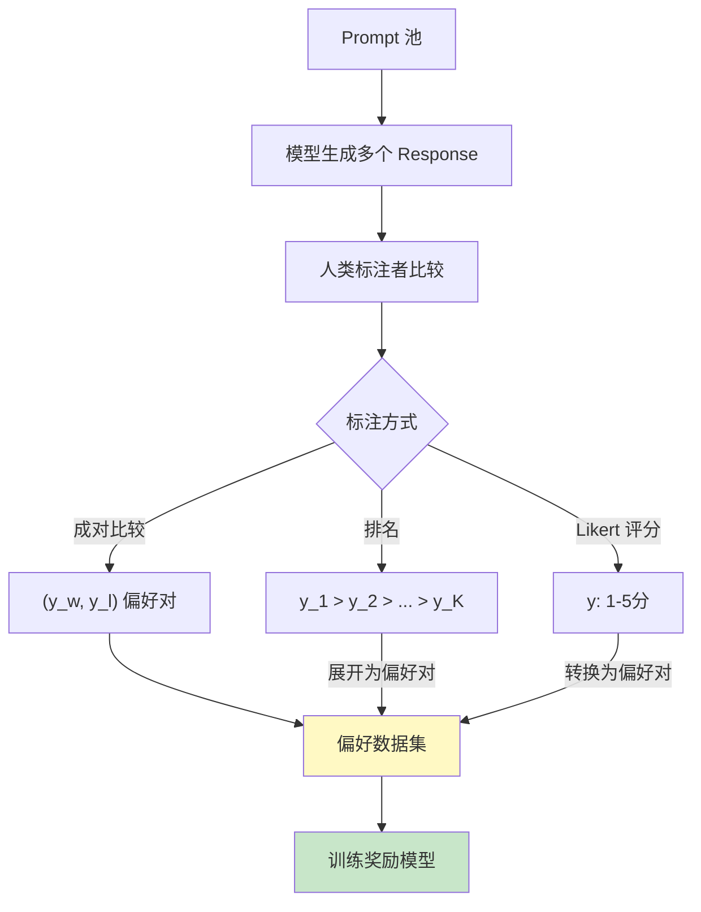

**标注质量的关键因素**：

1. **标注者间一致性**（inter-annotator agreement）：通常用 Cohen's Kappa 衡量，典型值约 0.6-0.75
2. **标注者多样性**：不同背景的标注者可以减少偏见
3. **每个 prompt 的比较数量**：更多比较 → 更可靠的偏好信号

### 2.4 奖励模型的训练细节

**模型架构**：通常从 SFT 模型初始化，将语言模型头（lm_head）替换为标量输出头（reward_head）。

```python
class RewardModel(nn.Module):
    def __init__(self, backbone):
        super().__init__()
        self.backbone = backbone  # 从 SFT 模型初始化
        self.reward_head = nn.Linear(hidden_size, 1)  # 标量输出

    def forward(self, input_ids, attention_mask):
        hidden = self.backbone(input_ids, attention_mask)
        # 取最后一个 token 的隐藏状态
        last_hidden = hidden[torch.arange(B), seq_lengths - 1]
        reward = self.reward_head(last_hidden).squeeze(-1)
        return reward  # [batch_size]
```

**训练技巧**：
- 学习率通常比 SFT 低一个量级（如 $1\times 10^{-5}$）
- 奖励头使用较小的初始化（std=0.01），确保初始奖励接近 0
- 训练 1-2 个 epoch 即可，过多 epoch 会过拟合偏好数据

### 2.5 Reward Hacking 问题

奖励模型是人类偏好的**不完美代理**。当策略过度优化不完美的奖励模型时，会产生 **Reward Hacking**（奖励欺骗）：

| 现象 | 原因 | 后果 |
|------|------|------|
| 生成冗长但空洞的文本 | 奖励模型偏好长文本 | 信息密度下降 |
| 过度使用特定短语 | 这些短语在标注数据中得分高 | 生成文本缺乏多样性 |
| 生成人类看似合理但错误的内容 | 奖励模型无法判断事实正确性 | 幻觉增加 |

**KL 惩罚**是防止 reward hacking 的主要手段——它限制策略不能偏离参考模型太远，从而间接限制了对奖励模型的过度优化。

---

## 3. PPO（Proximal Policy Optimization）

PPO 是 RLHF 中最常用的强化学习算法。本节从策略梯度的基础出发，逐步推导到 PPO 的裁剪目标函数。

### 3.1 策略梯度基础

#### REINFORCE 算法回顾

**目标**：最大化期望奖励

$$J(\theta) = \mathbb{E}_{\tau \sim \pi_\theta}[R(\tau)]$$

其中 $\tau = (s_0, a_0, s_1, a_1, \ldots)$ 是一条轨迹，$R(\tau) = \sum_t r_t$ 是累积奖励。

**策略梯度定理**：

$$\nabla_\theta J(\theta) = \mathbb{E}_{\tau \sim \pi_\theta}\left[\sum_{t=0}^{T} \nabla_\theta \log \pi_\theta(a_t|s_t) \cdot R_t\right]$$

其中 $R_t = \sum_{t'=t}^{T} r_{t'}$ 是从时刻 $t$ 开始的累积奖励。

**推导关键步骤**（对数微分技巧）：

$$\nabla_\theta \pi_\theta(a|s) = \pi_\theta(a|s) \cdot \nabla_\theta \log \pi_\theta(a|s)$$

因此：

$$\nabla_\theta J(\theta) = \mathbb{E}_{a \sim \pi_\theta}[\nabla_\theta \log \pi_\theta(a|s) \cdot R]$$

**REINFORCE 在 RLHF 中的映射**：

| RL 概念 | RLHF 对应 |
|---------|-----------|
| 状态 $s_t$ | 已生成的 token 序列 $(x, y_{<t})$ |
| 动作 $a_t$ | 下一个 token $y_t$ |
| 策略 $\pi_\theta(a_t\|s_t)$ | 语言模型的 token 分布 $p_\theta(y_t\|x, y_{<t})$ |
| 奖励 $R$ | 奖励模型分数 $r_\phi(x, y)$ |

#### 基线与方差缩减

REINFORCE 的一个严重问题是**高方差**。通过引入基线 $b(s_t)$，可以在不引入偏差的情况下降低方差：

$$\nabla_\theta J(\theta) = \mathbb{E}\left[\sum_t \nabla_\theta \log \pi_\theta(a_t|s_t) \cdot (R_t - b(s_t))\right]$$

**为什么基线不引入偏差？**

$$\mathbb{E}_{a \sim \pi_\theta}\left[\nabla_\theta \log \pi_\theta(a|s) \cdot b(s)\right] = b(s) \cdot \nabla_\theta \sum_a \pi_\theta(a|s) = b(s) \cdot \nabla_\theta 1 = 0$$

最优基线是状态价值函数 $V(s_t)$，此时 $R_t - V(s_t)$ 就是**优势函数** $A(s_t, a_t)$：

$$A(s_t, a_t) = Q(s_t, a_t) - V(s_t)$$

优势函数的含义：动作 $a_t$ 相比平均水平好多少。

### 3.2 从策略梯度到 PPO

#### 信任域的动机

直接使用策略梯度的问题：**步长难以选择**。

- 步长太大：策略剧变，性能崩溃
- 步长太小：收敛极慢

**TRPO（Trust Region Policy Optimization）**的想法是限制策略更新幅度：

$$\max_\theta \; \mathbb{E}\left[\frac{\pi_\theta(a|s)}{\pi_{\theta_{\text{old}}}(a|s)} A^{\pi_{\theta_{\text{old}}}}(s, a)\right]$$

$$\text{s.t.} \; \mathbb{E}[\text{KL}(\pi_{\theta_{\text{old}}} \| \pi_\theta)] \leq \delta$$

但 TRPO 的约束优化计算代价很高。PPO 用更简单的方法实现类似效果。

#### 重要性采样比率

PPO 使用**重要性采样**来复用旧策略的数据：

$$r_t(\theta) = \frac{\pi_\theta(a_t|s_t)}{\pi_{\theta_{\text{old}}}(a_t|s_t)}$$

**性质**：
- $r_t = 1$：新旧策略在 $a_t$ 上一致
- $r_t > 1$：新策略更倾向于选择 $a_t$
- $r_t < 1$：新策略更不倾向于选择 $a_t$

在对数空间计算更数值稳定：

$$r_t(\theta) = \exp(\log \pi_\theta(a_t|s_t) - \log \pi_{\theta_{\text{old}}}(a_t|s_t))$$

#### PPO 裁剪目标函数

PPO 的核心创新是**裁剪（clipping）**：

$$\boxed{L^{\text{CLIP}}(\theta) = \mathbb{E}_t\left[\min\left(r_t(\theta) A_t, \; \text{clip}(r_t(\theta), 1-\epsilon, 1+\epsilon) A_t\right)\right]}$$

其中 $\epsilon$ 是裁剪参数（通常为 0.2）。

**为什么要裁剪？分情况分析**：

**情况 1: $A_t > 0$（好的动作）**

$$L = \min(r_t A_t, \; \text{clip}(r_t, 1-\epsilon, 1+\epsilon) \cdot A_t)$$

- 当 $r_t \leq 1 + \epsilon$：$L = r_t A_t$，正常梯度更新
- 当 $r_t > 1 + \epsilon$：$L = (1+\epsilon) A_t$，梯度被截断

**直觉**：即使动作很好，也不允许策略变化太大（$r_t$ 不能超过 $1+\epsilon$）。

**情况 2: $A_t < 0$（差的动作）**

$$L = \min(r_t A_t, \; \text{clip}(r_t, 1-\epsilon, 1+\epsilon) \cdot A_t)$$

- 当 $r_t \geq 1 - \epsilon$：$L = r_t A_t$，正常梯度更新
- 当 $r_t < 1 - \epsilon$：$L = (1-\epsilon) A_t$，梯度被截断

**直觉**：即使动作很差，也不允许过度惩罚（$r_t$ 不能低于 $1-\epsilon$）。

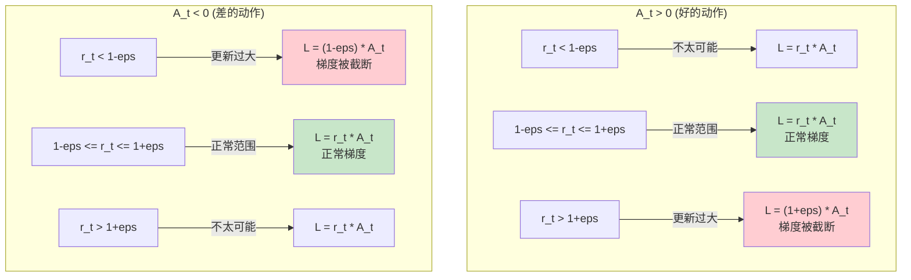

### 3.3 RLHF 中的 PPO 适配

标准 PPO 不能直接用于 RLHF，需要关键适配。

#### KL 散度惩罚

RLHF 的总奖励信号中包含 KL 惩罚：

$$\boxed{R_{\text{total}} = R_{\text{RM}}(x, y) - \beta \cdot \text{KL}(\pi_\theta \| \pi_{\text{ref}})}$$

其中 $\text{KL}(\pi_\theta \| \pi_{\text{ref}})$ 是当前策略与参考策略（冻结的 SFT 模型）之间的 KL 散度。

**逐 token 形式**：

$$\text{KL}_t = \log \pi_\theta(a_t|s_t) - \log \pi_{\text{ref}}(a_t|s_t)$$

$$r_t = \begin{cases} -\beta \cdot \text{KL}_t & t < T \text{ (中间 token)} \\ R_{\text{RM}} - \beta \cdot \text{KL}_T & t = T \text{ (最后一个 token)} \end{cases}$$

**KL 惩罚的双重作用**：

1. **防止 reward hacking**：限制策略不能偏离参考模型太远
2. **保持生成质量**：参考模型（SFT）已经有良好的语言能力，偏离太远可能导致语法错误、重复等问题

#### 完整 PPO-RLHF 训练流程

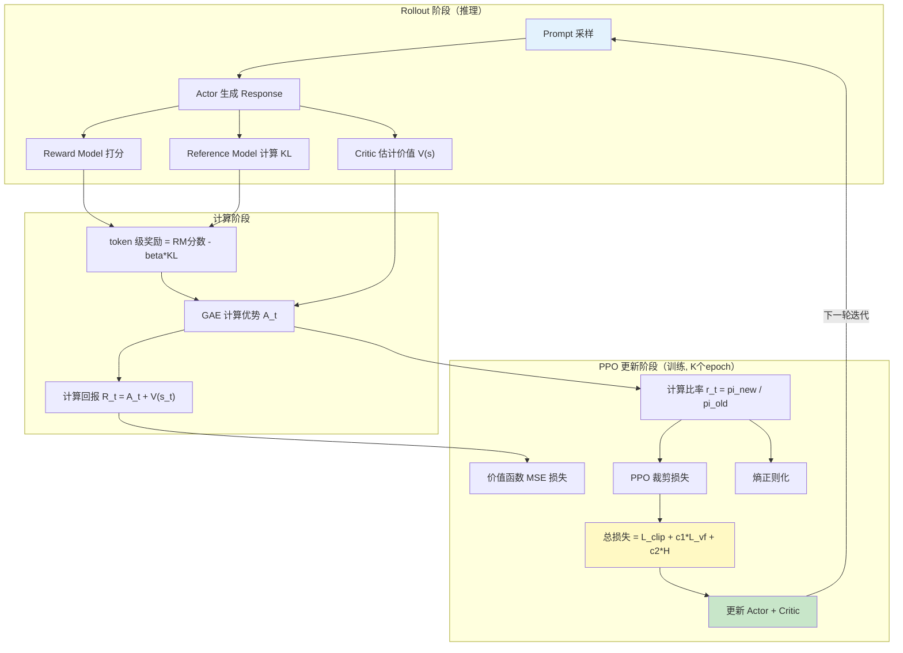

#### 完整目标函数

PPO-RLHF 的总损失函数：

$$L(\theta) = L^{\text{CLIP}}(\theta) + c_1 \cdot L^{\text{VF}}(\theta) - c_2 \cdot H(\pi_\theta)$$

其中：
- $L^{\text{CLIP}}$：PPO 裁剪策略损失（最大化 → 前面加负号）
- $L^{\text{VF}} = \frac{1}{2}\mathbb{E}_t[(V_\theta(s_t) - R_t)^2]$：价值函数 MSE 损失
- $H(\pi_\theta) = -\mathbb{E}[\sum_a \pi_\theta(a|s) \log \pi_\theta(a|s)]$：策略熵（鼓励探索）
- $c_1 \approx 0.5$：价值损失权重
- $c_2 \approx 0.01$：熵正则化权重

---

## 4. GAE（Generalized Advantage Estimation）

### 4.1 优势函数的估计问题

优势函数 $A(s_t, a_t) = Q(s_t, a_t) - V(s_t)$ 在理论上很完美，但实践中我们无法精确计算 $Q$ 值。需要用**估计**代替。

**两种极端估计方式**：

**TD(0) — 一步估计**（低方差、高偏差）：

$$\hat{A}_t^{(1)} = \delta_t = r_t + \gamma V(s_{t+1}) - V(s_t)$$

其中 $\delta_t$ 是 TD 残差。偏差来源：$V$ 的估计可能不准确。

**蒙特卡洛估计**（无偏、高方差）：

$$\hat{A}_t^{(\infty)} = \sum_{l=0}^{T-t} \gamma^l r_{t+l} - V(s_t) = R_t - V(s_t)$$

直接使用实际累积奖励，无偏但方差很大（因为轨迹的随机性）。

### 4.2 GAE：偏差-方差的平滑插值

GAE 通过指数加权平均在两个极端之间进行插值。

#### 推导过程

首先定义 $n$ 步优势估计：

$$\hat{A}_t^{(1)} = \delta_t$$

$$\hat{A}_t^{(2)} = \delta_t + \gamma \delta_{t+1}$$

$$\hat{A}_t^{(n)} = \sum_{l=0}^{n-1} \gamma^l \delta_{t+l}$$

GAE 是这些 $n$ 步估计的指数加权平均：

$$\hat{A}_t^{\text{GAE}(\gamma,\lambda)} = (1-\lambda)\left(\hat{A}_t^{(1)} + \lambda \hat{A}_t^{(2)} + \lambda^2 \hat{A}_t^{(3)} + \cdots\right)$$

展开化简：

$$\hat{A}_t^{\text{GAE}(\gamma,\lambda)} = (1-\lambda) \sum_{n=1}^{\infty} \lambda^{n-1} \hat{A}_t^{(n)}$$

$$= (1-\lambda) \sum_{n=1}^{\infty} \lambda^{n-1} \sum_{l=0}^{n-1} \gamma^l \delta_{t+l}$$

交换求和顺序（关键步骤）：

每个 $\delta_{t+l}$ 出现在 $n > l$ 的所有项中，其系数为 $\gamma^l$，$\lambda$ 的权重和为：

$$\sum_{n=l+1}^{\infty} \lambda^{n-1} = \frac{\lambda^l}{1-\lambda}$$

因此：

$$\hat{A}_t^{\text{GAE}} = (1-\lambda) \sum_{l=0}^{\infty} \gamma^l \delta_{t+l} \cdot \frac{\lambda^l}{1-\lambda}$$

$$\boxed{\hat{A}_t^{\text{GAE}(\gamma,\lambda)} = \sum_{l=0}^{\infty} (\gamma\lambda)^l \delta_{t+l}}$$

#### 递推形式（高效计算）

$$\hat{A}_t^{\text{GAE}} = \delta_t + \gamma\lambda \cdot \hat{A}_{t+1}^{\text{GAE}}$$

边界条件：$\hat{A}_T^{\text{GAE}} = \delta_T = r_T - V(s_T)$（假设 episode 结束后价值为 0）。

#### $\lambda$ 参数的两个极端

| $\lambda$ | GAE 形式 | 特性 |
|-----------|----------|------|
| $\lambda = 0$ | $\hat{A}_t = \delta_t = r_t + \gamma V(s_{t+1}) - V(s_t)$ | TD(0)，低方差、高偏差 |
| $\lambda = 1$ | $\hat{A}_t = \sum_{l=0}^{T-t} \gamma^l r_{t+l} - V(s_t)$ | MC，高方差、低偏差 |
| $\lambda \in (0,1)$ | 指数加权平均 | 在偏差-方差之间权衡 |

**RLHF 中的典型设置**：$\gamma = 1.0$，$\lambda = 0.95$。

- $\gamma = 1.0$：因为 RLHF 的 episode（生成一个 response）较短（几十到几百个 token），不需要折扣
- $\lambda = 0.95$：接近 MC（方差稍大但偏差小），因为 Critic 在训练初期不太准确

### 4.3 高效实现

```python
def compute_gae(rewards, values, gamma=1.0, lam=0.95):
    """GAE 计算（从后往前递推）"""
    batch_size, seq_len = rewards.shape
    advantages = torch.zeros_like(rewards)
    last_gae = 0

    for t in reversed(range(seq_len)):
        if t == seq_len - 1:
            next_value = 0
        else:
            next_value = values[:, t + 1]

        delta = rewards[:, t] + gamma * next_value - values[:, t]
        last_gae = delta + gamma * lam * last_gae
        advantages[:, t] = last_gae

    returns = advantages + values
    return advantages, returns
```

**复杂度**：$O(\text{batch\_size} \times \text{seq\_len})$，从后往前一次遍历即可。

---

## 5. RLHF 的工程挑战

### 5.1 四个模型的显存管理

RLHF 训练需要**同时**管理四个模型，这是巨大的显存挑战：

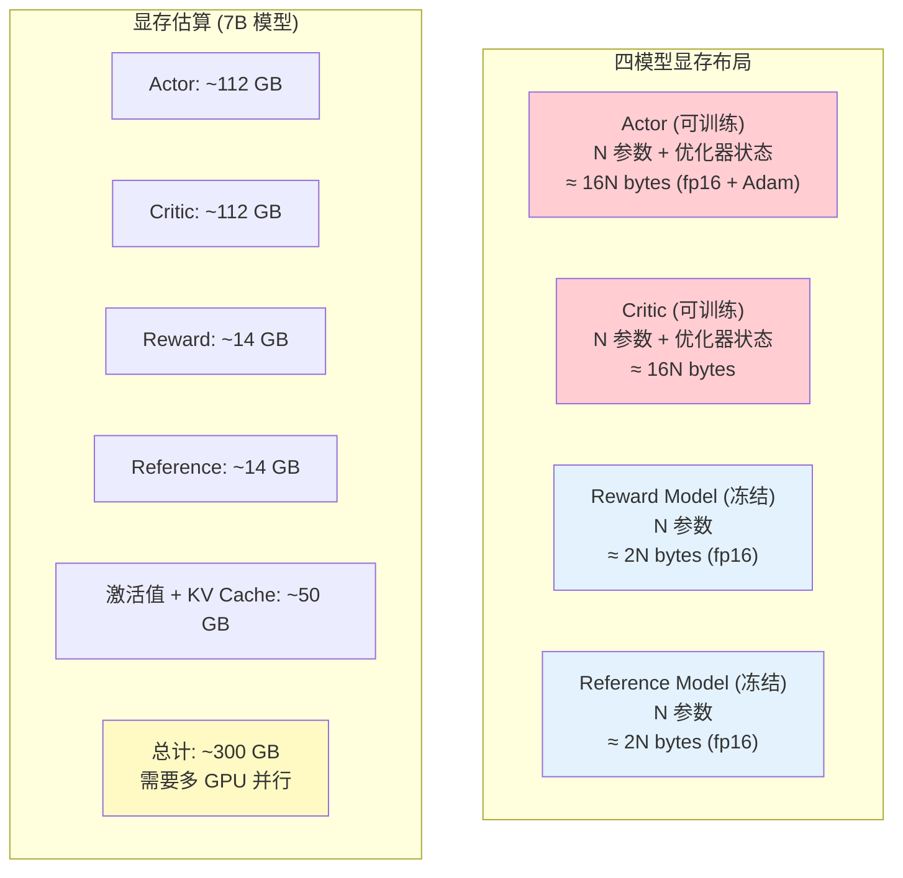

**显存优化策略**：

| 策略 | 说明 | 节省比例 |
|------|------|----------|
| Actor-Critic 共享 backbone | 只有头部不同 | ~50% |
| LoRA 微调 | 冻结 backbone，只训练少量参数 | ~90% |
| Reward + Reference 合并 | 用同一个模型（需额外计算 ref logprobs） | ~10% |
| 模型并行（TP/PP） | 将模型切分到多张 GPU | 按 GPU 数线性 |
| Offloading | 将不活跃的模型卸载到 CPU/NVMe | 灵活 |

### 5.2 训练稳定性问题

RLHF 训练**远比** SFT 难以稳定，原因包括：

1. **奖励信号稀疏**：奖励仅在序列末尾出现
2. **非平稳优化目标**：actor 在变，critic 也在变，奖励信号随之变化
3. **模式坍缩风险**：策略可能坍缩到少数高奖励 response
4. **KL 约束与奖励的拉锯**：beta 太大抑制学习，太小导致偏移

**常用的稳定性技巧**：

- 优势白化（advantage normalization/whitening）
- 梯度裁剪（gradient clipping, max_norm=1.0）
- 价值损失裁剪（value loss clipping）
- 自适应 KL 系数
- 学习率预热（warmup）+ 余弦衰减
- 大 batch size（减少方差）

### 5.3 超参数敏感性

RLHF 有大量需要调节的超参数，且它们之间存在复杂的交互：

| 超参数 | 典型值 | 过大 | 过小 |
|--------|--------|------|------|
| $\epsilon$ (PPO clip) | 0.2 | 策略更新太激进 | 学习太慢 |
| $\beta$ (KL coef) | 0.1 | 限制过强，学不动 | Reward hacking |
| $\lambda$ (GAE) | 0.95 | 方差大 | 偏差大 |
| PPO epochs | 4 | 过拟合当前 batch | 数据利用率低 |
| batch size | 512+ | 显存不足 | 方差大，不稳定 |
| 学习率 | 1e-5 ~ 5e-6 | 训练不稳定 | 收敛太慢 |

---

## 6. Google 的 RLHF 实践

### 6.1 Gemini 的 RLHF 流程

Google 在 Gemini 系列模型中使用了 RLHF 进行对齐。根据公开的技术报告，Gemini 的 RLHF 流程包括：

1. **大规模 SFT**：使用高质量的指令-回答数据进行微调
2. **多轮 RLHF**：迭代式地收集偏好数据和训练
3. **多目标奖励**：同时优化有帮助性、安全性、事实性等多个目标

### 6.2 RLHF 在多模态模型中的应用

Gemini 是多模态模型，其 RLHF 需要处理文本、图像、视频等多种输入，带来独特挑战：

- **偏好标注的复杂性**：标注者需要评估跨模态的回答质量
- **奖励模型的设计**：需要理解多模态上下文
- **安全对齐的多维度**：不同模态有不同的安全风险

### 6.3 大规模人类标注的组织方法

Google 在 RLHF 标注上投入了大量资源：

- **分层标注体系**：基础标注者 → 专家标注者 → 质量审核
- **标注指南迭代**：根据标注者反馈持续优化指南
- **跨语言标注**：覆盖多种语言，减少英语偏见

---

## 7. DeepSeek 的 RLHF 实践

### 7.1 DeepSeek-V3 的后训练流程

DeepSeek-V3 的后训练采用了两阶段策略：

1. **SFT 阶段**：使用 150 万条高质量指令数据
2. **RL 阶段**：使用 GRPO 而非传统 PPO

### 7.2 GRPO（Group Relative Policy Optimization）

GRPO 是 DeepSeek 提出的一种创新的策略优化方法，其核心思想是**去除 Critic 模型**。

**GRPO 的动机**：传统 PPO 需要一个 Critic 模型来估计 $V(s)$，但 Critic 模型：

1. 增加一倍显存开销
2. 自身的训练也不稳定
3. 如果 Critic 不准，会引入额外偏差

**GRPO 的核心思想**：对同一个 prompt 采样一组（group） response，用组内**相对排名**代替价值函数。

**算法**：

1. 对 prompt $x$，用当前策略采样 $G$ 个 response $\{y_1, \ldots, y_G\}$
2. 用奖励模型给每个 response 打分 $\{r_1, \ldots, r_G\}$
3. 组内归一化：$\hat{r}_i = \frac{r_i - \text{mean}(r)}{\text{std}(r)}$
4. 用归一化后的奖励作为优势估计

**GRPO 的目标函数**：

$$L_{\text{GRPO}} = \mathbb{E}_{x \sim \mathcal{D}, \{y_i\} \sim \pi_{\theta_\text{old}}(y|x)} \left[ \frac{1}{G} \sum_{i=1}^{G} \min\left(r_i(\theta)\hat{r}_i, \; \text{clip}(r_i(\theta), 1-\epsilon, 1+\epsilon)\hat{r}_i\right) - \beta \cdot \text{KL}(\pi_\theta \| \pi_{\text{ref}}) \right]$$

其中 $r_i(\theta) = \frac{\pi_\theta(y_i|x)}{\pi_{\theta_\text{old}}(y_i|x)}$。

> 详细的 GRPO 数学推导和与 PPO 的对比分析，参见 [进阶文档](./advanced.md)。

### 7.3 从 RLHF 到推理模型

DeepSeek-R1 展示了 RLHF/GRPO 在推理能力上的应用——通过奖励设计引导模型发展出链式思维能力。这标志着 RLHF 从"对齐"工具扩展为"能力增强"工具。

---

## 8. GRPO：Group Relative Policy Optimization

GRPO 是 DeepSeek 在 DeepSeekMath 论文中首次提出的策略优化方法，后在 DeepSeek-V3 和 DeepSeek-R1 中得到广泛应用。它代表了一种**不同于 PPO 的 RLHF 技术路线**——通过去除 Critic 模型、利用组内相对排名来简化训练流程。

### 8.1 GRPO 的核心动机

传统 PPO-RLHF 需要四个模型（Actor、Critic、Reward Model、Reference Model），其中 Critic 模型带来三个问题：

1. **显存翻倍**：Critic 与 Actor 规模相当，需要额外的显存存储参数和优化器状态
2. **训练不稳定**：Critic 自身的训练不稳定会传导到 Actor 的优势估计中
3. **偏差引入**：如果 Critic 的价值估计不准确，会导致 GAE 计算出有偏差的优势

GRPO 的核心思想：**用同一个 prompt 的多个采样结果的相对排名，替代 Critic 的价值估计**。

### 8.2 GRPO 算法详解

**步骤 1：组采样（Group Sampling）**

对于每个 prompt $q$，用当前策略 $\pi_{\theta_{\text{old}}}$ 采样一组 $G$ 个 response：

$$\{o_1, o_2, \ldots, o_G\} \sim \pi_{\theta_{\text{old}}}(\cdot | q)$$

**步骤 2：奖励评估**

用奖励模型（或规则奖励函数）给每个 response 打分：

$$\{r_1, r_2, \ldots, r_G\} = \{R(q, o_1), R(q, o_2), \ldots, R(q, o_G)\}$$

**步骤 3：组内归一化（核心创新）**

计算每个 response 的相对优势：

$$\boxed{\hat{A}_i = \frac{r_i - \text{mean}(\{r_1, \ldots, r_G\})}{\text{std}(\{r_1, \ldots, r_G\})}}$$

这是**序列级别**的优势估计（不是 token 级别），不需要 Critic 模型。

**直觉理解**：
- 如果一个 response 的奖励**高于组内平均**，$\hat{A}_i > 0$，策略应该增加生成它的概率
- 如果一个 response 的奖励**低于组内平均**，$\hat{A}_i < 0$，策略应该降低生成它的概率
- 归一化保证了优势估计的数值稳定性

**步骤 4：PPO 风格的裁剪更新**

虽然优势估计是序列级别的，但策略更新仍然在 token 级别进行：

$$L_{\text{GRPO}}(\theta) = \mathbb{E}_{q, \{o_i\}} \left[ \frac{1}{G} \sum_{i=1}^{G} \frac{1}{|o_i|} \sum_{t=1}^{|o_i|} \min\left( \rho_{i,t} \hat{A}_i, \; \text{clip}(\rho_{i,t}, 1-\epsilon, 1+\epsilon) \hat{A}_i \right) \right] - \beta \cdot D_{\text{KL}}$$

其中重要性采样比率 $\rho_{i,t} = \frac{\pi_\theta(o_{i,t} | q, o_{i,<t})}{\pi_{\theta_{\text{old}}}(o_{i,t} | q, o_{i,<t})}$。

### 8.3 PPO vs GRPO 训练流程对比

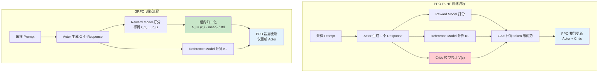

**关键差异总结**：

| 方面 | PPO | GRPO |
|------|-----|------|
| 优势估计来源 | Critic + GAE（token 级别） | 组内归一化（序列级别） |
| 需要的模型数 | 4（Actor, Critic, RM, Ref） | 3（Actor, RM, Ref） |
| 显存占用 | 高（需要 Critic） | 低（省掉 Critic） |
| 推理开销 | 低（每个 prompt 1 次生成） | 高（每个 prompt G 次生成） |
| 优势估计偏差 | 取决于 Critic 准确度 | 无偏（组内相对比较） |
| 方差控制 | 通过 GAE 的 $\lambda$ 控制 | 取决于组大小 G |
| 最适用场景 | 通用 RLHF | 可验证奖励的场景（数学/代码） |

### 8.4 组大小 $G$ 的选择与权衡

组大小 $G$ 是 GRPO 最关键的超参数之一：

| G 值 | 优势 | 劣势 | 应用场景 |
|------|------|------|----------|
| 4-8 | 推理开销小 | 归一化统计量不稳定 | DeepSeek-V3（效率优先） |
| 16-32 | 平衡效率与稳定性 | — | 通用场景 |
| 64-128 | 归一化非常准确 | 推理开销大 | DeepSeekMath（精度优先） |

当 $G$ 较小时，$\text{mean}$ 和 $\text{std}$ 的估计可能不准确，导致优势估计波动较大。极端情况下，如果 $G=2$，则变成简单的"好 vs 差"的二元对比，信息量有限。

### 8.5 GRPO 在 DeepSeek-R1 中的应用

DeepSeek-R1 是 GRPO 最成功的应用案例。在 R1 的训练中，GRPO 被用于引导模型发展出推理能力：

**奖励设计**：
- **准确性奖励**：数学题验证答案正确性（$r = 1$ 或 $r = 0$）、代码题运行测试用例
- **格式奖励**：检查输出是否包含 `<think>...</think>` 标签（确保模型展示推理过程）

**关键发现**：在 R1-Zero 实验中，即使不提供任何 SFT 数据，仅靠 GRPO + 规则奖励，模型就自发涌现出了链式思维（CoT）、自我反思等推理行为。这表明 GRPO 的组内相对比较机制能有效引导模型探索有益的行为模式。

> 更详细的 GRPO 数学推导、KL 散度的方向选择分析，参见 [进阶文档](./advanced.md)。

---

## 9. Anthropic 的 RLHF 贡献

Anthropic 在 RLHF 领域有着奠基性的贡献。可以说，没有 Anthropic 研究团队的开创性工作，RLHF 不会成为今天 LLM 对齐的主流范式。

### 9.1 RLHF 奠基论文

2017 年，Paul Christiano 等人（后来成为 Anthropic 的核心成员）发表了 **"Deep Reinforcement Learning from Human Preferences"**，这篇论文首次系统性地提出了 RLHF 的完整框架：

1. 从人类反馈中学习奖励函数
2. 用学到的奖励函数训练 RL 策略

这一范式后来被 OpenAI（InstructGPT）和 Anthropic 自身（Claude）广泛采用。

### 9.2 Constitutional AI（CAI）

Constitutional AI 是 Anthropic 提出的核心对齐方法，用 **AI 反馈替代人类反馈**（RLAIF）。

**核心理念**：

| 方面 | RLHF | CAI (RLAIF) |
|------|------|-------------|
| 反馈来源 | 人类标注者 | AI + 宪法原则 |
| 扩展性 | 受限于标注成本 | 可大规模扩展 |
| 一致性 | 标注者之间差异大 | AI 反馈更一致 |
| 成本 | 高 | 低 |

**宪法原则的设计**：Anthropic 定义了一组原则（如"回答应该无害"、"回答应该诚实"），AI 根据这些原则自动评估和改进 response。

**Red Teaming + Revision 流程**：

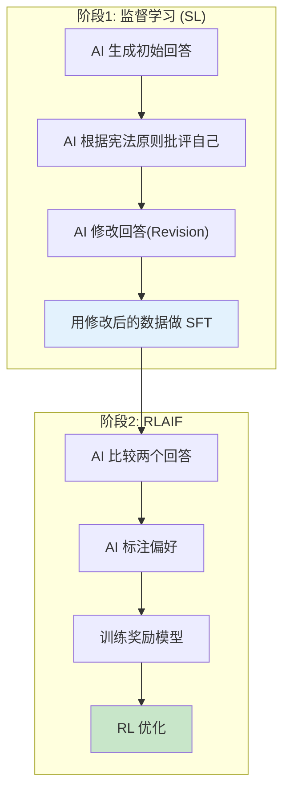

> CAI 的完整技术框架和数学细节，参见 [进阶文档](./advanced.md)。

### 9.3 HH-RLHF 数据集

Anthropic 发布的 **HH-RLHF（Helpful and Harmless RLHF）** 数据集是开源偏好数据的标杆：

- **数据规模**：约 17 万条多轮对话偏好对
- **标注维度**：有帮助性（Helpful）和无害性（Harmless）
- **数据格式**：(prompt, chosen_response, rejected_response)
- **影响力**：被学术界和工业界广泛使用作为 RLHF 基准数据

### 9.4 HHH 对齐目标

Anthropic 提出了 LLM 对齐的 **HHH 框架**：

- **Helpful（有帮助）**：回答用户的问题，提供有用的信息
- **Harmless（无害）**：不产生有害、危险或不当内容
- **Honest（诚实）**：不编造信息，不确定时承认不知道

RLHF 是实现 HHH 目标的核心技术手段。

---

## 10. RLHF 的工业实践

本节汇总三条技术线在 RLHF 工业化落地中的关键经验，聚焦于工程层面的实践洞察。

### 10.1 Google：多维度奖励模型与安全训练

Google 在 Gemini 系列中采用了**多维度奖励建模**的策略，而非使用单一标量奖励模型：

| 维度 | 对应的奖励模型 | 训练数据来源 | 权重调节 |
|------|--------------|------------|---------|
| Helpful（有帮助性） | $r_{\text{helpful}}(x, y)$ | 通用偏好标注 | 高权重 |
| Harmless（无害性） | $r_{\text{harmless}}(x, y)$ | 安全标注 + Red Teaming | 高权重（安全优先） |
| Honest（诚实性） | $r_{\text{honest}}(x, y)$ | 事实核查标注 | 中等权重 |
| Instruction Following | $r_{\text{follow}}(x, y)$ | 指令遵循评估 | 中等权重 |

**多维度奖励的融合策略**：

$$R_{\text{total}}(x, y) = \sum_{m=1}^{M} w_m \cdot r_m(x, y) \quad \text{subject to} \quad r_{\text{harmless}}(x, y) \geq \tau_{\text{safety}}$$

即在满足安全性硬约束的前提下，加权优化多个目标。当安全性奖励低于阈值 $\tau_{\text{safety}}$ 时，直接将总奖励设为强烈负值，确保模型不会为了"有帮助"而产生有害内容。

### 10.2 DeepSeek-R1 的完整训练流水线

DeepSeek-R1 展示了 RLHF/GRPO 从"对齐工具"扩展为"能力增强工具"的完整技术路线：

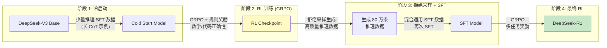

**关键技术细节**：
- **阶段 1 的冷启动数据**：仅需数千条高质量长 CoT 示例，用于建立基本的推理格式
- **阶段 2 的奖励设计**：只用规则奖励（准确性 + 格式），不使用神经网络奖励模型
- **阶段 3 的拒绝采样**：对每个 prompt 生成多个回答，只保留正确且推理过程清晰的结果
- **阶段 4 的多任务奖励**：在推理能力基础上，加入通用对齐目标

### 10.3 奖励模型的 Scaling

一个重要但容易被忽视的问题：**奖励模型是否也遵循 Scaling Laws？**

目前的经验证据表明：
- 奖励模型的准确率随参数量增大而提升，但提升幅度不如基座模型显著
- **奖励模型与策略模型的规模匹配很重要**：如果策略模型远大于奖励模型，策略更容易"欺骗"奖励模型（reward hacking）
- InstructGPT 的经验：6B 奖励模型 + 175B 策略模型 → 容易 reward hack；175B 奖励模型 + 175B 策略模型 → 更稳定

**推荐实践**：奖励模型的参数量应不小于策略模型的 $\frac{1}{4}$，且使用与策略模型相同的预训练基座初始化。

### 10.4 过程奖励 vs 结果奖励

| 方面 | ORM (Outcome Reward Model) | PRM (Process Reward Model) |
|------|---------------------------|---------------------------|
| 奖励粒度 | 序列末尾给一个分数 | 每个推理步骤给一个分数 |
| 信号密度 | 稀疏 | 密集 |
| 信用分配 | 困难（需要 GAE 等方法） | 自然（每步有奖励） |
| 标注成本 | 低（只需判断最终答案） | 高（需要逐步评估推理过程） |
| 适用场景 | 通用对齐 | 推理任务（数学、代码、逻辑） |
| 代表工作 | InstructGPT | OpenAI "Let's Verify Step by Step" |

**PRM 在 RLHF 中的集成**：当使用 PRM 时，token 级奖励变为：

$$r_t = \begin{cases} r_k^{\text{PRM}} & \text{若 token } t \text{ 是推理步骤 } k \text{ 的最后一个 token} \\ 0 & \text{其他位置} \end{cases}$$

这样 GAE 可以利用更密集的奖励信号，显著减少方差，使训练更加稳定。

> PRM 与 GRPO 的结合是一个有趣的研究方向：GRPO 使用序列级奖励，而 PRM 提供步骤级奖励。能否设计一种"步骤级 GRPO"，在每个推理步骤进行组内比较？这是尚未被充分探索的开放问题。

---

## 11. 项目实践

### 项目 1：训练一个文本情感奖励模型 (⭐⭐)

**目标**：理解 Bradley-Terry 偏好模型和奖励模型训练流程。

**提供**：数据集构建代码 + 训练框架 + 评估方法

**核心思路**：

1. 使用合成偏好数据（正面评论 vs 负面评论）构建训练集
2. 实现 Bradley-Terry 损失函数
3. 训练奖励模型，使其能区分文本质量
4. 评估奖励模型的准确率和校准度

**关键代码片段**：

```python
# 奖励模型前向传播
chosen_reward = reward_model(chosen_ids, chosen_mask)  # [B]
rejected_reward = reward_model(rejected_ids, rejected_mask)  # [B]

# Bradley-Terry 损失
loss = -F.logsigmoid(chosen_reward - rejected_reward).mean()

# 准确率
accuracy = (chosen_reward > rejected_reward).float().mean()
```

**实验设计**：

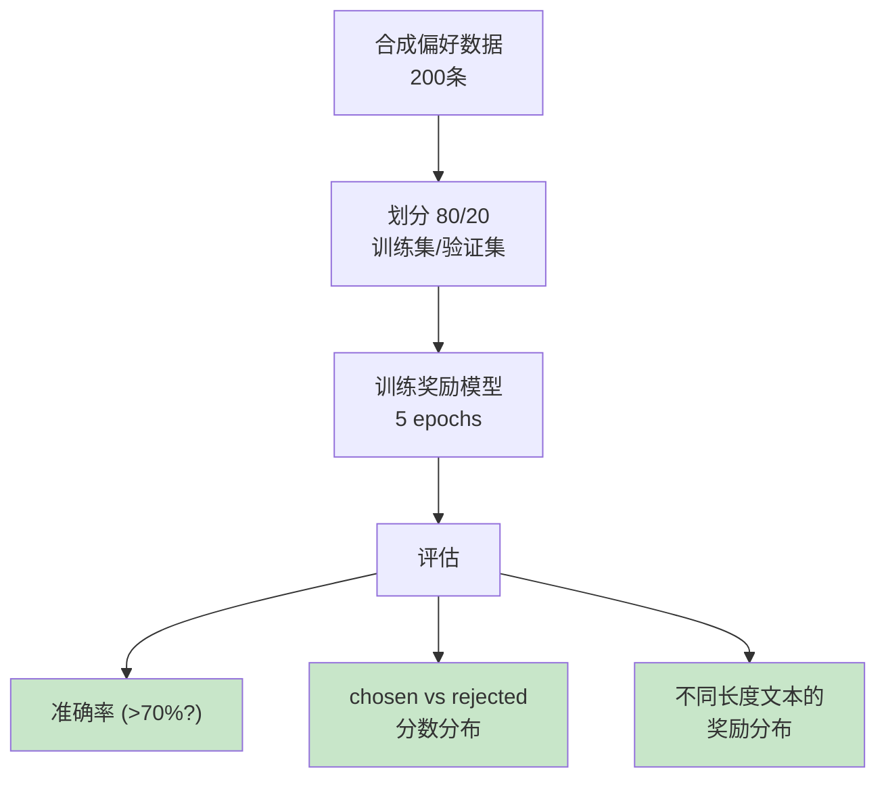

**参考代码**：[code/rlhf/reward_model.py](../code/rlhf/reward_model.py) 和 [code/rlhf/preference_dataset.py](../code/rlhf/preference_dataset.py)

---

### 项目 2：实现简化版 PPO 训练循环 (⭐⭐⭐)

**目标**：理解 PPO 在 RLHF 中的完整工作机制。

**提供**：算法伪代码 + 核心代码片段 + 调试建议

**算法伪代码**：

```
PPO-RLHF 训练循环:
    初始化: actor (从 SFT 加载), critic, reward_model (冻结), ref_model (冻结)
    初始化: kl_coef = 0.1, kl_target = 6.0

    for iteration = 1, 2, ..., N:
        // Rollout 阶段
        prompts = sample_prompts(dataset)
        responses, old_log_probs = actor.generate(prompts)
        rm_rewards = reward_model(prompts, responses)
        ref_log_probs = ref_model.log_probs(prompts, responses)
        values = critic(prompts, responses)

        // 计算 token 级奖励
        kl_penalty = -kl_coef * (old_log_probs - ref_log_probs)
        token_rewards = kl_penalty
        token_rewards[-1] += rm_rewards  // 末尾加上 RM 分数

        // GAE 计算
        advantages, returns = compute_gae(token_rewards, values)
        advantages = whiten(advantages)

        // PPO 更新 (K 个 epoch)
        for epoch = 1, ..., K:
            new_log_probs = actor.log_probs(prompts, responses)
            new_values = critic(prompts, responses)

            ratio = exp(new_log_probs - old_log_probs)
            surr1 = ratio * advantages
            surr2 = clip(ratio, 1-eps, 1+eps) * advantages
            policy_loss = -min(surr1, surr2).mean()

            value_loss = 0.5 * (new_values - returns)^2.mean()
            entropy_loss = -entropy(actor_logits).mean()

            loss = policy_loss + 0.5 * value_loss + 0.01 * entropy_loss
            loss.backward()
            clip_grad_norm(max_norm=1.0)
            optimizer.step()

        // 自适应 KL 控制
        kl_mean = mean(old_log_probs - ref_log_probs)
        update_kl_coef(kl_mean, kl_target)
```

**核心实现提示**：

1. Rollout 阶段用 `torch.no_grad()` 避免不必要的梯度计算
2. `old_log_probs` 必须在 PPO 更新前 `.detach()`
3. GAE 从后往前递推，注意边界条件
4. 监控 clip_fraction，理想值在 0.1-0.2

**调试建议**：

| 问题 | 可能原因 | 解决方案 |
|------|---------|---------|
| 奖励持续下降 | KL 惩罚太大 | 降低 beta 或 kl_target |
| 策略坍缩 | 探索不足 | 增大 entropy_coef |
| 价值损失很大 | Critic 太弱 | 增大 critic_lr 或增加 Critic 容量 |
| clip_fraction > 0.3 | 更新步长太大 | 降低 actor_lr |

**参考代码**：[code/rlhf/ppo_trainer.py](../code/rlhf/ppo_trainer.py) 和 [code/rlhf/rollout.py](../code/rlhf/rollout.py)

---

### 项目 3：分析 KL 惩罚系数对训练的影响 (⭐⭐)

**目标**：深入理解 RLHF 中 KL 惩罚的作用和超参数敏感性。

**提供**：实验设计 + 分析框架

**实验设计**：

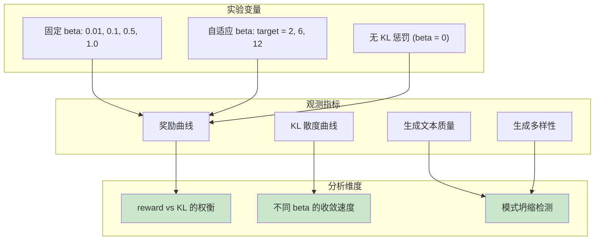

**关键分析代码片段**：

```python
# 不同 KL 系数的对比实验
betas = [0.0, 0.01, 0.1, 0.5, 1.0]
results = {}

for beta in betas:
    controller = FixedKLController(kl_coef=beta)
    # ... 运行训练循环 ...
    results[beta] = {
        "rewards": reward_history,
        "kl_values": kl_history,
        "beta_values": beta_history,
    }

# 绘制 reward vs KL 的帕累托前沿
for beta, data in results.items():
    plt.scatter(data["kl_values"][-1], data["rewards"][-1], label=f"beta={beta}")
plt.xlabel("KL Divergence")
plt.ylabel("Reward")
plt.title("Reward-KL Pareto Front")
```

**预期结论**：

1. $\beta = 0$：奖励最高，但 KL 散度失控，可能出现 reward hacking
2. $\beta$ 过大：KL 几乎为 0，但奖励也几乎没有提升
3. 最优 $\beta$：在奖励和 KL 之间取得帕累托最优

**参考代码**：[code/rlhf/kl_controller.py](../code/rlhf/kl_controller.py) 和 [code/rlhf/utils.py](../code/rlhf/utils.py)

---

### 项目 4：实现一个简化版 Constitutional AI 流程 (⭐⭐⭐)

**目标**：理解 Anthropic 的 Constitutional AI（RLAIF）方法。

**提供**：流程设计 + 伪代码 + 宪法原则示例

**CAI 流程伪代码**：

```
Constitutional AI 流程:

阶段 1: 监督学习 (Critique-Revision-SFT)
    for prompt in harmful_prompts:
        // Step 1: 生成初始回答（可能有害）
        initial_response = model.generate(prompt)

        // Step 2: AI 自我批评
        for principle in constitution:
            critique = model.generate(
                f"根据原则'{principle}'，评估以下回答：{initial_response}"
            )

        // Step 3: AI 自我修改
        revised_response = model.generate(
            f"根据上述批评，修改回答使其符合原则：{initial_response}\n批评：{critique}"
        )

        // 收集 (prompt, revised_response) 作为 SFT 数据
        sft_data.append((prompt, revised_response))

    // Step 4: 用修改后的数据训练 SFT
    model = sft(model, sft_data)

阶段 2: RLAIF (AI 标注偏好 + RL)
    for prompt in prompts:
        response_a = model.generate(prompt)
        response_b = model.generate(prompt)

        // AI 根据宪法原则选择更好的回答
        preference = model.generate(
            f"根据原则'{principle}'，以下哪个回答更好？\nA: {response_a}\nB: {response_b}"
        )

        preference_data.append((prompt, chosen, rejected))

    reward_model = train_reward_model(preference_data)
    model = rl_optimize(model, reward_model)
```

**宪法原则示例**：

| 编号 | 原则 | 说明 |
|------|------|------|
| 1 | 请选择最有帮助、最准确、最无害的回答 | 综合评估 |
| 2 | 请选择不鼓励非法、不道德或有害行为的回答 | 安全性 |
| 3 | 请选择最诚实的回答，不确定时承认不知道 | 诚实性 |
| 4 | 请选择最不具有攻击性和侮辱性的回答 | 礼貌性 |
| 5 | 请选择对社会整体最有益的回答 | 社会影响 |

**设计思路**：

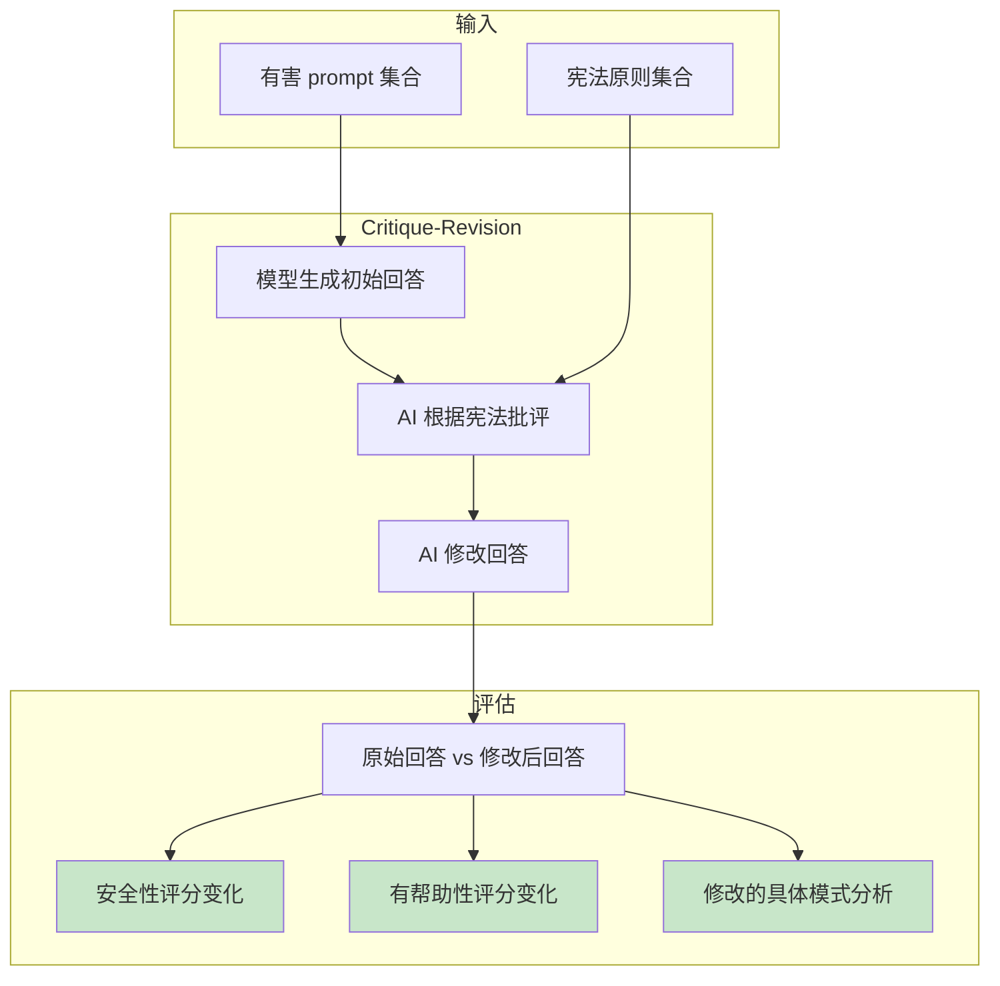

**实现提示**：

1. 可以用 API 调用 LLM 来模拟 critique-revision 过程
2. 重点关注宪法原则的设计——不同原则会产生不同的行为变化
3. 分析 revision 前后文本的具体差异，理解 CAI 的去毒机制
4. 注意 RLAIF 阶段中 AI 标注的偏好数据质量

---

### 项目 5：GRPO 简化实现与对比实验 (⭐⭐)

**目标**：实现简化版 GRPO 算法，并在简单任务上与 PPO 进行对比，理解两种方法的核心差异。

**提供**：算法伪代码 + 核心代码片段 + 实验设计

**GRPO 算法伪代码**：

```
GRPO 训练循环:
    初始化: actor (从 SFT 加载), reward_fn (规则奖励或奖励模型), ref_model (冻结)
    超参数: G (组大小), epsilon (裁剪系数), beta (KL 系数), lr

    for iteration = 1, 2, ..., N:
        // Step 1: 组采样
        prompts = sample_prompts(dataset, batch_size=B)
        for each prompt q in prompts:
            responses = [actor.generate(q) for _ in range(G)]  // 采样 G 个回答
            rewards = [reward_fn(q, r) for r in responses]     // 评估每个回答

        // Step 2: 组内归一化
        for each prompt group:
            mean_r = mean(rewards)
            std_r = std(rewards) + 1e-8
            advantages = [(r - mean_r) / std_r for r in rewards]

        // Step 3: 计算旧策略的 log_probs
        old_log_probs = actor.log_probs(prompts, all_responses).detach()
        ref_log_probs = ref_model.log_probs(prompts, all_responses)

        // Step 4: PPO 风格的裁剪更新
        for epoch = 1, ..., K:
            new_log_probs = actor.log_probs(prompts, all_responses)

            // token 级别的比率和裁剪
            ratio = exp(new_log_probs - old_log_probs)
            surr1 = ratio * advantages  // advantages 是序列级的，广播到每个 token
            surr2 = clip(ratio, 1-eps, 1+eps) * advantages
            policy_loss = -min(surr1, surr2).mean()

            // KL 惩罚
            kl = mean(new_log_probs - ref_log_probs)
            loss = policy_loss + beta * kl

            loss.backward()
            clip_grad_norm(max_norm=1.0)
            optimizer.step()
```

**核心代码片段**：

```python
def grpo_advantage(rewards: list[float]) -> list[float]:
    """GRPO 组内归一化优势计算"""
    mean_r = sum(rewards) / len(rewards)
    std_r = (sum((r - mean_r) ** 2 for r in rewards) / len(rewards)) ** 0.5
    std_r = max(std_r, 1e-8)  # 避免除零
    return [(r - mean_r) / std_r for r in rewards]

# 示例: 一个 prompt 采样 8 个回答的奖励
rewards = [0.8, 0.2, 0.6, 0.9, 0.1, 0.5, 0.7, 0.3]
advantages = grpo_advantage(rewards)
# 高奖励的回答获得正优势，低奖励的获得负优势
```

**实验设计**：

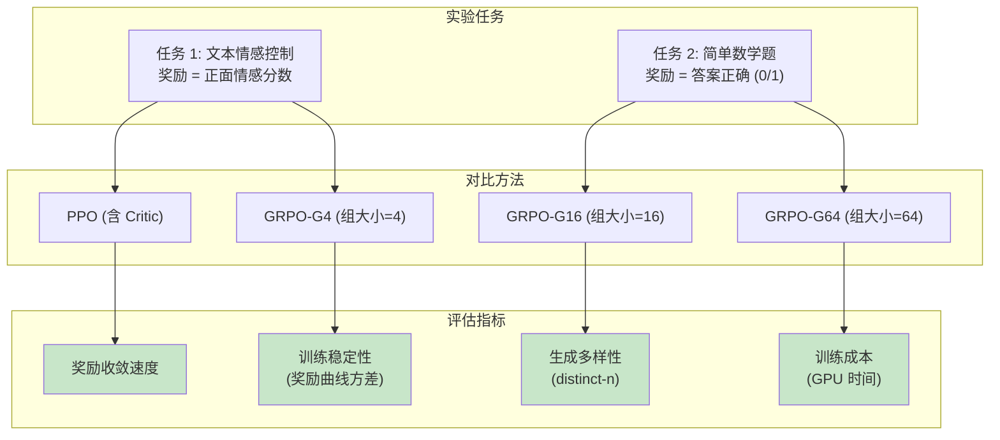

**思考问题**：
1. 在什么条件下 GRPO 优于 PPO？（提示：考虑奖励函数是否可验证）
2. 增大组大小 $G$ 在什么时候回报递减？
3. 对于开放式生成任务（如创意写作），GRPO 的组内归一化是否合适？为什么？
4. 如果组内所有回答的奖励都非常接近（std 接近 0），GRPO 会遇到什么问题？

**参考代码**：本项目可复用 [code/rlhf/ppo_trainer.py](../code/rlhf/ppo_trainer.py) 中的基础设施，将 Critic + GAE 部分替换为 GRPO 的组内归一化逻辑。

---

## 12. 章节衔接：从 RLHF 到 DPO

### RLHF 的核心价值

回顾本章的内容，RLHF 体系有三个核心贡献：

1. **偏好建模**：Bradley-Terry 模型将主观的人类偏好转化为可优化的数学目标
2. **策略优化**：PPO/GRPO 在保持生成质量的同时，有效地优化了偏好目标
3. **安全对齐**：通过奖励模型设计和 KL 约束，实现了 HHH（有帮助、无害、诚实）多目标平衡

RLHF 的成功——从 InstructGPT 到 ChatGPT，从 Claude 到 Gemini——证明了基于人类反馈的对齐是可行且有效的。

### RLHF 的核心局限

然而，RLHF 也有显著的局限性：

| 局限 | 具体表现 | 影响 |
|------|---------|------|
| **工程复杂度高** | 需要同时管理 4 个模型（PPO）或 3 个模型（GRPO） | 开发和调试成本高 |
| **训练不稳定** | PPO 对超参数极度敏感，reward hacking 难以根治 | 需要大量调参经验 |
| **奖励模型偏差** | 奖励模型是人类偏好的不完美代理 | Goodhart's Law 无法完全避免 |
| **标注成本高** | 需要大量高质量的人类偏好标注 | 数据获取成本高 |
| **采样效率低** | 需要在线生成大量 response | 训练速度慢 |

### 过渡到 DPO

这些局限催生了一个自然的问题：**能否绕过奖励模型和 RL 训练，直接从偏好数据中优化策略？**

2023 年，Rafailov 等人在 DPO（Direct Preference Optimization）论文中给出了肯定的回答。他们证明了 RLHF 的优化目标存在闭式最优解：

$$\pi^*(y|x) = \frac{1}{Z(x)} \pi_{\text{ref}}(y|x) \exp\left(\frac{1}{\beta} r(x, y)\right)$$

由此可以反推出隐式奖励：

$$r(x, y) = \beta \log \frac{\pi^*(y|x)}{\pi_{\text{ref}}(y|x)} + \beta \log Z(x)$$

将此代入 Bradley-Terry 模型，配分函数 $Z(x)$ 在偏好对的差值中被消去，从而得到了 **DPO 损失函数**——一个无需奖励模型、无需 RL 训练、仅需偏好数据的简单目标函数。

> **下一模块**将完整推导 DPO 的数学框架，并分析 DPO 及其变体（IPO、KTO、ORPO、SimPO、GRPO）的设计动机和适用场景。

---

> **参考文献**：
>
> - Christiano, P. et al. (2017). "Deep Reinforcement Learning from Human Preferences." NeurIPS.
> - Schulman, J. et al. (2017). "Proximal Policy Optimization Algorithms." arXiv:1707.06347.
> - Schulman, J. et al. (2015). "High-Dimensional Continuous Control Using Generalized Advantage Estimation." ICLR.
> - Ouyang, L. et al. (2022). "Training language models to follow instructions with human feedback." NeurIPS (InstructGPT).
> - Bai, Y. et al. (2022). "Constitutional AI: Harmlessness from AI Feedback." arXiv:2212.08073.
> - Bai, Y. et al. (2022). "Training a Helpful and Harmless Assistant with RLHF." arXiv:2204.05862.
> - Rafailov, R. et al. (2023). "Direct Preference Optimization: Your Language Model is Secretly a Reward Model." NeurIPS.
> - DeepSeek-AI. (2024). "DeepSeek-V3 Technical Report."
> - DeepSeek-AI. (2025). "DeepSeek-R1: Incentivizing Reasoning Capability in LLMs via Reinforcement Learning."
> - Shao, Z. et al. (2024). "DeepSeekMath: Pushing the Limits of Mathematical Reasoning in Open Language Models."
> - Lightman, H. et al. (2023). "Let's Verify Step by Step." arXiv:2305.20050.
> - Gemini Team, Google. (2023). "Gemini: A Family of Highly Capable Multimodal Models."
