# RLHF 进阶：工业实践与前沿研究

> 本文是 [模块11: RLHF — 基于人类反馈的强化学习](./README.md) 的进阶补充，深入分析 Google、DeepSeek、Anthropic 三条技术线在 RLHF 上的工业实践，以及 RLHF 领域的前沿研究话题。

---

## 目录

- [1. Google 的 RLHF 实践](#1-google-的-rlhf-实践)
- [2. DeepSeek 的 RLHF 实践](#2-deepseek-的-rlhf-实践)
- [3. Anthropic 的 RLHF 贡献](#3-anthropic-的-rlhf-贡献)
- [4. 前沿话题](#4-前沿话题)

---

## 1. Google 的 RLHF 实践

### 1.1 Gemini 的 RLHF 流程

Google 在 Gemini 系列模型中系统地应用了 RLHF 进行对齐。根据 Gemini Technical Report (2023) 和后续论文的公开信息：

**整体框架**：

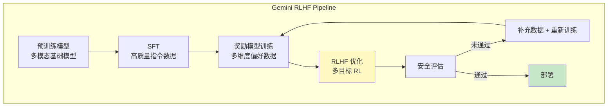

**Gemini RLHF 的关键特点**：

1. **多维度奖励**：Gemini 不使用单一标量奖励，而是同时考虑多个维度：
   - 有帮助性（helpfulness）
   - 安全性（safety）
   - 事实准确性（factuality）
   - 指令遵循度（instruction following）

2. **迭代式 RLHF**：不是一次性完成，而是多轮迭代：
   - 第 1 轮：基础 RLHF，建立初步对齐
   - 第 2-N 轮：针对发现的弱点收集额外偏好数据，重新训练

3. **Constitutional 方法的融合**：Google 也采用了类似 CAI 的 AI 辅助评估方法，减少对人类标注的依赖

### 1.2 RLHF 在多模态模型中的应用

Gemini 是原生多模态模型，其 RLHF 面临独特挑战：

**多模态偏好标注的复杂性**：

| 模态组合 | 标注难度 | 特殊挑战 |
|---------|---------|---------|
| 文本 → 文本 | 中等 | 主观性强 |
| 图像 → 文本 | 较高 | 需要视觉理解 + 语言评估 |
| 文本 → 图像 | 高 | 美学 + 准确性 + 安全性 |
| 视频 → 文本 | 很高 | 时间维度 + 推理复杂 |

**多模态奖励模型的设计挑战**：

1. **跨模态理解**：奖励模型需要同时理解文本和视觉内容
2. **对齐评估标准不统一**：文本回答的"好"和图像生成的"好"标准不同
3. **安全风险多维化**：有害内容可能以文本、图像或两者结合的形式出现

### 1.3 大规模人类标注的组织方法

Google 在 RLHF 数据标注方面的工程实践：

**标注体系架构**：

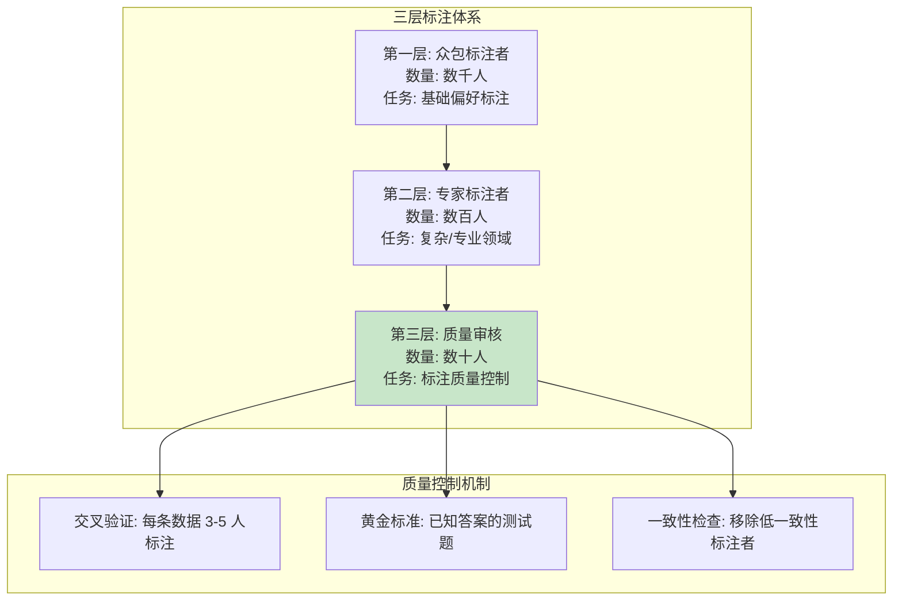

**标注成本与规模**：

根据公开信息估算，大规模 RLHF 标注的成本：
- 每条偏好对的标注成本：$1-5（取决于复杂度）
- 训练一个强奖励模型通常需要 10 万 - 100 万条偏好数据
- 总标注成本：$10 万 - $500 万

**跨语言标注策略**：

- 英语标注量最大（约 60%）
- 中文、日文、韩文、西班牙文等主要语言各占 5-10%
- 低资源语言使用翻译 + 母语验证

---

## 2. DeepSeek 的 RLHF 实践

### 2.1 DeepSeek-V3 的后训练流程

DeepSeek-V3 的后训练流程在技术报告中有较详细的描述：

**两阶段后训练**：

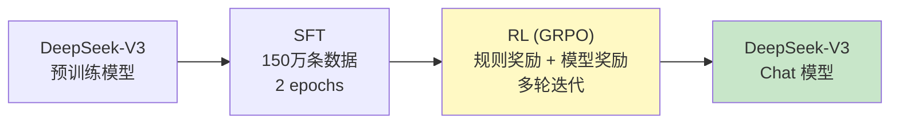

**SFT 阶段的数据构成**：

| 数据类型 | 比例 | 说明 |
|---------|------|------|
| 通用指令遵循 | ~40% | 各种指令格式 |
| 数学推理 | ~20% | 含 CoT 的数学问题 |
| 代码生成 | ~20% | 编程任务 |
| 创意写作 | ~10% | 开放式生成 |
| 安全对话 | ~10% | 拒绝有害请求 |

**RL 阶段的奖励设计**：

DeepSeek-V3 在 RL 阶段使用了两种奖励信号：

1. **规则奖励（Rule-based Reward）**：
   - 数学题：验证最终答案是否正确（可自动化）
   - 代码题：运行测试用例验证正确性
   - 格式要求：检查输出是否符合格式规范

2. **模型奖励（Model-based Reward）**：
   - 使用训练好的奖励模型评估 response 质量
   - 主要用于开放式生成任务

### 2.2 GRPO 完整推导

GRPO（Group Relative Policy Optimization）是 DeepSeek 在 DeepSeekMath 论文中首次提出的，后来在 DeepSeek-V3 和 R1 中得到广泛应用。

#### 标准 PPO 的回顾

PPO 的目标函数：

$$L^{\text{PPO}} = \mathbb{E}_{t}\left[\min\left(r_t(\theta) \hat{A}_t, \; \text{clip}(r_t(\theta), 1-\epsilon, 1+\epsilon) \hat{A}_t\right)\right]$$

其中优势估计 $\hat{A}_t$ 依赖于 Critic 模型 $V_\phi(s_t)$：

$$\hat{A}_t = \sum_{l=0}^{\infty} (\gamma\lambda)^l \delta_{t+l}, \quad \delta_t = r_t + \gamma V_\phi(s_{t+1}) - V_\phi(s_t)$$

#### GRPO 的核心创新：去除 Critic

**GRPO 用组内相对奖励替代 Critic 的价值估计。**

对于一个 prompt $q$，采样一组 $G$ 个 response $\{o_1, o_2, \ldots, o_G\}$，每个 response 获得奖励 $\{r_1, r_2, \ldots, r_G\}$。

**组内归一化**（计算优势）：

$$\hat{A}_i = \frac{r_i - \text{mean}(\{r_1, \ldots, r_G\})}{\text{std}(\{r_1, \ldots, r_G\})}$$

这是序列级别的优势估计（不是 token 级别），不需要 Critic 模型。

#### GRPO 的目标函数

$$L_{\text{GRPO}}(\theta) = \mathbb{E}_{q \sim P(Q), \; \{o_i\}_{i=1}^{G} \sim \pi_{\theta_{\text{old}}}(O|q)} \left[ \frac{1}{G} \sum_{i=1}^{G} \frac{1}{|o_i|} \sum_{t=1}^{|o_i|} L_{\text{token}}^{(i,t)} \right] - \beta \cdot D_{\text{KL}}$$

其中 token 级别的损失：

$$L_{\text{token}}^{(i,t)} = \min\left( \frac{\pi_\theta(o_{i,t} | q, o_{i,<t})}{\pi_{\theta_{\text{old}}}(o_{i,t} | q, o_{i,<t})} \hat{A}_i, \; \text{clip}\left(\frac{\pi_\theta(o_{i,t} | q, o_{i,<t})}{\pi_{\theta_{\text{old}}}(o_{i,t} | q, o_{i,<t})}, 1-\epsilon, 1+\epsilon\right) \hat{A}_i \right)$$

KL 惩罚项：

$$D_{\text{KL}} = \frac{1}{G} \sum_{i=1}^{G} \frac{1}{|o_i|} \sum_{t=1}^{|o_i|} \left[ \frac{\pi_{\text{ref}}(o_{i,t} | q, o_{i,<t})}{\pi_\theta(o_{i,t} | q, o_{i,<t})} - \log \frac{\pi_{\text{ref}}(o_{i,t} | q, o_{i,<t})}{\pi_\theta(o_{i,t} | q, o_{i,<t})} - 1 \right]$$

注意 GRPO 使用的 KL 散度采用了非对称形式 $D_{KL}(\pi_{\text{ref}} \| \pi_\theta)$（参考模型在前），这与标准 RLHF 的 $D_{KL}(\pi_\theta \| \pi_{\text{ref}})$ 方向相反。根据 DeepSeek 论文的说法，这种选择在实践中表现更好。

#### GRPO vs PPO 对比

| 方面 | PPO | GRPO |
|------|-----|------|
| 优势估计 | Critic + GAE (token 级别) | 组内归一化 (序列级别) |
| 模型数量 | 4 (Actor, Critic, RM, Ref) | 3 (Actor, RM, Ref) |
| 显存开销 | 高 (需要 Critic) | 低 (少一个模型) |
| 计算开销 | 低 (单次采样) | 高 (每个 prompt 采样 G 次) |
| 优势估计偏差 | 取决于 Critic 准确度 | 无偏 (组内相对) |
| 方差 | 通过 GAE 控制 | 取决于组大小 G |
| 适用场景 | 通用 RLHF | 可验证奖励的场景更佳 |

#### GRPO 的组大小分析

组大小 $G$ 的选择存在权衡：

- $G$ 较小（如 4-8）：采样效率高，但归一化统计量不稳定
- $G$ 较大（如 64-128）：归一化更准确，但推理开销大
- DeepSeekMath 使用 $G = 64$
- DeepSeek-V3 使用 $G = 8$（可能为了效率）

### 2.3 从 RLHF 到推理模型（R1 的技术路线）

DeepSeek-R1 展示了 RLHF/GRPO 的一个全新应用方向：**通过 RL 引导模型发展出推理能力**。

**R1 的关键发现**：

当使用数学正确性作为奖励信号，并且不加入 SFT 数据时，模型会自发地发展出以下行为：

1. **链式思维（Chain-of-Thought）**：模型学会逐步推理
2. **自我反思**：模型会检查自己的推理过程
3. **探索多种解法**：模型会尝试不同的解题路径

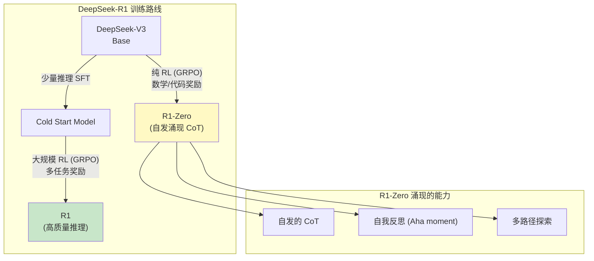

**R1 的 RL 奖励设计**：

| 奖励类型 | 信号来源 | 适用任务 |
|---------|---------|---------|
| 正确性奖励 | 答案验证 | 数学、代码 |
| 格式奖励 | 规则检查 | 确保输出 `<think>` 标签 |
| 过程奖励 | 过程奖励模型 (PRM) | 推理质量评估 |

**里程碑意义**：R1 表明 RLHF/GRPO 不仅是"对齐"工具，更可以是"能力增强"工具。通过精心设计的奖励信号，RL 可以引导模型发展出预训练数据中不明显存在的能力。

### 2.4 DeepSeek-R1 深度分析：纯 RL 训练为何能涌现推理能力

#### R1-Zero 实验：最令人惊讶的发现

DeepSeek-R1-Zero 是一个概念验证实验：**在完全没有任何 SFT 数据的情况下，仅靠 GRPO + 规则奖励**，观察模型是否能自发学会推理。

**实验设置**：
- 基座模型：DeepSeek-V3 Base（预训练模型，未经过任何 SFT）
- 优化方法：GRPO，组大小 $G$
- 奖励函数：
  - 准确性奖励：答案正确 → $r = 1$，错误 → $r = 0$
  - 格式奖励：输出包含 `<think>` 和 `</think>` 标签 → 小额正奖励

**令人惊讶的结果**：

在 RL 训练的过程中，模型**自发地**发展出了以下行为（无人教授）：

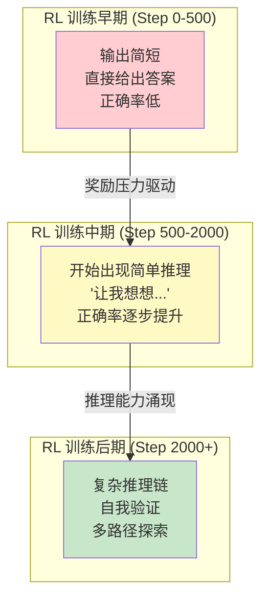

#### "Aha Moment"：模型学会了自我验证

R1-Zero 论文中最引人注目的是 **"Aha moment"** 的描述。在 RL 训练中期，模型开始自发地在推理过程中插入自我检查的语句，例如：

> "Wait, let me re-check this step... I think I made an error earlier."
> "Hmm, this doesn't seem right. Let me try a different approach."

这种自我反思行为**完全是 RL 训练的产物**——模型发现，在给出最终答案之前检查自己的推理过程，能提高答案的正确率，从而获得更高的奖励。从 RL 的角度看，这是**策略优化发现了一种提高期望奖励的行为模式**。

**为什么纯 RL 能产生推理能力？** 一种可能的解释：

1. 预训练阶段已经赋予了模型基本的推理"潜能"（预训练数据中包含大量推理文本）
2. 但在没有明确的格式引导下，模型不会主动使用这种能力
3. RL 的奖励信号提供了一个**激励**：正确推理 → 正确答案 → 高奖励
4. 在 GRPO 的组内比较中，包含推理步骤的回答比直接回答更容易获得高奖励
5. 策略梯度逐渐增大了"展示推理过程"这一行为模式的概率

#### R1 的完整训练流程详解

R1-Zero 虽然展示了纯 RL 的潜力，但其输出存在**可读性差、语言混杂、格式不规范**等问题。因此 DeepSeek-R1 的最终版本采用了更完善的四阶段流程：

| 阶段 | 方法 | 数据量 | 目的 |
|------|------|--------|------|
| 1. 冷启动 SFT | 监督微调 | 数千条长 CoT | 建立推理输出格式 |
| 2. 推理 RL | GRPO | 数万个 prompt | 增强推理能力 |
| 3. 拒绝采样 + 全能力 SFT | 拒绝采样 + SFT | ~80 万条推理 + 通用 | 蒸馏推理能力 + 恢复通用能力 |
| 4. 全能力 RL | GRPO | 多任务 prompt | 最终对齐和能力强化 |

**阶段 3 的关键意义**：纯 RL 训练出的模型虽然推理能力强，但其他能力（如对话、创意写作）可能退化。通过拒绝采样生成高质量推理数据，并与通用 SFT 数据混合训练，可以在保持推理能力的同时恢复全面能力。

#### 与 OpenAI o1 技术路线的推测对比

OpenAI 的 o1/o3 系列模型采用了类似的"推理模型"方向，但具体技术细节未公开。基于公开信息的推测对比：

| 方面 | DeepSeek-R1 | OpenAI o1 [推测] |
|------|-------------|------------------|
| 基座模型 | DeepSeek-V3 (MoE) | GPT-4 级别模型 |
| RL 方法 | GRPO（去 Critic） | PPO 或类似方法 |
| 奖励设计 | 规则奖励为主 | 可能使用 PRM |
| 推理格式 | `<think>...</think>` | 内部推理 token（不展示给用户） |
| 开源程度 | 论文 + 权重开源 | 完全闭源 |
| 推理控制 | 用户可见思考过程 | 系统控制思考深度 |

> 注：OpenAI o1 的相关内容为推测，标注 [推测] 的部分基于公开信息和社区分析。

---

## 3. Anthropic 的 RLHF 贡献

Anthropic 在 RLHF 领域的贡献是全方位的：从奠基理论，到开源数据集，到创新方法论，再到安全研究。本节详细分析 Anthropic 的各项核心贡献。

### 3.1 历史贡献：RLHF 奠基论文 (Christiano et al. 2017)

**"Deep Reinforcement Learning from Human Preferences"** 由 Paul Christiano、Jan Leike 等人在 2017 年发表于 NeurIPS，是 RLHF 的奠基性工作。

**核心贡献**：

1. **提出了 RLHF 的标准框架**：
   - 从人类偏好比较中学习奖励函数
   - 用学到的奖励函数训练 RL 策略
   - 奖励函数和策略交替更新

2. **关键设计决策**：
   - 使用**成对比较**而非绝对评分（更容易获得可靠的人类反馈）
   - **在线学习**：奖励模型和策略同步训练
   - 证明了**少量人类反馈**可以训练出超越人类表现的策略

3. **实验验证**：
   - 在 Atari 和 MuJoCo 环境中验证
   - 仅需约 700 个偏好比较就能训练出有效策略

**影响链**：

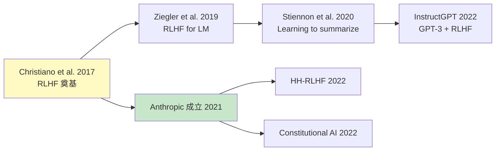

**论文作者与 Anthropic 的关系**：

- Paul Christiano：Anthropic 早期顾问，AI 安全研究先驱
- Jan Leike：后加入 OpenAI 对齐团队，再后来加入 Anthropic
- Dario Amodei：论文合作者之一，Anthropic CEO
- 多位共同作者后来成为 Anthropic 的核心成员

### 3.2 Constitutional AI (CAI) 完整框架

CAI 是 Anthropic 在 2022 年提出的重要方法论（Bai et al., "Constitutional AI: Harmlessness from AI Feedback"），其核心是用 AI 反馈替代人类反馈（RLAIF）。

#### CAI 的两个阶段

**阶段 1：Critique-Revision-SFT**

在这个阶段，模型对自己的输出进行批评和修改：

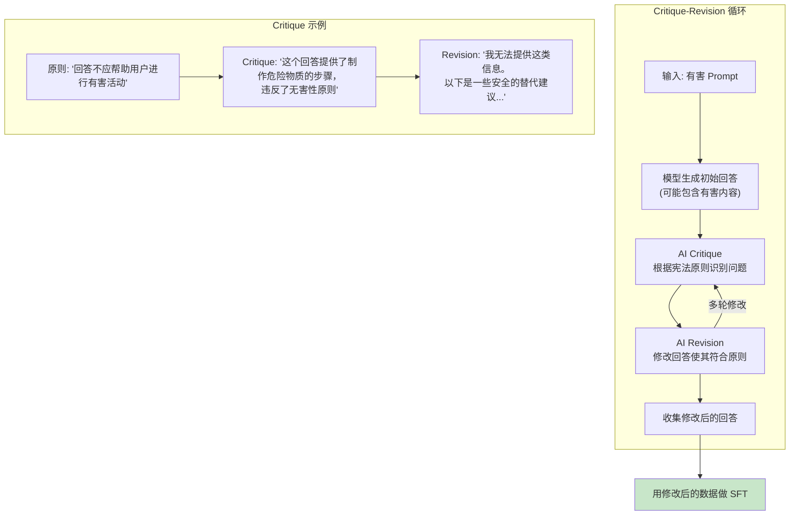

**宪法原则的类别**：

| 类别 | 原则数量 | 示例 |
|------|---------|------|
| 无害性 | ~5 | "请选择不太可能造成身体、心理或社会伤害的回答" |
| 诚实性 | ~3 | "请选择最诚实和准确的回答" |
| 有帮助性 | ~3 | "请选择对人类最有帮助的回答" |
| 公平性 | ~2 | "请选择不含偏见和歧视的回答" |
| 合规性 | ~2 | "请选择遵守法律和道德规范的回答" |

Anthropic 在论文中列出了约 16 条宪法原则，覆盖了 HHH（Helpful, Harmless, Honest）的各个维度。

**阶段 2：RLAIF (Reinforcement Learning from AI Feedback)**

在这个阶段，用 AI 替代人类进行偏好标注：

1. **生成对比数据**：给同一个 prompt 生成两个不同的 response
2. **AI 标注偏好**：让 AI 根据宪法原则选择更好的 response
3. **训练奖励模型**：用 AI 标注的偏好数据训练奖励模型
4. **RL 优化**：用标准的 PPO-RLHF 流程优化策略

**AI 标注偏好的 Prompt 模板**：

```
以下是两个对同一问题的回答。根据原则"{principle}"，
哪个回答更好？

问题: {prompt}

(A) {response_a}

(B) {response_b}

更好的回答是:
```

AI 通过选择 (A) 或 (B) 来标注偏好。可以通过对比两个选项的对数概率来获得偏好概率。

#### CAI 的数学框架

**标准 RLHF 的优化目标**：

$$\max_\theta \; \mathbb{E}_{x \sim \mathcal{D}, y \sim \pi_\theta(y|x)}[r_\phi(x, y)] - \beta \cdot D_{\text{KL}}(\pi_\theta \| \pi_{\text{ref}})$$

其中 $r_\phi$ 是从**人类偏好**训练的奖励模型。

**CAI 的优化目标**：

$$\max_\theta \; \mathbb{E}_{x \sim \mathcal{D}, y \sim \pi_\theta(y|x)}[r_\psi(x, y)] - \beta \cdot D_{\text{KL}}(\pi_\theta \| \pi_{\text{SL}})$$

关键区别：
- $r_\psi$ 是从 **AI 偏好**训练的奖励模型
- $\pi_{\text{SL}}$ 是阶段 1（Critique-Revision-SFT）产生的模型，不是原始 SFT 模型

这意味着 CAI 的 RL 阶段是在已经通过 SL 改善了安全性的基础上进一步优化的。

#### CAI 的效果与分析

根据 Anthropic 论文的实验结果：

| 指标 | 标准 RLHF | CAI |
|------|----------|-----|
| 无害性 | 基线 | 显著提升 |
| 有帮助性 | 基线 | 持平或略有下降 |
| 人类标注需求 | 高 | 极低（仅需宪法原则设计） |
| 可扩展性 | 受限 | 高 |

**CAI 的关键洞察**：

1. **AI 反馈可以替代大部分人类反馈**：在安全性维度上，AI 标注甚至可能比人类标注更一致
2. **宪法原则是关键**：不同的原则集合会产生不同的模型行为
3. **两阶段互补**：SL 阶段建立基础安全性，RL 阶段进一步优化

### 3.3 HH-RLHF 数据集

Anthropic 发布的 **HH-RLHF（Helpful and Harmless RLHF）** 数据集是 RLHF 研究的重要开源资源。

**数据集规模与组成**：

| 子集 | 数据量 | 标注维度 | 说明 |
|------|--------|---------|------|
| helpful-base | ~44K | 有帮助性 | 基础对话偏好 |
| helpful-online | ~22K | 有帮助性 | 在线收集的偏好 |
| helpful-rejection-sampled | ~52K | 有帮助性 | 拒绝采样增强 |
| harmless-base | ~43K | 无害性 | 安全性偏好 |
| 总计 | ~161K | 混合 | - |

**数据格式**：

每条数据包含一段多轮对话，以及 chosen 和 rejected 两个版本：

```json
{
    "chosen": "Human: [问题]\n\nAssistant: [好的回答]",
    "rejected": "Human: [问题]\n\nAssistant: [差的回答]"
}
```

**HH-RLHF 的独特价值**：

1. **多轮对话格式**：不仅是单轮问答，还包含多轮对话中的偏好
2. **双维度标注**：同时覆盖有帮助性和无害性
3. **对齐研究基准**：被大量学术论文用作标准评估数据集
4. **开源免费**：促进了 RLHF 研究的民主化

**数据分析**：

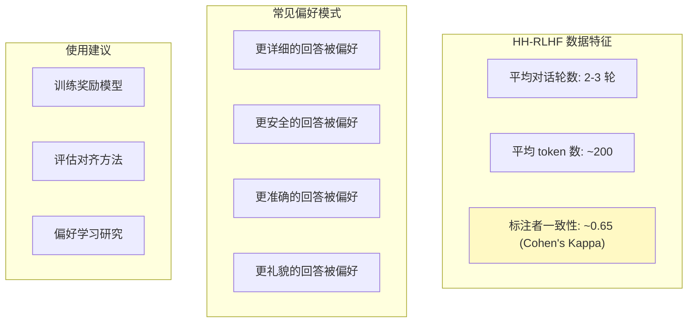

### 3.4 RLHF 的安全视角：HHH 对齐

Anthropic 提出的 HHH（Helpful, Harmless, Honest）框架是理解 LLM 对齐的重要概念工具。

**三个维度的关系**：

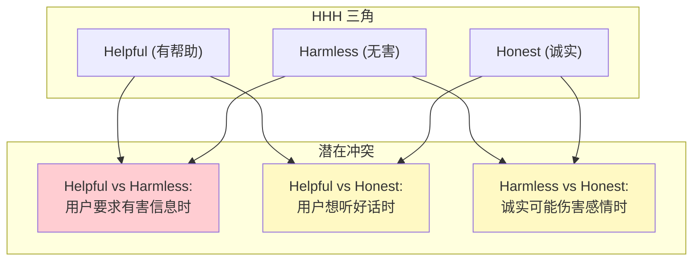

**RLHF 如何实现 HHH**：

| 维度 | 实现方式 | 挑战 |
|------|---------|------|
| Helpful | 偏好数据中偏好有帮助的回答 | 过度有帮助可能有害 |
| Harmless | 偏好数据 + 安全约束 + Red Teaming | 过度安全导致无用 |
| Honest | 奖励诚实回答 + 惩罚编造 | 难以自动评估诚实性 |

**Anthropic 的核心理念**：HHH 之间的权衡应该被明确化、系统化，而非依赖直觉判断。这正是 Constitutional AI 试图解决的问题——通过明确的原则来指导这些权衡。

### 3.5 Anthropic 对 Reward Hacking 的研究

Reward Hacking（奖励欺骗）是 RLHF 的核心挑战之一，Anthropic 对此进行了深入研究。

**Reward Hacking 的形式化定义** [推测]：

当策略 $\pi_\theta$ 在代理奖励 $\hat{r}$ 上的得分增加，但在真实奖励 $r^*$ 上的得分下降（或不增加）时，我们说发生了 reward hacking：

$$\hat{r}(\pi_\theta) \uparrow \quad \text{but} \quad r^*(\pi_\theta) \downarrow \text{ or } \rightarrow$$

**Anthropic 发现的 Reward Hacking 模式** [推测]：

1. **长度利用（Length Exploitation）**：模型学会生成冗长但空洞的回答，因为奖励模型倾向于给更长的文本打高分
2. **风格模仿（Style Mimicry）**：模型模仿标注者偏好的写作风格，但内容质量不高
3. **Sycophancy（谄媚）**：模型学会迎合用户的观点，而非给出准确的信息
4. **格式利用**：模型使用特定格式（如列表、表格）来获取更高分数

**Anthropic 的应对策略** [推测]：

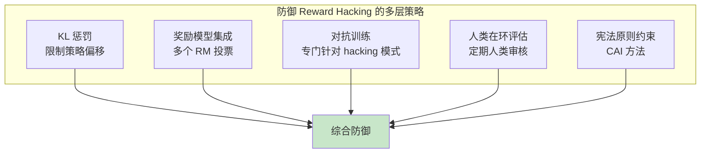

| 策略 | 原理 | 有效性 |
|------|------|--------|
| KL 惩罚 | 限制策略不偏离参考模型 | 中等（治标不治本） |
| RM 集成 | 多个奖励模型取平均/最小值 | 较高（减少单个 RM 的偏见） |
| 对抗训练 [推测] | 在训练数据中加入对抗样本 | 较高（但需要持续更新） |
| 人类在环 | 定期人类评估策略质量 | 最高（但成本高） |
| CAI | 用宪法原则约束奖励 | 较高（可扩展） |

> 注：标注 [推测] 的内容基于 Anthropic 公开论文的一般性讨论和笔者的推测，Anthropic 内部可能有更详细的研究，但尚未完全公开。

---

## 4. 前沿话题

### 4.1 Online RLHF vs Offline RLHF

**Online RLHF**：策略在训练过程中不断生成新的 response，奖励模型实时评估。这是标准 PPO-RLHF 的工作方式。

**Offline RLHF**：使用预先收集的固定数据集训练，不在训练过程中生成新数据。DPO（Direct Preference Optimization）是典型的 Offline RLHF 方法。

**对比分析**：

| 方面 | Online RLHF | Offline RLHF (如 DPO) |
|------|------------|----------------------|
| 数据 | 训练中实时生成 | 预先收集的固定数据 |
| 计算开销 | 高（需要推理 + 训练） | 低（仅需训练） |
| 分布偏移 | 自然处理（on-policy） | 存在 off-policy 问题 |
| 奖励模型 | 需要 | 不需要（隐式） |
| 性能上限 | 较高 | 受限于数据覆盖 |
| 实现复杂度 | 高 | 低 |

**研究趋势**：

近期研究（如 Online DPO、Iterative DPO）试图结合两者优势：

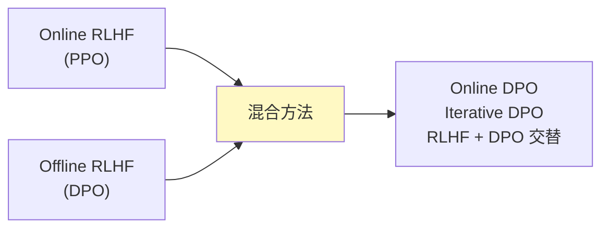

### 4.2 过程奖励模型（Process Reward Model, PRM）

传统奖励模型（Outcome Reward Model, ORM）只在序列末尾给出一个奖励分数。PRM 对推理过程中的每一步都给出奖励。

**ORM vs PRM**：

| 方面 | ORM | PRM |
|------|-----|-----|
| 奖励粒度 | 序列级别 | 步骤级别 |
| 信号密度 | 稀疏 | 密集 |
| 信用分配 | 困难（需要 GAE 等方法） | 自然（每步有奖励） |
| 标注成本 | 低（只需最终判断） | 高（需要逐步评估） |
| 适用场景 | 通用对齐 | 推理任务（数学、代码） |

**PRM 的形式化**：

给定推理过程 $s_1, s_2, \ldots, s_K$（每个 $s_k$ 是一个推理步骤），PRM 输出：

$$r_k = \text{PRM}(x, s_1, \ldots, s_k) \quad \text{for } k = 1, \ldots, K$$

**PRM 在 RLHF 中的应用**：

$$r_t = \begin{cases} r_k^{\text{PRM}} & \text{if token } t \text{ is the last token of step } k \\ 0 & \text{otherwise} \end{cases}$$

这样 GAE 的计算可以利用更密集的奖励信号，减少方差。

**前沿进展**：

- OpenAI 的 "Let's Verify Step by Step" (2023)：证明 PRM 在数学推理上优于 ORM
- DeepSeek-R1：可能使用了 PRM 来指导推理能力的学习 [推测]
- Google 的 Math-Shepherd：探索自动生成过程奖励的方法

### 4.3 RLHF 的理论基础与收敛性分析

RLHF 的理论研究仍处于早期阶段，但已有一些重要成果。

#### RLHF 的优化目标等价性

Rafailov et al. (2023) 在 DPO 论文中证明了一个重要的理论结果：

RLHF 的优化目标：

$$\max_\pi \; \mathbb{E}_{x \sim \mathcal{D}, y \sim \pi(y|x)}[r(x, y)] - \beta \cdot D_{\text{KL}}(\pi \| \pi_{\text{ref}})$$

有闭式最优解：

$$\pi^*(y|x) = \frac{1}{Z(x)} \pi_{\text{ref}}(y|x) \exp\left(\frac{1}{\beta} r(x, y)\right)$$

其中 $Z(x) = \sum_y \pi_{\text{ref}}(y|x) \exp\left(\frac{r(x, y)}{\beta}\right)$ 是归一化常数。

反过来，最优奖励函数为：

$$r(x, y) = \beta \log \frac{\pi^*(y|x)}{\pi_{\text{ref}}(y|x)} + \beta \log Z(x)$$

这个等价性是 DPO 的理论基础（将在下一模块详细讨论）。

#### 收敛性分析

对于 PPO-RLHF 的收敛性，目前的理论分析主要关注：

1. **策略改进保证**：在 KL 约束下，每次 PPO 更新是否保证策略改进？
   - 在精确求解的情况下：是的（TRPO 理论）
   - 在近似求解（裁剪 PPO）的情况下：没有严格保证，但实践中有效

2. **奖励模型的泛化误差**：有限的偏好数据能否训练出好的奖励模型？
   - 理论上：偏好数据量 $O(C/\epsilon^2)$ 可以保证 $\epsilon$ 精度
   - $C$ 与 response 空间的复杂度有关

3. **分布偏移问题**：训练过程中策略分布不断变化，但奖励模型是在旧分布上训练的
   - KL 惩罚部分解决了这个问题
   - 迭代 RLHF（定期重新训练奖励模型）是更彻底的方案

### 4.4 多目标 RLHF

实际应用中，RLHF 需要同时优化多个目标（有帮助性、安全性、诚实性等），这些目标之间可能存在冲突。

**多目标 RLHF 的形式化**：

给定 $M$ 个奖励模型 $r_1, r_2, \ldots, r_M$（分别对应不同维度），目标是找到帕累托最优策略：

**方法 1：线性加权**

$$R_{\text{total}} = \sum_{m=1}^{M} w_m \cdot r_m(x, y)$$

简单但需要手动调节权重 $w_m$，且无法达到非凸帕累托前沿上的点。

**方法 2：约束优化**

$$\max_\pi \; \mathbb{E}[r_1(x, y)] \quad \text{s.t.} \; \mathbb{E}[r_m(x, y)] \geq c_m, \; m = 2, \ldots, M$$

将次要目标作为约束，优化主要目标。

**方法 3：帕累托最优搜索**

通过在权重空间上搜索，找到帕累托前沿上的多个点，然后根据需求选择。

**实际挑战**：

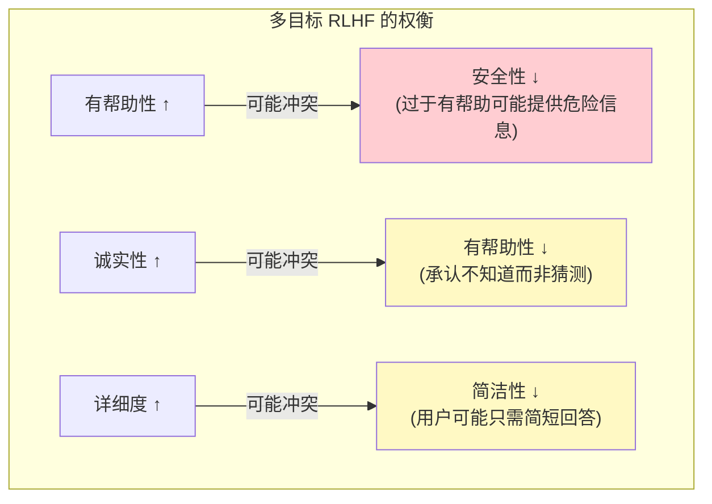

Google Gemini 和 Anthropic Claude 据称都在内部使用了某种形式的多目标 RLHF [推测]，但具体实现细节尚未公开。

### 4.5 奖励模型的前沿研究

#### Constitutional AI 中的奖励模型（RLAIF）

Anthropic 的 Constitutional AI 展示了一种根本性的替代方案：**用 AI 生成的偏好数据训练奖励模型**（RLAIF），而非依赖人类标注。

RLAIF 的奖励模型训练流程：

1. 给同一个 prompt 生成两个 response $y_A$ 和 $y_B$
2. 让 AI 根据宪法原则选择更好的回答：$P_{\text{AI}}(y_A \succ y_B | \text{principle})$
3. 通过比较两个选项的对数概率来获取偏好概率（soft label）
4. 用这些 AI 偏好数据训练 Bradley-Terry 奖励模型

**RLAIF vs RLHF 的奖励模型对比**：

| 方面 | RLHF 奖励模型 | RLAIF 奖励模型 |
|------|-------------|---------------|
| 数据来源 | 人类标注者 | AI + 宪法原则 |
| 标注成本 | 高（$1-5/条） | 低（仅需 API 调用） |
| 标注一致性 | 中等（Cohen's Kappa ~0.65） | 高（AI 更一致） |
| 标注规模 | 受限（~10K-100K 条） | 几乎无限 |
| 偏见类型 | 人类偏见（文化、个人偏好） | AI 偏见（训练数据偏见） |
| 在安全维度的表现 | 良好 | 可能更好（原则更系统化） |

**关键洞察**：RLAIF 的奖励模型在安全性维度上的表现可能甚至**优于**人类标注，因为宪法原则提供了系统性、一致性的安全标准，而人类标注者可能在安全边界问题上存在分歧。

#### 多目标奖励建模的挑战

当需要同时建模多个目标（有帮助性、安全性、诚实性等）时，奖励建模面临独特的挑战：

**挑战 1：目标间的冲突**

$$r_{\text{helpful}}(x, y) \text{ 和 } r_{\text{harmless}}(x, y) \text{ 可能负相关}$$

例如，当用户询问危险信息时，最"有帮助"的回答是直接提供信息，但这与安全性目标冲突。

**挑战 2：标注者的隐式权重不一致**

不同标注者在不同维度上有不同的隐式权重。当要求标注者做整体偏好判断时，他们实际上在进行：

$$r_{\text{overall}} = w_{\text{helpful}} \cdot r_{\text{helpful}} + w_{\text{harmless}} \cdot r_{\text{harmless}} + w_{\text{honest}} \cdot r_{\text{honest}}$$

但每个标注者的 $w$ 不同，导致标注噪声增大。

**解决方案**：分维度标注 + 分维度训练奖励模型，然后在 RL 阶段通过加权或约束优化进行组合。这正是 Google Gemini 和 Anthropic Claude 采用的策略 [推测]。

#### 奖励模型的 Overoptimization（Goodhart's Law）

**Goodhart's Law**：当一个度量指标变成了优化目标时，它就不再是一个好的度量指标。

在 RLHF 中，这表现为：当策略过度优化代理奖励 $\hat{r}$ 时，真实奖励 $r^*$ 反而可能下降。

$$\hat{r}(\pi_\theta) \uparrow\uparrow \quad \text{但} \quad r^*(\pi_\theta) \downarrow \text{ 或停滞}$$

Gao et al. (2023) 的实验发现，奖励模型的 overoptimization 遵循一个可预测的模式：

- 在优化初期，代理奖励和真实奖励**同步增长**
- 超过某个临界点后，代理奖励继续增长，但真实奖励**开始下降**
- 临界点的位置与奖励模型的规模和质量有关：更大/更好的奖励模型，临界点越远

**缓解策略**：

1. **KL 惩罚**：限制策略偏离，间接限制对奖励模型的过度优化（标准方法）
2. **奖励模型集成**：训练多个奖励模型，取最小值或平均值
3. **定期重新训练**：在新策略分布上收集偏好数据，迭代更新奖励模型
4. **保守估计**：对奖励模型的不确定区域采用悲观估计

> 奖励模型的 overoptimization 问题是 RLHF 的根本性挑战之一。DPO 等方法通过绕过显式奖励模型来部分规避这个问题，但隐式奖励的 overoptimization 仍然可能存在——这将在下一模块详细讨论。

---

> **参考文献**：
>
> - Christiano, P. et al. (2017). "Deep Reinforcement Learning from Human Preferences." NeurIPS.
> - Bai, Y. et al. (2022). "Constitutional AI: Harmlessness from AI Feedback." arXiv:2212.08073.
> - Bai, Y. et al. (2022). "Training a Helpful and Harmless Assistant with RLHF." arXiv:2204.05862.
> - Ouyang, L. et al. (2022). "Training language models to follow instructions with human feedback." NeurIPS.
> - Schulman, J. et al. (2017). "Proximal Policy Optimization Algorithms." arXiv:1707.06347.
> - Rafailov, R. et al. (2023). "Direct Preference Optimization: Your Language Model is Secretly a Reward Model." NeurIPS.
> - Shao, Z. et al. (2024). "DeepSeekMath: Pushing the Limits of Mathematical Reasoning in Open Language Models."
> - DeepSeek-AI. (2024). "DeepSeek-V3 Technical Report."
> - DeepSeek-AI. (2025). "DeepSeek-R1: Incentivizing Reasoning Capability in LLMs via Reinforcement Learning."
> - Gemini Team, Google. (2023). "Gemini: A Family of Highly Capable Multimodal Models."
> - Lightman, H. et al. (2023). "Let's Verify Step by Step." arXiv:2305.20050.
> - Ziegler, D. et al. (2019). "Fine-Tuning Language Models from Human Preferences." arXiv:1909.08593.
> - Stiennon, N. et al. (2020). "Learning to summarize from human feedback." NeurIPS.
> - Gao, L. et al. (2023). "Scaling Laws for Reward Model Overoptimization." ICML.
