# 模块12：DPO 及变体 -- 直接偏好优化

> RLHF 需要训练四个模型、使用不稳定的强化学习算法，工程复杂度极高。DPO（Direct Preference Optimization）发现了一个深刻的数学等价关系：**奖励函数可以从策略本身隐式恢复**，从而将强化学习问题转化为一个简单的分类问题。本章将完整推导这一数学变换，并系统介绍 DPO 及其主要变体。

---

## 章节定位

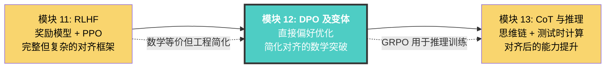

**DPO 的动机：简化 RLHF 的复杂训练流程**

模块 11 中我们学习了 RLHF 的完整框架：训练奖励模型、使用 PPO 进行策略优化、维护参考模型防止策略退化。这套流程虽然理论上最优，但在工程实现中面临严峻挑战——同时管理四个大模型的前向/反向传播，调试不稳定的强化学习超参数，承受巨大的计算和显存开销。

DPO 的出现代表了一次**范式转变**：通过一个精巧的数学变换，将强化学习问题转化为简单的二元分类问题。这不仅大幅降低了工程复杂度，更揭示了一个深刻的数学事实——**语言模型本身就是一个隐式的奖励模型**。

**DPO 的历史地位：从 RLHF 到直接偏好优化**

2023 年 Rafailov 等人发表 DPO 论文后，偏好优化领域迎来了爆发式增长。DPO 催生了一系列后续工作（IPO、KTO、SimPO、ORPO 等），每种方法都针对 DPO 的某个具体局限提出改进。与此同时，DeepSeek 提出的 GRPO 则走了另一条路——保留 RL 框架但去掉 Critic 模型，用组内排序替代价值估计。这些方法共同构成了当前 LLM 对齐的技术版图，本章将系统梳理它们的数学基础和工程实践。

---

## 目录

- [1. DPO 的动机](#1-dpo-的动机)
- [2. DPO 的完整数学推导](#2-dpo-的完整数学推导)
- [3. DPO 的直觉理解](#3-dpo-的直觉理解)
- [4. DPO 变体](#4-dpo-变体)
- [5. DPO 在工业界的应用](#5-dpo-在工业界的应用)
- [6. 各方法全面对比](#6-各方法全面对比)
- [7. Google 的偏好优化实践](#7-google-的偏好优化实践)
- [8. DeepSeek 的 GRPO](#8-deepseek-的-grpo)
- [9. Anthropic 的偏好优化视角](#9-anthropic-的偏好优化视角)
- [10. 项目实践](#10-项目实践)
- [11. 本章小结](#11-本章小结)

---

## 1. DPO 的动机

### 1.1 RLHF 的工程复杂性

回顾模块 11 中介绍的 RLHF 流程，完成一次完整的偏好优化需要：

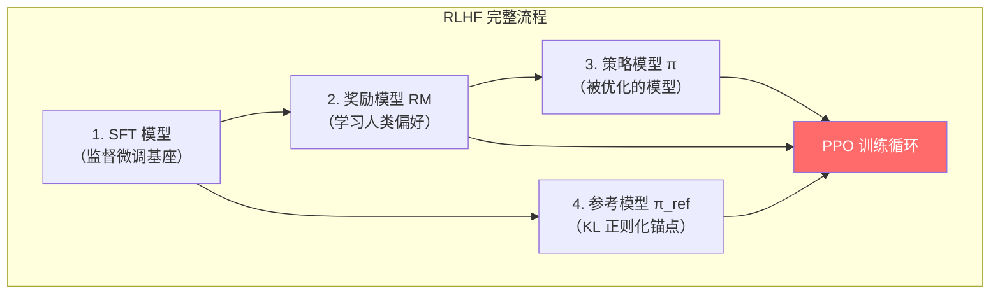

**RLHF 的四大痛点**：

| 问题 | 具体表现 | 影响 |
|------|---------|------|
| **模型数量多** | 同时维护 SFT、RM、策略、参考 四个模型 | 显存占用巨大 |
| **训练不稳定** | PPO 对超参数敏感，奖励黑客（reward hacking） | 调参困难、结果不可复现 |
| **采样开销大** | 每个训练步都需要从策略模型生成完整回答 | 训练速度慢 |
| **工程复杂** | 需要协调多个模型的前向/反向传播 | 实现门槛高 |

### 1.2 核心洞察：从 RL 到分类

DPO 的核心洞察来自一个关键的数学发现：

> **在 KL 约束的 RLHF 目标函数下，最优策略有闭式解。通过这个闭式解，我们可以将奖励函数表示为策略的函数，从而完全绕过奖励模型的显式训练。**

这意味着：
- 不需要单独训练奖励模型
- 不需要 PPO 等强化学习算法
- 不需要从策略模型在线采样
- 偏好优化变成了一个**二元分类**问题

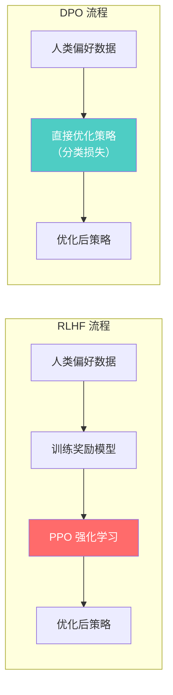

**类比**：RLHF 就像是先雇一位评委（奖励模型）学习评分标准，然后让选手（策略模型）反复表演并根据评分改进。DPO 则是直接告诉选手"A 比 B 好"，让选手自己琢磨什么样的表现更受欢迎——跳过了评委这个中间环节。

### 1.3 DPO 论文的关键贡献

Rafailov et al. (2023) 在论文 "Direct Preference Optimization: Your Language Model is Secretly a Reward Model" 中提出了 DPO，其关键贡献包括：

1. **数学等价性证明**：证明 DPO 与 RLHF 在理论上等价
2. **简化训练流程**：从四个模型减少到两个（策略模型 + 参考模型）
3. **稳定的训练**：使用标准的交叉熵损失，避免了 RL 的不稳定性
4. **实验验证**：在多个基准上达到与 RLHF 相当甚至更优的性能

---

## 2. DPO 的完整数学推导

> 本节是整个模块的核心。我们将从 RLHF 的目标函数出发，经过严格的数学推导，一步步得到 DPO 的损失函数。每一步都会解释其数学动机，确保读者能够理解"为什么这样变换"。

### 2.1 起点：RLHF 的目标函数

RLHF 的核心优化目标是：在最大化奖励的同时，不让策略偏离参考模型太远。数学表达为：

$$\max_{\pi} \mathbb{E}_{x \sim \mathcal{D},\, y \sim \pi(\cdot|x)}\left[r(x, y)\right] - \beta \, \text{KL}\left[\pi(\cdot|x) \| \pi_{\text{ref}}(\cdot|x)\right]$$

其中：
- $\pi$：我们要优化的策略（语言模型）
- $\pi_{\text{ref}}$：参考策略（通常是 SFT 后的模型），作为正则化锚点
- $r(x, y)$：奖励函数，对 prompt $x$ 和回答 $y$ 打分
- $\beta > 0$：KL 惩罚系数，控制策略偏离参考模型的程度
- $\mathcal{D}$：prompt 的分布

**展开 KL 散度**：

$$\text{KL}\left[\pi(\cdot|x) \| \pi_{\text{ref}}(\cdot|x)\right] = \mathbb{E}_{y \sim \pi(\cdot|x)}\left[\log \frac{\pi(y|x)}{\pi_{\text{ref}}(y|x)}\right]$$

将 KL 展开后，目标函数变为：

$$\max_{\pi} \mathbb{E}_{x \sim \mathcal{D},\, y \sim \pi(\cdot|x)}\left[r(x, y) - \beta \log \frac{\pi(y|x)}{\pi_{\text{ref}}(y|x)}\right]$$

**为什么需要 KL 约束？**
- 没有约束时，策略会走向极端：只生成获得最高奖励的回答，失去多样性
- KL 约束保证了策略不会偏离参考模型太远，维持语言质量
- $\beta$ 控制了"探索新回答"和"保持原有能力"之间的平衡

### 2.2 关键推导：最优策略的闭式解

**目标**：对于给定的奖励函数 $r(x,y)$，求解上述优化问题的最优策略 $\pi^*$。

**第一步：将优化问题写成逐 prompt 的形式**

由于期望是关于 $x$ 的，我们可以对每个 $x$ 独立优化：

$$\max_{\pi(\cdot|x)} \sum_{y} \pi(y|x) \left[r(x, y) - \beta \log \frac{\pi(y|x)}{\pi_{\text{ref}}(y|x)}\right]$$

同时满足约束 $\sum_y \pi(y|x) = 1$，$\pi(y|x) \geq 0$。

**第二步：整理被优化的表达式**

将上式展开：

$$\sum_{y} \pi(y|x) \left[r(x, y) - \beta \log \pi(y|x) + \beta \log \pi_{\text{ref}}(y|x)\right]$$

$$= \sum_{y} \pi(y|x) r(x, y) - \beta \sum_{y} \pi(y|x) \log \pi(y|x) + \beta \sum_{y} \pi(y|x) \log \pi_{\text{ref}}(y|x)$$

注意到中间一项 $-\sum_y \pi(y|x) \log \pi(y|x) = H(\pi(\cdot|x))$ 正是策略分布的熵。

**第三步：使用变分法 / Lagrange 乘子法求解**

构造 Lagrangian（引入约束 $\sum_y \pi(y|x) = 1$）：

$$\mathcal{L} = \sum_{y} \pi(y|x) \left[r(x, y) - \beta \log \pi(y|x) + \beta \log \pi_{\text{ref}}(y|x)\right] + \lambda\left(\sum_y \pi(y|x) - 1\right)$$

对 $\pi(y|x)$ 求导并令其为零：

$$\frac{\partial \mathcal{L}}{\partial \pi(y|x)} = r(x, y) - \beta \log \pi(y|x) - \beta + \beta \log \pi_{\text{ref}}(y|x) + \lambda = 0$$

解出 $\pi(y|x)$：

$$\beta \log \pi(y|x) = r(x, y) + \beta \log \pi_{\text{ref}}(y|x) - \beta + \lambda$$

$$\log \pi(y|x) = \frac{1}{\beta} r(x, y) + \log \pi_{\text{ref}}(y|x) + \frac{\lambda - \beta}{\beta}$$

$$\pi(y|x) = \pi_{\text{ref}}(y|x) \cdot \exp\left(\frac{r(x, y)}{\beta}\right) \cdot \exp\left(\frac{\lambda - \beta}{\beta}\right)$$

**第四步：利用归一化约束确定常数**

利用 $\sum_y \pi(y|x) = 1$：

$$\exp\left(\frac{\lambda - \beta}{\beta}\right) \cdot \sum_y \pi_{\text{ref}}(y|x) \exp\left(\frac{r(x, y)}{\beta}\right) = 1$$

定义**配分函数**（partition function）：

$$Z(x) = \sum_y \pi_{\text{ref}}(y|x) \exp\left(\frac{r(x, y)}{\beta}\right)$$

则 $\exp\left(\frac{\lambda - \beta}{\beta}\right) = \frac{1}{Z(x)}$。

**最终结果：最优策略的闭式解**：

$$\boxed{\pi^*(y|x) = \frac{1}{Z(x)} \pi_{\text{ref}}(y|x) \exp\left(\frac{1}{\beta} r(x, y)\right)}$$

**直觉理解**：
- 最优策略是参考策略的一个**加权版本**
- 奖励高的回答 $y$，其概率被指数放大
- $\beta$ 越小，放大效果越强（更激进地追求高奖励）
- $Z(x)$ 是归一化常数，保证概率和为 1

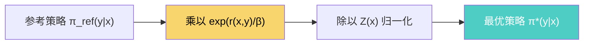

### 2.3 核心变换：从策略恢复隐式奖励

**这一步是 DPO 最关键的数学洞察**。

从 2.2 节的闭式解出发，我们要做一个**逆向操作**：既然最优策略可以由奖励函数表示，那么奖励函数也可以由策略表示。

对 $\pi^*(y|x) = \frac{1}{Z(x)} \pi_{\text{ref}}(y|x) \exp\left(\frac{1}{\beta} r(x,y)\right)$ 两边取对数：

$$\log \pi^*(y|x) = \log \pi_{\text{ref}}(y|x) + \frac{1}{\beta} r(x,y) - \log Z(x)$$

移项，解出 $r(x,y)$：

$$r(x, y) = \beta \log \frac{\pi^*(y|x)}{\pi_{\text{ref}}(y|x)} + \beta \log Z(x)$$

**这就是隐式奖励公式**。它告诉我们：

$$\boxed{r(x, y) = \beta \log \frac{\pi_\theta(y|x)}{\pi_{\text{ref}}(y|x)} + \beta \log Z(x)}$$

> 当 $\pi_\theta = \pi^*$ 时，上式精确成立。DPO 的思路是：用参数化的 $\pi_\theta$ 去逼近 $\pi^*$，此时上式近似成立。

**直觉理解**：
- $\beta \log \frac{\pi_\theta(y|x)}{\pi_{\text{ref}}(y|x)}$ 是策略相对于参考模型的对数概率比，可以视为"隐式奖励"
- 如果 $\pi_\theta$ 比 $\pi_{\text{ref}}$ 更倾向于生成 $y$，说明 $y$ 的隐式奖励更高
- $\beta \log Z(x)$ 是只依赖于 $x$ 的常数项，在接下来的推导中会被消去

### 2.4 代入 Bradley-Terry 模型：得到 DPO 损失

**Bradley-Terry 偏好模型**回顾（在模块 11 中已介绍）：

给定 prompt $x$、偏好回答 $y_w$ 和非偏好回答 $y_l$，人类偏好概率为：

$$P(y_w \succ y_l | x) = \sigma\left(r(x, y_w) - r(x, y_l)\right)$$

其中 $\sigma$ 是 sigmoid 函数 $\sigma(z) = \frac{1}{1+e^{-z}}$。

**将隐式奖励代入**：

$$r(x, y_w) - r(x, y_l) = \beta \log \frac{\pi_\theta(y_w|x)}{\pi_{\text{ref}}(y_w|x)} + \cancel{\beta \log Z(x)} - \beta \log \frac{\pi_\theta(y_l|x)}{\pi_{\text{ref}}(y_l|x)} - \cancel{\beta \log Z(x)}$$

**关键观察**：$\beta \log Z(x)$ 只依赖于 $x$，在 $y_w$ 和 $y_l$ 的奖励差中被完美消去。

化简：

$$r(x, y_w) - r(x, y_l) = \beta \left[\log \frac{\pi_\theta(y_w|x)}{\pi_{\text{ref}}(y_w|x)} - \log \frac{\pi_\theta(y_l|x)}{\pi_{\text{ref}}(y_l|x)}\right]$$

**DPO 的损失函数**（最大化人类偏好的负对数似然）：

$$\boxed{\mathcal{L}_{\text{DPO}}(\pi_\theta; \pi_{\text{ref}}) = -\mathbb{E}_{(x, y_w, y_l) \sim \mathcal{D}}\left[\log \sigma\left(\beta \log \frac{\pi_\theta(y_w|x)}{\pi_{\text{ref}}(y_w|x)} - \beta \log \frac{\pi_\theta(y_l|x)}{\pi_{\text{ref}}(y_l|x)}\right)\right]}$$

### 2.5 推导流程总结

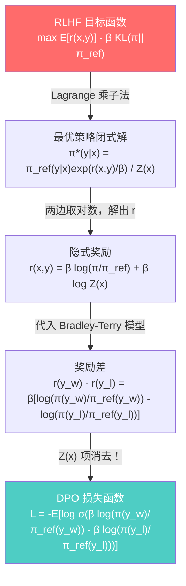

**推导的关键数学步骤回顾**：

| 步骤 | 数学操作 | 动机 |
|------|---------|------|
| 1 | 展开 KL 散度 | 将约束目标写成无约束形式 |
| 2 | Lagrange 乘子法 | 在归一化约束下求最优分布 |
| 3 | 配分函数 $Z(x)$ | 吸收归一化常数 |
| 4 | 取对数 + 移项 | 从最优策略反解奖励函数 |
| 5 | 代入 Bradley-Terry | 将奖励差转化为偏好概率 |
| 6 | $Z(x)$ 消去 | 避免计算不可行的配分函数 |

---

## 3. DPO 的直觉理解

### 3.1 梯度分析：DPO 在做什么？

为了理解 DPO 的训练行为，我们对损失函数求梯度。

DPO 损失为：

$$\mathcal{L}_{\text{DPO}} = -\log \sigma(\hat{r}_w - \hat{r}_l)$$

其中 $\hat{r}_w = \beta \log \frac{\pi_\theta(y_w|x)}{\pi_{\text{ref}}(y_w|x)}$，$\hat{r}_l = \beta \log \frac{\pi_\theta(y_l|x)}{\pi_{\text{ref}}(y_l|x)}$ 分别是偏好回答和非偏好回答的隐式奖励。

对 $\theta$ 求梯度：

$$\nabla_\theta \mathcal{L}_{\text{DPO}} = -\beta \cdot \underbrace{\sigma(\hat{r}_l - \hat{r}_w)}_{\text{加权系数}} \cdot \left[\underbrace{\nabla_\theta \log \pi_\theta(y_w|x)}_{\text{增加偏好回答概率}} - \underbrace{\nabla_\theta \log \pi_\theta(y_l|x)}_{\text{降低非偏好回答概率}}\right]$$

**梯度的三个组成部分**：

1. **增加偏好回答概率**：$\nabla_\theta \log \pi_\theta(y_w|x)$ -- 让模型更倾向于生成好的回答
2. **降低非偏好回答概率**：$-\nabla_\theta \log \pi_\theta(y_l|x)$ -- 让模型远离坏的回答
3. **自适应加权**：$\sigma(\hat{r}_l - \hat{r}_w)$ -- 当模型已经能很好地区分好坏回答时（$\hat{r}_w \gg \hat{r}_l$），这个系数接近 0，梯度自动减小

**类比**：想象一个学生做选择题。当学生已经能自信地选出正确答案时（隐式奖励差距大），继续做同样的题对学习没什么帮助（梯度小）。但当学生还搞不清楚哪个更好时（隐式奖励差距小），这道题就很有学习价值（梯度大）。

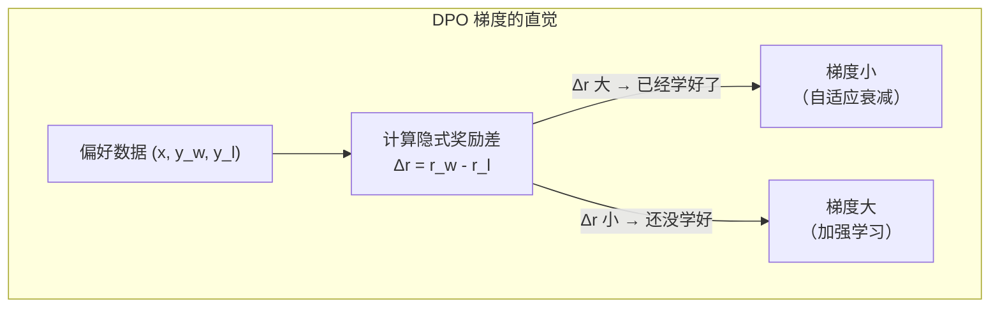

### 3.2 与 RLHF-PPO 的等价性

DPO 和 RLHF 在理论上是等价的：它们在最优解处收敛到相同的策略。但在实践中有所不同：

| 维度 | RLHF (PPO) | DPO |
|------|-----------|-----|
| **奖励模型** | 显式训练，独立优化 | 隐式，嵌入在策略中 |
| **优化方式** | 在线 RL，从策略采样 | 离线，使用固定数据集 |
| **稳定性** | 需要精心调参 | 通常更稳定 |
| **理论保证** | 在分布内最优 | 在离线数据覆盖范围内最优 |
| **分布偏移** | 通过在线采样缓解 | 可能受离线数据分布限制 |
| **数据利用** | 需要大量在线生成 | 高效利用离线偏好数据 |

**关键区别**：

- **在线 vs 离线**：RLHF 在训练过程中不断从策略模型采样新数据，可以探索数据分布；DPO 使用固定的离线偏好数据集，无法探索新的回答空间
- **奖励泛化**：RLHF 的奖励模型可以对未见过的回答打分；DPO 的隐式奖励只在训练数据的支持集上有效

### 3.3 DPO 的潜在问题

1. **分布偏移（Distribution Shift）**：离线数据中的回答可能与当前策略的生成分布不同，导致优化方向偏差
2. **过拟合偏好数据**：DPO 可能过度拟合训练集中的偏好标注，尤其当数据量较小时
3. **长度偏差（Length Bias）**：DPO 可能倾向于生成更长的回答（因为对数概率与长度相关）

这些问题催生了一系列 DPO 变体，我们将在第 4 节详细介绍。

---

## 4. DPO 变体

### 4.1 IPO（Identity Preference Optimization）

#### 动机

DPO 基于 Bradley-Terry 模型的假设：人类偏好概率等于奖励差的 sigmoid。但在实际中，这个假设可能不成立（例如，标注者对非常相似的回答可能有噪声偏好）。IPO 发现 DPO 在训练过程中可能会**过拟合**：当训练足够久时，隐式奖励差趋向无穷大，导致策略退化。

#### 数学形式

**IPO 的核心出发点**：DPO 假设人类偏好遵循 Bradley-Terry 模型 $P(y_w \succ y_l) = \sigma(r_w - r_l)$。但 IPO 论文（Azar et al., 2023）指出，这一假设并非必要。IPO 直接从偏好概率出发，不假设任何特定的偏好模型。

**推导思路**：IPO 定义了一个更一般的优化目标——让偏好回答与非偏好回答的隐式奖励差等于一个有限的目标值，而非趋向无穷大。具体来说，IPO 优化的是：

$$\min_{\pi_\theta} \mathbb{E}_{(x, y_w, y_l)}\left[\left(\hat{h}_\theta(y_w, y_l; x) - \frac{1}{2\beta}\right)^2\right]$$

其中 $\hat{h}_\theta(y_w, y_l; x) = \log \frac{\pi_\theta(y_w|x)}{\pi_{\text{ref}}(y_w|x)} - \log \frac{\pi_\theta(y_l|x)}{\pi_{\text{ref}}(y_l|x)}$ 是隐式奖励差。

展开后得到 IPO 的损失函数：

$$\mathcal{L}_{\text{IPO}} = \mathbb{E}_{(x, y_w, y_l)}\left[\left(\log \frac{\pi_\theta(y_w|x)}{\pi_{\text{ref}}(y_w|x)} - \log \frac{\pi_\theta(y_l|x)}{\pi_{\text{ref}}(y_l|x)} - \frac{1}{2\beta}\right)^2\right]$$

**为什么目标值是 $\frac{1}{2\beta}$ ？** 这来自最优策略下隐式奖励差的期望值。在 KL 正则化的 RLHF 框架下，当偏好回答确实优于非偏好回答时，最优的隐式奖励差恰好是 $\frac{1}{2\beta}$。这个值与 $\beta$ 成反比——$\beta$ 越小（KL 约束越弱），允许的奖励差越大。

**DPO 过拟合的数学解释**：DPO 使用 $-\log\sigma(\cdot)$ 作为损失。当隐式奖励差 $\Delta \hat{r} \to +\infty$ 时，$\sigma(\Delta \hat{r}) \to 1$，$-\log\sigma(\Delta \hat{r}) \to 0$。这意味着 DPO 的损失可以通过让奖励差无限增大来趋近于零，导致策略退化为确定性分布。IPO 的均方误差损失则在 $\Delta \hat{r} = \frac{1}{2\beta}$ 处达到最小值，超过这个点后损失反而增加，从而自然地防止过拟合。

**直觉**：
- IPO 希望隐式奖励差接近一个目标值 $\frac{1}{2\beta}$，而不是无限增大
- 使用**均方误差**损失代替 DPO 的交叉熵损失
- 当隐式奖励差达到目标时，梯度为零，防止过度优化
- 不依赖 Bradley-Terry 模型，对偏好噪声更鲁棒

**与 DPO 的对比**：

| 特性 | DPO | IPO |
|------|-----|-----|
| 损失函数 | 交叉熵（log sigmoid） | 均方误差 |
| 优化目标 | 最大化偏好概率 | 隐式奖励差接近目标值 $\frac{1}{2\beta}$ |
| 过拟合行为 | 隐式奖励差 $\to \infty$，策略退化 | 隐式奖励差收敛到有限值 |
| 前提假设 | 需要 Bradley-Terry 模型 | 不依赖特定偏好模型 |
| 适用场景 | 高质量偏好数据 | 噪声标注、标注者不一致 |

### 4.2 KTO（Kahneman-Tversky Optimization）

#### 动机

DPO、IPO 等方法都需要**成对偏好数据**（即对同一个 prompt 有一好一坏两个回答）。但在实际中，收集成对数据成本很高。很多时候我们只有**二元反馈**：某个回答是"好"还是"坏"（如点赞/点踩）。

KTO 的关键洞察：利用行为经济学中的**前景理论**（Prospect Theory，由 Kahneman 和 Tversky 提出），设计一个不需要成对数据的偏好优化方法。

#### 前景理论简介

前景理论的核心发现：人类对损失的敏感度大于对等量收益的敏感度（损失厌恶）。这一发现获得了 2002 年诺贝尔经济学奖。

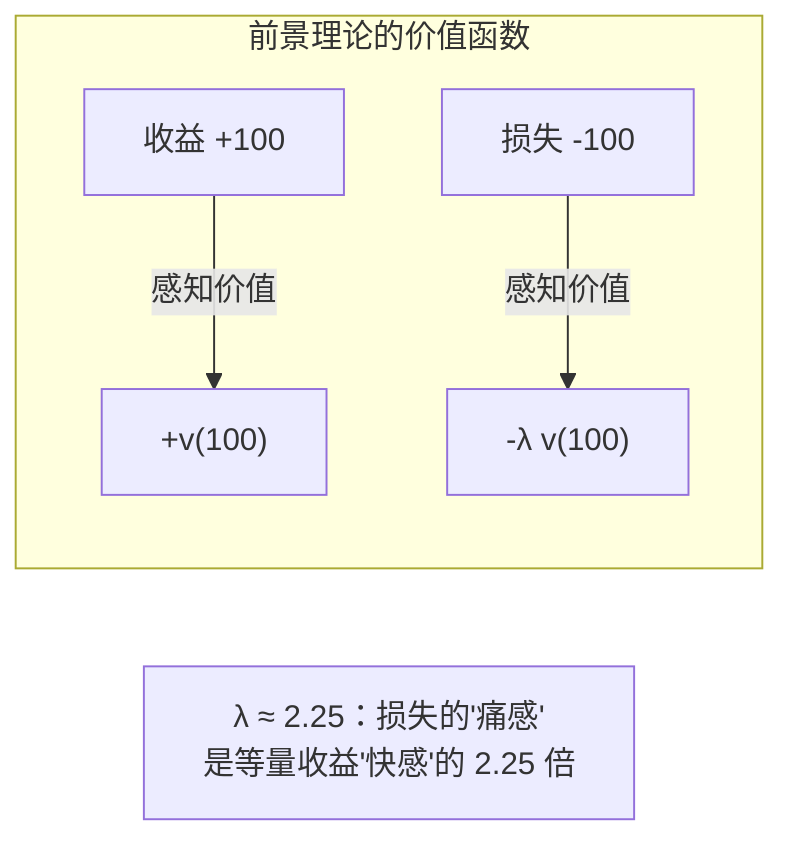

**前景理论的三个核心要素**：
1. **参考点依赖（Reference Dependence）**：人不是根据绝对值评估结果，而是相对于某个参考点评估。在 KTO 中，参考点是模型的平均表现 $z_{\text{ref}}$
2. **损失厌恶（Loss Aversion）**：失去 100 元的痛苦远大于获得 100 元的快乐。在 KTO 中，对"坏回答"的惩罚权重大于对"好回答"的奖励权重
3. **递减敏感性（Diminishing Sensitivity）**：边际效用递减。sigmoid 函数天然具有这个性质

#### 数学形式

KTO 的核心思想是：将偏好优化建模为前景理论中的价值函数最大化。

**KTO 的损失函数**：

$$\mathcal{L}_{\text{KTO}} = \mathbb{E}_{x, y}\left[\lambda_y \cdot \left(1 - v_\theta(x, y)\right)\right]$$

其中价值函数 $v_\theta$ 对好回答和坏回答有不对称定义：

对于好的回答（$y = y_w$，标签为"thumbs up"）：

$$v_\theta(x, y_w) = \sigma\left(\beta \log \frac{\pi_\theta(y_w|x)}{\pi_{\text{ref}}(y_w|x)} - z_{\text{ref}}\right)$$

对于坏的回答（$y = y_l$，标签为"thumbs down"）：

$$v_\theta(x, y_l) = \sigma\left(z_{\text{ref}} - \beta \log \frac{\pi_\theta(y_l|x)}{\pi_{\text{ref}}(y_l|x)}\right)$$

其中参考点为当前策略的平均 KL 散度：

$$z_{\text{ref}} = \mathbb{E}_{x', y' \sim \mathcal{D}}\left[\beta \text{KL}\left(\pi_\theta(y'|x') \| \pi_{\text{ref}}(y'|x')\right)\right]$$

**不对称权重 $\lambda_y$** 体现损失厌恶：

$$\lambda_y = \begin{cases} \lambda_w & \text{if } y \text{ is desirable (好回答)} \\ \lambda_l & \text{if } y \text{ is undesirable (坏回答)} \end{cases}$$

通常 $\lambda_l > \lambda_w$，反映"对坏回答的惩罚应该比对好回答的奖励更重"。论文建议 $\lambda_l / \lambda_w \approx 1.0 \sim 1.5$。

**KTO 的梯度直觉**：

对于好回答，KTO 的梯度推动 $\pi_\theta$ 增加该回答的概率（使隐式奖励超过参考点 $z_{\text{ref}}$）。对于坏回答，梯度推动 $\pi_\theta$ 降低该回答的概率（使隐式奖励低于参考点）。参考点 $z_{\text{ref}}$ 是动态计算的，代表"模型当前的平均表现水平"，因此 KTO 本质上是在优化"比平均水平更好/更差"的相对判断。

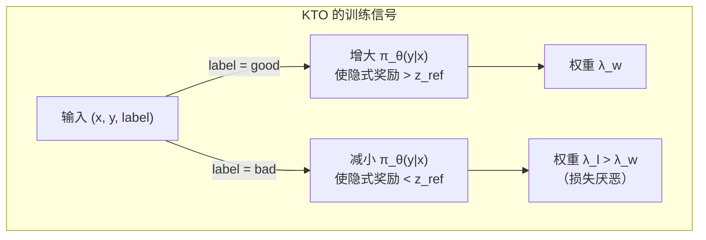

**KTO 的优势**：

| 优势 | 说明 |
|------|------|
| 无需成对数据 | 只需要 $(x, y, \text{label})$ 格式 |
| 更容易收集数据 | 二元反馈比排序容易获取 |
| 理论基础扎实 | 基于经过验证的行为经济学理论 |
| 实际性能优秀 | 论文报告与 DPO 相当的性能 |

### 4.3 ORPO（Odds Ratio Preference Optimization）

#### 动机

DPO 和其变体都需要一个单独的 SFT 阶段来准备参考模型 $\pi_{\text{ref}}$。ORPO 的核心想法是：**将 SFT 和偏好优化统一到一个训练阶段**，直接在语言建模损失上添加偏好信号。

#### 数学形式

ORPO 使用**优势比**（Odds Ratio）来衡量偏好：

首先定义回答 $y$ 在策略 $\pi_\theta$ 下的"赔率"（odds）：

$$\text{odds}_\theta(y|x) = \frac{P_\theta(y|x)}{1 - P_\theta(y|x)}$$

其中 $P_\theta(y|x) = \exp\left(\frac{1}{|y|}\sum_{t=1}^{|y|}\log \pi_\theta(y_t|x, y_{<t})\right)$ 是回答的平均 token 概率的指数。

优势比（Odds Ratio）定义为：

$$\text{OR}_\theta(y_w, y_l | x) = \frac{\text{odds}_\theta(y_w|x)}{\text{odds}_\theta(y_l|x)}$$

ORPO 的损失函数：

$$\mathcal{L}_{\text{ORPO}} = \underbrace{\mathcal{L}_{\text{NLL}}}_{\text{标准语言建模损失}} + \lambda \cdot \underbrace{\mathcal{L}_{\text{OR}}}_{\text{优势比偏好损失}}$$

其中：
- $\mathcal{L}_{\text{NLL}} = -\frac{1}{|y_w|}\sum_{t=1}^{|y_w|}\log \pi_\theta(y_{w,t}|x, y_{w,<t})$ 是偏好回答上的交叉熵损失
- $\mathcal{L}_{\text{OR}} = -\log \sigma\left(\log \text{OR}_\theta(y_w, y_l | x)\right)$ 是优势比损失

**直觉**：
- NLL 部分让模型学习语言建模能力（相当于 SFT）
- OR 部分让模型区分好坏回答
- 两者合并后，只需一次训练即可完成 SFT + 偏好优化

**ORPO 的优势**：

| 特性 | 说明 |
|------|------|
| 无需参考模型 | 不需要额外存储 $\pi_{\text{ref}}$ |
| 无需 SFT 阶段 | 一次训练完成两个目标 |
| 显存更省 | 只维护一个模型 |
| 训练更快 | 减少了一整个训练阶段 |

### 4.4 SimPO（Simple Preference Optimization）

#### 动机

SimPO 进一步简化偏好优化方法，解决两个问题：
1. DPO 需要维护参考模型 $\pi_{\text{ref}}$，增加显存开销
2. 对数概率作为隐式奖励存在**长度偏差**：更长的回答通常有更低的对数概率（每多一个 token，概率就要乘一个小于 1 的数）

#### 数学形式

**SimPO 的隐式奖励定义**：

SimPO 使用**长度归一化的对数概率**作为隐式奖励，不再依赖参考模型：

$$\hat{r}_{\text{SimPO}}(x, y) = \frac{\beta}{|y|} \sum_{t=1}^{|y|} \log \pi_\theta(y_t | x, y_{<t}) = \frac{\beta}{|y|} \log \pi_\theta(y|x)$$

**为什么要做长度归一化？** 原始 DPO 的隐式奖励是 $\beta \log \frac{\pi_\theta(y|x)}{\pi_{\text{ref}}(y|x)}$，其中 $\log \pi_\theta(y|x) = \sum_{t=1}^{|y|} \log \pi_\theta(y_t|x, y_{<t})$ 是所有 token 对数概率的求和。更长的回答包含更多的 token，每个 token 的概率通常小于 1（$\log p < 0$），因此更长的回答倾向于有更低的对数概率。这意味着：

- DPO 可能偏好更短的回答（因为短回答的 $\log \pi$ 更高）
- 或者在某些情况下偏好更长的回答（如果参考模型的概率也因长度下降，差值可能变大）

SimPO 通过除以 $|y|$（回答长度）来消除这种偏差，使得不同长度的回答在公平的尺度上比较。

**SimPO 的损失函数**：

$$\mathcal{L}_{\text{SimPO}} = -\mathbb{E}_{(x, y_w, y_l)}\left[\log \sigma\left(\frac{\beta}{|y_w|}\log \pi_\theta(y_w|x) - \frac{\beta}{|y_l|}\log \pi_\theta(y_l|x) - \gamma\right)\right]$$

其中 $\gamma > 0$ 是**目标奖励差**（target reward margin），确保偏好回答和非偏好回答的隐式奖励之间有一定间隔。

**为什么需要 $\gamma$？** 没有参考模型的约束后，模型可能通过同时提高所有回答的概率来"作弊"（隐式奖励差可以在绝对值很小的情况下满足偏好约束）。$\gamma$ 强制要求偏好回答的奖励至少比非偏好回答高出 $\gamma$，类似于 SVM 中的分类间隔（margin），防止决策边界过窄。论文建议 $\gamma \in [0.5, 1.5]$。

**与 DPO 的关键区别**：

1. **去掉参考模型**：不再需要计算 $\log \pi_{\text{ref}}$，节省约 50% 显存
2. **长度归一化**：除以 $|y|$ 消除长度偏差，使不同长度的回答可公平比较
3. **目标奖励差 $\gamma$**：类似于 SVM 中的间隔（margin），防止奖励差过小
4. **隐式奖励更直觉**：SimPO 的奖励就是"平均每个 token 的对数概率"，可以理解为模型对回答的"平均置信度"

**直觉**：SimPO 的隐式奖励就是"模型认为这个回答有多好的平均置信度"——每个 token 的平均对数概率越高，说明模型对这个回答越有信心。

### 4.5 GRPO（Group Relative Policy Optimization）

#### 动机

GRPO 由 DeepSeek 提出，用于 DeepSeek-Math 和 DeepSeek-R1 的训练。它的核心思想是：**去掉 Critic（价值）模型，使用组内相对排序来估计优势函数**。

在标准 PPO 中，需要一个 Critic 模型来估计状态价值函数 $V(s)$，从而计算优势函数 $A(s,a) = Q(s,a) - V(s)$。Critic 模型增加了显存和计算开销。GRPO 的关键洞察是：**对于同一个 prompt，我们可以从策略中采样一组回答，通过组内比较来获得相对优势**。

#### 数学形式

给定 prompt $x$，从当前策略 $\pi_\theta$ 中采样 $G$ 个回答 $\{y_1, y_2, \ldots, y_G\}$，使用外部奖励函数（如基于规则的验证器）获得奖励 $\{r_1, r_2, \ldots, r_G\}$。

**组内归一化优势**：

$$\hat{A}_i = \frac{r_i - \text{mean}(\{r_1, \ldots, r_G\})}{\text{std}(\{r_1, \ldots, r_G\})}$$

**GRPO 的目标函数**：

$$\mathcal{L}_{\text{GRPO}} = -\frac{1}{G}\sum_{i=1}^{G}\left[\min\left(\rho_i \hat{A}_i, \text{clip}(\rho_i, 1-\epsilon, 1+\epsilon)\hat{A}_i\right) - \beta \, \text{KL}\left(\pi_\theta \| \pi_{\text{ref}}\right)\right]$$

其中 $\rho_i = \frac{\pi_\theta(y_i|x)}{\pi_{\text{old}}(y_i|x)}$ 是重要性采样比率，$\epsilon$ 是 PPO 的裁剪参数。

**与标准 PPO 的对比**：

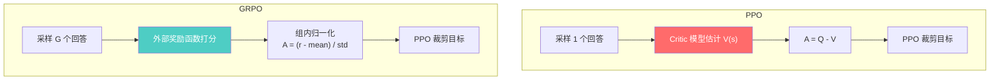

**GRPO 的优势**：

| 特性 | PPO | GRPO |
|------|-----|------|
| Critic 模型 | 需要 | 不需要 |
| 优势估计 | 通过 Critic | 组内相对排序 |
| 奖励来源 | 奖励模型 | 可用规则验证器 |
| 显存需求 | 高（4个模型） | 较低（2-3个模型） |
| 适用场景 | 通用 | 有可验证奖励的任务（如数学、编程） |

---

## 5. DPO 在工业界的应用

### 5.1 偏好数据构建

偏好数据是所有偏好优化方法的基石。数据质量直接决定了对齐效果的上限。工业界在偏好数据构建上积累了大量实践经验。

#### 数据来源：人工标注 vs 模型生成 vs 规则过滤

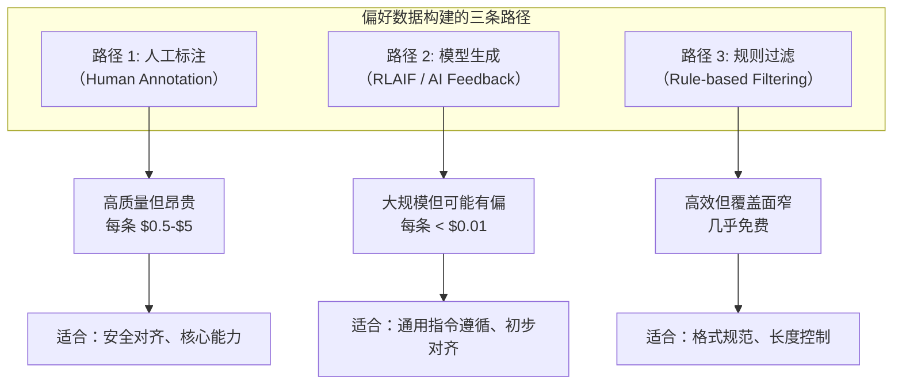

**人工标注**：专业标注团队对模型的多个回答进行排序或成对比较。优势是标注质量高、覆盖复杂场景；劣势是成本高、速度慢、标注者之间可能存在分歧。

**模型生成（RLAIF）**：使用强模型（如 GPT-4、Claude）作为裁判，自动生成偏好标签。这是 Anthropic Constitutional AI 的核心思想。优势是规模化、低成本、可快速迭代；劣势是存在模型偏见（如长度偏好、风格偏好）。

**规则过滤**：对于某些可形式化的维度（如代码是否能编译、数学答案是否正确、回答是否包含敏感词），可以使用规则自动筛选。这是 DeepSeek-R1 在推理任务上使用 GRPO 的基础。

#### 偏好数据的质量指标

| 指标 | 定义 | 理想值 | 说明 |
|------|------|--------|------|
| **Cohen's Kappa ($\kappa$)** | 标注者间一致性系数（校正了随机一致性） | $\kappa > 0.6$ | $\kappa = \frac{p_o - p_e}{1 - p_e}$，其中 $p_o$ 是观察一致率，$p_e$ 是随机一致率 |
| **多样性** | Prompt 的主题、难度、长度分布 | 均匀覆盖 | 避免集中在某类简单问题上 |
| **难度分布** | 偏好对之间的区分难度 | 有梯度 | 太简单的对（一个明显好，一个明显差）对训练帮助有限 |
| **信噪比** | 正确标注 / 总标注 | > 90% | 低质量标注会误导模型学习 |

**Cohen's Kappa 的计算**：

$$\kappa = \frac{p_o - p_e}{1 - p_e}$$

其中 $p_o$ 是两个标注者实际一致的比例，$p_e$ 是随机情况下预期一致的比例。$\kappa > 0.8$ 表示"几乎完美一致"，$\kappa \in [0.6, 0.8]$ 表示"显著一致"，$\kappa < 0.4$ 表示"一致性不足，数据需要审查"。

### 5.2 Iterative DPO / Online DPO

标准 DPO 是一次性训练：用固定的偏好数据集训练一轮就结束。但工业界发现，**迭代式 DPO** 能显著提升效果。

#### 核心思想

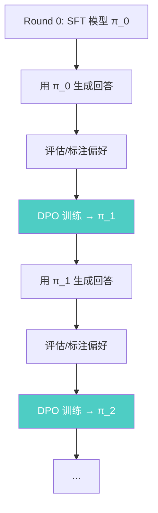

**关键技术细节**：

1. **用当前模型生成新的 rejected 样本**：每轮训练后，用最新模型 $\pi_t$ 生成回答。这些回答中的低质量样本比原始离线数据中的 rejected 样本更有"训练价值"，因为它们更接近当前模型的生成分布，缓解了分布偏移问题

2. **每轮训练后更新参考模型**：在第 $t+1$ 轮训练中，将 $\pi_t$ 作为新的参考模型 $\pi_{\text{ref}}$，而非始终使用原始 SFT 模型。这确保了隐式奖励差反映的是"相对于上一版本的改进"

3. **数据累积策略**：可以选择只使用当轮生成的数据（on-policy），或者累积所有历史数据（混合策略）。实践中，混合策略（新数据占 60-70%，旧数据占 30-40%）通常效果最好

**DeepSeek 的多轮 DPO 实践**：DeepSeek-V3 的后训练阶段采用了多轮迭代的偏好优化。根据公开技术报告，其流程大致为：
- 第一轮 DPO 使用人工标注的高质量偏好数据
- 后续轮次使用当前模型生成的回答 + AI 评估器标注偏好
- 每轮迭代都会更新参考模型
- 总共进行 2-3 轮迭代

### 5.3 DPO vs RLHF：什么场景用什么方法

工业界在选择 DPO 还是 RLHF 时，通常考虑以下维度：

| 维度 | DPO 更优 | RLHF 更优 |
|------|---------|----------|
| **工程复杂度** | 只需两个模型，实现简单 | 需要四个模型，调参困难 |
| **训练稳定性** | 标准分类损失，很少出问题 | PPO 超参敏感，可能发散 |
| **计算成本** | 低（无需在线采样） | 高（在线采样 + Critic 模型） |
| **迭代速度** | 快（一次性训练） | 慢（需要反复采样-评估-更新） |
| **在线探索** | 弱（受限于离线数据） | 强（持续发现新的好回答） |
| **奖励设计灵活性** | 弱（只能用偏好信号） | 强（可以设计多维度奖励） |
| **长期改进潜力** | 受数据集限制 | 理论上可以持续改进 |

**实际选择建议**：

- **中小团队、快速迭代**：先用 DPO 建立基线，如果效果不够再考虑 RLHF
- **大型对齐项目（如安全对齐）**：使用 RLHF，因为需要多维度奖励和在线探索
- **特定领域微调**：DPO 通常足够（已有通用对齐的模型 + 领域偏好数据）
- **推理模型训练**：GRPO（DeepSeek 路线）或 RLHF，因为需要可验证的奖励信号

### 5.4 Google 的偏好优化工业实践

Google 在 Gemini 系列模型的对齐训练中，形成了一套成熟的偏好优化方法论：

**多维度奖励的组合策略**：Google 不使用单一的偏好信号，而是训练多个专门化的奖励模型，分别覆盖有用性、安全性、事实准确性和指令遵循等维度。在 RLHF 训练时，将这些奖励加权组合：

$$r_{\text{total}}(x, y) = w_{\text{help}} \cdot r_{\text{help}} + w_{\text{safe}} \cdot r_{\text{safe}} + w_{\text{fact}} \cdot r_{\text{fact}} + w_{\text{follow}} \cdot r_{\text{follow}}$$

权重 $w_d$ 可以根据应用场景动态调整——安全敏感场景提高 $w_{\text{safe}}$，知识问答场景提高 $w_{\text{fact}}$。

**人类标注的规模化组织**：Google 维护了庞大的标注团队，采用分层标注策略：
- 初级标注者完成大批量的简单偏好标注
- 资深标注者处理边界案例和争议样本
- 领域专家审核关键领域（如医疗、法律）的标注质量
- 使用标注一致性指标（Cohen's Kappa）持续监控质量

### 5.5 DPO 训练的常见陷阱与调试指南

在实际训练中，DPO 虽然比 RLHF 简单得多，但仍然有一些常见的失败模式：

**陷阱 1：$\beta$ 选择不当**

$\beta$ 是 DPO 最关键的超参数，控制策略偏离参考模型的程度。

| $\beta$ 值 | 行为 | 症状 |
|:---------:|------|------|
| 过小（< 0.05） | 策略激进偏离参考模型 | 生成质量下降、出现无意义文本 |
| 适中（0.1 - 0.5） | 平衡偏好学习和保持原有能力 | 稳定收敛、质量提升 |
| 过大（> 1.0） | 策略几乎不变 | 训练无效果、损失不下降 |

**调试建议**：从 $\beta = 0.1$ 开始，观察训练过程中隐式奖励差 $\hat{r}_w - \hat{r}_l$ 的变化。如果快速增长到很大值，说明 $\beta$ 过小；如果几乎不变化，说明 $\beta$ 过大。

**陷阱 2：参考模型与策略模型初始化不一致**

DPO 要求 $\pi_\theta$ 的初始权重与 $\pi_{\text{ref}}$ 完全相同。如果初始化有差异（例如忘记复制某些层的权重），隐式奖励的计算从一开始就有偏差，导致训练方向错误。

**陷阱 3：偏好数据中的长度偏差**

如果训练数据中 chosen 回答系统性地比 rejected 回答长，模型会学到"更长 = 更好"的虚假规律。检查方法：计算 chosen 和 rejected 回答的平均长度比。如果比值偏离 1.0 太远（> 1.5 或 < 0.7），需要重新审查数据或使用 SimPO（自带长度归一化）。

---

## 6. 各方法全面对比

### 6.1 方法对比表

| 方法 | 需要参考模型 | 需要成对数据 | 需要在线采样 | 额外模型 | 训练稳定性 | 主要优势 |
|------|:-----------:|:-----------:|:-----------:|:--------:|:----------:|---------|
| **RLHF (PPO)** | 是 | 是(训练RM) | 是 | Critic + RM | 低 | 理论最优、在线探索 |
| **DPO** | 是 | 是 | 否 | 无 | 高 | 简单稳定 |
| **IPO** | 是 | 是 | 否 | 无 | 高 | 防止过拟合 |
| **KTO** | 是 | 否 | 否 | 无 | 高 | 无需成对数据 |
| **ORPO** | 否 | 是 | 否 | 无 | 高 | SFT+对齐一步完成 |
| **SimPO** | 否 | 是 | 否 | 无 | 高 | 最简化、无长度偏差 |
| **GRPO** | 是 | 否(需要组采样) | 是 | 无Critic | 中 | 去掉Critic、组排序 |

### 6.2 选择指南

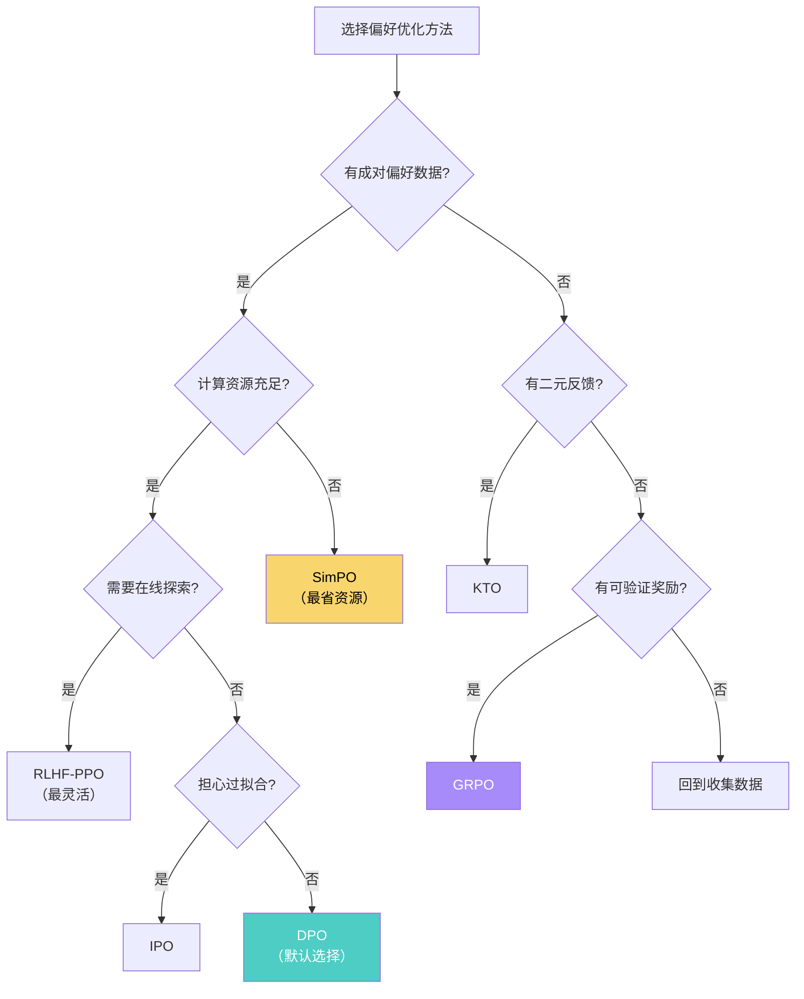

### 6.3 训练成本对比

| 方法 | 训练阶段 | 模型数量 | 相对显存 | 相对速度 |
|------|---------|:--------:|:-------:|:-------:|
| RLHF (PPO) | SFT + RM + RL | 4 | 4x | 1x (慢) |
| DPO | SFT + DPO | 2 | 2x | 3x |
| IPO | SFT + IPO | 2 | 2x | 3x |
| KTO | SFT + KTO | 2 | 2x | 3x |
| ORPO | ORPO (一步) | 1 | 1x | 5x (快) |
| SimPO | SFT + SimPO | 1 | 1x | 4x |
| GRPO | SFT + GRPO | 2-3 | 2-3x | 2x |

---

## 7. Google 的偏好优化实践

### 7.1 Gemini 中的偏好优化

Google 在 Gemini 系列模型的训练中采用了多阶段偏好优化策略。根据公开技术报告，Gemini 的后训练流程包括：

1. **监督微调（SFT）**：使用高质量指令数据微调基座模型
2. **奖励模型训练**：训练多个奖励模型，覆盖不同维度（如有用性、安全性、准确性）
3. **RLHF**：使用奖励模型指导策略优化

Google 在工业实践中更倾向于 RLHF 而非 DPO，主要原因是：

- **数据量充足**：Google 拥有大规模的人类标注数据，可以支撑奖励模型的训练
- **在线探索**：RLHF 的在线采样可以发现更好的回答分布，避免离线方法的分布偏移
- **多维度奖励**：多个奖励模型可以分别优化不同方面，比 DPO 的单一偏好信号更灵活

### 7.2 RLHF vs DPO 的工业选择

在工业界，RLHF 和 DPO 的选择通常取决于以下因素：

| 因素 | 倾向 RLHF | 倾向 DPO |
|------|----------|---------|
| 数据规模 | 大规模标注团队 | 有限偏好数据 |
| 计算资源 | 充足（多卡、长时间训练） | 受限 |
| 模型规模 | 超大模型（>70B） | 中小模型（<13B） |
| 迭代频率 | 低频、精细调优 | 高频、快速迭代 |
| 安全需求 | 高（需要多维度奖励） | 一般 |

---

## 8. DeepSeek 的 GRPO

### 8.1 GRPO 在 DeepSeek-R1 中的应用

DeepSeek 在其推理模型 DeepSeek-R1 的训练中，采用了 GRPO 作为核心偏好优化方法。这是一个里程碑式的选择，因为它表明：

1. **基于规则的奖励可以替代学习的奖励模型**：对于数学推理和编程任务，可以通过验证答案的正确性来获得奖励信号
2. **无需 Critic 模型**：通过组内相对排序估计优势，大幅降低训练成本
3. **组大小的重要性**：组大小 $G$ 是一个关键超参数，影响优势估计的质量

### 8.2 DeepSeek-R1 的训练流程

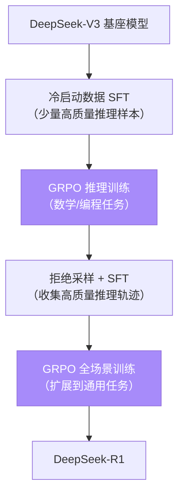

详细的 GRPO 推导和在 R1 中的具体应用请参见 [advanced.md](./advanced.md)。

---

## 9. Anthropic 的偏好优化视角

### 9.1 Constitutional AI 与偏好优化

Anthropic 的 Constitutional AI（CAI）方法与传统的偏好优化有一个关键区别：**偏好信号来自 AI 自身**（通过宪法原则引导），而非人类标注。

CAI 的偏好优化流程：

1. 使用"宪法原则"（如"回答应该是有帮助的、无害的、诚实的"）生成修改建议
2. AI 根据宪法原则对比原始回答和修改后的回答，产生偏好数据
3. 使用这些 AI 生成的偏好数据进行 RLHF 或 DPO 训练

### 9.2 Anthropic 对 DPO 类方法的评估 [推测]

[推测] 基于 Anthropic 公开的研究方向和技术报告，Anthropic 可能：
- 在内部对比了 RLHF 和 DPO 的效果
- 更倾向于使用在线方法（如 RLHF），因为在线方法可以更好地探索回答空间
- 可能在安全对齐的特定场景中使用 DPO 类方法作为补充

### 9.3 偏好优化中的安全对齐 [推测]

[推测] Anthropic 在安全对齐方面的实践可能包括：
- 使用多轮 CAI 迭代来提高偏好数据的质量
- 结合 DPO/KTO 等方法快速迭代安全相关的偏好优化
- 在有害内容识别方面，可能使用类似 KTO 的二元反馈方法（因为标注"有害/无害"比排序更高效）

> 注意：以上标注 [推测] 的内容基于公开信息的合理推断，不代表 Anthropic 的官方技术路线。具体的技术细节需要参考 Anthropic 发布的技术报告和论文。

---

## 10. 项目实践

### 项目 1：从零推导并实现 DPO 损失函数（难度：⭐⭐ 进阶）

**核心目标**：深入理解 DPO 的数学基础，从推导到代码的完整闭环。

**提供内容：数学推导框架 + 代码验证**

**任务描述**：

1. **手动推导**：在纸上完成 DPO 损失函数的完整推导（参考第 2 节），写出每一步的数学操作和动机
2. **代码实现**：参考 `code/dpo/dpo_loss.py`，实现 DPO 损失函数
3. **数值验证**：构造简单的数值例子，验证以下性质：
   - 当 $\pi_\theta$ 完美区分偏好时（$\pi_\theta(y_w|x) \gg \pi_\theta(y_l|x)$），损失接近 0
   - 当 $\pi_\theta$ 与参考模型相同时（$\pi_\theta = \pi_{\text{ref}}$），损失等于 $\log 2$
   - 当 $\beta$ 增大时，损失对偏好差异更敏感

**关键代码片段**：

```python
import torch
import torch.nn.functional as F

def dpo_loss(
    policy_chosen_logps: torch.Tensor,    # log π_θ(y_w|x)
    policy_rejected_logps: torch.Tensor,  # log π_θ(y_l|x)
    ref_chosen_logps: torch.Tensor,       # log π_ref(y_w|x)
    ref_rejected_logps: torch.Tensor,     # log π_ref(y_l|x)
    beta: float = 0.1,
) -> torch.Tensor:
    """DPO 损失函数核心实现"""
    # 隐式奖励差
    chosen_rewards = beta * (policy_chosen_logps - ref_chosen_logps)
    rejected_rewards = beta * (policy_rejected_logps - ref_rejected_logps)

    # DPO 损失 = -log sigmoid(r_w - r_l)
    logits = chosen_rewards - rejected_rewards
    loss = -F.logsigmoid(logits).mean()
    return loss
```

**验证提示**：
- 使用 `torch.randn` 构造随机的 log probability 张量
- 分别测试偏好回答概率远大于/等于/小于非偏好回答概率的情况
- 画出损失随 $\beta$ 变化的曲线

---

### 项目 2：使用 DPO 对齐一个小模型（难度：⭐⭐ 进阶）

**核心目标**：实战偏好优化，理解完整的 DPO 训练流程。

**提供内容：训练框架 + 数据准备指引**

**任务描述**：

1. **数据准备**：使用 HuggingFace 上的公开偏好数据集（如 `Anthropic/hh-rlhf` 或 `argilla/ultrafeedback-binarized-preferences`）
2. **模型选择**：选择一个小型预训练模型（如 GPT-2 small 或 TinyLlama-1.1B）
3. **训练 DPO**：参考 `code/dpo/dpo_trainer.py` 实现完整的训练循环
4. **评估**：比较 DPO 前后的模型表现

**关键代码片段**：

```python
# 数据准备示意
from datasets import load_dataset

dataset = load_dataset("Anthropic/hh-rlhf", split="train[:1000]")

# 训练循环核心
for batch in dataloader:
    # 前向传播：计算策略和参考模型的 log probability
    policy_chosen_logps = get_logps(model, batch["chosen"])
    policy_rejected_logps = get_logps(model, batch["rejected"])

    with torch.no_grad():
        ref_chosen_logps = get_logps(ref_model, batch["chosen"])
        ref_rejected_logps = get_logps(ref_model, batch["rejected"])

    # 计算 DPO 损失
    loss = dpo_loss(
        policy_chosen_logps, policy_rejected_logps,
        ref_chosen_logps, ref_rejected_logps,
        beta=0.1
    )

    loss.backward()
    optimizer.step()
```

**评估方法**：
- 使用 win rate（偏好胜率）评估对齐效果
- 对比 DPO 前后在安全性和有用性方面的变化
- 检查 KL 散度，确保策略没有偏离参考模型太远

---

### 项目 3：对比 DPO/KTO/SimPO 的训练效果（难度：⭐⭐⭐ 挑战）

**核心目标**：理解各变体的实际差异。

**提供内容：实验设计 + 评估指标**

**思路**：

1. **实验设计**：
   - 固定模型（如 GPT-2 medium）和数据集
   - 分别使用 DPO、KTO、SimPO 进行偏好优化
   - 控制训练步数和学习率一致

2. **评估维度**：
   - 训练损失曲线
   - 隐式奖励的分布
   - 生成文本的质量（人工评估或 GPT-4 评估）
   - KL 散度（策略偏离程度）
   - 训练速度和显存占用

3. **分析要点**：
   - KTO 在只有二元反馈数据时是否仍然有效？
   - SimPO 是否确实消除了长度偏差？
   - DPO 在小数据集上是否存在过拟合？

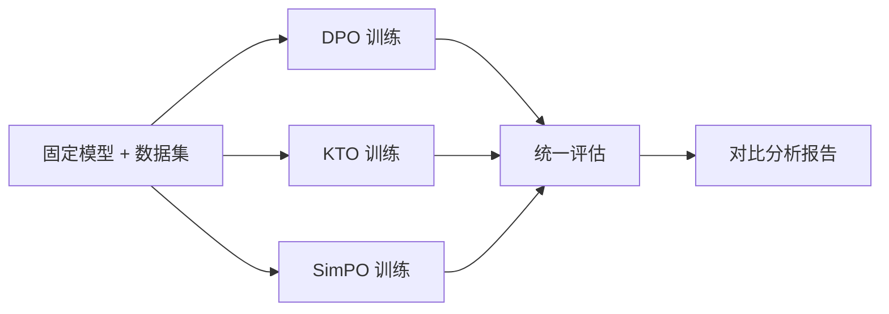

**伪代码**：

```
# 实验主循环
for method in [DPO, KTO, SimPO]:
    model = load_pretrained("gpt2-medium")
    ref_model = copy(model) if method != SimPO else None

    trainer = method.Trainer(
        model=model,
        ref_model=ref_model,
        dataset=preference_data,
        beta=0.1,
        lr=1e-6,
    )

    metrics = trainer.train(num_epochs=3)

    results[method] = {
        "loss_curve": metrics.loss_history,
        "kl_divergence": compute_kl(model, ref_model),
        "generation_quality": evaluate_generations(model),
        "training_time": metrics.total_time,
        "peak_memory": metrics.peak_memory,
    }

compare_and_visualize(results)
```

---

### 项目 4：实现 GRPO 并分析组大小的影响（难度：⭐⭐⭐ 挑战）

**核心目标**：理解 DeepSeek 的 GRPO 创新。

**提供内容：论文关键公式 + 伪代码**

**思路**：

1. **简化场景**：在简单数学题（如加法、乘法）上实现 GRPO
2. **奖励函数**：使用正确性验证作为奖励（答对 +1，答错 -1）
3. **组大小实验**：测试 $G \in \{4, 8, 16, 32, 64\}$ 对训练效果的影响
4. **分析**：
   - 组大小如何影响优势估计的方差？
   - 更大的组是否总是更好？
   - 训练速度和效果之间的权衡

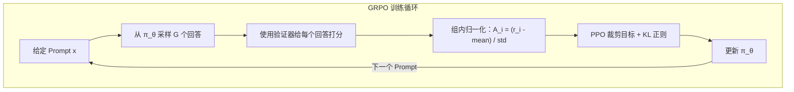

**关键公式**（来自 DeepSeek-Math 论文）：

$$\hat{A}_i = \frac{r_i - \text{mean}(\mathbf{r})}{\text{std}(\mathbf{r}) + \epsilon}$$

$$\mathcal{L}_{\text{GRPO}} = -\frac{1}{G}\sum_{i=1}^{G}\min\left(\frac{\pi_\theta(y_i|x)}{\pi_{\text{old}}(y_i|x)}\hat{A}_i, \text{clip}\left(\frac{\pi_\theta(y_i|x)}{\pi_{\text{old}}(y_i|x)}, 1-\epsilon, 1+\epsilon\right)\hat{A}_i\right) + \beta \text{KL}(\pi_\theta \| \pi_{\text{ref}})$$

**伪代码**：

```
# GRPO 训练循环
for prompt in math_dataset:
    # 1. 采样一组回答
    responses = sample(policy, prompt, num_samples=G)

    # 2. 计算奖励（数学验证）
    rewards = [verify_answer(resp, ground_truth) for resp in responses]

    # 3. 组内归一化
    advantages = (rewards - mean(rewards)) / (std(rewards) + 1e-8)

    # 4. 计算 GRPO 损失
    for (response, advantage) in zip(responses, advantages):
        ratio = policy.prob(response) / old_policy.prob(response)
        clipped_ratio = clip(ratio, 1-eps, 1+eps)
        loss = -min(ratio * advantage, clipped_ratio * advantage)
        loss += beta * kl_penalty(policy, ref_policy, response)

    # 5. 更新策略
    loss.backward()
    optimizer.step()
```

---

### 项目 5：DPO 变体对比实验（难度：⭐⭐ 进阶）

**核心目标**：在同一偏好数据集上实现 DPO、KTO、SimPO，对比收敛速度和最终质量，深入理解不同变体的实际差异。

**提供内容：实验设计 + 关键提示 + 评估框架**

**任务描述**：

1. **实验固定条件**：
   - 基础模型：选择 GPT-2 small (124M) 或 TinyLlama-1.1B
   - 偏好数据集：`Anthropic/hh-rlhf`（取前 5000 条）
   - 学习率：$1 \times 10^{-6}$（所有方法相同）
   - $\beta = 0.1$（所有方法相同）
   - 训练 3 个 epoch

2. **实现三种损失函数**（参考第 4 节的公式）：

```python
# 关键提示：三种损失函数的核心差异

# DPO: 标准 log-sigmoid 损失，需要参考模型
# loss = -log_sigmoid(beta * (log_pi_w - log_ref_w) - beta * (log_pi_l - log_ref_l))

# KTO: 分别处理好/坏回答，需要计算参考点 z_ref
# 好回答: loss = lambda_w * (1 - sigmoid(beta * log_ratio_w - z_ref))
# 坏回答: loss = lambda_l * (1 - sigmoid(z_ref - beta * log_ratio_l))
# 注意: KTO 只需要 (x, y, label) 格式，不需要成对数据

# SimPO: 无需参考模型，使用长度归一化
# loss = -log_sigmoid(beta/|y_w| * log_pi_w - beta/|y_l| * log_pi_l - gamma)
```

3. **评估维度**：
   - 训练损失曲线（是否收敛、收敛速度）
   - 生成文本的质量（使用 GPT-4 或人工评估，10 分制打分）
   - 生成文本的平均长度变化（检验是否存在长度偏差）
   - 与参考模型的 KL 散度变化
   - 训练速度和显存占用

4. **思考题**：
   - 在 `hh-rlhf` 这类安全对齐数据上，哪种方法表现最好？为什么？
   - 如果将成对偏好数据拆分为二元标注（只保留 chosen/rejected 标签），KTO 与 DPO 的效果差距有多大？
   - SimPO 没有参考模型约束，是否更容易"遗忘"原有能力？

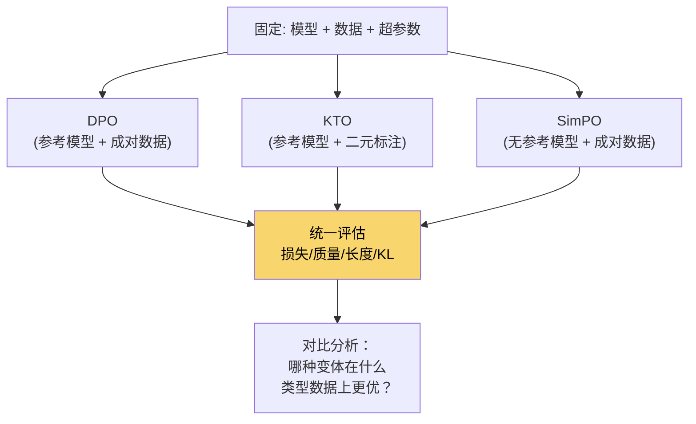

---

## 11. 本章小结

### 核心知识点回顾

1. **DPO 的数学本质**：通过闭式解将奖励函数表示为策略的函数，将 RL 问题转化为分类问题
2. **隐式奖励**：$r(x,y) = \beta \log \frac{\pi_\theta(y|x)}{\pi_{\text{ref}}(y|x)} + \beta \log Z(x)$
3. **DPO 损失函数**：利用 Bradley-Terry 模型和隐式奖励，推导出简洁的损失函数
4. **变体的动机**：每个变体都是为了解决 DPO 的某个具体问题
   - IPO：防止过拟合
   - KTO：去除成对数据需求
   - ORPO：统一 SFT 和偏好优化
   - SimPO：去除参考模型、消除长度偏差
   - GRPO：去除 Critic、使用组排序

### 与相邻模块的关系

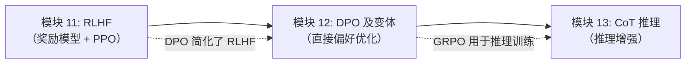

### 推荐阅读

| 论文 | 方法 | 年份 |
|------|------|:----:|
| Rafailov et al., "Direct Preference Optimization" | DPO | 2023 |
| Azar et al., "A General Theoretical Paradigm to Understand Learning from Human Feedback" | IPO | 2023 |
| Ethayarajh et al., "KTO: Model Alignment as Prospect Theoretic Optimization" | KTO | 2024 |
| Hong et al., "ORPO: Monolithic Preference Optimization without Reference Model" | ORPO | 2024 |
| Meng et al., "SimPO: Simple Preference Optimization with a Reference-Free Reward" | SimPO | 2024 |
| Shao et al., "DeepSeekMath: Pushing the Limits of Mathematical Reasoning in Open Language Models" | GRPO | 2024 |
| DeepSeek-AI, "DeepSeek-R1: Incentivizing Reasoning Capability in LLMs via Reinforcement Learning" | GRPO 应用 | 2025 |

### 下一步：从对齐到推理

至此，我们已经完成了 LLM 对齐的"最后一公里"——从模块 10 的监督微调（SFT），到模块 11 的 RLHF，再到本模块的 DPO 及其变体。模型现在已经能够生成有帮助、无害、诚实的回答。

但对齐只是起点，不是终点。对齐后的模型虽然能"正确地回答"，但在需要**深度推理**的任务上（如多步数学证明、复杂代码调试、科学推理）仍然有明显不足。

模块 13 将探讨如何进一步提升模型的推理能力：

- **思维链（Chain-of-Thought）**：通过 prompting 技术引导模型"逐步思考"
- **测试时计算（Test-time Compute Scaling）**：在推理阶段投入更多计算来获得更好的结果
- **推理模型（如 DeepSeek-R1）**：通过 GRPO 强化学习训练模型自主学会长链推理——这正是本章 GRPO 的工业化应用

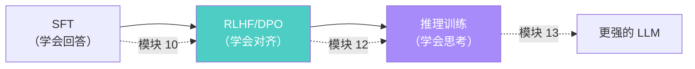
