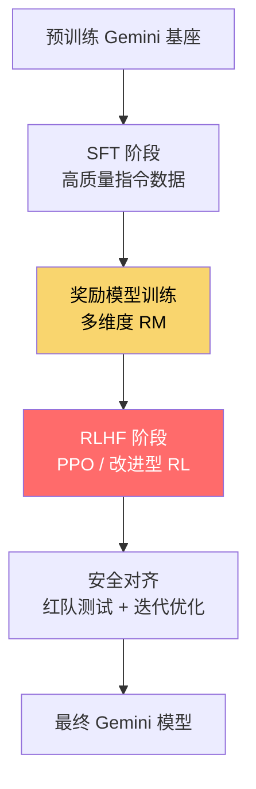
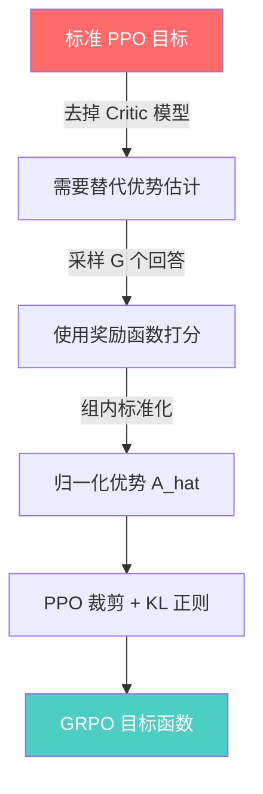
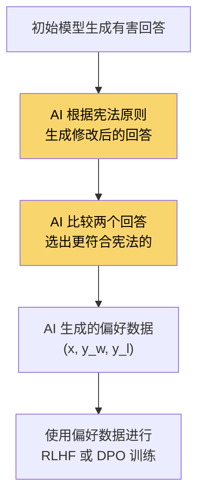
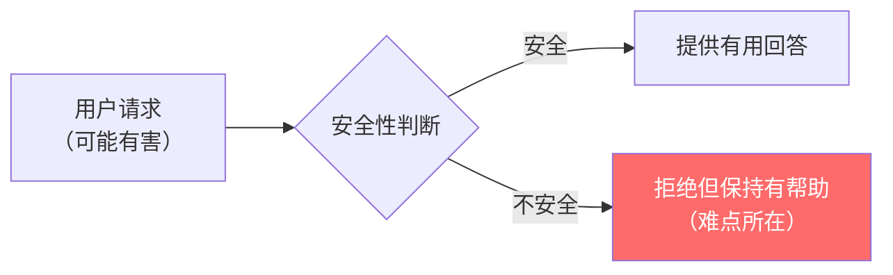
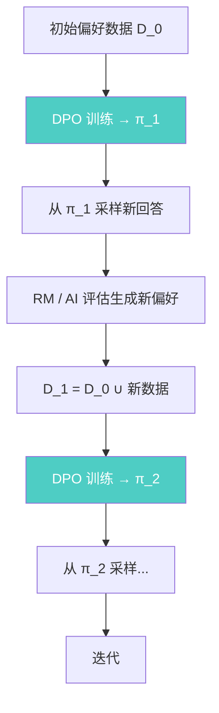
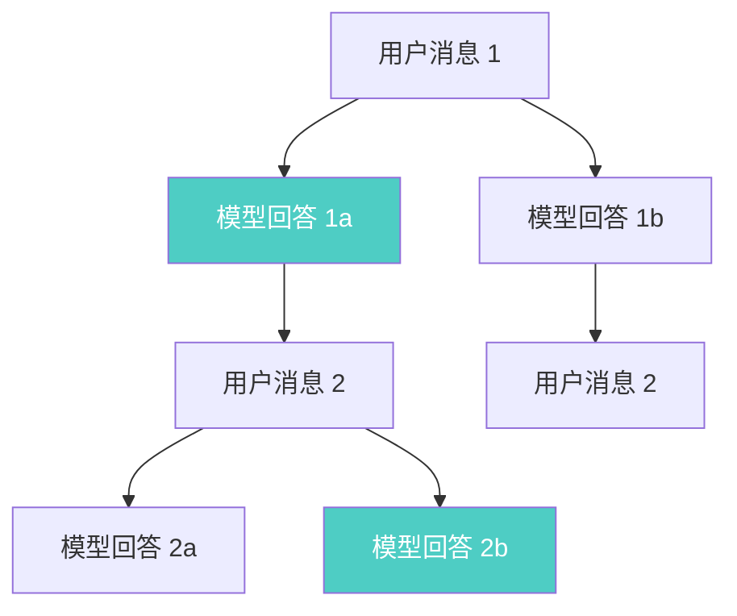
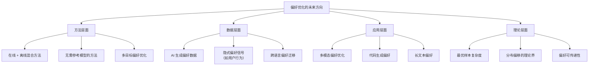

# DPO 进阶：工业实践与前沿研究

> 本文是 [模块12: DPO 及变体](./README.md) 的进阶补充，深入分析 Google、DeepSeek、Anthropic 三条技术线在偏好优化领域的工业实践，以及该领域的前沿研究方向。

---

## 目录

- [1. Google 的偏好优化实践](#1-google-的偏好优化实践)
- [2. DeepSeek 的 GRPO 完整推导与应用](#2-deepseek-的-grpo-完整推导与应用)
- [3. Anthropic 的偏好优化视角](#3-anthropic-的偏好优化视角)
- [4. 前沿话题](#4-前沿话题)

---

## 1. Google 的偏好优化实践

### 1.1 Gemini 中偏好优化的应用

Google 在 Gemini 系列模型的后训练阶段采用了精细化的偏好优化策略。根据 Gemini 技术报告和相关论文，其流程可以概括为：

**多阶段后训练流水线**：



**Google 的多维度奖励模型**：

与单一奖励模型不同，Google 倾向于训练多个专门化的奖励模型：

| 奖励维度 | 描述 | 示例 |
|---------|------|------|
| **有用性（Helpfulness）** | 回答是否准确、完整地解决了用户的问题 | 编程题给出正确代码 |
| **安全性（Safety）** | 回答是否包含有害、偏见或不当内容 | 拒绝生成恶意代码 |
| **事实准确性（Factuality）** | 回答中的事实是否可验证 | 不编造引用和统计数据 |
| **指令遵循（Instruction Following）** | 是否严格按照用户的格式和要求输出 | 用户要求 JSON 格式则输出 JSON |

多维度奖励的组合方式通常为加权求和：

$$r_{\text{total}}(x, y) = \sum_{d=1}^{D} w_d \cdot r_d(x, y)$$

其中 $w_d$ 是各维度的权重，可以根据不同应用场景调整。

**Google 的 RLHF 优化技巧**：

1. **课程学习（Curriculum Learning）**：从简单任务（如短回答）逐步过渡到复杂任务（如多步推理）
2. **自适应 KL 系数**：根据训练进度动态调整 $\beta$，早期更自由探索，后期收紧约束
3. **奖励规范化（Reward Normalization）**：对奖励信号进行标准化，避免训练不稳定
4. **数据混合（Data Mixing）**：将偏好优化数据与通用预训练数据混合，防止能力遗忘

### 1.2 RLHF vs DPO 在工业中的选择

Google 在工业实践中更倾向于 RLHF 而非 DPO，这一选择背后有深层次的技术原因。

**RLHF 的工业优势**：

1. **在线探索能力**：
   - RLHF 在训练过程中持续从当前策略采样新回答
   - 奖励模型可以对这些新回答打分，发现数据集中未覆盖的好回答
   - 这种在线探索使模型能够"自我发现"更好的生成策略

2. **奖励模型的泛化性**：
   - 一旦训练好奖励模型，可以对任意回答评分
   - DPO 的隐式奖励只在训练数据的支持集上有效
   - 对于 OOD（Out-of-Distribution）的回答，奖励模型更具鲁棒性

3. **多维度优化**：
   - 多个独立的奖励模型可以灵活组合
   - DPO 只能优化单一的偏好信号
   - 在安全性和有用性需要权衡时，多维度奖励更灵活

4. **迭代改进**：
   - 奖励模型可以随着新数据不断更新
   - DPO 的偏好数据一旦确定，难以增量更新

**DPO 在工业中的定位**：

尽管 Google 倾向于 RLHF，DPO 在某些场景中仍有价值：

- **快速原型验证**：在正式 RLHF 训练前，用 DPO 快速验证偏好数据的质量
- **资源受限场景**：中小团队或计算资源有限时，DPO 是更实际的选择
- **特定领域微调**：在已经完成 RLHF 的模型基础上，用 DPO 做针对性微调

### 1.3 Google 的偏好数据构建

Google 在偏好数据构建方面投入了大量资源：

**数据收集流程**：


**数据质量保障措施**：

1. **多标注者共识**：同一对比较由多个标注者独立标注，取共识结果
2. **标注指南迭代**：根据标注一致性统计结果不断优化指南
3. **难度分层**：将样本按难度分类，确保训练数据涵盖从简单到困难的各种场景
4. **去偏见处理**：识别和消除标注中的系统性偏见（如长度偏好、风格偏好）

---

## 2. DeepSeek 的 GRPO 完整推导与应用

### 2.1 GRPO 的完整数学推导

GRPO 的核心创新在于：用组内相对排序替代 Critic 模型来估计优势函数。以下是完整的数学推导。

**起点：标准 PPO 的目标函数**

$$\mathcal{L}_{\text{PPO}} = \mathbb{E}_{(s,a) \sim \pi_{\text{old}}}\left[\min\left(\frac{\pi_\theta(a|s)}{\pi_{\text{old}}(a|s)} A^{\pi_{\text{old}}}(s, a), \text{clip}\left(\frac{\pi_\theta(a|s)}{\pi_{\text{old}}(a|s)}, 1-\epsilon, 1+\epsilon\right) A^{\pi_{\text{old}}}(s, a)\right)\right]$$

其中优势函数 $A^{\pi}(s,a) = Q^{\pi}(s,a) - V^{\pi}(s)$ 需要 Critic 模型来估计 $V^{\pi}(s)$。

**GRPO 的关键替换**：

在语言模型的场景中，将"状态-动作"映射为"prompt-回答"。对于给定的 prompt $x$，采样一组回答 $\{y_1, \ldots, y_G\}$，每个回答获得奖励 $r_i$。

**第一步：定义组内归一化优势**

$$\hat{A}_i = \frac{r_i - \mu_G}{\sigma_G + \epsilon}$$

其中：

$$\mu_G = \frac{1}{G}\sum_{j=1}^{G} r_j, \quad \sigma_G = \sqrt{\frac{1}{G}\sum_{j=1}^{G}(r_j - \mu_G)^2}$$

**为什么这是一个合理的优势估计？**

- 优势函数的本质含义是"这个回答比平均水平好多少"
- 组内均值 $\mu_G$ 可以视为 $V(x)$ 的蒙特卡洛估计
- 归一化使得优势具有标准化的尺度，稳定训练

**第二步：构造 GRPO 目标**

$$\mathcal{L}_{\text{GRPO}}(\theta) = -\frac{1}{G}\sum_{i=1}^{G}\frac{1}{|y_i|}\sum_{t=1}^{|y_i|}\left[\min\left(\rho_{i,t}\hat{A}_i, \text{clip}(\rho_{i,t}, 1-\epsilon, 1+\epsilon)\hat{A}_i\right)\right] + \beta \, D_{\text{KL}}$$

其中：

$$\rho_{i,t} = \frac{\pi_\theta(y_{i,t}|x, y_{i,<t})}{\pi_{\text{old}}(y_{i,t}|x, y_{i,<t})}$$

**第三步：KL 正则化**

GRPO 使用逐 token 的 KL 散度进行正则化：

$$D_{\text{KL}} = \frac{1}{G}\sum_{i=1}^{G}\frac{1}{|y_i|}\sum_{t=1}^{|y_i|}\text{KL}\left(\pi_\theta(y_{i,t}|x, y_{i,<t}) \| \pi_{\text{ref}}(y_{i,t}|x, y_{i,<t})\right)$$

DeepSeek 在实践中使用了近似 KL 散度：

$$\text{KL}_{\text{approx}} = \frac{\pi_{\text{ref}}(y_{i,t}|x, y_{i,<t})}{\pi_\theta(y_{i,t}|x, y_{i,<t})} - \log\frac{\pi_{\text{ref}}(y_{i,t}|x, y_{i,<t})}{\pi_\theta(y_{i,t}|x, y_{i,<t})} - 1$$

这个近似形式在数值上更稳定，当 $\pi_\theta \approx \pi_{\text{ref}}$ 时与真实 KL 散度近似相等。

**推导总结**：



### 2.2 GRPO 在 DeepSeek-R1 中的应用

DeepSeek-R1 的训练流程展示了 GRPO 在推理模型训练中的强大能力。

**训练阶段详解**：

**阶段 1：冷启动 SFT**

在直接使用 GRPO 之前，DeepSeek 先用少量（数千条）高质量的长链推理（Chain-of-Thought）数据进行 SFT，让模型建立基本的推理格式。

**阶段 2：GRPO 推理训练**

这是核心阶段。在数学和编程任务上：

- **奖励来源**：基于规则的验证器（而非学习的奖励模型）
  - 数学题：比较最终答案是否正确
  - 编程题：运行测试用例
- **组大小**：通常 $G = 64$
- **采样策略**：使用温度采样（temperature > 1）增加多样性
- **发现**：模型在训练过程中自发地学会了长链推理、自我验证和反思等能力

**阶段 3：拒绝采样 + SFT**

从 GRPO 训练后的模型中采样大量回答，保留正确的高质量回答，用于 SFT：


**阶段 4：GRPO 全场景训练**

将 GRPO 扩展到通用任务（对话、写作、问答等），使用更丰富的奖励信号。

### 2.3 GRPO 与标准 PPO 的对比实验

根据 DeepSeek 的实验结果：

| 指标 | PPO | GRPO |
|------|-----|------|
| 数学推理准确率（MATH） | 基准 | 相当或更高 |
| 编程能力（HumanEval） | 基准 | 相当 |
| 训练显存（相对） | 1.0x | 0.6-0.7x |
| 训练速度（相对） | 1.0x | 0.8-0.9x |
| 训练稳定性 | 需要精心调参 | 较为稳定 |

**GRPO 的训练速度稍慢的原因**：

- 每个训练步需要采样 $G$ 个完整回答（PPO 通常只采样 1 个）
- 但总体效率更高，因为省去了 Critic 模型的训练和推理开销

**组大小 $G$ 的影响**：

| 组大小 $G$ | 优势估计方差 | 训练速度 | 最终性能 |
|:---------:|:-----------:|:-------:|:-------:|
| 4 | 高 | 快 | 较差 |
| 16 | 中 | 中 | 良好 |
| 64 | 低 | 慢 | 最优 |
| 128 | 很低 | 很慢 | 边际改善 |

**规律**：组大小增加带来的收益递减，$G = 64$ 通常是性价比最优的选择。

### 2.4 GRPO 的优势与局限

**优势**：

1. **无需 Critic 模型**：节省大量计算和存储资源
2. **适合可验证任务**：数学、编程等有客观评判标准的任务
3. **训练稳定**：组内归一化提供了天然的方差缩减
4. **可扩展性好**：可以方便地调整组大小来平衡效率和效果

**局限**：

1. **需要外部奖励**：依赖规则验证器或其他奖励来源，不适用于纯主观偏好
2. **采样开销**：需要大量采样，对推理速度有要求
3. **组大小敏感**：太小导致优势估计不准，太大导致计算开销过高
4. **不适合开放式任务**：对话、创意写作等任务难以设计可靠的规则奖励

---

## 3. Anthropic 的偏好优化视角

### 3.1 Anthropic 对 DPO 类方法的评估

Anthropic 在偏好优化领域的立场可以从其公开的研究中窥见一二。

**已知信息**：

1. **Constitutional AI（CAI）**：Anthropic 的核心对齐方法，使用 AI 反馈代替/补充人类反馈
2. **RLHF 作为基础**：Anthropic 的早期 Claude 模型使用 RLHF 进行对齐
3. **安全优先**：Anthropic 特别关注偏好优化中的安全对齐方面

**CAI 的偏好数据生成流程**：



**宪法原则示例**：

```
1. 请选择更有帮助、更无害、更诚实的回答。
2. 请选择不鼓励非法活动的回答。
3. 请选择不包含种族歧视或性别歧视内容的回答。
4. 请选择更尊重用户隐私的回答。
```

### 3.2 Constitutional AI 与 DPO 的结合可能性 [推测]

[推测] 基于 CAI 的框架和 DPO 的数学特性，两者结合的方式可能包括：

**方案 1：CAI 生成偏好数据 + DPO 训练**

最直接的结合方式。用 CAI 的流程生成偏好数据，然后用 DPO 代替 RLHF 进行训练：


**可能的优势**：
- DPO 训练更简单、更稳定
- 不需要训练奖励模型
- 可以快速迭代

**可能的劣势**：
- 离线数据可能不够多样化
- 缺少在线探索，可能错过更好的回答

**方案 2：迭代式 CAI + DPO**

[推测] 多轮迭代可以缓解离线 DPO 的局限：

```
Round 1: 初始模型 → CAI 生成偏好数据 → DPO → 模型_v1
Round 2: 模型_v1 → CAI 生成新偏好数据 → DPO → 模型_v2
Round 3: 模型_v2 → CAI 生成新偏好数据 → DPO → 模型_v3
...
```

每轮使用当前最新模型生成回答，然后用 CAI 评估，从而不断改进。

**方案 3：KTO 用于安全标注** [推测]

[推测] 对于安全对齐场景，KTO 可能比 DPO 更合适：
- 安全标注通常是二元的（安全/不安全），天然适合 KTO 的数据格式
- 不需要成对比较，降低标注成本
- 损失厌恶特性使模型对"不安全"回答更敏感，有利于安全对齐

### 3.3 偏好优化中的安全对齐

安全对齐是 Anthropic 最关注的议题之一。偏好优化在安全对齐中面临的独特挑战：

**挑战 1：安全与有用性的权衡**



模型需要在"拒绝有害请求"和"保持有用性"之间找到平衡。偏好优化的损失函数需要同时考虑这两个维度。

**挑战 2：对抗性攻击**

攻击者可能通过精心构造的 prompt 绕过安全防护（如越狱攻击）。偏好优化的训练数据需要包含足够的对抗性样本。

**挑战 3：长尾风险**

安全问题的分布是长尾的——大多数请求是安全的，但极少数不安全请求可能造成严重后果。标准的偏好优化方法可能对长尾样本拟合不足。

[推测] Anthropic 可能采用的策略：
- 在偏好数据中过采样安全相关的样本
- 对安全性维度使用更高的损失权重
- 结合 CAI 的持续迭代来覆盖更多的安全场景

---

## 4. 前沿话题

### 4.1 在线偏好优化（Online DPO）

标准 DPO 是一种离线方法：使用预先收集的偏好数据训练。Online DPO 试图结合 RLHF 的在线探索优势和 DPO 的简单性。

**核心思想**：在 DPO 训练过程中，动态地从当前策略生成新的回答，并使用奖励模型或 AI 评估生成新的偏好标签。

**Online DPO 的流程**：



**Online DPO 的数学形式**：

在第 $t$ 轮迭代中：

1. 使用当前策略 $\pi_t$ 生成新回答：$y_1, y_2 \sim \pi_t(\cdot|x)$
2. 使用奖励模型或 AI 评估确定偏好：$(x, y_w, y_l)$
3. 更新数据集：$\mathcal{D}_{t+1} = \mathcal{D}_t \cup \{(x, y_w, y_l)\}$
4. 训练新策略：$\pi_{t+1} = \arg\min_\pi \mathcal{L}_{\text{DPO}}(\pi; \pi_{\text{ref}}, \mathcal{D}_{t+1})$

**优势**：
- 缓解了离线 DPO 的分布偏移问题
- 保留了 DPO 训练的简单性
- 可以发现训练初期数据集中未覆盖的回答模式

**挑战**：
- 需要一个可靠的在线评估器（奖励模型或 AI）
- 增加了训练的总时间
- 如何平衡旧数据和新数据的权重是一个开放问题

### 4.2 迭代 DPO 与自我对弈

**自我对弈（Self-Play）偏好优化**是近期的一个活跃研究方向，其核心思想是：让模型与自己的旧版本对弈，不断生成更好的偏好数据。

**SPIN（Self-Play Fine-Tuning）**：

SPIN 的基本思想：让当前策略 $\pi_t$ 生成的回答与人类参考回答进行比较。

$$\mathcal{L}_{\text{SPIN}} = -\mathbb{E}\left[\log \sigma\left(\beta \log \frac{\pi_\theta(y_{\text{human}}|x)}{\pi_t(y_{\text{human}}|x)} - \beta \log \frac{\pi_\theta(y_{\text{model}}|x)}{\pi_t(y_{\text{model}}|x)}\right)\right]$$

其中 $y_{\text{human}}$ 是人类参考回答，$y_{\text{model}} \sim \pi_t(\cdot|x)$ 是当前模型的采样回答。

**收敛性质**：当模型的生成分布完全匹配人类参考分布时，SPIN 自然收敛（因为此时无法区分模型和人类的回答）。

**迭代 DPO 的一般框架**：

```
for round in range(num_rounds):
    # 1. 使用当前模型生成回答
    model_responses = generate(current_model, prompts)

    # 2. 评估回答质量（人类 / AI / 规则）
    preferences = evaluate(model_responses, reference_responses)

    # 3. 构建偏好数据
    pref_data = make_preference_pairs(preferences)

    # 4. DPO 训练
    current_model = dpo_train(current_model, pref_data, ref_model)

    # 5. 可选：更新参考模型
    ref_model = copy(current_model)
```

### 4.3 多轮对话的偏好优化

标准的偏好优化方法主要针对单轮对话（一个 prompt、一个回答）。但实际应用中，大多数交互是多轮对话。

**多轮对话偏好优化的挑战**：

| 挑战 | 说明 |
|------|------|
| **信用分配（Credit Assignment）** | 一轮好的对话中，哪一个回合贡献最大？ |
| **上下文依赖** | 同一个回答在不同对话历史中可能有不同的好坏评价 |
| **状态空间爆炸** | 多轮对话的可能路径指数增长 |
| **标注成本** | 标注完整对话的偏好比单轮回答贵得多 |

**方法 1：回合级偏好优化**

将多轮对话拆分为多个单轮，每轮独立进行偏好优化：

$$\mathcal{L} = \sum_{t=1}^{T} \mathcal{L}_{\text{DPO}}(x_{1:t}, y_{w,t}, y_{l,t})$$

其中 $x_{1:t}$ 是到第 $t$ 轮的完整对话历史。

**方法 2：轨迹级偏好优化**

将整个对话作为一个整体进行偏好优化：

$$\mathcal{L} = \mathcal{L}_{\text{DPO}}\left(x, (y_1^w, y_2^w, \ldots, y_T^w), (y_1^l, y_2^l, \ldots, y_T^l)\right)$$

**方法 3：树搜索 + 偏好优化**



在对话树的每个节点进行偏好比较，然后使用全局奖励（如对话整体满意度）来指导优化。

### 4.4 偏好优化的理论边界

**DPO 的理论分析**：

近期的理论研究揭示了 DPO 的一些基本性质和局限：

**1. 等价性条件**

DPO 与 RLHF 的等价性依赖于以下假设：
- 偏好数据覆盖了策略可能生成的所有回答（完全覆盖假设）
- Bradley-Terry 模型正确描述了人类偏好
- 优化达到了全局最优

**当这些假设不成立时**：
- 覆盖不足导致分布偏移
- Bradley-Terry 模型与真实偏好不一致导致优化方向偏差
- 局部最优可能远离 RLHF 的最优解

**2. 样本复杂度**

理论上，DPO 的样本复杂度与以下因素相关：
- 策略空间的复杂度（如模型参数量）
- 偏好数据的噪声水平
- 参考模型与最优策略的距离

$$ n = \tilde{O}\left(\frac{d}{\epsilon^2}\right) $$

其中 $n$ 是所需样本数，$d$ 是有效维度，$\epsilon$ 是优化精度。

**3. 过拟合边界**

DPO 在有限数据下的过拟合行为可以用以下方式刻画：

- 当训练步数 $T \to \infty$ 时，DPO 的隐式奖励差 $\hat{r}_w - \hat{r}_l \to \infty$
- 这意味着策略会变得越来越确定，最终退化为只在偏好数据的 $y_w$ 上有概率
- IPO 通过将目标设为有限值来防止这种退化

**4. 离线偏好优化的不可能性结果**

悲观结论：在最一般的情况下，离线偏好优化无法保证找到与在线 RLHF 相同的最优策略。这是因为离线数据无法覆盖所有可能的回答，导致隐式奖励在未覆盖区域的外推可能不正确。

乐观结论：在数据分布足够接近最优策略，且偏好关系满足一定的单调性条件时，离线 DPO 可以在多项式样本复杂度下逼近最优策略。

### 4.5 未来发展方向



**值得关注的研究方向**：

1. **在线与离线的最优混合**：如何在训练过程中最优地平衡旧的离线数据和新生成的在线数据？
2. **人类偏好的建模**：Bradley-Terry 模型过于简单，如何建模更复杂的偏好结构（如传递性违反、上下文依赖偏好）？
3. **多模态偏好**：如何将偏好优化扩展到图像、视频、音频等模态？
4. **可扩展的偏好收集**：如何利用 AI 反馈、隐式信号等降低偏好数据的收集成本？
5. **理论与实践的统一**：现有理论分析的假设过强，如何建立更贴近实践的理论框架？
