# 模块13：CoT与推理 — 思维链与测试时计算

## 章节定位

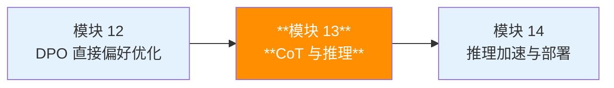

**推理能力的意义**：前面的模块讲解了如何训练和对齐 LLM，但这些模型本质上仍是"知识检索器"——它们擅长回忆和复述训练数据中的知识，却难以解决需要多步推理的复杂问题。本模块标志着 LLM 能力的关键跃迁：**从"知道什么"到"能推理什么"**。Chain-of-Thought、Self-Consistency、Test-time Compute Scaling 和推理模型（DeepSeek-R1、OpenAI o1/o3）等技术，让 LLM 具备了真正的"思考"能力——分解问题、逐步推导、自我检验、回溯修正。

**前置知识**：
- **RLHF/DPO（模块 11-12）**：推理模型的训练高度依赖强化学习（如 DeepSeek-R1 使用 GRPO），理解 RL 基础和偏好优化是理解本章训练方法的前提
- **Transformer 架构（模块 3-5）**：理解自回归生成和注意力机制，有助于理解为什么 CoT 能增加有效计算深度
- **Scaling Laws（模块 8）**：本章将引入"测试时 Scaling Law"这一全新维度，与训练时 Scaling Law 形成互补

> 推理是智能的核心。本章将从 Chain-of-Thought Prompting 出发，系统讲解 LLM 的推理增强技术：从 Few-shot CoT 到 Self-Consistency，从 Tree of Thoughts 到 Test-time Compute Scaling，再到 DeepSeek-R1 等推理模型的训练方法。我们还将深入推理评估基准，理解如何衡量模型的推理能力。

---

## 目录

- [1. 思维链（Chain-of-Thought）](#1-思维链chain-of-thought)
- [2. 高级推理策略](#2-高级推理策略)
- [3. 测试时计算（Test-time Compute Scaling）](#3-测试时计算test-time-compute-scaling)
- [4. 推理模型](#4-推理模型)
- [5. 推理评估](#5-推理评估)
- [6. 三条技术线的推理实践](#6-三条技术线的推理实践)
- [7. 项目实践](#7-项目实践)
- [8. 本章小结](#8-本章小结)
- [9. 参考文献](#9-参考文献)

---

## 1. 思维链（Chain-of-Thought）

### 1.1 CoT Prompting 的基本思想

人类在解决复杂问题时，不会直接给出答案，而是会逐步推理：先理解问题、分解子步骤、逐步求解、最后汇总。**Chain-of-Thought (CoT) Prompting** 正是将这一思路引入 LLM：通过提示模型"展示推理过程"，使其生成中间推理步骤，从而大幅提升复杂任务的表现。

**类比**：考试时直接写答案容易出错，但如果在草稿纸上列出推理步骤，正确率会大幅提高。CoT 就是给模型一张"草稿纸"。

**核心论文**：Wei et al. (2022) "Chain-of-Thought Prompting Elicits Reasoning in Large Language Models"

### 1.2 Few-shot CoT

Few-shot CoT 在 prompt 中提供带有推理步骤的示例，引导模型在回答新问题时也展示推理过程：

```
Q: Roger有5个网球。他又买了2罐网球，每罐有3个。现在他有多少个网球？
A: Roger一开始有5个网球。2罐网球共有2×3=6个。5+6=11。答案是11。

Q: 食堂有23个苹果。如果他们用了20个做午餐，又买了6个，现在有多少个苹果？
A: 食堂一开始有23个苹果。用了20个后剩23-20=3个。又买了6个，3+6=9。答案是9。
```

**数学描述**：设 prompt 为 $\mathcal{P} = \{(q_i, r_i, a_i)\}_{i=1}^{k}$，其中 $q_i$ 是问题，$r_i$ 是推理链，$a_i$ 是最终答案。对于新问题 $q_{new}$，模型生成：

$$P(r_{new}, a_{new} \mid \mathcal{P}, q_{new}) = P(r_{new} \mid \mathcal{P}, q_{new}) \cdot P(a_{new} \mid \mathcal{P}, q_{new}, r_{new})$$

关键在于：推理链 $r_{new}$ 的生成为最终答案 $a_{new}$ 提供了更丰富的条件信息。

### 1.3 Zero-shot CoT

Kojima et al. (2022) 发现了一个惊人的结果：仅在 prompt 末尾添加 **"Let's think step by step"**，就能激发模型的推理能力，无需提供任何示例。

```
Q: 一个人的年龄是他儿子的3倍，儿子今年10岁。5年后这个人多大？
A: Let's think step by step.
   儿子今年10岁，父亲是儿子的3倍，所以父亲今年30岁。
   5年后父亲是30+5=35岁。
   答案是35岁。
```

**Zero-shot CoT 的两阶段推理**：

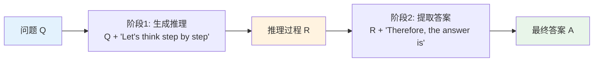

### 1.4 CoT 为什么有效？

CoT 的有效性可以从多个角度理解：

**角度 1：计算复杂性视角**

标准的 Transformer 是一个固定深度的计算图。对于输入长度 $n$，$L$ 层 Transformer 提供的计算量是固定的 $O(L)$。但许多推理问题的计算复杂度随问题规模增长。

CoT 通过生成中间 token，**动态增加了模型可用的计算步数**：

$$\text{有效计算深度} = L \times (n + n_{CoT})$$

其中 $n_{CoT}$ 是推理链中的 token 数量。这相当于让固定深度的网络模拟更深的计算。

**角度 2：信息论视角**

直接预测答案要求模型将所有中间推理"压缩"到隐藏状态中：

$$P(a \mid q) \quad \text{vs} \quad P(a \mid q, r) = \sum_{r} P(r \mid q) P(a \mid q, r)$$

推理链 $r$ 将复杂的 $P(a \mid q)$ 分解为更简单的条件概率链，每一步的预测更容易。

**角度 3：工作记忆视角**

Transformer 的隐藏状态维度是固定的（如 4096 维），能存储的信息有限。CoT 将中间结果写入输出 token 序列，相当于一个**外部工作记忆**，后续步骤可以通过注意力机制回看这些中间结果。

### 1.5 CoT 的涌现特性

CoT 的一个关键特性是**涌现性（emergence）**：只有在足够大的模型上才有效。

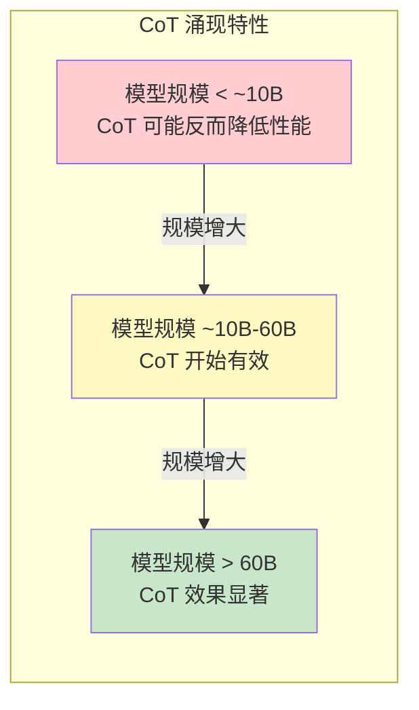

**实验证据**（Wei et al., 2022）：

| 模型规模 | 标准 prompting | CoT prompting | 提升幅度 |
|-----------|---------------|---------------|----------|
| PaLM 8B | 33.0% (GSM8K) | 22.0% | -11.0% (下降) |
| PaLM 62B | 55.0% | 58.0% | +3.0% |
| PaLM 540B | 56.0% | 74.0% | **+18.0%** |

**为什么会涌现？** 一种假说是：CoT 需要模型同时具备多种能力——语言理解、算术运算、逻辑推理、结果整合。这些能力各自有涌现阈值，只有当模型规模足够大、所有子能力都达标时，CoT 才能有效工作。

---

## 2. 高级推理策略

### 2.1 Self-Consistency：多次采样 + 多数投票

CoT 的一个问题是：单次采样可能产生错误的推理路径。**Self-Consistency**（Wang et al., 2023）的核心思想是：从多条推理路径中寻找最一致的答案。

**类比**：就像让多个人独立解题，然后投票选出出现最多的答案。不同的人可能用不同方法，但如果多数人得到相同答案，那个答案很可能是正确的。

**数学框架**：

给定问题 $q$，我们从模型中采样 $N$ 条推理路径 $\{(r_i, a_i)\}_{i=1}^{N}$：

$$(r_i, a_i) \sim P_\theta(\cdot \mid q), \quad i = 1, 2, \ldots, N$$

最终答案通过**多数投票（majority voting）**决定：

$$\hat{a} = \arg\max_{a} \sum_{i=1}^{N} \mathbf{1}[a_i = a]$$

其中 $\mathbf{1}[\cdot]$ 是指示函数。

**带权重版本**：考虑每条推理路径的置信度：

$$\hat{a} = \arg\max_{a} \sum_{i=1}^{N} P_\theta(r_i, a_i \mid q) \cdot \mathbf{1}[a_i = a]$$

但实践中，简单投票（unweighted）通常效果就很好。

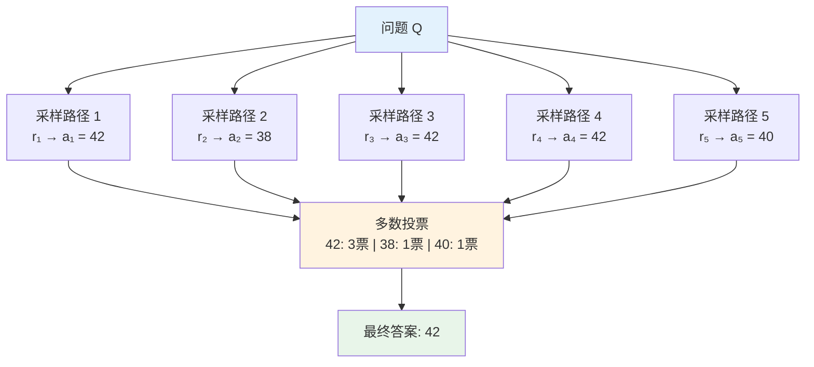

**采样温度的影响**：

温度 $T$ 控制了采样的多样性：

$$P(x_t \mid x_{<t}) = \frac{\exp(z_t / T)}{\sum_{j} \exp(z_j / T)}$$

- $T \to 0$：贪心解码，所有路径相同（Self-Consistency 退化）
- $T$ 适中（0.5-0.8）：路径多样但质量较高（最佳选择）
- $T \to 1$：高度多样，但可能出现质量差的路径

**Self-Consistency vs Greedy CoT 的性能对比**：

| 数据集 | Greedy CoT | Self-Consistency (N=40) | 提升 |
|--------|-----------|------------------------|------|
| GSM8K | 56.5% | 74.4% | +17.9% |
| SVAMP | 79.0% | 86.6% | +7.6% |
| AQuA | 48.0% | 55.5% | +7.5% |

### 2.2 Tree of Thoughts (ToT)

**Tree of Thoughts**（Yao et al., 2023）将推理过程建模为一棵搜索树，每个节点是一个"思维状态"，可以进行前进、回溯和评估。

**类比**：CoT 是一条直线走到底（线性推理），ToT 则像下棋——每步考虑多种走法，评估局势，必要时回退。

**核心框架**：

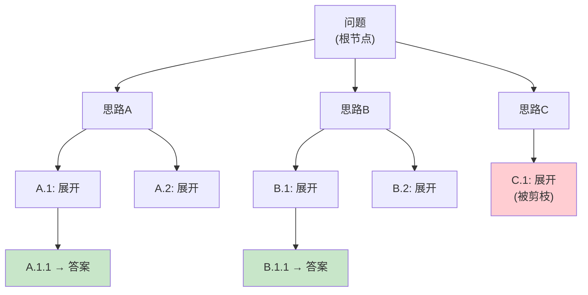

**形式化定义**：

ToT 由四个要素构成：
1. **思维分解**：将问题分解为若干中间步骤，每步生成 $k$ 个候选思维 $t_1^{(i)}, \ldots, t_k^{(i)}$
2. **思维生成**：$t_j^{(i)} \sim P_\theta(\cdot \mid q, t^{(1)}, \ldots, t^{(i-1)})$
3. **状态评估**：$V(s) = \text{evaluate}(q, t^{(1)}, \ldots, t^{(i)})$，评估当前推理路径的前景
4. **搜索算法**：BFS 或 DFS 遍历搜索树

**BFS vs DFS 的选择**：

| 特性 | BFS（广度优先） | DFS（深度优先） |
|------|----------------|----------------|
| 内存使用 | $O(b^d)$，较高 | $O(bd)$，较低 |
| 适用场景 | 步骤较少、分支较多 | 步骤较多、需要深入探索 |
| 剪枝方式 | 每层保留 top-k 节点 | 回溯时剪枝 |
| 最优性 | 能找到最短路径 | 不保证最优 |

**BFS 搜索的伪代码**：

```python
def bfs_search(problem, breadth_limit=5, max_depth=3):
    """
    BFS 搜索策略

    Args:
        problem: 问题描述
        breadth_limit: 每层保留的最大节点数
        max_depth: 最大搜索深度
    """
    # 初始状态
    current_states = [problem]

    for depth in range(max_depth):
        # 为每个状态生成候选思维
        candidates = []
        for state in current_states:
            new_thoughts = generate_thoughts(state, k=breadth_limit)
            candidates.extend(new_thoughts)

        # 评估所有候选
        scores = [evaluate(c) for c in candidates]

        # 保留 top-k
        top_indices = argsort(scores)[-breadth_limit:]
        current_states = [candidates[i] for i in top_indices]

    # 返回最优路径
    return best_state(current_states)
```

**评估函数的设计**：

评估函数 $V(s)$ 可以通过 LLM 自身实现：
- **值评估**：提示 LLM 对当前状态打分（1-10）
- **投票评估**：提示 LLM 判断"这个推理路径是否有前途？"，多次采样取多数

### 2.3 Least-to-Most Prompting

**Least-to-Most Prompting**（Zhou et al., 2023）将复杂问题分解为从简到难的子问题序列，逐步求解：

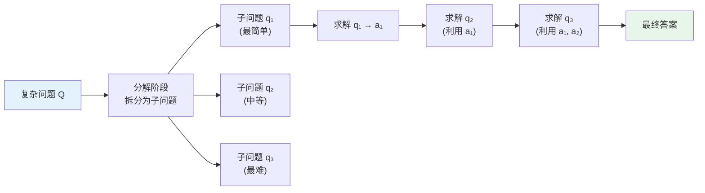

**两阶段流程**：
1. **分解**：给定问题 $Q$，模型生成子问题序列 $q_1, q_2, \ldots, q_m$（从简到难）
2. **顺序求解**：依次求解每个子问题，前面子问题的答案作为后续子问题的上下文

$$a_i = \text{LLM}(q_i \mid q_1, a_1, \ldots, q_{i-1}, a_{i-1})$$

**与 CoT 的区别**：CoT 要求模型一次性生成完整的推理链，而 Least-to-Most 将推理分解为多轮交互，每轮问题更简单。

### 2.4 ReAct：推理 + 行动的交替

**ReAct**（Yao et al., 2023）将推理（Reasoning）和行动（Acting）交替进行，使 LLM 能够与外部环境交互：

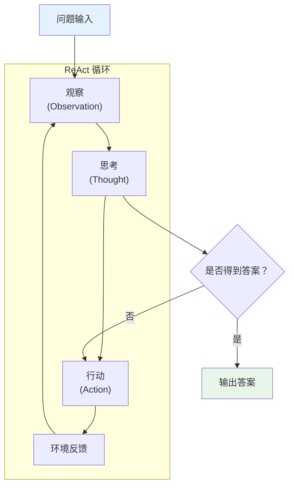

**ReAct 的交互示例**：

```
问题：《权力的游戏》的作者出生在哪个城市？

Thought 1: 我需要先找到《权力的游戏》的作者。
Action 1: Search["权力的游戏 作者"]
Observation 1: 《权力的游戏》是乔治·R·R·马丁所著。

Thought 2: 现在我需要查找乔治·R·R·马丁的出生地。
Action 2: Search["乔治·R·R·马丁 出生地"]
Observation 2: 乔治·R·R·马丁出生于美国新泽西州贝约纳。

Thought 3: 我找到了答案。
Action 3: Finish["贝约纳"]
```

**ReAct vs 纯 CoT 的优势**：
- CoT 的推理完全在模型内部，可能出现"幻觉"
- ReAct 通过外部工具获取真实信息，推理有据可依
- 特别适合需要实时信息的问题（搜索、数据库查询等）

---

## 3. 测试时计算（Test-time Compute Scaling）

### 3.1 核心洞察

传统的 Scaling Laws 关注**训练时计算**：更多数据、更大模型、更多训练计算 → 更好的性能。

**测试时计算（Test-time Compute）**提出了一个互补的视角：**在推理时投入更多计算，也能获得更好的结果**。

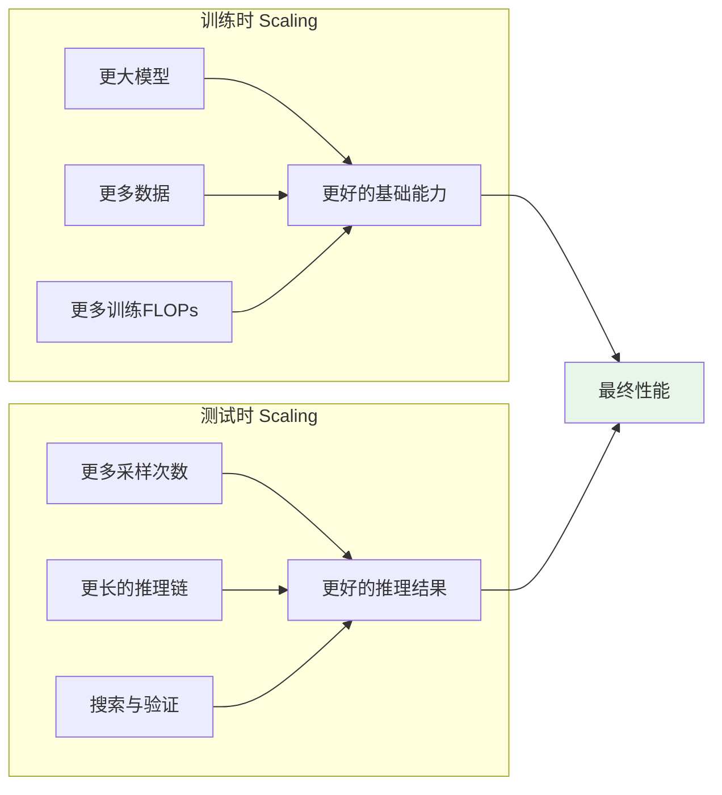

**核心公式**：

$$\text{Performance} = f(\text{Train Compute}) \times g(\text{Test Compute})$$

这意味着一个较小的模型配合充足的测试时计算，可能超过一个更大但不使用测试时计算的模型。

### 3.2 与训练时 Scaling Laws 的互补

**Snell et al. (2024) "Scaling LLM Test-Time Compute"** 的关键发现：

$$\text{Effective FLOPs}(C_{test}) = C_{train} + \alpha \cdot C_{test}$$

其中 $\alpha$ 是测试时计算的"等效系数"。他们发现：
- 对于中等难度问题，测试时计算的收益最大
- 对于非常简单或非常困难的问题，增加测试时计算收益有限
- 存在一个**最优分配策略**：给定总预算，如何分配训练和测试计算

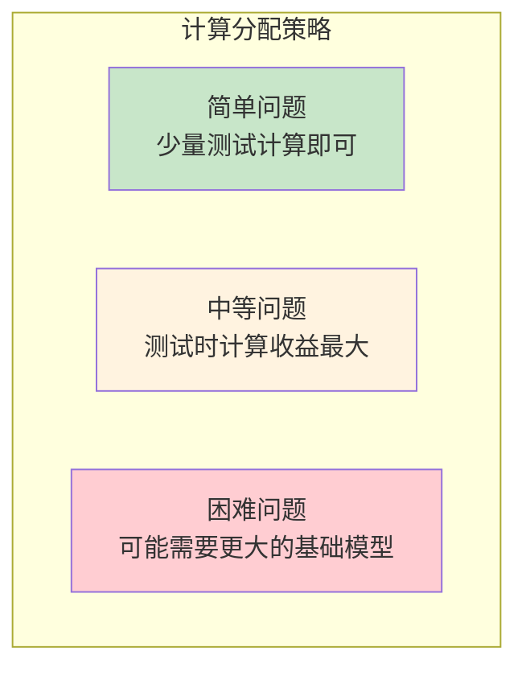

### 3.3 Verifier 模型

**Verifier**（验证器）是测试时计算的关键组件。与其让模型自己判断答案是否正确，不如训练一个专门的模型来验证。

**Verifier 的数学框架**：

给定问题 $q$ 和候选解 $(r, a)$（推理过程 + 答案），Verifier 输出一个分数：

$$V(q, r, a) \in [0, 1]$$

表示该解是正确的概率。

**两种 Verifier**：

| 类型 | 名称 | 评估粒度 | 公式 |
|------|------|----------|------|
| ORM | 结果奖励模型 | 只看最终答案 | $V_{ORM}(q, a)$ |
| PRM | 过程奖励模型 | 评估每个推理步骤 | $V_{PRM}(q, r_1, r_2, \ldots, r_k)$ |

**ORM（Outcome Reward Model）**：

$$V_{ORM}(q, a) = \sigma(f_\phi(q, a))$$

只关心最终答案是否正确，训练数据容易获取（只需判断答案对错）。

**PRM（Process Reward Model）**：

$$V_{PRM}(q, r_1, \ldots, r_k) = \prod_{i=1}^{k} P(\text{step } r_i \text{ correct} \mid q, r_1, \ldots, r_{i-1})$$

评估每个推理步骤的正确性，能更精确地定位错误，但训练数据需要逐步标注，成本更高。

**PRM vs ORM 的直觉**：

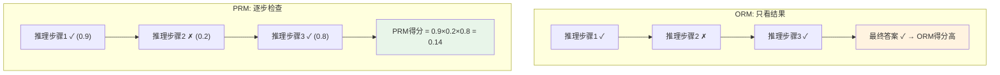

PRM 能发现中间步骤的错误，即使最终答案碰巧正确（比如步骤 2 错了但步骤 3 恰好"纠正"了），PRM 也会给出低分。

### 3.4 Best-of-N 采样

**Best-of-N** 是最简单也最有效的测试时计算策略：

1. 对同一问题采样 $N$ 个回答
2. 用 Verifier 对每个回答打分
3. 选择分数最高的回答

$$\hat{a} = \arg\max_{(r_i, a_i)} V(q, r_i, a_i), \quad i = 1, \ldots, N$$

**与 Self-Consistency 的区别**：

| 方法 | 选择策略 | 是否需要 Verifier |
|------|----------|------------------|
| Self-Consistency | 多数投票 | 不需要 |
| Best-of-N | Verifier 评分 | 需要 |

**Best-of-N 的 Scaling 行为**：

设 Verifier 将正确答案排在第一的概率为 $p$，则 Best-of-N 中至少有一个正确答案的概率为：

$$P(\text{at least one correct}) = 1 - (1-p)^N$$

当 $p = 0.3$，$N = 10$ 时，$P = 1 - 0.7^{10} \approx 0.97$。

这说明即使单次正确率只有 30%，采样 10 次后通过 Verifier 筛选，正确率可以达到 97%。

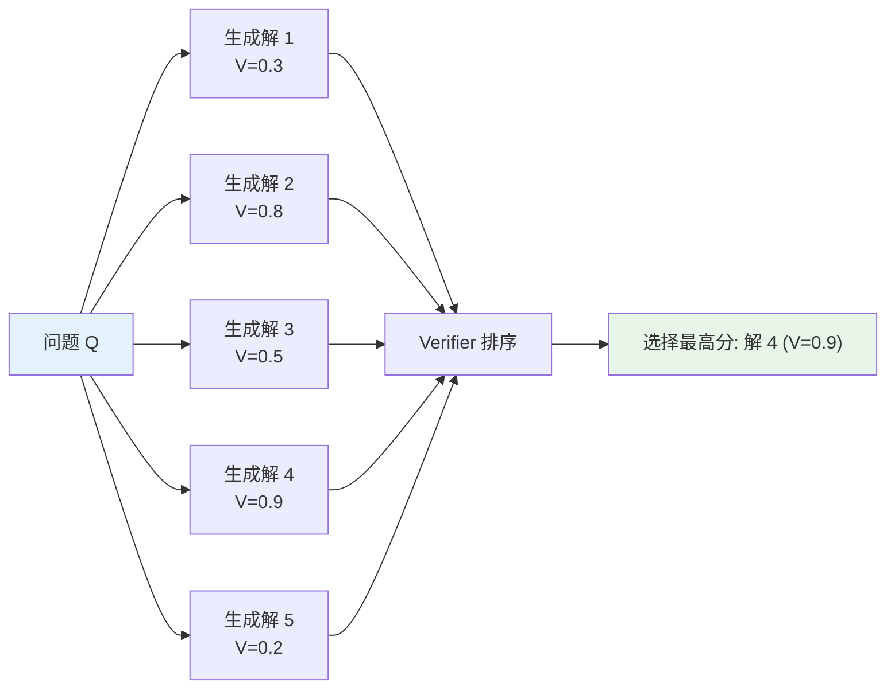

### 3.5 Best-of-N 的数学深入分析

Best-of-N 策略的效果可以通过更精细的概率分析来理解。

**基本模型**：假设模型对某道题的单次正确率为 $p$，且每次采样独立。则 $N$ 次采样中至少有一个正确答案的概率为：

$$P(\text{至少一个正确}) = 1 - (1-p)^N$$

**收益递减分析**：对 $N$ 求导可以看出边际收益递减的规律：

$$\frac{\partial P}{\partial N} = -(1-p)^N \ln(1-p)$$

当 $N$ 增大时，$(1-p)^N$ 指数衰减，因此每增加一次采样的边际收益也在衰减。

**具体数值示例**：

| $N$ | $p=0.1$ | $p=0.3$ | $p=0.5$ |
|-----|---------|---------|---------|
| 1 | 10.0% | 30.0% | 50.0% |
| 4 | 34.4% | 76.0% | 93.8% |
| 8 | 57.0% | 94.2% | 99.6% |
| 16 | 81.5% | 99.7% | ~100% |
| 32 | 96.6% | ~100% | ~100% |

**关键洞察**：当 $p$ 很低时（模型能力弱），即使 $N$ 很大也需要 Verifier 足够准确才有效；当 $p$ 已经较高时，少量采样就能接近 100%。**Best-of-N 放大的是模型已有的能力，而非凭空创造新能力**。

### 3.6 多数投票（Majority Voting）的深入分析

**多数投票与 Self-Consistency 的关系**：Self-Consistency（第 2.1 节）本质上就是一种多数投票策略。其核心假设是：正确的推理路径更容易"收敛"到同一答案。

**简单投票 vs 加权投票**：

| 策略 | 公式 | 优势 | 劣势 |
|------|------|------|------|
| 简单投票 | $\hat{a} = \arg\max_a \sum_i \mathbf{1}[a_i = a]$ | 简单、无需额外模型 | 忽略了推理路径的质量差异 |
| 加权投票 | $\hat{a} = \arg\max_a \sum_i w_i \cdot \mathbf{1}[a_i = a]$ | 考虑路径质量 | 需要验证器提供权重 |

**加权投票的权重来源**：
- **生成概率加权**：$w_i = P_\theta(r_i, a_i \mid q)$，即推理路径的对数概率
- **验证器分数加权**：$w_i = V(q, r_i, a_i)$，用 ORM 或 PRM 打分
- **混合加权**：$w_i = P_\theta(r_i, a_i \mid q)^\alpha \cdot V(q, r_i, a_i)^\beta$

**实践建议**：在没有验证器的情况下，简单多数投票已经是一个非常强的基线。Lightman et al. (2023) 发现，只有当 PRM 质量足够高时，加权投票才能显著超越简单投票。

### 3.7 Compute-Optimal Scaling：推理计算预算的最优分配

给定固定的推理计算预算 $C$，存在三种基本的分配方式：

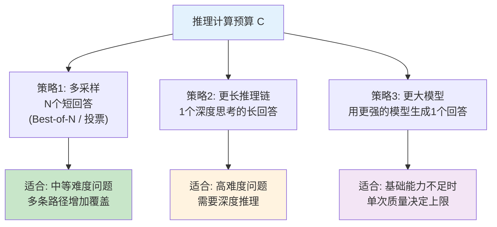

**Snell et al. (2024) 的核心发现**：

在某些任务上，**小模型 + 大量推理计算 > 大模型 + 少量推理计算**。例如：
- Llama-3-8B + Best-of-256 在 MATH 上的表现 ≈ Llama-3-70B + Greedy decoding
- 这意味着推理计算可以在一定程度上"弥补"模型参数的不足

但这并非无条件成立：
- 当问题难度超出小模型的能力范围时（即 $p \approx 0$），再多采样也无济于事
- 存在一个"能力阈值"：只有当模型对某类问题有非零的正确率时，Test-time Compute 才有效

**最优分配的实用经验法则**：

1. 先评估模型在目标任务上的基础正确率 $p$
2. 若 $p > 0.1$：Best-of-N 或投票是高性价比的选择
3. 若 $p < 0.05$：优先考虑使用更强的模型，或通过 few-shot 提升基础能力
4. 在 $p$ 中等（0.1-0.5）时，测试时计算的边际收益最大

---

## 4. 推理模型

### 4.1 从 Prompting 到训练：推理模型的范式转变

前面介绍的 CoT、Self-Consistency、ToT 等方法都是**推理时**（inference-time）策略——模型本身不变，只改变使用方式。

**推理模型**则走得更远：直接**训练**模型具备推理能力。代表性工作包括 OpenAI 的 o1 系列和 DeepSeek 的 R1 系列。

### 4.2 DeepSeek-R1：纯 RL 训练的推理模型

DeepSeek-R1（2025）是推理模型领域的里程碑之作，其核心创新在于：**不依赖大规模人工标注的推理数据，通过纯强化学习让模型学会推理**。

**R1-Zero：纯 RL 的探索**

DeepSeek-R1-Zero 直接在基础模型上应用 RL，不使用 SFT 冷启动：

$$\max_\theta \mathbb{E}_{q \sim \mathcal{D}, (r,a) \sim \pi_\theta(\cdot|q)} [R(q, r, a)]$$

其中奖励函数 $R$ 基于答案的正确性：

$$R(q, r, a) = \begin{cases} 1 & \text{if } a \text{ is correct} \\ 0 & \text{otherwise} \end{cases}$$

附加格式奖励：

$$R_{format}(r) = \begin{cases} r_f & \text{if } r \text{ follows required format} \\ 0 & \text{otherwise} \end{cases}$$

**"Aha Moment"：模型学会自我反思**

在 R1-Zero 的 RL 训练过程中，研究者观察到一个惊人现象：模型自发地学会了**自我反思和纠错**。

```
问题：计算 7 × 8 + 3 × 6

模型输出：
7 × 8 = 56
3 × 6 = 18
56 + 18 = 74

Wait, let me double check this.
7 × 8 = 56 ✓
3 × 6 = 18 ✓
56 + 18 = 74 ✓

The answer is 74.
```

"Wait, let me double check"这种行为不是预先编程的，而是通过 RL 自然涌现的——因为自我检查可以提高正确率，从而获得更高的奖励。

**R1-Zero 的问题**：
- 可读性差：输出可能混合多种语言，格式混乱
- 推理链过长：有时会产生不必要的冗长推理
- 训练不稳定：纯 RL 容易出现训练发散

### 4.3 DeepSeek-R1 的完整训练流程

为了解决 R1-Zero 的问题，R1 采用了四阶段训练流程：

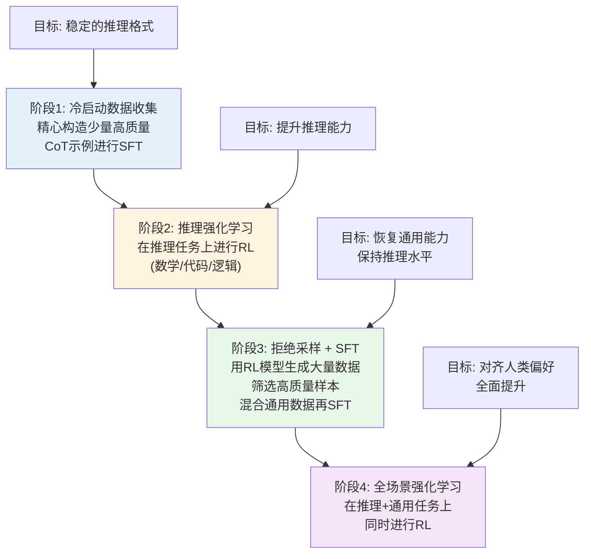

**阶段 1：冷启动（Cold Start）**

使用少量（数千条）精心标注的长 CoT 数据对基础模型进行 SFT：
- 数据来源：人工编写 + 用其他模型生成后人工筛选
- 目标：教会模型基本的推理格式（`<think>...</think><answer>...</answer>`）
- 数据量小但质量极高

**阶段 2：推理 RL（Reasoning RL）**

在数学、代码、逻辑等推理任务上进行 RL 训练：
- 奖励信号：基于规则的正确性判断（数学题可以验证答案，代码可以运行测试）
- 训练算法：GRPO（Group Relative Policy Optimization）
- 关键：推理能力在此阶段大幅提升

**GRPO 的核心思想**：

GRPO 不需要单独的 Critic 网络。对于每个问题 $q$，采样一组回答 $\{(r_i, a_i)\}_{i=1}^{G}$，计算组内相对奖励：

$$\hat{A}_i = \frac{R_i - \text{mean}(\{R_j\}_{j=1}^G)}{\text{std}(\{R_j\}_{j=1}^G)}$$

然后优化策略：

$$\mathcal{L}_{GRPO} = -\mathbb{E}\left[\min\left(\frac{\pi_\theta}{\pi_{old}} \hat{A}, \text{clip}\left(\frac{\pi_\theta}{\pi_{old}}, 1-\epsilon, 1+\epsilon\right) \hat{A}\right)\right] + \beta \cdot D_{KL}(\pi_\theta \| \pi_{ref})$$

**阶段 3：拒绝采样 + SFT（Rejection Sampling + SFT）**

RL 训练会提升推理能力，但可能损害通用能力（如对话、创意写作）。这一阶段：
1. 用阶段 2 的模型在推理任务上大量采样
2. 用规则或 Verifier 筛选正确答案（拒绝采样）
3. 将筛选后的推理数据 + 通用 SFT 数据混合
4. 从基础模型重新进行 SFT

**阶段 4：全场景 RL（All-scenario RL）**

在推理任务和通用任务上同时进行 RL：
- 推理任务：继续使用规则奖励
- 通用任务：使用奖励模型（如 helpfulness、harmlessness）
- 目标：对齐人类偏好，同时保持推理能力

### 4.4 推理 Token 的经济学分析

推理模型通过生成更多中间 token 来提高回答质量，但这带来了成本问题：

**成本模型**：

$$\text{Cost} = n_{input} \cdot c_{input} + n_{output} \cdot c_{output}$$

其中推理模型的 $n_{output}$ 远大于普通模型（可能 10-100 倍），因此：

$$\text{Cost}_{reasoning} \gg \text{Cost}_{standard}$$

**质量-成本权衡**：

| 模型类型 | 输出 token 数 | 答案质量 | 成本 |
|----------|-------------|----------|------|
| 标准模型 | ~100 | 基础 | $ |
| CoT prompting | ~500 | 提升 | $$ |
| 推理模型 | ~2000-10000 | 高 | $$$$ |

**何时使用推理模型？**

- 高价值问题（数学竞赛、复杂代码）：推理模型收益大
- 简单问题（日常问答、翻译）：标准模型性价比更高
- 关键决策：通过 Self-Consistency 或 Best-of-N 进一步提升

### 4.5 长推理链的控制与效率

推理模型的一个挑战是推理链可能过长：

**问题**：
- 冗余推理：模型可能反复验证已经确认的步骤
- 过度推理：简单问题也使用复杂推理链
- 循环推理：模型陷入自我对话循环

**解决方案**：
1. **长度惩罚**：在奖励函数中加入长度惩罚项 $R' = R - \lambda \cdot \text{len}(r)$
2. **早停机制**：当模型生成"答案"标记时强制停止
3. **自适应推理**：训练模型根据问题难度调整推理深度

---

## 5. 推理评估

### 5.1 数学推理

**GSM8K（Grade School Math 8K）**

- 小学数学文字题，约 8500 道
- 需要 2-8 步数学推理
- 评估指标：精确匹配（Exact Match）

示例：
```
Q: Natalia在4月份卖了48个夹子给她的朋友，5月份卖了一半。
   Natalia在4月和5月一共卖了多少个夹子？
A: 4月卖了48个。5月卖了48/2=24个。总共48+24=72个。
   答案：72
```

**MATH**

- 高中数学竞赛级别题目，约 12500 道
- 涵盖代数、几何、数论等 7 个领域
- 难度分 1-5 级
- 评估指标：最终数值的精确匹配（答案需化简为标准形式）

难度对比：

| 数据集 | 难度级别 | 典型步骤数 | GPT-4 准确率 | 人类专家准确率 |
|--------|---------|-----------|-------------|--------------|
| GSM8K | 小学数学 | 2-8 步 | ~92% | ~95% |
| MATH Level 1 | 简单高中 | 3-5 步 | ~80% | ~90% |
| MATH Level 5 | 竞赛级别 | 10+ 步 | ~40% | ~70% |

### 5.2 代码生成

**HumanEval**

- OpenAI 提出，164 道手写编程题
- 每题包含函数签名、docstring、测试用例
- 评估指标：pass@k（生成 k 个候选，至少一个通过测试）

$$\text{pass@k} = \mathbb{E}\left[1 - \frac{\binom{n-c}{k}}{\binom{n}{k}}\right]$$

其中 $n$ 是总采样数，$c$ 是通过测试的数量。

**MBPP (Mostly Basic Python Programs)**

- Google 提出，974 道基础 Python 编程题
- 相比 HumanEval 更偏向基础编程能力
- 评估指标：同样使用 pass@k

### 5.3 通用推理

**MMLU (Massive Multitask Language Understanding)**

- 57 个学科的选择题，约 15000 道
- 涵盖 STEM、人文、社科、专业领域
- 评估指标：多选准确率

学科分布：

| 类别 | 示例学科 | 题数占比 |
|------|---------|---------|
| STEM | 物理、化学、数学、计算机 | ~25% |
| 人文 | 历史、哲学、法律 | ~25% |
| 社科 | 经济、心理、社会学 | ~25% |
| 其他 | 医学、会计、工程 | ~25% |

**ARC (AI2 Reasoning Challenge)**

- 小学科学推理题
- 分为 Easy 和 Challenge 两个集合
- Challenge 集要求更复杂的推理（不能通过简单检索回答）

### 5.4 评估方法论

**答案提取**：

推理模型的输出通常包含大量中间推理，需要从中提取最终答案：

```python
import re

def extract_answer(response: str) -> str:
    """
    从模型输出中提取最终答案

    支持的格式:
    - "答案是X"
    - "The answer is X"
    - "\\boxed{X}"
    - 最后一个数字
    """
    # 尝试匹配 \boxed{} 格式
    boxed = re.findall(r'\\boxed\{([^}]+)\}', response)
    if boxed:
        return boxed[-1]

    # 尝试匹配 "答案是" 格式
    answer_pattern = re.findall(r'答案[是为：:]\s*(.+?)[\n。]', response)
    if answer_pattern:
        return answer_pattern[-1].strip()

    # 尝试匹配 "The answer is" 格式
    en_pattern = re.findall(r'[Tt]he answer is\s*(.+?)[\n.]', response)
    if en_pattern:
        return en_pattern[-1].strip()

    # 回退：提取最后一个数字
    numbers = re.findall(r'-?\d+\.?\d*', response)
    if numbers:
        return numbers[-1]

    return response.strip()
```

**评估流程**：

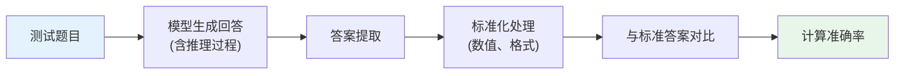

---

## 6. 三条技术线的推理实践

### 6.1 Google：Gemini 的推理能力

**Gemini 的推理特点**：
- Gemini 1.5 Pro 在 MATH 上达到 ~67% 准确率
- Gemini 2.0 Flash Thinking 引入了"思考"功能，类似推理模型
- 支持多模态推理（图表、图像中的数学问题）

**搜索与推理的结合**：
- Google 将搜索引擎与推理结合（Gemini + Google Search）
- 模型可以在推理过程中调用搜索验证事实
- 这是 ReAct 思想在工业级产品中的体现

**AlphaCode / AlphaProof 系列**：
- AlphaCode 2：在编程竞赛中达到 Codeforces ~85th percentile
- AlphaProof：用 AlphaZero 式搜索+验证进行数学证明
- 核心思想：将数学推理建模为搜索问题，用形式化验证器作为奖励

### 6.2 DeepSeek：R1 的推理突破

**DeepSeek-R1 的核心贡献**：
- 证明了纯 RL 可以产生推理能力（R1-Zero）
- 提出了实用的四阶段训练流程（R1）
- 开源了完整的训练方法和模型权重

**R1 的性能表现**：

| 基准 | DeepSeek-V3 | DeepSeek-R1 | OpenAI o1 |
|------|------------|------------|-----------|
| MATH-500 | 78.3% | **97.3%** | 96.4% |
| AIME 2024 | 39.2% | **79.8%** | 74.4% |
| Codeforces Rating | 1134 | **2029** | 2061 |
| GPQA Diamond | 59.1% | **71.5%** | 78.0% |

**蒸馏小模型**：
- R1 的推理能力可以蒸馏到更小的模型（1.5B-70B）
- 蒸馏方法：用 R1 生成大量推理数据，对小模型进行 SFT
- 甚至 R1-Distill-Qwen-7B 的推理能力也超过了许多更大的非推理模型

### 6.3 Anthropic：Claude 的推理演进

**Claude 的推理能力**：
- Claude 3.5 Sonnet 在 MATH 上达到 ~71% [推测]
- Claude 在多步推理和代码生成方面表现出色

**Extended Thinking**：
- Anthropic 推出的类似"推理模型"的功能 [推测]
- 允许 Claude 在回答前进行长时间"思考"
- 思考过程对用户可见（透明性）[推测]

**安全推理**：
- Anthropic 特别关注推理链中的安全问题 [推测]
- 研究方向：如何确保推理过程不会泄露有害信息
- 如何处理推理过程中的"不忠实推理"（Unfaithful CoT）

**Faithful vs Unfaithful CoT**：
- **Faithful CoT**：模型展示的推理过程真实反映了其内部计算
- **Unfaithful CoT**：模型的推理过程是"编造"的，与实际决策过程不一致
- Anthropic 的研究表明，模型可能会为已确定的答案"合理化"推理过程 [推测]

### 6.4 推理模型的工业实践深度分析

上面的小节简要概述了三条技术线的推理方向。本小节从工程和实践角度对目前最具影响力的推理模型进行更深入的分析。

#### OpenAI o1/o3 系列（基于公开信息）

OpenAI 的 o1（2024 年 9 月发布）和 o3（2024 年底预告）系列是商业推理模型的先驱。

**隐式思维链（Internal Chain-of-Thought）**：
- 与 DeepSeek-R1 不同，o1 的推理过程对用户**不可见**——模型在输出最终答案前进行内部"思考"，但这些思考 token 被隐藏
- 用户只能看到最终答案和一段概括性的推理摘要
- 这种设计的权衡：保护了推理策略的商业机密，但降低了可解释性和可审计性

**推理 token 消耗与性能的关系**：
- o1 的核心机制是：更长的内部推理链 = 更多推理 token = 更高的回答质量
- 这在 API 计费中直接体现——推理 token 会被计入输出 token 费用
- o1-mini 消耗的推理 token 少于 o1-full，性能也相应降低

**突破性表现**：

| 基准 | GPT-4o | o1-mini | o1 |
|------|--------|---------|-----|
| MATH | ~76% | ~90% | **94.8%** |
| GPQA Diamond | ~53% | ~60% | **78.0%** |
| Codeforces Rating | ~800 | ~1650 | **1891** |
| 2024 AIME | ~12% | ~57% | **83.3%** (con@64) |

o1 在数学、代码、科学推理上的表现标志着 LLM 从"能说会道"到"能思考会推理"的质变。

#### DeepSeek-R1 的工程实践细节

在第 4 节已经介绍了 R1 的训练方法。这里补充其工程落地方面的关键细节：

**R1-Zero 的"Aha Moment"的完整故事**：

R1-Zero 的实验是整个 R1 项目中最令人兴奋的发现。在未经过任何 SFT 的情况下，纯 RL 训练产生了以下自发行为的涌现顺序：

```
训练初期 → 简短无序输出
     ↓
训练中期 → 开始出现步骤化推理
     ↓
"Aha Moment" → 出现 "Wait, let me reconsider..." 自我反思
     ↓
训练后期 → 稳定的多步推理 + 自我检查 + 回溯修正
```

这一涌现过程证明了一个深刻的观点：**推理能力可以仅通过奖励信号（答案正确性）自然涌现，不需要显式教模型"如何推理"**。

**完整训练流程的工程决策**：

| 阶段 | 关键工程决策 | 决策理由 |
|------|------------|----------|
| 冷启动 SFT | 使用数千条（非数万条）数据 | 太多会让模型"记忆"推理模式而非学习推理 |
| 推理 RL | 仅用规则奖励，不用奖励模型 | 避免 reward hacking，数学/代码答案可精确验证 |
| 拒绝采样 + SFT | 从基础模型重新 SFT | 避免 RL 阶段损害的通用能力被固化 |
| 全场景 RL | 推理+通用任务同时训练 | 多任务 RL 防止能力退化 |

**蒸馏的关键经验**：
- R1-Distill 系列证明了一个违反直觉的结论：**SFT 蒸馏 > 小模型直接 RL**
- 7B 蒸馏模型在 AIME 2024 上达到 55.5%，而 7B 直接 RL 仅约 30%
- 原因：小模型的探索空间有限，RL 难以发现高质量的推理策略；而大模型已经"探索"过了，蒸馏相当于直接传授最优策略

#### Google 的推理路线补充

**Chain-of-Thought 的发源地**：CoT Prompting（Wei et al., 2022）的核心作者来自 Google Brain，这项技术最早在 PaLM 540B 上验证。Google 在推理提示技术的学术贡献是开创性的。

**Gemini 的推理差异化**：
- Gemini 2.0 Flash Thinking 引入的"思考模式"类似 o1 的思维链，但 Google 选择了**部分可见**的方式——用户可以看到模型的思考摘要
- Gemini 的独特优势在于**多模态推理**：能直接对图表、数学公式图片进行推理，而非仅处理文本
- 与 Google Search 的深度集成使 Gemini 成为当前最接近 ReAct 框架在生产环境落地的实践

---

## 7. 项目实践

### 项目 1：实现 Self-Consistency 并评估效果 (⭐⭐ 进阶)

**目标**：理解采样+投票策略如何提升推理准确率。

**思路**：
1. 准备一组 GSM8K 格式的数学题（10-20 道）
2. 实现 Self-Consistency 的完整流程（多次采样 → 答案提取 → 多数投票）
3. 对比不同采样次数 N（1, 5, 10, 20）和不同温度 T（0.3, 0.5, 0.7, 1.0）的效果
4. 可视化：准确率随 N 的变化曲线

**关键代码片段**：

```python
import collections

def self_consistency(model, question: str, n_samples: int = 10, temperature: float = 0.7):
    """
    Self-Consistency 推理

    Args:
        model: LLM 模型（需要支持温度采样）
        question: 问题文本
        n_samples: 采样次数
        temperature: 采样温度

    Returns:
        最终答案和各路径详情
    """
    answers = []
    paths = []

    for _ in range(n_samples):
        # 使用 CoT prompt 采样
        response = model.generate(
            prompt=f"Q: {question}\nA: Let's think step by step.\n",
            temperature=temperature,
            max_tokens=512
        )
        # 提取答案
        answer = extract_answer(response)
        answers.append(answer)
        paths.append(response)

    # 多数投票
    counter = collections.Counter(answers)
    best_answer = counter.most_common(1)[0][0]

    return {
        "answer": best_answer,
        "vote_distribution": dict(counter),
        "n_samples": n_samples,
        "paths": paths
    }
```

**评估框架提示**：
- 对比 Greedy（N=1, T=0）和 Self-Consistency 的准确率
- 绘制准确率 vs 采样次数的曲线
- 分析投票分布的集中度与准确率的关系

---

### 项目 2：实现 Tree of Thoughts 搜索框架 (⭐⭐⭐ 挑战)

**目标**：理解结构化推理和搜索策略。

**思路**：
1. 定义搜索树结构（节点 = 思维状态，边 = 思维扩展）
2. 实现 BFS 和 DFS 两种搜索策略
3. 实现基于 LLM 的评估函数（对思维状态评分）
4. 在 24 点游戏或逻辑谜题上测试

**搜索框架伪代码**：

```
Algorithm: Tree of Thoughts Search

Input: 问题 Q, 搜索策略 S (BFS/DFS), 宽度 b, 深度 d
Output: 最优推理路径

1. 初始化根节点 root = ThoughtNode(state=Q)
2. IF S == BFS:
     queue = [root]
     FOR depth = 1 to d:
       candidates = []
       FOR node in queue:
         thoughts = LLM.generate_thoughts(node.state, k=b)
         FOR t in thoughts:
           child = ThoughtNode(state=node.state + t)
           child.score = LLM.evaluate(child.state)
           candidates.append(child)
       queue = top_k(candidates, k=b)  # 保留最优的 b 个
     RETURN best(queue)

   ELSE IF S == DFS:
     stack = [root]
     best_path = None
     WHILE stack is not empty:
       node = stack.pop()
       IF node.depth == d:
         IF node.score > best_path.score:
           best_path = node
         CONTINUE
       thoughts = LLM.generate_thoughts(node.state, k=b)
       FOR t in thoughts:
         child = ThoughtNode(state=node.state + t)
         child.score = LLM.evaluate(child.state)
         IF child.score > threshold:  # 剪枝
           stack.append(child)
     RETURN best_path
```

**关键设计决策**：

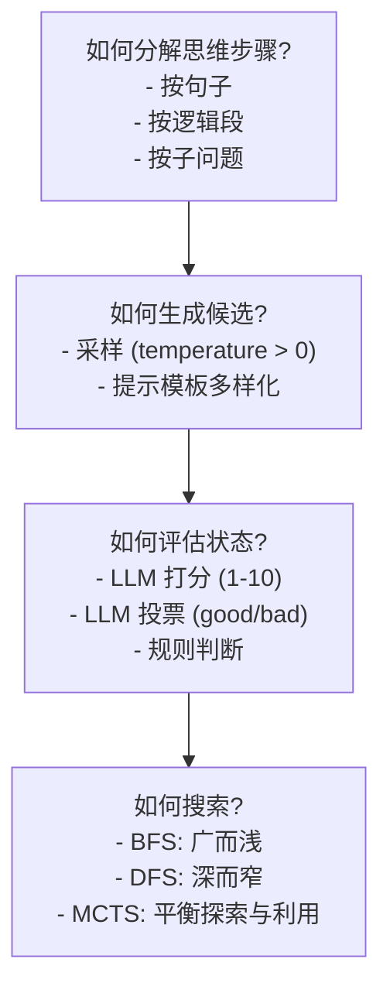

---

### 项目 3：分析 CoT 长度与推理质量的关系 (⭐⭐ 进阶)

**目标**：探究推理链长度与答案质量之间的关系。

**实验设计**：
1. 选择一个数学推理数据集（如 GSM8K 子集）
2. 对每道题生成多条推理路径（不同温度 / prompt 变体）
3. 统计推理链长度（token 数或步骤数）
4. 分析长度与正确率的相关性

**分析维度**：
- 不同难度问题的最优推理链长度
- 过长推理链是否反而降低准确率（"过度思考"）
- 推理链中"有效步骤"与"冗余步骤"的比例

**关键代码片段**：

```python
def analyze_cot_length(questions, model, n_samples=5, temperatures=[0.3, 0.5, 0.7]):
    """
    分析 CoT 长度与推理质量的关系
    """
    results = []
    for q in questions:
        for temp in temperatures:
            for _ in range(n_samples):
                response = model.generate(q, temperature=temp)
                answer = extract_answer(response)
                is_correct = check_answer(answer, q["gold_answer"])

                results.append({
                    "question_id": q["id"],
                    "difficulty": q.get("difficulty", "unknown"),
                    "temperature": temp,
                    "cot_length": len(response.split()),  # 词数
                    "cot_steps": count_reasoning_steps(response),  # 步骤数
                    "is_correct": is_correct
                })

    return analyze_correlation(results)  # 计算相关性并可视化
```

---

### 项目 4：实现 Best-of-N + Verifier 推理框架 (⭐⭐⭐ 挑战)

**目标**：理解测试时计算的核心机制。

**思路**：
1. 实现简化版 Verifier（基于规则或简单模型评分）
2. 实现 Best-of-N 采样框架
3. 对比不同 N 值下的性能提升
4. 对比 Verifier 选择 vs 随机选择 vs 多数投票

**框架设计**：

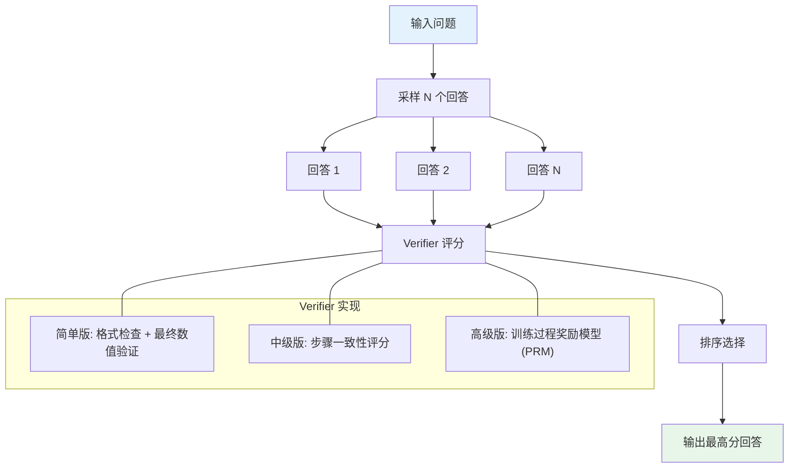

**简化 Verifier 伪代码**：

```
Function verify(question, response):
    score = 0.0

    # 1. 格式分 (0-0.3)
    IF response 包含清晰的推理步骤:
        score += 0.1
    IF response 包含最终答案标记:
        score += 0.1
    IF response 格式整齐（无混乱文本）:
        score += 0.1

    # 2. 推理一致性分 (0-0.4)
    steps = extract_steps(response)
    FOR each step in steps:
        IF step 中的数字与前文一致:
            score += 0.4 / len(steps)

    # 3. 答案合理性分 (0-0.3)
    answer = extract_answer(response)
    IF answer 是有效数值:
        score += 0.15
    IF answer 在合理范围内:
        score += 0.15

    RETURN score
```

---

### 项目 5：Test-Time Compute Scaling 实验 (⭐⭐ 进阶)

**目标**：通过实验验证 Best-of-N 和 Majority Voting 在数学推理上的效果，理解测试时计算的 Scaling 行为。

**实验设计**：

1. 选取 GSM8K 的一个子集（50-100 道题）作为测试集
2. 用 LLM 对每道题生成 $N$ 个回答（$N = 1, 4, 8, 16, 32$）
3. 分别用三种策略评估：
   - **Random**：随机选择一个回答
   - **Majority Voting**：多数投票选择答案
   - **Best-of-N (Oracle)**：用标准答案作为"完美验证器"，检查 $N$ 个回答中是否有正确的
4. 画出 $N$ vs 准确率曲线，观察收益递减效应

**伪代码**：

```python
import collections
import numpy as np

def test_time_scaling_experiment(questions, model, n_values=[1, 4, 8, 16, 32],
                                 temperature=0.7, max_samples=32):
    """
    Test-Time Compute Scaling 实验

    Args:
        questions: 数学题列表，每道题包含 'question' 和 'answer' 字段
        model: LLM 模型（需要支持温度采样）
        n_values: 要测试的 N 值列表
        temperature: 采样温度
        max_samples: 每道题的最大采样数（生成一次，复用于不同 N）
    """
    results = {n: {"random": [], "majority": [], "oracle": []} for n in n_values}

    for q in questions:
        # 一次性采样 max_samples 个回答
        all_responses = []
        for _ in range(max_samples):
            resp = model.generate(
                prompt=f"Q: {q['question']}\nA: Let's think step by step.\n",
                temperature=temperature
            )
            answer = extract_answer(resp)
            is_correct = (answer == q['answer'])
            all_responses.append({"response": resp, "answer": answer, "correct": is_correct})

        # 对每个 N 值评估三种策略
        for n in n_values:
            subset = all_responses[:n]

            # Random: 随机选一个
            random_correct = subset[np.random.randint(n)]["correct"]
            results[n]["random"].append(random_correct)

            # Majority Voting: 多数投票
            counter = collections.Counter(s["answer"] for s in subset)
            majority_answer = counter.most_common(1)[0][0]
            majority_correct = (majority_answer == q['answer'])
            results[n]["majority"].append(majority_correct)

            # Oracle Best-of-N: 是否有至少一个正确
            oracle_correct = any(s["correct"] for s in subset)
            results[n]["oracle"].append(oracle_correct)

    # 计算并返回各策略在不同 N 下的准确率
    summary = {}
    for n in n_values:
        summary[n] = {
            strategy: np.mean(results[n][strategy])
            for strategy in ["random", "majority", "oracle"]
        }
    return summary
    # 建议用 matplotlib 画出 N vs 准确率曲线
```

**思考题**：
1. Oracle Best-of-N 的准确率上升曲线是否与 $1-(1-p)^N$ 的理论预测吻合？试拟合参数 $p$
2. Majority Voting 和 Oracle Best-of-N 的差距反映了什么？（提示：验证器的质量）
3. 当 $N$ 从 16 增加到 32 时，准确率提升了多少？收益递减效应是否明显？
4. 如果将采样温度从 0.7 改为 0.3 或 1.0，曲线形状会如何变化？

---

## 8. 本章小结

本章系统介绍了 LLM 推理增强技术的完整图景：

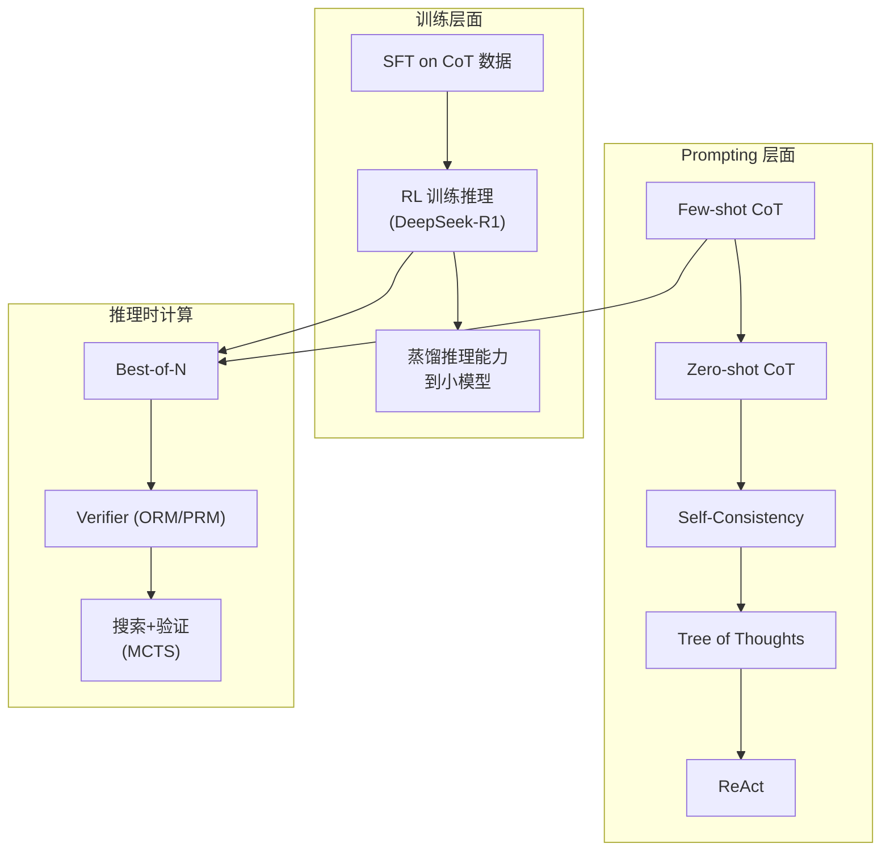

**核心要点**：

1. **CoT 是基础**：通过中间推理步骤提升 LLM 的推理能力，本质是增加有效计算量
2. **Self-Consistency 和 ToT** 进一步通过多路径采样和搜索提升推理质量
3. **测试时计算**是一个重要的 Scaling 维度：推理时投入更多计算可以获得更好结果
4. **推理模型（如 R1）** 通过 RL 训练将推理能力内化到模型参数中
5. **评估体系**覆盖数学、代码、通用推理等多个维度

### 从"会说"到"会想"：推理能力的意义回顾

推理能力是 LLM 从"博学的鹦鹉"蜕变为"能思考的助手"的关键。没有 CoT 和推理模型，LLM 只是一个高级的自动补全工具；有了推理能力，LLM 能够分解复杂问题、规划多步方案、自我检验和修正错误——这些是真正"智能"行为的基石。

**展望下一模块**：推理能力的增强带来了一个紧迫的工程挑战——**推理效率**。推理模型动辄生成数千乃至上万个推理 token，其推理成本远高于普通模型。当我们将推理模型部署到生产环境时，如何在保持推理质量的同时降低延迟和成本？模块 14 将深入探讨 **KV Cache 优化、量化（Quantization）、推测解码（Speculative Decoding）** 等推理加速技术，这些技术让推理模型在实际应用中变得可行。

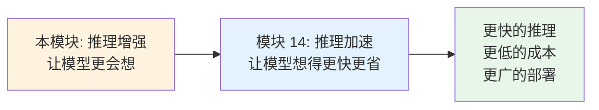

---

## 9. 参考文献

1. Wei, J., et al. (2022). "Chain-of-Thought Prompting Elicits Reasoning in Large Language Models." NeurIPS 2022.
2. Kojima, T., et al. (2022). "Large Language Models are Zero-Shot Reasoners." NeurIPS 2022.
3. Wang, X., et al. (2023). "Self-Consistency Improves Chain of Thought Reasoning in Language Models." ICLR 2023.
4. Yao, S., et al. (2023). "Tree of Thoughts: Deliberate Problem Solving with Large Language Models." NeurIPS 2023.
5. Yao, S., et al. (2023). "ReAct: Synergizing Reasoning and Acting in Language Models." ICLR 2023.
6. Zhou, D., et al. (2023). "Least-to-Most Prompting Enables Complex Reasoning in Large Language Models." ICLR 2023.
7. DeepSeek-AI (2025). "DeepSeek-R1: Incentivizing Reasoning Capability in LLMs via Reinforcement Learning." Technical Report.
8. Cobbe, K., et al. (2021). "Training Verifiers to Solve Math Word Problems." arXiv:2110.14168.
9. Lightman, H., et al. (2023). "Let's Verify Step by Step." ICLR 2024.
10. Snell, C., et al. (2024). "Scaling LLM Test-Time Compute Optimally can be More Effective than Scaling Model Parameters." arXiv:2408.03314.
11. Hendrycks, D., et al. (2021). "Measuring Massive Multitask Language Understanding." ICLR 2021.
12. Chen, M., et al. (2021). "Evaluating Large Language Models Trained on Code." arXiv:2107.03374.
13. OpenAI (2024). "Learning to Reason with LLMs." OpenAI Blog.
14. Wang, P., et al. (2024). "Math-Shepherd: Verify and Reinforce LLMs Step-by-step without Human Annotations." ACL 2024.
15. Brown, B., et al. (2024). "Large Language Monkeys: Scaling Inference Compute with Repeated Sampling." arXiv:2407.21787.
