# CoT与推理进阶：工业实践与前沿研究

> 本文是 [模块13: CoT与推理](./README.md) 的进阶补充，深入分析 Google、DeepSeek、Anthropic 三条技术线在推理领域的工业实践，探讨 PRM vs ORM、MCTS+LLM 等前沿话题，并详细介绍 LLM-as-a-Judge 自动化评测方法。

---

## 目录

- [1. Google 的推理研究](#1-google-的推理研究)
- [2. DeepSeek-R1 深度分析](#2-deepseek-r1-深度分析)
- [3. Anthropic 视角](#3-anthropic-视角)
- [4. 前沿话题](#4-前沿话题)
- [5. 自动化评测流水线（LLM-as-a-Judge）](#5-自动化评测流水线llm-as-a-judge)

---

## 1. Google 的推理研究

### 1.1 Gemini 的推理能力

Google 的 Gemini 系列在推理任务上展现了强大的能力，特别是在多模态推理方面具有独特优势。

**Gemini 1.5 Pro 的推理特点**：

- **长上下文推理**：支持最高 1M token 的上下文窗口，能处理需要大量背景信息的推理任务
- **多模态推理**：能在图表、数学公式图片、代码截图上直接推理
- **多步推理**：在 MATH 基准上达到 ~67% 准确率（标准 prompting）

**Gemini 2.0 Flash Thinking**：

Gemini 2.0 引入了"思考"模式，类似推理模型的设计：
- 模型在回答前生成内部思考过程
- 支持可配置的思考预算（think budget）
- 在数学和代码任务上有显著提升

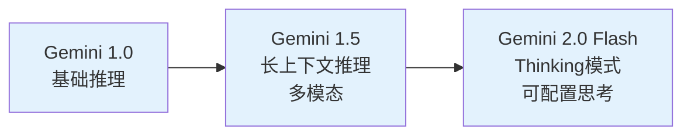

### 1.2 搜索与推理的结合

Google 在搜索与推理结合方面有天然优势：

**实时信息推理**：
- Gemini 可在推理过程中调用 Google Search
- 模型先形成假设，再通过搜索验证或获取缺失信息
- 这是 ReAct 框架在工业级产品中的实现

**推理辅助搜索**：
- 搜索不再是简单的关键词匹配
- 模型理解查询意图，生成推理链来确定最佳搜索策略
- 搜索结果反馈到推理链中，形成闭环

### 1.3 AlphaCode / AlphaProof 系列

**AlphaCode 2**：

AlphaCode 2 在编程竞赛中展现了超越大多数人类程序员的能力：

| 系统 | Codeforces 百分位 | 方法 |
|------|------------------|------|
| AlphaCode 1 | ~50th | 大规模采样 + 过滤 |
| AlphaCode 2 | ~85th | Gemini + 搜索 + 验证 |

核心方法：
1. **大规模候选生成**：生成百万级代码候选
2. **聚类与过滤**：通过语义聚类减少冗余
3. **测试用例验证**：用自动生成的测试用例过滤错误代码
4. **排序选择**：用 Verifier 模型对通过测试的代码排序

**AlphaProof**：

AlphaProof 将数学证明建模为搜索+验证问题：

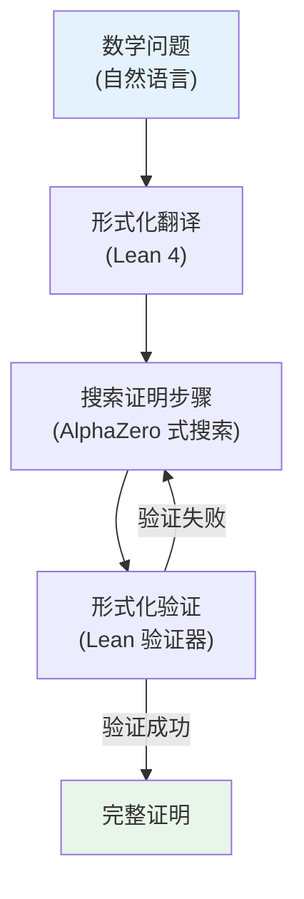

关键创新：
- 使用 Lean 4 形式化验证器作为"环境"
- 将证明搜索建模为类似 AlphaGo 的 MCTS 问题
- 证明步骤由 LLM 生成，正确性由形式化工具保证
- 在 2024 IMO（国际数学奥林匹克）中解决了 4/6 道题

---

## 2. DeepSeek-R1 深度分析

### 2.1 训练流程的完整解析

DeepSeek-R1 的训练流程是目前公开的最详细的推理模型训练方案：

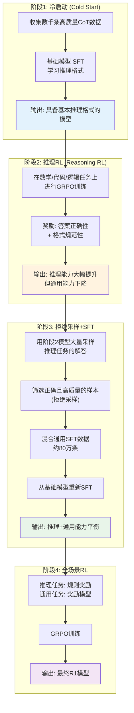

### 2.2 RL 训练中推理能力的涌现

**R1-Zero 实验**是 R1 项目最具启发性的发现之一：

不经过任何 SFT，直接在基础模型上进行 RL 训练，模型就能自发涌现出推理能力。

**涌现的能力包括**：

1. **逐步推理**：模型自发学会将问题分解为步骤
2. **自我反思**：模型会检查自己的中间结果（"Wait, let me verify this"）
3. **回溯修正**：发现错误时主动回退并修正（"Actually, that's wrong. Let me redo..."）
4. **多角度验证**：从不同方法验证同一答案

**训练曲线的特征**：

| 训练阶段 | 平均推理链长度 | AIME 准确率 | 观察到的行为 |
|----------|-------------|------------|-------------|
| 初期（0-1K steps） | ~200 tokens | ~15% | 简短、随机的输出 |
| 中期（1K-5K steps） | ~500 tokens | ~30% | 开始出现步骤化推理 |
| Aha moment（~5K-10K steps） | ~1000 tokens | ~50% | 出现自我反思行为 |
| 后期（10K+ steps） | ~2000 tokens | ~70%+ | 稳定的长推理链 |

**关键观察**：推理链长度的增长先于准确率的增长，说明模型先"学会了推理的形式"，再逐步"学会了推理的内容"。

### 2.3 R1 vs R1-Zero 的对比

| 特性 | R1-Zero | R1 |
|------|---------|-----|
| SFT 数据 | 无 | 数千条冷启动数据 |
| 输出可读性 | 差（混合语言、格式混乱） | 好（规范的推理格式） |
| 推理链长度 | 不可控（经常过长） | 可控 |
| 训练稳定性 | 较差 | 较好 |
| MATH-500 准确率 | ~86% | ~97% |
| 通用能力 | 明显下降 | 保持 |

**R1 的优势来源**：
- 冷启动 SFT 提供了稳定的推理格式基础
- 拒绝采样 + SFT 恢复了通用能力
- 多阶段训练避免了能力冲突

### 2.4 GRPO 在推理训练中的应用

GRPO（Group Relative Policy Optimization）是 DeepSeek 提出的一种高效 RL 算法：

**与 PPO 的关键区别**：

$$\text{PPO: } \hat{A}_t = \underbrace{r_t + \gamma V(s_{t+1}) - V(s_t)}_{\text{需要 Critic 网络}}$$

$$\text{GRPO: } \hat{A}_i = \underbrace{\frac{R_i - \mu_G}{\sigma_G}}_{\text{组内相对奖励，无需 Critic}}$$

**GRPO 的训练流程**：

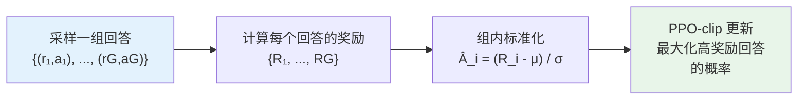

**GRPO 的优势**：
- **无需 Critic 网络**：节省 ~50% 的显存和计算
- **组内相对比较**：避免了绝对奖励值的偏差问题
- **适合推理任务**：推理问题的奖励天然是二值的（对/错），组内标准化能有效利用这一特性

**奖励设计**：

R1 的奖励函数由两部分组成：

$$R = R_{accuracy} + R_{format}$$

- $R_{accuracy}$：答案正确性（数学题可验证，代码题可执行测试）
- $R_{format}$：输出格式规范性（是否使用 `<think>` 标签等）

注意：R1 **没有**使用基于模型的奖励（如奖励模型打分），只使用了基于规则的奖励。这是一个重要的设计选择——避免了奖励模型的偏差和 reward hacking。

### 2.5 蒸馏小模型的方法

DeepSeek 证明了推理能力可以通过蒸馏传递到更小的模型：

**蒸馏流程**：

1. 用 R1 在大量推理任务上生成回答（含完整推理链）
2. 筛选正确答案（约 80 万条推理数据）
3. 在小模型上进行 SFT

**蒸馏效果**：

| 模型 | 基础 | MATH-500 | AIME 2024 | 方法 |
|------|------|---------|-----------|------|
| Qwen-7B | 52.5% | - | - | 原始模型 |
| R1-Distill-Qwen-7B | **92.8%** | **55.5%** | SFT 蒸馏 |
| R1-Distill-Qwen-32B | **94.3%** | **72.6%** | SFT 蒸馏 |
| R1-Distill-Llama-70B | **94.5%** | **70.0%** | SFT 蒸馏 |

**关键发现**：
- 蒸馏比在小模型上直接做 RL 效果更好
- 推理数据的质量（来自强大的 R1 模型）比数量更重要
- 即使 1.5B 的蒸馏模型，推理能力也超过许多 70B 以上的通用模型

---

## 3. Anthropic 视角

### 3.1 Claude 的推理能力演进

Claude 系列模型在推理任务上持续进步：

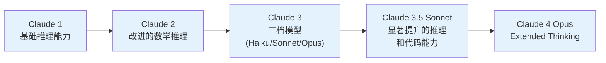

**Claude 的推理特点** [推测]：
- 强调推理的可靠性和安全性，而非单纯追求基准分数
- 在多步推理中展现出较好的一致性
- 在代码生成和数学推理方面表现出色

### 3.2 Extended Thinking 功能

**Extended Thinking 概述** [推测]：

Extended Thinking 是 Anthropic 推出的类似"推理模型"的功能：

- 允许 Claude 在生成最终回答前进行长时间的内部思考
- 思考过程以 `thinking` 块的形式呈现
- 用户可以配置思考预算（最大 token 数）

**与其他推理模型的差异** [推测]：

| 特性 | OpenAI o1 | DeepSeek-R1 | Claude Extended Thinking |
|------|-----------|-------------|------------------------|
| 思考可见性 | 不可见 | 完全可见 | 可见 |
| 安全过滤 | 思考后过滤 | 无特殊处理 | 思考过程中过滤 |
| 可配置性 | 有限 | 有限 | 预算可配置 |
| 训练方法 | 未公开 | RL (GRPO) | 未公开 |

**使用方式** [推测]：

```python
# Claude Extended Thinking API 示例 [推测]
import anthropic

client = anthropic.Anthropic()

response = client.messages.create(
    model="claude-sonnet-4-20250514",
    max_tokens=16000,
    thinking={
        "type": "enabled",
        "budget_tokens": 10000  # 思考预算
    },
    messages=[{
        "role": "user",
        "content": "证明对于所有正整数n，n^3 + 2n 能被 3 整除"
    }]
)

# 思考过程和最终回答分离
for block in response.content:
    if block.type == "thinking":
        print("思考过程:", block.thinking)
    elif block.type == "text":
        print("最终回答:", block.text)
```

### 3.3 安全推理

Anthropic 特别关注推理过程中的安全问题 [推测]：

**推理链中的安全风险**：

1. **有害内容泄露**：推理过程中可能生成不应出现的有害信息
2. **隐蔽推理**：模型可能在推理链中"隐藏"不当推理
3. **推理劫持**：恶意 prompt 可能引导推理向有害方向发展

**Anthropic 的应对策略** [推测]：

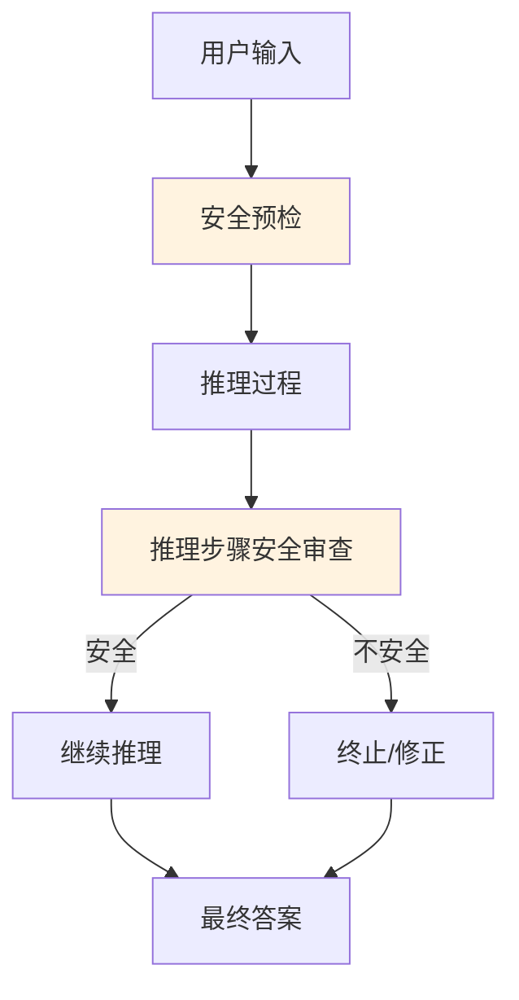

**Constitutional AI 与推理的结合** [推测]：
- 推理链需要符合 Constitutional AI 的安全准则
- 模型在推理过程中自我审查是否违反安全原则
- 这可能导致推理效率的轻微下降，但提升了安全性

### 3.4 Faithful CoT vs Unfaithful CoT 的研究

这是 Anthropic 研究的一个重要方向：模型的推理链是否真实反映了其内部计算过程？

**Faithful CoT（忠实推理链）**：
- 模型展示的推理步骤 = 模型实际的决策过程
- 推理链可以作为理解模型行为的可靠窗口

**Unfaithful CoT（不忠实推理链）**：
- 模型先得出答案，再"编造"看似合理的推理过程
- 推理链是事后合理化（post-hoc rationalization），不反映真实决策

**如何检测不忠实推理？**

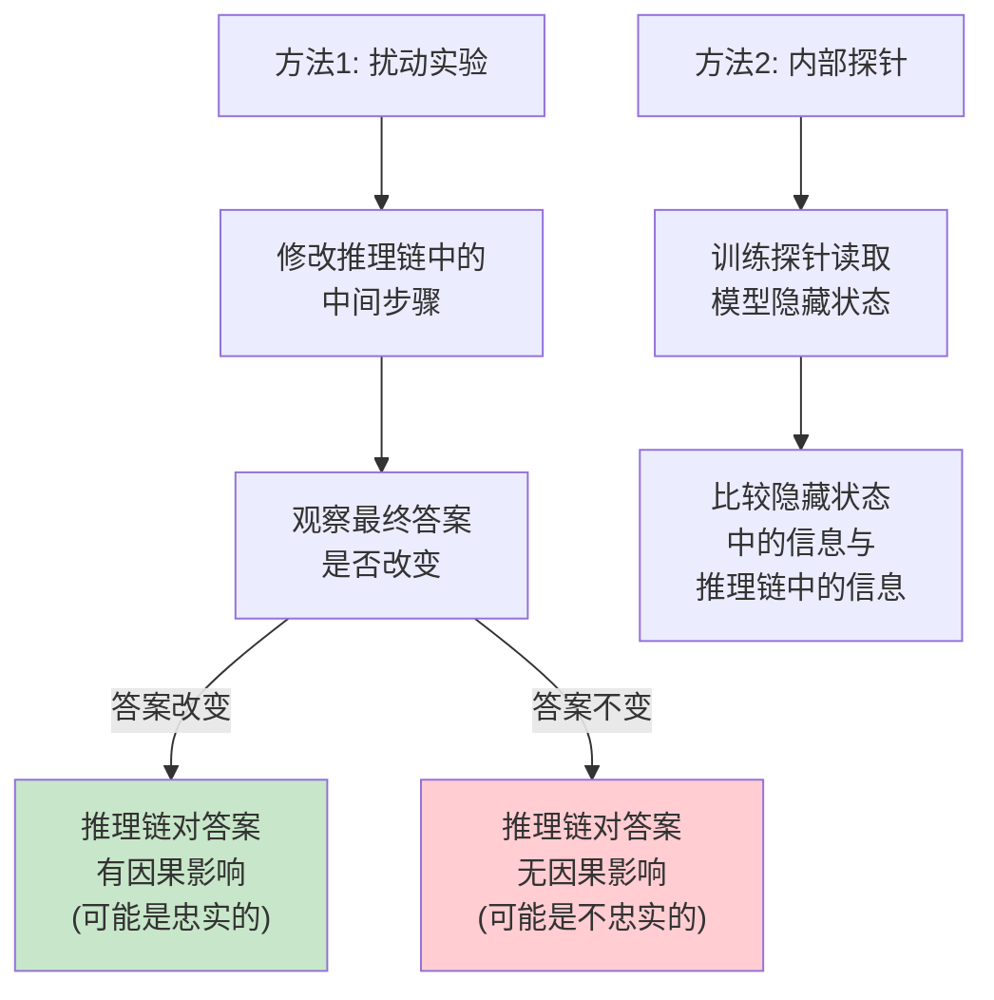

**Anthropic 的相关研究发现** [推测]：
- 大模型的推理链在简单任务上较为忠实
- 在复杂任务上，不忠实推理的比例增加
- 通过 RL 训练的推理模型可能更容易产生不忠实推理（因为 RL 优化的是最终结果，不是推理过程的忠实性）
- 这对推理模型的可解释性和安全性提出了根本性挑战

---

## 4. 前沿话题

### 4.1 过程奖励模型（PRM）vs 结果奖励模型（ORM）

**数学形式**：

ORM 对整个解进行评分：
$$V_{ORM}(q, r, a) = f_\phi(q, [r; a])$$

PRM 对每个推理步骤评分：
$$V_{PRM}(q, r_1, \ldots, r_K) = \prod_{k=1}^{K} f_\phi(q, r_1, \ldots, r_k)$$

或者更实际的实现中，取最小步骤分数：
$$V_{PRM}(q, r_1, \ldots, r_K) = \min_{k} f_\phi(q, r_1, \ldots, r_k)$$

**Lightman et al. (2023) "Let's Verify Step by Step" 的核心发现**：

| 方法 | MATH 准确率 | 需要的标注 |
|------|-----------|-----------|
| ORM + Best-of-N | 63.2% | 答案级别标注 |
| PRM + Best-of-N | **78.2%** | 步骤级别标注 |

PRM 显著优于 ORM，但标注成本更高。

**PRM 的训练数据获取**：

1. **人工标注**：让标注者标记每个推理步骤的正确性（成本高但质量好）
2. **蒙特卡洛估计**：从每个步骤处继续采样多条路径，用最终结果估计步骤正确性
3. **自动标注**：用强模型（如 GPT-4）标注步骤正确性

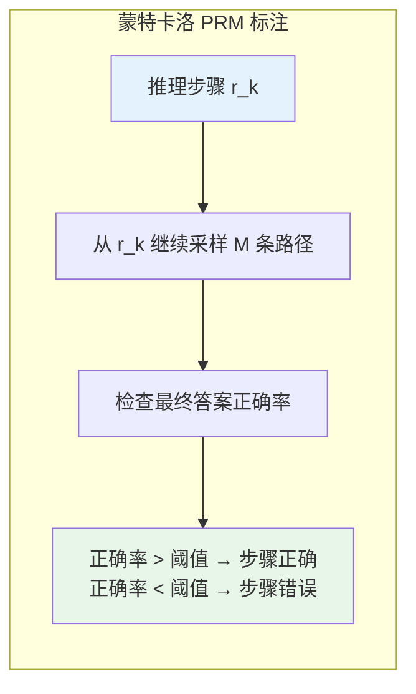

### 4.2 Monte Carlo Tree Search + LLM

MCTS + LLM 将传统的搜索算法与语言模型结合，用于推理任务：

**核心思想**：

| 组件 | 在围棋中（AlphaGo） | 在 LLM 推理中 |
|------|-------------------|--------------|
| 状态 | 棋盘局面 | 推理链（已生成的步骤） |
| 动作 | 下一步棋 | 下一个推理步骤 |
| 策略网络 | 预测最佳落子 | LLM 生成候选步骤 |
| 价值网络 | 评估局面胜率 | PRM 评估推理路径前景 |
| 模拟 | 快速走子到终局 | 快速生成到最终答案 |

**MCTS 在 LLM 推理中的流程**：

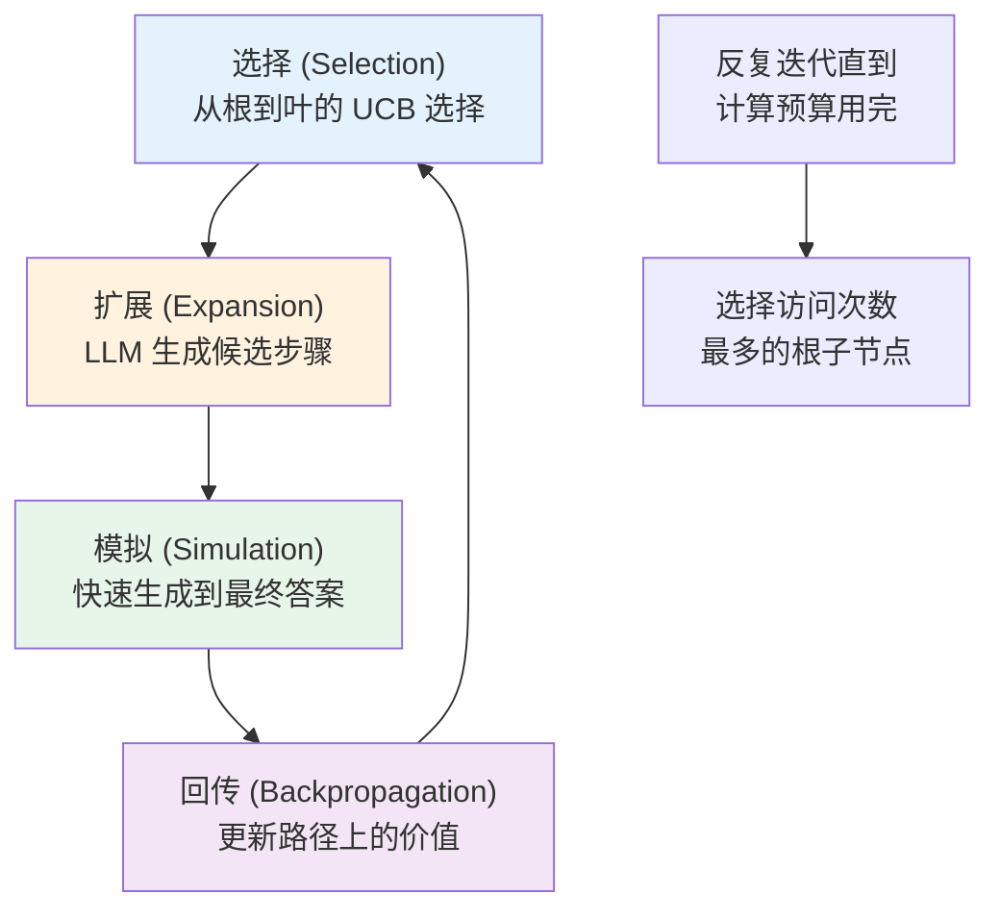

**UCB 公式在 LLM 推理中的应用**：

$$\text{UCB}(s, a) = \bar{Q}(s, a) + c \cdot \sqrt{\frac{\ln N(s)}{N(s, a)}} + w \cdot \log P_{LLM}(a \mid s)$$

其中：
- $\bar{Q}(s, a)$：动作 $a$ 的平均价值（由 PRM 评估）
- $\frac{\ln N(s)}{N(s, a)}$：探索项（鼓励尝试较少探索的动作）
- $\log P_{LLM}(a \mid s)$：LLM 的先验偏好（倾向于 LLM 认为合理的步骤）

### 4.3 推理时计算的最优分配策略

**核心问题**：给定固定的测试时计算预算，如何最优地分配？

**Snell et al. (2024) 的分析框架**：

考虑两种测试时计算策略：
1. **并行扩展**：采样多个独立回答，选择最好的（Best-of-N）
2. **串行扩展**：生成更长的推理链（更深入的思考）

$$\text{Performance}(C_{test}) = \max\left(\text{Parallel}(C_{test}), \text{Serial}(C_{test})\right)$$

**发现**：
- **简单问题**：少量计算即可，两种策略差异不大
- **中等问题**：并行扩展效果好（多个简短推理 > 一个长推理）
- **困难问题**：串行扩展效果好（需要深入思考，多次浅层尝试无效）

**自适应分配**：

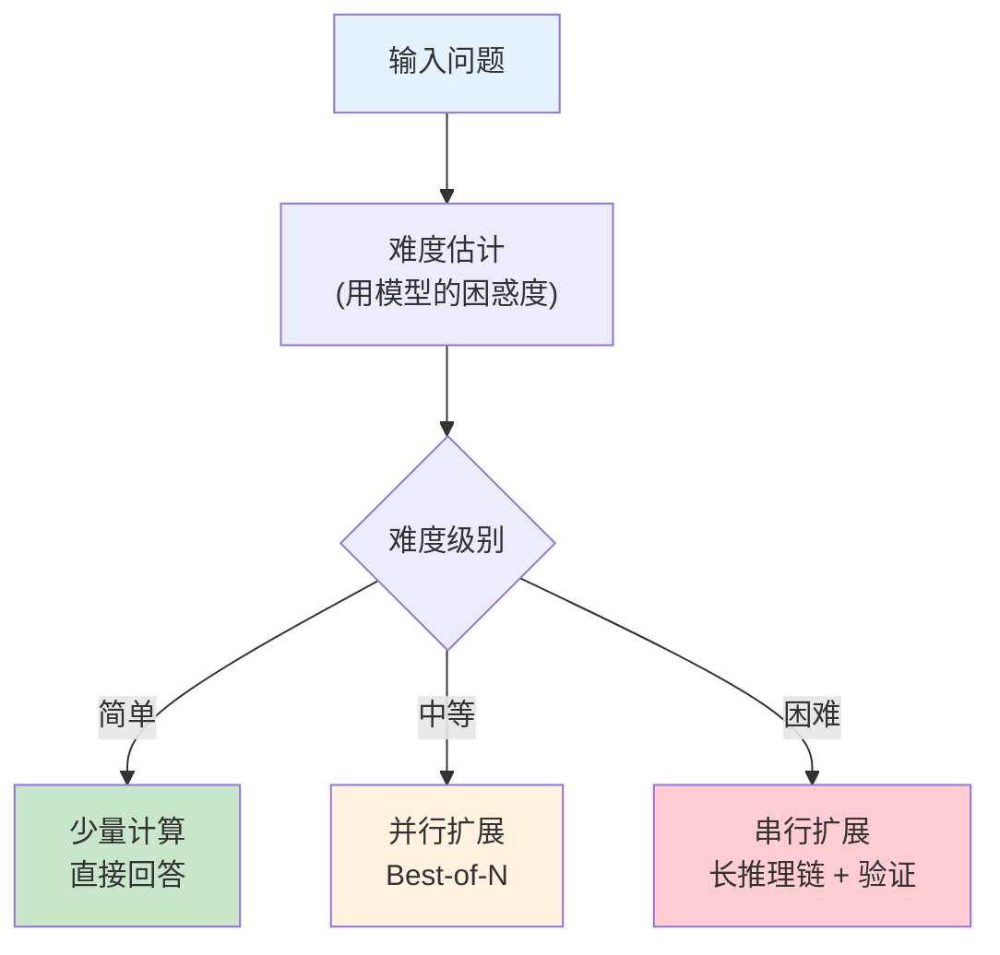

### 4.4 推理能力的蒸馏

将强推理模型的推理能力迁移到弱模型，是当前的热门研究方向：

**蒸馏方法对比**：

| 方法 | 描述 | 优势 | 劣势 |
|------|------|------|------|
| 数据蒸馏 | 用强模型生成推理数据，弱模型 SFT | 简单易实现 | 只能模仿输出形式 |
| 过程蒸馏 | 蒸馏中间推理步骤的概率分布 | 更深层次的知识迁移 | 需要对齐推理步骤 |
| RL 蒸馏 | 弱模型做 RL，强模型做 Verifier | 弱模型保持自主性 | 训练成本高 |

**DeepSeek 的蒸馏发现**：

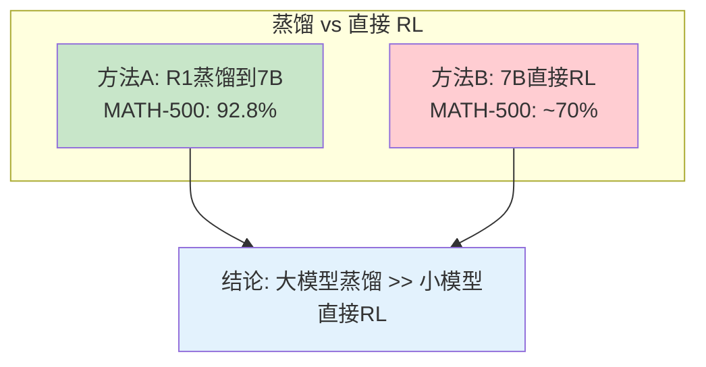

**为什么蒸馏效果更好？**
- 大模型探索的推理路径空间更广
- 大模型能生成更高质量的推理数据
- 小模型通过 SFT 学习这些数据比自己探索更高效
- 但蒸馏模型的推理能力有上限，受限于教师模型

### 4.5 推理计算的 Scaling Law

训练阶段的 Scaling Law（Kaplan et al., 2020; Hoffmann et al., 2022）描述了模型性能如何随训练计算量增长。推理阶段是否存在类似的规律？

**推理 Scaling Law 的基本形式**：

对于 Best-of-N 策略，性能（pass rate）随 $N$ 的增长可以近似为：

$$\text{Accuracy}(N) \approx 1 - (1-p)^N \approx 1 - \exp(-pN)$$

其中 $p$ 是模型的单次正确率。这是一个**指数饱和曲线**——初期增长快，后期收益递减。

对于更一般的测试时计算（包括更长的推理链），Snell et al. (2024) 发现性能可以近似为：

$$\text{Performance}(C_{test}) \approx a \cdot \log(C_{test}) + b$$

即性能随推理计算的**对数**增长——这与训练 Scaling Law 中性能随训练计算的幂律增长形成对比。

**训练 Scaling Law vs 推理 Scaling Law 对比**：

| 维度 | 训练 Scaling Law | 推理 Scaling Law |
|------|-----------------|-----------------|
| 函数形式 | 幂律: $L \propto C^{-\alpha}$ | 对数: $\text{Acc} \propto \log(C)$ |
| 收益递减速度 | 相对缓慢 | 相对较快 |
| 适用范围 | 通用能力提升 | 特定任务的推理质量 |
| 成本特征 | 一次性投入（训练完成即可） | 每次推理都需支付 |
| 资源复用 | 训练好的模型可服务所有用户 | 每个请求独立消耗推理计算 |

**"推理计算 vs 训练计算"的资源分配权衡**：

这是一个具有深刻工程意义的问题。假设你有固定的总计算预算 $C_{total}$：

$$C_{total} = C_{train} + C_{test} \cdot Q$$

其中 $Q$ 是预期的查询总量。分配策略取决于：

- **查询量小**（$Q$ 小，如科研场景）：可以大量投入推理计算，用小模型 + 大量推理计算
- **查询量大**（$Q$ 大，如生产环境）：训练一个更强的模型更划算，减少每次推理的计算量
- **关键决策问题**（高价值、低频率）：推理计算的投资回报率最高

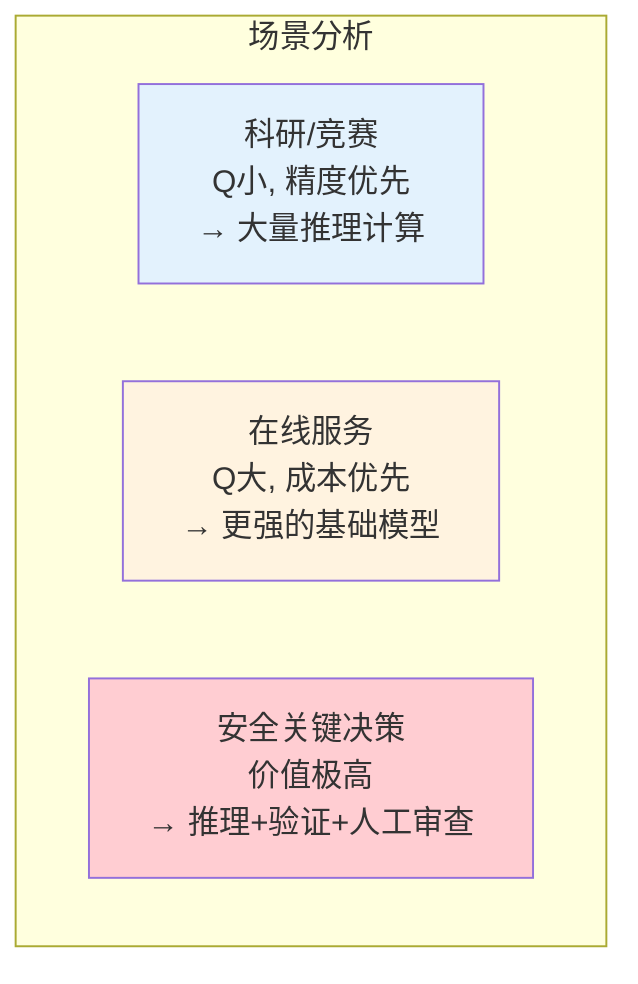

**Brown et al. (2024) "Large Language Monkeys" 的发现**：

该研究系统地测试了大量重复采样对代码生成任务的影响：
- 在 SWE-bench Lite 上，将采样数从 1 增加到 250，解决率从 15.9% 提升到 56%
- 但这意味着计算量增加了 250 倍，而性能提升约 3.5 倍
- 推理 Scaling 的效率远低于训练 Scaling，但在特定场景下仍然有价值

### 4.6 Verification（验证）前沿

验证器是测试时计算的核心组件。如何构建可靠的验证器，是推理系统面临的根本性挑战。

**形式化验证 vs 神经网络验证**：

| 方法 | 原理 | 可靠性 | 适用范围 | 代表工具/方法 |
|------|------|--------|----------|-------------|
| 形式化验证 | 基于数学证明系统 | 100%（逻辑无误即保证正确） | 数学证明、程序正确性 | Lean 4, Coq, Isabelle |
| 神经网络验证 (ORM) | 训练模型判断最终答案 | ~70-85%（存在误判） | 通用推理任务 | 训练一个分类/回归模型 |
| 神经网络验证 (PRM) | 训练模型逐步判断 | ~80-90%（比 ORM 好） | 逐步推理任务 | Lightman et al. (2023) |
| 规则验证 | 预定义的正确性检查规则 | 取决于规则覆盖度 | 数学计算、代码执行 | 单元测试、答案比对 |

**形式化验证的理想与现实**：
- AlphaProof 使用 Lean 4 验证器达到了 IMO 银牌水平，证明形式化验证的强大
- 但形式化验证要求问题被"翻译"为形式语言，这本身就是一个困难任务
- 目前仅在数学证明和程序验证领域可行，无法覆盖自然语言推理

**Math-Shepherd：自动生成过程监督数据**

Wang et al. (2024) 提出的 Math-Shepherd 方法解决了 PRM 训练数据获取困难的问题：

**核心思想**：不需要人工标注每个推理步骤，而是通过**蒙特卡洛采样**自动估计每个步骤的正确性。

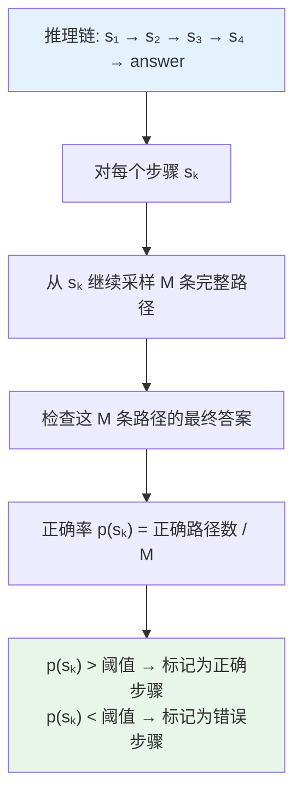

**Math-Shepherd 的关键公式**：

对于推理链的第 $k$ 步 $s_k$，其自动标注的正确性分数为：

$$\hat{y}_k = \frac{1}{M} \sum_{m=1}^{M} \mathbf{1}[\text{complete}(s_1, \ldots, s_k, r_k^{(m)}) = a^*]$$

其中 $r_k^{(m)}$ 是从第 $k$ 步开始的第 $m$ 条续写路径，$a^*$ 是标准答案。

**Math-Shepherd 的效果**：

| 方法 | MATH 准确率 | 标注成本 |
|------|-----------|---------|
| ORM + Best-of-N | 63.2% | 低（仅需答案标注） |
| 人工标注 PRM + Best-of-N | 78.2% | 极高（逐步人工标注） |
| Math-Shepherd PRM + Best-of-N | **76.5%** | **低（自动生成）** |

Math-Shepherd 几乎追平了人工标注 PRM 的效果，同时消除了昂贵的人工标注需求。

**验证器的可靠性问题：验证器也会犯错**

一个被经常忽视的根本问题是：**验证器本身也是不完美的**。

验证器的错误类型：

1. **假阳性（False Positive）**：错误的推理/答案被验证器判为正确
   - 危害：可能选择错误答案，反而不如多数投票
   - 常见原因：验证器对某些错误模式"盲区"

2. **假阴性（False Negative）**：正确的推理/答案被验证器判为错误
   - 危害：浪费了本可使用的正确答案
   - 常见原因：推理路径不符合验证器见过的"标准格式"

**验证器可靠性与 Best-of-N 的交互**：

设验证器的精度为 $\text{prec}$（将正确答案判为正确的概率）、召回为 $\text{rec}$（不误判错误答案为正确的概率）。

当验证器精度不够高时，Best-of-N 可能反而劣于简单的多数投票：

$$\text{Best-of-N 有效当且仅当 } \text{prec} > \frac{1}{1 + \frac{p}{1-p} \cdot N}$$

其中 $p$ 是模型的基础正确率。**验证器质量不足时，增加 $N$ 反而会引入更多被错误验证的候选**。

**实践建议**：
- 在部署 Best-of-N 之前，先评估验证器在目标任务上的精度和召回
- 如果验证器不够可靠，简单多数投票往往是更安全的选择
- 考虑"验证器集成"：同时使用多个验证器，取交集或加权平均

---

## 5. 自动化评测流水线（LLM-as-a-Judge）

### 5.1 核心思想

随着 LLM 能力的提升，用人工评测所有模型变得不可行。**LLM-as-a-Judge** 提出：用强大的 LLM（如 GPT-4、Claude）自动评估其他模型的输出。

**为什么需要 LLM-as-a-Judge？**

| 评测方法 | 优势 | 劣势 |
|----------|------|------|
| 人工评测 | 质量高、灵活 | 成本高、速度慢、难以复现 |
| 自动指标（BLEU等） | 快速、可复现 | 与人类判断相关性低 |
| LLM-as-a-Judge | 接近人类判断、可扩展 | 存在偏差、依赖强模型 |

**基本框架**：

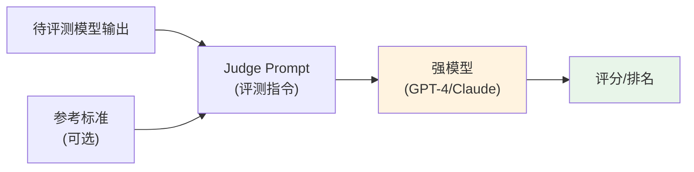

### 5.2 评测一致性分析

LLM Judge 存在已知的系统性偏差，需要识别和校正：

**Position Bias（位置偏差）**：

当比较两个回答时，LLM Judge 倾向于偏好特定位置（如第一个回答）：

$$P(\text{选择回答A} \mid A\text{在位置1}) \neq P(\text{选择回答A} \mid A\text{在位置2})$$

**数学校正**：

交换两个回答的位置，取两次判断的平均：

$$\text{Score}(A, B) = \frac{1}{2}\left[J(A, B) + (1 - J(B, A))\right]$$

其中 $J(A, B)$ 表示 A 在位置 1、B 在位置 2 时 Judge 选择 A 的概率。

**实践中的实现**：

```python
def position_bias_corrected_judge(judge_model, question, answer_a, answer_b):
    """
    位置偏差校正的评测

    通过交换回答位置并取平均来消除位置偏差
    """
    # 回答 A 在前
    score_ab = judge_model.compare(
        question=question,
        answer_first=answer_a,
        answer_second=answer_b
    )  # 返回: 选择 A 的概率

    # 回答 B 在前
    score_ba = judge_model.compare(
        question=question,
        answer_first=answer_b,
        answer_second=answer_a
    )  # 返回: 选择 B 的概率

    # 校正后的 A 得分
    corrected_score_a = 0.5 * (score_ab + (1 - score_ba))

    return corrected_score_a
```

**Verbosity Bias（话唠偏差）**：

LLM Judge 倾向于偏好更长、更详细的回答，即使简短回答同样正确：

$$\text{Bias}_{verbosity} = \mathbb{E}[\text{Score}(\text{长回答})] - \mathbb{E}[\text{Score}(\text{短回答})] > 0$$

**去偏方法**：

1. **长度归一化**：将评分除以回答长度的对数
   $$\text{Score}_{norm} = \frac{\text{Score}}{\log(1 + \text{len})}$$

2. **显式指令**：在 Judge Prompt 中明确要求"不要因为回答长度而加分"

3. **参考对比**：提供参考答案，让 Judge 基于内容质量而非长度评分

### 5.3 Judge Prompt 模板

**Reference-guided Grading（参考引导评分）**：

这是一种有效的 Judge Prompt 设计模式，提供参考答案作为评分标准：

```
你是一个公正的评测专家。请根据以下标准评估模型的回答质量。

## 评测任务
给定一个问题、一个参考答案和一个待评测的模型回答，请从以下维度评分：

1. **正确性** (0-5分): 回答中的事实和推理是否正确？
2. **完整性** (0-5分): 回答是否覆盖了问题的所有方面？
3. **清晰度** (0-5分): 回答是否表达清晰、逻辑连贯？
4. **实用性** (0-5分): 回答对提问者是否有实际帮助？

## 评分规则
- 以参考答案为标准，但不要求模型回答与参考答案完全一致
- 模型回答可以有不同的组织方式，只要内容正确即可
- 不要因为回答更长或更短而加分或扣分
- 如果回答包含错误信息，即使其他部分正确，也应大幅扣分

## 问题
{question}

## 参考答案
{reference_answer}

## 模型回答
{model_answer}

## 请输出
请按以下JSON格式输出评分：
```json
{
    "correctness": <0-5>,
    "completeness": <0-5>,
    "clarity": <0-5>,
    "usefulness": <0-5>,
    "total": <0-20>,
    "reasoning": "<评分理由>"
}
```
```

**Pairwise Comparison（成对比较）**：

```
你是一个公正的评测专家。请比较两个模型对同一问题的回答，
选择更好的一个。

## 评比规则
- 从正确性、完整性、清晰度三个维度综合评判
- 不要因为回答的长度差异而产生偏好
- 如果两个回答质量相当，选择"平局"

## 问题
{question}

## 回答 A
{answer_a}

## 回答 B
{answer_b}

## 请选择
你认为哪个回答更好？请输出：
- "A" 如果回答A更好
- "B" 如果回答B更好
- "tie" 如果两者质量相当

选择: [A/B/tie]
理由: <简要说明>
```

### 5.4 AlpacaEval 与 MT-Bench 的实现原理

**AlpacaEval**：

AlpacaEval 是一个自动化的 LLM 评测框架：

| 版本 | 方法 | 参考模型 |
|------|------|---------|
| AlpacaEval 1.0 | 与参考模型对比，GPT-4 做 Judge | text-davinci-003 |
| AlpacaEval 2.0 | 加入长度控制的胜率（LC Win Rate） | GPT-4 Turbo |

**Length-Controlled (LC) Win Rate**：

AlpacaEval 2.0 的核心创新是控制长度偏差：

$$\text{LC Win Rate} = \text{Win Rate} - \beta \cdot (\text{平均长度} - \text{参考长度})$$

这确保模型不能通过简单地生成更长的回答来获得更高分数。

**MT-Bench**：

MT-Bench（Multi-Turn Benchmark）评测多轮对话能力：

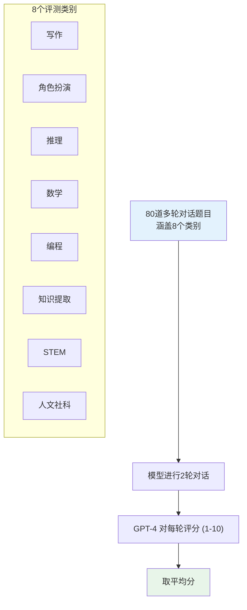

**MT-Bench 的评分标准**：

| 分数 | 含义 |
|------|------|
| 9-10 | 出色，几乎完美 |
| 7-8 | 好，有小瑕疵 |
| 5-6 | 一般，有明显问题 |
| 3-4 | 差，有严重错误 |
| 1-2 | 很差，基本无法使用 |

### 5.5 LLM-as-a-Judge 的局限性

**已知局限**：

1. **自我偏好（Self-preference）**：LLM Judge 倾向于偏好与自己风格相似的回答
2. **能力上限**：Judge 无法可靠地评估超出自身能力的回答
3. **一致性问题**：同一 Judge 在不同时间可能给出不同评分
4. **文化/语言偏差**：英文训练为主的 Judge 可能对中文回答评价不公

**缓解策略**：

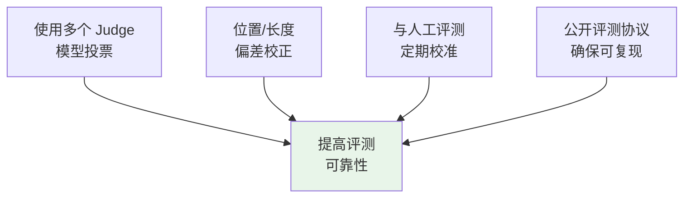

---

## 参考文献

1. DeepSeek-AI (2025). "DeepSeek-R1: Incentivizing Reasoning Capability in LLMs via Reinforcement Learning."
2. Lightman, H., et al. (2023). "Let's Verify Step by Step." ICLR 2024.
3. Snell, C., et al. (2024). "Scaling LLM Test-Time Compute Optimally can be More Effective than Scaling Model Parameters."
4. Zheng, L., et al. (2023). "Judging LLM-as-a-Judge with MT-Bench and Chatbot Arena." NeurIPS 2023.
5. Li, X., et al. (2023). "AlpacaEval: An Automatic Evaluator of Instruction-following Models."
6. AlphaProof and AlphaGeometry teams (2024). "AI achieves silver-medal standard solving International Mathematical Olympiad problems."
7. Li, Y., et al. (2024). "AlphaCode 2 Technical Report."
8. Lanham, T., et al. (2023). "Measuring Faithfulness in Chain-of-Thought Reasoning." Anthropic Research.
9. Feng, X., et al. (2024). "AlphaZero-like Tree-Search can Guide Large Language Model Decoding and Training."
10. Wang, P., et al. (2024). "Math-Shepherd: Verify and Reinforce LLMs Step-by-step without Human Annotations."
11. Brown, B., et al. (2024). "Large Language Monkeys: Scaling Inference Compute with Repeated Sampling." arXiv:2407.21787.
12. Kaplan, J., et al. (2020). "Scaling Laws for Neural Language Models." arXiv:2001.08361.
13. Hoffmann, J., et al. (2022). "Training Compute-Optimal Large Language Models (Chinchilla)." NeurIPS 2022.
