# 模块14：推理加速 — KV Cache / 量化 / 系统优化

> **章节定位**：推理加速是 LLM 从实验室走向生产的关键环节。在前面的学习中，我们已经完成了模型的预训练（Module 8-10）、微调对齐（Module 11-12）以及评估（Module 13）。但一个训练好的模型要真正服务于用户，还必须解决推理效率问题——**推理成本才是长期运营的主要开支**。本章系统剖析 LLM 推理的性能瓶颈，介绍 KV Cache、量化、Flash Attention、投机解码、Prefix Caching 等核心优化技术。掌握这些知识后，你将具备进入 Module 15（RAG 检索增强生成）和 Module 16（前沿话题）的基础，也为理解实际部署中的工程决策打下根基。

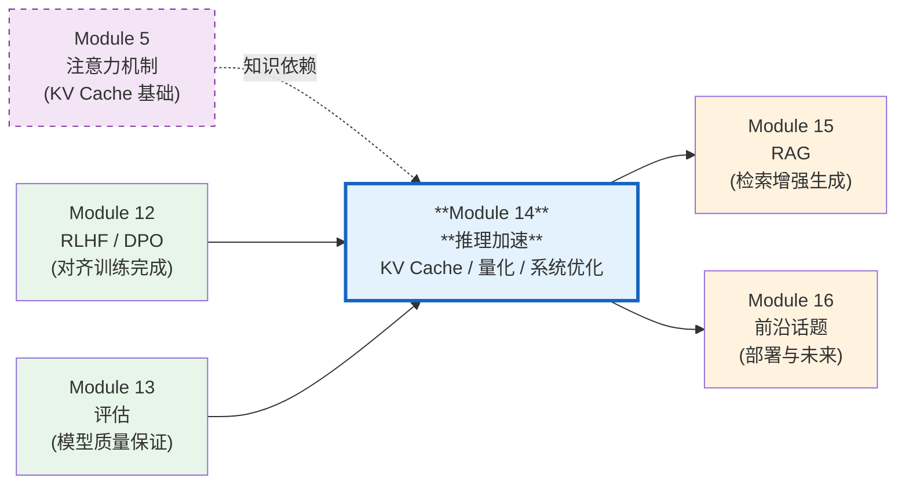

> 一个 70B 参数的模型，每生成一个 token 都需要读取上百 GB 的权重和缓存数据。本章将帮助你理解如何将推理速度提升数倍乃至数十倍，同时保持模型质量。

---

## 目录

- [1. LLM 推理的性能瓶颈](#1-llm-推理的性能瓶颈)
- [2. 推理系统全景](#2-推理系统全景)
- [3. KV Cache](#3-kv-cache)
- [4. PagedAttention 与 vLLM](#4-pagedattention-与-vllm)
- [5. 模型量化](#5-模型量化)
- [6. Flash Attention](#6-flash-attention)
- [7. 推理系统优化](#7-推理系统优化)
- [8. Prefix Caching 与 Prompt Caching](#8-prefix-caching-与-prompt-caching)
- [9. 三条技术线的推理实践](#9-三条技术线的推理实践)
- [10. 项目实践](#10-项目实践)
- [11. 本章小结](#11-本章小结)

---

## 1. LLM 推理的性能瓶颈

### 1.1 推理的两个阶段：Prefill 与 Decode

LLM 推理并非一个均匀的过程，而是分为两个本质不同的阶段。

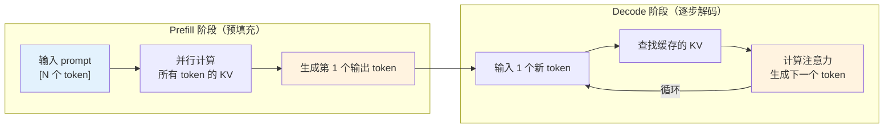

**Prefill 阶段**：
- 输入整个 prompt（$N$ 个 token），**并行**计算所有 token 的 Key 和 Value
- 计算特点：大矩阵乘法，**计算密集型（compute-bound）**
- 类比：老师一次性阅读学生的整篇作文

**Decode 阶段**：
- 每步只处理**1 个新 token**，但需要与之前所有 token 的 KV 做注意力
- 计算特点：小矩阵与大矩阵的乘法，**访存密集型（memory-bound）**
- 类比：老师每次只写一个字的评语，但每写一个字都要回看整篇作文

两个阶段的关键差异总结：

| 特性 | Prefill | Decode |
|------|---------|--------|
| 输入 token 数 | $N$（prompt 长度） | $1$（逐个生成） |
| 并行度 | 高 | 低 |
| 瓶颈类型 | 计算密集型 | 访存密集型 |
| 延迟含义 | 首 token 延迟（TTFT） | 每 token 延迟（TPOT） |
| 优化方向 | 提高算力利用 | 减少内存访问 |

### 1.2 计算密集型 vs 访存密集型

理解推理瓶颈的核心框架是**算术强度（Arithmetic Intensity）**。

**定义**：算术强度是每字节内存访问所执行的浮点运算次数：

$$\text{Arithmetic Intensity} = \frac{\text{FLOPs（浮点运算数）}}{\text{Bytes（内存访问字节数）}}$$

单位为 FLOPs/Byte。

**举例**：考虑矩阵-向量乘法 $y = Wx$，其中 $W \in \mathbb{R}^{m \times n}$，$x \in \mathbb{R}^{n}$。

- FLOPs：$2mn$（每个元素需要一次乘法和一次加法）
- 内存访问：读取 $W$ 需要 $mn$ 个元素，读取 $x$ 需要 $n$ 个元素，写入 $y$ 需要 $m$ 个元素
- 使用 FP16（2 字节/元素）：总内存访问 $\approx 2mn$ 字节（$W$ 是主要部分）

因此：

$$\text{AI}_{matvec} = \frac{2mn}{2(mn + n + m)} \approx 1 \text{ FLOP/Byte}$$

这正是 Decode 阶段的典型场景——**算术强度极低**。

相比之下，矩阵-矩阵乘法 $Y = WX$，其中 $X \in \mathbb{R}^{n \times B}$（$B$ 是 batch size）：

$$\text{AI}_{matmul} = \frac{2mnB}{2(mn + nB + mB)} \approx B \text{ FLOPs/Byte}$$

当 $B$ 足够大时（Prefill 阶段或大 batch），算术强度随之增大，计算变得划算。

### 1.3 Roofline 模型

Roofline 模型是分析硬件性能上限的经典工具。

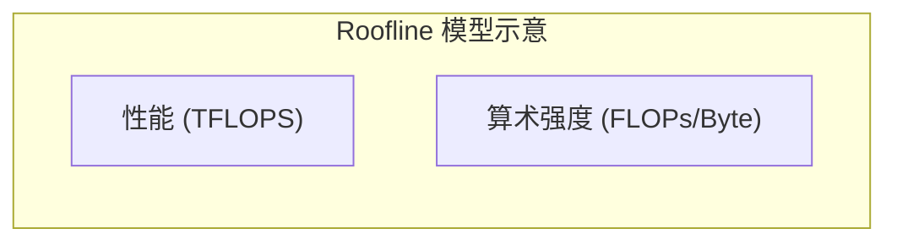

Roofline 模型将硬件性能描述为两个约束的较小值：

$$\text{Performance} = \min\left(\text{Peak Compute}, \quad \text{Memory Bandwidth} \times \text{Arithmetic Intensity}\right)$$

以 NVIDIA A100 80GB SXM 为例：

| 指标 | 数值 |
|------|------|
| FP16 峰值算力 | 312 TFLOPS |
| HBM 带宽 | 2.0 TB/s |
| **拐点算术强度** | $312 / 2.0 = 156$ FLOPs/Byte |

**解读**：
- 当算术强度 $< 156$ FLOPs/Byte 时，性能受限于**内存带宽**（访存密集区）
- 当算术强度 $\geq 156$ FLOPs/Byte 时，性能受限于**计算能力**（计算密集区）

Decode 阶段的算术强度约 $1\text{-}2$ FLOPs/Byte，远低于拐点，因此是**严重的访存瓶颈**。这意味着 GPU 的绝大部分算力处于空闲状态，性能被"从内存搬运数据"的速度所限制。

### 1.4 推理延迟的组成分解

一次完整推理的端到端延迟可以分解为：

$$T_{total} = T_{prefill} + T_{decode} \times N_{output}$$

其中：

- $T_{prefill}$（首 token 延迟，TTFT）：处理输入 prompt 并生成第一个 token 的时间
- $T_{decode}$（每 token 延迟，TPOT）：每生成一个新 token 的时间
- $N_{output}$：生成的 token 总数

**实际数据参考**（Llama 2 70B，A100 80GB，FP16）：

| 指标 | 典型值 |
|------|--------|
| TTFT（prompt=512） | ~200 ms |
| TPOT | ~30 ms/token |
| 生成 256 tokens 总延迟 | ~7.9 s |

可见 Decode 阶段占据了绝大部分推理时间（约 97%）。这也解释了为什么几乎所有推理优化都聚焦于**减少 Decode 阶段的每 token 延迟**。

---

## 2. 推理系统全景

在深入各项具体优化技术之前，我们先建立对 LLM 推理系统的全局认知。一个生产级的 LLM 推理系统不仅仅是"加载模型 + 生成 token"，而是一个包含请求调度、显存管理、计算优化、缓存策略的复杂工程系统。

### 2.1 推理系统的分层架构

一个完整的 LLM 推理系统可以分为以下层次：

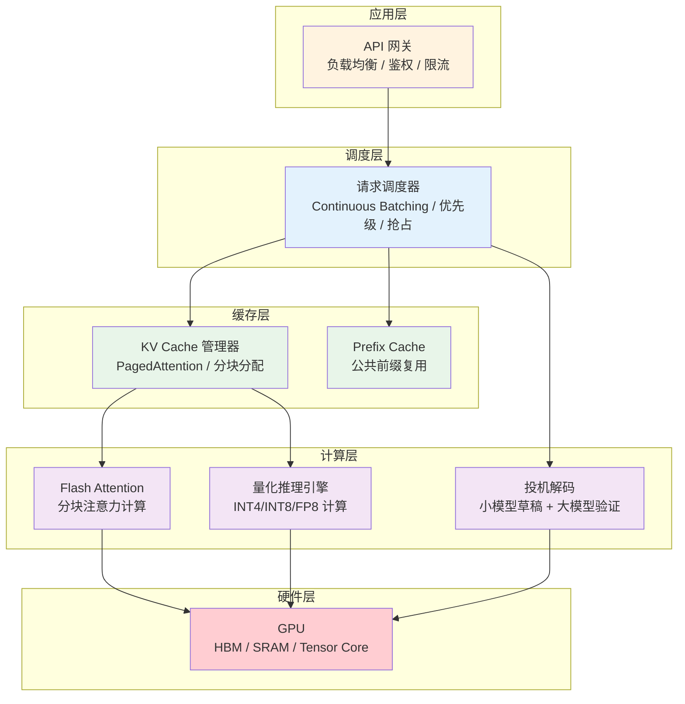

### 2.2 Prefill 与 Decode 的深度对比

在第 1 节中我们已经介绍了 Prefill 和 Decode 两个阶段的基本概念。这里我们从**硬件利用率**的角度进一步分析。

**Prefill 阶段的计算分析**：

假设输入 prompt 有 $N$ 个 token，模型有 $L$ 层，每层包含一个自注意力模块和一个 FFN 模块。

- 自注意力的计算量：$4Nd_{model}^2$（Q/K/V/O 四个线性投影）+ $2N^2 d_{model}$（注意力矩阵计算）
- FFN 的计算量：$16Nd_{model}^2$（假设 FFN 隐层维度为 $4d_{model}$）
- 每层总计：$\approx 20Nd_{model}^2 + 2N^2 d_{model}$

当 $N$ 较大时（如 $N > 1000$），大矩阵乘法可以充分利用 GPU 的 Tensor Core，算力利用率可达 **60-80%**。

**Decode 阶段的计算分析**：

每步仅处理 1 个新 token（$N=1$），但需要与缓存中的 $S$ 个 token 做注意力：

- 线性投影：$4 \times 1 \times d_{model}^2 = 4d_{model}^2$（矩阵-向量乘法）
- 注意力计算：$2 \times S \times d_{model}$（向量与矩阵相乘）
- FFN：$16d_{model}^2$

关键瓶颈：**线性投影和 FFN 都是矩阵-向量乘法**，需要从 HBM 读取整个权重矩阵，但只做极少量的计算。以 Llama 2 70B 为例：

$$\text{每步需读取的权重} \approx 70B \times 2 \text{ bytes (FP16)} = 140 \text{ GB}$$

$$\text{每步的计算量} \approx 140 \text{ GFLOPs}$$

$$\text{实际算术强度} = \frac{140 \text{ GFLOPs}}{140 \text{ GB}} = 1 \text{ FLOP/Byte}$$

而 A100 的拐点算术强度为 156 FLOP/Byte。这意味着 Decode 阶段 **GPU 算力的 99.4% 处于空闲状态**，性能完全受限于内存带宽。

**Prefill-Decode 分离（Disaggregated Serving）**：

正是因为两个阶段的资源需求完全不同，前沿推理系统开始探索**分离架构**：

| 策略 | Prefill 节点 | Decode 节点 |
|------|-------------|-------------|
| 硬件选择 | 高算力 GPU（如 H100 SXM） | 高带宽 GPU 或定制加速器 |
| batch 策略 | 大 batch（充分利用算力） | 小 batch（降低延迟） |
| 优化重点 | 计算效率 | 内存带宽效率 |
| 典型系统 | Splitwise, DistServe | Splitwise, DistServe |

这种分离架构可以让每类节点专注于自己擅长的计算模式，整体吞吐量可提升 **1.4-2.0 倍**。

### 2.3 Continuous Batching 的本质

为什么 Continuous Batching 如此重要？让我们从 GPU 利用率的数学视角来理解。

**Static Batching 的浪费根源**：

假设 batch 中有 4 个请求，生成长度分别为 50、200、80、150 tokens。在 Static Batching 下：

```
时间轴 (step) →
请求 A: ████████████████████████████████████████░░░░░░░░░░░░░░░  (50/200 有效)
请求 B: ████████████████████████████████████████████████████████  (200/200 有效)
请求 C: ████████████████████████████████████████████░░░░░░░░░░░  (80/200 有效)
请求 D: ████████████████████████████████████████████████████░░░  (150/200 有效)

GPU 利用率 = (50 + 200 + 80 + 150) / (4 × 200) = 60%
```

**Continuous Batching 的核心机制**：

Continuous Batching 在每一个 Decode step 进行**细粒度调度**：

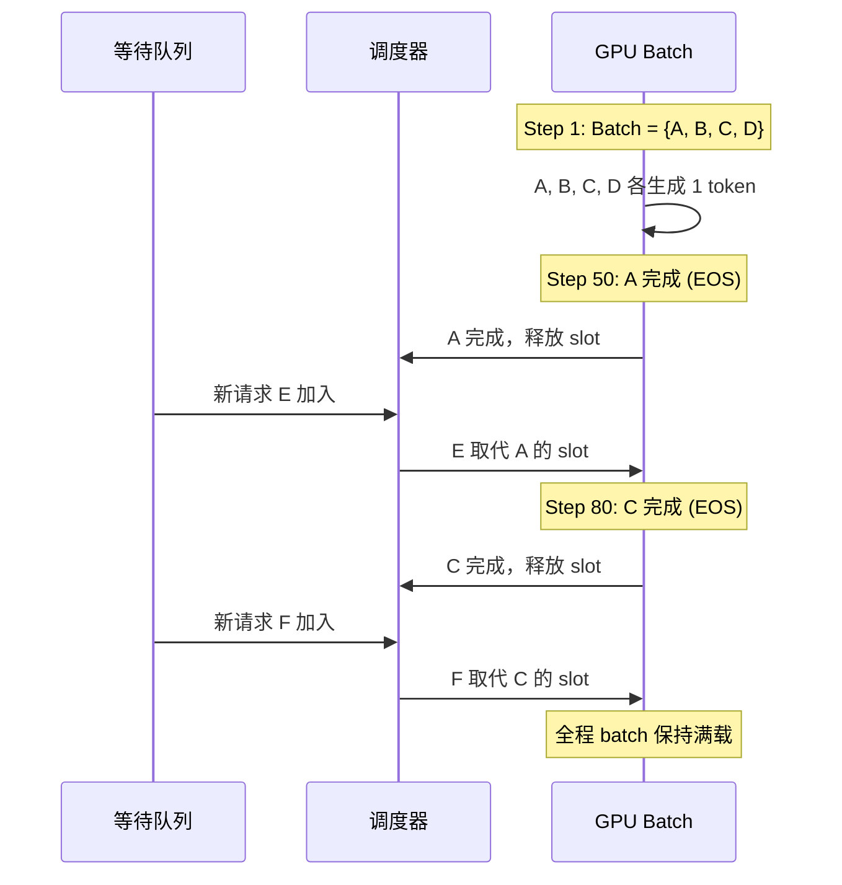

**迭代级调度（Iteration-level Scheduling）**：

与 Static Batching 的"请求级调度"不同，Continuous Batching 在**每个 Decode 迭代**做出调度决策：

1. 检查哪些请求已经完成（生成了 EOS 或达到最大长度）
2. 将完成的请求从 batch 中移除，立即释放其 KV Cache 占用的显存块
3. 从等待队列中选择新请求填入空缺位置
4. 新请求先执行 Prefill（可以与其他请求的 Decode 并行），然后加入 Decode 循环

**吞吐量的理论分析**：

设请求到达率为 $\lambda$（请求/秒），平均服务时间为 $\bar{T}$（秒），batch 容量为 $B$：

- Static Batching 吞吐量上限：$\frac{B}{\max(T_1, \ldots, T_B)}$（受最慢请求限制）
- Continuous Batching 吞吐量上限：$\frac{B}{\bar{T}}$（趋近平均服务时间的倒数）

当请求长度方差较大时（实际场景的常态），Continuous Batching 的优势尤为显著。

---

## 3. KV Cache

### 3.1 为什么需要 KV Cache？

回顾自注意力的计算：

$$\text{Attention}(Q, K, V) = \text{softmax}\left(\frac{QK^T}{\sqrt{d_k}}\right) V$$

在 Decode 阶段，生成第 $t$ 个 token 时，模型需要计算新 token 的 query $q_t$ 与**所有之前 token** 的 key $k_1, \ldots, k_t$ 的注意力分数。

**不使用缓存的做法**：每生成一个 token，都重新计算前面所有 token 的 $K$ 和 $V$。生成长度为 $T$ 的序列的总计算量为：

$$\text{FLOPs}_{naive} \propto \sum_{t=1}^{T} t \cdot d = O(T^2 d)$$

**使用 KV Cache**：把已计算过的 $K$ 和 $V$ 缓存起来。每一步只需计算新 token 的 $k_t, v_t$，然后拼接到缓存中：

$$K_t = \text{concat}(K_{t-1}, k_t), \quad V_t = \text{concat}(V_{t-1}, v_t)$$

$$\text{Attention}_t = \text{softmax}\left(\frac{q_t K_t^T}{\sqrt{d_k}}\right) V_t$$

计算量降为：

$$\text{FLOPs}_{cached} \propto \sum_{t=1}^{T} d = O(Td)$$

**加速比**：$O(T^2 d) / O(Td) = O(T)$，即序列越长，KV Cache 的加速效果越显著。

```mermaid
graph TB
    subgraph "无 KV Cache（每步重复计算）"
        A1["Step 1: 计算 K,V for [t1]"]
        A2["Step 2: 计算 K,V for [t1,t2]"]
        A3["Step 3: 计算 K,V for [t1,t2,t3]"]
        A4["Step T: 计算 K,V for [t1,...,tT]"]
    end

    subgraph "有 KV Cache（增量计算）"
        B1["Step 1: 计算 k1,v1 → 缓存"]
        B2["Step 2: 计算 k2,v2 → 追加缓存"]
        B3["Step 3: 计算 k3,v3 → 追加缓存"]
        B4["Step T: 计算 kT,vT → 追加缓存"]
    end

    A1 --> A2 --> A3 -.-> A4
    B1 --> B2 --> B3 -.-> B4

    style A1 fill:#ffcdd2
    style A2 fill:#ffcdd2
    style A3 fill:#ffcdd2
    style B1 fill:#c8e6c9
    style B2 fill:#c8e6c9
    style B3 fill:#c8e6c9
```

### 3.2 KV Cache 的显存计算

KV Cache 的显存开销是推理系统中最关键的瓶颈之一。下面推导其精确公式。

对于**标准多头注意力（MHA）**：

- 每层需要缓存 $K$ 和 $V$ 两个张量
- 每个张量形状为 $[\text{batch}, n_h, S, d_h]$
- 其中 $n_h$ 是注意力头数，$S$ 是序列长度，$d_h$ 是每头维度

每层每个 token 的 KV Cache 元素数：

$$\text{elements\_per\_token\_per\_layer} = 2 \times n_h \times d_h = 2 \times d_{model}$$

总 KV Cache 大小：

$$\boxed{M_{KV} = 2 \times L \times n_h \times d_h \times S \times b \times \text{dtype\_size}}$$

或等价地：

$$M_{KV} = 2 \times L \times d_{model} \times S \times b \times \text{dtype\_size}$$

其中：
- $L$：Transformer 层数
- $n_h$：注意力头数
- $d_h$：每头维度（$d_{model} = n_h \times d_h$）
- $S$：序列长度
- $b$：batch size
- $\text{dtype\_size}$：数据类型字节数（FP16=2, INT8=1, FP8=1）

**具体计算示例**（Llama 2 70B，batch=1，seq=4096，FP16）：

$$M_{KV} = 2 \times 80 \times 8192 \times 4096 \times 1 \times 2 = 10.7 \text{ GB}$$

**不同注意力变体的 KV Cache 对比**：

| 注意力类型 | 每层每 token 元素数 | Llama 2 70B (S=4096, FP16) |
|-----------|---------------------|---------------------------|
| MHA | $2 \times n_h \times d_h$ | 10.7 GB |
| GQA ($n_{kv}=8$) | $2 \times n_{kv} \times d_h$ | 1.3 GB |
| MQA ($n_{kv}=1$) | $2 \times d_h$ | 0.17 GB |
| MLA (DeepSeek) | $d_c + d_r$ | ~0.19 GB |

可见，GQA 和 MQA 通过减少 KV 头数，显著降低了 KV Cache 的显存开销。DeepSeek 的 MLA 更进一步，通过低秩压缩将 KV Cache 压缩到极致。

### 3.3 KV Cache 的管理策略

#### 3.3.1 预分配策略

**做法**：在推理开始前，按照最大序列长度一次性分配所有 KV Cache 显存。

```python
# 预分配 KV Cache（以一层为例）
# shape: [batch, n_kv_heads, max_seq_len, head_dim]
k_cache = torch.zeros(batch_size, n_kv_heads, max_seq_len, head_dim,
                       dtype=torch.float16, device="cuda")
v_cache = torch.zeros(batch_size, n_kv_heads, max_seq_len, head_dim,
                       dtype=torch.float16, device="cuda")
```

**优点**：
- 无需动态内存分配，避免碎片
- 索引操作高效

**缺点**：
- 按最大长度分配，短序列浪费大量显存
- batch 内不同请求的实际长度可能差异很大

#### 3.3.2 动态增长策略

**做法**：KV Cache 初始分配较小，随着序列增长动态扩展。

```python
# 动态增长：每次拼接新的 KV
k_cache = torch.cat([k_cache, new_k], dim=2)  # 在序列维度拼接
v_cache = torch.cat([v_cache, new_v], dim=2)
```

**优点**：显存利用率高（按需分配）

**缺点**：频繁的内存分配和数据拷贝，可能导致碎片和性能下降

#### 3.3.3 混合策略：分块预分配

实际系统中常采用折中方案：按固定块大小（如 256 tokens）预分配，用完后再分配新块。

```python
BLOCK_SIZE = 256

# 初始分配一个块
k_cache = torch.zeros(batch, n_kv_heads, BLOCK_SIZE, head_dim, ...)

# 当序列长度超过当前容量时，追加新块
if seq_len > current_capacity:
    new_block = torch.zeros(batch, n_kv_heads, BLOCK_SIZE, head_dim, ...)
    k_cache = torch.cat([k_cache, new_block], dim=2)
    current_capacity += BLOCK_SIZE
```

这种策略在显存利用率和分配效率之间取得平衡，也是 PagedAttention 的思想雏形。

---

## 4. PagedAttention 与 vLLM

### 4.1 传统 KV Cache 管理的问题

传统方式按每个请求的**最大可能长度**预分配连续的 KV Cache 显存，导致三大问题：

1. **内部碎片（Internal Fragmentation）**：实际序列长度往往远小于最大长度，大量预分配空间浪费
2. **外部碎片（External Fragmentation）**：不同请求的 KV Cache 大小不一，释放后留下不连续的空闲块
3. **无法共享（No Sharing）**：相同 prefix 的多个请求各自维护独立的 KV Cache 副本

**类比**：这就像操作系统早期的**连续内存分配**——每个进程独占一段连续内存，造成严重浪费。

### 4.2 PagedAttention：操作系统级的灵感

PagedAttention 借鉴了操作系统的**虚拟内存与分页机制**，将 KV Cache 管理方式从连续分配改为分页分配。

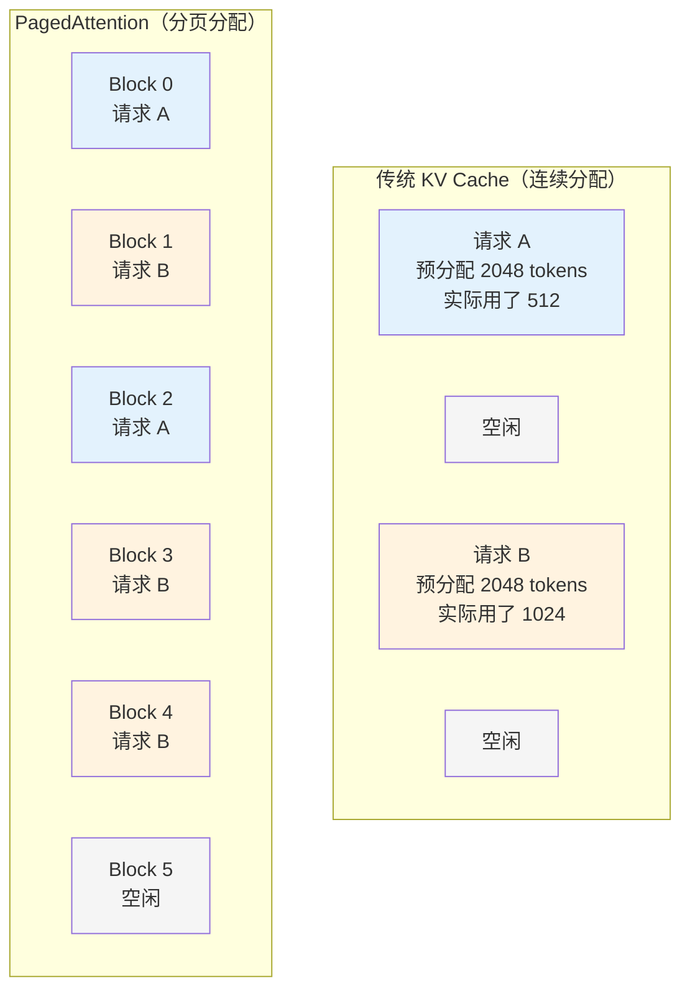

**核心概念**：

| 操作系统概念 | PagedAttention 类比 |
|-------------|-------------------|
| 物理页（Physical Page） | KV Cache Block（固定大小的 KV 存储块） |
| 逻辑页（Virtual Page） | 请求的第 $i$ 个 KV 块 |
| 页表（Page Table） | Block Table（逻辑块号 → 物理块号的映射） |
| 页分配器（Page Allocator） | Block Allocator（空闲块池管理） |

**Block 的定义**：每个 Block 存储固定数量（如 16 个）token 的 KV 缓存：

$$\text{Block} \in \mathbb{R}^{n_{kv\_heads} \times \text{block\_size} \times d_h}$$

### 4.3 分页管理的工作流程

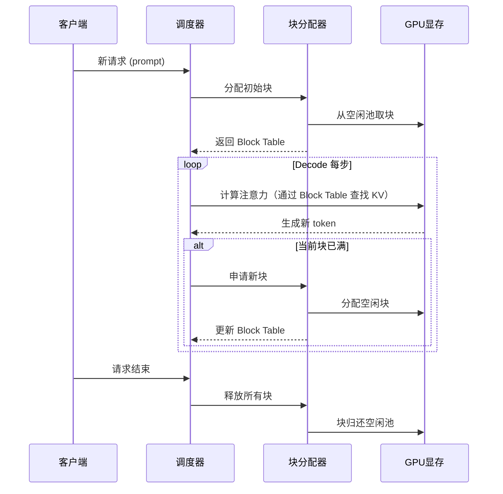

**Block Table 示例**：

假设 block_size=4，一个请求生成了 10 个 token：

```
Block Table: [物理块5, 物理块2, 物理块8]
Token 0-3  → 物理块 5
Token 4-7  → 物理块 2
Token 8-9  → 物理块 8（仅填充 2/4 slots）
```

注意力计算时，通过 Block Table 索引到物理块，无需连续内存。

### 4.4 显存碎片消除

PagedAttention 的分页机制带来了显著的碎片消除效果：

- **内部碎片**：从 $O(\text{max\_seq\_len})$ 降为 $O(\text{block\_size})$，最多浪费不到一个 block
- **外部碎片**：完全消除，因为所有块大小相同，可以任意分配

根据 vLLM 论文的测量，PagedAttention 将 KV Cache 的有效显存利用率从约 20-40% 提升到接近 **100%**（仅有 <4% 的内部碎片）。

### 4.5 Continuous Batching

传统的 **Static Batching** 中，batch 内所有请求必须同时开始、同时结束。这意味着：
- 短请求被迫等待长请求完成
- GPU 利用率随 batch 中最长序列的生成而逐渐降低

**Continuous Batching**（连续批处理）改变了这一范式：

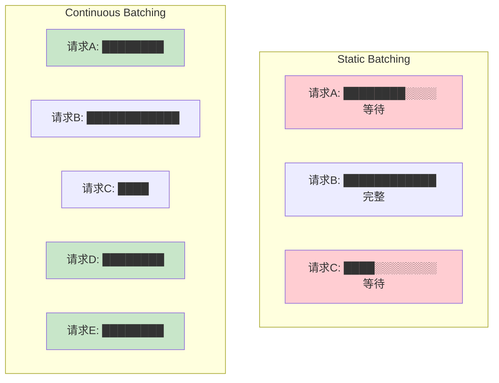

**Continuous Batching 的规则**：
1. 每个 Decode step，检查 batch 中是否有请求已完成（生成了 EOS 或达到最大长度）
2. 已完成的请求立即从 batch 中移除，释放其 KV Cache
3. 等待队列中的新请求随时可以填入空缺位置

**数学优势**：

设 batch 中 $n$ 个请求的生成长度分别为 $l_1, l_2, \ldots, l_n$：

- Static Batching 的 GPU 利用率：

$$\eta_{static} = \frac{\sum_{i=1}^n l_i}{n \cdot \max(l_1, \ldots, l_n)}$$

- Continuous Batching 的 GPU 利用率趋近于：

$$\eta_{continuous} \approx 1 \quad (\text{当请求队列足够深时})$$

vLLM 的实验表明，Continuous Batching 可以将吞吐量提升 **2-4 倍**。

---

## 5. 模型量化

### 5.1 量化基础

#### 5.1.1 什么是量化？

量化是将模型权重和/或激活从高精度浮点数（如 FP16）映射到低精度整数（如 INT8、INT4）的过程。

**动机**：
- **减少模型大小**：INT4 权重仅占 FP16 的 1/4 存储空间
- **加速推理**：INT8/INT4 运算比 FP16 更快（硬件支持）
- **降低显存**：权重 + KV Cache 显存的减少使更大模型可在更小 GPU 上运行

#### 5.1.2 线性量化

线性量化将连续的浮点数映射到离散的整数值：

$$\boxed{x_q = \text{round}\left(\frac{x}{s}\right) + z}$$

其中：
- $x$ 是原始浮点值
- $x_q$ 是量化后的整数值
- $s$ 是**缩放因子（scale）**
- $z$ 是**零点（zero point）**

反量化（近似恢复原值）：

$$\hat{x} = s \cdot (x_q - z)$$

#### 5.1.3 对称量化 vs 非对称量化

**对称量化**（Symmetric）：零点 $z = 0$，浮点数 0 精确映射到整数 0。

$$s = \frac{\max(|x|)}{2^{b-1} - 1}$$

其中 $b$ 是量化位宽。

例如 INT8 对称量化：$s = \frac{\max(|x|)}{127}$，量化范围 $[-127, 127]$。

**非对称量化**（Asymmetric）：允许零点偏移，能更好地利用量化范围。

$$s = \frac{x_{max} - x_{min}}{2^b - 1}, \quad z = \text{round}\left(-\frac{x_{min}}{s}\right)$$

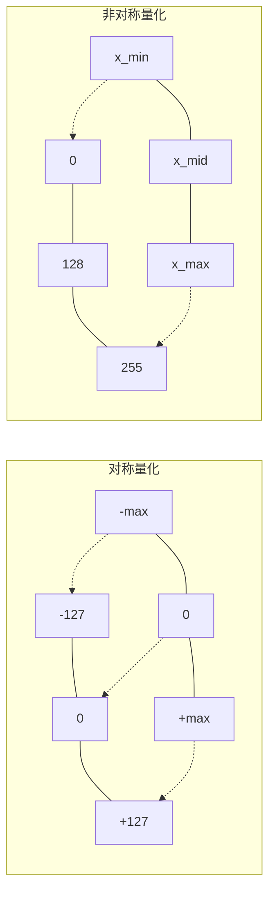

**选择原则**：
- 权重分布通常以 0 为中心 → 对称量化
- 激活值（如 ReLU 后）可能非负 → 非对称量化更合适

#### 5.1.4 量化粒度

量化粒度决定了多少个参数**共享同一组** scale 和 zero point：

| 粒度 | 描述 | 精度 | 开销 |
|------|------|------|------|
| **Per-tensor** | 整个张量一组参数 | 低 | 最小 |
| **Per-channel** | 每个输出通道一组 | 中 | 适中 |
| **Per-group** | 每 $g$ 个元素一组 | 高 | 较大 |
| **Per-element** | 每个元素独立 | 最高 | 不实用 |

现代 LLM 量化通常使用 **Per-group** 量化（group size=128），在精度和效率之间取得平衡。

#### 5.1.5 量化误差分析

量化引入的误差来源于 round 操作。对于均匀分布的量化误差，可以建模为加性噪声：

$$\hat{x} = x + \epsilon, \quad \epsilon \sim \mathcal{U}\left(-\frac{s}{2}, \frac{s}{2}\right)$$

量化误差的均方值：

$$\mathbb{E}[\epsilon^2] = \frac{s^2}{12}$$

其中 $s$ 是缩放因子。这意味着：
- 量化位宽越高（$s$ 越小），误差越小
- 数值范围越大的张量，量化误差越大
- **离群值（outliers）** 会显著增大 $s$，导致大部分正常值的量化精度下降

### 5.2 GPTQ：基于 Hessian 的逐层量化

#### 5.2.1 从 OBQ 到 GPTQ

GPTQ 的核心思想是：**量化不是简单地 round 每个权重，而是在量化一个权重后，调整未量化的权重来补偿量化误差**。

给定一层的权重矩阵 $W$ 和该层输入 $X$，量化目标是最小化输出误差：

$$\min_{\hat{W}} \|WX - \hat{W}X\|_2^2$$

这等价于加权的量化误差最小化问题，权重由 Hessian 矩阵 $H = 2XX^T$ 决定。

**OBQ（Optimal Brain Quantization）** 的做法：

1. 选择量化误差影响最小的权重（Hessian 对角元素最小的）
2. 将其量化为最近的整数值
3. 更新其余权重以补偿误差：

$$\delta_F = -\frac{w_q - \text{quant}(w_q)}{[H_F^{-1}]_{qq}} \cdot (H_F^{-1})_{:,q}$$

其中 $F$ 是尚未量化的权重集合，$q$ 是当前量化的权重索引。

#### 5.2.2 GPTQ 的关键加速

OBQ 的复杂度为 $O(d_{row} \cdot d_{col}^3)$，对大模型不可行。GPTQ 做了两个关键改进：

1. **固定量化顺序**：不再逐个挑选最优权重，而是按列顺序量化（实验证明随机或固定顺序几乎不影响精度）
2. **分组延迟更新（Lazy Batch Updates）**：将 $B=128$ 列的更新合并为一个矩阵运算

伪代码：

```
输入: 权重 W ∈ R^{d_row × d_col}, 校准数据 X
输出: 量化权重 Q, 缩放因子 S, 零点 Z

1. 计算 Hessian: H = 2 * X * X^T
2. 对 H 进行 Cholesky 分解
3. FOR i = 0, B, 2B, ... (每组 B 列):
   a. 对第 i 到 i+B 列:
      - 量化 w_j → q_j = round(w_j / s) + z
      - 计算误差 δ = (w_j - dequant(q_j)) / H_{jj}
      - 更新同组内后续列: W[:, j+1:i+B] -= δ · H[j, j+1:i+B]
   b. 将累积误差传播到剩余列:
      W[:, i+B:] -= E · H[i:i+B, i+B:]
```

GPTQ 的复杂度降为 $O(d_{row} \cdot d_{col}^2)$，可在单 GPU 上数小时内量化 175B 模型。

### 5.3 AWQ：激活感知的权重量化

#### 5.3.1 核心洞察：不是所有权重都同等重要

AWQ（Activation-aware Weight Quantization）的关键观察是：**权重的重要性由其对应的激活值大小决定**。

$$\text{Output} = W \cdot X \quad \Rightarrow \quad \text{error}_j \propto |w_j| \cdot |x_j|$$

即使一个权重值很小，如果其对应的激活值很大，量化该权重也会导致显著的输出误差。

#### 5.3.2 等效缩放变换

AWQ 的巧妙之处在于：不直接对权重做不均匀量化（这会改变量化格式），而是通过**等效变换**间接保护重要权重。

对于 $y = Wx$，引入对角缩放矩阵 $S = \text{diag}(s_1, \ldots, s_n)$：

$$y = W \cdot x = (W \cdot S) \cdot (S^{-1} \cdot x) = W' \cdot x'$$

其中 $W' = WS$，$x' = S^{-1}x$。

**关键**：对于重要通道 $j$（$|x_j|$ 大），选择 $s_j > 1$：
- $w'_j = w_j \cdot s_j$：权重被放大，量化的**相对误差**减小
- $x'_j = x_j / s_j$：激活被缩小，不影响整体结果

最优缩放因子的搜索：

$$s_j^* = \left(\frac{\max(|x_j|)}{\max(|w_j|)}\right)^{\alpha}$$

其中 $\alpha \in [0, 1]$ 是一个需要在校准数据上搜索的超参数（AWQ 论文中 $\alpha = 0.5$ 表现最佳）。

### 5.4 INT4 / INT8 / FP8 量化实践

#### 5.4.1 各精度的特点

| 精度 | 位宽 | 动态范围 | 精度损失 | 推理加速 | 适用场景 |
|------|------|----------|----------|----------|----------|
| FP32 | 32 bit | 极高 | 基准 | 1x | 训练（参考精度） |
| FP16 | 16 bit | 高 | 极小 | ~2x | 标准推理 |
| BF16 | 16 bit | 高（同 FP32） | 极小 | ~2x | 训练 + 推理 |
| FP8 (E4M3) | 8 bit | 中高 | 小 | ~2-3x | H100 推理 |
| INT8 | 8 bit | 中 | 小 | ~2-3x | 通用量化推理 |
| INT4 | 4 bit | 低 | 中等 | ~3-4x | 极致压缩 |

#### 5.4.2 量化对模型质量的影响

以 Llama 2 70B 在各种基准上的表现为参考（数据为近似趋势）：

| 量化方式 | 模型大小 | Perplexity 变化 | 性能保留率 |
|---------|---------|-----------------|----------|
| FP16（基准） | 140 GB | - | 100% |
| INT8 per-channel | 70 GB | +0.1~0.2 | ~99% |
| GPTQ INT4 (g=128) | 35 GB | +0.3~0.5 | ~97% |
| AWQ INT4 (g=128) | 35 GB | +0.2~0.4 | ~98% |
| Round-to-nearest INT4 | 35 GB | +1.0~2.0 | ~90% |

**关键结论**：
1. INT8 量化几乎无损（Perplexity 增加 <0.2）
2. INT4 量化需要使用 GPTQ 或 AWQ 等高级方法，否则精度损失显著
3. AWQ 由于激活感知，通常比 GPTQ 在 INT4 下表现更好
4. 对于 7B 以下的小模型，INT4 量化的精度损失更明显

---

## 6. Flash Attention

### 6.1 标准 Attention 的显存瓶颈

标准 Attention 的计算过程：

$$S = QK^T \in \mathbb{R}^{N \times N}, \quad P = \text{softmax}(S), \quad O = PV$$

其中 $Q, K, V \in \mathbb{R}^{N \times d}$。

**显存分析**：中间矩阵 $S$ 和 $P$ 的大小为 $O(N^2)$。对于 $N = 128K$（Llama 3 的上下文长度），$S$ 矩阵占用：

$$128K \times 128K \times 2 \text{ bytes} = 32 \text{ GB}$$

这比模型参数本身还大，显然不可行。

更关键的是 **HBM 访问次数**。标准实现的 IO 复杂度：

- 从 HBM 读取 $Q, K, V$：$O(Nd)$
- 写入 $S$ 到 HBM：$O(N^2)$
- 从 HBM 读取 $S$ 做 softmax：$O(N^2)$
- 写入 $P$ 到 HBM：$O(N^2)$
- 从 HBM 读取 $P$ 和 $V$：$O(N^2 + Nd)$
- 写入 $O$：$O(Nd)$

总 HBM 访问量：$\Theta(Nd + N^2)$

当 $N \gg d$ 时（长序列场景），$O(N^2)$ 的 HBM 访问成为瓶颈。

### 6.2 分块计算（Tiling）的核心思想

Flash Attention 的核心思想是：**不在 HBM 中实例化完整的 $N \times N$ 注意力矩阵，而是在 SRAM（片上快速存储）中分块计算注意力**。

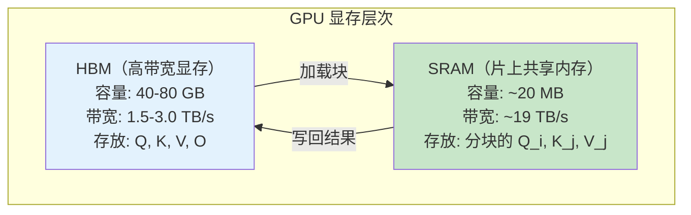

**Tiling 策略**：

将 $Q, K, V$ 按行分块：
- $Q$ 分为 $T_r$ 个块，每块 $B_r$ 行
- $K, V$ 分为 $T_c$ 个块，每块 $B_c$ 行
- 块大小选择满足 SRAM 容量约束：$B_r \cdot d + 2 \cdot B_c \cdot d \leq M_{SRAM}$

对于每个 $Q$ 块 $Q_i$：
1. 依次加载每个 $K$ 块 $K_j$ 和 $V$ 块 $V_j$ 到 SRAM
2. 在 SRAM 中计算 $S_{ij} = Q_i K_j^T$
3. 使用在线 softmax 算法更新局部结果
4. 处理完所有 $K, V$ 块后，将最终结果 $O_i$ 写回 HBM

### 6.3 在线 Softmax 的数学技巧

Flash Attention 的关键难点在于：softmax 需要全局归一化，但分块计算时每次只能看到部分数据。

**标准 softmax**：

$$\text{softmax}(x_i) = \frac{e^{x_i}}{\sum_j e^{x_j}}$$

需要遍历所有元素才能计算分母，无法直接分块。

**在线 softmax 算法**（Milakov & Gimelshein, 2018）：

维护两个运行量：最大值 $m$ 和指数和 $\ell$，每见到新的一块数据就更新。

当处理第 $j$ 个 $K$ 块时（$Q_i$ 固定）：

$$\tilde{S}_{ij} = Q_i K_j^T \in \mathbb{R}^{B_r \times B_c}$$

1. 更新最大值：

$$m_i^{(j)} = \max\left(m_i^{(j-1)}, \, \text{rowmax}(\tilde{S}_{ij})\right)$$

2. 更新指数和：

$$\ell_i^{(j)} = e^{m_i^{(j-1)} - m_i^{(j)}} \cdot \ell_i^{(j-1)} + \text{rowsum}\left(e^{\tilde{S}_{ij} - m_i^{(j)}}\right)$$

3. 更新输出：

$$O_i^{(j)} = \text{diag}\left(e^{m_i^{(j-1)} - m_i^{(j)}}\right) \cdot O_i^{(j-1)} + e^{\tilde{S}_{ij} - m_i^{(j)}} \cdot V_j$$

4. 最终归一化：

$$O_i = \text{diag}\left(\ell_i^{(T_c)}\right)^{-1} \cdot O_i^{(T_c)}$$

**数值稳定性**：通过始终减去当前最大值 $m_i^{(j)}$，避免了 $e^{x}$ 在 $x$ 很大时的数值溢出。

### 6.4 IO 复杂度的改进

**Flash Attention 的 HBM 访问量**：

每个 $Q$ 块需要遍历所有 $K, V$ 块，总的 HBM 读取量为：

$$\text{HBM reads} = T_r \times (B_r \cdot d + T_c \times 2 \cdot B_c \cdot d) + T_r \times B_r \cdot d$$

化简后：

$$\boxed{\Theta\left(\frac{N^2 d^2}{M}\right)}$$

其中 $M$ 是 SRAM 大小（决定了块大小 $B_r, B_c$）。

**与标准 Attention 的对比**：

| 方法 | HBM 访问量 | 额外显存 |
|------|-----------|----------|
| 标准 Attention | $\Theta(Nd + N^2)$ | $O(N^2)$（存储 $S, P$） |
| Flash Attention | $\Theta(N^2 d^2 / M)$ | $O(N)$（只存 $m, \ell$） |

由于 $d \ll M$（对于 $d=128$，$M \approx 100K$ 个元素），Flash Attention 的 IO 复杂度显著低于标准实现。

**实际加速效果**（以 A100 为例）：

| 序列长度 | 标准 Attention | Flash Attention | 加速比 |
|---------|---------------|-----------------|--------|
| 1K | 0.5 ms | 0.3 ms | 1.7x |
| 4K | 6.2 ms | 1.8 ms | 3.4x |
| 16K | 98 ms | 12 ms | 8.2x |
| 64K | OOM | 45 ms | - |

序列越长，Flash Attention 的优势越明显。在超长序列（>16K）场景下，标准实现甚至因 $O(N^2)$ 显存而 OOM，而 Flash Attention 仅需 $O(N)$ 额外显存。

---

## 7. 推理系统优化

### 7.1 Speculative Decoding（投机解码）

#### 7.1.1 核心思想

Decode 阶段的瓶颈在于**每步只生成一个 token**，GPU 大量算力闲置。投机解码的思路是：

> 用一个**小而快**的草稿模型（draft model）一次性猜测 $\gamma$ 个 token，然后用**大模型**并行验证这些猜测。如果猜对了，就一步生成多个 token；如果猜错了，也不会比原来更慢。

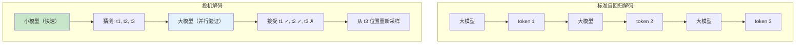

#### 7.1.2 算法细节

设大模型分布为 $p(x)$，草稿模型分布为 $q(x)$。

**Step 1: 草稿生成**

草稿模型自回归生成 $\gamma$ 个 token：$x_1, x_2, \ldots, x_\gamma \sim q$

**Step 2: 并行验证**

大模型一次前向传播，计算 $\gamma + 1$ 个位置的条件概率 $p(x_t | x_{<t})$。

**Step 3: 接受/拒绝**

对于每个猜测的 token $x_t$，以以下概率接受：

$$P(\text{accept } x_t) = \min\left(1, \frac{p(x_t)}{q(x_t)}\right)$$

如果 $p(x_t) \geq q(x_t)$（大模型至少和草稿模型一样认可这个 token），则**一定接受**。

如果被拒绝，从修正分布中重新采样：

$$x_t \sim \text{norm}\left(\max(0, p(x) - q(x))\right)$$

其中 $\text{norm}$ 表示归一化为概率分布。

#### 7.1.3 正确性的数学保证

投机解码的关键性质是：**最终输出的分布与纯大模型采样的分布完全一致**。

**证明**：

对于任一 token $x$，接受的概率为：

$$P(\text{sample } x) = q(x) \cdot \min\left(1, \frac{p(x)}{q(x)}\right) + P(\text{reject}) \cdot \frac{\max(0, p(x) - q(x))}{\sum_{x'}\max(0, p(x') - q(x'))}$$

其中拒绝概率：

$$P(\text{reject}) = \sum_{x'} q(x') \cdot \max\left(0, 1 - \frac{p(x')}{q(x')}\right) = \sum_{x'} \max(0, q(x') - p(x'))$$

由于 $\sum_x \max(0, p(x) - q(x)) = \sum_x \max(0, q(x) - p(x))$（概率分布性质），可以验证 $P(\text{sample } x) = p(x)$。

因此投机解码**不会引入任何额外偏差**，生成质量与纯大模型完全一致。

#### 7.1.4 加速分析

设草稿模型的接受率为 $\alpha$（即平均每个猜测 token 被接受的概率）。

生成 $\gamma$ 个猜测后，期望接受的 token 数为：

$$\mathbb{E}[\text{accepted}] = \sum_{i=1}^{\gamma} \alpha^i = \frac{\alpha(1 - \alpha^\gamma)}{1 - \alpha}$$

包含一个从修正分布采样的 token，每轮期望生成的 token 数约为：

$$\mathbb{E}[\text{tokens per round}] \approx \frac{1 - \alpha^{\gamma+1}}{1 - \alpha}$$

加速比（不考虑草稿模型开销时的上限）：

$$\text{Speedup}_{ideal} = \frac{1 - \alpha^{\gamma+1}}{1 - \alpha}$$

**实际效果参考**：当 $\alpha \approx 0.7$，$\gamma = 5$ 时，加速比约 $2\text{-}3\times$。

#### 7.1.5 草稿模型的选择与变体

投机解码的加速效果高度依赖草稿模型的**接受率 $\alpha$**，而接受率取决于草稿模型与目标模型的分布相似度。草稿模型的选择是一个关键的工程决策。

**草稿模型选择策略**：

| 策略 | 描述 | 接受率 | 草稿速度 | 适用场景 |
|------|------|--------|----------|----------|
| 同系列小模型 | 如 Llama-70B + Llama-7B | 高 (~0.7-0.8) | 中 | 有同系列模型时首选 |
| 蒸馏模型 | 从目标模型蒸馏的轻量模型 | 最高 (~0.8-0.9) | 中 | 愿意投入蒸馏成本时 |
| N-gram 模型 | 基于 n-gram 统计的查找表 | 低 (~0.3-0.5) | 极快 | 超低延迟场景 |
| 模型自身浅层 | 用模型前几层 + 小 LM Head | 中 (~0.5-0.7) | 快 | 不想加载额外模型 |
| Medusa Head | 目标模型上添加多个预测头 | 中 (~0.5-0.7) | 快 | 单模型方案 |

**接受率与加速比的关系**（$\gamma = 5$）：

| 接受率 $\alpha$ | 期望 token/轮 | 理想加速比 | 考虑草稿开销后 |
|----------------|--------------|-----------|---------------|
| 0.5 | 1.97 | 1.97x | ~1.5x |
| 0.6 | 2.42 | 2.42x | ~1.9x |
| 0.7 | 3.00 | 3.00x | ~2.4x |
| 0.8 | 3.78 | 3.78x | ~3.0x |
| 0.9 | 4.69 | 4.69x | ~3.8x |

**投机解码的实际开销**：

草稿模型并非"免费的午餐"。完整的加速比需要考虑：

$$\text{Speedup}_{real} = \frac{\mathbb{E}[\text{tokens per round}]}{1 + \frac{T_{draft} \times \gamma}{T_{target}}}$$

其中 $T_{draft}$ 和 $T_{target}$ 分别是草稿模型和目标模型的单步推理时间。当 $T_{draft} / T_{target}$ 越小（草稿模型越快），实际加速比越接近理想值。

**投机解码的变体**：

1. **Staged Speculative Decoding**：使用多级草稿（如 n-gram -> 小模型 -> 大模型），逐级验证，进一步提升效率
2. **Medusa**：在目标模型上训练多个额外的预测头，每个头独立预测未来第 $k$ 个 token，无需额外的草稿模型
3. **Eagle**：利用目标模型的特征层（而非输出 logits）来训练轻量级的自回归草稿头，接受率高于 Medusa
4. **Self-Speculative Decoding**：使用目标模型自身的浅层（跳过部分层）作为草稿模型，避免加载额外模型

### 7.2 Continuous Batching 的工程实现

Continuous Batching 的工程实现需要解决几个关键问题：

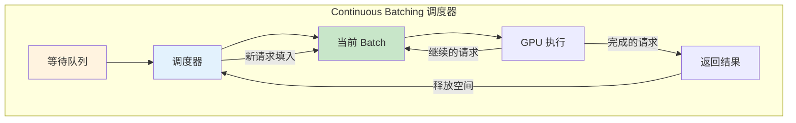

**调度策略**：

1. **FCFS（先来先服务）**：最简单，但可能导致短请求被长请求阻塞
2. **Preemption（抢占）**：允许高优先级请求抢占低优先级请求的 GPU 资源
   - **Swap**：将被抢占请求的 KV Cache 移到 CPU 内存
   - **Recompute**：释放 KV Cache，恢复时重新计算

### 7.3 前缀缓存（Prefix Caching）

许多实际应用中，不同请求共享相同的**系统提示（System Prompt）**。前缀缓存通过在请求间复用已计算的 KV Cache 来避免重复计算。

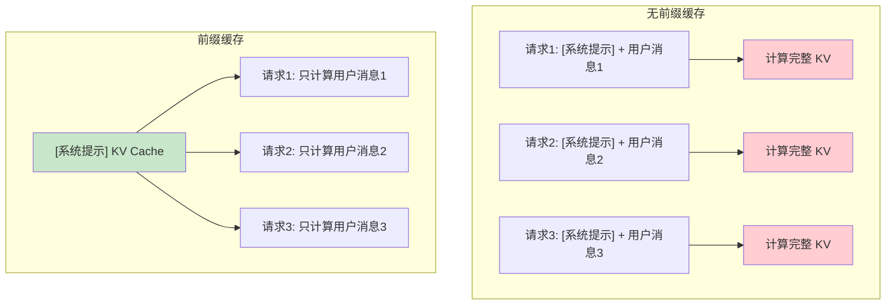

**实现要点**：
- 使用 **Radix Tree（基数树）** 或**哈希表**索引已缓存的 KV 前缀
- 基于 token 序列的前缀匹配，复用最长匹配的 KV Cache
- 需要考虑缓存淘汰策略（LRU、LFU 等）

**加速效果**：对于 2000 token 的系统提示，前缀缓存可以将首 token 延迟减少 **80-90%**。

---

## 8. Prefix Caching 与 Prompt Caching

前缀缓存（Prefix Caching）是一种利用请求间公共前缀来避免重复计算的技术。随着 LLM 应用的成熟，这项技术已经从推理框架的内部优化上升为 **API 层面的产品特性**——以 Anthropic 和 Google 为代表，主流 LLM 提供商都推出了 Prompt Caching 功能。

### 8.1 Prompt Caching 的工程动机

在实际的 LLM 应用中，大量请求共享相同的前缀结构：

| 应用场景 | 公共前缀内容 | 典型长度 | 每日请求量 |
|---------|-------------|---------|----------|
| 客服助手 | 系统提示 + 产品知识库 | 2K-10K tokens | 10K-100K |
| 代码助手 | 系统提示 + 代码仓库上下文 | 5K-50K tokens | 1K-10K |
| 文档问答 | 系统提示 + 文档内容 | 10K-100K tokens | 1K-50K |
| 多轮对话 | 历史对话上下文 | 1K-20K tokens | 1K-100K |

如果每次请求都重新计算这些前缀的 KV Cache，将造成巨大的计算浪费。以一个 10K token 的系统提示为例，使用 Llama 70B 模型，每次 Prefill 需要约 **2 秒**和 **140 TFLOPs** 的计算量。如果每天有 10K 个请求，总计浪费约 **5.5 小时**的 GPU 时间。

### 8.2 Anthropic 的 Prompt Caching

Anthropic 于 2024 年推出了 Claude 的 Prompt Caching 功能，这是业界最早将 KV Cache 复用作为 API 层产品特性的方案之一。

**工作原理**：

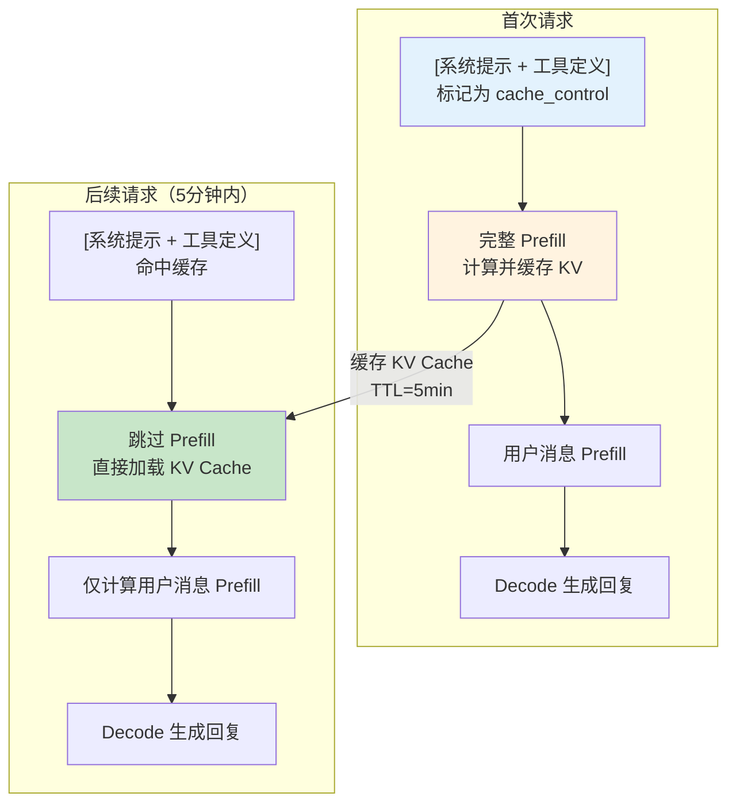

**API 使用方式**（Claude Messages API）：

```python
# Anthropic Prompt Caching 示例
response = client.messages.create(
    model="claude-sonnet-4-20250514",
    max_tokens=1024,
    system=[
        {
            "type": "text",
            "text": "你是一个专业的客服助手。以下是产品手册...[很长的文档]",
            "cache_control": {"type": "ephemeral"}  # 标记此部分需要缓存
        }
    ],
    messages=[
        {"role": "user", "content": "这个产品的保修政策是什么？"}
    ]
)
# 响应中包含缓存命中信息:
# cache_creation_input_tokens: 首次缓存时计费
# cache_read_input_tokens: 后续命中时以折扣价计费（约 1/10 价格）
```

**Anthropic Prompt Caching 的关键设计**：

| 特性 | 说明 |
|------|------|
| 缓存粒度 | 消息块级别（system / tool / 前几轮对话） |
| 缓存生命周期（TTL） | 5 分钟（无访问则过期） |
| 最小缓存长度 | 1024 tokens（低于此不触发缓存） |
| 定价策略 | 缓存写入: 1.25x 正常价格; 缓存读取: 0.1x 正常价格 |
| 前缀匹配 | 精确前缀匹配（从头开始的连续 token 序列） |

**成本节省分析**：

假设一个客服系统，系统提示 5000 tokens，平均每个用户消息 200 tokens：

$$\text{无缓存成本} = (5000 + 200) \times P_{input} = 5200 P_{input}$$

$$\text{有缓存成本} = 5000 \times 0.1 P_{input} + 200 \times P_{input} = 700 P_{input}$$

$$\text{节省比例} = 1 - \frac{700}{5200} = 86.5\%$$

### 8.3 Google 的 Context Caching

Google 的 Gemini API 也提供了类似的 Context Caching 功能，但设计理念有所不同。

**与 Anthropic 的对比**：

| 特性 | Anthropic Prompt Caching | Google Context Caching |
|------|------------------------|----------------------|
| 缓存创建方式 | 在请求中标记 `cache_control` | 通过专门的 API 预创建缓存对象 |
| 缓存生命周期 | 5 分钟（自动续期） | 用户可指定（默认 1 小时，可达数天） |
| 缓存管理 | 隐式管理（自动过期） | 显式管理（可列出、删除、更新 TTL） |
| 最小缓存长度 | 1024 tokens | 32,768 tokens |
| 存储成本 | 无额外存储费 | 按 token 数和存储时长计费 |
| 适用场景 | 短期高频重复请求 | 长期大规模上下文复用 |

**Google Context Caching 的使用方式**：

```python
# Google Gemini Context Caching 示例
import google.generativeai as genai

# Step 1: 创建缓存（独立操作）
cache = genai.caching.CachedContent.create(
    model="gemini-1.5-flash-001",
    display_name="product-manual-cache",
    system_instruction="你是一个专业的客服助手。",
    contents=[
        # 将大型文档作为缓存内容
        genai.types.ContentDict(
            role="user",
            parts=[genai.types.PartDict(text="以下是完整的产品手册...[很长的文档]")]
        )
    ],
    ttl=datetime.timedelta(hours=2),  # 显式设置缓存有效期
)

# Step 2: 使用缓存进行推理
model = genai.GenerativeModel.from_cached_content(cache)
response = model.generate_content("这个产品的保修政策是什么？")
```

### 8.4 Prefix Caching 的底层实现

不论是 Anthropic 还是 Google 的产品化方案，底层都依赖于高效的 KV Cache 前缀匹配和存储机制。

**基于 Radix Tree 的前缀匹配**（SGLang 的方案）：

Radix Tree（基数树）是一种压缩的字典树，特别适合前缀匹配场景。在推理系统中，每个节点存储一段 token 序列及其对应的 KV Cache 块指针。

```
Radix Tree 结构:
根节点
  ├── [system_prompt_tokens_0..1023] → KV Block 0-3
  │     ├── [tool_def_tokens_0..511] → KV Block 4-5
  │     │     ├── [user_msg_A] → KV Block 6
  │     │     └── [user_msg_B] → KV Block 7
  │     └── [few_shot_examples] → KV Block 8-10
  └── [another_system_prompt] → KV Block 11-13
```

**匹配过程**：
1. 将新请求的 token 序列在 Radix Tree 中查找最长前缀匹配
2. 匹配到的前缀对应的 KV Cache 块直接复用
3. 仅对不匹配的后缀部分执行 Prefill 计算
4. 新计算的 KV Cache 块插入 Radix Tree

**缓存淘汰策略**：

| 策略 | 原理 | 优点 | 缺点 |
|------|------|------|------|
| LRU（最近最少使用） | 淘汰最久未被访问的缓存 | 实现简单，通用性好 | 对突发流量不友好 |
| LFU（最不经常使用） | 淘汰访问频率最低的缓存 | 保留高频缓存 | 对新缓存不友好 |
| TTL（生存时间） | 缓存到期自动失效 | 可预测，适合 API 定价 | 可能淘汰仍有价值的缓存 |
| 前缀感知 LRU | 优先保留更长的公共前缀 | 最大化缓存复用 | 实现复杂度较高 |

---

## 9. 三条技术线的推理实践

### 9.1 Google 路线

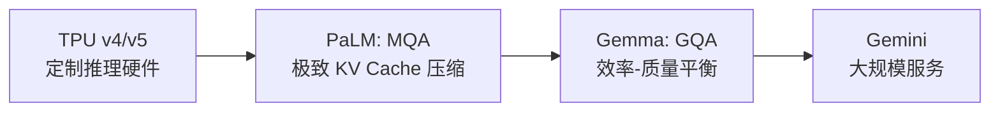

**TPU 推理优化**：
- TPU 的**收缩阵列（Systolic Array）** 架构特别适合大矩阵乘法
- TPU v4 的 HBM 带宽约 1.2 TB/s，通过软件流水线隐藏内存延迟
- Google 使用**模型并行 + 数据并行**将大模型分布到多个 TPU 芯片

**MQA 的推理加速效果**（PaLM 340B 数据）：
- KV Cache 大小：从 MHA 的 约 10 GB 降至 MQA 的约 0.3 GB（batch=1, seq=2048）
- Decode 延迟：约 3x 加速（主要来自减少的 HBM 访问）

**Gemma 2 的部署最佳实践**：
- 2B 模型：适合端侧设备（手机、嵌入式），INT4 量化后仅约 1 GB
- 9B 模型：适合单 GPU 部署，INT8 量化后约 9 GB
- 27B 模型：需要多 GPU 或 INT4 量化，GPTQ 量化后约 14 GB

### 9.2 DeepSeek 路线

**MLA 对 KV Cache 的极致压缩**：

DeepSeek-V2 的 MLA（Multi-head Latent Attention）不存储完整的 K 和 V，而是存储低秩压缩向量：

$$c_t^{KV} = W^{DKV} h_t \in \mathbb{R}^{d_c}$$

其中 $d_c \ll n_h \times d_h$。

对于 DeepSeek-V2-236B：

| 方法 | 每 token KV 元素数 | 压缩比 |
|------|-------------------|--------|
| 标准 MHA | $2 \times 128 \times 128 = 32768$ | 1x |
| GQA (8 KV 头) | $2 \times 8 \times 128 = 2048$ | 16x |
| MLA ($d_c = 512$) | $512 + 64 = 576$ | **57x** |

**MoE 推理的负载均衡**：

DeepSeek-V3 使用 MoE 架构（256 专家，每 token 激活 8 个），推理时面临的挑战：
- 不同请求可能激活不同的专家，导致 GPU 间负载不均
- 专家并行需要 All-to-All 通信，增加延迟

DeepSeek 的解决方案：
- **专家分组与路由优化**：预测 token 的路由模式，预分配计算资源
- **混合并行策略**：结合专家并行和张量并行，平衡通信与计算

**推理成本分析**：

DeepSeek-V3 的推理成本约为同等质量稠密模型的 **1/5 至 1/10**，主要得益于：
1. MLA 将 KV Cache 压缩 57x，显著提升可服务的并发数
2. MoE 每 token 仅激活 ~3% 的参数，减少计算量
3. 结合硬件优化（如 FP8 推理），进一步降低成本

### 9.3 Anthropic 路线

> 注：Anthropic 对 Claude 的推理系统细节公开较少，以下部分基于公开信息和合理推测。

**大规模推理系统的安全考量**：
- Claude 的推理系统需要在**生成过程中**实时执行安全检查
- 这意味着推理延迟中包含了安全审查的开销

**[推测] 推理过程中的实时安全检查**：
- [推测] 可能使用轻量级的安全分类器对每步生成的 token 进行检查
- [推测] 安全检查可能与模型推理并行执行，以降低延迟影响
- [推测] 对于敏感内容，可能会触发更深层的安全审查流程

**[推测] 延迟与安全性的 trade-off**：
- [推测] Anthropic 可能在推理流水线中设置了多个安全检查点
- [推测] 安全检查增加约 5-15% 的推理延迟，但这被视为必要的代价
- [推测] 在紧急安全风险（如有害内容生成）时，可能会提前终止生成

**公开的技术贡献**：
- Anthropic 在 Constitutional AI 方面的工作影响了推理时的安全框架设计
- 200K token 的上下文窗口需要高效的 KV Cache 管理，表明 Claude 采用了某种 GQA 或类似的 KV 压缩机制

---

## 10. 项目实践

### 项目 1：实现 KV Cache 并测量加速效果（进阶 ⭐⭐）

**目标**：理解 KV Cache 的原理，实现预分配和动态增长两种策略，并测量加速效果。

**任务**：
1. 实现 `KVCache` 类，支持预分配和动态增长模式
2. 实现带 KV Cache 的注意力计算
3. 对比有无 KV Cache 时生成 256 个 token 的速度差异
4. 计算不同模型配置下的 KV Cache 显存占用

**提供的关键代码**：

```python
class KVCache:
    """KV Cache 管理器"""

    def __init__(self, n_layers, n_kv_heads, head_dim, max_seq_len,
                 dtype=torch.float16, device="cpu", mode="preallocate"):
        self.mode = mode
        if mode == "preallocate":
            # 一次性预分配全部空间
            self.k_cache = [
                torch.zeros(1, n_kv_heads, max_seq_len, head_dim,
                           dtype=dtype, device=device)
                for _ in range(n_layers)
            ]
            self.v_cache = [
                torch.zeros(1, n_kv_heads, max_seq_len, head_dim,
                           dtype=dtype, device=device)
                for _ in range(n_layers)
            ]
        self.seq_len = 0

    def update(self, layer_idx, new_k, new_v):
        """追加新的 K, V 到缓存"""
        if self.mode == "preallocate":
            n_new = new_k.shape[2]
            self.k_cache[layer_idx][:, :, self.seq_len:self.seq_len+n_new] = new_k
            self.v_cache[layer_idx][:, :, self.seq_len:self.seq_len+n_new] = new_v
        # ... 动态增长模式的实现留给学生
```

**思考题**：
- 为什么预分配模式在实际推理中更常用？
- KV Cache 的大小与 batch size 的关系是什么？
- 如果 GPU 显存只有 24 GB，你能服务的最大 batch size 是多少？（给定具体的模型配置）

**参考实现**：见 `code/inference/kv_cache.py`

---

### 项目 2：对比 INT4/INT8/FP16 量化的质量与速度（进阶 ⭐⭐）

**目标**：动手实现线性量化，对比不同精度下的量化误差和推理速度。

**任务**：
1. 实现对称量化和非对称量化函数
2. 实现 per-tensor、per-channel、per-group 三种粒度
3. 在随机权重矩阵上测量量化误差（MSE、最大绝对误差）
4. 用量化后的权重做矩阵乘法，对比与 FP16 结果的差异

**提供的关键代码**：

```python
def symmetric_quantize(x: torch.Tensor, n_bits: int = 8):
    """对称线性量化"""
    qmax = 2 ** (n_bits - 1) - 1
    scale = x.abs().max() / qmax
    x_q = torch.round(x / scale).clamp(-qmax, qmax).to(torch.int8)
    return x_q, scale

def dequantize(x_q: torch.Tensor, scale: float):
    """反量化"""
    return x_q.float() * scale
```

**分析框架提示**：
- 绘制量化前后的权重分布直方图
- 计算不同 group size 下的量化 MSE
- 分析 outlier 对量化误差的影响

**参考实现**：见 `code/inference/quantization.py`

---

### 项目 3：实现简化版投机解码（挑战 ⭐⭐⭐）

**目标**：理解投机解码的数学保证，实现接受/拒绝采样算法，验证输出分布的正确性。

**任务**：
1. 实现投机解码的完整流程（草稿生成 → 并行验证 → 接受/拒绝）
2. 数学验证：证明采样分布与目标分布一致
3. 对比不同接受率 $\alpha$ 和猜测长度 $\gamma$ 下的加速效果
4. 讨论草稿模型质量与加速比的 trade-off

**算法伪代码**：

```
function SpeculativeDecode(target_model, draft_model, prefix, gamma):
    // Step 1: 草稿模型快速生成 gamma 个候选 token
    draft_tokens = []
    draft_probs = []
    for i = 1 to gamma:
        q = draft_model.predict(prefix + draft_tokens)
        x_i ~ q
        draft_tokens.append(x_i)
        draft_probs.append(q)

    // Step 2: 目标模型并行验证
    target_probs = target_model.predict_all(prefix + draft_tokens)

    // Step 3: 接受/拒绝
    accepted = []
    for i = 1 to gamma:
        r ~ Uniform(0, 1)
        if r < min(1, target_probs[i][x_i] / draft_probs[i][x_i]):
            accepted.append(x_i)  // 接受
        else:
            // 从修正分布采样
            adjusted = normalize(max(0, target_probs[i] - draft_probs[i]))
            x_new ~ adjusted
            accepted.append(x_new)
            break  // 停止检查后续 token

    // 如果所有都接受了，额外采样一个
    if len(accepted) == gamma:
        x_extra ~ target_probs[gamma + 1]
        accepted.append(x_extra)

    return accepted
```

**验证思路（Mermaid 图）**：

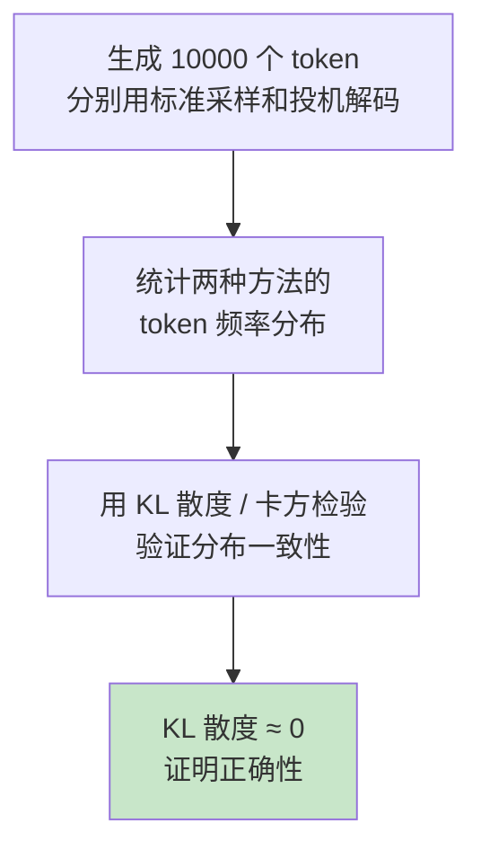

**参考实现**：见 `code/inference/speculative_decoding.py`

---

### 项目 4：使用 vLLM 部署模型并分析吞吐量（进阶 ⭐⭐）

**目标**：学习使用 vLLM 进行模型部署，理解 PagedAttention 和 Continuous Batching 的工程效果。

**任务**：
1. 使用 vLLM 部署一个 7B 参数模型（如 Llama 2 7B 或 Mistral 7B）
2. 测试不同并发数下的吞吐量（tokens/s）
3. 对比 vLLM 与朴素 HuggingFace 推理的性能差异
4. 分析 PagedAttention 的显存利用率

**部署指引**：

```bash
# 安装 vLLM
pip install vllm

# 启动推理服务
python -m vllm.entrypoints.openai.api_server \
    --model meta-llama/Llama-2-7b-chat-hf \
    --dtype float16 \
    --max-model-len 4096 \
    --gpu-memory-utilization 0.9
```

**性能分析思路**：

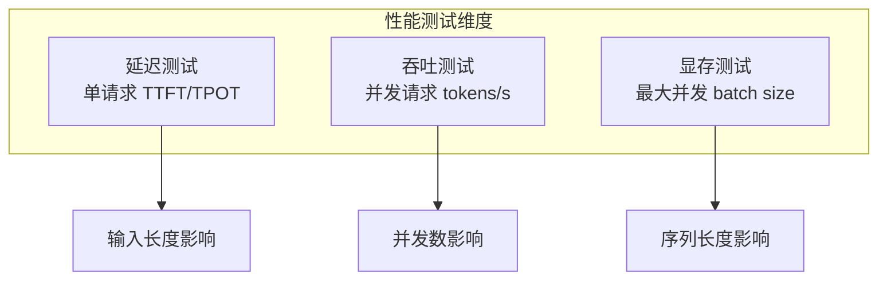

**提供的 benchmark 框架**：见 `code/inference/benchmark.py`

**期望结果**：
- vLLM 吞吐量通常为朴素 HuggingFace 的 3-5 倍
- 在高并发场景下，vLLM 的优势更加明显
- PagedAttention 的显存利用率接近 100%（vs 传统方式的 20-40%）

---

### 项目 5：推理加速基准测试 — Naive vs KV Cache vs 量化推理（进阶 ⭐⭐）

**目标**：建立系统的推理性能基准测试框架，定量比较不同优化策略的速度和生成质量，培养"用数据说话"的工程素养。

**背景**：在实际部署中，选择推理优化策略不是"越多越好"，而是需要在**速度、显存、质量**三者之间找到最优平衡点。本项目要求你动手构建 benchmark，亲眼看到各种优化的实际效果。

**任务**：

1. **实现三种推理模式**：
   - **Naive 推理**：不使用 KV Cache，每步重新计算所有 token 的 KV（作为基线）
   - **KV Cache 推理**：使用预分配 KV Cache 的标准推理（项目 1 的扩展）
   - **量化 KV Cache 推理**：将模型权重量化为 INT8/INT4 后推理

2. **设计 benchmark 矩阵**：

   | 测试维度 | 取值 |
   |---------|------|
   | 推理模式 | Naive / KV Cache / INT8 量化 / INT4 量化 |
   | 输入长度 | 64 / 256 / 1024 / 2048 tokens |
   | 生成长度 | 64 / 128 / 256 tokens |
   | 模型规模 | 小模型（如 GPT-2）/ 中模型（如 Llama-7B） |

3. **采集性能指标**：
   - **TTFT**（Time To First Token）：首 token 延迟
   - **TPOT**（Time Per Output Token）：每 token 生成延迟
   - **吞吐量**（tokens/second）：每秒生成的 token 数
   - **峰值显存**（Peak GPU Memory）：推理过程中的最大显存占用

4. **评估生成质量**：
   - 使用 Perplexity 评估量化前后的语言模型质量
   - 用 ROUGE / BLEU 评估量化模型与 FP16 模型的输出一致性
   - 收集 10-20 个样例，人工比较量化前后的生成质量

5. **可视化输出**：
   - 绘制"输入长度 vs TTFT"曲线（对比各模式）
   - 绘制"生成长度 vs 总延迟"曲线
   - 绘制"量化精度 vs Perplexity"散点图
   - 绘制"速度 vs 质量" Pareto 前沿图

**提供的 benchmark 框架**：

```python
import time
import torch
from dataclasses import dataclass


@dataclass
class BenchmarkResult:
    """基准测试结果"""
    mode: str               # 推理模式名称
    input_length: int        # 输入长度
    output_length: int       # 生成长度
    ttft_ms: float           # 首 token 延迟 (ms)
    tpot_ms: float           # 每 token 延迟 (ms)
    total_time_ms: float     # 总延迟 (ms)
    throughput_tps: float    # 吞吐量 (tokens/s)
    peak_memory_mb: float    # 峰值显存 (MB)
    perplexity: float = None # 困惑度 (可选)


def benchmark_generation(model, tokenizer, prompt_tokens, gen_length,
                         mode="kv_cache", device="cuda"):
    """
    对单次生成进行 benchmark

    参数:
        model: 语言模型
        tokenizer: 分词器
        prompt_tokens: 输入 token ids
        gen_length: 生成长度
        mode: 推理模式 ("naive" / "kv_cache" / "int8" / "int4")
        device: 设备

    返回:
        BenchmarkResult
    """
    torch.cuda.reset_peak_memory_stats()
    torch.cuda.synchronize()

    # 测量 TTFT
    start = time.perf_counter()
    # ... 学生实现: 根据 mode 选择不同推理策略 ...
    # first_token = generate_first_token(model, prompt_tokens, mode)
    torch.cuda.synchronize()
    ttft = (time.perf_counter() - start) * 1000  # ms

    # 测量 Decode 阶段
    decode_start = time.perf_counter()
    # ... 学生实现: 逐 token 生成 ...
    # for i in range(gen_length - 1):
    #     next_token = generate_next_token(model, mode)
    torch.cuda.synchronize()
    decode_time = (time.perf_counter() - decode_start) * 1000  # ms

    total_time = ttft + decode_time
    tpot = decode_time / max(gen_length - 1, 1)
    throughput = gen_length / (total_time / 1000)
    peak_mem = torch.cuda.max_memory_allocated() / 1024 / 1024  # MB

    return BenchmarkResult(
        mode=mode,
        input_length=len(prompt_tokens),
        output_length=gen_length,
        ttft_ms=ttft,
        tpot_ms=tpot,
        total_time_ms=total_time,
        throughput_tps=throughput,
        peak_memory_mb=peak_mem,
    )


def run_benchmark_suite(model, tokenizer, device="cuda"):
    """运行完整的 benchmark 测试矩阵"""
    results = []
    input_lengths = [64, 256, 1024]
    gen_lengths = [64, 128, 256]
    modes = ["naive", "kv_cache"]  # 学生可扩展为 ["naive", "kv_cache", "int8", "int4"]

    for mode in modes:
        for in_len in input_lengths:
            for gen_len in gen_lengths:
                # 生成随机 prompt
                prompt = torch.randint(0, tokenizer.vocab_size, (1, in_len)).to(device)
                result = benchmark_generation(model, tokenizer, prompt, gen_len, mode, device)
                results.append(result)
                print(f"[{mode}] in={in_len}, out={gen_len}: "
                      f"TTFT={result.ttft_ms:.1f}ms, TPOT={result.tpot_ms:.1f}ms, "
                      f"Mem={result.peak_memory_mb:.0f}MB")

    return results
```

**思考题**：
- 为什么 Naive 推理在短序列时和 KV Cache 差距不大，但在长序列时差距急剧增大？
- INT4 量化在哪些任务上质量下降最明显？为什么？
- 如果你只有一块 RTX 3060（12 GB），你会如何选择推理策略来部署 Llama-7B？

**参考实现**：见 `code/inference/benchmark_suite.py`

---

## 11. 本章小结

### 核心知识点回顾

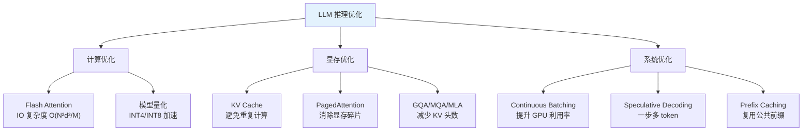

### 关键公式速查

| 公式 | 含义 |
|------|------|
| $M_{KV} = 2 L d_{model} S b \cdot \text{dtype}$ | KV Cache 显存大小 |
| $x_q = \text{round}(x/s) + z$ | 线性量化 |
| $\mathbb{E}[\epsilon^2] = s^2 / 12$ | 量化均方误差 |
| $\Theta(N^2 d^2 / M)$ | Flash Attention IO 复杂度 |
| $\min(1, p(x)/q(x))$ | 投机解码接受概率 |
| $\eta_{continuous} \approx 1$ | Continuous Batching GPU 利用率 |

### 延伸阅读

- [Efficient Memory Management for Large Language Model Serving with PagedAttention (vLLM)](https://arxiv.org/abs/2309.06180)
- [FlashAttention: Fast and Memory-Efficient Exact Attention with IO-Awareness](https://arxiv.org/abs/2205.14135)
- [GPTQ: Accurate Post-Training Quantization for Generative Pre-trained Transformers](https://arxiv.org/abs/2210.17323)
- [AWQ: Activation-aware Weight Quantization for LLM Compression and Acceleration](https://arxiv.org/abs/2306.00978)
- [Fast Inference from Transformers via Speculative Decoding](https://arxiv.org/abs/2211.17192)
- [DeepSeek-V2: A Strong, Economical, and Efficient Mixture-of-Experts Language Model](https://arxiv.org/abs/2405.04434)
- [DistServe: Disaggregating Prefill and Decoding for Goodput-optimized Large Language Model Serving](https://arxiv.org/abs/2401.09670)
- [Medusa: Simple LLM Inference Acceleration Framework with Multiple Decoding Heads](https://arxiv.org/abs/2401.10774)
- [EAGLE: Speculative Sampling Requires Rethinking Feature Uncertainty](https://arxiv.org/abs/2401.15077)

---

## 下一步：Module 15 — RAG（检索增强生成）

掌握了推理加速技术后，我们已经具备了高效部署 LLM 的能力。但在实际应用中，LLM 面临一个根本性挑战：**模型的知识冻结在训练数据的截止日期**。当用户提问涉及最新信息、私有数据或长尾知识时，纯粹依赖模型参数中的知识往往不够。

Module 15 将介绍 **RAG（Retrieval-Augmented Generation，检索增强生成）** 技术，通过将外部知识库与 LLM 推理相结合，实现"知识可更新、来源可追溯"的智能问答。RAG 系统的性能同样依赖于本章所学的推理优化技术——高效的 Prefix Caching 可以加速重复文档上下文的处理，Continuous Batching 可以支撑高并发的检索+生成请求。推理加速与 RAG 的结合，将是 LLM 从"能用"走向"好用"的关键一步。
