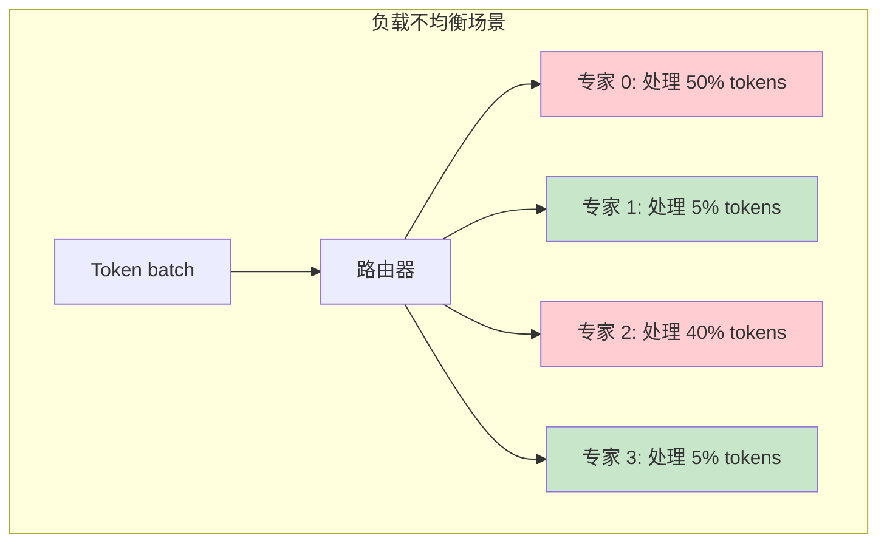
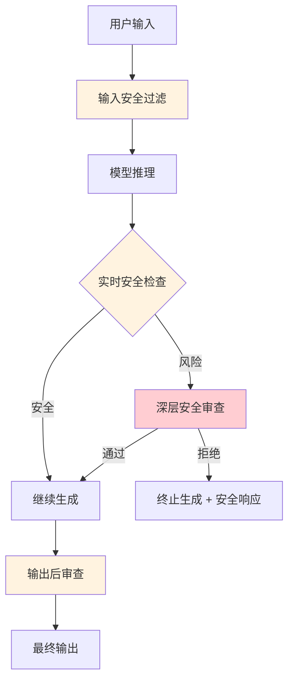
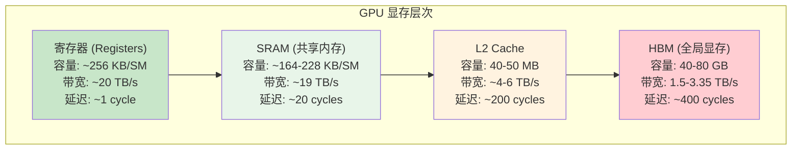

# 推理加速进阶：工业实践与前沿话题

> 本文是 [模块14: 推理加速](./README.md) 的进阶补充，深入分析 Google、DeepSeek、Anthropic 三条技术线在推理优化上的工业实践，以及 Triton GPU 编程、推理成本经济学等前沿话题。

---

## 目录

- [1. Google 的推理优化](#1-google-的推理优化)
- [2. DeepSeek 的推理策略](#2-deepseek-的推理策略)
- [3. Anthropic 视角](#3-anthropic-视角)
- [4. 前沿话题](#4-前沿话题)
- [5. 底层算子编程 (Triton)](#5-底层算子编程-triton)

---

## 1. Google 的推理优化

### 1.1 TPU 推理优化

Google 的大模型推理基础设施构建在自研的 **TPU（Tensor Processing Unit）** 之上，与 NVIDIA GPU 有本质的架构差异。

**TPU vs GPU 的推理特性**：

| 特性 | TPU v4/v5 | NVIDIA A100/H100 |
|------|-----------|-------------------|
| 计算核心 | 收缩阵列（Systolic Array） | CUDA 核心 + Tensor 核心 |
| 内存类型 | HBM2e | HBM2e / HBM3 |
| 片间互联 | ICI（Inter-Chip Interconnect） | NVLink / NVSwitch |
| 编程模型 | XLA（Accelerated Linear Algebra） | CUDA / Triton |
| 适用场景 | 大 batch 推理，高吞吐 | 灵活，低延迟推理 |

**收缩阵列的特点**：
- 数据在阵列中**流动式传播**，每个 PE（处理单元）做乘加运算后将结果传递给下一个 PE
- 非常高的算力利用率（>80%），但对不规则计算不友好
- 天然适合**大矩阵乘法**（Prefill 阶段），但 Decode 阶段的小矩阵利用率较低

**TPU 推理的软件优化**：

1. **模型分片（Model Sharding）**：Google 使用 GSPMD（Generalized SPMD partitioning）自动将模型分布到 TPU Pod（数千个 TPU 芯片）
2. **Megacore 配置**：TPU v4 每个芯片有 2 个 TensorCore，可以配置为独立模式（2 个独立工作者）或 Megacore 模式（融合为 1 个大核心）
3. **量化推理**：TPU 原生支持 INT8 推理，Google 在 PaLM 和 Gemini 的推理中广泛使用

### 1.2 Gemma 的推理部署最佳实践

Gemma 作为 Google 的开源模型系列，提供了不同规模的部署方案：

**Gemma 2B — 端侧部署**：

```
目标硬件: 手机、嵌入式设备、浏览器 (WebGPU)
推荐方案:
  - INT4 量化 (GPTQ/AWQ): ~1 GB 显存
  - MediaPipe LLM Inference API (Android/iOS)
  - TensorFlow Lite (TFLite) 格式
性能参考:
  - 骁龙 8 Gen 3: ~15 tokens/s
  - Apple M3: ~30 tokens/s
```

**Gemma 9B — 单 GPU 部署**：

```
目标硬件: 消费级 GPU (RTX 3090/4090, 24 GB)
推荐方案:
  - INT8 量化: ~9 GB 显存
  - INT4 量化 (AWQ): ~5 GB 显存
  - vLLM 或 TGI 作为推理服务框架
性能参考:
  - RTX 4090 FP16: ~40 tokens/s
  - RTX 4090 INT8: ~65 tokens/s
  - RTX 4090 INT4: ~90 tokens/s
```

**Gemma 27B — 多 GPU / 服务器部署**：

```
目标硬件: A100 80GB / H100
推荐方案:
  - FP16: 需要 ~54 GB 显存 (单 A100 80GB 可运行)
  - INT4 量化: ~14 GB 显存 (单 RTX 4090 可运行)
  - 张量并行 (TP=2): 分布到 2 张 GPU
性能参考:
  - A100 FP16: ~25 tokens/s
  - H100 FP16: ~45 tokens/s
```

### 1.3 多查询注意力的推理加速效果

PaLM 540B 是第一个大规模使用 MQA 的模型。Google 的实验数据清晰展示了 MQA 的推理优势：

**KV Cache 大小对比**（PaLM 540B，batch=1，seq=2048，FP16）：

| 注意力类型 | KV 头数 | KV Cache 大小 | 相对大小 |
|-----------|---------|--------------|---------|
| MHA | 48 | ~3.1 GB | 1.0x |
| GQA-8 | 8 | ~0.52 GB | 0.17x |
| MQA | 1 | ~65 MB | 0.02x |

**Decode 延迟影响**：

MQA 将 Decode 阶段的瓶颈从"读取大量 KV Cache"转变为"更纯粹的计算"：
- MHA Decode：HBM 带宽利用率 ~90%，计算利用率 <5%
- MQA Decode：HBM 带宽利用率 ~30%，计算利用率 ~20%

这看似 MQA 的带宽利用降低了，但总延迟显著降低，因为需要传输的数据量大幅减少。

**质量损失**：

Google 的消融实验表明，MQA 在大规模模型上的质量损失很小：
- PaLM 540B MHA → MQA：MMLU 下降 <0.5%
- Gemma 2 使用 GQA 作为折中：保留 MQA 的大部分速度优势，同时几乎无质量损失

---

## 2. DeepSeek 的推理策略

### 2.1 MLA 对 KV Cache 的极致压缩

DeepSeek-V2 引入的 **MLA（Multi-head Latent Attention）** 是目前已知最高效的 KV Cache 压缩方案。

**MLA 的核心数学**：

传统 MHA 缓存每个 token 的完整 K 和 V：

$$K_t = W^K h_t \in \mathbb{R}^{n_h \cdot d_h}, \quad V_t = W^V h_t \in \mathbb{R}^{n_h \cdot d_h}$$

MLA 的改变是：先将 $h_t$ 投影到低维空间，缓存压缩向量，推理时再恢复：

$$c_t^{KV} = W^{DKV} h_t \in \mathbb{R}^{d_c} \quad (d_c \ll n_h \cdot d_h)$$

$$K_t = W^{UK} c_t^{KV}, \quad V_t = W^{UV} c_t^{KV}$$

**缓存的内容**：只需存储 $c_t^{KV}$（和 RoPE 所需的 $k_t^{rope}$），而非完整的 K 和 V。

**DeepSeek-V2 的具体参数**：

| 参数 | 值 | 说明 |
|------|------|------|
| $n_h$ | 128 | 注意力头数 |
| $d_h$ | 128 | 每头维度 |
| $d_c$ | 512 | KV 压缩维度 |
| $d_r$ | 64 | RoPE 维度 |
| 标准 MHA 缓存 | $2 \times 128 \times 128 = 32768$ 元素/token/层 | - |
| MLA 缓存 | $512 + 64 = 576$ 元素/token/层 | **57x 压缩** |

**推理时的计算**：

```
缓存读取: c_t^{KV} ∈ R^{d_c}  (仅 576 个元素)
恢复 K:    K_t = W^{UK} @ c_t^{KV}  (需要额外矩阵乘法)
恢复 V:    V_t = W^{UV} @ c_t^{KV}  (需要额外矩阵乘法)
```

**trade-off 分析**：
- MLA 将"存储瓶颈"转化为"计算瓶颈"：用额外的矩阵乘法换取极低的 KV Cache 显存
- 在访存密集的 Decode 阶段，这个 trade-off 非常有利（GPU 算力充裕，带宽稀缺）
- 但在 Prefill 阶段（已经是计算密集的），MLA 的额外计算开销需要考虑

### 2.2 MoE 推理的负载均衡

DeepSeek-V3 使用 256 个专家（每 token 激活 8 个），推理时的专家调度是一个重大工程挑战。

**问题描述**：

在推理服务中，不同的 token 会被路由到不同的专家。如果某些专家过于"热门"，而其他专家空闲，就会产生严重的负载不均衡。



**DeepSeek 的解决策略**：

1. **训练时的负载均衡损失**：训练时通过辅助损失鼓励均匀路由（DeepSeek-V3 使用无辅助损失的方法，但隐式保持了负载均衡）

2. **推理时的专家放置策略**：
   - **冗余放置**：热门专家在多个 GPU 上复制
   - **动态路由调度**：根据实时负载动态调整 token 到 GPU 的分配

3. **通信优化**：
   - All-to-All 通信是 MoE 推理的主要瓶颈
   - DeepSeek 使用 NVLink + InfiniBand 混合拓扑，根据专家的物理位置优化通信路径

### 2.3 DeepSeek-V3 的推理成本分析

DeepSeek-V3 的推理成本优势是其商业竞争力的核心。

**成本构成**（假设使用 H800 GPU 集群）：

| 成本项 | 稠密模型 (等效 671B) | DeepSeek-V3 (671B MoE) | 节省比例 |
|--------|---------------------|----------------------|---------|
| 每 token 计算量 | ~1342 GFLOPs | ~42 GFLOPs (激活 37B) | **96.9%** |
| KV Cache 显存/token | 32768 元素/层 | 576 元素/层 (MLA) | **98.2%** |
| 每请求 GPU 时间 | 基准 | ~1/10 基准 | **~90%** |

**API 定价对比**（2024 年底公开数据，单位: 美元/百万 token）：

| 提供商/模型 | 输入价格 | 输出价格 |
|------------|---------|---------|
| GPT-4-turbo | $10.00 | $30.00 |
| Claude 3.5 Sonnet | $3.00 | $15.00 |
| DeepSeek-V3 | $0.27 | $1.10 |

DeepSeek-V3 的定价约为竞品的 **1/10 至 1/30**，核心支撑来自 MLA + MoE 的架构优势。

---

## 3. Anthropic 视角

> 注：Anthropic 对推理系统的技术细节公开非常有限。本节基于公开信息进行分析，推测性内容明确标注。

### 3.1 大规模推理系统的安全考量

Anthropic 的核心理念是构建"安全的 AI 系统"，这一理念深刻影响了其推理系统的设计。

**公开的安全设计原则**：

1. **Constitutional AI 在推理中的应用**：Claude 的输出需要符合一套"宪法"原则，这意味着推理系统需要在生成过程中持续评估输出的安全性

2. **分层安全检查**：
   - 输入过滤（Prompt 审查）
   - 生成过程中的实时检查
   - 输出后审查

3. **安全性优先于速度**：Anthropic 明确表示，在安全性和推理速度之间，会优先保证安全性

### 3.2 [推测] 推理过程中的实时安全检查

以下内容为基于公开信息的合理推测：

**[推测] 安全检查的架构设计**：
- [推测] Claude 可能在推理流水线中嵌入了轻量级的安全分类器
- [推测] 该分类器可能与主模型共享底层表示，以减少额外计算开销
- [推测] 安全检查可能在每 $k$ 个 token 生成后触发一次（而非每个 token），以平衡安全性和延迟

**[推测] 多层安全机制**：



### 3.3 [推测] 延迟与安全性的 trade-off

**[推测] 安全检查对延迟的影响**：
- [推测] 基础安全检查增加约 5-10% 的推理延迟
- [推测] 当检测到潜在风险时，深层审查可能增加 50-200ms 的额外延迟
- [推测] Anthropic 可能针对不同的安全风险等级设置了不同的检查深度

**[推测] 200K 上下文窗口的推理优化**：
- Claude 3 支持 200K token 的上下文窗口，这需要高效的 KV Cache 管理
- [推测] Claude 可能使用了 GQA 或类似的 KV 压缩方案
- [推测] 对于超长上下文，可能使用了分块处理 + 稀疏注意力的混合策略

**公开事实 — Anthropic 的研究贡献**：
- Anthropic 发表的 Transformer Circuits 系列论文为理解模型行为提供了重要工具
- 这些理解有助于设计更精准的安全检查机制
- 例如，通过识别特定的注意力头模式（如 Induction Heads），可能辅助检测模型在生成有害内容时的特征激活

---

## 4. 前沿话题

### 4.1 稀疏注意力推理

在超长上下文（128K+ tokens）推理中，即使使用 Flash Attention，$O(N^2)$ 的计算复杂度仍然是瓶颈。稀疏注意力通过选择性地计算注意力来降低复杂度。

**主要方法**：

| 方法 | 复杂度 | 原理 | 代表工作 |
|------|--------|------|----------|
| 滑动窗口 | $O(Nw)$ | 只关注最近 $w$ 个 token | Longformer, Mistral |
| 块稀疏 | $O(N\sqrt{N})$ | 预定义的稀疏模式 | BigBird |
| 动态稀疏 | $O(Nk)$ | 根据内容动态选择 top-k 关键 token | Routing Attention |
| 局部-全局混合 | 可变 | 交替使用局部和全局注意力 | Gemma 2 |

**StreamingLLM**：一种实用的推理优化方法：
- 观察：LLM 推理时，最初几个 token 的注意力权重异常高（"attention sink"现象）
- 方法：保留最初的 $k$ 个 token + 最近的 $w$ 个 token 的 KV Cache，丢弃中间的
- 效果：可以用固定大小的 KV Cache 进行"无限长度"的推理
- 限制：丢弃了中间 token 的信息，可能影响需要长距离依赖的任务

### 4.2 编译优化

现代编译优化工具通过算子融合、内存规划等技术，在不修改模型代码的情况下加速推理。

**torch.compile**：

PyTorch 2.0 引入的编译器，基于 TorchDynamo + TorchInductor：

```python
import torch

model = MyModel().cuda()
# 一行代码加速推理
compiled_model = torch.compile(model, mode="max-autotune")

# 首次调用触发编译（较慢），后续调用使用编译后的内核
output = compiled_model(input)
```

**编译优化的关键技术**：

1. **算子融合（Operator Fusion）**：将多个小算子合并为一个大内核，减少 HBM 访问次数
   - 例如：LayerNorm = Mean + Sub + Var + Div + Scale + Shift → 融合为单个内核

2. **内存规划（Memory Planning）**：优化临时张量的分配和释放，减少显存碎片

3. **内核自动调优（Autotuning）**：针对具体硬件和输入形状，选择最优的内核配置（如线程块大小、共享内存分配）

**TensorRT / TensorRT-LLM**：

NVIDIA 的推理优化引擎，专门针对 NVIDIA GPU 优化：

```python
# TensorRT-LLM 的典型用法
import tensorrt_llm

# 构建优化后的引擎
builder = tensorrt_llm.Builder()
network = builder.create_network()
# ... 定义模型结构 ...
engine = builder.build_engine(network, builder_config)
```

**各框架推理性能对比**（Llama 2 7B，A100 80GB，batch=1）：

| 框架 | TPOT (ms/token) | 加速比 |
|------|-----------------|--------|
| HuggingFace (naive) | ~35 ms | 1.0x |
| HuggingFace + BetterTransformer | ~25 ms | 1.4x |
| vLLM | ~18 ms | 1.9x |
| TensorRT-LLM | ~12 ms | 2.9x |
| torch.compile (max-autotune) | ~20 ms | 1.8x |

### 4.3 硬件感知的模型优化

不同的硬件平台有不同的计算特性，"硬件感知"的优化能显著提升推理效率。

**关键的硬件特性**：

| 特性 | 影响 | 优化建议 |
|------|------|----------|
| Tensor Core 对齐 | 矩阵维度需要是 8/16/32 的倍数 | 模型维度选择考虑对齐 |
| SRAM 大小 | 决定 Flash Attention 的分块大小 | 根据硬件调整分块策略 |
| 内存带宽 | Decode 阶段瓶颈 | 使用量化减少数据传输量 |
| 计算/带宽比 | 决定算术强度拐点 | 选择合适的 batch size |

**示例：H100 vs A100 的优化差异**：

- H100 支持 FP8 Tensor Core：可以用 FP8 推理（A100 不支持）
- H100 HBM3 带宽 3.35 TB/s（A100 HBM2e 2.0 TB/s）：Decode 阶段直接提速 ~1.7x
- H100 有 Transformer Engine：自动混合精度推理，无需手动管理

### 4.4 LLM 推理的成本经济学

LLM 推理的成本分析是商业化部署的关键考量。

**成本公式**：

$$\text{Cost per token} = \frac{\text{GPU 价格（租赁/折旧）}}{\text{tokens/second} \times \text{GPU 运行时间}}$$

**影响因素**：

1. **模型大小**：决定所需 GPU 数量和每 token 计算量
2. **量化精度**：INT4 可以将单 GPU 可服务的模型大小翻倍
3. **batch size**：增大 batch 提升吞吐但增加延迟
4. **硬件选择**：H100 性能约为 A100 的 2-3 倍，但价格也更高

**经济性分析示例**（以 Llama 2 70B 部署为例）：

| 配置 | GPU 数量 | 吞吐量 (tokens/s) | 日成本 (美元) | 每百万 token 成本 |
|------|---------|-------------------|-------------|-----------------|
| FP16, 4×A100 | 4 | ~200 | ~$200 | ~$11.6 |
| INT8, 2×A100 | 2 | ~180 | ~$100 | ~$6.4 |
| INT4 (GPTQ), 1×A100 | 1 | ~120 | ~$50 | ~$4.8 |
| INT4, 1×H100 | 1 | ~250 | ~$80 | ~$3.7 |

> 注：以上为近似估算，实际成本取决于具体的云服务商定价、利用率和网络成本等。

---

## 5. 底层算子编程 (Triton)

### 5.1 GPU 硬件抽象

要理解 Flash Attention 等优化的底层原理，需要先了解 GPU 的显存层次结构。

#### 5.1.1 HBM vs SRAM 的带宽金字塔



**关键洞察**：
- 寄存器和 SRAM 的带宽是 HBM 的 **6-13 倍**
- Flash Attention 的核心思想就是尽量在 SRAM 中完成计算，减少对 HBM 的访问

#### 5.1.2 并行计算模型：Block, Warp, Thread

GPU 的并行执行模型是分层的：

```
Grid（网格）
  └── Block（线程块）—— 对应一个 SM（流式多处理器）
        └── Warp（线程束）—— 32 个线程同步执行
              └── Thread（线程）—— 最小执行单元
```

| 概念 | 典型规模 | 共享资源 |
|------|---------|---------|
| Grid | 数千个 Block | 全局内存（HBM） |
| Block | 128-1024 个 Thread | 共享内存（SRAM） |
| Warp | 32 个 Thread | 指令流（SIMT） |
| Thread | 1 | 寄存器 |

**在 Triton 中的映射**：Triton 的编程模型以 **program**（对应一个 Block）为单位，程序员只需关心 Block 级别的逻辑，Triton 编译器负责 Warp/Thread 级别的优化。

### 5.2 OpenAI Triton 语言入门

#### 5.2.1 为什么用 Triton 而不是 CUDA C++？

| 比较维度 | CUDA C++ | Triton |
|---------|----------|--------|
| 编程复杂度 | 极高（手动管理线程、共享内存、同步） | 中等（块级别编程，编译器自动优化） |
| 性能 | 理论极致性能 | 接近 CUDA 手写内核（通常达到 80-95%） |
| 开发效率 | 低（数百行代码写一个内核） | 高（数十行 Python 代码） |
| 适用场景 | 极致性能要求的生产内核 | 研究原型、快速迭代 |
| 学习曲线 | 陡峭 | 平缓（基于 Python） |

**Triton 的核心理念**：将底层的线程/Warp 管理交给编译器，程序员只需定义**块级别的数据加载、计算和存储逻辑**。

#### 5.2.2 核心概念：`tl.load`, `tl.store`, `tl.dot`

Triton 的核心 API：

```python
import triton
import triton.language as tl

@triton.jit  # JIT 编译为 GPU 内核
def my_kernel(x_ptr, y_ptr, N, BLOCK_SIZE: tl.constexpr):
    # 获取当前 program 的 ID（类似 CUDA 的 blockIdx）
    pid = tl.program_id(0)

    # 计算当前块处理的元素范围
    offsets = pid * BLOCK_SIZE + tl.arange(0, BLOCK_SIZE)

    # 边界掩码（处理非对齐的尾部）
    mask = offsets < N

    # 从 HBM 加载数据到 SRAM/寄存器
    x = tl.load(x_ptr + offsets, mask=mask, other=0.0)

    # 在 SRAM 中计算
    y = x * 2.0

    # 将结果写回 HBM
    tl.store(y_ptr + offsets, y, mask=mask)
```

**核心 API 说明**：

| API | 功能 | CUDA 等价 |
|-----|------|-----------|
| `tl.program_id(axis)` | 获取当前块的 ID | `blockIdx.x` |
| `tl.arange(start, end)` | 生成索引序列 | `threadIdx.x + ...` |
| `tl.load(ptr, mask)` | 从 HBM 加载到 SRAM | `__shared__ float buf[]; buf[i] = global[i];` |
| `tl.store(ptr, val, mask)` | 从 SRAM 写回 HBM | `global[i] = buf[i];` |
| `tl.dot(a, b)` | 矩阵乘法 | 手写 Tensor Core 调用 |
| `tl.max(x, axis)` | 归约取最大值 | `__shfl_down_sync` 手动实现 |
| `tl.sum(x, axis)` | 归约求和 | `__shfl_down_sync` 手动实现 |

#### 5.2.3 实战案例：高效的 Vector Add

```python
import torch
import triton
import triton.language as tl


@triton.jit
def vector_add_kernel(
    x_ptr, y_ptr, z_ptr,
    N,
    BLOCK_SIZE: tl.constexpr,
):
    """向量加法 GPU 内核

    每个 program（线程块）处理 BLOCK_SIZE 个元素
    """
    # 当前块的 ID
    pid = tl.program_id(0)

    # 当前块处理的元素索引
    offsets = pid * BLOCK_SIZE + tl.arange(0, BLOCK_SIZE)

    # 边界检查
    mask = offsets < N

    # 加载数据
    x = tl.load(x_ptr + offsets, mask=mask)
    y = tl.load(y_ptr + offsets, mask=mask)

    # 计算
    z = x + y

    # 存储结果
    tl.store(z_ptr + offsets, z, mask=mask)


def vector_add(x: torch.Tensor, y: torch.Tensor) -> torch.Tensor:
    """向量加法的 Triton 包装函数"""
    assert x.shape == y.shape
    z = torch.empty_like(x)
    N = x.numel()
    BLOCK_SIZE = 1024

    # 计算需要的线程块数
    grid = (triton.cdiv(N, BLOCK_SIZE),)

    # 启动内核
    vector_add_kernel[grid](x, y, z, N, BLOCK_SIZE)

    return z
```

#### 5.2.4 实战案例：Softmax

Softmax 的实现展示了如何在 Triton 中进行归约操作：

```python
@triton.jit
def softmax_kernel(
    input_ptr, output_ptr,
    n_cols,
    input_row_stride, output_row_stride,
    BLOCK_SIZE: tl.constexpr,
):
    """逐行 Softmax GPU 内核

    每个 program 处理一行数据
    """
    # 当前处理的行
    row_idx = tl.program_id(0)

    # 计算当前行的起始地址
    row_start_ptr = input_ptr + row_idx * input_row_stride

    # 列索引
    col_offsets = tl.arange(0, BLOCK_SIZE)
    mask = col_offsets < n_cols

    # 加载一整行数据
    row = tl.load(row_start_ptr + col_offsets, mask=mask, other=float('-inf'))

    # 数值稳定的 softmax
    # Step 1: 减去最大值
    row_max = tl.max(row, axis=0)
    row = row - row_max

    # Step 2: 计算 exp
    numerator = tl.exp(row)

    # Step 3: 求和
    denominator = tl.sum(numerator, axis=0)

    # Step 4: 归一化
    softmax_output = numerator / denominator

    # 写回结果
    output_row_start = output_ptr + row_idx * output_row_stride
    tl.store(output_row_start + col_offsets, softmax_output, mask=mask)
```

#### 5.2.5 FlashAttention 的 Triton 简化版实现

以下是 Flash Attention forward pass 的 Triton 简化实现（核心逻辑）：

```python
@triton.jit
def flash_attention_kernel(
    Q, K, V, O,          # 输入输出指针
    sm_scale,             # softmax 缩放因子 1/sqrt(d_k)
    stride_qb, stride_qh, stride_qm, stride_qk,  # Q 的步长
    stride_kb, stride_kh, stride_kn, stride_kk,  # K 的步长
    stride_vb, stride_vh, stride_vn, stride_vk,  # V 的步长
    stride_ob, stride_oh, stride_om, stride_ok,  # O 的步长
    N_CTX,                # 序列长度
    BLOCK_M: tl.constexpr,  # Q 分块大小
    BLOCK_N: tl.constexpr,  # KV 分块大小
    BLOCK_D: tl.constexpr,  # head_dim
):
    """Flash Attention 前向传播简化版 Triton 内核

    核心思想:
    1. 将 Q 按 BLOCK_M 分块，每个 program 处理一个 Q 块
    2. 遍历所有 K,V 块，在 SRAM 中做分块注意力
    3. 使用在线 softmax 更新结果
    """
    # 获取 batch 和 head 的索引
    off_b = tl.program_id(1)  # batch index
    off_h = tl.program_id(2)  # head index

    # 当前 program 处理的 Q 行范围
    start_m = tl.program_id(0) * BLOCK_M

    # 初始化输出和统计量
    # m_i: 当前最大值, l_i: 当前指数和
    m_i = tl.full([BLOCK_M], float('-inf'), dtype=tl.float32)
    l_i = tl.full([BLOCK_M], 0.0, dtype=tl.float32)
    acc = tl.zeros([BLOCK_M, BLOCK_D], dtype=tl.float32)

    # 加载 Q 块 (常驻 SRAM)
    offs_m = start_m + tl.arange(0, BLOCK_M)
    offs_d = tl.arange(0, BLOCK_D)
    q = tl.load(Q + off_b * stride_qb + off_h * stride_qh
                + offs_m[:, None] * stride_qm + offs_d[None, :] * stride_qk)

    # 遍历所有 K, V 块
    for start_n in range(0, N_CTX, BLOCK_N):
        offs_n = start_n + tl.arange(0, BLOCK_N)

        # 加载 K 块
        k = tl.load(K + off_b * stride_kb + off_h * stride_kh
                    + offs_n[:, None] * stride_kn + offs_d[None, :] * stride_kk)

        # 计算 S = Q @ K^T * scale
        s = tl.dot(q, tl.trans(k)) * sm_scale

        # 在线 softmax 更新
        m_ij = tl.max(s, axis=1)                    # 当前块的行最大值
        m_new = tl.maximum(m_i, m_ij)               # 全局最大值更新
        alpha = tl.exp(m_i - m_new)                  # 旧结果的修正因子
        p = tl.exp(s - m_new[:, None])               # 当前块的 exp

        l_i = l_i * alpha + tl.sum(p, axis=1)       # 更新指数和
        acc = acc * alpha[:, None]                    # 修正旧的累积输出

        # 加载 V 块
        v = tl.load(V + off_b * stride_vb + off_h * stride_vh
                    + offs_n[:, None] * stride_vn + offs_d[None, :] * stride_vk)

        # 累积 P @ V
        acc += tl.dot(p.to(v.dtype), v)

        m_i = m_new  # 更新最大值

    # 最终归一化
    acc = acc / l_i[:, None]

    # 写回 HBM
    tl.store(O + off_b * stride_ob + off_h * stride_oh
             + offs_m[:, None] * stride_om + offs_d[None, :] * stride_ok, acc)
```

**代码解读**：

1. **第一层循环**（隐含在 `tl.program_id(0)` 中）：将 Q 矩阵按行分块，每个 program 处理 BLOCK_M 行
2. **第二层循环**（显式 for 循环）：遍历所有 K, V 块
3. **在线 softmax**：通过维护 `m_i`（最大值）和 `l_i`（指数和），每处理一个 K 块就更新输出
4. **最终归一化**：所有 K, V 块处理完后，除以总的指数和

**与标准实现的对比**：

```
标准实现:                        Flash Attention:
S = Q @ K^T  (写入 HBM)        for each K_block:
P = softmax(S) (写入 HBM)          s = Q_block @ K_block^T (在 SRAM)
O = P @ V   (写入 HBM)             online_softmax_update(s)
                                    acc += p @ V_block
HBM 访问: O(N^2)                HBM 访问: O(N^2 * d / M)
额外显存: O(N^2)                额外显存: O(N)
```

### 5.3 Triton 编程的实用技巧

1. **选择合适的 BLOCK_SIZE**：通常为 2 的幂次（64, 128, 256），需要与硬件的 Warp 大小（32）对齐

2. **使用 `tl.constexpr` 声明编译时常量**：允许编译器做更激进的优化（如循环展开）

3. **注意内存对齐**：确保指针地址是 16 字节对齐的，否则可能导致性能下降

4. **使用 `triton.autotune` 自动搜索最优配置**：

```python
@triton.autotune(
    configs=[
        triton.Config({'BLOCK_M': 128, 'BLOCK_N': 64}),
        triton.Config({'BLOCK_M': 64, 'BLOCK_N': 128}),
        triton.Config({'BLOCK_M': 128, 'BLOCK_N': 128}),
    ],
    key=['N_CTX'],  # 根据序列长度选择最优配置
)
@triton.jit
def my_kernel(...):
    ...
```

5. **调试技巧**：Triton 内核无法直接 print，使用 `triton.testing.do_bench` 做性能分析，使用 `torch.allclose` 做正确性验证

---

## 延伸阅读

### 论文
- [Efficient Memory Management for Large Language Model Serving with PagedAttention](https://arxiv.org/abs/2309.06180)
- [FlashAttention-2: Faster Attention with Better Parallelism and Work Partitioning](https://arxiv.org/abs/2307.08691)
- [DeepSeek-V2: A Strong, Economical, and Efficient Mixture-of-Experts Language Model](https://arxiv.org/abs/2405.04434)
- [Efficient Streaming Language Models with Attention Sinks](https://arxiv.org/abs/2309.17453) (StreamingLLM)
- [Triton: An Intermediate Language and Compiler for Tiled Neural Network Computations](https://www.eecs.harvard.edu/~htk/publication/2019-mapl-tillet-kung-cox.pdf)

### 开源项目
- [vLLM](https://github.com/vllm-project/vllm) — PagedAttention + Continuous Batching
- [OpenAI Triton](https://github.com/openai/triton) — GPU 编程语言
- [FlashAttention](https://github.com/Dao-AILab/flash-attention) — IO 感知的注意力实现
- [llama.cpp](https://github.com/ggerganov/llama.cpp) — CPU/GPU 混合推理
- [TensorRT-LLM](https://github.com/NVIDIA/TensorRT-LLM) — NVIDIA 推理优化框架
