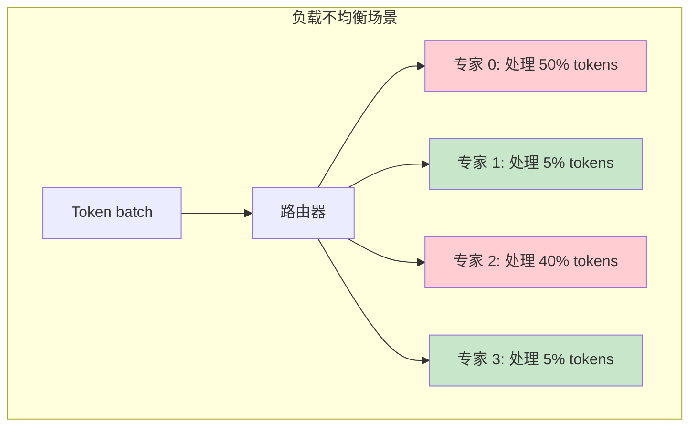
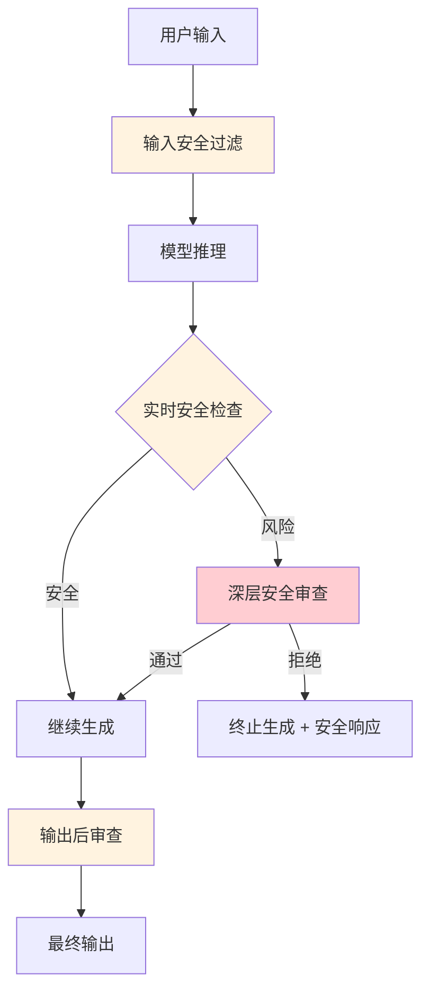
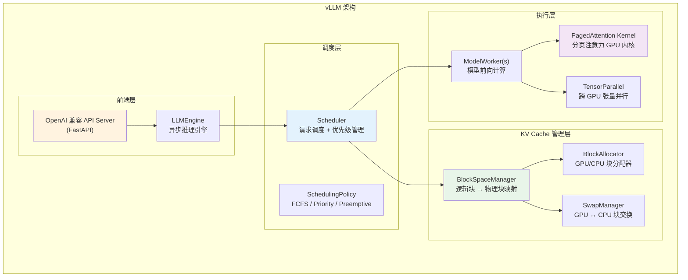
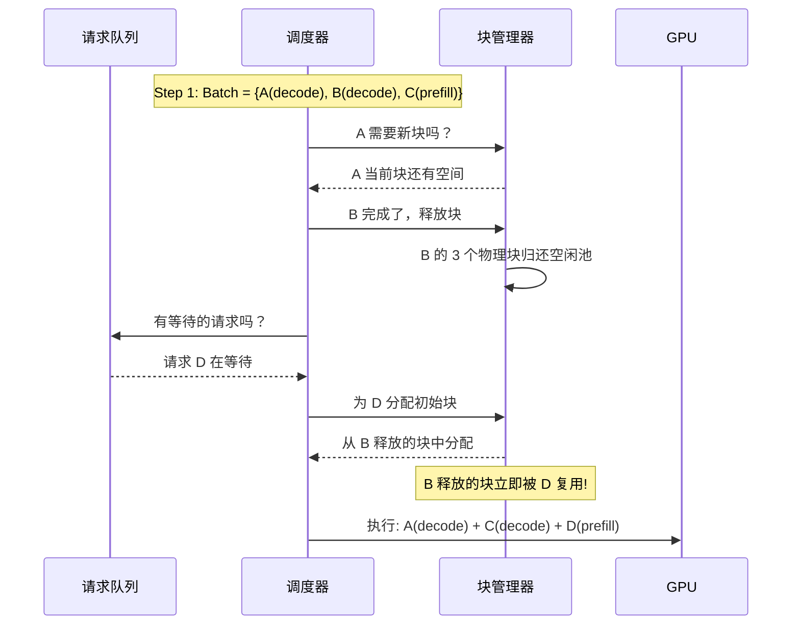
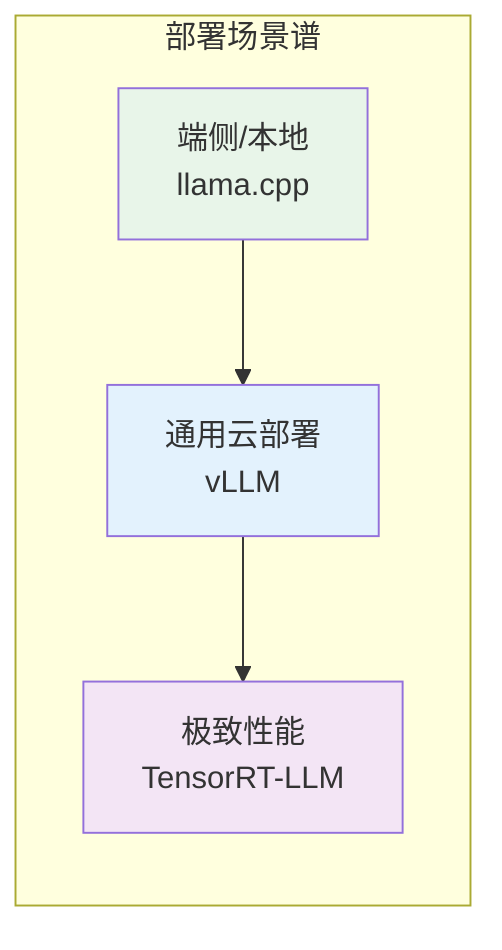
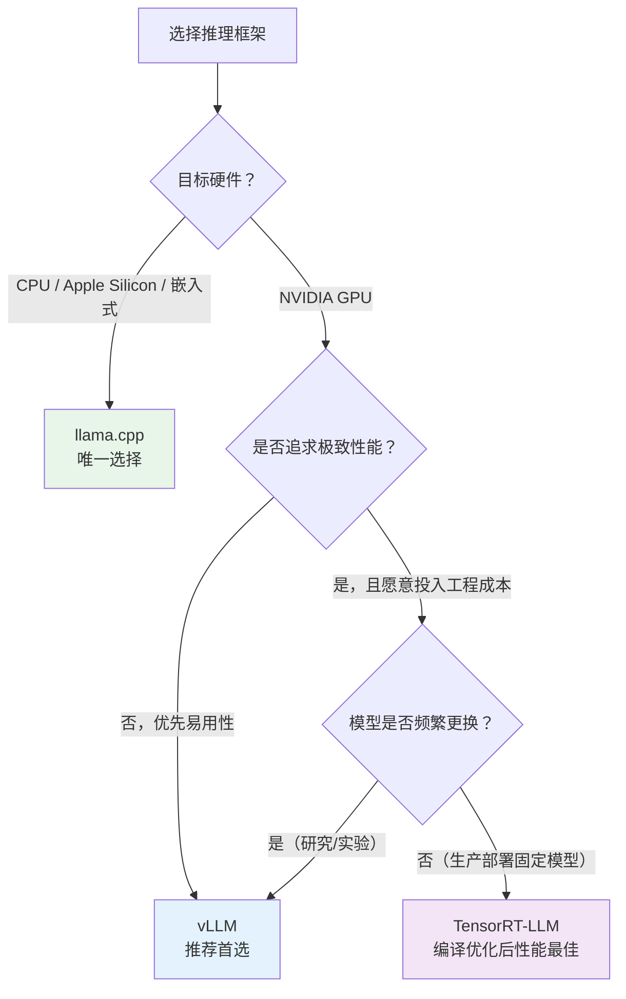
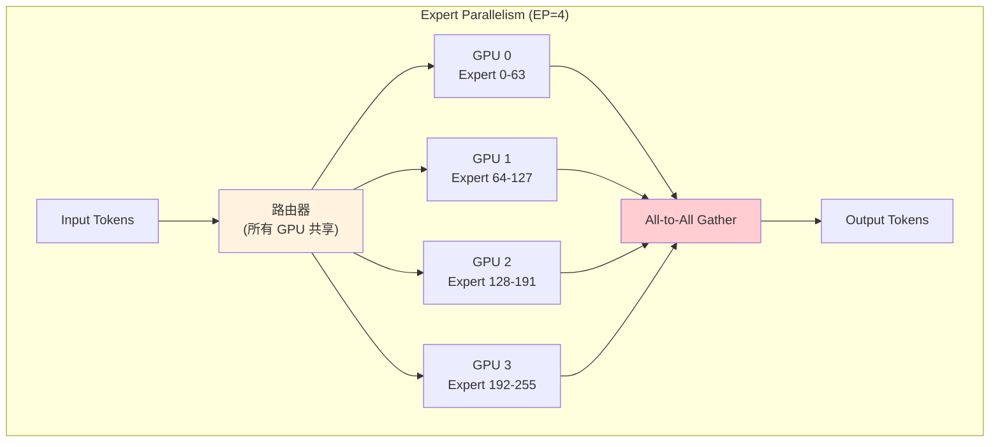
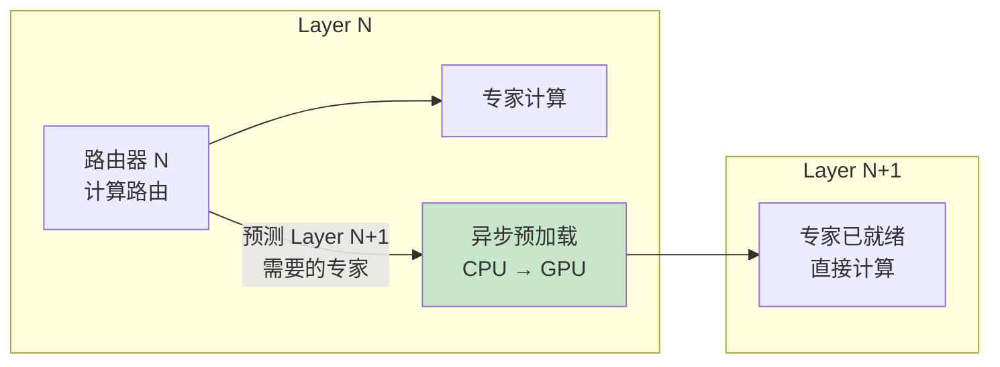
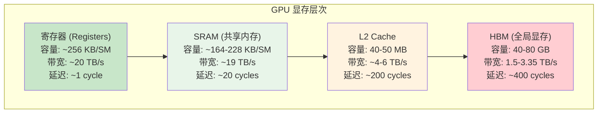

# 推理加速进阶：工业实践与前沿话题

> **章节定位**：本文是 [模块14: 推理加速](./README.md) 的进阶补充。在 README.md 中我们学习了推理优化的核心原理（KV Cache、量化、Flash Attention、投机解码等），本文进一步深入工业实践层面——分析 vLLM、TensorRT-LLM、llama.cpp 等推理框架的架构设计，探讨 MoE 推理优化、前沿量化方法等话题。这些内容连接了 Module 11-13 的训练/评估阶段与 Module 16 的前沿部署话题。

---

## 目录

- [1. Google 的推理优化](#1-google-的推理优化)
- [2. DeepSeek 的推理策略](#2-deepseek-的推理策略)
- [3. Anthropic 视角](#3-anthropic-视角)
- [4. vLLM 架构深度分析](#4-vllm-架构深度分析)
- [5. 推理框架对比：TensorRT-LLM vs vLLM vs llama.cpp](#5-推理框架对比tensorrt-llm-vs-vllm-vs-llamacpp)
- [6. MoE 推理优化](#6-moe-推理优化)
- [7. 量化前沿](#7-量化前沿)
- [8. 前沿话题](#8-前沿话题)
- [9. 底层算子编程 (Triton)](#9-底层算子编程-triton)

---

## 1. Google 的推理优化

### 1.1 TPU 推理优化

Google 的大模型推理基础设施构建在自研的 **TPU（Tensor Processing Unit）** 之上，与 NVIDIA GPU 有本质的架构差异。

**TPU vs GPU 的推理特性**：

| 特性 | TPU v4/v5 | NVIDIA A100/H100 |
|------|-----------|-------------------|
| 计算核心 | 收缩阵列（Systolic Array） | CUDA 核心 + Tensor 核心 |
| 内存类型 | HBM2e | HBM2e / HBM3 |
| 片间互联 | ICI（Inter-Chip Interconnect） | NVLink / NVSwitch |
| 编程模型 | XLA（Accelerated Linear Algebra） | CUDA / Triton |
| 适用场景 | 大 batch 推理，高吞吐 | 灵活，低延迟推理 |

**收缩阵列的特点**：
- 数据在阵列中**流动式传播**，每个 PE（处理单元）做乘加运算后将结果传递给下一个 PE
- 非常高的算力利用率（>80%），但对不规则计算不友好
- 天然适合**大矩阵乘法**（Prefill 阶段），但 Decode 阶段的小矩阵利用率较低

**TPU 推理的软件优化**：

1. **模型分片（Model Sharding）**：Google 使用 GSPMD（Generalized SPMD partitioning）自动将模型分布到 TPU Pod（数千个 TPU 芯片）
2. **Megacore 配置**：TPU v4 每个芯片有 2 个 TensorCore，可以配置为独立模式（2 个独立工作者）或 Megacore 模式（融合为 1 个大核心）
3. **量化推理**：TPU 原生支持 INT8 推理，Google 在 PaLM 和 Gemini 的推理中广泛使用

### 1.2 Gemma 的推理部署最佳实践

Gemma 作为 Google 的开源模型系列，提供了不同规模的部署方案：

**Gemma 2B — 端侧部署**：

```
目标硬件: 手机、嵌入式设备、浏览器 (WebGPU)
推荐方案:
  - INT4 量化 (GPTQ/AWQ): ~1 GB 显存
  - MediaPipe LLM Inference API (Android/iOS)
  - TensorFlow Lite (TFLite) 格式
性能参考:
  - 骁龙 8 Gen 3: ~15 tokens/s
  - Apple M3: ~30 tokens/s
```

**Gemma 9B — 单 GPU 部署**：

```
目标硬件: 消费级 GPU (RTX 3090/4090, 24 GB)
推荐方案:
  - INT8 量化: ~9 GB 显存
  - INT4 量化 (AWQ): ~5 GB 显存
  - vLLM 或 TGI 作为推理服务框架
性能参考:
  - RTX 4090 FP16: ~40 tokens/s
  - RTX 4090 INT8: ~65 tokens/s
  - RTX 4090 INT4: ~90 tokens/s
```

**Gemma 27B — 多 GPU / 服务器部署**：

```
目标硬件: A100 80GB / H100
推荐方案:
  - FP16: 需要 ~54 GB 显存 (单 A100 80GB 可运行)
  - INT4 量化: ~14 GB 显存 (单 RTX 4090 可运行)
  - 张量并行 (TP=2): 分布到 2 张 GPU
性能参考:
  - A100 FP16: ~25 tokens/s
  - H100 FP16: ~45 tokens/s
```

### 1.3 多查询注意力的推理加速效果

PaLM 540B 是第一个大规模使用 MQA 的模型。Google 的实验数据清晰展示了 MQA 的推理优势：

**KV Cache 大小对比**（PaLM 540B，batch=1，seq=2048，FP16）：

| 注意力类型 | KV 头数 | KV Cache 大小 | 相对大小 |
|-----------|---------|--------------|---------|
| MHA | 48 | ~3.1 GB | 1.0x |
| GQA-8 | 8 | ~0.52 GB | 0.17x |
| MQA | 1 | ~65 MB | 0.02x |

**Decode 延迟影响**：

MQA 将 Decode 阶段的瓶颈从"读取大量 KV Cache"转变为"更纯粹的计算"：
- MHA Decode：HBM 带宽利用率 ~90%，计算利用率 <5%
- MQA Decode：HBM 带宽利用率 ~30%，计算利用率 ~20%

这看似 MQA 的带宽利用降低了，但总延迟显著降低，因为需要传输的数据量大幅减少。

**质量损失**：

Google 的消融实验表明，MQA 在大规模模型上的质量损失很小：
- PaLM 540B MHA → MQA：MMLU 下降 <0.5%
- Gemma 2 使用 GQA 作为折中：保留 MQA 的大部分速度优势，同时几乎无质量损失

---

## 2. DeepSeek 的推理策略

### 2.1 MLA 对 KV Cache 的极致压缩

DeepSeek-V2 引入的 **MLA（Multi-head Latent Attention）** 是目前已知最高效的 KV Cache 压缩方案。

**MLA 的核心数学**：

传统 MHA 缓存每个 token 的完整 K 和 V：

$$K_t = W^K h_t \in \mathbb{R}^{n_h \cdot d_h}, \quad V_t = W^V h_t \in \mathbb{R}^{n_h \cdot d_h}$$

MLA 的改变是：先将 $h_t$ 投影到低维空间，缓存压缩向量，推理时再恢复：

$$c_t^{KV} = W^{DKV} h_t \in \mathbb{R}^{d_c} \quad (d_c \ll n_h \cdot d_h)$$

$$K_t = W^{UK} c_t^{KV}, \quad V_t = W^{UV} c_t^{KV}$$

**缓存的内容**：只需存储 $c_t^{KV}$（和 RoPE 所需的 $k_t^{rope}$），而非完整的 K 和 V。

**DeepSeek-V2 的具体参数**：

| 参数 | 值 | 说明 |
|------|------|------|
| $n_h$ | 128 | 注意力头数 |
| $d_h$ | 128 | 每头维度 |
| $d_c$ | 512 | KV 压缩维度 |
| $d_r$ | 64 | RoPE 维度 |
| 标准 MHA 缓存 | $2 \times 128 \times 128 = 32768$ 元素/token/层 | - |
| MLA 缓存 | $512 + 64 = 576$ 元素/token/层 | **57x 压缩** |

**推理时的计算**：

```
缓存读取: c_t^{KV} ∈ R^{d_c}  (仅 576 个元素)
恢复 K:    K_t = W^{UK} @ c_t^{KV}  (需要额外矩阵乘法)
恢复 V:    V_t = W^{UV} @ c_t^{KV}  (需要额外矩阵乘法)
```

**trade-off 分析**：
- MLA 将"存储瓶颈"转化为"计算瓶颈"：用额外的矩阵乘法换取极低的 KV Cache 显存
- 在访存密集的 Decode 阶段，这个 trade-off 非常有利（GPU 算力充裕，带宽稀缺）
- 但在 Prefill 阶段（已经是计算密集的），MLA 的额外计算开销需要考虑

### 2.2 MoE 推理的负载均衡

DeepSeek-V3 使用 256 个专家（每 token 激活 8 个），推理时的专家调度是一个重大工程挑战。

**问题描述**：

在推理服务中，不同的 token 会被路由到不同的专家。如果某些专家过于"热门"，而其他专家空闲，就会产生严重的负载不均衡。



**DeepSeek 的解决策略**：

1. **训练时的负载均衡损失**：训练时通过辅助损失鼓励均匀路由（DeepSeek-V3 使用无辅助损失的方法，但隐式保持了负载均衡）

2. **推理时的专家放置策略**：
   - **冗余放置**：热门专家在多个 GPU 上复制
   - **动态路由调度**：根据实时负载动态调整 token 到 GPU 的分配

3. **通信优化**：
   - All-to-All 通信是 MoE 推理的主要瓶颈
   - DeepSeek 使用 NVLink + InfiniBand 混合拓扑，根据专家的物理位置优化通信路径

### 2.3 DeepSeek-V3 的推理成本分析

DeepSeek-V3 的推理成本优势是其商业竞争力的核心。

**成本构成**（假设使用 H800 GPU 集群）：

| 成本项 | 稠密模型 (等效 671B) | DeepSeek-V3 (671B MoE) | 节省比例 |
|--------|---------------------|----------------------|---------|
| 每 token 计算量 | ~1342 GFLOPs | ~42 GFLOPs (激活 37B) | **96.9%** |
| KV Cache 显存/token | 32768 元素/层 | 576 元素/层 (MLA) | **98.2%** |
| 每请求 GPU 时间 | 基准 | ~1/10 基准 | **~90%** |

**API 定价对比**（2024 年底公开数据，单位: 美元/百万 token）：

| 提供商/模型 | 输入价格 | 输出价格 |
|------------|---------|---------|
| GPT-4-turbo | $10.00 | $30.00 |
| Claude 3.5 Sonnet | $3.00 | $15.00 |
| DeepSeek-V3 | $0.27 | $1.10 |

DeepSeek-V3 的定价约为竞品的 **1/10 至 1/30**，核心支撑来自 MLA + MoE 的架构优势。

---

## 3. Anthropic 视角

> 注：Anthropic 对推理系统的技术细节公开非常有限。本节基于公开信息进行分析，推测性内容明确标注。

### 3.1 大规模推理系统的安全考量

Anthropic 的核心理念是构建"安全的 AI 系统"，这一理念深刻影响了其推理系统的设计。

**公开的安全设计原则**：

1. **Constitutional AI 在推理中的应用**：Claude 的输出需要符合一套"宪法"原则，这意味着推理系统需要在生成过程中持续评估输出的安全性

2. **分层安全检查**：
   - 输入过滤（Prompt 审查）
   - 生成过程中的实时检查
   - 输出后审查

3. **安全性优先于速度**：Anthropic 明确表示，在安全性和推理速度之间，会优先保证安全性

### 3.2 [推测] 推理过程中的实时安全检查

以下内容为基于公开信息的合理推测：

**[推测] 安全检查的架构设计**：
- [推测] Claude 可能在推理流水线中嵌入了轻量级的安全分类器
- [推测] 该分类器可能与主模型共享底层表示，以减少额外计算开销
- [推测] 安全检查可能在每 $k$ 个 token 生成后触发一次（而非每个 token），以平衡安全性和延迟

**[推测] 多层安全机制**：



### 3.3 [推测] 延迟与安全性的 trade-off

**[推测] 安全检查对延迟的影响**：
- [推测] 基础安全检查增加约 5-10% 的推理延迟
- [推测] 当检测到潜在风险时，深层审查可能增加 50-200ms 的额外延迟
- [推测] Anthropic 可能针对不同的安全风险等级设置了不同的检查深度

**[推测] 200K 上下文窗口的推理优化**：
- Claude 3 支持 200K token 的上下文窗口，这需要高效的 KV Cache 管理
- [推测] Claude 可能使用了 GQA 或类似的 KV 压缩方案
- [推测] 对于超长上下文，可能使用了分块处理 + 稀疏注意力的混合策略

**公开事实 — Anthropic 的研究贡献**：
- Anthropic 发表的 Transformer Circuits 系列论文为理解模型行为提供了重要工具
- 这些理解有助于设计更精准的安全检查机制
- 例如，通过识别特定的注意力头模式（如 Induction Heads），可能辅助检测模型在生成有害内容时的特征激活

---

## 4. vLLM 架构深度分析

vLLM 是目前最流行的开源 LLM 推理框架之一，它将 PagedAttention、Continuous Batching 和 Tensor Parallelism 三大核心技术整合为一个高性能的推理引擎。本节从架构层面深度剖析 vLLM 的设计哲学。

### 4.1 整体架构



### 4.2 PagedAttention 的内核实现

vLLM 的 PagedAttention 内核是其性能优势的核心所在。传统注意力假设 KV 存储在连续内存中，而 PagedAttention 需要通过 Block Table 间接寻址。

**PagedAttention 内核的伪代码**：

```python
# PagedAttention 内核的核心逻辑（简化版）
def paged_attention_kernel(
    query,          # [num_heads, head_dim]
    key_cache,      # [num_blocks, block_size, num_kv_heads, head_dim]
    value_cache,    # [num_blocks, block_size, num_kv_heads, head_dim]
    block_table,    # [max_num_blocks_per_seq] - 逻辑块到物理块的映射
    seq_len,        # 当前序列长度
    block_size,     # 每个块的 token 数
):
    """
    关键区别: K/V 不是连续存储的，而是通过 block_table 间接索引
    """
    output = zeros(num_heads, head_dim)
    max_score = -inf
    exp_sum = 0.0

    num_blocks = ceil(seq_len / block_size)

    for block_idx in range(num_blocks):
        # 通过 block_table 找到物理块位置
        physical_block = block_table[block_idx]

        # 从物理块加载 K, V
        k_block = key_cache[physical_block]      # [block_size, num_kv_heads, head_dim]
        v_block = value_cache[physical_block]    # [block_size, num_kv_heads, head_dim]

        # 计算注意力分数
        scores = query @ k_block.T / sqrt(head_dim)  # [num_heads, block_size]

        # 在线 softmax 更新（与 Flash Attention 相同的技巧）
        block_max = max(scores)
        new_max = max(max_score, block_max)

        # 修正之前的累积结果
        correction = exp(max_score - new_max)
        output = output * correction
        exp_sum = exp_sum * correction

        # 累积当前块
        p = exp(scores - new_max)
        output += p @ v_block
        exp_sum += sum(p)
        max_score = new_max

    # 最终归一化
    output = output / exp_sum
    return output
```

**性能关键点**：
- Block Table 查找是**间接寻址**，增加了约 5-10% 的内核开销（vs 连续 KV Cache）
- 但由于消除了显存碎片，可服务的并发请求数大幅增加，**整体吞吐量反而提升**
- vLLM 使用 CUDA 手写内核（而非 Triton），以获得最优性能

### 4.3 Continuous Batching 与 PagedAttention 的协同

两者的结合产生了 **1 + 1 > 2** 的效果：



**协同优势**：
1. **即时块复用**：请求完成后释放的物理块可以立即被新请求使用，无需等待整个 batch 完成
2. **显存利用率最大化**：不同长度的请求按需分配块，没有预分配的浪费
3. **弹性并发**：短请求完成后，空出的显存可以接纳更多新请求

### 4.4 Tensor Parallelism 在 vLLM 中的实现

对于大模型（>13B），单 GPU 无法容纳全部参数，需要通过**张量并行（Tensor Parallelism, TP）** 将模型分布到多个 GPU。

**vLLM 的 TP 策略**：

| 层类型 | 切分方式 | 通信操作 |
|--------|---------|---------|
| QKV 线性层 | 按 head 数切分到各 GPU | 无需通信 |
| Output 线性层 | 按输入维度切分 | AllReduce（求和） |
| FFN 第一层 | 按输出维度切分 | 无需通信 |
| FFN 第二层 | 按输入维度切分 | AllReduce（求和） |
| KV Cache | 按 KV head 切分 | 无需通信 |

**TP + PagedAttention 的特殊考虑**：

- 每个 GPU 管理自己的 Block Table 和物理块
- KV Cache 按 KV head 数均分到各 GPU（GQA 模型需确保 $n_{kv} \geq \text{TP size}$）
- Block 分配需要跨 GPU 同步（保证所有 GPU 的 Block Table 一致）

**通信开销分析**：

每个 Transformer 层需要 2 次 AllReduce（Attention 输出 + FFN 输出）。对于 TP=4 的 70B 模型：

$$\text{每步通信量} = 2L \times d_{model} \times 2 \text{ bytes} = 2 \times 80 \times 8192 \times 2 = 2.5 \text{ MB}$$

在 NVLink（600 GB/s）下，通信延迟约 $4 \mu s$，相比 Decode 阶段的总延迟（~30 ms）可以忽略。

---

## 5. 推理框架对比：TensorRT-LLM vs vLLM vs llama.cpp

三大推理框架各有定位，适用于不同的部署场景。

### 5.1 框架定位与设计哲学



| 维度 | vLLM | TensorRT-LLM | llama.cpp |
|------|------|---------------|-----------|
| **开发语言** | Python + CUDA | C++ + CUDA | C/C++ |
| **设计目标** | 易用性 + 高吞吐 | 极致性能 | 跨平台可移植性 |
| **硬件支持** | NVIDIA GPU（主要） | NVIDIA GPU（独占） | CPU / GPU / Apple Silicon / 各种加速器 |
| **模型格式** | HuggingFace 原生 | 自定义引擎格式（需预编译） | GGUF（自定义量化格式） |
| **部署复杂度** | 低（pip install） | 高（需要编译优化引擎） | 中（需编译 C++ 项目） |
| **量化支持** | GPTQ, AWQ, FP8 | INT8, INT4, FP8（Tensor Core 优化） | Q2_K 到 Q8_0（多种量化格式） |
| **KV Cache 管理** | PagedAttention | 连续分配（优化的预分配） | 连续分配 |
| **批处理** | Continuous Batching | Inflight Batching | 单请求为主 |
| **张量并行** | 支持（NCCL） | 支持（NCCL / 自定义） | 有限支持 |
| **流水线并行** | 有限支持 | 支持 | 不支持 |
| **社区活跃度** | 极高 | 高 | 极高 |

### 5.2 性能对比

以下是不同框架在典型场景下的性能对比（基于公开 benchmark 数据的综合整理）：

**场景 1：单 GPU 推理（Llama 2 7B, A100 80GB, batch=1）**

| 框架 | 精度 | TPOT (ms) | 吞吐量 (tokens/s) | 首次加载时间 |
|------|------|-----------|-------------------|-------------|
| HuggingFace (naive) | FP16 | ~35 | ~29 | ~10s |
| vLLM | FP16 | ~18 | ~56 | ~15s |
| vLLM | AWQ INT4 | ~12 | ~83 | ~15s |
| TensorRT-LLM | FP16 | ~12 | ~83 | ~3min（编译） |
| TensorRT-LLM | INT8 | ~8 | ~125 | ~5min（编译） |
| llama.cpp | Q4_K_M | ~15 | ~67 | ~5s |
| llama.cpp (CPU) | Q4_K_M | ~80 | ~12 | ~3s |

**场景 2：高并发推理（Llama 2 70B, 4xA100 80GB, 100 并发请求）**

| 框架 | 精度 | 吞吐量 (tokens/s) | P99 延迟 (ms/token) |
|------|------|-------------------|-------------------|
| vLLM | FP16 | ~2000 | ~120 |
| TensorRT-LLM | FP16 | ~2800 | ~85 |
| TensorRT-LLM | INT8 | ~4200 | ~55 |

### 5.3 选择指南



**决策要点总结**：

1. **llama.cpp**：当你需要在非 NVIDIA 硬件上运行、或需要极致的可移植性（如桌面应用、边缘设备）时，llama.cpp 是唯一选择。它的 GGUF 量化格式在低精度下质量出色，社区对新模型的支持速度极快。

2. **vLLM**：当你需要在 GPU 上快速部署推理服务，且需要灵活切换模型时，vLLM 是最佳选择。PagedAttention + Continuous Batching 的组合在高并发场景下优势明显。它也是学术研究和快速原型验证的首选。

3. **TensorRT-LLM**：当你有固定的生产模型、追求最低延迟和最高吞吐、且愿意投入工程成本进行预编译优化时，TensorRT-LLM 可以提供 20-50% 的额外性能提升。但其工程复杂度显著高于 vLLM。

---

## 6. MoE 推理优化

Mixture-of-Experts（MoE）模型（如 DeepSeek-V3、Mixtral）在保持大模型质量的同时显著降低了推理计算量。但 MoE 架构引入了独特的推理挑战：专家路由的动态性和专家参数的巨大总量。

### 6.1 MoE 推理的核心挑战

**挑战 1：专家参数的存储**

MoE 模型的总参数量远大于每次推理激活的参数。以 DeepSeek-V3 为例：

| 属性 | 值 |
|------|------|
| 总参数 | 671B |
| 每 token 激活参数 | ~37B（共享参数 + 8 个激活专家） |
| 专家总数 | 256 |
| 每层专家参数 | 256 个 FFN（每个约 ~0.5B 参数） |
| 全部专家的显存 | ~1.2 TB（FP16） |

即使使用 INT4 量化，全部专家也需要 ~300 GB 显存，远超单 GPU 容量。

**挑战 2：动态路由导致的负载不均**

不同的 token 被路由到不同的专家。在 batch 推理中，各专家接收到的 token 数量可能严重不均：

$$\text{负载不均衡度} = \frac{\max_i(n_i)}{\text{avg}_i(n_i)}$$

其中 $n_i$ 是第 $i$ 个专家接收到的 token 数。理想值为 1，实际中可能达到 3-10。

**挑战 3：All-to-All 通信**

在多 GPU 部署中，每个 GPU 承载部分专家。token 需要通过 All-to-All 通信发送到对应专家所在的 GPU，计算完成后再发送回来。这个通信步骤的延迟可能占总推理时间的 30-50%。

### 6.2 Expert Parallelism（专家并行）

专家并行是 MoE 推理最自然的并行策略：将不同的专家分配到不同的 GPU。



**EP 的通信模式**：

```
Step 1: All-to-All Dispatch（分发）
  - 每个 GPU 将本地 token 按路由结果发送到目标 GPU
  - 通信量: O(batch_size × hidden_dim)

Step 2: Expert Computation（专家计算）
  - 每个 GPU 对接收到的 token 执行本地专家的前向计算
  - 计算量取决于接收到的 token 数（可能不均衡）

Step 3: All-to-All Gather（收集）
  - 每个 GPU 将计算结果发送回 token 的源 GPU
  - 通信量: O(batch_size × hidden_dim)
```

**通信隐藏策略**：

高效的 MoE 推理系统会使用**计算-通信重叠（Overlap）** 来隐藏 All-to-All 延迟：

1. 将 token batch 分为多个 micro-batch
2. 当第 $i$ 个 micro-batch 在执行专家计算时，第 $i+1$ 个 micro-batch 的 All-to-All Dispatch 并行执行
3. 形成流水线，使通信延迟被计算时间覆盖

### 6.3 Expert Offloading（专家卸载）

当 GPU 显存不足以容纳所有专家时，可以将不活跃的专家参数存储在 CPU 内存或磁盘上，需要时再加载到 GPU。

**Expert Offloading 策略**：

| 策略 | 原理 | 延迟开销 | 显存需求 |
|------|------|----------|----------|
| **全部驻留** | 所有专家常驻 GPU 显存 | 无 | 最高 |
| **LRU 缓存** | 保留最近使用的专家在 GPU，其余在 CPU | 中等（命中时无开销） | 中等 |
| **预测性加载** | 根据路由器预测，提前加载即将使用的专家 | 低（命中时几乎无开销） | 低 |
| **全部卸载** | 每次计算前从 CPU 加载 | 最高 | 最低 |

**预测性加载的工作原理**：



利用 Layer N 的路由结果预测 Layer N+1 可能需要的专家（相邻层的路由模式有较强相关性），在 Layer N 计算期间异步将这些专家从 CPU 预加载到 GPU。当执行到 Layer N+1 时，所需专家大概率已经在 GPU 上。

**Offloading 的性能影响**：

以 Mixtral 8x7B 模型为例（实际总参数 ~47B，每 token 激活 ~13B）：

| 配置 | GPU 显存需求 | TPOT (ms) | 相对速度 |
|------|-------------|-----------|---------|
| FP16 全部驻留 | ~94 GB（需 2xA100） | ~25 | 1.0x |
| INT4 全部驻留 | ~24 GB（单 RTX 4090） | ~18 | 1.4x |
| FP16 LRU-4 (保留 4 专家) | ~50 GB（单 A100） | ~35 | 0.7x |
| INT4 LRU-4 | ~13 GB（单 RTX 3090） | ~28 | 0.9x |

### 6.4 EP + TP 混合并行

对于超大规模 MoE 模型（如 DeepSeek-V3 的 256 专家），需要结合专家并行（EP）和张量并行（TP）：

```
DeepSeek-V3 部署方案示例 (8 GPU):
- 共享参数: TP=8（每个 GPU 持有 1/8 的共享层参数）
- 专家参数: EP=8（每个 GPU 持有 32 个专家）
- 每个专家: 不再进一步切分（单 GPU 可容纳）
- 通信: 共享层用 AllReduce，专家层用 All-to-All
```

混合并行的通信模式更为复杂，需要仔细规划通信拓扑以最小化跨节点通信。DeepSeek 在其技术报告中提到，他们利用 NVLink（节点内）处理 TP 通信，InfiniBand（节点间）处理 EP 通信，并通过通信-计算重叠将总通信开销控制在 20% 以内。

---

## 7. 量化前沿

模型量化是 LLM 推理优化中最活跃的研究方向之一。除了 README.md 中介绍的 GPTQ 和 AWQ，近年来还涌现了多种高级量化方法。

### 7.1 量化方法全景对比

| 方法 | 年份 | 核心思想 | 支持精度 | 校准数据需求 | 量化速度 | 推理加速 | 精度保持 |
|------|------|----------|----------|-------------|----------|----------|----------|
| **GPTQ** | 2022 | Hessian 引导的逐列量化 + 误差补偿 | INT4/INT3 | 128 样本 | 中（数小时/175B） | 高 | 中高 |
| **AWQ** | 2023 | 激活感知的等效缩放变换 | INT4/INT3 | 128 样本 | 快（分钟级） | 高 | 高 |
| **SqueezeLLM** | 2023 | 非均匀量化 + 稀疏离群值分离 | INT4/INT3 | 128 样本 | 中 | 中高 | 很高 |
| **QuIP#** | 2023 | 随机正交变换 + 向量量化 | INT4/INT2 | 128 样本 | 慢（需要优化） | 中 | 极高 |
| **AQLM** | 2024 | 多码本向量量化 | INT2-INT4 等效 | 数千样本 | 慢 | 中 | 极高 |
| **HQQ** | 2024 | 无校准数据量化（仅用权重统计） | INT4/INT2 | **无需** | 极快（秒级） | 高 | 中 |

### 7.2 SqueezeLLM：非均匀量化 + 离群值分离

SqueezeLLM 的核心洞察是：**权重分布不是均匀的，少数离群值（outliers）严重影响了均匀量化的精度**。

**两步策略**：

**Step 1：离群值分离（Sensitivity-based Sparsification）**

通过分析权重的 Hessian（Fisher 信息矩阵），识别出对输出影响最大的权重元素：

$$\text{Sensitivity}_i = w_i^2 \cdot H_{ii}$$

将 sensitivity 最高的 0.45% 权重提取出来，以 FP16 稀疏格式单独存储。剩余 99.55% 的权重用低精度量化。

**Step 2：非均匀量化（K-means Clustering）**

对去除离群值后的权重，使用 K-means 聚类找到最优的量化码本：

$$\min_{C} \sum_{i} \min_{c \in C} (w_i - c)^2$$

其中 $C = \{c_1, c_2, \ldots, c_{2^b}\}$ 是 $2^b$ 个聚类中心（$b$ 为量化位宽）。

**与均匀量化的对比**：

```
权重分布:  ████████████████░░░████░░████████████████
                                ↑ 离群值

均匀量化:  量化点均匀分布，离群值导致 scale 过大
           |-------|-------|-------|-------|
           大部分正常值被量化到很少的几个级别

SqueezeLLM: 离群值单独存储 (FP16) + 剩余用 K-means 非均匀量化
           正常值: |--|---|-----|---|--|
           离群值: 精确保留
```

### 7.3 QuIP#：随机正交变换 + 向量量化

QuIP（Quantization with Incoherence Processing）及其改进版 QuIP# 采用了完全不同的思路：**在量化之前，通过随机正交变换让权重和 Hessian 变得"不相干（incoherent）"，从而使权重分布更加均匀，更适合量化**。

**数学原理**：

给定权重矩阵 $W$ 和 Hessian $H$：

$$\tilde{W} = U^T W V, \quad \tilde{H} = V^T H V$$

其中 $U, V$ 是随机正交矩阵（如随机 Hadamard 变换矩阵）。

**不相干性**保证了变换后的 $\tilde{W}$ 没有明显的离群值——能量被均匀分散到所有元素。这意味着简单的均匀量化就能获得很好的效果。

**QuIP# 在 2-bit 量化上的突破**：

| 模型 | 量化方法 | 位宽 | Wikitext PPL | 相对 FP16 |
|------|---------|------|-------------|-----------|
| Llama 2 70B | Round-to-nearest | 2-bit | 发散 | 不可用 |
| Llama 2 70B | GPTQ | 2-bit | ~12.0 | 差 |
| Llama 2 70B | QuIP# | 2-bit | ~5.2 | 接近 FP16 (4.9) |
| Llama 2 70B | QuIP# | 4-bit | ~4.95 | 几乎无损 |

QuIP# 是目前在极低精度（2-bit）量化上表现最好的方法，使得 70B 模型有可能压缩到约 18 GB，在单 RTX 4090 上运行。

### 7.4 精度-速度-显存权衡表

综合各量化方法在 Llama 2 70B 上的表现（近似数据，用于对比趋势）：

| 量化方法 | 有效位宽 | 模型大小 | PPL 变化 | 推理速度 | 适用场景 |
|---------|---------|---------|---------|---------|---------|
| FP16（基准） | 16 bit | 140 GB | - | 1.0x | 质量至上 |
| INT8 (per-channel) | 8 bit | 70 GB | +0.1 | ~1.8x | 通用部署 |
| GPTQ INT4 (g128) | 4 bit | 35 GB | +0.4 | ~2.5x | 显存受限 |
| AWQ INT4 (g128) | 4 bit | 35 GB | +0.2 | ~2.5x | 显存受限（更优质量） |
| SqueezeLLM INT4 | 4 bit | 37 GB* | +0.1 | ~2.0x | 质量敏感 |
| QuIP# INT4 | 4 bit | 35 GB | +0.05 | ~2.2x | 极致质量 |
| HQQ INT4 | 4 bit | 35 GB | +0.3 | ~2.5x | 快速量化、无数据 |
| GPTQ INT3 (g128) | 3 bit | 27 GB | +1.2 | ~3.0x | 极致压缩 |
| QuIP# INT2 | 2 bit | 18 GB | +0.3 | ~2.5x | 极端显存限制 |

*SqueezeLLM 因稀疏离群值存储，模型略大于纯 INT4。

**选择建议**：

1. **质量优先，显存充足**：FP16 或 INT8 per-channel
2. **需要 INT4，追求质量**：AWQ 或 QuIP#
3. **需要 INT4，快速量化**：HQQ（无需校准数据）
4. **极端显存限制**：QuIP# INT2（唯一可用的 2-bit 方案）
5. **生产部署，需要硬件加速**：AWQ 或 GPTQ（Tensor Core 友好的均匀量化）

---

## 8. 前沿话题

### 8.1 稀疏注意力推理

在超长上下文（128K+ tokens）推理中，即使使用 Flash Attention，$O(N^2)$ 的计算复杂度仍然是瓶颈。稀疏注意力通过选择性地计算注意力来降低复杂度。

**主要方法**：

| 方法 | 复杂度 | 原理 | 代表工作 |
|------|--------|------|----------|
| 滑动窗口 | $O(Nw)$ | 只关注最近 $w$ 个 token | Longformer, Mistral |
| 块稀疏 | $O(N\sqrt{N})$ | 预定义的稀疏模式 | BigBird |
| 动态稀疏 | $O(Nk)$ | 根据内容动态选择 top-k 关键 token | Routing Attention |
| 局部-全局混合 | 可变 | 交替使用局部和全局注意力 | Gemma 2 |

**StreamingLLM**：一种实用的推理优化方法：
- 观察：LLM 推理时，最初几个 token 的注意力权重异常高（"attention sink"现象）
- 方法：保留最初的 $k$ 个 token + 最近的 $w$ 个 token 的 KV Cache，丢弃中间的
- 效果：可以用固定大小的 KV Cache 进行"无限长度"的推理
- 限制：丢弃了中间 token 的信息，可能影响需要长距离依赖的任务

### 8.2 编译优化

现代编译优化工具通过算子融合、内存规划等技术，在不修改模型代码的情况下加速推理。

**torch.compile**：

PyTorch 2.0 引入的编译器，基于 TorchDynamo + TorchInductor：

```python
import torch

model = MyModel().cuda()
# 一行代码加速推理
compiled_model = torch.compile(model, mode="max-autotune")

# 首次调用触发编译（较慢），后续调用使用编译后的内核
output = compiled_model(input)
```

**编译优化的关键技术**：

1. **算子融合（Operator Fusion）**：将多个小算子合并为一个大内核，减少 HBM 访问次数
   - 例如：LayerNorm = Mean + Sub + Var + Div + Scale + Shift → 融合为单个内核

2. **内存规划（Memory Planning）**：优化临时张量的分配和释放，减少显存碎片

3. **内核自动调优（Autotuning）**：针对具体硬件和输入形状，选择最优的内核配置（如线程块大小、共享内存分配）

**TensorRT / TensorRT-LLM**：

NVIDIA 的推理优化引擎，专门针对 NVIDIA GPU 优化：

```python
# TensorRT-LLM 的典型用法
import tensorrt_llm

# 构建优化后的引擎
builder = tensorrt_llm.Builder()
network = builder.create_network()
# ... 定义模型结构 ...
engine = builder.build_engine(network, builder_config)
```

**各框架推理性能对比**（Llama 2 7B，A100 80GB，batch=1）：

| 框架 | TPOT (ms/token) | 加速比 |
|------|-----------------|--------|
| HuggingFace (naive) | ~35 ms | 1.0x |
| HuggingFace + BetterTransformer | ~25 ms | 1.4x |
| vLLM | ~18 ms | 1.9x |
| TensorRT-LLM | ~12 ms | 2.9x |
| torch.compile (max-autotune) | ~20 ms | 1.8x |

### 8.3 硬件感知的模型优化

不同的硬件平台有不同的计算特性，"硬件感知"的优化能显著提升推理效率。

**关键的硬件特性**：

| 特性 | 影响 | 优化建议 |
|------|------|----------|
| Tensor Core 对齐 | 矩阵维度需要是 8/16/32 的倍数 | 模型维度选择考虑对齐 |
| SRAM 大小 | 决定 Flash Attention 的分块大小 | 根据硬件调整分块策略 |
| 内存带宽 | Decode 阶段瓶颈 | 使用量化减少数据传输量 |
| 计算/带宽比 | 决定算术强度拐点 | 选择合适的 batch size |

**示例：H100 vs A100 的优化差异**：

- H100 支持 FP8 Tensor Core：可以用 FP8 推理（A100 不支持）
- H100 HBM3 带宽 3.35 TB/s（A100 HBM2e 2.0 TB/s）：Decode 阶段直接提速 ~1.7x
- H100 有 Transformer Engine：自动混合精度推理，无需手动管理

### 8.4 LLM 推理的成本经济学

LLM 推理的成本分析是商业化部署的关键考量。

**成本公式**：

$$\text{Cost per token} = \frac{\text{GPU 价格（租赁/折旧）}}{\text{tokens/second} \times \text{GPU 运行时间}}$$

**影响因素**：

1. **模型大小**：决定所需 GPU 数量和每 token 计算量
2. **量化精度**：INT4 可以将单 GPU 可服务的模型大小翻倍
3. **batch size**：增大 batch 提升吞吐但增加延迟
4. **硬件选择**：H100 性能约为 A100 的 2-3 倍，但价格也更高

**经济性分析示例**（以 Llama 2 70B 部署为例）：

| 配置 | GPU 数量 | 吞吐量 (tokens/s) | 日成本 (美元) | 每百万 token 成本 |
|------|---------|-------------------|-------------|-----------------|
| FP16, 4×A100 | 4 | ~200 | ~$200 | ~$11.6 |
| INT8, 2×A100 | 2 | ~180 | ~$100 | ~$6.4 |
| INT4 (GPTQ), 1×A100 | 1 | ~120 | ~$50 | ~$4.8 |
| INT4, 1×H100 | 1 | ~250 | ~$80 | ~$3.7 |

> 注：以上为近似估算，实际成本取决于具体的云服务商定价、利用率和网络成本等。

---

## 9. 底层算子编程 (Triton)

### 9.1 GPU 硬件抽象

要理解 Flash Attention 等优化的底层原理，需要先了解 GPU 的显存层次结构。

#### 9.1.1 HBM vs SRAM 的带宽金字塔



**关键洞察**：
- 寄存器和 SRAM 的带宽是 HBM 的 **6-13 倍**
- Flash Attention 的核心思想就是尽量在 SRAM 中完成计算，减少对 HBM 的访问

#### 9.1.2 并行计算模型：Block, Warp, Thread

GPU 的并行执行模型是分层的：

```
Grid（网格）
  └── Block（线程块）—— 对应一个 SM（流式多处理器）
        └── Warp（线程束）—— 32 个线程同步执行
              └── Thread（线程）—— 最小执行单元
```

| 概念 | 典型规模 | 共享资源 |
|------|---------|---------|
| Grid | 数千个 Block | 全局内存（HBM） |
| Block | 128-1024 个 Thread | 共享内存（SRAM） |
| Warp | 32 个 Thread | 指令流（SIMT） |
| Thread | 1 | 寄存器 |

**在 Triton 中的映射**：Triton 的编程模型以 **program**（对应一个 Block）为单位，程序员只需关心 Block 级别的逻辑，Triton 编译器负责 Warp/Thread 级别的优化。

### 9.2 OpenAI Triton 语言入门

#### 9.2.1 为什么用 Triton 而不是 CUDA C++？

| 比较维度 | CUDA C++ | Triton |
|---------|----------|--------|
| 编程复杂度 | 极高（手动管理线程、共享内存、同步） | 中等（块级别编程，编译器自动优化） |
| 性能 | 理论极致性能 | 接近 CUDA 手写内核（通常达到 80-95%） |
| 开发效率 | 低（数百行代码写一个内核） | 高（数十行 Python 代码） |
| 适用场景 | 极致性能要求的生产内核 | 研究原型、快速迭代 |
| 学习曲线 | 陡峭 | 平缓（基于 Python） |

**Triton 的核心理念**：将底层的线程/Warp 管理交给编译器，程序员只需定义**块级别的数据加载、计算和存储逻辑**。

#### 9.2.2 核心概念：`tl.load`, `tl.store`, `tl.dot`

Triton 的核心 API：

```python
import triton
import triton.language as tl

@triton.jit  # JIT 编译为 GPU 内核
def my_kernel(x_ptr, y_ptr, N, BLOCK_SIZE: tl.constexpr):
    # 获取当前 program 的 ID（类似 CUDA 的 blockIdx）
    pid = tl.program_id(0)

    # 计算当前块处理的元素范围
    offsets = pid * BLOCK_SIZE + tl.arange(0, BLOCK_SIZE)

    # 边界掩码（处理非对齐的尾部）
    mask = offsets < N

    # 从 HBM 加载数据到 SRAM/寄存器
    x = tl.load(x_ptr + offsets, mask=mask, other=0.0)

    # 在 SRAM 中计算
    y = x * 2.0

    # 将结果写回 HBM
    tl.store(y_ptr + offsets, y, mask=mask)
```

**核心 API 说明**：

| API | 功能 | CUDA 等价 |
|-----|------|-----------|
| `tl.program_id(axis)` | 获取当前块的 ID | `blockIdx.x` |
| `tl.arange(start, end)` | 生成索引序列 | `threadIdx.x + ...` |
| `tl.load(ptr, mask)` | 从 HBM 加载到 SRAM | `__shared__ float buf[]; buf[i] = global[i];` |
| `tl.store(ptr, val, mask)` | 从 SRAM 写回 HBM | `global[i] = buf[i];` |
| `tl.dot(a, b)` | 矩阵乘法 | 手写 Tensor Core 调用 |
| `tl.max(x, axis)` | 归约取最大值 | `__shfl_down_sync` 手动实现 |
| `tl.sum(x, axis)` | 归约求和 | `__shfl_down_sync` 手动实现 |

#### 9.2.3 实战案例：高效的 Vector Add

```python
import torch
import triton
import triton.language as tl


@triton.jit
def vector_add_kernel(
    x_ptr, y_ptr, z_ptr,
    N,
    BLOCK_SIZE: tl.constexpr,
):
    """向量加法 GPU 内核

    每个 program（线程块）处理 BLOCK_SIZE 个元素
    """
    # 当前块的 ID
    pid = tl.program_id(0)

    # 当前块处理的元素索引
    offsets = pid * BLOCK_SIZE + tl.arange(0, BLOCK_SIZE)

    # 边界检查
    mask = offsets < N

    # 加载数据
    x = tl.load(x_ptr + offsets, mask=mask)
    y = tl.load(y_ptr + offsets, mask=mask)

    # 计算
    z = x + y

    # 存储结果
    tl.store(z_ptr + offsets, z, mask=mask)


def vector_add(x: torch.Tensor, y: torch.Tensor) -> torch.Tensor:
    """向量加法的 Triton 包装函数"""
    assert x.shape == y.shape
    z = torch.empty_like(x)
    N = x.numel()
    BLOCK_SIZE = 1024

    # 计算需要的线程块数
    grid = (triton.cdiv(N, BLOCK_SIZE),)

    # 启动内核
    vector_add_kernel[grid](x, y, z, N, BLOCK_SIZE)

    return z
```

#### 9.2.4 实战案例：Softmax

Softmax 的实现展示了如何在 Triton 中进行归约操作：

```python
@triton.jit
def softmax_kernel(
    input_ptr, output_ptr,
    n_cols,
    input_row_stride, output_row_stride,
    BLOCK_SIZE: tl.constexpr,
):
    """逐行 Softmax GPU 内核

    每个 program 处理一行数据
    """
    # 当前处理的行
    row_idx = tl.program_id(0)

    # 计算当前行的起始地址
    row_start_ptr = input_ptr + row_idx * input_row_stride

    # 列索引
    col_offsets = tl.arange(0, BLOCK_SIZE)
    mask = col_offsets < n_cols

    # 加载一整行数据
    row = tl.load(row_start_ptr + col_offsets, mask=mask, other=float('-inf'))

    # 数值稳定的 softmax
    # Step 1: 减去最大值
    row_max = tl.max(row, axis=0)
    row = row - row_max

    # Step 2: 计算 exp
    numerator = tl.exp(row)

    # Step 3: 求和
    denominator = tl.sum(numerator, axis=0)

    # Step 4: 归一化
    softmax_output = numerator / denominator

    # 写回结果
    output_row_start = output_ptr + row_idx * output_row_stride
    tl.store(output_row_start + col_offsets, softmax_output, mask=mask)
```

#### 9.2.5 FlashAttention 的 Triton 简化版实现

以下是 Flash Attention forward pass 的 Triton 简化实现（核心逻辑）：

```python
@triton.jit
def flash_attention_kernel(
    Q, K, V, O,          # 输入输出指针
    sm_scale,             # softmax 缩放因子 1/sqrt(d_k)
    stride_qb, stride_qh, stride_qm, stride_qk,  # Q 的步长
    stride_kb, stride_kh, stride_kn, stride_kk,  # K 的步长
    stride_vb, stride_vh, stride_vn, stride_vk,  # V 的步长
    stride_ob, stride_oh, stride_om, stride_ok,  # O 的步长
    N_CTX,                # 序列长度
    BLOCK_M: tl.constexpr,  # Q 分块大小
    BLOCK_N: tl.constexpr,  # KV 分块大小
    BLOCK_D: tl.constexpr,  # head_dim
):
    """Flash Attention 前向传播简化版 Triton 内核

    核心思想:
    1. 将 Q 按 BLOCK_M 分块，每个 program 处理一个 Q 块
    2. 遍历所有 K,V 块，在 SRAM 中做分块注意力
    3. 使用在线 softmax 更新结果
    """
    # 获取 batch 和 head 的索引
    off_b = tl.program_id(1)  # batch index
    off_h = tl.program_id(2)  # head index

    # 当前 program 处理的 Q 行范围
    start_m = tl.program_id(0) * BLOCK_M

    # 初始化输出和统计量
    # m_i: 当前最大值, l_i: 当前指数和
    m_i = tl.full([BLOCK_M], float('-inf'), dtype=tl.float32)
    l_i = tl.full([BLOCK_M], 0.0, dtype=tl.float32)
    acc = tl.zeros([BLOCK_M, BLOCK_D], dtype=tl.float32)

    # 加载 Q 块 (常驻 SRAM)
    offs_m = start_m + tl.arange(0, BLOCK_M)
    offs_d = tl.arange(0, BLOCK_D)
    q = tl.load(Q + off_b * stride_qb + off_h * stride_qh
                + offs_m[:, None] * stride_qm + offs_d[None, :] * stride_qk)

    # 遍历所有 K, V 块
    for start_n in range(0, N_CTX, BLOCK_N):
        offs_n = start_n + tl.arange(0, BLOCK_N)

        # 加载 K 块
        k = tl.load(K + off_b * stride_kb + off_h * stride_kh
                    + offs_n[:, None] * stride_kn + offs_d[None, :] * stride_kk)

        # 计算 S = Q @ K^T * scale
        s = tl.dot(q, tl.trans(k)) * sm_scale

        # 在线 softmax 更新
        m_ij = tl.max(s, axis=1)                    # 当前块的行最大值
        m_new = tl.maximum(m_i, m_ij)               # 全局最大值更新
        alpha = tl.exp(m_i - m_new)                  # 旧结果的修正因子
        p = tl.exp(s - m_new[:, None])               # 当前块的 exp

        l_i = l_i * alpha + tl.sum(p, axis=1)       # 更新指数和
        acc = acc * alpha[:, None]                    # 修正旧的累积输出

        # 加载 V 块
        v = tl.load(V + off_b * stride_vb + off_h * stride_vh
                    + offs_n[:, None] * stride_vn + offs_d[None, :] * stride_vk)

        # 累积 P @ V
        acc += tl.dot(p.to(v.dtype), v)

        m_i = m_new  # 更新最大值

    # 最终归一化
    acc = acc / l_i[:, None]

    # 写回 HBM
    tl.store(O + off_b * stride_ob + off_h * stride_oh
             + offs_m[:, None] * stride_om + offs_d[None, :] * stride_ok, acc)
```

**代码解读**：

1. **第一层循环**（隐含在 `tl.program_id(0)` 中）：将 Q 矩阵按行分块，每个 program 处理 BLOCK_M 行
2. **第二层循环**（显式 for 循环）：遍历所有 K, V 块
3. **在线 softmax**：通过维护 `m_i`（最大值）和 `l_i`（指数和），每处理一个 K 块就更新输出
4. **最终归一化**：所有 K, V 块处理完后，除以总的指数和

**与标准实现的对比**：

```
标准实现:                        Flash Attention:
S = Q @ K^T  (写入 HBM)        for each K_block:
P = softmax(S) (写入 HBM)          s = Q_block @ K_block^T (在 SRAM)
O = P @ V   (写入 HBM)             online_softmax_update(s)
                                    acc += p @ V_block
HBM 访问: O(N^2)                HBM 访问: O(N^2 * d / M)
额外显存: O(N^2)                额外显存: O(N)
```

### 9.3 Triton 编程的实用技巧

1. **选择合适的 BLOCK_SIZE**：通常为 2 的幂次（64, 128, 256），需要与硬件的 Warp 大小（32）对齐

2. **使用 `tl.constexpr` 声明编译时常量**：允许编译器做更激进的优化（如循环展开）

3. **注意内存对齐**：确保指针地址是 16 字节对齐的，否则可能导致性能下降

4. **使用 `triton.autotune` 自动搜索最优配置**：

```python
@triton.autotune(
    configs=[
        triton.Config({'BLOCK_M': 128, 'BLOCK_N': 64}),
        triton.Config({'BLOCK_M': 64, 'BLOCK_N': 128}),
        triton.Config({'BLOCK_M': 128, 'BLOCK_N': 128}),
    ],
    key=['N_CTX'],  # 根据序列长度选择最优配置
)
@triton.jit
def my_kernel(...):
    ...
```

5. **调试技巧**：Triton 内核无法直接 print，使用 `triton.testing.do_bench` 做性能分析，使用 `torch.allclose` 做正确性验证

---

## 延伸阅读

### 论文
- [Efficient Memory Management for Large Language Model Serving with PagedAttention](https://arxiv.org/abs/2309.06180)
- [FlashAttention-2: Faster Attention with Better Parallelism and Work Partitioning](https://arxiv.org/abs/2307.08691)
- [DeepSeek-V2: A Strong, Economical, and Efficient Mixture-of-Experts Language Model](https://arxiv.org/abs/2405.04434)
- [Efficient Streaming Language Models with Attention Sinks](https://arxiv.org/abs/2309.17453) (StreamingLLM)
- [Triton: An Intermediate Language and Compiler for Tiled Neural Network Computations](https://www.eecs.harvard.edu/~htk/publication/2019-mapl-tillet-kung-cox.pdf)
- [SqueezeLLM: Dense-and-Sparse Quantization](https://arxiv.org/abs/2306.07629)
- [QuIP#: Even Better LLM Quantization with Hadamard Incoherence and Lattice Codebooks](https://arxiv.org/abs/2402.04396)
- [AQLM: Extreme Compression of Large Language Models via Additive Quantization](https://arxiv.org/abs/2401.06118)
- [HQQ: Half-Quadratic Quantization](https://mobiusml.github.io/hqq_blog/)
- [Medusa: Simple LLM Inference Acceleration Framework with Multiple Decoding Heads](https://arxiv.org/abs/2401.10774)
- [EAGLE: Speculative Sampling Requires Rethinking Feature Uncertainty](https://arxiv.org/abs/2401.15077)
- [DistServe: Disaggregating Prefill and Decoding for Goodput-optimized Large Language Model Serving](https://arxiv.org/abs/2401.09670)

### 开源项目
- [vLLM](https://github.com/vllm-project/vllm) — PagedAttention + Continuous Batching
- [OpenAI Triton](https://github.com/openai/triton) — GPU 编程语言
- [FlashAttention](https://github.com/Dao-AILab/flash-attention) — IO 感知的注意力实现
- [llama.cpp](https://github.com/ggerganov/llama.cpp) — CPU/GPU 混合推理
- [TensorRT-LLM](https://github.com/NVIDIA/TensorRT-LLM) — NVIDIA 推理优化框架
