# 模块15：RAG 与知识增强 -- 检索、向量库与 GraphRAG

> **模块定位**：RAG（Retrieval-Augmented Generation）是大语言模型从"实验室技术"走向"实际落地"最关键的范式之一。在前几个模块中，我们已经学习了如何训练模型（Module 8-10）、如何对齐人类偏好（Module 11-12）、如何高效推理（Module 13-14），但这些技术距离真正解决用户问题还有一步之遥——模型需要**可靠的外部知识**来回答事实性问题。RAG 正是连接"模型推理能力"与"真实世界知识"的桥梁。同时，本模块也为 Module 16（前沿专题与终极项目）铺设基础：在前沿研究中，RAG 正与 Agent、多模态、长上下文等方向深度融合，成为几乎所有 LLM 应用系统的核心组件。

> 大语言模型的"幻觉"问题和知识截止（Knowledge Cutoff）是其在实际应用中的核心痛点。RAG 通过引入外部知识库，让模型在生成时"查阅资料"，从根本上缓解了这两大问题。本章将从 RAG 的数学范式出发，深入剖析向量检索、稀疏检索、混合搜索、GraphRAG 等核心技术，并结合 Google、DeepSeek、Anthropic 三条技术线的工业实践，带你构建完整的知识增强系统。

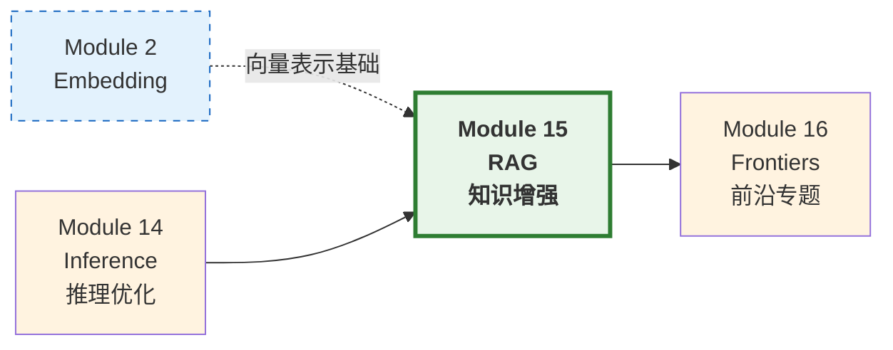

---

## 目录

- [1. RAG 核心范式](#1-rag-核心范式)
- [2. RAG 系统架构全景](#2-rag-系统架构全景)
- [3. 向量检索算法](#3-向量检索算法)
- [4. 稀疏检索与混合搜索](#4-稀疏检索与混合搜索)
- [5. 检索策略深度对比](#5-检索策略深度对比)
- [6. Chunk 策略工程实践](#6-chunk-策略工程实践)
- [7. GraphRAG：基于知识图谱的 RAG](#7-graphrag基于知识图谱的-rag)
- [8. RAG 评估框架](#8-rag-评估框架)
- [9. 三条技术线的 RAG 实践](#9-三条技术线的-rag-实践)
- [10. 项目实践](#10-项目实践)
- [11. 本章小结](#11-本章小结)
- [参考资料](#参考资料)

---

## 1. RAG 核心范式

### 1.1 问题背景：幻觉与知识截止

大语言模型存在两个根本性的知识问题：

1. **幻觉（Hallucination）**：模型"自信地"生成看似合理但事实上错误的内容。这源于模型的生成本质是基于概率分布的采样，而非基于事实的推理。
2. **知识截止（Knowledge Cutoff）**：模型只能获取训练数据截止日期之前的信息。对于"今天的股价是多少"这类问题，模型无能为力。

**类比**：想象一个考试。传统 LLM 是"闭卷考试"——完全依赖记忆。而 RAG 是"开卷考试"——允许查阅资料后回答。显然，开卷考试更适合处理事实性、时效性问题。

### 1.2 RAG 的数学形式

RAG 的核心思想可以用条件概率表示。给定用户查询 $x$，RAG 的目标是生成回答 $y$：

$$P(y \mid x) \approx \sum_{z \in \text{TopK}(x)} P(y \mid x, z) \cdot P(z \mid x)$$

其中：
- $z$ 是从外部知识库中检索到的文档片段
- $P(z \mid x)$ 是**检索模型**：给定查询，文档被检索到的概率（与查询-文档相似度成正比）
- $P(y \mid x, z)$ 是**生成模型**：给定查询和参考文档，生成回答的概率
- $\text{TopK}(x)$ 是检索得分最高的前 $K$ 个文档

**直觉解释**：这个公式说的是——最终的回答是在"综合了多个参考资料"后生成的，每个资料的贡献权重取决于它与问题的相关性。

更精确地，检索概率通过相似度函数定义：

$$P(z \mid x) = \frac{\exp(f(x, z) / \tau)}{\sum_{z' \in \mathcal{C}} \exp(f(x, z') / \tau)}$$

其中 $f(x, z)$ 是查询 $x$ 与文档 $z$ 之间的相似度函数（如内积或余弦相似度），$\tau$ 是温度参数，$\mathcal{C}$ 是整个知识库。

### 1.3 RAG 基本流程


**标准 RAG Pipeline 的三个阶段**：

1. **索引阶段（Indexing）**：将知识库文档切分为 chunk，计算每个 chunk 的向量表示并存入向量数据库
2. **检索阶段（Retrieval）**：将用户查询编码为向量，在向量库中搜索相似文档
3. **生成阶段（Generation）**：将检索到的文档与原始查询拼接，输入 LLM 生成回答

### 1.4 Naive RAG vs Advanced RAG

#### Naive RAG

最简单的 RAG 实现：直接把用户查询编码，检索 Top-K 文档，拼接后生成。

**Naive RAG 的问题**：
- 查询可能表述模糊，检索质量差
- 检索到的文档可能包含冗余或噪声信息
- 文档排序不够精确，Top-K 中混入不相关内容
- 简单拼接导致 prompt 过长，关键信息被"稀释"

#### Advanced RAG：预检索与后检索优化

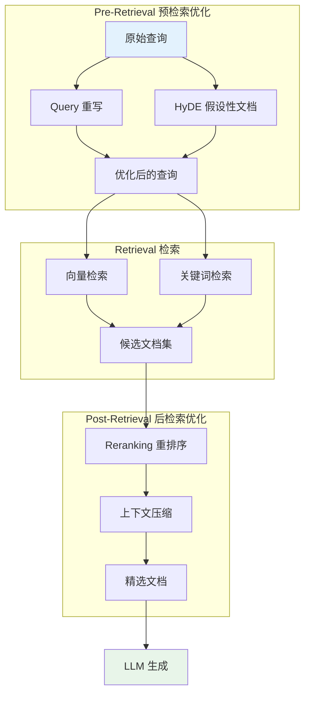

### 1.5 Query 重写（Query Rewriting）

用户的原始查询往往不适合直接用于检索。Query 重写通过 LLM 将口语化、模糊的查询转换为更适合检索的形式。

**示例**：

| 原始查询 | 重写后 |
|---------|--------|
| "transformer 那个注意力怎么算的" | "Transformer Self-Attention 计算公式与缩放点积" |
| "为什么 GPT 会胡说八道" | "大语言模型幻觉现象的原因与缓解方法" |
| "最新的那个中国大模型" | "DeepSeek V3 模型架构与技术创新" |

**Query 重写的实现**：通过 Prompt Engineering 让 LLM 生成更好的检索查询：

```
你是一个查询优化助手。请将以下用户问题改写为更适合搜索引擎检索的查询。
要求：
1. 使用精确的技术术语
2. 去除口语化表达
3. 保留核心意图

用户问题：{user_query}
优化后的检索查询：
```

### 1.6 HyDE：假设性文档嵌入

HyDE（Hypothetical Document Embeddings）是一种巧妙的预检索优化策略。其核心思想是：**先让 LLM 生成一个"假设性的答案"，然后用这个假设答案的嵌入去检索，而非用原始问题的嵌入**。

**数学直觉**：

在嵌入空间中，**答案和答案之间的距离**通常小于**问题和答案之间的距离**。因此，用"假设答案"去检索真正的答案，往往比用"问题"去检索更有效。

$$\text{sim}(E(\text{HyDE\_answer}), E(\text{real\_doc})) > \text{sim}(E(\text{query}), E(\text{real\_doc}))$$

其中 $E(\cdot)$ 是嵌入函数。

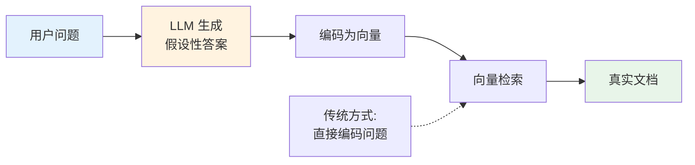

**HyDE 的工作流程**：

1. 用户提问："HNSW 算法的时间复杂度是多少？"
2. LLM 生成假设性回答："HNSW 算法的搜索时间复杂度为 $O(\log N)$，其中 $N$ 是索引中的向量数量..."（可能不完全准确，但足够接近真实答案的语义空间）
3. 对假设性回答编码为向量
4. 用该向量检索知识库，找到关于 HNSW 的真实文档
5. 基于真实文档生成最终回答

### 1.7 Reranking：重排序

检索阶段通常使用轻量的 Bi-Encoder（双塔模型）进行快速检索，但这种方式缺乏查询和文档之间的深度交互。Reranking 使用更重的 Cross-Encoder 对候选文档进行精细排序。

**Bi-Encoder vs Cross-Encoder**：

| 特性 | Bi-Encoder（双塔） | Cross-Encoder（交叉编码） |
|------|-------------------|------------------------|
| 编码方式 | Query 和 Doc 独立编码 | Query 和 Doc 拼接后联合编码 |
| 交互深度 | 仅在最后计算相似度 | 每一层 Attention 都有交互 |
| 速度 | 快（Doc 向量可预计算） | 慢（每对 Query-Doc 都需计算） |
| 精度 | 较低 | 高 |
| 适用场景 | 从百万文档中召回 Top-100 | 对 Top-100 精排为 Top-10 |

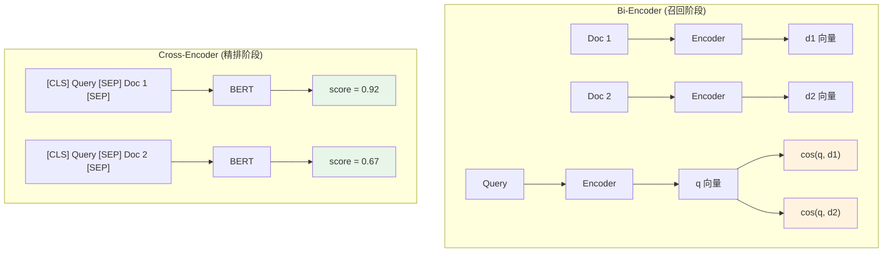

**Reranking 的数学形式**：

Cross-Encoder 将 Query $q$ 和 Doc $d$ 拼接后输入 BERT：

$$\text{score}(q, d) = \sigma(W \cdot h_{[\text{CLS}]})$$

其中 $h_{[\text{CLS}]}$ 是 BERT 输出的 `[CLS]` 向量，$W$ 是线性变换参数，$\sigma$ 是 sigmoid 函数。输出为标量分数，表示查询与文档的相关性。

### 1.8 上下文压缩

检索到的文档通常包含大量与问题无关的信息。上下文压缩（Context Compression）的目标是从文档中提取与查询最相关的部分，减少输入 LLM 的 token 数量。

常见方法：
1. **句子级提取**：用小模型对每个句子评分，只保留高分句子
2. **LLM 摘要**：让 LLM 对每篇文档生成针对当前查询的摘要
3. **Token 剪枝**：直接在 Attention 层面筛选重要 token

---

## 2. RAG 系统架构全景

RAG 技术经历了从简单到复杂的演进过程，按照架构复杂度可以划分为三代：**Naive RAG → Advanced RAG → Modular RAG**。理解这条演进路径，有助于我们在实际项目中根据需求选择合适的架构层级。

### 2.1 三代 RAG 架构演进

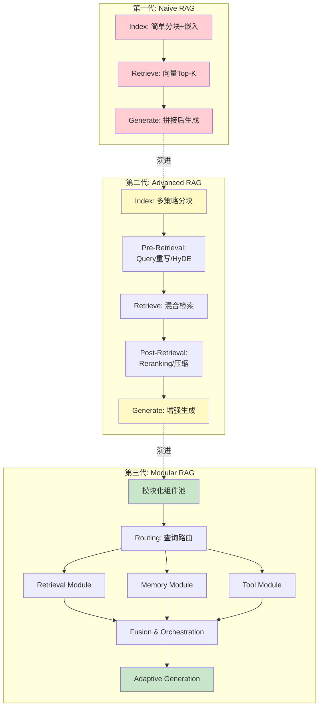

#### Naive RAG 的典型问题

Naive RAG 虽然实现简单，但在生产环境中常常遇到以下瓶颈：

| 问题类别 | 具体表现 | 根本原因 |
|---------|---------|---------|
| **检索质量低** | 返回的文档与问题不相关 | Query 与 Document 的语义鸿沟 |
| **信息冗余** | Top-K 文档内容高度重复 | 缺少去重和多样性控制 |
| **上下文过长** | Prompt 超过模型窗口限制 | 缺少压缩和筛选机制 |
| **答案不忠实** | 模型编造检索中没有的内容 | 缺少忠实度约束 |
| **无法回答全局问题** | "文档讲了哪些主题？"无法回答 | 检索粒度为 chunk，缺少全局视角 |

#### Advanced RAG 的优化策略

Advanced RAG 通过在检索流程的**前、中、后**三个阶段引入优化策略来解决上述问题（详见 1.4-1.8 节）。

#### Modular RAG：面向生产的模块化架构

Modular RAG 是当前 RAG 系统的最新范式，其核心理念是将 RAG 系统拆解为**可插拔的功能模块**，通过编排（Orchestration）实现灵活组合。

**Modular RAG 的核心模块**：

| 模块 | 职责 | 示例实现 |
|------|------|---------|
| **Indexing** | 文档解析、分块、索引构建 | LlamaIndex, Unstructured |
| **Routing** | 查询分类、路由到不同检索路径 | LLM-based Router |
| **Retrieval** | 执行实际的检索操作 | Dense/Sparse/Hybrid/GraphRAG |
| **Reranking** | 对检索结果重排序 | Cross-Encoder, Cohere Rerank |
| **Memory** | 维护对话历史和上下文 | 向量化对话历史 |
| **Generation** | 基于检索结果生成回答 | LLM + Prompt Template |
| **Evaluation** | 评估检索和生成质量 | RAGAS, TruLens |

**Modular RAG 与 Agentic RAG 的关系**：

Modular RAG 为 Agentic RAG 奠定了基础。当 Routing 模块由 LLM Agent 控制时，系统就从"流水线式"升级为"智能体式"——Agent 可以根据中间结果动态决定下一步调用哪个模块、是否需要重新检索、是否需要使用工具等。

### 2.2 RAG 系统全景图

从工程角度，一个完整的 RAG 系统涉及以下技术栈：

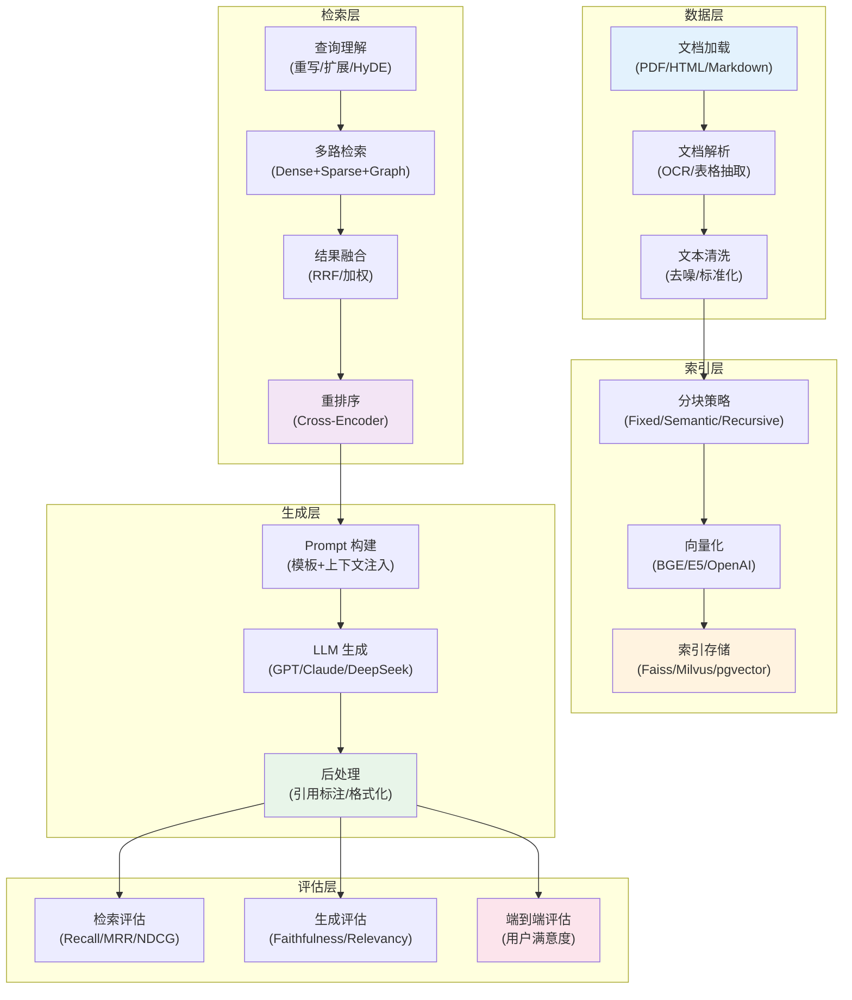

---

## 3. 向量检索算法

### 3.1 稠密检索（Dense Retrieval）

#### 双塔架构（Bi-Encoder）

稠密检索的核心架构是**双塔模型**：Query 和 Document 分别通过各自的编码器映射到同一向量空间，然后用内积或余弦相似度衡量相关性。

$$\text{sim}(q, d) = E_q(q)^T \cdot E_d(d) = \mathbf{q}^T \mathbf{d}$$

其中 $E_q$ 和 $E_d$ 是两个编码器（通常共享参数或独立初始化）。

**为什么叫"双塔"？** 因为 Query 和 Document 各有一个编码器"塔"，它们独立地将输入映射为向量。这个设计使得所有文档的向量可以**离线预计算**并建立索引，在线推理时只需编码 Query 并计算相似度。

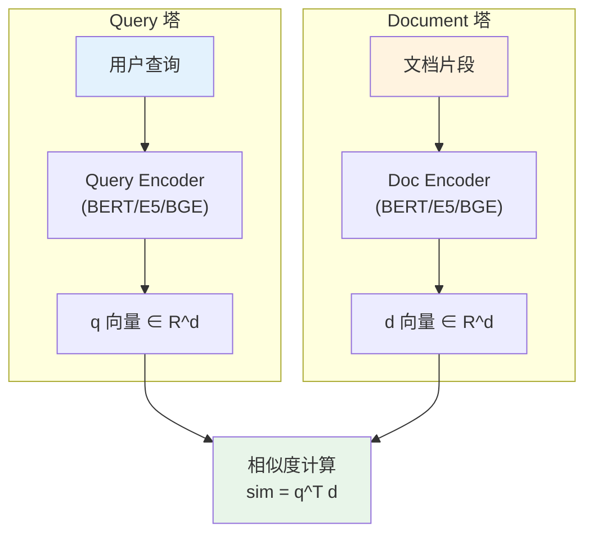

#### 对比学习与 InfoNCE Loss

双塔模型的训练目标是：**让相关的 (query, doc) 对在向量空间中更近，不相关的对更远**。这正是对比学习（Contrastive Learning）的核心思想。

**InfoNCE Loss 推导**：

给定一个 batch 中的 $N$ 个 (query, positive_doc) 对 $\{(q_i, d_i^+)\}_{i=1}^N$，对于第 $i$ 个 query，batch 中其他 query 对应的 doc 作为负样本：

$$\mathcal{L}_{i} = -\log \frac{\exp(\text{sim}(q_i, d_i^+) / \tau)}{\exp(\text{sim}(q_i, d_i^+) / \tau) + \sum_{j \neq i} \exp(\text{sim}(q_i, d_j^+) / \tau)}$$

其中 $\tau$ 是温度参数（通常为 0.05-0.1），控制分布的"锐度"。

整个 batch 的损失：

$$\mathcal{L}_{\text{InfoNCE}} = \frac{1}{N} \sum_{i=1}^{N} \mathcal{L}_i$$

**InfoNCE 与交叉熵的关系**：

InfoNCE 本质上是一个 $N$ 分类的交叉熵损失——第 $i$ 个 query 需要从 $N$ 个候选 doc 中"分类"出正确的 $d_i^+$：

$$\mathcal{L}_i = -\log \text{softmax}(\mathbf{s}_i)[i]$$

其中 $\mathbf{s}_i = [\text{sim}(q_i, d_1^+)/\tau, \text{sim}(q_i, d_2^+)/\tau, \ldots, \text{sim}(q_i, d_N^+)/\tau]$。

**温度参数 $\tau$ 的作用**：

- $\tau \to 0$：分布趋于 one-hot，只关注最难的负样本
- $\tau \to \infty$：分布趋于均匀，所有负样本同等对待
- 实践中 $\tau \in [0.05, 0.1]$，使模型聚焦于"难负样本"（hard negatives）

**难负样本挖掘（Hard Negative Mining）**：

仅使用 batch 内随机负样本效果有限。工业实践中常用 BM25 或上一轮模型检索的高排名但非正例的文档作为"难负样本"，显著提升训练效果。

### 3.2 ANN 近似最近邻算法

#### 暴力搜索的瓶颈

给定 $N$ 个 $d$ 维文档向量，精确的最近邻搜索需要遍历所有向量：

$$\text{NN}(q) = \arg\min_{i \in \{1, \ldots, N\}} \| q - d_i \|_2$$

时间复杂度 $O(Nd)$，当 $N$ 为百万甚至十亿级时不可接受。

#### 近似最近邻（ANN）的核心思想

ANN 牺牲一定的搜索精度，换取数量级的速度提升。常见方法包括：

| 方法 | 核心思想 | 时间复杂度 | 典型实现 |
|------|---------|-----------|---------|
| LSH | 局部敏感哈希 | $O(d \cdot \text{polylog}(N))$ | Annoy |
| IVF | 倒排索引聚类 | $O(d \cdot N/k)$ | Faiss-IVF |
| PQ | 乘积量化 | $O(m \cdot 256)$ | Faiss-PQ |
| **HNSW** | 分层导航小世界图 | $O(d \cdot \log N)$ | Faiss-HNSW, Hnswlib |

本节重点讲解 HNSW，因为它在工业实践中使用最广泛，且兼顾了检索精度和速度。

### 3.3 HNSW（Hierarchical Navigable Small World）

HNSW 是目前最流行的 ANN 算法之一，由 Yuri Malkov 等人于 2018 年提出。它结合了**跳表（Skip List）**的分层思想和**小世界网络（Small World Network）**的导航性质。

#### 3.3.1 核心概念：小世界网络

**小世界网络**是一类特殊的图结构，具有两个关键性质：
1. **高聚集系数**：节点的邻居之间也倾向于互相连接（局部有序）
2. **低平均路径长度**：任意两点之间只需少量跳数即可到达（全局可达）

**类比**：社交网络就是典型的小世界网络——你的朋友彼此认识（高聚集），而"六度分隔"理论说明任意两人之间只需 6 步就能联系上（低平均路径长度）。

**可导航小世界图（NSW）**：

NSW 在小世界网络的基础上增加了**导航性**：通过贪心搜索，可以高效地找到目标节点的近似最近邻。

#### 3.3.2 跳表与分层思想

HNSW 在 NSW 的基础上引入了分层结构，灵感来自跳表（Skip List）：

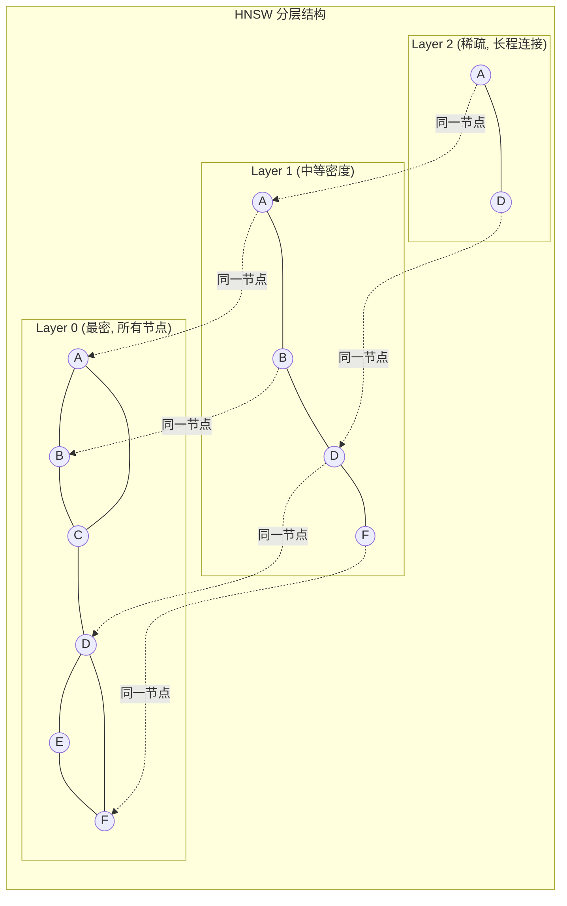

**分层规则**：

- **Layer 0**（底层）：包含所有节点，连接最密集
- **Layer 1, 2, ..., L**（高层）：节点逐层递减，每个节点出现在第 $l$ 层的概率为：

$$P(\text{node at layer } l) = \frac{1}{m_L^l}$$

其中 $m_L$ 是层间缩放因子（常取 $m_L = \ln(M)$，$M$ 为每层最大连接数）。

这意味着最高层只有少数"枢纽"节点，形成稀疏的全局骨架；底层包含所有节点，提供精细的局部搜索。

#### 3.3.3 贪心搜索算法

HNSW 的搜索过程从最高层开始，逐层向下，每层执行贪心搜索：

**算法**：HNSW Search($q$, $K$, $ef$)

```
输入: 查询向量 q, 返回个数 K, 搜索候选集大小 ef
输出: q 的 K 个近似最近邻

1. ep = 入口点 (最高层的一个固定节点)
2. L = ep 的最大层数

   // 阶段1: 从顶层到第1层, 每层贪心找最近的1个点
3. for l = L down to 1:
4.     ep = GREEDY_SEARCH(q, ep, layer=l, ef=1)

   // 阶段2: 在第0层 (最密层) 做更细致的搜索
5. W = GREEDY_SEARCH(q, ep, layer=0, ef=ef)
6. return W 中距离 q 最近的 K 个点
```

**贪心搜索子过程** `GREEDY_SEARCH(q, ep, layer, ef)`:

```
输入: 查询 q, 入口点 ep, 搜索层 layer, 候选集大小 ef
输出: ef 个候选最近邻

1. visited = {ep}
2. candidates = 最小堆, 初始化 = {ep}   // 距离 q 最近的在堆顶
3. results = 最大堆, 初始化 = {ep}       // 距离 q 最远的在堆顶

4. while candidates 非空:
5.     c = candidates 弹出堆顶 (距 q 最近的候选)
6.     f = results 堆顶 (距 q 最远的当前结果)
7.     if dist(c, q) > dist(f, q):
8.         break  // 候选集中最好的也不如当前结果中最差的, 停止

9.     for each neighbor e of c in layer:
10.        if e not in visited:
11.            visited.add(e)
12.            f = results 堆顶
13.            if dist(e, q) < dist(f, q) or |results| < ef:
14.                candidates.push(e)
15.                results.push(e)
16.                if |results| > ef:
17.                    results.pop()  // 移除最远的

18. return results
```

#### 3.3.4 贪心搜索的数学证明

**定理**：在 HNSW 图中，贪心搜索的期望时间复杂度为 $O(\log N)$。

**证明思路**（简化版，基于跳表类比）：

设 HNSW 有 $L = O(\log N)$ 层，每层节点数分别为 $N_0 = N, N_1 = N/m_L, \ldots, N_l = N / m_L^l$。

**Step 1**：最高层 $L$ 的节点数约为常数（$N / m_L^L \approx 1$），因此入口点接近全局"中心"。

**Step 2**：在第 $l$ 层的贪心搜索中，每步至少将距离缩小一个常数因子。设当前最近邻距离为 $d_l$，则经过 $O(1)$ 步贪心搜索后，距离缩小到 $d_l / c$（$c > 1$ 为常数）。

这是因为在 NSW 图中，每个节点有 $M$ 个邻居，覆盖了以该节点为中心的局部区域。贪心搜索选择最近的邻居，相当于在 $M$ 个方向中选择最优的一个。当 $M$ 足够大时，高概率地存在一个邻居比当前节点更接近目标。

**Step 3**：从第 $l$ 层下降到第 $l-1$ 层时，搜索精度提升但范围缩小。总搜索跳数为：

$$T = \sum_{l=0}^{L} t_l$$

其中 $t_l$ 是第 $l$ 层的搜索步数。由于每层 $t_l = O(1)$（贪心搜索快速收敛），总步数：

$$T = O(L) = O(\log N)$$

**每步的距离计算成本为 $O(d)$**（$d$ 维向量的内积），因此总时间复杂度为 $O(d \cdot \log N)$。

#### 3.3.5 插入算法

新向量的插入过程：

1. **随机确定层数**：$l = \lfloor -\ln(\text{rand}()) \cdot m_L \rfloor$，使得高层节点指数递减
2. **搜索插入位置**：从顶层贪心搜索到第 $l$ 层
3. **建立连接**：在第 $0$ 层到第 $l$ 层的每一层，与最近的 $M$ 个节点建立双向连接
4. **连接修剪**：如果某节点的连接数超过 $M_{\max}$，通过启发式方法修剪最远的连接

**插入的复杂度**：与搜索相同，为 $O(d \cdot \log N)$。

#### 3.3.6 HNSW 超参数

| 参数 | 含义 | 典型值 | 影响 |
|------|------|--------|------|
| $M$ | 每层最大连接数 | 16-64 | 越大精度越高，内存和构建时间增加 |
| $ef_{\text{construction}}$ | 构建时的搜索候选集大小 | 200-500 | 越大索引质量越好，构建越慢 |
| $ef_{\text{search}}$ | 搜索时的候选集大小 | 50-200 | 越大搜索精度越高，速度越慢 |
| $m_L$ | 层间缩放因子 | $1/\ln(M)$ | 控制层数分布 |

**精度-速度权衡**：$ef_{\text{search}}$ 是搜索时唯一可调的参数。增大 $ef$ 可以在不重建索引的情况下提升精度，但会降低搜索速度。

### 3.4 其他 ANN 方法简述

#### IVF（Inverted File Index）

1. 用 K-Means 将向量空间划分为 $k$ 个 Voronoi 区域
2. 每个区域维护一个倒排列表
3. 搜索时只遍历查询所在区域及其邻近的 $n_{\text{probe}}$ 个区域

时间复杂度：$O(d \cdot N \cdot n_{\text{probe}} / k)$

#### PQ（Product Quantization）

1. 将 $d$ 维向量切分为 $m$ 个子空间
2. 每个子空间独立做 K-Means（通常 $k=256$），用 1 个字节的码本 ID 表示
3. 原始 $d \times 4$ 字节压缩为 $m$ 字节

**压缩率**：$d \times 4 / m$（如 $d=768, m=64$ 时压缩 48 倍）

---

## 4. 稀疏检索与混合搜索

### 4.1 BM25 算法

BM25（Best Matching 25）是最经典的稀疏检索算法，本质上是 TF-IDF 的概率改进版。

#### TF-IDF 回顾

$$\text{TF-IDF}(t, d, D) = \text{TF}(t, d) \times \text{IDF}(t, D)$$

其中：
- $\text{TF}(t, d)$：词 $t$ 在文档 $d$ 中的词频
- $\text{IDF}(t, D) = \log \frac{|D|}{|\{d \in D : t \in d\}|}$：逆文档频率

**TF-IDF 的问题**：
1. TF 线性增长——词频加倍，权重也加倍（但信息量并非线性增加）
2. 不考虑文档长度（长文档天然 TF 更高）

#### BM25 公式推导

BM25 对 TF-IDF 的改进基于概率检索模型。给定查询 $Q = \{t_1, t_2, \ldots, t_n\}$：

$$\text{BM25}(Q, d) = \sum_{i=1}^{n} \text{IDF}(t_i) \cdot \frac{f(t_i, d) \cdot (k_1 + 1)}{f(t_i, d) + k_1 \cdot (1 - b + b \cdot \frac{|d|}{avgdl})}$$

其中：
- $f(t_i, d)$：词 $t_i$ 在文档 $d$ 中的词频
- $|d|$：文档长度（词数）
- $avgdl$：语料库中文档的平均长度
- $k_1$：TF 饱和参数（通常 $k_1 \in [1.2, 2.0]$）
- $b$：长度归一化参数（通常 $b = 0.75$）

**BM25 的 IDF 公式**（Lucene 变体，确保非负）：

$$\text{IDF}(t) = \ln \left(1 + \frac{N - n(t) + 0.5}{n(t) + 0.5}\right)$$

其中 $N$ 是文档总数，$n(t)$ 是包含词 $t$ 的文档数。

**关键改进解析**：

**1. TF 饱和（Saturation）**：

$$\text{TF}_{\text{BM25}} = \frac{f(t, d) \cdot (k_1 + 1)}{f(t, d) + k_1}$$

当 $f \to \infty$ 时，$\text{TF}_{\text{BM25}} \to k_1 + 1$（上界）。这防止了高频词主导评分。

- $k_1 = 0$：不考虑词频，退化为二值模型
- $k_1 \to \infty$：退化为原始 TF

**2. 文档长度归一化**：

$$k_1 \cdot \left(1 - b + b \cdot \frac{|d|}{avgdl}\right)$$

- $b = 0$：不做长度归一化
- $b = 1$：完全按比例归一化
- $b = 0.75$（默认）：部分归一化，长文档有轻微惩罚

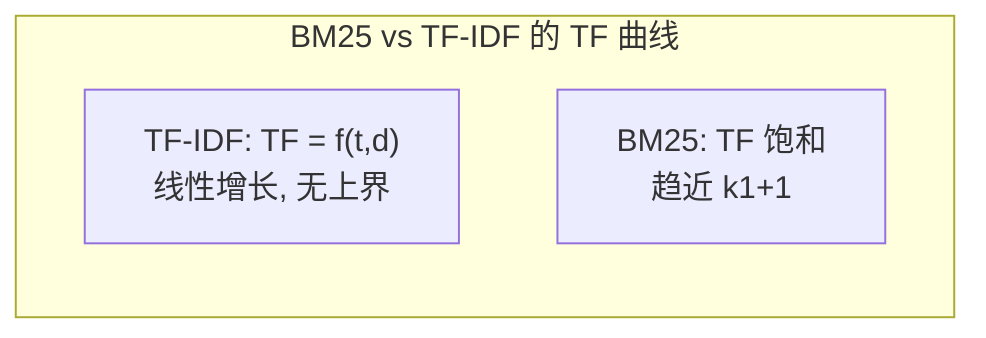

### 4.2 为什么关键词匹配依然重要？

即使在深度学习时代，BM25 等稀疏检索方法仍不可替代，原因在于：

1. **精确匹配能力**：专有名词（如"GPT-4o"、"DeepSeek-V3"）在语义模型中可能被错误地映射到近义但不同的实体。BM25 的词级精确匹配不会犯这类错误。
2. **零样本泛化**：BM25 无需训练，对任何新领域都能即时工作。
3. **可解释性**：BM25 的得分可以追溯到具体的匹配词项，便于调试。
4. **计算效率**：基于倒排索引，BM25 非常高效。

**语义检索的互补优势**：
- 能处理同义词和释义（如"大模型" vs "LLM"）
- 能理解抽象查询（如"如何提升模型效果"）
- 能跨语言检索

### 4.3 混合搜索（Hybrid Search）

混合搜索结合了稀疏检索（BM25）和稠密检索（向量搜索）的优势。

**架构**：

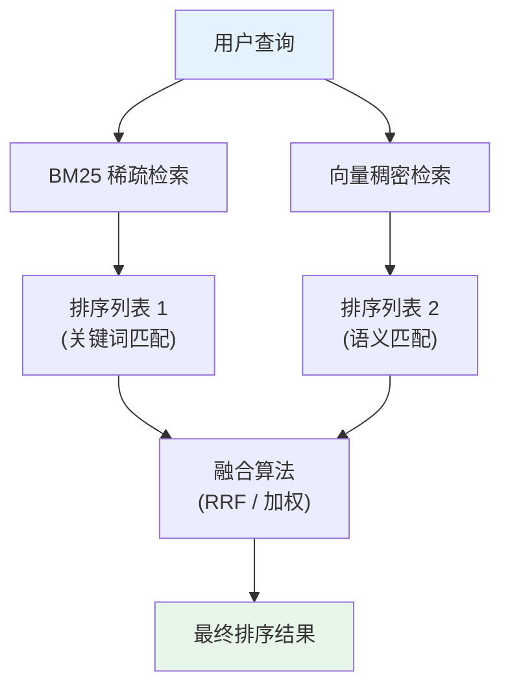

### 4.4 倒数排名融合（RRF）

RRF（Reciprocal Rank Fusion）是一种简单而有效的排序融合算法。

**RRF 公式**：

$$\text{RRF}(d) = \sum_{r \in R} \frac{1}{k + \text{rank}_r(d)}$$

其中：
- $R$ 是多个排序列表的集合
- $\text{rank}_r(d)$ 是文档 $d$ 在排序列表 $r$ 中的排名（从 1 开始）
- $k$ 是平滑常数（通常 $k = 60$）

**为什么 RRF 有效？**

1. **无需分数归一化**：不同检索系统的分数范围可能差异极大（BM25 分数可能是 0-30，余弦相似度是 -1 到 1）。RRF 只使用排名信息，天然回避了分数归一化问题。
2. **对异常值鲁棒**：排名变化范围有限（1 到 $N$），不会因为单个检索器的极端分数而扭曲结果。
3. **高排名文档权重更大**：$1/(k + \text{rank})$ 是一个递减函数，排名越靠前的文档贡献越大。

**RRF 示例**：

假设有两个检索器，$k = 60$：

| 文档 | BM25 排名 | 向量排名 | RRF 分数 |
|------|----------|---------|---------|
| Doc A | 1 | 5 | $\frac{1}{61} + \frac{1}{65} = 0.0318$ |
| Doc B | 3 | 2 | $\frac{1}{63} + \frac{1}{62} = 0.0320$ |
| Doc C | 2 | 8 | $\frac{1}{62} + \frac{1}{68} = 0.0308$ |

最终排序：Doc B > Doc A > Doc C。Doc B 因为在两个列表中都排名靠前，所以 RRF 分数最高。

**加权 RRF**：

当不同检索器的可靠性不同时，可以引入权重：

$$\text{RRF}_w(d) = \sum_{r \in R} w_r \cdot \frac{1}{k + \text{rank}_r(d)}$$

其中 $w_r$ 是第 $r$ 个检索器的权重。

---

## 5. 检索策略深度对比

在实际 RAG 系统中，选择正确的检索策略至关重要。本节系统对比 Dense Retrieval、Sparse Retrieval 和 Hybrid Retrieval 三大策略，并深入分析 BM25 + Embedding 融合的工程实践。

### 5.1 三大检索策略全面对比

| 维度 | Dense Retrieval（稠密检索） | Sparse Retrieval（稀疏检索） | Hybrid Retrieval（混合检索） |
|------|---------------------------|---------------------------|---------------------------|
| **核心原理** | 语义向量相似度 | 词项精确匹配（TF-IDF/BM25） | 融合语义+词项匹配 |
| **表示方式** | 低维稠密向量（768/1024维） | 高维稀疏向量（词表大小维） | 两种表示并行 |
| **同义词处理** | 强（"大模型"≈"LLM"） | 弱（必须精确匹配） | 强 |
| **专有名词** | 弱（可能误匹配近义词） | 强（精确匹配"GPT-4o"） | 强 |
| **零样本泛化** | 依赖预训练质量 | 天然零样本 | 兼具两者优势 |
| **索引大小** | 中（N * d * 4 bytes） | 小（倒排索引，稀疏存储） | 大（两套索引） |
| **查询延迟** | 中（ANN搜索） | 低（倒排索引查找） | 较高（两路检索+融合） |
| **训练数据需求** | 需要标注数据微调 | 无需训练 | 稠密部分需要训练 |
| **可解释性** | 低（向量黑箱） | 高（可追溯匹配词项） | 中 |

### 5.2 Dense Retrieval 的失败模式分析

稠密检索在以下场景中容易失败，理解这些失败模式有助于决定何时需要引入稀疏检索或混合检索：

**场景 1：专有名词和缩写**

```
查询: "DeepSeek-V3 的 MLA 架构"
期望文档: "DeepSeek-V3 使用 Multi-head Latent Attention (MLA)..."
Dense 检索结果: "Multi-Query Attention 在 GPT 系列中的应用..."  (错误!)
BM25 检索结果: "DeepSeek-V3 使用 Multi-head Latent Attention (MLA)..."  (正确!)
```

**原因**：Embedding 模型将 "MLA" 映射到与 "Multi-Query Attention" 相近的语义空间，但词项级别的精确匹配可以避免这类混淆。

**场景 2：长尾实体**

```
查询: "BGE-M3 在 MTEB 排行榜上的分数"
Dense 检索结果: "各种 Embedding 模型在 MTEB 上的评测方法论..."  (不够精确)
BM25 检索结果: "BGE-M3 在 MTEB 排行榜上的 average score 为 66.13..."  (精确匹配)
```

**场景 3：否定语义**

```
查询: "不使用 Flash Attention 的 Transformer 实现"
Dense 检索结果: "Flash Attention 在 Transformer 中的高效实现..."  (语义相近但意图相反!)
```

稠密检索对否定词的语义理解能力有限，因为 "使用 Flash Attention" 和 "不使用 Flash Attention" 在向量空间中非常接近。

### 5.3 BM25 + Embedding 融合策略

在工业实践中，BM25 和 Embedding 的融合不仅限于简单的 RRF，还有更精细的策略：

#### 策略 1：分数归一化融合（Score-level Fusion）

$$\text{score}_{\text{hybrid}}(d) = \alpha \cdot \text{norm}(\text{score}_{\text{BM25}}(d)) + (1-\alpha) \cdot \text{norm}(\text{score}_{\text{dense}}(d))$$

其中归一化函数常用 min-max normalization：

$$\text{norm}(s) = \frac{s - s_{\min}}{s_{\max} - s_{\min}}$$

**$\alpha$ 的选择**：
- $\alpha = 0.5$：等权融合（默认起点）
- $\alpha > 0.5$：偏向关键词匹配（适合专业领域、精确查询）
- $\alpha < 0.5$：偏向语义匹配（适合口语化查询、跨语言场景）

#### 策略 2：级联融合（Cascade Fusion）

$$\text{candidates} = \text{BM25\_TopK1}(q) \cup \text{Dense\_TopK2}(q) \xrightarrow{\text{Reranker}} \text{Final\_TopK}$$

先用两路检索各自召回一批候选文档，再用 Cross-Encoder Reranker 统一精排。这种方式的优势是：Reranker 可以学会在不同场景下自适应地加权两路检索的贡献。

#### 策略 3：条件路由（Conditional Routing）

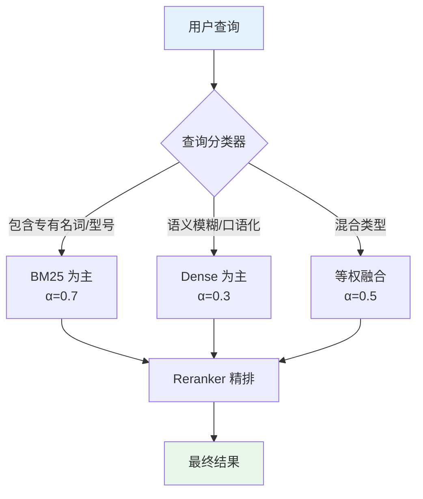

条件路由的核心是训练一个**查询分类器**，根据查询的特征（是否包含实体名、是否为问句、是否包含否定词等）自动选择最优的融合权重。

### 5.4 Embedding 模型选型指南

稠密检索的质量高度依赖 Embedding 模型的选择。以下是 2024-2025 年主流 Embedding 模型的对比：

| 模型 | 维度 | 最大长度 | 多语言 | MTEB 均分 | 适用场景 |
|------|------|---------|--------|-----------|---------|
| **BGE-M3** (BAAI) | 1024 | 8192 | 100+ 语言 | ~66 | 多语言、长文本 |
| **E5-Mistral-7B** | 4096 | 32768 | 多语言 | ~67 | 高精度场景 |
| **GTE-Qwen2** (Alibaba) | 768 | 8192 | 中英 | ~65 | 中文场景 |
| **text-embedding-3-large** (OpenAI) | 3072 | 8191 | 多语言 | ~65 | 商业API调用 |
| **voyage-3** (Voyage AI) | 1024 | 32000 | 多语言 | ~67 | 代码检索 |
| **Cohere embed-v3** | 1024 | 512 | 100+ 语言 | ~65 | 商业多语言 |

**选型建议**：
1. **中文为主**：优先考虑 BGE-M3 或 GTE-Qwen2（中文语料训练充分）
2. **多语言/跨语言**：BGE-M3（支持 100+ 语言，且支持稀疏+稠密混合表示）
3. **高精度要求**：E5-Mistral-7B（基于 LLM 的 Embedding，精度最高但推理成本大）
4. **长文档**：E5-Mistral-7B 或 BGE-M3（支持 8K-32K 长度）
5. **低成本/快速原型**：OpenAI text-embedding-3-small（API 方便，成本低）

---

## 6. Chunk 策略工程实践

文档分块（Chunking）是 RAG 系统中最容易被忽视但影响深远的环节。分块策略直接决定了检索的粒度和质量——chunk 太大，检索噪声增多；chunk 太小，丢失上下文语义。

### 6.1 分块策略全景

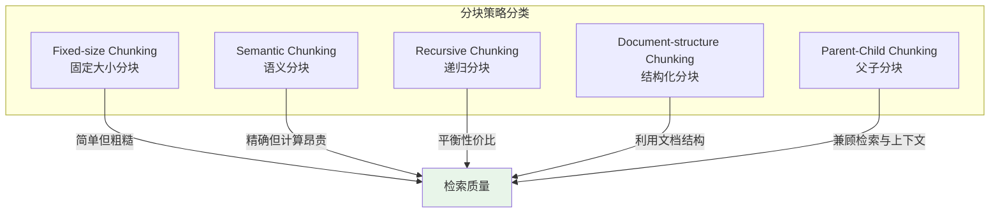

### 6.2 Fixed-size Chunking（固定大小分块）

最简单的分块策略：按固定 token 数（或字符数）切分文档。

**参数**：
- `chunk_size`：每个 chunk 的 token 数（常见 256/512/1024）
- `chunk_overlap`：相邻 chunk 的重叠 token 数（常见 50-200）

```python
def fixed_size_chunk(text: str, chunk_size: int = 512, overlap: int = 128) -> list[str]:
    """
    固定大小分块

    参数:
        text: 输入文本
        chunk_size: 每个chunk的token数
        overlap: 相邻chunk的重叠token数
    返回:
        分块后的文本列表
    """
    # 简单按字符分块(实际应用中应使用tokenizer)
    chunks = []
    start = 0
    while start < len(text):
        end = start + chunk_size
        chunks.append(text[start:end])
        start = end - overlap  # 向后退overlap个字符，保证重叠
    return chunks
```

**Overlap 的作用**：

假设一个关键信息恰好位于两个 chunk 的边界处：

```
Chunk 1: "...Transformer 使用的位置编码方法是"
Chunk 2: "正弦余弦函数, 具体公式为..."
```

如果没有 overlap，这条信息被割裂，两个 chunk 都无法独立回答"Transformer 使用什么位置编码"。引入 overlap 后：

```
Chunk 1: "...Transformer 使用的位置编码方法是正弦余弦函数, 具体"
Chunk 2: "位置编码方法是正弦余弦函数, 具体公式为..."
```

两个 chunk 都包含完整信息。

**固定大小分块的缺陷**：
- 可能在句子中间切断，破坏语义完整性
- 不同类型的内容（代码、公式、叙述文本）可能需要不同的 chunk 大小
- 无法感知文档的逻辑结构（章节、段落）

### 6.3 Semantic Chunking（语义分块）

语义分块的核心思想是：**在语义断点处切分**，而不是在固定位置切分。

**算法流程**：

1. 将文档按句子切分
2. 计算每个句子的 Embedding 向量
3. 计算相邻句子之间的余弦相似度
4. 当相邻句子的相似度**低于阈值**时，在此处切分

$$\text{split at position } i \iff \text{sim}(E(s_i), E(s_{i+1})) < \theta$$

```python
import numpy as np

def semantic_chunk(sentences: list[str], embeddings: np.ndarray,
                   threshold: float = 0.5, min_chunk_size: int = 3) -> list[list[str]]:
    """
    语义分块: 在语义断点处切分

    参数:
        sentences: 句子列表
        embeddings: 每个句子的embedding向量, shape=(n, d)
        threshold: 相似度阈值, 低于此值则切分
        min_chunk_size: 最小chunk包含的句子数
    返回:
        分块后的句子组列表
    """
    # 计算相邻句子的余弦相似度
    similarities = []
    for i in range(len(embeddings) - 1):
        cos_sim = np.dot(embeddings[i], embeddings[i+1]) / (
            np.linalg.norm(embeddings[i]) * np.linalg.norm(embeddings[i+1]) + 1e-8
        )
        similarities.append(cos_sim)

    # 在相似度低谷处切分
    chunks = []
    current_chunk = [sentences[0]]
    for i, sim in enumerate(similarities):
        if sim < threshold and len(current_chunk) >= min_chunk_size:
            chunks.append(current_chunk)
            current_chunk = [sentences[i+1]]
        else:
            current_chunk.append(sentences[i+1])

    if current_chunk:
        chunks.append(current_chunk)

    return chunks
```

**优势**：切分点与语义边界对齐，chunk 内部语义连贯。

**劣势**：需要对每个句子计算 Embedding，计算成本较高；阈值 $\theta$ 需要调优。

### 6.4 Recursive Chunking（递归分块）

递归分块是 LangChain 等框架的默认策略，核心思想是**按文档结构的层级递归切分**：

```
分隔符优先级: "\n\n" (段落) > "\n" (换行) > ". " (句子) > " " (单词)
```

**算法**：
1. 先尝试用最高优先级的分隔符（段落分隔）切分
2. 如果得到的 chunk 仍然超过 `chunk_size`，用下一级分隔符继续切分
3. 递归直到所有 chunk 都不超过 `chunk_size`

```python
def recursive_chunk(text: str, chunk_size: int = 512,
                    separators: list[str] = None) -> list[str]:
    """
    递归分块: 按结构层级逐步细化

    参数:
        text: 输入文本
        chunk_size: 最大chunk大小(字符数)
        separators: 分隔符列表, 按优先级从高到低
    返回:
        分块后的文本列表
    """
    if separators is None:
        separators = ["\n\n", "\n", ". ", " "]

    # 如果文本已经足够短, 直接返回
    if len(text) <= chunk_size:
        return [text]

    # 尝试用当前最高优先级的分隔符切分
    for i, sep in enumerate(separators):
        if sep in text:
            parts = text.split(sep)
            chunks = []
            current = ""
            for part in parts:
                # 尝试合并
                candidate = current + sep + part if current else part
                if len(candidate) <= chunk_size:
                    current = candidate
                else:
                    if current:
                        chunks.append(current)
                    # 如果单个part就超过chunk_size, 用下一级分隔符继续切分
                    if len(part) > chunk_size:
                        sub_chunks = recursive_chunk(part, chunk_size, separators[i+1:])
                        chunks.extend(sub_chunks)
                        current = ""
                    else:
                        current = part
            if current:
                chunks.append(current)
            return chunks

    # 所有分隔符都用完了, 强制按chunk_size切分
    return [text[i:i+chunk_size] for i in range(0, len(text), chunk_size)]
```

### 6.5 Chunk Size 对检索质量的影响

Chunk size 是 RAG 系统中最关键的超参数之一。过大或过小都会损害检索和生成质量。

**Chunk Size 与检索精度的关系**：

| Chunk Size | 检索精度 | 上下文完整性 | 噪声比例 | 适用场景 |
|-----------|---------|------------|---------|---------|
| **128-256** tokens | 高 | 低 | 低 | 精确事实查找 |
| **512** tokens | 中高 | 中 | 中 | 通用问答（推荐默认值） |
| **1024** tokens | 中 | 高 | 中高 | 需要上下文推理的问答 |
| **2048+** tokens | 低 | 很高 | 高 | 长文档理解、摘要任务 |

**经验法则**：

$$\text{最优 Chunk Size} \approx \text{平均答案长度} \times 2$$

即 chunk 应该大约是答案长度的 2 倍——足够包含答案及其上下文，但不至于引入过多无关内容。

**Chunk Size 调优实验设计**：

1. 准备一组标注的 (query, ground_truth_doc) 测试集
2. 分别用 128、256、512、1024、2048 的 chunk size 构建索引
3. 对每个 chunk size 计算 Recall@5 和 Recall@10
4. 绘制 chunk size vs recall 曲线，找到最优点

```python
def evaluate_chunk_sizes(documents: list[str], test_queries: list[dict],
                         chunk_sizes: list[int] = [128, 256, 512, 1024, 2048]) -> dict:
    """
    评估不同chunk size对检索质量的影响

    参数:
        documents: 文档列表
        test_queries: 测试查询, 每个包含question和ground_truth_doc_id
        chunk_sizes: 待测试的chunk size列表
    返回:
        每个chunk size对应的评估指标
    """
    results = {}
    for size in chunk_sizes:
        # 1. 按当前chunk size分块
        chunks = []
        for doc in documents:
            chunks.extend(fixed_size_chunk(doc, chunk_size=size, overlap=size // 4))

        # 2. 构建索引(伪代码)
        # index = build_vector_index(chunks, embedding_model)

        # 3. 检索并计算指标
        recall_at_5 = 0
        recall_at_10 = 0
        for query in test_queries:
            # retrieved = index.search(query["question"], top_k=10)
            # recall_at_5 += compute_recall(retrieved[:5], query["ground_truth"])
            # recall_at_10 += compute_recall(retrieved[:10], query["ground_truth"])
            pass

        results[size] = {
            "recall@5": recall_at_5 / len(test_queries),
            "recall@10": recall_at_10 / len(test_queries),
            "num_chunks": len(chunks),
            "avg_chunk_length": sum(len(c) for c in chunks) / len(chunks)
        }

    return results
```

### 6.6 Parent-Child Chunking（父子分块）

Parent-Child Chunking 是一种巧妙的"分离检索粒度与生成粒度"的策略：

- **子 chunk（小粒度）**：用于检索（精确匹配查询）
- **父 chunk（大粒度）**：用于生成（提供充分上下文）

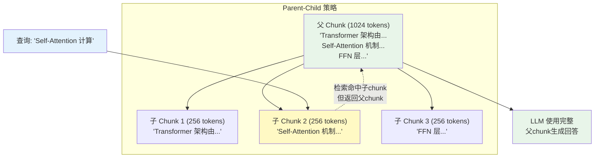

**工作流程**：
1. 同时创建大（父）和小（子）两套 chunk
2. 建立子 chunk 到父 chunk 的映射关系
3. 检索时用小 chunk 进行精确匹配
4. 命中后返回对应的大 chunk 给 LLM

这种策略有效解决了"检索粒度"与"生成粒度"之间的矛盾。

---

## 7. GraphRAG：基于知识图谱的 RAG

### 7.1 动机：全局问题的挑战

传统向量 RAG 在处理"局部问题"时表现优秀（如"HNSW 的时间复杂度是多少？"），但在面对"全局问题"时力不从心。

**全局问题（Global Questions）示例**：
- "这篇报告中提到了哪些关键的技术趋势？"
- "不同章节之间有什么共同主题？"
- "文中所有人物之间的关系是什么？"

**为什么向量 RAG 难以处理全局问题？**

向量检索是基于**局部相似度**的：每个 chunk 独立编码，检索时找到的是与查询最相似的片段。但全局问题需要**跨文档的归纳推理**，单个 chunk 无法回答这类问题。

### 7.2 GraphRAG 架构总览

GraphRAG（由 Microsoft 提出）通过构建知识图谱来增强 RAG 的全局推理能力。

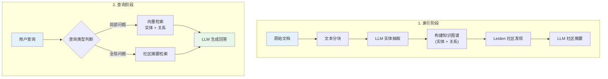

### 7.3 实体与关系抽取

GraphRAG 使用 LLM 从文本中抽取实体和关系，构建知识图谱。

**Prompt 设计**（简化版）：

```
你是一个信息抽取专家。请从以下文本中抽取实体和关系。

实体格式: (实体名, 实体类型, 实体描述)
关系格式: (实体1, 实体2, 关系描述, 关系强度)

文本:
{text_chunk}

请抽取所有有意义的实体和关系:
```

**示例输入**：

> "Transformer 由 Vaswani 等人在 2017 年的论文 'Attention is All You Need' 中提出。它使用自注意力机制取代了 RNN 的循环结构，成为 GPT 和 BERT 等模型的基础架构。"

**示例输出**：

实体：
- (Transformer, 技术, 一种基于自注意力机制的神经网络架构)
- (Vaswani, 人物, Transformer 论文的第一作者)
- (Attention is All You Need, 论文, 提出 Transformer 架构的开创性论文)
- (GPT, 模型, 基于 Transformer 的自回归语言模型)
- (BERT, 模型, 基于 Transformer 的双向语言模型)
- (RNN, 技术, 循环神经网络)

关系：
- (Vaswani, Transformer, 提出了, 强)
- (Transformer, GPT, 是...的基础架构, 强)
- (Transformer, BERT, 是...的基础架构, 强)
- (Transformer, RNN, 取代了, 强)

### 7.4 社区发现：Leiden 算法

在构建完知识图谱后，GraphRAG 使用**社区发现算法**将图中紧密相连的节点分为社区。这些社区通常对应着一个"主题"或"子话题"。

#### Leiden 算法原理

Leiden 算法是 Louvain 算法的改进版本，目标是最大化**模块度（Modularity）**：

$$Q = \frac{1}{2m} \sum_{ij} \left[ A_{ij} - \frac{k_i k_j}{2m} \right] \delta(c_i, c_j)$$

其中：
- $A_{ij}$：邻接矩阵元素（节点 $i$ 和 $j$ 之间的边权）
- $k_i = \sum_j A_{ij}$：节点 $i$ 的度数
- $m = \frac{1}{2} \sum_{ij} A_{ij}$：图的总边权
- $c_i$：节点 $i$ 所属的社区
- $\delta(c_i, c_j)$：当 $c_i = c_j$ 时为 1，否则为 0

**模块度的直觉**：$Q$ 衡量"社区内部的边密度"相对于"随机图期望边密度"的超出程度。$Q > 0$ 说明社区结构比随机更紧密。

**Leiden 相对 Louvain 的改进**：

1. **保证连通性**：Louvain 可能产生不连通的社区，Leiden 通过"精炼步骤"修复
2. **更快收敛**：Leiden 在局部移动阶段使用随机近邻选择，减少无效迭代
3. **更高质量**：Leiden 的精炼步骤通常能找到模块度更高的划分

**Leiden 算法流程**：

```
1. 初始化: 每个节点自成一个社区
2. 重复直到收敛:
   a. 局部移动: 将每个节点移动到使模块度增益最大的邻居社区
   b. 精炼: 在每个社区内部进一步细分, 确保社区连通性
   c. 聚合: 将每个社区缩为一个超级节点, 构建新图
   d. 在新图上重复 a-c
```

#### 层级式社区发现

GraphRAG 利用 Leiden 算法的**多层级**特性：

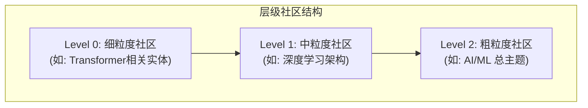

不同层级的社区适合回答不同粒度的问题：
- **细粒度**："Transformer 使用了什么位置编码？"
- **中粒度**："深度学习中有哪些主流架构？"
- **粗粒度**："AI 领域有哪些关键技术趋势？"

### 7.5 社区摘要与答案合成

**社区摘要**是 GraphRAG 回答全局问题的关键：为每个社区生成一段描述其核心主题的摘要。

**摘要生成 Prompt**：

```
以下是一组相关的实体和关系,它们构成了一个主题社区。
请生成一段简洁的摘要,描述这个社区的核心主题和关键信息。

实体:
{entity_list}

关系:
{relationship_list}

社区摘要:
```

**答案合成的 Map-Reduce 模式**：

当面对全局问题时，GraphRAG 对所有（或部分）社区摘要执行 Map-Reduce：

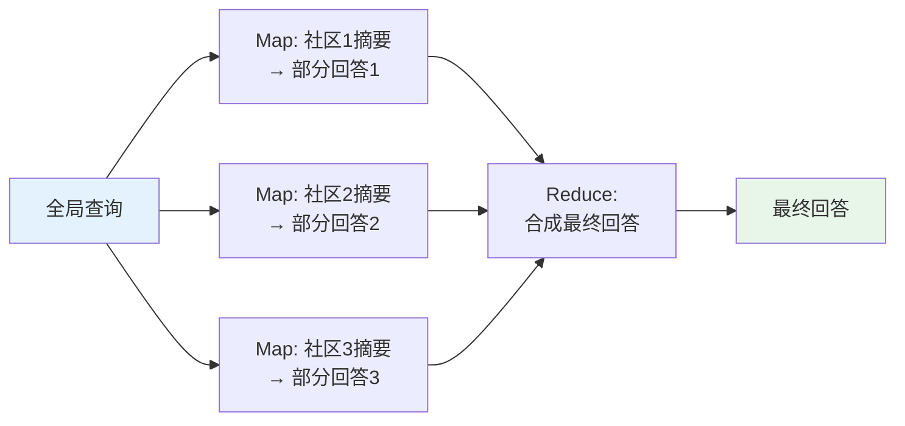

### 7.6 GraphRAG vs Vector RAG 对比

| 维度 | Vector RAG | GraphRAG |
|------|-----------|----------|
| 检索单位 | 文本 chunk | 实体、关系、社区摘要 |
| 适合问题 | 局部事实性问题 | 全局归纳性问题 |
| 索引构建 | 简单（编码 + 存储） | 复杂（LLM 抽取 + 建图 + 社区发现） |
| 索引成本 | 低 | 高（需大量 LLM 调用） |
| 更新成本 | 低（增量追加） | 高（可能需重新社区发现） |
| 可解释性 | 低（向量相似度） | 高（实体和关系可追溯） |
| 覆盖率 | 局部覆盖 | 全局覆盖 |

**实践建议**：在实际系统中，Vector RAG 和 GraphRAG 通常**互补使用**：

- 先判断查询类型（局部 vs 全局）
- 局部问题走向量检索路径
- 全局问题走社区摘要路径
- 也可以两条路径并行，最后融合结果

---

## 8. RAG 评估框架

RAG 系统的评估是一个独立且重要的话题。与传统 NLP 任务不同，RAG 系统需要同时评估**检索质量**和**生成质量**，以及两者之间的**协同效果**。

### 8.1 RAGAS 评估框架

RAGAS（Retrieval Augmented Generation Assessment）是目前最流行的 RAG 评估框架，提出了四个核心指标，覆盖了 RAG 系统的各个环节。

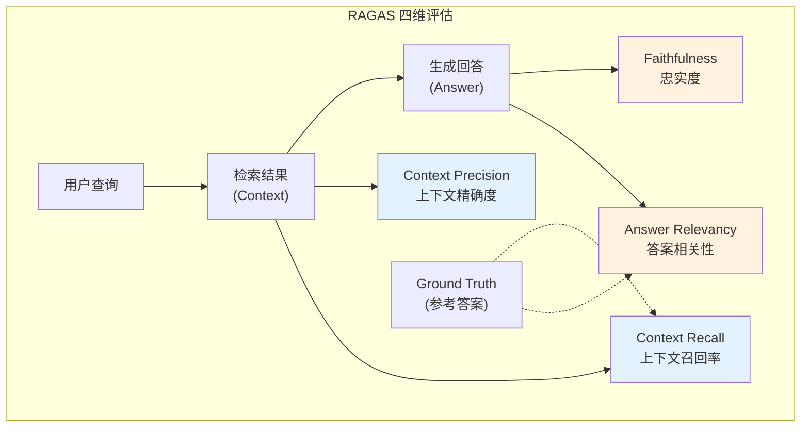

#### Faithfulness（忠实度）

**定义**：生成的回答中每个事实性声明是否都能在检索到的上下文中找到支持。

$$\text{Faithfulness} = \frac{|\text{有上下文支持的声明}|}{|\text{回答中所有事实性声明}|}$$

**计算步骤**：
1. 用 LLM 将回答拆分为独立的事实性声明（claims）
2. 对每个声明，判断是否能从检索到的上下文中推导出来
3. 计算有支持的声明占比

**示例**：

```
上下文: "HNSW 算法的搜索时间复杂度为 O(log N), 由 Malkov 等人于 2018 年提出。"
回答: "HNSW 是一种高效的近似最近邻算法, 时间复杂度为 O(log N),
      被广泛用于 Faiss 和 Milvus 等向量数据库中。"

声明拆分:
1. "HNSW 是近似最近邻算法" -> 上下文支持 (可推导) ✓
2. "时间复杂度为 O(log N)" -> 上下文支持 ✓
3. "被 Faiss 和 Milvus 使用" -> 上下文未提及 ✗

Faithfulness = 2/3 = 0.667
```

**Faithfulness 低意味着什么？** 模型在"编造"检索上下文中不存在的信息（幻觉）。

#### Answer Relevancy（答案相关性）

**定义**：生成的回答是否与用户查询相关。

**计算方法**：用 LLM 从回答中生成 $n$ 个"可能的原始问题"，然后计算这些问题与真实查询的平均相似度：

$$\text{Answer Relevancy} = \frac{1}{n} \sum_{i=1}^{n} \text{sim}(E(q), E(\hat{q}_i))$$

其中 $\hat{q}_i$ 是从回答反推出的第 $i$ 个问题，$E(\cdot)$ 是 Embedding 函数。

**直觉**：如果回答切题，那么从回答反推出的问题应该与原始问题高度相似。

#### Context Precision（上下文精确度）

**定义**：检索到的上下文中，与回答相关的内容占比。

$$\text{Context Precision} = \frac{1}{K} \sum_{k=1}^{K} \frac{\text{Precision@k} \times \text{rel}(k)}{\sum_{i=1}^{k} \text{rel}(i)}$$

其中 $\text{rel}(k)$ 表示第 $k$ 个检索结果是否相关（0 或 1）。

**Context Precision 低意味着什么？** 检索到了太多不相关的文档，浪费了 LLM 的上下文窗口。

#### Context Recall（上下文召回率）

**定义**：参考答案中的信息是否都能在检索到的上下文中找到。

$$\text{Context Recall} = \frac{|\text{能从上下文推导的参考答案句子}|}{|\text{参考答案中所有句子}|}$$

**Context Recall 低意味着什么？** 检索遗漏了关键信息，导致 LLM 没有足够的依据生成正确回答。

### 8.2 其他评估指标

除了 RAGAS 的四个核心指标外，工业实践中还常用以下评估方法：

#### 检索阶段指标

| 指标 | 公式 | 含义 |
|------|------|------|
| **Recall@K** | $\frac{\|\text{Top-K} \cap \text{Relevant}\|}{\|\text{Relevant}\|}$ | Top-K 中包含了多少相关文档 |
| **MRR** | $\frac{1}{\|Q\|}\sum_{i=1}^{\|Q\|} \frac{1}{\text{rank}_i}$ | 第一个相关文档的平均排名倒数 |
| **NDCG@K** | $\frac{\text{DCG@K}}{\text{IDCG@K}}$ | 归一化折损累积增益，考虑排序质量 |
| **MAP** | $\frac{1}{\|Q\|}\sum_{q} \text{AvgPrec}(q)$ | 平均精度均值 |

#### 生成阶段指标

| 指标 | 方法 | 适用场景 |
|------|------|---------|
| **LLM-as-Judge** | 用 GPT-4 等强模型评分 | 开放式问答 |
| **BLEU/ROUGE** | n-gram 重合度 | 有标准答案的摘要/翻译 |
| **人工评估** | 标注员打分 | 金标准，但成本高 |
| **A/B Test** | 线上对比实验 | 最终产品质量验证 |

### 8.3 端到端评估实践

一个完整的 RAG 评估流程应该覆盖以下步骤：

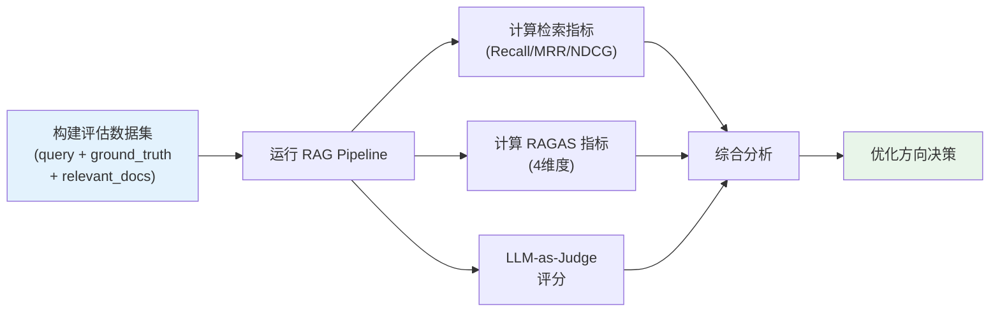

**评估数据集构建建议**：

1. **规模**：至少 50-100 个 query-answer 对（统计显著性）
2. **覆盖度**：包含简单事实问题、复杂推理问题、全局归纳问题
3. **难度梯度**：包含"简单检索即可回答"到"需要跨文档推理"的问题
4. **边界案例**：包含知识库中不存在答案的问题（测试模型是否会编造）

---

## 9. 三条技术线的 RAG 实践

### 9.1 Google：REALM 与 RETRO

#### REALM：检索增强预训练

REALM（Retrieval-Augmented Language Model Pre-Training, 2020）是 Google 提出的开创性工作，将检索机制直接融入预训练阶段。

**核心创新**：不仅在推理时检索，而是在**预训练阶段就学习如何检索**。检索器和生成器端到端联合训练。

**REALM 的数学形式**：

对于一个被掩码的文本 $x$，需要预测掩码位置的 token $y$：

$$P(y \mid x) = \sum_{z \in \mathcal{Z}} P(y \mid x, z) \cdot P(z \mid x)$$

其中 $\mathcal{Z}$ 是文档库，$P(z \mid x)$ 由检索器定义：

$$P(z \mid x) = \frac{\exp(f(x, z))}{\sum_{z'} \exp(f(x, z'))}$$

$$f(x, z) = \text{Embed}_{query}(x)^T \cdot \text{Embed}_{doc}(z)$$

**训练挑战**：对所有文档 $z$ 求和是不可行的（文档数可达百万级）。REALM 使用 MIPS（最大内积搜索）做近似：

1. 每隔一定步数异步更新文档索引
2. 前向传播时只对 Top-K 文档求和

#### RETRO：检索增强 Transformer

RETRO（Retrieval-Enhanced Transformer, 2022）更进一步，将检索集成到 Transformer 架构内部。

**核心设计**：

1. 将输入文本划分为固定大小的 chunk
2. 每个 chunk 独立检索最近邻 chunk
3. 在 Transformer 中通过**交叉注意力层**融合检索到的内容

$$h_l = \text{Attn}(h_{l-1}) + \text{CrossAttn}(h_{l-1}, E(z))$$

其中 $E(z)$ 是检索到的文档经过编码器处理后的表示。

**RETRO 的优势**：
- 在不增加模型参数的情况下，等效获得了大幅扩展的"记忆"
- RETRO 7B 可以匹配标准 25B 模型的性能
- 检索库可以在不重训模型的情况下更新

### 9.2 DeepSeek：R1 + Search 场景应用

DeepSeek 在推理增强模型（R1 系列）中探索了检索与推理的结合。

**DeepSeek-R1 与 Search 的结合**：

DeepSeek-R1 具备强大的推理能力（Chain-of-Thought），当与搜索系统结合时，展现了独特的优势：

1. **推理驱动的查询规划**：R1 在推理过程中自主决定"何时需要搜索"以及"搜索什么"
2. **多轮检索**：不是一次检索就结束，而是根据中间推理结果迭代检索
3. **证据链整合**：将多次检索的结果整合为连贯的推理链

**Search-augmented Reasoning 流程**：

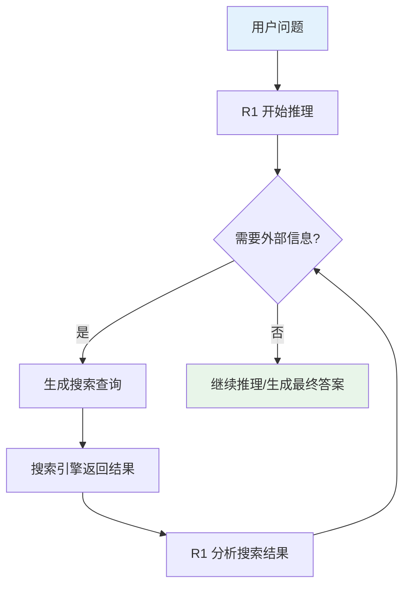

### 9.3 Anthropic：RAG 安全视角

> 注：Anthropic 关于 RAG 的具体技术实现细节公开信息有限。以下内容基于其公开的安全研究和技术博客，推测性内容已明确标注。

**Anthropic 的核心关注点**：RAG 引入外部知识后的**安全风险**。

#### 检索中毒攻击（Retrieval Poisoning）

**问题**：如果知识库中被注入恶意内容，RAG 系统会将这些内容作为"可信参考"传递给 LLM，可能导致：
- 生成有害或误导性的回答
- 绕过模型的安全对齐
- 泄露系统 Prompt 或用户隐私

**[推测] Anthropic 的安全措施可能包括**：
1. 对检索到的文档进行安全过滤（内容安全分类器）
2. 在 Prompt 中对检索内容进行"信任分级"（区分可信来源和未验证来源）
3. 训练模型识别检索内容中的指令注入攻击（如"忽略之前的指令"）

#### 上下文忠实度（Context Faithfulness）

Anthropic 在其技术文档中强调了模型是否"忠实于检索到的上下文"这一问题：

- **过度依赖**：模型盲目接受检索内容，即使内容是错误的
- **不够依赖**：模型忽略检索内容，仍然依赖自身参数知识（可能过时或错误）

**[推测] 理想的平衡**：模型应该能够对检索内容进行批判性评估，同时在自身知识与检索内容冲突时给出合理的判断。

---

## 10. 项目实践

### 项目 1：构建一个混合检索（Hybrid Search）系统（进阶 ）

**目标**：理解稀疏检索与稠密检索的互补优势，实现一个完整的 Hybrid Search 系统。

**任务**：
1. 实现 BM25 稀疏检索器（可参考 `code/rag/bm25_retriever.py`）
2. 使用预训练 Embedding 模型实现稠密检索器（可参考 `code/rag/dense_retriever.py`）
3. 实现 RRF 算法融合两个检索器的结果
4. 在一个小型中文问答数据集上对比三种方式（纯 BM25、纯向量、Hybrid）的检索效果

**提供的关键代码**：

```python
class HybridSearcher:
    """混合检索系统"""

    def __init__(self, bm25_retriever, dense_retriever, k=60):
        self.bm25 = bm25_retriever
        self.dense = dense_retriever
        self.k = k  # RRF 平滑参数

    def search(self, query: str, top_k: int = 10) -> list:
        """执行混合检索"""
        # 分别获取 BM25 和向量检索结果
        bm25_results = self.bm25.search(query, top_k=top_k * 2)
        dense_results = self.dense.search(query, top_k=top_k * 2)

        # 构建排名字典
        bm25_ranks = {doc_id: rank + 1 for rank, (doc_id, _) in enumerate(bm25_results)}
        dense_ranks = {doc_id: rank + 1 for rank, (doc_id, _) in enumerate(dense_results)}

        # RRF 融合
        all_docs = set(bm25_ranks.keys()) | set(dense_ranks.keys())
        rrf_scores = {}
        for doc_id in all_docs:
            score = 0.0
            if doc_id in bm25_ranks:
                score += 1.0 / (self.k + bm25_ranks[doc_id])
            if doc_id in dense_ranks:
                score += 1.0 / (self.k + dense_ranks[doc_id])
            rrf_scores[doc_id] = score

        # 按 RRF 分数排序
        sorted_results = sorted(rrf_scores.items(), key=lambda x: x[1], reverse=True)
        return sorted_results[:top_k]
```

**评估指标建议**：
- Recall@K：Top-K 中包含正确答案的比例
- MRR（Mean Reciprocal Rank）：正确答案首次出现排名的倒数之均值
- 定性分析：找出 BM25 能检索到但向量检索不到的例子（及反向）

---

### 项目 2：对比 RAG 与 Long Context (128k) 的问答效果（进阶 ）

**目标**：理解 RAG 和长上下文方案的技术边界，量化两种方法在不同场景下的优劣。

**任务**：
1. 构建一个包含约 100 篇文档的小型知识库
2. 设计 30-50 个问题（覆盖局部事实问题和全局归纳问题）
3. 分别用 RAG 方案和 Long Context 方案回答
4. 对比准确率、延迟、成本

**提供的思路和关键代码片段**：

```python
import time

def evaluate_rag_vs_longcontext(questions, documents, rag_pipeline, llm_client):
    """对比 RAG 与长上下文方案"""
    results = {"rag": [], "long_context": []}

    for q in questions:
        # RAG 方案
        start = time.time()
        rag_answer = rag_pipeline.query(q["question"])
        rag_time = time.time() - start

        # Long Context 方案: 将所有文档拼接到 prompt 中
        start = time.time()
        full_context = "\n\n".join(documents)
        lc_answer = llm_client.generate(
            f"基于以下文档回答问题:\n{full_context}\n\n问题: {q['question']}"
        )
        lc_time = time.time() - start

        results["rag"].append({
            "answer": rag_answer, "time": rag_time,
            "correct": judge_answer(rag_answer, q["ground_truth"])
        })
        results["long_context"].append({
            "answer": lc_answer, "time": lc_time,
            "correct": judge_answer(lc_answer, q["ground_truth"])
        })

    return results
```

**实验设计建议**：
- 将问题分为"局部问题"和"全局问题"两类，分别统计准确率
- 记录 token 消耗量，估算 API 调用成本
- 分析 "Lost in the Middle" 现象：当正确答案在文档中间位置时，Long Context 准确率是否下降

---

### 项目 3：从零实现 HNSW 索引构建与搜索（挑战 ）

**目标**：深入理解向量数据库的底层原理，实现一个简化版 HNSW 索引。

**思路**：

1. **数据结构设计**：
   - 每个节点存储：向量、各层的邻居列表
   - 全局维护：入口点、最大层数

2. **核心算法**：
   - 插入：随机层数选择 + 逐层贪心搜索 + 连接修剪
   - 搜索：从顶层到底层的分层贪心搜索

3. **关键优化**：
   - 连接修剪启发式：优先保留多样性高的邻居
   - 搜索时使用 `ef` 参数控制精度-速度权衡

**伪代码**：

```
CLASS HNSWIndex:
    INIT(dim, M=16, ef_construction=200):
        self.dim = dim
        self.M = M  // 每层最大连接数
        self.ef_construction = ef_construction
        self.m_L = 1 / ln(M)  // 层间缩放因子
        self.entry_point = None
        self.max_level = -1
        self.nodes = {}  // id -> {vector, neighbors: {level: [neighbor_ids]}}

    INSERT(id, vector):
        // 1. 随机确定新节点的层数
        level = floor(-ln(random()) * self.m_L)

        // 2. 如果图为空, 设为入口点
        IF self.entry_point is None:
            self.nodes[id] = {vector, neighbors: {l: [] for l in 0..level}}
            self.entry_point = id
            self.max_level = level
            RETURN

        // 3. 从顶层到 level+1 层: 贪心搜索找到最近的1个点
        ep = self.entry_point
        FOR l = self.max_level DOWNTO level + 1:
            ep = greedy_search(vector, ep, layer=l, ef=1)[0]

        // 4. 从 level 层到第0层: 搜索+连接
        FOR l = level DOWNTO 0:
            neighbors = greedy_search(vector, ep, layer=l, ef=self.ef_construction)
            // 选择最近的 M 个作为连接
            selected = select_neighbors(vector, neighbors, M)
            // 建立双向连接
            FOR each n in selected:
                add_connection(id, n, layer=l)
                add_connection(n, id, layer=l)
                // 如果 n 的连接数超过 M_max, 修剪
                IF |connections(n, l)| > M_max:
                    prune_connections(n, layer=l)

    SEARCH(query, K, ef):
        // 从顶层贪心到第1层
        ep = self.entry_point
        FOR l = self.max_level DOWNTO 1:
            ep = greedy_search(query, ep, layer=l, ef=1)[0]
        // 在第0层精细搜索
        candidates = greedy_search(query, ep, layer=0, ef=ef)
        RETURN top K from candidates
```

**参考代码结构**：可参考 `code/rag/hnsw_index.py` 中的简化实现。

**验证方法**：
- 生成 10000 个随机向量，构建 HNSW 索引
- 与暴力搜索（brute-force）对比 Top-10 的 Recall
- 调节 $M$ 和 $ef_{\text{search}}$，绘制 Recall vs QPS 曲线

```mermaid
graph LR
    subgraph "HNSW 实现验证流程"
        A["生成随机向量"] --> B["构建 HNSW 索引"]
        B --> C["查询 Top-K"]
        A --> D["暴力搜索 Top-K"]
        C --> E["对比 Recall"]
        D --> E
        E --> F["绘制 Recall-QPS 曲线"]
    end
```

---

### 项目 4：实现简易版 GraphRAG（挑战 ）

**目标**：掌握前沿的 GraphRAG 技术，理解知识图谱在 RAG 中的应用。

**思路**：

1. **文档准备**：准备 10-20 篇相关领域的短文档（如 AI 技术领域）

2. **实体抽取**：使用 LLM 或简单的 NER 模型从文档中抽取实体和关系

3. **图谱构建**：使用 NetworkX 构建知识图谱

4. **社区发现**：使用 python-louvain 或 leidenalg 库进行社区发现

5. **摘要生成**：为每个社区生成摘要

6. **查询处理**：根据查询类型选择局部检索或全局检索

**伪代码**：

```
FUNCTION build_graph_rag(documents):
    graph = empty NetworkX Graph

    // 1. 实体抽取
    FOR each doc in documents:
        entities, relations = llm_extract(doc)
        FOR each (entity_name, entity_type, description) in entities:
            graph.add_node(entity_name, type=entity_type, desc=description)
        FOR each (src, dst, relation, weight) in relations:
            graph.add_edge(src, dst, relation=relation, weight=weight)

    // 2. 社区发现
    communities = leiden_algorithm(graph, resolution=1.0)

    // 3. 社区摘要
    FOR each community in communities:
        entities_in_community = get_entities(community)
        relations_in_community = get_relations(community)
        summary = llm_summarize(entities_in_community, relations_in_community)
        community.summary = summary

    RETURN graph, communities

FUNCTION query_graph_rag(question, graph, communities):
    IF is_global_question(question):
        // 全局: Map-Reduce 所有社区摘要
        partial_answers = []
        FOR each community in communities:
            partial = llm_answer(question, community.summary)
            partial_answers.append(partial)
        final_answer = llm_reduce(question, partial_answers)
    ELSE:
        // 局部: 检索相关实体和关系
        relevant_entities = search_entities(question, graph)
        context = get_entity_context(relevant_entities, graph)
        final_answer = llm_answer(question, context)

    RETURN final_answer
```

**参考代码结构**：可参考 `code/rag/graph_rag_basic.py` 中的简化实现。

**挑战点**：
- 实体抽取的质量直接影响图谱质量（尝试不同的 Prompt 设计）
- 社区发现的粒度需要调优（resolution 参数）
- 全局问题的 Map-Reduce 需要处理社区摘要之间的冗余

```mermaid
graph TB
    subgraph "GraphRAG 实现流程"
        A["准备文档"] --> B["LLM 实体抽取"]
        B --> C["NetworkX 建图"]
        C --> D["Leiden 社区发现"]
        D --> E["LLM 社区摘要"]
        E --> F["查询路由<br/>(局部/全局)"]
        F --> G["生成回答"]
    end
```

---

### 项目 5：RAG 检索策略对比实验（进阶 ）

**目标**：通过系统实验，量化分析不同 chunk 大小和检索方法对 RAG 问答质量的影响，培养 RAG 系统调优的工程直觉。

**任务**：

1. 准备一个中文知识库（10-20 篇文档，涵盖某一技术领域，如深度学习基础知识）
2. 手动标注 30+ 个 (question, ground_truth_answer, source_doc) 测试用例
3. 实现三种 chunk 策略：Fixed-size（256/512/1024）、Recursive、Semantic
4. 实现三种检索方法：纯 BM25、纯 Dense（使用开源 Embedding 模型）、Hybrid（RRF 融合）
5. 交叉组合（3 chunk 策略 x 3 检索方法 = 9 组实验），计算 Recall@5、MRR、Faithfulness
6. 分析实验结果，给出最优配置建议

**提供的实验框架代码**：

```python
import itertools
from dataclasses import dataclass
from typing import Callable

@dataclass
class ExperimentConfig:
    """实验配置"""
    chunk_strategy: str      # "fixed_256", "fixed_512", "fixed_1024", "recursive", "semantic"
    retrieval_method: str    # "bm25", "dense", "hybrid"
    top_k: int = 5           # 检索返回数量
    rrf_k: int = 60          # RRF 平滑参数(仅hybrid使用)

@dataclass
class ExperimentResult:
    """实验结果"""
    config: ExperimentConfig
    recall_at_5: float
    mrr: float
    avg_num_chunks: int       # 该配置下的平均chunk数
    avg_chunk_length: float   # 该配置下的平均chunk长度(token)
    faithfulness: float       # RAGAS忠实度(需要LLM评估)
    latency_ms: float         # 平均检索延迟(毫秒)


def run_experiment(config: ExperimentConfig,
                   documents: list[str],
                   test_cases: list[dict],
                   embedding_model,
                   llm_client) -> ExperimentResult:
    """
    运行单组实验

    参数:
        config: 实验配置
        documents: 原始文档列表
        test_cases: 测试用例, 每个包含 question, answer, source_doc_id
        embedding_model: 用于Dense检索的Embedding模型
        llm_client: 用于生成和评估的LLM
    返回:
        实验结果
    """
    import time

    # 1. 按配置分块
    if config.chunk_strategy.startswith("fixed_"):
        chunk_size = int(config.chunk_strategy.split("_")[1])
        chunks = []
        chunk_doc_map = {}  # chunk_id -> doc_id 的映射
        for doc_id, doc in enumerate(documents):
            doc_chunks = fixed_size_chunk(doc, chunk_size=chunk_size, overlap=chunk_size // 4)
            for c in doc_chunks:
                chunk_doc_map[len(chunks)] = doc_id
                chunks.append(c)
    elif config.chunk_strategy == "recursive":
        # 使用递归分块(参考6.4节实现)
        chunks, chunk_doc_map = [], {}
        for doc_id, doc in enumerate(documents):
            doc_chunks = recursive_chunk(doc, chunk_size=512)
            for c in doc_chunks:
                chunk_doc_map[len(chunks)] = doc_id
                chunks.append(c)
    # semantic 分块类似处理...

    # 2. 构建索引(根据检索方法)
    # ... 构建BM25索引、Dense索引 或 两者都构建

    # 3. 对每个测试用例执行检索
    recall_scores = []
    mrr_scores = []
    latencies = []

    for case in test_cases:
        start = time.time()
        # retrieved_chunk_ids = retrieve(case["question"], config)
        elapsed = (time.time() - start) * 1000
        latencies.append(elapsed)

        # 计算Recall: 检索到的chunk是否包含来自正确文档的chunk
        # relevant_found = any(chunk_doc_map[cid] == case["source_doc_id"]
        #                      for cid in retrieved_chunk_ids[:5])
        # recall_scores.append(1.0 if relevant_found else 0.0)

        # 计算MRR: 第一个正确chunk的排名倒数
        # for rank, cid in enumerate(retrieved_chunk_ids, 1):
        #     if chunk_doc_map[cid] == case["source_doc_id"]:
        #         mrr_scores.append(1.0 / rank)
        #         break
        # else:
        #     mrr_scores.append(0.0)

    # 4. 计算Faithfulness(使用LLM评估)
    # faithfulness_score = compute_faithfulness(test_cases, retrieved_contexts, llm_client)

    return ExperimentResult(
        config=config,
        recall_at_5=sum(recall_scores) / len(recall_scores) if recall_scores else 0,
        mrr=sum(mrr_scores) / len(mrr_scores) if mrr_scores else 0,
        avg_num_chunks=len(chunks),
        avg_chunk_length=sum(len(c) for c in chunks) / len(chunks),
        faithfulness=0.0,  # 需要LLM评估
        latency_ms=sum(latencies) / len(latencies) if latencies else 0
    )


def run_full_experiment_suite(documents, test_cases, embedding_model, llm_client):
    """
    运行完整的交叉实验

    遍历所有chunk策略和检索方法的组合, 输出对比结果表
    """
    chunk_strategies = ["fixed_256", "fixed_512", "fixed_1024", "recursive", "semantic"]
    retrieval_methods = ["bm25", "dense", "hybrid"]

    results = []
    for chunk_strat, ret_method in itertools.product(chunk_strategies, retrieval_methods):
        config = ExperimentConfig(
            chunk_strategy=chunk_strat,
            retrieval_method=ret_method
        )
        print(f"运行实验: {chunk_strat} + {ret_method}")
        result = run_experiment(config, documents, test_cases, embedding_model, llm_client)
        results.append(result)

    # 输出结果对比表
    print("\n===== 实验结果汇总 =====")
    print(f"{'Chunk策略':<15} {'检索方法':<10} {'Recall@5':<10} {'MRR':<10} "
          f"{'Chunks数':<10} {'Faithfulness':<12} {'延迟(ms)':<10}")
    print("-" * 77)
    for r in sorted(results, key=lambda x: x.recall_at_5, reverse=True):
        print(f"{r.config.chunk_strategy:<15} {r.config.retrieval_method:<10} "
              f"{r.recall_at_5:<10.3f} {r.mrr:<10.3f} {r.avg_num_chunks:<10} "
              f"{r.faithfulness:<12.3f} {r.latency_ms:<10.1f}")

    return results
```

**实验设计建议**：

1. **数据集**：选择一个技术领域（如"深度学习基础"），收集 10-20 篇相关博客或文档
2. **测试用例类别**：
   - **简单事实题**（10题）：如"HNSW 算法的时间复杂度是多少？"
   - **需上下文推理题**（10题）：如"为什么 BM25 需要文档长度归一化？"
   - **跨文档题**（5题）：如"对比 BM25 和 Dense Retrieval 的优缺点"
   - **知识库外题**（5题）：如"2026年最新的 Embedding 模型排名"（答案不在库中）
3. **评估重点**：
   - 哪种 chunk 策略在不同类型问题上表现最好？
   - Hybrid 检索相比单路检索提升多大？
   - chunk size 与检索延迟的关系

**可视化建议**：
- 绘制 chunk size vs Recall@5 曲线（固定检索方法）
- 绘制 3 种检索方法在不同问题类别上的 Recall 柱状图
- 绘制 Recall-Latency 散点图（每个点是一组实验配置）

---

## 11. 本章小结

### 核心知识点

1. **RAG 数学范式**：$P(y|x) \approx \sum_{z \in \text{TopK}} P(y|x,z) \cdot P(z|x)$，将知识从"参数记忆"转变为"外部检索"
2. **三代 RAG 架构演进**：Naive RAG → Advanced RAG → Modular RAG，从简单拼接到模块化编排
3. **Naive vs Advanced RAG**：Query 重写、HyDE、Reranking 等优化策略显著提升检索质量
4. **双塔检索**：Bi-Encoder 通过 InfoNCE 对比学习训练，实现高效的向量匹配
5. **HNSW**：分层导航小世界图，$O(\log N)$ 的搜索复杂度，是工业界最流行的 ANN 算法
6. **BM25 与混合搜索**：稀疏检索的精确匹配与稠密检索的语义理解互补，RRF 融合两者
7. **检索策略选择**：Dense/Sparse/Hybrid 各有适用场景，条件路由可自适应选择最优策略
8. **Chunk 策略**：Fixed-size/Semantic/Recursive/Parent-Child 四种策略，chunk size 是最关键的超参数
9. **GraphRAG**：通过知识图谱和社区发现，解决全局问题的归纳推理难题
10. **RAGAS 评估**：Faithfulness、Answer Relevancy、Context Precision、Context Recall 四维评估体系

### 数学要点

- InfoNCE Loss：$\mathcal{L} = -\log \frac{\exp(\text{sim}(q, d^+)/\tau)}{\sum_j \exp(\text{sim}(q, d_j)/\tau)}$
- BM25：$\text{score} = \sum_i \text{IDF}(t_i) \cdot \frac{f(t_i, d)(k_1+1)}{f(t_i,d)+k_1(1-b+b \cdot |d|/avgdl)}$
- RRF：$\text{score}(d) = \sum_r \frac{1}{k + \text{rank}_r(d)}$
- HNSW 搜索复杂度：$O(d \cdot \log N)$
- 模块度：$Q = \frac{1}{2m} \sum_{ij} [A_{ij} - \frac{k_ik_j}{2m}] \delta(c_i, c_j)$

### 实践要点

1. 先 BM25 再向量搜索的 Hybrid 方案是工业界最常见的检索策略
2. Reranking 能以较小的计算开销显著提升检索精度
3. HyDE 特别适合"问题和答案语义差距大"的场景
4. Chunk size 的选择应基于实验验证，而非拍脑袋；512 tokens 是一个合理的起点
5. Parent-Child Chunking 有效解决了"检索粒度"与"生成粒度"的矛盾
6. RAGAS 提供了系统化的 RAG 评估方法，四个指标分别定位不同环节的问题
7. GraphRAG 的索引构建成本高（大量 LLM 调用），适合文档变化不频繁的场景
8. 向量库选型需根据数据规模、延迟要求、部署环境综合考虑
9. 完整代码见 `code/rag/` 目录

### 下一步：从 RAG 到 LLM 前沿全景

至此，我们已经构建了完整的 LLM 知识体系：从分词（Module 1）到 Embedding（Module 2）、从 Transformer 架构（Module 3-5）到预训练与微调（Module 8-10）、从对齐（Module 11-12）到推理优化（Module 13-14），再到本章的 RAG 与知识增强。这条路径覆盖了"训练一个模型 → 让它有用 → 让它安全 → 让它高效 → 让它获取实时知识"的完整链路。

在下一个也是最后一个模块（**Module 16：前沿专题与终极项目**）中，我们将纵览 LLM 领域最新的研究前沿——包括多模态大模型、Agent 系统、推理增强（o1/R1 范式）、模型合并等方向——并通过一个综合性的终极项目，将前 15 个模块的知识串联起来，构建一个完整的端到端 LLM 应用系统。

---

## 参考资料

### 论文

1. Lewis et al. (2020). *Retrieval-Augmented Generation for Knowledge-Intensive NLP Tasks*. (RAG 原始论文)
2. Guu et al. (2020). *REALM: Retrieval-Augmented Language Model Pre-Training*.
3. Borgeaud et al. (2022). *Improving Language Models by Retrieving from Trillions of Tokens*. (RETRO)
4. Malkov & Yashunin (2018). *Efficient and Robust Approximate Nearest Neighbor Using Hierarchical Navigable Small World Graphs*. (HNSW)
5. Karpukhin et al. (2020). *Dense Passage Retrieval for Open-Domain Question Answering*. (DPR)
6. Gao et al. (2023). *Precise Zero-Shot Dense Retrieval without Relevance Labels*. (HyDE)
7. Edge et al. (2024). *From Local to Global: A Graph RAG Approach to Query-Focused Summarization*. (GraphRAG)
8. Traag et al. (2019). *From Louvain to Leiden: Guaranteeing Well-Connected Communities*. (Leiden 算法)
9. Asai et al. (2024). *Self-RAG: Learning to Retrieve, Generate, and Critique through Self-Reflection*.
10. Robertson & Zaragoza (2009). *The Probabilistic Relevance Framework: BM25 and Beyond*.
11. Cormack et al. (2009). *Reciprocal Rank Fusion Outperforms Condorcet and Individual Rank Learning Methods*. (RRF)
12. Es et al. (2024). *RAGAS: Automated Evaluation of Retrieval Augmented Generation*. (RAGAS 评估框架)
13. Gao et al. (2024). *Retrieval-Augmented Generation for Large Language Models: A Survey*. (RAG 综述)

### 博客与资源

1. [LangChain RAG Tutorial](https://python.langchain.com/docs/tutorials/rag/) - RAG 实践教程
2. [Microsoft GraphRAG](https://github.com/microsoft/graphrag) - GraphRAG 官方实现
3. [Faiss](https://github.com/facebookresearch/faiss) - Facebook 向量检索库
4. [MTEB Leaderboard](https://huggingface.co/spaces/mteb/leaderboard) - Embedding 模型排行榜
5. [RAGAS Documentation](https://docs.ragas.io/) - RAGAS 评估框架官方文档
6. [Chunking Strategies](https://www.pinecone.io/learn/chunking-strategies/) - Pinecone 分块策略指南
