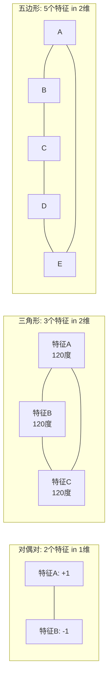
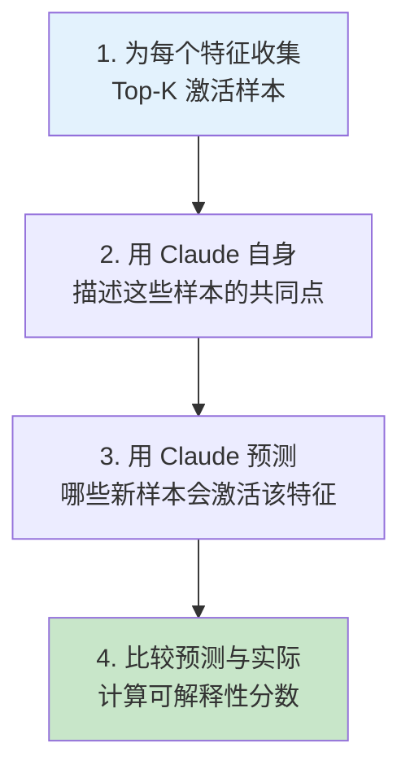
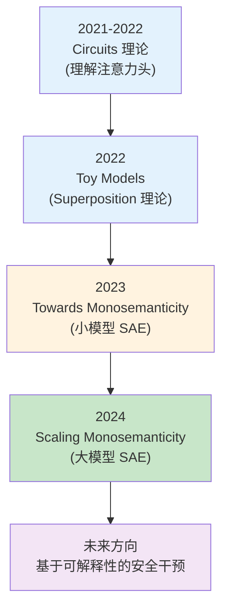
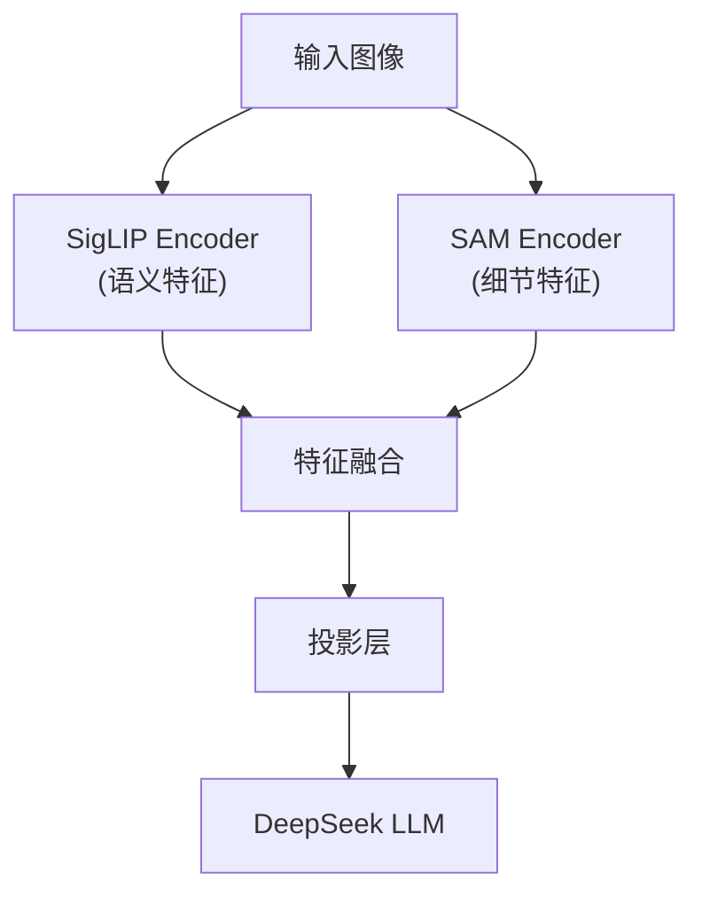

# 前沿专题进阶：可解释性研究路线图与多模态前沿

> 本文是 [模块 16：前沿专题](./README.md) 的进阶补充，重点深入 Anthropic 的可解释性研究体系、Google 和 DeepSeek 的前沿探索，以及世界模型、Model Merging 等最新研究话题。

---

## 目录

- [1. Anthropic 的可解释性研究（重点）](#1-anthropic-的可解释性研究重点)
- [2. Google 的前沿研究](#2-google-的前沿研究)
- [3. DeepSeek 的前沿探索](#3-deepseek-的前沿探索)
- [4. 前沿话题](#4-前沿话题)
- [参考文献](#参考文献)

---

## 1. Anthropic 的可解释性研究（重点）

Anthropic 是机械可解释性领域的领导者。他们的研究构成了一条从理论到实践的清晰路线：**理解 Superposition → 开发 SAE → 在大模型上提取特征 → 利用特征进行安全干预**。

### 1.1 Toy Models of Superposition (Elhage et al., 2022)

这篇论文奠定了 Superposition 理论的数学基础。

#### 实验设置

构造一个极简的自编码器来研究 Superposition：

$$\text{模型:} \quad \hat{\mathbf{x}} = \text{ReLU}(W^T W \mathbf{x} + \mathbf{b})$$

其中 $W \in \mathbb{R}^{d \times n}$，$d$ 是"隐藏层维度"（瓶颈），$n$ 是"特征数"（$n > d$）。

输入 $\mathbf{x}$ 是一个 $n$ 维向量，每个特征 $x_i$ 以概率 $1 - S_i$ 为零（$S_i$ 是稀疏度），非零时服从均匀分布。

训练目标：$\min_W \mathbb{E}[\|\mathbf{x} - \hat{\mathbf{x}}\|^2]$

每个特征有一个"重要性" $I_i$，训练目标中对特征 $i$ 的重建误差加权 $I_i$。

#### 关键发现：相变行为

这篇论文最重要的发现是 Superposition 的**相变行为**：

随着稀疏度的变化，模型对特征的表示方式发生突变（而非渐变）：

| 稀疏度 | 特征表示方式 | 直觉解释 |
|--------|------------|----------|
| **低稀疏**（特征经常活跃） | 每个重要特征占据一个独立维度 | "座位充足，每人一个" |
| **中等稀疏** | 部分特征共享维度，形成几何结构 | "座位紧张，开始拼桌" |
| **高稀疏**（特征很少活跃） | 大量特征叠加在同一维度上 | "座位极少，但大家很少同时来" |

**相变临界点的数学条件**：

当特征 $i$ 的重要性 $I_i$ 和稀疏度 $S_i$ 满足以下关系时，模型从"不表示"突变为"以 Superposition 方式表示"：

$$I_i \cdot (1 - S_i) > \text{threshold}(d, n, \text{其他特征的属性})$$

这意味着：**高重要性 + 高稀疏度**的特征最容易被 Superposition 表示。

#### 几何结构

论文发现了多种 Superposition 的几何结构：

- **对偶对（Antipodal Pairs）**：两个特征共享一个维度，方向相反
- **三角形**：三个特征在二维平面上形成 $120°$ 角
- **五边形**：五个特征在二维平面上形成 $72°$ 角

这些几何结构使得干扰（$\mathbf{f}_i^T \mathbf{f}_j$）在所有特征对之间均匀分布，而非集中在某些对上，是一种最优的"空间利用策略"。

### 1.2 Towards Monosemanticity (Bricken et al., 2023)

这篇论文首次证明了 **SAE 可以从真实语言模型中提取可解释的单义特征**。

#### 实验规模

- 模型：一个 1 层的 Transformer（512 维 MLP 层激活值）
- SAE 字典大小：512 到 131072 个特征
- 数据：大规模文本语料

#### 关键成果

1. **特征确实是单义的**：研究者逐个检查了数千个 SAE 特征，发现它们对应着清晰的语义概念：
   - "DNA 序列" 特征：只在 DNA 相关文本中激活
   - "法律术语" 特征：只在法律文档中激活
   - "引号内容" 特征：只在引号包围的文本中激活
   - "首字母大写" 特征：只在大写字母开头的词上激活

2. **字典大小的影响**：更大的字典可以捕获更精细的特征
   - 小字典：捕获粗粒度特征（如"英文文本"、"代码"）
   - 大字典：捕获细粒度特征（如"Python 类定义"、"引号内的对话"）

3. **特征组合解释行为**：模型的输出可以通过 SAE 特征的线性组合来理解

#### 局限与挑战

- 只在 1 层模型上验证，无法确认是否适用于深层模型
- 手动检查特征的可解释性不可扩展
- 如何量化"可解释性"仍然是开放问题

### 1.3 Scaling Monosemanticity (Templeton et al., 2024)

这是 Anthropic 可解释性研究的里程碑成果——**在 Claude 3 Sonnet 上训练 SAE，发现了数百万个可解释特征**。

#### 实验规模

- 模型：**Claude 3 Sonnet**（Anthropic 的生产级大模型）
- SAE 字典大小：**3400 万个特征**
- 训练数据：Claude 3 Sonnet 的中间层激活值

#### 标志性发现

**1. 金门大桥特征（Golden Gate Bridge Feature）**

研究者在 SAE 中发现了一个特征，它在所有与金门大桥相关的文本和图像输入上高度激活：

- 文本中提到"Golden Gate Bridge"时激活
- 显示金门大桥照片时激活
- 提到旧金山地标时弱激活
- 与其他桥梁无关的文本不激活

这个发现的意义：模型内部确实存在**高级语义概念**的表示，而且可以被 SAE 提取出来。

**2. 跨模态特征**

更令人惊讶的是，很多特征是**跨模态**的——同一个特征对文本和图像都有响应。例如"金门大桥"特征不仅在文本中激活，也在图像中激活。这暗示模型内部可能形成了统一的概念表示。

**3. Feature Steering（特征转向）**

通过人为增强或抑制特定特征，可以**可控地改变模型的行为**：

$$\mathbf{x}_{modified} = \mathbf{x}_{original} + \alpha \cdot \mathbf{f}_{target}$$

其中 $\alpha$ 控制干预强度，$\mathbf{f}_{target}$ 是目标特征的方向。

**实验案例**：

| 增强的特征 | 效果 | $\alpha$ |
|-----------|------|----------|
| "金门大桥" | 模型在所有回复中都会提到金门大桥 | 大 |
| "安全" | 模型变得更加谨慎和保守 | 中等 |
| "代码" | 模型倾向于用代码来回答问题 | 中等 |
| "幽默" | 模型的回复变得更加幽默 | 小 |

> **注意**：Feature Steering 目前仍处于研究阶段。虽然在某些特征上效果显著，但并非所有特征都能有效控制模型行为，且过度干预可能导致输出质量下降。

**4. 安全相关特征**

研究者还发现了与安全直接相关的特征：
- "拒绝有害请求"特征
- "诚实承认不确定性"特征
- "遵循伦理准则"特征

这些发现为**基于可解释性的安全干预**提供了可能性——直接操控这些特征来增强模型的安全行为，而不仅依赖 RLHF。

#### 技术细节

**SAE 训练的挑战**：

在 Claude 3 Sonnet 这样的大模型上训练 SAE 面临巨大的工程挑战：

| 挑战 | 解决方案 |
|------|----------|
| 激活值维度巨大 | 分布式训练 SAE |
| 训练数据量大 | 在线收集激活值，流式训练 |
| 死特征问题严重 | 改进的重激活策略 |
| 评估困难 | 自动化可解释性评估 |

**自动化可解释性评估**：

手动检查 3400 万个特征是不可能的。Anthropic 使用了一个自动化流程：

### 1.4 Anthropic 可解释性研究路线图

Anthropic 的可解释性研究遵循一条清晰的技术路线：

**未来研究方向** [推测]：

1. **完整的模型理解**：理解模型中所有特征和它们之间的交互
2. **基于可解释性的对齐**：直接操控内部特征来确保安全行为
3. **实时监控**：在推理时监控关键特征，检测潜在的有害行为
4. **自动化 Circuits 发现**：自动发现模型中的功能电路
5. **可解释性驱动的模型设计**：设计天然更可解释的架构

### 1.5 可解释性与安全性的关系

可解释性和安全性之间存在深刻的联系：

| 可解释性的贡献 | 安全应用 |
|---------------|----------|
| 发现安全相关特征 | 直接增强/抑制安全特征 (Feature Steering) |
| 理解对齐训练的效果 | 验证 RLHF/DPO 是否真正改变了内部表示 |
| 检测欺骗行为 | 如果模型"假装"对齐，内部特征应该能揭示 |
| 识别偏见的来源 | 找到导致偏见输出的具体特征和电路 |
| 预测模型行为 | 在部署前预测模型在未见过的输入上的行为 |

**Anthropic 的核心信念**：

> 如果我们能够完全理解 AI 系统的内部工作机制，我们就能更好地确保它们的安全性。可解释性不仅仅是学术研究，而是 AI 安全的**基础设施**。

这一信念驱动了 Anthropic 在可解释性上的大量投入，使其成为该领域无可争议的领导者。

---

## 2. Google 的前沿研究

### 2.1 Gemini 的多模态能力

Google Gemini 代表了**原生多模态**的技术路线——从训练一开始就同时处理文本、图像、音频和视频。

#### Gemini 的技术亮点

| 能力 | 描述 |
|------|------|
| **原生多模态** | 不是后期拼接，而是从架构层面统一所有模态 |
| **超长上下文** | 支持 1M+ tokens（Gemini 1.5 Pro） |
| **多模态推理** | 可以在图像和文本之间进行复杂的交叉推理 |
| **视频理解** | 可以理解长视频的内容和时序关系 |
| **代码生成** | 强大的代码理解和生成能力 |

#### Gemini 1.5 Pro 的长上下文能力

Gemini 1.5 Pro 引入了**混合注意力机制**：

- 在局部使用**滑动窗口注意力**（计算效率高）
- 在全局使用**稀疏注意力**（捕获长距离依赖）
- 这种混合设计使得模型可以处理高达 **10M tokens** 的上下文 [推测]

长上下文的应用场景：
- 整本书的理解和问答
- 完整代码库的分析
- 长视频的内容理解
- 跨文档的信息综合

#### 多模态训练数据

Google 拥有独特的数据优势：

| 数据来源 | 模态 | 规模 |
|----------|------|------|
| 网络爬取 | 文本 + 图像 | 数万亿 tokens |
| YouTube | 视频 + 音频 + 字幕 | 数百万小时 |
| Google Scholar | 学术文献 | 数亿篇 |
| Google Books | 书籍文本 | 数百万册 |
| Google Maps | 地理 + 图像 | 全球覆盖 |

### 2.2 Google 的 AI 安全研究

Google DeepMind 在 AI 安全方面的工作：

**1. Responsible AI Practices**

Google 发布了一系列负责任 AI 开发指南，涵盖：
- 公平性（Fairness）
- 可解释性（Explainability）
- 隐私保护（Privacy）
- 安全性（Safety）
- 鲁棒性（Robustness）

**2. AI Safety Research**

研究方向包括：
- **Alignment Faking** 的检测（模型是否在"假装"对齐）
- **Scalable Oversight**（当模型能力超过人类时如何监督）
- **Mechanistic Interpretability**（Google 也有可解释性研究，但规模小于 Anthropic）

**3. 模型评估基准**

Google 推动了多个评估基准：
- **BIG-Bench**：超过 200 个评估任务的综合基准
- **MMLU**：大规模多任务语言理解
- **HumanEval**：代码生成评估

### 2.3 模型评估与基准测试

Google 对模型评估的贡献：

| 基准 | 评估维度 | Google 的贡献 |
|------|----------|--------------|
| **BIG-Bench** | 综合能力 | 发起者和主要贡献者 |
| **MMLU** | 知识和推理 | 重要参与者 |
| **Safety Benchmarks** | 安全性 | 推动标准化 |
| **Multilingual Benchmarks** | 多语言能力 | 全球视角 |

---

## 3. DeepSeek 的前沿探索

### 3.1 DeepSeek-VL 多模态模型

DeepSeek-VL 是 DeepSeek 在多模态方向的重要成果。

#### 架构特点

| 特性 | 描述 |
|------|------|
| **混合视觉编码器** | 同时使用 SigLIP (语义) + SAM (细节) |
| **动态分辨率** | 支持任意分辨率输入，不强制缩放 |
| **高效视觉 Token** | 通过下采样减少视觉 token 数量 |
| **开源** | 模型权重和训练代码完全开源 |

#### 混合视觉编码器的设计

**为什么需要两个编码器？**

- **SigLIP** 擅长捕获高层语义（"这是一只猫"），但细节信息（猫的颜色、位置）较弱
- **SAM** 擅长捕获空间细节（物体的精确位置和形状），但语义理解较弱
- 两者互补，能够同时满足"理解"和"定位"的需求

#### 动态分辨率

传统 VLM 将所有图像缩放到固定大小（如 224x224），导致高分辨率图像的细节丢失。DeepSeek-VL 的做法：

1. 将图像切分为多个固定大小的 tile（如 384x384）
2. 每个 tile 独立编码
3. tile 数量根据原始分辨率动态调整
4. 保留全局缩略图 + 局部 tiles

### 3.2 开源社区的安全实践

DeepSeek 作为开源社区的重要参与者，在安全方面的贡献：

**1. 透明的技术报告**

DeepSeek 发布的技术报告详细描述了：
- 训练数据的处理方式
- 安全训练的具体方法
- 已知的局限和风险
- 评估结果和基准测试

**2. 中文安全挑战**

中文 LLM 面临独特的安全挑战：

| 挑战 | 描述 |
|------|------|
| **文化差异** | 不同文化背景下"安全"的定义不同 |
| **多音字/多义词** | 中文的歧义性增加了安全过滤的难度 |
| **成语/典故** | 隐含的不当内容更难检测 |
| **混合语言** | 中英混合输入可能绕过单语言的安全过滤 |

**3. 开源安全工具**

DeepSeek 和更广泛的中文开源社区贡献了多种安全工具：
- 中文有害内容分类器
- 中文安全评估基准
- 中文对齐训练数据

---

## 4. 前沿话题

### 4.1 世界模型与 LLM

**核心问题**：LLM 是否在训练过程中学到了"世界模型"——一种对真实世界运作方式的内部表示？

#### 证据

| 支持证据 | 反对意见 |
|----------|----------|
| Othello-GPT 学到了棋盘表示 | 可能只是统计相关性 |
| GPT-4 能进行空间推理 | 推理能力有限且不稳定 |
| LLM 能理解物理因果 | 常常犯简单的物理错误 |
| SAE 发现了高级语义特征 | 特征是否构成"世界模型"存疑 |

#### Othello-GPT 实验

Li et al. (2023) 在 Othello 棋盘游戏上训练了一个 GPT 模型：

- 输入：合法走步的序列（不包含棋盘信息）
- 发现：模型内部形成了棋盘的二维表示
- 意义：模型仅从序列预测任务中"涌现"出了世界状态的表示

**这对 LLM 意味着什么？**

如果一个小模型都能从文本中学到棋盘表示，那么在海量文本上训练的大模型是否也学到了关于真实世界的某种"模型"？这个问题仍然开放，但 SAE 的研究为解答提供了工具。

### 4.2 模型合并（Model Merging）

**模型合并**是一种不需要额外训练就能组合多个模型优势的技术。

#### 主要方法

| 方法 | 公式 | 适用场景 |
|------|------|----------|
| **线性插值** | $\theta_{merged} = \alpha \theta_A + (1-\alpha) \theta_B$ | 相似模型的简单合并 |
| **SLERP** | 球面线性插值 | 保持参数的范数 |
| **TIES-Merging** | 修剪 + 解决符号冲突 + 合并 | 多模型合并 |
| **DARE** | 随机丢弃 delta + 缩放 | 减少冲突 |
| **Model Soups** | 多个微调模型的平均 | 提升泛化性 |

#### 为什么模型合并有效？

一个直觉解释是**任务向量假说**：

$$\boldsymbol{\tau}_{\text{task}} = \theta_{\text{finetuned}} - \theta_{\text{pretrained}}$$

微调模型与预训练模型的参数差（"任务向量"）编码了任务知识。不同任务的向量在参数空间中往往是近似正交的，因此可以简单相加而不冲突：

$$\theta_{merged} = \theta_{pretrained} + \boldsymbol{\tau}_A + \boldsymbol{\tau}_B$$

#### 实际应用

- 合并一个"数学能力强"的模型和一个"代码能力强"的模型
- 合并多个语言的微调模型为一个多语言模型
- 合并同一模型的多个微调变体以提升泛化性

#### 局限

- 对基础模型差异敏感（两个基础模型不同的微调模型通常无法合并）
- 某些情况下会导致性能退化
- 缺乏理论保证

### 4.3 持续学习（Continual Learning）

**持续学习**的目标是让模型在学习新知识的同时保留旧知识，避免**灾难性遗忘**。

#### LLM 中的灾难性遗忘

当在新数据上微调 LLM 时，模型可能会忘记预训练阶段学到的知识：

| 场景 | 遗忘表现 |
|------|----------|
| 在领域数据上 SFT | 通用对话能力下降 |
| 在新语言数据上训练 | 原有语言能力退化 |
| 安全对齐训练 | 一般知识能力可能下降 |
| 多轮微调 | 早期学到的能力被覆盖 |

#### 缓解方法

| 方法 | 描述 | 计算成本 |
|------|------|----------|
| **数据混合** | 新数据中混入旧数据（replay） | 中等 |
| **弹性权重巩固 (EWC)** | 对重要参数施加正则化 | 高 |
| **LoRA 适配器** | 为每个任务训练独立的 LoRA | 低 |
| **渐进式提示** | 为每个任务训练独立的 soft prompt | 低 |
| **知识蒸馏** | 用旧模型指导新模型保留知识 | 中等 |

#### EWC 的数学原理

弹性权重巩固通过 Fisher 信息矩阵估计每个参数对旧任务的重要性：

$$\mathcal{L}_{total} = \mathcal{L}_{new}(\theta) + \frac{\lambda}{2} \sum_i F_i (\theta_i - \theta_{old,i})^2$$

其中 $F_i$ 是参数 $\theta_i$ 的 Fisher 信息（衡量该参数对旧任务损失的敏感度）。直觉上：**对旧任务重要的参数不允许大幅改变**。

### 4.4 LLM 的理论理解

理解 LLM 为什么有效，是一个基础但困难的问题。

#### 涌现能力的争论

**涌现能力（Emergent Abilities）**：某些能力只在模型规模超过临界点后突然出现。

| 观点 | 论据 |
|------|------|
| **涌现是真实的** | 在多个基准上观察到阶跃式性能提升 |
| **涌现是测量假象** | Schaeffer et al. (2023) 认为用线性指标而非非线性指标（如准确率）衡量时，涌现现象消失 |
| **折中观点** | 涌现可能在某些任务上是真实的，但在某些任务上是测量效应 |

#### In-Context Learning 的理论

为什么 LLM 能通过 prompt 中的几个示例"学会"新任务？几种理论解释：

1. **隐式梯度下降**（Akyurek et al., 2022; von Oswald et al., 2023）：

   Transformer 的前向传播在功能上等价于执行几步梯度下降。注意力机制计算的加权平均在数学上类似于线性回归的最小二乘解。

2. **贝叶斯推理**（Xie et al., 2021）：

   LLM 在预训练时隐式学会了贝叶斯推理——根据上下文中的示例推断当前任务的"概念"，然后根据该概念进行预测。

3. **任务向量检索**：

   LLM 内部存储了大量"任务模板"，In-Context Learning 只是根据示例检索最匹配的模板。

#### Scaling Laws 的理论基础

为什么损失会随着模型大小、数据量、计算量以幂律关系下降？

$$L(N, D) = \left(\frac{N_c}{N}\right)^{\alpha_N} + \left(\frac{D_c}{D}\right)^{\alpha_D} + L_\infty$$

几种理论解释：
- **统计学习理论**：更多参数可以拟合更复杂的函数
- **信息论**：数据中的可学习信息量决定了损失下界
- **随机特征模型**：某些简化模型可以解析推导出幂律关系

这些理论都只是部分解释，LLM 的理论理解仍然是一个活跃的研究领域。

---

## 参考文献

1. Elhage, N., et al. (2022). "Toy Models of Superposition." Anthropic.
2. Bricken, T., et al. (2023). "Towards Monosemanticity: Decomposing Language Models with Dictionary Learning." Anthropic.
3. Templeton, A., et al. (2024). "Scaling Monosemanticity: Extracting Interpretable Features from Claude 3 Sonnet." Anthropic.
4. Olsson, C., et al. (2022). "In-context Learning and Induction Heads." Anthropic.
5. Bai, Y., et al. (2022). "Constitutional AI: Harmlessness from AI Feedback." Anthropic.
6. Google (2023). "Gemini: A Family of Highly Capable Multimodal Models."
7. Google (2024). "Gemini 1.5: Unlocking Multimodal Understanding Across Millions of Tokens."
8. DeepSeek (2024). "DeepSeek-VL: Towards Real-World Vision-Language Understanding."
9. Li, K., et al. (2023). "Othello-GPT: Language Models Are Better Than You Think."
10. Ilharco, G., et al. (2023). "Editing Models with Task Arithmetic."
11. Yadav, P., et al. (2023). "TIES-Merging: Resolving Interference When Merging Models."
12. Kirkpatrick, J., et al. (2017). "Overcoming Catastrophic Forgetting in Neural Networks." (EWC)
13. Schaeffer, R., et al. (2023). "Are Emergent Abilities of Large Language Models a Mirage?"
14. Akyurek, E., et al. (2022). "What Learning Algorithm Is In-Context Learning?"
15. von Oswald, J., et al. (2023). "Transformers Learn In-Context by Gradient Descent."
16. Xie, S.M., et al. (2021). "An Explanation of In-context Learning as Implicit Bayesian Inference."
