# 模块17(补充): Synthetic Data — 合成数据与自我进化

> 当互联网的高质量文本逐渐耗尽，LLM 的下一个燃料从哪里来？本章系统讲解合成数据的生成、过滤、自我进化技术，从 Self-Instruct 到 DeepSeek-R1 的推理链合成，揭示"用 AI 训练 AI"这一范式背后的理论基础与工程实践。

**前置知识**：本章假设你已掌握模块10的 SFT 基础和模块8A的预训练目标函数。如需回顾，请参考 [模块10: SFT](../10_sft/README.md) 和 [模块8A: 预训练目标](../08a_pretraining_objectives/README.md)。

---

## 目录

- [1. 数据枯竭与合成数据的崛起](#1-数据枯竭与合成数据的崛起)
- [2. 数据生成策略](#2-数据生成策略)
- [3. 质量控制与过滤](#3-质量控制与过滤)
- [4. 自我进化](#4-自我进化)
- [5. 三条技术线的合成数据实践](#5-三条技术线的合成数据实践)
- [6. 项目实践](#6-项目实践)

---

## 1. 数据枯竭与合成数据的崛起

### 1.1 互联网高质量文本的耗尽

Villalobos et al. (2022) 在 *Will we run out of data?* 中给出了一个令人警醒的预测：

| 数据类型 | 当前存量估算 | 年增长率 | 预计耗尽时间 |
|----------|-------------|---------|-------------|
| 高质量文本（书籍、论文、维基百科） | ~4.6 × 10¹² tokens | ~4-5% | **2026-2028** |
| 低质量文本（网页、社交媒体） | ~5.7 × 10¹³ tokens | ~7% | 2030-2040 |
| 图像数据 | ~8.1 × 10¹² samples | ~8% | 2030-2060 |

而 LLM 训练对数据的需求却在指数增长：

$$D_{\text{optimal}} \propto C^{0.5} \quad \text{(Chinchilla Scaling Law)}$$

即计算预算每增加 10 倍，最优训练数据量需增加约 3.16 倍。以当前的扩展速度，**高质量自然文本将在数年内成为真正的瓶颈**。

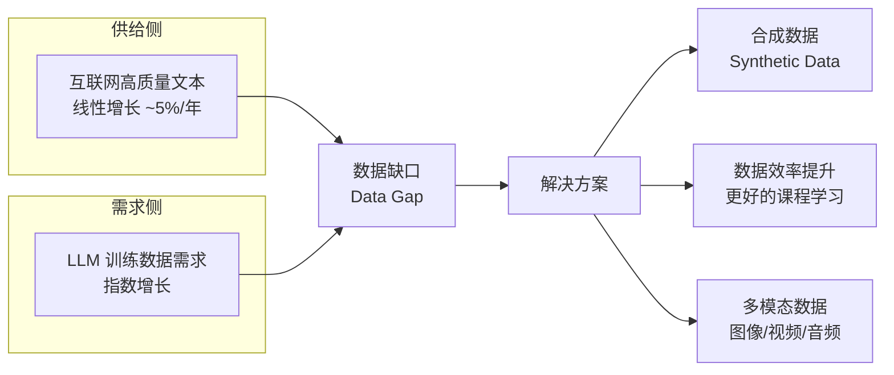

### 1.2 Model Collapse：用 AI 数据训练 AI 的风险

Shumailov et al. (2023) 提出了一个看似致命的问题：**Model Collapse（模型坍塌）**。

**理论描述**：当模型在自身生成的数据上反复训练时，输出分布会逐渐收敛到一个低方差的"均值模式"，丢失分布尾部的多样性。

数学直觉：设真实数据分布为 $p_{\text{real}}(x)$，第 $n$ 代模型的分布为 $p_n(x)$。如果第 $n+1$ 代模型在 $p_n$ 的采样上训练：

$$p_{n+1}(x) = \arg\min_q \, D_{KL}(p_n \| q) + \text{estimation error}$$

每一代的估计误差都会累积，导致：

$$\text{Var}(p_n) \to 0 \quad \text{as} \quad n \to \infty$$

**通俗理解**：想象一个画家只看自己以前的画来学习。每一代的"审美偏好"都会被放大，最终所有画都变成同一种风格——丰富多彩的艺术世界退化成了单调的重复。

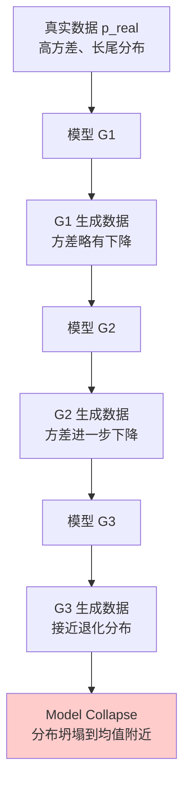

### 1.3 反直觉的发现：合成数据能超越真实数据

然而，Model Collapse 的前提是**无质量控制的自回归循环**。一系列实证研究表明，只要质量控制得当，合成数据不仅不会导致坍塌，还能超越真实数据：

| 研究 | 核心发现 |
|------|---------|
| Phi-1 (Gunasekar et al., 2023) | 用 GPT-3.5 生成"教科书级"代码数据，1.3B 模型超越 10x 更大的模型 |
| Phi-1.5 | 合成数据 + 精选真实数据，1.3B 模型在推理任务上接近 GPT-3.5 |
| Phi-2 | 2.7B 模型通过合成数据在多个基准上匹配 Llama-2-70B |
| WizardLM (Xu et al., 2023) | Evol-Instruct 生成的指令数据让 7B 模型接近 ChatGPT |
| Orca 2 (Mitra et al., 2023) | 合成推理数据让小模型学会"思考过程" |

**核心启示："Textbooks Are All You Need"**

Phi 系列的成功揭示了一个深刻原理：

$$\text{模型质量} = f(\text{数据质量}, \text{数据多样性}, \text{数据组织方式})$$

其中**数据质量的权重远大于数据数量**。一本编排精良的"教科书"胜过一万篇杂乱无章的网页文章。

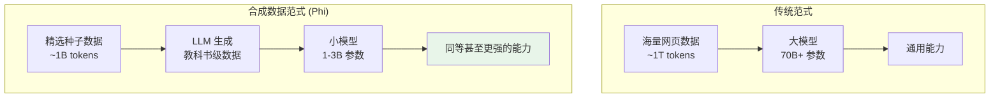

### 1.4 合成数据的分类学

合成数据并非单一概念，按生成方式和用途可分为多个类别：

| 分类维度 | 类型 | 示例 |
|----------|------|------|
| **按阶段** | 预训练合成数据 | Phi 的教科书数据 |
| | SFT 合成数据 | Self-Instruct 的指令-回复对 |
| | 对齐合成数据 | RLAIF 的 AI 偏好标注 |
| | 推理合成数据 | DeepSeek-R1 的 CoT 路径 |
| **按来源** | 模型自生成 | Self-Play |
| | 强模型→弱模型 | 知识蒸馏 |
| | 规则+模型混合 | Evol-Instruct |
| **按内容** | 指令/问题生成 | Self-Instruct |
| | 回答/推理生成 | CoT 合成 |
| | 偏好对生成 | RLAIF |
| | 风格转换 | 教科书重写 |

---

## 2. 数据生成策略

### 2.1 Self-Instruct：从种子到万千

Self-Instruct (Wang et al., 2022) 是合成指令数据的开山之作，解决了一个关键问题：**如何用少量人工标注的种子数据，自动化地生成大规模高质量的指令跟随数据？**

#### 核心流程

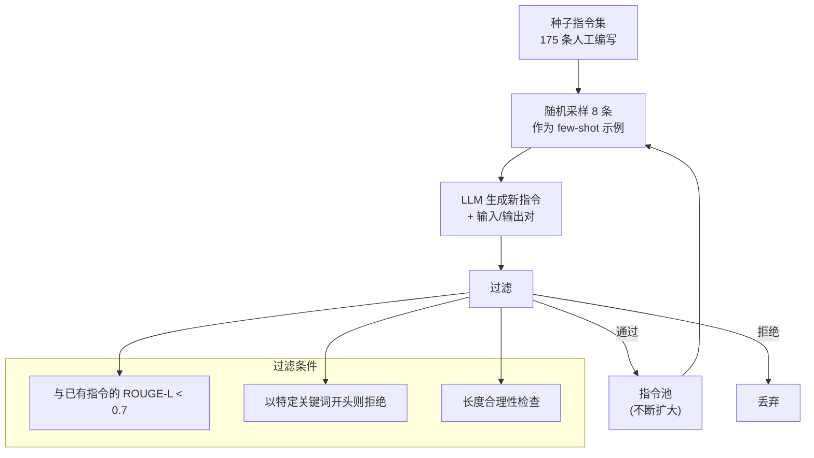

**关键设计决策**：

1. **分类任务 vs 生成任务**：分别用不同的 prompt 模板处理
2. **多样性保证**：每次采样种子时，从不同类别中选取
3. **质量过滤**：基于 ROUGE-L 的去重 + 启发式规则

#### 数学分析：多样性与覆盖度

设种子集覆盖的"技能空间"为 $\mathcal{S}_0 \subset \mathcal{S}$，经过 $T$ 轮生成后覆盖度为：

$$\text{Coverage}(T) = 1 - \prod_{t=1}^{T}(1 - p_{\text{new}}(t))$$

其中 $p_{\text{new}}(t)$ 是第 $t$ 轮生成全新技能类别的概率。随着指令池增大，$p_{\text{new}}(t)$ 递减，覆盖度增长趋于饱和。

**Self-Instruct 的局限**：生成的指令难度和复杂度受限于种子集和 prompt 模板，难以产生真正高难度或需要深度推理的指令。

### 2.2 Evol-Instruct：指令的进化论

WizardLM (Xu et al., 2023) 提出的 Evol-Instruct 解决了 Self-Instruct 的难度瓶颈：**通过系统化的"进化"操作，将简单指令逐步升级为复杂指令**。

#### 进化策略

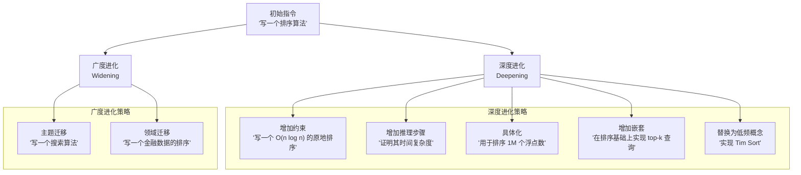

#### 进化的 Prompt 模板

深度进化的 prompt 核心结构：

```
I want you to act as a Prompt Rewriter.
Your objective is to rewrite a given prompt into a more complex version.

The rewritten prompt must be reasonable, understandable, and answerable by humans.

You can use the following methods:
1. Add more constraints or requirements
2. Replace general concepts with more specific ones
3. If the original prompt can be solved with simple thinking,
   rewrite it to require multi-step reasoning
...

Original Prompt: {instruction}
Rewritten Prompt:
```

#### 进化树结构

每条初始指令可生成一棵进化树：

```
"写一个排序算法"
├── [深度] "写一个 O(n log n) 的原地排序算法，不能使用额外数组"
│   ├── [深度] "实现原地归并排序并证明其空间复杂度为 O(log n)"
│   └── [深度] "在 100 万个浮点数上对比你的实现与 Python 内置 sort 的性能"
├── [深度] "实现 Tim Sort 并解释其在部分有序数据上的优势"
└── [广度] "实现一个支持自定义比较器的优先级队列"
```

**消融实验表明**：
- 仅深度进化：模型在复杂任务上显著提升，但简单任务可能退化
- 仅广度进化：多样性增加，但难度天花板不变
- 深度+广度结合：最优策略，两个维度互补

### 2.3 Back-Translation（回译法）

回译法借鉴自机器翻译领域，核心思想是：**从输出倒推输入，生成配对数据**。

#### 在合成数据中的应用

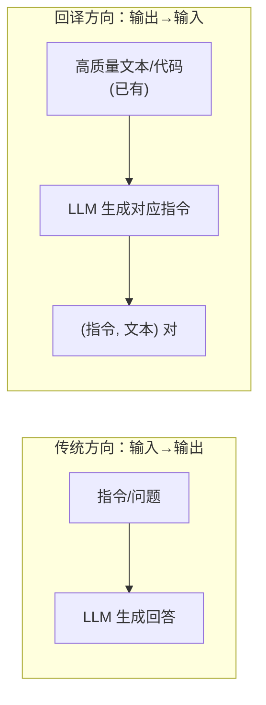

**Nemotron-4 的数据生成管线**（NVIDIA, 2024）：

1. **种子收集**：从网页中筛选高质量文本段落
2. **回译生成**：用强模型为每段文本生成对应的指令/问题
3. **质量过滤**：用 Reward Model 评分，只保留高分对
4. **多样性采样**：确保指令类别分布均衡

数学表示：设高质量文本为 $y$，回译模型 $M_{\text{bt}}$ 生成对应指令 $x$：

$$x = M_{\text{bt}}(y) = \arg\max_x \, P_{M_{\text{bt}}}(x \mid y)$$

最终得到训练对 $(x, y)$，其中 $y$ 的质量由原始文本保证，$x$ 的质量由回译模型和后续过滤保证。

### 2.4 Rephrasing & Rewriting（风格重写）

风格重写不改变信息内容，而是改变表达方式，可以从单一来源生成多种形态的训练数据。

#### 应用场景

| 源格式 | 目标格式 | 用途 |
|--------|---------|------|
| 维基百科 | 问答对 | SFT 训练 |
| 论文摘要 | 初中生读物 | 通俗化语料 |
| 代码 | 代码+注释 | 代码理解训练 |
| 英文教材 | 中文教材 | 多语言语料 |
| 长文章 | 摘要+要点 | 压缩理解训练 |

#### Prompt 示例：教科书风格重写

```
You are an expert textbook author. Rewrite the following content
as a chapter in a programming textbook for college freshmen.

Requirements:
1. Start with motivation: why is this topic important?
2. Introduce concepts gradually, from simple to complex
3. Include concrete examples for every abstract concept
4. Add "Think about it" boxes for key insights
5. End with a summary and exercises

Source material:
{raw_text}
```

Phi-1 正是通过这种方式，将 Stack Overflow 回答、编程博客等原始素材重写为结构化的教科书章节，然后用这些合成的"教科书"训练小模型。

### 2.5 Reasoning Chains Synthesis（推理链合成）

推理链合成是近年来最具影响力的合成数据技术之一，直接推动了 DeepSeek-R1、OpenAI o1 等推理模型的诞生。

#### 核心思想

传统的 SFT 数据只有 (问题, 答案) 对，推理链合成额外生成中间推理过程：

$$(x, y) \quad \longrightarrow \quad (x, \text{CoT}_1, \text{CoT}_2, \ldots, \text{CoT}_n, y)$$

#### 生成方法

**方法一：强模型蒸馏**

用能力更强的模型（如 GPT-4、Claude）生成详细推理过程：

```
Please solve the following problem step by step.
Show your complete reasoning process, including:
- What you're trying to figure out
- Each logical step and why you take it
- Any intermediate calculations
- Your final answer

Problem: {problem}
```

**方法二：RL 探索（DeepSeek-R1 风格）**

通过强化学习让模型自己探索推理路径：

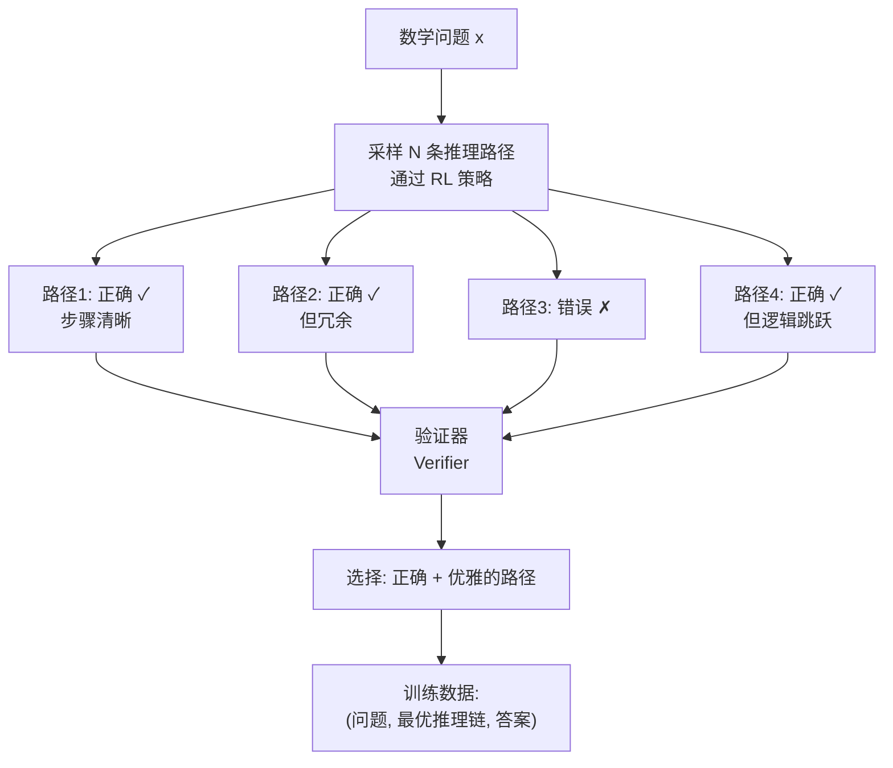

**方法三：拒绝采样 (Rejection Sampling)**

这是最实用的方法：

1. 对每个问题，采样 $K$ 条回答（temperature > 0）
2. 用验证器（或 ground truth）检查答案正确性
3. 在正确答案中，选择推理过程最清晰、步骤最少的
4. 构成训练数据

设模型 $M$ 对问题 $x$ 的正确率为 $p$，采样 $K$ 次至少获得一条正确路径的概率为：

$$P(\text{至少一条正确}) = 1 - (1-p)^K$$

| 单次正确率 $p$ | $K=4$ | $K=16$ | $K=64$ |
|---------------|-------|--------|--------|
| 10% | 34.4% | 81.5% | 99.9% |
| 30% | 76.0% | 98.8% | ~100% |
| 50% | 93.8% | ~100% | ~100% |

即使模型单次正确率仅 10%，采样 16 次就有超过 80% 的概率获得正确路径——这就是合成推理数据的统计学基础。

---

## 3. 质量控制与过滤 (Quality Filtering)

合成数据的质量控制是整个管线中**最关键也最容易被低估**的环节。没有有效过滤的合成数据不仅无益，还可能导致 Model Collapse。

### 3.1 基于规则的过滤

规则过滤是第一道防线，成本低、速度快：

| 规则类型 | 过滤条件 | 目的 |
|----------|---------|------|
| 长度过滤 | 回答长度 < 50 或 > 10000 tokens | 去除空洞或冗余内容 |
| 重复检测 | n-gram 重复率 > 阈值 | 去除生成退化 |
| 格式检查 | 包含"作为AI助手"等元表述 | 去除角色泄露 |
| 语言检测 | 非目标语言占比 > 阈值 | 保持语言一致性 |
| 特殊字符 | 乱码/控制字符比例 | 去除编码错误 |
| 代码检查 | 语法错误 / 无法解析 | 去除无效代码 |

#### 实现示例：n-gram 重复率

给定文本 $T$ 和 n-gram 大小 $n$，重复率定义为：

$$\text{RepRate}(T, n) = 1 - \frac{|\text{unique n-grams}|}{|\text{total n-grams}|}$$

当 $\text{RepRate}(T, 10) > 0.3$ 时，通常意味着文本中存在大量重复模式（LLM 生成退化的典型表现）。

### 3.2 基于模型的评分 (Reward Model Scoring)

规则过滤只能捕获表面问题，深层质量需要模型评判。

#### Reward Model 评分

使用训练好的 Reward Model (RM) 对合成数据打分：

$$s = \text{RM}(x, y) \in \mathbb{R}$$

其中 $x$ 是指令，$y$ 是回答，$s$ 是质量分数。

**常用 Reward Model**：
- **DeBERTa-v3-large**：微软的判别模型，常用作轻量级评分器
- **Llama-based RM**：在人类偏好数据上微调的 Llama 模型
- **LLM-as-Judge**：直接用强 LLM 打分

#### LLM-as-Judge 评分

当没有专门的 RM 时，可以用 LLM 自身作为评判者：

```
Rate the quality of the following response on a scale of 1-10.

Criteria:
- Accuracy: Is the information correct?
- Completeness: Does it fully address the question?
- Clarity: Is the explanation clear and well-structured?
- Helpfulness: Would this be useful to the asker?

Question: {question}
Response: {response}

Score (1-10):
Reasoning:
```

#### 困惑度过滤 (Perplexity Filtering)

合成数据的困惑度分布往往与真实数据不同。可以用一个参考模型计算困惑度：

$$\text{PPL}(y) = \exp\left(-\frac{1}{|y|}\sum_{t=1}^{|y|} \log P_{\text{ref}}(y_t \mid y_{<t})\right)$$

**过滤策略**：
- PPL 过低：可能是模板化/重复内容（模型太"确定"）
- PPL 过高：可能是噪声/不通顺内容（模型认为"不正常"）
- 保留中间区间：$\text{PPL}_{\text{low}} < \text{PPL}(y) < \text{PPL}_{\text{high}}$

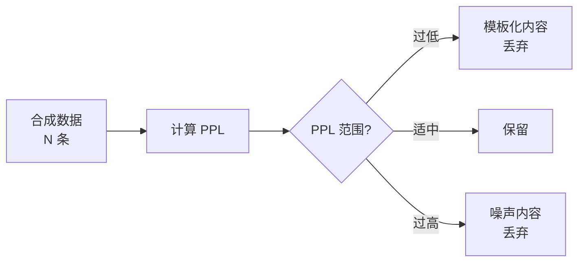

### 3.3 难度控制 (Difficulty-Conditioned Generation)

仅有高质量还不够，合成数据的**难度分布**也需要精心设计。

#### 为什么难度分布重要？

如果合成数据全是简单题：模型学不到复杂推理能力。
如果合成数据全是难题：模型在简单任务上退化，且训练信号噪声大。

最优的难度分布应该匹配 Scaling Laws 的需求——通常是一个**长尾分布**：大量简单样本建立基础，少量困难样本推动能力边界。

#### 难度估计方法

**方法一：基于正确率估计**

用当前模型对每个问题采样 $K$ 次，pass rate $r$ 作为难度的代理指标：

$$\text{Difficulty}(x) = 1 - \frac{\text{correct}(x, K)}{K}$$

**方法二：基于 token 数量**

经验上，需要更长推理链的问题通常更难：

$$\text{Difficulty}(x) \approx \alpha \cdot \mathbb{E}[\text{len}(\text{CoT}(x))]$$

**方法三：多模型投票**

多个不同能力的模型投票——强模型能解但弱模型不能的，就是中等难度：

| 弱模型 | 中等模型 | 强模型 | 难度标签 |
|--------|---------|--------|---------|
| ✓ | ✓ | ✓ | 简单 |
| ✗ | ✓ | ✓ | 中等 |
| ✗ | ✗ | ✓ | 困难 |
| ✗ | ✗ | ✗ | 超纲/无解 |

---

## 4. 自我进化 (Self-Evolution)

自我进化是合成数据技术的最高形态：**模型不再依赖外部数据源，而是通过自我对弈、自我评估来持续提升能力**。

### 4.1 Self-Play：自己出题，自己做，自己评

Self-Play 借鉴自博弈论和强化学习（如 AlphaGo），将其思想迁移到语言模型领域。

#### 核心循环

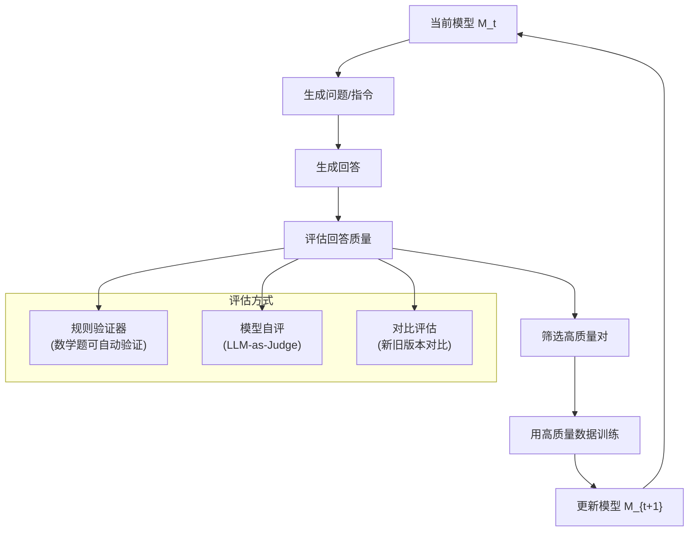

**关键挑战**：
1. **能力边界问题**：模型不能评估自己无法理解的内容
2. **分布漂移**：持续自训练可能导致模型偏离真实数据分布
3. **reward hacking**：模型可能学会"讨好"自己的评估器

#### 数学建模

设模型在第 $t$ 轮的策略为 $\pi_t$，Self-Play 的目标是：

$$\pi_{t+1} = \arg\max_{\pi} \, \mathbb{E}_{x \sim \pi_t, y \sim \pi}[R(x, y)]$$

其中 $R(x, y)$ 是验证器给出的奖励。

当 $R$ 是完美验证器（如数学题的正确性检查）时，这一过程有理论收敛保证。当 $R$ 是模型自身的评估时，需要额外的正则化来防止 reward hacking。

### 4.2 SPIN (Self-Play Fine-Tuning)

SPIN (Chen et al., 2024) 将 Self-Play 形式化为一个两人零和博弈。

#### 框架

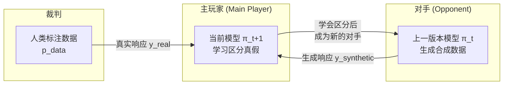

#### 数学原理

SPIN 的训练目标：

$$\mathcal{L}_{\text{SPIN}}(\pi_{t+1}) = \mathbb{E}_{x \sim p_{\text{data}}} \left[ \ell\left( \log\frac{\pi_{t+1}(y_{\text{real}} \mid x)}{\pi_t(y_{\text{real}} \mid x)} - \log\frac{\pi_{t+1}(y_{\text{synth}} \mid x)}{\pi_t(y_{\text{synth}} \mid x)} \right) \right]$$

其中：
- $y_{\text{real}}$ 来自真实数据分布 $p_{\text{data}}$
- $y_{\text{synth}}$ 由上一版本模型 $\pi_t$ 生成
- $\ell$ 是 logistic loss: $\ell(z) = \log(1 + e^{-z})$

**直觉理解**：
- 正例：人类标注的真实回答
- 负例：模型自身上一版本的生成
- 目标：让新版本能区分"真实数据"和"旧版本的输出"

**收敛性质**：当且仅当 $\pi_t = p_{\text{data}}$ 时，损失达到最小值。这意味着模型通过不断"超越旧版本的自己"，逐步逼近真实数据分布。

$$\pi_0 \to \pi_1 \to \pi_2 \to \cdots \to p_{\text{data}}$$

#### 与 DPO 的联系

SPIN 的数学形式与 DPO 高度相似：

| | DPO | SPIN |
|---|-----|------|
| 正例 | 人类偏好的 $y_w$ | 真实数据 $y_{\text{real}}$ |
| 负例 | 人类不偏好的 $y_l$ | 模型自身生成 $y_{\text{synth}}$ |
| 参考模型 | 固定的 $\pi_{\text{ref}}$ | 上一版本 $\pi_t$（迭代更新） |

关键区别：SPIN 不需要人类偏好标注，只需要真实数据作为"标杆"。

### 4.3 数据飞轮 (Data Flywheel)

当合成数据与模型训练形成正反馈循环时，就产生了**数据飞轮**效应：

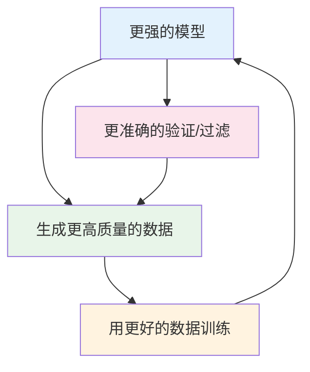

**飞轮的启动条件**：
1. 模型能力需要超过一个"最低门槛"，否则生成的数据质量太差无法启动
2. 需要可靠的验证器（数学题有 ground truth，通用任务则依赖 RM）
3. 需要有效的去重和多样性控制，防止分布坍塌

**飞轮的极限**：数据飞轮并非无限加速。随着模型能力接近验证器的能力边界，改进速率递减。最终受限于：
- 验证器的辨别力上限
- 问题空间的探索效率
- 模型架构本身的表达力上限

---

## 5. 三条技术线的合成数据实践

### 5.1 Google / DeepMind

Google 在合成数据方面的贡献跨越了代码生成和通用能力两个维度：

**AlphaCode（2022）** 的数据策略：
- 从 Codeforces 等竞赛平台收集问题
- 生成数百万条解法候选，用执行测试用例过滤
- 关键创新：用**聚类+排序**从大量候选中选出多样的解法

**Gemini 的合成数据配比**（基于公开报道）：
- 预训练阶段混入合成数学/代码数据
- SFT 阶段大量使用合成指令数据
- 具体配比未公开，但业界估计合成数据占 SFT 数据的 30-50%

### 5.2 DeepSeek

DeepSeek 是合成数据实践的标杆，其多个项目展示了系统化的合成数据工程。

**DeepSeek-Math (2024)**：
- 从 Common Crawl 中用规则+模型混合过滤筛选数学相关网页
- 用 DeepSeek-67B 生成数学推理链
- 关键：用验证器（数学答案的精确匹配）确保推理正确性

**DeepSeek-Coder (2024)**：
- 从 GitHub 筛选高质量代码库
- 用 LLM 为代码生成文档和测试
- 回译法：从代码生成自然语言描述，构成 (描述, 代码) 对

**DeepSeek-R1 (2025) 的冷启动与迭代**：

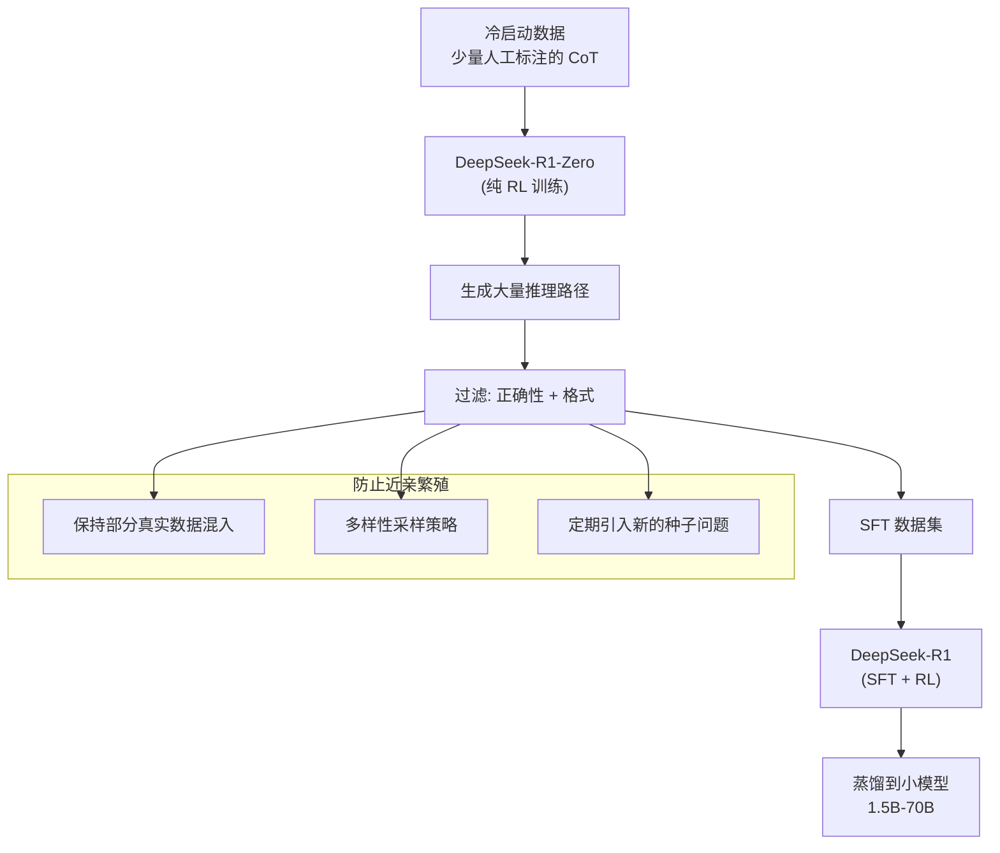

**如何防止"近亲繁殖"导致的能力退化**：
1. **真实数据混入**：始终保持一定比例（如 20-30%）的真实数据
2. **多样性采样**：从不同难度、不同领域均匀采样
3. **新种子注入**：定期从外部获取新问题（如最新竞赛题）
4. **多模型生成**：用不同 checkpoint 或不同模型生成，避免单一分布

### 5.3 Anthropic

Anthropic 在合成数据领域的最独特贡献是将合成数据用于**对齐（Alignment）**而非纯能力提升。

**Constitutional AI 中的 RLAIF (AI Feedback)**：

传统 RLHF 依赖大量人类偏好标注，成本高且速度慢。Constitutional AI (Bai et al., 2022) 提出用 AI 自身替代人类标注者：

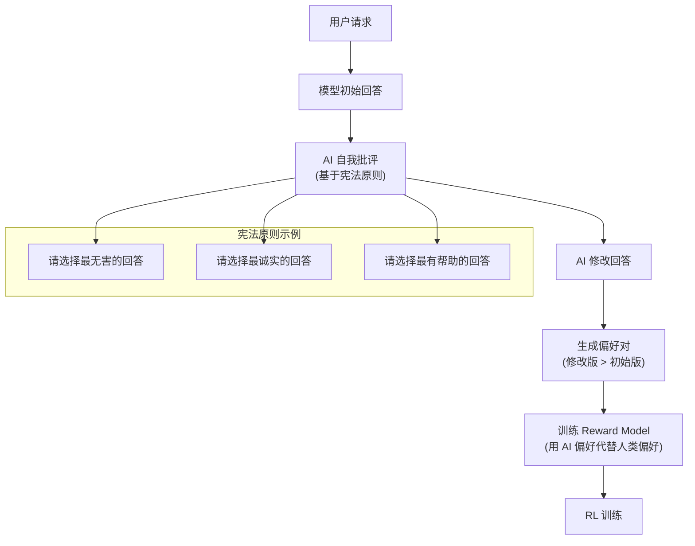

**核心流程**：
1. **批评 (Critique)**：模型根据"宪法原则"评估自己的回答是否安全
2. **修订 (Revision)**：模型根据批评修改回答
3. **偏好对构建**：(修订后回答, 原始回答) 构成偏好对
4. **RLAIF 训练**：用这些 AI 生成的偏好对训练 Reward Model

**合成数据在 Red Teaming 中的应用**：

Anthropic 还将合成数据用于安全测试：
- 用 LLM 自动生成"攻击 prompt"（红队数据）
- 训练模型抵御这些攻击
- 迭代：生成更难的攻击 → 训练更强的防御 → 生成更难的攻击...

这构成了一个安全领域的"数据飞轮"。

---

## 6. 项目实践

### 项目1：实现 Evol-Instruct 流程生成 100 条指令（难度：⭐⭐ 进阶）

**目标**：实现完整的 Evol-Instruct 管线，从 10 条种子指令出发，通过深度进化和广度进化，生成 100 条高质量、不同难度的指令数据。

**提示与关键代码片段**：

1. **进化策略的实现**：用 prompt 模板驱动 LLM 进行指令进化

```python
# 深度进化的 prompt 模板
DEPTH_EVOLUTION_PROMPT = """
请将以下指令改写为更复杂的版本。你可以：
1. 增加约束条件
2. 将通用概念替换为更具体的概念
3. 增加推理步骤的要求
4. 增加嵌套条件

原始指令: {instruction}
改写后的指令:
"""

# 广度进化的 prompt 模板
BREADTH_EVOLUTION_PROMPT = """
请基于以下指令的主题，生成一条全新的、不同领域但类似复杂度的指令。

原始指令: {instruction}
新指令:
"""
```

2. **进化树管理**：跟踪每条指令的进化路径

```python
@dataclass
class EvolNode:
    instruction: str
    depth: int
    evolution_type: str  # 'seed', 'depth', 'breadth'
    parent_id: Optional[str] = None
    children_ids: list = field(default_factory=list)
```

3. **去重与过滤**：使用 ROUGE-L 过滤相似指令

```python
from rouge_score import rouge_scorer
scorer = rouge_scorer.RougeScorer(['rougeL'], use_stemmer=True)
# ROUGE-L > 0.7 视为重复
```

**评估指标**：
- 指令的难度分布（按 LLM 打分的 1-5 分统计）
- 指令的多样性（类别覆盖度）
- 进化成功率（进化后指令被保留的比例）

---

### 项目2：使用小模型复现 Phi-1 的"教科书"数据生成（难度：⭐⭐ 进阶）

**目标**：实现 Phi-1 论文中的核心思路——将原始代码/文本重写为"教科书"风格，并验证合成教科书数据对小模型训练的效果。

**提示与关键代码片段**：

1. **教科书风格重写的 prompt 设计**

```python
TEXTBOOK_PROMPT = """
你是一位经验丰富的编程教科书作者。请将以下代码/文本改写为教科书中的一个小节。

要求：
1. 以"为什么需要这个？"作为开头，说明动机
2. 逐步引入概念，从简单到复杂
3. 每个抽象概念都配有具体的代码示例
4. 在关键处添加"思考题"
5. 以总结和练习结尾

原始材料:
{source_text}

教科书风格输出:
"""
```

2. **数据清洗流程**：对原始代码进行预处理

```python
def clean_source_code(code: str) -> str:
    """清洗原始代码，去除噪声"""
    # 1. 去除过长的文件（> 500 行）
    # 2. 去除无函数定义的文件
    # 3. 去除注释比例 < 5% 的文件（质量信号）
    # 4. 去除包含敏感信息的文件
    ...
```

3. **质量评估**：对比原始数据与合成教科书数据

```python
# 评估维度
# 1. 可读性：Flesch-Kincaid Grade Level
# 2. 信息密度：unique concepts per 100 tokens
# 3. 结构化程度：标题/列表/代码块比例
```

**评估方法**：
- 人工评估：10 条原始 vs 合成的对比
- 自动指标：可读性分数、信息密度
- 下游验证（可选）：用合成数据微调小模型，测试代码生成能力

---

### 项目3：构建一个 Self-Play 循环提升数学解题能力（难度：⭐⭐⭐ 挑战）

**目标**：实现完整的 Self-Play 循环，让模型通过自我生成题目、自我解答、自我验证来迭代提升数学解题能力。

**验证器逻辑**：

```python
def verify_math_answer(problem: str, solution: str, ground_truth: str) -> bool:
    """
    数学答案验证器

    策略:
    1. 提取最终答案（正则匹配 \\boxed{} 或最后一个数字）
    2. 数值比较（允许浮点误差）
    3. 符号比较（简化后比较）
    """
    predicted = extract_answer(solution)
    expected = extract_answer(ground_truth)
    return math_equal(predicted, expected, tolerance=1e-6)
```

**循环框架**（伪代码）：

```
初始化:
  model = load_model("base_model")
  seed_problems = load_gsm8k_or_math()  # 种子题库

for round in range(num_rounds):
    # 1. 生成新问题（可选，或直接用种子题）
    new_problems = model.generate_problems(n=50)
    all_problems = seed_problems + new_problems

    # 2. 采样解答路径
    for problem in all_problems:
        solutions = [model.solve(problem) for _ in range(K)]

        # 3. 验证
        correct_solutions = [s for s in solutions
                           if verify(problem, s)]

        # 4. 选择最佳
        if correct_solutions:
            best = select_best(correct_solutions)  # 最短/最清晰
            training_data.append((problem, best))

    # 5. 训练
    model = fine_tune(model, training_data)

    # 6. 评估
    score = evaluate(model, test_set)
    print(f"Round {round}: accuracy = {score}")
```

**关键设计决策**：
- 采样温度：$T = 0.7$（平衡多样性和质量）
- 每题采样次数：$K = 8$（统计充分性和成本的平衡）
- 验证策略：数学题用精确匹配，通用题用 LLM-as-Judge
- 防坍塌：每轮保留 30% 的原始种子数据

**评估指标**：
- 每轮的 pass@1 和 pass@K 变化曲线
- 解题路径的平均长度变化（理想情况：先增后减，即先学会推理再学会精简）
- 不同难度题目的正确率变化

---

### 项目4：训练一个数据质量打分模型 (Reward Model)（难度：⭐⭐⭐ 挑战）

**目标**：构建一个能评估合成数据质量的 Reward Model，然后用它过滤合成数据，验证过滤后的数据训练效果是否更好。

**数据集构建思路**：

```
1. 收集正例（高质量回答）:
   - GPT-4/Claude 的回答
   - 人工标注为"好"的回答
   - 高赞的 Stack Overflow 回答

2. 收集负例（低质量回答）:
   - 弱模型的回答
   - 人工标注为"差"的回答
   - 故意加入错误/不完整的回答

3. 构建偏好对:
   (question, good_answer, bad_answer)
```

**训练脚本**（关键片段）：

```python
class RewardModel(nn.Module):
    """
    基于预训练语言模型的 Reward Model

    架构: 预训练 LM + 线性头 -> 标量分数
    损失: Bradley-Terry 排序损失
    """
    def __init__(self, base_model_name: str):
        super().__init__()
        self.backbone = AutoModel.from_pretrained(base_model_name)
        self.reward_head = nn.Linear(hidden_size, 1)

    def forward(self, input_ids, attention_mask):
        outputs = self.backbone(input_ids, attention_mask=attention_mask)
        # 使用最后一个 token 的表示
        last_hidden = outputs.last_hidden_state[:, -1, :]
        reward = self.reward_head(last_hidden)
        return reward.squeeze(-1)

# Bradley-Terry 损失
def bt_loss(reward_chosen, reward_rejected):
    return -torch.log(torch.sigmoid(reward_chosen - reward_rejected)).mean()
```

**评估方法**：
- RM 自身的准确率：在 held-out 偏好数据上测试
- 过滤效果：对比过滤前后的数据训练出的模型质量
- 与人类评判的一致性：Spearman/Kendall 相关系数

**参考论文**：Ouyang et al. (2022). *Training language models to follow instructions with human feedback.* (InstructGPT)

---

## 本章小结

### 核心知识点

1. **数据枯竭是真实威胁**：高质量互联网文本将在数年内耗尽，合成数据是必然出路
2. **Model Collapse 可防可控**：关键在于质量过滤、多样性保持和真实数据混入
3. **"Textbooks Are All You Need"**：数据质量 > 数据数量，精心设计的合成数据可以以小博大
4. **Evol-Instruct**：通过深度+广度进化系统地提升指令复杂度和多样性
5. **推理链合成**：拒绝采样 + 验证器是最实用的方法，DeepSeek-R1 展示了大规模应用
6. **质量过滤三层防线**：规则过滤 → 模型评分 → 难度控制
7. **Self-Play 与 SPIN**：模型通过自我对弈逼近目标分布，数学上有收敛保证
8. **数据飞轮**：模型越强 → 数据越好 → 模型更强，但受限于验证器能力

### 数学要点

- Chinchilla Scaling: $D_{\text{optimal}} \propto C^{0.5}$
- 拒绝采样成功率: $P(\geq 1 \text{ correct}) = 1 - (1-p)^K$
- n-gram 重复率: $\text{RepRate}(T, n) = 1 - \frac{|\text{unique n-grams}|}{|\text{total n-grams}|}$
- SPIN 损失: $\ell\left(\log\frac{\pi_{t+1}(y_{\text{real}})}{\pi_t(y_{\text{real}})} - \log\frac{\pi_{t+1}(y_{\text{synth}})}{\pi_t(y_{\text{synth}})}\right)$

### 实践要点

1. 合成数据生成的成本-质量权衡：强模型生成质量高但贵，弱模型便宜但需更多过滤
2. 过滤比生成更重要：宁愿丢弃 80% 也不要混入低质量数据
3. 始终保持真实数据混入（至少 20-30%），防止分布漂移
4. 验证器是合成数据管线的灵魂——有可靠验证器的领域（数学、代码）最适合合成数据

---

## 参考资料

### 论文

1. Wang et al. (2022). *Self-Instruct: Aligning Language Models with Self-Generated Instructions.*
2. Xu et al. (2023). *WizardLM: Empowering Large Language Models to Follow Complex Instructions.* (Evol-Instruct)
3. Gunasekar et al. (2023). *Textbooks Are All You Need.* (Phi-1)
4. Li et al. (2023). *Textbooks Are All You Need II: phi-1.5 technical report.*
5. Shumailov et al. (2023). *The Curse of Recursion: Training on Generated Data Makes Models Forget.*
6. Villalobos et al. (2022). *Will we run out of data? An analysis of the limits of scaling datasets in Machine Learning.*
7. Chen et al. (2024). *Self-Play Fine-Tuning Converts Weak Language Models to Strong Language Models.* (SPIN)
8. Mitra et al. (2023). *Orca 2: Teaching Small Language Models How to Reason.*
9. Bai et al. (2022). *Constitutional AI: Harmlessness from AI Feedback.* Anthropic.
10. DeepSeek-AI (2025). *DeepSeek-R1: Incentivizing Reasoning Capability in LLMs via Reinforcement Learning.*
11. Adler et al. (2024). *Nemotron-4 340B Technical Report.* NVIDIA.
12. Ouyang et al. (2022). *Training language models to follow instructions with human feedback.* (InstructGPT)

### 博客

1. [Self-Instruct GitHub](https://github.com/yizhongw/self-instruct) - 原始实现
2. [WizardLM GitHub](https://github.com/nlpxucan/WizardLM) - Evol-Instruct 实现
3. [Phi-1 论文解读](https://arxiv.org/abs/2306.11644) - Microsoft Research

---

**相关模块**：
- [模块7: 数据工程](../07_data_engineering/README.md) — 预训练阶段的数据管线设计
- [模块8A: 预训练目标](../08a_pretraining_objectives/README.md) — 理解合成数据如何服务于训练目标
- [模块10: SFT](../10_sft/README.md) — 合成指令数据的直接消费者
- [模块11: RLHF](../11_rlhf/README.md) — 理解 RLAIF 的 RL 训练基础
- [模块13: 推理](../13_reasoning/README.md) — 推理链合成的下游应用
