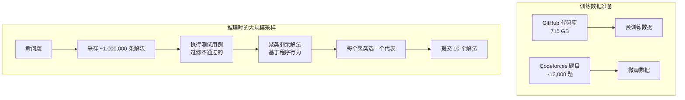
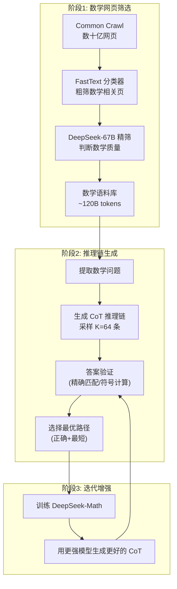
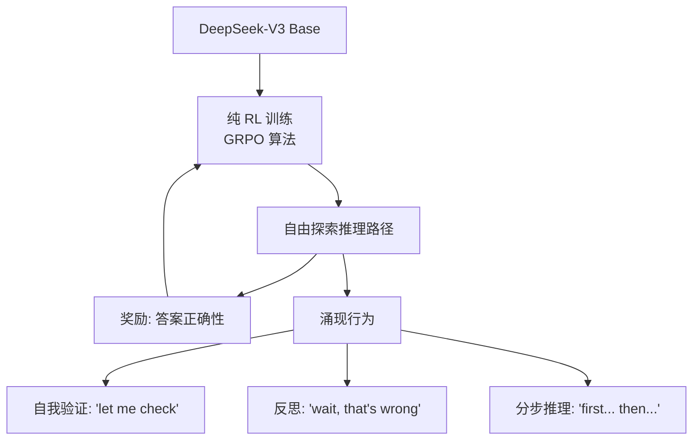
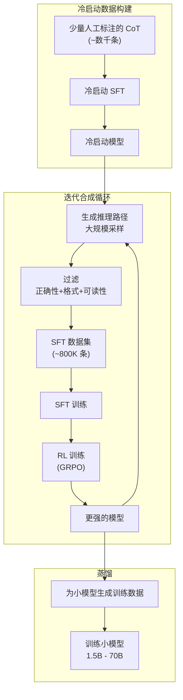
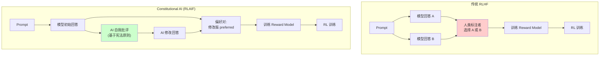
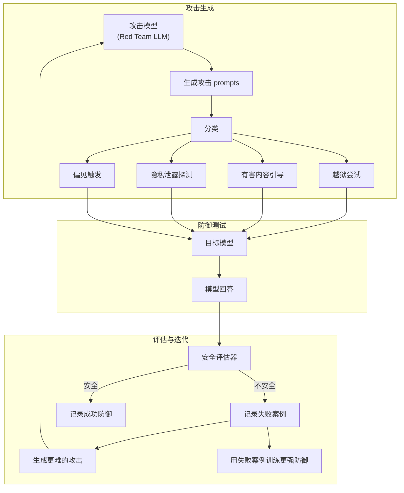
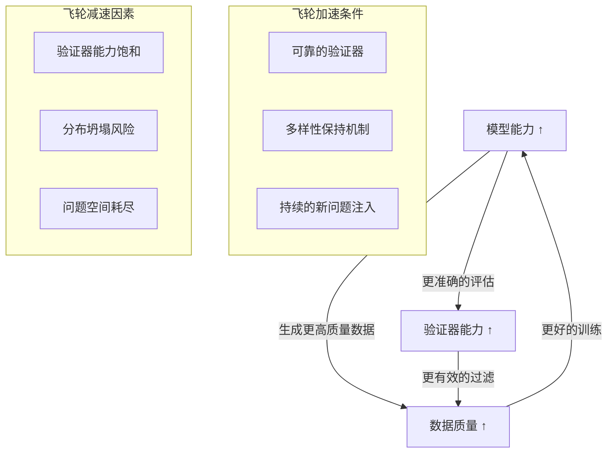
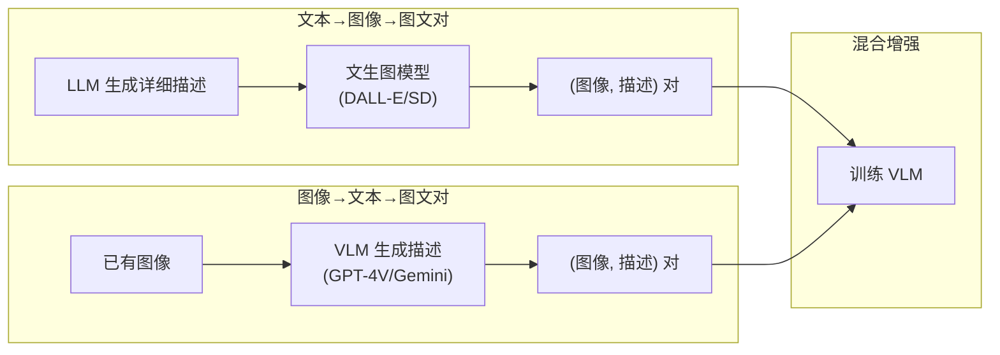
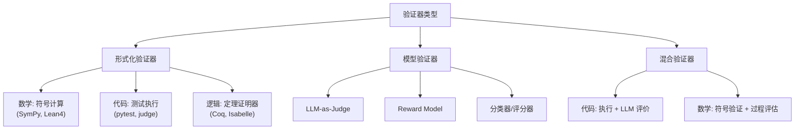
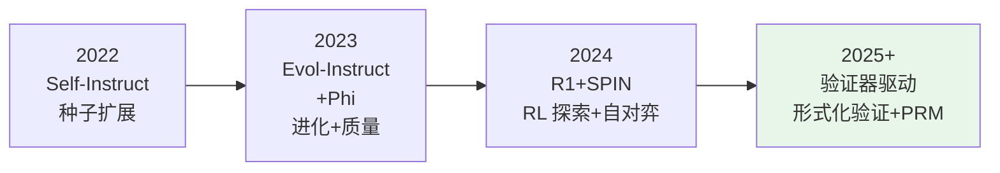

# 合成数据与自我进化：工业实践与前沿研究

> 本文是 [模块17: 合成数据与自我进化](./README.md) 的进阶补充，深入分析 Google、DeepSeek、Anthropic 三条技术线在合成数据上的工业实践，以及合成数据领域的前沿研究方向。

---

## 目录

- [1. Google / DeepMind 的合成数据研究](#1-google--deepmind-的合成数据研究)
- [2. DeepSeek 的合成数据实践](#2-deepseek-的合成数据实践)
- [3. Anthropic 视角](#3-anthropic-视角)
- [4. 前沿话题](#4-前沿话题)

---

## 1. Google / DeepMind 的合成数据研究

### 1.1 AlphaCode 的数据生成策略

AlphaCode (Li et al., 2022) 是 DeepMind 在竞赛级代码生成上的里程碑工作，其数据策略极具启发性。

#### 数据管线



**关键创新：程序行为聚类**

AlphaCode 不是简单地从百万条采样中选"最好的"，而是：

1. **执行过滤**：运行每条解法的公开测试用例，丢弃不通过的（约过滤 99%）
2. **行为聚类**：对通过的解法，生成随机输入，按输出结果聚类
3. **代表选择**：每个行为聚类选一个代表提交

这种策略的本质是**最大化解法多样性**——不同的正确解法可能对应不同的算法思路，提交多种思路比提交同一种思路的变体更有价值。

#### 数学分析：采样规模 vs 通过率

设模型对某题的 pass@1 = $p$，采样 $N$ 条后经过过滤和聚类，最终提交 $k$ 条，有效 pass rate 为：

$$\text{pass@k} = 1 - \frac{\binom{N-c}{k}}{\binom{N}{k}}$$

其中 $c$ 是 $N$ 条采样中通过所有测试用例的数量，$c \approx N \cdot p$。

当 $N = 10^6$, $p = 0.001$, $k = 10$：
- $c \approx 1000$ 条通过
- 经过聚类，可能得到 50-200 个不同的行为簇
- 从中选 10 个，覆盖了大部分可能的正确算法

**对合成数据的启示**：大规模采样 + 高效过滤 + 多样性选择，是从低 pass rate 中提取高质量数据的通用方法论。

### 1.2 Gemini 训练中的合成数据配比

Google 在 Gemini 系列模型中大规模使用了合成数据，虽然具体配比未完全公开，但从 Gemini Technical Report 和相关论文中可以推断关键策略：

#### 多阶段合成数据策略

| 训练阶段 | 合成数据类型 | 估计占比 | 用途 |
|----------|-------------|---------|------|
| 预训练 | 合成数学推导 | 5-15% | 增强数学推理基底 |
| 预训练 | 合成代码+文档 | 10-20% | 代码理解与生成 |
| 预训练 | 合成多语言对 | 5-10% | 跨语言对齐 |
| SFT | 合成指令数据 | 30-50% | 指令跟随能力 |
| RLHF | AI 偏好标注 | 大量 | 降低人工标注成本 |

#### Google 的数据混合原则

基于 PaLM 2 Technical Report 和后续工作，Google 的数据混合遵循以下原则：

1. **领域平衡**：即使某领域数据稀缺，也通过合成数据补齐，避免"偏科"
2. **质量优先**：合成数据经过多轮过滤，质量控制比数量更重要
3. **课程学习**：合成数据的难度随训练进程逐步提升

### 1.3 Google 的合成数据质量研究

**"Scaling Data-Constrained Language Models" (Muennighoff et al., 2023)**

Google Research 的这篇论文系统研究了数据受限场景下的最优策略：

| 策略 | 描述 | 效果 |
|------|------|------|
| 重复训练 | 对相同数据训练多个 epoch | 有效，但收益递减；4 epoch 后显著衰减 |
| 数据增强 | 对原始数据做轻微变换 | 在某些任务上有效，但整体提升有限 |
| 代码数据混入 | 增加代码数据比例 | 显著提升推理能力（即使目标不是代码） |
| 合成数据 | 用大模型生成训练数据 | 最有效的策略，尤其在质量控制充分时 |

**核心发现**：
- 数据重复的边际收益在 $\sim 4$ epoch 后快速递减
- 合成数据是突破数据瓶颈最有效的手段
- 合成数据与真实数据的最优混合比例约为 **3:7 到 5:5**

---

## 2. DeepSeek 的合成数据实践

DeepSeek 是当前合成数据工程实践的标杆。其多个产品线展示了从数据收集到模型训练的完整工业流程。

### 2.1 DeepSeek-Math 的数据生成

DeepSeek-Math (Shao et al., 2024) 在数学推理上取得了显著成果，其数据策略是关键。

#### 数据管线详解



**数学网页筛选的关键细节**：

1. **两阶段过滤**：
   - FastText 分类器：速度快（~10M 网页/小时），但精度一般（~85%）
   - LLM 精筛：对 FastText 通过的网页，用 DeepSeek-67B 判断是否包含有价值的数学内容

2. **质量标准**：
   - 包含数学公式（LaTeX 或 MathML）
   - 推理过程完整（不只是答案）
   - 解释清晰（不只是符号堆砌）

3. **最终产出**：从数十亿网页中筛选出约 120B tokens 的数学语料，相当于总量的约 0.1%

#### 推理链的质量控制

DeepSeek-Math 的推理链合成采用了精细的质量控制策略：

**Step-level Verification（步骤级验证）**：

不仅验证最终答案，还尝试验证中间步骤：

$$\text{Quality}(\text{CoT}) = \alpha \cdot \mathbb{1}[\text{答案正确}] + \beta \cdot \frac{|\text{正确步骤}|}{|\text{总步骤}|} + \gamma \cdot \frac{1}{|\text{CoT}|}$$

其中：
- $\alpha$：答案正确性权重（最高）
- $\beta$：步骤正确率权重
- $\gamma$：简洁性奖励（鼓励更短的正确推理）

### 2.2 DeepSeek-Coder 的数据管线

DeepSeek-Coder (Guo et al., 2024) 的代码数据合成展示了另一种合成数据范式：不从零生成，而是**增强已有数据**。

#### 代码数据增强策略

| 增强类型 | 方法 | 产出 |
|----------|------|------|
| **文档生成** | 为代码生成 docstring 和注释 | (代码, 文档) 对 |
| **测试生成** | 为函数生成单元测试 | (代码, 测试) 对 |
| **回译** | 从代码生成自然语言描述 | (描述, 代码) 对 |
| **变体生成** | 用不同风格/语言重写同一功能 | 多语言代码对 |
| **Bug 注入+修复** | 故意引入 bug，再生成修复 | (buggy_code, fix) 对 |

**回译法在代码领域的具体应用**：

```
给定函数:
def binary_search(arr, target):
    left, right = 0, len(arr) - 1
    while left <= right:
        mid = (left + right) // 2
        if arr[mid] == target:
            return mid
        elif arr[mid] < target:
            left = mid + 1
        else:
            right = mid - 1
    return -1

回译生成的描述:
"实现二分查找算法。给定一个已排序的数组和目标值，
 返回目标值的索引。如果目标值不存在，返回 -1。
 时间复杂度: O(log n)，空间复杂度: O(1)。"
```

### 2.3 DeepSeek-R1：冷启动数据与 RL 的迭代循环

DeepSeek-R1 (2025) 是合成数据在推理领域最成功的应用之一。

#### 两阶段策略

**阶段1: R1-Zero（纯 RL 探索）**



R1-Zero 的关键发现：
- **不需要任何 CoT 标注数据**，纯靠 RL 奖励信号就能涌现出推理行为
- 模型自发学会了"反思"和"自我纠错"
- 但输出格式混乱、可读性差

**阶段2: R1（冷启动 SFT + RL）**



#### 冷启动数据的精心设计

DeepSeek-R1 的冷启动数据虽然数量少（约数千条），但设计极为讲究：

1. **格式规范**：明确的 `<think>...</think>` 标签包裹推理过程
2. **推理风格**：展示"探索-验证-修正"的思考模式
3. **多样性**：覆盖数学、代码、逻辑、科学等多个领域
4. **难度梯度**：从简单到复杂，建立推理习惯

#### 防止"近亲繁殖"的工程实践

DeepSeek-R1 在迭代过程中采取了多项措施防止分布退化：

| 策略 | 具体做法 | 目的 |
|------|---------|------|
| **真实数据混入** | 每轮保持 20-30% 真实数据 | 锚定真实分布 |
| **多模型采样** | 用不同 checkpoint 采样 | 增加多样性 |
| **温度调节** | 较高温度（0.7-1.0）采样 | 探索更多路径 |
| **新题注入** | 持续从外部获取新问题 | 扩展覆盖范围 |
| **负例利用** | 将错误路径作为 DPO 负例 | 避免重复犯错 |

#### 蒸馏数据的质量控制

R1 蒸馏到小模型时，合成数据的选择标准更为严格：

1. **正确性**：答案必须通过验证器
2. **可读性**：推理过程必须清晰、有逻辑
3. **简洁性**：优先选择推理步骤更少的正确路径
4. **多样性**：同一类型的题目不过度重复
5. **难度适配**：根据目标模型大小调整难度分布

### 2.4 DeepSeek 的数据合成哲学

综合 DeepSeek 多个产品线的实践，可以提炼出几个核心原则：

1. **验证器为王**：有可靠验证器的领域（数学、代码）优先做合成数据
2. **迭代而非一次性**：模型-数据交替提升，飞轮效应
3. **质量 > 数量**：宁愿 10 万条高质量数据，不要 1000 万条噪声数据
4. **多样性是防线**：多来源、多模型、多温度、多格式

---

## 3. Anthropic 视角

Anthropic 在合成数据领域的贡献独树一帜：它更关注合成数据在**对齐（Alignment）**中的作用，而非纯能力提升。

### 3.1 Constitutional AI 中的 RLAIF

Constitutional AI (Bai et al., 2022) 是 Anthropic 最具代表性的工作之一，其核心创新是用 **AI 生成的偏好数据替代人类标注**。

#### 传统 RLHF vs Constitutional AI



**成本对比**：

| 维度 | 传统 RLHF | RLAIF |
|------|-----------|-------|
| 标注成本 | 高（$0.5-2 per 对） | 极低（API 调用成本） |
| 标注速度 | 慢（人工瓶颈） | 快（可并行） |
| 一致性 | 受标注者间差异影响 | 高一致性 |
| 覆盖面 | 受限于标注预算 | 几乎无限 |
| 偏见风险 | 标注者的文化/个人偏见 | 模型的系统偏见 |

#### 宪法原则的设计

Constitutional AI 的"宪法"是一组指导 AI 自我评估的原则。这些原则本身就是一种精巧的合成数据生成模板：

**原则示例**：

```
1. "请选择对人类最无害、最有帮助的回答。"
2. "请选择不会鼓励非法活动的回答。"
3. "请选择最诚实、不编造信息的回答。"
4. "请选择对提问者最尊重的回答。"
5. "请选择不包含刻板印象或偏见的回答。"
```

**批评-修订 (Critique-Revision) 流程**：

对于每个 (prompt, response) 对：

```
Step 1 - 批评:
"请根据以下原则评估这个回答: [原则]
这个回答存在什么问题?"

-> AI 输出批评意见

Step 2 - 修订:
"请根据以上批评，修改回答使其更符合原则。"

-> AI 输出修改后的回答

Step 3 - 构建偏好对:
(modified_response, original_response) -> (chosen, rejected)
```

#### 多轮批评-修订的质量提升

Anthropic 发现，多轮批评-修订可以持续提升回答质量：

| 修订轮次 | 安全性评分（人类评估） | 有帮助程度 |
|----------|----------------------|-----------|
| 原始回答 | 3.2 / 5 | 4.1 / 5 |
| 第1轮修订 | 4.1 / 5 | 4.0 / 5 |
| 第2轮修订 | 4.5 / 5 | 3.9 / 5 |
| 第3轮修订 | 4.7 / 5 | 3.8 / 5 |

注意：安全性持续提升，但有帮助程度略有下降——这反映了安全性与有帮助性之间的固有张力。

### 3.2 合成数据在红队测试中的应用

Anthropic 将合成数据大规模应用于模型安全的红队测试（Red Teaming）。

#### 自动化红队数据生成



**红队数据的生成策略**：

1. **种子攻击**：人工编写初始的攻击 prompt（约 100-500 条）
2. **进化攻击**：类似 Evol-Instruct，对攻击 prompt 做深度/广度进化
3. **对抗训练**：用攻击数据训练防御 → 防御更强 → 需要更强的攻击
4. **多语言覆盖**：自动将攻击翻译为多种语言测试

#### Perez et al. (2022) 的发现

Anthropic 的研究 (*Red Teaming Language Models with Language Models*) 发现：

- LLM 生成的红队数据可以发现**人类红队未发现的漏洞**
- 自动化红队测试的覆盖面远超人工（数量级差异）
- 但 LLM 生成的攻击在"创造性"上仍不如人类专家

### 3.3 Anthropic 合成数据的独特哲学

相比 Google 和 DeepSeek 主要将合成数据用于能力提升，Anthropic 的合成数据使用有几个独特特征：

1. **安全优先**：合成数据首先服务于安全对齐，而非能力提升
2. **原则驱动**：合成数据的生成和过滤由明确的"宪法原则"指导
3. **自我改进**：模型批评-修订自身输出，而非依赖外部标注
4. **对抗性**：主动生成攻击数据来测试和强化防御

这种哲学反映了 Anthropic 的核心信念：**安全的 AI 不是通过限制能力实现的，而是通过更好的训练数据和对齐方法实现的**。

---

## 4. 前沿话题

### 4.1 数据飞轮（Data Flywheel）：正反馈循环的极限

数据飞轮是合成数据最令人兴奋的前景——一个自我加速的正反馈循环：



#### 飞轮的数学建模

设第 $t$ 轮模型能力为 $C_t$，生成数据质量为 $Q_t$，则飞轮动力学可建模为：

$$C_{t+1} = C_t + \alpha \cdot (Q_t - C_t)^+ \cdot \eta_t$$

$$Q_{t+1} = f(C_{t+1}, V_t, \text{diversity}_t)$$

其中：
- $\alpha$：学习效率
- $(Q_t - C_t)^+$：只有当数据质量高于模型当前能力时才有改进
- $\eta_t$：多样性衰减因子
- $V_t$：验证器能力

**飞轮的三个阶段**：

| 阶段 | 特征 | 挑战 |
|------|------|------|
| **启动期** | 模型能力低，生成数据质量差 | 需要外部高质量种子数据 |
| **加速期** | 模型和数据相互促进，快速提升 | 需要防止过拟合到特定模式 |
| **饱和期** | 改进速率递减，接近上限 | 受验证器能力和架构上限制约 |

#### 当前最成功的飞轮案例

**数学推理领域**（DeepSeek-R1）：
- 验证器可靠（数学答案可精确验证）
- 问题空间丰富（数学问题近乎无限）
- 飞轮运转效果显著

**代码生成领域**（AlphaCode → Gemini）：
- 验证器可靠（测试用例验证）
- 但问题多样性受限（竞赛题型有限）

**通用对话领域**：
- 验证器不可靠（AI-as-Judge 有偏差）
- 飞轮效果有限，容易出现 reward hacking

### 4.2 多模态合成数据：突破文本边界

合成数据正在从纯文本扩展到多模态领域。

#### 图文对合成



**具体应用**：

| 模态组合 | 合成方法 | 应用场景 |
|----------|---------|---------|
| 图 + 文 | LLM 生成描述 + 文生图 | VLM 预训练 |
| 视频 + 文 | LLM 生成脚本 + 文生视频 | 视频理解训练 |
| 代码 + 图 | 代码生成图表 + LLM 标注 | 多模态代码理解 |
| 数学 + 图 | 生成几何题 + 自动绘图 | 数学推理 VLM |

#### 多模态合成数据的特殊挑战

1. **一致性**：图文必须语义对齐（文生图常出现细节不一致）
2. **多样性**：生成图像的风格多样性不如真实图像
3. **质量评估**：多模态数据的质量评估比纯文本更复杂
4. **幻觉放大**：文本幻觉 + 图像失真 = 更严重的训练噪声

### 4.3 验证器（Verifier）在数据合成中的核心地位

如果说合成数据是 LLM 的"燃料"，那么验证器就是"质量检测仪"。验证器的能力直接决定了合成数据的上限。

#### 验证器的分类



#### 各类验证器的能力边界

| 验证器类型 | 准确率 | 速度 | 适用领域 | 局限性 |
|-----------|--------|------|---------|--------|
| 符号计算 | ~99.9% | 快 | 数学 | 只能验证最终答案 |
| 代码执行 | ~99% | 中等 | 编程 | 需要好的测试用例 |
| 定理证明 | ~100% | 慢 | 形式化数学 | 需要形式化表示 |
| LLM-as-Judge | ~70-85% | 慢 | 通用 | 有系统偏差 |
| Reward Model | ~75-90% | 快 | 通用 | 可被 hack |

#### Process Reward Model (PRM) vs Outcome Reward Model (ORM)

这是验证器领域最重要的区分：

**ORM（结果验证器）**：只看最终答案是否正确
$$R_{\text{ORM}}(x, y) = \mathbb{1}[\text{answer}(y) = \text{ground\_truth}(x)]$$

**PRM（过程验证器）**：评估推理过程中每一步的正确性
$$R_{\text{PRM}}(x, y) = \prod_{i=1}^{n} P(\text{step}_i \text{ correct} \mid \text{step}_{<i}, x)$$

**PRM 的优势**（Lightman et al., 2023）：
- 可以在推理过程中早期发现错误
- 提供更细粒度的训练信号
- 在数学推理上显著优于 ORM

**PRM 的挑战**：
- 需要步骤级的标注数据（成本极高）
- 步骤的定义和划分缺乏统一标准
- 训练更困难，容易出现标注噪声

### 4.4 合成数据的法律与伦理问题

随着合成数据的规模化使用，法律和伦理问题日益突出。

#### 知识产权问题

| 场景 | 法律风险 | 当前状态 |
|------|---------|---------|
| 用 GPT-4 生成数据训练竞品 | OpenAI TOS 可能禁止 | 灰色地带 |
| 用开源模型生成数据 | 取决于模型许可证 | 多数允许 |
| 合成数据中包含原始数据片段 | 可能侵犯版权 | 需要去重过滤 |
| "风格模仿"生成的数据 | 风格本身通常不受保护 | 争议中 |

#### 生态风险

**互联网污染**：如果合成数据大量发布到互联网上，未来的模型可能在不知情的情况下训练在合成数据上，加速 Model Collapse 的风险。

**解决方案**：
- 合成数据水印（文本水印技术）
- 来源追踪（data provenance）
- 行业自律（不在公共互联网上大规模发布未标记的合成内容）

### 4.5 下一个前沿：验证器驱动的合成数据

总结合成数据技术的发展脉络，可以看到一个清晰的趋势：



**未来方向**：
1. **形式化验证 + 合成数据**：用 Lean4/Coq 验证数学推理的每一步
2. **可执行合成数据**：所有代码合成数据都必须通过执行验证
3. **自适应难度**：根据模型当前能力自动调整合成数据难度
4. **跨模态验证**：用代码执行验证数学推理，用数学证明验证逻辑推理

---

## 参考资料

### 论文

1. Li et al. (2022). *Competition-Level Code Generation with AlphaCode.* DeepMind.
2. Shao et al. (2024). *DeepSeekMath: Pushing the Limits of Mathematical Reasoning in Open Language Models.*
3. Guo et al. (2024). *DeepSeek-Coder: When the Large Language Model Meets Programming.*
4. DeepSeek-AI (2025). *DeepSeek-R1: Incentivizing Reasoning Capability in LLMs via Reinforcement Learning.*
5. Bai et al. (2022). *Constitutional AI: Harmlessness from AI Feedback.* Anthropic.
6. Perez et al. (2022). *Red Teaming Language Models with Language Models.* Anthropic.
7. Muennighoff et al. (2023). *Scaling Data-Constrained Language Models.*
8. Chen et al. (2024). *Self-Play Fine-Tuning Converts Weak Language Models to Strong Language Models.* (SPIN)
9. Lightman et al. (2023). *Let's Verify Step by Step.* OpenAI. (PRM)
10. Gunasekar et al. (2023). *Textbooks Are All You Need.* Microsoft. (Phi-1)
11. Adler et al. (2024). *Nemotron-4 340B Technical Report.* NVIDIA.
12. Shumailov et al. (2023). *The Curse of Recursion: Training on Generated Data Makes Models Forget.* (Model Collapse)

### 博客

1. [DeepSeek-R1 技术报告](https://arxiv.org/abs/2501.12948) - DeepSeek-AI
2. [Constitutional AI 论文](https://arxiv.org/abs/2212.08073) - Anthropic
3. [Phi-1 论文](https://arxiv.org/abs/2306.11644) - Microsoft Research
4. [AlphaCode 博客](https://deepmind.google/discover/blog/competitive-programming-with-alphacode/) - DeepMind
