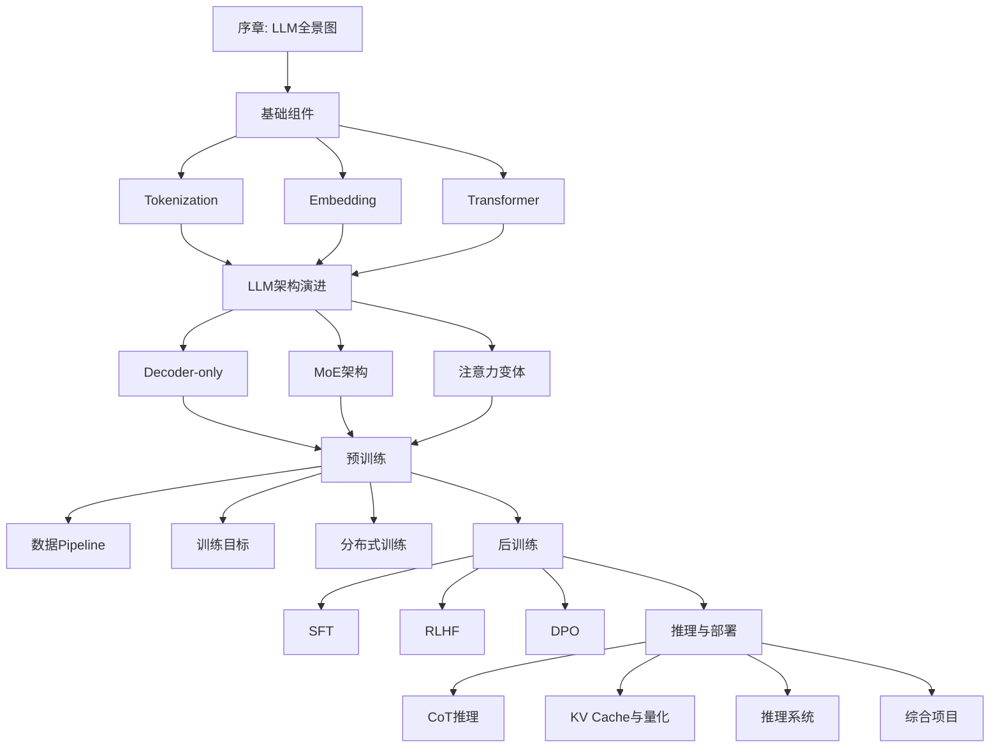

# LLM学习教程：从零手搓大语言模型

> **面向对象**：掌握了反向传播、神经网络等算法，以及微积分、线性代数、概率与统计等数学知识的大学生。理论能力强，希望提升动手实践能力。
> 
> **学习目标**：系统掌握LLM的核心原理与工业界实践，最终能够从零训练一个完整的对话模型。

---

## 教程特色

- **数学严谨**：每个算法都配有详细的数学推导，从原理到实现
- **工业实践**：重点关注Google和DeepSeek的技术路线
- **工程化**：不只是玩具代码，而是真实可运行的工程实现
- **可视化**：大量Mermaid图表辅助理解
- **项目驱动**：贯穿全教程的综合项目，从零手搓LLM

---

## 目录结构

```
LLM learning/
├── 00_overview/              # 序章：LLM全景图与学习路径
├── 01_tokenization/          # 模块1：分词
├── 02_embedding/             # 模块2：嵌入与位置编码
├── 03_transformer/           # 模块3：Transformer核心架构
├── 04_decoder_only/          # 模块4：Decoder-only架构族
├── 05_moe/                   # 模块5：MoE混合专家架构
├── 06_attention_variants/    # 模块6：注意力机制变体
├── 07_data_pipeline/         # 模块7：数据Pipeline
├── 08_training_objectives/   # 模块8：训练目标与课程学习
├── 09_distributed_training/  # 模块9：分布式训练
├── 10_sft/                   # 模块10：SFT监督微调
├── 11_rlhf/                  # 模块11：RLHF与PPO
├── 12_dpo/                   # 模块12：DPO及其变体
├── 13_cot/                   # 模块13：CoT与推理增强
├── 14_kv_cache_quantization/ # 模块14：KV Cache与量化
├── 15_inference_systems/     # 模块15：高效推理系统
├── final_project/            # 综合项目：从零手搓LLM
├── code/                     # 公共代码库
└── assets/                   # 图片资源
```

---

## 学习路径



---

## 环境配置

```bash
# 创建conda环境
conda create -n llm-learning python=3.10
conda activate llm-learning

# 安装PyTorch (根据你的CUDA版本选择)
pip install torch torchvision torchaudio --index-url https://download.pytorch.org/whl/cu118

# 安装其他依赖
pip install transformers datasets tokenizers sentencepiece
pip install wandb tensorboard
pip install flash-attn --no-build-isolation
pip install deepspeed accelerate
pip install vllm auto-gptq autoawq
```

详细环境配置见 [环境配置指南](./00_overview/environment_setup.md)。

---

## 章节概览

| 模块 | 主题 | 核心内容 | 工业界参考 |
|------|------|----------|----------|
| 00 | LLM全景图 | 发展历史、技术路线图 | 全行业 |
| 01 | Tokenization | BPE/WordPiece/Unigram | SentencePiece, Tiktoken |
| 02 | Embedding | RoPE/ALiBi/YaRN | Gemma, Llama |
| 03 | Transformer | Self-Attention, FFN, LayerNorm | 原版Transformer |
| 04 | Decoder-only | GPT, Llama架构 | GPT系列, Llama系列 |
| 05 | MoE | 混合专家、路由策略 | DeepSeek-V2/V3, Mixtral |
| 06 | 注意力变体 | GQA, MQA, MLA | DeepSeek-MLA, PaLM |
| 07 | 数据Pipeline | 采集、清洗、去重、质量评估 | C4, RefinedWeb |
| 08 | 训练目标 | LM目标、课程学习、Scaling Laws | PaLM, DeepSeek |
| 09 | 分布式训练 | 3D并行、ZeRO、混合精度 | Megatron, DeepSpeed |
| 10 | SFT | 指令微调、LoRA | Flan, Alpaca |
| 11 | RLHF | 奖励模型、PPO | InstructGPT, Gemini |
| 12 | DPO | DPO/KTO/ORPO/SimPO | DeepSeek, Claude |
| 13 | CoT | 思维链、自洽性、推理规划 | DeepSeek-R1, o1 |
| 14 | 量化与缓存 | KV Cache, GPTQ, AWQ | vLLM, llama.cpp |
| 15 | 推理系统 | Flash Attention, vLLM | DeepSeek推理系统 |

---

## 综合项目

本教程的核心目标是带你**从零手搓一个完整的LLM**：

- **模型规模**：约300M-1B参数
- **训练数据**：TinyStories + 自建指令数据
- **架构设计**：借鉴Llama/DeepSeek
- **训练流程**：预训练 → SFT → DPO
- **部署推理**：量化部署、vLLM服务

详见 [综合项目](./final_project/README.md)。

---

## 参考资源

- [The Illustrated Transformer](https://jalammar.github.io/illustrated-transformer/)
- [Andrej Karpathy: Let's build GPT](https://www.youtube.com/watch?v=kCc8FmEb1nY)
- [LLM Tutorial](https://github.com/karpathy/llm.c)
- [DeepSeek Technical Reports](https://github.com/deepseek-ai/DeepSeek-V2)
- [Google PaLM Paper](https://arxiv.org/abs/2204.02311)

---

## 作者

本教程由AI辅助编写，遵循严谨的数学推导和工程实践原则。

---

## License

MIT License
