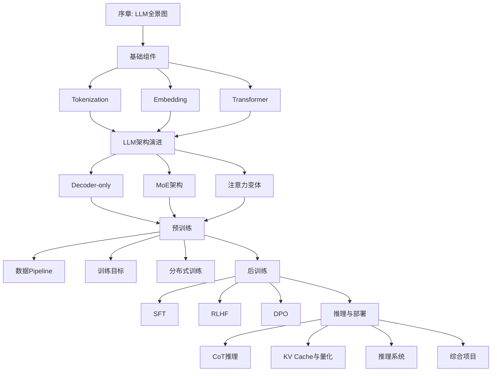

# LLM学习教程：从零手搓大语言模型

> **面向对象**：掌握了反向传播、神经网络等算法，以及微积分、线性代数、概率与统计等数学知识的大学生。理论能力强，希望提升动手实践能力。
> 
> **学习目标**：系统掌握LLM的核心原理与工业界实践，最终能够从零训练一个完整的对话模型。

---

## 教程特色

- **数学严谨**：每个算法都配有详细的数学推导，从原理到实现
- **工业实践**：Google、DeepSeek、Anthropic 三条技术线贯穿全教程
- **工程化**：不只是玩具代码，而是真实可运行的工程实现
- **可视化**：大量Mermaid图表辅助理解
- **项目驱动**：贯穿全教程的综合项目，从零手搓LLM

---

## 目录结构

```
LLM learning/
├── 00_overview/               # 序章：LLM全景图与学习路径
├── 01_tokenization/           # 模块1：分词（BPE/WordPiece/Unigram）
├── 02_embedding/              # 模块2：嵌入与位置编码（RoPE/ALiBi）
├── 03_transformer/            # 模块3：Transformer核心架构
├── 04_decoder_only/           # 模块4：Decoder-Only架构族（GPT/Llama）
├── 05_attention_variants/     # 模块5：注意力机制变体（GQA/MQA/MLA）
├── 06_moe/                    # 模块6：MoE混合专家架构
├── 07_data_engineering/       # 模块7：数据工程与Pipeline
├── 08a_pretraining_objectives/# 模块8a：预训练目标（CLM/MLM/PrefixLM）
├── 08b_scaling_laws/          # 模块8b：缩放定律（Chinchilla/Kaplan）
├── 08c_training_engineering/  # 模块8c：训练工程（混合精度/梯度检查点）
├── 09_distributed/            # 模块9：分布式训练（3D并行/FSDP/ZeRO）
├── 10_sft/                    # 模块10：SFT监督微调（LoRA/QLoRA）
├── 11_rlhf/                   # 模块11：RLHF与PPO
├── 12_dpo/                    # 模块12：DPO及其变体（KTO/ORPO/SimPO）
├── 13_reasoning/              # 模块13：CoT与推理（思维链/自洽性）
├── 14_inference/              # 模块14：推理加速（KV Cache/量化/vLLM）
├── 15_rag/                    # 模块15：RAG检索增强生成
├── 16_frontiers/              # 模块16：前沿专题（多模态/长上下文/Agent）
├── 17_synthetic_data/         # 模块17(补充)：合成数据与自我进化
├── final_project/             # 终极项目：从零训练完整LLM
├── code/                      # 各模块代码实现
└── assets/                    # 图片资源
```

---

## 学习路径



---

## 全局知识依赖图

> 下图展示了 17 个模块之间的**知识依赖关系**。实线箭头表示"必须先学"，虚线箭头表示"有帮助但非必需"。

```mermaid
graph LR
    subgraph 基础层["🔤 基础组件 (模块 0-3)"]
        M0["00 序章<br/>LLM全景图"]
        M1["01 分词<br/>BPE/WordPiece/Unigram"]
        M2["02 嵌入<br/>RoPE/ALiBi/YaRN"]
        M3["03 Transformer<br/>Attention/FFN/Norm"]
    end

    subgraph 架构层["🏗️ 架构演进 (模块 4-6)"]
        M4["04 Decoder-Only<br/>GPT→Llama→Gemma"]
        M5["05 注意力变体<br/>MQA/GQA/MLA"]
        M6["06 MoE<br/>混合专家/路由"]
    end

    subgraph 预训练层["⚡ 预训练 (模块 7-9)"]
        M7["07 数据工程<br/>采集/清洗/去重"]
        M8A["08A 预训练目标<br/>CLM/MLM/FIM"]
        M8B["08B Scaling Laws<br/>Chinchilla/Kaplan"]
        M8C["08C 训练工程<br/>混合精度/优化器"]
        M9["09 分布式训练<br/>3D并行/FSDP"]
    end

    subgraph 对齐层["🎯 后训练对齐 (模块 10-12)"]
        M10["10 SFT<br/>LoRA/QLoRA"]
        M11["11 RLHF<br/>PPO/GRPO"]
        M12["12 DPO<br/>KTO/SimPO/SPPO"]
    end

    subgraph 应用层["🚀 推理与应用 (模块 13-16)"]
        M13["13 推理/CoT<br/>思维链/Test-Time Compute"]
        M14["14 推理加速<br/>KV Cache/量化/vLLM"]
        M15["15 RAG<br/>检索增强/GraphRAG"]
        M16["16 前沿专题<br/>多模态/Agent/安全"]
    end

    FP["🎓 终极项目<br/>从零训练完整 LLM"]

    %% 基础层内部
    M0 --> M1
    M0 --> M2
    M1 --> M3
    M2 --> M3

    %% 基础 → 架构
    M3 --> M4
    M3 --> M5
    M4 --> M6

    %% 架构 → 预训练
    M4 --> M8A
    M5 -.-> M9
    M6 -.-> M9
    M4 --> M7

    %% 预训练内部
    M7 --> M8A
    M8A --> M8B
    M8B --> M8C
    M8C --> M9

    %% 预训练 → 对齐
    M9 --> M10
    M10 --> M11
    M11 --> M12

    %% 对齐 → 应用
    M12 --> M13
    M5 --> M14
    M10 -.-> M14
    M13 -.-> M14
    M14 -.-> M15
    M15 -.-> M16

    %% 汇聚到终极项目
    M9 --> FP
    M12 --> FP
    M14 -.-> FP

    %% 样式
    style M0 fill:#e1f5fe
    style M1 fill:#e1f5fe
    style M2 fill:#e1f5fe
    style M3 fill:#e1f5fe
    style M4 fill:#e8f5e9
    style M5 fill:#e8f5e9
    style M6 fill:#e8f5e9
    style M7 fill:#fff3e0
    style M8A fill:#fff3e0
    style M8B fill:#fff3e0
    style M8C fill:#fff3e0
    style M9 fill:#fff3e0
    style M10 fill:#fce4ec
    style M11 fill:#fce4ec
    style M12 fill:#fce4ec
    style M13 fill:#f3e5f5
    style M14 fill:#f3e5f5
    style M15 fill:#f3e5f5
    style M16 fill:#f3e5f5
    style FP fill:#fff9c4
```



---

## 环境配置

```bash
# 创建conda环境
conda create -n llm-learning python=3.10
conda activate llm-learning

# 安装PyTorch (根据你的CUDA版本选择)
pip install torch torchvision torchaudio --index-url https://download.pytorch.org/whl/cu118

# 安装其他依赖
pip install transformers datasets tokenizers sentencepiece
pip install wandb tensorboard
pip install flash-attn --no-build-isolation
pip install deepspeed accelerate
pip install vllm auto-gptq autoawq
```

详细环境配置见 [环境配置指南](./00_overview/environment_setup.md)。

---

## 章节概览

| 模块  | 主题           | 核心内容                           | 工业界参考                         |
| --- | ------------ | ------------------------------ | ----------------------------- |
| 00  | LLM全景图       | 发展历史、技术路线图、学习路径                | 全行业                           |
| 01  | Tokenization | BPE/WordPiece/Unigram          | SentencePiece, Tiktoken       |
| 02  | Embedding    | 词嵌入、RoPE/ALiBi/YaRN            | Gemma, Llama                  |
| 03  | Transformer  | Self-Attention, FFN, LayerNorm | 原版Transformer                 |
| 04  | Decoder-Only | GPT → Llama 架构演进               | GPT系列, Llama系列                |
| 05  | 注意力变体        | GQA, MQA, MLA, Flash Attention | DeepSeek-MLA, PaLM            |
| 06  | MoE          | 混合专家、路由策略、负载均衡                 | DeepSeek-V2/V3, Mixtral       |
| 07  | 数据工程         | 采集、清洗、去重、质量评估                  | C4, RefinedWeb, SlimPajama    |
| 08a | 预训练目标        | CLM, MLM, PrefixLM, UL2        | PaLM, T5, GPT                 |
| 08b | 缩放定律         | Kaplan/Chinchilla Scaling Laws | Chinchilla, DeepSeek          |
| 08c | 训练工程         | 混合精度、梯度检查点、Optimizer           | Megatron, PaLM                |
| 09  | 分布式训练        | 3D并行、ZeRO、FSDP                 | Megatron, DeepSpeed           |
| 10  | SFT          | 指令微调、LoRA/QLoRA                | Flan, Alpaca, LLaMA-Factory   |
| 11  | RLHF         | 奖励模型、PPO、GRPO                  | InstructGPT, DeepSeek-R1      |
| 12  | DPO          | DPO/KTO/ORPO/SimPO             | DeepSeek, Claude              |
| 13  | 推理与CoT       | 思维链、自洽性、Test-Time Compute      | DeepSeek-R1, o1/o3            |
| 14  | 推理加速         | KV Cache, 量化(GPTQ/AWQ), 推理系统   | vLLM, llama.cpp, TensorRT-LLM |
| 15  | RAG          | 检索增强生成、向量数据库、评估                | Perplexity, Google Search     |
| 16  | 前沿专题         | 多模态、长上下文、Agent、安全对齐            | GPT-4V, Claude, Gemini        |
| 17  | 合成数据（补充）     | Self-Instruct/Evol-Instruct, 质量过滤, Self-Play | Phi, DeepSeek-R1, Constitutional AI |

---

## 终极项目

本教程的核心目标是带你**从零训练一个完整的 LLM**。终极项目将前面 17 个模块的知识串联起来，完整经历：

```
数据准备 → 分词器训练 → 模型构建 → 预训练 → SFT 微调 → DPO 对齐 → 评估与部署
```

提供两个版本：
- **Version A (300M 参数)**：单卡 24GB GPU，数小时~1天完成，适合入门
- **Version B (1B 参数)**：4-8 卡 GPU，数天完成，适合进阶挑战

项目提供完整的代码框架（文件结构、接口定义、实现提示），核心算法由学生自己填充实现。

详见 [终极项目指南](./final_project/README.md)。

---

## 参考资源

- [The Illustrated Transformer](https://jalammar.github.io/illustrated-transformer/)
- [Andrej Karpathy: Let's build GPT](https://www.youtube.com/watch?v=kCc8FmEb1nY)
- [LLM Tutorial](https://github.com/karpathy/llm.c)
- [DeepSeek Technical Reports](https://github.com/deepseek-ai/DeepSeek-V2)
- [Google PaLM Paper](https://arxiv.org/abs/2204.02311)

---

## 作者

本教程由AI辅助编写，遵循严谨的数学推导和工程实践原则。

---

## License

MIT License
