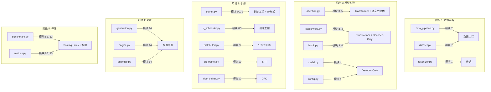
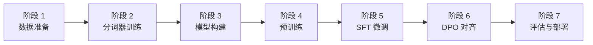

# 终极项目：从零训练一个完整 LLM

> **这是整个教程的综合实践项目。** 你将把前面 17 个模块学到的知识整合起来，从数据准备到模型部署，完整地训练一个对话语言模型。

---

## 项目目标

从零构建一个完整的 LLM，经历 **预训练 → SFT → DPO → 评估 → 部署** 的全流程。

提供两个版本：

| | Version A (300M) | Version B (1B) |
|---|---|---|
| **参数量** | ~300M | ~1B |
| **GPU 需求** | 单卡 24GB | 4-8 卡 |
| **训练数据** | ~3-6B tokens | ~20-50B tokens |
| **训练时间** | 数小时~1天 | 数天 |
| **适合场景** | 入门实践、个人 GPU | 实验室/云服务器 |

**建议路径**：先完成 Version A，确认全流程跑通后再挑战 Version B。

---

## 知识串联地图

### 从教程到实践：为什么这个项目是"终极"的？

这个终极项目不是让你"抄一遍前面模块的代码"——而是检验你是否真正**理解**了每个组件背后的原理，并能在没有模板代码的情况下**从零重新实现**它们。前 16 个模块分别教会你一项关键技术，本项目要求你把它们像拼图一样组装成一个完整的系统。这意味着你不仅需要理解每个组件的内部原理，还需要理解**组件之间的接口和数据流**。

以下表格展示了项目中每个核心实现文件与教程模块的对应关系：

| 实现文件 | 对应模块 | 核心知识点 | 你需要掌握的能力 |
|----------|---------|-----------|-----------------|
| `tokenizer.py` | 模块 1 (分词) | BPE 算法、子词分割、byte fallback | 理解压缩率与词表大小的权衡 |
| `data_pipeline.py` / `dataset.py` | 模块 7 (数据工程) | 数据清洗、去重、memmap 存储 | 构建高效的数据加载管道 |
| `attention.py` (RoPE) | 模块 3 (Transformer) + 模块 5 (注意力变体) | 旋转位置编码的数学推导 | 从公式到代码的转化能力 |
| `attention.py` (GQA) | 模块 5 (注意力变体) | 分组查询注意力、KV 头共享 | 理解 MHA/MQA/GQA 的效率权衡 |
| `feedforward.py` | 模块 3 (Transformer) + 模块 4 (Decoder-Only) | SwiGLU 门控机制、FFN 维度选择 | 理解为什么 8/3 比 4 更好 |
| `block.py` | 模块 3 (Transformer) + 模块 4 (Decoder-Only) | RMSNorm、Pre-Norm 残差连接 | 组装 Attention + FFN 的能力 |
| `model.py` | 模块 4 (Decoder-Only) | 完整模型组装、权重初始化 | 架构设计与参数量计算 |
| `trainer.py` | 模块 8C (训练工程) + 模块 9 (分布式训练) | 梯度累积、混合精度、checkpoint | 工程化训练循环的实现 |
| `lr_scheduler.py` | 模块 8C (训练工程) | Cosine decay、warmup 策略 | 学习率调度对收敛的影响 |
| `distributed.py` | 模块 9 (分布式训练) | FSDP、All-Reduce、数据并行 | 多卡训练的通信与同步 |
| `sft_trainer.py` | 模块 10 (SFT) | 指令微调、LoRA、对话模板 | 从"续写"到"遵循指令"的转变 |
| `dpo_trainer.py` | 模块 12 (DPO) | 偏好优化、参考模型、log-prob 计算 | 对齐技术的数学与实现 |
| `generation.py` | 模块 14 (推理加速) | KV Cache、采样策略、temperature | 高效推理的工程实现 |
| `benchmark.py` / `metrics.py` | 模块 8B (Scaling Laws) + 模块 13 (推理) | 困惑度、下游任务评估 | 科学地衡量模型能力 |

> **提示**: 如果某个文件的实现让你感到困难，回到对应模块重新复习相关理论。理解原理后再写代码，远比"照着参考代码改"学到得多。

本项目的每个文件都对应教程中的一个或多个模块。下图展示了这个映射关系：



---

## 架构设计

### Version A: 300M 参数

| 参数 | 值 | 说明 |
|------|---|------|
| 层数 (n_layers) | 24 | 模型深度 |
| 隐藏维度 (d_model) | 1024 | 模型宽度 |
| 注意力头数 (n_heads) | 16 | Q 头数，head_dim = 64 |
| KV 头数 (n_kv_heads) | 4 | GQA，每 4 个 Q 头共享 1 组 KV |
| FFN 维度 (d_ff) | 2730 | SwiGLU，≈ 8/3 × d_model |
| 词汇表 (vocab_size) | 32,000 | BPE 分词器 |
| 最大序列长度 | 2048 | 影响 KV Cache 大小 |
| 位置编码 | RoPE (base=10000) | 旋转位置编码 |
| 归一化 | RMSNorm | 比 LayerNorm 更快 |
| 激活函数 | SwiGLU | 门控线性单元 |

### Version B: 1B 参数

在 Version A 基础上扩大：d_model=2048, n_layers=32, n_heads=32, n_kv_heads=8, vocab=64K, seq_len=4096。详见 `configs/model_1b.yaml`。

---

## 实施路线图

### 总览



### 阶段 1：数据准备

> **对应模块**: [模块 7 - 数据工程](../07_data_engineering/README.md)

**目标**: 准备预训练所需的文本数据

**需要实现的文件**:
- `src/data/data_pipeline.py` → `download_and_prepare()`, `tokenize_and_save()`

**推荐数据集**:
- **入门 (小规模)**: [TinyStories](https://huggingface.co/datasets/roneneldan/TinyStories) — ~2M 条短故事，适合小模型快速验证
- **进阶 (中规模)**: SlimPajama 子集 — 从 627B tokens 中采样 5-10B tokens
- **中文**: WuDaoCorpora 或 SkyPile 子集

**关键步骤**:
1. 下载并清洗原始文本
2. 质量过滤（去除重复、低质量文本）
3. 保存为纯文本文件供分词器训练使用

**验证方法**: 检查输出文件大小和样本内容是否合理

**常见陷阱**:
- 数据中的 HTML 标签和特殊字符需要清理
- 中英文混合数据需要保证比例合理

---

### 阶段 2：分词器训练

> **对应模块**: [模块 1 - 分词](../01_tokenization/README.md)

**目标**: 训练 BPE 分词器

**需要实现的文件**:
- `src/data/tokenizer.py` → `Tokenizer.train()`, `encode()`, `decode()`

**运行脚本**: `python scripts/train_tokenizer.py --input data/train.txt --output tokenizer/llm --vocab_size 32000`

**关键决策**:
- 词汇表大小: 32K（Version A）或 64K（Version B）
- 字符覆盖率: 0.9995（适合中文）
- 特殊 token: `<pad>`, `<unk>`, `<bos>`, `<eos>`, 以及 SFT 阶段的对话 token

**验证方法**:
- 编码一些中英文文本，检查 token 数量是否合理
- 确认特殊 token 的 ID 正确
- `tokenizer.decode(tokenizer.encode("测试"))` 应该还原原文

---

### 阶段 3：模型构建

> **对应模块**: [模块 3 - Transformer](../03_transformer/README.md), [模块 4 - Decoder-Only](../04_decoder_only/README.md), [模块 5 - 注意力变体](../05_attention_variants/README.md)

**目标**: 实现完整的 Decoder-Only Transformer

**需要实现的文件**（按推荐顺序）:
1. `src/model/block.py` → `RMSNorm`（最简单，从这里开始）
2. `src/model/feedforward.py` → `SwiGLUFeedForward`
3. `src/model/attention.py` → `RotaryPositionEmbedding`, `GQAAttention`（最有挑战性）
4. `src/model/block.py` → `TransformerBlock`（组装前面的组件）
5. `src/model/model.py` → `DecoderOnlyLM`（组装完整模型）

**验证方法**:
```python
from src.model.config import config_300m
from src.model.model import DecoderOnlyLM

model_config, _ = config_300m()
model = DecoderOnlyLM(model_config)
print(f"参数量: {model.count_parameters():,}")  # 应约 300M

# 测试前向传播
import torch
x = torch.randint(0, 32000, (2, 128))
output = model(x, labels=x)
print(f"Loss: {output['loss'].item():.4f}")  # 初始 loss 应接近 ln(32000) ≈ 10.37
print(f"Logits shape: {output['logits'].shape}")  # [2, 128, 32000]
```

**常见陷阱**:
- GQA 中 KV 头的广播操作容易出错（`repeat_interleave` vs `expand`）
- RoPE 的维度对齐需要仔细处理
- 因果掩码必须正确（上三角为 -inf，不能弄反）
- 权重初始化的残差分支缩放不要忘记

---

### 阶段 4：预训练

> **对应模块**: [模块 8A - 预训练目标](../08a_pretraining_objectives/README.md), [模块 8C - 训练工程](../08c_training_engineering/README.md), [模块 9 - 分布式训练](../09_distributed/README.md)

**目标**: 在大规模文本上进行下一 token 预测（NTP）预训练

**需要实现的文件**:
- `src/data/dataset.py` → `PretrainDataset`
- `src/training/lr_scheduler.py` → `get_cosine_schedule_with_warmup()`
- `src/training/trainer.py` → `Trainer` 的所有方法
- (Version B) `src/training/distributed.py` → `setup_distributed()`, `wrap_model_fsdp()`

**运行脚本**: `python scripts/pretrain.py --config configs/model_300m.yaml --tokenizer tokenizer/llm.model --data_dir data/`

**关键超参数** (Version A):
- 学习率: 3e-4（cosine decay，预热 2000 步）
- Batch size: 8 × 4 = 32（micro_batch × gradient_accumulation）
- 每步 tokens: 32 × 2048 = 65,536
- 混合精度: BF16
- 梯度检查点: 开启

**验证方法**:
- Loss 应从 ~10.4（ln(32000)）逐步下降
- 1000 步后 loss 应降至 5-7
- 训练结束时 loss 应在 3-4
- 困惑度应在 20-50 范围

**常见陷阱**:
- 参见 [docs/troubleshooting.md](docs/troubleshooting.md) 的详细排错指南

---

### 阶段 5：SFT 指令微调

> **对应模块**: [模块 10 - SFT](../10_sft/README.md)

**目标**: 让预训练模型学会遵循指令和对话

**需要实现的文件**:
- `src/data/dataset.py` → `SFTDataset`
- `src/training/sft_trainer.py` → `SFTTrainer`

**推荐数据集**:
- [Alpaca](https://github.com/tatsu-lab/stanford_alpaca) — 52K 英文指令
- [MOSS-SFT](https://huggingface.co/datasets/fnlp/moss-002-sft-data) — 中文指令
- [ShareGPT](https://huggingface.co/datasets/anon8231489123/ShareGPT_Vicuna_unfiltered) — 多轮对话

**运行脚本**: `python scripts/sft.py --config configs/model_300m.yaml --pretrain_ckpt checkpoints/300m/final.pt --data sft_data.json --tokenizer tokenizer/llm.model --use_lora`

**验证方法**:
- 用几个指令测试模型的回复质量
- 对比 SFT 前后的生成差异（SFT 前是续写，SFT 后应能遵循指令）

---

### 阶段 6：DPO 偏好对齐

> **对应模块**: [模块 12 - DPO](../12_dpo/README.md)

**目标**: 通过人类偏好数据优化模型的回答质量和安全性

**需要实现的文件**:
- `src/data/dataset.py` → `DPODataset`
- `src/training/dpo_trainer.py` → `DPOTrainer`

**推荐数据集**:
- [HH-RLHF](https://huggingface.co/datasets/Anthropic/hh-rlhf) — Anthropic 的人类偏好数据
- [UltraFeedback](https://huggingface.co/datasets/openbmb/UltraFeedback) — 大规模偏好

**运行脚本**: `python scripts/dpo.py --config configs/model_300m.yaml --sft_ckpt checkpoints/300m/sft_final.pt --data dpo_data.json --tokenizer tokenizer/llm.model`

**验证方法**:
- DPO loss 应逐步下降
- 对比 DPO 前后对同一问题的回答
- 检查模型是否能正确拒绝有害请求

---

### 阶段 7：评估与部署

> **对应模块**: [模块 14 - 推理加速](../14_inference/README.md), [模块 8B - Scaling Laws](../08b_scaling_laws/README.md)

**目标**: 评估模型质量并部署推理服务

**需要实现的文件**:
- `src/model/generation.py` → `TextGenerator`
- `src/evaluation/benchmark.py` → `Evaluator`
- `src/evaluation/metrics.py` → 各评估指标
- `src/inference/engine.py` → `InferenceEngine`（可选优化）
- `src/inference/quantize.py` → 量化（可选）
- `src/inference/serve.py` → 推理服务（可选）

**评估方法**:
- **困惑度**: 在验证集上计算
- **下游任务**: 使用 [lm-eval-harness](https://github.com/EleutherAI/lm-evaluation-harness) 评估
- **人工评估**: 自己与模型对话，主观判断质量

---

## 工业实践参考

> 本节帮助你理解学生项目与工业级 LLM 训练之间的差距，以及工业界在训练过程中做出的关键工程决策。

### Google PaLM 的训练经验

Google 在训练 540B 参数的 PaLM 模型时，积累了大量工程经验：

- **Loss Spike 处理**: PaLM 训练过程中遇到了约 20 次 Loss Spike（loss 突然飙升数倍）。Google 团队的解决方案是：从 spike 发生前约 100 步的 checkpoint 恢复训练，并跳过导致 spike 的数据 batch。这意味着**保存频繁的 checkpoint 是工业训练的刚需**。
- **数据配比**: PaLM 使用了精心设计的多源数据混合比例（网页 27%、书籍 13%、维基百科 4%、代码 5%、社交对话 50% 等），不同的数据配比对模型的不同能力有显著影响。
- **训练硬件**: PaLM 540B 使用了 6144 块 TPU v4，训练持续数周。这个规模的训练需要极高的硬件可靠性和容错机制。

### DeepSeek V2/V3 的工程优化

DeepSeek 在模型训练中采用了多项前沿工程优化：

- **FP8 训练**: DeepSeek V3 是首个在大规模训练中全面采用 FP8 混合精度的开源模型。FP8 相比 BF16 可以将通信量和计算量进一步减半，但需要精心设计动态 Loss Scaling 策略来维持数值稳定性。
- **DualPipe 流水线并行**: DeepSeek 提出的 DualPipe 策略通过双向流水线调度，将计算与通信有效重叠，显著减少了 pipeline bubble（流水线气泡），在 MoE 架构下实现了接近线性的多卡扩展效率。
- **Per-tensor 量化**: DeepSeek V3 采用了 per-tensor 量化（而非 per-channel），在精度损失可控的前提下大幅简化了量化逻辑和硬件实现。

### 学生项目 vs 工业实践

| 维度 | 学生项目 (300M) | 工业实践 (>10B) |
|------|----------------|----------------|
| **参数量** | 300M-1B | 7B-540B+ |
| **训练数据** | 3-50B tokens | 1-15T tokens |
| **训练时间** | 数小时-数天 | 数周-数月 |
| **GPU 资源** | 1-8 卡 | 数百-数千卡 |
| **Loss Spike** | 罕见 | 几乎必然出现 |
| **容错机制** | 手动恢复 | 自动检测与恢复 |
| **数据工程** | 简单清洗 | 多阶段清洗+质量评分+配比优化 |

> **不要被差距吓到**: 工业实践的核心**原理**与你在 300M 项目中学到的完全一致。差距主要体现在规模带来的工程复杂性上。建议阅读 [PaLM 技术报告](https://arxiv.org/abs/2204.02311)、[DeepSeek V3 技术报告](https://arxiv.org/abs/2412.19437) 来理解工业决策背后的思考过程。

---

## 目录结构说明

```
final_project/
├── README.md                  # 本文件: 项目指南
├── configs/
│   ├── model_300m.yaml        # 300M 模型配置（✅ 已完成，直接使用）
│   └── model_1b.yaml          # 1B 模型配置（✅ 已完成，直接使用）
├── src/
│   ├── model/
│   │   ├── config.py          # 模型配置类（✅ 已完成，直接使用）
│   │   ├── attention.py       # GQA 注意力 + RoPE（🔲 需实现）
│   │   ├── feedforward.py     # SwiGLU FFN（🔲 需实现）
│   │   ├── block.py           # Transformer Block + RMSNorm（🔲 需实现）
│   │   ├── model.py           # 完整 LLM 模型（🔲 需实现）
│   │   └── generation.py      # 文本生成 + 采样策略（🔲 需实现）
│   ├── data/
│   │   ├── tokenizer.py       # BPE 分词器封装（🔲 需实现）
│   │   ├── dataset.py         # 数据集类（预训练/SFT/DPO）（🔲 需实现）
│   │   └── data_pipeline.py   # 数据下载与预处理（🔲 需实现）
│   ├── training/
│   │   ├── trainer.py         # 预训练训练器（🔲 需实现）
│   │   ├── sft_trainer.py     # SFT 训练器 + LoRA（🔲 需实现）
│   │   ├── dpo_trainer.py     # DPO 训练器（🔲 需实现）
│   │   ├── lr_scheduler.py    # 学习率调度器（🔲 需实现）
│   │   └── distributed.py     # 分布式训练封装（🔲 需实现, Version B）
│   ├── inference/
│   │   ├── engine.py          # 推理引擎（🔲 可选实现）
│   │   ├── quantize.py        # 量化工具（🔲 可选实现）
│   │   └── serve.py           # 推理服务（🔲 可选实现）
│   └── evaluation/
│       ├── benchmark.py       # 评估框架（🔲 需实现）
│       └── metrics.py         # 评估指标（🔲 需实现）
├── scripts/                   # 入口脚本（🔲 需实现，跟随各阶段完成）
├── docs/
│   ├── training_guide.md      # 训练全流程指南
│   ├── troubleshooting.md     # 常见问题排查
│   └── scaling_guide.md       # Version A → B 扩展指南
```

---

## 环境配置

```bash
# 创建环境
conda create -n llm-project python=3.10
conda activate llm-project

# 核心依赖
pip install torch --index-url https://download.pytorch.org/whl/cu118
pip install sentencepiece     # 分词器
pip install pyyaml            # 配置文件
pip install wandb             # 训练日志 (可选)
pip install numpy             # 数据处理

# 评估 (可选)
pip install lm-eval           # lm-eval-harness

# 加速 (可选)
pip install flash-attn --no-build-isolation    # Flash Attention
pip install bitsandbytes      # 量化支持
```

**GPU 需求**:
- Version A: 1× NVIDIA GPU, 24GB+ VRAM (RTX 3090, RTX 4090, A5000, A100)
- Version B: 4-8× NVIDIA GPU, 各 24GB+ VRAM

---

## 进度检查清单

### 阶段 1: 数据准备
- [ ] 下载并清洗训练数据
- [ ] 实现 `data_pipeline.py` 的数据预处理函数
- [ ] 准备训练集和验证集

### 阶段 2: 分词器
- [ ] 实现 `tokenizer.py` 的 `train()`, `encode()`, `decode()`
- [ ] 训练 BPE 分词器
- [ ] 验证编码-解码的正确性
- [ ] 将训练数据 tokenize 并保存为二进制格式

### 阶段 3: 模型
- [ ] 实现 `block.py` 的 `RMSNorm`
- [ ] 实现 `feedforward.py` 的 `SwiGLUFeedForward`
- [ ] 实现 `attention.py` 的 `RotaryPositionEmbedding` 和 `GQAAttention`
- [ ] 实现 `block.py` 的 `TransformerBlock`
- [ ] 实现 `model.py` 的 `DecoderOnlyLM`
- [ ] 验证: 参数量正确 (~300M)，前向传播无报错，初始 loss ≈ ln(vocab_size)

### 阶段 4: 预训练
- [ ] 实现 `dataset.py` 的 `PretrainDataset`
- [ ] 实现 `lr_scheduler.py` 的 cosine schedule
- [ ] 实现 `trainer.py` 的训练循环
- [ ] 运行预训练，观察 loss 曲线
- [ ] 验证: loss 从 ~10.4 降至 3-4

### 阶段 5: SFT
- [ ] 实现 `dataset.py` 的 `SFTDataset`
- [ ] 实现 `sft_trainer.py` 的训练逻辑
- [ ] 运行 SFT
- [ ] 验证: 模型能遵循指令

### 阶段 6: DPO
- [ ] 实现 `dataset.py` 的 `DPODataset`
- [ ] 实现 `dpo_trainer.py` 的 DPO 损失和训练
- [ ] 运行 DPO
- [ ] 验证: 模型回答质量提升

### 阶段 7: 评估与部署
- [ ] 实现评估指标和框架
- [ ] 实现 `generation.py` 的文本生成
- [ ] 计算最终困惑度和下游任务分数
- [ ] (可选) 量化 + 推理服务

### 进阶: Version B (1B)
- [ ] 实现 `distributed.py` 的分布式训练
- [ ] 使用 `configs/model_1b.yaml` 训练 1B 模型
- [ ] 对比 300M 和 1B 的性能差异

---

## 参考资源

- **Karpathy 的 nanoGPT**: https://github.com/karpathy/nanoGPT — 最佳入门参考
- **Llama 2 论文**: Touvron et al. (2023) — 架构设计的权威参考
- **Chinchilla 论文**: Hoffmann et al. (2022) — 训练 token 数的最优选择
- **DPO 论文**: Rafailov et al. (2023) — DPO 的数学推导
- **本教程各模块**: 每个阶段对应的教程模块中有详细的理论推导和代码参考
